# Heart 왜 리더인가
* 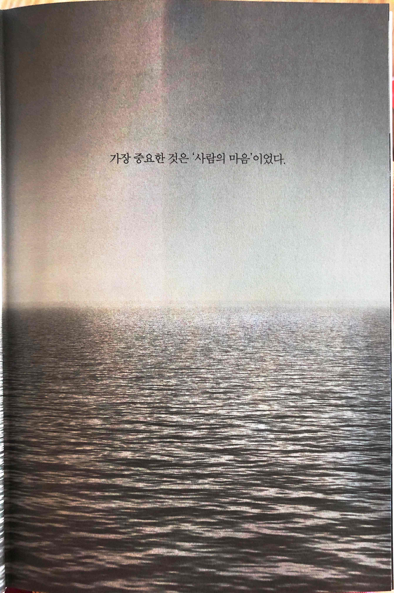

  * `가장 중요한 것은 '사람의 마음'이었다.`
* 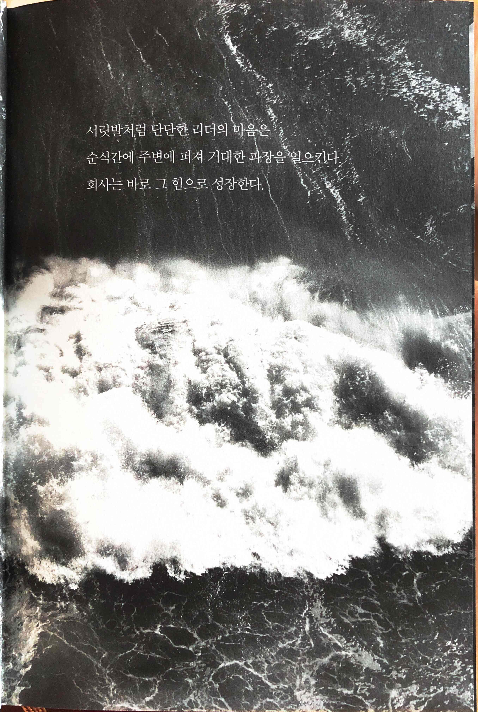

  * `서릿발처럼 단단한 리더의 마음은 순식간에 주변에 퍼져 거대한 파장을 일으킨다. 회사는 바로 그 힘으로 성장한다.`
* 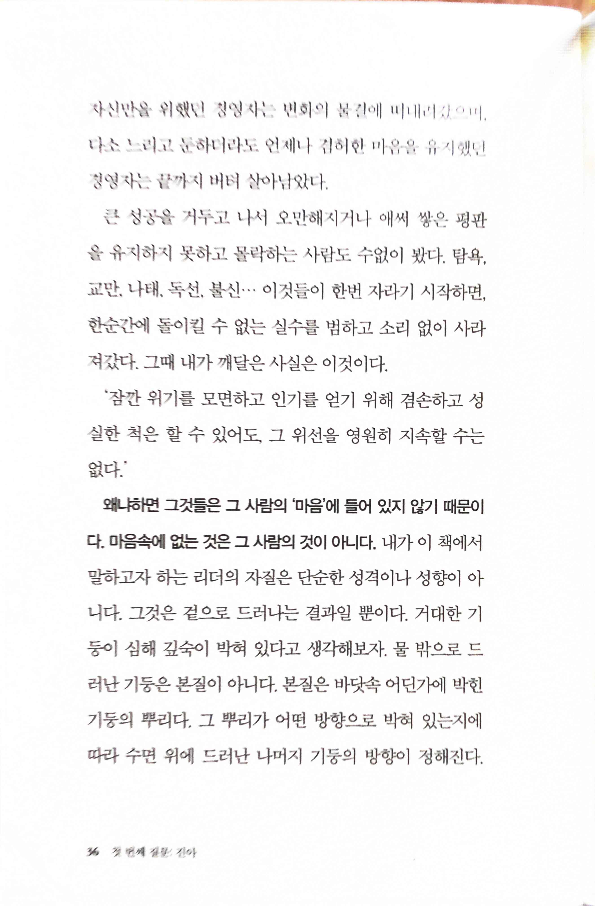 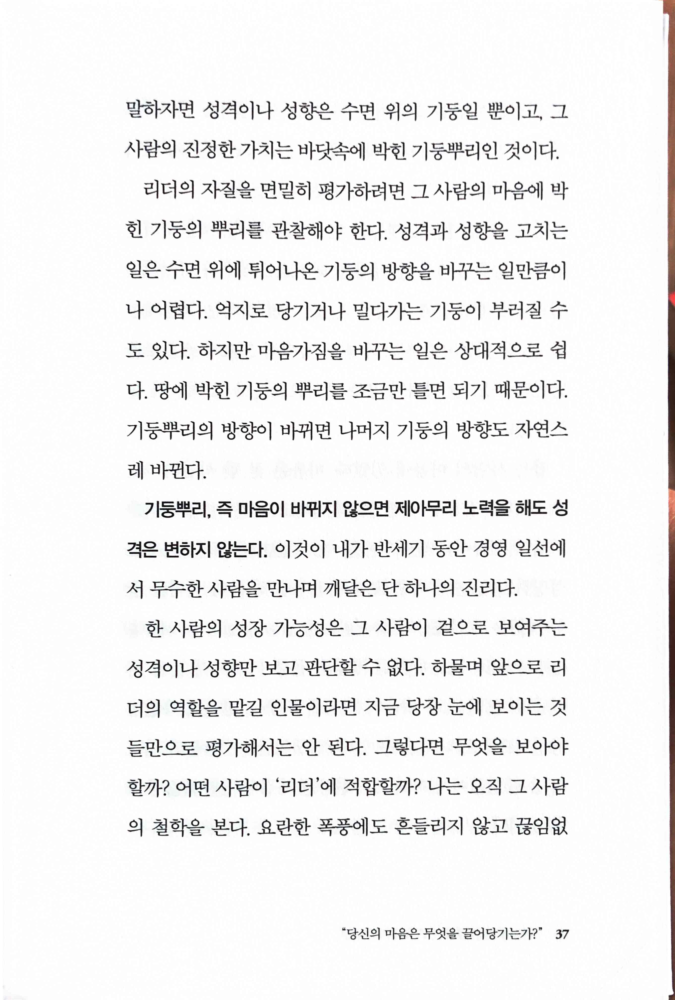

  * (거대한 기둥으로 비유하는 리더의 마음. 빙산의 일각과도 같은 비유일까?)
  * `어떤 사람이 '리더'에 적합할까? 나는 오직 그 사람의 철학을 본다.`
* 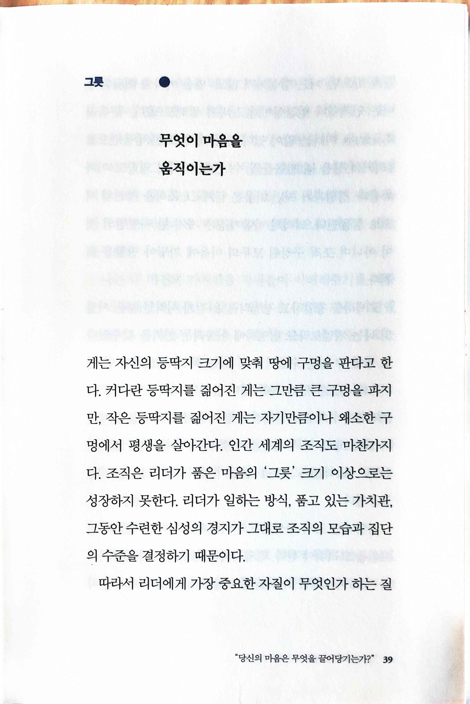

  * `조직은 리더가 품은 마음의 그릇 크기 이상으로는 성장하지 못한다. 리더가 일하는 방식, 품고 있는 가치관, 그동안 수련한 심성의 경지가 그대로 조직의 모습과 집단의 수준을 결정하기 때문이다.`
* 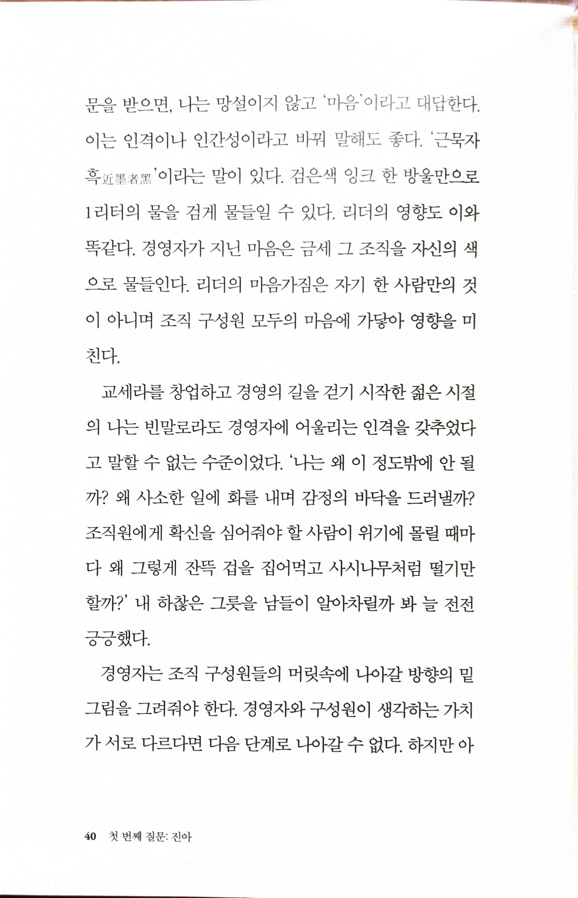

  * `경영자는 조직 구성원들의 머릿속에 나아갈 방향의 밑그림을 그려줘야 한다. 경영자와 구성원이 생각하는 가치가 서로 다르다면 다음 단계로 나아갈 수 없다.`
* 

  * `진아(眞我, 불교에서 모든 중생의 마음속에 있다고 믿는, 영원히 변하지 않고 소멸하지 않는 진정한 자아 - 역자 주)`
* 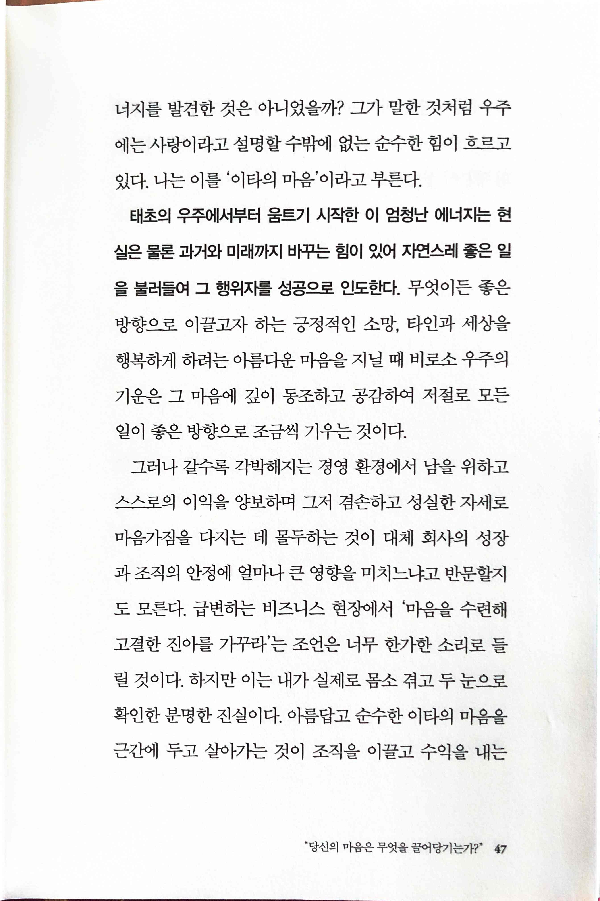

  * `급변하는 비즈니스 현장에서 마음을 수련해 고결한 진아를 가꾸라'는 조언은 너무 한가한 소리로 들릴 것이다. 하지만 이는 내가 실제로 몸소 겪고 두 눈으로 확인한 분명한 진실이다.`
* 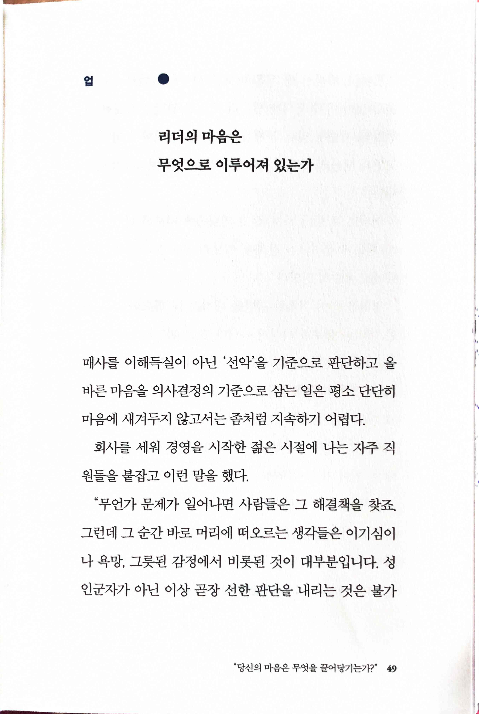 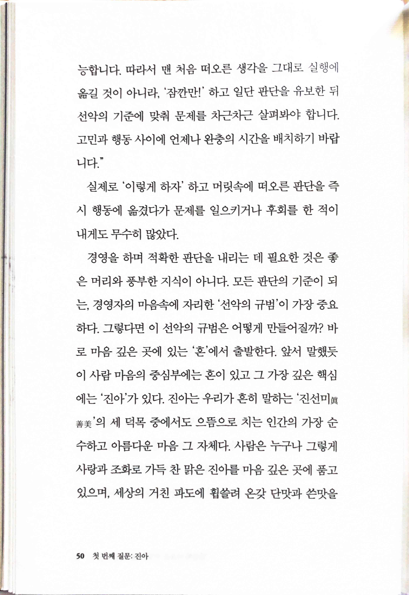

  * `"무언가 문제가 일어나면 사람들은 그 해결책을 찾죠. 그런데 그 순간 바로 머리에 떠오르는 생각들은 이기심이나 욕망, 그릇된 감정에서 비롯된 것이 대부분입니다. 성인군자가 아닌 이상 곧장 선한 판단을 내리는 것은 불가능합니다. 따라서 맨 처음 떠오른 생각을 그대로 실행에옮길 것이 아니라, '잠깐만!' 하고 일단 판단을 유보한 뒤선악의 기준에 맞춰 문제를 차근차근 살펴봐야 합니다.고민과 행동 사이에 언제나 완충의 시간을 배치하기 바랍니다.”`
  * (다른 부분은 불교에 귀의했던 사람의 말이기도 하고 워낙 경영의 대가이니 나 같은 범인에게는 동떨어진 그저 종교 서적같기도 하고 철학책 같기도 하지만 이 부분만큼은 누구에게나 실용적으로 받아들이기 좋은 부분)
* 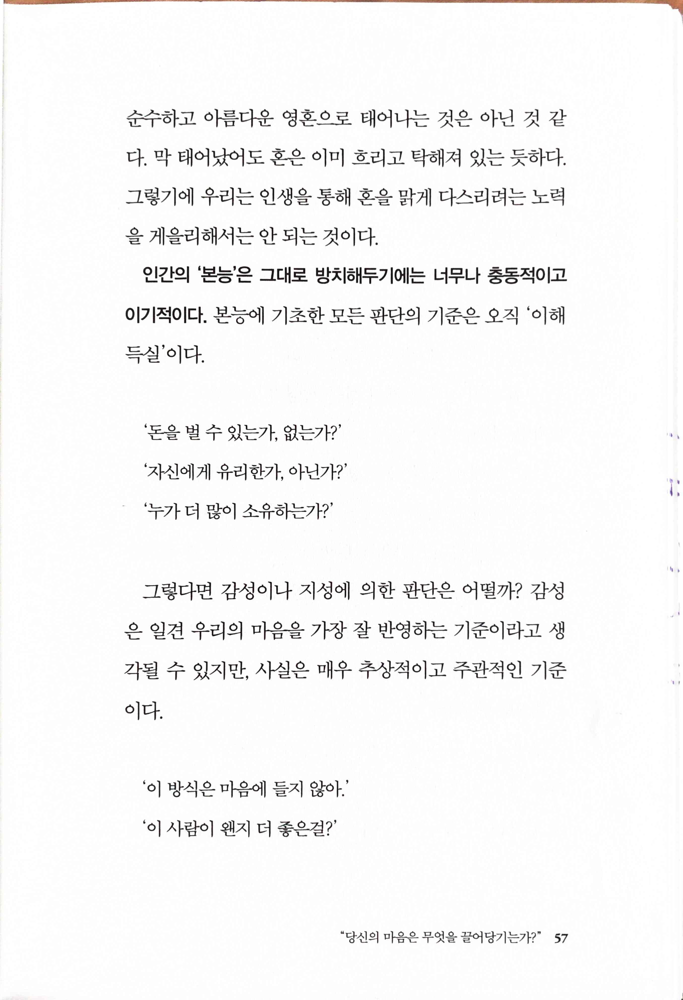 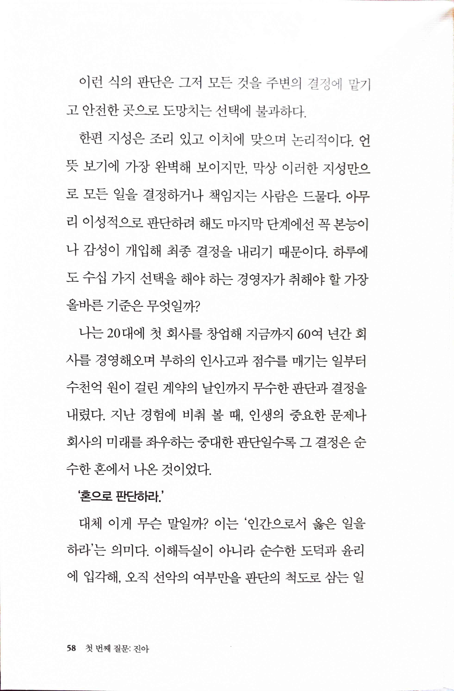

  * `인간의 '본능'은 그대로 방치해두기에는 너무나 충동적이고 이기적이다. 본능에 기초한 모든 판단의 기준은 오직 '이해득실'이다.`
    * (불교를 믿는 사람이지만 성악설을 받아들인걸까? 아무튼 나도 이렇게 생각하는 사람이라 동의)
  * `감성은 일견 우리의 마음을 가장 잘 반영하는 기준이라고 생각될 수 있지만, 사실은 매우 추상적이고 주관적인 기준이다.`
  * `지성은 조리 있고 이치에 맞으며 논리적이다. 언뜻 보기에 가장 완벽해 보이지만, 막상 이러한 지성만으로 모든 일을 결정하거나 책임지는 사람은 드물다. 아무리 이성적으로 판단하려 해도 마지막 단계에선 꼭 본능이나 감성이 개입해 최종 결정을 내리기 때문이다.`
  * `'혼으로 판단하라.'... 이는 '인간으로서 옳은 일을 하라'는 의미다.`
* 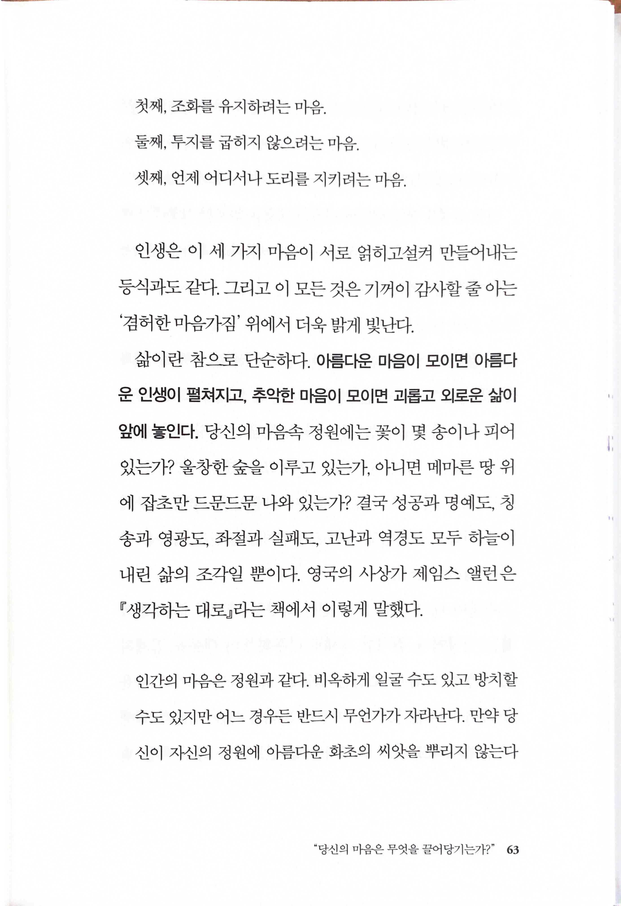

  * `결국 성공과 명예도, 칭송과 영광도, 좌절과 실패도 고난과 역경도 모두 하늘이 내린 삶의 조각일 뿐이다.`
* 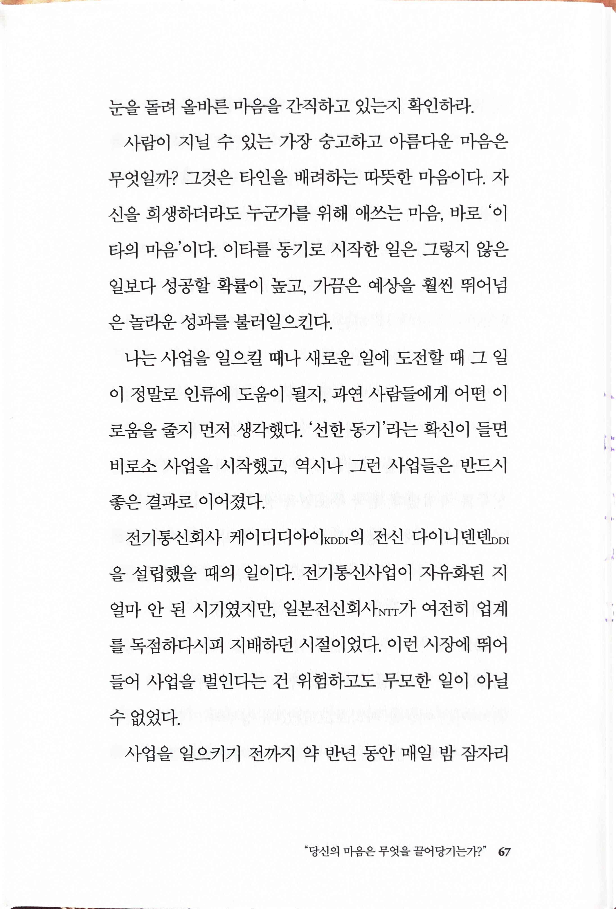

  * `이타를 동기로 시작한 일은 그렇지 않은 일보다 성공할 확률이 높고, 가끔은 예상을 훨씬 뛰어넘은 놀라운 성과를 불러일으킨다.`
* 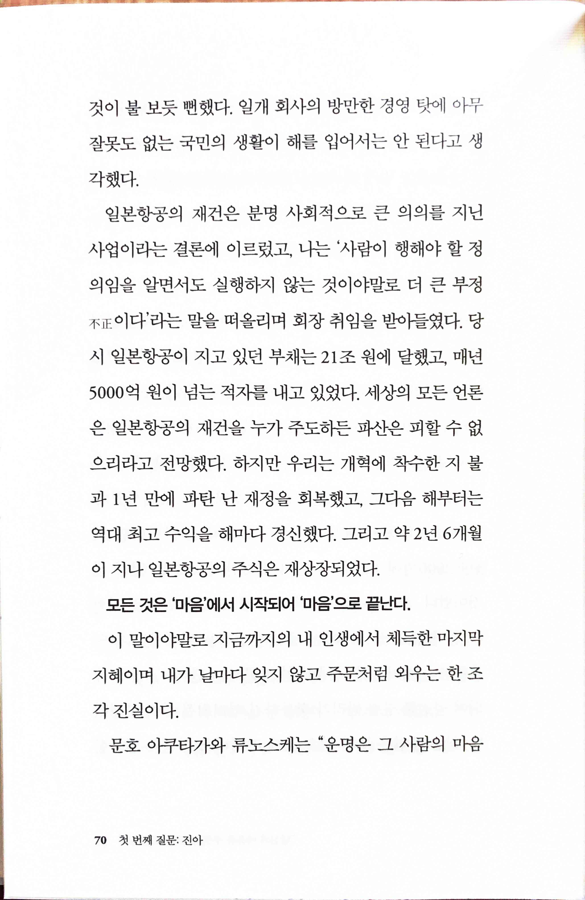

  * `모든 것은 '마음'에서 시작되어 '마음'으로 끝난다.`
* 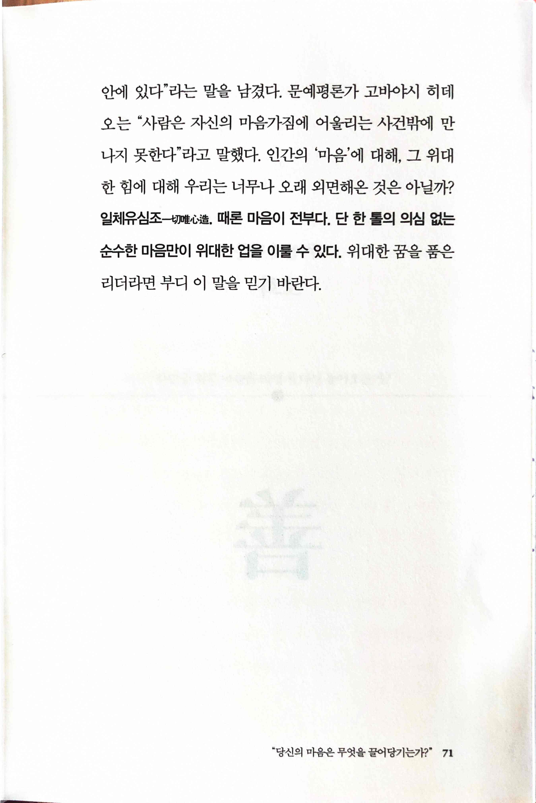

  * `일체유심조, 때론 마음이 전부다. 단 한 톨의 의심 없는 순수한 마음만이 위대한 업을 이룰 수 있다.`
* 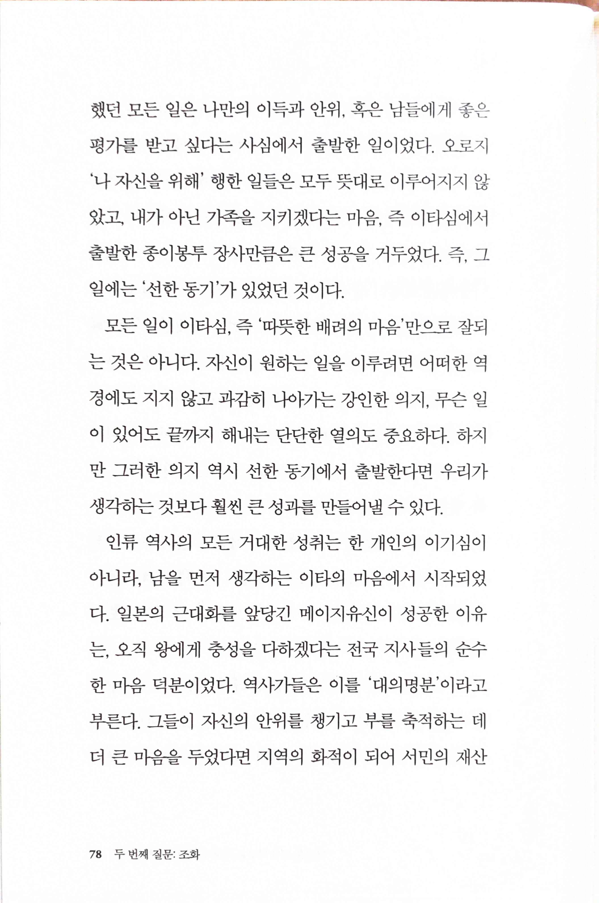 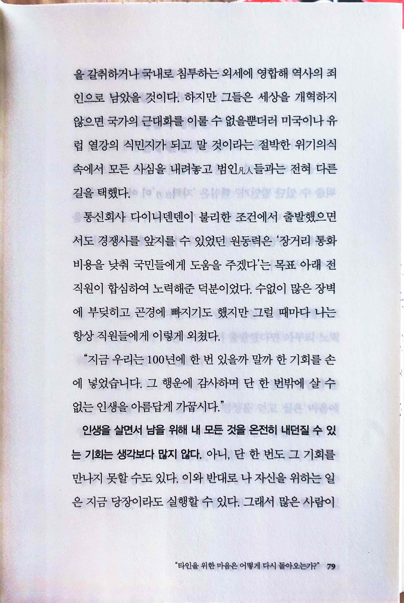

  * (일본인의 한계일까? 메이지 유신을 좋게만 평가한다는 건 아무래도 한국인의 입장에선 쉽게 받아들이기 어렵다. 물론 그 의의를 이해하지 못하는 건 아니지만, 결국 제국주의로 이어졌으니)
* 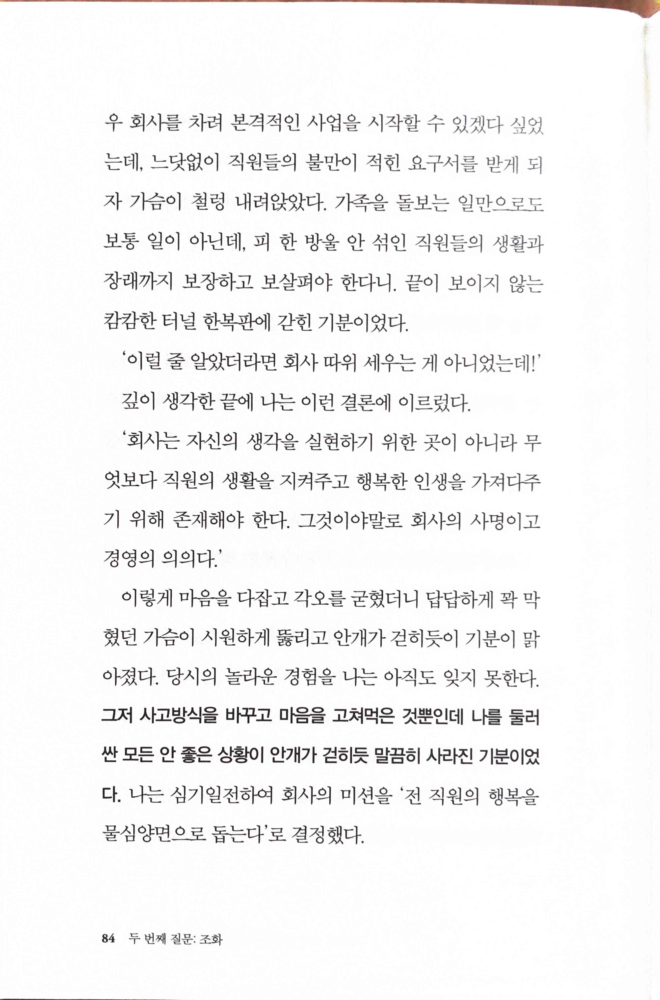

  * `그저 사고방식을 바꾸고 마음을 고쳐먹은 것뿐인데 나를 둘러싼 모든 안 좋은 상황이 안개가 걷히듯 말끔히 사라진 기분이었다`
* 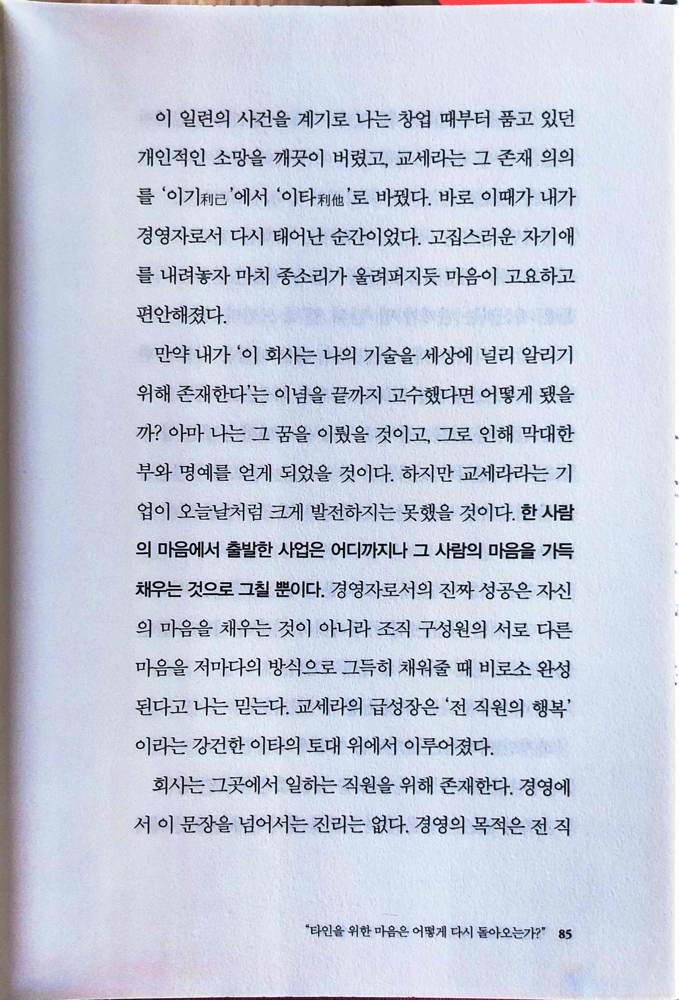

  * `경영자로서의 진짜 성공은 자신의 마음을 채우는 것이 아니라 조직 구성원의 서로 다른 마음을 저마다의 방식으로 그득히 채워줄 때 비로소 완성된다고 나는 믿는다. 교세라의 급성장은 '전 직원의 행복'이라는 강건한 이타의 토대 위에서 이루어졌다.`
* 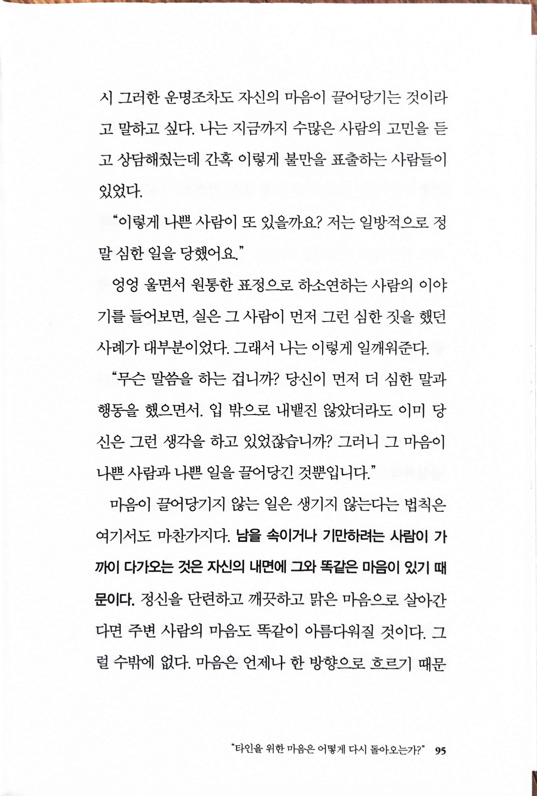

  * `남을 속이거나 기만하려는 사람이 가까이 다가오는 것은 자신의 내면에 그와 똑같은 마음이 있기 때문이다.`
    * (법륜스님이 생각난다)
* 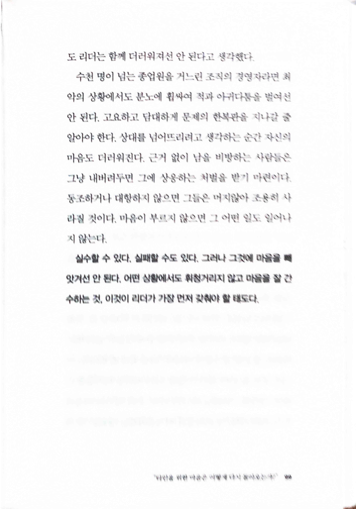

  * `실수할 수 있다. 실패할 수도 있다. 그러나 그것에 마음을 빼앗겨선 안 된다. 어떤 상황에서도 휘청거리지 않고 마음을 잘 간수하는 것, 이것이 리더가 가장 먼저 갖춰야 할 태도다.`
* 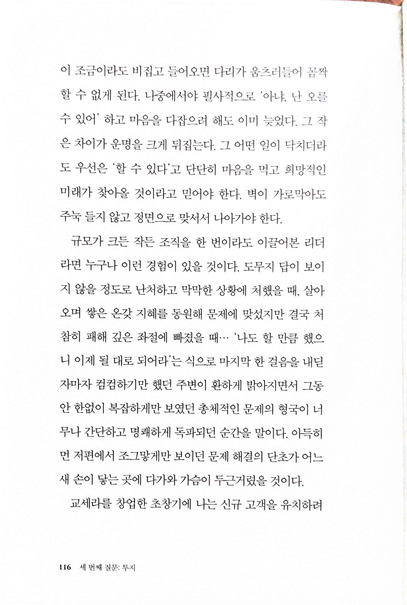

  * (이런 순간이 나에게도 올까?)
* 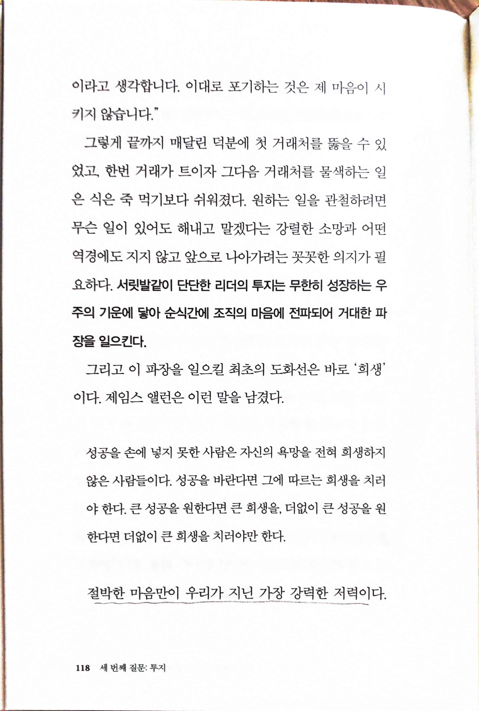

  * `원하는 일을 관철하려면 무슨 일이 있어도 해내고 말겠다는 강렬한 소망과 어떤 역경에도 지지 않고 앞으로 나아가려는 꼿꼿한 의지가 필요하다. 서릿발같이 단단한 리더의 투자는 무한히 성장하는 우주의 기운에 닿아 순식간에 조직의 마음에 전파되어 거대한 파장을 일으킨다.`
  * `성공을 손에 넣지 못한 사람은 자신의 욕망을 전혀 희생하지 않은 사람들이다. 성공을 바란다면 그에 따르는 희생을 치러야 한다. 큰 성공을 원한다면 큰 희생을, 더없이 큰 성공을 원한다면 더없이 큰 희생을 치러야만 한다.`
* 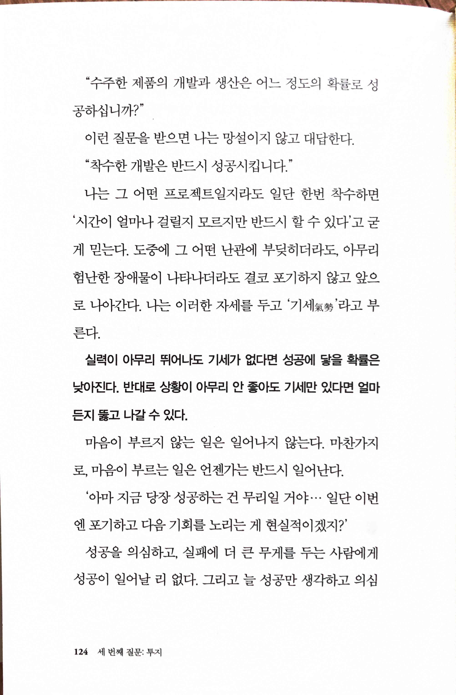

  * `실력이 아무리 뛰어나도 기세가 없다면 성공에 닿을 확률은 낮아진다. 반대로 상황이 아무리 안 좋아도 기세만 있다면 얼마든지 뚫고 나갈 수 있다.`
* 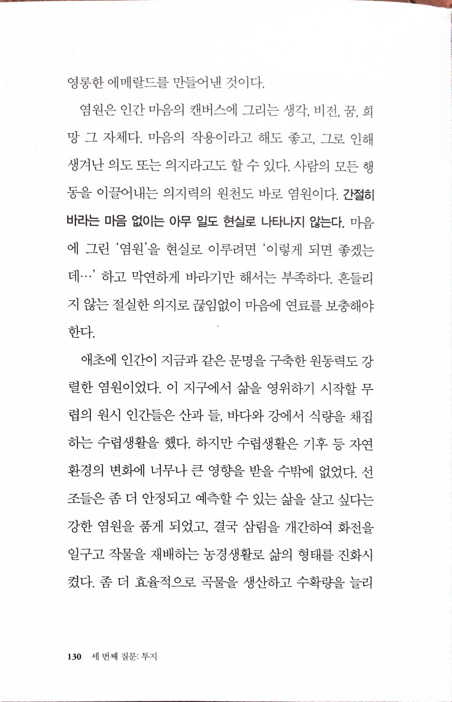

  * `간절히 바라는 마음 없이는 아무 일도 현실로 나타나지 않는다.`
* 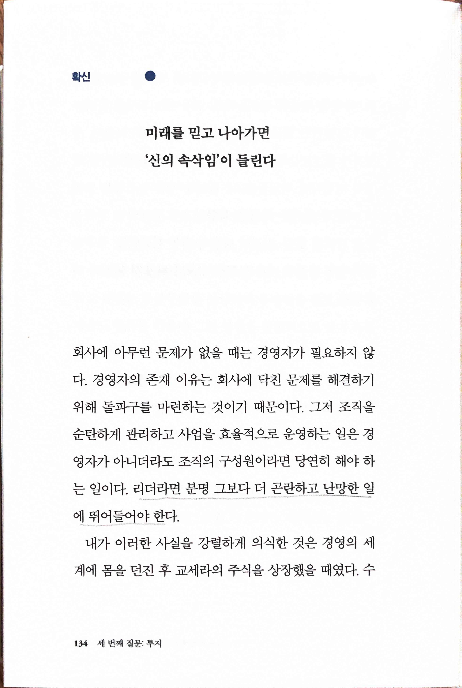

  * `경영자의 존재 이유는 회사에 닥친 문제를 해결하기 위해 돌파구를 마련하는 것이기 때문이다. 그저 조직을 순탄하게 관리하고 사업을 효율적으로 운영하는 일은 경영자가 아니더라도 조직의 구성원이라면 당연히 해야 하는 일이다. 리더라면 분명 그보다 더 곤란하고 난망한 일에 뛰어들어야 한다.`
    * (경영자뿐만 아니라 리더는 모두 크건 작건 이래야 한다고 생각한다. 1 on 1을 할 때 항상 전달하는 거 중 하나가 "당신의 위치에서 당신 권한으로 할 수 있는 일은 단독으로 처리하면 된다. 하지만 그렇지 못하다면 escalation 시켜라. 매니저가 있는 이유는 그래서인거고, 나의 역할도 그러라고 있는 거다. 나를 이용해라"라고)
* 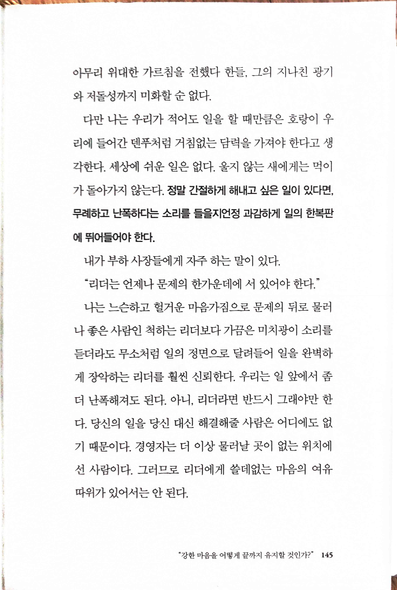

  * `정말 간절하게 해내고 싶은 일이 있다면, 무례하고 난폭하다는 소리를 들을지언정 과감하게 일의 한복판에 뛰어들어야 한다.`
    * (이 부분이 정말 애매하다고 생각한다. 보통은 설득을 해서 같이 가야 할텐데, 때로는 과감하게 반대 의견을 무시하고라도 가야 할 때도 있다)
  * `그러므로 리더에게 쓸데없는 마음의 여유 따위가 있어서는 안 된다.`
* 

  * `일을 쉽게 하거나 어렵게 하는 것은 그다음의 문제다. 일단 지금 반드시 해야 하는 일이라고 생각한다면, 그것이 경영자로서 판단하기에 옳은 일이라고 확신한다면 언제든 정면으로 마주해야 한다.`
* 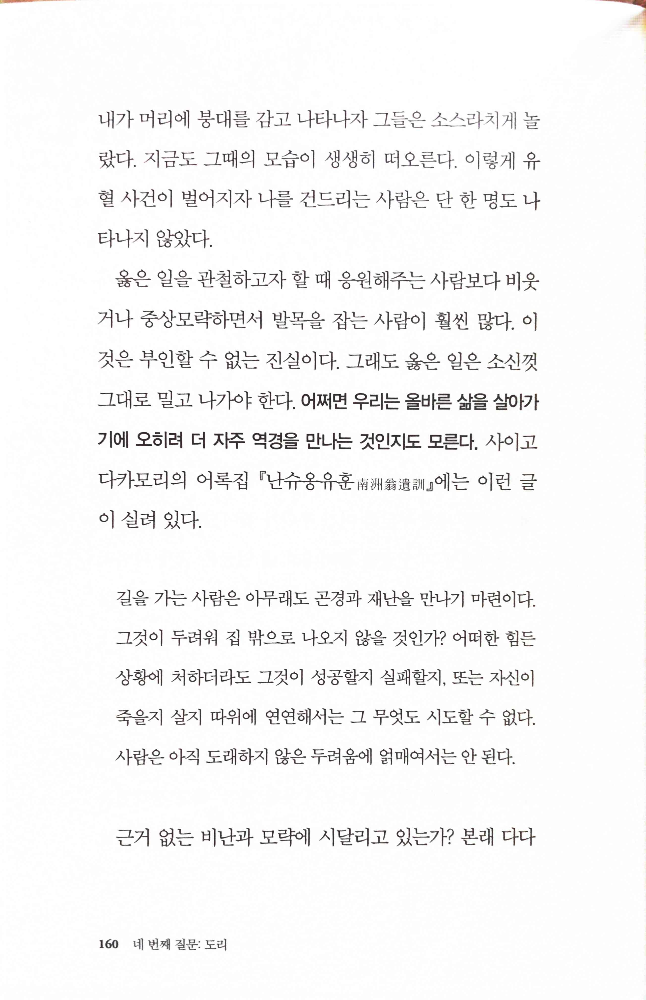

  * `올바른 삶을 살아가기에 오히려 더 자주 역경을 만나는 것인지도 모른다.`
  * ` 사이고 다카모리의 어록집 「난슈옹유훈南洲翁遺訓』에는 이런 글이 실려 있다.`
    * `길을 가는 사람은 아무래도 곤경과 재난을 만나기 마련이다. 그것이 두려워 집 밖으로 나오지 않을 것인가? 어떠한 힘든 상황에 처하더라도 그것이 성공할지 실패할지, 또는 자신이 죽을지 살지 따위에 연연해서는 그 무엇도 시도할 수 없다. 사람은 아직 도래하지 않은 두려움에 얽매여서는 안 된다.`
* 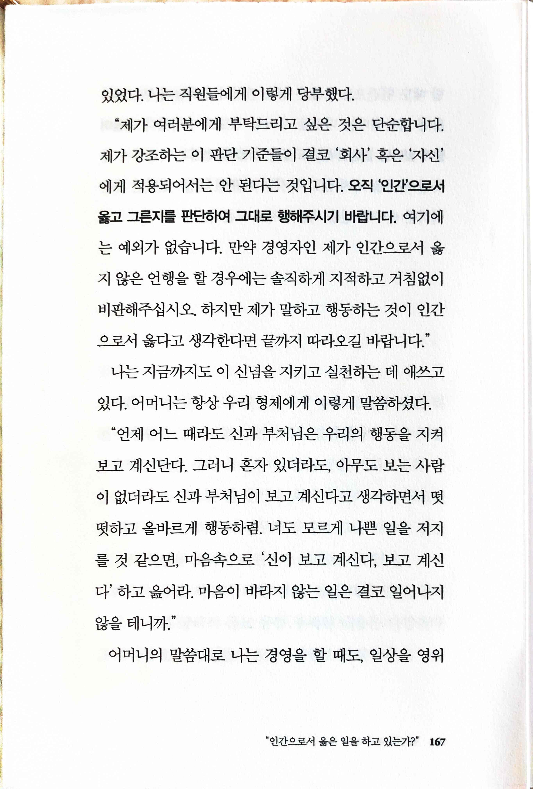

  * `오직 '인간'으로서 옳고 그른지를 판단하여 그대로 행해주시기 바랍니다.`
* 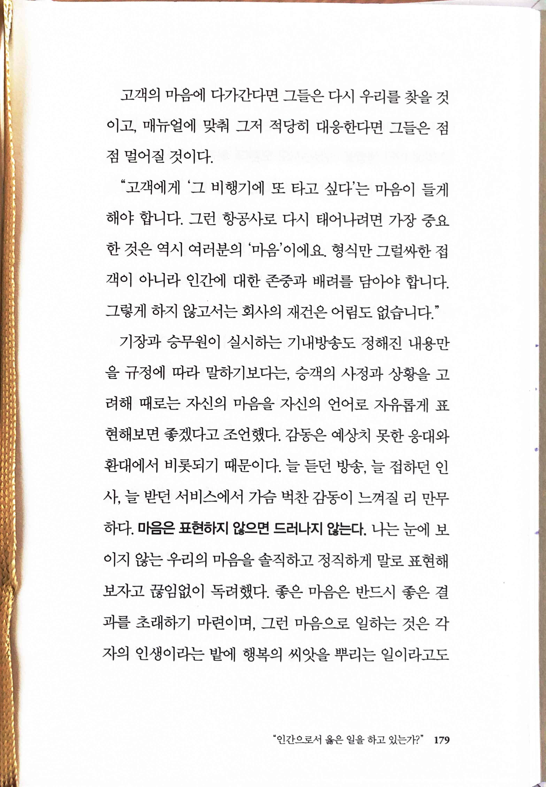

  * `마음은 표현하지 않으면 드러나지 않는다.`
    * (고객뿐만이 아니라 내부에서도, 또 좋은 일 뿐만 아니라 안 좋은 일에 대해서도)
* 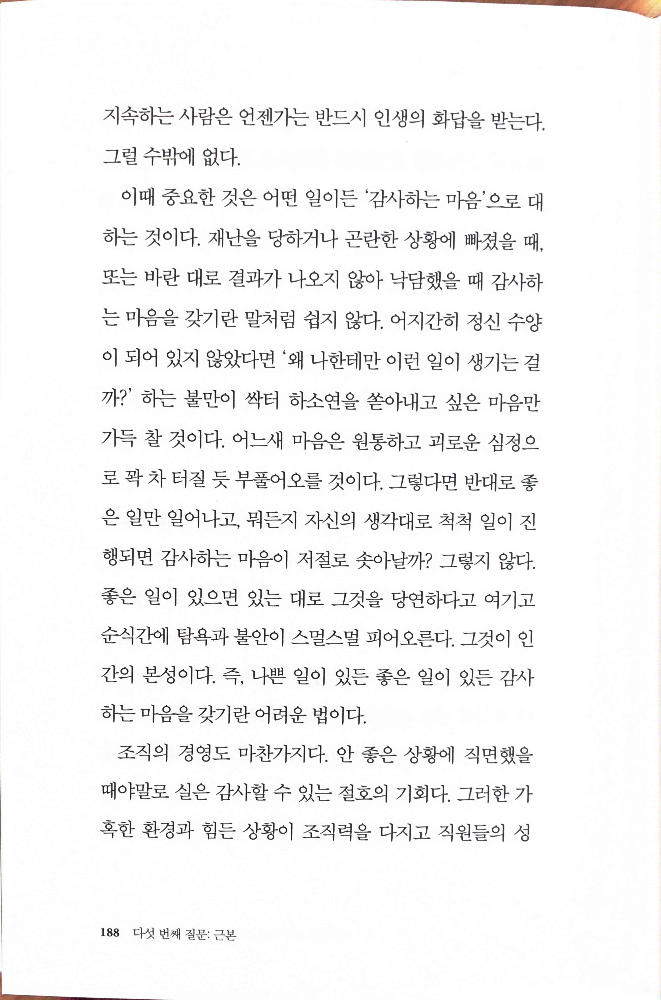 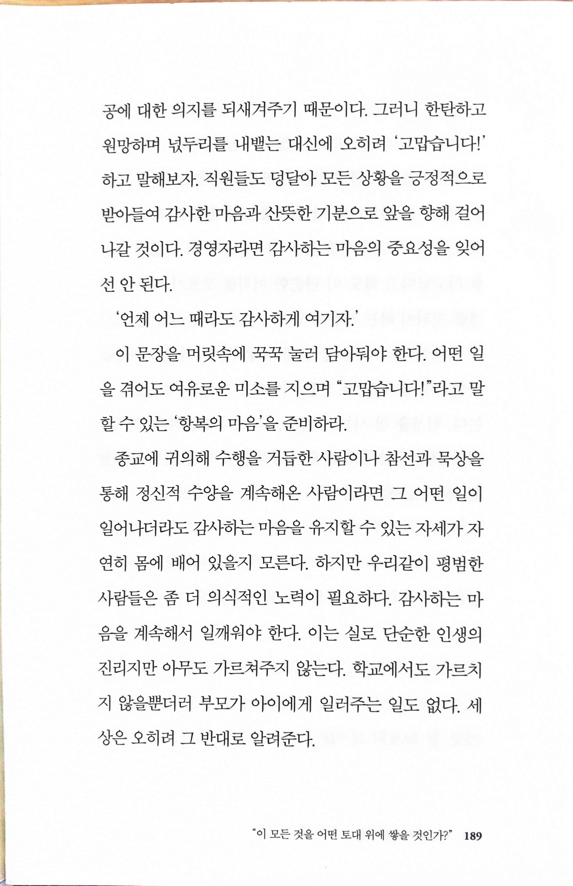

  * `조직의 경영도 마찬가지다. 안 좋은 상황에 직면했을 때야말로 실은 감사할 수 있는 절호의 기회다. 그러한 가혹한 환경과 힘든 상황이 조직력을 다지고 직원들의 성공에 대한 의지를 되새겨주기 때문이다. 그러니 한탄하고원망하며 넋두리를 내뱉는 대신에 오히려 '고맙습니다!'하고 말해보자. 직원들도 덩달아 모든 상황을 긍정적으로받아들여 감사한 마음과 산뜻한 기분으로 앞을 향해 걸어나갈 것이다. 경영자라면 감사하는 마음의 중요성을 잊어선 안 된다.`
* 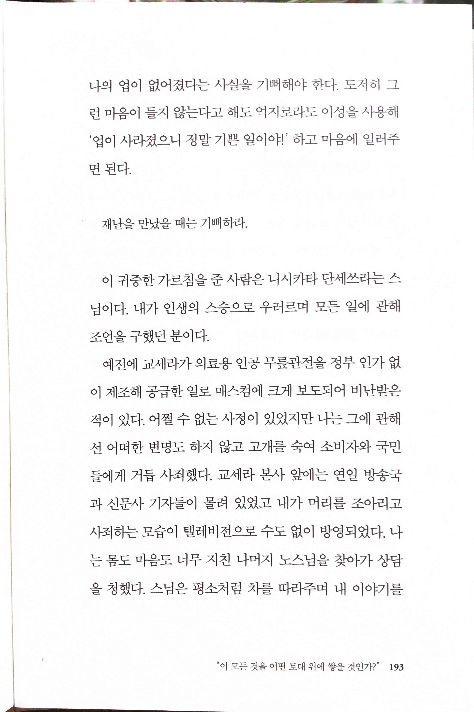

  * `재난을 만났을 때는 기뻐하라.`
* 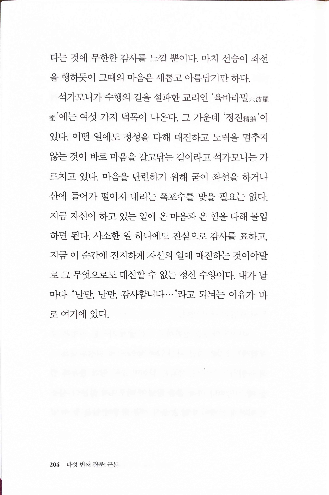

  * `석가모니가 수행의 길을 설파한 교리인 '육바라밀'에는 여섯 가지 덕목이 나온다. 그 가운데 '정진'이 있다. 어떤 일에도 정성을 다해 매진하고 노력을 멈추지 않는 것이 바로 마음을 갈고닦는 길이라고 석가모니는 가르치고 있다.`
* 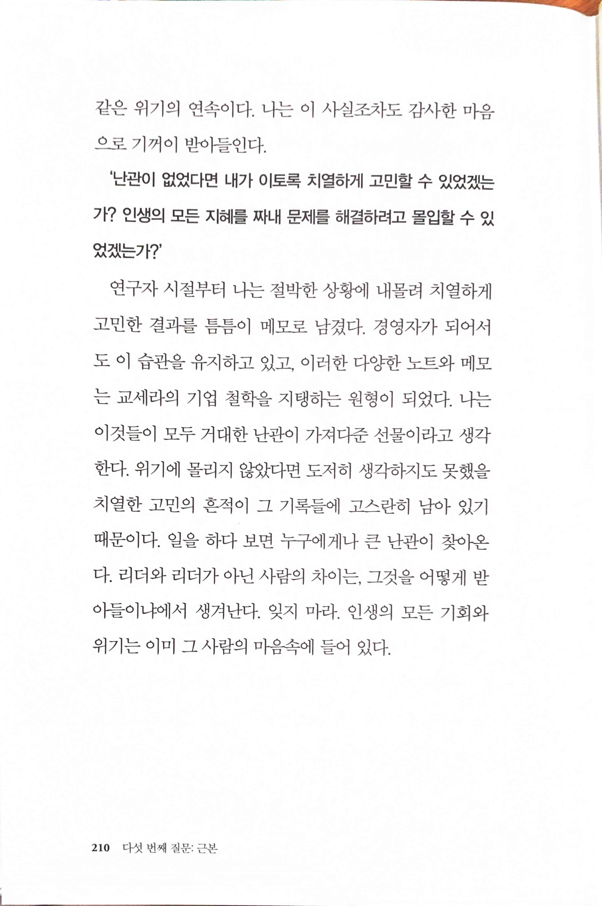

  * `'난관이 없었다면 내가 이토록 치열하게 고민할 수 있었겠는가? 인생의 모든 지혜를 짜내 문제를 해결하려고 몰입할 수 있었겠는가?'`
* 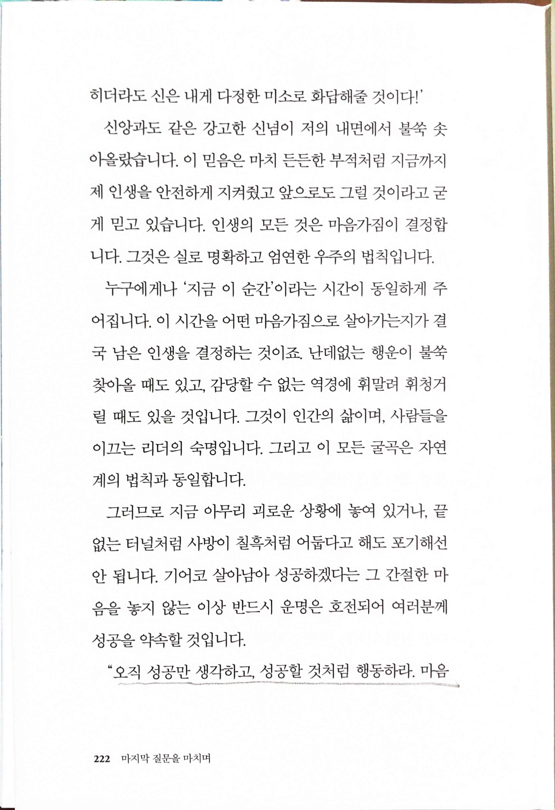 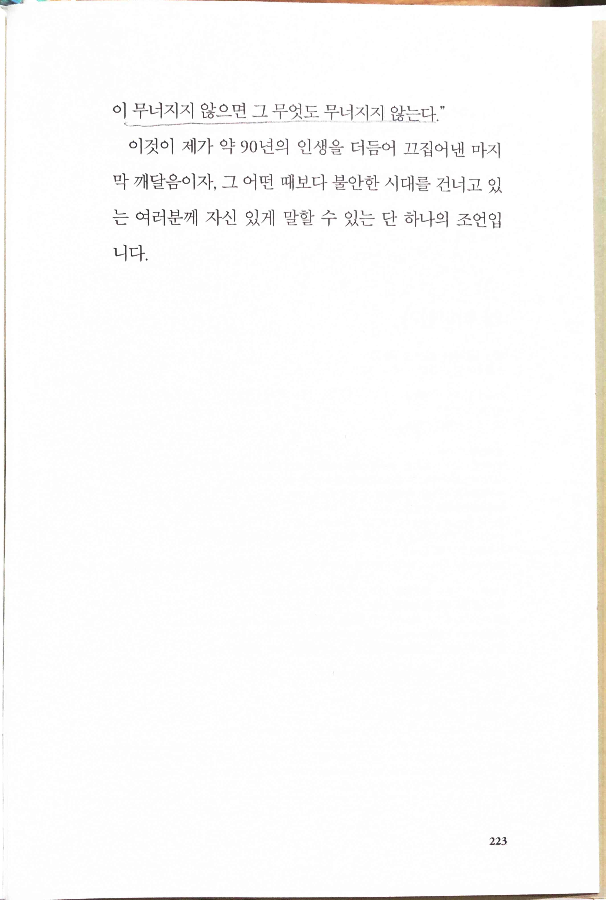

  * `“오직 성공만 생각하고, 성공할 것처럼 행동하라. 마음이 무너지지 않으면 그 무엇도 무너지지 않는다."`