# High Output Management
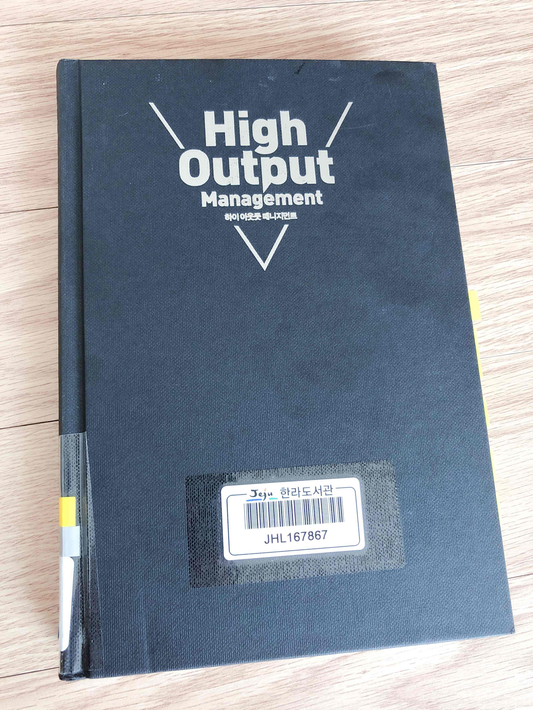

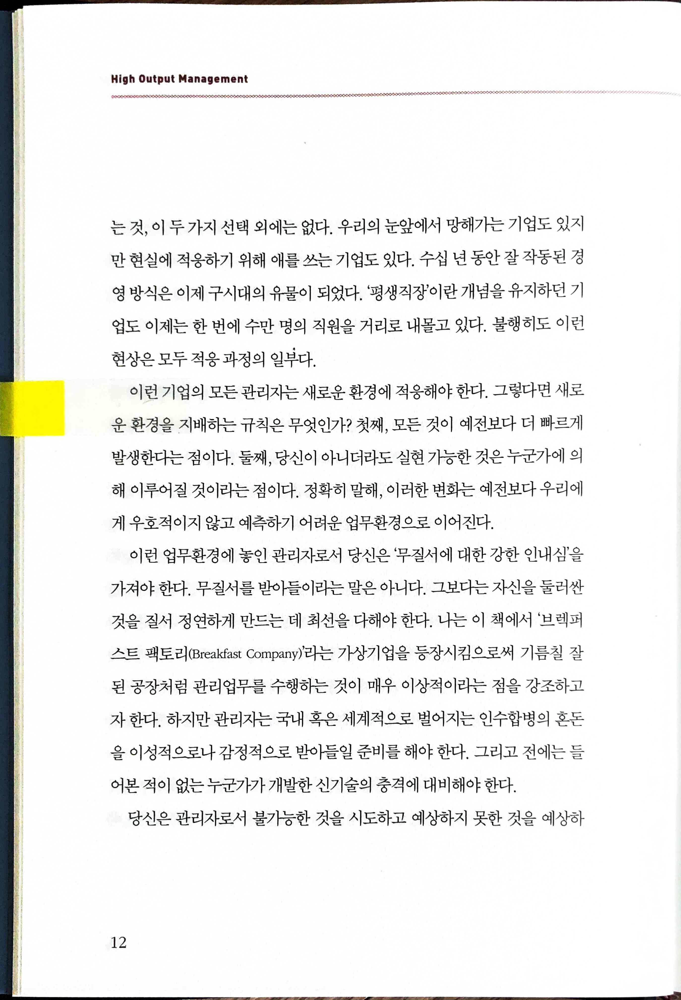

> 이런 기업의 모든 관리자는 새로운 환경에 적응해야 한다. 그렇다면 새로운 환경을 지배하는 규칙은 무엇인가? 첫째, 모든 것이 예전보다 더 빠르게 발생한다는 점이다. 둘째, 당신이 아니더라도 실현 가능한 것은 누군가에 의해 이루어질 것이라는 점이다. 정확히 말해, 이러한 변화는 예전보다 우리에게 우호적이지 않고 예측하기 어려운 업무환경으로 이어진다.

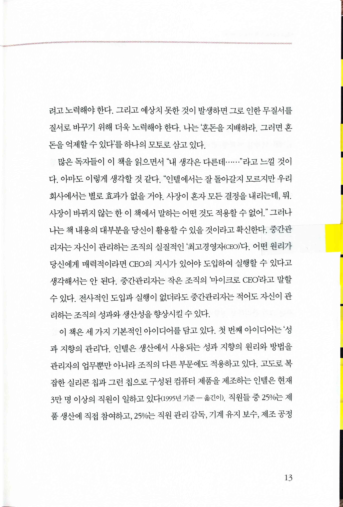

> 중간관리자는 자신이 관리하는 조직의 실질적인 최고경영자(CEO)다. 어떤 원리가 당신에게 매력적이라면 CEO의 지시가 있어야 도입하여 실행할 수 있다고 생각해서는 안 된다. 중간관리자는 작은 조직의 마이크로 CEO'라고 말할 수 있다. 전사적인 도입과 실행이 없더라도 중간관리자는 적어도 자신이 관리하는 조직의 성과와 생산성을 향상시킬 수 있다.

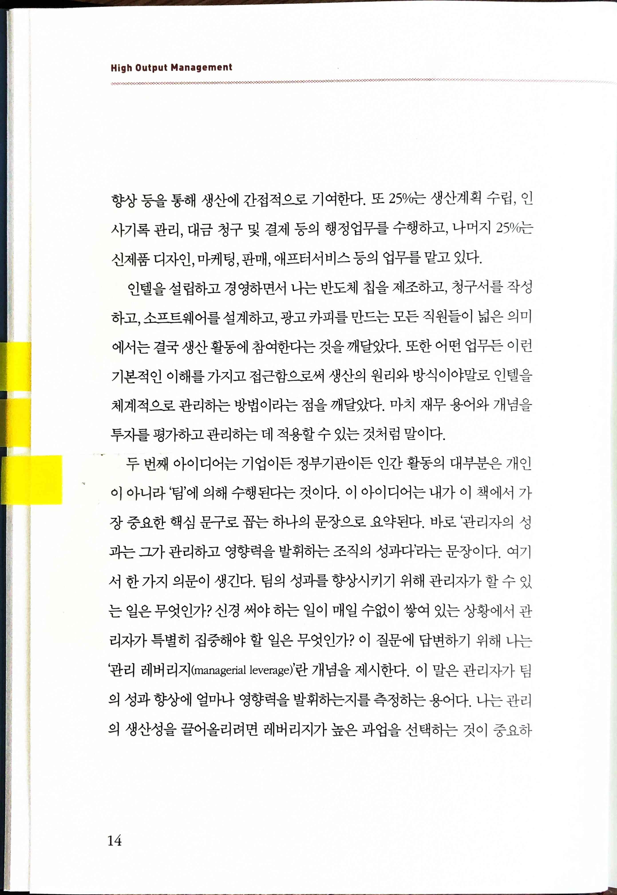

> 인간 활동의 대부분은 개인이 아니라 '팀'에 의해 수행된다는 것이다. 이 아이디어는 내가 이 책에서 가장 중요한 핵심 문구로 꼽는 하나의 문장으로 요약된다. 바로 '관리자의 성과는 그가 관리하고 영향력을 발휘하는 조직의 성과다라는 문장이다.

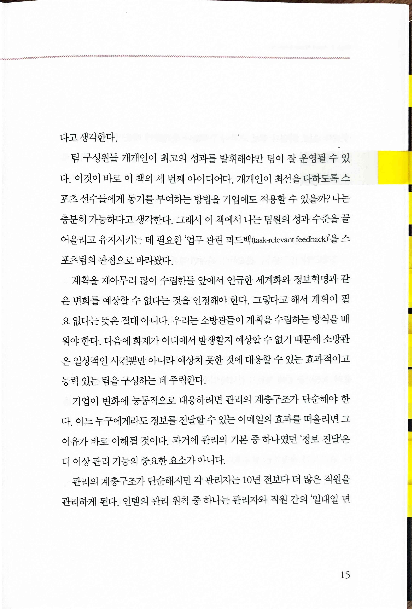

> 팀 구성원들 개개인이 최고의 성과를 발휘해야만 팀이 잘 운영될 수 있다... 그래서 이 책에서 나는 팀원의 성과 수준을 끌어올리고 유지시키는 데 필요한 업무 관련 피드백(task-relevant feedback)'을 스포츠팀의 관점으로 바라봤다.

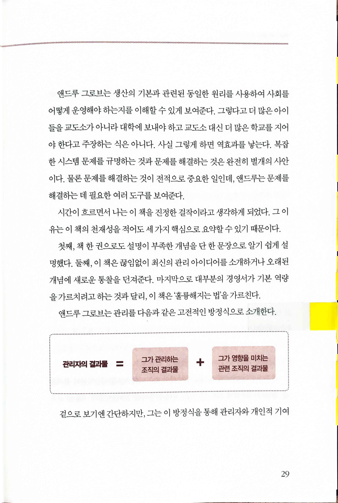

> 관리자의 결과물 = 그가 관리하는 조직의 결과물 + 그가 영향을 미치는 관련 조직의 결과물

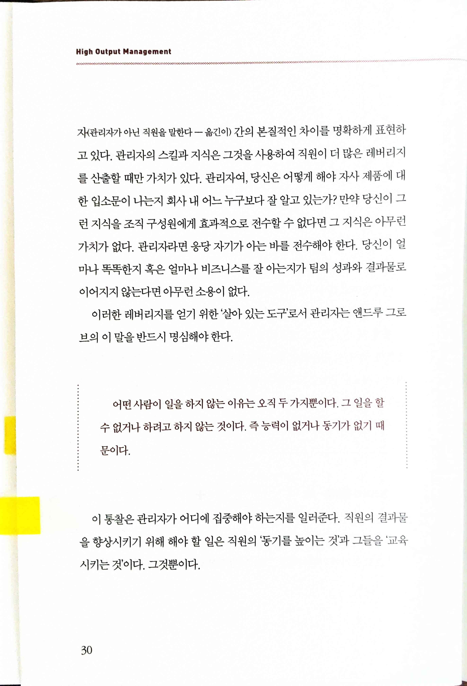

> 어떤 사람이 일을 하지 않는 이유는 오직 두 가지뿐이다. 그 일을 할수 없거나 하려고 하지 않는 것이다. 즉 능력이 없거나 동기가 없기 때문이다.
>
> 이 통찰은 관리자가 어디에 집중해야 하는지를 일러준다. 직원의 결과물을 향상시키기 위해 해야 할 일은 직원의 '동기를 높이는 것과 그들을 교육시키는 것'이다. 그것뿐이다.

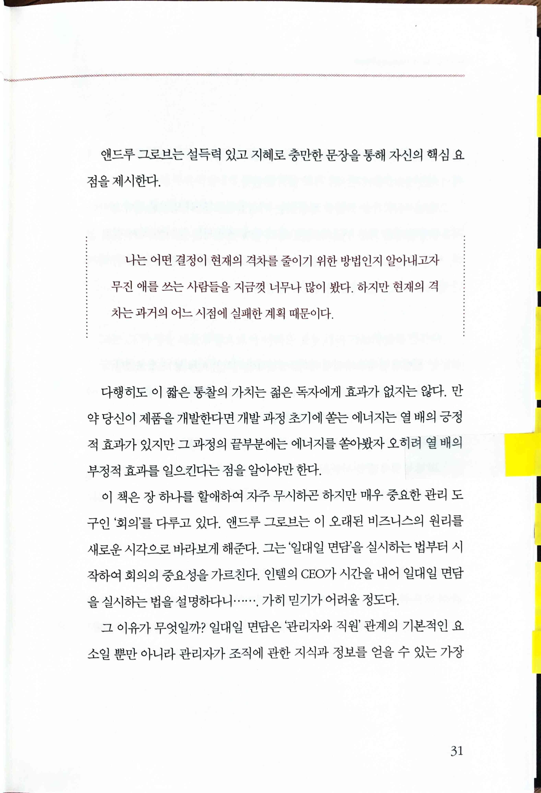

> 나는 어떤 결정이 현재의 격차를 줄이기 위한 방법인지 알아내고자 무진 애를 쓰는 사람들을 지금껏 너무나 많이 봤다. 하지만 현재의 격차는 과거의 어느 시점에 실패한 계획 때문이다.
>
> 만약 당신이 제품을 개발한다면 개발 과정 초기에 쏟는 에너지는 열 배의 긍정적 효과가 있지만 그 과정의 끝부분에는 에너지를 쏟아봤자 오히려 열 배의 부정적 효과를 일으킨다는 점을 알아야만 한다.

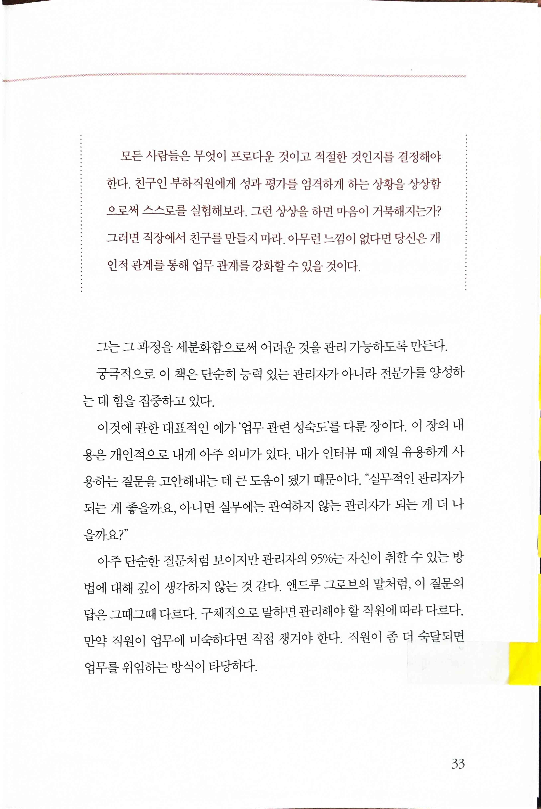

> “실무적인 관리자가 되는 게 좋을까요, 아니면 실무에는 관여하지 않는 관리자가 되는 게 더 나을까요?"
>
> 이 질문의 답은 그때그때 다르다. 구체적으로 말하면 관리해야 할 직원에 따라 다르다. 만약 직원이 업무에 미숙하다면 직접 챙겨야 한다. 직원이 좀 더 숙달되면 업무를 위임하는 방식이 타당하다.

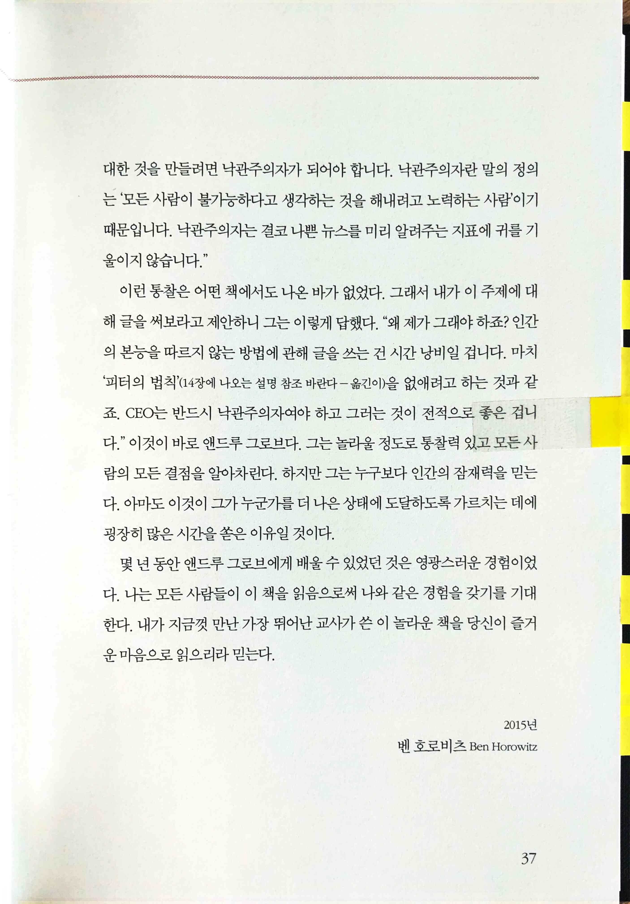

> CEO는 반드시 낙관주의자여야 하고 그러는 것이 전적으로 좋은 겁니다.

## PART 1 브렉퍼스트 팩토리 이야기

### 1장 | 생산의 기본 : 아침식사 만들기
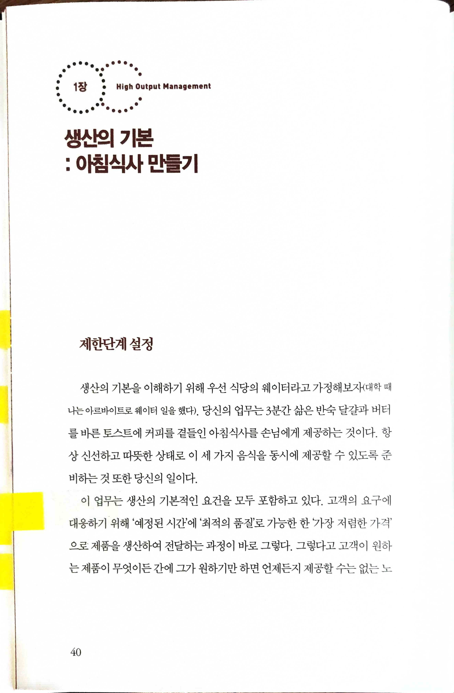

> 생산의 기본적인 요건. 고객의 요구에 대응하기 위해 '예정된 시간에 최적의 품질'로 가능한 한 가장 저렴한 가격'으로 제품을 생산하여 전달하는 과정

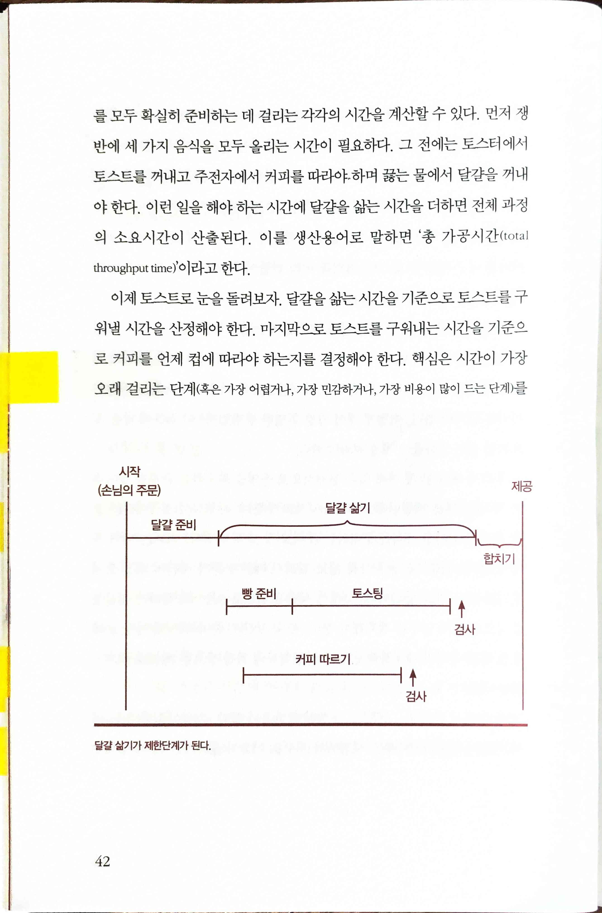 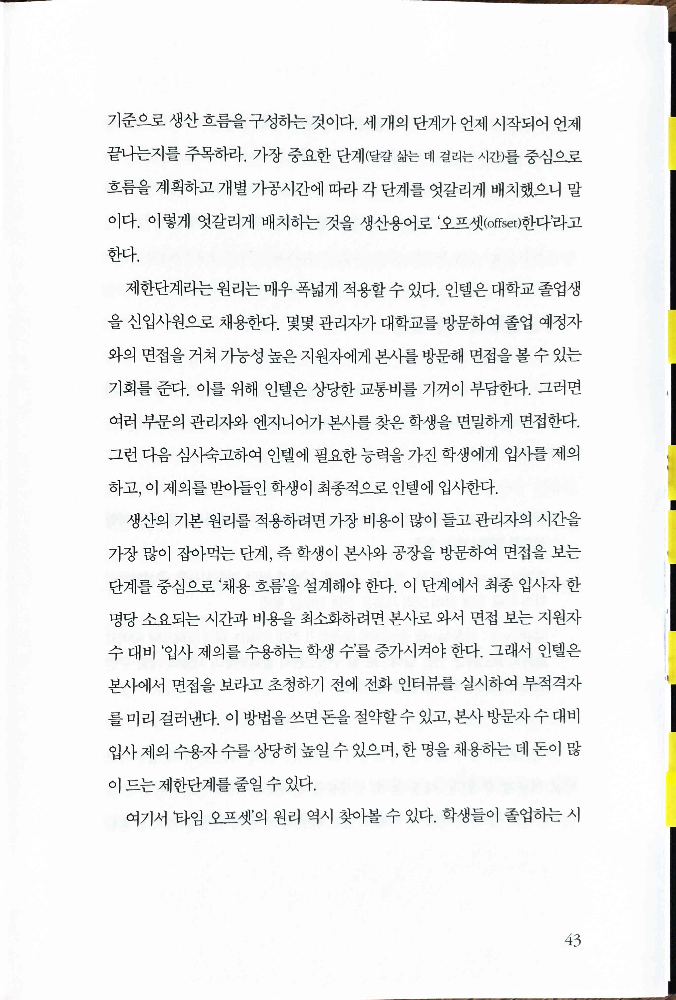

> 핵심은 시간이 가장 오래 걸리는 단계(혹은 가장 어렵거나, 가장 민감하거나, 가장 비용이 많이 드는 단계)를 기준으로 생산 흐름을 구성하는 것이다... 가장 중요한 단계(달걀 삶는 데 걸리는 시간)를 중심으로 흐름을 계획하고 개별 가공시간에 따라 각 단계를 엇갈리게 배치... 이렇게 엇갈리게 배치하는 것을 생산용어로 '오프셋(offset)한다'라고 한다.

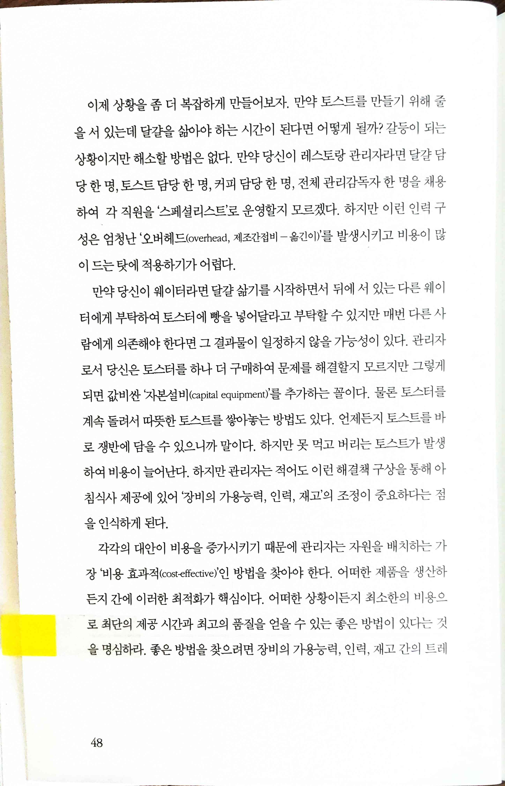

> 관리자는 자원을 배치하는 가장 비용 효과적(cost-effective)'인 방법을 찾아야 한다. 어떠한 제품을 생산하든지 간에 이러한 최적화가 핵심이다. 어떠한 상황이든지 최소한의 비용으로 최단의 제공 시간과 최고의 품질을 얻을 수 있는 좋은 방법이 있다는 것을 명심하라.

### 2장 | 브렉퍼스트 팩토리의 관리
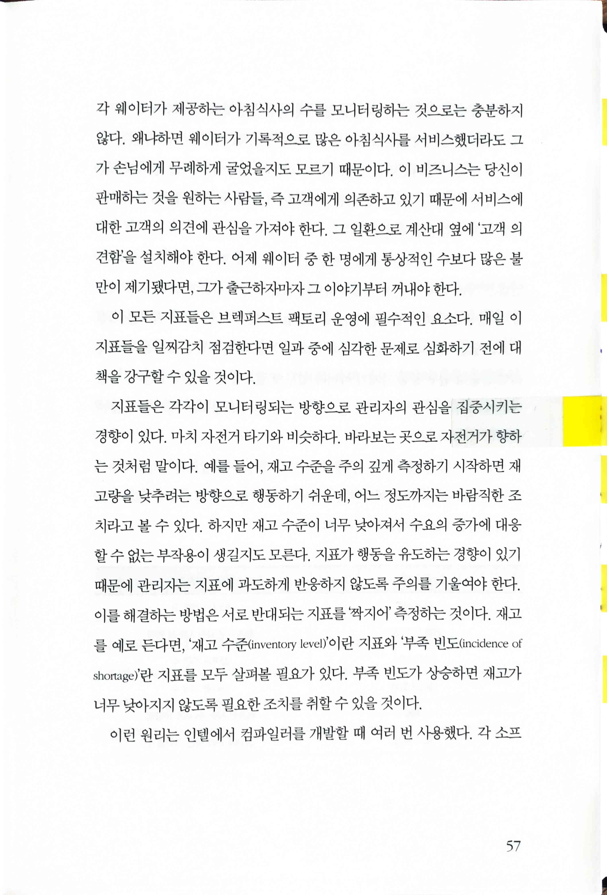

> 지표들은 각각이 모니터링되는 방향으로 관리자의 관심을 집중시키는 경향이 있다... 지표가 행동을 유도하는 경향이 있기 때문에 관리자는 지표에 과도하게 반응하지 않도록 주의를 기울여야 한다. 이를 해결하는 방법은 서로 반대되는 지표를 짝지어 측정하는 것이다.

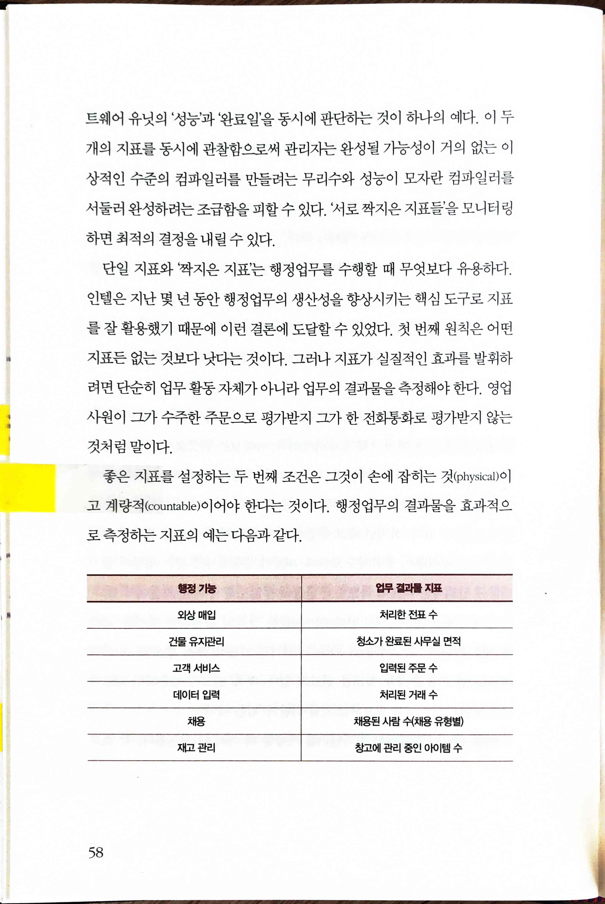

> 좋은 지표를 설정하는 두 번째 조건은 그것이 손에 잡히는 것(physical)이고 계량적(countable)이어야 한다는 것이다.

> 지표 쓸모. 첫째, 개인이나 집단의 목적이 무엇인지 아주 분명하게 보여준다. 둘째, 행정 기능을 측정할 때 객관적인 타당성을 제공한다. 셋째, 동일한 기능을 수행하는 행정 부서들을 서로 비교할수 있도록 측정 방법을 알려준다... 실제로 여러 가지 지표가 설정되면 경쟁의식이 생겨나고 일하고자 하는 동기를 자극하는 효과가 발생한다. 그리고 그에 따라 성과가 향상된다.이에 대한 자세한 내용은 나중에 스포츠 경기에 빗대어 설명할 것이다.

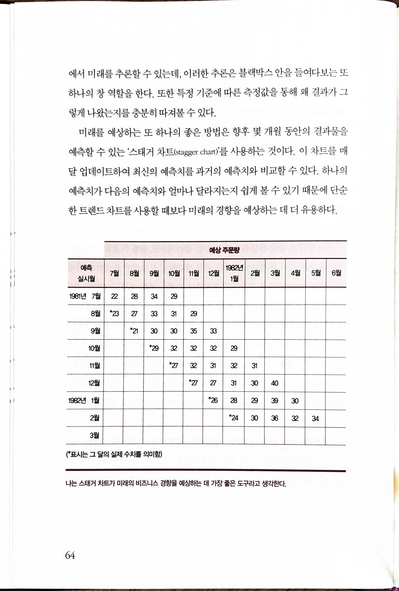

> 미래를 예상하는 또 하나의 좋은 방법은 향후 몇 개월 동안의 결과물을 예측할 수 있는 스태거 차트(stagger charr)'를 사용하는 것

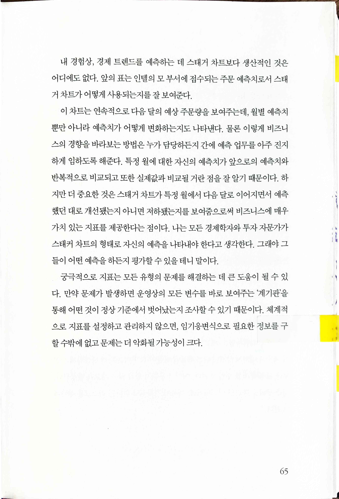

> 궁극적으로 지표는 모든 유형의 문제를 해결하는 데 큰 도움이 될 수 있다. 만약 문제가 발생하면 운영상의 모든 변수를 바로 보여주는 계기판을 통해 어떤 것이 정상 기준에서 벗어났는지 조사할 수 있기 때문이다. 체계적으로 지표를 설정하고 관리하지 않으면, 임기응변식으로 필요한 정보를 구할 수밖에 없고 문제는 더 악화될 가능성이 크다.

> 허용된 시간 모두를 사용하려고 한다" 라는 유명한 파킨슨의 법칙(Parkinson's Law)'처럼 늘 느슨한 상태에 있을 수밖에 없다. 명확한 기준을 가지고 업무량 예상치를 기초로 행정부서의 인력을 객관적으로 운용하는 것이 생산성의 유지와 향상에 도움이 된다는 것은 의심할 여지가 없다.

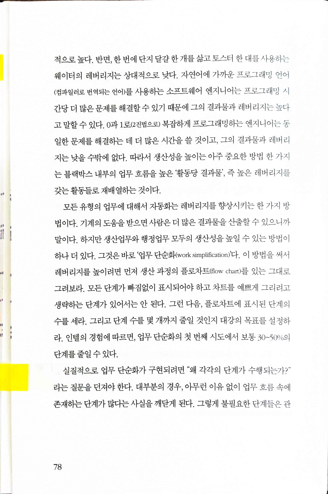

> 실질적으로 업무 단순화가 구현되려면 “왜 각각의 단계가 수행되는가?"라는 질문을 던져야 한다. 대부분의 경우, 아무런 이유 없이 업무 흐름 속에 존재하는 단계가 많다는 사실을 깨닫게 된다.

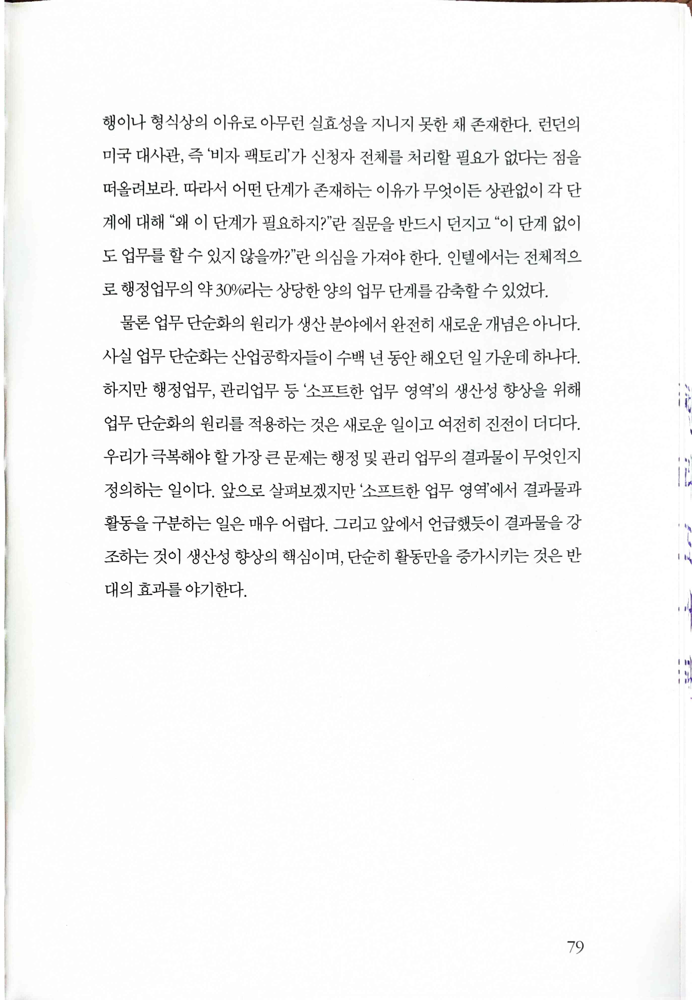

> 우리가 극복해야 할 가장 큰 문제는 행정 및 관리 업무의 결과물이 무엇인지 정의하는 일이다. 앞으로 살펴보겠지만 '소프트한 업무 영역'에서 결과물과 활동을 구분하는 일은 매우 어렵다. 그리고 앞에서 언급했듯이 결과물을 강조하는 것이 생산성 향상의 핵심이며, 단순히 활동만을 증가시키는 것은 반대의 효과를 야기한다.

## PART 2 관리는 팀게임이다.

### 3장 | 관리업무의 레버리지
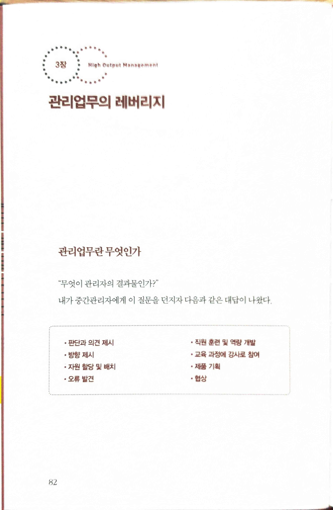

> "무엇이 관리자의 결과물인가?"
>
> • 판단과 의견 제시
>
> • 방향 제시
>
> • 자원 할당 및 배치
>
> • 오류 발견
>
> • 직원 훈련 및 역량 개발
>
> • 교육 과정에 강사로 참여
>
> • 제품 기획
>
> • 협상

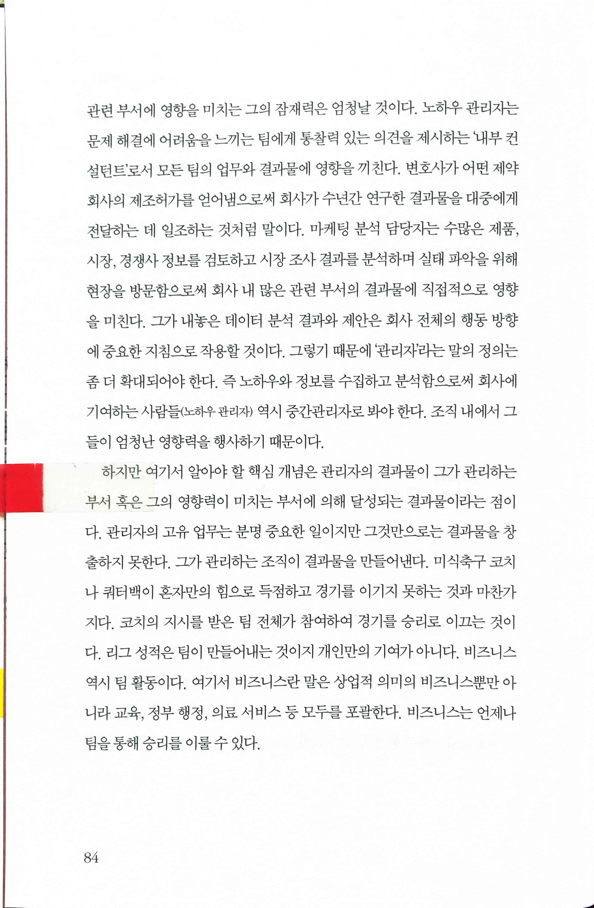

> 핵심 개념은 관리자의 결과물이 그가 관리하는 부서 혹은 그의 영향력이 미치는 부서에 의해 달성되는 결과물이라는 점이다. 관리자의 고유 업무는 분명 중요한 일이지만 그것만으로는 결과물을 창출하지 못한다. 그가 관리하는 조직이 결과물을 만들어낸다... 비즈니스 역시 팀 활동이다... 비즈니스는 언제나 팀을 통해 승리를 이룰 수 있다.

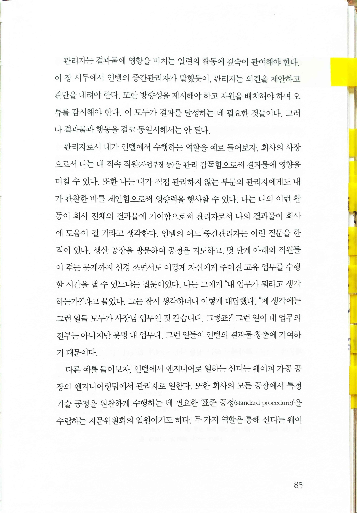

> 관리자는 결과물에 영향을 미치는 일련의 활동에 깊숙이 관여해야 한다... 관리자는 의견을 제안하고 판단을 내려야 한다. 또한 방향성을 제시해야 하고 자원을 배치해야 하며 오류를 감시해야 한다. 이 모두가 결과를 달성하는 데 필요한 것들이다. 그러나 결과물과 행동을 결코 동일시해서는 안 된다.

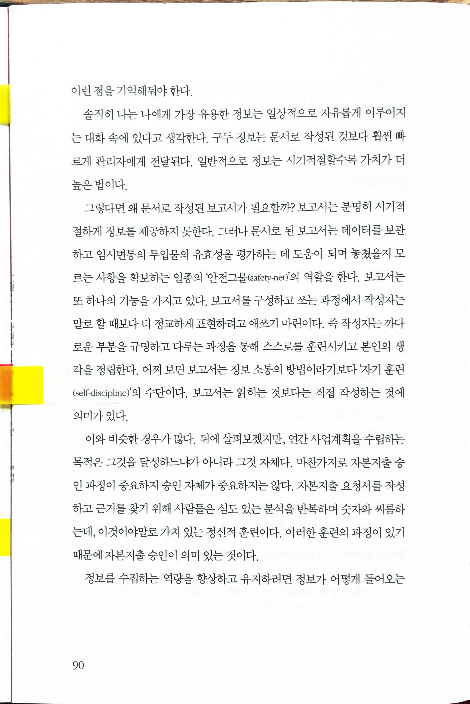

> 보고서는 정보 소통의 방법이라기보다 '자기 훈련(self-discipline)'의 수단이다. 보고서는 읽히는 것보다는 직접 작성하는 것에 의미가 있다.

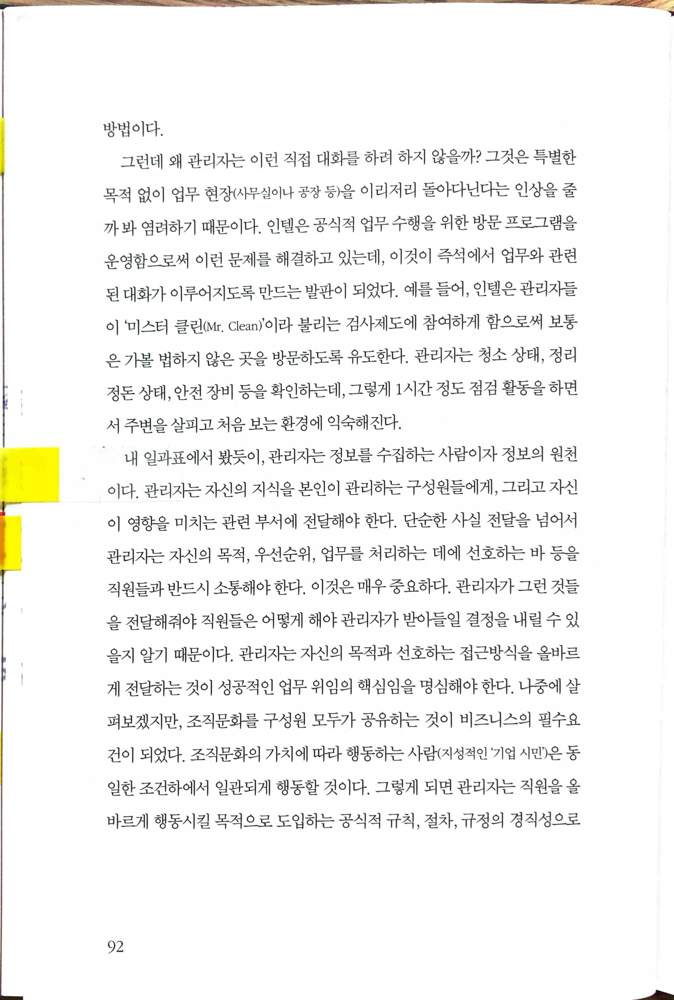

> 관리자는 정보를 수집하는 사람이자 정보의 원천이다. 관리자는 자신의 지식을 본인이 관리하는 구성원들에게, 그리고 자신이 영향을 미치는 관련 부서에 전달해야 한다. 단순한 사실 전달을 넘어서 관리자는 자신의 목적, 우선순위, 업무를 처리하는 데에 선호하는 바 등을 직원들과 반드시 소통해야 한다. 이것은 매우 중요하다. 관리자가 그런 것들을 전달해줘야 직원들은 어떻게 해야 관리자가 받아들일 결정을 내릴 수 있을지 알기 때문이다. 관리자는 자신의 목적과 선호하는 접근방식을 올바르게 전달하는 것이 성공적인 업무 위임의 핵심임을 명심해야 한다. 나중에 살펴보겠지만, 조직문화를 구성원 모두가 공유하는 것이 비즈니스의 필수요건이 되었다. 조직문화의 가치에 따라 행동하는 사람(지성적인 '기업 시민')은 동일한 조건하에서 일관되게 행동할 것이다.

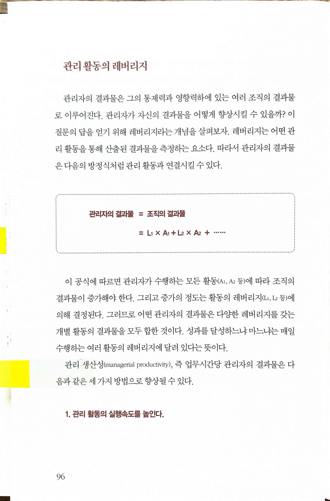 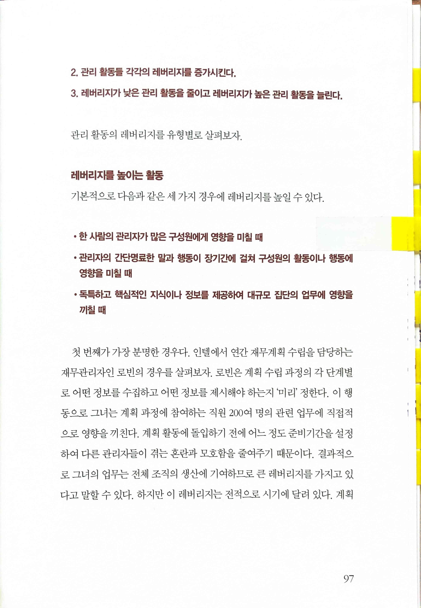

> 관리 생산성(managerial productivity), 즉 업무시간당 관리자의 결과물은 다음과 같은 세 가지 방법으로 향상될 수 있다.
>
> 1. 관리 활동의 실행속도를 높인다.
>
> 2. 관리 활동들 각각의 레버리자를 증가시킨다.
>
> 3. 레버리지가 낮은 관리 활동을 줄이고 레버리지가 높은 관리 활동을 늘린다.
>
> 레버리지를 높이는 활동
>
> • 한 사람의 관리자가 많은 구성원에게 영향을 미칠 때
>
> • 관리자의 간단명료한 말과 행동이 장기간에 걸쳐 구성원의 활동이나 행동에 영향을 미칠 때
>
> • 독특하고 핵심적인 지식이나 정보를 제공하여 대규모 집단의 업무에 영향을 끼칠 때

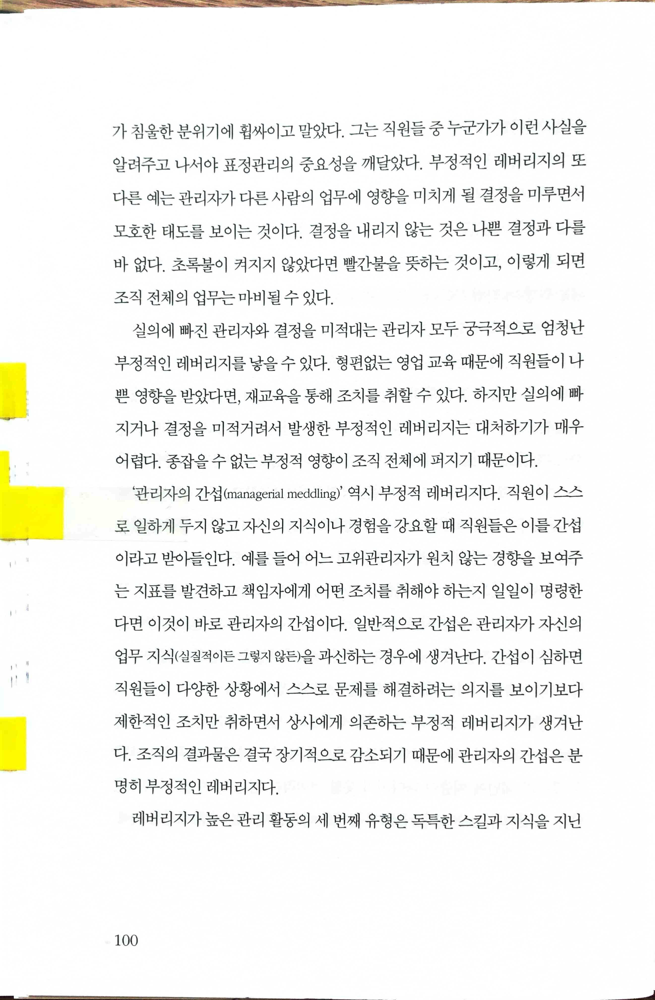

> 관리자의 간섭(managerial meddling)' 역시 부정적 레버리지다. 직원이 스스로 일하게 두지 않고 자신의 지식이나 경험을 강요할 때 직원들은 이를 간섭이라고 받아들인다. 예를 들어 어느 고위관리자가 원치 않는 경향을 보여주는 지표를 발견하고 책임자에게 어떤 조치를 취해야 하는지 일일이 명령한다면 이것이 바로 관리자의 간섭이다. 일반적으로 간섭은 관리자가 자신의 업무 지식 (실질적이든 그렇지 않든)을 과신하는 경우에 생겨난다. 간섭이 심하면 직원들이 다양한 상황에서 스스로 문제를 해결하려는 의지를 보이기보다. 제한적인 조치만 취하면서 상사에게 의존하는 부정적 레버리지가 생겨난다. 조직의 결과물은 결국 장기적으로 감소되기 때문에 관리자의 간섭은 분명히 부정적인 레버리지다.

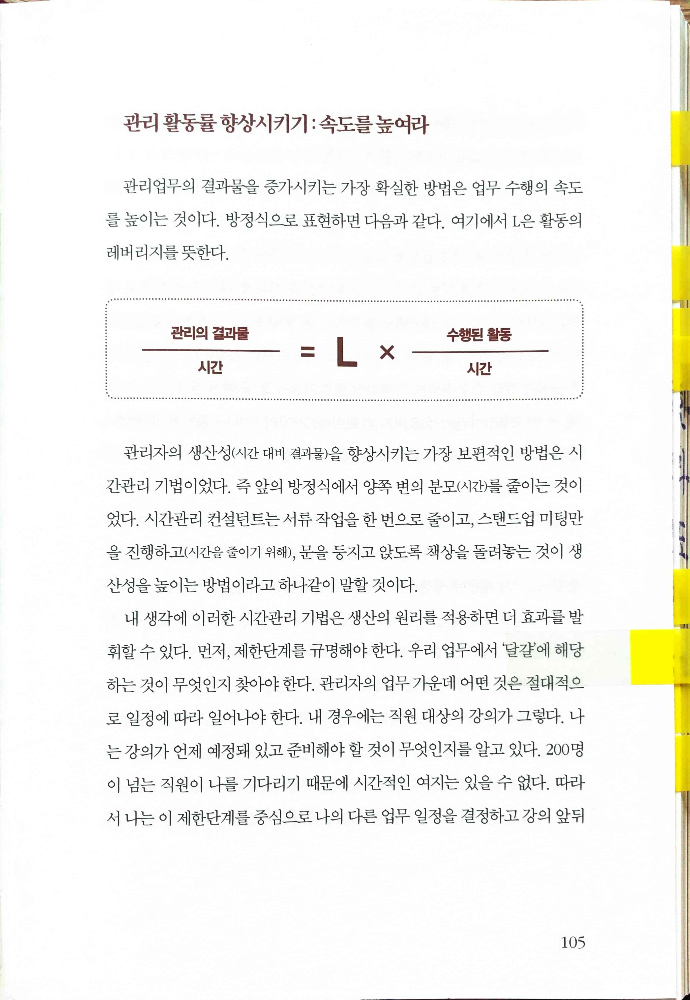

> 관리자의 업무 가운데 어떤 것은 절대적으로 일정에 따라 일어나야 한다.

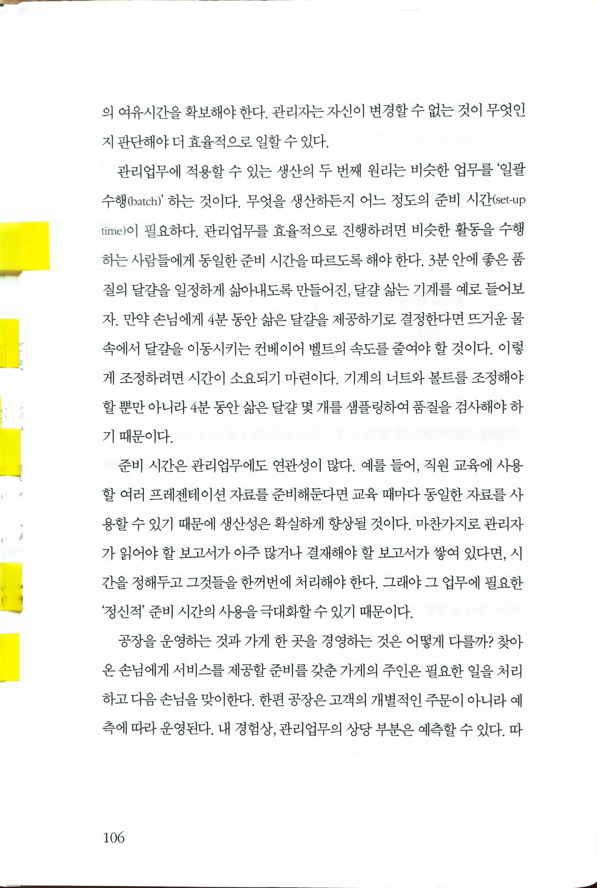

> 관리업무에 적용할 수 있는 생산의 두 번째 원리는 비슷한 업무를 '일괄수행(batch)' 하는 것이다... 관리업무를 효율적으로 진행하려면 비슷한 활동을 수행하는 사람들에게 동일한 준비 시간을 따르도록 해야 한다.

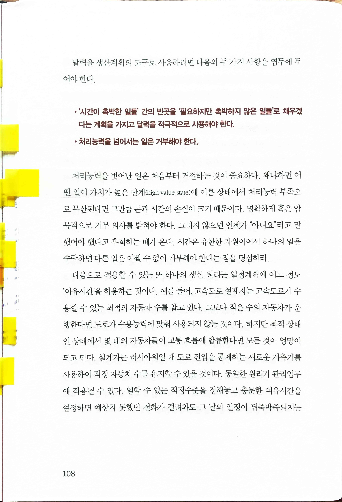

> 처리능력을 벗어난 일은 처음부터 거절하는 것이 중요하다. 왜냐하면 어떤 일이 가치가 높은 단계(high-value state)에 이른 상태에서 처리능력 부족으로 무산된다면 그만큼 돈과 시간의 손실이 크기 때문이다. 명확하게 혹은 암묵적으로 거부 의사를 밝혀야 한다. 그러지 않으면 언젠가 "아니요”라고 말했어야 했다고 후회하는 때가 온다. 시간은 유한한 자원이어서 하나의 일을 수락하면 다른 일은 어쩔 수 없이 거부해야 한다는 점을 명심하라.

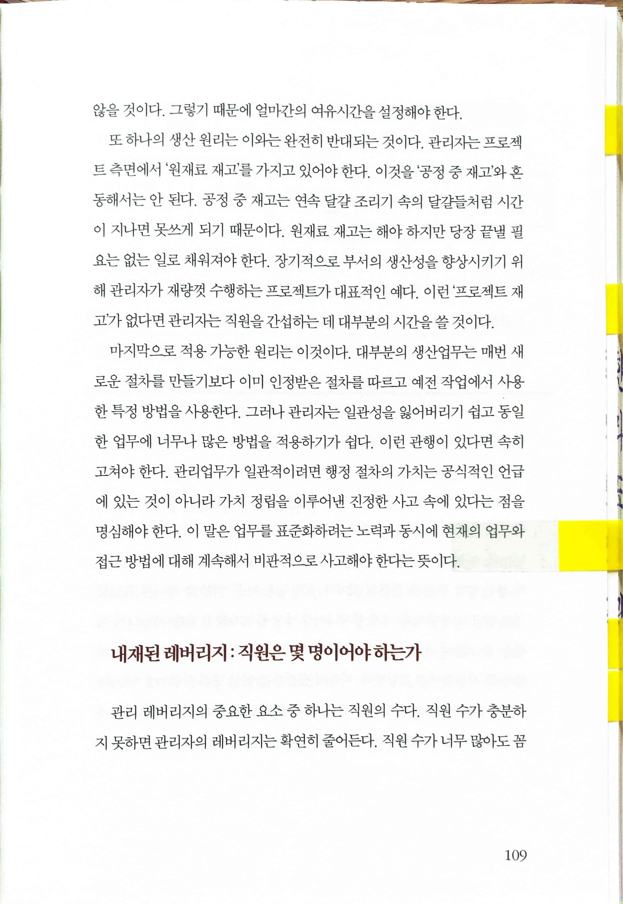

> 이 말은 업무를 표준화하려는 노력과 동시에 현재의 업무와 접근 방법에 대해 계속해서 비판적으로 사고해야 한다는 뜻이다.

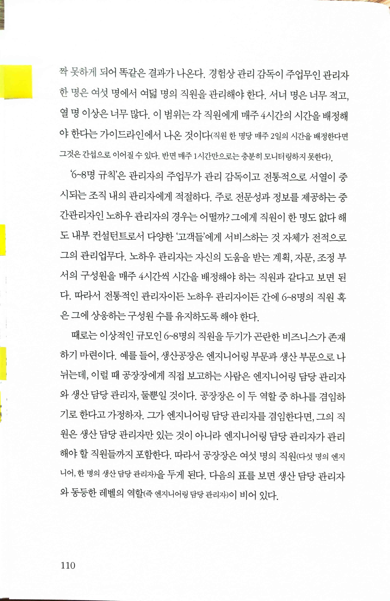

> 경험상 관리 감독이 주업무인 관리자 한 명은 여섯 명에서 여덟 명의 직원을 관리해야 한다.

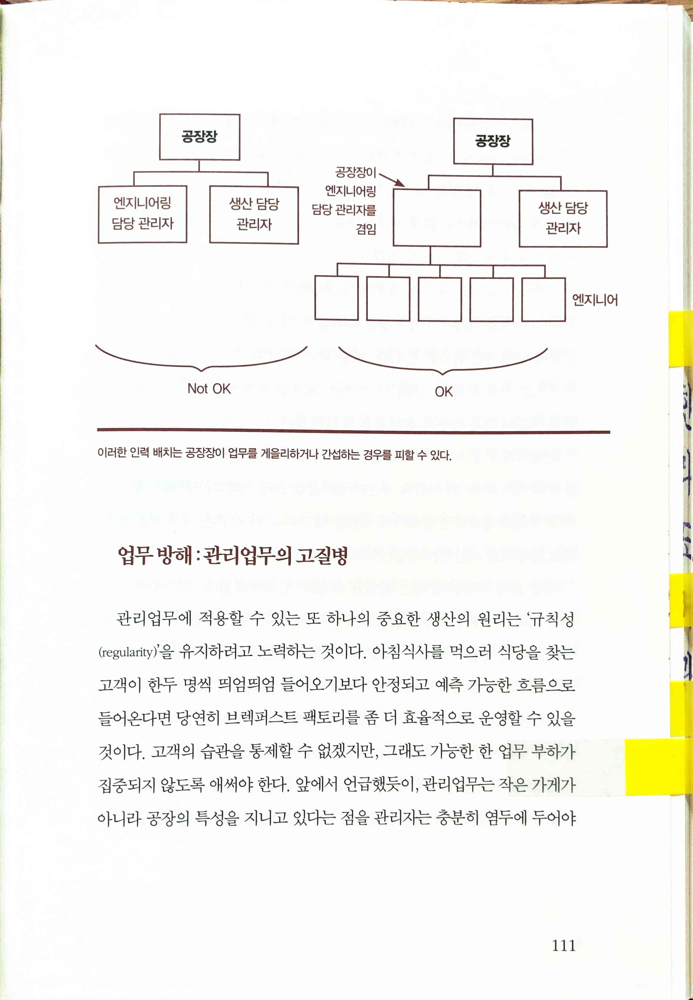

> 고객의 습관을 통제할 수 없겠지만, 그래도 가능한 한 업무 부하가 집중되지 않도록 애써야 한다.

> 가장 많이 나타난 문제는 제어할 수 없는 업무방해'였다. 업무방해는 전통적 관리자에게든 노하우 관리자에게는 동일하게 골치 아픈 문제였다. 모두가 자신의 일을 수행하는 동안 업무방해가 발생한다고 생각했다. 업무방해를 일으키는 보편적인 원천은 대부분 직원과 관리자의 업무에 영향을 받는 관련부서의 직원이었다.

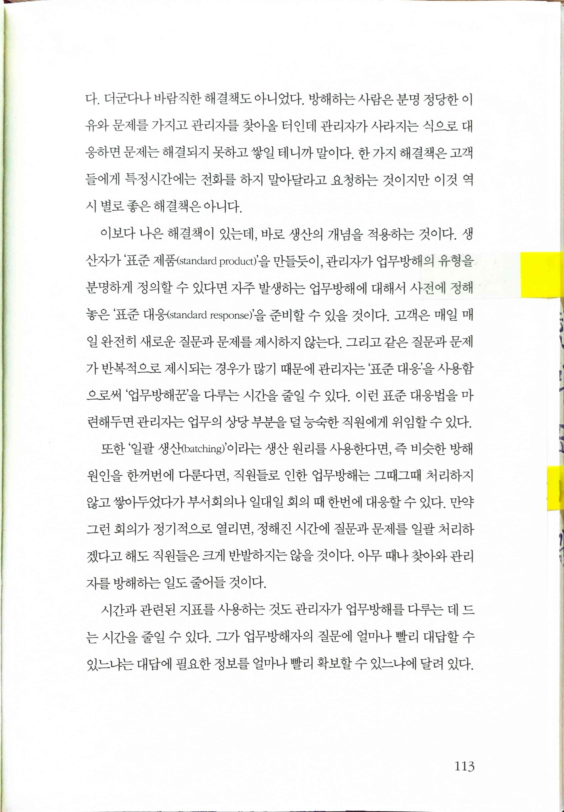

> 해결책이 있는데, 바로 생산의 개념을 적용하는 것이다. 생산자가 '표준 제품(standard product)'을 만들듯이, 관리자가 업무방해의 유형을 분명하게 정의할 수 있다면 자주 발생하는 업무방해에 대해서 사전에 정해놓은 '표준 대응(standard response)'을 준비할 수 있을 것이다. 고객은 매일 매일 완전히 새로운 질문과 문제를 제시하지 않는다. 그리고 같은 질문과 문제가 반복적으로 제시되는 경우가 많기 때문에 관리자는 '표준 대응'을 사용함으로써 '업무방해꾼'을 다루는 시간을 줄일 수 있다. 이런 표준 대응법을 마련해두면 관리자는 업무의 상당 부분을 덜 능숙한 직원에게 위임할 수 있다.

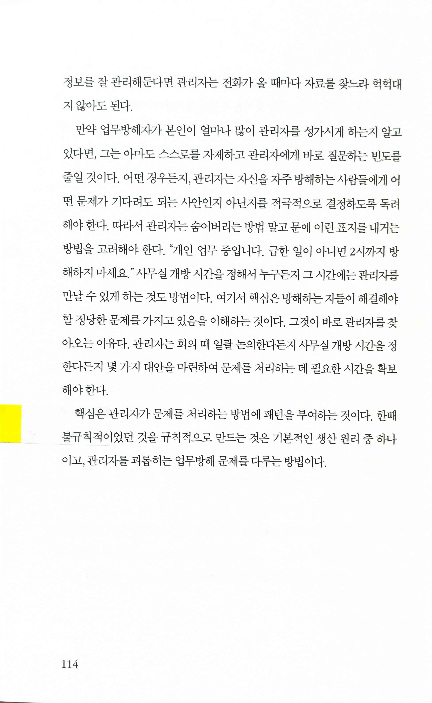

> 핵심은 관리자가 문제를 처리하는 방법에 패턴을 부여하는 것이다. 한때 불규칙적이었던 것을 규칙적으로 만드는 것은 기본적인 생산 원리 중 하나이고, 관리자를 괴롭히는 업무방해 문제를 다루는 방법이다.

### 4장 | 관리업무의 수단 : 회의
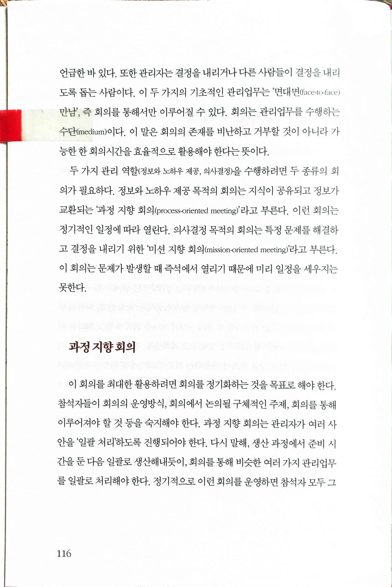

> 관리자는 결정을 내리거나 다른 사람들이 결정을 내리도록 돕는 사람이다. 이 두 가지의 기초적인 관리업무는 면대면(face-to-face)만남', 즉 회의를 통해서만 이루어질 수 있다. 회의는 관리업무를 수행하는 수단(medium)이다. 이 말은 회의의 존재를 비난하고 거부할 것이 아니라 가능한 한 회의시간을 효율적으로 활용해야 한다는 뜻이다.

> 정기적인 일대일 면담은 인텔이 아닌 다른 기업에서는 아주 드물다.

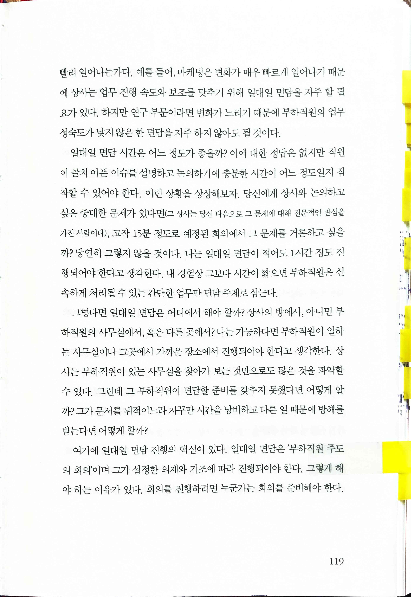

> 일대일 면담 진행의 핵심. 일대일 면담은 '부하직원 주도의 회의' 이며 그가 설정한 의제와 기조에 따라 진행되어야 한다.

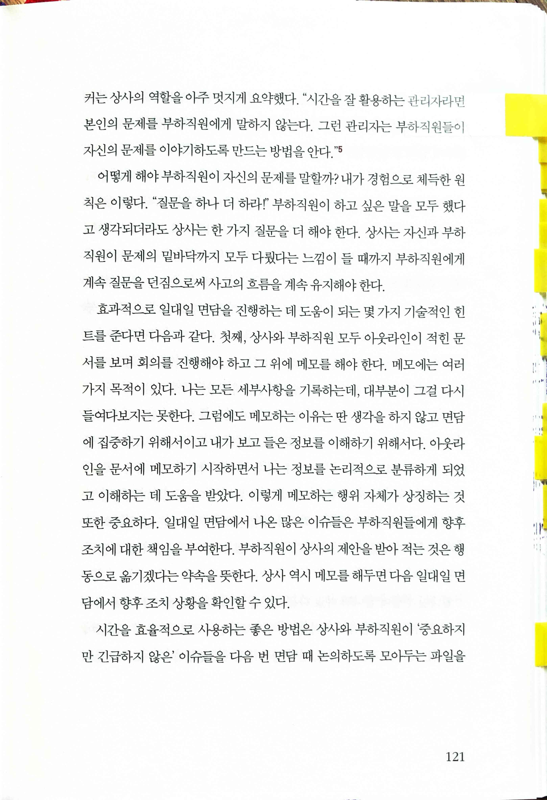

> 상사의 역할. “시간을 잘 활용하는 관리자라면, 본인의 문제를 부하직원에게 말하지 않는다. 그런 관리자는 부하직원들이 자신의 문제를 이야기하도록 만드는 방법을 안다."

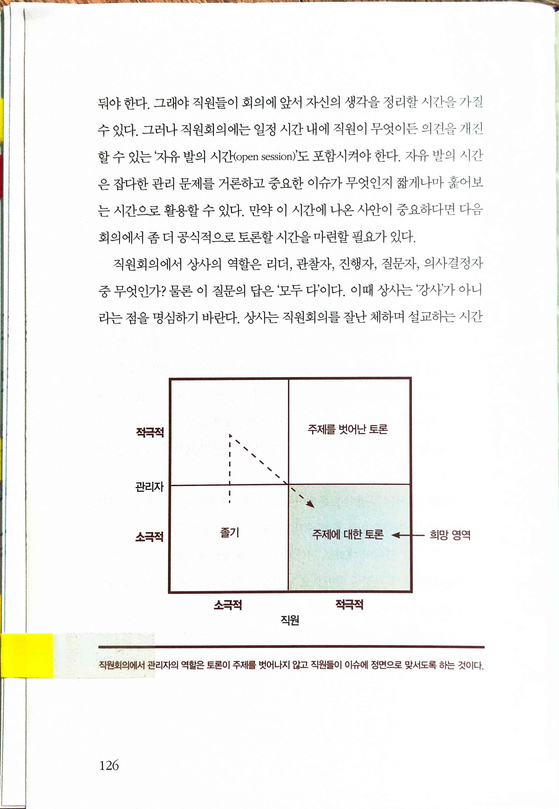

> 직원회의에서 관리자의 역할은 토론이 주제를 벗어나지 않고 직원들이 이슈에 정면으로 맞서도록 하는 것이다.

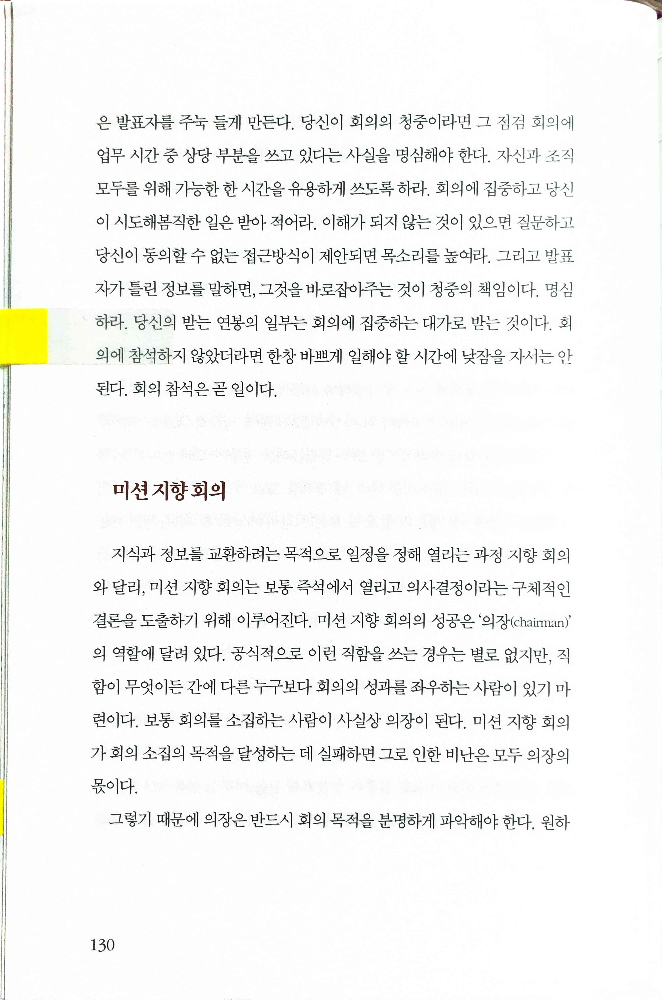

> 명심하라. 당신의 받는 연봉의 일부는 회의에 집중하는 대가로 받는 것이다... 회의 참석은 곧 일이다.

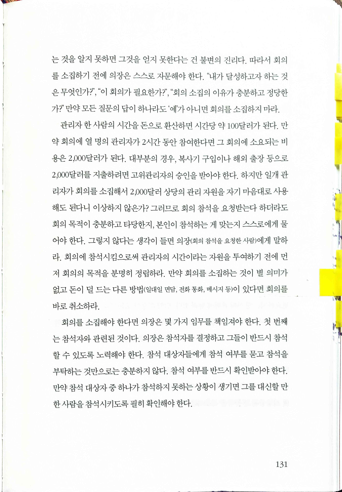

> 만약 회의를 소집하는 것이 별 의미가 없고 돈이 덜 드는 다른 방법(일대일 면담, 전화 통화, 메시지 등)이 있다면 회의를 바로 취소하라.

### 5장 의사결정
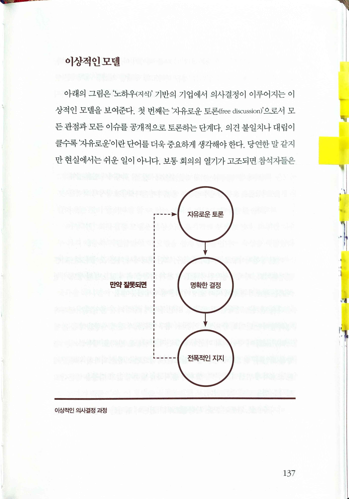

> 의사결정이 이루어지는 이상적인 모델. 첫 번째는 '자유로운 토론(free discussion)'으로서 모든 관점과 모든 이슈를 공개적으로 토론하는 단계다. 의견 불일치나 대립이 클수록 '자유로운'이란 단어를 더욱 중요하게 생각해야 한다. 당연한 말 같지만 현실에서는 쉬운 일이 아니다.

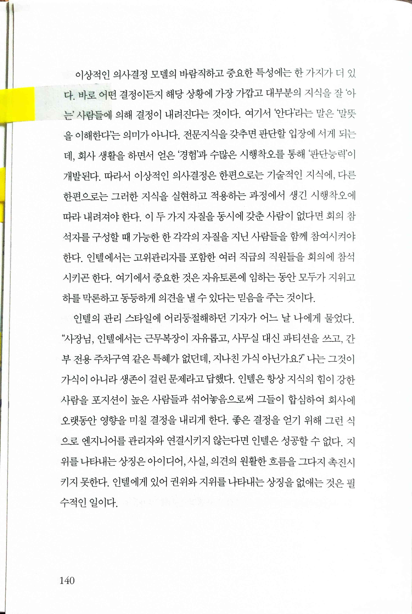

> 이상적인 의사결정 모델의 바람직하고 중요한 특성. 바로 어떤 결정이든지 해당 상황에 가장 가깝고 대부분의 지식을 잘 아는 사람들에 의해 결정이 내려진다는 것이다... 따라서 이상적인 의사결정은 한편으로는 기술적인 지식에, 다른 한편으로는 그러한 지식을 실현하고 적용하는 과정에서 생긴 시행착오에 따라 내려져야 한다... 여기에서 중요한 것은 자유토론에 임하는 동안 모두가 지위고하를 막론하고 동등하게 의견을 낼 수 있다는 믿음을 주는 것이다.

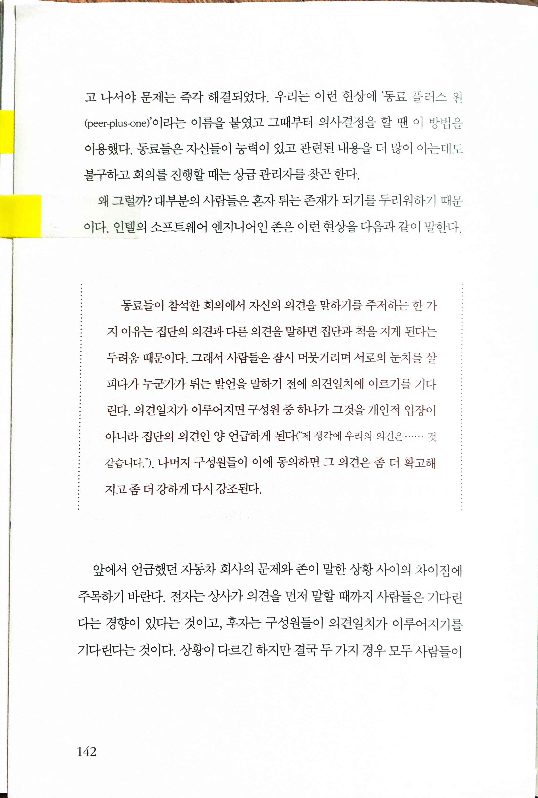

> 동료들이 참석한 회의에서 자신의 의견을 말하기를 주저하는 한 가지 이유는 집단의 의견과 다른 의견을 말하면 집단과 척을 지게 된다는 두려움 때문이다.

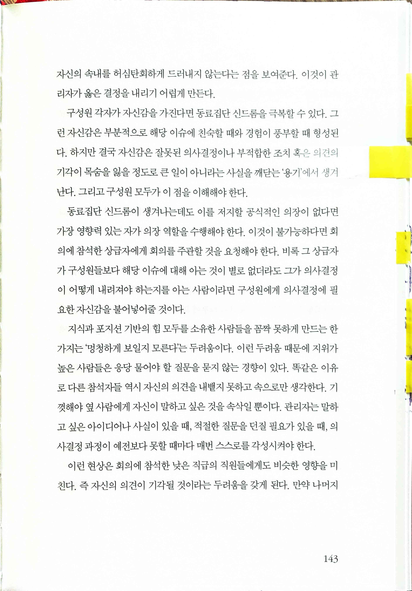

> 구성원 각자가 자신감을 가진다면 동료집단 신드롬을 극복할 수 있다... 결국 자신감은 잘못된 의사결정이나 부적합한 조치 혹은 의견의 기각이 목숨을 잃을 정도로 큰 일이 아니라는 사실을 깨닫는 '용기'에서 생겨난다. 그리고 구성원 모두가 이 점을 이해해야 한다.

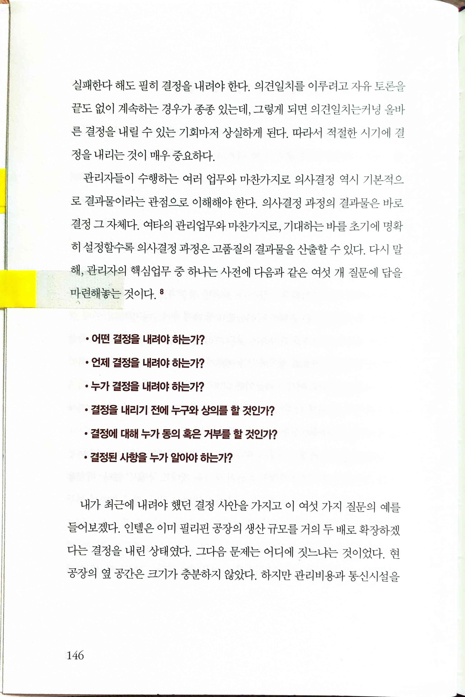

> 관리자의 핵심업무 중 하나는 사전에 다음과 같은 여섯 개 질문에 답을 마련해놓는 것이다.
>
> • 어떤 결정을 내려야 하는가?
>
> • 언제 결정을 내려야 하는가?
>
> • 누가 결정을 내려야 하는가?
>
> • 결정을 내리기 전에 누구와 상의를 할 것인가?
>
> • 결정에 대해 누가 동의 혹은 거부를 할 것인가?
>
> • 결정된 사항을 누가 알아야 하는가?

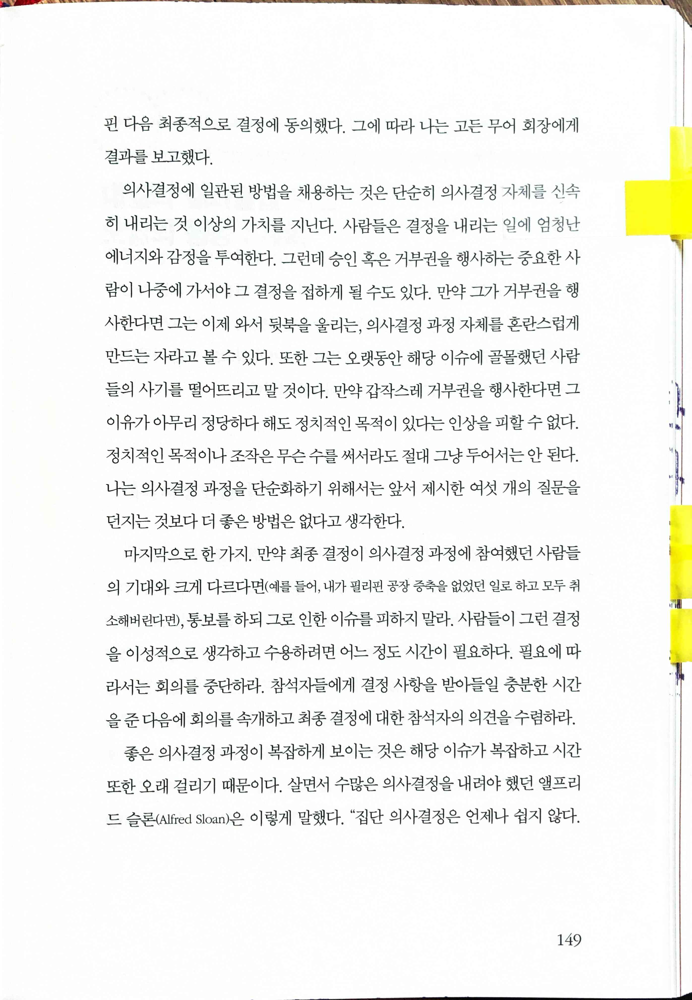

> 의사결정에 일관된 방법을 채용하는 것은 단순히 의사결정 자체를 신속히 내리는 것 이상의 가치를 지닌다. 사람들은 결정을 내리는 일에 엄청난 에너지와 감정을 투여한다. 그런데 승인 혹은 거부권을 행사하는 중요한 사람이 나중에 가서야 그 결정을 접하게 될 수도 있다. 만약 그가 거부권을 행사한다면 그는 이제 와서 뒷북을 울리는, 의사결정 과정 자체를 혼란스럽게 만드는 자라고 볼 수 있다. 또한 그는 오랫동안 해당 이슈에 골몰했던 사람들의 사기를 떨어뜨리고 말 것이다. 만약 갑작스레 거부권을 행사한다면 그 이유가 아무리 정당하다 해도 정치적인 목적이 있다는 인상을 피할 수 없다. 정치적인 목적이나 조작은 무슨 수를 써서라도 절대 그냥 두어서는 안 된다. 나는 의사결정 과정을 단순화하기 위해서는 앞서 제시한 여섯 개의 질문을 던지는 것보다 더 좋은 방법은 없다고 생각한다.

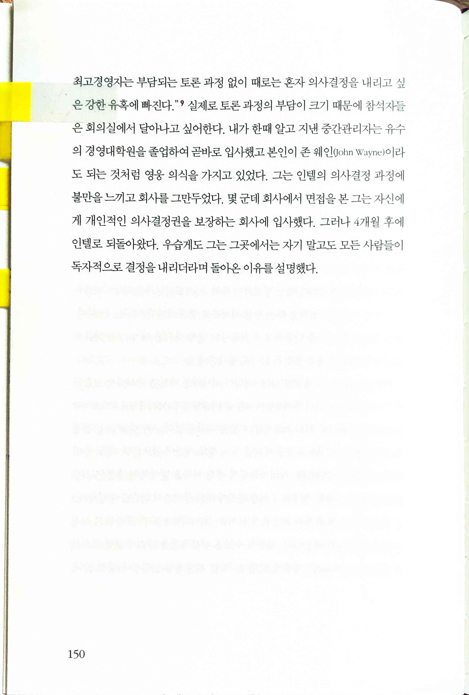

> 최고경영자는 부담되는 토론 과정 없이 때로는 혼자 의사결정을 내리고 싶은 강한 유혹에 빠진다. 실제로 토론 과정의 부담이 크기 때문에 참석자들은 회의실에서 달아나고 싶어한다.

### 6장 | 내일의 결과물을 위한 오늘의 행동 : 계획
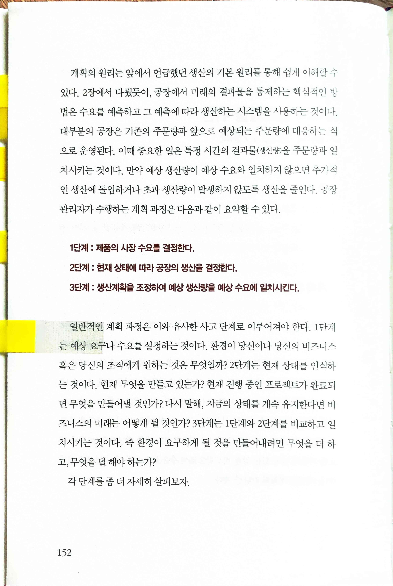

> 관리자가 수행하는 계획 과정
>
> 1단계: 제품의 시장 수요를 결정한다.
>
> 2단계: 현재 상태에 따라 공장의 생산을 결정한다.
>
> 3단계: 생산계획을 조정하여 예상 생산량을 예상 수요에 일치시킨다.
>
> 일반적인 계획 과정은 이와 유사한 사고 단계로 이루어져야 한다.

  

> 환경을 구성하는 것이 무엇인지 파악했다면, 환경을 현재의 시점과 미래의 시점(예를 들어 지금부터 1년 후)으로 살펴야 한다. 이때 던져야 할 질문은 이렇다. “고객은 지금 우리에게 무엇을 원하는가?”, “우리는 고객을 만족시키고있는가?”, “지금부터 1년 후에 고객은 우리에게 무엇을 기대할까? 관리자는 환경이 지금 요구하는 것과 1년 후에 요구할 거라고 예상되는 것 사이의 차이에 주목해야 한다. 이러한 차이 분석(difference analysis)은 매우 중요하다.현재의 활동이 현재의 요구를 충족시킨다 하더라도 그 차이를 대응하기 위해 더 많고 더 새로운 무언가를 착수해야 하기 때문이다. 그 차이에 어떻게 대응하느냐가 계획 과정의 핵심 산출물이다.
>
> 전략과 전술(tactics)을 혼동하는 경우가 많다. 둘을 구분하는 것이 실무적으로 의미가 없다 해도, 이것 한 가지는 분명히 차이가 있다. 의미 있는 행동들을 가장 개념적이고 포괄적으로 요약해 표현한 것이 바로 전략이다. 그리고 전략을 실현하기 위해 해야 할 것이 전술이 된다. 하위 관리자에게 전략인 것이 상위 관리자에게는 전술이 되는 경우가 흔하다. 문서수발실의 예를 다시 살펴보자. 전사의 의사소통 담당 임원이 모든 생산공장 간에 이메일 시스템을 구축하겠다고 결정을 내린다면, 그에게 이것은 공장 간의 의사소통 체계를 개선하기 위한 전략이 된다.


> 계획을 통해 이 질문에 답해야 한다. “미래의 문제를 해결하기 위해(혹은 피하기 위해) 지금 수행해야 할 일은 무엇인가?"
>
> 따라서 계획 과정의 진정한 결과물은 지금 바로 실행해야 할 업무들이다.

 

> 목표를 통한 관리(Management by Objectives, MBO) 시스템은 관리자의 관심이 단기적이기 때문에 환경이 요구하는 바를 정확히 파악해야 한다고 간주한다. 따라서 목표를 통한 관리는 계획 과정의 2단계와 3단계에 초점을 맞추고 이 단계를 최대한 구체화시키는 방법이다. MBO의 기본 원리는 지극히 단순하다. "어디로 가는지 알지 못하면 그곳에 다다르지 못할 것이다."
>
> 성공적인 MBO 시스템은 다음의 두 가지 질문을 충족시키면 된다.
>
> 1. 어디로 가길 원하는가?[이 질문이 답이 목표(objectives)다.]
>
> 2. 그곳에 도착했는지는 무엇을 보면 알 수 있는가?[이 질문의 답이 이정표 혹은 핵심결과 (key results)다.]

 

> MBO 시스템의 가장 뛰어난 장점은 바로 '집중'이다. 하지만 목표 개수가 너무 많으면 집중할 수 없다. 물론 실무적으로 목표 개수를 적게 유지하기란 쉽지 않다. 우리는 "아니요”라고 단호하게 말할 수 없어서 너무나 많은 목표를 수립하고 만다. 모든 것에 초점을 맞추면 아무것에도 집중하지 못한다는 사실을 깨달아야 한다. 엄선된 몇 개의 목표는 해야 할 것과 하지 말아야 할 것에 대한 분명한 메시지를 전달한다. MBO 시스템이 잘 돌아가려면 이 점을 명심해야 한다.

## PART 3 팀으로 이루어진 팀의 관리

### 7장 | 브렉퍼스트 팩토리의 성장


> 관리가 단순히 팀 게임이 아니라 '팀으로 이루어진 팀'의 게임, 즉 여러 개의 개별 팀이 적절한 상호 지원 관계 속에 이루어지는 게임

### 8장 | 하이브리드 조직


> “좋은 관리는 중앙집중과 지역분산을 최상으로 조합하는 데 달려 있다." 다시 말해 미션중심 조직의 민첩성과 기능 중심 조직의 레버리지 사이에서 최상의 조합을 찾아야 한다는 것이다.


> 가장 중요한 고려사항은 두 가지 조직 형태 사이를 왔다 갔다 하는 전환이 개별 조직을 이끄는 관리자의 운영 스타일 및 적성과 최대한 조화를 이루어야 한다는 점이다.

### 9장 | 이중보고


> 달 탐사 계획을 세우다가 의도치 않게 나타난 결과는 조직 운영의 새로운 접근 방식, 즉 '매트릭스 관리(matrix management)'였다.


> 조직에서도 개인의 의사결정을 집단에 위임하는 것은 동료 집단이 선택한 행동이 옳을 것이라는 믿음에서 나온다.

> 핵심은 만약 이중보고 체계와 동료 집단에 의한 의사결정이 제대로 작동하려면 강력하고 긍정적인 조직문화가 절대적으로 중요하다는 점이다... 엄격하리만큼 기능적인 조직은 개념적으로는 아주 명쾌하겠지만 엔지니어링과 생산(혹은 이와 비슷한 성격의 부서)을 시장과 동떨어지게 하고 고객이 원하는 것이 무엇인지 알지 못하게 만드는 경향이 있다. 반면, 매우 미션 중심적인 조직은 확실한 보고 체계가 구축되어 있고 언제나 명확한 목적을 가지고 일할 수 있다. 하지만 업무가 분산되어 있어서 비효율과 전반적인 성과 저하를 야기한다.


> 좋든 싫든, 하이브리드 조직 형태는 조직의 본질적인 현상이다.


> 핵심은 양면 조직(혹은 다면 조직)이 아주 유용하다는 점이다... 그런 조직 구조는 융통성을 제공하는 수단이다.


> 두 가지 체계에 공통적인 핵심요소는 통제의 방식으로서 문화적 가치관을 활용하는 것이다.

### 10장 | 통제의 방식


> 한 가지 방법은 그러한 가치, 목표, 수단을 명백히 설명하고 '표현(articulation)'하는 것이다. 이보다 더 중요한 방법은 자신이 '모범(example)'이 되는 것이다. 직장에서 관리자의 행동이 가치에 대한 기준(모범)으로 간주된다면, 그로 인해 집단의 문화 발전이 촉진될 수 있을 것이다.


> 어떻게 통제해야 할까? 여기에는 두 가지 변수가 존재한다. 하나는 개인적 동기의 특성이고, 다른 하나는 그가 일하는 환경의 특성이다. 업무환경의 특성은 복잡성(Complexity), 불확실성(Uncertainty), 모호성(Ambiguity)으로 이루지는 데 머리글자를 따 'CUA 요소'라고 부르자.


> 어떤 통제 방식이 가장 적합한지를 규명하는 것이 관리자의 일이다.


 

> 사업부들이 공동의 이익(회사 전체의 이익)보다 자기네 이익에 더 많은 관심을 가진다면, 교육 과정은 일관성을 잃어버릴 것이고 모든 사람을 혼란에 빠뜨릴 것이다.

## PART 4 플레이어

### 11장 | 스포츠에서 배우는 관리의 기법


> '관리자의 결과물은 그가 관리하거나 영향력을 미치는 조직의 결과물'
>
> 이 말은 관리가 팀 활동이라는 의미다. 하지만 팀이 얼마나 잘 화합하고 얼마나 목표를 향해 잘 가는지와 관계없이, 팀의 성과는 개개인의 성과에 달려 있다. 만약 팀원들이 최선을 다하지 않는다면 지금껏 언급했던 모든 것이 무의미해진다.


> 관리자의 업무 중 가장 중요한 것은 자신의 직원들에게 최고의 성과를 끌어내는 것이다. 이런 이슈를 해결하기 위해 관리자가 취할 수 있는 방법은 '교육'과 '동기부여'다.


> 관리자가 어떻게 해야 직원의 동기를 높일 수 있을까? 대부분의 사람들은 동기를 다른 사람에게 부여할 수 있다고 여긴다. 하지만 나는 그렇지 않다고 생각한다. 왜냐하면 동기는 내면에서 생기는 것이기 때문이다. 따라서 관리자가 할 수 있는 것은 동기가 충만한 직원들이 잘 활동할 수 있는 환경을 조성하는 것뿐이다.


> 핵심은 '역량 기반의 힘과 성취 기반의 힘을 모두 지닌 사람은 자발적으로 자기 능력의 최대치를 시험하고자 한다는 점이다.


> 성취 기반의 동기를 육성하기를 원한다면 결과물을 중시하고 강조하는 환경을 조성해야 한다.


> 어떤 사람이 욕구 피라미드의 어느 단계에 있는지 알아내는 간단한 방법이 있다. 승진으로 인해 늘어나는 급여의 절대적 총액이 중요하다면 생리적 혹은 안전 욕구 단계에 있는 것이다. 반면 다른 사람들이 받는 것에 비해 본인이 얼마나 많이 받느냐 상대적 비교)가 중요하다면 그는 인정 혹은 자아실현 욕구 단계에 있는 것이다. 이때 돈은 성취의 척도로서 의미가 있다.


> 업무 관련 피드백의 가장 중요한 형태가 바로 모든 직원들이 상사로부터 반드시 받아야 하는 '성과 평가(performance review)'다.


> 문화적인 편견을 극복해야 한다. 우리 사회는 스포츠에 온힘을 다하는 사람을 존중하지만 아주 오랜 시간을 일하는 사람은 어딘가 아픈 사람이라고 생각한다. '일중독자(workaholic)'이라고 부르는 것이다. 이런 편견을 가진 사람들 대다수는 스포츠는 유익하고 재미있지만 업무는 고역이고 필요악이며 절대 즐거움의 원천일 수 없다고 말한다.
>
> 최고의 성과를 끌어낸다는 말은 무언가 혹은 누군가를 이긴다는 의미다.

### 12장 | 업무 관련 성숙도에 따른 관리 기술


> 관리자의 가장 중요한 임무는 직원에게 최고의 성과를 끌어내는 것이다. 무엇이 직원의 동기를 끌어올리는지 이미 알고 있다면, 다른 어떤 것보다 효과적인 최고의 관리 스타일이 존재하는가가 새로운 문제로 부각된다.


> 직원의 TRM에 따라 다양한 방식의 관리 스타일이 필요하다. 특히 직원의 TRM이 낮을 때 가장 효과적인 방식은 무엇이, 언제, 얼마나 필요한지에 관하여 매우 정확하고 상세한 지시를 내리는 것이다. 다른 말로, 아주 구조적인 방식을 취해야 한다. 직원의 TRM이 높아지면 효과적인 관리 스타일은 구조적인 방식으로부터 소통, 감정적 지지, 격려가 요구되는 방식으로 변화된다. 즉 관리자는 담당 업무가 아니라 개인적으로 직원에게 좀 더 관심을 기울이는 것이 바람직하다.


> 직원 교육의 책임은 전적으로 상사에게 있고, 내부고객이나 외부고객이 그 부담을 지도록 해서는 안 된다.


> 문제는 바로 관리자 본인에 대한 인식이다. 관리자는 자신을 실제보다 더 의사소통을 잘하고 업무 위임을 잘하는 사람으로 보는 경향이 있다(직원보다 자신이 훨씬 낫다고 여기는 것은 물론이고).


> 사회적 대인관계와 부하직원의 업무 수행에 요구되는 의사소통 기반의 관리 스타일에는 엄청난 차이가 있다. 업무 외적인 친밀한 관계는 업무적으로 동일한 관계를 형성하는 데 도움이 될 수 있지만 둘을 혼동해서는 안 된다.


> 무엇이 프로다운 것이고 적절한 것인지를 결정해야 한다.

### 13장 | 관리자의 가장 큰 역할 : 성과 평가


> 성과 평가의 근본적 목적은... 바로 '직원의 성과를 향상시키기 위해서'라는 점이다.


> 평가를 쉽게 하려면 관리자는 직원에게 기대하는 것이 무엇인지 정확하게 알고 있어야 한다. 그래야 직원이 기대에 부합되게 업무를 수행했는지를 판단할 수 있다. 대부분의 평가에서 가장 큰 문제는 직원에게 무엇을 원하는지 관리자가 명확하게 정의하지 않는 것이다. 원하는 것을 알지 못하면 그것을 얻을 수 없을 것이다.


> 관리의 '블랙박스'란 개념을 다시 꺼내 생각해보자. 블랙박스라는 개념을 사용하면 결과물 측정값(output measure)'과 '내부적 측정값(intermal measure)'으로 성과를 특징지을 수 있다. 결과물 측정값은 블랙박스의 결과물... 내부적 측정값은 블랙박스 안에서 진행하는 활동... 관리자는 이 두 변수가 서로 트레이드 오프 관계에 있음을 인식해야 한다.
>
> 비슷한 트레이드 오프 관계가 또 있는데, 바로 장기 관점의 성과(long-term-orinented)와 단기 관점의 성과(short-term-oriented)


> 관리자가 피해야 할 큰 함정은 '잠재력이라는 덫'이다. 어떠한 경우라도 성과를 평가해야 하지 잠재력을 평가하지 않도록 늘 경계해야 한다. 여기서 말하는 잠재력은 본질이라기보다 외양이다... 관리자의 성과 평가 점수는 그가 담당하는 부서의 점수보다 높을 수 없기 때문이다! 외양이 아니라 실제적이고 실질적인 성과를 평가해야 하는 것이 매우 중요하다.


> 평가 결과를 전달하기 위해 명심해야 할 세 개의 'L'이 있다. 그것은 바로 '솔직(level)하게' 말하고 상대방의 말을 '경청(listen)'하고 자기 자신을 '배제(leave out)해야 한다'는 것이다.
>
> 관리자는 직원에게 솔직하게 말해야 한다. 회사에 대한 전반적인 신뢰와 품격은 직원들에게 얼마나 솔직하냐에 달려 있다. 관리자는 누군가를 직접적으로 칭찬하는 것이 그를 주저없이 비난하는 것만큼이나 어렵다는 사실을 깨달아야 한다.

 

> 어떻게 해야 몇 개의 핵심내용에 집중할 수 있을까? 첫째, 직원의 성과에 대해 가능한 한 많은 측면들을 고찰하라. 이를 위해 업무진행 보고서, 분기 목표 대비 실적, 일대일 면담 기록 등과 같은 자료를 살펴봐야 한다. 그런 다음 백지 한 장을 펼쳐놓고 자리에 앉아 직원의 성과에 대해 머릿속에 떠오르는 것을 모두 적어라. 떠오르는 내용을 편집하지 말고 모든 사항을 종이에 써라. 중요한 일뿐만 아니라 사소한 일도 생각나는 대로 적어야 하며, 더 이상 적을 내용이 없으면 모든 참고자료들을 책상에서 치워버려야 한다.


> 그런 내용을 직원에게 전달할까 말까 고민하겠지만 성과 평가의 목적이 직원의 성과를 향상시키는 것이기에 반드시 그 메시지를 전달해야 한다. 뜻밖의 내용이 없으면 좋겠지만 만일 그것을 알게 됐다면 반드시 그것을 끄집어내야 한다.


> 해결책을 찾는 것은 공동의 과업이지만 직원이 본인의 책임임을 인정하는 단계까지 이르도록 만드는 것은 관리자가 해야 할 일이다.


> 일이 되게 하려고 다른 사람들을 본인의 의견에 억지로 동의하도록 만들 필요는 없다. 결정된 일련의 행동을 실천하겠다고 약속하게 만들면 그만이다. 자신이 가지 않을 길을 다른 사람이 걸어가기를 바라는 것은 그리 올바른 생각이 아니다. 자신의 심리적 안정이 아니라 직원의 성과에 초점을 맞춰야 한다.


> 부하직원이 타인을 비난하는 단계에서 벗어나지 않으려 한다는 확신이 들면, 관리자의 직권으로 이렇게 말해야 한다... 그런 다음, 직원이 실천을 약속하도록 만들고 그 후에는 그 약속을 얼마나 준수하고 성과를 내는지 모니터링해야 한다.


> 평가의 핵심목적이 직원의 미래 성과를 향상시키는 것임에도 불구하고 평가서의 대부분에서 성과를 향상시키거나 현 수준을 유지하기 위해 직원에게 필요한 것을 규명하려는 시도가 전혀 나타나지 않았던 것이다. 관리자들은 우수직원의 훌륭한 성과를 판단하고 정당화하려고만 했지 어떻게 하면 더 향상시킬 수 있을지에 관해서는 아무런 관심을 보이지 않았다... 스타 직원들에게 집중하는 것이 레버리지가 높은 활동이다. 그들의 성과가 더 높아진다면 그들이 조직의 결과물에 미치는 영향은 매우 클 것이다.


> 관리자의 핵심 업무가 직원의 성과를 평가하는 것임을 직원들에게 명확하게 이해시켜야 한다. 부하직원이 상사를 평가하는 것은 어디까지나 참고사항이라는 뜻이다. 여기서 요점은 부하직원이 관리자의 리더가 아니다라는 점이다. 관리자가 부하직원의 리더다. 어떤 상황에서라도 성과 평가가 진행되는 동안 관리자와 부하직원이 동등한 입장에 있다고 간주해서는 안 된다.


> 가장 좋은 시점은 일대일 면담 전에 서면 평가서를 직원에게 전달하는 것이다.

  

### 14장 | 가장 어려운 임무 : 면접과 퇴사 만류


> 감정적으로 어려운 일이지만 관리자가 수행해야 할 두 가지 임무가 있다. 그것은 잠재적 직원(즉 채용 지원자)을 면접하는 것이고 그만두려는 우수직원을 설득하는 것이다.


> 성과 평가가 어려운 일이라면 면접은 불가능에 가까운 일이다. 물론 면접이 아무리 어렵다 하더라도 그것 외에 달리 선택의 여지가 없는 것 또한 사실이다. 하지만 면접 실패의 리스크가 높다는 점을 미리 인식해야 한다.

 

> 면접에서 이야기를 나눠야 할 주제


> 1. 기술적 지식 · 스킬
>
> • 수행했던 프로젝트에 관한 질문
>
> • 약점에 대한 질문
>
> 2. 지식을 바탕으로 수행한 것
>
> • 과거의 성취에 대한 질문
>
> • 과거의 실패에 대한 질문
>
> 3. 능력과 성과와의 불일치
>
> • 실패로부터 배운 것에 관한 질문
>
> • 현재 겪고 있는 문제에 관한 질문
>
> 4. 조직가치
>
> • 새로운 직무를 수행할 준비가 됐는지에 관한 질문
>
> • 채용해야 하는 이유에 관한 질문
>
> • 마케팅 직위에 엔지니어를 뽑아야 하는 이유에 관한 질문
>
> • 대학 때 가장 중요했던 과정과 프로젝트에 관한 질문


> 면접관은 면접을 진행하는 동안 자유롭게 지원자의 과거와 현재를 넘나들어야 하고 지원자의 과거 성과에 대한 설명을 기초로 새로운 환경에서 미래에 달성할 성과를 추측해야 한다. 관리자의 업무로서 이는 분명 까다롭고 리스크가 큰일이지만 피할 방법이 없다.


> 아무리 주의를 기울여 면접을 진행하더라도 아무것도 보장하지 못한다. 행운을 얻을 확률을 조금 늘려줄 뿐이다.


> 하던 일을 중단하라. 그를 자리에 앉히고 그만두려는 이유를 물어라. 그가 말하도록 하되 직원과 논쟁을 벌이지 마라.


> 그만두겠다는 직원이 회사에서 가치 있는 존재라면 온갖 수단과 방법을 사용하여 그를 회사에 붙잡아두어야 한다.

### 15장 | 피드백을 통한 보상


> 관리자의 관심은 직원에게 높은 성과를 끌어내는 것이다. 그렇기 때문에 관리자는 '업무 관련 피드백'의 도구로서 돈을 지출하고 할당하고 사용해야 한다. 그렇게 하려면 보상은 성과에 확실히 연계되어야 한다. 하지만 이미 살펴봤듯이 성과를 정확하게 평가하기란 매우 어렵다. 일의 분량에 따라 중간관리자에게 돈을 지급할 수 없기 때문에 그의 직무는 단순히 결과물만으로 정의될 수 없다. 또한 그의 성과는 팀 전체의 성과에 걸쳐져 있기 때문에 중간관리자 개인의 성과에 직접적으로 연계된 보상 방식을 설계하기가 어렵다.


> 누가 승진하는가는 구성원에게 항상 노출되기 마련이라서 승진은 회사 전체에 가치 시스템을 소통하는 데 매우 중요한 역할을 담당한다. 승진은 반드시 성과에 근거해야 한다.


> 승진이 불가능한 단계, 즉 '무능함' 수준에 도달할 때까지 승진시키는 것 외에 다른 선택은 없다.


> 아주 높은 위치까지 승진한 사람이 오랫동안 평균 이하의 성과를 보이는 경우가 많다. 이에 대한 해결책은 그를 '재생(recycle)'하는 것이다. 즉 그를 승진하기 전 일을 잘 해내던 때의 직무로 돌려놓는 것이다.

### 16장 | 직원 교육이 관리자의 책임인 이유


> 모든 게 직원을 제대로 교육하지 않았기 때문이다.


> 교육은 관리자의 업무라고 확신한다.


> 일반적으로 관리자에게는 직원의 개별적 성과 수준을 끌어올리는 두 가지 방법이 있다. 하나는 업무를 잘 해내겠다는 개인의 동기를 높이는 것이다. 다른 하나는 개인의 능력을 향상시키는 것인데, 바로 이것이 교육이 개입되는 부분이다. 직원의 동기를 높이는 것은 모든 관리자의 핵심업무라는 말은 당연하게 받아들여지고 있다. 그런데 어떤 이유로 결과물을 향상시키기 위한 도구 가운데 하나인 교육은 관리자의 의무로 여겨지지 않는 것일까?


> 교육이 효과적이려면 믿음직하고 일관된 체계를 유지해야 한다. 직원들은 체계적이고 계획적인 교육을 받아야 하지 일시적인 문제 해결을 위한 구조 수단으로 교육을 받아서는 안 된다. 다시 말해, 교육은 과정이어야 하지 이벤트여서는 안 된다.


> 교육의 필요성을 절감한다면 관리자인 당신은 무엇을 해야 할까? 먼저 직원이나 부서 구성원이 교육을 받아야 한다고 생각하는 것들을 목록으로 작성하라. 목록의 범위에 한계를 두지 마라. 간단한 것들(예약 전화를 받는 교육부터 부서, 공장, 회사의 목표와 가치 시스템과 같은 고차원적이고 보다 보편적인 것에 이르기까지 모두 목록에 포함시켜야 한다. 직원들에게 필요한 것이 무엇인지 물어라.

 

> • 교육은 힘든 일이다. 강의를 준비하고 쏟아지는 모든 질문에 대처할 준비를 한다는 것은 어렵다. 현 직무에서 오랫동안 일했고 직원의 직무를 속속들이 잘 안다 하더라도 자신이 모르는 게 엄청나게 많다는 사실에 놀랄 것이다. 실망하지 마라. 당연한 것이니까. 어떤 업무를 수행하는 것보다 가르칠 때 훨씬 더 많은 지식이 필요하다.
>
> • 누가 교육을 통해 가장 많이 배울까? 바로 당신이다. 교육 과정을 개발하다 보면 자신의 업무에 대한 이해가 높아지는데, 그것만으로도 노력할 가치가 매우 충분하다.
>
> • 교육 과정이 잘 진행될 때의 즐거움은 직원이 배운 내용을 실천하는 것을 볼 때의 가슴 따뜻한 기분에 비하면 아무것도 아니다. 그런 즐거움과 훈훈한 기분을 만끽하라. 두 번째 과정을 준비하는 데 도움이 될 것이다.

## 한 가지 더


> 꾸준히 실천하라

 

## 이 책을 옮기며 | 기술이 발전할수록 관리의 힘은 커진다


> 자신이 어떤 식으로 관리의 레버리지를 높이는지를 예시하고 그런 활동이 '성과'라는 아웃풋을 산출하는 생산 활동과 다를 바 없음을 증명한다. 이 책의 제목이 'High Output Management'인 이유가 바로 이것이다.


> 이렇게 엔지니어적 관점으로 이론을 현장에 적용하려고 애쓰는 경영자를 나는 여태 보지 못했다.