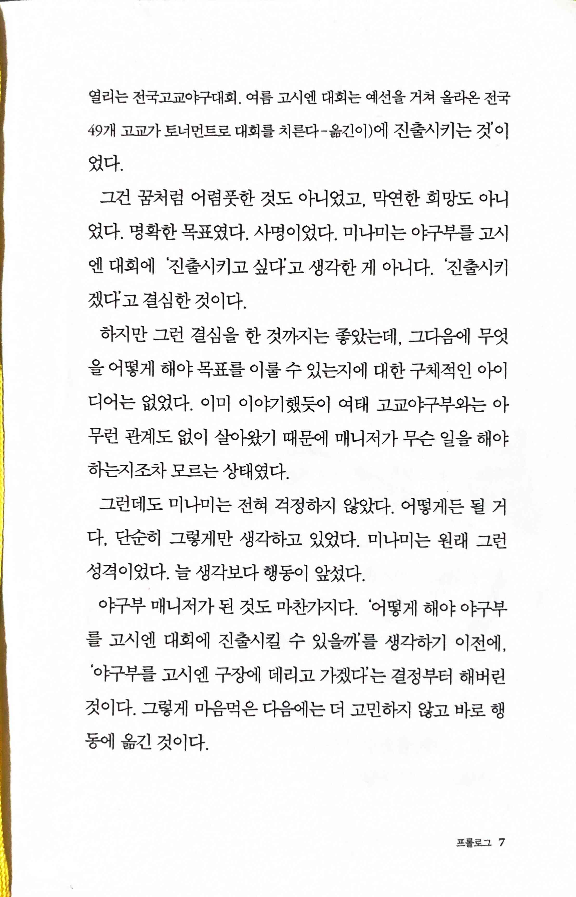
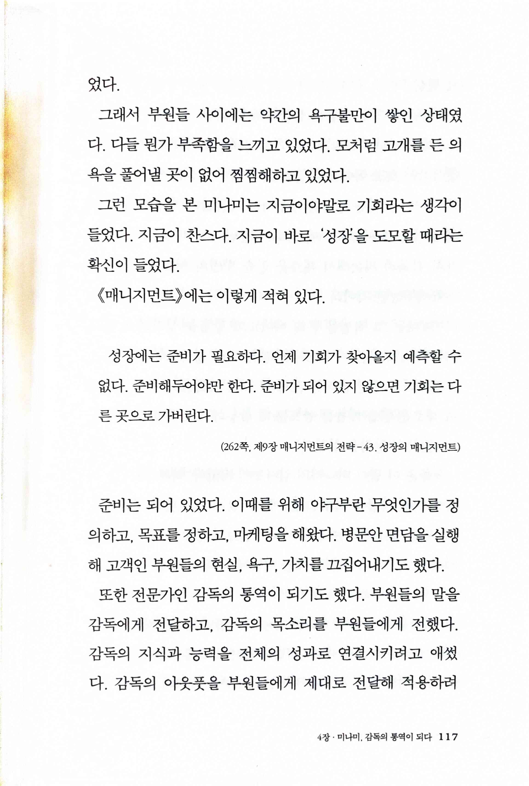

만약 고교야구 여자 매니저가 피터 드러커를 읽는다면
==================================================

> 그건 꿈처럼 어렴풋한 것도 아니었고, 막연한 희망도 아니었다. `명확한 목표`였다. `사명`이었다. 미나미는 야구부를 고시엔 대회에 진출시키고 싶다'고 생각한게 아니다. '진출시키겠다'고 결심한 것이다.

> 사람을 관리하는 능력과 함께 의장 역할이나 면접 능력은 배울 수 있다. 관리 시스템, 승진과 포상 제도를 통해 인재 개발에 효과적인 방법을 강구할 수도 있다. 하지만 그것만으로는 충분하지 않다. 근본적인 자질이 필요하다. `진지함`이다.

> `성장`에는 준비가 필요하다. 언제 기회가 찾아올지 예측할 수 없다. 준비해두어야만 한다. 준비가 되어 있지 않으면 기회는 다른 곳으로 가버린다.