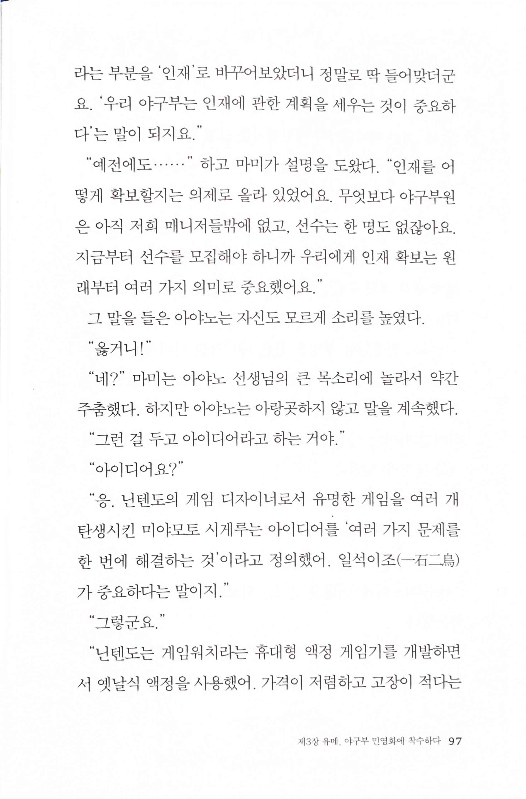
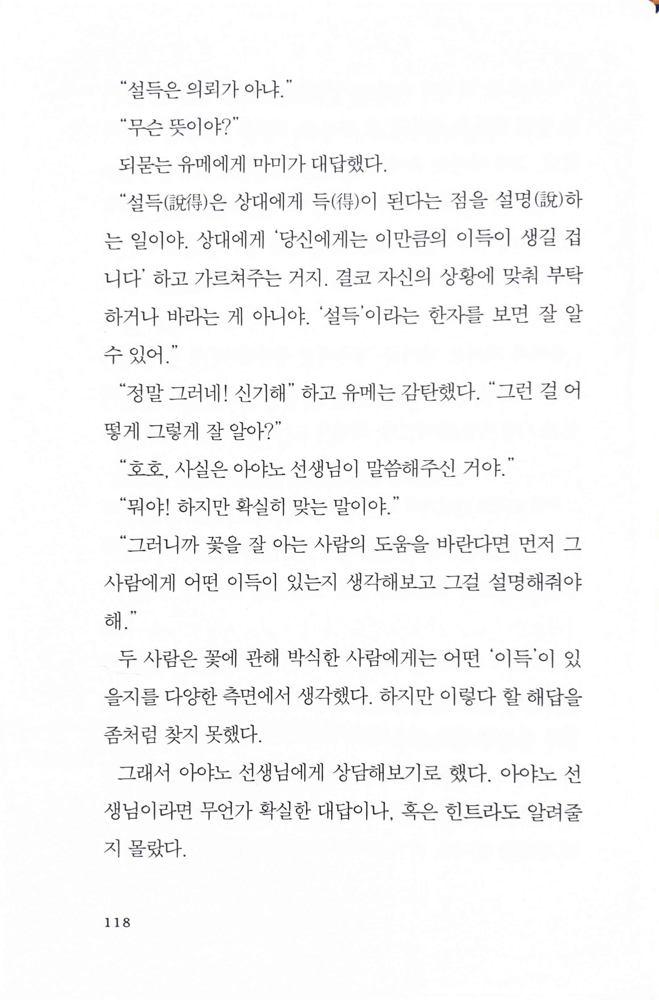
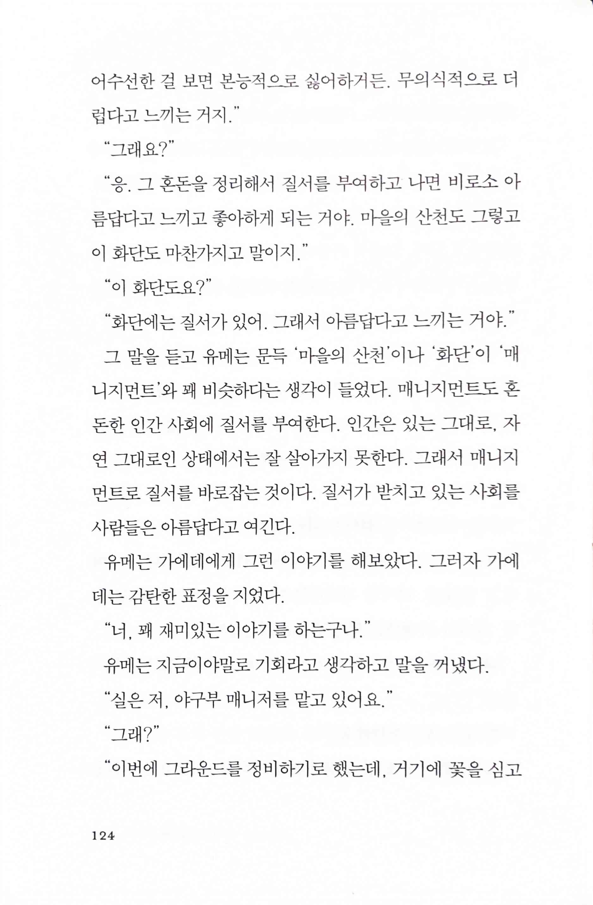
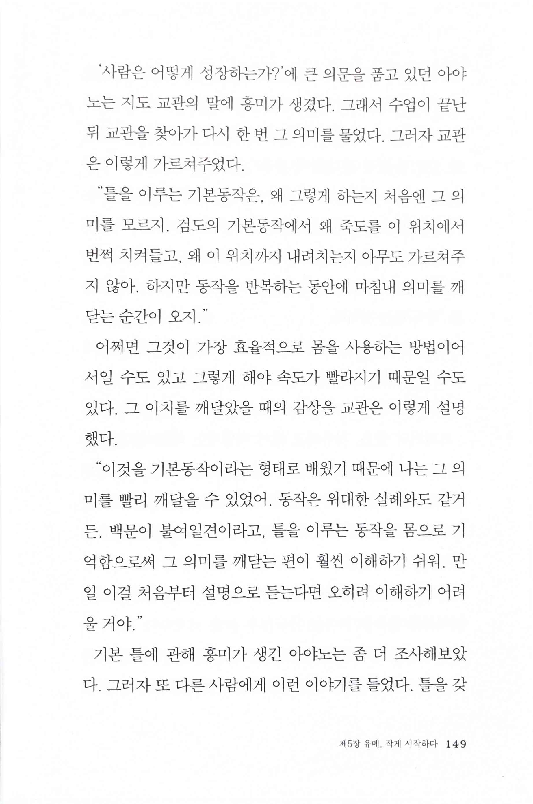
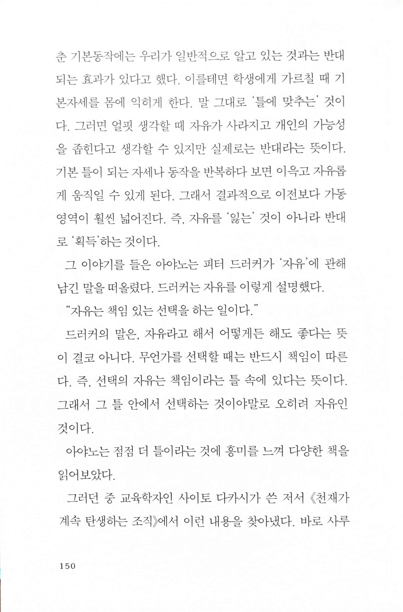
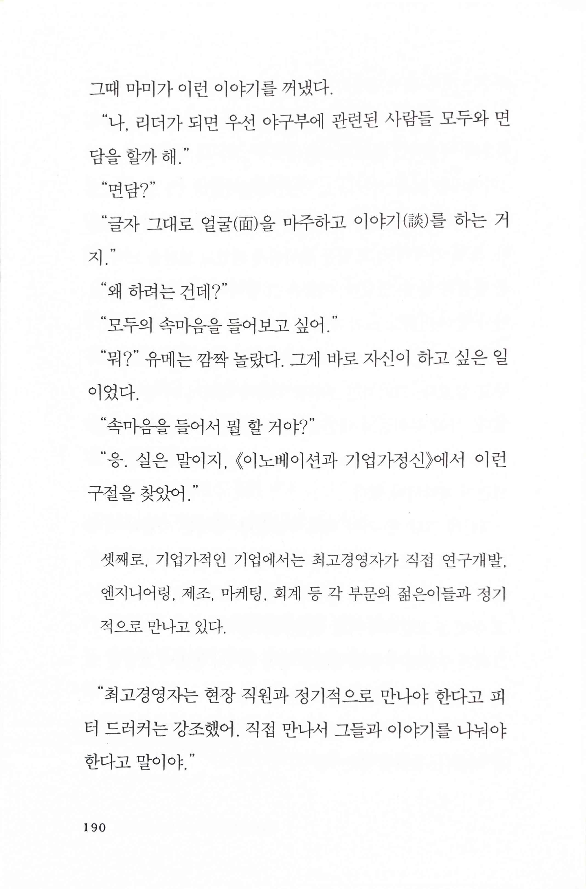
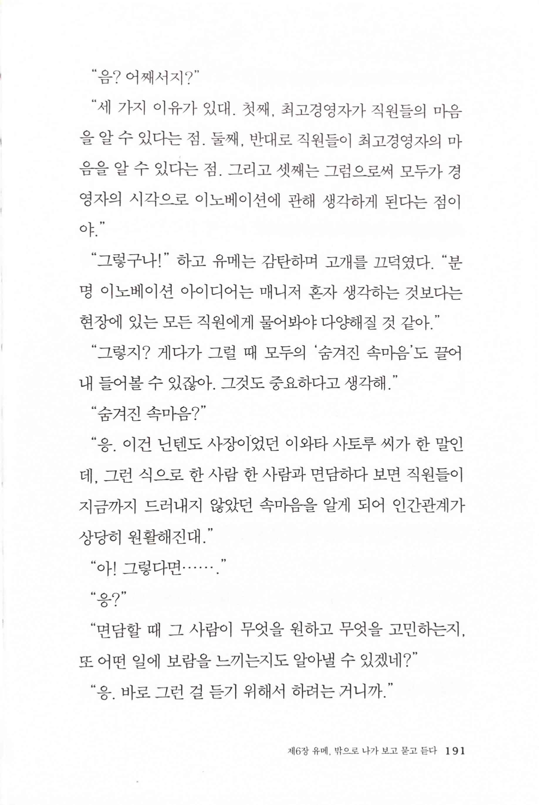
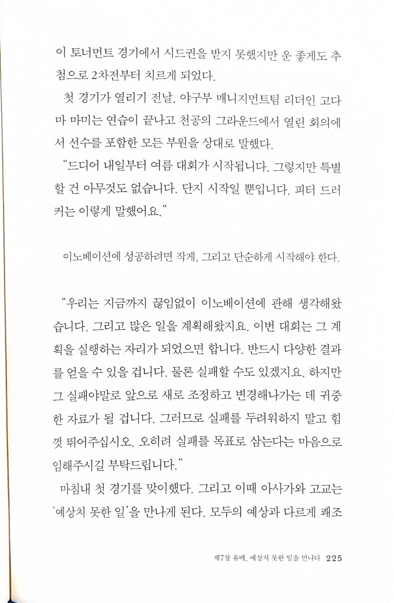
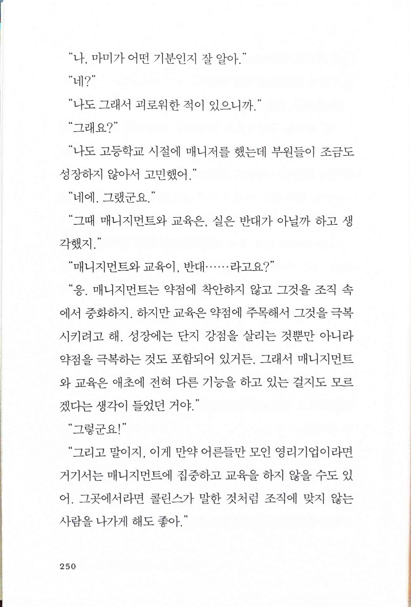

만약 고교야구 여자 매니저가 피터 드러커를 읽는다면 이노베이션과 기업가정신편
============================================================================

> 닌텐도의 게임 디자이너, `미야모토 시게루`는 아이디어를 '여러 가지 문제를 한 번에 해결하는 것'이라고 정의했어. 일석이조(一石二鳥)가 중요하다는 말이지.

> “`설득(說得)`은 상대에게 득(得)이 된다는 점을 설명(說)하는 일이야. 상대에게 '당신에게는 이만큼의 이득이 생길 겁니다' 하고 가르쳐주는 거지. 결코 자신의 상황에 맞춰 부탁하거나 바라는 게 아니야. '설득'이라는 한자를 보면 잘 알 수 있어."

> `매니지먼트`도 혼돈한 인간 사회에 질서를 부여한다. 인간은 있는 그대로, 자연 그대로인 상태에서는 잘 살아가지 못한다. 그래서 매니지먼트로 질서를 바로잡는 것이다. 질서가 받치고 있는 사회를 사람들은 아름답다고 여긴다.

> "이것을 기본동작이라는 형태로 배웠기 때문에 나는 그 의미를 빨리 깨달을 수 있었어. 동작은 위대한 실례와도 같거든 백문이 불여일견이라고, 틀을 이루는 동작을 몸으로 기억함으로써 그 의미를 깨닫는 편이 훨씬 이해하기 쉬워 만일 이걸 처음부터 설명으로 듣는다면 오히려 이해하기 어려울 거야."
* 몸을 써야 한다는 점은 동의하지만, 의미를 모른 채 반복을 하는 걸 얼마나 해야 할지 모른다는 건 요즘 시대에는 쉽게 설득하긴 어려운 일 아닐까?

> 틀을 갖춘 기본동작에는 우리가 일반적으로 알고 있는 것과는 반대되는 효과가 있다고 했다. 이를테면 학생에게 가르칠 때 기본자세를 몸에 익히게 한다. 말 그대로 '틀에 맞추는 것이다. 그러면 얼핏 생각할 때 자유가 사라지고 개인의 가능성을 좁힌다고 생각할 수 있지만 실제로는 반대라는 뜻이다. 기본 틀이 되는 자세나 동작을 반복하다 보면 이윽고 자유롭게 움직일 수 있게 된다. 그래서 결과적으로 이전보다 가동영역이 훨씬 넓어진다. 즉, 자유를 잃는 것이 아니라 반대로 '획득'하는 것이다.
>
> 드러커는 자유를 이렇게 설명했다. “`자유`는 책임 있는 선택을 하는 일이다."

 

> `면담` "글자 그대로 얼굴(面)을 마주하고 이야기(談)를 하는 거지."
>
> 셋째로, 기업가적인 기업에서는 최고경영자가 직접 연구개발, 엔지니어링, 제조, 마케팅, 회계 등 각 부문의 젊은이들과 정기적으로 만나고 있다.
>
> "세 가지 이유가 있대. 첫째, 최고경영자가 직원들의 마음을 알 수 있다는 점. 둘째, 반대로 직원들이 최고경영자의 마음을 알 수 있다는 점. 그리고 셋째는 그럼으로써 모두가 경영자의 시각으로 이노베이션에 관해 생각하게 된다는 점이야.'
>
> 닌텐도 사장, `이와타 사토루`, 그런 식으로 한 사람 한 사람과 면담하다 보면 직원들이 지금까지 드러내지 않았던 속마음을 알게 되어 인간관계가 상당히 원활해진다.

> 피터 드러커, `이노베이션`에 성공하려면 작게, 그리고 단순하게 시작해야 한다.
>
> 실패야말로 앞으로 새로 조정하고 변경해나가는 데 귀중한 자료

> “그때 매니지먼트와 교육은 실은 반대가 아닐까 하고 생각했지."
>
> “응. 매니지먼트는 약점에 착안하지 않고 그것을 조직 속에서 중화하지. 하지만 교육은 약점에 주목해서 그것을 극복시키려고 해. 성장에는 단지 강점을 살리는 것뿐만 아니라 약점을 극복하는 것도 포함되어 있거든. 그래서 매니지먼트와 교육은 애초에 전혀 다른 기능을 하고 있는 걸지도 모르겠다는 생각이 들었던 거야."