# How to Win Friends & Influence People 데일 카네기 인간관계론 
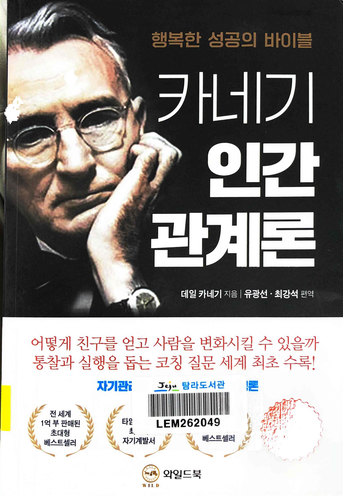

* 어떻게 보면 너무 뻔한, 마치 권선징악같은 이야기라고 볼 수 있다(이 책의 초판이 1936년에 나오기도 했다). 그래서 어렸을 때라면 절대 읽지 않았을 법한 책이고 책을 다 읽은 지금도 어떤 부분들은 여전히 공감이 가지 않기도 한다. 하지만, 바꿔 생각해보면 내가 항상 같이 일하는 사람들에게 기초/기본을 강조하는데 그게 중요한 걸 알아도 다들 무시하고 실천하지 않으며 실제로 하려고 하면 생각보다 꾸준히 하는게 정말 어려워서 실행하는 사람들이 적은 건데, 이런 내용도 비슷한 맥락으로 생각해야 하는 게 아닌가 하는 생각이 들었다. 특히 가정에 대한 이야기는 좀 더 내가 신경써야 하는 부분이기도 하고, 책에서도 실천하지 않을 거면 이 책을 읽지도 말라고 했으니... 하다못해 한 가지라도 실천해봐야겠다.

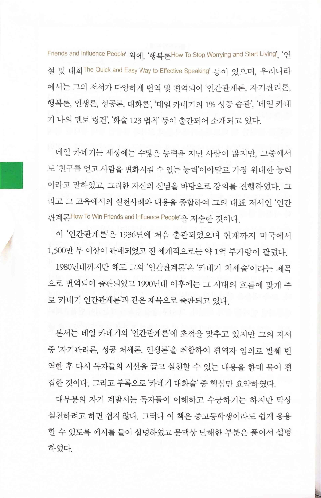

> '친구를 얻고 사람을 변화시킬 수 있는 능력'이야말로 가장 위대한 능력

## 제1장 인간관계의 기본

### 인간관계는 관심과 배려에서 시작된다
> 순수한 관심을 보여주어야 한다

### 받고 싶거든 베풀어야 한다
> 존 듀이 교수는 '중요한 인물이 되고자 하는 욕망은 인간의 가장 뿌리깊은 욕구'라고 말하고 있다.
>
> 또 윌리엄 제임스 교수는 '인간성의 근원을 이루는 것은 타인에게 인정받고 싶다는 소망'이라고 단언하고 있다.
>
> 그리스도는 그것을 다음과 같은 말로 설법했다. "남으로부터 받고 싶거든 베풀어라!"

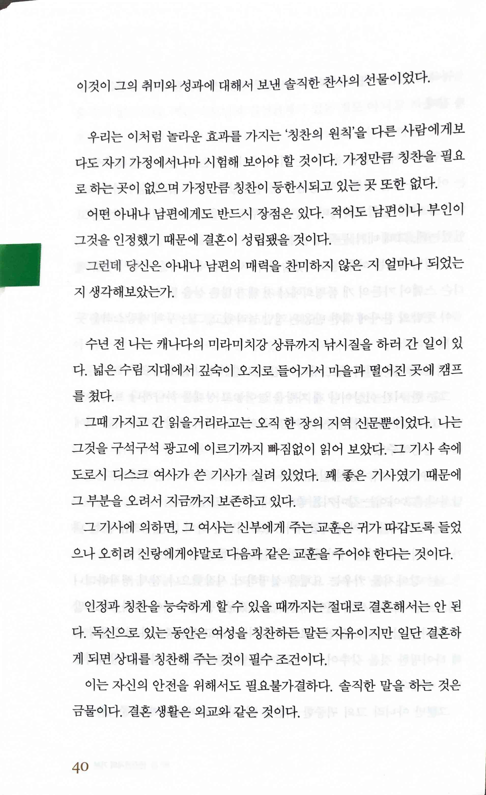

> 가정만큼 칭찬을 필요로 하는 곳이 없으며 가정만큼 칭찬이 등한시되고 있는 곳 또한 없다.

> 사람은 누구나 타인보다 어떤 점에서는 뛰어나다고 생각한다. 그러니까 상대의 마음을 확실하게 얻는 방법은 상대가 중요한 인물이라는 것을 부각시키고 그것을 인정하는 것이다.

### 상대방을 설득하는 방법
> 시비를 피해야 한다

> 나는 남의 의견에 정면으로 반대하거나 내 의견을 단정적으로 말하지 않기로 했다. 결정적인 의견을 의미하는 그런 말, 가령 '확실히'라든가 '틀림없이' 따위와 같은 말은 아예 사용하지 않고 그 대신에 '저로서는 이렇게 생각하지만......'이라든가 '나는 그렇게 생각되지만…….' 하고 말하기로 했다.
>
> 상대방이 분명히 잘못된 말을 주장해도 곧 그것에 반대하거나, 상대의 잘못을 지적하는 것을 단념했다. 그리고 '하긴 그런 경우도 있겠지만, 그러나 이 경우는 좀 사정이 다르게 생각되는데……. 라는 식으로 운을 떼기도 했다.
>
> 이렇게 해서 지금까지의 방법을 바꾸어 보니 매우 이익이 되었다. 타인과의 대화가 이전보다도 훨씬 쉽게 진척되었다. 겸손하게 의견을 말하니 상대는 곧 납득을 하고 반대하는 사람도 적어졌다. 자신의 잘못을 인정하는 것이 그다지 고통스럽지 않게 되었으며, 또 상대의 잘못을 보다 더 쉽게 인정시킬 수 있었다.
>
> 이 방법을 처음 사용하기 시작했을 무렵에는 자기의 성질을 억제하는데 상당한 고민을 느꼈으나 마지막에는 능히 그것을 극복하게 되었으며 몸에 밴 습관이 되어 버렸다.

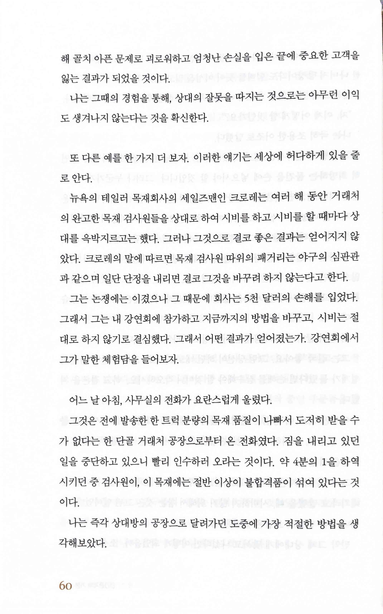

> 상대의 잘못을 따지는 것으로는 아무런 이익도 생겨나지 않는다는 것을 확신한다.

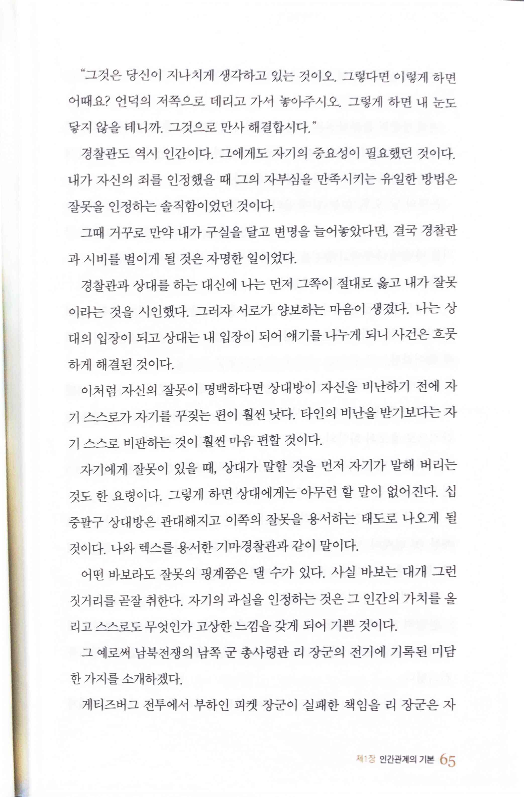

> 자신의 잘못이 명백하다면 상대방이 자신을 비난하기 전에 자기 스스로가 자기를 꾸짖는 편이 훨씬 낫다. 타인의 비난을 받기보다는 자기 스스로 비판하는 것이 훨씬 마음 편할 것이다.

> 사람을 설득하고 싶으면 상대방이 눈치채지 않도록 해야 한다. 누구에게도 눈치채지 않도록 교묘하게 해야 한다."가르치지 않는 척하면서도 상대를 가르치고, 상대가 알지 못하면 그가 잊어버리고 있었다고 말해 준다."이것이 비결이다.

### 상대를 변화시키는 방법
> 먼저 칭찬하자

> 사람에게 잔소리하는 경우 겸허한 태도로 자기는 결코 완전하지 못하고 자주 실수한다고 전제하고서 상대의 잘못을 주의해 주면 상대는 그다지 불쾌한 생각을 하지 않을 것이다.

> 격려해주어야 한다

> 셰익스피어는 '덕이 없어도 덕이 있는 듯이 행동하라.'라고 말했다. 상대의 아름다운 점을 칭찬해주고 싶다면, 진심으로 그 아름다움을 칭찬해 주어야 한다. 장점을 얘기해 주면 그 사람은 여러분의 기대에 어긋나지 않도록 력할 것이다.

## 제2장 사람의 마음을 읽어야 한다

### 남을 비난하기 전에 상대를 이해해야 한다
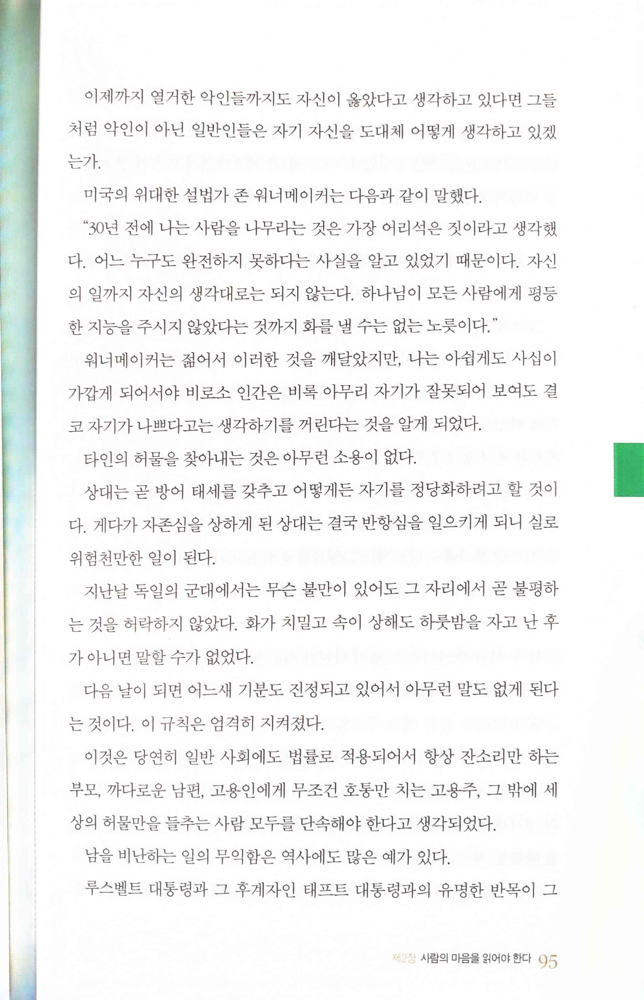

> “30년 전에 나는 사람을 나무라는 것은 가장 어리석은 짓이라고 생각했다. 어느 누구도 완전하지 못하다는 사실을 알고 있었기 때문이다. 자신의 일까지 자신의 생각대로는 되지 않는다. 하나님이 모든 사람에게 평등한 지능을 주시지 않았다는 것까지 화를 낼 수는 없는 노릇이다."
>
> 타인의 허물을 찾아내는 것은 아무런 소용이 없다.
>
> 상대는 곧 방어 태세를 갖추고 어떻게든 자기를 정당화하려고 할 것이다. 게다가 자존심을 상하게 된 상대는 결국 반항심을 일으키게 되니 실로 위험천만한 일이 된다.

> '남을 책하지 마라. 남의 원한을 사는 것이 싫다면'이라고 말하는 것이그가 즐겨 쓴 좌우명이었다.
>
> 링컨은 아내나 측근의 인물들이 남부 사람들을 욕할 때마다 이렇게 말했다.
>
> "남에게 욕질하는 것을 삼가시오. 우리도 입장이 바뀐다면 틀림없이 남부의 사람들처럼 될 테니까."

> 그는 성공 비결을 다음과 같이 말하고 있다.
>
> "결코 남의 단점을 들춰내지 않고 장점만 칭찬한다."

> 젊었을 때 대인관계가 나쁘기로 유명했던 벤저민 프랭클린은 뒷날 매우 외교적인 기술을 터득하고 사람 다루는 방법이 능숙한 것을 인정받아 마침내 주불 대사로 임명되었다. 그는 성공 비결을 다음과 같이 말하고 있다. "결코 남의 단점을 들춰내지 않고 장점만 칭찬한다."

### 중요한 존재임을 인식시키자
> 인간이 갖는 가장 뿌리 깊은 충동은 '주요 인물이 되고자 하는 욕구'

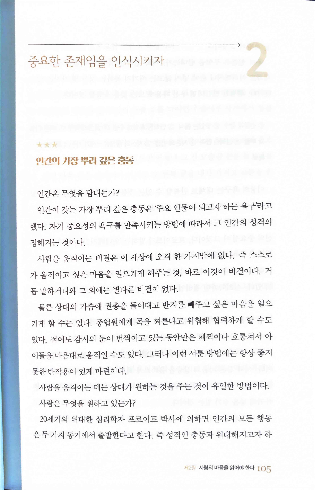

> 프로이트가 말하는 '위대해지고 싶은 욕망', 듀이가 말하는 '주요 인물이 되고 싶은 욕구'
>
> 링컨의 편지 서두에는 '사람은 누구나 겉치레를 좋아한다.'라고 쓰인 것이 있다. 심리학자인 윌리엄 제임스는 '인간이 지닌 성정 중에서 가장 강한 것은 남의 인정을 받는 것을 갈망하는 기분이다.'라고 한다.
>
> 여기서 제임스가 '희망한다든가, '동경한다든가 하는 우아한 표현을 쓰지 않고 굳이 갈망한다.'라는 말을 쓴 것에 주의해 주기를 바란다.
>
> 이것이야말로 인간의 마음을 끊임없이 흔들고 있는 불타는 듯한 갈중이다. 이와 같은 마음의 갈증을 올바르게 채워 줄 수 있는 사람은 극히 드물지만, 그것을 할 수 있는 사람이야말로 비로소 타인의 마음을 자기의 손아귀에 넣을 수가 있는 것이다.

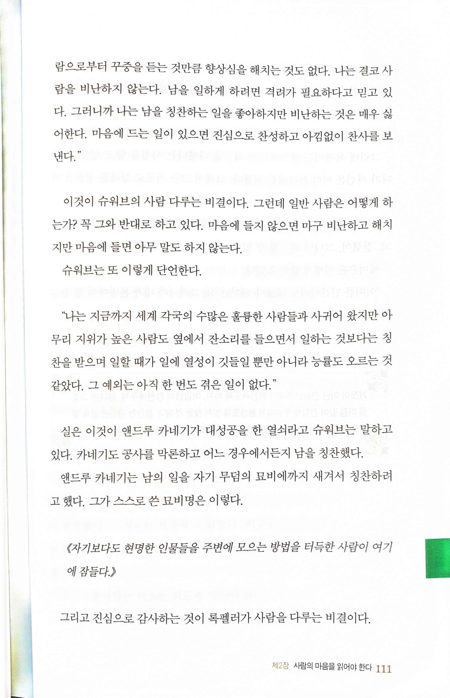

> 앤드루 카네기는 남의 일을 자기 무덤의 묘비에까지 새겨서 칭찬하려고 했다. 그가 스스로 쓴 묘비명은 이렇다.
>
> 《자기보다도 현명한 인물들을 주변에 모으는 방법을 터득한 사람이 여기에 잠들다.》
>
> 그리고 진심으로 감사하는 것이 록펠러가 사람을 다루는 비결이다.

> 거짓이 아닌 진심으로부터 칭찬하도록 하자. 아낌없이 칭찬해주자. 상대는 그것을 마음 깊이 간직해 두었다가 평생토록 잊지 않을 것이다. 칭찬한 본인은 설혹 잊어도 칭찬을 받은 사람은 언제까지나 잊지 않고 소중히 간직할 것이다.

### 상대방의 입장에서 생각하자
> 성공의 비결이 있다면 그것은 타인의 입장을 이해하고 자기의 입장과 동시에 타인의 입장에서 사물을 볼 수 있는 능력이다.

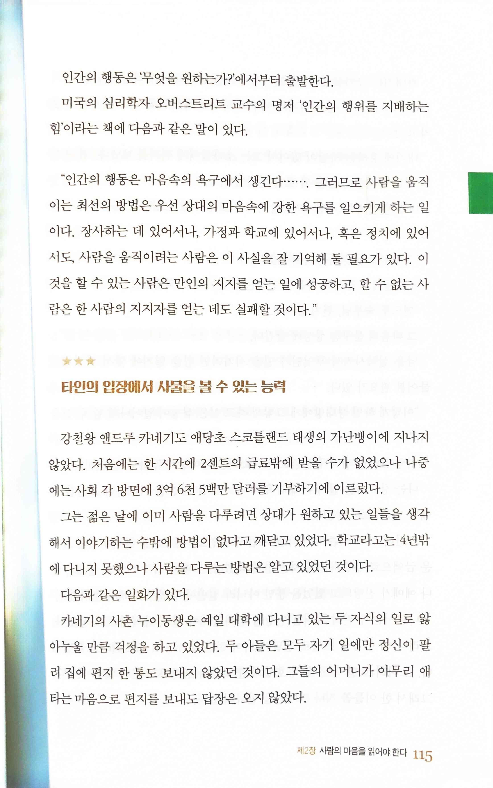

> “인간의 행동은 마음속의 욕구에서 생긴다. 그러므로 사람을 움직이는 최선의 방법은 우선 상대의 마음속에 강한 욕구를 일으키게 하는 일이다. 장사하는 데 있어서나, 가정과 학교에 있어서나, 혹은 정치에 있어서도 사람을 움직이려는 사람은 이 사실을 잘 기억해 둘 필요가 있다. 이것을 할 수 있는 사람은 만인의 지지를 얻는 일에 성공하고, 할 수 없는 사람은 한 사람의 지지자를 얻는 데도 실패할 것이다."

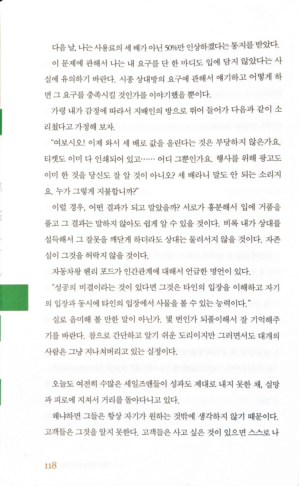

> (헨리 포드) “성공의 비결이라는 것이 있다면 그것은 타인의 입장을 이해하고 자기의 입장과 동시에 타인의 입장에서 사물을 볼 수 있는 능력이다."

> 누구나 마찬가지로 사람들은 자기가 원하는 것에만 관심을 두게 마련이다. 그러므로 사람을 움직일 수 있는 유일한 방법은, 그 사람이 좋아하는 것을 문제로 삼고 그것을 손에 넣는 방법을 가르쳐 주어야 한다.

### 듣는 입장이 되어야 한다
> 상담의 비결에 대해서 하버드 대학의 총장을 지낸 찰스 엘리엇 박사는 이렇게 말하고 있다.
>
> 상담에는 별다른 비결 같은 것은 없다. ・・・・・・ 다만 상대의 이야기에 귀를 기울이는 것이 중요하다. 어떤 아침도 이보다 더 나은 효과는 없다."

## 제3장 목적을 달성하는 법

### 상대의 이성에 호소하자
> 태양은 매섭게 불어닥치는 북풍보다 빠르게 외투를 벗게 하듯이 부드럽고 친절한 방법은 어떤 경우일지라도 심한 힘의 대결을 하는 것보다도 훨씬 효과가 있다.
>
> 서로가 인내와 솔직함과 선의를 가지고 문제에 접근한다면 쉽사리 그 문제를 해결할 수 있을 것이다.

> 상대방의 심정이 반항과 증오에 가득 차 있을 때는 아무리 훌륭하고 적합한 이론을 들먹여도 설득할 수는 없다. 그러나 부드럽고 친절한 태도로 얘기를 주고받으_면 상대방의 마음도 바꿀 수가 있다.

### '네'라고 대답할 수 있는 문제를 선택해야 한다
> 소크라테스는 상대의 잘못을 지적하는 일은 절대로 하지 않았다. 우선 상대방으로부터 '네.'라고 답을 끌어내는 것을 주안점으로 삼고 있었다.
>
> 상대방과 이야기할 때, 서로 의견이 충돌되는 문제를 처음부터 꺼내서는 안 된다. 우선 서로 의견이 일치하고 있는 문제부터 시작해 그것을 항상 강조하면서 이야기를 진행한다. 서로가 같은 목적을 추구하고 있다는 것을 상대방에게 인식시키고, 다만 그 방법에 차이가 있을 뿐이라는 것을 강조해야 한다.
>
> 처음에는 상대에게 '네.'라고 말할 수 있는 그러한 문제만을 채택하고, 가능한 한 '아니요.'라고 말하지 않도록 해야 한다.
>
> 오버스트리트 교수는 다음과 같이 말하고 있다.
>
> "상대에게 일단 '아니요.'라고 말한 이상, 그것을 번복하는 것은 자존심이 허락하지 않는다. '아니요.'라고 말해 버리고 후회할 때도 있을지 모르지만 비록 그렇게 되더라도 자존심을 상하게 할 수는 없다. 말을 꺼낸 이상 어디까지나 그것을 고집한다. 그러니까 처음부터 '네'라고 말할 수 있는 방향으로 이야기를 끌고 가는 것이 매우 중요하다."

### 상대방이 말하게 해야 한다
> 만일 당신이 적을 만들고 싶으면 상대방을 이기도록 해야 한다. 그러나 자기 편을 만들고 싶으면 상대방이 당신을 이길 수 있도록 해야 한다.

> 우리 주변에는 우리의 성공보다는 실패를 기뻐하는 사람이 있을 것이다. 그러니까 자기의 성공은 될 수 있으면 비밀스럽게 이야기해야 한다. 이 방법은 반드시 효과가 있을 것이다.

### 스스로 생각하게 해야 한다
> 상대방으로부터 강요를 당하고 있다든지, 명령을 받고 있다든지 하는 느낌은 어떤 사람이든 싫은 것이다. 그것보다도 자주적으로 행동하고 있다는 느낌이 오히려 훨씬 바람직하다.

### 상대방의 입장이 돼봐야 한다
> 자기가 잘못되어 있다고는 절대 생각지 않는 것이 사람의 습성이다. 그러니까 상대방을 비난한 소용이 없다. 비난은 어떤 바보라도 할 수 있다. 이해하도록 노력하지 않으면 안 된다. 현명한 사람은 상대방을 이해하려고 노력한다.

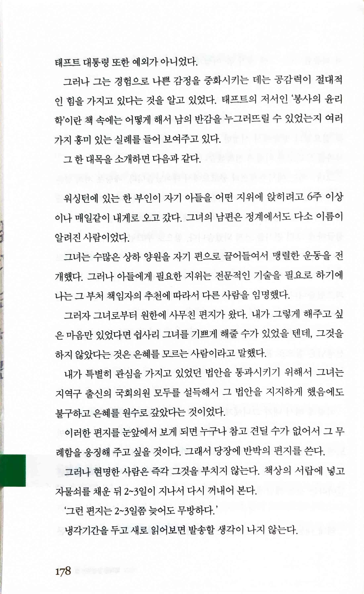

> 반박의 편지를 쓴다. 그러나 현명한 사람은 즉각 그것을 부치지 않는다. 책상의 서랍에 넣고 자물쇠를 채운 뒤 2~3일이 지나서 다시 꺼내어 본다... 냉각기간을 두고 새로 읽어보면 발송할 생각이 나지 않는다.

> 인간은 일반적으로 동정심을 원한다. 아이들은 상처를 보이고 싶어 한다. 때로는 동정을 구하고 싶어서 자기 스스로 상처를 만드는 일도 있다. 자기 연민의 정을 느끼고 싶어 하는 마음은 누구에게나 있는 법이다.

### 사람은 누구나 정직하게 살고자 한다
> 인간은 누구나 이상주의적인 성향을 가지고 있으며 자기의 행위에 대해서는 아름답게 꾸미고 싶어 한다.
>
> 따라서 상대방의 생각을 바꾸게 하기 위해서는 이 아름답게 꾸미고 싶어 하는 심정에 호소하는 것이 유효할 것이다.

> 상대방의 신뢰도를 정확히 판단할 수 없을 때는, 일단 그를 훌륭한 신사로 간주하면 된다. 그럼 틀림없이 성공한다. 인간은 누구나 정직하게 살고자 한다. 사람을 속이는 그러한 인간조차 상대방으로부터 진심으로 신뢰를 받고 정직하고 공정한 인물로 인정받게 되면 나쁜 일을 할 수가 없게 된다.

### 상대방의 경쟁심을 자극해야 한다
> 성공한 사람들은 하나같이 모두 게임을 좋아한다. 게임을 통해 자기표현의 기회가 주어졌기 때문이다. 정정당당하게 싸워 상대를 이기는 기회, 이것이 여러 가지 경쟁을 성립시키는 요소이다.

## 제4장 행복한 성공

### 행복한 성공이란 무엇인가
> 성공이라는 것은 당신 자신이 내적으로 만족감을 느껴야 하며 반드시 세상 사람들의 인정이 필요하지도 않다.

> 성공이라는 것은 자기만족뿐만이 아니라 자신과 가족, 이웃에 대한 사랑과 베풂, 그리고 남에게 알려지고 소문나기보다는 자신도 만족하며 그 만족감이 이웃과 사회의 표상이 될 때 그야말로 값진 것이라고 할 수 있다.

### 행복한 성공을 위한 마음의 자세
> 변화는 움직일 수 없는 자연법칙이기 때문에 중요한 것은 변화에 대한 성공과 실패의 여부는 우리의 마음가짐에 달려 있다.

> 우리는 우리의 생각을 지배하고, 감정을 조절하면서 우리의 태도를 결정할 수가 있다. 언제라도 우리에게 부딪히는 모든 문제들을 긍정적인 마음가짐으로 대처할 수가 있다면 그 어떤 어려운 문제가 있더라도 현명하게 해결할 수 있다.

### 일에 재미를 붙여야 한다
> 인생에 있어서 진실로 실패자라는 것은 자기가 하고 싶었던 일을 하지 않은 사람이다. 자기가 하고 싶은 일을 향하여 전력을 기울일 때 비로소 마음의 평화도, 정신의 만족도 얻어지는 것이다.

### 희망을 크게 하고 이상을 높게 들어야 한다
> 이 세상에서 가장 가엾은 사람은 출발을 할 줄 모르는 사람이다. 이러한 사람은 자기 자기 자신의 능력에 대한 확신을 갖지 못하고 '하늘은 스스로 돕는 자를 돕는다.'라는 것을 믿지 않는 사람들이다.

### 곧 시작하라
> “행동의 씨앗을 뿌리면 습관의 열매가 열리고, 습관의 씨앗을 뿌리면 성격의 열매가 열리며, 성격의 씨앗을 뿌리면 운명의 열매가 열린다."

### 보는 방법을 배워야 한다
> 새로운 기회를 찾아서 보다 큰 것을 붙잡기 위해 노력하는 마음의 여유를 지녀야한다. 따라서 자신에게 직접 부딪히는 문제에 지나치게 집착하지 말아야 한다.

## 제5장 성공의 비결

### 그다음 목표는 무엇인가
> 인생에서 최대의 기회를 잡는 사람은 기민하고 활동적이며 어떠한 상황에도 대비하고 있다. 이런 사람들은 뚜렷한 목표를 가지고 있는 사람들이다.

### 일에 열중할 수 있는 6가지 방법
> ① 자신이 담당한 일과 그 일이 회사 전체에 관한 모든 것이 되도록 많이 배워야 한다.
>
> ② 목표를 정하고 그것을 추구해야 한다.
>
> ③ 날마다 자기 자신에게 격려의 말을 해보자.
>
> ④ 남을 돌보려는 생각을 길들이도록 해야 한다.
>
> ⑤일에 열중하는 사람과 사귀되 일에 열중하지 않는 사람은 되도록 피하자.
>
> ⑥ 처음에는 억지로라도 열심히 하려고 애쓰면 결국은 정말로 열중하게 되는 법이다.

### 자신에게 동기를 유발하게 하는 방법
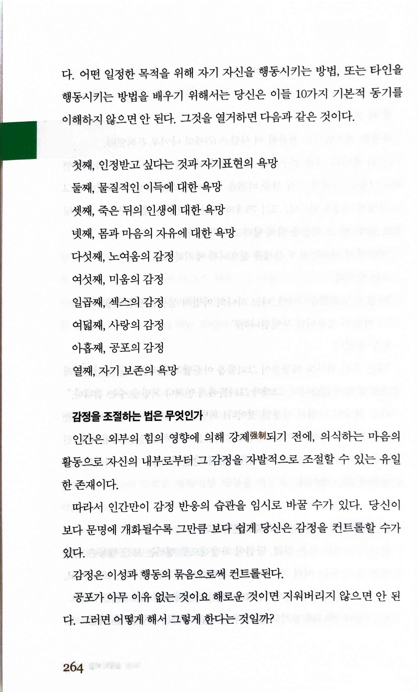

> 첫째, 인정받고 싶다는 것과 자기표현의 욕망
>
> 둘째, 물질적인 이득에 대한 욕망
>
> 셋째, 죽은 뒤의 인생에 대한 욕망
>
> 넷째, 몸과 마음의 자유에 대한 욕망
>
> 다섯째, 노여움의 감정여섯째, 미움의 감정
>
> 일곱째, 섹스의 감정
>
> 여덟째, 사랑의 감정
>
> 아홉째, 공포의 감정
>
> 열째, 자기 보존의 욕망

> 적극적인 사고방식으로 자신을 행동시키면 당신의 생각과 감정을 컨트롤해 자신의 운명을 결정할 수가 있다.

### 항상 얼굴에 미소를 지어야 한다
> "미소를 지을 줄 모르는 사람은 사업가가 될 자격이 없다."

> 마음에도 없는 미소는 아무도 속지 않는다. 마음이 느긋해지는 미소, 마음속에서 우러나오는 미소, 천금의 가치를 가진 미소야말로 누구나 환영하고 환영받는다.

### 배우자와 상의해야 한다
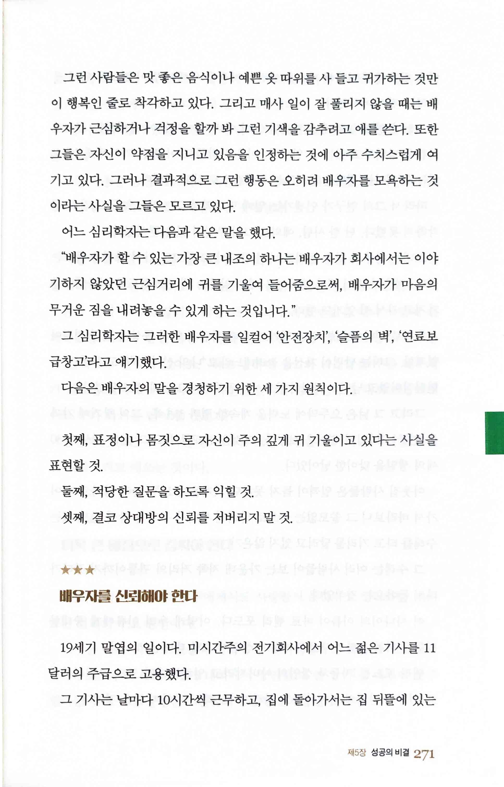

> 배우자의 말을 경청하기 위한 세 가지 원칙이다.
>
> 첫째, 표정이나 몸짓으로 자신이 주의 깊게 귀 기울이고 있다는 사실을 표현할 것.
>
> 둘째, 적당한 질문을 하도록 익힐 것.
> 셋째, 결코 상대방의 신뢰를 저버리지 말 것.

> 1) 날마다 애정을 겉으로 나타내도록 할 것
>
> 2) 유머를 알 것 - 만사를 낙관적으로 속 편히 생각할 것
>
> 3) 관대한 마음을 가질 것
>
> 4) 조그만 일에도 감사의 뜻을 표할 것

> 당신이 배우자에게 기울이는 애정은 배우자가 일에 성공하기 위해서 가장 긴요하고 절박한 요소이다. 만약 당신이 진심으로 배우자를 사랑하고 있다면 당신은 배우자를 행복하게 하기 위해 당신이 할 수 있는 온갖 일을 다 할 것이다. 더구나 배우자에게 기울이는 애정은 자식의 행복에도 영향을 미친다.

### 사람을 움직이는 법
> 다른 사람들에게 신뢰를 쌓음으로써 그 사람들을 움직일 수가 있다. 신뢰는 정확히 말한다면 적극적이며 소극적인 것이 아니다. 따라서 상대방에게 신뢰를 전하려고 애쓰지 않으면 안 된다.

## 제6장 부자가 되는 법

### 부자가 되는 지름길
> 당신만이 당신을 위해 생각할 수 있다. 당신에게 있어서 부의 지름길은 다음의 말로 상징되고 있다.
>
> 적극적 사고방식으로 부를 만들어야 한다.

### 부를 대하는 마음가짐
> "저는 당신의 '생각하라. 그러면 부자가 될 수 있다'라는 책을 읽었지만, 아직도 부자는 아닙니다."
>
> 그 말을 들은 나폴레온 힐은 진지한 얼굴로 이렇게 대답했다.
>
> "그러나 당신은 부자가 될 수 있을 것입니다. 당신의 미래는 지금부터입니다. 당신은 부자가 되기 위해 준비하지 않으면 안 됩니다. 그리고 당신이 그 기회를 위한 준비를 하기 위해서는 먼저 적극적인 사고방식을 가지고 있지 않으면 안 됩니다."

### 불만감을 만족감으로 이끌어야 한다
> 만족은 마음가짐이다. 당신 자신의 마음가짐은 당신이 소유하여 완전히 지배할 수 있다.

> 때로는 주어진 직업에 지급되는 희생이 지향하는 목표에 비해 너무 비쌀수가 있다. 공교롭게도 그러한 직업을 갖게 되었을 때는 그 직업을 바꾸어야 한다. 비참한 생각으로 일하고 있으면 그 불만의 독소가 생활의 모든 면에 오염되어 버리므로 수습할 수 없는 지경에 이르는 것이다.

### 인생의 지표
> 자신이 바라는 지위를 얻기 위해서는 한때의 고통스러운 노력은 당연한 것으로 생각하며 모든 두려움을 떨치고 이겨 나가야 한다.

### 현명한 직업 선택
> '인생의 건축자가 되려면 그 일에 온갖 정열을 쏟아붓지 않으면 안 된다.'

> 일이라는 것은 그곳에 종사하는 사람을 태운 발동기와 같은 것으로, 그 발동기를 더욱더 힘차게 가동하려고 노력하는 사람은 그 발동기가 작동함에 따라 점차 더 전진할 것이고, 발동기를 소홀히 여기는 사람은 발동기와 같이 한 자리에서 정지할 수밖에 없다.

## 제7장 행복을 위한 마음가짐

### 우리의 생활은 우리의 생각이 만든다
> 우리가 생각하는 바가 바로 우리를 만들고 있는 것이다. 따라서 우리의 마음가짐은 우리의 운명을 결정하는 요소이다.
>
> 에머슨은 '한 사람이 온종일 생각하고 있는 그것이 곧 그 사람이다.'라고 하였다.

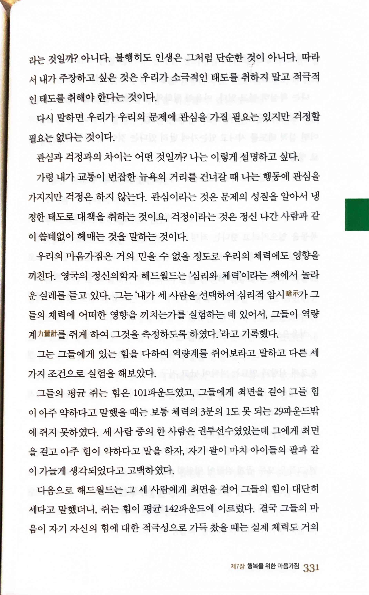

> 관심이라는 것은 문제의 성질을 알아서 냉정한 태도로 대책을 취하는 것이요, 걱정이라는 것은 정신 나간 사람과 같이 쓸데없이 헤매는 것을 말하는 것이다.

> '실낙원'을 쓴 작가 밀턴은 300년 전에 눈이 먼 상태로 이와 똑같은 진리를 발견했다.
>
> 마음은 언제나 제자리에 있건마는 그 마음 그 속에서 우리는 지옥을 천당으로 만들 수도 있고 천당을 지옥으로 만들 수도 있다.
>
> 스토아학파의 위대한 철학자 에픽테토스는 '우리는 몸에서 종기와 부스럼을 없애는 것보다 마음속의 잘못된 생각을 없애는 데 더욱 힘써야 한다.'라고 경고했다.

> (몽테뉴) "사람은 일어난 사건 그것보다도 그 사건에 대한 자기의 의견으로 더욱 해를 받는다."
>
> "행동이 감정을 따르는 것같이 보이지만 실제는 행동과 감정은 병행하는 것이다. 그러므로 직접 의지의 지배를 받는 행동을 조절함으로써 그렇지 않은 감정을 간접적으로 조절할 수 있다."
>
> 다시 말하면 하고자 하는 마음만으로는 즉시 우리의 감정을 고칠 수 없지만 행동은 고칠 수 있으며, 따라서 우리의 행동이 고쳐질 때는 우리의 감정은 자동으로 고쳐진다는 것을 말한 것이다.
>
> 제임스 씨는 다시 설명하여 그러므로 그대에게 유쾌한 감정이 없어졌을 때 자발적으로 그러한 감정을 일으키는 최고의 방법은 즐거운 태도로 일어나 앉아 마치 유쾌한 일이 벌써 자기에게 닥쳐온 것처럼 행동하고 말하는 데 있다.'라고 하였다.

> "우리의 목적을 이루어 주는 신은 우리 자신 속에 있다. 신은 바로 우리 자신이다.그리고 모든 성공은 자기 자신이 생각한 직접 결과이다. 출세와 승리와 성공은 오직 자기의 사상을 고상하게 하는 데 있는 것이며, 사상을 높이지 않으면 그는 한갓 약하고 비겁한 가엾은 인간이 되어 버리고 만다.

### 천당과 지옥은 마음에 달렸다
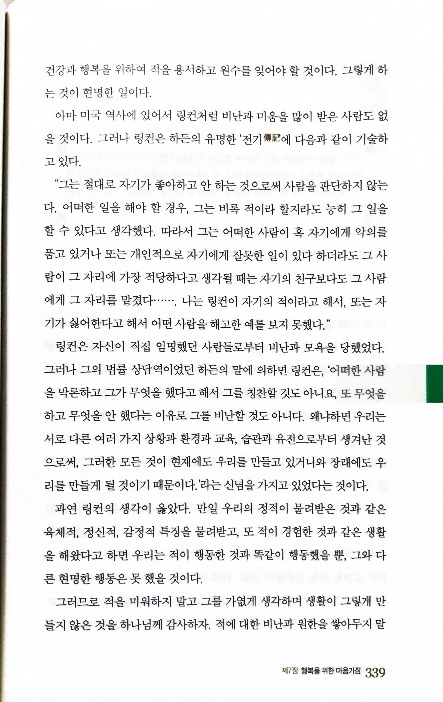

> 링컨은 '어떠한 사람을 막론하고 그가 무엇을 했다고 해서 그를 칭찬할 것도 아니요, 또 무엇을하고 무엇을 안 했다는 이유로 그를 비난할 것도 아니다. 왜냐하면 우리는 서로 다른 여러 가지 상황과 환경과 교육, 습관과 유전으로부터 생겨난 것으로써, 그러한 모든 것이 현재에도 우리를 만들고 있거니와 장래에도 우리를 만들게 될 것이기 때문이다.'라는 신념을 가지고 있었다

> "우리는 남을 미워하는 생각 때문에 얼굴에 주름살이 잡히며 무신경하게 되고 분개한 감정 때문에 모양이 흉하게 된다. 세상에 어떠한 미용술도 용서와 친절한 사랑으로 마음이 가득 찬 사람의 얼굴에 비하여 그 절반도 아름답게 꾸미지는 못할 것이다.

### 배은망덕함을 분개할 필요는 없다
> (공자) '성난 사람의 마음은 언제나 독으로 가득 차 있다.'

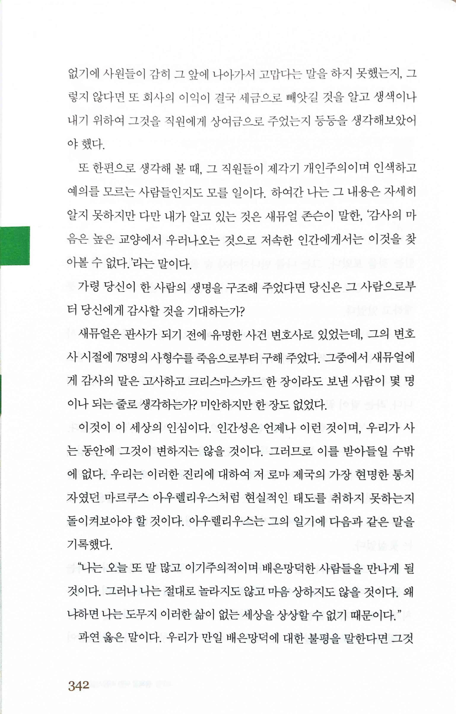

> (새뮤얼 존슨) '감사의 마음은 높은 교양에서 우러나오는 것으로 저속한 인간에게서는 이것을 찾아볼 수 없다.'
>
> (마르쿠스 아우렐리우스) "나는 오늘 또 말 많고 이기주의적이며 배은망덕한 사람들을 만나게 될 것이다. 그러나 나는 절대로 놀라지도 않고 마음 상하지도 않을 것이다. 왜냐하면 나는 도무지 이러한 삶이 없는 세상을 상상할 수 없기 때문이다."

> 우리는 남이 감사하기를 기대하지 말아야 한다. 그리하여 혹 감사하다는 사람이있으면 의외의 기쁨으로써 그것을 맞이하고 설혹 감사하지 않더라도 그것 때문에 우리의 마음을 상하게 해서는 안 된다.

### 가진 것에 감사해야 한다
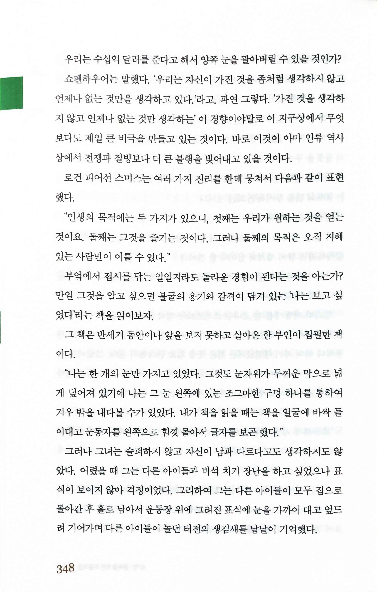

> 쇼펜하우어는 말했다. '우리는 자신이 가진 것을 좀처럼 생각하지 않고 언제나 없는 것만을 생각하고 있다.'라고 과연 그렇다. '가진 것을 생각하지 않고 언제나 없는 것만 생각하는 이 경향이야말로 이 지구상에서 무엇보다도 제일 큰 비극을 만들고 있는 것이다. 바로 이것이 아마 인류 역사상에서 전쟁과 질병보다 더 큰 불행을 빚어내고 있을 것이다.
>
> 로건 피어선 스미스는 여러 가지 진리를 한데 뭉쳐서 다음과 같이 표현했다.
>
> “인생의 목적에는 두 가지가 있으니, 첫째는 우리가 원하는 것을 얻는 것이요. 둘째는 그것을 즐기는 것이다. 그러나 둘째의 목적은 오직 지혜있는 사람만이 이룰 수 있다."

> (안젤로 페트리) '누구보다도 제일 비참한 인간은 자기의 몸과 마음속에 있는 자기 자신이 되려고 하지 않고 그와 다른 사람이나 그와 다른 그 무엇이 되기를 원하는 사람이다.'

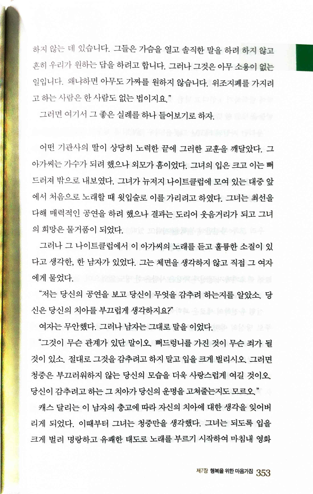

> “취업을 희망하는 사람들이 범하는 가장 큰 실수는 자기 자신이 되려고 하지 않는 데 있습니다. 그들은 가슴을 열고 솔직한 말을 하려 하지 않고 흔히 우리가 원하는 답을 하려고 합니다. 그러나 그것은 아무 소용이 없는 일입니다. 왜냐하면 아무도 가짜를 원하지 않습니다. 위조지폐를 가지려고 하는 사람은 한 사람도 없는 법이지요."

> 우리 인생에 있어서 좋은 일은 90% 좋지 않은 일은 10%다. 그러므로 우리가 행복하기를 원한다면 90%의 옳은 일에다 마음을 집중시키고 10%의 잘못을 무시하면 된다.

## 제8장 나를 다스리는 방법

### 기분을 조절하는 방법
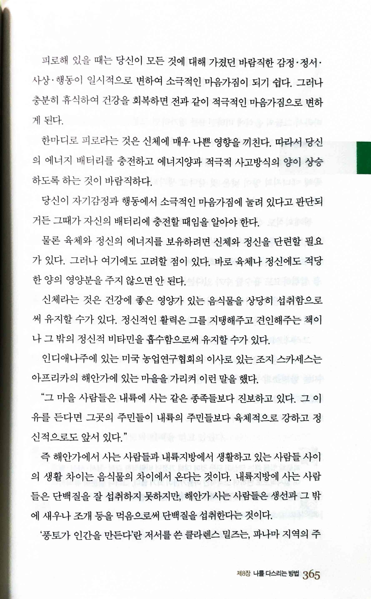

> 한마디로 피로라는 것은 신체에 매우 나쁜 영향을 끼친다. 따라서 당신의 에너지 배터리를 충전하고 에너지양과 적극적 사고방식의 양이 상승하도록 하는 것이 바람직하다.

> 피로해 있을 때는 당신이 모든 것에 대해 가졌던 바람직한 감정 ·정서·사상·행동이 일시적으로 변하여 소극적인 마음가짐이 되기 쉽다. 그러나 충분히 휴식하여 건강을 회복하면 전과 같이 적극적인 마음가짐으로 변하게 된다.

### 건강을 지켜야 한다
> 적극적 사고방식은 정신과 육체의 건강을 유지하고 오래 사는 데 도움이 될 것이다. 그러나 소극적인 사고방식은 정신과 육체의 건강을 차차로 좀 먹고 생명을 단축시킬 것이다.

> 건강에 대한 불안감은 자신도 모르는 사이에 적극적 사고방식을 깨뜨릴 가능성이 있다. 조금이라도 아프거나 괴롭다고 생각하면 저절로 소극적인 마음가짐으로 될 수가 있기 때문이다.

### 행복을 위한 방법
> (에이브러햄 링컨) “내가 보기에 행복의 정도는 대개 마음가짐 하나로 결정되는 것 같다." 개인 차이는 미미하지만 그 근소한 차이가 큰 차이를 낳는다. 그 근소한 차이는 태도에 달려 있으며 큰 차이는 적극적 사고방식인지 아니면 소극적인 사고방식인지의 차이이다.

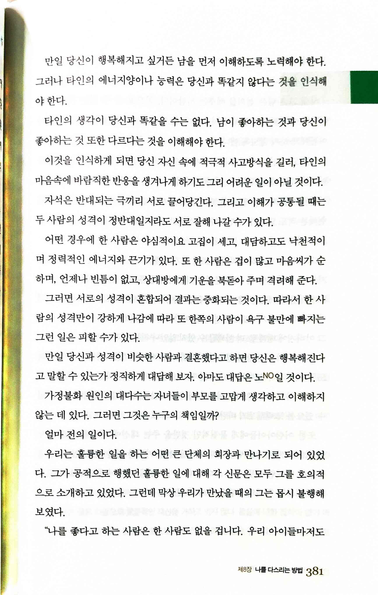

> 만일 당신이 행복해지고 싶거든 남을 먼저 이해하도록 노력해야 한다. 그러나 타인의 에너지양이나 능력은 당신과 똑같지 않다는 것을 인식해야 한다.

> 당신은 자신의 선택으로 행복해지기도 하고, 불행해질 수도 있다. 그 선택은 오롯이 당신 자신에게 달려 있다. 그리고 그 결정적 요인은 당신이 적극적 사고방식의 영향 밑에 있는가, 소극적인 마음가짐의 영향 밑에 있는가 하는 것이다.

### 신비의 힘인 정신을 탐구해야 한다
> 의식적 자기암시는 마음에 강한 영향을 주는 효력이 있다. 그리고 적극적인 마음의 잠재의식에 창조성 있는 사고방식을 심어 줄 수도 있다. 매일 2회씩 온 감정을 집중하여 돈을 벌고 싶다는 당신의 소망을 큰 소리로 외치다 보면, 이미 그 돈을 소유하고 있는 자신의 모습을 보거나, 그 돈을 만져 본 것 같은 느낌이 들게 된다. 이를 되풀이하다 보면 돈을 벌 수 있는, 더욱 효과적인 방법을 터득하게 되고, 더욱 적극적인 습관을 몸에 붙일 수 있다.

### 피로와 번민을 없애는 방법
> 제1법칙 - 필요한 서류 말고는 모두 책상에서 치우자
>
> 제2법칙 - 중요한 정도에 따라서 일을 처리해 나가자
>
> 제3법칙 - 문제가 생기면 그 즉석에서 해결해야 한다
>
> 제4법칙 - 조직화, 위임, 지휘를 배우자

### 여유를 가져야 한다
> 정신의학자들이 말하는 것을 인용한다면 우리가 피곤함을 느끼는 대부분은 다름이 아니라 우리의 정신적이며 감정적인 태도에 원인이 있다고 단언하고 있다.

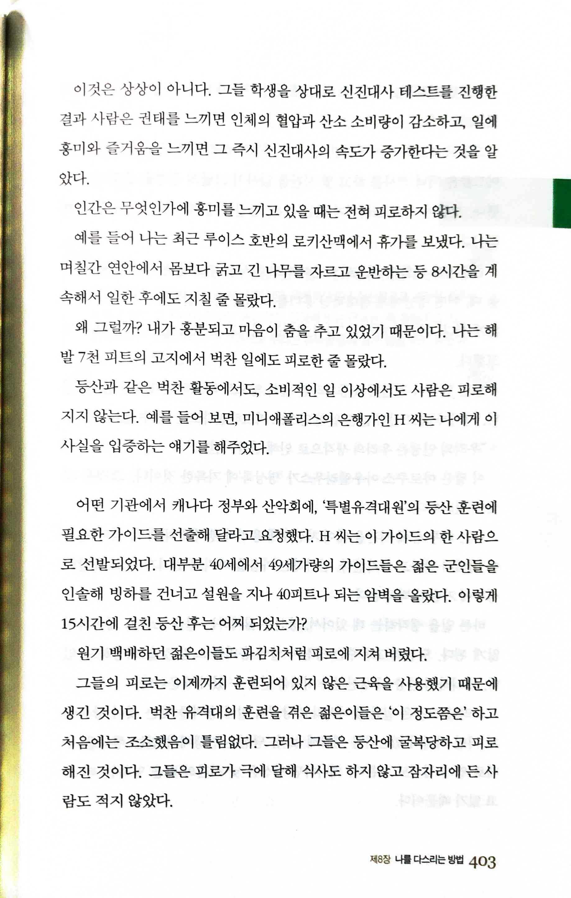

> 인간은 무엇인가에 흥미를 느끼고 있을 때는 전혀 피로하지 않다.

> 격심한 일에서 오는 피곤은 대부분 충분한 수면과 휴식에서 회복된다. 번뇌와 긴장과 감정의 혼란이 피곤의 3대 원인이다. 육체적으로나 정신적으로 부담을 자주느끼고 있는 그 자체가 커다란 원인이다. 긴장해 있는 근육은, 즉 활동하고 있는 근육이라는 것을 기억하자. 그러므로 우리는 휴식을 통해 많은 일을 하기 위한 에너지를 간직해야 한다.

### 저속한 인간은 타인의 결점에 흥미를 느낀다
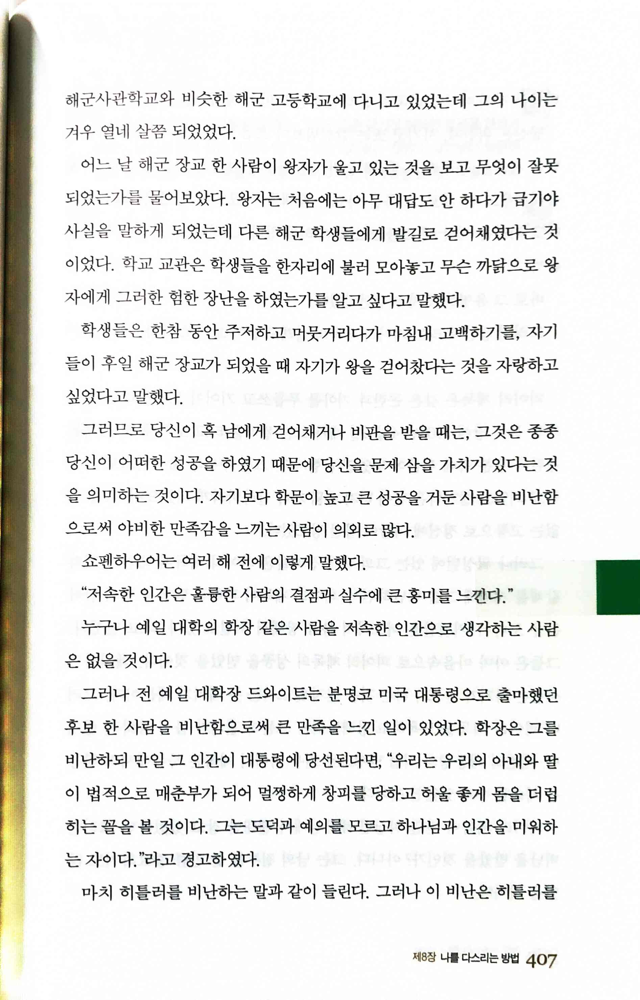

> (쇼펜하우어) "저속한 인간은 훌륭한 사람의 결점과 실수에 큰 흥미를 느낀다."

> 당신이 혹시 남에게 비판을 받을 때는, 그것은 종종 당신이 어떠한 성공을 하였기 때문에 당신을 문제 삼을 가치가 있다는 것을 의미하는 것이다. 자기보다 학문이 높고 큰 성공을 거둔 사람을 비난함으로써 야비한 만족감을 느끼는 사람이 의외로 많다.

### 자신이 옳다고 생각하는 일을 해야 한다
> 누가 우리에 대해 어떤 거짓말을 하든지, 우리를 조소하고 배반하며 음해하든지, 우리는 절대로 자기 자신을 가엾게 여겨서는 안 된다. 그렇다고 모든 비판을 무시하라고 말하는 것이 아니다. 절대로 그런 것이 아니라, 오직 부당한 비판만을 무시해야 한다는 것이다.