실리콘밸리에선 어떻게 일하나요
==============================
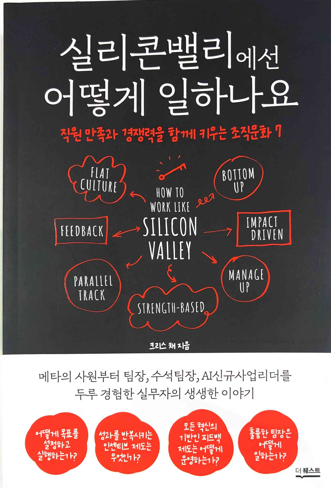

# 1 BOTTOM-UP CULTURE 가까운 사람의 책임이 더 크다

# 2 FEEDBACK CULTURE 망하는 회사의 공통점은 직원들의 피드백이 없었다는 것
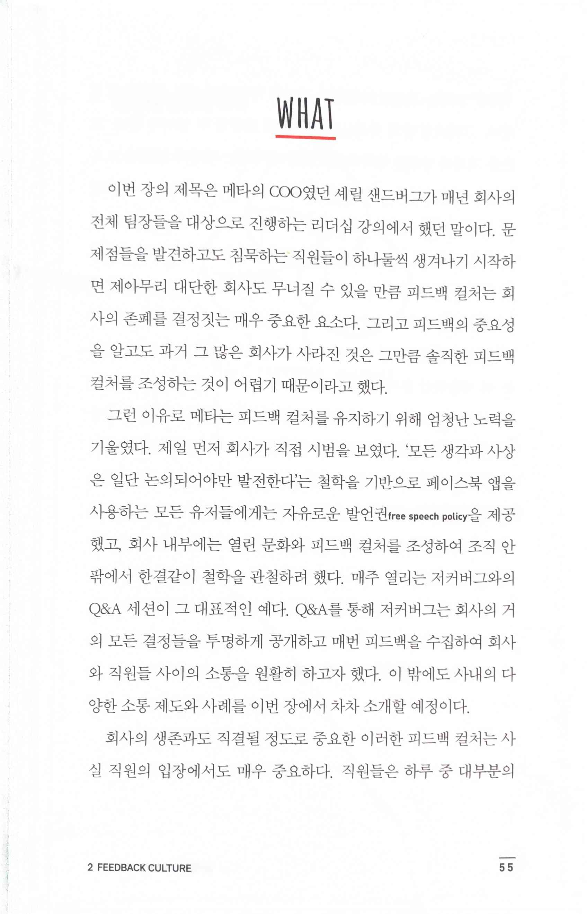

* 유명한 셰릴 샌드버그의 이야기. 셰릴 샌드버그에 대한 좋은 이야기야 넘치지만, 끝이 좋지 않아서 예전보단 이렇게 책에서 볼 일이 줄어들지 않을까 생각이 든다

# 3 FLAT CULTURE 모두에게 변화에 기여할 기회가 주어진다

# 4 MANAGE UP 내 상사는 내가 관리한다
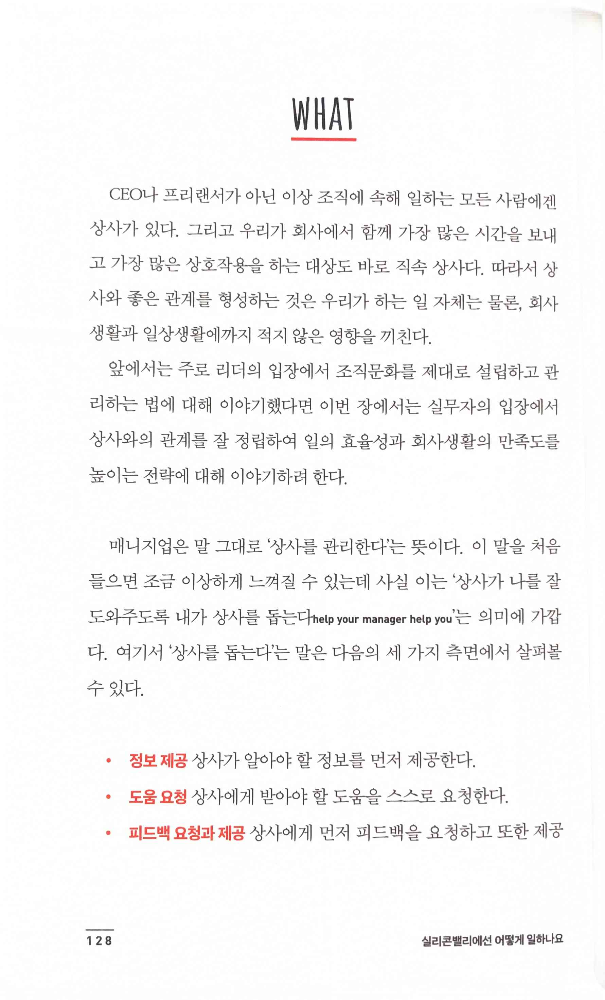

> 매니지업 '상사를 관리한다' '상사가 나를 잘 도와주도록 내가 상사를 돕는다 help your manager help you'
>
> • 정보 제공 상사가 알아야 할 정보를 먼저 제공한다.
>
> • 도움 요청 상사에게 받아야 할 도움을 스스로 요청한다.
>
> • 피드백 요청과 제공 상사에게 먼저 피드백을 요청하고 또한 제공

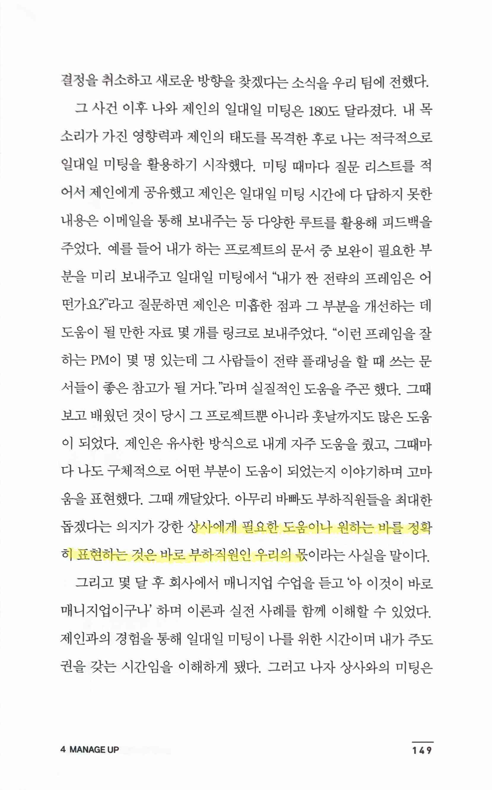

> 상사에게 필요한 도움이나 원하는 바를 정확히 표현하는 것은 바로 부하직원인 우리의 몫

# 5 PARALLEL TRACK 승진의 길은 한 가지가 아니다
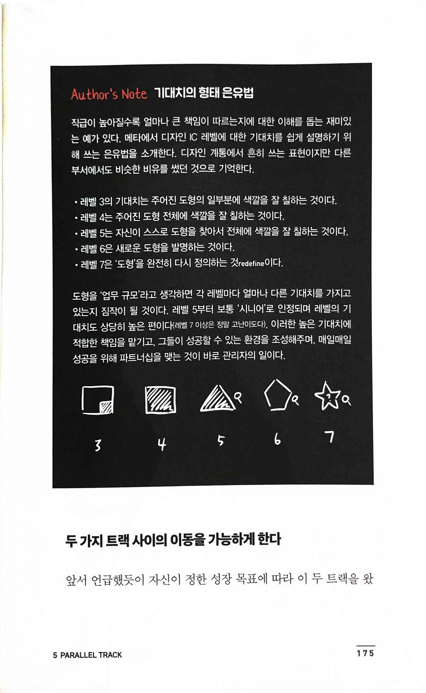

> 기대치의 형태 은유법
>
> • 레벨 3의 기대치는 주어진 도형의 일부분에 색깔을 잘 칠하는 것이다.
>
> • 레벨 4는 주어진 도형 전체에 색깔을 잘 칠하는 것이다.
>
> • 레벨 5는 자신이 스스로 도형을 찾아서 전체에 색깔을 잘 칠하는 것이다.
>
> • 레벨 6은 새로운 도형을 발명하는 것이다.
>
> • 레벨 7은 '도형'을 완전히 다시 정의하는 것redefine이다.
>
* 내가 사용하던 방식보다 훨씬 직관적이고 범용적으로 사용할 수 있는 형태란 생각이다. 앞으로 잘 활용해야겠다.

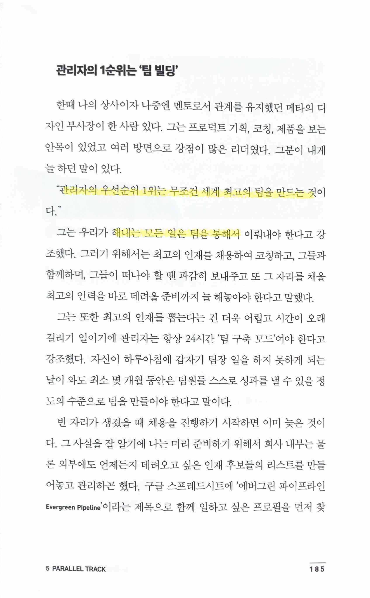

> "관리자의 우선순위 1위는 무조건 세계 최고의 팀을 만드는 것이다.”
>
> 모든 일은 팀을 통해서 이뤄내야 한다

# 6 STRENGTH-BASED CULTURE 잘할 뿐 아니라 즐기는 그 일을 하라

> '자기인식 능력'

# 7 IMPACT DRIVEN CULTURE 마지막 열쇠, 결과에 대한 책임

## 공정한 평가시스템을 만드는 법
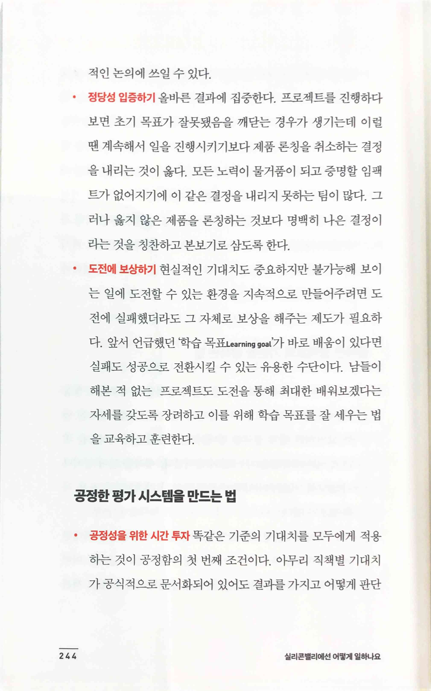

> • 공정성을 위한 시간투자

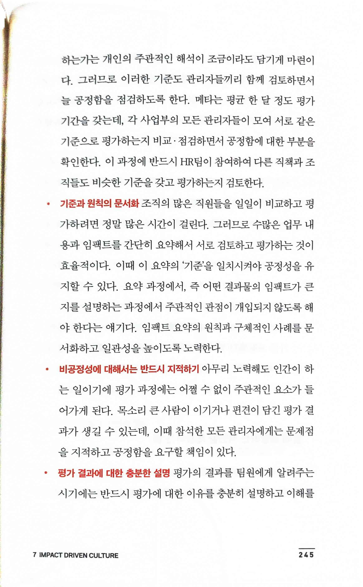

> • 기준과 원칙의 문서화

> • 비공정성에 대해서는 반드시 지적하기

> • 평가 결과에 대한 충분한 설명

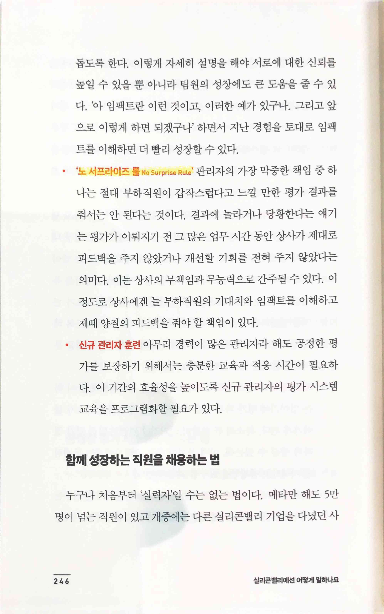

> • '노 서프라이즈 룰 No Surprise Rule'
>
> • 신규 관리자 훈련

## 현실적이지만 혁신적인 기대치의 밸런스 조율하기
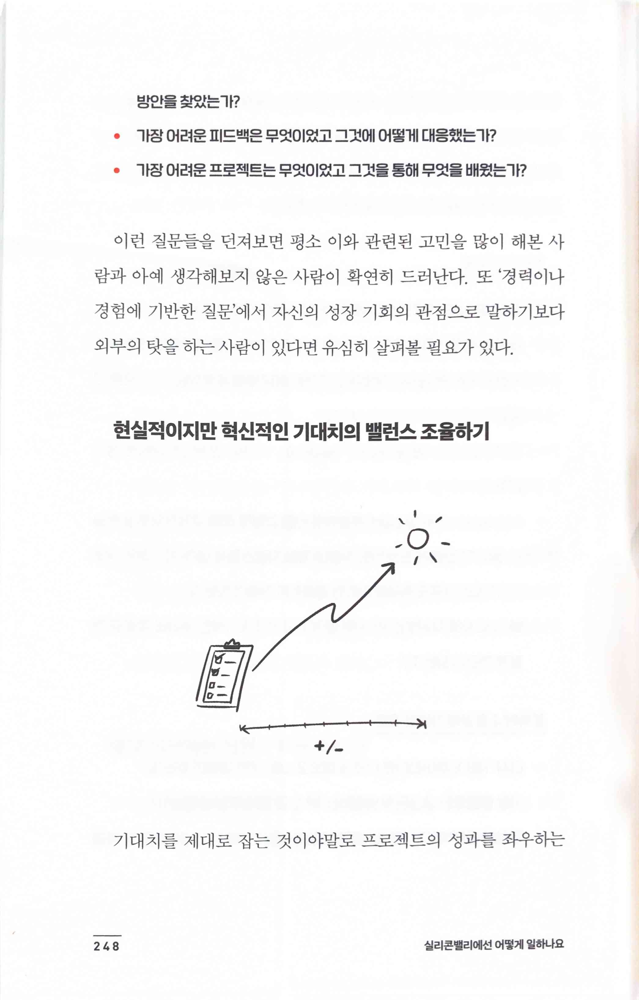

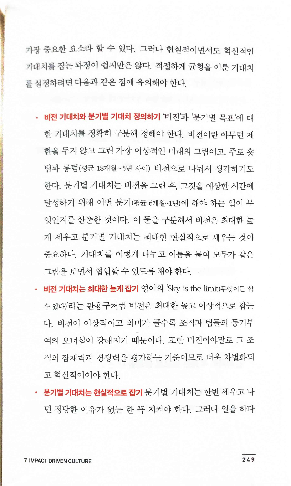

> • 비전 기대치와 분기별 기대치 정의하기
> 
> • 비전 기대치는 최대한 높게 잡기
> 
> • 분기별 기대치는 현실적으로 잡기

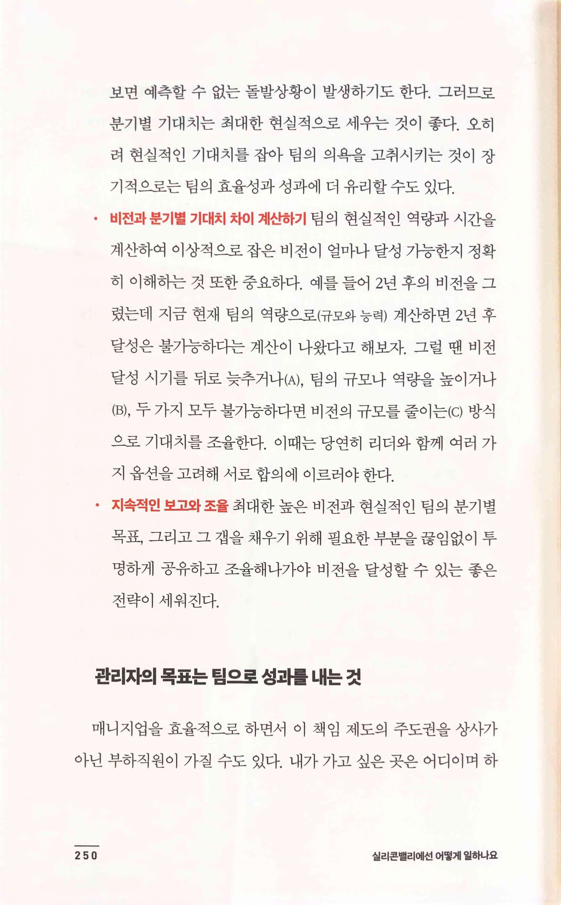

> • 비전과 분기별 기대치 차이 계산하기
>
> • 지속적인 보고와 조율

## 어려운 피드백일수록 성장의 밑거름이 된다
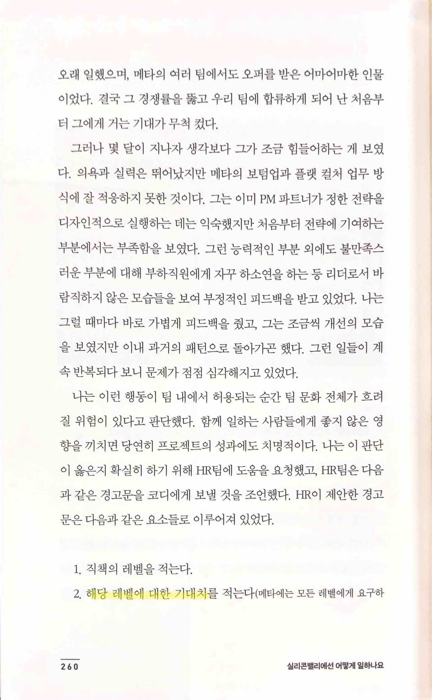 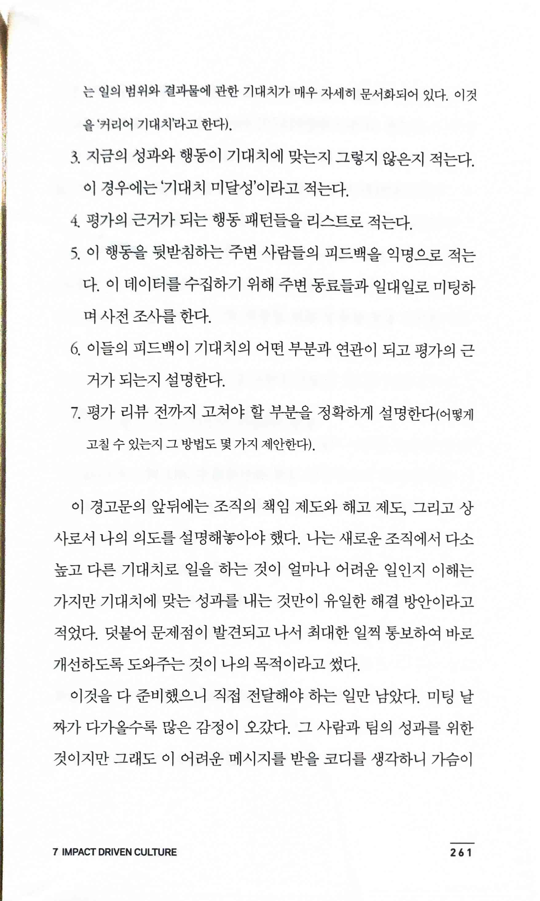

> 1. 직책의 레벨을 적는다.
>
> 2. 해당 레벨에 대한 기대치를 적는다(메타에는 모든 레벨에게 요구하는 일의 범위와 결과물에 관한 기대치가 매우 자세히 문서화되어 있다. 이것을 '커리어 기대치'라고 한다).
>
> 3. 지금의 성과와 행동이 기대치에 맞는지 그렇지 않은지 적는다. 이 경우에는 '기대치 미달성'이라고 적는다.
>
> 4. 평가의 근거가 되는 행동 패턴들을 리스트로 적는다.
>
> 5. 이 행동을 뒷받침하는 주변 사람들의 피드백을 익명으로 적는다. 이 데이터를 수집하기 위해 주변 동료들과 일대일로 미팅하며 사전 조사를 한다.
>
> 6. 이들의 피드백이 기대치의 어떤 부분과 연관이 되고 평가의 근거가 되는지 설명한다.
>
> 7. 평가 리뷰 전까지 고쳐야 할 부분을 정확하게 설명한다(어떻게 고칠 수 있는지 그 방법도 몇 가지 제안한다).