# 리더의 질문법
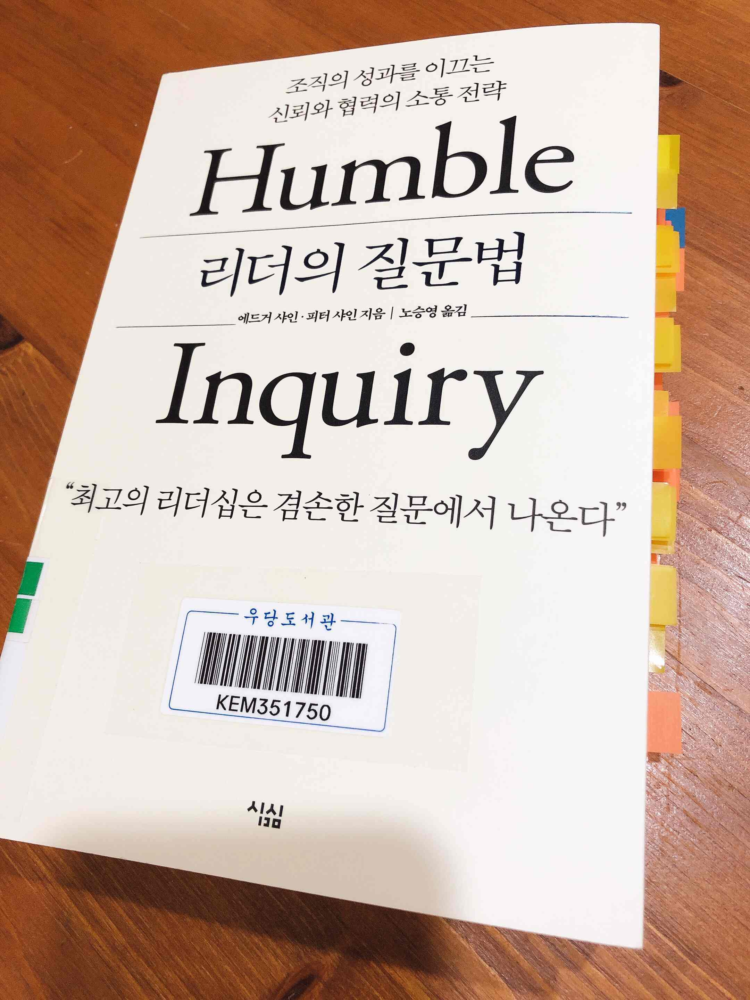

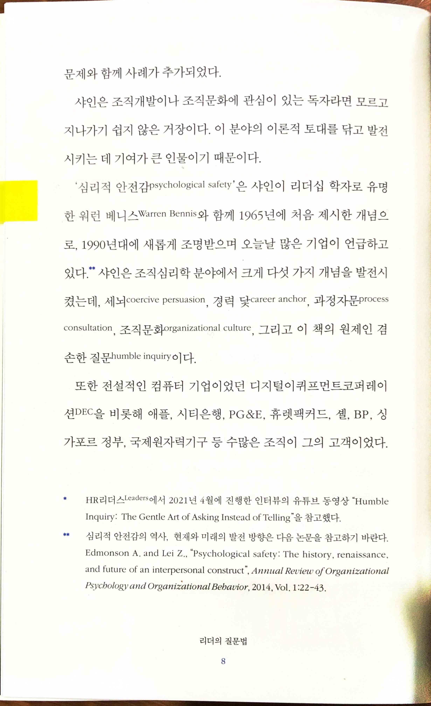

* `'심리적 안전감psychological safety'은 샤인이 리더십 학자로 유명한 워런 베니스Warren Bennis와 함께 1965년에 처음 제시한 개념으로, 1990년대에 새롭게 조명받으며 오늘날 많은 기업이 언급하고있다. 샤인은 조직심리학 분야에서 크게 다섯 가지 개념을 발전시켰는데, 세뇌 coercive persuasion, 경력 닻career anchor, 과정자문processconsultation, 조직문화organizational culture, 그리고 이 책의 원제인 겸손한 질문 humble inquiry 이다.`

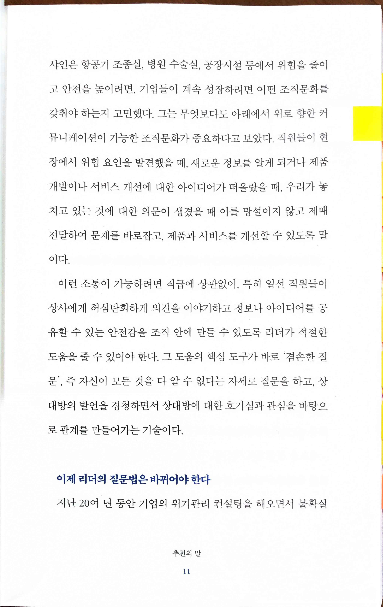

* `기업들이 계속 성장하려면 어떤 조직문화를 갖춰야 하는지 고민했다. 그는 무엇보다도 아래에서 위로 향한 커뮤니케이션이 가능한 조직문화가 중요하다고 보았다... 그 도움의 핵심 도구가 바로 겸손한 질문, 즉 자신이 모든 것을 다 알 수 없다는 자세로 질문을 하고, 상대방의 발언을 경청하면서 상대방에 대한 호기심과 관심을 바탕으로 관계를 만들어가는 기술이다.`

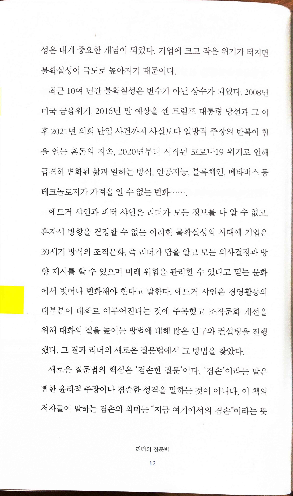

* `에드거 샤인은 경영활동의 대부분이 대화로 이루어진다는 것에 주목했고 조직문화 개선을 위해 대화의 질을 높이는 방법에 대해 많은 연구와 컨설팅을 진행했다. 그 결과 리더의 새로운 질문법에서 그 방법을 찾았다.`
* `“지금 여기에서의 겸손”`

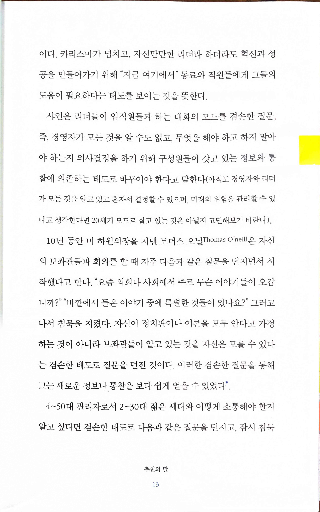

* `샤인은 리더들이 임직원들과 하는 대화의 모드를 겸손한 질문,즉, 경영자가 모든 것을 알 수도 없고, 무엇을 해야 하고 하지 말아야 하는지 의사결정을 하기 위해 구성원들이 갖고 있는 정보와 통찰에 의존하는 태도로 바꾸어야 한다고 말한다`

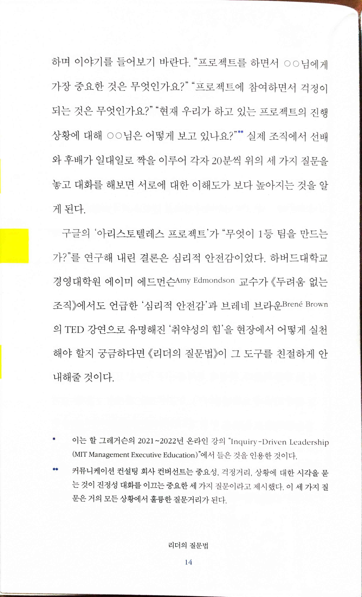

* `구글의 '아리스토텔레스 프로젝트'가 “무엇이 1등 팀을 만드는가?"를 연구해 내린 결론은 심리적 안전감이었다. `

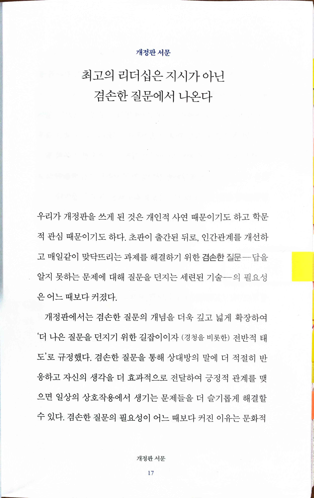

* `겸손한 질문`
  * `답을 알지 못하는 문제에 대해 질문을 던지는 세련된 기술 `
  * `'더 나은 질문을 던지기 위한 길잡이이자 (경청을 비롯한) 전반적 태도'`

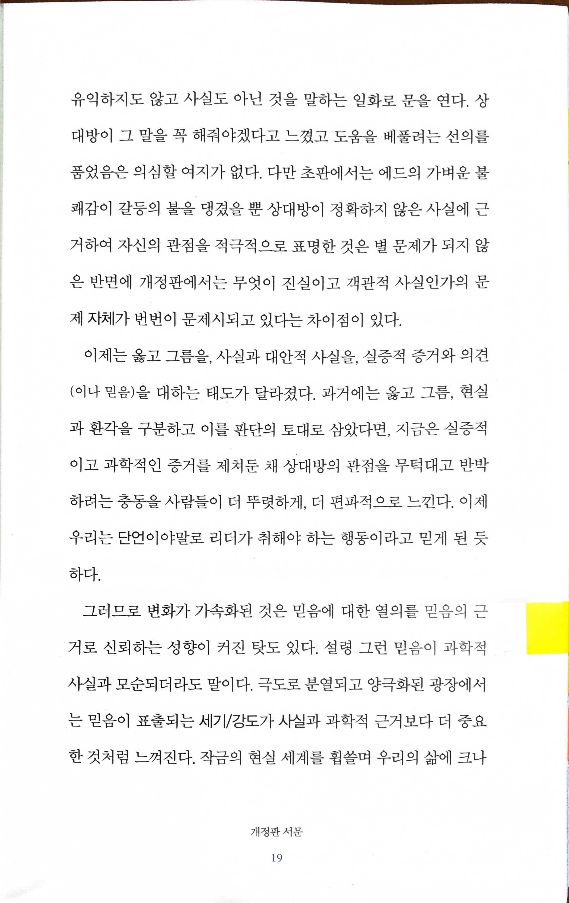

* `이제는 옳고 그름을, 사실과 대안적 사실을, 실증적 증거와 의견(이나 믿음)을 대하는 태도가 달라졌다. 과거에는 옳고 그름, 현실과 환각을 구분하고 이를 판단의 토대로 삼았다면, 지금은 실증적이고 과학적인 증거를 제쳐둔 채 상대방의 관점을 무턱대고 반박하려는 충동을 사람들이 더 뚜렷하게, 더 편파적으로 느낀다. 이제 우리는 단언이야말로 리더가 취해야 하는 행동이라고 믿게 된 듯하다.`
* `그러므로 변화가 가속화된 것은 믿음에 대한 열의를 믿음의 근거로 신뢰하는 성향이 커진 탓도 있다. 설령 그런 믿음이 과학적 사실과 모순되더라도 말이다. 극도로 분열되고 양극화된 광장에서는 믿음이 표출되는 세기/강도가 사실과 과학적 근거보다 더 중요한 것처럼 느껴진다.`
* (이성의 시대는 진작에 갔지만 이제는 자기 확신이 너무 강해져서 서로의 이야기를 듣지 않고 자기 말만 하는 세태를 이야기하는 걸로 느껴진다)

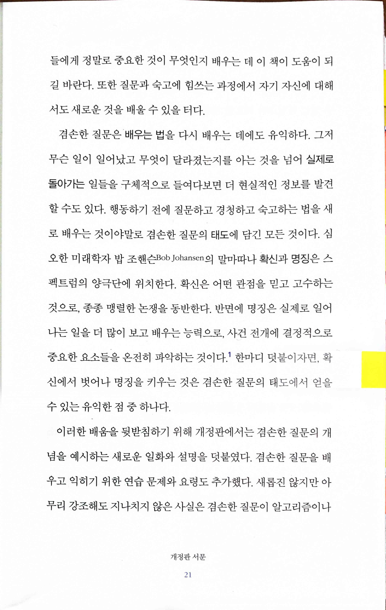

* `확신과 명징은 스펙트럼의 양극단에 위치한다. 확신은 어떤 관점을 믿고 고수하는 것으로, 종종 맹렬한 논쟁을 동반한다. 반면에 명징은 실제로 일어나는 일을 더 많이 보고 배우는 능력으로, 사건 전개에 결정적으로 중요한 요소들을 온전히 파악하는 것이다. 한마디 덧붙이자면, 확신에서 벗어나 명징을 키우는 것은 겸손한 질문의 태도에서 얻을 수 있는 유익한 점 중 하나다.`

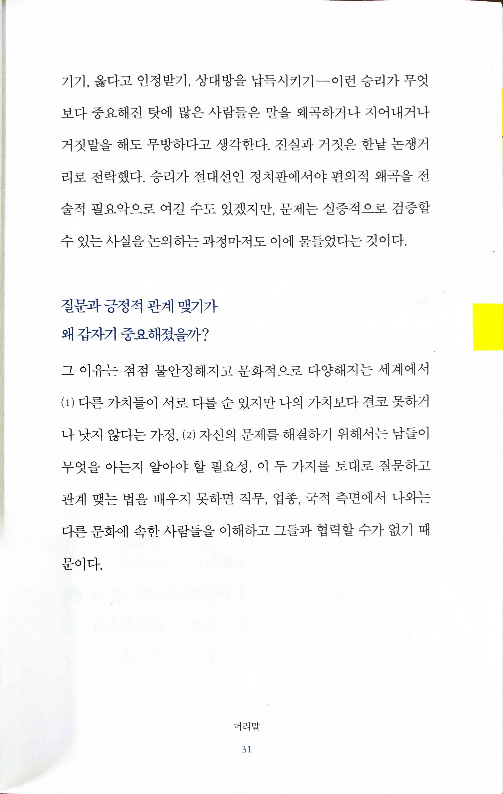

* `질문과 긍정적 관계 맺기가 왜 갑자기 중요해졌을까?`
* `그 이유는 점점 불안정해지고 문화적으로 다양해지는 세계에서 (1) 다른 가치들이 서로 다를 순 있지만 나의 가치보다 결코 못하거나 낫지 않다는 가정, (2) 자신의 문제를 해결하기 위해서는 남들이 무엇을 아는지 알아야 할 필요성, 이 두 가지를 토대로 질문하고 관계 맺는 법을 배우지 못하면 직무, 업종, 국적 측면에서 나와는 다른 문화에 속한 사람들을 이해하고 그들과 협력할 수가 없기 때문이다.`
* (그러나 러시아가 우크라이나를 침공한 지 2달, 오늘 - 2022.04.26 - 러시아 외무장관이 3차 대전과 핵무기 사용을 언급하는 시점에서 참 공허해보이긴 하는 말이다)

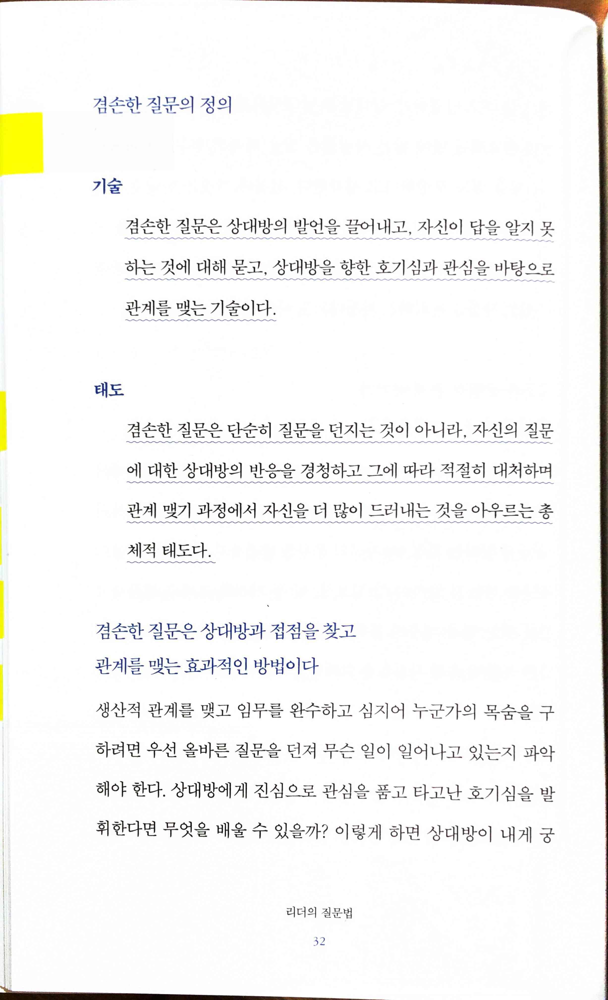

* `겸손한 질문의 정의`
* `기술`
  * `겸손한 질문은 상대방의 발언을 끌어내고, 자신이 답을 알지 못하는 것에 대해 묻고, 상대방을 향한 호기심과 관심을 바탕으로 관계를 맺는 기술이다.`
* `태도`
  * `겸손한 질문은 단순히 질문을 던지는 것이 아니라, 자신의 질문에 대한 상대방의 반응을 경청하고 그에 따라 적절히 대처하며, 관계 맺기 과정에서 자신을 더 많이 드러내는 것을 아우르는 총체적 태도다.`

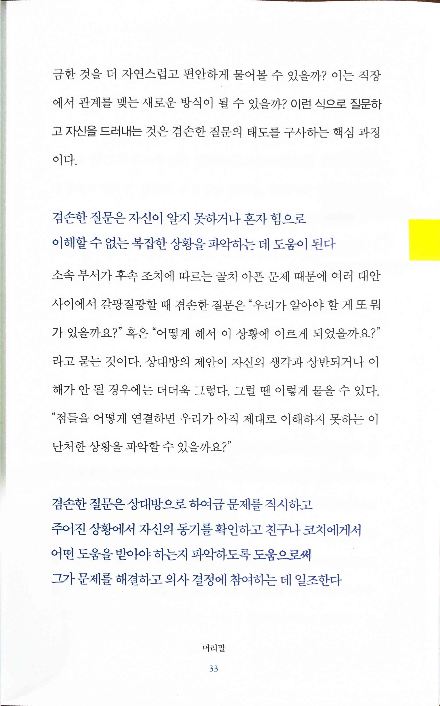

* `겸손한 질문은 자신이 알지 못하거나 혼자 힘으로 이해할 수 없는 복잡한 상황을 파악하는 데 도움이 된다.`
* `겸손한 질문은 상대방으로 하여금 문제를 직시하고 주어진 상황에서 자신의 동기를 확인하고 친구나 코치에게서 어떤 도움을 받아야 하는지 파악하도록 도움으로써 그가 문제를 해결하고 의사 결정에 참여하는 데 일조한다.`

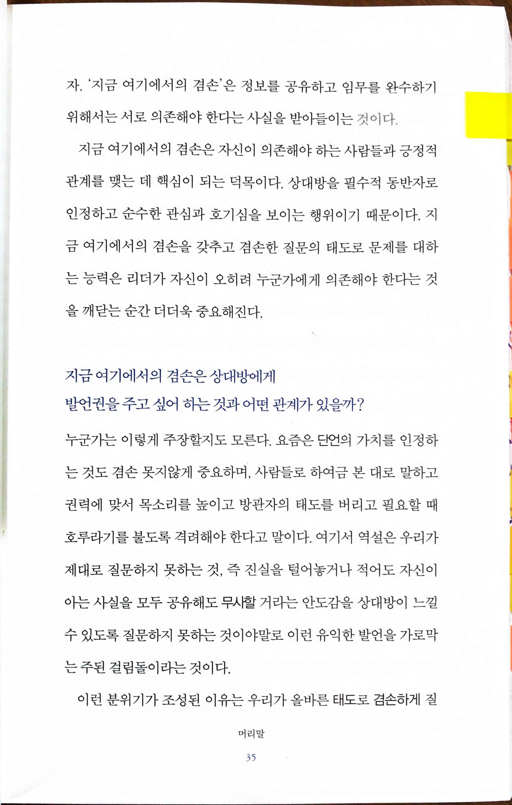

* `'지금 여기에서의 겸손'은 정보를 공유하고 임무를 완수하기위해서는 서로 의존해야 한다는 사실을 받아들이는 것이다.`
* `지금 여기에서의 겸손은 자신이 의존해야 하는 사람들과 긍정적 관계를 맺는 데 핵심이 되는 덕목이다. 상대방을 필수적 동반자로 인정하고 순수한 관심과 호기심을 보이는 행위이기 때문이다. 지금 여기에서의 겸손을 갖추고 겸손한 질문의 태도로 문제를 대하는 능력은 리더가 자신이 오히려 누군가에게 의존해야 한다는 것을 깨닫는 순간 더더욱 중요해진다.`
* (리더는 자신의 권한을 자꾸 분산하고 넘겨주고 또 다른 새로운 중요한 일을 찾아야 한다는 말이 연상된다)

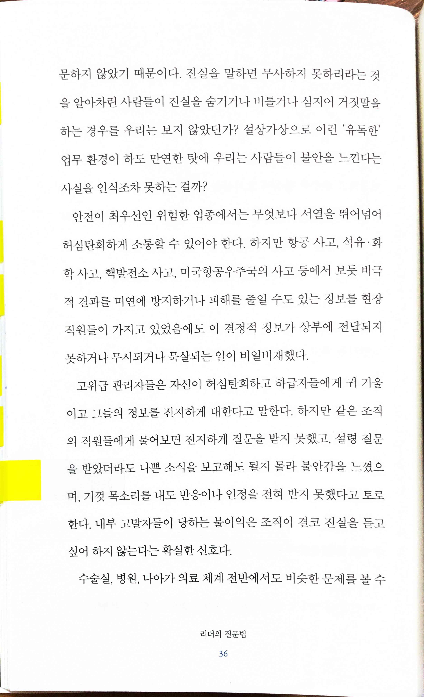

* `내부 고발자들이 당하는 불이익은 조직이 결코 진실을 듣고 싶어 하지 않는다는 확실한 신호다.`
* (그래서 bug가 발생해도 개발자들을 책망하지 않고 다만 수습을 하고 bug report 작성하는 걸 원칙으로 삼고 있다. 아마 많은 사람들에게 내부 고발자/공익 제보자에 대한 이야기를 하면 대부분 내부 고발자를 보호해야 한다는 점에 동의할 것이다. 내부 고발자들의 제보는 결국 해당 조직의 문제를 알리려고 한다는 행위라고 보면, 개발자의 bug와 비슷하게 생각할 수 있을 거고, 그러면 bug를 문제삼기보다는 오히려 알리기를 권장하고 문제를 해결하는 과정으로 삼는게 중요하다는 점을 이해하기 쉬워질 것이다)

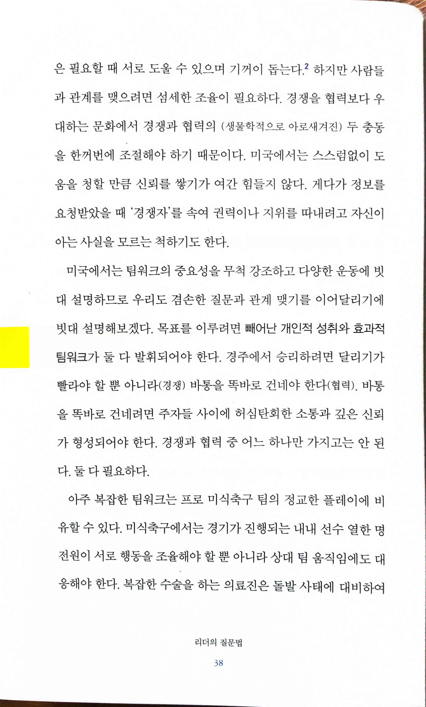

* `겸손한 질문과 관계 맺기를 이어달리기에 빗대 설명해보겠다. 목표를 이루려면 빼어난 개인적 성취와 효과적 팀워크가 둘 다 발휘되어야 한다. 경주에서 승리하려면 달리기가 빨라야 할 뿐 아니라(경쟁) 바통을 똑바로 건네야 한다(협력), 바통을 똑바로 건네려면 주자들 사이에 허심탄회한 소통과 깊은 신뢰가 형성되어야 한다. 경쟁과 협력 중 어느 하나만 가지고는 안 된다. 둘 다 필요하다.`

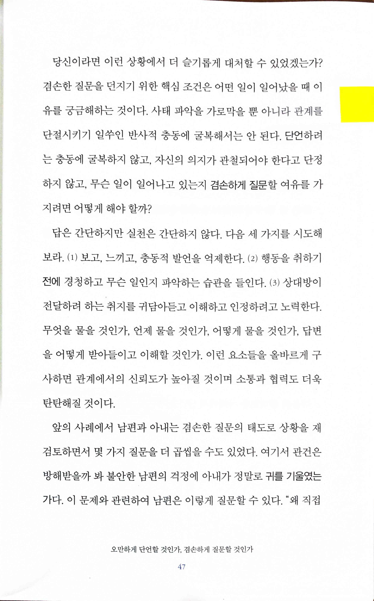

* `겸손한 질문을 던지기 위한 핵심 조건은 어떤 일이 일어났을 때 이유를 궁금해하는 것이다. 사태 파악을 가로막을 뿐 아니라 관계를 단절시키기 일쑤인 반사적 충동에 굴복해서는 안 된다. 단언하려는 충동에 굴복하지 않고, 자신의 의지가 관철되어야 한다고 단정하지 않고, 무슨 일이 일어나고 있는지 겸손하게 질문할 여유를 가지려면 어떻게 해야 할까?`
* `답은 간단하지만 실천은 간단하지 않다. 다음 세 가지를 시도해보라. (1) 보고, 느끼고, 충동적 발언을 억제한다. (2) 행동을 취하기전에 경청하고 무슨 일인지 파악하는 습관을 들인다. (3) 상대방이 전달하려 하는 취지를 귀담아듣고 이해하고 인정하려고 노력한다. 무엇을 물을 것인가, 언제 물을 것인가, 어떻게 물을 것인가, 답변을 어떻게 받아들이고 이해할 것인가. 이런 요소들을 올바르게 구사하면 관계에서의 신뢰도가 높아질 것이며 소통과 협력도 더욱 탄탄해질 것이다`
* (한 마디로 생각없이 바로 반응하지 말고 일단 한 호흡 멈추고 생각하고 반응하라는 이야기. 말하긴 쉽지만 실천하긴 정말 어렵다)

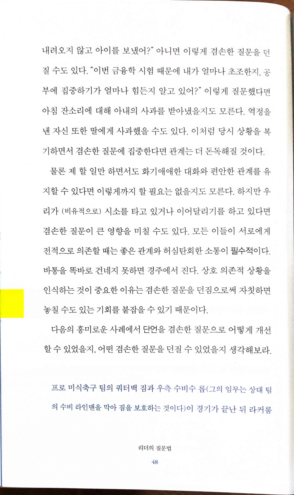

* `모든 이들이 서로에게 전적으로 의존할 때는 좋은 관계와 허심탄회한 소통이 필수적이다. 바통을 똑바로 건네지 못하면 경주에서 진다. 상호 의존적 상황을 인식하는 것이 중요한 이유는 겸손한 질문을 던짐으로써 자칫하면 놓칠 수도 있는 기회를 붙잡을 수 있기 때문이다.`

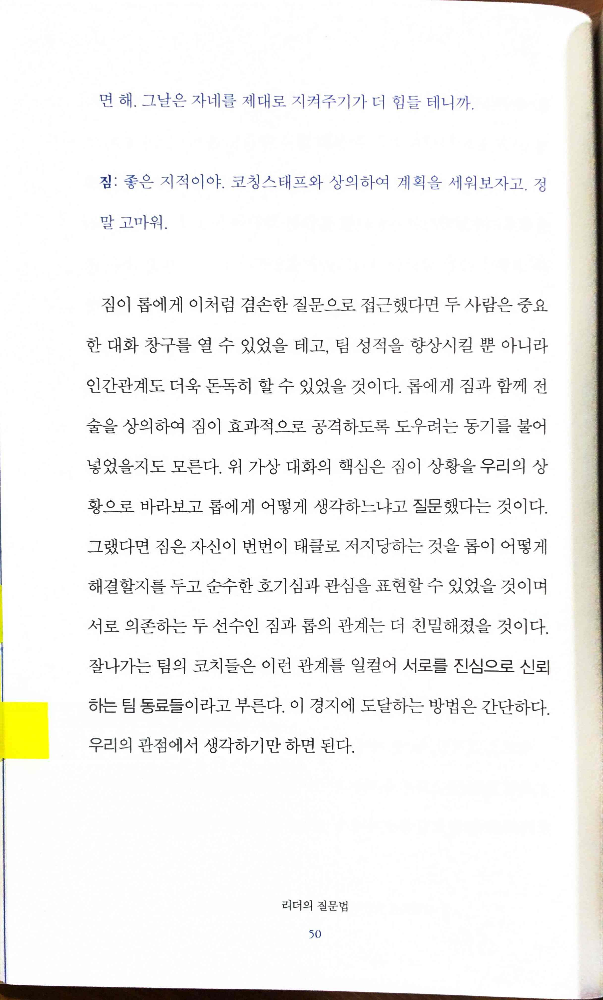

* `서로를 진심으로 신뢰하는 팀 동료들`
* `이 경지에 도달하는 방법은 간단하다. 우리의 관점에서 생각하기만 하면 된다.`

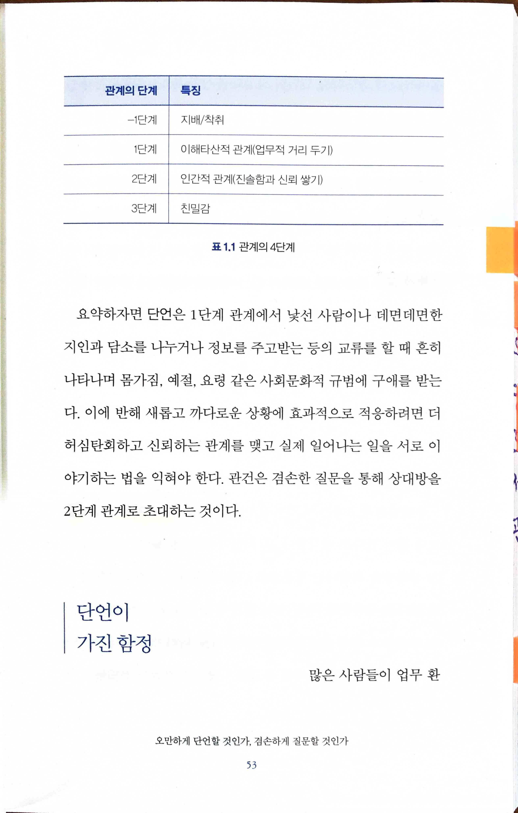

* `관계의 4단계`
* `지배/착취 -> 이해타산적 관계 -> 인간적 관계 -> 친밀감`
* (현실은 이해타산적 관계도 제대로 수립되지 않는 경우도 있다. 이미 속담에도 있지 않은가 - 재주는 곰이 넘고 돈은 엉뚱한 사람이 번다)

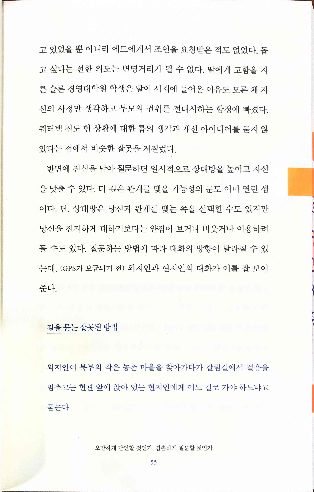

* `진심을 담아 질문하면 일시적으로 상대방을 높이고 자신을 낮출 수 있다. 더 깊은 관계를 맺을 가능성의 문도 이미 열린 셈이다. 단, 상대방은 당신과 관계를 맺는 쪽을 선택할 수도 있지만 당신을 진지하게 대하기보다는 얕잡아 보거나 비웃거나 이용하려들 수도 있다.`

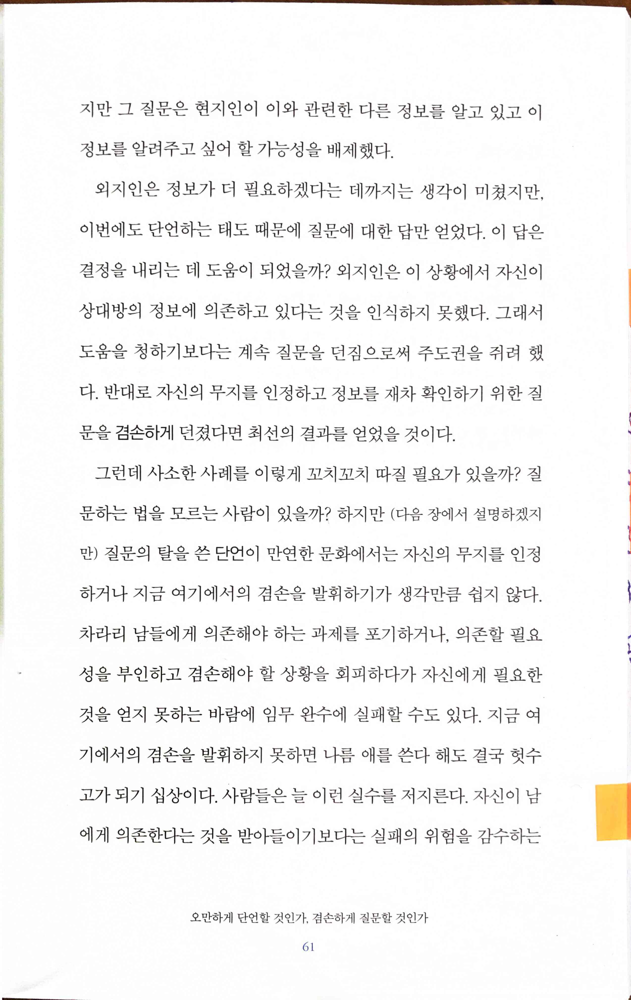

* `질문의 탈을 쓴 단언이 만연한 문화에서는 자신의 무지를 인정하거나 지금 여기에서의 겸손을 발휘하기가 생각만큼 쉽지 않다. 차라리 남들에게 의존해야 하는 과제를 포기하거나, 의존할 필요성을 부인하고 겸손해야 할 상황을 회피하다가 자신에게 필요한 것을 얻지 못하는 바람에 임무 완수에 실패할 수도 있다.`

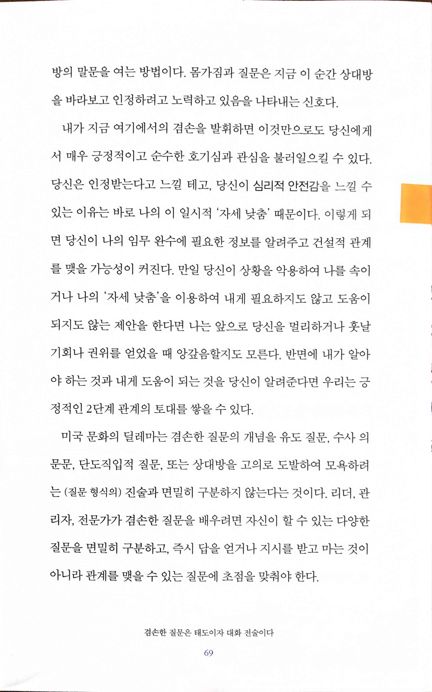

* `내가 지금 여기에서의 겸손을 발휘하면 이것만으로도 당신에게서 매우 긍정적이고 순수한 호기심과 관심을 불러일으킬 수 있다. 당신은 인정받는다고 느낄 테고, 당신이 심리적 안전감을 느낄 수 있는 이유는 바로 나의 이 일시적 자세 낮춤' 때문이다. 이렇게 되면 당신이 나의 임무 완수에 필요한 정보를 알려주고 건설적 관계를 맺을 가능성이 커진다.`
* `리더, 관리자, 전문가가 겸손한 질문을 배우려면 자신이 할 수 있는 다양한 질문을 면밀히 구분하고, 즉시 답을 얻거나 지시를 받고 마는 것이 아니라 관계를 맺을 수 있는 질문에 초점을 맞춰야 한다.`
* `겸손한 질문은 태도이자 대화 전술이다.`

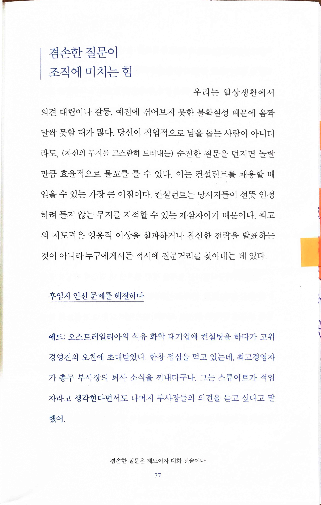

* `최고의 지도력은 영웅적 이상을 설파하거나 참신한 전략을 발표하는 것이 아니라 누구에게서든 적시에 질문거리를 찾아내는 데 있다.`

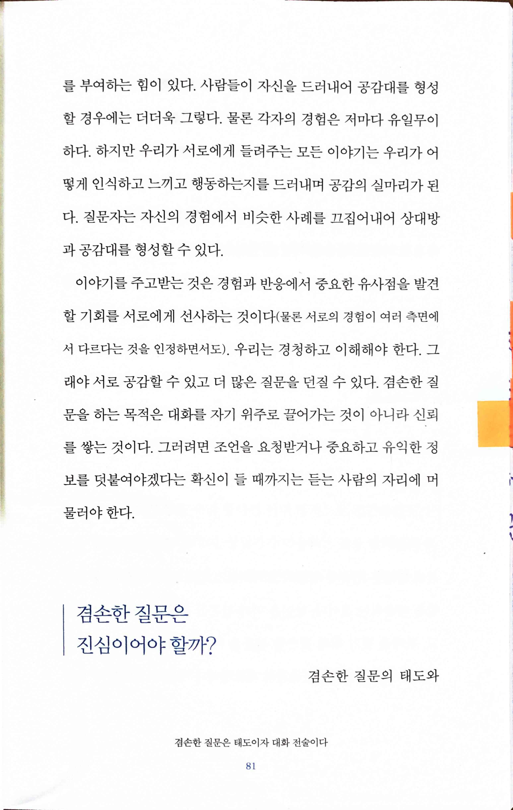

* `우리는 경청하고 이해해야 한다. 그래야 서로 공감할 수 있고 더 많은 질문을 던질 수 있다. 겸손한 질문을 하는 목적은 대화를 자기 위주로 끌어가는 것이 아니라 신뢰를 쌓는 것이다. 그러려면 조언을 요청받거나 중요하고 유익한 정보를 덧붙여야겠다는 확신이 들 때까지는 듣는 사람의 자리에 머물러야 한다.`
* (예수가 말한 "청함을 받았을 때에 차라리 가서 끝자리에 앉으라"는 말과 일맥상통한다고 생각한다)

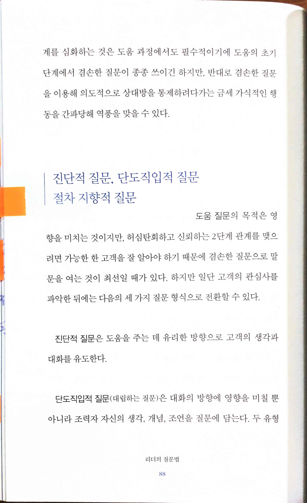 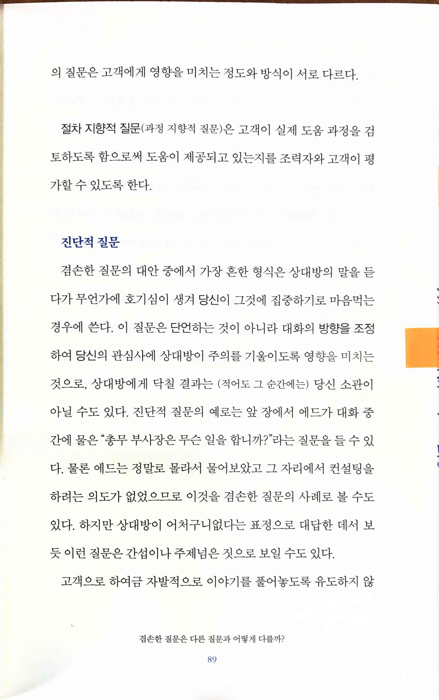  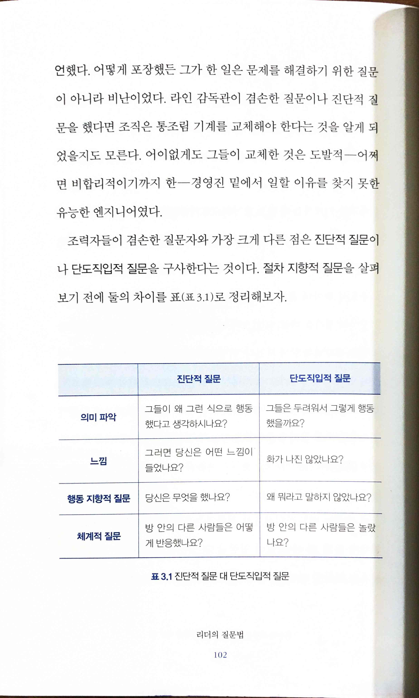 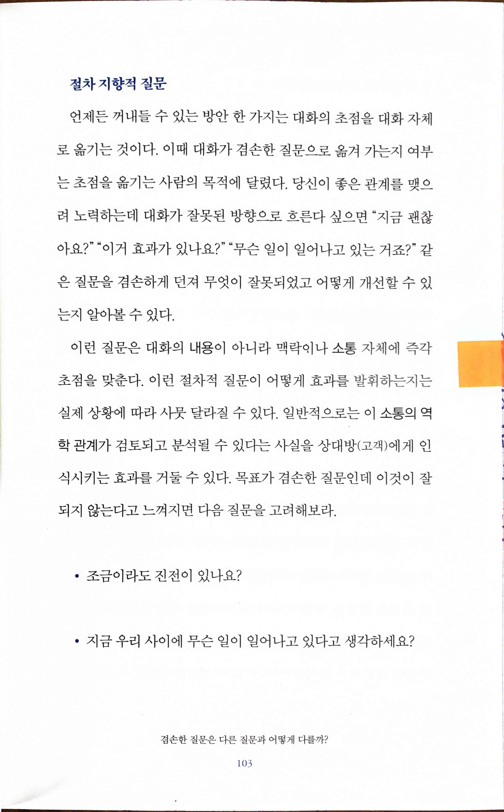

* `진단적 질문은 도움을 주는 데 유리한 방향으로 고객의 생각과 대화를 유도한다.`
  * `이 질문은 단언하는 것이 아니라 대화의 방향을 조정하여 당신의 관심사에 상대방이 주의를 기울이도록 영향을 미치는 것으로, 상대방에게 닥칠 결과는 (적어도 그 순간에는) 당신 소관이 아닐 수도 있다.`
* `단도직입적 질문(대립하는 질문)은 대화의 방향에 영향을 미칠 뿐아니라 조력자 자신의 생각, 개념, 조언을 질문에 담는다.`
  * `진단적 질문과 다른 점은 조력자가 자신의 생각을 의도적으로 질문에 포함한다는 것이다. 질문은 여전히 호기심이나 관심에서 비롯했는지 모르지만, 다음에 무슨 일이 일어날 수 있거나 일어나야 하는가에 대한 조력자 자신의 생각이 여기에 결부되어 있다.`
  * `목적은 조력자가 원하거나 생각하는 바와 연관된 정보를 얻는 것이다. 당신은 상대방 영역에 발을 내디뎠으며 이제 공은 고객 못지않게(또는 그 이상으로) 당신 몫이 된다.`
  * `질문자가 대화의 과정과 내용을 주도`
* `절차 지향적 질문(과정 지향적 질문)은 고객이 실제 도움 과정을 검토하도록 함으로써 도움이 제공되고 있는지를 조력자와 고객이 평가할 수 있도록 한다.`
  * `겸손한 질문으로 옮겨 가는지 여부는 초점을 옮기는 사람의 목적에 달렸다. 당신이 좋은 관계를 맺으려 노력하는데 대화가 잘못된 방향으로 흐른다 싶으면 “지금 괜찮아요?” “이거 효과가 있나요?” “무슨 일이 일어나고 있는 거죠?" 같은 질문을 겸손하게 던져 무엇이 잘못되었고 어떻게 개선할 수 있는지 알아볼 수 있다.`
  * `이런 질문은 대화의 내용이 아니라 맥락이나 소통 자체에 즉각 초점을 맞춘다. 이런 절차적 질문이 어떻게 효과를 발휘하는지는 실제 상황에 따라 사뭇 달라질 수 있다. 일반적으로는 이 소통의 역학 관계가 검토되고 분석될 수 있다는 사실을 상대방(고객)에게 인식시키는 효과를 거둘 수 있다.`
  * (즉 대화를 통해 상대방에게 상대의 처지를 이해하고 있다 혹은 이해하려 한다는 효과를 준다는 걸로 이해했다)

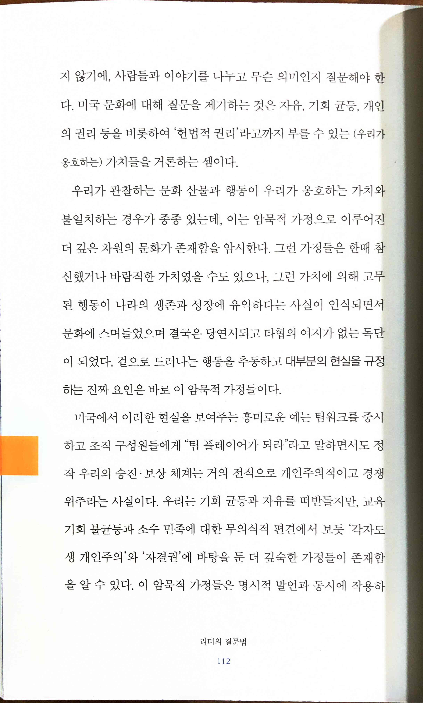

* `미국에서 이러한 현실을 보여주는 흥미로운 예는 팀워크를 중시하고 조직 구성원들에게 “팀 플레이어가 되라" 라고 말하면서도 정작 우리의 승진 · 보상 체계는 거의 전적으로 개인주의적이고 경쟁위주라는 사실이다. 우리는 기회 균등과 자유를 떠받들지만, 교육기회 불균등과 소수 민족에 대한 무의식적 편견에서 보듯 '각자도생 개인주의'와 '자결권'에 바탕을 둔 더 깊숙한 가정들이 존재함을 알 수 있다.`
* (이 부분은 평가와도 연계되는 어려운 부분. 팀의 성과에서 개인의 성과를 어떻게 구분할 것인가, 하지만 팀의 업무 나아가서는 조직의 업무에 공헌하라고 하는 모순. 개인과 팀 뿐만 아니라 팀 사이에서도 가장 쉽게는 인프라 조직같이, 혹은 스포츠의 심판같이 잘 해야 본전인 업무와 서비스 조직같이 성과를 통해 업무 성과를 드러낼 수 있는 조직간의 균형은 어떻게 잡을 것인가 같은 문제와도 연결된다. '실리콘밸리의 팀장들'의 저자도 구글같은 회사에서도 이런 문제를 완전히/제대로 해결하지 못했다고 썼다)

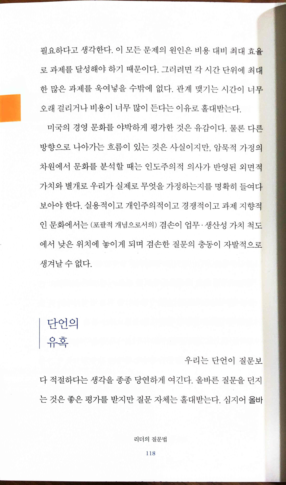

* `이 모든 문제의 원인은 비용 대비 최대 효율로 과제를 달성해야 하기 때문이다. 그러려면 각 시간 단위에 최대한 많은 과제를 욱여넣을 수밖에 없다. 관계 맺기는 시간이 너무 오래 걸리거나 비용이 너무 많이 든다는 이유로 홀대받는다.`
* `실용적이고 개인주의적이고 경쟁적이고 과제 지향적인 문화에서는 (포괄적 개념으로서의) 겸손이 업무 · 생산성 가치 척도에서 낮은 위치에 놓이게 되며 겸손한 질문의 충동이 자발적으로 생겨날 수 없다.`
* (관계를 중시하면서 성과를 낸다는 건 양립할 수 있는 걸까?)

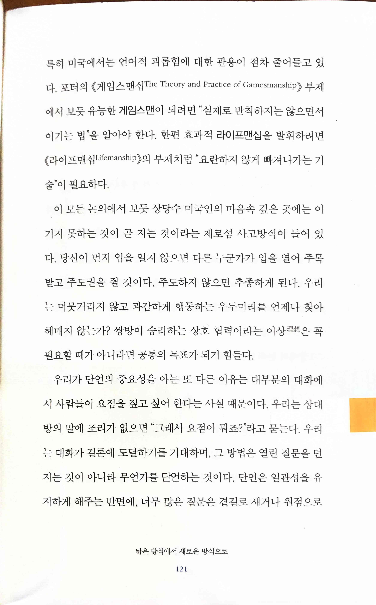

* `상당수 미국인의 마음속 깊은 곳에는 이기지 못하는 것이 곧 지는 것이라는 제로섬 사고방식이 들어 있다. 당신이 먼저 입을 열지 않으면 다른 누군가가 입을 열어 주목받고 주도권을 쥘 것이다. 주도하지 않으면 추종하게 된다. 우리는 머뭇거리지 않고 과감하게 행동하는 우두머리를 언제나 찾아헤매지 않는가? 쌍방이 승리하는 상호 협력이라는 이상은 꼭 필요할 때가 아니라면 공통의 목표가 되기 힘들다.`
* `우리가 단언의 중요성을 아는 또 다른 이유는 대부분의 대화에서 사람들이 요점을 짚고 싶어 한다는 사실 때문이다. 우리는 상대방의 말에 조리가 없으면 “그래서 요점이 뭐죠?"라고 묻는다. 우리는 대화가 결론에 도달하기를 기대하며, 그 방법은 열린 질문을 던지는 것이 아니라 무언가를 단언하는 것이다.`

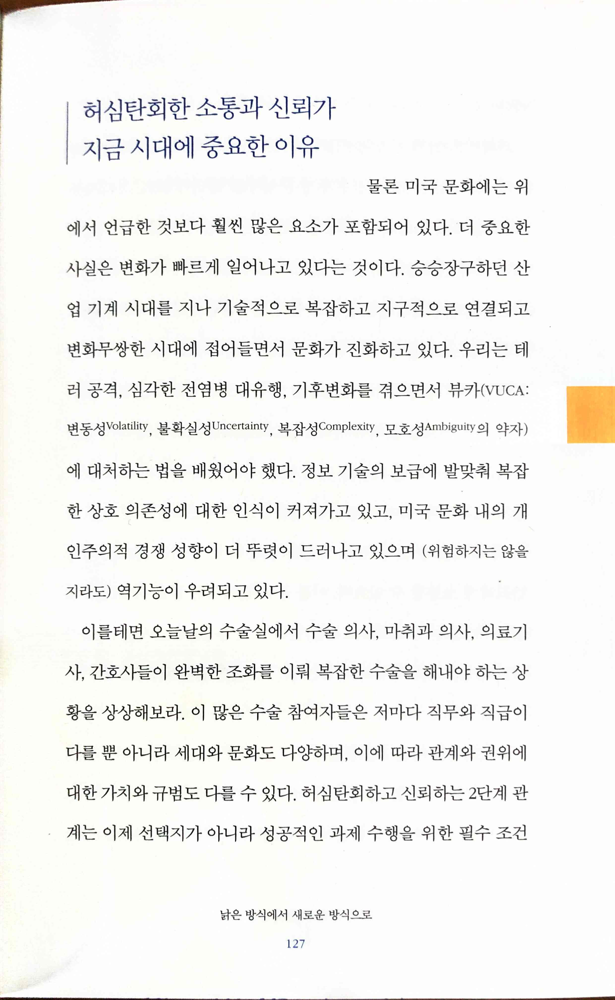

* `뷰카(VUCA:변동성 Volatility, 불확실성 Uncertainty, 복잡성 Complexity, 모호성 Ambiguity의 약자)`
* `정보 기술의 보급에 발맞춰 복잡한 상호 의존성에 대한 인식이 커져가고 있고, 미국 문화 내의 개인주의적 경쟁 성향이 더 뚜렷이 드러나고 있으며 (위험하지는 않을지라도) 역기능이 우려되고 있다.`
  * (과장하면 죄수의 딜레마하고도 연결시킬 수 있는 이야기일까?)

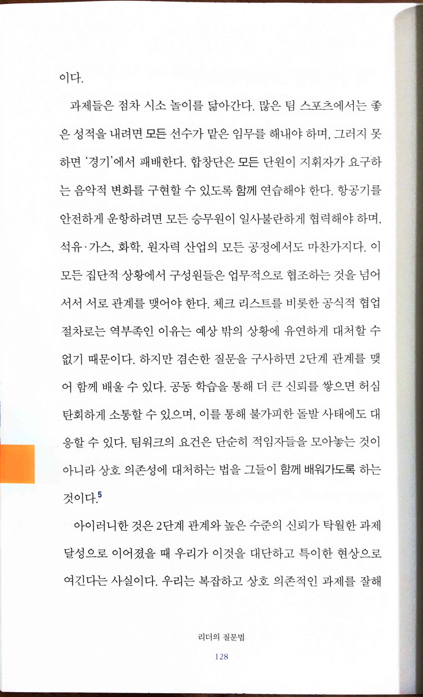

* `많은 팀 스포츠에서는 좋은 성적을 내려면 모든 선수가 맡은 임무를 해내야 하며, 그러지 못하면 '경기'에서 패배한다.`
* `합창단은 모든 단원이 지휘자가 요구하는 음악적 변화를 구현할 수 있도록 함께 연습해야 한다.`
* `항공기를안전하게 운항하려면 모든 승무원이 일사불란하게 협력해야 하며, 석유·가스, 화학, 원자력 산업의 모든 공정에서도 마찬가지다.`
* `이 모든 집단적 상황에서 구성원들은 업무적으로 협조하는 것을 넘어서서 서로 관계를 맺어야 한다. 체크 리스트를 비롯한 공식적 협업절차로는 역부족인 이유는 예상 밖의 상황에 유연하게 대처할 수 없기 때문이다.`
* `하지만 겸손한 질문을 구사하면 2단계 관계를 맺어 함께 배울 수 있다. 공동 학습을 통해 더 큰 신뢰를 쌓으면 허심탄회하게 소통할 수 있으며, 이를 통해 불가피한 돌발 사태에도 대응할 수 있다. 팀워크의 요건은 단순히 적임자들을 모아놓는 것이 아니라 상호 의존성에 대처하는 법을 그들이 함께 배워가도록 하는것이다.`
* `아이러니한 것은 2단계 관계와 높은 수준의 신뢰가 탁월한 과제달성으로 이어졌을 때 우리가 이것을 대단하고 특이한 현상으로 여긴다는 사실이다.`
  * (그만큼 달성하기 어렵기 때문이 아닐까?)

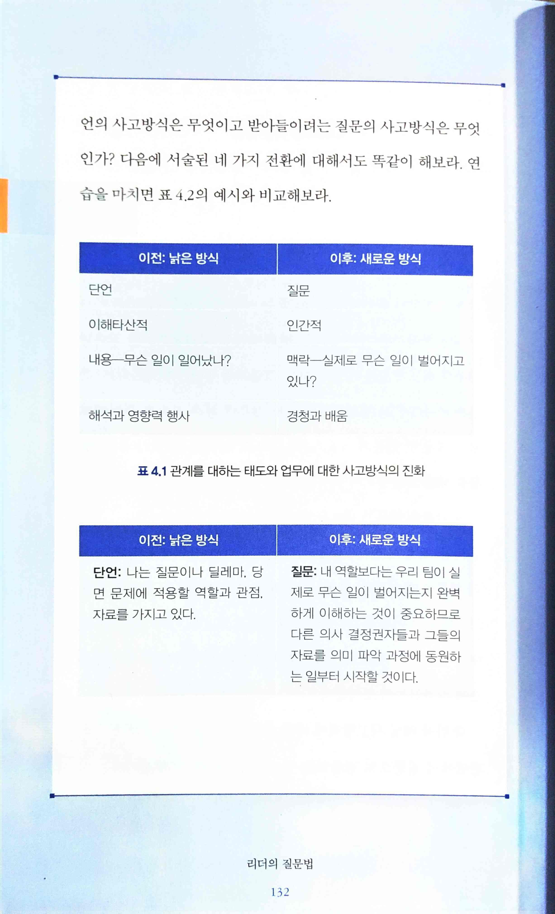 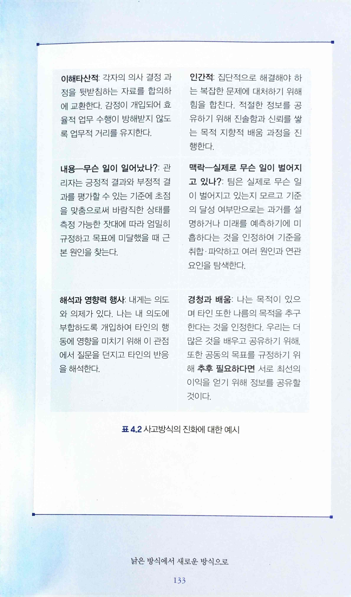

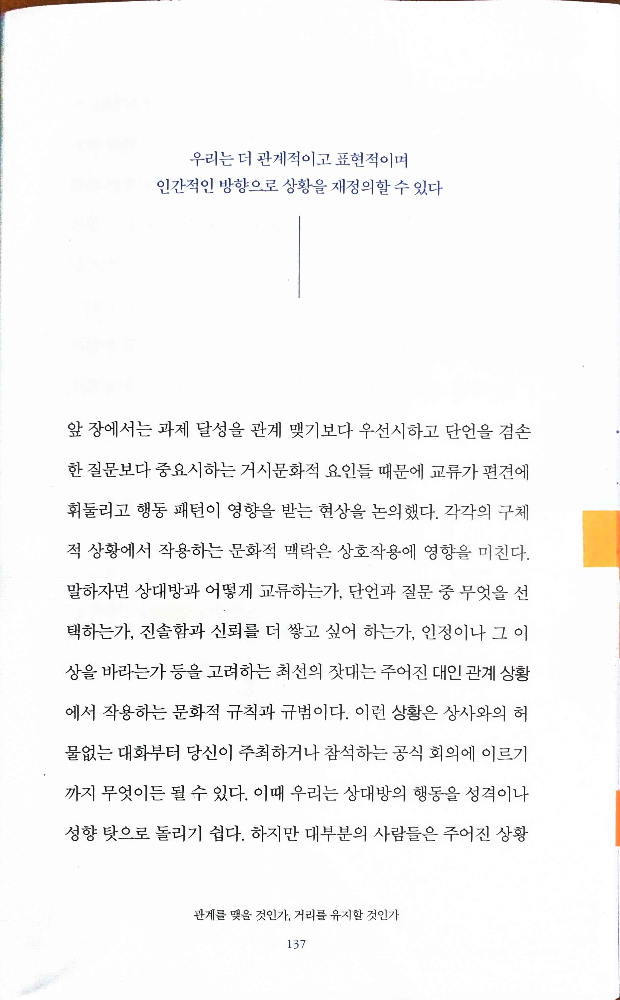

* `각각의 구체적 상황에서 작용하는 문화적 맥락은 상호작용에 영향을 미친다.`
  * (저자는 미국인이라 다문화를 기반으로 이야기하는 거겠지만 사실 같은 나라 같은 문화적 배경을 가진 사람들이라고 해도 서로의 성장 배경, 교육 환경, 성격의 차이등으로 유사한 상황에서도 맥락에 대한 이해의 차이가 발생하고 상호작용에 영향을 준다. 이에 대해 설명할 때 사람들은 문제가 생길 때 호감을 가진 사람이 하면 실수, 불호인 사람이 하면 잘못이라고 생각한다고 이야기하곤 했다)

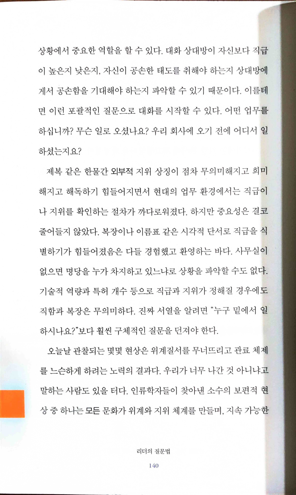

* `오늘날 관찰되는 몇몇 현상은 위계질서를 무너뜨리고 관료 체제를 느슨하게 하려는 노력의 결과다... 인류학자들이 찾아낸 소수의 보편적 현상 중 하나는 모든 문화가 위계와 지위 체계를 만들며...`
  * (수직적인 조직 체계는 어쩔 수 없지만, 수평문화를 구축하려는 최근의 경향뿐만 아니라 이제는 정말 수평조직을 실험하는 경우도 있다 - DAO Decentralized Autonomous Organization)

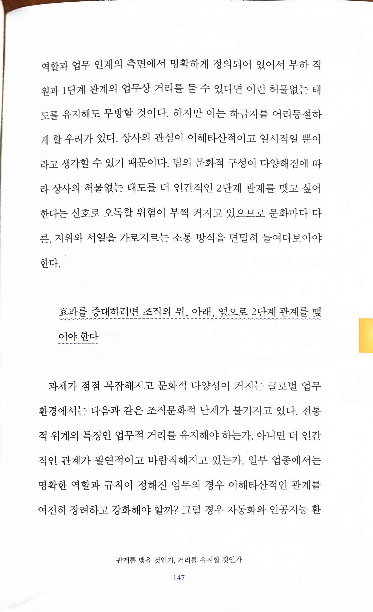

* `효과를 증대하려면 조직의 위, 아래, 옆으로 2단계 관계를 맺어야 한다.`

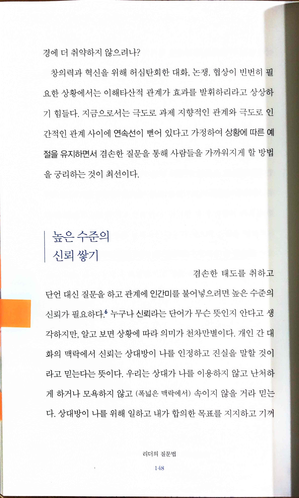

* `창의력과 혁신을 위해 허심탄회한 대화, 논쟁, 협상이 빈번히 필요한 상황에서는 이해타산적 관계가 효과를 발휘하리라고 상상하기 힘들다. 지금으로서는 극도로 과제 지향적인 관계와 극도로 인간적인 관계 사이에 연속선이 뻗어 있다고 가정하여 상황에 따른 예절을 유지하면서 겸손한 질문을 통해 사람들을 가까워지게 할 방법을 궁리하는 것이 최선이다.`
* `겸손한 태도를 취하고 단언 대신 질문을 하고 관계에 인간미를 불어넣으려면, 높은 수준의 신뢰가 필요하다. 누구나 신뢰라는 단어가 무슨 뜻인지 안다고 생각하지만, 알고 보면 상황에 따라 의미가 천차만별이다. 개인 간 대화의 맥락에서 신뢰는 상대방이 나를 인정하고 진실을 말할 것이라고 믿는다는 뜻이다.`

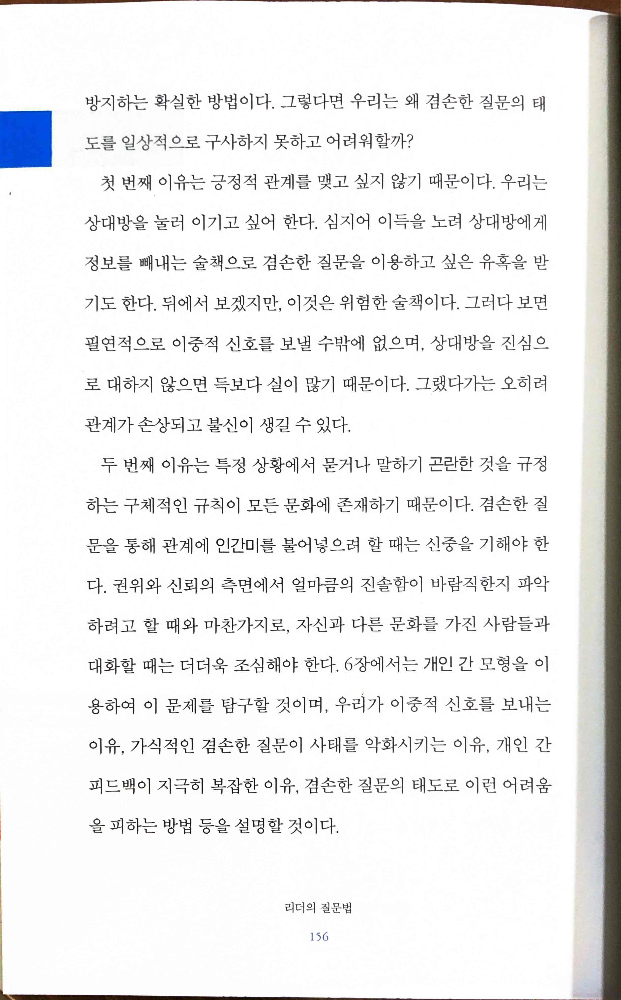

* `겸손한 질문의 태도를 일상적으로 구사하지 못하고 어려워할까?`
* `첫 번째 이유는 긍정적 관계를 맺고 싶지 않기 때문이다. 우리는 상대방을 눌러 이기고 싶어 한다. 심지어 이득을 노려 상대방에게 정보를 빼내는 술책으로 겸손한 질문을 이용하고 싶은 유혹을 받기도 한다. 뒤에서 보겠지만, 이것은 위험한 술책이다. 그러다 보면 필연적으로 이중적 신호를 보낼 수밖에 없으며, 상대방을 진심으로 대하지 않으면 득보다 실이 많기 때문이다. 그랬다가는 오히려 관계가 손상되고 불신이 생길 수 있다.`
* `두 번째 이유는 특정 상황에서 묻거나 말하기 곤란한 것을 규정하는 구체적인 규칙이 모든 문화에 존재하기 때문이다. 겸손한 질문을 통해 관계에 인간미를 불어넣으려 할 때는 신중을 기해야 한다. 권위와 신뢰의 측면에서 얼마큼의 진솔함이 바람직한지 파악하려고 할 때와 마찬가지로, 자신과 다른 문화를 가진 사람들과 대화할 때는 더더욱 조심해야 한다.`

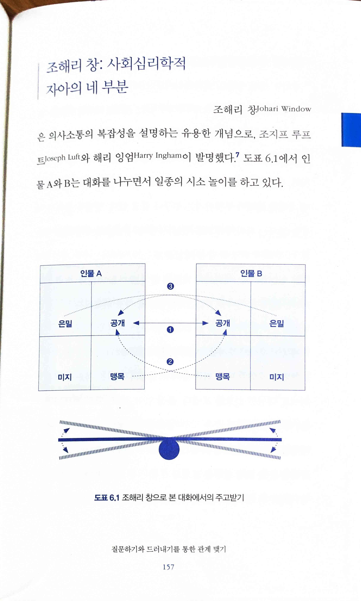

* `조해리 창Johari Window`
  * `의사소통의 복잡성을 설명하는 유용한 개념`

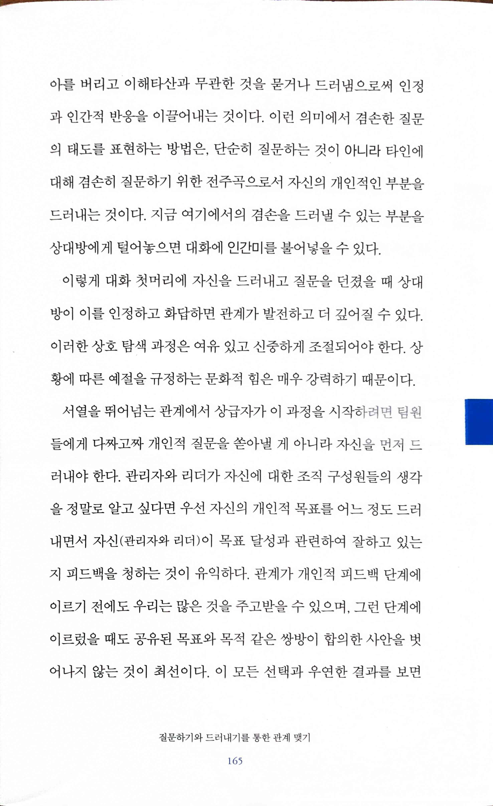

* `타인에 대해 겸손히 질문하기 위한 전주곡으로서 자신의 개인적인 부분을 드러내는 것이다. 지금 여기에서의 겸손을 드러낼 수 있는 부분을 상대방에게 털어놓으면 대화에 인간미를 불어넣을 수 있다.`
* `이렇게 대화 첫머리에 자신을 드러내고 질문을 던졌을 때 상대방이 이를 인정하고 화답하면 관계가 발전하고 더 깊어질 수 있다. 이러한 상호 탐색 과정은 여유 있고 신중하게 조절되어야 한다. 상황에 따른 예절을 규정하는 문화적 힘은 매우 강력하기 때문이다.`
* `서열을 뛰어넘는 관계에서 상급자가 이 과정을 시작하려면 팀원들에게 다짜고짜 개인적 질문을 쏟아낼 게 아니라 자신을 먼저 드러내야 한다. 관리자와 리더가 자신에 대한 조직 구성원들의 생각을 정말로 알고 싶다면 우선 자신의 개인적 목표를 어느 정도 드러내면서 자신(관리자와 리더)이 목표 달성과 관련하여 잘하고 있는지 피드백을 청하는 것이 유익하다. 관계가 개인적 피드백 단계에 이르기 전에도 우리는 많은 것을 주고받을 수 있으며, 그런 단계에 이르렀을 때도 공유된 목표와 목적 같은 쌍방이 합의한 사안을 벗어나지 않는 것이 최선이다.`
* (결국 적절하게 조정해야 한다는 말)

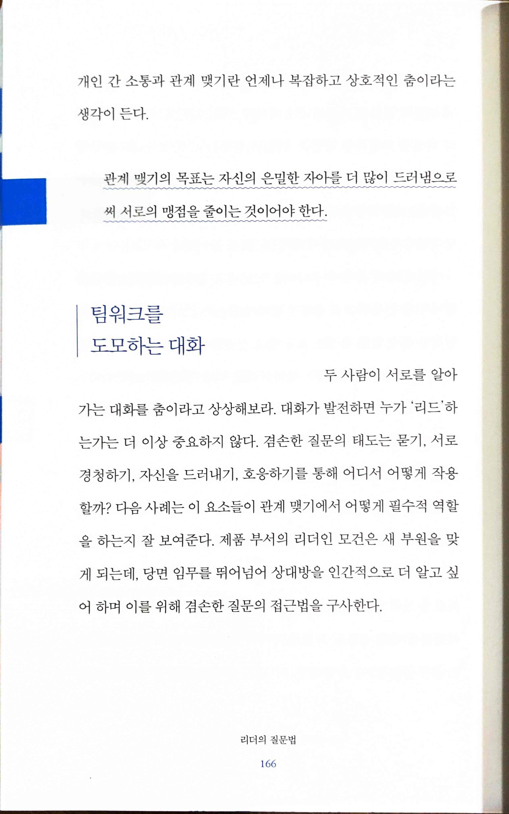

* `개인 간 소통과 관계 맺기란 언제나 복잡하고 상호적인 춤이라는 생각이 든다.`
* `관계 맺기의 목표는 자신의 은밀한 자아를 더 많이 드러냄으로써 서로의 맹점을 줄이는 것이어야 한다.`

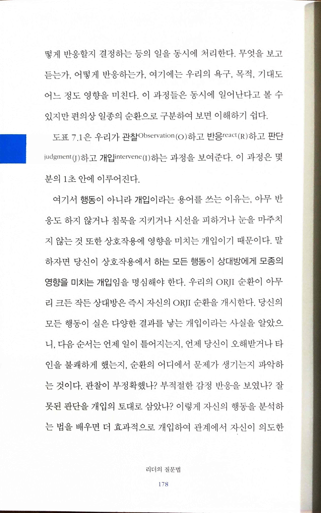

* `관찰Observation (O) 하고 반응react (R) 하고 판단judgment (J) 하고 개입 intervene (I) 하는 과정은 몇 분의 1초 안에 이루어진다.`
  * (흔히 면접 결과가 몇 초만에 결정된다는 이야기하고도 이어질 듯)
* `여기서 행동이 아니라 개입이라는 용어를 쓰는 이유는, 아무 반응도 하지 않거나 침묵을 지키거나 시선을 피하거나 눈을 마주치지 않는 것 또한 상호작용에 영향을 미치는 개입이기 때문이다. 말하자면 당신이 상호작용에서 하는 모든 행동이 상대방에게 모종의 영향을 미치는 개입임을 명심해야 한다.`
  * (다른 회사 CTO분과 이야기할 때 표정에 대해서도 신경써야 한다는 이야기를 듣고 웃었고 나도 그냥 무섭다는 이야기를 들은적이 있어서 이런 거 까지 신경써야 하는 건가? 하는 생각도 든다)

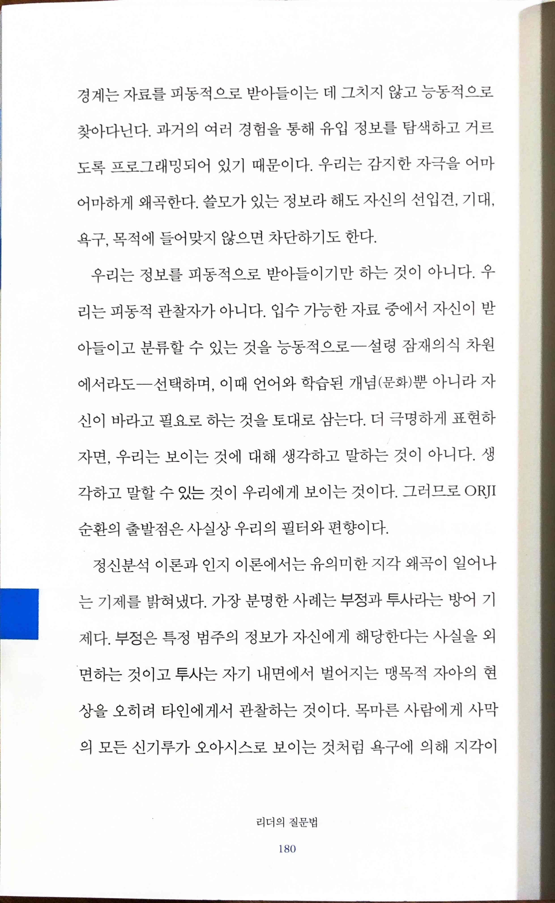

* `과거의 여러 경험을 통해 유입 정보를 탐색하고 거르도록 프로그래밍되어 있기 때문이다. 우리는 감지한 자극을 어마어마하게 왜곡한다. 쓸모가 있는 정보라 해도 자신의 선입견, 기대. 욕구, 목적에 들어맞지 않으면 차단하기도 한다.`
* `입수 가능한 자료 중에서 자신이 받아들이고 분류할 수 있는 것을 능동적으로 설령 잠재의식 차원에서라도 선택하며, 이때 언어와 학습된 개념(문화)뿐 아니라 자신이 바라고 필요로 하는 것을 토대로 삼는다. 더 극명하게 표현하자면, 우리는 보이는 것에 대해 생각하고 말하는 것이 아니다. 생각하고 말할 수 있는 것이 우리에게 보이는 것이다.`
* `정신분석 이론과 인지 이론에서는 유의미한 지각 왜곡이 일어나는 기제를 밝혀냈다. 가장 분명한 사례는 부정과 투사라는 방어 기제다. 부정은 특정 범주의 정보가 자신에게 해당한다는 사실을 외면하는 것이고 투사는 자기 내면에서 벌어지는 맹목적 자아의 현상을 오히려 타인에게서 관찰하는 것이다.`
* (인간의 강력한 편견)

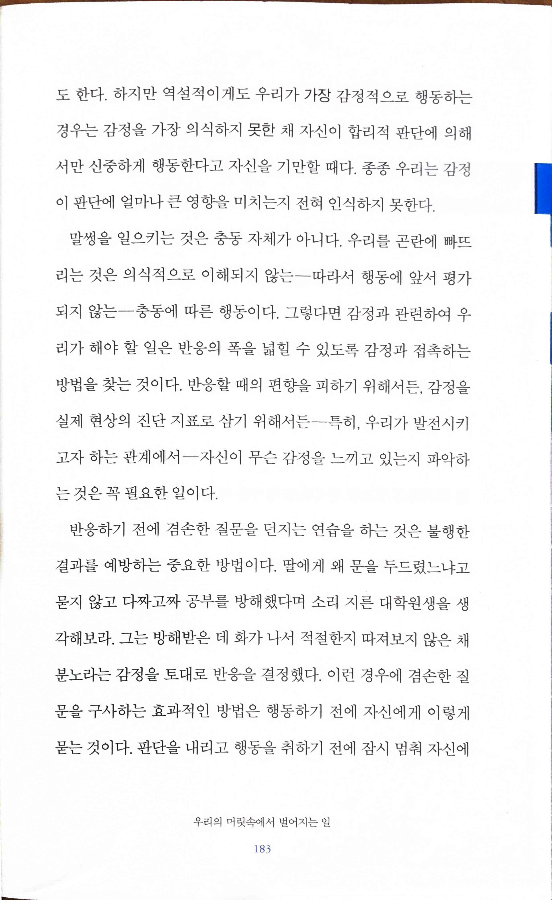

* `역설적이게도 우리가 가장 감정적으로 행동하는 경우는 감정을 가장 의식하지 못한 채 자신이 합리적 판단에 의해서만 신중하게 행동한다고 자신을 기만할 때다. 종종 우리는 감정이 판단에 얼마나 큰 영향을 미치는지 전혀 인식하지 못한다.`
* `반응할 때의 편향을 피하기 위해서든, 감정을 실제 현상의 진단 지표로 삼기 위해서든 - 특히, 우리가 발전시키고자 하는 관계에서 - 자신이 무슨 감정을 느끼고 있는지 파악하는 것은 꼭 필요한 일이다.`
* (결국 연습, 훈련. 당연한 일이라고 생각하기도 하지만 감정에 대해서도 연습을 해야 한다는 게 어쩐지 좀 서글프게 느껴지기도 한다)

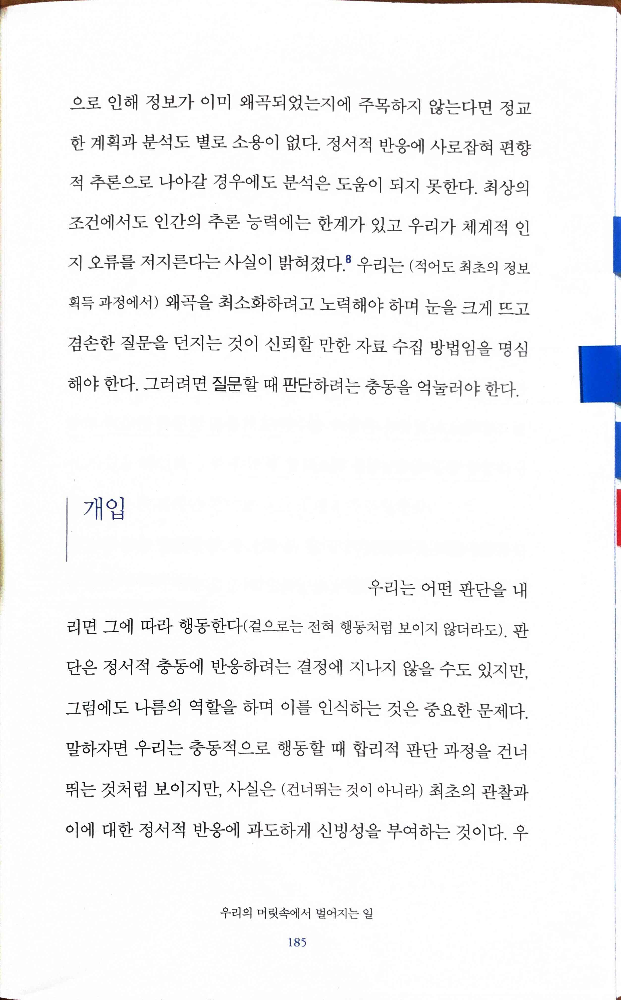

* `최상의 조건에서도 인간의 추론 능력에는 한계가 있고 우리가 체계적 인지 오류를 저지른다는 사실이 밝혀졌다. 우리는 (적어도 최초의 정보 획득 과정에서) 왜곡을 최소화하려고 노력해야 하며 눈을 크게 뜨고 겸손한 질문을 던지는 것이 신뢰할 만한 자료 수집 방법임을 명심해야 한다. 그러려면 질문할 때 판단하려는 충동을 억눌러야 한다.`
  * (인간의 지각, 이성이라는 게 정말 허약하다는 이야기)
* `우리는 충동적으로 행동할 때 합리적 판단 과정을 건너뛰는 것처럼 보이지만, 사실은 (건너뛰는 것이 아니라) 최초의 관찰과 이에 대한 정서적 반응에 과도하게 신빙성을 부여하는 것이다.`
  * (스스로 합리화한다는 뜻일까)

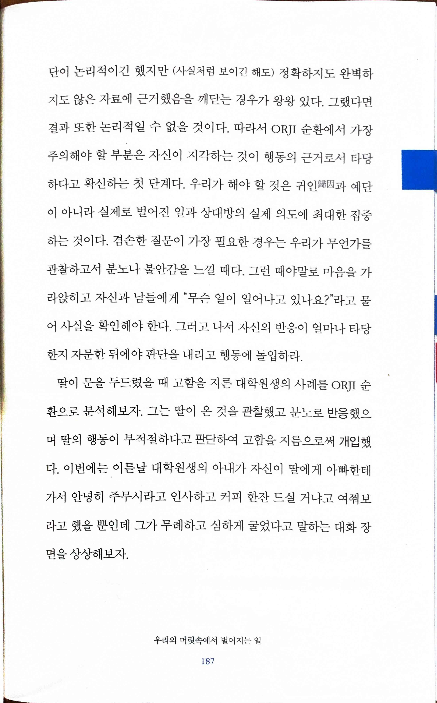

* `가장 주의해야 할 부분은 자신이 지각하는 것이 행동의 근거로서 타당하다고 확신하는 첫 단계다. 우리가 해야 할 것은 귀인과 예단이 아니라 실제로 벌어진 일과 상대방의 실제 의도에 최대한 집중하는 것이다. 겸손한 질문이 가장 필요한 경우는 우리가 무언가를 관찰하고서 분노나 불안감을 느낄 때다. 그런 때야말로 마음을 가라앉히고 자신과 남들에게 “무슨 일이 일어나고 있나요?" 라고 물어 사실을 확인해야 한다. 그러고 나서 자신의 반응이 얼마나 타당한지 자문한 뒤에야 판단을 내리고 행동에 돌입하라.`

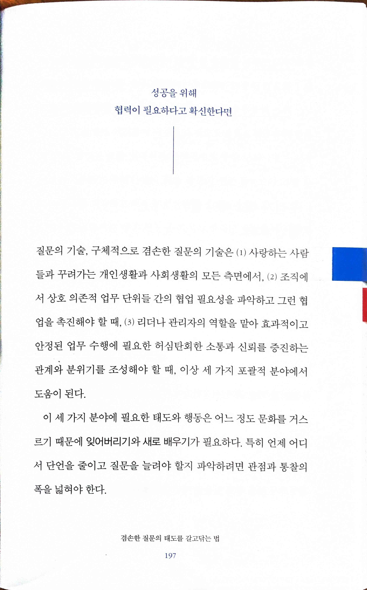

* `질문의 기술, 구체적으로 겸손한 질문의 기술은 (1) 사랑하는 사람들과 꾸려가는 개인생활과 사회생활의 모든 측면에서, (2) 조직에서 상호 의존적 업무 단위들 간의 협업 필요성을 파악하고 그런 협업을 촉진해야 할 때, (3) 리더나 관리자의 역할을 맡아 효과적이고 안정된 업무 수행에 필요한 허심탄회한 소통과 신뢰를 증진하는 관계와 분위기를 조성해야 할 때, 이상 세 가지 포괄적 분야에서 도움이 된다.`
* `이 세 가지 분야에 필요한 태도와 행동은 어느 정도 문화를 거스르기 때문에 잊어버리기와 새로 배우기가 필요하다. 특히 언제 어디서 단언을 줄이고 질문을 늘려야 할지 파악하려면 관점과 통찰의 폭을 넓혀야 한다.`

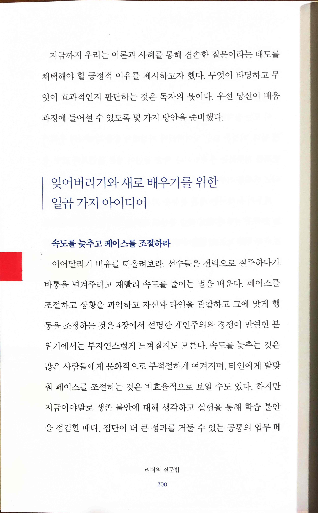

* `속도를 늦추고 페이스를 조절하라`
  * `이어달리기 비유를 떠올려보라. 선수들은 전력으로 질주하다가 바통을 넘겨주려고 재빨리 속도를 줄이는 법을 배운다. 페이스를 조절하고 상황을 파악하고 자신과 타인을 관찰하고 그에 맞게 행동을 조정하는 것은 4장에서 설명한 개인주의와 경쟁이 만연한 분위기에서는 부자연스럽게 느껴질지도 모른다. 속도를 늦추는 것은 많은 사람들에게 문화적으로 부적절하게 여겨지며, 타인에게 발맞춰 페이스를 조절하는 것은 비효율적으로 보일 수도 있다.`

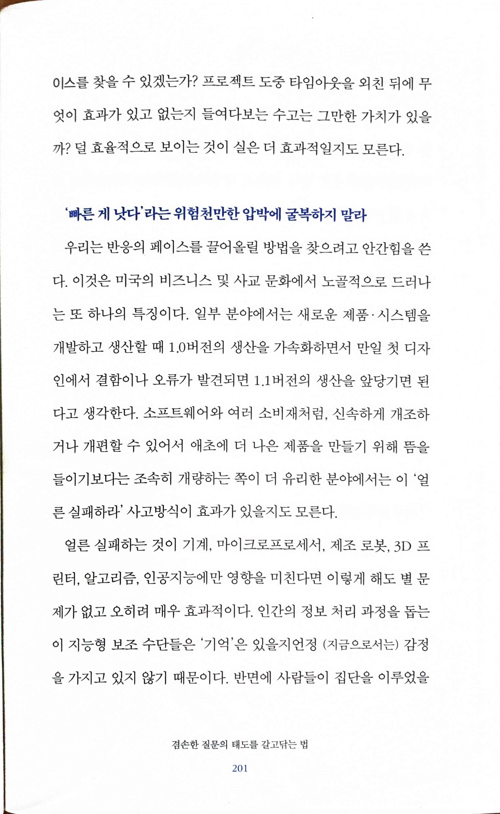

* `'빠른 게 낫다' 라는 위험천만한 압박에 굴복하지 말라`
  * `우리는 반응의 페이스를 끌어올릴 방법을 찾으려고 안간힘을 쓴다. 이것은 미국의 비즈니스 및 사교 문화에서 노골적으로 드러나는 또 하나의 특징이다. 일부 분야에서는 새로운 제품 · 시스템을 개발하고 생산할 때 1.0버전의 생산을 가속화하면서 만일 첫 디자인에서 결함이나 오류가 발견되면 1.1버전의 생산을 앞당기면 된다고 생각한다. 소프트웨어와 여러 소비재처럼, 신속하게 개조하거나 개편할 수 있어서 애초에 더 나은 제품을 만들기 위해 뜸을 들이기보다는 조속히 개량하는 쪽이 더 유리한 분야에서는 이 '얼른 실패하라' 사고방식이 효과가 있을지도 모른다.`

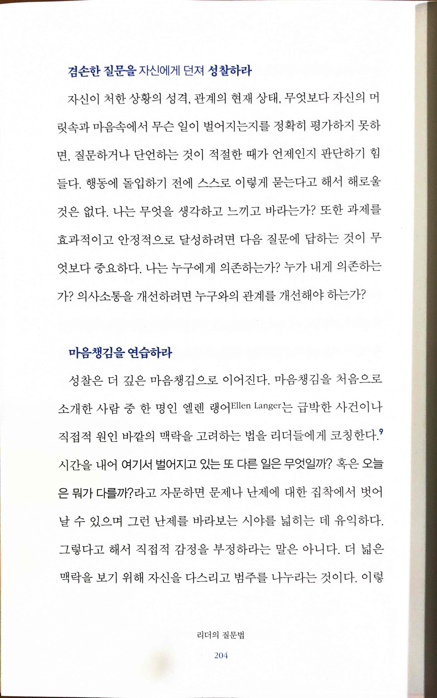

* `겸손한 질문을 자신에게 던져 성찰하라`
  * `자신이 처한 상황의 성격, 관계의 현재 상태, 무엇보다 자신의 머릿속과 마음속에서 무슨 일이 벌어지는지를 정확히 평가하지 못하면, 질문하거나 단언하는 것이 적절한 때가 언제인지 판단하기 힘들다. 행동에 돌입하기 전에 스스로 이렇게 묻는다고 해서 해로울 것은 없다. 나는 무엇을 생각하고 느끼고 바라는가? 또한 과제를 효과적이고 안정적으로 달성하려면 다음 질문에 답하는 것이 무엇보다 중요하다. 나는 누구에게 의존하는가? 누가 내게 의존하는가? 의사소통을 개선하려면 누구와의 관계를 개선해야 하는가?`
* `마음챙김을 연습하라`
  * `성찰은 더 깊은 마음챙김으로 이어진다. 마음챙김을 처음으로 소개한 사람 중 한 명인 엘렌 랭어Ellen Langer는 급박한 사건이나 직접적 원인 바깥의 맥락을 고려하는 법을 리더들에게 코칭한다.시간을 내어 여기서 벌어지고 있는 또 다른 일은 무엇일까? 혹은 오늘은 뭐가 다를까? 라고 자문하면 문제나 난제에 대한 집착에서 벗어날 수 있으며 그런 난제를 바라보는 시야를 넓히는 데 유익하다.그렇다고 해서 직접적 감정을 부정하라는 말은 아니다. 더 넓은 맥락을 보기 위해 자신을 다스리고 범주를 나누라는 것이다.`

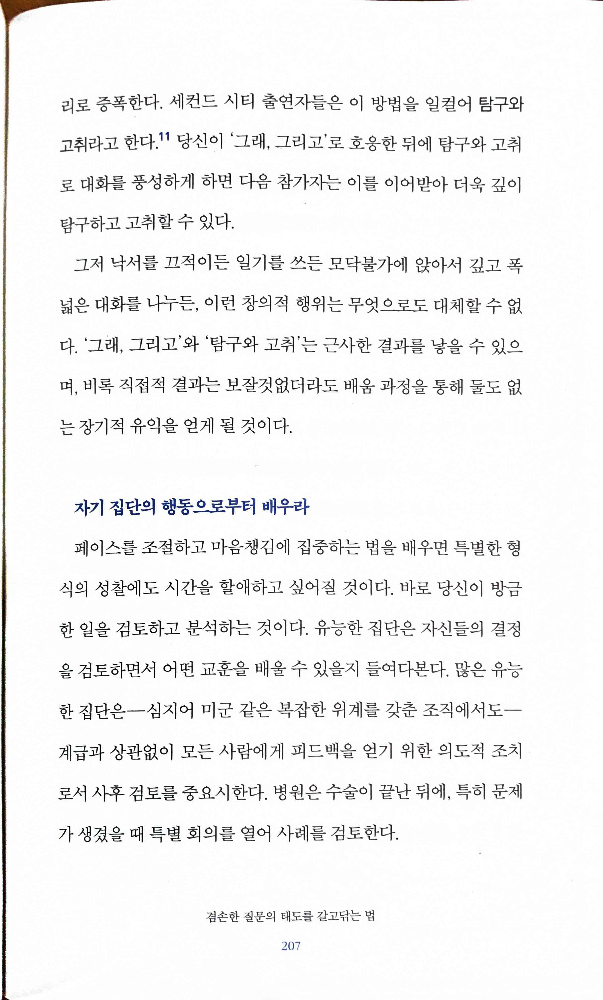

* `자기 집단의 행동으로부터 배우라`
  * `페이스를 조절하고 마음챙김에 집중하는 법을 배우면 특별한 형식의 성찰에도 시간을 할애하고 싶어질 것이다. 바로 당신이 방금한 일을 검토하고 분석하는 것이다. 유능한 집단은 자신들의 결정을 검토하면서 어떤 교훈을 배울 수 있을지 들여다본다. 많은 유능한 집단은 심지어 미군 같은 복잡한 위계를 갖춘 조직에서도 계급과 상관없이 모든 사람에게 피드백을 얻기 위한 의도적 조치로서 사후 검토를 중요시한다. 병원은 수술이 끝난 뒤에, 특히 문제가 생겼을 때 특별 회의를 열어 사례를 검토한다.`
  * (postmortem은 어떤 개인/집단에게나 유용하다. 반성없이 발전할 수 있는 개인/집단이 얼마나 있겠는가)