KODE VICIOUS
============

# CHAPTER 1 손 안의 코드
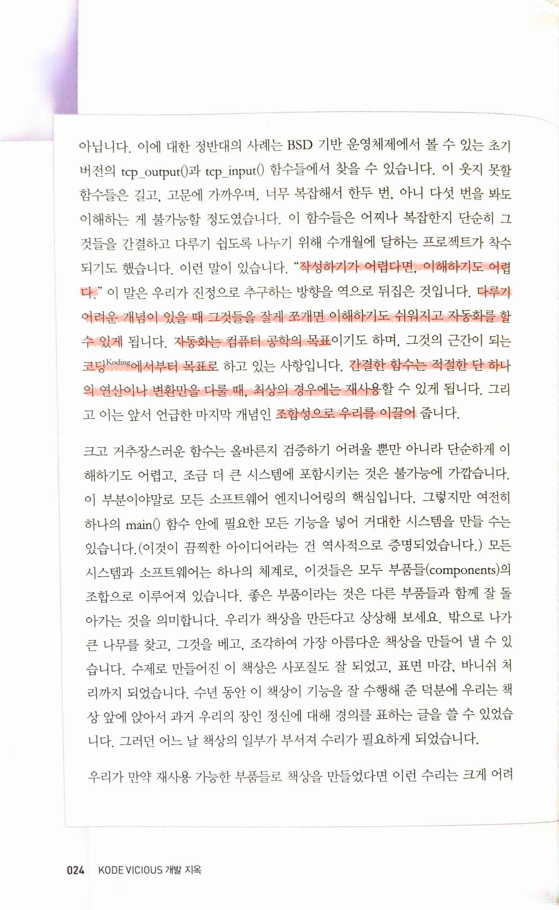

> "작성하기가 어렵다면, 이해하기도 어렵다." 이 말은 우리가 진정으로 추구하는 방향을 역으로 뒤집은 것입니다. 다루기 어려운 개념이 있을 때 그것들을 잘게 쪼개면 이해하기도 쉬워지고 자동화를 할 수 있게 됩니다. 자동화는 컴퓨터 공학의 목표이기도 하며, 그것의 근간이 되는 코딩kading에서부터 목표로 하고 있는 사항입니다. 간결한 함수는 적절한 단 하나의 연산이나 변환만을 다룰 때, 최상의 경우에는 재사용할 수 있게 됩니다. 그리고 이는 앞서 언급한 마지막 개념인 조합성으로 우리를 이끌어 줍니다.

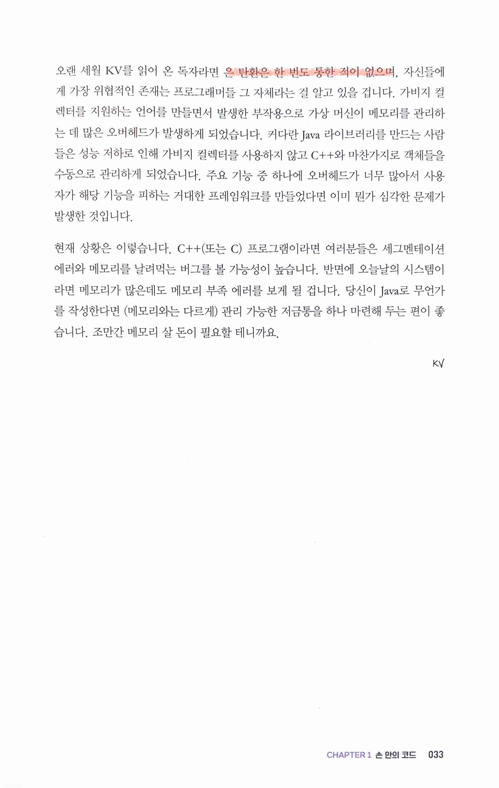

> 은 탄환은 한 번도 통한 적이 없음

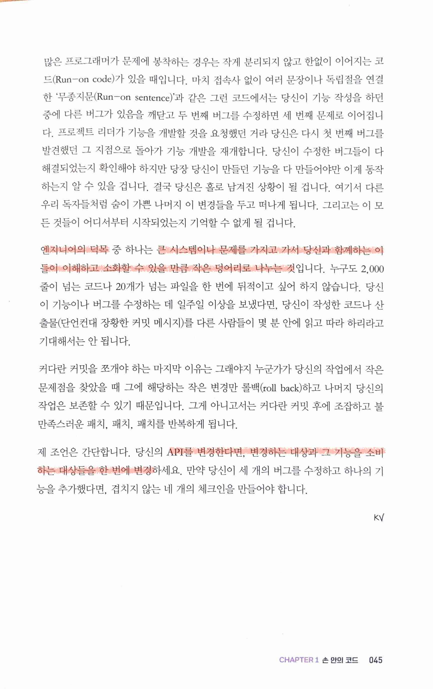

> 엔지니어의 덕목 중 하나는 큰 시스템이나 문제를 가지고 가서 당신과 함께하는 이들이 이해하고 소화할 수 있을 만큼 작은 덩어리로 나누는 것입니다.
>
> 당신의 API를 변경한다면, 변경하는 대상과 그 기능을 소비하는 대상들을 한 번에 변경하세요.

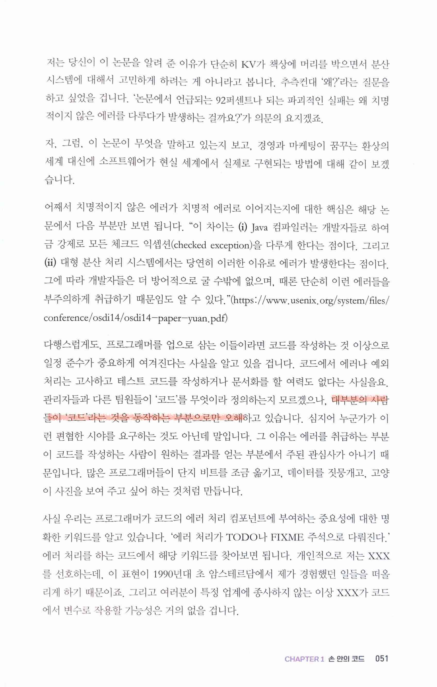

> 대부분의 사람들이 '코드'라는 것을 동작하는 부분으로만 오해...에러를 취급하는 부분이 코드를 작성하는 사람이 원하는 결과를 얻는 부분에서 주된 관심사가 아니기 때문

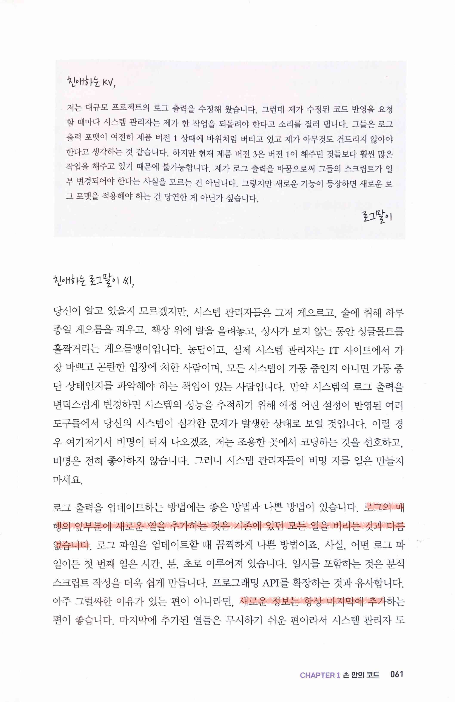

> 로그의 매행의 앞부분에 새로운 열을 추가하는 것은 기존에 있던 모든 열을 버리는 것과 다름없습니다... 새로운 정보는 항상 마지막에 추가하는 편이 좋습니다.

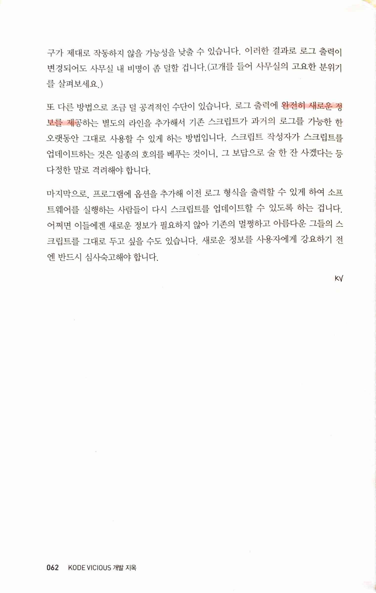

> 로그 출력에 완전히 새로운 정보를 제공하는 별도의 라인을 추가

# CHAPTER 2 코딩 수수께끼
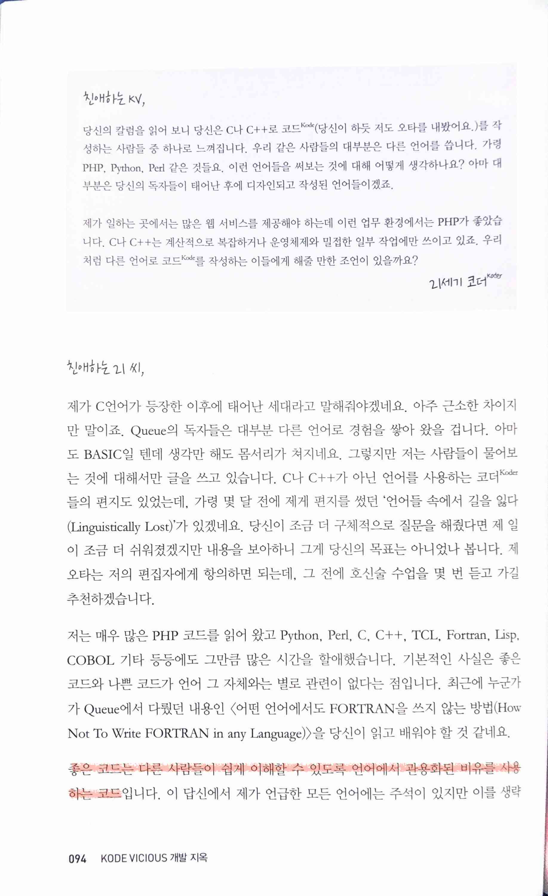 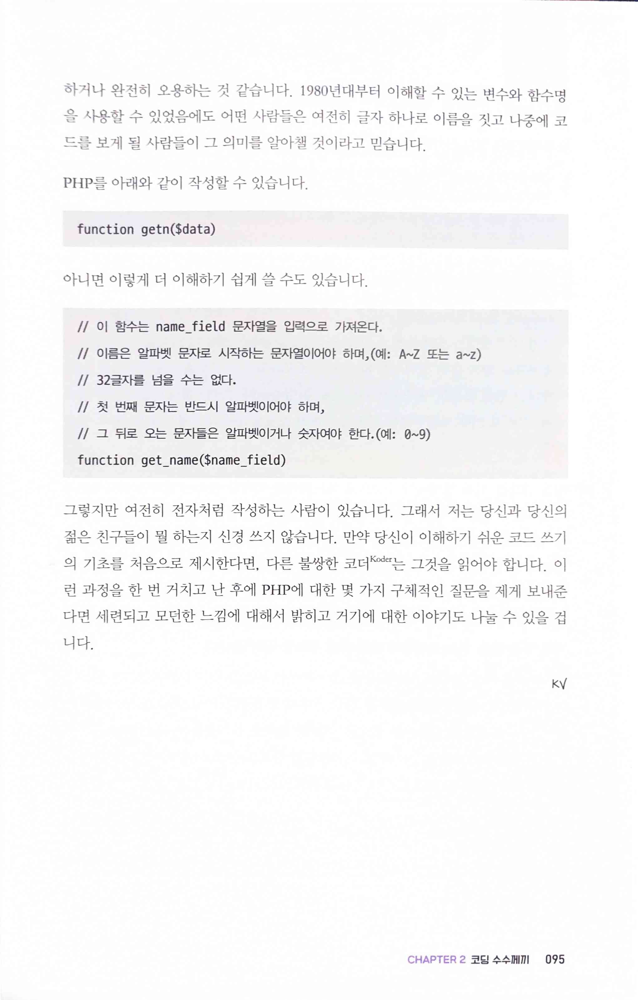

> 좋은 코드는 다른 사람들이 쉽게 이해할 수 있도록 언어에서 관용화된 비유를 사용하는 코드

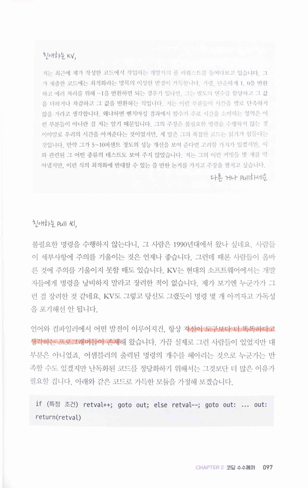

> 언어와 컴파일러에서 어떤 발전이 이루어지건 항상 자신이 도구보다 더 똑똑하다고 생각하는 프로그래머들이 존재

> 프로그래머들이 수작업으로 이뤄낸 최적화는 이미 다 고려
>
> 코드의 명료성과 소소한 최적화의 경쟁에서 명료성이 거의 항상 이깁니다... 코드에서 중요한 건 일단 틀리지 않는 게 먼저고 그 다음이 성능 보장
>
> 사람의 언어에서 관용구를 알아야 하는 이유와 마찬가지로 컴퓨터 언어의 관용구도 존중해야만 합니다. 관용구는 의사소통을 원활하게 해주는데, 프로그래밍 언어건 아니건 모든 언어의 목적이 바로 그겁니다. 언어에서 관용구는 언어가 쓰이는 만큼 유기적으로 성장합니다.

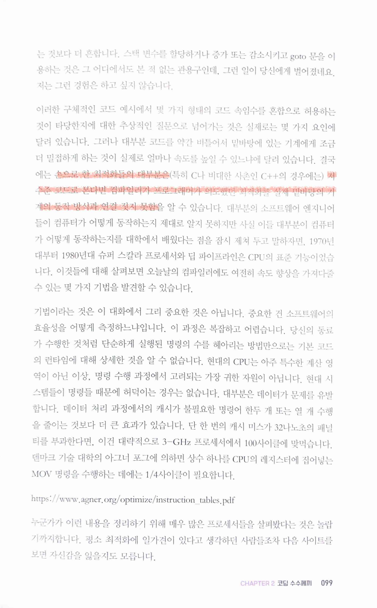

> 손으로 한 최적화들의 대부분은(특히 C나 비대한 사촌인 C++의 경우에는) 저수준 코드로 본다면 컴파일러가 프로그래머가 의도했던 최적화를 실제 밑바탕의 기계의 동작 방식과 연결 짓지 못함

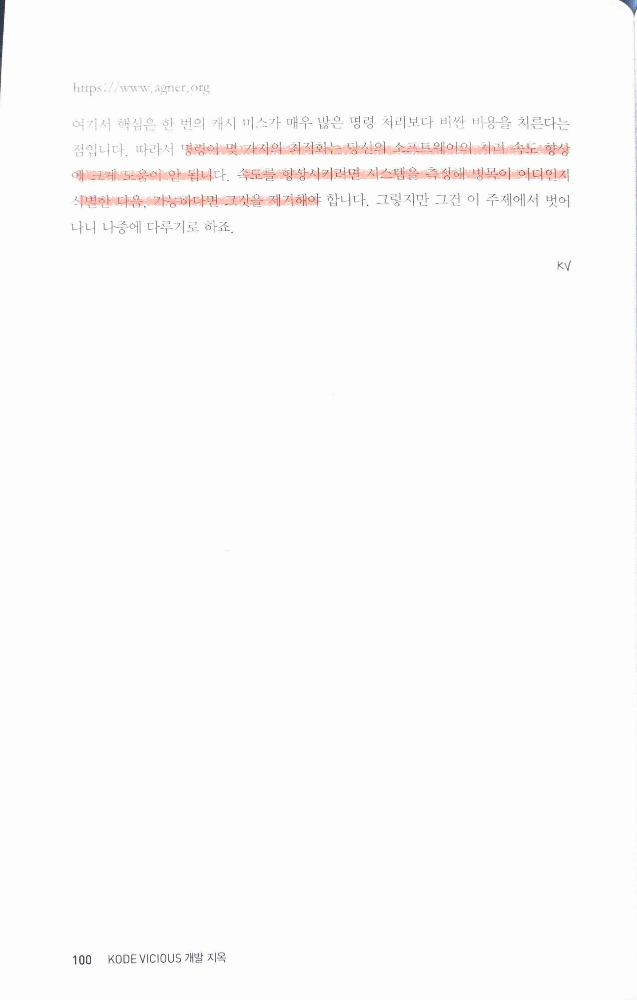

> 명령어 몇 가지의 최적화는 당신의 소프트웨어의 처리 속도 향상에 크게 도움이 안 됩니다. 속도를 향상시키려면 시스템을 측정해 병목이 어디인지 식별한 다음, 가능하다면 그것을 제거해야 합니다.

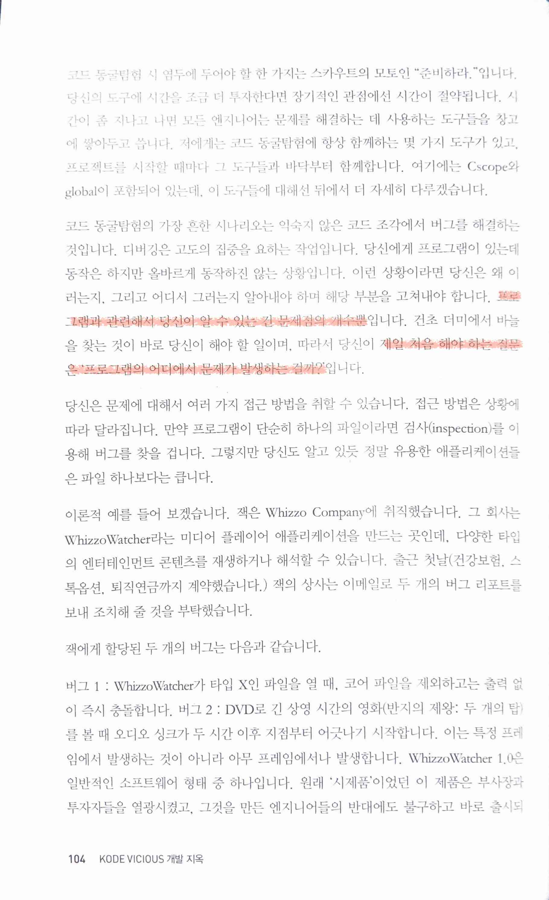

> 프로그램과 관련해서 당신이 알 수 있는 건 문제점의 개수뿐... 제일 처음 해야 하는 질문은 '프로그램의 어디에서 문제가 발생하는 걸까?'

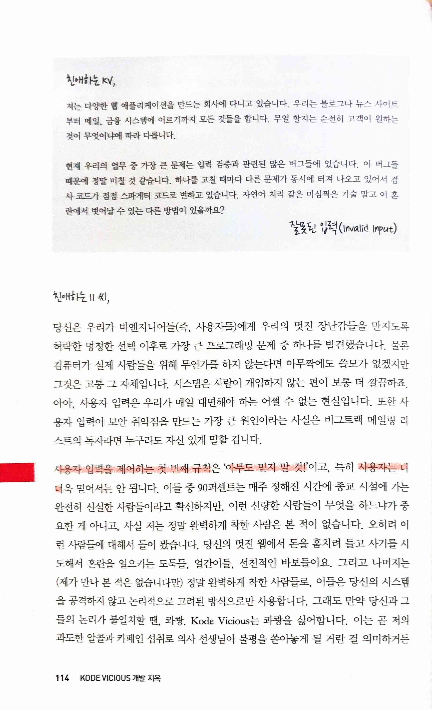

> 사용자 입력을 제어하는 첫 번째 규칙은 '아무도 믿지 말 것!'이고, 특히 사용자는 더 더욱 믿어서는 안 됩니다.

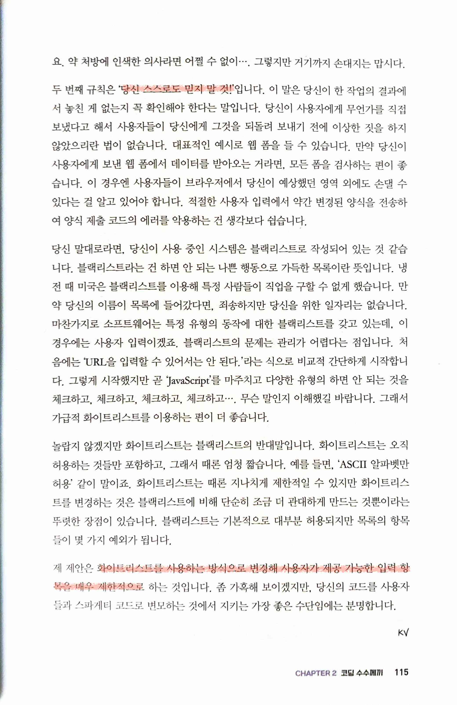

> 두 번째 규칙은 '당신 스스로도 믿지 말 것!'
>
> 화이트리스트를 사용하는 방식으로 변경해 사용자가 제공 가능한 입력 항목을 매우 제한적으로 하는 것

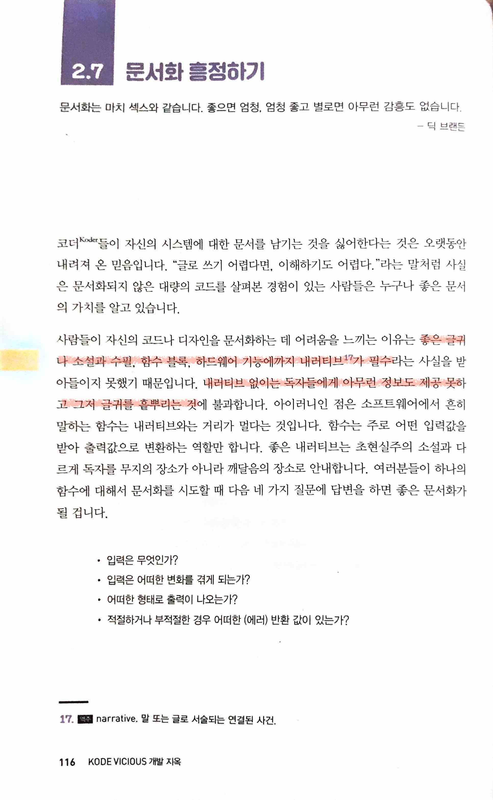

> 사람들이 자신의 코드나 디자인을 문서화하는 데 어려움을 느끼는 이유는 좋은 글귀나 소설과 수필, 함수 블록, 하드웨어 가지 내러티브가 필수라는 사실을 받아들이지 못했기 때문입니다. 내러티브 없이는 독자들에게 아무런 정보도 제공 못하고 그저 글귀를 흩뿌리는 것에 불과합니다.

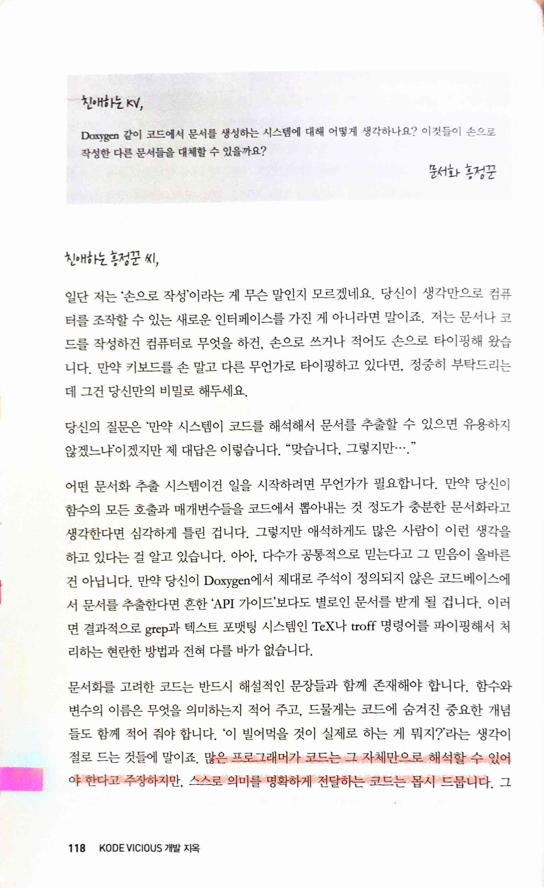

> 많은 프로그래머가 코드는 그 자체만으로 해석할 수야 한다고 주장하지만, 스스로 의미를 명확하게 전달하는 코드는 몹시 드뭅니다.

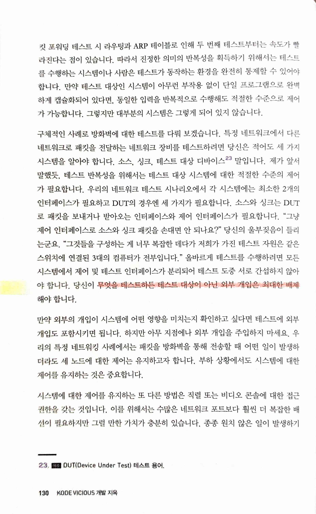

> 당신이 무엇을 테스트하든 테스트 대상이 아닌 외부 개입은 최대한 배제해야

# CHAPTER 3 시스템 디자인
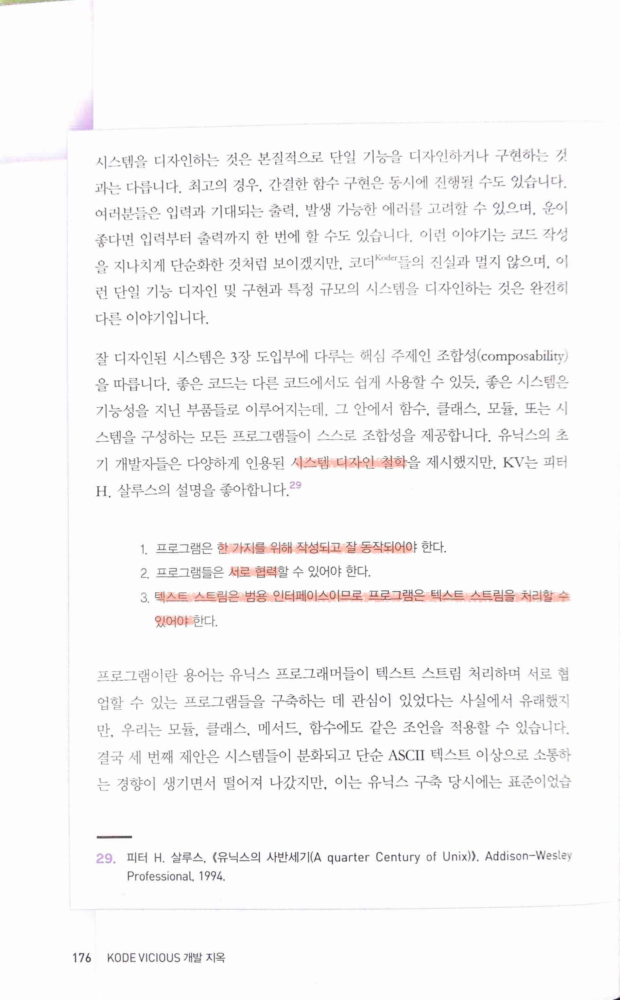

> 시스템 디자인 철학
>
> 1. 프로그램은 한 가지를 위해 작성되고 잘 동작되어야 한다.
>
> 2. 프로그램들은 서로 협력할 수 있어야 한다.
>
> 3. 텍스트 스트림은 범용 인터페이스이므로 프로그램은 텍스트 스트림을 처리할 수 있어야 한다.

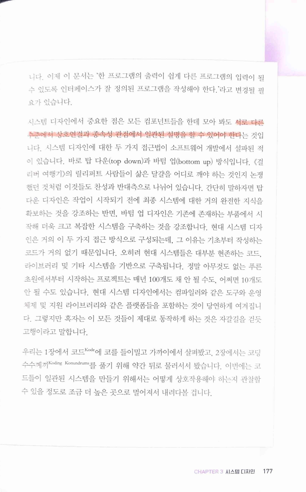

> 시스템 디자인에서 중요한 점은 모든 컴포넌트들을 한데 모아 봐도 서로 다른 수준에서 상호연결과 종속성 관점에서 일관된 설명을 할 수 있어야 한다는 것

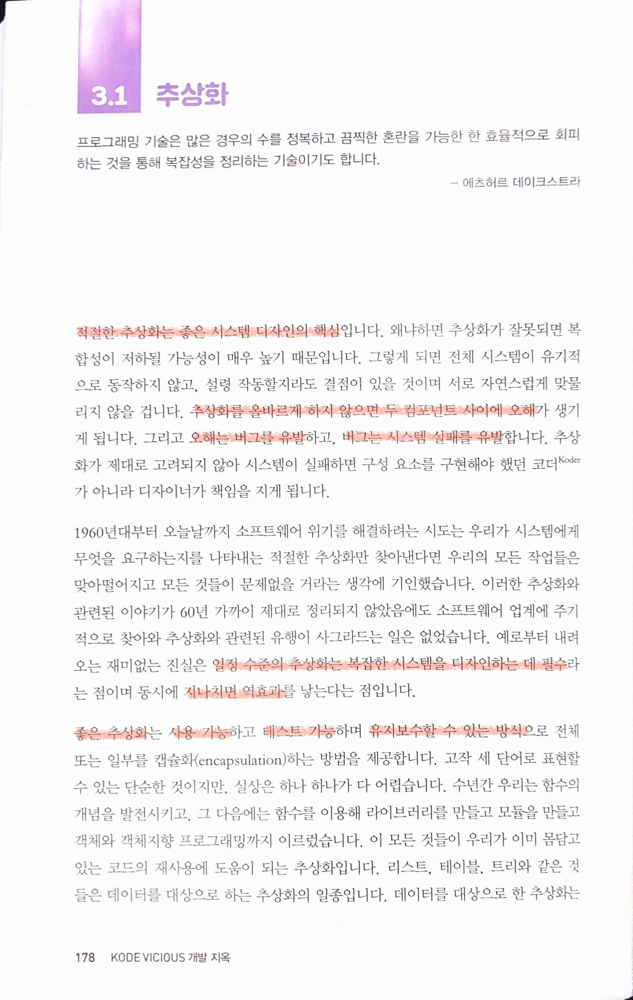

> 적절한 추상화는 좋은 시스템 디자인의 핵심... 추상화를 올바르게 하지 않으면 두 컴포넌트 사이에 오해... 오해는 버그 유발... 버그는 시스템 실패 유발
>
> 진실은 일정 수준의 추상화는 복잡한 시스템을 디자인하는 데 필수... 동시에 지나치면 역효과
>
> 좋은 추상화는 사용 가능하고 테스트 가능하며 유지보수할 수 있는 방식으로 전체 또는 일부를 캡슐화(encapsulation)하는 방법을 제공

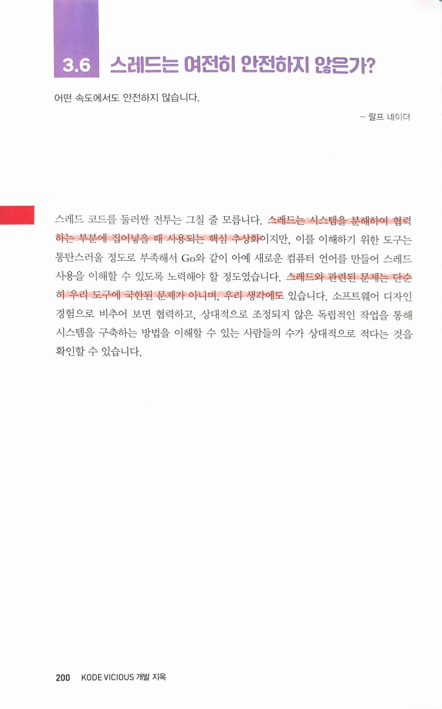 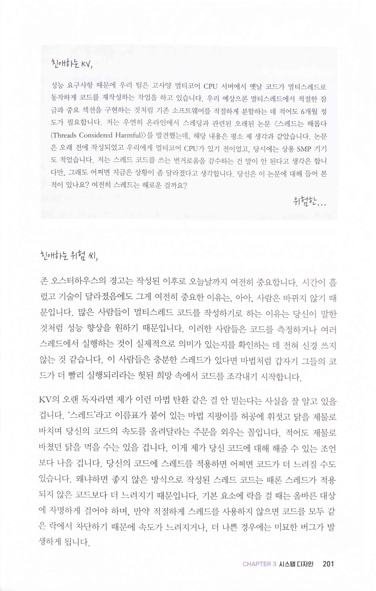 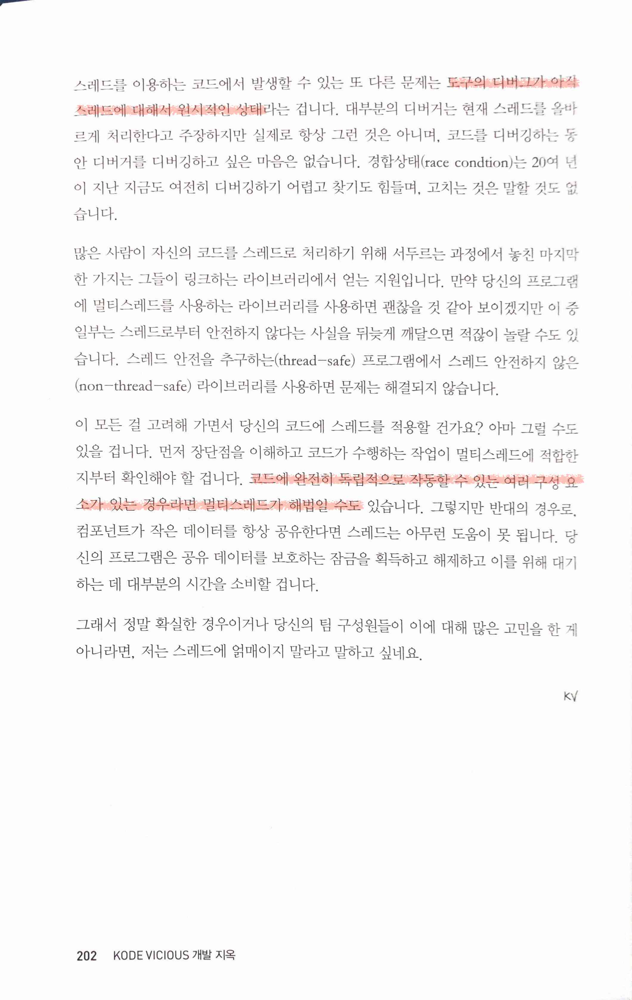

> 스레드는 시스템을 분해하여 협력하는 부분에 집어넣을 때 사용되는 핵심 추상화... 스레드와 관련된 문제는 단순히 우리 도구에 국한된 문제가 아니며, 우리 생각에도 있습니다.
>
> 다른 문제는 도구의 디버그가 아직 스레드에 대해서 원시적인 상태
>
> 코드에 완전히 독립적으로 작동할 수 있는 여러 구성 요소가 있는 경우라면 멀티스레드가 해법일 수도 있습니다. 그렇지만 반대의 경우로,컴포넌트가 작은 데이터를 항상 공유한다면 스레드는 아무런 도움이 못 됩니다.

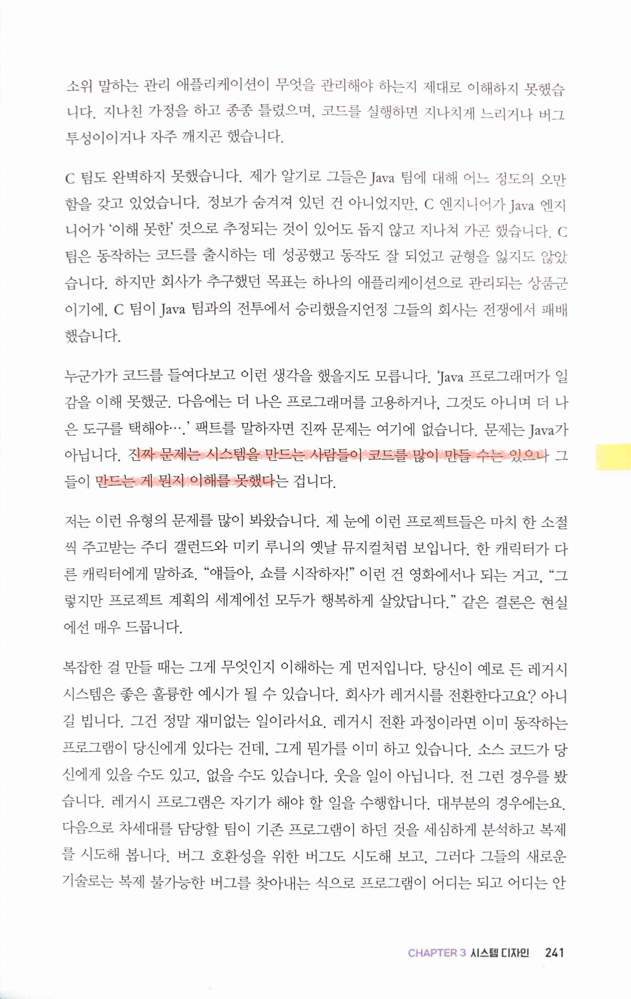

> 진짜 문제는 시스템을 만드는 사람들이 코드를 많이 만들 수는 있으나 그들이 만드는 게 뭔지 이해를 못했다는 겁니다.

# CHAPTER 4 기계에서 기계에게
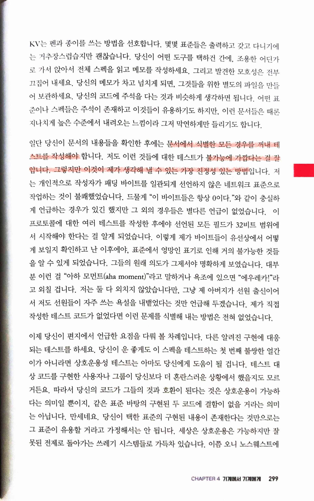

> 문서에서 식별한 모든 경우를 꺼내 테스트를 작성해야 합니다. 저도 이런 것들에 대한 테스트가 불가능에 가깝다는 걸 잘 압니다. 그렇지만 이것이 제가 생각해 낼 수 있는 가장 진정성 있는 방법입니다.

# CHAPTER 5 사람과 사람
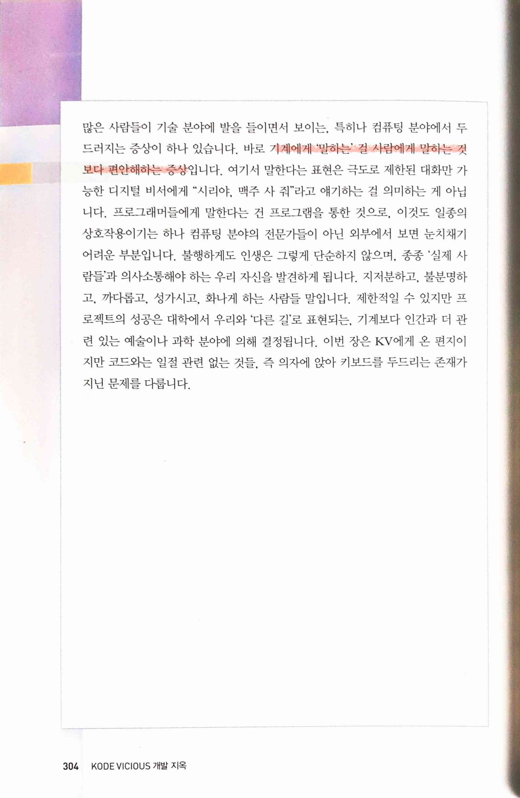

> 기계에게 '말하는 걸' 사람에게 말하는 것보다 편안해하는 증상... 종종 '실제 사람들'과 의사소통해야 하는 우리 자신을 발견

 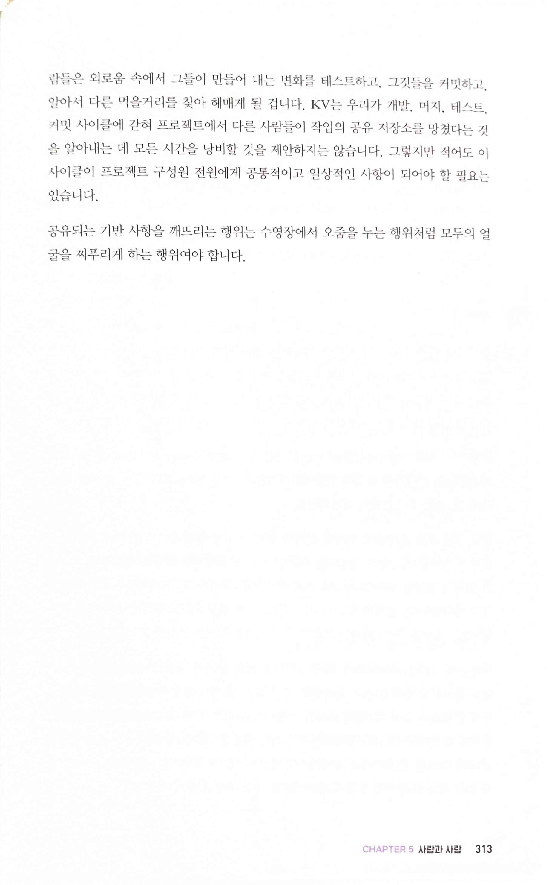

> 낙관주의의 단점... 그중 가장 빈번한 건 코드를 커밋하기 전 테스트 부족

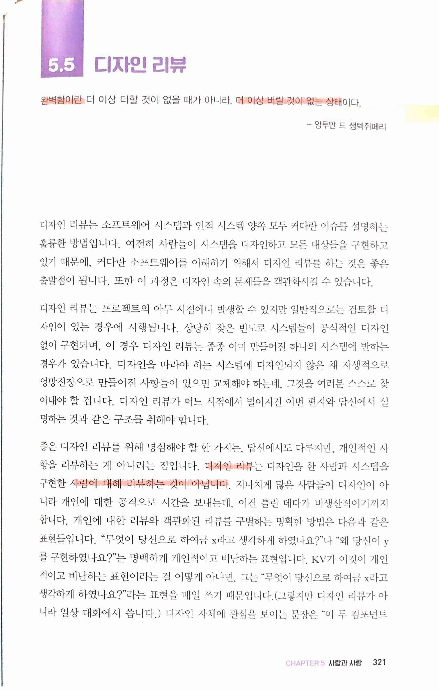

> 완벽함이란 더 이상 더할 것이 없을 때가 아니라, 더 이상 버릴 것이 없는 상태이다. - 앙투안 드 생텍쥐페리
>
> 디자인 리뷰는 디자인을 한 사람과 시스템을 구현한 사람에 대해 리뷰하는 것이 아닙니다.

> 열린 결말의 질문은 대단히 중요

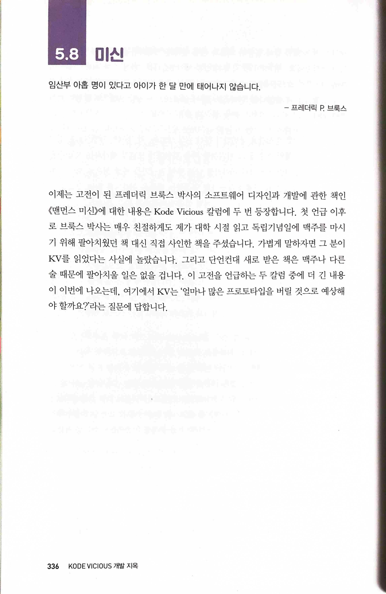 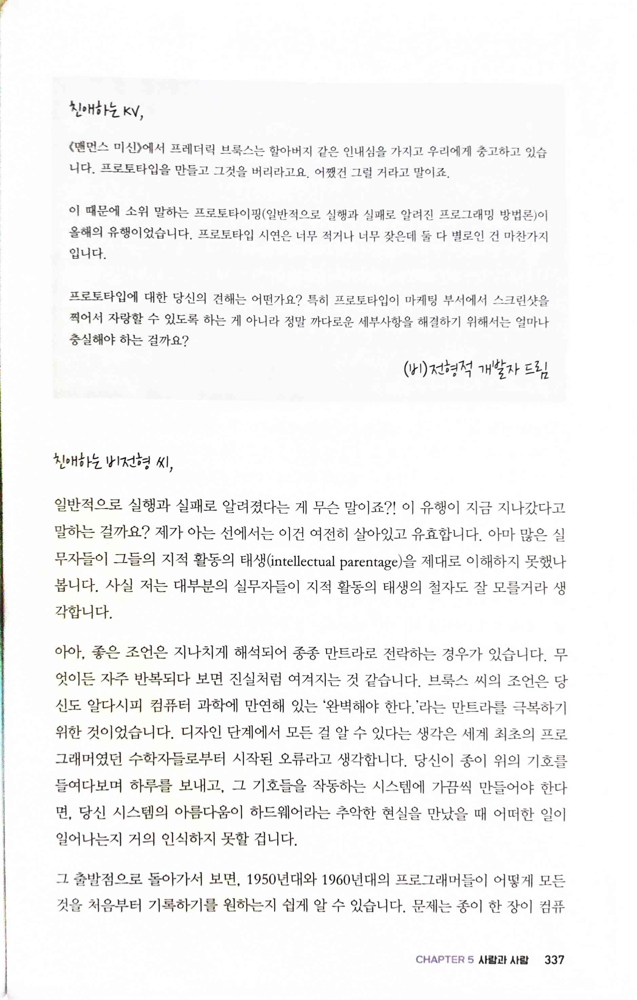 

> 임산부 아홉 명이 있다고 아이가 한 달 만에 태어나지 않습니다. - 프레더릭 P. 브룩스
>
> <맨먼스 미신>... '얼마나 많은 프로토타입을 버릴 것으로 예상해야 할까요?'
>
> 프로토타입의 핵심은 어디에 어려운 문제가 도사리고 있는지 찾아내는 것이며, 일단 그것이 식별된 이후에는 전체 시스템 관점에서 해결 가능하게 만들어야 합니다. 프로토타입은 마케팅 부서가 잠재 고객들에게 무언가 예쁜 걸 선보이는 자리가 아닙니다.
>
> 당신은 구축하려는 모든 곳에서 발생할 어려운 문제들을 찾고 해결하는 데 필요한 만큼 프로토타입을 만들어야 합니다.

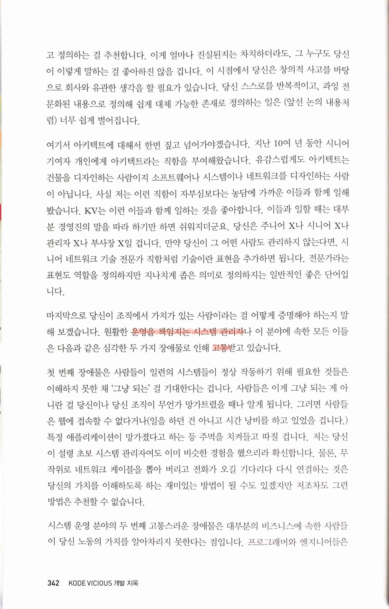 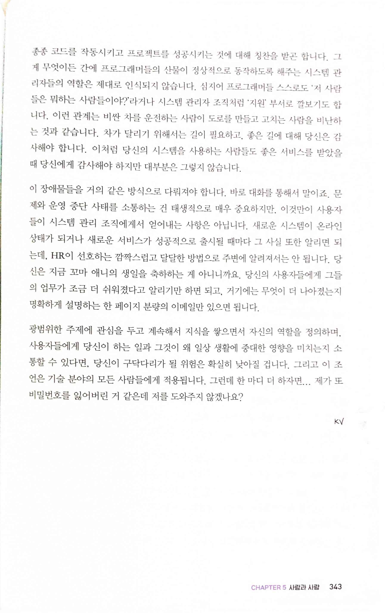

> 원활한 운영을 책임지는 시스템 관리자... 두 가지 장애물로 인해 고통
>
> 첫 번째 장애물은 사람들이 일련의 시스템들이 정상 작동하기 위해 필요한 것들은이해하지 못한 채 '그냥 되는 걸'
>
> 시스템 운영 분야의 두 번째 고통스러운 장애물은 대부분의 비즈니스에 속한 사람들이 당신 노동의 가치를 알아차리지 못한다는 점
>
> 이 장애물들을 거의 같은 방식으로 다뤄져야 합니다. 바로 대화를 통해서 말이죠. 문제와 운영 중단 사태를 소통하는 건 태생적으로 매우 중요

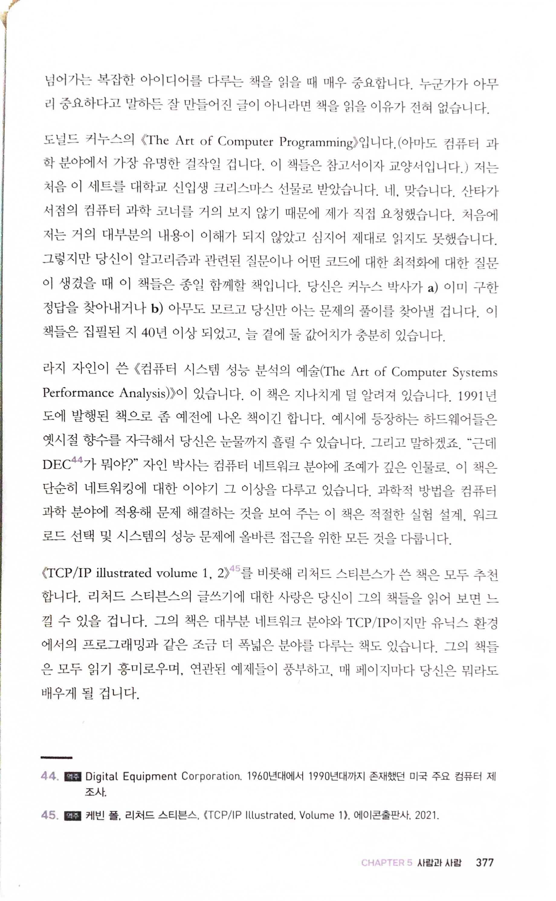 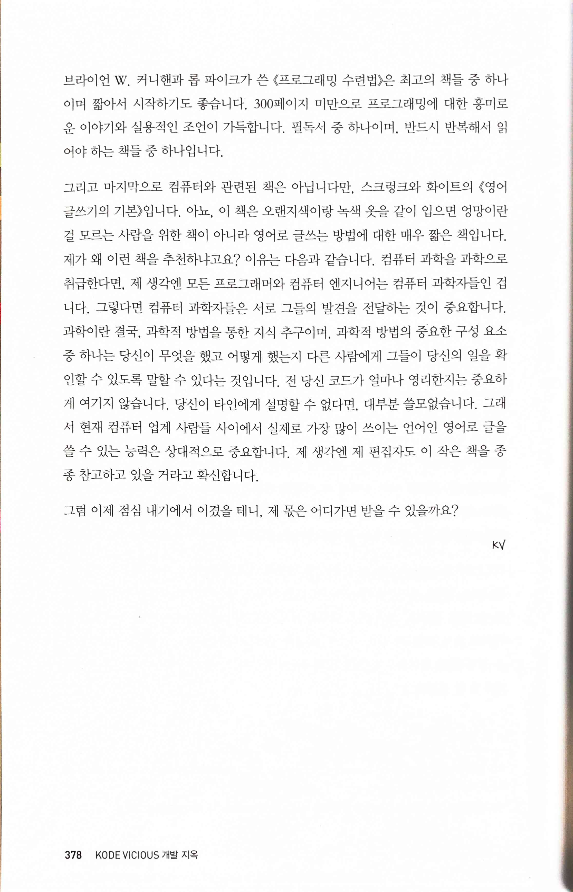 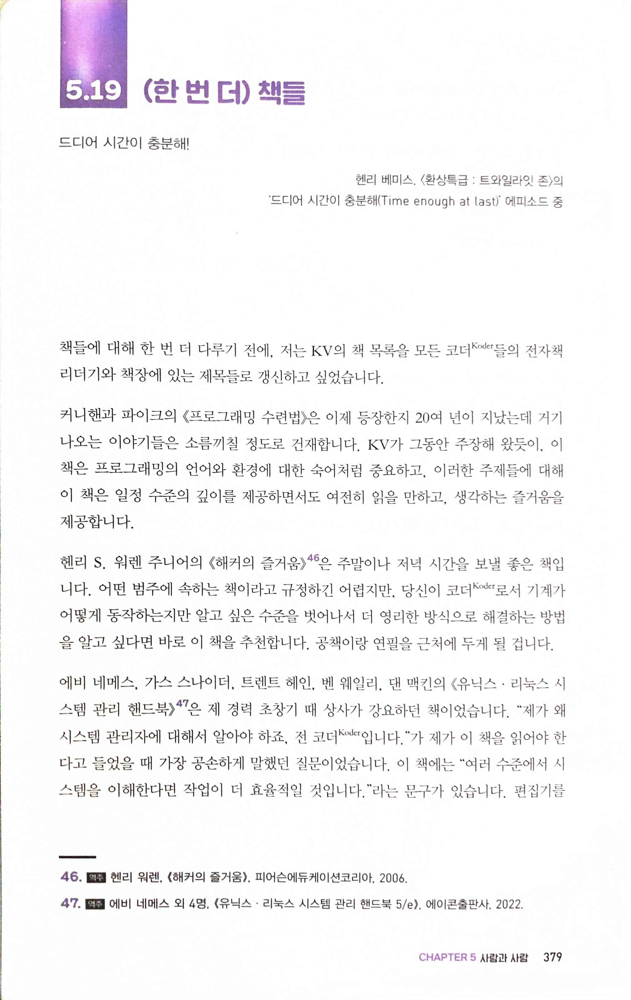

> 도널드 커누스의 <The Art of Computer Programming>
>
> 라지 자인이 쓴 <컴퓨터 시스템 성능 분석의 예술(The Art of Computer Systems Performance Analysis)>
>
> <TCP/IP illustrated volume 1,2>를 비롯해 리처드 스티븐스가 쓴 책 모두
>
> 브라이언 W. 커니핸과 롭 파이크가 쓴 <프로그래밍 수련법>
>
> 스크렁크와 화이트의 <영어 글쓰기의 기본>
>
> 헨리 S. 워렌 주니어의 <해커의 즐거움>
>
> 에비 네메스, 가스 스나이더, 트렌트 헤인, 벤 웨일리, 댄 맥킨의 <유닉스 리눅스 시스템 관리 핸드북>