A LEADER'S MISJUDGMENTS 리더의 오판
===================================
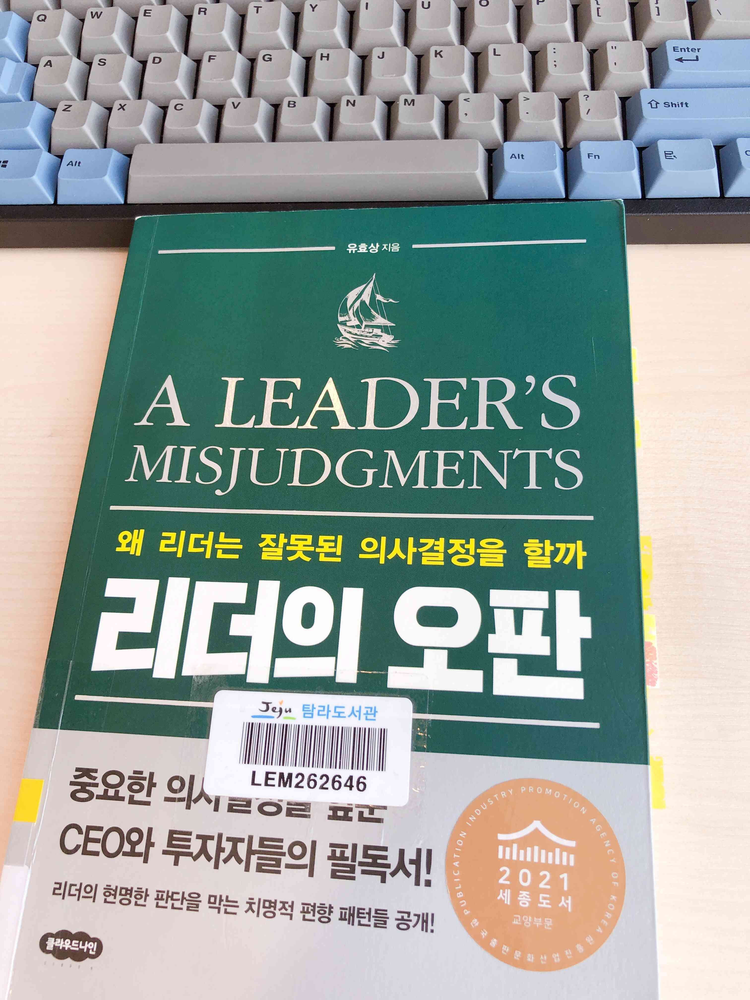

# 프롤로그 왜 똑똑한 리더들이 멍청한 의사결정을 할까
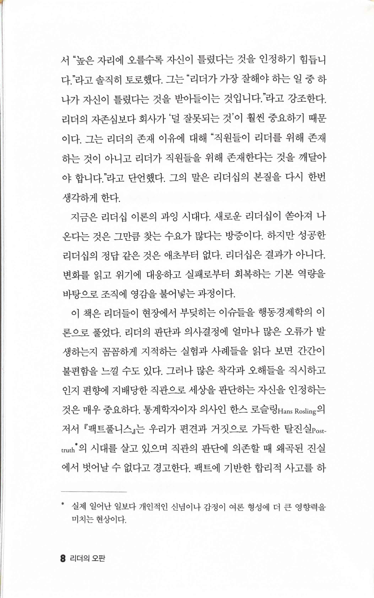

> “리더가 가장 잘해야 하는 일 중 하나가 자신이 틀렸다는 것을 받아들이는 것입니다."... 리더의 존재 이유에 대해 "직원들이 리더를 위해 존재하는 것이 아니고 리더가 직원들을 위해 존재한다는 것을 깨달아야 합니다."라고 단언했다. 그의 말은 리더십의 본질을 다시 한번 생각하게 한다.

# 리더의 오판 1 우리는 서로 같은 생각을 한다: 도대체 왜 바뀌지 않는 걸까? (커뮤니케이션)

## 왜 아무도 100년 동안 그 이유를 묻지 않았을까

> 왜 그래야 하는지 묻지 않고 무조건 따르는 `집단적 타성Collective inertia`

> 19세기 영국 정부는 `지식세Knowledge tax`를 도입하고 신문의 페이지 수에 세금을 부과

> 과거의 방식에 익숙해 있고 기존의 체제를 고수하려는 `현상유지 편향 Status quo bias`

> 문제는 이런 리더의 편향성이 빠르게 조직문화로 퍼져나가는 것이다. 바로 `폭포 효과Cascade effect`다. 폭포 효과는 집단의 힘 있는 소수의 변화가 집단 전체로 빠르게 널리 퍼지는 현상을 말한다. 조직에서 폭포의 시작점은 리더다. 

> `집단의 극단화Group polarization` 현상. 토론 후 의식 변화를 살피니 심각한 ... 편견을 가진 그룹은 토의 후 편견이 더 강해졌고 ... 편견이 약한 그룹은 토의 후 편견이 더 약해졌다.

> 미국 하버드대 로스쿨 교수 캐스 R. 선스타인Cass R. Sunstein은 '우리는 왜 극단에 끌리는가'에서 미국의 전 부시 대통령의 멍청한 의사결정을 예로 집단 극단화의 문제점을 지적했다. 부시 대통령은 재임 당시 일사불란한 백악관을 지향했고 참모들을 `'라이벌이 아닌 사람들의 팀 Team of unrivals'` 으로 만들었다. 그들은 팀 내 반대의견을 가차 없이 충성심 부족으로 간주했다. 그 결과 미국은 이라크 전쟁이라는 나쁜 결정을 내렸다.

> 경제학 `'분수효과 Fountain effect'` 분수에서 물이 위로 솟아 퍼져나가는 것처럼 저소득층의 소비 증대가 생산과 투자 활성화 등으로 이어져 경기를 부양하는 효과

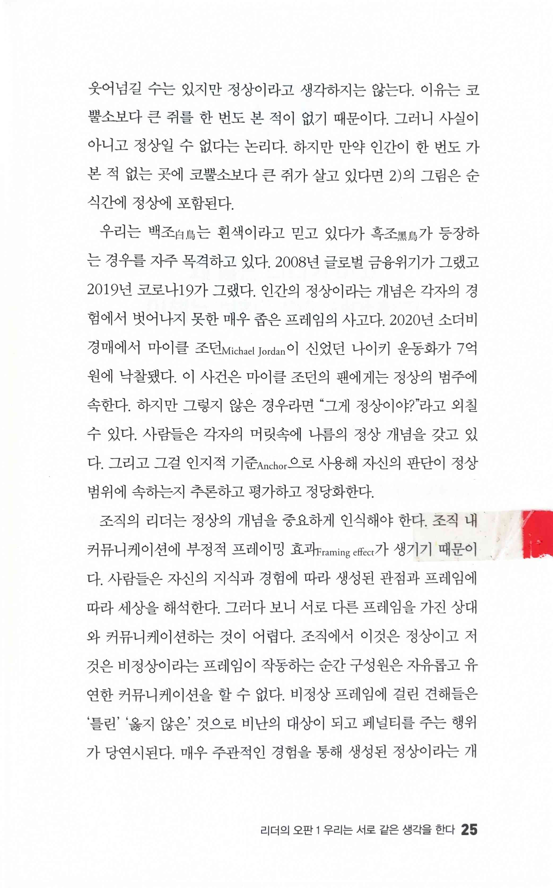

> 조직의 리더는 정상의 개념을 중요하게 인식해야 한다. 조직 내 커뮤니케이션에 부정적 프레이밍 효과 Framing effect가 생기기 때문이다. 사람들은 자신의 지식과 경험에 따라 생성된 관점과 프레임에 따라 세상을 해석한다. 그러다 보니 서로 다른 프레임을 가진 상대와 커뮤니케이션하는 것이 어렵다. 조직에서 이것은 정상이고 저것은 비정상이라는 프레임이 작동하는 순간 구성원은 자유롭고 유연한 커뮤니케이션을 할 수 없다. 비정상 프레임에 걸린 견해들은 '틀린' '옳지 않은' 것으로 비난의 대상이 되고 페널티를 주는 행위가 당연시된다.

## 왜 말은 리더가하고 이해는 부하직원이 해야 할까

> 전문가들이 커뮤니케이션에서 흔히 저지르는 실수인 `지식의 저주 Curse of knowledge`
>
> 사람이 무엇을 잘 알게 되면 그것을 모르는 상태가 어떤 것인지 상상하기 어렵게 되는 것이다. 많이 아는 사람 전문가들은 자신의 말이 끝난 후 '이 정도면 알아듣겠지.'라고 생각하지만 사실 상대방은 제대로 이해하지 못한 경우가 많다. 이유는 간단하다. 사람은 자신이 알고 있는 수준에 기대어 상대의 수준을 예단하기 때문이다.

> 우리는 대외적으로 좋은 인상을 주려고 한다. 사회적으로 바람직한 모습으로 보이길 원하는 `'사회적 바람직성 편향Social desirability bias'` 때문이다. 샤이 트럼프는 사회적 바람직성 편향이 만든 현상이다.

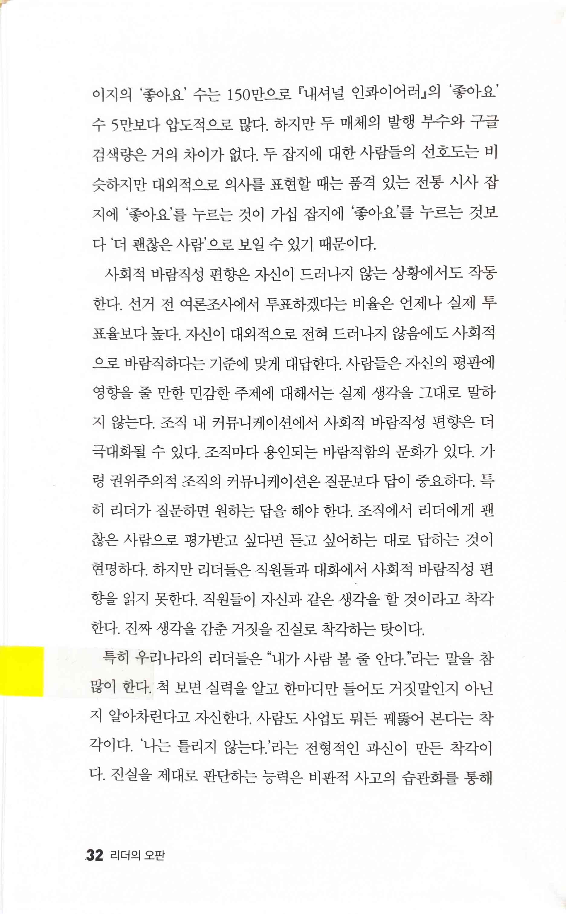

> 특히 우리나라의 리더들은 "내가 사람 볼 줄 안다."라는 말을 참많이 한다. 척 보면 실력을 알고 한마디만 들어도 거짓말인지 아닌지 알아차린다고 자신한다. 사람도 사업도 뭐든 꿰뚫어 본다는 착각이다. '나는 틀리지 않는다.'라는 전형적인 과신이 만든 착각이다.

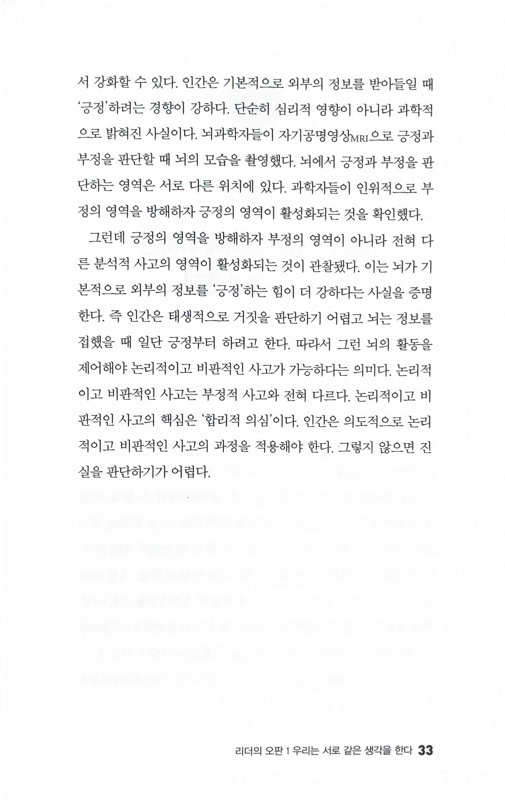

> 진실을 제대로 판단하는 능력은 비판적 사고의 습관화를 통해서 강화할 수 있다. 인간은 기본적으로 외부의 정보를 받아들일 때 '긍정'하려는 경향이 강하다. 단순히 심리적 영향이 아니라 과학적으로 밝혀진 사실이다. 뇌과학자들이 자기공명영상MRI 으로 긍정과 부정을 판단할 때 뇌의 모습을 촬영했다. 뇌에서 긍정과 부정을 판단하는 영역은 서로 다른 위치에 있다. 과학자들이 인위적으로 부정의 영역을 방해하자 긍정의 영역이 활성화되는 것을 확인했다.
>
> 그런데 긍정의 영역을 방해하자 부정의 영역이 아니라 전혀 다른 분석적 사고의 영역이 활성화되는 것이 관찰됐다. 이는 뇌가 기본적으로 외부의 정보를 '긍정'하는 힘이 더 강하다는 사실을 증명한다. 즉 인간은 태생적으로 거짓을 판단하기 어렵고 뇌는 정보를 접했을 때 일단 긍정부터 하려고 한다. 따라서 그런 뇌의 활동을 제어해야 논리적이고 비판적인 사고가 가능하다는 의미다. 논리적이고 비판적인 사고는 부정적 사고와 전혀 다르다. 논리적이고 비판적인 사고의 핵심은 '합리적 의심'이다. 인간은 의도적으로 논리적이고 비판적인 사고의 과정을 적용해야 한다. 그렇지 않으면 진실을 판단하기가 어렵다.

## 리더의 뇌가 권력에 취하면 사나운 개가 된다
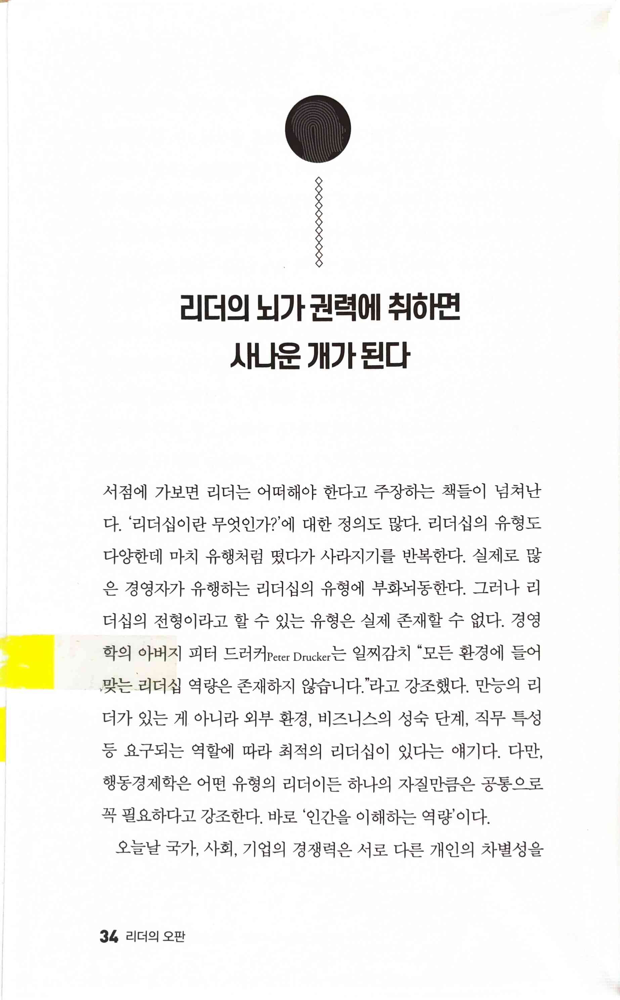

> 리더십의 전형이라고 할 수 있는 유형은 실제 존재할 수 없다. 경영학의 아버지 피터 드러커 Peter Drucker는 일찌감치 "모든 환경에 들어맞는 리더십 역량은 존재하지 않습니다."라고 강조했다. 만능의 리더가 있는 게 아니라 외부 환경, 비즈니스의 성숙 단계, 직무 특성 등 요구되는 역할에 따라 최적의 리더십이 있다는 얘기다. 다만, 행동경제학은 어떤 유형의 리더이든 하나의 자질만큼은 공통으로 꼭 필요하다고 강조한다. 바로 '인간을 이해하는 역량'이다.

> 아일랜드 트리니티칼리지의 신경심리학자 이안 로버트슨lan Robertson 교수는 '승자의 뇌'에서 모든 사람은 권력을 갈망하며 "리더의 뇌가 권력에 취하면 사나운 개가 됩니다."라는 말로 권력의 오남용을 경고했다.

> `갓 콤플렉스God complex`는 자신이 남들보다 우월한 존재라는 인식에서 출발한다. 자기가 가진 능력보다 더 과신하고 권한과 지위를 더 크게 착각하고 사용한다. 자신의 판단이 틀렸을 가능성을 인정하지 않기 때문에 집단의 규범을 무시하면서까지 주장을 관철하는 문제 행동을 보이기도 한다.
>
> 갓 콤플렉스형 리더는 권위주의적 조직문화에서 자주 발견된다. 그들은 부하직원과 건강한 커뮤니케이션을 하기가 어렵다. 자신은 항상 옳은 결정을 하므로 틀린 쪽은 언제나 부하직원이 된다. 조직의 비판도 수용하지 않는다. 부인할 수 없는 논리를 제시해도 받아들이지 않는다. `확증 편향Confirmation bias`이 매우 강해서 자신의 주장을 견지할 논리만 모은다. 사실상 논리적 토론이 가능하지 않다. 질문은 '답정너(답은 정해져 있어. 너는 대답만 하면 돼.)'인 경우가 대부분이고 경청보다 자신이 정답을 제시하는 방식의 회의를 선호한다. 그들은 조직에서 자신의 권위를 지키는 데 목을 맨다. 이런 심리는 회의 과정에서 자주 부하직원을 비난하는 언행으로 이어진다. 간혹 이런 행태를 비판적 사고로 포장하기도 한다. 하지만 비난은 비판과 본질이 전혀 다르다.

> 착한 사람이 되고 싶은 강박관념이 리더십의 유형으로 나타나는 경우 `'굿가이 콤플렉스Good guy complex'`
>
> 타인을 지나치게 의식하고 사랑받기 원하는 `'나이스가이 신드롬Nice guy syndrome'`과 일맥상통
>
> 늘 '좋은 게 좋은 것'이라는 태도 견지, 누구에게도 욕을 먹지 않는 선택 선호, 부하직원의 잘못에도 나서서 행동하지 않고 리더가 개입해야 하는 껄끄러운 이슈가 생겼을 때도 회피해버리는 황당한 태도
>
> `'방 안의 코끼리Elephant in the room'` 모두가 잘못됐다는 사실을 알면서도 아무도 얘기하지 않는 현상
>
> 보통 리더가 문제 제기를 싫어하거나 말을 꺼내봤자 손해만 본다고 생각할 때 나타나는 현상. 망가진 커뮤니케이션의 전형

> 위대한 경영자 모델인 GE의 잭 웰치Jack Welch 전 회장은 `'있는 그대로의 솔직함Candor'` 리더의 중요한 덕목으로 꼽았다. 명확한 긍정과 부정의 피드백을 전달하는 커뮤니케이션이 조직과 구성원 개인의 발전에 매우 중요한 요소임을 강조한 것이다.

> 극단적이거나 이례적인 결과는 평균의 방향으로 되돌아오는 `'평균으로의 회귀Regression to mean'` 현상

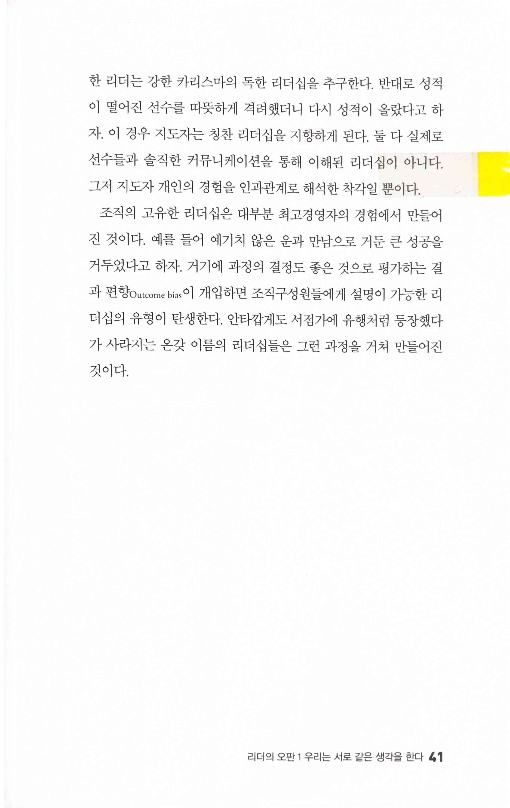

> 강한 카리스마의 독한 리더십, 칭찬 리더십. 둘 다 실제로 선수들과 솔직한 커뮤니케이션을 통해 이해된 리더십이 아니라면 그저 지도자 개인의 경험을 인과관계로 해석한 착각일 뿐이다.
>
> 조직의 고유한 리더십은 대부분 최고경영자의 경험에서 만들어진 것이다. 예를 들어 예기치 않은 운과 만남으로 거둔 큰 성공을 거두었다고 하자. 거기에 과정의 결정도 좋은 것으로 평가하는 결과 편향Outcome bias이 개입하면 조직구성원들에게 설명이 가능한 리더십의 유형이 탄생한다.

# 리더의 오판 2 우리는 항상 합리적으로 판단한다: 도대체 왜 불만이 가득한가? (공정성)

## 도대체 공정성을 판단하는 기준은 무엇일까

> 조직 공정성의 핵심은 평가와 보상이다. '평가와 보상은 공정해야 한다.'라는 원칙에 리더도 팀원도 모두 동의한다.하지만 실제로 '공정하다'와 '공정하다고 받아들이다'는 상당한 차이가 있다.

> 대비 효과 Contrast effect 사람들은 절대적 기준이 아니라 다른 대상과 비교를 통해 가치를 평가한다. 이때 대비되는 정보에 따라 평가자의 판단이 왜곡되고 합리적이지 않은 선택으로 나타난다.

> 행동경제학자 대니얼 카너먼과 아모스 트버스키Amos Tversky는 2002년 노벨경제학상을 받은 `전망 이론Prospect theory`에서 `손실 회피 Loss aversion` 심리를 소개했다. 사람들이 이익의 크기보다 손실의 크기를 2~3배 이상 더 크게 느낀다는 것이다.
>
> 공정함이란 손실을 강요당하지 않는 것이다. 이때 손실의 준거점은 현재 자신이 소유한 몫이다. 즉 내 몫을 지키면 공정한 것이고 내가 손해를 보는 것은 공정하지 않다는 것이다.

> 미국의 법률 용어에 `조부조항Grandfather clause` 이 있다. 새로운 법이나 규칙을 시행할 때 소급적용을 배제해 기득권을 인정해주는 법적 조항이다. 미국뿐만 아니라 모든 나라의 모든 집단에 공통으로 존재한다. 아예 기득권의 이익을 예외로 인정하는 것은 공정하다고 제도적으로 보장해주는 것이다. 조부조항은 공정성의 가치가 절대적 개념이 아니라 손실 회피 심리가 반영된 상대적 개념이라는 사실을 보여준다.

> 상대적 공정성의 심리는 내 이익과 권리가 변화되는 상황을 꺼리는 태도로 나타난다. 이는 `현상유지 편향 Status quo bias`으로도 설명된다. 현상유지 편향은 지금의 현상을 계속 유지하려고 하는 심리다. 사람들은 특별한 이득이 생기지 않는 한 현재의 주어진 조건을 바꾸지 않으려 한다.

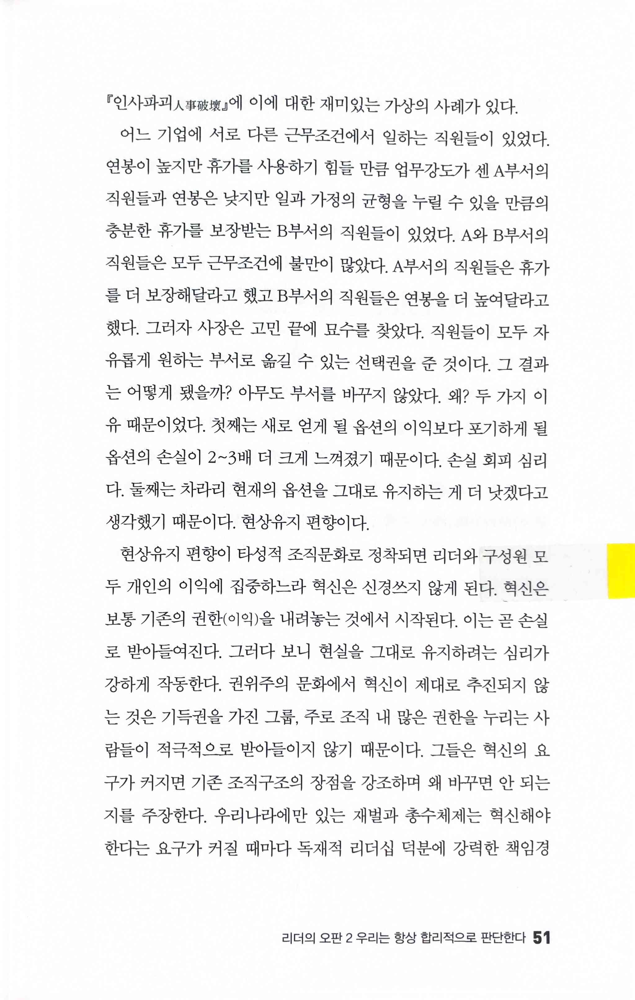

> 현상유지 편향이 타성적 조직문화로 정착되면 리더와 구성원 모두 개인의 이익에 집중하느라 혁신은 신경쓰지 않게 된다. 혁신은 보통 기존의 권한(이익)을 내려놓는 것에서 시작된다. 이는 곧 손실로 받아들여진다. 그러다 보니 현실을 그대로 유지하려는 심리가 강하게 작동한다. 권위주의 문화에서 혁신이 제대로 추진되지 않는 것은 기득권을 가진 그룹, 주로 조직 내 많은 권한을 누리는 사람들이 적극적으로 받아들이지 않기 때문이다. 그들은 혁신의 요구가 커지면 기존 조직구조의 장점을 강조하며 왜 바꾸면 안 되는지를 주장한다.

## 왜 고과는 불공정하다고 생각할까

> 미국 듀크대학의 행동경제학자 댄 애리얼리Dan Ariely와 하버드대학의 마이클 노턴Michael Norton은 불편한 가구 브랜드 이케아를 선호하는 고객의 심리를 연구했다. 그들은 '아무리 조악한 완성품일지라도 자신이 직접 시간과 노력을 쏟아부어 만든 물건에는 비합리적으로 후한 평가를 주는 심리'를 발견하고 `이케아 효과 Ikea effect`라고 불렀다.

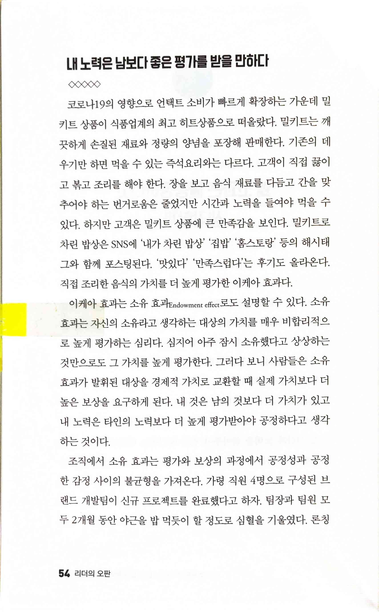

> 이케아 효과는 `소유 효과 Endowment effect`로도 설명할 수 있다. 소유효과는 자신의 소유라고 생각하는 대상의 가치를 매우 비합리적으로 높게 평가하는 심리다. 심지어 아주 잠시 소유했다고 상상하는 것만으로도 그 가치를 높게 평가한다. 그러다 보니 사람들은 소유효과가 발휘된 대상을 경제적 가치로 교환할 때 실제 가치보다 더 높은 보상을 요구하게 된다. 내 것은 남의 것보다 더 가치가 있고 내 노력은 타인의 노력보다 더 높게 평가받아야 공정하다고 생각하는 것이다.
>
> 소유 효과가 꼭 나쁜 것만은 아니다. 소유 효과는 소속 기업의 철학과 사명을 내재화하고 직무에 강한 자부심과 주인의식을 갖게 할 수도 있다. 그렇게 되면 업무에 대한 열정과 몰입도가 높아진다. 따라서 소유 효과가 조직문화에 미치는 부정성은 경계하되 구성원이 자신의 업무와 회사에 애착을 형성할 방법을 고민해야 한다.

> 미국 버클리대학의 헨리 체스브로Henry Chesbrough 교수가 2003년에 `오픈 이노베이션Open innovation` 개념을 소개했다. 그 후 글로벌 기업들이 꾸준하게 기술의 공유와 개방을 추진하고 있다. 4차 산업혁명 시대를 맞아 산업 간 경계가 허물어지고 있다. 기업은 생존을 위해 내부관점에서 벗어나 새로운 프레임으로 비즈니스의 미래를 준비해야 한다.

> `NIH`란 `'여기서 개발되지 않았다Not Invented Here'`라는 뜻이다. 이 신드롬은 외부의 아이디어나 기술은 그 가치가 뛰어나도 평가절하하고 배척하는 집단심리를 일컫는다. NIH 지수가 높은 조직은 폐쇄성과 배타성을 '핵심 역량에 대한 자부심'이라고 포장한다. 하지만 사실은 외부의 아이디어와 기술로 성공적 결과가 나오면 그동안 내부 구성원들이 누려온 이익들, 즉 고용유지와 임금 등에 손실이 생길 것을 우려하는 이기적인 속마음을 부정할 수 없다. 회사의 성장에 꼭 필요한 혁신적인 기업의 인수합병 M&A 이 직원들의 반대로 좌초되는 사례 등이 해당한다.

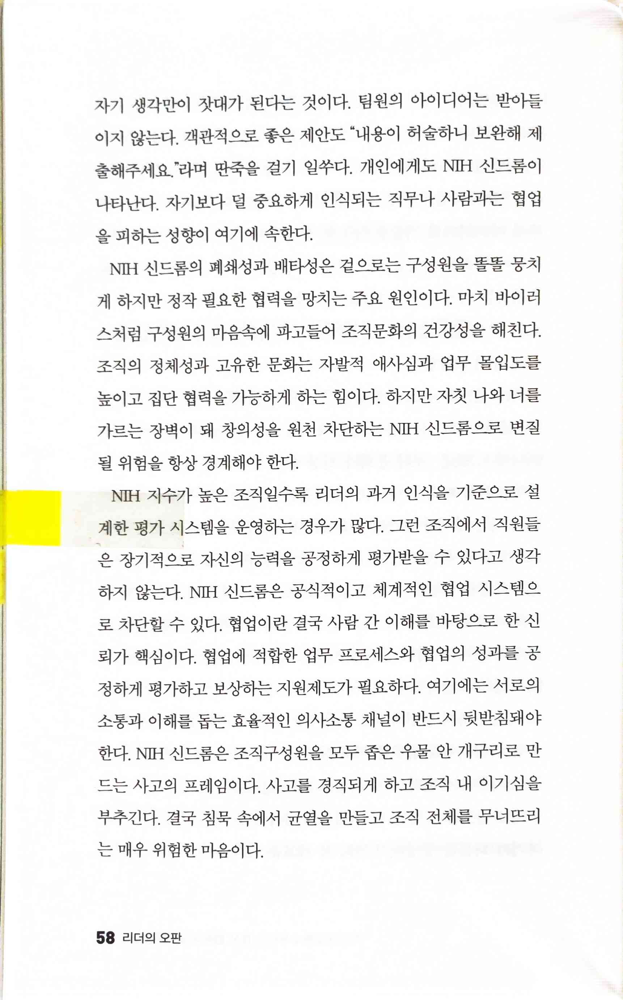

> NIH 지수가 높은 조직일수록 리더의 과거 인식을 기준으로 설계한 평가 시스템을 운영하는 경우가 많다. 그런 조직에서 직원들은 장기적으로 자신의 능력을 공정하게 평가받을 수 있다고 생각하지 않는다. NIH 신드롬은 공식적이고 체계적인 협업 시스템으로 차단할 수 있다. 협업이란 결국 사람 간 이해를 바탕으로 한 신뢰가 핵심이다. 협업에 적합한 업무 프로세스와 협업의 성과를 공정하게 평가하고 보상하는 지원제도가 필요하다. 여기에는 서로의 소통과 이해를 돕는 효율적인 의사소통 채널이 반드시 뒷받침돼야한다. NIH 신드롬은 조직구성원을 모두 좁은 우물안 개구리로 만드는 사고의 프레임이다. 사고를 경직되게 하고 조직 내 이기심을 부추긴다. 결국 침묵 속에서 균열을 만들고 조직 전체를 무너뜨리는 매우 위험한 마음이다.

## 왜 해야 할 때 안 하고 하지 말아야 할 때 할까

> 지난 2017년 넷플릭스 CEO 리드 헤이스팅스Reed Hastings는 “넷플릭스의 가장 큰 고민은 무실패입니다. 더 많은 위험을 감수해야 합니다."라고 목소리를 높였다. 실패 위험을 감수할 만한 콘텐츠 제작을 시도하라는 주문이다. 성공이 주는 안정에 취했을 때 굳이 도전을 감수하지 않으려는 조직의 심리, 즉 '보신주의' 조직문화에 대한 경계였다.
>
> `타조 효과Ostrich effect`라는 말이 있다. 코앞에 닥친 문제를 해결할 의지도 없고 회피만 하는 것을 가리킨다. 타조는 맹수에게 쫓기는 위기에 처하면 적극적으로 도망가지 않고 모래에 머리를 박는다.

> 실패를 과감하게 인정하고 평가를 공정하게 하는 것은 중요하다. 사람들은 기본적으로 실패를 두려워한다. 아주 낮은 확률일지라도 실패가 예상되면 책임지게 될까 봐 차라리 아무것도 하지 않는 선택을 한다. 바로 `부작위 편향Omission bias`이다. 마땅히 해야 할 일이고 하지 않으면 모두가 피해를 본다. 그래도 일단 자기방어가 우선이다. 부작위 편향은 무의식의 영역에서 활동하는 인지 편향이다. 따라서 개인의 도덕적 문제로만 치부할 수 없다.

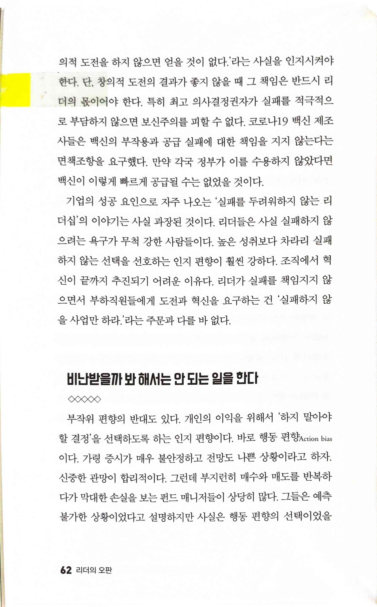

> 창의적 도전의 결과가 좋지 않을 때 그 책임은 반드시 리더의 몫이어야 한다. 특히 최고 의사결정권자가 실패를 적극적으로 부담하지 않으면 보신주의를 피할 수 없다. 코로나19 백신 제조사들은 백신의 부작용과 공급 실패에 대한 책임을 지지 않는다는 면책조항을 요구했다. 만약 각국 정부가 이를 수용하지 않았다면 백신이 이렇게 빠르게 공급될 수는 없었을 것이다.
>
> 부작위 편향의 반대도 있다. 개인의 이익을 위해서 '하지 말아야 할 결정'을 선택하도록 하는 인지 편향이다. 바로 `행동 편향Action bias`이다.

## 왜 나 아니어도 누군가가 할 거라고 생각할까

> 경제학에서 `무임승차`는 재화나 서비스를 이용하면서 정당한 비용을 내지 않고 이익만 챙기려는 행동

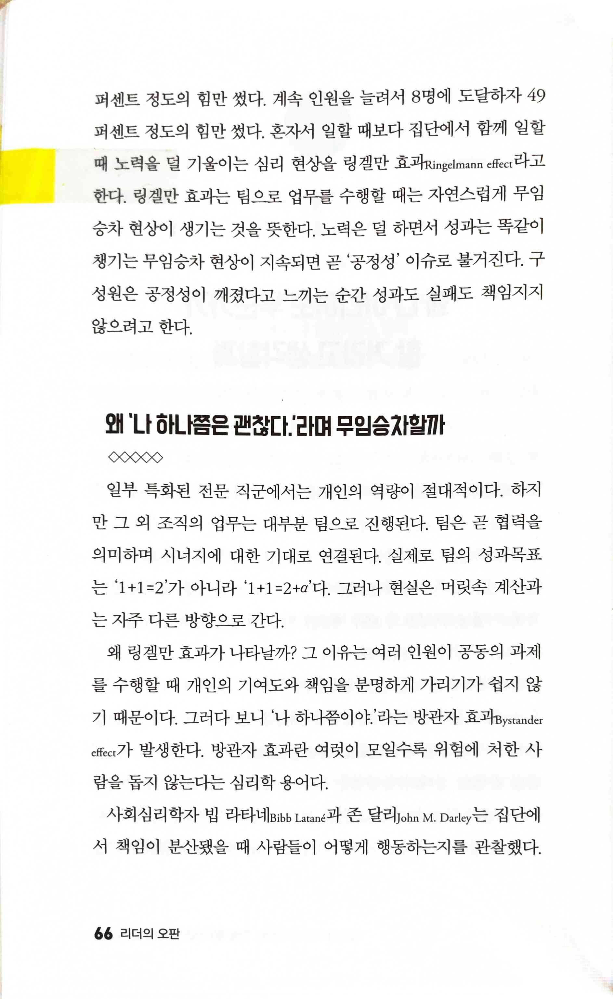

> 혼자서 일할 때보다 집단에서 함께 일할 때 노력을 덜 기울이는 심리 현상을 `링겔만 효과Ringelmann effect`라고 한다. 링겔만 효과는 팀으로 업무를 수행할 때는 자연스럽게 무임승차 현상이 생기는 것을 뜻한다. 노력은 덜 하면서 성과는 똑같이 챙기는 무임승차 현상이 지속되면 곧 '공정성' 이슈로 불거진다. 구성원은 공정성이 깨졌다고 느끼는 순간 성과도 실패도 책임지지 않으려고 한다.
>
> `방관자 효과Bystander effect`란 여럿이 모일수록 위험에 처한 사람을 돕지 않는다는 심리학 용어다.

> 만약 개인의 기여도가 분명하게 드러나지도 않고 문제 상황에 대한 책임 여부도 가리기 어려운 환경이라면 어떨까? 그럼 열심히 일하는 사람만 손해다. 그럴 때 팀원들은 옆 동료가 일하는 만큼만 일하기로 마음먹는다. 봉이 되고 싶지 않은 심리가 만들어낸 `'바보 효과sucker effect'`다. 그러다 보면 조직 전체의 업무 수행 수준은 하락한다.

> 링겔만 효과는 팀의 크기와 매우 밀접한 관계가 있다. 구성원이 많아질수록 의사소통이 쉽지 않고 공동의 목표를 이해하고 공유하기가 어렵다. 자연스럽게 팀워크가 떨어지고 어떻게 힘을 모아야하는지 몰라 어느 시점에 이르면 자신의 능력을 100퍼센트 발휘하지 않게 된다. `'피자 두 판의 원칙'`

## 왜 유능한 직원은 떠나고 무능한 상사만 남을까

> 1969년 미국의 교육학자 로런스 피터 Laurence J. Peter와 레이먼드 헐Raymond Hull 은 정치, 법률, 교육, 산업 등 각계각층에서 나타나는 무능력한 관리자들을 관찰했다. 사람들은 '무능력 단계'에 도달할 때까지 승진하려고 했고 그러다 보니 조직은 시간이 지날수록 임무를 제대로 수행할 수 없는 무능한 관리자들로 채워지는 것을 발견했다. 이를 `피터의 법칙Peter principle`이라고 한다.

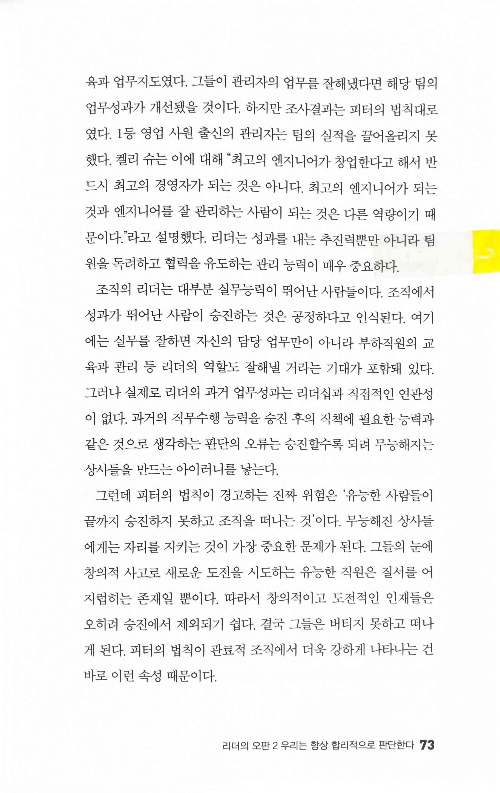

> 리더는 성과를 내는 추진력뿐만 아니라 팀원을 독려하고 협력을 유도하는 관리 능력이 매우 중요하다.
>
> 조직의 리더는 대부분 실무능력이 뛰어난 사람들이다. 조직에서 성과가 뛰어난 사람이 승진하는 것은 공정하다고 인식된다. 여기에는 실무를 잘하면 자신의 담당 업무만이 아니라 부하직원의 교육과 관리 등 리더의 역할도 잘해낼 거라는 기대가 포함돼 있다. 그러나 실제로 리더의 과거 업무성과는 리더십과 직접적인 연관성이 없다. 과거의 직무수행 능력을 승진 후의 직책에 필요한 능력과 같은 것으로 생각하는 판단의 오류는 승진할수록 되려 무능해지는 상사들을 만드는 아이러니를 낳는다.
>
> 그런데 피터의 법칙이 경고하는 진짜 위험은 '유능한 사람들이 끝까지 승진하지 못하고 조직을 떠나는 것'이다.

> '무능력하고 비효율적인 직원일수록 중간의 경쟁 단계를 거치지 않고 곧바로 승진하는 현상'을 뜻하는 `딜버트의 법칙`

# 리더의 오판 3 우리는 딱 보고 인재인지 안다: 도대체 왜 인재를 못 알아볼까? (인재선발)

## 어떻게 그런 거물들마저 사기를 당했을까

> `후광효과 Halo effect`란 하나의 두드러진 특성이 무의식적으로 다른 구체적 특성을 평가하는 데 영향을 미치는 인지 편향이다.

> 처음 입력된 정보가 이후 평가에 미치는 영향력은 정말 대단하다. 바로 `초두효과 Primacy effect`다. 심리학자 솔로몬 애시solomon Asch는 정보의 입력 순서가 만들어내는 후광 효과의 영향력을 실험했다.
>
> 1) A씨는 똑똑하고 근면하며 충동적이고 비판적이다. 때론 고집스럽고 질투심도 많다.
>
> 2) B씨는 질투심이 많고 고집스러우며 비판적이고 충동적이다. 하지만 근면하고 똑똑하다.
>
> A와 B는 나열한 단어의 순서만 다를 뿐 내용은 똑같다. 사람들은 앞의 단어에서 각인된 인상의 영향을 받아 이후 평가를 결정했다. A는 '똑똑하고 근면한 사람이구나. 똑똑하니 비판적이지. 고집이 있다는 것을 보니 의견을 분명하게 표현하는 사람이야.'라고 이해했다. 반면 B는 '질투심이 많고 고집스럽고 비판적이면 동료로서 함께 어울리기 쉽지 않겠어. 게다가 똑똑하다니 잘난 척을 많이 하는 성향이지 않을까?'라는 나름의 정합적 논리를 완성한 것이다. A와 B를 비교하며 일일이 따져보면 '매우 비논리적 판단'이라는 것을 알 수 있다. 하지만 후광 효과는 우리가 미처 알아차리지 못하는 사이 직관의 이름으로 혹은 촉의 이름 뒤에 숨어 거짓을 사실로 둔갑시킨다.

> 후광 효과는 인간의 제한된 인지능력 때문에 나타나는 인지 편향이다. 세상은 크고 복잡하다. 그런데 인간은 인지능력의 한계로 제대로 판단하기 어렵다. 그래서 개인의 경험에 비추어 '확실하다'고 여겨지는 부분을 크게 확대해 전체의 보편적 상황으로 이해한다. 후광 효과는 시간이나 정보가 불충분할 때 이를 보완할 합리적 추론 대신 어림짐작으로 빠르게 판단하는 `휴리스틱Heuristics`의 산물이다. 여기에 한번 고정화된 생각을 바꾸기 싫어하는 `인지부조화 현상`이 더해지면 더욱 강력한 힘을 발휘한다.
>
> “면접에 합격하려면 고급 브랜드 옷을 입어라." 네덜란드 틸뷔르흐대학교의 사회심리학과 롭 넬리선Rob Nelissen 교수는 고급 브랜드가 사람들의 인식에 미치는 영향을 실험해 발표한 결과다.

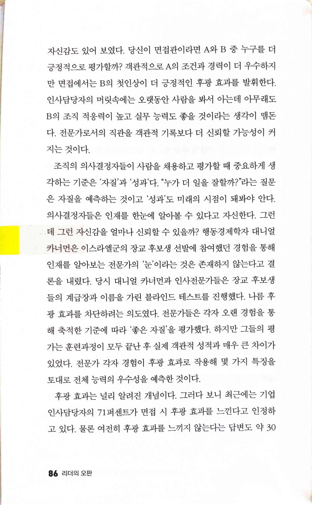

> 행동경제학자 대니얼 카너먼은 이스라엘군의 장교 후보생 선발에 참여했던 경험을 통해 인재를 알아보는 전문가의 '눈'이라는 것은 존재하지 않는다고 결론을 내렸다. 당시 대니얼 카너먼과 인사전문가들은 장교 후보생들의 계급장과 이름을 가린 블라인드 테스트를 진행했다. 나름 후광 효과를 차단하려는 의도였다. 전문가들은 각자 오랜 경험을 통해 축적한 기준에 따라 '좋은 자질'을 평가했다. 하지만 그들의 평가는 훈련과정이 모두 끝난 후 실제 객관적 성적과 매우 큰 차이가 있었다. 전문가 각자 경험이 후광 효과로 작용해 몇 가지 특징을 토대로 전체 능력의 우수성을 예측한 것이다.

> 사람을 보는 눈이란 결국 자신의 주관적인 경험으로 뽑을 만한 이유를 만들고 그것이 타당하다고 믿는 `타당성 착각Illusion of validity` 일 뿐이다. 솔직히 입사 후 누가 더 훌륭한 성과를 낼지는 아무도 장담할 수 없다. 하지만 타당성 착각은 알 수 있다고 확신하게 만든다.

## 프레임으로 보고 앵커링으로 평가한다

> 우리 사회에서 사람과 집단을 평가하는 데 가장 흔하게 영향력을 발휘하는 인지 편향이 `친밀성 편향Affinity bias`과 `외집단 동질성 편향 Outgroup homogeneity bias`이다. 친밀성 편향은 자신과 비슷한 사람과 함께 있으면 편안함을 느끼고 신뢰하는 것을 말한다. 편안하니까 좋아하고 좋아하니까 자주 어울리며 신뢰를 쌓는다. 외집단 동질성 편향은 한마디로 '너희는 전부 똑같아.'라고 하는 것이다. '우리' 그룹은 다양한 특징을 가진 구성원들로 이루어진 집단이라고 이해하면서 다른 그룹은 하나의 특징으로 동질화된 집단으로 평가한다. 외집단 동질성 편향은 사람을 평가할 때 인그룹 Ingroup과 아웃그룹Outgroup으로 나누는 이분법의 사고다. 나와 너 또는 우리와 너희로 나누는 순간 편향은 시작된다. 매우 위험한 평가의 관점, 즉 프레임이 짜여지는 것이다. 프레임은 우리의 사고를 테두리 안에 가둔다.

> `프레이밍 효과 Framing Effect`는 동일한 문제도 제시되는 방법에 따라 그에 관한 해석이나 의사결정이 달라지는 인지 편향이다. 프레이밍 효과는 '역시'라는 결론을 만드는 합리화의 주범이다.

> 언젠가 와인 클래스에 참석한 사람들을 대상으로 심리실험을 한 적이 있다... 한두 명을 제외하곤 대부분 10만 원대로 알고 있는 1만 원대 와인을 "역시 더 맛있습니다."라고 답했다. 바로 심리학에서 말하는 `플러시보 효과 Placebo effect`다. 가격을 보고 '비싼 와인 - 맛있다'는 인식의 프레임이 작동한 것이다. 이는 거짓말을 한 것이 아니다. 사람들은 실제로 더 맛있다고 느낀다.

> 특정 개념 혹은 숫자가 사고의 기준점이 돼 이후 판단에 영향을 미치는 앵커링 효과Anchoring effect다. 앵커는 배가 움직이지 않도록 바닥에 고정하는 닻이다.닻을 내린 배는 움직이지 못한다. 마찬가지로 앵커링 효과는 사람들의 생각을 고정해 좁은 범위로 제한한다.

> 요즘 기업에서는 대부분 인사고과에 직원들 스스로 자기평가를 하도록 하고 있다. 하지만 사람들은 기본적으로 자신의 능력을 평균 이상으로 평가하는 경향이 있다. 따라서 자기평가는 객관적인 능력보다 과장될 가능성이 크다. 리더가 자신이 처음 생각한 점수와 능력보다 과장됐을 가능성이 있는 직원의 자기평가 사이에서 고민할 때 `타협 효과Compromise effect`가 발생한다. 타협 효과란 양극단의 옵션이 있을 때 중간 지점에서 대안을 찾는 심리다.

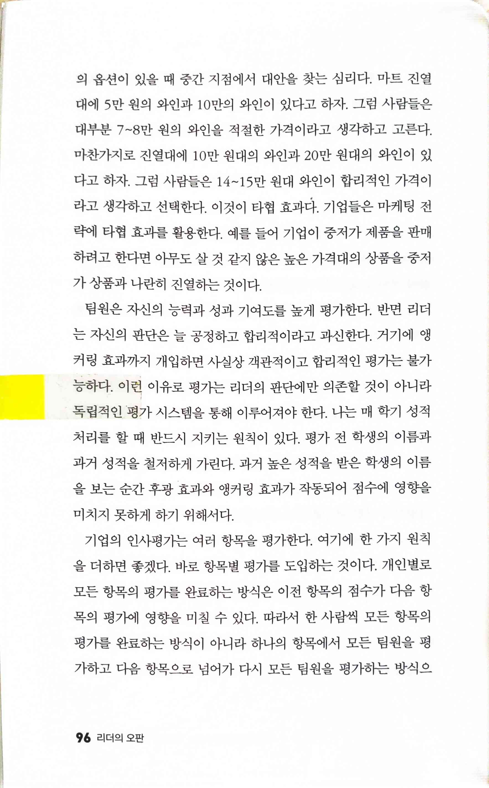

> 팀원은 자신의 능력과 성과 기여도를 높게 평가한다. 반면 리더는 자신의 판단은 늘 공정하고 합리적이라고 과신한다. 거기에 앵커링 효과까지 개입하면 사실상 객관적이고 합리적인 평가는 불가능하다. 이런 이유로 평가는 리더의 판단에만 의존할 것이 아니라 독립적인 평가 시스템을 통해 이루어져야 한다. 나는 매 학기 성적 처리를 할 때 반드시 지키는 원칙이 있다. 평가 전 학생의 이름과 과거 성적을 철저하게 가린다. 과거 높은 성적을 받은 학생의 이름을 보는 순간 후광 효과와 앵커링 효과가 작동되어 점수에 영향을 미치지 못하게 하기 위해서다.
* 맞는 이야기이지만 업무에서는 하는 일이 모두 다르므로 학생을 평가할 때처럼 모두 동일한 기준을 할 수는 없다. 그걸 모를 리 없을텐데 이런 예시를 든 건 별로 설득력이 없다고 생각한다.

> 리더가 자신의 판단에 인지 편향이 개입했을 가능성을 인정하는 것이 가장 중요하다. 스스로 경계해야 할 필요성을 느끼고 의지를 갖지 않는다면 변화를 위한 작은 노력들은 그저 귀찮기 짝이 없는 일이 돼버리기 때문이다.

## 따뜻한 커피 한잔에도 마음이 바뀔 수 있다.

> 예일대학교 심리학자 존 바그john Bargh는 온도가 선택에 미치는 영향을 알아보기 위해 실험을 진행했다... 결과는 놀랍게도 차가운 콜라를 마신 면접관들은 채용을 거부했고 따뜻한 커피를 마신 면접관들은 채용을 결정했다.

> 존 바그는 콜로라도대학교의 로런스 윌리엄스 Lawrence Williams 와 또 다른 실험을 진행했다... 이 실험을 통해 차가운 온도는 냉철함을 가져오고 따뜻한 온도는 관대함을 가져온다는 사실을 증명했다. 인간의 마음은 온도의 변화만으로도 바뀐다. `점화 효과 Priming effect` 때문이다. 점화 효과란 앞서 경험한 자극이 자신의 의지와 상관없이 이후 정보의 해석과 판단에 영향을 주는 심리 현상이다.

> 사람들은 자신이 추구하는 가치와 신념에 따라 판단하고 행동한다고 믿는다. 물론 맞는 말이다. 하지만 매 순간의 판단과 행동은 무의식적으로 이루어진 경우가 더 많다. 심지어 매우 중요한 의사결정도 알고 보면 무의식이 개입한 결과일 수 있다. 2011년 4월 '미국국립과학원회보PNAS』에 '법원의 보석 허가 판결이 식사 시간과 높은 상관성을 보인다.'라는 내용의 논문이 발표됐다. 컬럼비아 대학교 경영대학원의 조나단 레바브Jonathan Levav 교수는 이스라엘 법원의 경험 많은 치안판사가 10개월간 처리한 1,000여 건의 보석신청을 분석했다. 그랬더니 오전 업무 시작 직후와 점심 식사 후의 보석 허가 판결은 65퍼센트이고 점심시간 직전과 업무 종료 직전 허기를 느끼는 시간에는 보석 허가 판결이 0퍼센트라는 사실을 발견했다. 죄수들의 범죄유형, 성별, 수감기간 등을 고려해 조정해도 결과는 같았다. 존 바그의 실험에서 따뜻한 온도가 관대함을 유발했듯이 포만감도 마음속 너그러움을 점화한 것이다.
>
> 점화 효과는 온도, 냄새, 그림이나 사진, 단어, 행동 등 아주 사소한 자극으로부터 촉발될 수 있다. 사람들은 미국의 대표적 휴양지 '플로리다'라는 단어와 함께 '망각' '건망증' '회색'이라는 단어를 동시에 보는 것만으로도 머릿속에 '노인'의 이미지를 떠올리고 자신도 모르게 노인처럼 느릿느릿 걷는다. 반대로 '플로리다'라는 단어와 함께 '휴가' '여름' '시원한' 이라는 단어를 동시에 보는 것만으로 정반대의 이미지를 떠올리고 행동한다. 심리학자 존 바그는 이를 '플로리다 효과Florida effect'로 명명했다.

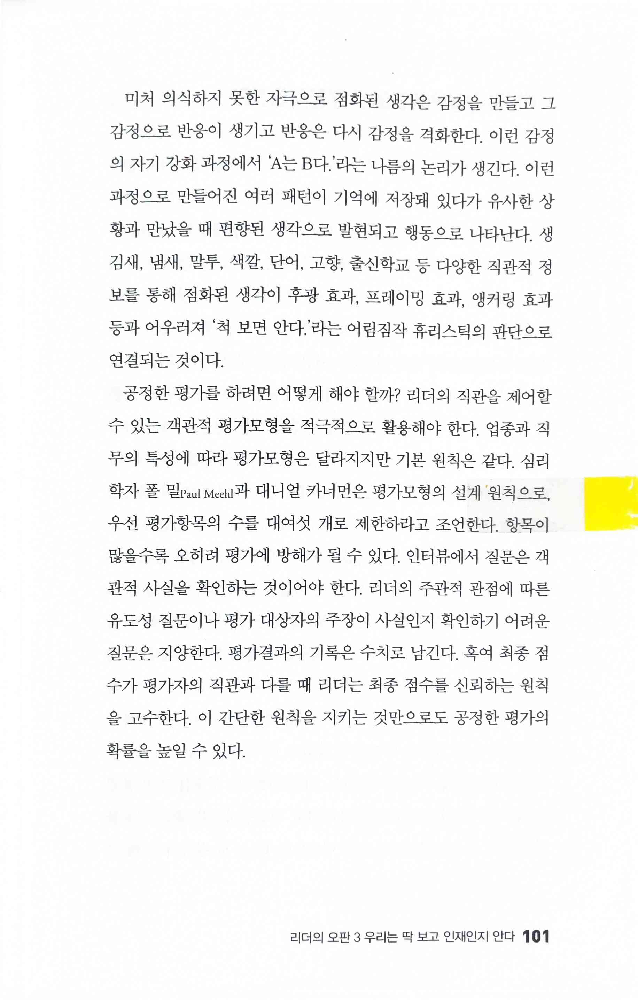

> 공정한 평가를 하려면 어떻게 해야 할까? 리더의 직관을 제어할 수 있는 객관적 평가모형을 적극적으로 활용해야 한다. 업종과 직무의 특성에 따라 평가모형은 달라지지만 기본 원칙은 같다. 심리학자 폴 밀Paul Mechl과 대니얼 카너먼은 평가모형의 설계 원칙으로, 우선 평가항목의 수를 대여섯 개로 제한하라고 조언한다. 항목이 많을수록 오히려 평가에 방해가 될 수 있다. 인터뷰에서 질문은 객관적 사실을 확인하는 것이어야 한다. 리더의 주관적 관점에 따른 유도성 질문이나 평가 대상자의 주장이 사실인지 확인하기 어려운 질문은 지양한다. 평가결과의 기록은 수치로 남긴다. 혹여 최종 점수가 평가자의 직관과 다를 때 리더는 최종 점수를 신뢰하는 원칙을 고수한다. 이 간단한 원칙을 지키는 것만으로도 공정한 평가의 확률을 높일 수 있다.

> '기분'은 의사결정에서 상당한 힘을 행사한다. 어떤 순간의 기분이 계속 남아서 이후 다른 판단에 영향을 주는 경험을 해본 적이 있을 것이다. 바로 `기분 휴리스틱Mood heuristic` 이 작동한 결과다. 대니얼 카너먼의 실험을 보자. 피실험자들에게 먼저 '얼마나 행복한가?'라는 질문을 하고 이어서 '최근 몇 번의 데이트를 했는가?' 물었다. 이때 두 질문에 대한 피실험자들의 답은 서로 어떤 상관관계도 나타나지 않았다. 반면 질문의 순서를 바꿔서 '최근 몇 번의 데이트를 했는가?'라고 먼저 질문하고 '얼마나 행복한가?'를 묻자 전혀 다른 현상이 나타났다. 최근에 데이트를 많이 한 사람들은 자신의 행복도를 높게 평가했다. 질문의 순서를 바꾼 이유는 기분이 판단에 미치는 영향을 알아보기 위해서다. 첫 질문인 '얼마나 행복한가?'는 특별한 기분을 형성하지 않았고 이후 최근 데이트 횟수를 떠올릴 때 영향을 미치지 않았다. 그러나 데이트 횟수를 먼저 물었을 때 최근 데이트 경험을 떠올리면서 피실험자들은 좋은 기분을 형성했다. 좋은 기분은 자신의 행복도를 더 높게 평가하는 데 큰 영향을 미쳤다. 상사가 기분이 좋을 때 너그러워지는 이유다.

> 기분만이 아니다. 감정도 판단에 개입한다. 호불호의 주관적 감정은 신뢰도를 결정하고 선택은 논리까지 만든다. 바로 `감정 휴리스틱Affect heuristic`이다. 평소 좋아하는 직원이 하는 말은 믿고 싶고 믿지는 않더라도 호감을 느끼게 된다. 반면 싫어하는 직원의 보고서는 왠지 불신의 감정이 앞선다. 프로젝트 진행을 앞두고 투자 비용에 대한 이견이 분분한 상황이라고 하자. 만약 그때 자신이 좋아하는 프로젝트라면 투자 대비 수익이 더 클 것이라는 주장을 더 신뢰하게 된다. 듣고 싶은 정보와 보고 싶은 근거에 더 집중하는 확증편향 때문이다. 이미 결정을 했기 때문에 자기가 주장하는 근거가 아무리 부족해도 그냥 밀고 나가는 것이다.
* 이에 대해 내가 종종 사람들에게, 좋아하는 사람이 잘못을 하면 '사람이 실수할 수 있지'라고 생각하지만, 싫어하는 사람이 실수를 하면 '걔가 원래 그렇지'라고 생각한다고 설명하곤 했다. 이미 이런 연구가 진행되어있는 줄은 몰랐지만.

## 경기장의 해결사인 ‘뜨거운 손'은 진짜 있을까

> 어려운 경기를 해결하는 선수들 `'뜨거운 손Hot hand'`

> 행동경제학자 아모스 트버스키와 토머스 길로비치Thomas Gilovich는 경기장의 뜨거운 손은 실제로 존재하지 않고 환상일 뿐이라는 사실을 밝혀냈다. 언제든지 연속적으로 슛을 성공시키는 해결사는 없다는 것이다. 많은 경기의 데이터를 분석해보니 뜨거운 손의 높은 슛 성공률은 짧은 시간 동안 슛을 던지는 횟수가 그만큼 많아서 생긴 착시일 뿐이다. 실제로 뜨거운 손의 슛 성공률은 그 선수의 평균 실력에서 크게 벗어나지 않았다. 뜨거운 손은 앞서 여러 번 슛을 성공시켰으니 다음 슛도 성공할 것이라고 믿는 심리가 만들어낸 인지 착각이다. 이것이 바로 `'뜨거운 손의 오류Hot hand fallacy'`다. 하지만 많은 농구 감독들은 데이터를 통해 밝혀진 뜨거운 손의 오류를 전혀 인정하지 않는다. 그들은 여전히 뜨거운 손을 믿으며 자신들의 인지 착각을 부정한다.
>
> 리더들의 가장 흔한 편견 중 하나가 자신이 조직의 해결사라거나 조직 내 해결사가 존재한다고 믿는 것이다... 과거에 성공했으니 앞으로도 성공할 것이라는 믿음이다. 하지만 이는 뜨거운 손의 오류가 만든 착각이다. 뜨거운 손의 오류란 성공은 오직 개인의 실력에 달려 있다는 과신이다. 그렇게 되면 당사자는 무모한 모험을 불사하게 되고 조직도 용납한다.

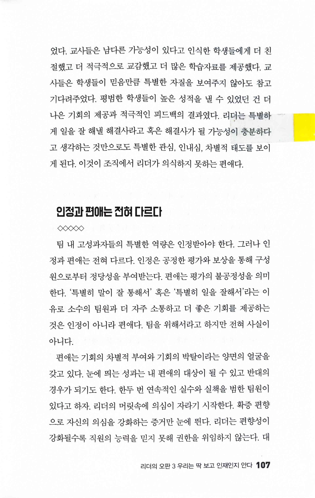

> 자신의 편애가 비의도적이고 무의식적인 행동일 수 있다는 사실을 모르는 탓이다. 하버드대학교의 심리학자 로버트 로젠탈Robert Rosenthal은 이에 대한 매우 의미 있는 실험을 했다.
>
> 로버트 로젠탈은 샌프란시스코의 한 초등학교에서 무작위로 학생 20퍼센트를 선발했다. 그리고 교사들에게 이 학생들에겐 특별한 가능성이 있다고 알려줬다. 물론 이는 거짓이다. 그런데 한 학기가 지난 후 이 학생들은 정말로 다른 학생들의 평균보다 높은 성적을 받았다. 왜 그런지 알아보니 바로 교사들의 태도에 원인이 있었다. 교사들은 남다른 가능성이 있다고 인식한 학생들에게 더 친절했고 더 적극적으로 교감했고 더 많은 학습자료를 제공했다. 교사들은 학생들이 믿음만큼 특별한 자질을 보여주지 않아도 참고 기다려주었다. 평범한 학생들이 높은 성적을 낼 수 있었던 건 더 나은 기회의 제공과 적극적인 피드백의 결과였다. 리더는 특별하게 일을 잘 해낼 해결사라고 혹은 해결사가 될 가능성이 충분하다고 생각하는 것만으로도 특별한 관심, 인내심, 차별적 태도를 보이게 된다. 이것이 조직에서 리더가 의식하지 못하는 편애다.
>
> 인정과 편애는 전혀 다르다. 인정은 공정한 평가와 보상을 통해 구성원으로부터 정당성을 부여받는다. 편애는 평가의 불공정성을 의미한다.

> 미국프로농구 역사상 가장 위대한 감독으로 꼽히는 필 잭슨PhillipDouglas Jackson 은 시카고 불스와 LA 레이커스의 감독을 거치면서 무려 11번의 우승이라는 전설적인 기록을 달성했다. 그는 비결을 묻는 사람들에게 "편애의 폐해를 피하세요."라고 강조했다. 선수들의 다양한 개성과 욕구를 인정하고 동등하게 대우하라는 것이다. 필잭슨은 모든 선수를 고르게 편애함으로써 편애의 일반적인 폐해를 피하는 것이 바로 우승팀이 되는 비결입니다."라고 강조했다.

# 리더의 오판 4 우리의 평가는 공정하다: 도대체 왜 동기부여가 되지 않을까? (평가와 보상)

## 가장 최근의 기억으로 전체를 평가한다

> 대니얼 카너먼은 대장내시경 실험을 통해 인간의 뇌가 경험을 있는 그대로 기억하지 않고 그러다 보니 잘못된 결정을 내리는 과정을 생생하게 보여주었다.... 이는 `피크엔드 법칙Peak-end rule` 때문이다.
>
> 사람들은 특정 경험을 기억할 때 그 경험의 시간의 길이는 철저히 무시되고 가장 강렬한 순간Peak 과 가장 마지막 순간 End의 평균에 가깝게 떠올린다. A그룹은 고작 8분 동안 검사했지만 검사를 종료한 시점에 고통의 강도가 매우 높았다. 반면 B그룹은 A그룹보다 3배나 더 긴 24분 동안 검사를 받았지만 고통이 잦아들 무렵 검사를 마쳤다. 고통의 총량이 무려 3배 더 많았다. 하지만 마지막 경험이 지배한 기억은 팩트를 완전히 바꿔버렸다.

> 직원들에 대한 리더의 머릿속 기억은 과연 팩트일까? 피크엔드 법칙에 따르면 그렇지 않을 가능성이 크다. 개인에 대한 신뢰는 단 한 번의 큰 성과와 호감의 영향을 받아 과대평가된 기억일 수 있다. 반대로 한 번의 큰 실수와 부정적 인상이 평가절하된 기억으로 남을 수 있다. 특히 단 한 번의 호감과 실망이 최근의 일이라면 절대적인 영향을 미친다. `최신 편향Recency bias` 이 작동하는 것이다. 최신 편향이란 판단을 할 때 최신의 정보에 지나치게 가중치를 두는 심리를 말한다.
>
> 그런데 기억하는 뇌는 부정적인 경험에 더 크게 반응한다. 여러번 잘했어도 한 번의 실수가 모든 평가를 덮을 수 있다. 평가는 최근의 가장 나빴던 경험에 휘둘린다는 말이 있다. 이는 `회상용이성휴리스틱Availability heuristic`의 영향 때문이다. 인간의 직관은 뭐든 서둘러 판단을 내리는 성향이 있다. 빨리 대충 생각하고 결론을 내리기 때문에 통계와 이성이 끼어들 틈이 없다. 휴리스틱, 어림짐작으로 결론을 내리는 직관을 좌우하는 건 쉽게 떠오르는 정보다.

> 심리학자 엘리자베스 로프터스Elizabeth F. Loftus는 사람들에게 거짓기억을 주입했을 때 어떻게 반응하는지 관찰했다. 옛 기억을 가지고 대화하는 중에 실제로 일어나지 않은 사건을 슬쩍 끼워 넣는 방식이다. "당신이 어렸을 때 시장에서 길을 잃었잖아요. 그때 누군가 도와줘서 부모를 찾았어요."라고 꾸며낸 이야기를 들려주었다. 그런데 실험 참가자 네 명 중 한 명이 "맞아요. 내가 시장에서 길을 잃은 적이 있어요."라고 기억을 떠올렸다. 심지어 이야기를 덧붙여 구체적으로 설명도 했다. 하지만 그들은 거짓말을 하지 않았다. 정말 머릿속에서 사건을 떠올린 것이다. 바로 `기억 착각Illusion of memory`이다. 기억 착각은 단지 기억을 헷갈리는 것이 아니다. 자신도 감쪽같이 속을 만큼 사실로 기억하는 것이다.

> 기억이 만들어지는 과정에는 많은 정보가 개입한다. 그 과정에서 감정이 증폭되면 거짓도 진실이라고 믿게 된다. 자주 노출된 자극에 긍정적인 태도를 품게 되는 `단순노출 효과Mere exposure effect`가 대표적이다. 1889년 파리 만국박람회를 기념해 에펠탑을 세울 때 파리 시민들은 크게 분노했다. 특히 파리의 지성인들이 대놓고 나서서 조롱하며 시 당국을 비난했다. 결국 20년만 유지하기로 시민과 약속한 후에야 에펠탑을 건축할 수 있었다. 하지만 약속된 20년이 채 지나기 전에 시민들은 에펠탑과 사랑에 빠졌다. 그들은 에펠탑을 완벽한 건축물이라고 칭송했고 프랑스의 상징이라고 말했다. 심리학자 로버트 자이언스Robert B. Zajonc는 이를 `에펠탑 효과 Eiffel tower effect`라고 불렀다. 처음엔 싫었는데 자주 보니 정이 들고, 정이 들면 좋은 것이 되고, 좋은 것은 신뢰할 수 있고, 신뢰할 수 있는 사실은 진실로 인식된다. 이것이 단순노출 효과다.

> 심리학에서는 이런 경우 리더와 부하 중 리더의 기억이 더 편집되기 쉽다고 말한다. 이는 리더가 부하직원들보다 더 거시적인 틀로 정보를 이해하는 훈련이 돼 있기 때문이다. 리더는 회의 중 실시간 정보를 기억하는 과정에서 실제로 등장하지 않은 정보를 개입시켜 이해하고 다시 저장할 가능성이 크다. 물론 부하직원도 기억 착각에 빠진다. 그들은 일반적으로 리더의 말에만 집중하지 않는다. 이른바 '의중'을 읽기 위해 상상력과 오감을 동원한다. 그렇게 수집된 정보는 회의를 마칠 때쯤 기억으로 저장된다. 그러다 보니 긴 회의, 특히 여러 명이 참여하는 회의일수록 서로 다른 기억이 존재할 가능성이 커진다. 이 경우 핵심 내용을 요약해 정리하고 회의 참여자 모두가 기록을 공유하는 시스템을 통해 서로 다른 기억으로 인한 오해와 갈등을 피할 수 있다.

## 결과만을 중요시 여기면 조직이 위험해진다

> 리 아이아코카Lee lacocca는 전설적인 경영자다. 그는 미국 자동차 기업 크라이슬러가 35억 달러의 누적적자를 기록하고 있을 때 사장에 취임해서 완벽하게 재건했다. 경영 전문가들은 크라이슬러의 성공을 리 아이카코카의 탁월한 리더십 덕분이라고 설명했다... 그런데 그 후 크라이슬러의 실적이 하락하기 시작하면서 리 아이아코카에 대한 평가가 완전히 바뀌었다. 그의 독선적 리더십이 기업의 조직문화를 경직시켰고 경영부실로 이어졌다는 것이다. 결국 리 아이아코카 회장은 불명예 퇴진을 했다.
>
> 리 아이아코카 스토리에서 주목할 점은 회사의 경영 상태에 따라 달라진 리더십에 대한 평가다. 크라이슬러가 잘나갈 때 그의 판단과 선택은 모두 옳다고 평가됐다. 하지만 크라이슬러가 어려워지자 그의 결정들은 독선적이고 옳지 않은 것으로 치부됐다. 사실리 아이아코카는 변한 적이 없다. 변한 건 달라진 결과에 따라 평가를 손바닥 뒤집듯 바꾼 세상의 눈이었다. 전형적인 결과 편향의 모습이다.

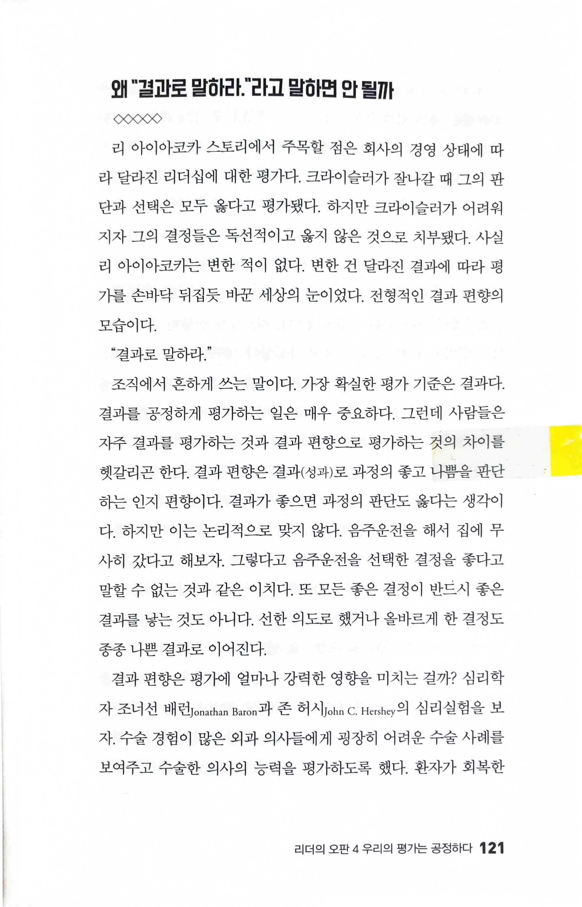

> `결과 편향`은 결과(성과)로 과정의 좋고 나쁨을 판단하는 인지 편향이다. 결과가 좋으면 과정의 판단도 옳다는 생각이다. 하지만 이는 논리적으로 맞지 않다. 음주운전을 해서 집에 무사히 갔다고 해보자. 그렇다고 음주운전을 선택한 결정을 좋다고 말할 수 없는 것과 같은 이치다. 또 모든 좋은 결정이 반드시 좋은 결과를 낳는 것도 아니다. 선한 의도로 했거나 올바르게 한 결정도 종종 나쁜 결과로 이어진다.

> 리더들은 결과를 중심으로 평가하는 것의 공정성에 대해 고민해야 한다. 결과 중심주의 평가와 보상 시스템은 자연스럽게 결과 편향의 폐해를 피하기 어렵다. 결과 편향이 판단을 지배하면 문제의 본질을 찾기보다 책임 소재를 따지고 서로 회피하게 된다. 평가의 공정성은 아예 기대할 수 없다. 결과에 대한 공정한 평가는 건강한 조직의 조건이다. 그러나 누구든 결정의 순간에 미래의 결과를 알수는 없다. 결과만 좋으면 과정에 문제가 있었더라도 괜찮고 결과가 나쁘면 그간의 과정과 노력을 깎아내린다면 조직은 모두의 위험이 될 수 있는 나쁜 의도와 옳지 않은 결정들을 통제할 수 없다. 목적이 수단을 정당화하는 위험성은 결국 조직의 생존을 위협한다.

## 권한은 상사의 것이고 책임은 부하의 몫인가

> 책임을 회피하는 상사의 뻔뻔함과 책임을 뒤집어써야 하는 부하직원의 억울함 사이에는 `사후확신 편향Hindsight bias` 이 있다.
>
> 사후확신 편향은 일의 결과를 알고 난 후 처음부터 그 일을 예상했다고 믿는 인지 편향이다. 어떤 사건이 발생한 후 '그럴줄 알았어.' '당연한 결과 아니야?' '그건 예고된 사고야!'라는 사람들의 반응은 바로 사후확신 편향에서 나온다. 사후확신 편향은 그냥 '아는 척'하는 것이 아니다. 정말 알고 있었다고 믿는 것이다.

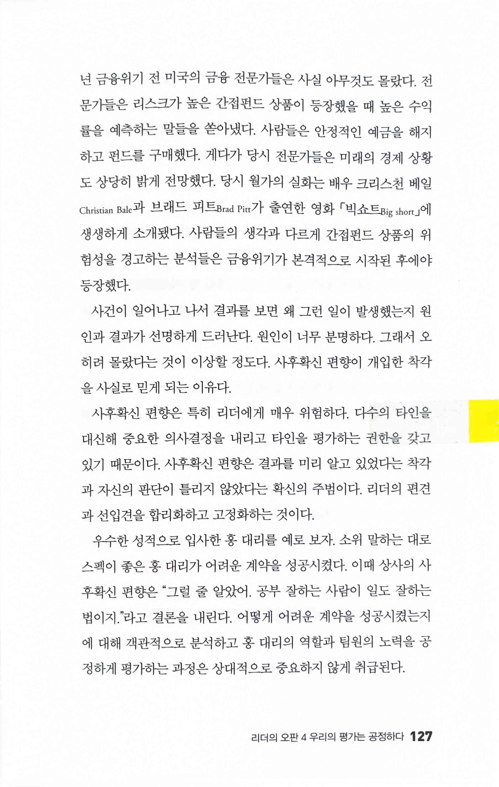

> 사건이 일어나고 나서 결과를 보면 왜 그런 일이 발생했는지 원인과 결과가 선명하게 드러난다. 원인이 너무 분명하다. 그래서 오히려 몰랐다는 것이 이상할 정도다. 사후확신 편향이 개입한 착각을 사실로 믿게 되는 이유다.
>
> 사후확신 편향은 특히 리더에게 매우 위험하다. 다수의 타인을 대신해 중요한 의사결정을 내리고 타인을 평가하는 권한을 갖고있기 때문이다. 사후확신 편향은 결과를 미리 알고 있었다는 착각과 자신의 판단이 틀리지 않았다는 확신의 주범이다. 리더의 편견과 선입견을 합리화하고 고정화하는 것이다.

> 사후확신 편향이 강한 리더는 문제해결 능력이 크게 떨어진다는 공통점을 갖고 있다. 뭐든 그럴 줄 알았다고 생각하기 때문에 결과의 원인을 세밀하고 집요하게 분석하지 않는다. 사후확신 편향은 빨리 진단하고 빨리 대책을 세우는 선수다. 현상에 드러난 원인에만 주목하고 문제의 본질은 그대로 남게 된다.
>
> 문제해결 과정에서 리더의 책임 회피도 자연스럽다. 드라마 <한자와 나오키> 속 지점장처럼 미리 알고 있었던 자신은 책임이 없고 몰랐던 담당자가 책임이 있다는 논리다. 나쁜 결과의 책임 여부가 이슈로 부상했을 때 사후확신 편향은 '주어'가 쏙 빠진 결론을 만들어낸다. 리더의 사후확신 편향이 강할수록 부하직원들은 적극적으로 책임을 회피하는 선택을 함으로써 자신을 보호한다. 책임지지 않을 선택만 하는 조직에서 혁신과 성장의 씨앗은 절대로 자라지 않는다.
>
> 폴란드 출신으로 영국에서 활동한 사회심리학자 헨리 타즈펠 Henri Tajfl 과 영국 사회심리학자 존 터너John Turner의 `사회정체성 이론Social identity theory`에 따르면 개인주의적 성향이 강한 서구사회보다 집단주의적 성향이 강한 동양사회에서 사후확신 편향이 더 강하다고 한다. 

## 칭찬은 고래를 춤추게 하지 않고 병들게 한다

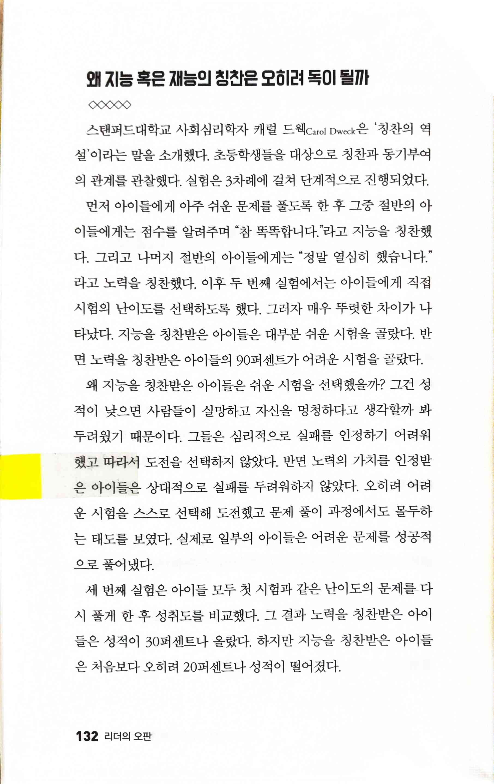

> 스탠퍼드대학교 사회심리학자 캐럴 드웩Carol Dweck은 '칭찬의 역설'이라는 말을 소개했다.
>
> 왜 지능을 칭찬받은 아이들은 쉬운 시험을 선택했을까? 그건 성적이 낮으면 사람들이 실망하고 자신을 멍청하다고 생각할까 봐두려웠기 때문이다. 그들은 심리적으로 실패를 인정하기 어려워했고 따라서 도전을 선택하지 않았다. 반면 노력의 가치를 인정받은 아이들은 상대적으로 실패를 두려워하지 않았다. 오히려 어려운 시험을 스스로 선택해 도전했고 문제 풀이 과정에서도 몰두하는 태도를 보였다. 실제로 일부의 아이들은 어려운 문제를 성공적으로 풀어냈다.

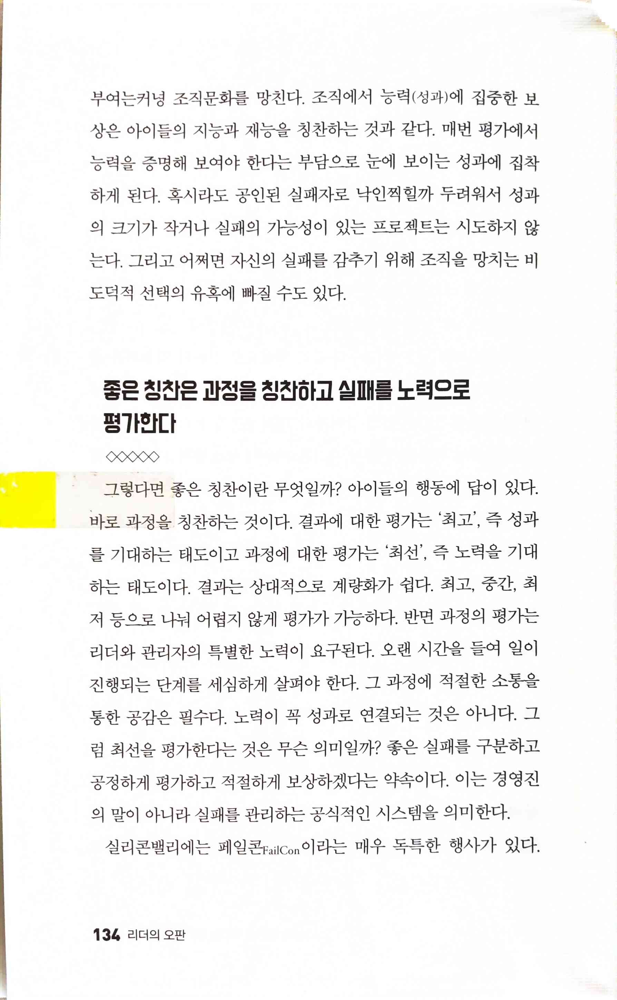

> 그렇다면 좋은 칭찬이란 무엇일까? 아이들의 행동에 답이 있다. 바로 과정을 칭찬하는 것이다. 결과에 대한 평가는 '최고', 즉 성과를 기대하는 태도이고 과정에 대한 평가는 '최선', 즉 노력을 기대하는 태도이다. 결과는 상대적으로 계량화가 쉽다. 최고, 중간, 최저 등으로 나눠 어렵지 않게 평가가 가능하다. 반면 과정의 평가는 리더와 관리자의 특별한 노력이 요구된다. 오랜 시간을 들여 일이 진행되는 단계를 세심하게 살펴야 한다. 그 과정에 적절한 소통을 통한 공감은 필수다. 노력이 꼭 성과로 연결되는 것은 아니다. 그럼 최선을 평가한다는 것은 무슨 의미일까? 좋은 실패를 구분하고 공정하게 평가하고 적절하게 보상하겠다는 약속이다. 이는 경영진의 말이 아니라 실패를 관리하는 공식적인 시스템을 의미한다.

> 창조적 실패를 보상하는 건 한계에 도전하는 과정을 칭찬하는 것이다. 3M, '앵그리 버드'를 개발한 핀란드 기업 슈퍼셀Supercell, BMW '이달의 가장 창의적 실수상'. 창조적 아이디어를 거리낌 없이 제안하고 시도하는 문화를 조성하기 위한 경영진의 노력이다.
>
> 스탠퍼드대학교 경영대학원의 조직행동학자 제프리 페퍼 Jeffrey Pfeffer와 경영학자 로버트 서튼Robert Sutton은 '증거경영'에서 실패를 과감하게 '용서'하고 그 원인과 해결의 방법을 모두가 '기억'하라고 조언한다. 그래야 직원들이 실수를 숨기지 않고 이야기할 수 있으며 실패를 동력으로 창조적 역량을 확보할 수 있기 때문이다. IBM의 토머스 왓슨Thomas Watson 전 회장은 “성공에 이르는 가장 빠른 방법은 실패의 속도를 두 배로 하는 일입니다."라고 했다. 하지만 이는 이미 과거의 이야기다. 지금은 변화의 속도가 비교할 수 없을만큼 빨라졌다. 따라서 실패의 속도도 두 배가 아니라 더 빨라져야 한다. 그러기 위해 필요한 것은 빨라진 실패의 속도만큼 더 많아질 실패의 양을 똑똑하게 관리하는 경영이다.
* 로마에서는 전쟁에서 패배한 집정관들을 처벌하지 않는다는 게 떠올랐다.

## 고액연봉을 받으면 자발적 동기부여가 될까

> 금전적 보상이 성과에 미치는 영향은 분명 한계가 있다. 인간은 기본적 욕구가 충족되고 나면 돈이 더 많아진다고 해서 행복을 느끼지 않는다. 동기부여의 효과가 크게 떨어진다는 얘기다. 이것이 바로 `이스털린의 역설Easterlin's paradox` 이 주는 교훈이다.

> 미국 캘리포니아대의 경제학자 유리 그니지Uri Heakia Gneezy와 알도 루스티치니Aldo Rustichini가 페널티를 주면 잘못된 행위를 고칠 수 있는지 실험했다. 한 유치원에서... 부모들은 지각해도 벌금을 내면 된다고 생각했고 벌금을 지각할 권리로 여겼다. 페널티의 전형적인 역효과 현상이다.
>
> 이스털린의 역설과 유리 그니지의 실험은 보상이든 벌이든 돈으로 인간의 행동을 유인할 수 있다는 생각은 틀렸다는 사실을 명확하게 보여준다. 하지만 아직도 많은 기업이 당근과 채찍론을 선호한다. 돈과 경쟁이 기대했던 것보다 동기부여 효과가 낮다는 확실한 연구결과가 있다. 그럼에도 상사들은 제도의 문제가 아니라 젊은 직원들의 '연봉보다 칼퇴근이 더 중요하다.'라는 인식이 더 문제라고 얘기한다. 반면 직원들은 아직도 높은 인센티브'만 강조하는 꼰대들이 자발적 동기를 강조하는 것에 공감하기 어렵다고 얘기한다. 동기부여가 풀 수 없는 숙제가 돼버리고 말았다. 나이와 직급간 인식의 차이가 아니라 인간의 마음을 이해하지 못한 리더십 때문이다.

> 금전적 보상의 한계는 먼저 `초점 착각 Focusing illusion`으로 설명할 수 있다. 초점 착각이란 ~ 만 하면(있으면 행복할 것으로 믿는 인지 착각이다.

> 연봉, 인센티브, 승진 등에 치중한 보상 시스템이 주목할 지점이 바로 이것이다. 직원들에게 금전적 보상을 높이면 지속적으로 노력하고 성과가 높아질 것이라는 믿음은 초점 착각이다. 사람들은 일정한 수준의 금전적 보상을 얻고 나면 다른 만족과 행복으로 관심을 이동시키는 경향이 있고, 높은 금전적 보상이 동반하는 지나친 성과압박은 원래의 목적과 전혀 다른 역효과를 유인하는 부메랑 효과Boomerang effect를 가져온다.

> 리처드 M. 티트머스의 연구는 동기부여의 `구축 효과Crowding out effect` 현상을 잘 설명해준다.
>
> 동기는 내적동기와 외적동기로 구분한다. 내적동기는 마음에서 우러나와 자발적으로 행동하는 것이고 외적동기는 금전적 이익이나 승진 등의 보상을 얻기 위해 행동하는 것이다. 이타적 마음으로 혈액을 기증할 때는 내적동기가 부여된 경우다. 경제적 보상을 위해 혈액을 기증할 때는 외적동기가 부여된 경우다. 리처드 M. 티트머스는 혈액 공급에 시장 법칙, 즉 보상을 도입했을 때 이타적으로 혈액 기증을 결심한 사람들의 '자발성'이 오히려 시장에 의해 강요받고 제약받는 구축 효과가 나타난다고 설명했다.
>
> 외적동기 부여를 자극했을 때 내적동기 부여가 오히려 밀려나는것이다. 구축 효과는 조직의 보상 시스템에서도 나타난다. 성과에 따른 차등 인센티브제는 금전적 보상으로 행동을 유인하는 외적동기 부여다. 외적보상과 노동은 교환의 의미이고 실제로 보상의 효과가 있다. 그러나 경제적 보상에 의한 동기유발은 뛰어난 창의력과 높은 질적 수준이 요구되는 분야에서 효과가 크지 않고 협력의 시너지를 방해하는 등 역효과를 가져올 수 있다.

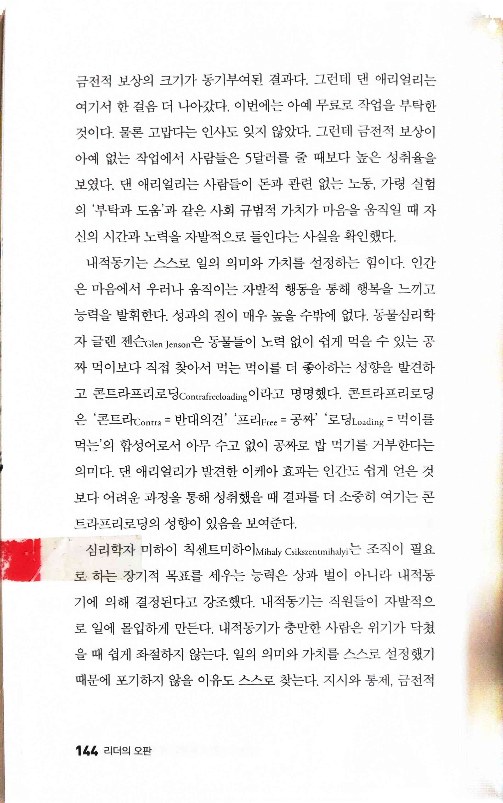

> 내적동기는 스스로 일의 의미와 가치를 설정하는 힘이다. 인간은 마음에서 우러나 움직이는 자발적 행동을 통해 행복을 느끼고 능력을 발휘한다. 성과의 질이 매우 높을 수밖에 없다. 동물심리학자 글렌 젠슨Glen Jenson은 동물들이 노력 없이 쉽게 먹을 수 있는 공짜 먹이보다 직접 찾아서 먹는 먹이를 더 좋아하는 성향을 발견하고 `콘트라프리로딩Contrafreeloading`이라고 명명했다. 콘트라프리로딩은 '콘트라Contra = 반대의견' '프리Free = 공짜' '로딩 Loading = 먹이를 먹는'의 합성어로서 아무 수고 없이 공짜로 밥 먹기를 거부한다는 의미다. 댄 애리얼리가 발견한 이케아 효과는 인간도 쉽게 얻은 것보다 어려운 과정을 통해 성취했을 때 결과를 더 소중히 여기는 콘트라프리로딩의 성향이 있음을 보여준다.
>
> 심리학자 미하이 칙센트미하이Mihaly Csikszentmihalyi는 조직이 필요로 하는 장기적 목표를 세우는 능력은 상과 벌이 아니라 내적동기에 의해 결정된다고 강조했다. 내적동기는 직원들이 자발적으로 일에 몰입하게 만든다. 내적동기가 충만한 사람은 위기가 닥쳤을 때 쉽게 좌절하지 않는다. 일의 의미와 가치를 스스로 설정했기 때문에 포기하지 않을 이유도 스스로 찾는다.

> 내적동기는 어떻게 부여할 수 있을까? 콘트라프리로딩의 시스템이 필요하다. 구성원들이 주요 결정에 적극적으로 참여할 수 있는 의사결정 시스템이 대표적이다. 직원들은 개인의 다양한 의견이 자유롭게 소통되고 의사결정에 반영되는 구조에서 강한 내적동기를 갖게 된다. 물론 평가와 보상의 공정한 균형과 과정에 대한 적절한 인정은 기본이다. 일방적으로 애사심을 강조하는것이 아니라 경영 구조의 적극적 변화로 내적동기 부여가 가능한것이다. 인간은 집단 안에서 자신의 존재 가치를 스스로 인정할 수있을 때 열정을 발휘한다. "도대체 왜 동기부여가 되지 않는가?"에대한 답이다.

# 리더의 오판 5 우리의 능력이 성공을 만든다: 도대체 왜 능력과 과신을 구별 못할까? (과신)

## 왜 리더는 1퍼센트의 성공을 쉽게 확신할까

> 확률과 통계에는 '정규분포Normal distribution'라는 말이 있다. 정규분포를 그래프로 그리면 평균값에 가장 많은 데이터가 분포하고 양극단으로 갈수록 데이터 분포가 적어지는 좌우대칭의 종 모양 Bellcurve 을 그린다...
>
> 세상을 정규분포로 이해하면 미래에 대한 예측도 꽤 선명해진다. 1퍼센트가 만드는 착시가 가능해지는 것이다. 하지만 세상의 많은 일은 정규분포가 아니라 L자 형태의 멱함수분포를 따라간다. 멱함수는 가능성의 빈도Frequency와 세기 Strength or Progress가 반비례하는 현상이다. 강할수록 더 많은 자원을 갖게 되는 이치다. 가령 세계 각국에 국제공항이 있다. 하지만 항공 물류의 80퍼센트는 고작 8퍼센트의 공항이 차지한다.
>
> 비즈니스 세상은 멱함수 법칙이 뚜렷하게 적용된다. 세계 인수합병 M&A 시장을 주도하는 FAMGA(페이스북, 아마존, 마이크로소프트, 구글, 애플)는 ... 2016년 하버드비즈니스리뷰 HBRJ에 따르면 미국 내 기업의 인수합병 실패율은 무려 70~90퍼센트에 이른다. 그런데 어떻게 시장의 승자가 될 수 있었을까? 멱함수 법칙에 비밀이 있다.

> 실리콘밸리의 투자자들 사이에는 '5:41 법칙'이란 말이 있다. 10개의 스타트업에 투자하면 5개 기업은 완전히 망하고 4개는 좀비기업이 되고 1개의 기업이 성공한다는 데서 나온 얘기다. 실리콘밸리의 투자자들은 평균 400여 개의 스타트업을 검토한 후 1개 기업에 투자한다고 한다. 결국 세계 최고의 스타트업과 액셀러레이터 그리고 투자자들이 즐비한 실리콘밸리에서도 4,000개 스타트업 중 겨우 1개 정도만 대박의 주인공이 되는 것이다.
>
> 경영 의사결정은 언제나 실패의 가능성을 포함하고 있다. 실패하지 않는 완벽한 의사결정만 할 수는 없다. 다만, 결과를 과대평가하고 그래서 너무 큰 비용을 투자해 실패하는 등 쉽게 예측 가능한 위험을 간과하는 실책은 대부분 리더의 과신에서 비롯된다는 사실은 매우 중요하게 인식돼야 한다. 경영 의사결정에서 가장 중요한 것은 바로 성공을 자신하지 않는 리더의 자세다.

> 미국의 풍자작가 개리슨 케일러Garrison Kellor가 쓴 라디오 드라마<프레리 홈 컴패니언prairie home companion)에는 워비곤 호수(Lake Wobegon라는 가상의 작은 마을이 등장한다.... 자신이 평균 이하라고 생각하기 싫은 마을 주민들이 스스로 '평균 이상의 능력자'라고 생각하면서 유쾌하게 사는 것이다. 워비곤wobegon 이라는 이름은 '근심woe'과 '사라진Be gone'이라는 말의 합성어다. 워비곤 호수 마을 주민들의 믿음은 심각한 오류에 빠져있다. 마을 주민들 모두가 평균 이상이면 도대체 평균은 누구이고 평균 이하는 어디에 있다는 걸까? 통계적으로 절대 불가능한 논리다. 심리학자 톰 길로비치Tom Gilovich는 '자신이 평균보다 더 낫다.'라고 믿는 인식의 오류를 `'워비곤 호수 효과Lake Wobegon effect'`라고 불렀다.
>
> 사람들은 집단의 평균 수준을 모르면서도 자신에게 평균 이상의 능력이 있다고 믿는다. 운전자에게 "당신의 운전실력은 어느 정도인가?"라고 물으면 대부분 "뭐, 평균보다 낫다."라고 답한다. 모든 운전자의 실력을 객관적으로 테스트해 점수화하지 않는 이상 '평균'의 운전실력이 어느 정도인지 알 수 없음에도 평균 이상의 실력을 믿는다. 그래서 도로에 나오면 조금만 불편한 상황이 발생해도 다른 사람의 운전실력을 나무라기 바쁘다. 자신의 운전실력을 탓하는 운전자는 많지 않다. 행동경제학은 자신의 능력을 과대포장하는 심리를 `'평균 이상의 효과Above-average effect'`로 설명한다.

> 자기 능력을 과장하는 성향은 직급이 높을수록 더 강하다... 사회심리학자 데이비드 마이어스David G. Myers는 미국의 기업 임원 중 무려 90퍼센트가 자신의 성과를 평균 이상으로 평가한다고 말한다. 행동경제학자 대니얼 카너먼은실리콘밸리의 창업자들과의 대화에서 스스로 능력을 지나치게 자신하는 모습을 발견하고는 큰 문제라고 지적했다. 성공과 실패는 다양하고 예측 불가한 변수가 개입한 결과이다. 따라서 자신의 능력이 경영 성과를 좌우한다는 생각은 위험한 과신이라는 것이다.실제로 미국 실리콘밸리 101 개 스타트업의 실패 원인을 조사한결과 경영의 기본인 시장의 니즈를 파악하지 못한 의사결정, 자금해결 능력의 부재, 적절한 인재로 팀을 구성할 능력 부족 등의 문제들이 대부분이었다.
>
> 자신의 능력을 과신할 때 세상은 무척 낙관적으로 이해된다. 실제로 성공을 경험한 사람 중에 '운도 실력'이라고 큰소리치는 경우가 적지 않다. 감정심리학자 대처 켈트너Dacher Keltner는 역할놀이 실험을 통해 의사결정권을 가졌다고 생각할 때 '잘한 일은 내 덕분'이라는 심리가 강해지는 현상을 발견했다. 자신의 능력을 객관적으로 판단하지 못하는 것은 물론이고 잘되면 모두 자신의 능력 덕분으로 착각한다. 그러다 보니 팀의 성과를 상사인 자신의 공으로 돌리는 데 거리낌이 없다. 하지만 반대로 결과가 나쁠 때는 '평균이상의 능력자'인 자신의 책임일 리가 없다는 `자기고양적 편향Selfserving bias`의 태도를 보인다. 이 경우 자연스럽게 책임을 추궁할 다른 희생양을 찾는다.

> 과신과 자신감은 상당히 비슷한 얼굴을 하고 있다. 유독 자신감이 두드러지는 확신은 과신을 의심할 필요가 있다. 타인의 성공을 인정하지 않고 능력을 과소평가하는 태도도 역시 과신의 모습이다. 이와 다르게 자신감은 리스크를 감수하고 용감하게 도전하지만 치명적인 리스크가 예측되면 성공의 결과로 큰 이익이 발생할지라도 포기하는 용기로 나타난다. 리더는 높은 실패의 가능성을 무시하고 낙관주의적 전망으로 리스크를 추구해서는 안 된다. 그런 무책임한 리더만큼 위험한 존재는 없다.

## 낙관 대신 스톡데일 리더십이 필요하다.

> 미국과 베트남이 전쟁 중이던 1965년에 미국 해군 항공 장교 제임스 B. 스톡데일James Bond Stockdale 중령은 북베트남에서 대공포에 격추돼 적군의 포로가 됐다. 그는 '하노이 힐튼'이라 불린 악명높은 수용소에 갇힌 8년 동안 왼쪽 다리가 부러졌고 팔에 마비가 오는등 극심한 고통을 겪었다. 하지만 그는 육체적, 정신적 고문 속에서도 오히려 함께 수용된 부하들을 독려했다. 그들은 모두 살아남았다. 1973년 종전과 함께 석방된 제임스 스톡데일에게 미국은 훈장을 수여했다.
>
> 세계적 경영 컨설턴트 짐 콜린스Jim Collins는 그를 직접 만나 생존비결을 물었다. "(그와 다르게) 수용소 생활을 견뎌내지 못한 사람들은 누구였나요?"하고묻자 "낙관주의자들입니다."라고 답했다. 깜짝 놀랄 만한 반전이었다. 사람들은 흔히 위기에 닥쳤을 때는 '희망'을 강조하는 낙관적 사고가 필요하다고 생각한다. 하지만 그의 경험은 달랐다. 곧 풀려날 거라고 낙관만 하던 포로들은 그렇게 되지 않자 금방 좌절했고 고통을 이기지 못해 죽었다. 하지만 그는 쉽게 풀려나지 못할 것에 대비해 장기간 버텨야 한다는 각오로 하루하루를 보냈다. 그가 생존할 수 있었던 비결이다. 바로 여기서 희망의 역설과 낙관주의의 폐해를 경고하는 `'스톡데일 패러독스 Stockdale paradox'`라는 용어가 생겨났다.

> 스톡데일 패러독스는 '잘될 거야.'라는 막연한 희망과 긍정은 차라리 포기하는 것보다 더 나쁜 결과를 가져올 수도 있다고 말한다. 그렇다고 낙관적 사고를 완전히 부정하는 것은 아니다. 스톡데일 패러독스의 진짜 의미는 '성공의 믿음을 견지하면서도 동시에 현실에서 닥쳐올 가장 냉혹한 사실을 직시하라.'라는 것이다.
>
> 낙관주의는 경영 의사결정에서 양날의 검이다. 조직은 미래에 대한 낙관주의적 태도를 견지하고 이를 바탕으로 도전의 위험을 기꺼이 감수하는 패기를 잃지 않아야 한다. 하지만 낙관주의는 현실에서 잘못된 의사결정의 뚜렷한 공통점이기도 하다. 스타트업 창업자들은 미래를 상당히 희망차게 예측하고 자신의 능력과 잠재력를 과대평가한다. 현실과 동떨어진 과신에서 비롯된 주요 의사결정은 실패 가능성을 크게 높인다. 이미 안정적 궤도에 오른 기업의 경영자도 다르지 않다. 낙관주의가 판단에 개입하는 순간 미래는 오프로드가 아니라 고속도로가 펼쳐진 세상이 된다.

> 스톡데일 패러독스의 교훈은 한마디로 '냉철한 낙관주의'다. 꿈을 꿀 수 있는 낙관주의에 냉혹한 현실을 직시하는 눈을 달자는 것이다. 극작가 조지 버나드 쇼George Bernard Shaw는 `"낙관론자는 비행기를 만들고 비관론자는 낙하산을 만든다."`라는 유명한 말을 남겼다. 하늘을 날 수 있다는 낙관적 사고가 있었기에 문명은 진보했다. 하지만 동시에 하늘에서 떨어져 죽는 상황을 고려한 냉철한 사고도 필요하다. 그렇지 않으면 하늘을 나는 꿈은 재앙이 될 수도 있다.

> 현실에서 '낙하산이 없는 비행기를 만드는 의사결정'이 반복되는 건 비행기가 절대 추락하지 않을 것이라는 `낙관주의 편향Optimism bias`의 영향이다. 낙관주의 편향은 '다른 사람에 비해 자신에게는 나쁜 일이 닥칠 위험이 적다고 믿는' 인지 착각이다.

> 낙관주의 편향은 일반인보다 자기 분야에서 성취를 이룬 사람들인 전문가와 리더 그룹에서 더 강하게 나타난다.

> 특히 최근 여러 프로젝트를 성공시킨 리더가 팀을 이끌 때 낙관주의 편향은 위험할 정도로 강화된다. 타사보다 더 나은 능력과 더 적은 실패 가능성을 확신하는 낙관주의 편향은 미래의 돌발 변수를 충분히 통제할 수 있다는 `통제 착각Illusion of control`에 빠지기 쉽다.
>
> 계획을 세울 때 결과를 낙관하지 않는 경우는 거의 없다. 잘될 것이라는 확신이 없다면 계획을 끝까지 추진하지 않을 것이다. 그러나 계획은 대부분 예상보다 늦어지고 더 많은 돈을 쓰게 되며 기대한 만큼 결과를 얻기도 어렵다. 이것이 `계획 오류planning fallacy`다. 계획 오류는 예측력의 한계가 아니라 예측 가능한 문제조차 점검하지 않은 안이한 의사결정의 결과다. 낙관주의 편향은 계획을 망가뜨릴 수 있는 외부 환경의 변수를 과소평가하고 실패가 뻔한 계획을 매우 완벽하다고 착각하게 만든다.

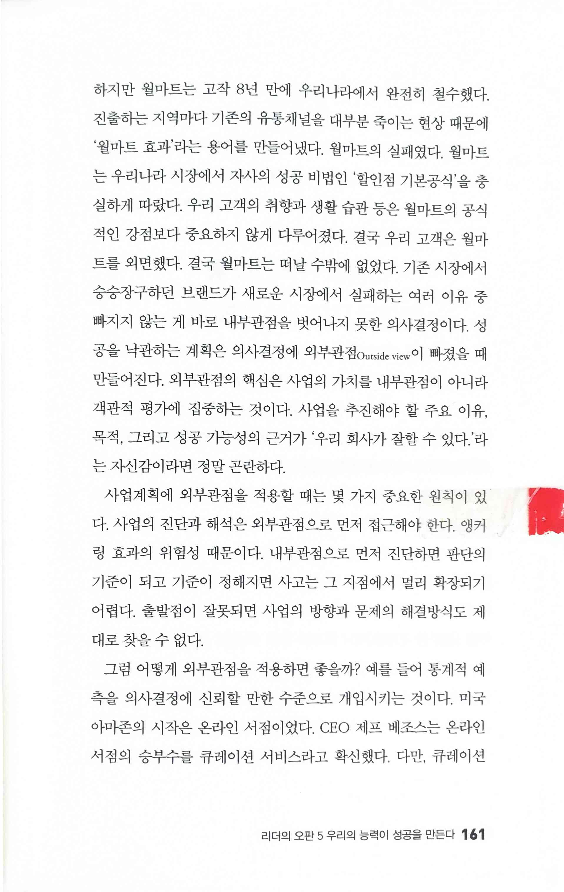

> 성공을 낙관하는 계획은 의사결정에 외부관점Outside view 이 빠졌을 때만들어진다. 외부관점의 핵심은 사업의 가치를 내부관점이 아니라 객관적 평가에 집중하는 것이다. 사업을 추진해야 할 주요 이유, 목적, 그리고 성공 가능성의 근거가 '우리 회사가 잘할 수 있다.'라는 자신감이라면 정말 곤란하다.
>
> 사업계획에 외부관점을 적용할 때는 몇 가지 중요한 원칙이 있다. 사업의 진단과 해석은 외부관점으로 먼저 접근해야 한다. 앵커링 효과의 위험성 때문이다. 내부관점으로 먼저 진단하면 판단의 기준이 되고 기준이 정해지면 사고는 그 지점에서 멀리 확장되기 어렵다. 출발점이 잘못되면 사업의 방향과 문제의 해결방식도 제대로 찾을 수 없다.
>
> 그럼 어떻게 외부관점을 적용하면 좋을까? 예를 들어 통계적 예측을 의사결정에 신뢰할 만한 수준으로 개입시키는 것이다.

> 의사결정 시스템 안에 외부관점을 공식적으로 구축돼야 한다. 하지만 의사결정에 참여하는 관계자들은 시스템이 구축돼 있어도 늘 내부관점을 경계해야 한다. 특히 최종 의사결정 단계에서 리더의 내부관점을 점검하는 절차가 상당히 중요하다.

## 왜 혁신적인 제품이 시장에서 성공하지 못할까

> 1인용 전동 모빌리티 비즈니스의 혁신이 인정받았던 건 무려 20여 년 전이다. 2001년 미국의 발명가 딘 케이먼Dean Kamen은 전동스쿠터 세그웨이segway를 개발했다... 왜 세그웨이는 혁신적 기술을 세상에 처음 선보였는데도 실패했고 라임Lime과 버드Bird는 어떻게 성공해서 유니콘이 됐을까? 이는 `'혁신의 저주Curse of innovation'` 현상으로 설명할 수 있다.

> 하버드대학교의 존 구어빌John Gourville 교수는 미국에서 출시되는 혁신적인 제품의 90퍼센트가 실패하는 현상을 보고 '혁신 제품이 시장에서 성공하지 못하는 현실'을 혁신의 저주라고 불렀다...
>
> 세그웨이는 전형적인 내부관점으로 탄생한 제품이다. 내부관점은 혁신의 크기는 과대평가하고 시장의 반응은 낙관적으로 예측한다. 당시 의사결정 과정에 사회 문화적 분위기와 고객 심리를 연구하는 등 외부관점을 도입했다면 세그웨이는 전혀 다른 모습으로 우리 곁에 있었을 것이다.

> 개발자들이 신제품을 개발할 때 모두 외부관점을 무시하는 것은 아니다. 다만, 자신이 개발한 혁신적 제품에 대한 시장의 반응을 과장해서 예측하기 쉬운 게 함정이다. 미국 속담에 "꼬마에게 망치를 주면 세상의 모든 것을 못으로 본다."라는 말이 있다. 개발자의 눈에는 고객이 신기술을 환영하지 않을 이유가 보이지 않는다. 실제 혁신 기술은 고객에게 인식의 대전환, 어려운 학습, 비싼 비용 등을 감수하는 '변화'를 요구하는 경우가 많다. 이때 변화의 크기에 따라 고객의 선택도 달라진다. 가령 세그웨이는 고객이 정장 차림으로 1인용 전동스쿠터를 타고 도로를 달리는 행동을 선택하도록 요구했다. 당시 문화에서는 상당히 큰 변화를 요구한 것이다. 인간은 본능적으로 변화를 싫어한다. 변화한다는 것은 익숙함을 버린다는 것이다. 그건 익숙한 것을 버려야 하는 손실 회피 심리를 동반한다. 혁신 제품을 선택해서 얻을 수 있는 이익이 익숙함을 포기하는 손실보다 훨씬 크지 않다면 현재의 선택을 유지하려는 현상유지 편향에서 벗어나기 어렵다.
>
> 미국 스탠퍼드대학교의 제프리 무어Geoffrey Moore는 '제프리 무어의 캐즘 마케팅'에서 이런 시장의 심리를 `캐즘Chasm` 현상으로 설명했다. 캐즘이란 땅의 갈라진 틈 혹은 깊은 구렁을 말한다.

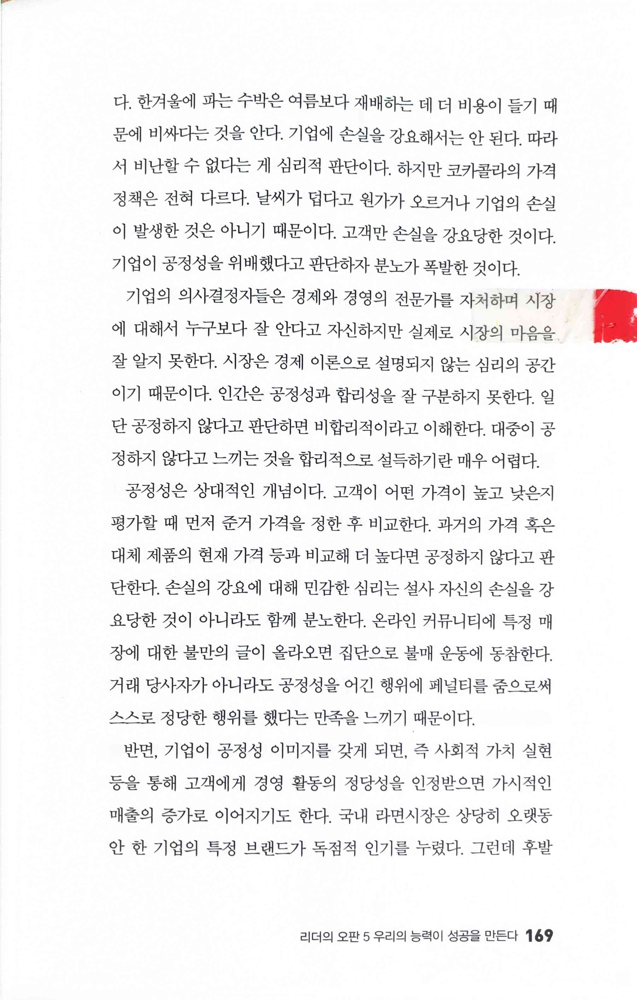

> 기업의 의사결정자들은 경제와 경영의 전문가를 자처하며 시장에 대해서 누구보다 잘 안다고 자신하지만 실제로 시장의 마음을 잘 알지 못한다. 시장은 경제 이론으로 설명되지 않는 심리의 공간이기 때문이다. 인간은 공정성과 합리성을 잘 구분하지 못한다. 일단 공정하지 않다고 판단하면 비합리적이라고 이해한다. 대중이 공정하지 않다고 느끼는 것을 합리적으로 설득하기란 매우 어렵다.
>
> 공정성은 상대적인 개념이다. 고객이 어떤 가격이 높고 낮은지 평가할 때 먼저 준거 가격을 정한 후 비교한다. 과거의 가격 혹은 대체 제품의 현재 가격 등과 비교해 더 높다면 공정하지 않다고 판단한다. 손실의 강요에 대해 민감한 심리는 설사 자신의 손실을 강요당한 것이 아니라도 함께 분노한다.

> 행동경제학이 경영 리더들에게 주는 조언은 경제 이론에 매몰되지 말고 사람의 심리를 이해함으로써 시장의 마음을 얻으라는 것이다. 세계적인 기업들이 공정성을 추구하는 자본주의로 이행하는 까닭은 고객의 마음이 경영 수익과 직결되는 시대로 변화하기 때문이다. 사람의 심리를 이해하지 못하는 경영은 더 빠른 속도로 뒤처질 수밖에 없다.

## 통찰로 포장된 직관은 단지 허상이다

> 인공지능과 면접관 중 누구의 예측이 옳았을까? 당장 답을 알 수는 없지만 심리학자 폴 밀Paul Mechl은 이미 수십 년 전 실험을 통해 경험 많은 전문가의 예측보다 간단한 통계를 기반으로 예측했을 때 훨씬 더 정확한 의사결정이 가능하다는 사실을 증명했다.

> 미국 프로 농구 NBA 필라델피아 세븐티식서스Philadelphia 76ers의 신임 사장 대릴 모리Dary Morey다. 그는 3점 슛 라인 안쪽의 중거리 2점 슛을 극도로 피하고 골밑슛과 3점 슛에 집중하는 이른바 `'모리볼'`을 탄생시켰다. 그는 2007년부터 2020년까지 휴스턴 로키츠Houston Rockets 단장으로 재임하는 동안 정규 시즌 승률에서 리그 전체 2위에 플레이오프 10회 진출의 대기록을 완성했다.
>
> 그는 노스웨스턴대학에서 컴퓨터공학을 전공한 뒤 2007년에 통계를 들고 농구장에 나타났다. 농구계의 전문가들은 그를 비웃고 조롱했다. 미국 프로농구 올스타 찰스 바클리Charles Barkley는 대릴 모리를 “통계분석을 믿는 얼간이"라고 불렀고 "NBA는 재능의 문제다. 농구에서 수식을 가지고 떠드는 자들의 공통점은 농구를 해본 적도 없다는 것이다."라며 공개적으로 비난을 퍼부었다. 그러나 통계를 바탕으로 득점 확률을 높이는 전략은 대성공을 거뒀고 오히려 타 구단에서 적극적으로 모리볼 전략을 도입하는 상황이 연출됐다. 데릴 모리는 선수 드래프트에서도 통계를 적극적으로 활용하는 등 농구 경기와 구단 운영의 혁신을 이루었다.
>
> 통계 예측이 숙련된 전문가의 직관보다 더 정확하다는 연구는 다양한 분야에서 증명됐다. 프린스턴대학의 경제학자 오를리 아센펠터Orley Ashenfelter는 프랑스 보르도 지방의 날씨 데이터를 분석하는 것만으로 이제 막 생산된 보르도 와인의 수년 후 경매가를 예측했다. 당시 그는 “1986년산 보르도 와인은 질이 낮고 1989년산이 오히려 세기의 와인이 될 것이다."라거나 "1990년 와인은 더 대단할 것이다."라고 예측했다. 곧 와인 평론가들의 비난을 받았다. 오감과 직관의 영역에 있던 와인을 숫자로 된 데이터만으로 예측한다는 사실을 매우 평가절하했다. 하지만 오를리 아센펠터의 예측 정확도는 매우 높았다. 그 후로 지금까지 `아센펠터 공식`은 좋은 와인을 찾는 예측 도구로서 매우 유용하게 활용되고 있다.

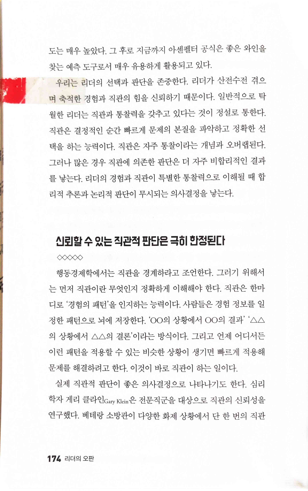

> 우리는 리더의 선택과 판단을 존중한다. 리더가 산전수전 겪으며 축적한 경험과 직관의 힘을 신뢰하기 때문이다. 일반적으로 탁월한 리더는 직관과 통찰력을 갖추고 있다는 것이 정설로 통한다. 직관은 결정적인 순간 빠르게 문제의 본질을 파악하고 정확한 선택을 하는 능력이다. 직관은 자주 통찰이라는 개념과 오버랩된다. 그러나 많은 경우 직관에 의존한 판단은 더 자주 비합리적인 결과를 낳는다. 리더의 경험과 직관이 특별한 통찰력으로 이해될 때 합리적 추론과 논리적 판단이 무시되는 의사결정을 낳는다.
>
> 행동경제학에서는 직관을 경계하라고 조언한다. 그러기 위해서는 먼저 직관이란 무엇인지 정확하게 이해해야 한다. 직관은 한마디로 '경험의 패턴'을 인지하는 능력이다.

> 직관의 신뢰도에 회의가 컸던 행동경제학자들은 심리학자들과 함께 다양한 직군의 직관적 판단력을 어느 정도 신뢰할 수 있을지 공동 연구를 했다. 그 결과 행동경제학자들은 직관적 판단이 바른 의사결정을 내릴 수 있다는 사실에 동의했다. 단, 매우 규칙적으로 반복되는 상황에서 오랫동안 훈련한 전문직이라는 분명한 한계성을 지적했다.

> 세계적인 경영사상가 맬컴 글래드웰Malcolm Gladwell은 직관의 힘을 강조할 때 단골로 등장하는 인물이다. 그가 블링크』에서 강조한 '혜안Coup d'oeil' 때문이다. 혜안은 '한눈에 알아차리는 힘Power of theglance'이라는 뜻으로 통찰에 의한 문제해결 능력이다. 그는 리더가 눈을 깜빡이는Blink 정도의 아주 짧은 시간 올바른 판단을 내릴 수있도록 직관이나 통찰력을 강화할 수 있다고 강조했다. 하지만 이는 어디까지나 경우에 따른 직관적 판단, 즉 규칙적 환경에서 고도로 훈련된 직관을 말하는 것이다. 맬컴 글래드웰은 훈련된 직관의 의사결정은 이성적 판단의 하나이며 직관의 판단력을 무조건 신뢰할 수는 없다고 분명하게 말한다.

> 행동경제학에서는 규칙적이고 반복적인 전문직 종사자가 오랫동안 훈련으로 강화한 소수의 직관력을 제외한 대부분 전문가의 직관은 대단히 별 볼 일 없다고 결론지었다. 세상에서 일어나는 거의 모든 일은 규칙적 패턴에 따라 진행되지 않기 때문이다... 프린스턴대학교의 경제학자 버튼 말킬Burton Malkiel은 원숭이와 투자전문가의 '주식 투자종목 찍기' 대결이라는 극단적인 실험을 공개적으로 진행했다. 결과는 충격적이다. 원숭이가 찍은 종목의 수익률과 투자전문가가 찍은 종목의 수익률에서 별 차이가 없었다.
>
> 심리학자 필립 테틀록Philip E. Tetlock은 정치경제 분야 전문가를 대상으로 연구를 한 결과 가장 많이 아는 전문가의 예측이 가장 정확도가 떨어지는 사실을 발견했다. 스탠퍼드대학교의 패멀라 하인스Pamela J. Hines는 '아주 훌륭한 전문가라도 빠르게 변화하는 세상에서 과거의 전문성으로 미래를 예측하는 것이 의미 없으며 예측이 빗나갈 가능성도 매우 큰 현상'을 `'전문가의 저주'`라고 정의했다. 현실에서 전문가의 저주를 피하기란 상당히 어렵다. 성공한 전문가일수록 스스로 불확실성을 인정하지 않는 과신이 강하기 때문이다. 가장 많이 안다고 믿는 전문가들은 실력을 과대평가하고 과시하려는 성향이 크다. 자신감을 능력으로 착각하는 `'자신감 착각Illusion of confidence'`이다.

> 영국의 철학자 이사야 벌린 Isaiah Berlin은 저서 『고슴도치와 여우』에서 인간을 고슴도치형과 여우형으로 분류했다. 고슴도치형 인간은 변치 않는 '하나의 원리'가 있다고 믿으면서 외곬의 길을 걷는다. 이와 반대로 여우형 인간은 일관성이 없고 다소 모순이 있더라도 상황에 따라 기꺼이 자신의 의견을 바꾼다. 그런데 세상은 대부분 여우형 인간보다 고슴도치형 인간을 더 신뢰한다. 고슴도치형 인간의 외골수 성향과 확신에 찬 태도를 '전문성'과 동일시하기 때문이다. 사람들이 합리적 판단으로 신중하게 발언하는 전문가보다 강한 자신감을 보이는 전문가의 조언을 선호하는 이유다. 그러나 고슴도치형 인간의 외골수적 태도는 타고난 성향일 뿐 실력이 있어서가 아니다. 전문가의 자신감은 실제 능력과 반드시 비례하지는 않는다.

> 직관에 대한 경고는 리더의 경험과 전문성을 무시하는 것이 아니다. 리더가 직관을 과신했을 때 의사결정의 위험성을 강조하는 것이다... 많은 비즈니스의 성공사례들은 여전히 리더의 직관을 부각하며 그럴듯한 영웅담을 생산해내고 있다. 하지만 실제로 이뤄진 성공과 혁신에서 리더의 뛰어난 직관은 찾을 수 없다.

# 리더의 오판 6 우리의 성공은 직관과 통찰의 결과다: 도대체 왜 기회를 차버리고 대신 위험을 택할까? (전략)

## 왜 기업들은 위험을 감수하면서도 몸집을 키울까

> 최근 기업의 고도성장 전략이 뜨거운 이슈다. 위험을 감수하면서 엄청난 속도로 회사를 키워 압도적인 경쟁우위를 갖는 것이다. 일명 `블리츠스케일링 Blitzscaling`이다. 비즈니스 인맥 서비스를 제공하는 링크드인 LinkedIn 의 설립자 리드 호프먼Reid Hoffman 이 주창한 블리츠 스케일링은 기습공격을 의미하는 '블리츠크리그Blizkrieg'와 규모 확장을 의미하는 '스케일 업Scale up'의 합성어다.

> 세상에 없던 새로운 비즈니스 모델을 처음으로 만든 `'제로투원 0 to 1'` 기업도 많지만 유니콘 중 상당수가 `'원투헌드레드 1 to 100'` 비즈니스 모델이라는 것이다. 원투헌드레드 비즈니스 모델이란 이미 시장에서 검증된 비즈니스 모델을 모방하고 혁신하고 진화시켜 시장 규모를 키우는 것을 말한다. 바로 `카피캣Copy cat` 모델이다. 카피캣은 '흉내를 잘 내는 고양이'에서 유래한 말로서 다른 기업의 비즈니스를 모방해서 비슷한 기능과 서비스를 제공하는 `패스트 팔로어 Fast follower` 기업을 가리킨다.
>
> 과거 시장을 지배한 기업들은 `퍼스트 무버 First mover`였다.

> 수익 안정성과 시장 진출의 속도전은 `트레이드오프Trade-off`의 관계다. 당장 수익을 챙기며 안정적인 성장을 선택하든지, 적자를 감수하면서 빠르게 시장 확보에 주력할 것인지 둘 중 하나를 선택해야만 한다. 유니콘들의 선택은 의도된 적자 전략이다.

> 시장은 점점 더 예측할 수 없는 속도로 변하고 있다. 빌 게이츠Bill Gates는 “다가올 기회는 대단히 좁고 빨리 닫힐 것입니다."라고 경고한다. 우리는 이러한 상황에서 어떻게 해야 할까? 단 하나의 확실한 전략은 재빨리 시장을 선점함으로써 경쟁자가 쫓아오기 어려운 초격차를 만드는 것이다. 오늘날 치열하지 않은 시장은 없다.

> 불확실성이 정상인 `뉴애브노멀New abnormal 시대`

> 비즈니스에서 쉽게 발견되는 `밴드왜건 효과 Bandwagon effect`는 다수의 행동을 무조건 믿고 따르는 인지 편향으로서 편승 효과라고도 한다... 밴드왜건 효과는 기업이 소비를 촉진하고 시장점유율을 확대할때 활용하는 마케팅 전략으로 자주 활용된다.

> 밴드왜건 효과는 최신의 정보를 상세한 분석도 없이 무조건 높게 평가하는 `'최신 편향Recency bias'`의 영향이다. 리더가 최신 편향이 강하고 또 그런 리더의 신념을 비판 없이 수용하는 위계적 조직이라면 밴드왜건 효과는 아주 쉽게 집단사고를 형성한다. 최신 편향으로 이미 방향성이 결정된 사업들은 회의가 거듭될수록 주장을 뒷받침할 증거만 보고 신뢰하는 확증 편향이 개입해 사고의 프레임을 강화한다. 그런데 더 큰 불행은 결정에 문제가 발견됐을 때의 태도다. 실책을 빠르게 인정하고 결정을 바꾸지도 못한다. 이 상황에서 이런 결정은 최선의 선택'이라며 오히려 합리화에 바쁘다. 바로 `'선택 지원 편향Choice supportive bias'`의 힘이다.
>
> 이와 반대로 최신 정보보다 과거의 경험을 토대로 자신의 신념을 강하게 유지하려는 `'보수적 편향Conservation bias'`도 의사결정에 흔하게 나타난다. 아무리 좋은 정보와 객관적 장점을 제시해도 새로운 것을 배척하고 '구관이 명관'이라는 신념으로 똘똘 뭉친 보수적 편향은 한 분야에서 오랫동안 경력을 쌓은 전문가와 리더들에게 특히 강하게 나타난다.

> 판단에 큰 영향을 미치지 않는 새로운 자료를 계속 요구하며 결정을 미룬다. 이런 태도는 꼼꼼하고 신중하다는 평가를 받기도 하지만 사실은 `정보 편향Information bias`의 영향인 경우가 많다. 정보 편향은 분명한 목적과 범위에서 정보를 수집하고 분석하는 태도와는 전혀 다르다. 정보 편향이 강한 리더는 자신이 원하는 것이 무엇인지 정확하게 알지 못하는 경우가 허다하다. 어떤 결정을 내려야 할지 모를 때 의사결정의 부담을 피하려는 심리일 뿐이다. 더 많은 정보가 반드시 좋은 의사결정으로 이어지는 것이 아니다. 자신의 고집을 유지하려는 보수 편향과 무한대의 정보만 요구하는 정보 편향은 모두 위험을 회피하고 싶은 심리다. 결정장애 리더의 전형적인 행태다.

## 왜 성공을 따라했던 수많은 벤치마킹이 실패했을까

> 성공의 비법을 배워 실수를 줄이고 더 빨리 목표를 이루려는 의도다. 이것이 `벤치마킹Benchmarking` 이다. 경영전략 기법으로서 벤치마킹은 측정의 기준이 되는 대상을 설정하고 비교 분석을 하여 장점을 따라 배우는 행위를 말한다. `역공학Reverse engineering`을 통해 혁신을 만드는 과정이 바로 벤치마킹이다.
>
> 하지만 벤치마킹이 늘 성공하는 것은 아니다. 오히려 많은 경우 실패한다. 벤치마킹의 대상이 모두 '성공한 모델'이기 때문이다. 성공의 비법을 배우는 게 핵심인데 성공 모델이라서 실패할 가능성도 크다는 아이러니는 `생존자 편향Survivorship bias`의 오류 때문이다.

> 벤치마킹 전략은 생존자 편향의 오류에 빠지기 쉽다. 위기에 봉착하면 비슷한 위기를 극복한 기업의 전략에서 아이디어를 찾고 새로운 시장에 진출할 계획이라면 시장점유율 1~2위 기업의 성공 요인에서 배울 점을 찾는다. 여러 성공 모델을 모아서 공통점을 추리면 결과와 상관관계에 있는 여러 '성공 패턴'이 보인다. 명확하게 정리된 성공 패턴은 이해도 쉽고 따라 하기도 쉽다. 많은 기업이 벤치마킹을 어렵지 않게 시도하는 이유다.

> 미국의 통계학자 윌리엄 펠러william Feller는 제2차 세계대전 때 런던에 집중적으로 폭탄이 떨어진 지역을 통계적 관점으로 분석했다. 당시 폭격지점을 지도에 표시하면 뚜렷한 패턴이 나타났다... 하지만 종전 후 연구조사 결과 당시 폭격이 특정 지역에 집중된 이유는 독일의 의도가 아니라 비행 기술력의 한계 때문에 해당 지역에 폭탄을 투하할 수밖에 없었던 것으로 밝혀졌다. 폭격의 패턴은 무작위로 이루어진 결과다. 그런데 이 사실을 알고도 지도 위에 표시된 폭격지점을 보고 있노라면 여전히 의도성이 느껴진다. 동일한 사건이 연속해서 일어나면 이를 매우 의미 있는 사건으로 이해하는 `클러스터 착각clustering illusion`이다.

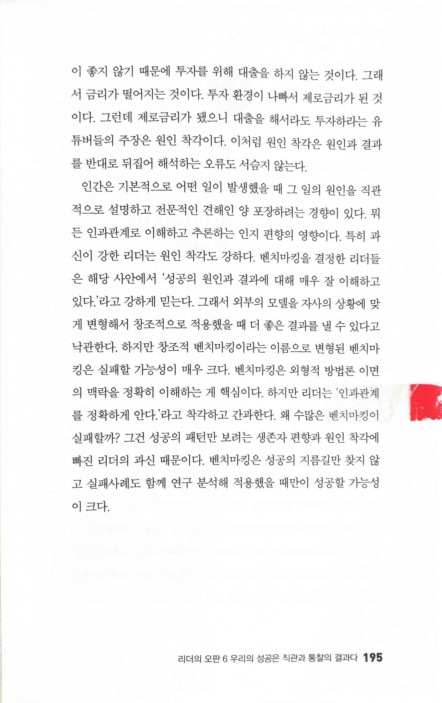

> 인간은 기본적으로 어떤 일이 발생했을 때 그 일의 원인을 직관적으로 설명하고 전문적인 견해인 양 포장하려는 경향이 있다. 뭐든 인과관계로 이해하고 추론하는 인지 편향의 영향이다. 특히 과신이 강한 리더는 원인 착각도 강하다. 벤치마킹을 결정한 리더들은 해당 사안에서 '성공의 원인과 결과에 대해 매우 잘 이해하고 있다.'라고 강하게 믿는다. 그래서 외부의 모델을 자사의 상황에 맞게 변형해서 창조적으로 적용했을 때 더 좋은 결과를 낼 수 있다고 낙관한다. 하지만 창조적 벤치마킹이라는 이름으로 변형된 벤치마킹은 실패할 가능성이 매우 크다. 벤치마킹은 외형적 방법론 이면의 맥락을 정확히 이해하는 게 핵심이다. 하지만 리더는 '인과관계를 정확하게 안다.'라고 착각하고 간과한다. 왜 수많은 벤치마킹이 실패할까? 그건 성공의 패턴만 보려는 생존자 편향과 원인 착각에 빠진 리더의 과신 때문이다. 벤치마킹은 성공의 지름길만 찾지 않고 실패사례도 함께 연구 분석해 적용했을 때만이 성공할 가능성이 크다.

## 통계는 거짓말을 하지 않지만 착각하게 한다

> 마케팅 컨설팅에 자주 등장하는 `롱테일 법칙Long tail theory` 이란 게있다. 많은 기업이 파레토의 법칙인 '충성 고객 20퍼센트가 매출의 80퍼센트 가치를 창출한다.'에 따라 효자상품 관리에 주력한다.

> `베이즈 추론Bayesian inference`: 추론 대상의 사전 확률과 추가적인 정보를 통해 해당 대상의 사후 확률을 추론하는 방법

> `기저율 무시Neglect of base rate` 현상으로서 인지 착각... 통계의 착시는 보이는 대로 믿는 직관의 작용이다. 사고의 프레임을 넓히고 드러난 사실의 맥락을 읽기 위한 노력이 없다면 통계에 의존하는 리더의 의사결정은 더욱 위험해질 수 있다.

> 판단을 통계의 함정에 빠뜨리는 인지 착각 중 `'소수 법칙 Law of small numbers'`... 소수 법칙이란 작은 표본이 큰 표본보다 더 자주 극단적인 결과를 보이는 현상을 말한다... 소수표본은 극단적인 쏠림 현상이 발생할 수 있다는 것은 논리적으로도 밝혀진 진실이다. 하지만 그래도 사람들은 소수 법칙에 휘둘린다. 직관이 머릿속에 인과관계의 스토리를 만들어 서사 오류에 빠지기 때문이다. 작은 학교의 높은 대학진학률 숫자를 보면 직관은 바로 '학생 수가 적으니 교사들이 더 세심하게 학생을 살피기 때문일 것이다.'라고 이유를 찾는다.
>
> 소수 법칙은 통계가 고르게 정규분포할 거라는 평균값의 착각과도 만난다. 가령 어느 산부인과에서 10명의 남자아이가 연속적으로 태어났다고 하자. 그러면 이 통계를 평균값과 보편적 현상으로 이해한다. 이를 토대로 그 병원은 아들 낳는 산부인과로 유명해지는 웃지 못할 스토리가 탄생한다. 표본의 범위를 확대하면 우연성이 드러나겠지만 우연성을 의도로 해석하는 클러스터 착각은 합리적 사고의 눈을 가린다. 혹은 반대로 지금까지 계속 남자아이가 태어났으니 다음엔 분명 여자아이가 태어날 것으로 확신하기도 한다. 마치 도박사들이 계속 잃으면서도 "다음엔 내가 딸 차례이다."라며 도박장을 떠나지 못하는 심리를 가리키는 `도박사의 오류Gambler's fallacy` 현상이다.

> 의사결정에서 스토리가 강력한 영향을 미치는 건 `타당성 착각 Illusion of validity` 때문이다. 일단 타당성 착각에 빠지면 증거의 질과 양에 대한 논리적 분석을 하지 않는다. 오히려 주관적 확신에 따른 판단 능력을 과신하게 된다. 대표적인 타당성 착각으로는 `결합 오류Conjunction fallacy`가 있다. 결합 오류는 단일 사건의 확률보다 두 사건이 결합된 경우의 확률을 더 높게 추정하는 인지 착각이다. 모기업에서 신재생에너지 사업 모델 추진 프레젠테이션을 했다. 프레젠테이션에는 사업이 성공할 수밖에 없는 다양한 근거들이 빼곡하다. 이때 머릿속에 '그럴듯하군.'이라고 바로 설득된다면 일단 결합 오류를 의심할 필요가 있다. 프레젠터는 1년 후 석유 가격이 상승해 가정용 태양광 발전장치 수요가 증가할 것을 주장하며 여러 근거를 제시할 것이다. 이때 A) 석유 가격이 상승할 것이라는 예측 하나를 근거로 제시할 때와 B) 미국의 이란 경제봉쇄와 석유생산국 간 갈등으로 석유와 천연가스 가격이 크게 오를 것이라는 예측 중 어느 쪽이 더 신뢰할 만하다고 생각되는가? 행동경제학자 대니얼 카너먼이 전문가 집단을 대상으로 한 실제 실험에서 B에 대한 신뢰도가 높았다. 하지만 B는 단지 A의 부분집합일 뿐이다. A) 석유 가격이 상승한다는 시나리오는 하나의 사건이다. B) 미국의 이란 경제봉쇄 + 석유생산국 갈등+석유 가격이 상승하는 시나리오는 무려 3개의 사건이 동시에 발생해야 한다. 당연히 A가 B보다 신뢰도가 높다.

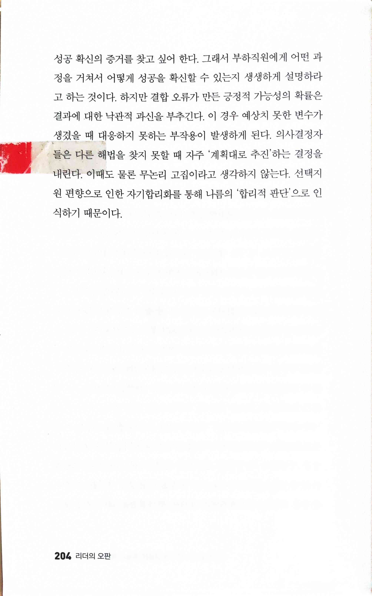

> 결합 오류가 만든 긍정적 가능성의 확률은 결과에 대한 낙관적 과신을 부추긴다. 이 경우 예상치 못한 변수가 생겼을 때 대응하지 못하는 부작용이 발생하게 된다. 의사결정자들은 다른 해법을 찾지 못할 때 자주 '계획대로 추진`하는 결정을 내린다. 이때도 물론 무논리 고집이라고 생각하지 않는다. 선택지원 편향으로 인한 자기합리화를 통해 나름의 '합리적 판단'으로 인식하기 때문이다.

## 왜 중요한 장기계획이 단기계획에 밀릴까

> 행동경제학자 리처드 세일러Richard Thaler의 선택 선호도 실험. 같은 조건의 선택이지만 현재와 미래로 설정된 상황에 따라 사람들은 선택을 바꿨다. 바로 `하이퍼볼릭 디스카운트 편향 Hyperbolic discount bias`의 영향이다.
>
> 하이퍼블릭 디스카운트란 가까운 미래는 상대적으로 높은 할인율에 영향을 받고 먼 미래는 상대적으로 낮은 할인율에 영향을 받는 성향을 말한다. 쉽게 말해 현재보다 나중에 얻게 될 가치를 낮게(할인) 평가하는 것이다. 일주일 후의 빵 2개가 오늘의 빵 한 개보다 더 낮게 평가된다. 반면 먼 미래에 발생할 일에 대해서는 조금 더 인내심을 갖고 합리적으로 생각한다. 같은 일주일의 차이인데 1년 후의 상황에서는 확실히 더 이익이 되는 선택을 한다.
>
> 하이퍼블릭 디스카운트는 경영 의사결정에서 매우 비합리적인선택을 유도한다. 하이퍼블릭 디스카운트 편향이 강한 리더는 당장의 성과에 지나치게 집중한다. 그러다 보면 아주 중요한 장기계획이라도 자주 단기계획에 밀리고 상대적으로 덜 중요한 일로 치부된다.

> 선택 의사결정에서 선호도는 가치평가의 판단에 따른다. 그런데 가치평가는 상황에 따라 그때그때 달라진다. 행동경제학은 이런 선택 성향을 선호도 역전reference reversal' 현상으로 설명한다. 선호도 역전이란 선택 의사결정이 합리적 판단의 결과가 아니라 상상을 원하는 심리다. 장기적 관점에서 추진해야 할 사업계획과 정책보다 단기적 사업목표의 효과를 과대 포장하게 되고 당장의 목표와 성과에 집중하도록 한다.

> CEO와 임원의 재임 기간이 갈수록 짧아지는 경영환경의 문제도 있다. 경영 리더십의 모델이었던 GE의 전 회장 잭 웰치는 재임 중 시장에서 1~2등의 성과를 내지 않으면 경쟁력이 없다고 판단해 해당 사업부를 구조 조정했다... 미래 성장잠재력이 있는 시장은 자연스럽게 제외됐다. 그 결과 10여년 후 GE는 시장에서 뒤처졌다.
>
> 과거 미국이 일본에 반도체 시장을 내준 것도 미국 반도체 기업경영자들의 근시안적 의사결정 탓이다... `경영 근시Management myopia` 현상이다.
>
> 하버드 경영대학원 시어도어 레빗Theodore Levitt 교수는 “경영자의 단기목표 집착은 시장기회의 상실로 이어진다."라고 경고했다. 단기적 성과압박에 민감할 수밖에 없는 상황에서도 경영자는 장기적 관점을 놓치면 안 된다. 현재의 의사결정은 언제나 미래의 오늘을 보는 넓은 프레임을 필요로 한다.

> 모토로라는 이리듐 프로젝트의 실패가 예고됐는데도 중단하지않았다... 당시 모토로라의 결정은 `매몰비용 오류Sunk cost fallacy` 였다. 매몰비용은 말 그대로 땅에 묻힌 비용, 즉 이미 써버려서 회수할 수 없는 돈이다. 매몰비용의 오류가 발생하는 이유를 행동경제학은 `심리계좌 Mental accounting`와 손실 회피 심리로 설명한다.

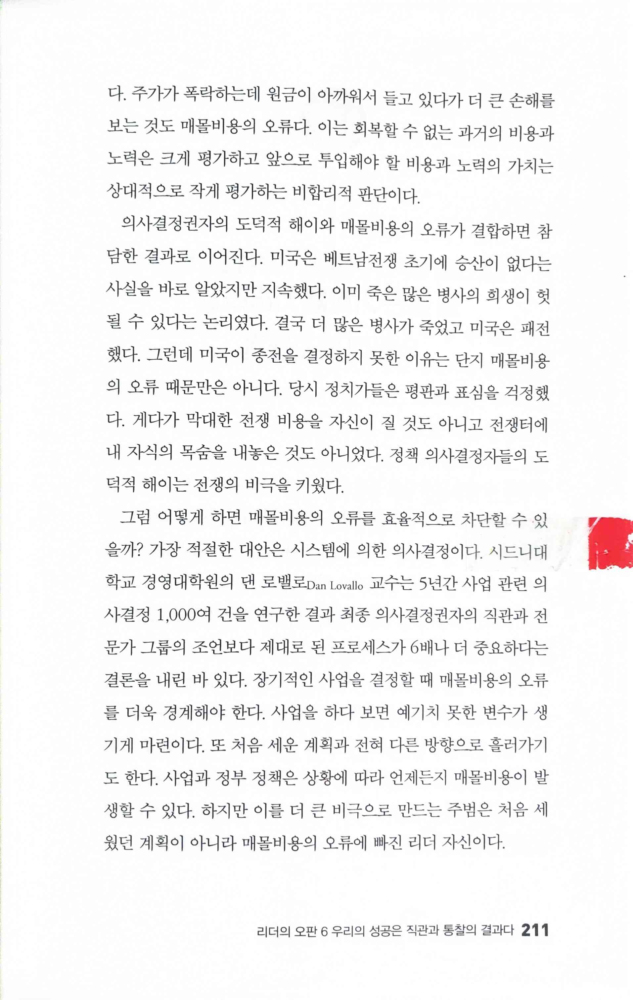

> 의사결정권자의 도덕적 해이와 매몰비용의 오류가 결합하면 참담한 결과로 이어진다. 미국은 베트남전쟁 초기에 승산이 없다는 사실을 바로 알았지만 지속했다. 이미 죽은 많은 병사의 희생이 헛될 수 있다는 논리였다. + 당시 정치가들은 평판과 표심을 걱정했다... 정책 의사결정자들의 도덕적 해이는 전쟁의 비극을 키웠다.
>
> 그럼 어떻게 하면 매몰비용의 오류를 효율적으로 차단할 수 있을까? 가장 적절한 대안은 시스템에 의한 의사결정이다. 시드니대학교 경영대학원의 댄 로벨로Dan Lovallo 교수는 5년간 사업 관련 의사결정 1,000여 건을 연구한 결과 최종 의사결정권자의 직관과 전문가 그룹의 조언보다 제대로 된 프로세스가 6배나 더 중요하다는 결론을 내린 바 있다... 사업과 정부 정책은 상황에 따라 언제든지 매몰비용이 발생할 수 있다. 하지만 이를 더 큰 비극으로 만드는 주범은 처음 세웠던 계획이 아니라 매몰비용의 오류에 빠진 리더 자신이다.

## 왜 좋은 기회를 차버리고 위험에 빠져들까

> 대니얼 카너먼과 아모스 트버스키는 불확실한 상황에서 사람들이 왜 합리적 의사결정을 하지 못하는지 전망 이론을 통해 설명했다. `전망 이론`의 핵심은 인간은 미래 이익이 될지 손해를 볼지 알 수 없는 상황에서 '최대한 불확실성을 피하는 선택'을 한다는 것이다.

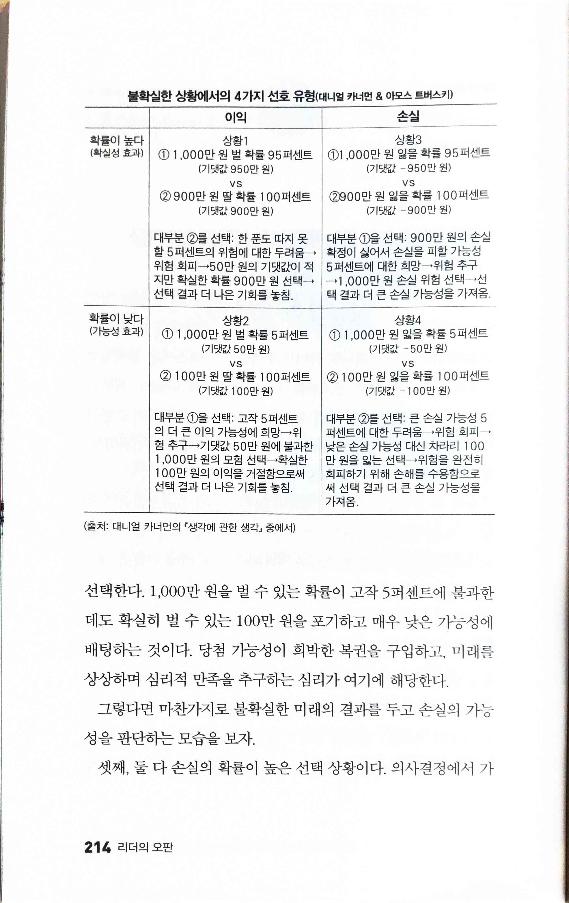

> 불확실한 상황에서의 4가지 선호 유형(대니얼 카너먼 & 아모스트버스키)

> 사람들은 이익이든 손실이든 확률이 높을 때 상대적으로 낮은 확률의 가능성을 지나치게 두려워하거나 극단적인 희망을 품는다. 이것이 `'확실성 효과Certainty effect'`다.
>
> 반면, 사람들은 이익이든 손실이든 확률이 낮을 때 낮은 확률의 가능성을 지나치게 희망적으로 생각하거나 극단적인 불안감을 나타낸다. 바로 `'가능성 효과Posibility effect'`다.

# 리더의 오판 7 우리가 정답을 찾아야 한다: 도대체 왜 의사결정에 집단지성이 필요할까? (의사결정)

## 리더는 정답을 제시하는 사람이 아니다

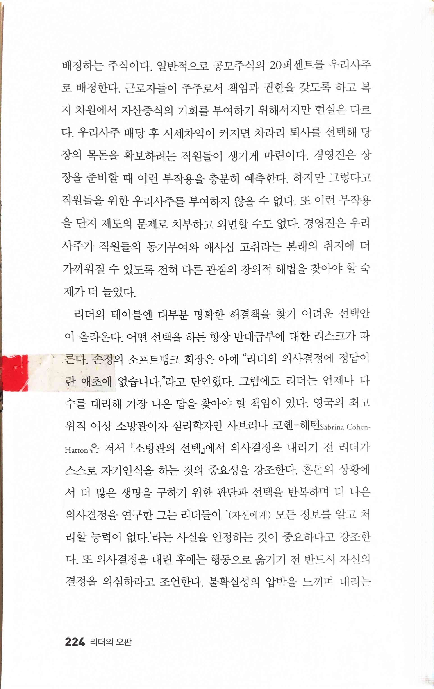

> 리더의 테이블엔 대부분 명확한 해결책을 찾기 어려운 선택안이 올라온다. 어떤 선택을 하든 항상 반대급부에 대한 리스크가 따른다. 손정의 소프트뱅크 회장은 아예 "리더의 의사결정에 정답이란 애초에 없습니다."라고 단언했다. 그럼에도 리더는 언제나 다수를 대리해 가장 나은 답을 찾아야 할 책임이 있다. 영국의 최고위직 여성 소방관이자 심리학자인 사브리나 코헨 - 해턴 Sabrina CohenHatton 은 저서 '소방관의 선택'에서 의사결정을 내리기 전 리더가 스스로 자기인식을 하는 것의 중요성을 강조한다. 혼돈의 상황에서 더 많은 생명을 구하기 위한 판단과 선택을 반복하며 더 나은 의사결정을 연구한 그는 리더들이 (자신에게) 모든 정보를 알고 처리할 능력이 없다.'라는 사실을 인정하는 것이 중요하다고 강조한다. 또 의사결정을 내린 후에는 행동으로 옮기기 전 반드시 자신의 결정을 의심하라고 조언한다. 불확실성의 압박을 느끼며 내리는 판단의 80퍼센트가 본능적 직관의 결정이라는 심리학의 연구결과가 있다. 자신이 생각하는 정답이 보이지 않을 때 잘못된 의사결정을 내릴 가능성은 더 커진다. 의사결정자로서 리더는 완벽한 해답을 찾겠다는 의지보다 최선의 의사결정을 위한 노력에 더 집중해야 한다.

> 리더는 항상 단점이 없는 최고의 선택을 하려고 한다. 그러나 경영에서 그런 선택은 거의 없다. 오히려 하나를 선택하면 다른 하나는 포기해야 하는 트레이드오프의 상황이 대부분이다. 대표적인 예로서 가격과 품질의 관계를 보자.
* Project의 iron cross나 CAP theorem도 마찬가지인 듯

> 가격경쟁력과 품질경쟁력은 서로 다른 방향으로 움직이는 트레이드오프 관계다. 물론 시장에서는 간혹 트레이드오프에서 벗어나는 상황이 발생하기도 한다. 가령 특정 제품을 사면 그 제품을 소비할 것으로 예상되는 집단(계층)과 자신을 동일시하여 가격이 높아도 구매가 증가하는 `파노플리 효과 Panoplie effect`, 가격이 높아지면 고급제품으로 인식해 오히려 수요가 증가하는 `베블런 효과 Veblen effect`, 그리고 다수의 고객이 특정 상품을 많이 소비한다는 이유로 오히려 해당 상품의 소비를 중단해 수요가 감소하는 `스노브 효과Snob effect`가 그 예다.

> 주얼리 브랜드 티파니 Tiffany는 뛰어난 디자인과 고가의 가격을 바탕으로 한 '희소성' 전략으로 성공했다... 티파니는 약 110달러 수준의 은으로 된 주얼리를 시장에 내놓았다... 명품 시장과 중저가 시장은 트레이드오프 관계다. 그걸 무시하고 상반된 성향의 두 시장을 모두 갖겠다는 전략은 실패할 수밖에 없었다. 티파니는 2020년 10월에 약 20조 원에 루이비통 등 명품 브랜드를 소유한 패션그룹 LVMH에 매각됐다.
>
> 기업의 경영 의사결정에서 이처럼 트레이드오프 관계를 무시하는 사례는 의외로 많다. 세계적인 커피숍 프랜차이즈 기업 스타벅스의 성공 요인은 '양질의 커피'와 브랜드 이미지가 제공하는 '경험'이다. 그런데 1990년대 말부터 2000년대 초반까지 가격경쟁력 전략을 추진했다... 결국 2008년에 창업자 하워드 슐츠Howard Schultz가 다시 CEO로 복귀하자마자 슈퍼마켓 내 매장을 폐쇄하고 원래의 품질경쟁력 전략으로 돌아갔다. 경영진이 트레이드오프 관계를 무시하고 비즈니스 방향을 제시할 때 결과는 대부분 실패한다.
>
> 물론 트레이드오프 관계가 깨진 적도 있다. 1980년대 기술력으로 무장한 일본 자동차와 가전기업들이 가격과 품질경쟁력을 모두 능가하는 아웃페이싱Outpacing 전략으로 미국 시장을 점령했다... 그러나 완벽한 전략으로 보이는 아웃페이싱은 시간이 흐르면서 분명한 한계... 하버드대 경영대학원 마이클 포터 Michael Porter 교수는 "지속 가능한 전략은 트레이드오프가 고려돼야 한다."라고 강조한다. 비즈니스 전략은 수년에 걸쳐 지속되는 의사결정이다. 경쟁사의 장점이 주목받을 때마다 보완하고 새로운 트랜드가 시작될 때마다 덧붙여 반영하는 방식으로 모두 놓치지 않겠다.'라는 전략은 반드시 실패한다.

> 의사결정에서 트레이드오프를 고려하라는 의미는 '할 것'과 '하지 않을 것'을 정하는 것을 의미한다. 하버드대 경영대학원의 문영미 교수의 저서 '디퍼런트』에 소개된 볼보와 아우디의 사례를 보자... 볼보와 아우디가 각각 서로의 강점인 디자인과 안정성을 모두 보완한다면 두 브랜드는 최고의 자동차를 만들 수 있을 것이다. 하지만 볼보와 아우디는 결국 같은 차가 될 수밖에 없다. 이 경우 고객들은 어떤 차를 구매할까? 아마 차별성이 사라졌으니 그중 싼 차를 구매할 것이다. 두 기업이 엄청난 시간과 돈을 투입한 노력은 아무런 의미가 없게 된다.
>
> 경영 의사결정에서 트레이드오프를 극복의 대상이나 양자택일의 딜레마로 인식할 때 전략은 방향을 잃고 엉뚱한 결론을 도출한다. 트레이드오프는 사라질 수 없다. 따라서 관점을 바꿔 접근함으로써 새로운 방향을 찾아야 한다. 더 나은 경영 의사결정이란 선택하고 또 선택하지 않음으로써 지속 가능한 강점을 구축해나가는 과정이어야 한다. 세상에 단점이 없는 최고의 선택은 존재하지 않는다. 단지 한쪽을 포기할 수 있는 용기가 필요할 뿐이다.

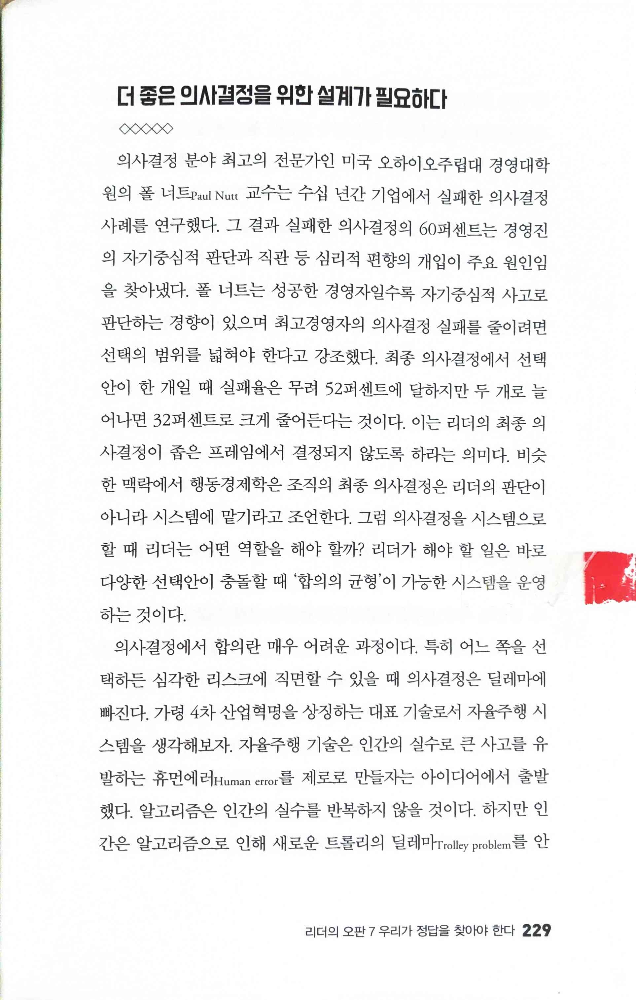

> 의사결정 분야 최고의 전문가인 미국 오하이오주립대 경영대학원의 폴 너트Paul Nutt 교수는 수십 년간 기업에서 실패한 의사결정 사례를 연구했다. 그 결과 실패한 의사결정의 60퍼센트는 경영진의 자기중심적 판단과 직관 등 심리적 편향의 개입이 주요 원인임을 찾아냈다. 폴 너트는 성공한 경영자일수록 자기중심적 사고로 판단하는 경향이 있으며 최고경영자의 의사결정 실패를 줄이려면 선택의 범위를 넓혀야 한다고 강조했다... 그럼 의사결정을 시스템으로 할 때 리더는 어떤 역할을 해야 할까? 리더가 해야 할 일은 바로 다양한 선택안이 충돌할 때 '합의의 균형'이 가능한 시스템을 운영하는 것이다.

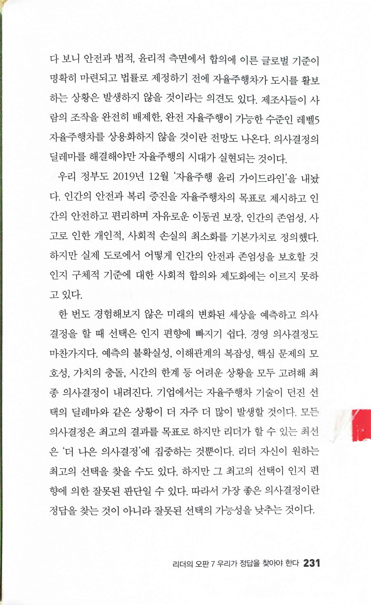

> 한 번도 경험해보지 않은 미래의 변화된 세상을 예측하고 의사결정을 할 때 선택은 인지 편향에 빠지기 쉽다. 경영 의사결정도마찬가지다. 예측의 불확실성, 이해관계의 복잡성, 핵심 문제의 모호성, 가치의 충돌, 시간의 한계 등 어려운 상황을 모두 고려해 최종 의사결정이 내려진다. 기업에서는 자율주행차 기술이 던진 선택의 딜레마와 같은 상황이 더 자주 더 많이 발생할 것이다. 모든 의사결정은 최고의 결과를 목표로 하지만 리더가 할 수 있는 최선은 '더 나은 의사결정'에 집중하는 것뿐이다. 리더 자신이 원하는최고의 선택을 찾을 수도 있다. 하지만 그 최고의 선택이 인지 편향에 의한 잘못된 판단일 수 있다. 따라서 가장 좋은 의사결정이란정답을 찾는 것이 아니라 잘못된 선택의 가능성을 낮추는 것이다.

> 집단지성의 시대는 정답을 제시하는 리더가 아니라 더 나은 의사결정을 가능하게 하는 설계자의 능력을 필요로 한다.

## '자신들만의 리그'에서의 의사결정은 비합리적이다

> 존 F. 케네디John F. Kennedy 대통령은 피그만 침공 사건을 '바보 같은 결정'이었다고 자인... 외부와 분리된 '자신들만의 리그'에서 내리는 의사결정은 비합리적 결론에 도달하기 쉽다. 이것이 바로 `집단사고Group think`의 오류다.

> 미국 예일대 심리학자 어빙 재니스Irving Janis는 케네디 대통령과 참모들의 의사결정을 집단사고의 대표적 전형으로 소개했다. 그는 "응집력이 강한 집단의 구성원들이 현실적 판단을 내려야 할 때 만장일치를 추구하는 경향이 있습니다."라고 설명했다. 집단 구성원들이 서로 친밀감을 느끼고 단결력이 강할수록 하나의 합의를 이루려는 욕구가 강해진다. 그들은 집단사고에 반대하는 개인들을 조직 내 '왕따'로 만드는 방식으로 소수의 비판적 견해에 침묵을 강요한다.
>
> 동질적 사고 집단에서는 함께 공유하는 정보와 논리를 쉽게 합리화한다. 개인들이 회의 전에 품고 있었을 의심은 대부분 설득된다. 그리고 끝까지 동조하지 않는 의견들은 스스로 입을 다물거나 철저하게 배척된다. 집단사고를 하는 조직에서 진행되는 토론은 다양한 의견을 토대로 한 창조적 결론에 이르는 게 아니라 하나의 결론을 매우 강력하게 정당화하는 과정이 된다.

> 집단사고에서 의사결정을 내릴 때 자주 드러나는 문제들이 있다. 그중 하나가 바로 리더의 심기에 집중하는 `집단초병 Mindguards` 이 경영진에 포진해 있는 것이다. 그들은 최종 의사결정 과정에서 리더의 잘못된 판단을 지지하는 호위병 역할을 담당한다. 리더는 이런 시스템에서 판단의 오류를 확인할 기회를 얻지 못하며 개인의 편향은 더 증폭된다.

> 사람들은 열정적인 회의를 거쳐 결과를 끌어내면 합리적 결정을했다는 착각에 빠진다. 그러나 그건 알고 보면 단지 합의로 합리화된 착각의 결과일 때가 적지 않다. 자신의 생각이 합리적이라는 자신감에 빠지면 모두의 생각이 자신과 일치할 것으로 착각한다. 바로 잘못된 `합의 효과 False consensus effect`다. 잘못된 합의 효과는 자기의 생각과 판단을 과도하게 일반화해서 남들도 나와 다르지 않을 것으로 생각하는 인지 착각이다. 실제로는 다른 사람의 의견을 알지못하고 살펴보는 노력을 하지 않은 채 '모두 동의하고 있을 것'으로 추측하고 그 기준으로 의사결정을 한다.

> 집단사고는 카리스마형 리더, 특히 전문가 리더를 중심으로 유대감이 강한 조직에서 쉽게 형성된다. 자기 확신이 강한 리더일수록 의사결정 과정에서 자신의 의견을 강력하게 피력한다. 이때 부하직원의 의견은 상대적으로 쉽게 무시한다. 어빙 재니스는 유대감이 강한 조직에서 나타나는 대표적 증상으로 자신이 속한 집단의 판단은 무조건 옳다는 `무오류의 환상 Illusion of invulnerability`, `다수의 견해는 도덕적이라는 믿음 Belief in inherent morality`, `집단적 합리화 과정 Collective rationalization`, `만장일치의 환상 Illusion of unanimity` 과 `동조 압력 Direct pressure on dissenters`, `자기검열 Self-censorship`, `자기보호 Self-appointed mindguards`, 그리고 `외부의 견해에 대해 일치된 저항 Stereotyped views of out-groups`등으로 정리했다. 조직의 방향이 명확하고 구성원들이 충성스러울수록 집단은 새로운 변화를 불편하게 인식한다. 집단사고가 외부의 관점을 배척하고 저항감을 형성함으로써 자신들의 기존 방식을 지키려 한다. 불확실성이 증폭되고 위기감이 고조될수록 리더들은 일사불란하게 마치 한 몸처럼 생각하고 움직이는 응집력을 강조한다. 하지만 실제로 이런 조직은 위기에 매우 취약해 쉽게 몰락의 길을 걷게 된다.

## 의사결정을 하지 말고 시스템을 설계하라

> IBM `이노베이션 잼Innovation Jam`: 세계에서 가장 큰 브레인스토밍 행사, 집단지성Collective intelligence 을 활용한 경영 도구로써 IBM의 혁신 주도
>
> 테슬라의 일론 머스크는 주기적으로 `'피드백 루프Feedback Loop'`를 통해 회사와 제품에 대한 주기적인 의견을 청취해 경영에 반영하고 포상
>
> 레고의 `레고 아이디어Lego Ideas`, GE의 `퍼스트빌드FirstBuild`, 삿포로 맥주의 `호핀 거라지 Hoppin' Garage` 등은 대중의 제안을 적극적으로 수용하고 활용하는 집단지성의 플랫폼

> `집단지성`은 다수의 개체가 서로 협력함으로써 얻게 되는 집단적인 지적 능력을 의미한다. 집단지성 이론은 보통의 이성적 판단을 내릴 수 있는 사람들이 모인 집단이 소수의 똑똑한 전문가보다 더 나은 판단을 할 수 있다는 가정에서 출발한다. 1906년 영국의 유전학자 프랜시스 골턴Francis Galton 가축 품평회

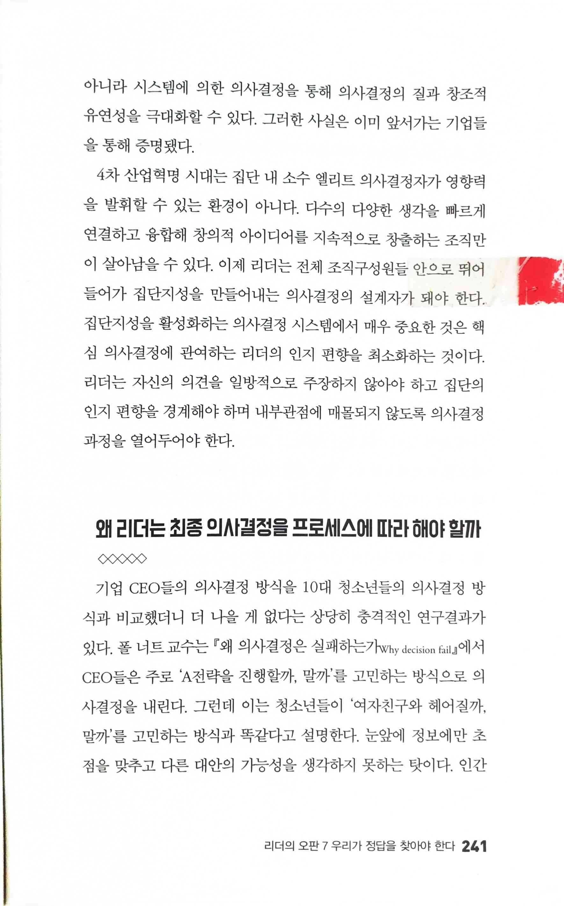

> 리더는 전체 조직구성원들 안으로 뛰어들어가 집단지성을 만들어내는 의사결정의 설계자가 돼야 한다. 집단지성을 활성화하는 의사결정 시스템에서 매우 중요한 것은 핵심 의사결정에 관여하는 리더의 인지 편향을 최소화하는 것이다.리더는 자신의 의견을 일방적으로 주장하지 않아야 하고 집단의인지 편향을 경계해야 하며 내부관점에 매몰되지 않도록 의사결정과정을 열어두어야 한다.
>
> 기업 CEO들의 의사결정 방식을 10대 청소년들의 의사결정 방식과 비교했더니 더 나을 게 없다는 상당히 충격적인 연구결과가 있다. 폴 너트 교수는 '왜 의사결정은 실패하는가Why decision fail'

> 조직행동론 분야의 석학인 스탠퍼드대학교 경영대학원 칩 히스 Chip Heath 교수와 경영 컨설턴트 댄 히스Dan Heath는 '자신있게 결정하라'에서 "리더의 직관보다 프로세스가 6배나 더 강력한 의사결정 도구입니다."라고 강조했다. 외과 의사들이 수술에서 간단한 체크리스트를 활용하는 프로세스를 지키는 것만으로도 오류를 엄청나게 줄인 것이 대표적인 예다. 칩 히스와 댄 히스는 의사결정에 필요한 프로세스를 4단계로 정리한다. 1단계 '할까 말까' 고민될 때 여러 선택안을 찾는다. 2단계 반대의견을 개입시켜 대안을 검증한다. 3단계 결정 전 외부관점을 도입해 선택안과 심리적 거리를 둔다. 4단계 선택의 결과에 대한 최악의 시나리오를 함께 고려한다. 그리고 무엇보다 최종 의사결정권을 가진 리더가 마지막 단계에서 확증 편향의 함정에 빠지지 않도록 하는 프로세스가 필요하다. 자신에 대한 믿음이 충만한 리더의 결심에 부하직원이 나서서 반대하는 것은 설사 제도적으로 허용돼 있다고 해도 절대로 쉬운 일이 아니다. 따라서 리더의 의사결정에 가이드 라인을 설정할 필요가 있다. 가령 '시장조사 결과 부정적 의견이 10퍼센트일 때 결정을 재고한다.'라는 조건으로 절대로 넘어서는 안 되는 마지노 선을 회의 프로세스로 설정하는 것이다. 그래야 의사결정이 잘못되었을 때 공식적으로 다시 고려할 것을 요청할 수 있다. 리더 역시 스스로 자신의 결정을 재고할 기회를 가질 수 있다.

> 자신이 속한 집단에서 모든 사람이 "예."라고 할 때 혼자 "아니요."라고 외치려면 매우 큰 용기가 필요하다. 사람들은 자신의 의견과 이에 대한 신념이 분명하지 않을 때, 집단의 요구를 따르려는 심리가 있다. 이를 `동조 효과Conformity effect`라고 한다.
>
> 미국의 심리학자 솔로몬 애시Solomon Asch는 사람들의 동조 성향을 측정하는 간단한 실험을 진행했다... 실험 결과 틀렸다는 것을 알면서도 다수의 선택을 따라서 일부러 오답을 고른 비율이 무려 36.8퍼센트에 달했다... 하지만 집단 내에서 선택하는 상황이 아니라 독립적 환경에서는 99퍼센트의 정답률을 보였다.

> 솔로몬 애시의 실험에서 또 하나 주목할 부분은 '오답을 고를 때는 모두 만장일치로 이루어졌다.'라는 것이다. 다수의 생각은 더 합리적일 것이라는 착각, 바로 만장일치의 환상은 집단사고를 형성하는 매우 큰 동력이다. 하지만 집단 내에서 단 한 명이라도 자신의 의견과 같을 경우, 사람들은 집단의 압력을 거부하고 자신의 의견을 견지했다. 솔로몬 애시의 실험은 소수의 집단에서 이뤄지는 매우 간단한 의사결정에서조차 동조의 압력에서 벗어나기 어렵다는 것을 보여준다. 따라서 리더는 의사결정 시스템에서 '집단의 압력'을 줄이는 특별한 노력을 해야 한다.
>
> 왜 우리는 회의를 할까? 그건 집단지성을 발휘하기 위해서다. 그런데 그 회의가 종종 집단지성 대신 집단사고로 끝날 때가 많다. 그렇게 되지 않으려면 어떻게 해야 할까? 우선 회의 방식부터 점검해야 한다. 가령 브레인스토밍은 집단지성을 활용하는 대표적인 회의 기법이지만 영향력이 있는 한두 사람의 의견에 쏠림 현상이 발생하기 쉽다. 브레인스토밍의 장점을 살리면서 단점을 보완할 해법으로 1968년 독일 마케팅 전문가 베른트 로르바흐Bernd Rohrbach가 고안한 `브레인라이팅 Brainwriting`은 좋은 아이디어가 될 수 있다.

> 브레인라이팅은 말 대신 글로 하는 브레인스토밍이다. 회의 참가자들이 무기명으로 각자 의견을 적고 다음 사람이 그 아이디어에 생각을 덧붙여 적는 방식으로 참가자들이 협력해 아이디어를 발전시키고 회의를 마칠 때 전원 평가로 결론을 채택한다. 브레인 라이팅은 특정 개인의 지배적 영향력을 줄이는 장점이 있다. 카리스마 넘치는 팀장의 의견에 동조하는 효과를 차단할 수 있고 다소 수동적인 팀원의 의견도 고르게 참여시켜 다양성을 확보할 수 있다. 미국 노스웨스턴대학교 경영대학원 레이톰슨 Leigh Thomson 교수는 브레인라이팅이 브레인스토밍보다 창의적 아이디어를 40퍼센트나 더 생산할 수 있다고 강조한다. 최근 몇 년 사이 국내 기업에서 회의 전 어젠다를 미리 공유하고 의견을 미리 적어내도록 하는 회의문화가 확산되고 있다. 사전에 독립적 의견들을 있는 그대로 공유함으로써 동조 압력을 줄이려는 의도다.
>
> 소수 전문가에 의존한 의사결정은 빠르다. 반면 다양한 의견을 공유하고 논의하는 과정은 그보다 시간이 더 걸린다. 사람들은 뭐든 빨리 결정을 내리려는 습성이 있다. 그리고 이런 욕구는 집단지성 대신 집단사고의 유혹에 쉽게 빠지게 된다. 집단지성은 각 구성원의 아이디어가 자유롭게 표출되고 인정받는 합의 문화에서 활성화된다. 동조 효과는 인지 편향이며 의도적으로 노력하지 않으면 막기 어렵다. 집단지성의 의사결정 도구로서 제 역할을 다하는 회의는 생각이 아니라 구체적인 제도화를 통해서만 가능하다.

## 모른다는 사실도 모르는 것을 어떻게 알까

> 가톨릭교회는 성인을 시성하기 전 후보자가 성인의 반열에 오를 만한지 매우 엄격하게 조사한다. 그런데 후보자들은 평소 교회에서 매우 존경받는 사람들이기 때문에 조사관들도 후보자 개인에게 우호적인 감정을 갖는 경우가 많다. 교황청은 조사관들이 자기도 모르게 편향된 결론을 내릴 위험을 예방하기 위해 `'데블스 애드버컷Devil's advocate'`이라는 제도를 만들었다. 데블스 애드버킷은 검증과정에서 정말 '악마의 대변자'로 보일 만큼 후보자의 작은 결함까지 찾아내고 집요하게 의혹을 제기한다. 이 혹독한 관문을 통과해야만 성인의 칭호를 받는다.
>
> ... 집단 내 주류는 자신들과 다른 의견에 비우호적이기 때문에 소수의견은 잘 드러나지 않는다. 데블스 애드버킷은 의사결정 과정에서 의도적으로 반대의 목소리를 내도록 제도화하는 것이다. 무엇이 문제인지, 왜 문제인지도 몰랐던 위험 요소를 미리 찾아내기 위해서는 사고의 프레임을 반대로 전환해야 한다.

> 인지과학자 게리 클라인Gary Klein이 고안한 `'사전부검Premortem'`은 사람이 죽은 후 사망의 원인을 알 수 없을 때 시체를 검시해서 이유를 찾는 사후검시 Postmortem를 응용한 회의 방법이다. 조직에서 활용할 수 있는 데블스 애드버컷의 대표적 예다. 실패 후 원인을 찾는 사후검시의 방식이 아니라 중요한 안건을 최종 결정하기 전 이해관계자들이 모여 미래 발생할 실패의 요인을 찾는 것이다. 실패의 관점으로 프레임을 설정해 `'모른다는 것도 모르는 Unknown unknowns'` 위험성을 찾는 게 주요 목적이다.

> 의사결정 전 위기 분석을 통해 위험을 예측하는 전통적인 기법으로는 `몬테카를로 시뮬레이션Monte Carlo Simulation`이 있다. 시나리오별로 복수의 의사결정안을 만들고 각각의 성공과 위험, 이익과 손실의 확률을 계산해서 최적의 안을 만드는 것을 말한다... 다만, 정확도를 높이기 위해서는 상당한 규모의 데이터가 필요하다. 최근에는 인공지능을 활용한 몬테카를로 시뮬레이션이 확산되는 추세다.
>
> ... 기업들은 이 과정을 외부 전문가 그룹의 컨설팅에 의존한다. 하지만 직접 계획에 참여하고 책임을 지는 위치에 있지 않은 사람의 실패점검과 위기관리는 큰 효과를 거두기 어렵다. 경영학자 나심 탈레브Nassim Taleb는 "전문가라 할지라도 직접 경험해보지 않고 추정으로 판단한 의견은 그저 의미 없는 말에 불과할 뿐입니다."라며 책임질 위치에 있지 않은 전문가의 견해는 오히려 계획을 더 위험한 방향으로 유도할 수 있다고 지적한다.
* 앞서는 사외 전문가 그룹을 이야기했는데 이번에는 또 이런 의견을 제시하면 외부 전문가 그룹의 이야기를 어떻게 들어야 하는걸까? 결국 결정권자의 판단에 의존할 수 밖에 없지만 시스템적으로 판단할 수 있는 방법을 만들고 준수해야 한다는 뜻일까?
> 조직에서 방어적, 보수적, 소극적 위기관리 관행을 극복하려면 예산, 조직, 운영 효율 등 현실과 타협할 수밖에 없는 순간에 "과연 이것이 최선인가?" 하고 끊임없이 문제를 제기하는 반대의 목소리가 의사결정 시스템으로 제도화돼야 한다. 하지만 제도 자체는 힘을 발휘하지 못한다... 제도는 지속적 관심으로 생명력을 얻는다. 최고 의사결정자가 주도적으로 점검하고 추진하지 않는 시스템은 조직에 뿌리내리지 못하고 결국 유명무실해지는 과정을 거쳐 소멸된다.

> `제로 그래비티 싱커Zero gravity thinker`는 조직과 이해관계가 없는 객관적 견해를 가진 사람. 기업 컨설턴트 신시아 바튼 레이브Cynthia Barton Rabe가 저서 '이노베이션 킬러'에서 소개한 개념. 의도적으로 중립적이고 전문적이지 않은 사람을 의사결정에 개입시켜 기존의 프레임에서 벗어나도록 유도하는 경영 기법

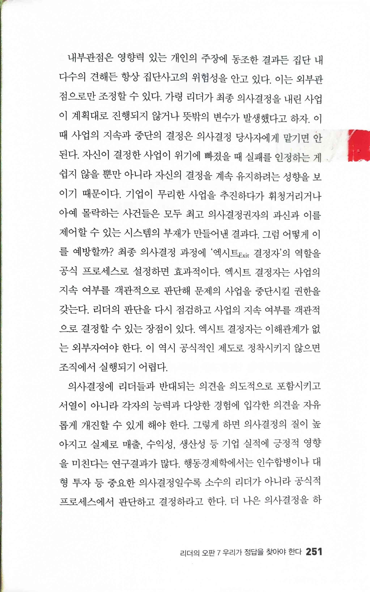

> 내부관점은 영향력 있는 개인의 주장에 동조한 결과는 집단 내다수의 견해든 항상 집단사고의 위험성을 안고 있다. 이는 외부관점으로만 조정할 수 있다... 어떻게 이를 예방할까? 최종 의사결정 과정에 '엑시트Exit 결정자'의 역할을 공식 프로세스로 설정하면 효과적이다. 엑시트 결정자는 사업의 지속 여부를 객관적으로 판단해 문제의 사업을 중단시킬 권한을 갖는다.
>
> 의사결정에 리더들과 반대되는 의견을 의도적으로 포함시키고 서열이 아니라 각자의 능력과 다양한 경험에 입각한 의견을 자유롭게 개진할 수 있게 해야 한다... 하지만 전략은 실행되지 않으면 결과도 없다. 누가 실행을 할 것인가? 결국 리더의 의지가 중요하다.

## 질문과 경청은 덕목이 아니라 시스템이다

> 기업의 회의는 조직문화의 꽃이다. 회의는 조직의 핵심 자원을 결집하는 활동이며 집단지성의 역량을 최대화하는 자리다. 기업의 회의를 보면 집단의 커뮤니케이션 수준과 의사결정의 질을 가늠할 수 있다.

> 왜 회의문화가 바뀌지 않는 걸까? 이유는 간단하다. 매번 회의 기법만 바꾸기 때문이다. 회의는 문화다. 문화를 바꾸려면 시스템의 변화가 필요하고 시스템을 바꾸려면 리더의 사고부터 바꿔야 한다.
>
> 리더가 직원들의 말을 잘 듣지 않는 것은 인지 편향의 영향이 크다. 과거의 성공 경험에 사로잡힌 리더들이 다른 사람, 특히 부하직원의 생각에 귀기울이는 일은 쉽지 않다. 새로운 생각이 불편한 탓이다. 대신 과거와 현재의 패러다임에 근거한 해석, 즉 잘 알고 있고 잘 알고 있다고 믿는 정보에 가중치를 둔다. 바로 `자신감 착각Illusion of confidence`과 `지식 착각`의 자연스러운 모습이다.

> 조직에서 실권이 있는 리더일수록 타인의 생각을 경청하지 않는다. 권한이 클수록 과신을 경계할 필요성도 느끼지 않는다. 주요의사결정에서 통계적 관점으로 타당성을 따지는 수고를 간과하고 때론 전문가의 조언도 쉽게 무시한다. 여기에 설사 잘못된 의사결정을 해도 권력의 크기에 따라 징계의 수위가 달라지는 불합리성도 리더의 과신을 부추기는 요소다.

> 리더들이 회의에서 "경청하겠습니다."라고 공언하지만 실제로는 말을 가장 많이 한다. 리더가 입을 다물면 다른 회의 참가자들은 더 많은 얘기를 할 수 있다. 하지만 권위적이고 카리스마 있는 리더의 입을 다물게 할 구성원은 없다. 지위가 높은 리더의 경청은 개인의 선택이 아니라 공식적인 시스템이어야 한다. 리더가 회의에서 권한을 내려놓고 뒤로 한발 물러서서 경청자의 역할을 하도록 제도화하는 것이다.
>
> "그 누구도 지휘권을 갖지 않는다."
>
> 픽사애니메이션스튜디오의 공동창업자이자 CEO인 에드 캣멀 Ed Catmul이 밝힌 픽사의 대표적 회의 시스템 `'브레인 트러스트Brain Trust'`의 핵심 원칙이다. 전원 참석 회의에서 구성원들은 눈치 보지 않고 솔직하게 비판하고 자신의 아이디어를 제시한다. 조직에서 어떻게 이런 회의가 가능할까? 바로 리더가 스스로 권한을 내려놓았기 때문이다.

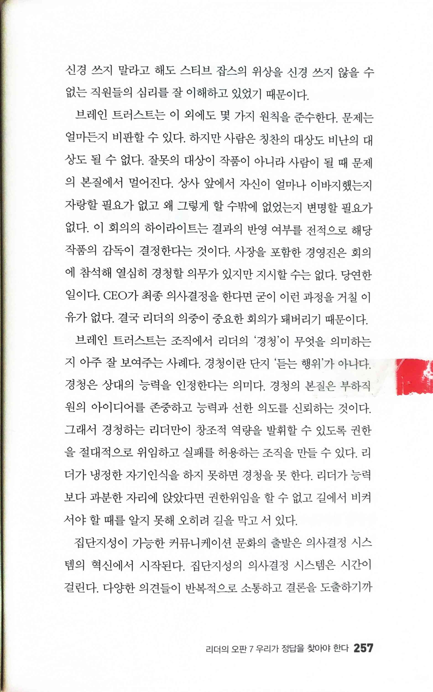

> 브레인 트러스트는 이 외에도 몇 가지 원칙을 준수한다. 문제는 얼마든지 비판할 수 있다. 하지만 사람은 칭찬의 대상도 비난의 대상도 될 수 없다. 잘못의 대상이 작품이 아니라 사람이 될 때 문제의 본질에서 멀어진다.
>
> 브레인 트러스트는 조직에서 리더의 '경청'이 무엇을 의미하는지 아주 잘 보여주는 사례다. 경청이란 단지 '듣는 행위'가 아니다. 경청은 상대의 능력을 인정한다는 의미다. 경청의 본질은 부하직원의 아이디어를 존중하고 능력과 선한 의도를 신뢰하는 것이다. 그래서 경청하는 리더만이 창조적 역량을 발휘할 수 있도록 권한을 절대적으로 위임하고 실패를 허용하는 조직을 만들 수 있다. 리더가 냉정한 자기인식을 하지 못하면 경청을 못 한다. 리더가 능력보다 과분한 자리에 앉았다면 권한위임을 할 수 없고 길에서 비켜서야 할 때를 알지 못해 오히려 길을 막고 서 있다.

> 2017년 세계경제포럼의 클라우스 슈밥Klaus Schwab 회장은 4차 산업혁명 시대를 준비하는 리더의 지도력으로 `'시스템 리더십system leadership'`이라는 개념을 소개했다. 시스템 리더십이란 수평적 시각에서 시스템과 조직 전체를 이해하고 구성원들이 창의력, 다양성, 잠재력을 발현하도록 조직을 이끌어가는 것을 말한다. 즉 일방적인 톱다운 Top down 형식의 리더십이 아니라 모든 이해관계자의 협력을 통해 변화를 주도하는 원동력으로서 집단적 리더십을 말한다. 이는 반드시 의사결정자로서 권한을 분배하는 용기를 필요로 한다. 현대 조직의 리더들에게 주어진 최우선의 책무는 다양한 주체들이 소통하고 협력하는 거버넌스로서 의사결정 시스템을 설계하는 것이다.

## 어떻게 남성 위주의 조직문화에서 여성의 능력을 끌어낼 것인가

> 조직구성원의 다양성이 성과를 좌우한다는 사실은 이미 많은 경영학의 연구에서 밝혀진 사실이다.
* 조직 문화에 맞는 사람을 채용하는 것과 주직 구성원의 다양성을 확보하는 건 서로 다른 이야기이겠지?
> MIT 경영대학원의 교수이자 MIT 조직과학센터 설립자인 토머스 말론Thomas W. Malon 은 집단지성의 지능이 높은 조직은 구성원 개인의 지능보다 더 중요한 세 가지 특징이 있다고 말했다. 첫째는 구성원의 `평균적 사회감수성Average social perceptiveness`이다. 가령 사람의 눈과 표정을 보는 것만으로도 감정 상태를 알아맞히는 실험에서 정답을 맞힌 사람이 많이 포함된 집단일수록 성과가 더 높았다고 한다. 둘째는 균등한 대화의 기회다. 조직에서 구성원 모두에게 대화의 기회가 균등하게 보장될수록 조직 집단의 지능이 높은 것으로 나타났다. 반면 역량이 매우 뛰어난 개인이 막강한 권한을 휘두르는 집단은 성과도 별 볼 일 없었다. 마지막 셋째는 바로 구성원 중 여성의 비중이다. 토머스 말론은 여성이 많이 속해 있는 집단일수록 성과가 우수했고 여성의 수와 집단지성은 정비례한다는 연구결과를 강조했다.

> 남성과 여성에게 동등한 학습과 경험의 기회를 제공하는 시스템을 구축함으로써 서로 이해하고 존중하는 파트너십을 조직문화로 조성해야 한다. 이것이 새로운 시대가 리더들에게 던지는 숙제다.

> 남성들이 일하는 방식이다... 다소 무모한 도전정신과 실적을 달성하려는 집념은 기업의 성과로 연결된다.
>
> 여성은 남성보다 위험 회피 성향이 강해서 행동 편향의 문제는 상대적으로 적다. 하지만 반대로 '마땅히 행동해야 할 때 하지 않는' 부작위 편향에 빠지기 쉽다. 이런 성향으로 인해 일이 계획보다 늦어지거나 생산성 차질로 이어지는 경우가 있다.
>
> 행동 편향의 행동주의적 성향과 부작위 편향의 위험 회피 성향이 각자 강화되면 조직문화를 망친다. 그러나 남성의 행동주의적 태도와 여성의 신중함이 서로 균형추를 맞춘다면 오히려 아주 커다란 시너지 효과를 기대할 수 있다. '신중함과 책임감을 바탕으로 한 도전정신'과 '도전정신을 탑재한 신중함'은 성별이해지능이 뛰어난 집단의 고유 특성이자 특별한 경쟁력이다.

> 미국의 커뮤니케이션 컨설턴트 페기 클라우스Peggy Klaus는 저서 '소프트 스킬'에서 미래 조직이 필요로 하는 능력으로 `소프트 스킬 Soft Skill`을 강조했다. 소프트 스킬이란 참여, 독려, 합의를 추구하고 비전을 중시하는 성향을 말한다. 흔히 여성적 속성이라고 하는 능력이다... 다양성은 곧 창의적 자본이고 위계적 통제보다 참여적 팀워크와 합의를 추구하는 여성의 민주적 의사결정 방식은 기존의 가부장적 조직문화를 변화시킬 수 있는 핵심 동력이다.

# 리더의 오판 8 인간은 이성적 존재다: 도대체 왜 우리는 무지함을 인정하지 못할까? (자기인식)

## 고학력자도 방심하면 동네 아저씨로 전락한다

> 모든 지식과 정보는 수명이 있다.세월이 흐르고 상황이 변하면 확신했던 지식과 정보의 상당 부분은 쓸모없는 수준으로 떨어진다. `무용지식Obsoledge`화되는 것이다.
>
> 미래학자 앨빈 토플러Alvin Toffler가 '부의 미래'에서 처음 소개한 무용 지식은 시대의 변화에 따라 지식으로서 전혀 가치가 없는, 세상에 쓸모가 없어진 지식을 말한다.

> 하버드대학교의 복잡계 물리학자 새뮤얼 아브스만Samuel Arbesman 교수는 저서 '지식의 반감기'에서 "우리는 자신이 알고 있던 지식을 빠르게 버려야 하는 시대에 살고 있습니다. 조금만 게을러지면 고학력자도 동네 아저씨로 쉽게 전락하고 맙니다."라고 경고했다. 변화의 흐름과 같은 속도로 새로운 지식을 꾸준히 업데이트한 경우가 아니라면 리더의 수십 년 경험은 사실 시대에 뒤처진 지식이며 가치도 그만큼 하락했음을 인정해야 한다.

> (막스 플랑크 Max Planck 운전사의 대리 강연 에피소드) '운전자의 지식Chauffeur's knowledge'의 위험성. 운전자란 실제로는 모르는데 마치 아는 것처럼 행동하는 사람을 말한다. 매일 쏟아지는 온갖 정보 중에는 진실도 있고 거짓도 있다. 무엇이 참이고 거짓인지 가려낼 만한 능력은 없지만 자주 보고 듣다 보니 '안다'고 착각하는 것이다.

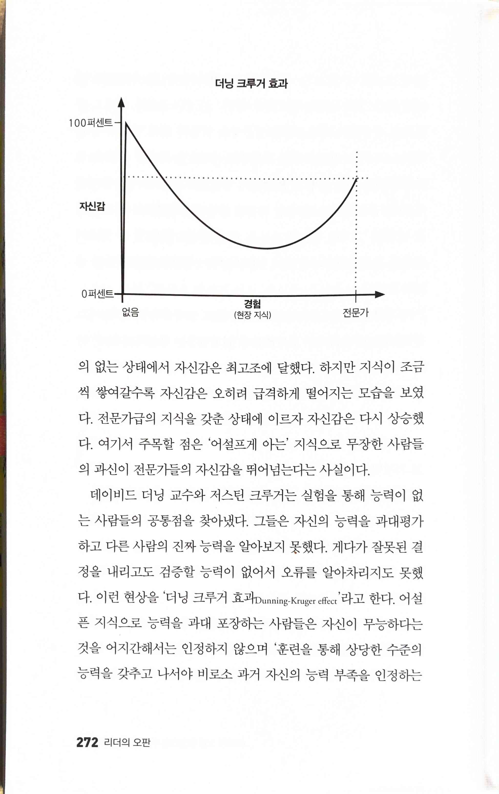

> 데이비드 더닝 교수와 저스틴 크루거는 실험을 통해 능력이 없는 사람들의 공통점을 찾아냈다. 그들은 자신의 능력을 과대평가하고 다른 사람의 진짜 능력을 알아보지 못했다. 게다가 잘못된 결정을 내리고도 검증할 능력이 없어서 오류를 알아차리지도 못했다. 이런 현상을 `'더닝 크루거 효과Dunning-Kruger effect'`라고 한다. 어설픈 지식으로 능력을 과대 포장하는 사람들은 자신이 무능하다는것을 어지간해서는 인정하지 않으며 '훈련을 통해 상당한 수준의능력을 갖추고 나서야 비로소 과거 자신의 능력 부족을 인정하는경향'이 있다. 실제로는 능력이 없지만 능력이 있다고 착각한 의사결정권자들은 집단 전체에 고통을 안겨놓고서도 무엇이 잘못인지 본질을 전혀 이해하지 못한다. 국가, 사회, 기업을 큰 곤경에 빠뜨리는 잘못된 의사결정들이 계속 반복되는 건 리더들이 사실은 어설프게 알고 있는 사안을 잘 안다고 착각'하는 데서 비롯된다.

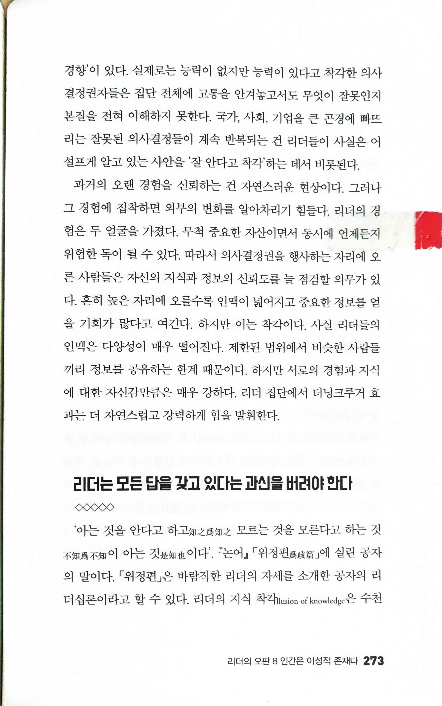

>  리더의 경험은 두 얼굴을 가졌다. 무척 중요한 자산이면서 동시에 언제든지 위험한 독이 될 수 있다. 따라서 의사결정권을 행사하는 자리에 오른 사람들은 자신의 지식과 정보의 신뢰도를 늘 점검할 의무가 있다.
>
> '아는 것을 안다고 하고 모르는 것을 모른다고 하는 것이 아는 것이다. 『논어』 「위정편」에 실린 공자의 말이다. 「위정편은 바람직한 리더의 자세를 소개한 공자의 리더십론이라고 할 수 있다. 리더의 `지식 착각Illusion of knowledge`은 수천년 전에도 매우 경계할 대상이었던 것이 분명하다. 지식 착각은 실제 자신이 알고 있는 수준보다 더 많이 안다는 인지 착각이다. 인간의 기본적 인지 편향 중 하나다. 안다는 착각은 무엇을 모르는지 모르는 상태를 의미한다. 자신의 지식과 능력을 제대로 파악하지 못한 상태에서 강력한 권한을 휘두르는 리더만큼 위험한 존재는 없다.

> 실패 전문가로 불리는 미국 다트머스대학교 터크경영대학원 부학장 시드니 핑켈스타인sydney Finkelstein은 해마다 최악의 CEO를 선정해 발표한다. 그는 저서 '실패에서 배우는 성공의 법칙'에서 실패한 리더들은 한결같이 보통 사람보다 더 부지런하고 청렴하고 외부사항에 민감하게 대응하는 등 뛰어난 점이 있지만 실패한 의사결정에는 '자신의 지식과 경험의 과신'이라는 공통점이 있다고 지적했다. 능력의 한계를 간과한 자기인식의 실패가 의사결정의 실패를 불렀다는 해석이다.
>
> 영국의 심리학자 프레더릭 바틀릿Frederick Bartlett은 생각이란 '증거들 사이에 비어 있는 부분을 메우는 기술'이고 그렇게 생성된 과거 경험의 생생한 이미지들을 마치 진실인 듯 착각하면서 능력의 한계를 뛰어넘는 강한 자신감이 형성된다고 설명한다.

> 2010년 다국적 에너지 기업 브리티시페트롤리엄의 미국 멕시코만 원유 유출 사고. CEO 토니 헤이워드Tony Hayward는 사고 발생 가능성을 미리 알고 있었지만 무시했다. 그는 왜 이런 결정을 내렸을까? 시드니 핑켈스타인은 토니 헤이워드를 최악의 CEO라고 부르며 자신이 기업과 주변 환경을 모두 통제할 수 있다고 믿거나 자신이 모든 답을 갖고 있다고 믿는 과신'을 지적했다. 이 과신의 출발점은 바로 '과거의 성공에 대한 집착'이었다.
>
> 캐나다 토론토대학교의 경영학자 대니 밀러Danny Miller 교수는 성공 요인이 실패 요인으로 반전되는 상황을 `이카루스 패러독스Icarus paradox` 라는 개념으로 설명했다. 그리스 신화 속 인물 이카루스는 천재 발명가이자 건축가인 아버지 다이달로스에게 새의 깃털과 밀랍으로 만든 날개를 받아 하늘을 날게 됐다. 이카루스는 자신감이 충만해져서 태양 가까이 가지 말라는 아버지의 경고를 무시하고 높이 날아올랐다가 그만 날개가 녹아버려서 추락했다. 그가 하늘로 날아오르는 성공을 거둔 이유도 날개 추락한 이유도 날개다. "성공의 적은 성공이다."라는 비즈니스의 격언이 여기서 탄생했다.
>
> '나는 모를 수 있다.'라는 가능성을 인정하는 용기는 성숙한 리더의 기본 자세다.

## 인간은 합리적이지 않고 합리화할 뿐이다

> "인간은 합리적 존재가 아니라 합리화하는 존재입니다." 미국의 사회심리학자 리언 페스팅어 Leon Festinger가 한 말이다. 그가 1950년대에 '인간의 잘못된 믿음(선택)을 합리화하는 비합리성'을 설명하는 `인지부조화Cognitive dissonance` 이론을 발표했을 때 사회적 충격이 매우 컸다. 당시만 해도 사람들은 인간이 합리적으로 사고해 이익을 최대화하는 존재라고 굳게 믿고 있었기 때문이다. 인지부조화란 자기가 알던 지식(믿음)과 상반된 새로운 정보를 받아들여야 할 때 심리적으로 매우 불편해하는 현상을 말한다.
>
> 이때 인간은 심리적 불일치 상태, 즉 인지부조화를 해결하기 위해 자신의 행위를 정당화하는 방향으로 기존의 신념을 바꾸는 선택을 한다. 이 과정이 자기합리화다. 인간은 의사결정에서 자신의 최종 판단이 합리적 사고의 결과라고 믿는다.

> 자신의 선택을 합리화하고 정당화함으로써 인지부조화를 줄이려는 심리로서 `일관성의 법칙Consistency` 이라고 한다. 예를 들어 경마장에서 이미 말에 돈을 베팅한 사람과 같은 말에 베팅하려고 마음먹은 사람 중 누가 더 강하게 확신할까? 이미 돈을 베팅한 사람이다. 일단 결정을 하면 결정의 질과 상관없이 결정 자체에 강한 신뢰를 부여함으로써 자신의 의사결정을 합리화한다. 그건 자신의 판단이 옳은지 그른지 알 수 없어 불안하기 때문이다. 이는 `'결정 후 부조화 Postdecision dissonance'` 현상으로서 인지부조화 심리의 하나다. 인간이 선택 상황에서 인지부조화로 일어나는 불안과 불편을 회피하려는 심리를 가장 많이 연구하는 분야는 역시나 기업의 마케팅 전문가들이다. 그들은 고객이 선택 후 느끼게 될 인지부조화를 재빨리 감소해주는 광고 마케팅 전략을 통해 고객의 선택을 지지하고 합리적 선택이라고 확신하도록 유도하는 데 집중한다.
>
> 심리학자들은 결정을 취소할 수 없는 상황이거나 모든 의사결정을 혼자서 했을 때 인지부조화가 특히 강화된다고 말한다. 가령 리더가 핵심 의사결정권을 독점하면 자신의 결정을 합리화하고 정당화하려는 욕구가 더 강해지는 것이다. 합리적이지 않은 결정을 합리화하려면 필연적으로 선택을 무조건 긍정하는 `선택지원 편향 Choice-supportive bias`과 자신의 생각을 확증하는 증거를 선호하는 확증편향이 작동해 반대의 정보는 아예 회피해버린다. 혹은 자신이 내린 의사결정의 중요성을 오히려 축소시킴으로써 인지부조화를 해결하려는 태도가 나타나기도 한다. 옳은 선택을 견지해야 할 상황에서 타협을 선택한다. 그리고 정당화한 의사결정이 사실은 합리적 판단이었다고 거꾸로 믿는 것이다.
>
> 그럼 어떻게 해야 인지부조화의 덫에 걸리지 않을까? 자신의 판단에서 오류를 찾는 훈련이 필요하다. 물론 뇌에서 일어나는 모든인지 편향은 무의식 현상으로서 훈련으로 완벽하게 함정을 피하기는 어렵다. 그러나 인지 편향과 인지부조화 등 심리가 판단에 개입하는 것이 문제라는 사실을 인식할 때 비판적 사고로 정보를 보고 스스로 판단을 점검하는 게 가능해진다. 결국 아는 것이 힘이다.

> 프레이밍 효과는 인간의 비합리성을 증명하는 대표적 인지편향이다. 인간은 실제의 사실보다 프레임으로 사실을 이해한다. 프레임은 사건과 사실의 관계를 인식하는 생각의 틀이다. 프레임에 따라 사실은 다르게 인식된다. 사람들은 이미 프레이밍된 것을 사실로 받아들이고 진실로 해석한다. e.g. 프로파간다propaganda의 선구자로 불리는 요제프 괴벨스 Joseph Goebbels는 지속적으로 유대인에 대한 부정적 루머, 유대인 대학살. 'MSG는 유해하다.'라고 프레이밍

> 인간은 원래 거짓과 진실을 제대로 판단할 능력이 충분하지 않다는 사실은 `단순노출 효과Mere exposure effect` 와 `진실 착각True illusion` 현상을 통해서도 증명된다. 심리학자 래리 제이코비 Larry Jacoby 논문 '하룻밤 사이에 유명해지다'에서 에서 가상의 낯선 이름을 자주 본 것만으로 자신이 그 사람을 안다고 생각하고 또 유명한 사람으로 착각하는 현상을 소개했다. 요제프 괴벨스는 실제로 "거짓말도 100번 하면 진실이 된다."라는 유명한 말을 남기기도 했다.

> 미국의 센트럴워싱턴대학교의 심리학과 교수 대니엘 폴라그Danielle C. Polage는 논문 「가짜 뉴스가 어떻게 퍼지는가에 대한 연구'에서 우리 뇌가 새로운 정보가 진실인지 아닌지를 판단할 때 두 가지 기준에 따른다고 분석했다. 첫 번째는 기존에 알던 지식과 얼마나 일치하는가 비교해보는 논리적 기준이다. 두 번째는 새로운 정보가 얼마나 익숙한가에 따라 참과 거짓을 판단하는 기준이다. 많이 들어 본 이야기라는 이유로 '사실'이라고 판단하는 건 비합리적이다. 그런데도 논리를 따지는 첫 번째 기준보다 익숙함이 판단에 더 강력한 영향을 미친다.

> 진실 착각을 극복하는 방법은 다른 인지 편향을 극복하는 법과 다르지 않다. 그 첫걸음은 자신이 보고 듣는 것이 사실이 아닐 수 있고 또 인지 편향에 빠졌을 수 있다는 점을 인지하는 것이다. 만약 사실처럼 보이는 주장을 접했는데 그 이유를 정확히 알지 못한다고 해보자. 그럴 땐 잠시 숨을 고르고 근거로 들 만한 사실과 데이터를 찾아내야 한다. 귀찮은 일이지만 원래 진실은 쉽게 파악할 수 없는 법이다.

## 인간은 이성적이지 않고 완벽하지 않다.

> 애플이 자사의 전 제품에 설명서를 넣지 않는 건 '에너지를 써가며 깊게 생각하기 싫어하는 인간의 심리'를 최대한 충족하려는 디자인 철학 때문이다. `인지적 구두쇠Cognitive miser` 이론을 적용한 전략인 셈이다. 1991년 미국의 사회심리학자 수전 피스크susan Fiske와 셸리 테일러 Shelley Taylor는 인간의 사고 시스템을 '인지적 에너지를 아끼도록 프로그램된 인지적 구두쇠'로 정의했다. 인간은 오랜 세월 생존을 위해 시간과 에너지를 최대한 절약하는 방식으로 진화해왔다. 그러다 보니 심사숙고할 때 뇌가 사용하는 에너지를 아끼기 위해 복잡한 문제를 단순화하고 빨리 판단하는 방식으로 사고하게 됐다는 것이다. 인지적 구두쇠 이론의 바탕이다. 이성보다 직관을 먼저 사용해 세상을 이해하는 성급한 판단은 개인의 선택이 아니라 진화를 거쳐 장착된 사고의 디폴트 시스템인 것이다.

> 인간이 사고하는 방식은 두 가지다. 자동으로 생각하는 직관의 방식과 주의 집중해서 사고하는 이성의 방식이다. 심리학자 키스 스타노비치 Keith Stanovich와 리처드 웨스트Richard West는 무의식에서 본능적으로 작동하는 직관의 사고방식을 '시스템1'이라고 하고 의도적인 노력으로만 작동하는 이성의 사고방식을 '시스템2'라고 정의했다.
>
> 시스템1의 장점은 매우 빠르게 판단하는 것이다... 의도적 노력 없이 자동으로 활동하는 시스템1은 동시에 여러 일을 할 수 있다.
>
> 반면 의도적인 노력으로 작동하는 시스템2는 느리다... 시스템2는 여러 가지를 동시에 사고하지 못한다... 시스템2는 오로지 한 가지에 집중한다.
>
> 외부정보를 수용하고 해석할 때 먼저 작동하는 건 직관인 시스템이다. 시스템의 방식으로 답을 찾지 못할 때 비로소 심사숙고하는 이성인 시스템2가 작동한다. 빠르게 움직이는 시스템과 정확한 시스템2가 서로 협력한다면 인간은 늘 합리적인 판단을 할 수 있을 것이다. 그러나 이 둘은 좋은 협력자가 아니다. 시스템이 활동할 때 시스템2는 작동을 멈춘다.
>
> 시스템1 이 '잘 모르면서 마치 아는 것처럼' 결론을 내리는 동안에도 시스템2는 움직이지 않는다. 시스템2는 시스템의 판단에 오류가 없는지 확인할 책임도 미룬다. 너무 게으른 나머지 시스템1의 오류를 어물쩍 '진실'이라고 인정해버린다. 이것이 바로 인지 착각이다. 이때 뇌는 시스템2로부터 '인정'을 받았으므로 나름 심사숙고했다고 믿는다. 합리적 판단으로 착각하는 것이다.

> 이런 비합리적 사고의 과정은 무의식적으로 나타나기 때문에 인간은 스스로 인식하지 못한다. 그러다 보니 무엇이 문제고 왜 문제인지도 깨닫지 못한다. 무엇이든 아는 만큼 생각하고 보이는 게 전부인 시스템1의 판단을 합리적이라고 착각하는 상황은 일상의 모든 순간에 부지불식간 발생한다. 이를 모두 통제하기란 불가능하다. 비합리적 판단과 선택으로 발생하는 작은 실수들은 그저 '인간적'이라는 이름으로 허용하는 것이 오히려 자연스럽다. 하지만 중대한 의사결정의 경우는 다르다...
>
> 인간은 100퍼센트 합리적이지도 않고 100퍼센트 비합리적이지도 않다. 이성을 바탕으로 한 합리적 사고와 직관의 균형을 찾기 어려운 제한적 합리성을 가진 존재일 뿐이다. 인간은 완벽하지 않기에 완벽하게 합리적인 의사결정을 내릴 수 없다. 완벽하지 않은 자신을 인정할 때 돌이킬 수 없는 실수를 그나마 예방할 수 있다. 하지만 인간은 자신이 비합리적이라는 사실을 인정하기가 쉽지 않다.

> 시스템1의 방식은 한마디로 어림짐작인 휴리스틱이다. 복잡한 세상을 빨리 판단해야 하는 사람들은 지름길이 필요하다. 방법은 간단하다. 범주와 유형을 정하고 패턴으로 모델링한 틀에 새로운 정보를 적용하면 쉽다. 세상을 범주화하고 유형으로 정리하는 기술이 휴리스틱이고 패턴화한 판단의 프레임이 바로 편향이다. 편견, 선입견, 고정관념은 휴리스틱과 편향의 산물이다. 인간은 이들 삼총사를 활용함으로써 사고의 시간과 에너지를 절약한다.
>
> 휴리스틱의 가장 일반적인 유형은 대상의 일부 특성으로 그 전체를 판단해버리는 `대표성 휴리스틱Representativeness heuristic`이다. 미국 프린스턴대학교 심리학자 알렉산더 토도로프Alexander Todorov는 2000~2004년 미국의 상하원 선거 데이터의 분석을 토대로 2005년에 '사이언스'에 논문 '외모에 의한 능력 평가와 선거 결과 예측'을 발표했다. 학부생을 대상으로 각 선거구의 당선자와 낙선자 사진을 보여주고 더 유능해 보이는 사람을 고르도록 하고 실제 선거 당선자와 비교했는데 놀랍게도 약 70퍼센트가 일치했다는 내용이다. 이미지 (인상)가 판단(투표)을 좌우할 확률이 매우 높다는 사실이 증명됐다.
>
> 그런데 이는 혹시 미국인만의 특성은 아닐까? 그래서 스위스 로잔대학의 경영학자 존 안토나키스John Antonakis와 올라프 달가스Olaf Dalgas가 2,841명의 스위스인에게 2002년 프랑스 총선 후보자 사진을 보여주고 똑같은 방식으로 실험을 진행했다. 그 결과 역시 70퍼센트 정도의 일치율이 나타났다.

> 휴리스틱의 가장 큰 횡포가 바로 기저율 무시다. 기저율이란 특정 범주에 속하는 사례의 상대적 확률이다. 사전 정보가 전혀 없는 상황에서 추론할 때는 기저율을 고려해야 합리적 판단을 할 수 있다. 하지만 휴리스틱은 통계를 자주 무시한다...
>
> 회상용이성 휴리스틱은 통계를 무시하고 세상을 판단한다. 쉽게 떠오르는 생각을 과대 포장하는 매우 익숙한 사고 방식이다...

> 인구 100만 도시에 감염병이 발생했다고 하자. 이때 '1퍼센트의 사망률'이라는 표현보다 '100만 명 중 1만 명이 사망한다는 표현이 더 큰 공포를 유발한다. 이를 `분모무시의 법칙 Denomination neglect`이라고 한다. 똑같은 내용이지만 '1만 명 사망'이라는 표현은 1퍼센트의 사망률이라는 표현보다 머릿속에서 더 생생하게 묘사된다. 따라서 더 쉽게 감정을 자극하고 행위를 결정하도록 한다.
>
> 감정과 기분도 휴리스틱의 요소다. 좋아하는 정치인의 주장은 일단 신뢰한다. 반면 싫어하는 정치인의 주장은 무조건 반대하고 확증할 만한 정보만 강조한다. 편애하는 직원의 실수는 관용의 대상이고 싫어하는 직원의 아이디어는 실패 가능성이 더 크게 생각된다. 바로 `감정 휴리스틱`이다. 그런가 하면 어떤 순간의 기분이 계속 남아서 다른 판단에 영향을 주기도 한다. 기분이 좋을 때 '좋은 게 좋은 것'이라며 일단 긍정하는 건 `기분 휴리스틱`이다. 기분이 좋을 때는 중요한 의사결정을 하지 말라는 얘기가 있다. 감정과 기분이 판단에 미치는 영향은 우리의 생각보다 훨씬 강력하기 때문이다.

> 휴리스틱은 합리적 판단이 필요하지 않은 상황에서는 빨리 유용하게 사용할 수 있는 사고방식이다. 하지만 인지적 편향이 개입하므로 판단의 오류가 발생하게 된다. 실제로 실패한 경영 의사결정들에는 인지 편향의 문제가 공통으로 발견된다. 의사결정 전문가 존 베시어스 John Beshears 와 프란체스카 지노Francesca Gino는 2015년에 '하버드 비즈니스 리뷰'를 통해 '의사결정 설계자로서 리더'가 의사결정 과정에서 경계해야 할 대표적 인지 편향을 소개했다.
>
> 첫째, 과도하게 낙관적인 의사결정에 개입한 인지 편향이다. 대표적으로 `'낙관주의 편향'`과 `'과신'`이 있다. 낙관주의 편향은 자신의 능력을 과대평가하는 과신의 영향이다. 낙관주의와 과신이 만났을 때 의사결정권자는 과거의 성공을 100퍼센트 자신의 실력 덕분이라고 믿고 운도, 동료들의 공도 인정하지 않는다.
>
> 둘째, 객관적으로 현상을 바라보지 못한 의사결정에 개입하는 인지 편향이다. 자기 신념과 일치하는 정보에 가중치를 부여하는 `'확증 편향'`, 자신의 최초 주장에서 벗어나지 못하는 `'앵커링 효과'`, 만장일치를 선호하는 `'집단사고'`, 자기 관점만 고집하는 지독한 `'자기중심주의'` 등은 사안의 인식과 평가 과정에 흔하게 개입해 부정적인 영향을 미친다.

> 셋째, 제대로 된 대안의 선택을 방해하는 인지 편향이다. 대표적으로 `'손실 회피'`가 있다. 비합리적으로 손실을 과장하는 편향은 이미 써버려 회수할 수 없는 비용에 집착하는 `'매몰비용의 오류'`를 낳는다. 이때 자신의 선택이 잘못돼 실패가 확실해도 고집스럽게 자신의 판단에 집착하는 `'몰입상승 효과 Escalation of commitment'`에 따라 망할 게 뻔한 사업에 더 많은 자원을 투입한다. 이런 무모한 의사결정의 이면에는 자신이 결과를 통제할 능력이 있다고 믿는 `'통제착각'`이 있다. 결과를 통제할 수 있다고 믿기에 자기 행동의 위험성을 무시하는 것이다.
>
> 넷째, 안전주의를 추구하는 인지 편향이다. 현 상태의 유지를 선호하는 `'현상유지 편향'`과 즉각적인 보상의 가치를 지나치게 과대평가하고 장기적 이익의 가치는 과소평가하는 `'현재 편향Present bias'`이 대표적이다. 혁신보다 안전을 우선하는 의사결정을 유도한다. 장기적 계획을 추진하지 못하는 근시안적 경영 의사결정이 반복과타성에 젖은 조직문화가 형성되는 주요 원인이다.
>
> 뮐러리어 도형을 보자. 나란히 그려진 두 선의 길이는 같다. 그런데 한쪽이 분명 길어 보인다... 행동경제학은 인지 편향의 패턴을 기억하라고 강조한다. 자를 가지고 직접 재보듯 여러 편향의 패턴을 활용해 인지 착각을 점검하라는 얘기다. 일단 최종 의사결정을 하기 전에 판단을 의심하고 비슷한 상황의 인지 편향 패턴과 비교하는 간단한 과정을 거쳐보자. 그것만으로도 잘못될 가능성을 조금은 줄일 수 있다.

## 왜 아인슈타인은 죽을 때까지 공부했을까

> 지식이 많을수록 자신이 무엇을 모르는지 비로소 깨닫게 된다. 반면 아는 것이 적을수록 세상에 궁금한 것이 없다. 무엇을 모르는지 모르기 때문이다.
>
> “아는 만큼 보인다."라는 속담은 과학적으로도 증명된 사실이다... 로버트 와일리 Robert Wiley 교수는 2016년 『실험심리학저널Psychonomic Bulletin & Review』에 시험결과를 발표하며 “특정 물체나 분야에 대해 많이 알게 되면 복잡해 보이는 것도 단순 명쾌하게 인지할 수 있습니다."라고 설명했다. 무언가에 대해 깊이 있게 알게 되면 더 많은 관련 정보를 인지할 수 있고 부분적 정보의 중요성까지도 파악할 수 있는 능력으로 확장되는 것이다.

> 미국의 전 국방장관 도널드 럼즈펠드Donald Rumsfeld는 2001년 9.11 테러를 막지 못한 책임의 당사자로 지목돼 비난의 화살을 맞았다. 그러자 도널드 럼즈펠드는 9.11 테러는 자신의 잘못된 판단과 대응에서 비롯된 사건이 아니라는 점을 강조하며 앎과 모름의 4가지 유형을 제시했다.
>
> 첫째, `'안다는 것을 아는 것Known knowns'`이다. 말 그대로 우리가 알고 있는 지식이다. 둘째, `'모른다는 것을 아는 것Known unknowns'`이다. 우리가 무지하다는 사실을 알고 있는 상태를 말한다. 셋째, `'안다는 것을 모르는 것Unknown knowns'`이다. 미처 깨닫지 못한 지식이 여기에 해당한다. 그리고 마지막 넷째, `'모른다는 것을 모르는 것Unknown unknowns'`이다. 우리가 무엇을 모르는지조차 알지 못하거나 혹은 안다고 생각하지만 사실은 모르는 상태를 말한다. 도널드 럼즈펠드는 9.11 테러는 네 번째 유형인 '무엇을 모르는지 모르는 상태'에서 발생한 사건이기에 어떤 대비도 할 수 없었다고 소명한 것이다... 상황을 모두 파악하고 나면 인과관계가 명확해지고 도저히 모를 수가 없는 '뻔한' 사건으로 이해한다. 바로 인지 착각이다. 하지만 사람들은 이를 인정하기 쉽지 않다.

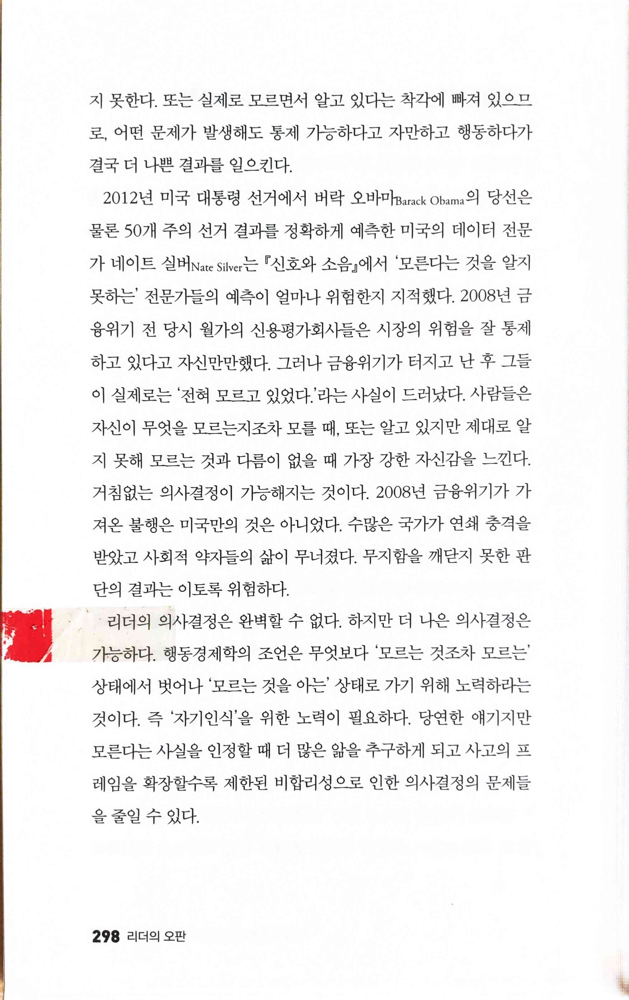

> 리더의 의사결정은 완벽할 수 없다. 하지만 더 나은 의사결정은 가능하다. 행동경제학의 조언은 무엇보다 '모르는 것조차 모르는'상태에서 벗어나 '모르는 것을 아는' 상태로 가기 위해 노력하라는 것이다. 즉 '자기인식'을 위한 노력이 필요하다. 당연한 얘기지만 모른다는 사실을 인정할 때 더 많은 삶을 추구하게 되고 사고의 프레임을 확장할수록 제한된 비합리성으로 인한 의사결정의 문제들을 줄일 수 있다.

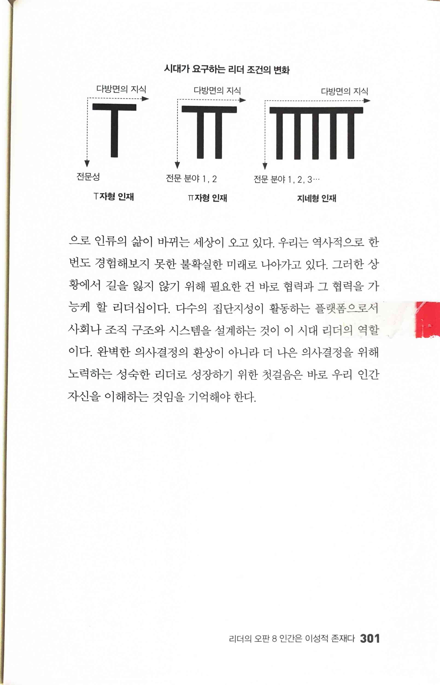

> 다수의 집단지성이 활동하는 플랫폼으로서 사회나 조직 구조와 시스템을 설계하는 것이 이 시대 리더의 역할이다. 완벽한 의사결정의 환상이 아니라 더 나은 의사결정을 위해 노력하는 성숙한 리더로 성장하기 위한 첫걸음은 바로 우리 인간 자신을 이해하는 것임을 기억해야 한다.