# Leading with the Heart 사슴을 이끄는 사자의 리더십

* [The Compassionate Leader Who Leads With The Heart- Is It Good For Business?](https://www.forbes.com/sites/scholleybubenik/2019/02/13/the-compassionate-leader-who-leads-with-the-heart-is-it-good-for-business/)
* NCAA의 전설적인 농구 코치 Coach K 이야기. 농구 감독이지만, 어떤 조직에서도 통용될 수 있는 리더십과 매니지먼트에 대한 이야기를 썼다. 특히 변화하는 환경에 대한 이야기나 1 on 1에 대한 견해는 정말 놀랍다.

## 프리시즌
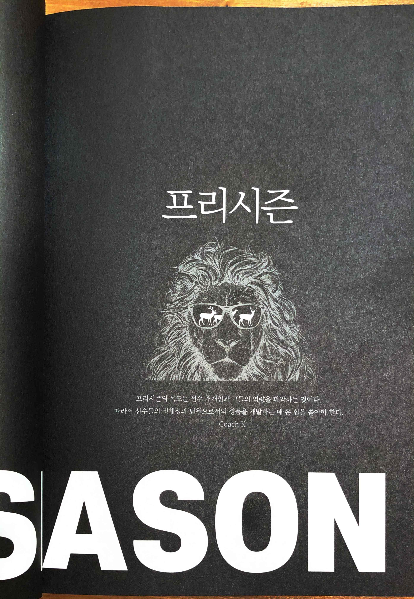

> 프리시즌의 목표는 선수 개개인과 그들의 역량을 파악하는 것이다. 따라서 선수들의 정체성과 팀원으로서의 성품을 개발하는 데 온 힘을 쏟아야 한다. Coach K

### 조직 편성
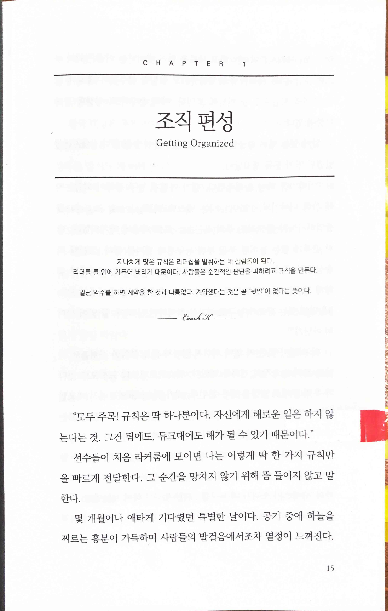

> “모두 주목! 규칙은 딱 하나뿐이다. 자신에게 해로운 일은 하지 않는다는 것. 그건 팀에도, 듀크대에도 해가 될 수 있기 때문이다."

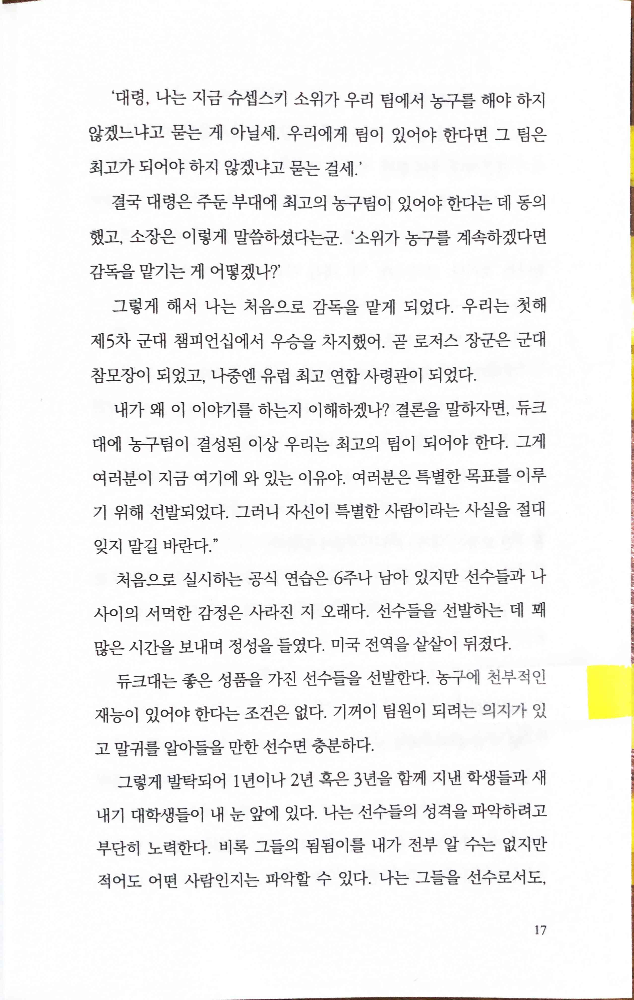

> 듀크대는 좋은 성품을 가진 선수들을 선발한다. 농구에 천부적인 재능이 있어야 한다는 조건은 없다. 기꺼이 팀원이 되려는 의지가 있고 말귀를 알아들을 만한 선수면 충분하다.

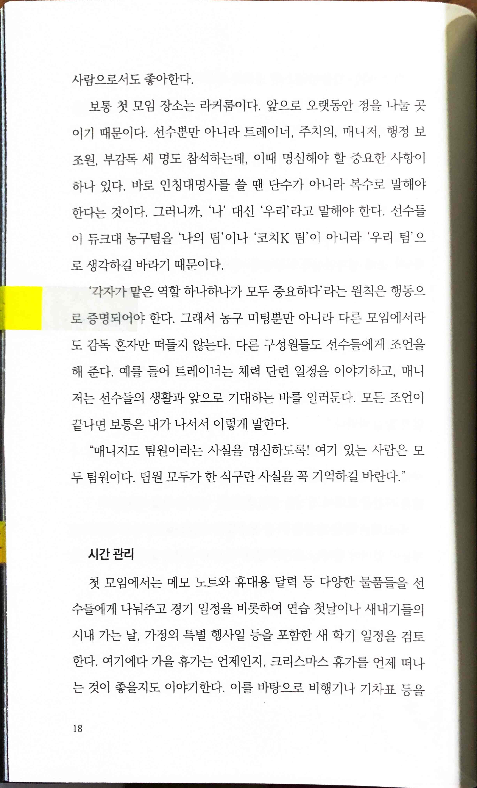

> '각자가 맡은 역할 하나하나가 모두 중요하다'라는 원칙은 행동으로 증명되어야 한다. 그래서 농구 미팅뿐만 아니라 다른 모임에서라도 감독 혼자만 떠들지 않는다. 다른 구성원들도 선수들에게 조언을 해 준다. 예를 들어 트레이너는 체력 단련 일정을 이야기하고, 매니저는 선수들의 생활과 앞으로 기대하는 바를 일러둔다. 모든 조언이 끝나면 보통은 내가 나서서 이렇게 말한다.
>
> "매니저도 팀원이라는 사실을 명심하도록! 여기 있는 사람은 모두 팀원이다. 팀원 모두가 한 식구란 사실을 꼭 기억하길 바란다."

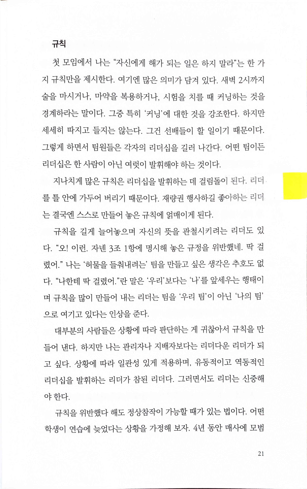

> 지나치게 많은 규칙은 리더십을 발휘하는 데 걸림돌이 된다. 리더를 틀 안에 가두어 버리기 때문이다. 재량권 행사하길 좋아하는 리더는 결국엔 스스로 만들어 놓은 규칙에 얽매이게 된다.

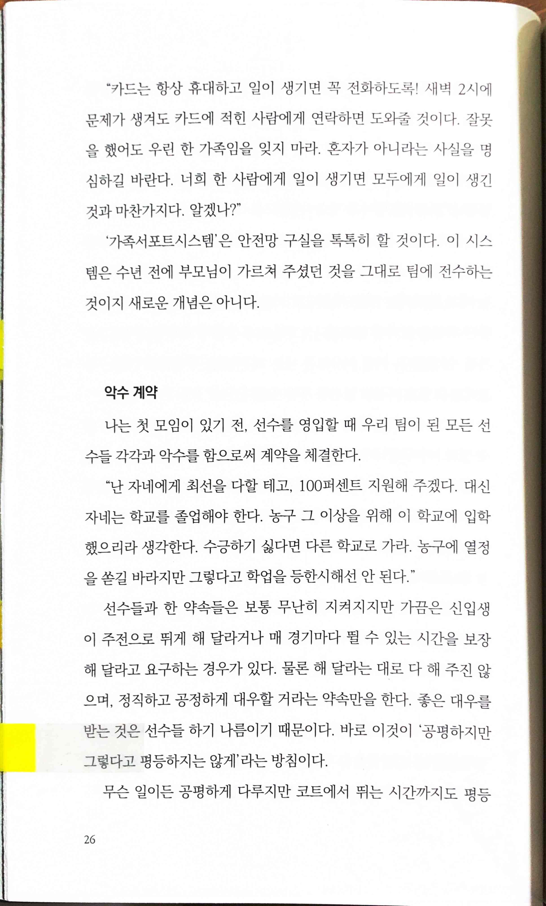

> '공평하지만 그렇다고 평등하지는 않게'

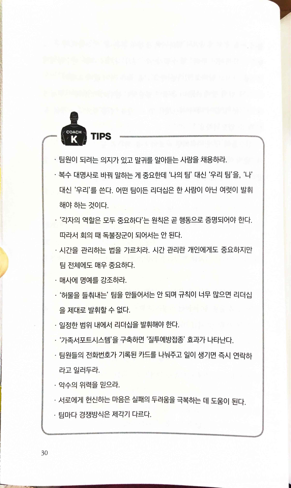

### 팀 조직
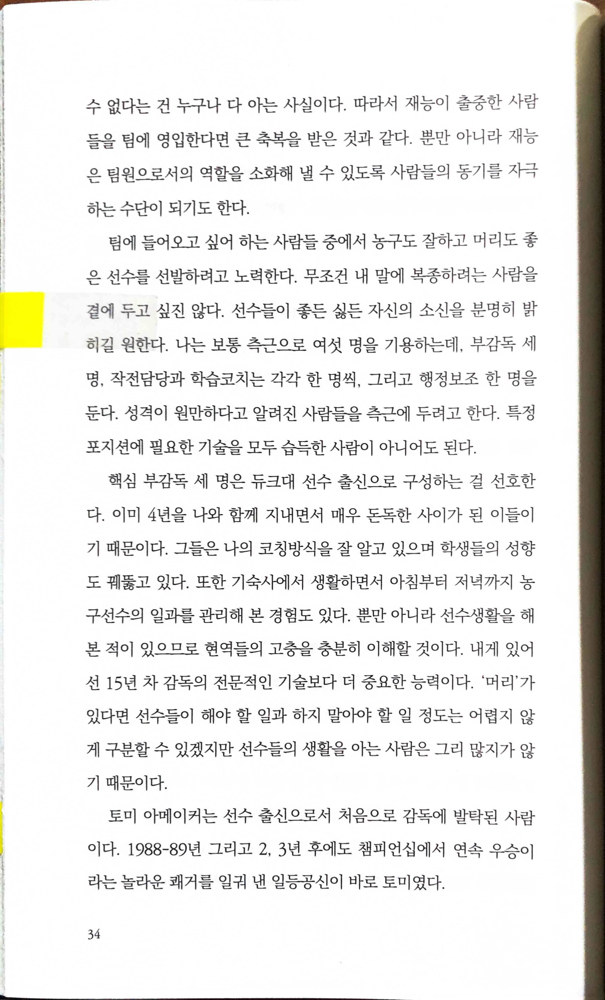

> 무조건 내 말에 복종하려는 사람을 곁에 두고 싶진 않다. 선수들이 좋든 싫든 자신의 소신을 분명히 밝히길 원한다.

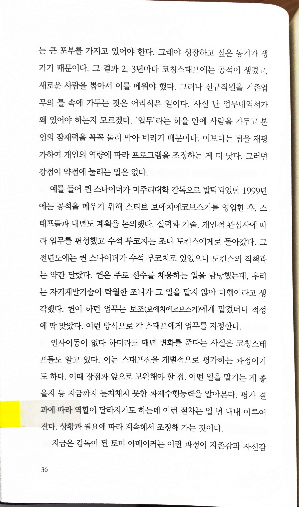

> 평가 결과에 따라 역할이 달라지기도 하는데 이런 절차는 일 년 내내 이루어진다. 상황과 필요에 따라 계속해서 조정해 가는 것이다.

> 리더십은 대체로 인간관계에 따라 성패가 좌우된다. 따라서 어떤 팀이든 서로의 신뢰도가 높으면 협력수준도 높아지기 마련이다. 리더의 역할을 충실히 할 수 있는 유일한 방법은 사람을 이해하는 것이며, 사람을 이해하려면 서로를 잘 알아야만 한다. 나는 팀원들과 허물없이 지낼 수 있기를 희망한다.

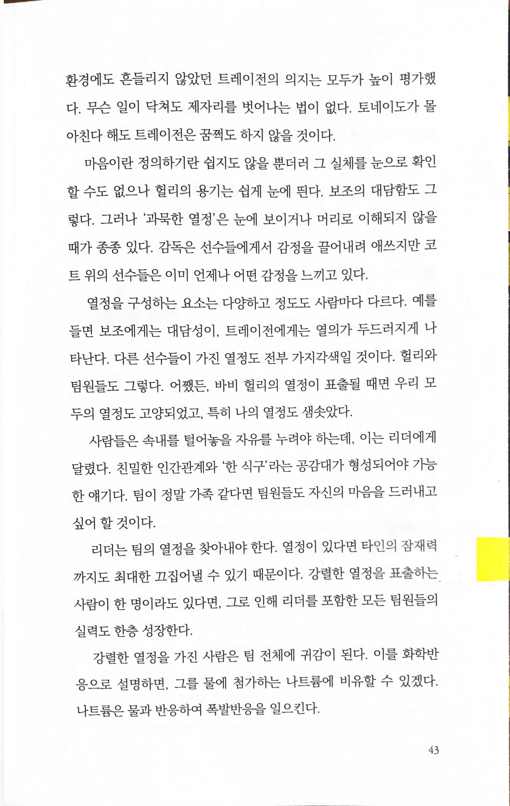

> 리더는 팀의 열정을 찾아내야 한다. 열정이 있다면 타인의 잠재력까지도 최대한 끄집어낼 수 있기 때문이다. 강렬한 열정을 표출하는 사람이 한 명이라도 있다면, 그로 인해 리더를 포함한 모든 팀원들의 실력도 한층 성장한다.

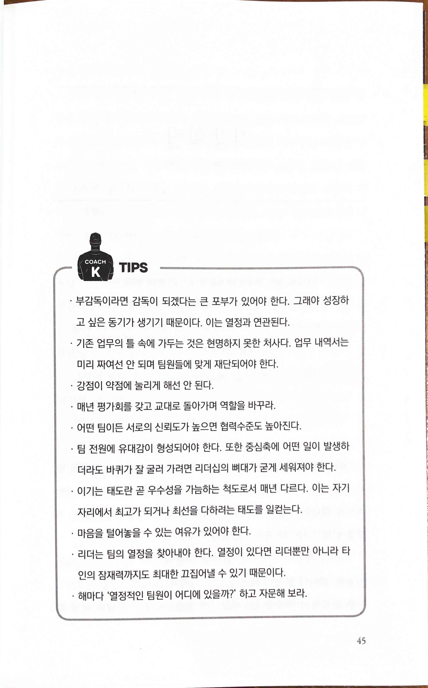

### 기강 확립
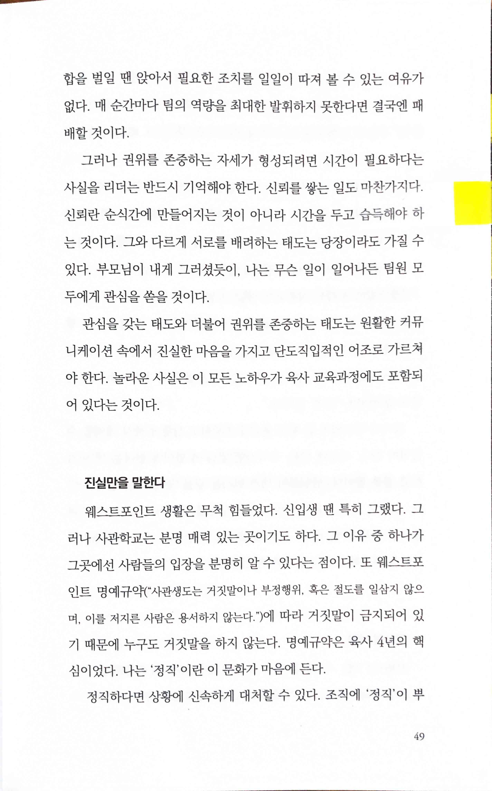

> 권위를 존중하는 자세가 형성되려면 시간이 필요하다는 사실을 리더는 반드시 기억해야 한다. 신뢰를 쌓는 일도 마찬가지다. 신뢰란 순식간에 만들어지는 것이 아니라 시간을 두고 습득해야 하는 것이다. 그와 다르게 서로를 배려하는 태도는 당장이라도 가질 수 있다. 부모님이 내게 그러셨듯이, 나는 무슨 일이 일어나든 팀원 모두에게 관심을 쏟을 것이다.

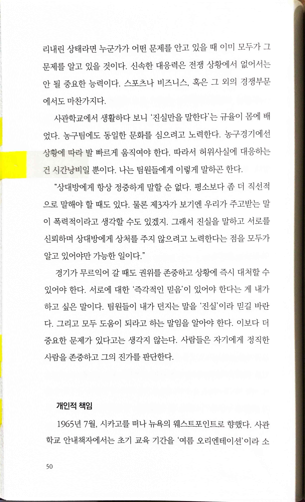

> 허위사실에 대응하는건 시간낭비일 뿐이다.
>
> 서로에 대한 '즉각적인 믿음'이 있어야 한다

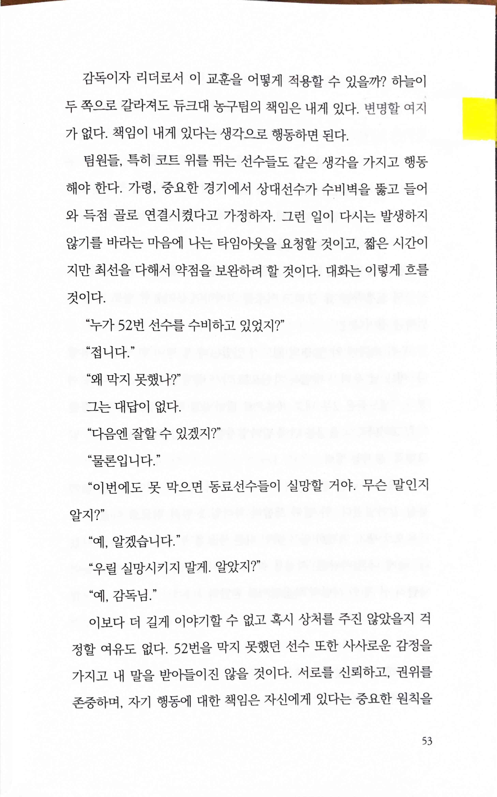

> 하늘이 두 쪽으로 갈라져도 듀크대 농구팀의 책임은 내게 있다. 변명할 여지가 없다. 책임이 내게 있다는 생각으로 행동하면 된다.
>
> 팀원들, 특히 코트 위를 뛰는 선수들도 같은 생각을 가지고 행동해야 한다.

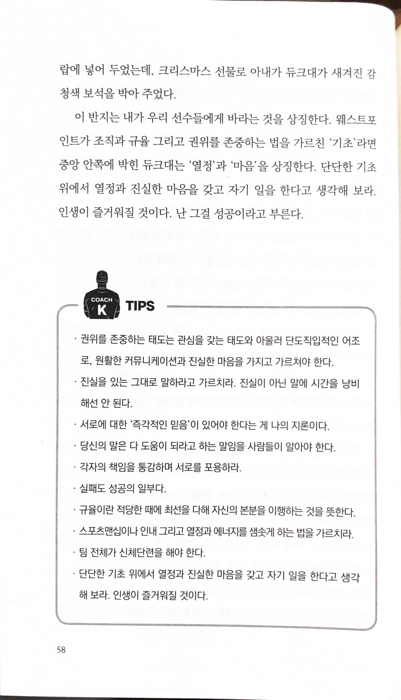

### 역동적인 리더십
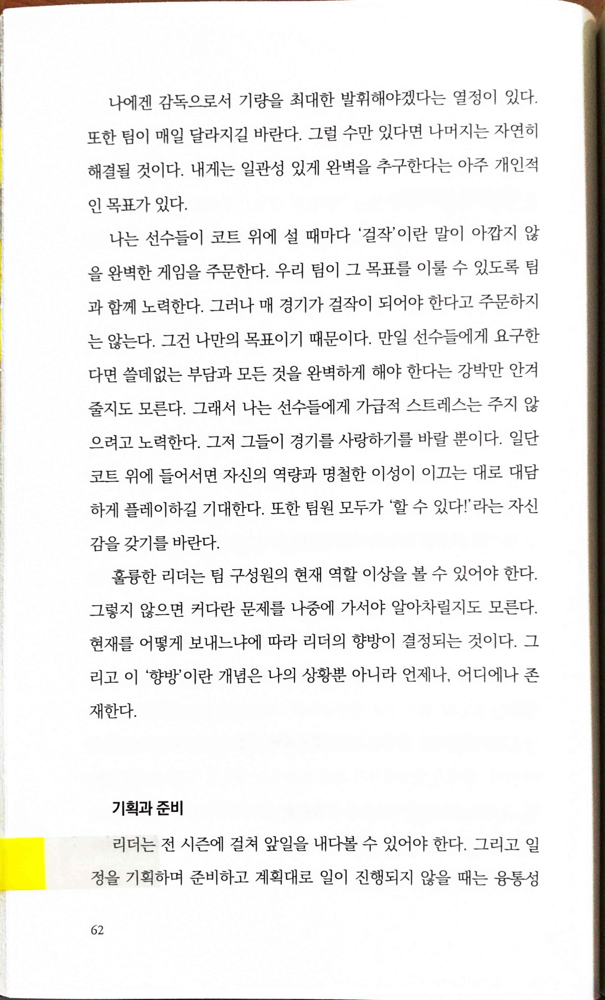 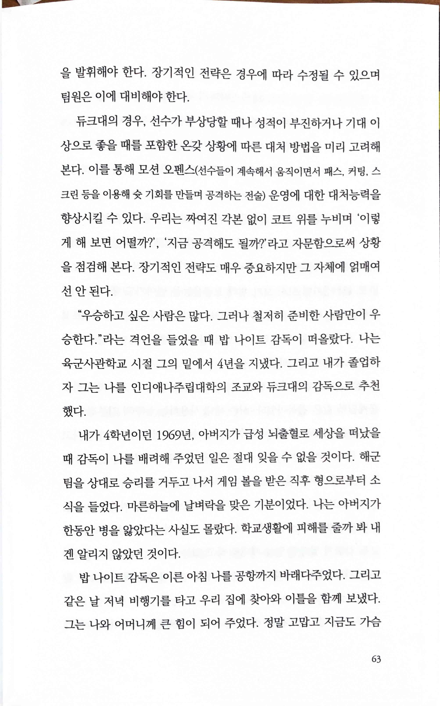

> 리더는 전 시즌에 걸쳐 앞일을 내다볼 수 있어야 한다. 그리고 일정을 기획하며 준비하고 계획대로 일이 진행되지 않을 때는 융통성을 발휘해야 한다. 장기적인 전략은 경우에 따라 수정될 수 있으며 팀원은 이에 대비해야 한다.
>
> "우승하고 싶은 사람은 많다. 그러나 철저히 준비한 사람만이 우승한다."

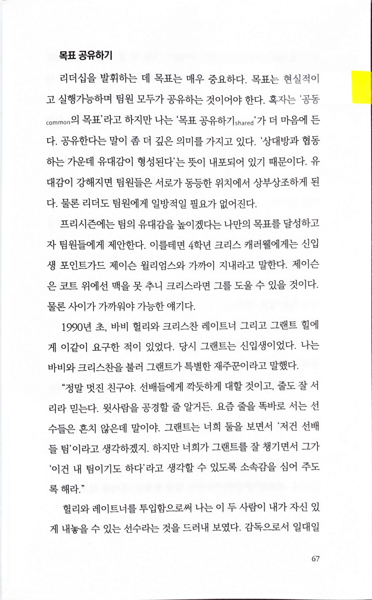

> 리더십을 발휘하는 데 목표는 매우 중요하다. 목표는 현실적이고 실행가능하며 팀원 모두가 공유하는 것이어야 한다. 혹자는 '공동 common의 목표'라고 하지만 나는 '목표 공유하기 shared'가 더 마음에 든다. 공유한다는 말이 좀 더 깊은 의미를 가지고 있다. '상대방과 협동하는 가운데 유대감이 형성된다'는 뜻이 내포되어 있기 때문이다. 유대감이 강해지면 팀원들은 서로가 동등한 위치에서 상부상조하게 된다. 물론 리더도 팀원에게 일방적일 필요가 없어진다.

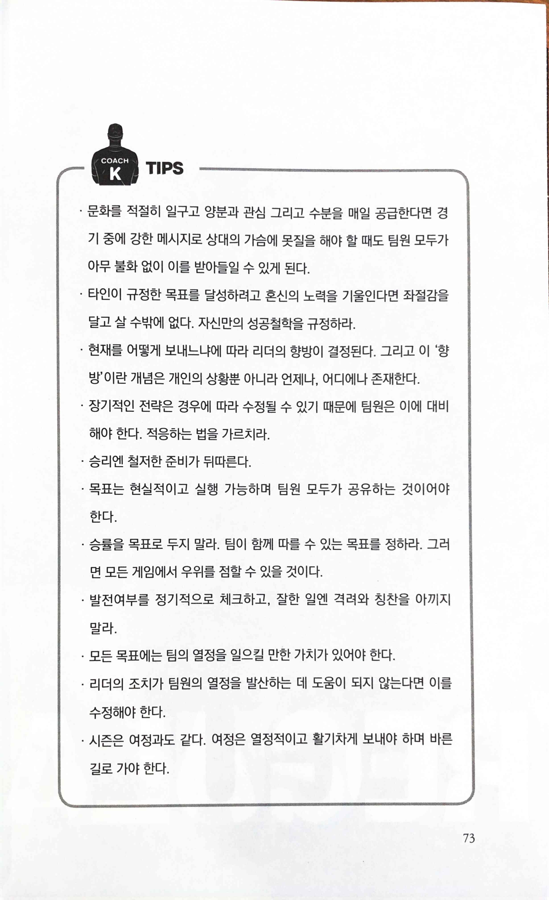

## 레귤러시즌

> 훌륭한 팀이 되려면 커뮤니케이션, 신뢰, 공동책임, 관심 그리고 자존심이라는 근본적인 자질 다섯 가지를 갖춰야 한다. 한 사람 한 사람도 물론 중요하지만 각자가 큰 힘을 발휘하기는 어렵다. 모두를 합쳐 놓아야 비로소 누구도 당할 수 없는 힘을 발휘하게 된다. Coach K

### 팀워크
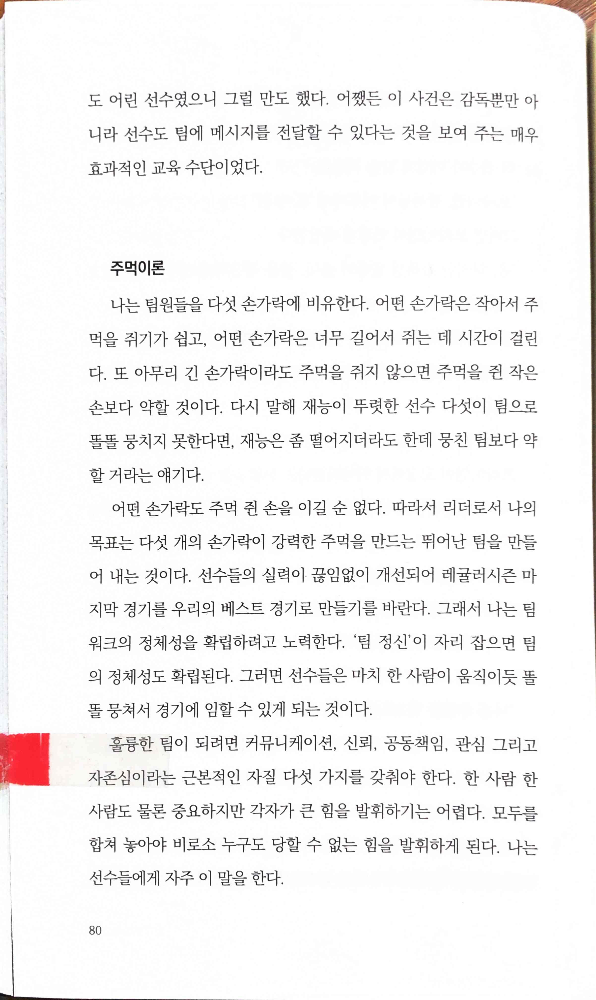

> 훌륭한 팀이 되려면 커뮤니케이션, 신뢰, 공동책임, 관심 그리고 자존심이라는 근본적인 자질 다섯 가지를 갖춰야 한다. 한 사람 한 사람도 물론 중요하지만 각자가 큰 힘을 발휘하기는 어렵다. 모두를 합쳐 놓아야 비로소 누구도 당할 수 없는 힘을 발휘하게 된다.

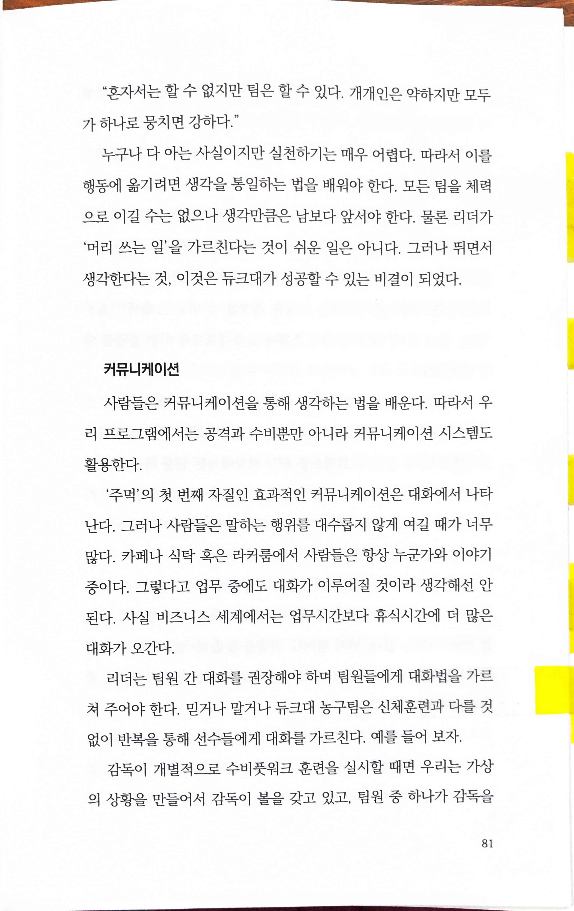

> 리더는 팀원 간 대화를 권장해야 하며 팀원들에게 대화법을 가르쳐 주어야 한다. 믿거나 말거나 듀크대 농구팀은 신체훈련과 다를 것 없이 반복을 통해 선수들에게 대화를 가르친다.

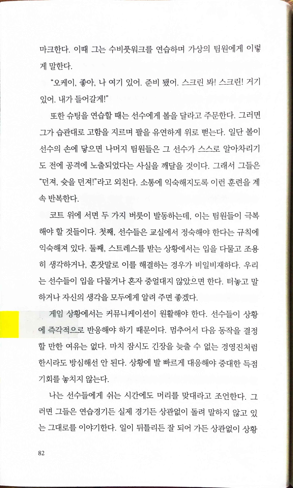

> 게임 상황에서는 커뮤니케이션이 원활해야 한다. 선수들이 상황에 즉각적으로 반응해야 하기 때문이다. 멈추어서 다음 동작을 결정할 만한 여유는 없다. 마치 잠시도 긴장을 늦출 수 없는 경영진처럼 한시라도 방심해선 안 된다. 상황에 발 빠르게 대응해야 중대한 득점기회를 놓치지 않는다.

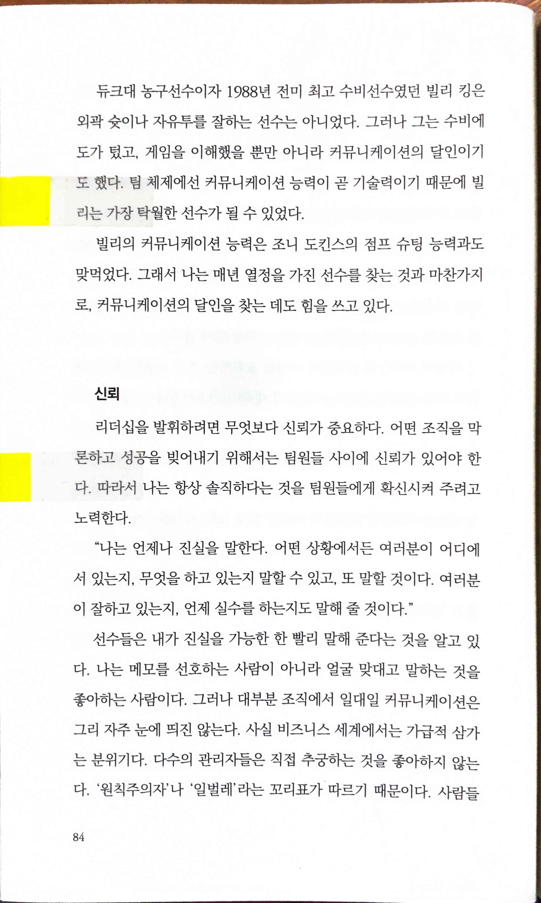

> 팀 체제에선 커뮤니케이션 능력이 곧 기술력
>
> 리더십을 발휘하려면 무엇보다 신뢰가 중요하다. 어떤 조직을 막론하고 성공을 빚어내기 위해서는 팀원들 사이에 신뢰가 있어야 한다. 따라서 나는 항상 솔직하다는 것을 팀원들에게 확신시켜 주려고 노력한다.

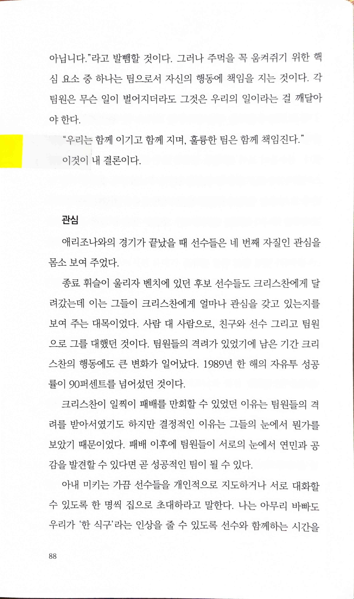

> "우리는 함께 이기고 함께 지며, 훌륭한 팀은 함께 책임진다."

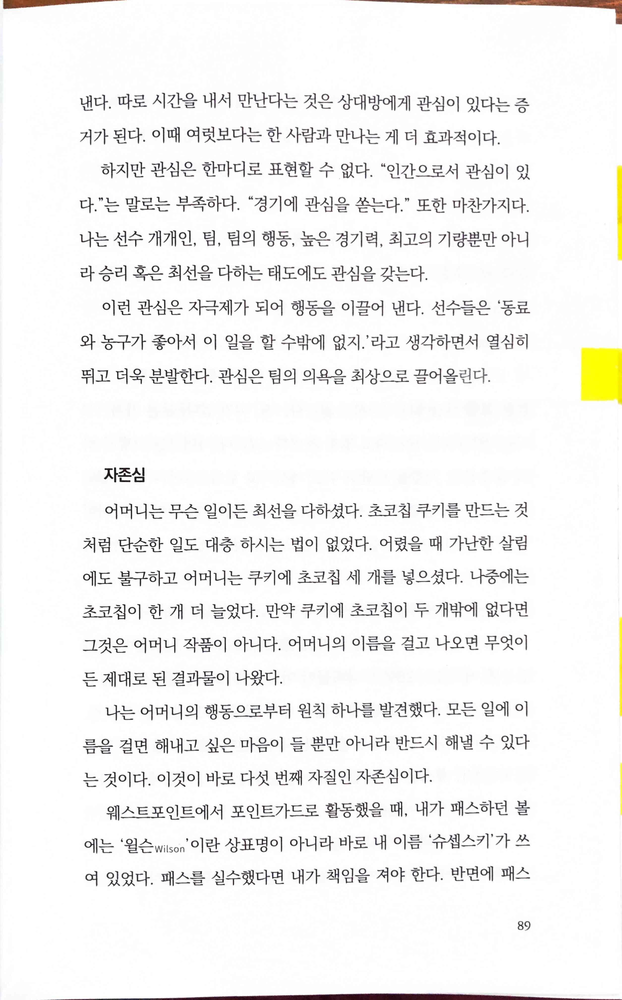

> 관심은 팀의 의욕을 최상으로 끌어올린다.

> 효과적인 팀워크를 말할 때 커뮤니케이션, 신뢰, 공동책임, 관심,자존심이라는 다섯 가지 자질은 기술적인 지식보다도 중요하다.

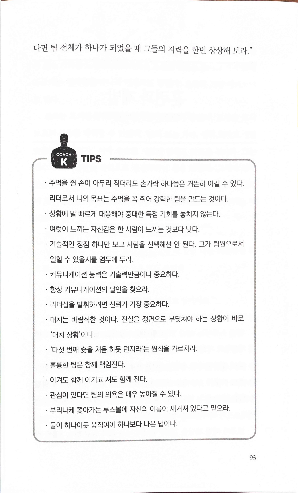

### 훈련과 계발
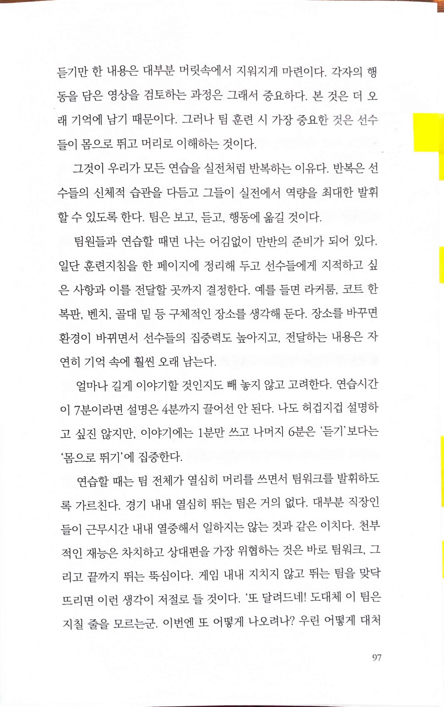

> 팀 훈련 시 가장 중요한 것은 선수들이 몸으로 뛰고 머리로 이해하는 것이다.
>
> 그것이 우리가 모든 연습을 실전처럼 반복하는 이유다. 반복은 선수들의 신체적 습관을 다듬고 그들이 실전에서 역량을 최대한 발휘할 수 있도록 한다. 팀은 보고, 듣고, 행동에 옮길 것이다.
>
> 팀원들과 연습할 때면 나는 어김없이 만반의 준비가 되어 있다.

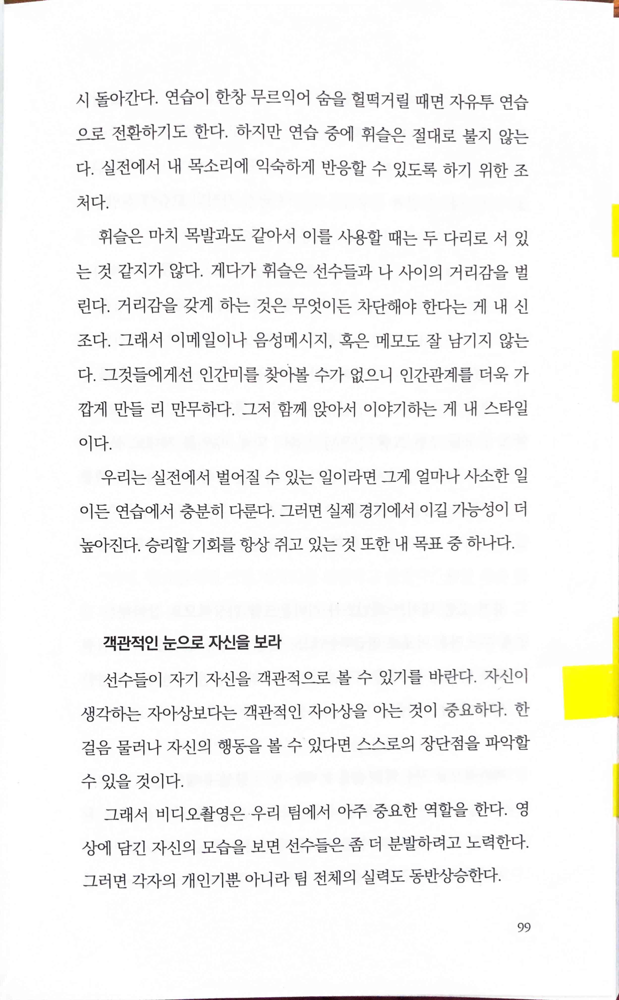

> 선수들이 자기 자신을 객관적으로 볼 수 있기를 바란다. 자신이 생각하는 자아상보다는 객관적인 자아상을 아는 것이 중요하다. 한걸음 물러나 자신의 행동을 볼 수 있다면 스스로의 장단점을 파악할 수 있을 것이다.

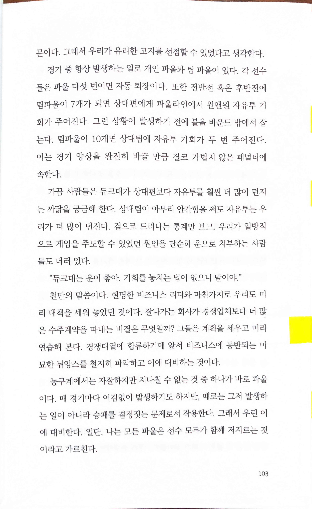

> 현명한 비즈니스 리더와 마찬가지로 우리도 미리 대책을 세워 놓았던 것이다. 잘나가는 회사가 경쟁업체보다 더 많은 수주계약을 따내는 비결은 무엇일까? 그들은 계획을 세우고 미리 연습해 본다. 경쟁대열에 합류하기에 앞서 비즈니스에 동반되는 미묘한 뉘앙스를 철저히 파악하고 이에 대비하는 것이다.

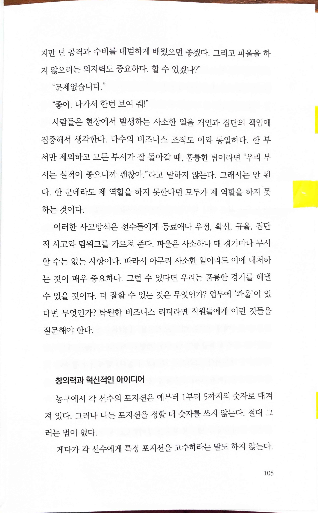

> 한 부서만 제외하고 모든 부서가 잘 돌아갈 때, 훌륭한 팀이라면 "우리 부서는 실적이 좋으니까 괜찮아."라고 말하지 않는다. 그래서는 안 된다. 한 군데라도 제 역할을 하지 못한다면 모두가 제 역할을 하지 못하는 것이다.

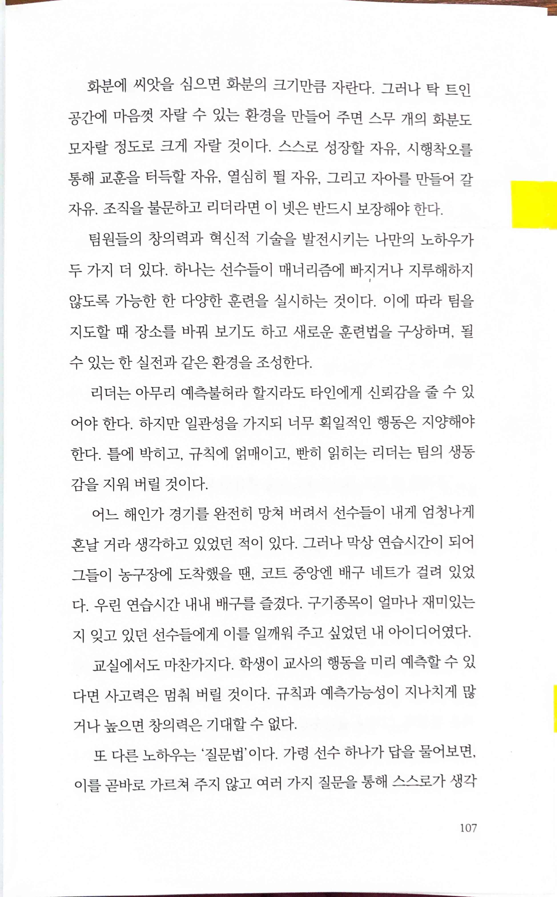

> 스스로 성장할 자유, 시행착오를 통해 교훈을 터득할 자유, 열심히 뛸 자유, 그리고 자아를 만들어 갈 자유. 조직을 불문하고 리더라면 이 넷은 반드시 보장해야 한다.
>
> 리더는 아무리 예측불허라 할지라도 타인에게 신뢰감을 줄 수 있어야 한다. 하지만 일관성을 가지되 너무 획일적인 행동은 지양해야 한다. 틀에 박히고, 규칙에 얽매이고, 빤히 읽히는 리더는 팀의 생동감을 지워 버릴 것이다.

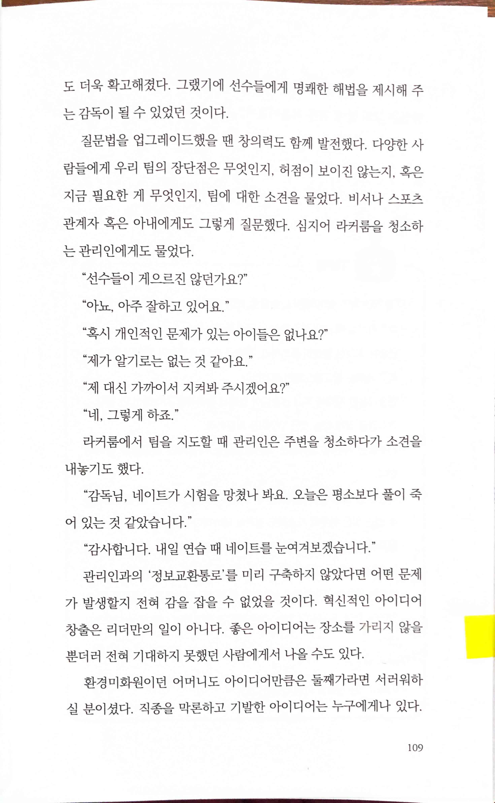

> 혁신적인 아이디어 창출은 리더만의 일이 아니다. 좋은 아이디어는 장소를 가리지 않을 뿐더러 전혀 기대하지 못했던 사람에게서 나올 수도 있다.

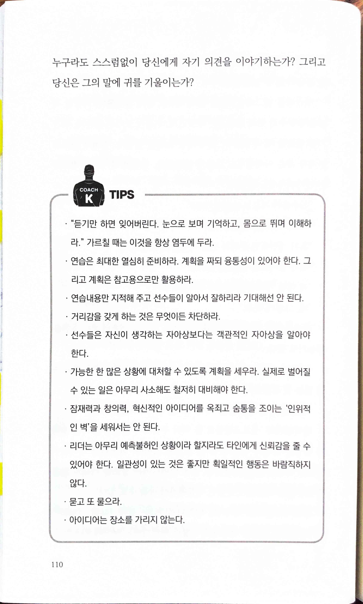

### 긍정의 힘
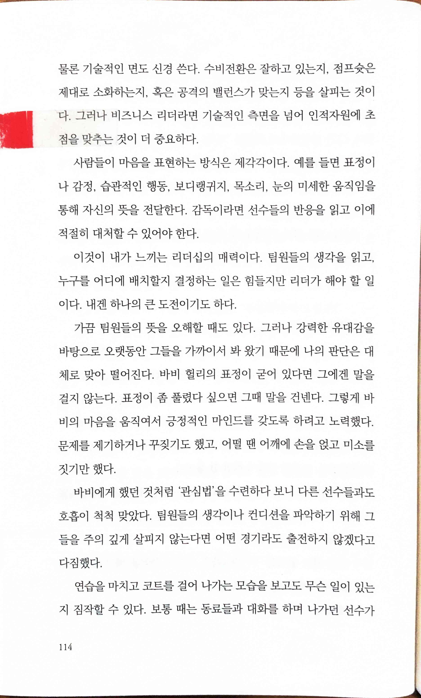

> 물론 기술적인 면도 신경 쓴다... 그러나 비즈니스 리더라면 기술적인 측면을 넘어 인적자원에 초점을 맞추는 것이 더 중요하다.
>
> 사람들이 마음을 표현하는 방식은 제각각이다. 예를 들면 표정이나 감정, 습관적인 행동, 보디랭귀지, 목소리, 눈의 미세한 움직임을 통해 자신의 뜻을 전달한다. 감독이라면 선수들의 반응을 읽고 이에 적절히 대처할 수 있어야 한다.
>
> 이것이 내가 느끼는 리더십의 매력이다. 팀원들의 생각을 읽고, 누구를 어디에 배치할지 결정하는 일은 힘들지만 리더가 해야 할 일이다.

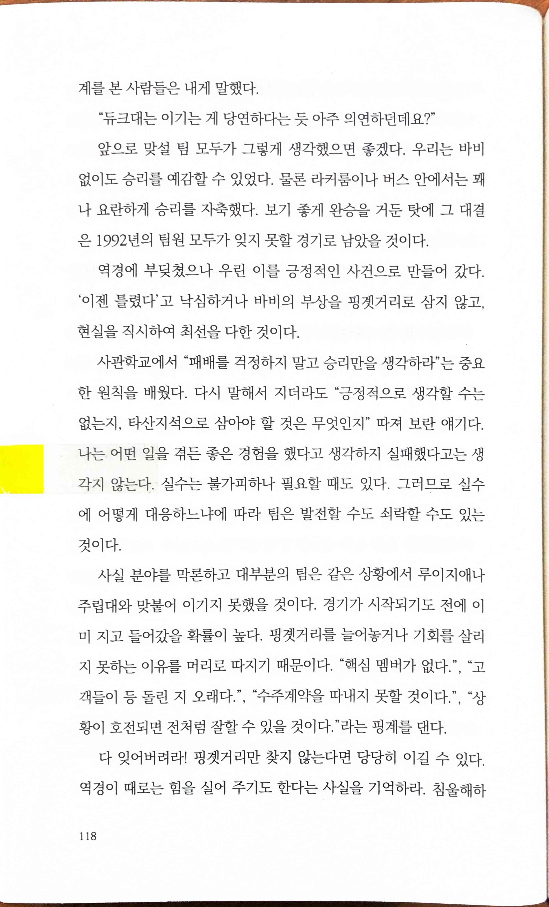

> 나는 어떤 일을 겪든 좋은 경험을 했다고 생각하지 실패했다고는 생각지 않는다. 실수는 불가피하나 필요할 때도 있다. 그러므로 실수에 어떻게 대응하느냐에 따라 팀은 발전할 수도 쇠락할 수도 있는 것이다.

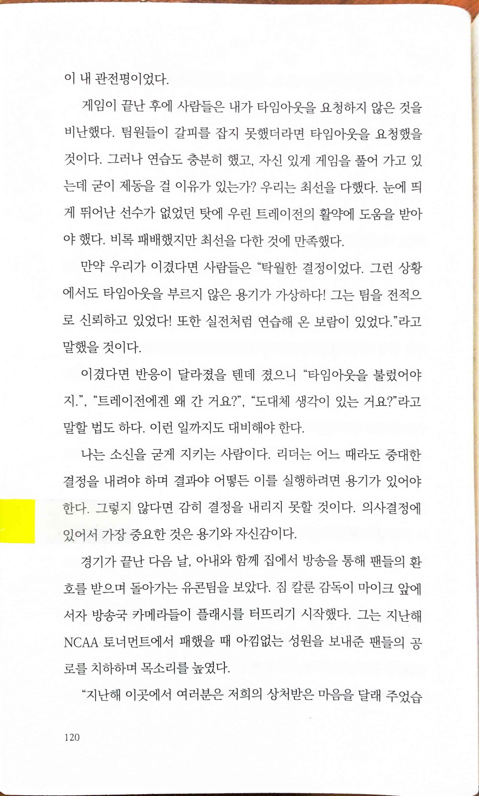

> 리더는 어느 때라도 중대한 결정을 내려야 하며 결과야 어떻든 이를 실행하려면 용기가 있어야 한다. 그렇지 않다면 감히 결정을 내리지 못할 것이다. 의사결정에 있어서 가장 중요한 것은 용기와 자신감이다.

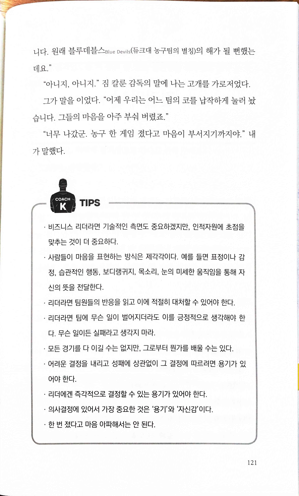

### 결전의 날
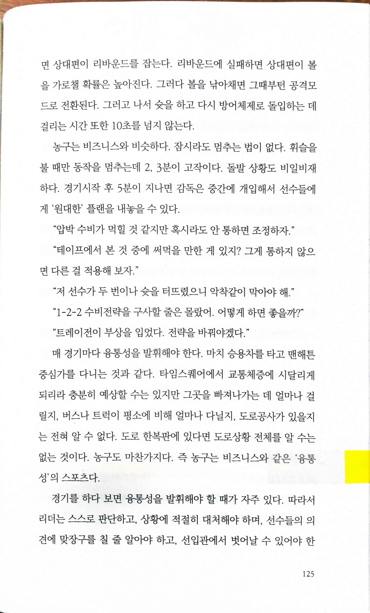

> 매 경기마다 융통성을 발휘해야 한다... 농구도 마찬가지다. 즉 농구는 비즈니스와 같은 '융통성'의 스포츠다.

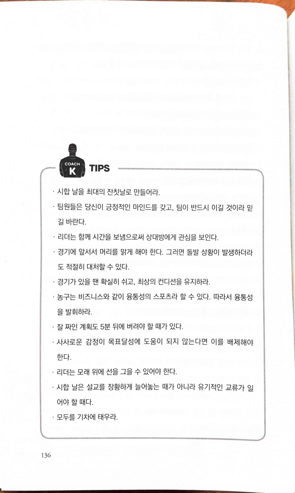

## 포스트시즌

### 새 출발
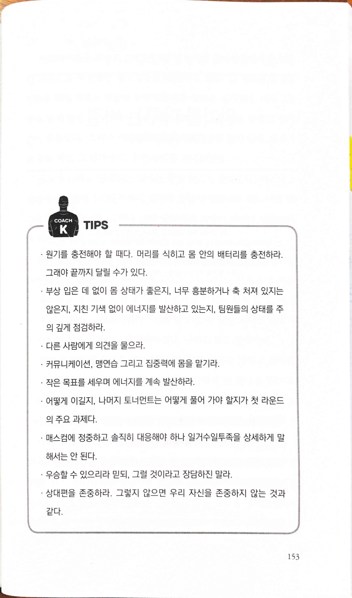

### 위기를 다루는 비결
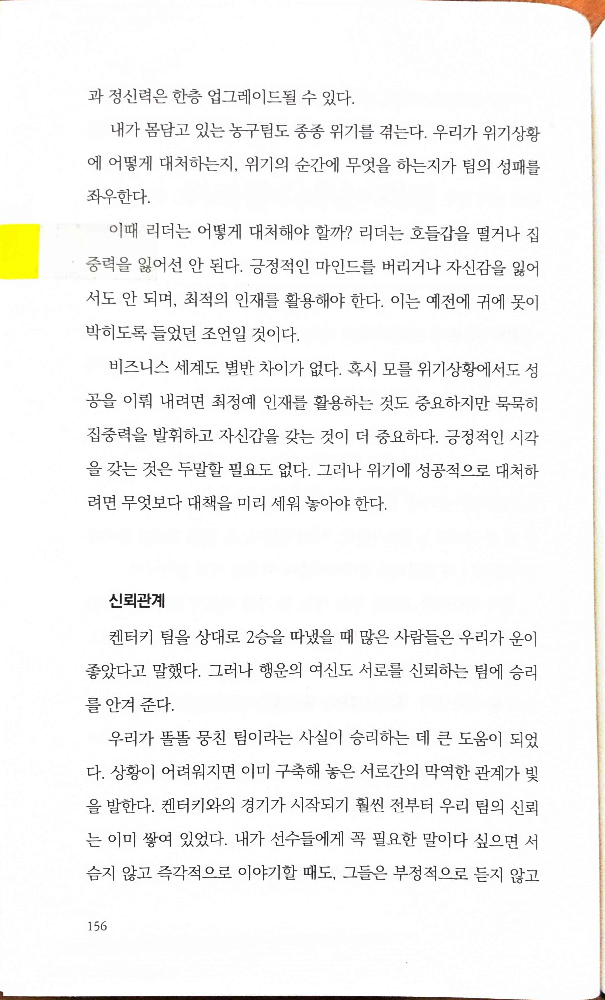

> 내가 몸담고 있는 농구팀도 종종 위기를 겪는다. 우리가 위기상황에 어떻게 대처하는지, 위기의 순간에 무엇을 하는지가 팀의 성패를 좌우한다.
>
> 이때 리더는 어떻게 대처해야 할까? 리더는 호들갑을 떨거나 집중력을 잃어선 안 된다. 긍정적인 마인드를 버리거나 자신감을 잃어서도 안 되며, 최적의 인재를 활용해야 한다.

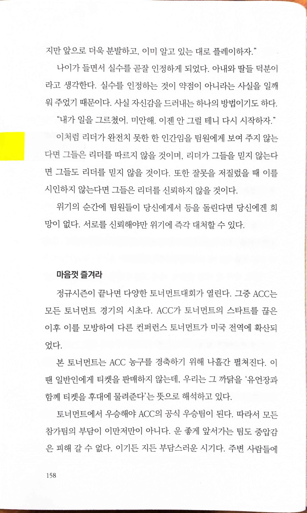

> 실수를 인정하는 것이 약점이 아니라는 사실을 일깨워 주었기 때문이다. 사실 자신감을 드러내는 하나의 방법이기도 하다.
>
> 이처럼 리더가 완전치 못한 한 인간임을 팀원에게 보여 주지 않는다면 그들은 리더를 따르지 않을 것이며, 리더가 그들을 믿지 않는다면 그들도 리더를 믿지 않을 것이다. 또한 잘못을 저질렀을 때 이를 시인하지 않는다면 그들은 리더를 신뢰하지 않을 것이다.
>
> 위기의 순간에 팀원들이 당신에게서 등을 돌린다면 당신에겐 희망이 없다. 서로를 신뢰해야만 위기에 즉각 대처할 수 있다.

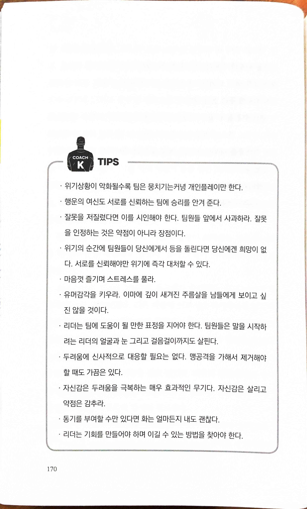

### 집중력

> 리더의 책임은 매우 중요하기 때문에 한시라도 사적인 감정을 표출해서는 안 된다.

### 전통
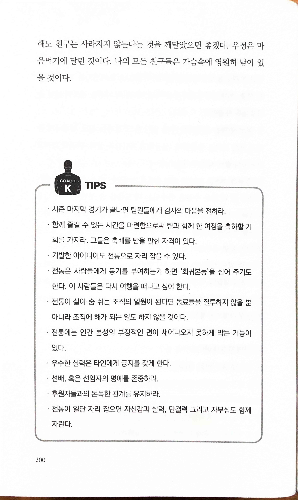

## 올시즌

### 기본
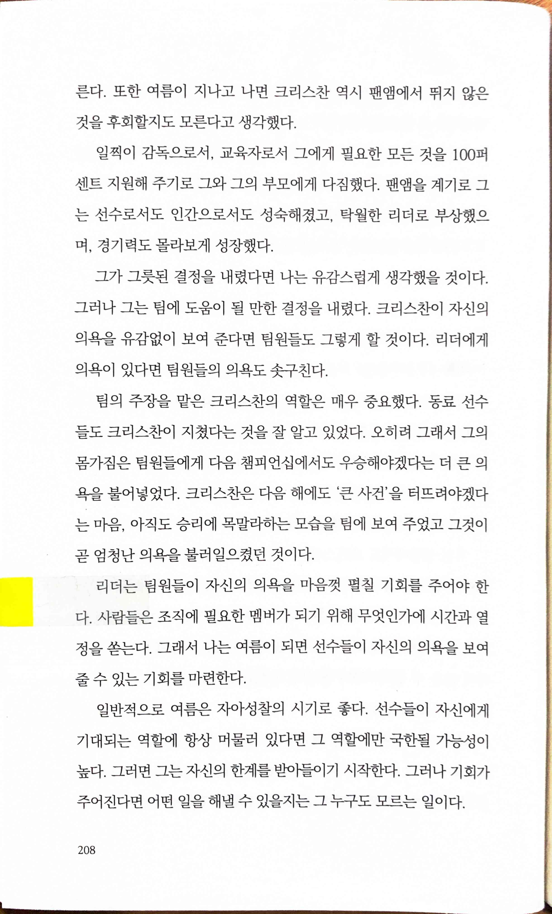

> 리더는 팀원들이 자신의 의욕을 마음껏 펼칠 기회를 주어야 한다. 사람들은 조직에 필요한 멤버가 되기 위해 무엇인가에 시간과 열정을 쏟는다.

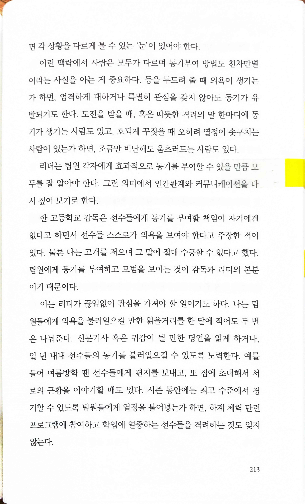

> 리더는 팀원 각자에게 효과적으로 동기를 부여할 수 있을 만큼 모두를 잘 알아야 한다.
>
> 팀원에게 동기를 부여하고 모범을 보이는 것이 감독과 리더의 본분
>
> 리더가 끊임없이 관심을 가져야 할 일

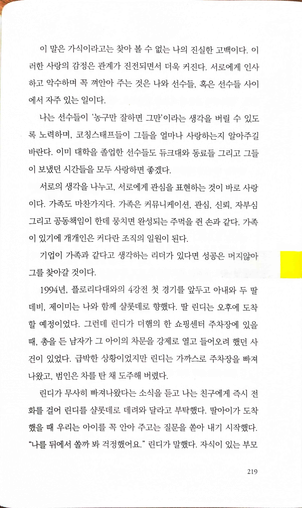

> 기업이 가족과 같다고 생각하는 리더가 있다면 성공은 머지않아 그를 찾아갈 것이다.

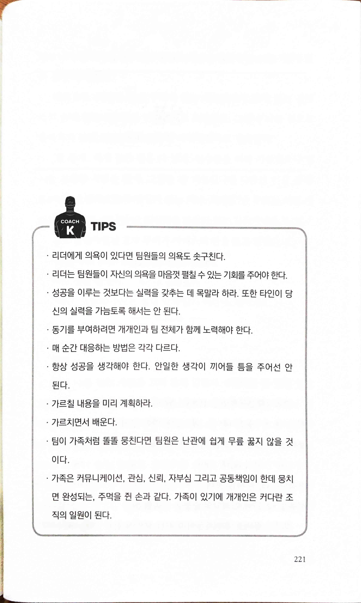

### 성품
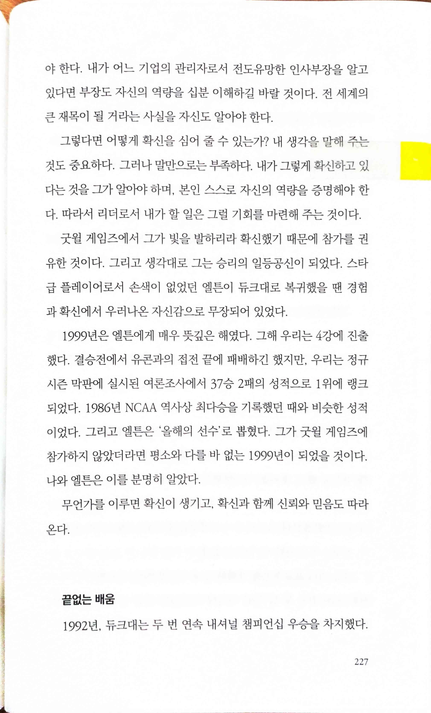

> 그렇다면 어떻게 확신을 심어 줄 수 있는가? 내 생각을 말해 주는 것도 중요하다. 그러나 말만으로는 부족하다. 내가 그렇게 확신하고 있다는 것을 그가 알아야 하며, 본인 스스로 자신의 역량을 증명해야 한다. 따라서 리더로서 내가 할 일은 그럴 기회를 마련해 주는 것이다.

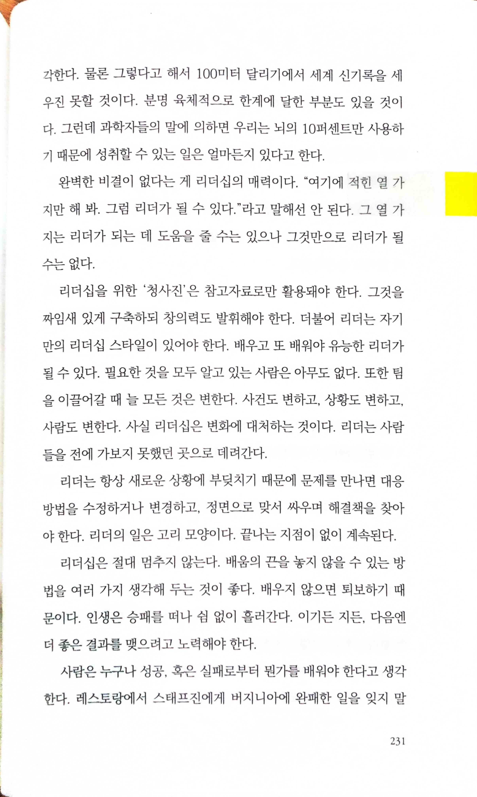

> 완벽한 비결이 없다는 게 리더십의 매력이다.
>
> 리더십을 위한 '청사진'은 참고자료로만 활용돼야 한다. 그것을 짜임새 있게 구축하되 창의력도 발휘해야 한다. 더불어 리더는 자기만의 리더십 스타일이 있어야 한다. 배우고 또 배워야 유능한 리더가 될 수 있다. 필요한 것을 모두 알고 있는 사람은 아무도 없다. 또한 팀을 이끌어갈 때 늘 모든 것은 변한다. 사건도 변하고, 상황도 변하고, 사람도 변한다. 사실 리더십은 변화에 대처하는 것이다. 리더는 사람들을 전에 가보지 못했던 곳으로 데려간다.
>
> 리더는 항상 새로운 상황에 부딪치기 때문에 문제를 만나면 대응방법을 수정하거나 변경하고, 정면으로 맞서 싸우며 해결책을 찾아야 한다. 리더의 일은 고리 모양이다. 끝나는 지점이 없이 계속된다.
>
> 리더십은 절대 멈추지 않는다. 배움의 끈을 놓지 않을 수 있는 방법을 여러 가지 생각해 두는 것이 좋다. 배우지 않으면 퇴보하기 때문이다. 인생은 승패를 떠나 쉼 없이 흘러간다. 이기든 지든, 다음엔 더 좋은 결과를 맺으려고 노력해야 한다.
>
> 사람은 누구나 성공, 혹은 실패로부터 뭔가를 배워야 한다고 생각한다.

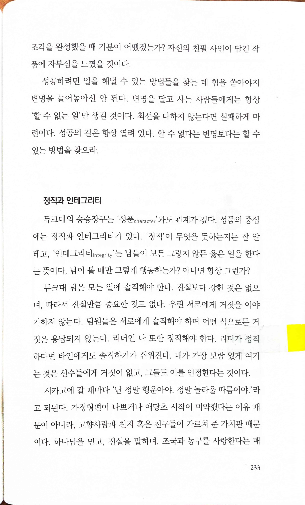

> 듀크대 팀은 모든 일에 솔직해야 한다. 진실보다 강한 것은 없으며, 따라서 진실만큼 중요한 것도 없다. 우린 서로에게 거짓을 이야기하지 않는다. 팀원들은 서로에게 솔직해야 하며 어떤 식으로든 거짓은 용납되지 않는다. 리더인 나 또한 정직해야 한다. 리더가 정직하다면 타인에게도 솔직하기가 쉬워진다.

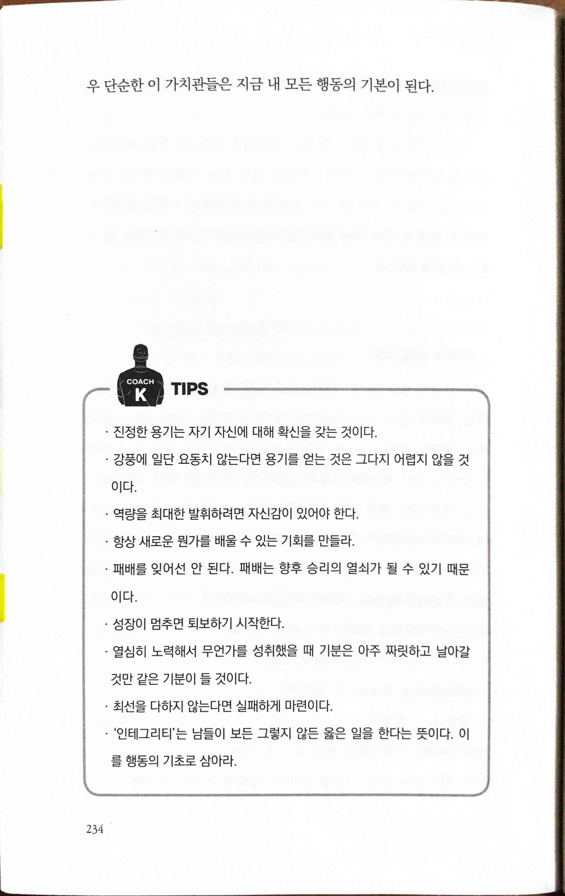

### 우정
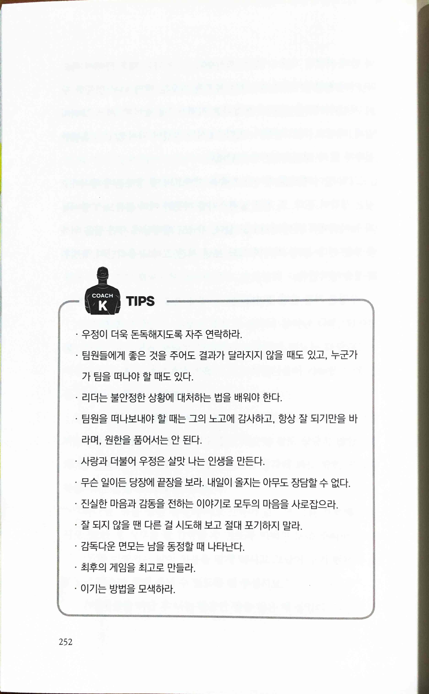

### 인생
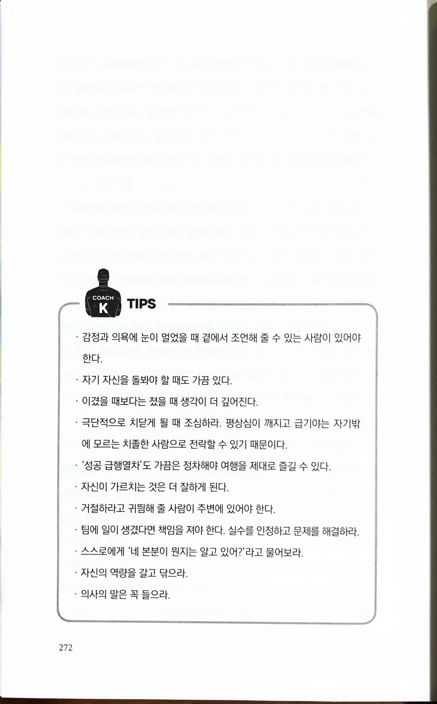

## 연장전
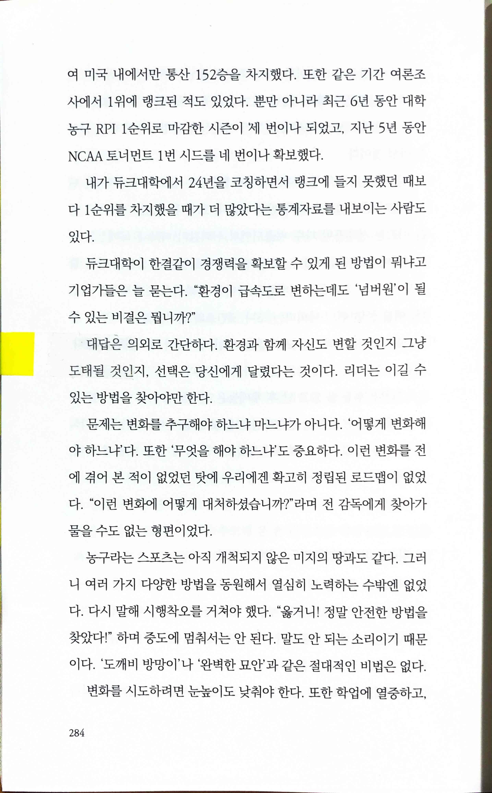

> 환경과 함께 자신도 변할 것인지 그냥 도태될 것인지, 선택은 당신에게 달렸다는 것이다. 리더는 이길 수 있는 방법을 찾아야만 한다.

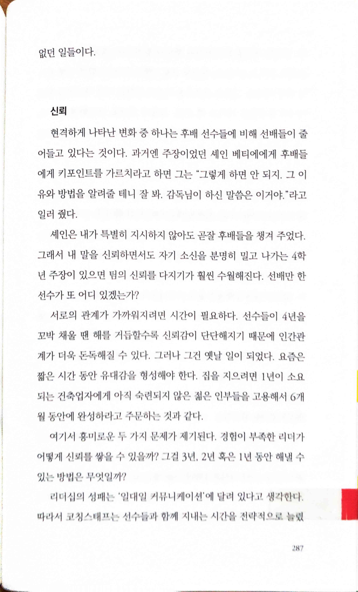

> 리더십의 성패는 '일대일 커뮤니케이션'에 달려 있다

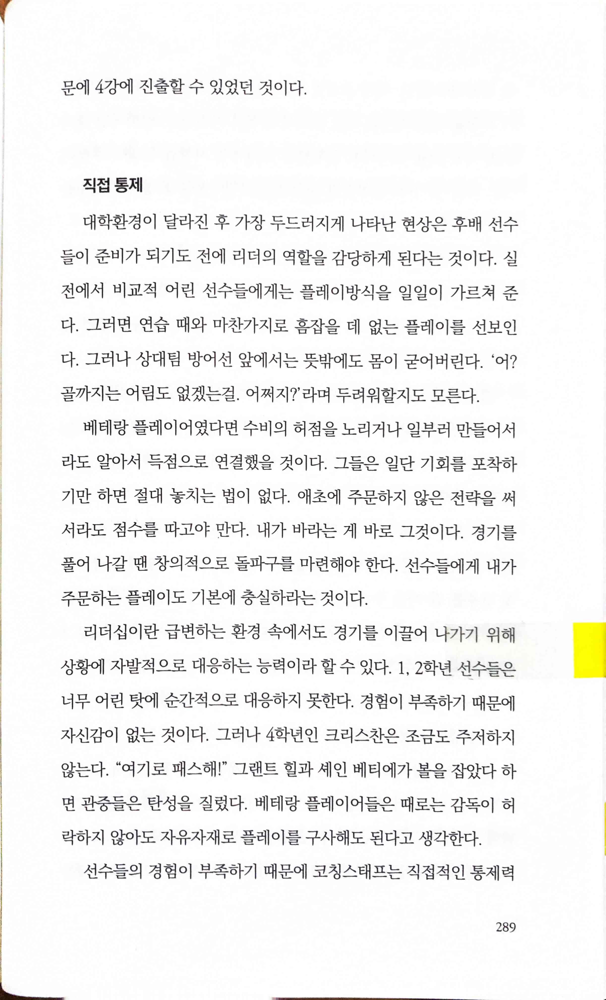

> 리더십이란 급변하는 환경 속에서도 경기를 이끌어 나가기 위해 상황에 자발적으로 대응하는 능력

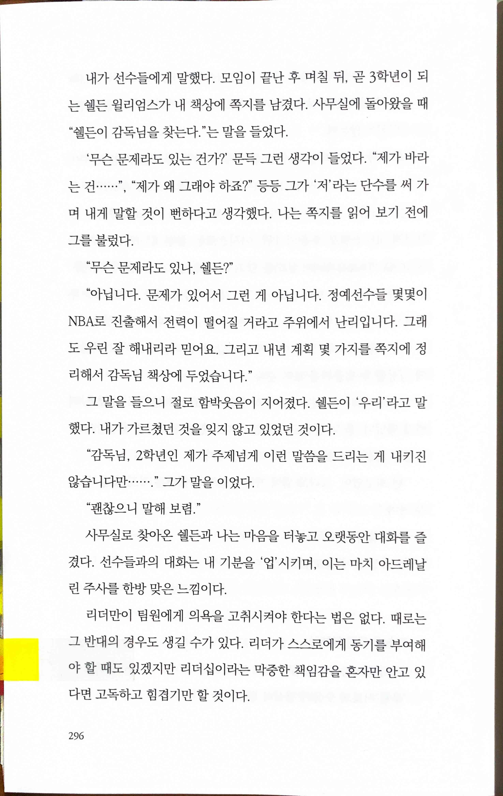

> 리더만이 팀원에게 의욕을 고취시켜야 한다는 법은 없다. 때로는 그 반대의 경우도 생길 수가 있다. 리더가 스스로에게 동기를 부여해야 할 때도 있겠지만 리더십이라는 막중한 책임감을 혼자만 안고 있다면 고독하고 힘겹기만 할 것이다.

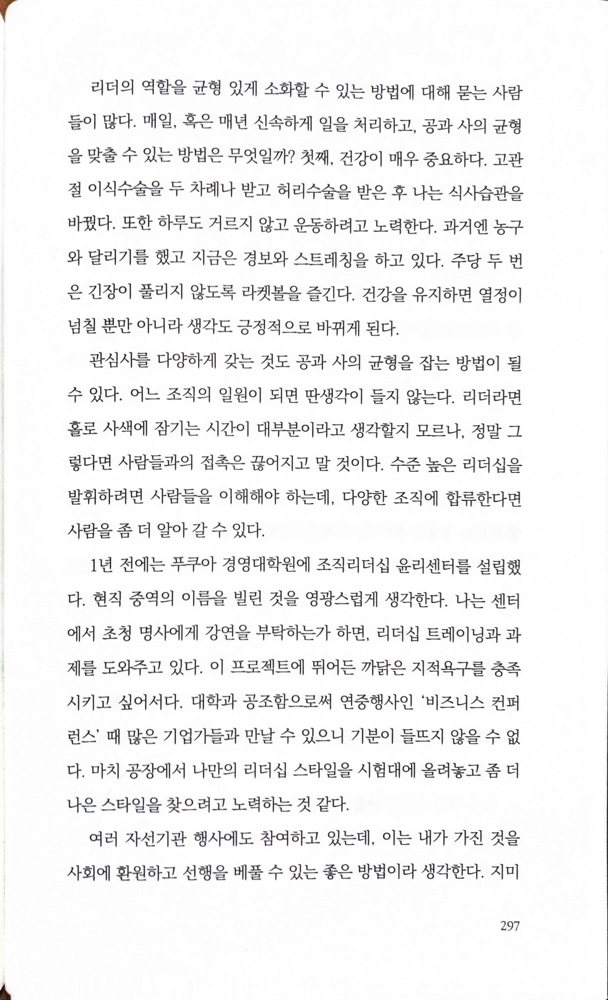 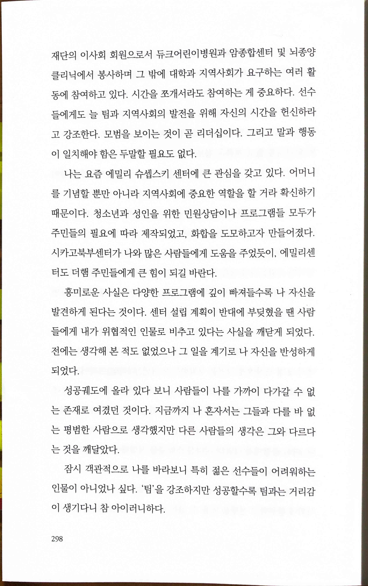 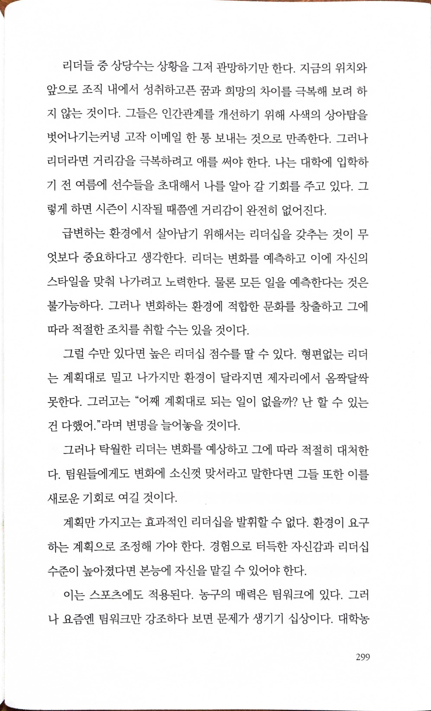

