Making Work Visible 업무 시각화
===============================
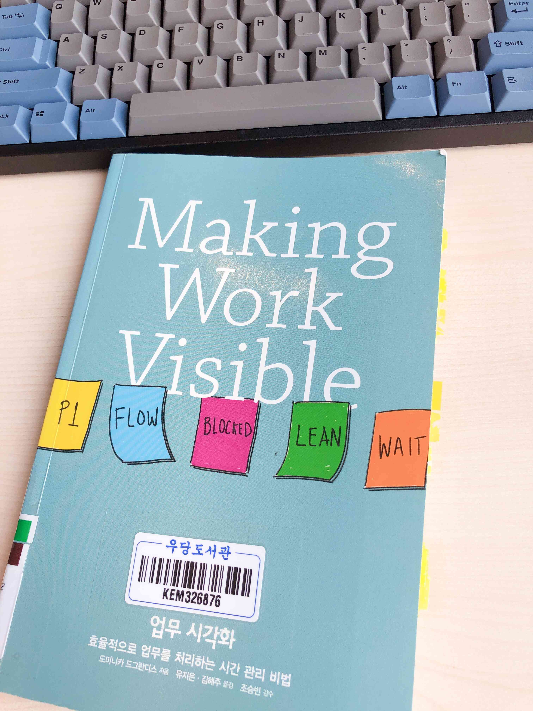

* [Dominica DeGrandis – More No Less WIP](https://ddegrandis.com/)

# 들어가며
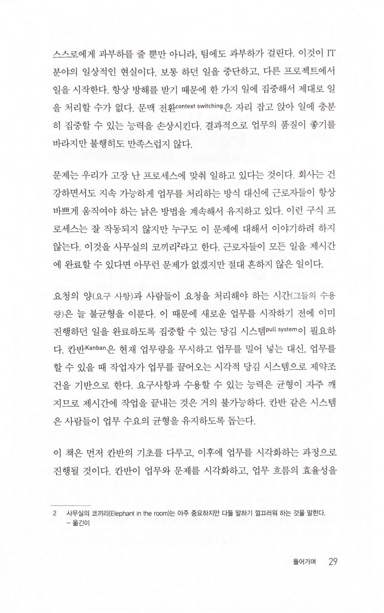

> 스스로에게 과부하를 줄 뿐만 아니라, 팀에도 과부하가 걸린다. 이것이 IT분야의 일상적인 현실이다. 보통 하던 일을 중단하고, 다른 프로젝트에서 일을 시작한다. 항상 방해를 받기 때문에 한 가지 일에 집중해서 제대로 일을 처리할 수가 없다. 문맥 전환context switching은 자리 잡고 앉아 일에 충분히 집중할 수 있는 능력을 손상시킨다. 결과적으로 업무의 품질이 좋기를 바라지만 불행히도 만족스럽지 않다.
>
> 요청의 양(요구 사항)과 사람들이 요청을 처리해야 하는 시간(그들의 수용량은 늘 불균형을 이룬다. 이 때문에 새로운 업무를 시작하기 전에 이미 진행하던 일을 완료하도록 집중할 수 있는 당김 시스템pull system이 필요하다. 칸반 Kanban 은 현재 업무량을 무시하고 업무를 밀어 넣는 대신, 업무를 할 수 있을 때 작업자가 업무를 끌어오는 시각적 당김 시스템으로 제약조건을 기반으로 한다. 요구사항과 수용할 수 있는 능력은 균형이 자주 깨지므로 제시간에 작업을 끝내는 것은 거의 불가능하다. 칸반 같은 시스템은 사람들이 업무 수요의 균형을 유지하도록 돕는다.

# PART 1 시간을 훔쳐가는 다섯 도둑
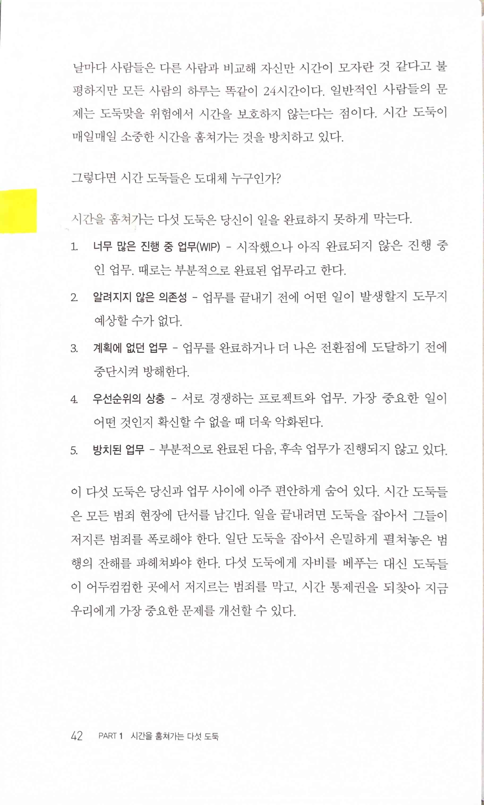

> 시간을 훔쳐가는 다섯 도둑은 당신이 일을 완료하지 못하게 막는다.
>
> 1 너무 많은 진행 중 업무(WIP) - 시작했으나 아직 완료되지 않은 진행 중인 업무, 때로는 부분적으로 완료된 업무라고 한다.
>
> 2 알려지지 않은 의존성 - 업무를 끝내기 전에 어떤 일이 발생할지 도무지예상할 수가 없다.
>
> 3 계획에 없던 업무 - 업무를 완료하거나 더 나은 전환점에 도달하기 전에중단시켜 방해한다.
>
> 4 우선순위의 상충 - 서로 경쟁하는 프로젝트와 업무 가장 중요한 일이어떤 것인지 확신할 수 없을 때 더욱 악화된다.
>
> 5 방치된 업무 - 부분적으로 완료된 다음, 후속 업무가 진행되지 않고 있다.

## 1.1 너무 많은 진행 중 업무
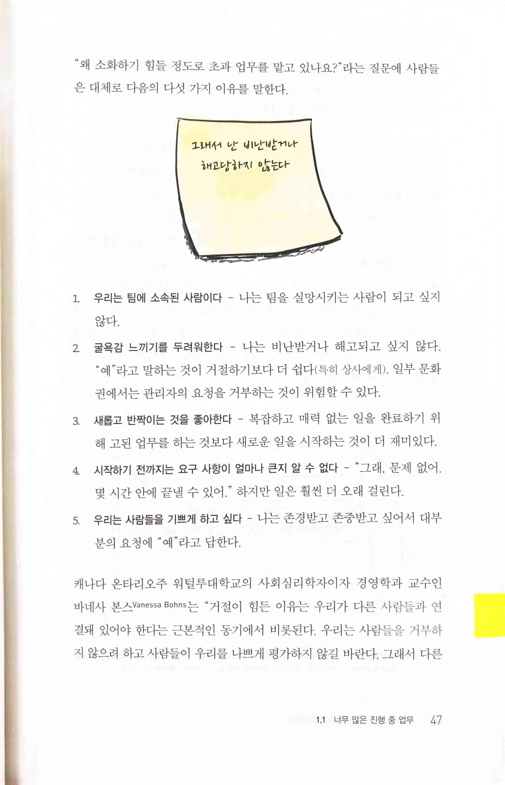

> 캐나다 온타리오주 워털루대학교의 사회심리학자이자 경영학과 교수인 바네사 본스Vanessa Bohns는 "거절이 힘든 이유는 우리가 다른 사람들과 연결돼 있어야 한다는 근본적인 동기에서 비롯된다. 우리는 사람들을 거부하지 않으려 하고 사람들이 우리를 나쁘게 평가하지 않길 바란다. 그래서 다른 사람들에게 비춰질 인상을 관리한다.

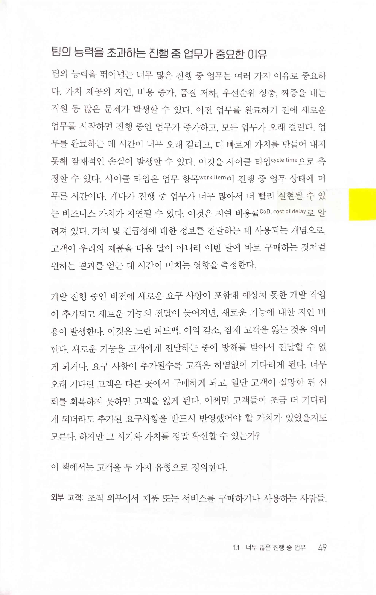

> 팀의 능력을 뛰어넘는 너무 많은 진행 중 업무는 여러 가지 이유로 중요하다. 가치 제공의 지연, 비용 증가, 품질 저하, 우선순위 상충, 짜증을 내는 직원 등 많은 문제가 발생할 수 있다. 이전 업무를 완료하기 전에 새로운 업무를 시작하면 진행 중인 업무가 증가하고, 모든 업무가 오래 걸린다. 업무를 완료하는 데 시간이 너무 오래 걸리고, 더 빠르게 가치를 만들어 내지 못해 잠재적인 손실이 발생할 수 있다. 이것을 사이클 타임cycle time 으로 측정할 수 있다. 사이클 타임은 업무 항목work item 이 진행 중 업무 상태에 머무른 시간이다. 게다가 진행 중 업무가 너무 많아서 더 빨리 실현될 수 있는 비즈니스 가치가 지연될 수 있다. 이것은 지연 비용률CD, cost of delay로 알려져 있다. 가치 및 긴급성에 대한 정보를 전달하는 데 사용되는 개념으로, 고객이 우리의 제품을 다음 달이 아니라 이번 달에 바로 구매하는 것처럼 원하는 결과를 얻는 데 시간이 미치는 영향을 측정한다.

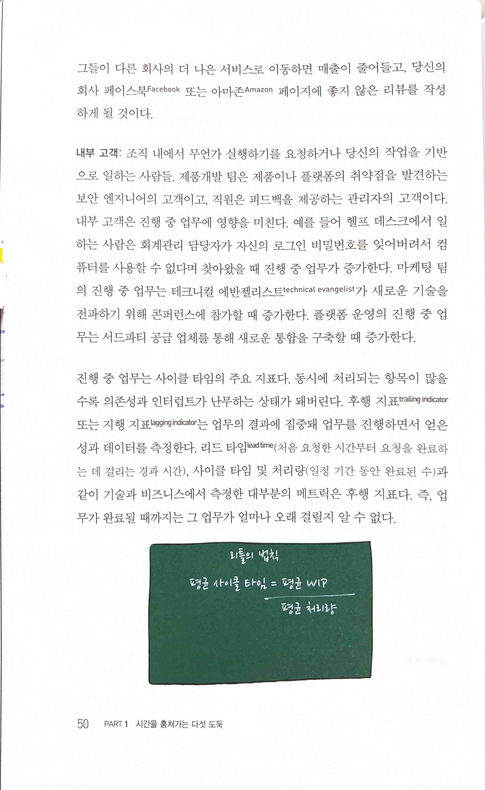

> 진행 중 업무의 양과 사이클 타임은 상관관계가 있다. 이는 리틀의 법칙 Little's law 이라 불리며, 완료된 업무의 평균 사이클 타임은 진행 중 업무와 처리량의 비율로 계산된다.

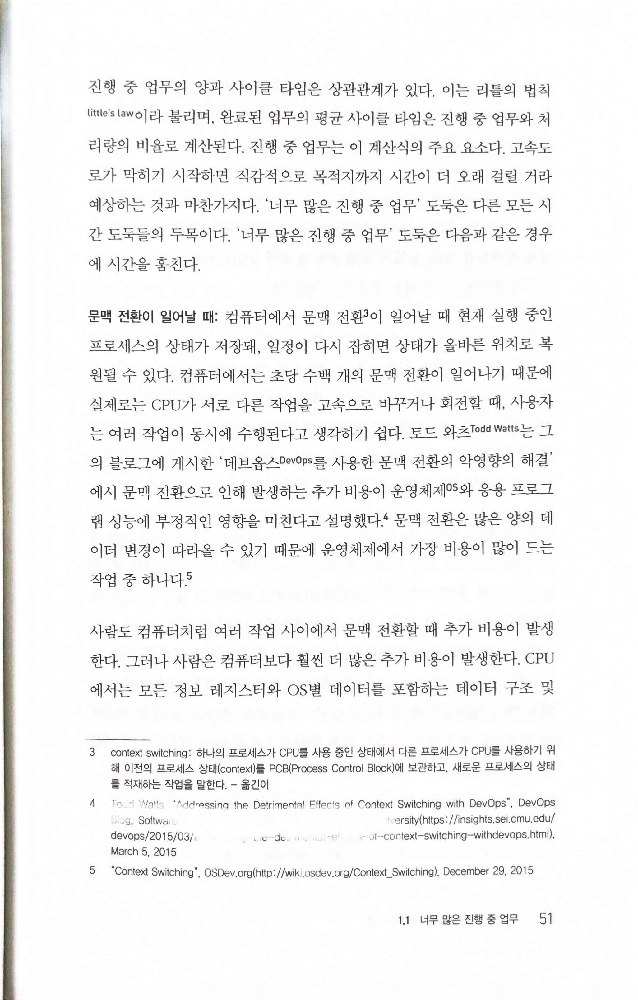

> 토드 와츠Todd Watts는 그의 블로그에 게시한 '데브옵스DevOps를 사용한 문맥 전환의 악영향의 해결'에서 문맥 전환으로 인해 발생하는 추가 비용이 운영체제와 응용 프로그램 성능에 부정적인 영향을 미친다고 설명했다. 문맥 전환은 많은 양의 데이터 변경이 따라올 수 있기 때문에 운영체제에서 가장 비용이 많이 드는 작업 중 하나다.
>
> 사람도 컴퓨터처럼 여러 작업 사이에서 문맥 전환할 때 추가 비용이 발생한다. 그러나 사람은 컴퓨터보다 훨씬 더 많은 추가 비용이 발생한다.

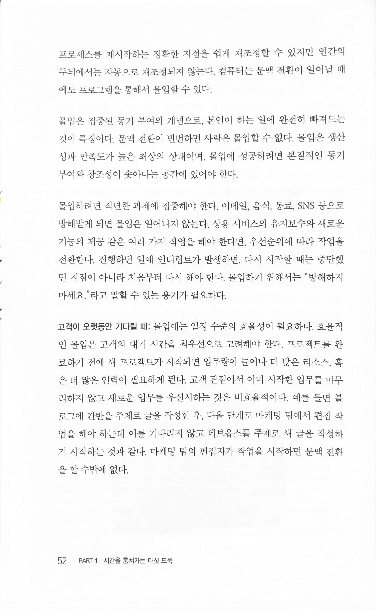

> 몰입은 집중된 동기 부여의 개념으로, 본인이 하는 일에 완전히 빠져드는 것이 특징이다. 문맥 전환이 빈번하면 사람은 몰입할 수 없다. 몰입은 생산성과 만족도가 높은 최상의 상태이며, 몰입에 성공하려면 본질적인 동기부여와 창조성이 솟아나는 공간에 있어야 한다.
>
> 몰입하려면 직면한 과제에 집중해야 한다... 상용 서비스의 유지보수와 새로운 기능의 제공 같은 여러 가지 작업을 해야 한다면, 우선순위에 따라 작업을 전환한다. 진행하던 일에 인터럽트가 발생하면, 다시 시작할 때는 중단했던 지점이 아니라 처음부터 다시 해야 한다. 몰입하기 위해서는 "방해하지 마세요."라고 말할 수 있는 용기가 필요하다.

> 너무 많은 진행 중 업무로 인해 품질관리가 어려워진다.
>
> 문맥 전환은 사람을 짜증나게 만든다. 성공적으로 일을 처리할 만큼 충분한 시간을 가질 수 없고, 업무나 새로운 기술을 배울 틈을 주지 않는다. 미국의 심리학자 해리 할로우Harry F. Harlow는 다니엘 핑크 Daniel Pink 의 저서 드라이브Drive에서 "숙련은 달성하는 것보다는 그 자체를 추구한다는 데 즐거움이 존재하는 것이다. 우리의 손아귀에서 항상 벗어나 있다는 사실이야말로 숙련의 매력이다."라고 말한다. 인터럽트가 발생하기 전에는 깊게 파고들 시간이 없고, 시간을 들여 무언가를 충분히 숙련하기 어렵다.

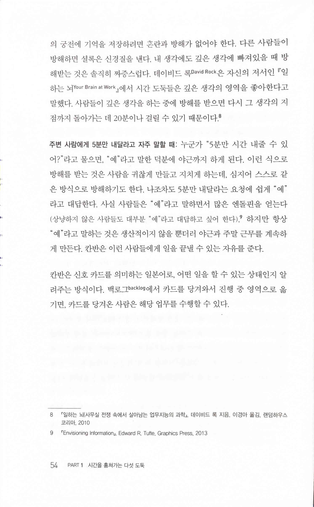

> 사람들이 깊은 생각을 하는 중에 방해를 받으면 다시 그 생각의 지점까지 돌아가는 데 20분이나 걸릴 수 있기 때문이다!

## 1.2 알려지지 않은 의존성
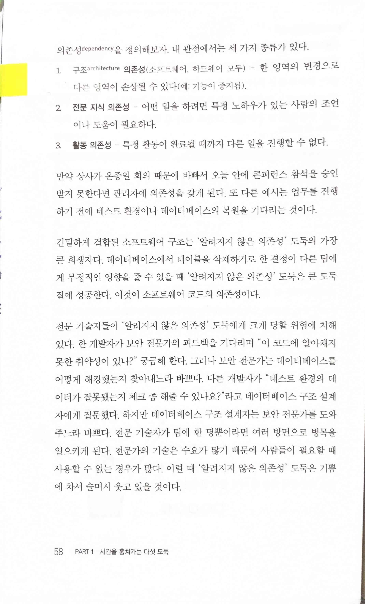

> 의존성dependency
>
> 1. 구조architecture 의존성(소프트웨어, 하드웨어 모두) - 한 영역의 변경으로 다른 영역이 손상될 수 있다(예: 기능이 중지됨).
>
> 2. 전문 지식 의존성 - 어떤 일을 하려면 특정 노하우가 있는 사람의 조언이나 도움이 필요하다.
>
> 3. 활동 의존성 - 특정 활동이 완료될 때까지 다른 일을 진행할 수 없다.
>
> 긴밀하게 결합된 소프트웨어 구조는 '알려지지 않은 의존성' 도둑의 가장 큰 희생자다.

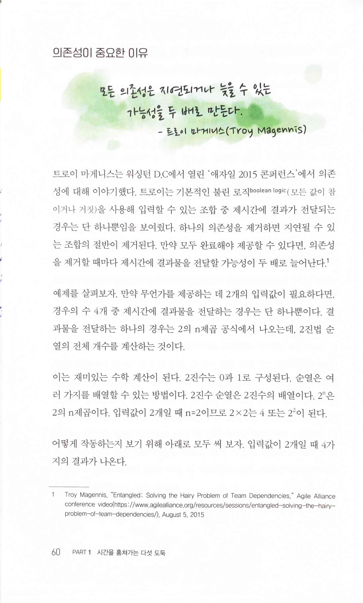 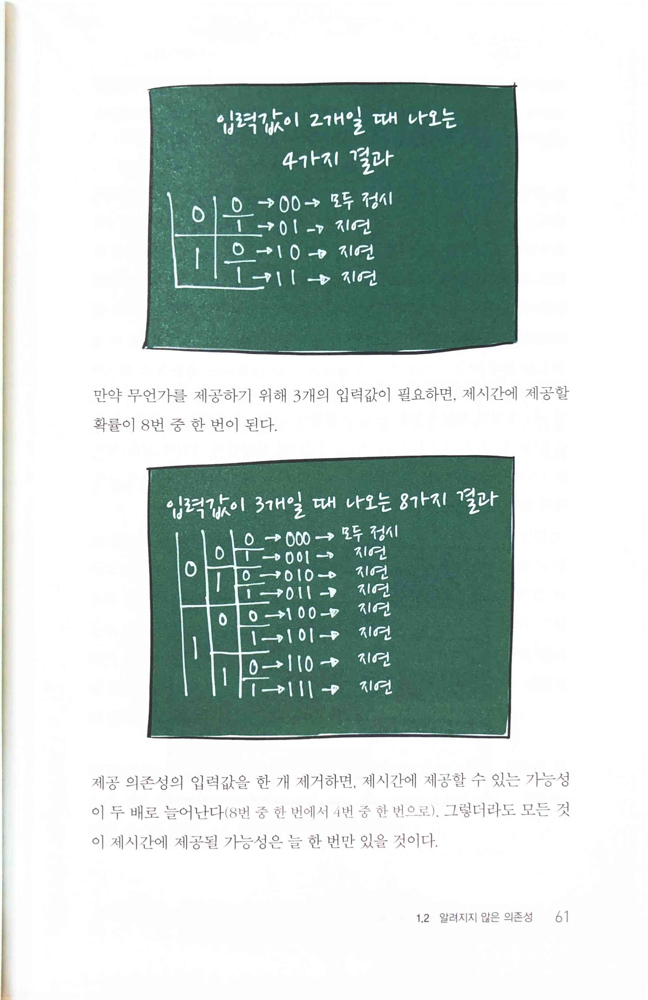

> 모든 의존성은 지연되거나 늦을 수 있는 가능성을 두 배로 만든다. - 트로이 마게니스(Troy Magennis)
>
> 의존성을 제거할 때마다 제시간에 결과물을 전달할 가능성이 두 배로 늘어난다.

## 1.3 계획에 없던 업무
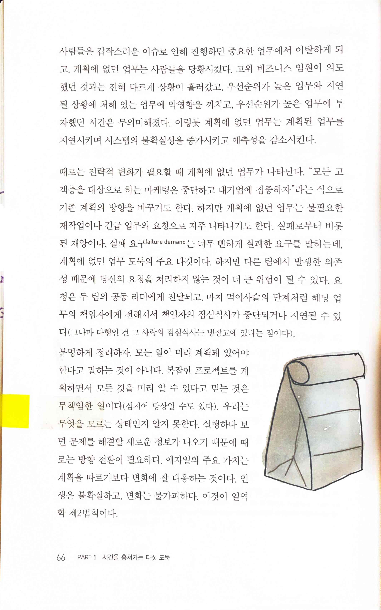

> 모든 일이 미리 계획돼 있어야 한다고 말하는 것이 아니다. 복잡한 프로젝트를 계획하면서 모든 것을 미리 알 수 있다고 믿는 것은 무책임한 일이다(심지어 망상일 수도 있다). 우리는 무엇을 모르는 상태인지 알지 못한다. 실행하다 보면 문제를 해결할 새로운 정보가 나오기 때문에 때로는 방향 전환이 필요하다. 애자일의 주요 가치는 계획을 따르기보다 변화에 잘 대응하는 것이다. 인생은 불확실하고, 변화는 불가피하다.

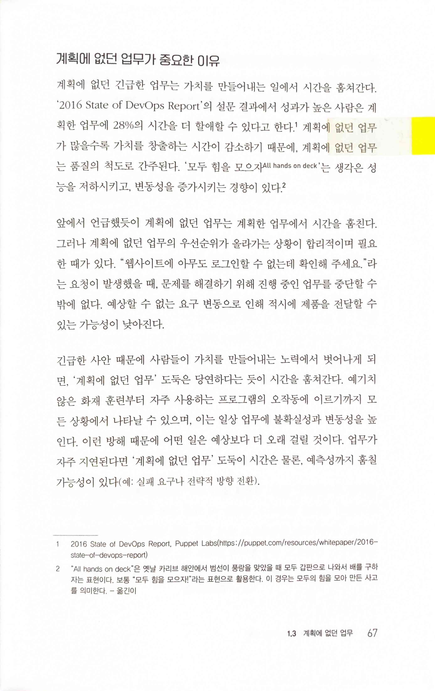

> 계획에 없던 긴급한 업무는 가치를 만들어내는 일에서 시간을 훔쳐간다. '2016 State of DevOps Report'의 설문 결과에서 성과가 높은 사람은 계획한 업무에 28%의 시간을 더 할애할 수 있다고 한다. 계획에 없던 업무가 많을수록 가치를 창출하는 시간이 감소하기 때문에 계획에 없던 업무는 품질의 척도로 간주된다. '모두 힘을 모으자All hands on deck'는 생각은 성능을 저하시키고, 변동성을 증가시키는 경향이 있다.

## 1.4 상충하는 우선순위

> '집중'이라는 것은 당신이 하지 않을 일을 결정하는 것이다. - 존 카멕(John Carmack)

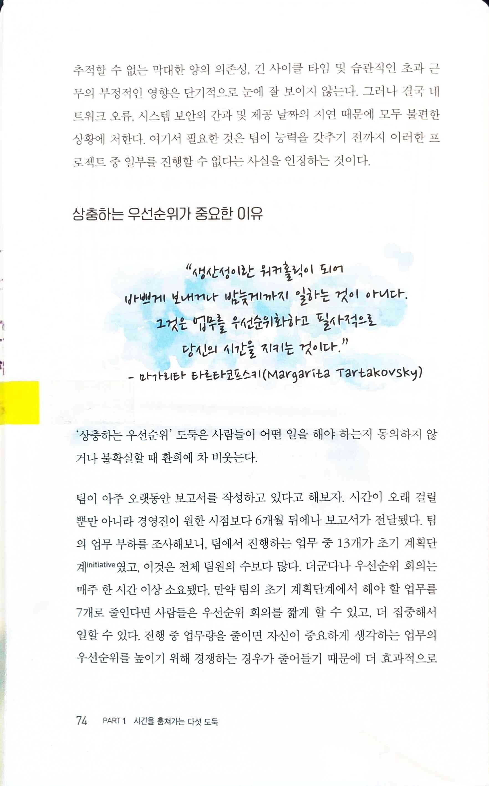

> “생산성이란 워커홀릭이 되어 바쁘게 보내거나 밤늦게까지 일하는 것이 아니다. 그것은 업무를 우선순위화하고 필사적으로 당신의 시간을 지키는 것이다."- 마가리타 타르타코프스키(Margarita Tartakovsky)

## 1.5 방치된 업무

> "고통스럽다면(그렇지 않을 때까지) 더 자주 하라"는 말처럼 유지보수를 자주 하는 것이 시스템 전체 수리처럼 어려운 일을 줄여준다. 이 원칙이 시스템 유지보수에 적용될 때까지 방치된 업무는 계속 문제를 일으킬 것이다.

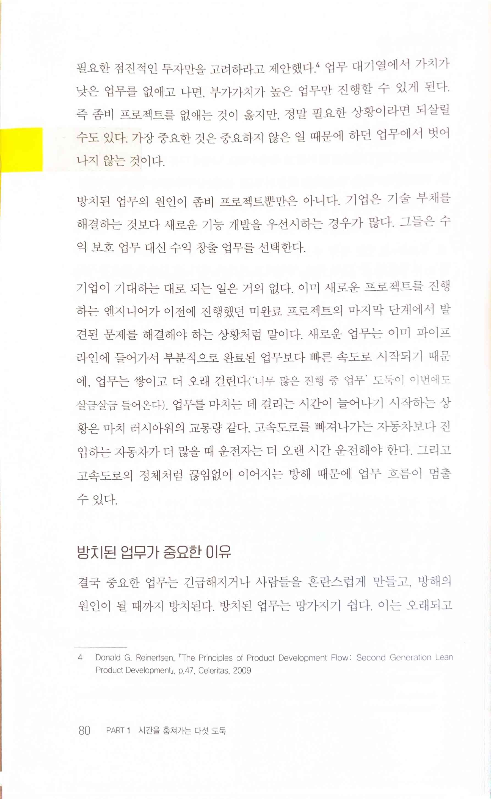

> 업무 대기열에서 가치가 낮은 업무를 없애고 나면, 부가가치가 높은 업무만 진행할 수 있게 된다... 가장 중요한 것은 중요하지 않은 일 때문에 하던 업무에서 벗어나지 않는 것이다.

# PART 2 시간 도둑을 드러내는 방법
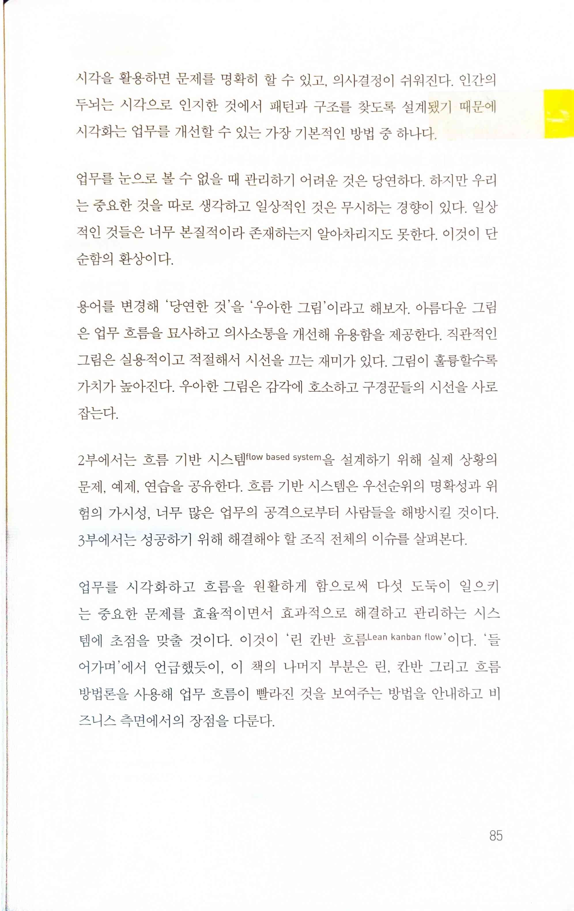

> 시각을 활용하면 문제를 명확히 할 수 있고, 의사결정이 쉬워진다. 인간의 두뇌는 시각으로 인지한 것에서 패턴과 구조를 찾도록 설계됐기 때문에 시각화는 업무를 개선할 수 있는 가장 기본적인 방법 중 하나다.

## 2.1 업무 시각화하기

> 가시성 사분면
>
> 가시성이 중요한 이유는 대부분의 사람들이 어떤 것을 생각할 때 단어보다 그림을 떠올리기 때문이다. 이는 단순히 학습 방식 선호도의 차이를 넘어, 시각-공간 학습자는 청각-순차 학습자와 다른 뇌조직을 갖기 때문인데, 사람들은 듣는 것보다 보는 것으로 더 쉽게 학습한다.

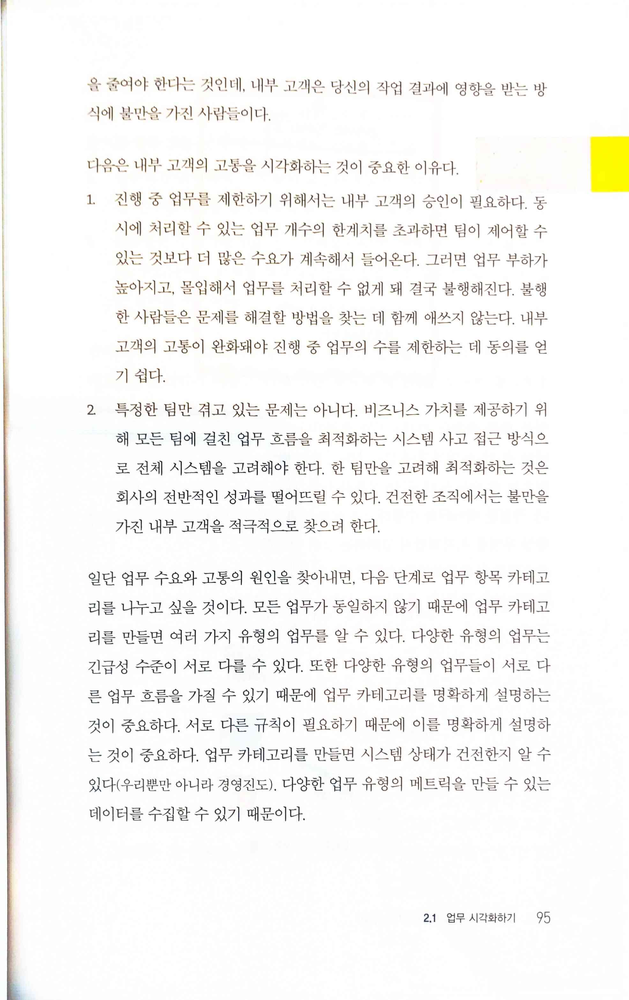

> 내부 고객은 당신의 작업 결과에 영향을 받는 방식에 불만을 가진 사람들이다.
>
> 다음은 내부 고객의 고통을 시각화하는 것이 중요한 이유다.
>
> 1. 진행 중 업무를 제한하기 위해서는 내부 고객의 승인이 필요하다. 동시에 처리할 수 있는 업무 개수의 한계치를 초과하면 팀이 제어할 수 있는 것보다 더 많은 수요가 계속해서 들어온다. 그러면 업무 부하가 높아지고, 몰입해서 업무를 처리할 수 없게 돼 결국 불행해진다. 불행한 사람들은 문제를 해결할 방법을 찾는 데 함께 애쓰지 않는다. 내부 고객의 고통이 완화돼야 진행 중 업무의 수를 제한하는 데 동의를 얻기 쉽다.
>
> 2. 특정한 팀만 겪고 있는 문제는 아니다. 비즈니스 가치를 제공하기 위해 모든 팀에 걸친 업무 흐름을 최적화하는 시스템 사고 접근 방식으로 전체 시스템을 고려해야 한다. 한 팀만을 고려해 최적화하는 것은 회사의 전반적인 성과를 떨어뜨릴 수 있다. 건전한 조직에서는 불만을 가진 내부 고객을 적극적으로 찾으려 한다.

> 적절한 데이터를 수집하고 문제를 해결하기 위한 가시성을 확보하려면 항상 무엇을 시각화할지 고려하는 것이 중요하다.

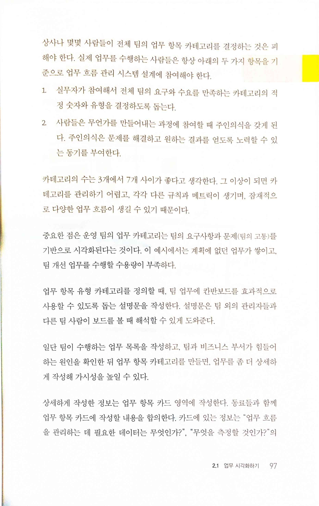

> 실제 업무를 수행하는 사람들은 항상 아래의 두 가지 항목을 기준으로 업무 흐름 관리 시스템 설계에 참여해야 한다.
>
> 1. 실무자가 참여해서 전체 팀의 요구와 수요를 만족하는 카테고리의 적정 숫자와 유형을 결정하도록 돕는다.
>
> 2. 사람들은 무언가를 만들어내는 과정에 참여할 때 주인의식을 갖게 된다. 주인의식은 문제를 해결하고 원하는 결과를 얻도록 노력할 수 있는 동기를 부여한다.
>
> 중요한 점은 운영 팀의 업무 카테고리는 팀의 요구사항과 문제 (팀의 고통)를 기반으로 시각화된다는 것이다. 이 예시에서는 계획에 없던 업무가 쌓이고 팀 개선 업무를 수행할 수용량이 부족하다.

## 2.2 '너무 많은 진행 중 업무' 도둑 잡기
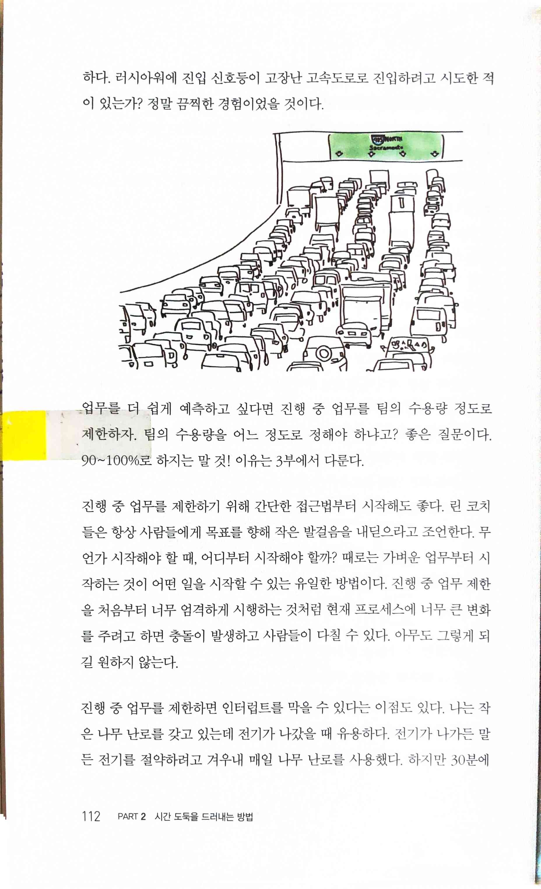

> 업무를 더 쉽게 예측하고 싶다면 진행 중 업무를 팀의 수용량 정도로 제한하자.
>
> 진행 중 업무를 제한하기 위해 간단한 접근법부터 시작해도 좋다. 린 코치들은 항상 사람들에게 목표를 향해 작은 발걸음을 내딛으라고 조언한다. 무언가 시작해야 할 때, 어디부터 시작해야 할까? 때로는 가벼운 업무부터 시작하는 것이 어떤 일을 시작할 수 있는 유일한 방법이다. 진행 중 업무 제한을 처음부터 너무 엄격하게 시행하는 것처럼 현재 프로세스에 너무 큰 변화를 주려고 하면 충돌이 발생하고 사람들이 다칠 수 있다. 아무도 그렇게 되길 원하지 않는다.

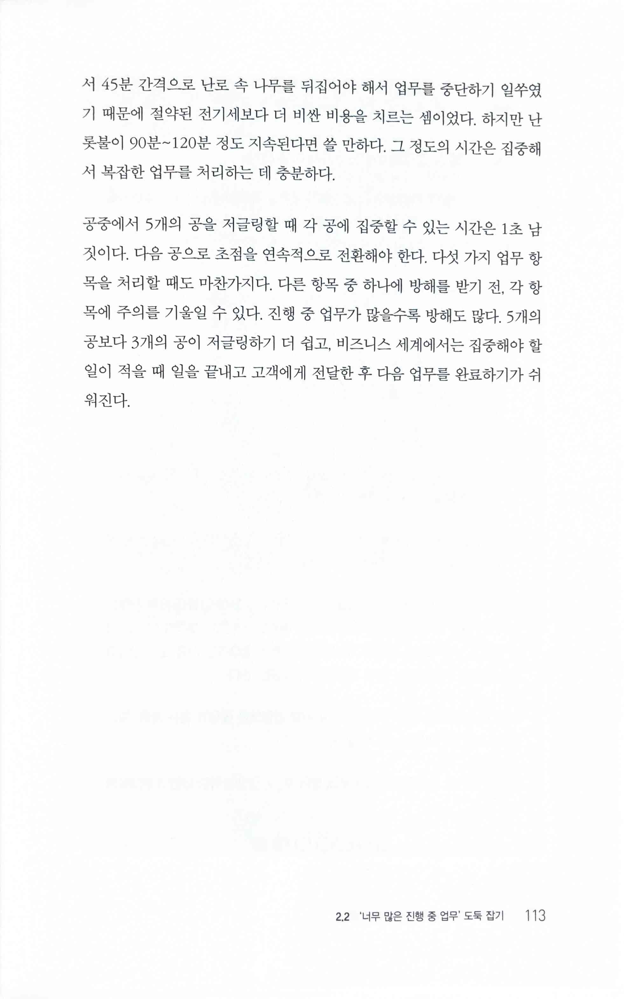

> 비즈니스 세계에서는 집중해야 할일이 적을 때 일을 끝내고 고객에게 전달한 후 다음 업무를 완료하기가 쉬워진다.

## 2.3 의존성 드러내기

> 우리가 하는 가장 어려운 일은 팀 간의 의사소통이다. - 트로이 매그니스(Troy Magennis)

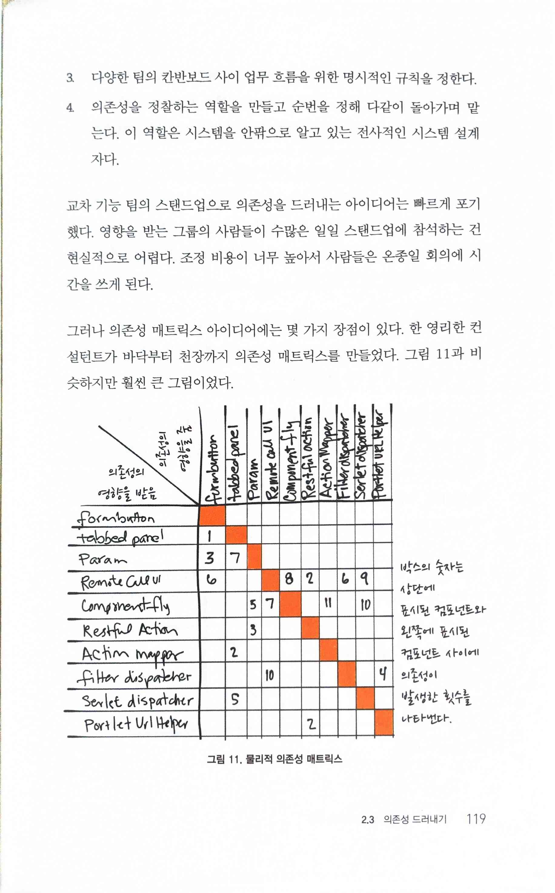

> 의존성 매트릭스

> 의존성 보드

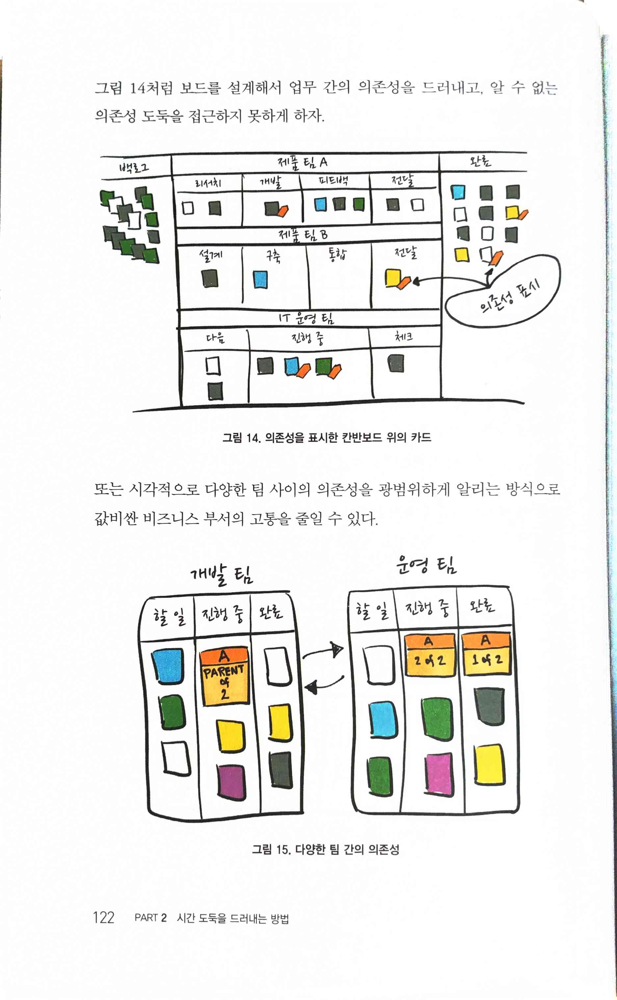

> 의존성을 표시한 칸반보드 위의 카드

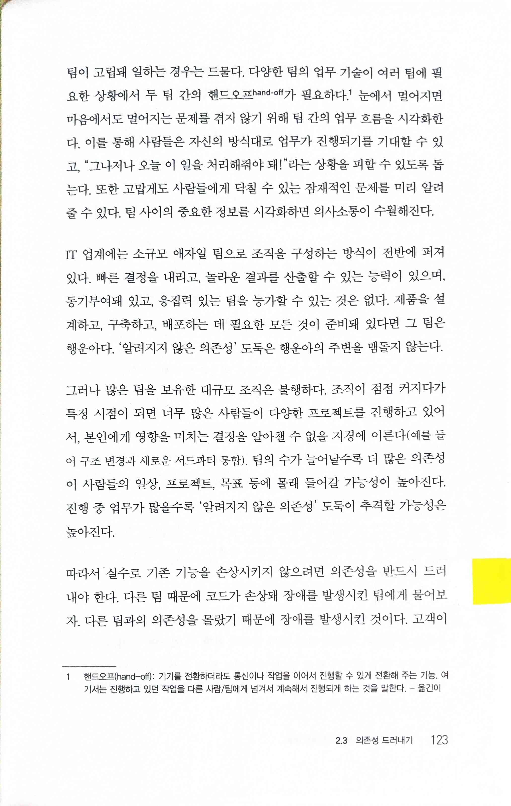

> 팀 사이의 중요한 정보를 시각화하면 의사소통이 수월해진다.
>
> 제품을 설계하고, 구축하고, 배포하는 데 필요한 모든 것이 준비돼 있다면 그 팀은 행운아다.
>
> 실수로 기존 기능을 손상시키지 않으려면 의존성을 반드시 드러내야 한다. 다른 팀 때문에 코드가 손상돼 장애를 발생시킨 팀에게 물어보자. 다른 팀과의 의존성을 몰랐기 때문에 장애를 발생시킨 것이다.

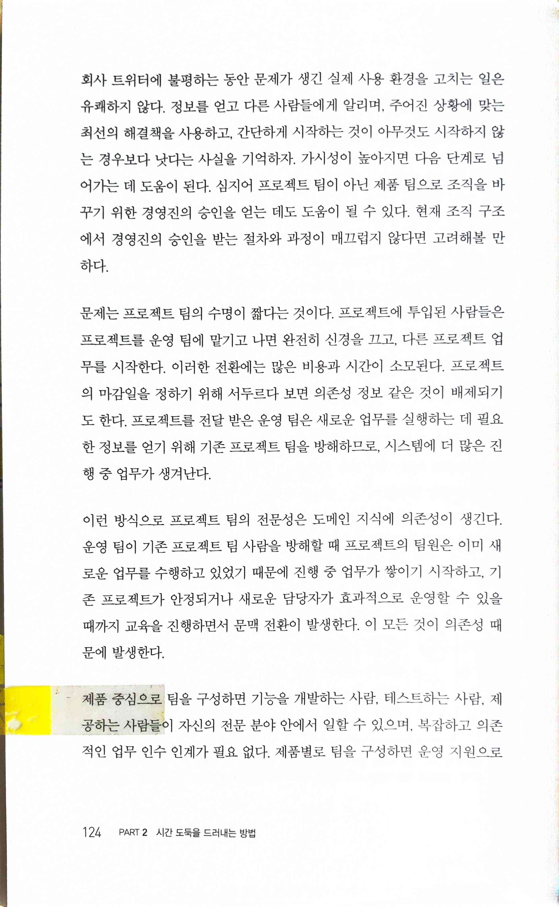

> 프로젝트 팀의 전문성은 도메인 지식에 의존성이 생긴다. 운영 팀이 기존 프로젝트 팀 사람을 방해할 때 프로젝트의 팀원은 이미 새로운 업무를 수행하고 있었기 때문에 진행 중 업무가 쌓이기 시작하고, 기존 프로젝트가 안정되거나 새로운 담당자가 효과적으로 운영할 수 있을 때까지 교육을 진행하면서 문맥 전환이 발생한다. 이 모든 것이 의존성 때문에 발생한다.
>
> 제품 중심으로 팀을 구성하면 기능을 개발하는 사람, 테스트하는 사람, 제공하는 사람들이 자신의 전문 분야 안에서 일할 수 있으며, 복잡하고 의존적인 업무 인수 인계가 필요 없다. 제품별로 팀을 구성하면 운영 지원으로 전환하는 과정에서 발생하는 의존성이 줄어든다.

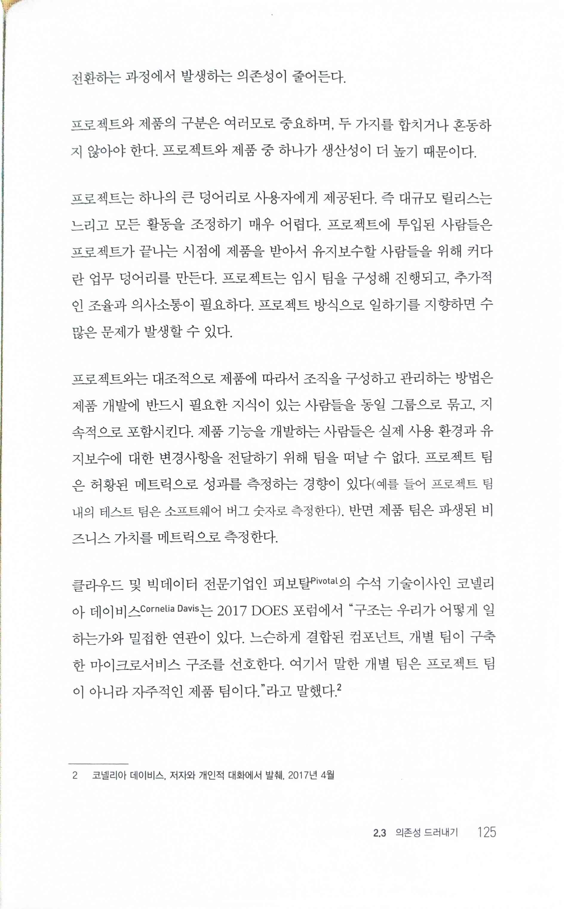

> 프로젝트와 제품의 구분은 여러모로 중요하며, 두 가지를 합치거나 혼동하지 않아야 한다. 프로젝트와 제품 중 하나가 생산성이 더 높기 때문이다.
>
> 프로젝트와는 대조적으로 제품에 따라서 조직을 구성하고 관리하는 방법은 제품 개발에 반드시 필요한 지식이 있는 사람들을 동일 그룹으로 묶고, 지속적으로 포함시킨다. 제품 기능을 개발하는 사람들은 실제 사용 환경과 유지보수에 대한 변경사항을 전달하기 위해 팀을 떠날 수 없다. 프로젝트 팀은 허황된 메트릭으로 성과를 측정하는 경향이 있다(예를 들어 프로젝트 팀내의 테스트 팀은 소프트웨어 버그 숫자로 측정한다). 반면 제품 팀은 파생된 비즈니스 가치를 메트릭으로 측정한다.

## 2.4 완전 범죄 - 계획에 없던 업무 차단하기
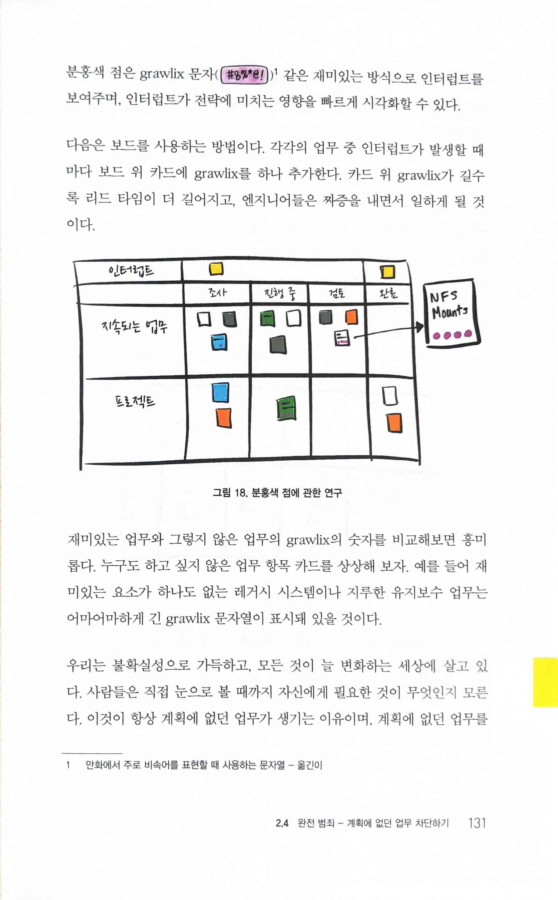

> 우리는 불확실성으로 가득하고, 모든 것이 늘 변화하는 세상에 살고 있다. 사람들은 직접 눈으로 볼 때까지 자신에게 필요한 것이 무엇인지 모른다. 이것이 항상 계획에 없던 업무가 생기는 이유이며, 계획에 없던 업무를 계획해야 하는 이유다.

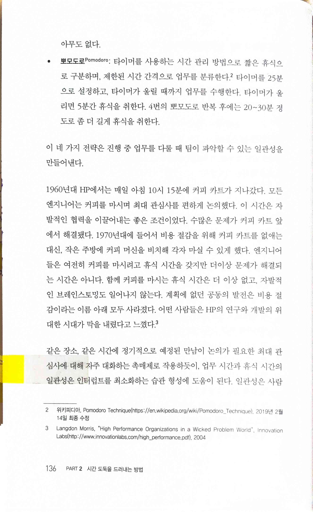 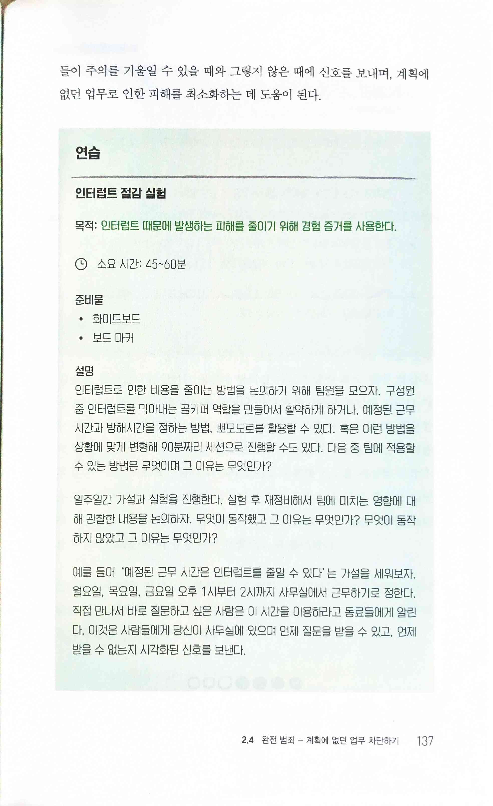

> 같은 장소, 같은 시간에 정기적으로 예정된 만남이 논의가 필요한 최대 관심사에 대해 자주 대화하는 촉매제로 작용하듯이, 업무 시간과 휴식 시간의 일관성은 인터럽트를 최소화하는 습관 형성에 도움이 된다. 일관성은 사람들이 주의를 기울일 수 있을 때와 그렇지 않은 때에 신호를 보내며, 계획에 없던 업무로 인한 피해를 최소화하는 데 도움이 된다.

## 2.5 우선순위 지정하기

> 중요한 것이 많을 수 있지만, 가장 중요한 것은 오직 하나다. - 로스 가버 (Ross Garber)

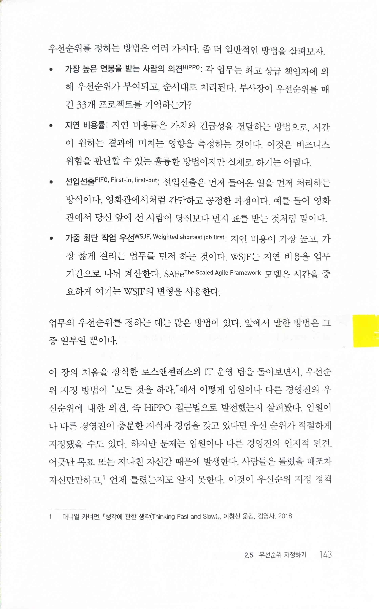

> 우선순위를 정하는 방법은 여러 가지다
>
> 가장 높은 연봉을 받는 사람의 의견HIPPO: 각 업무는 최고 상급 책임자에 의해 우선순위가 부여되고, 순서대로 처리된다.
>
> 지연 비용률: 지연 비용률은 가치와 긴급성을 전달하는 방법으로, 시간이 원하는 결과에 미치는 영향을 측정하는 것이다. 이것은 비즈니스 위험을 판단할 수 있는 훌륭한 방법이지만 실제로 하기는 어렵다.
>
> 선입선출FIFO First-in, first-out: 선입선출은 먼저 들어온 일을 먼저 처리하는 방식이다.
>
> 가중 최단 작업 우선WSJF. Weighted shortest job first : 지연 비용이 가장 높고, 가장 짧게 걸리는 업무를 먼저 하는 것이다. WSJF는 지연 비용을 업무기간으로 나눠 계산한다. SAFeThe Scaled Agile Framework 모델은 시간을 중요하게 여기는 WSJF의 변형을 사용한다.

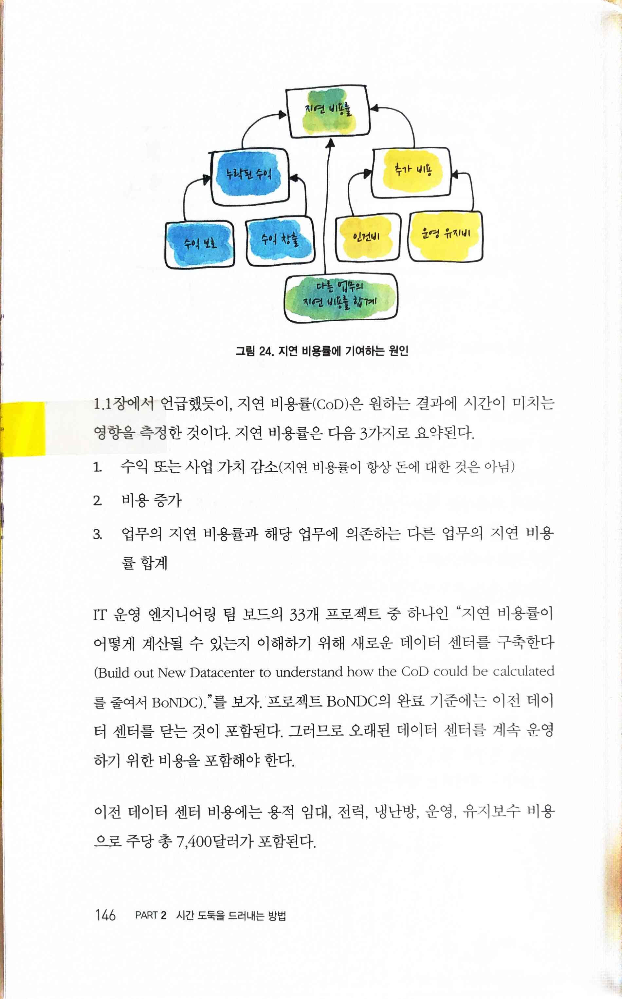 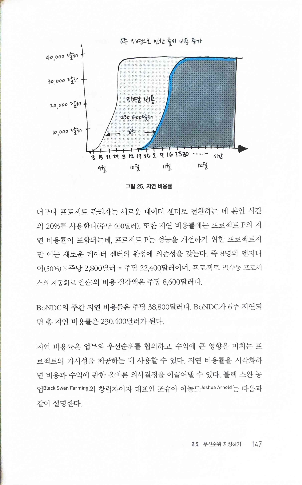 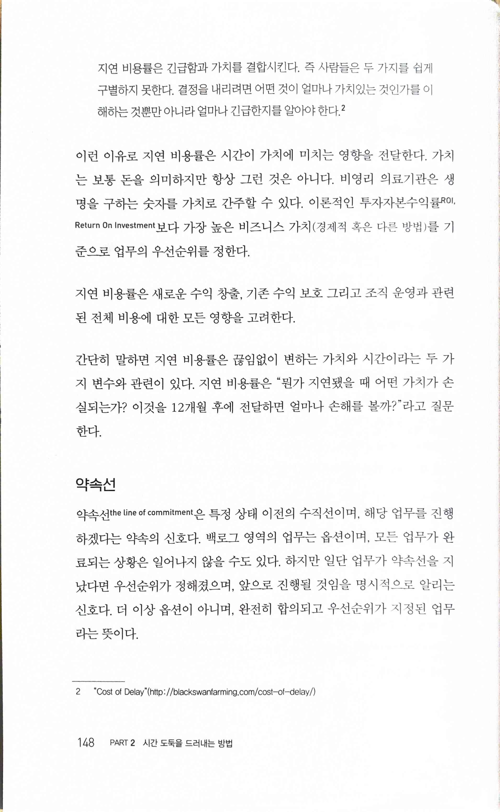

> 지연 비용률(CoD)은 원하는 결과에 시간이 미치는 영향을 측정한 것이다. 지연 비용률은 다음 3가지로 요약된다.
>
> 1 수익 또는 사업 가치 감소(지연 비용률이 항상 돈에 대한 것은 아님)
>
> 2 비용 증가
>
> 3 업무의 지연 비용률과 해당 업무에 의존하는 다른 업무의 지연 비용률 합계
* [Cost of Delay | Black Swan Farming](https://blackswanfarming.com/cost-of-delay/)

## 2.6 방치된 업무 예방하기

> 중요한 것을 긴급하게 만들지 말라. - 엘리야후 골드렛(Eiyahu M. Goldraft)

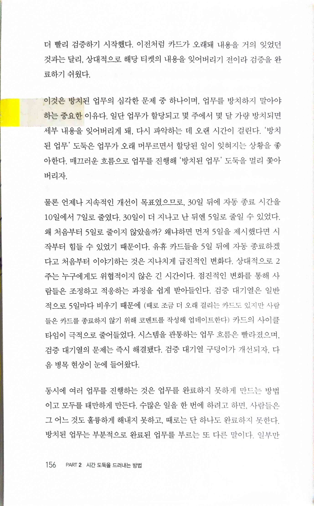

> 업무를 방치하지 말아야 하는 중요한 이유다. 일단 업무가 할당되고 몇 주에서 몇 달 가량 방치되면 세부 내용을 잊어버리게 돼, 다시 파악하는 데 오랜 시간이 걸린다. '방치된 업무' 도둑은 업무가 오래 머무르면서 할당된 일이 잊혀지는 상황을 좋아한다. 매끄러운 흐름으로 업무를 진행해 '방치된 업무' 도둑을 멀리 쫓아버리자.

## 2.7 유용한 보드 설계 예제

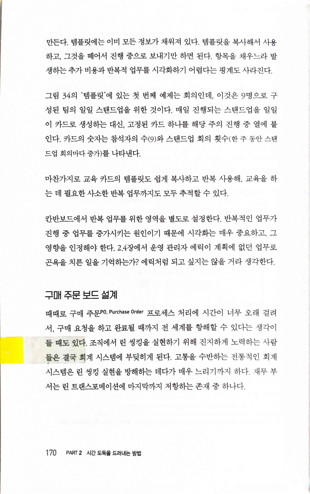

> 조직에서 린 씽킹을 실현하기 위해 진지하게 노력하는 사람들은 결국 회계 시스템에 부딪히게 된다. 고통을 수반하는 전통적인 회계 시스템은 린 씽킹 실현을 방해하는 데다가 매우 느리기까지 하다. 재무 부서는 린 트랜스포메이션에 마지막까지 저항하는 존재 중 하나다.

# PART 3 측정 메트릭, 피드백 그리고 주변 환경

## 3.1 측정 메트릭 혹은 비용
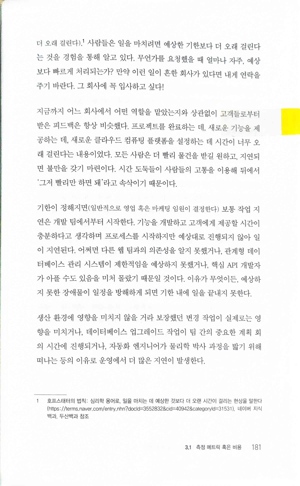

> 지금까지 어느 회사에서 어떤 역할을 맡았는지와 상관없이 고객들로부터 받은 피드백은 항상 비슷했다. 프로젝트를 완료하는 데, 새로운 기능을 제공하는 데, 새로운 클라우드 컴퓨팅 플랫폼을 설정하는 데 시간이 너무 오래 걸린다는 내용이었다. 모든 사람은 더 빨리 물건을 받길 원하고, 지연되면 불만을 갖기 마련이다. 시간 도둑들이 사람들의 고통을 이용해 뒤에서 '그저 빨리만 하면 돼'라고 속삭이기 때문이다.
* [호프스태터의 법칙](https://terms.naver.com/entry.naver?docId=3552832&cid=40942&categoryId=31531) 심리학 용어로, 일을 마치는 데 예상한 것보다 더 오랜 시간이 걸리는 현상을 말한다

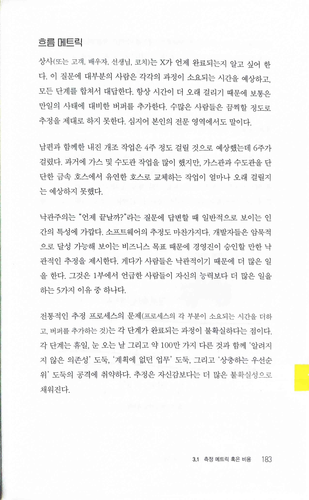

> 수많은 사람들은 끔찍할 정도로 추정을 제대로 하지 못한다. 심지어 본인의 전문 영역에서도 말이다.
>
> 전통적인 추정 프로세스의 문제 (프로세스의 각 부분이 소요되는 시간을 더하고, 버퍼를 추가하는 것)는 각 단계가 완료되는 과정이 불확실하다는 점이다... 추정은 자신감보다는 더 많은 불확실성으로 채워진다.

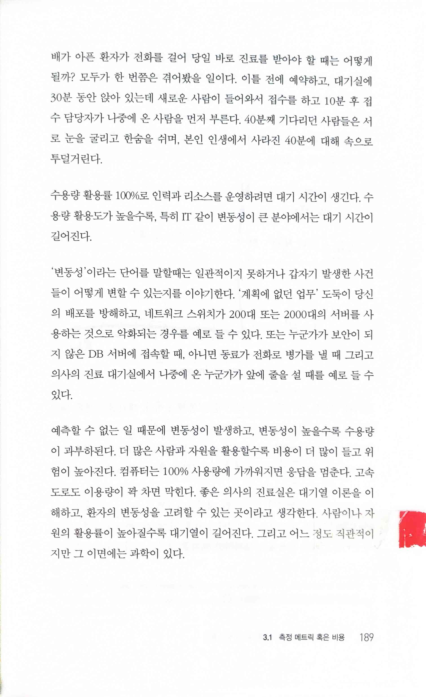

> 예측할 수 없는 일 때문에 변동성이 발생하고, 변동성이 높을수록 수용량이 과부하된다. 더 많은 사람과 자원을 활용할수록 비용이 더 많이 들고 위험이 높아진다. 컴퓨터는 100% 사용량에 가까워지면 응답을 멈춘다. 고속도로도 이용량이 꽉 차면 막힌다. 좋은 의사의 진료실은 대기열 이론을 이해하고, 환자의 변동성을 고려할 수 있는 곳이라고 생각한다. 사람이나 자원의 활용률이 높아질수록 대기열이 길어진다. 그리고 어느 정도 직관적이지만 그 이면에는 과학이 있다.

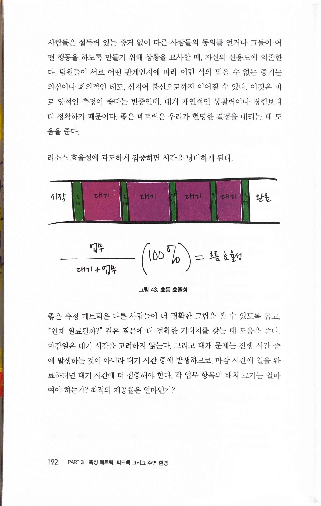

> 사람들은 설득력 있는 증거 없이 다른 사람들의 동의를 얻거나 그들이 어떤 행동을 하도록 만들기 위해 상황을 묘사할 때, 자신의 신용도에 의존한다. 팀원들이 서로 어떤 관계인지에 따라 이런 식의 믿을 수 없는 증거는 의심이나 회의적인 태도, 심지어 불신으로까지 이어질 수 있다. 이것은 바로 양적인 측정이 좋다는 반증인데, 대개 개인적인 통찰력이나 경험보다 더 정확하기 때문이다. 좋은 메트릭은 우리가 현명한 결정을 내리는 데 도움을 준다.
>
> 좋은 측정 메트릭은 다른 사람들이 더 명확한 그림을 볼 수 있도록 돕고, "언제 완료될까?" 같은 질문에 더 정확한 기대치를 갖는 데 도움을 준다. 마감일은 대기 시간을 고려하지 않는다. 그리고 대개 문제는 진행 시간 중에 발생하는 것이 아니라 대기 시간 중에 발생하므로, 마감 시간에 일을 완료하려면 대기 시간에 더 집중해야 한다.

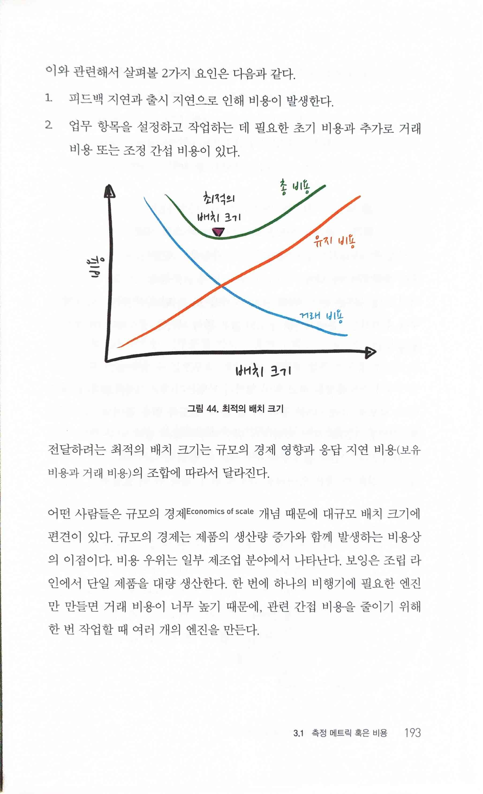

> 전달하려는 최적의 배치 크기는 규모의 경제 영향과 응답 지연 비용(보유비용과 거래 비용)의 조합에 따라서 달라진다.

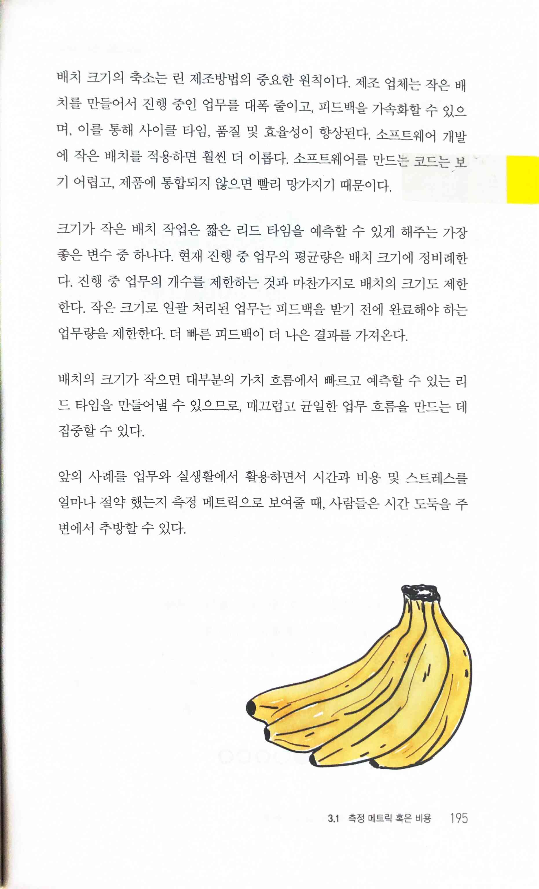

> 배치 크기의 축소는 린 제조방법의 중요한 원칙이다. 제조 업체는 작은 배치를 만들어서 진행 중인 업무를 대폭 줄이고, 피드백을 가속화할 수 있으며, 이를 통해 사이클 타임, 품질 및 효율성이 향상된다. 소프트웨어 개발에 작은 배치를 적용하면 훨씬 더 이롭다. 소프트웨어를 만드는 코드는 보기 어렵고, 제품에 통합되지 않으면 빨리 망가지기 때문이다.
>
> 크기가 작은 배치 작업은 짧은 리드 타임을 예측할 수 있게 해주는 가장 좋은 변수 중 하나다. 현재 진행 중 업무의 평균량은 배치 크기에 정비례한다. 진행 중 업무의 개수를 제한하는 것과 마찬가지로 배치의 크기도 제한한다. 작은 크기로 일괄 처리된 업무는 피드백을 받기 전에 완료해야 하는 업무량을 제한한다. 더 빠른 피드백이 더 나은 결과를 가져온다.
>
> 배치의 크기가 작으면 대부분의 가치 흐름에서 빠르고 예측할 수 있는 리드 타임을 만들어낼 수 있으므로, 매끄럽고 균일한 업무 흐름을 만드는 데 집중할 수 있다.

## 3.2 시간 도둑 다이어그램

> 당신의 의사결정을 돕는 메트릭을 수집하는 데 에너지를 투자하라 -에릭 리스(Eric Ries)

## 3.3 운영 리뷰

> 흐름이 프로세스를 관리하게 하고, 경영진이 흐름을 관리하지 않도록 하라. -오노 다이이치(Ohno Taichi)

## 3.4 회의의 기술

> 개선을 하다 보면 우선순위와 실천법에 마찰이 발생한다. - 스콧 나셀로(Scott Nasello)

## 3.5 추천하지 않는 사례

> 어떤 기준으로 나를 평가할지 말하면 내가 어떻게 행동할지 말해주겠다. - 엘리야후 골드렛(Eliyahu M. Goldraft)

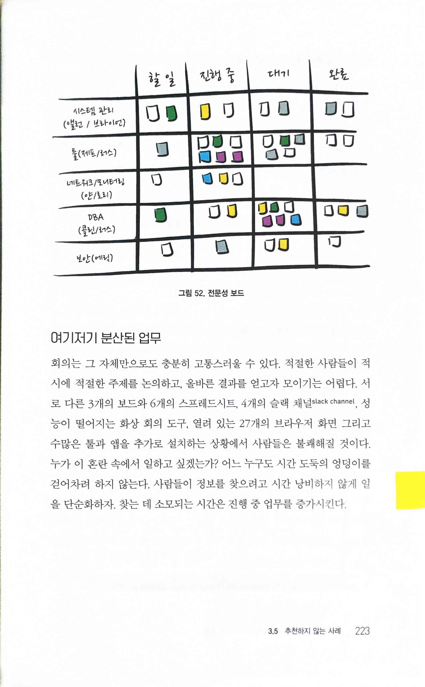

> 회의는 그 자체만으로도 충분히 고통스러울 수 있다. 적절한 사람들이 적시에 적절한 주제를 논의하고, 올바른 결과를 얻고자 모이기는 어렵다... 사람들이 정보를 찾으려고 시간 낭비하지 않게 일을 단순화하자. 찾는 데 소모되는 시간은 진행 중 업무를 증가시킨다.

> 데이비드 맥캔들리스David McCandless는 업무를 시각화하기 위해 필요한 4가지 요소를 다음과 같이 소개한다.
>
> ● 정보: 데이터는 무결성이 있어야 하며 정확해야 한다.
>
> ● 기능: 목표는 유용하고 효율적이어야 한다.
>
> ● 시각적 형식: 메타포는 아름답고 구조적이어야 한다.
>
> ● 스토리: 컨셉은 흥미롭고 관련 있어야 한다
>
> 보드를 눈에 잘 들어올 수 있게 만들어 사람들의 관심과 참여가 유지되도록 하고, 혼란과 시간 낭비를 피하자. 여러 가지 도구가 사용되면 의사소통이 어려워질 수 있다. 다른 도구와 통합하기 쉬운 우아한 시각적 요소들을 사용해 의사소통을 개선하자.
* [What Makes A Good Data Visualization? — Information is Beautiful](https://informationisbeautiful.net/visualizations/what-makes-a-good-data-visualization/)

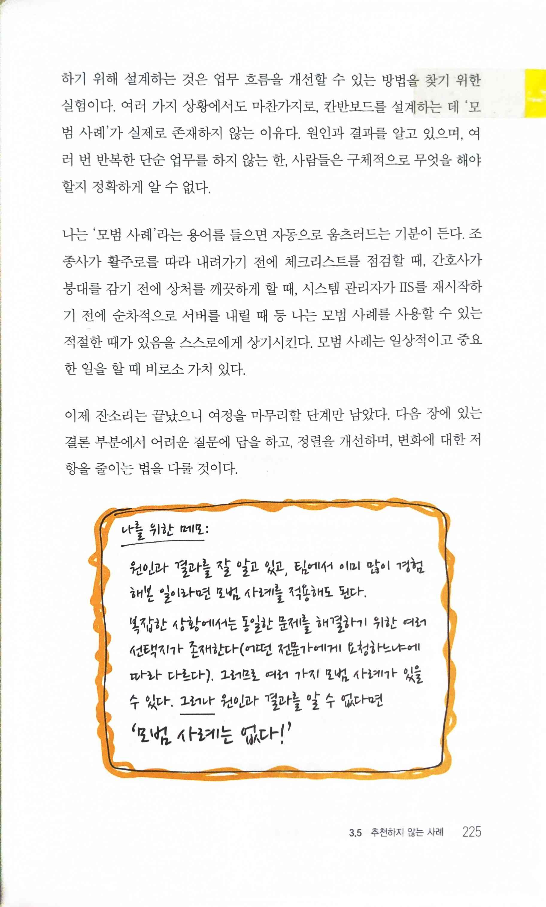

> 처음으로 보드를 사용하기 위해 설계하는 것은 업무 흐름을 개선할 수 있는 방법을 찾기 위한 실험이다. 여러 가지 상황에서도 마찬가지로, 칸반보드를 설계하는 데 모범 사례'가 실제로 존재하지 않는 이유다. 원인과 결과를 알고 있으며, 여러 번 반복한 단순 업무를 하지 않는 한, 사람들은 구체적으로 무엇을 해야할지 정확하게 알 수 없다.

# 결론: 잘못된 것 바로 잡기
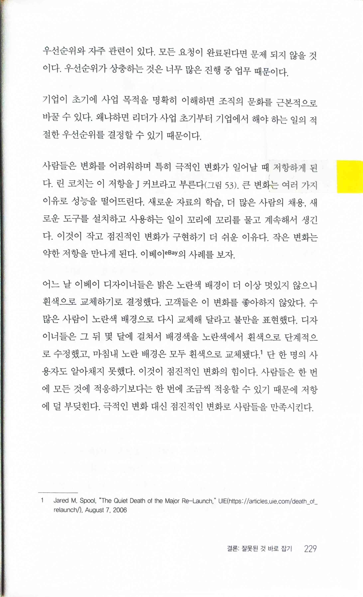

> 사람들은 변화를 어려워하며 특히 극적인 변화가 일어날 때 저항하게 된다. 린 코치는 이 저항을J커브라고 부른다(그림 53). 큰 변화는 여러 가지 이유로 성능을 떨어뜨린다. 새로운 자료의 학습, 더 많은 사람의 채용, 새로운 도구를 설치하고 사용하는 일이 꼬리에 꼬리를 물고 계속해서 생긴다. 이것이 작고 점진적인 변화가 구현하기 더 쉬운 이유다. 작은 변화는 약한 저항을 만나게 된다.

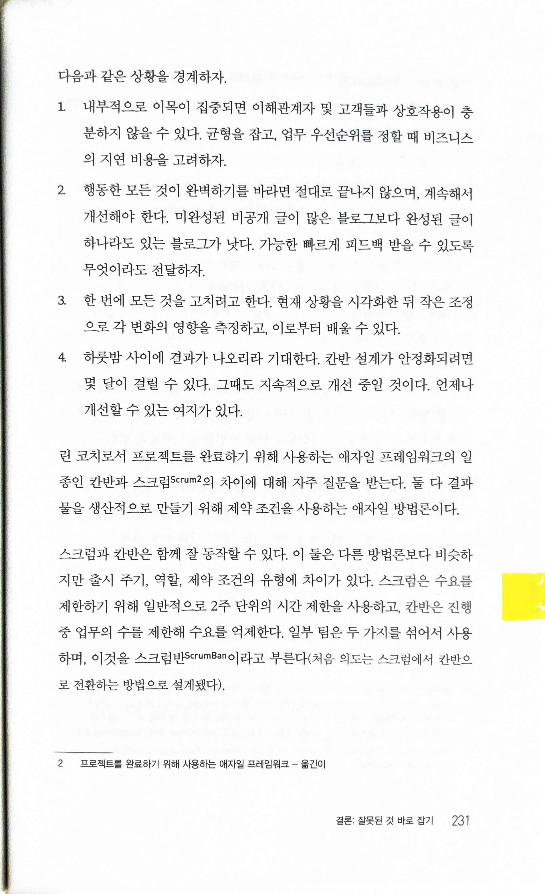

> 다음과 같은 상황을 경계하자.
>
> 1 내부적으로 이목이 집중되면 이해관계자 및 고객들과 상호작용이 충분하지 않을 수 있다. 균형을 잡고, 업무 우선순위를 정할 때 비즈니스의 지연 비용을 고려하자.
>
> 2 행동한 모든 것이 완벽하기를 바라면 절대로 끝나지 않으며, 계속해서 개선해야 한다. 미완성된 비공개 글이 많은 블로그보다 완성된 글이 하나라도 있는 블로그가 낫다. 가능한 빠르게 피드백 받을 수 있도록 무엇이라도 전달하자.
>
> 3 한 번에 모든 것을 고치려고 한다. 현재 상황을 시각화한 뒤 작은 조정으로 각 변화의 영향을 측정하고, 이로부터 배울 수 있다.
>
> 4 하룻밤 사이에 결과가 나오리라 기대한다. 칸반 설계가 안정화되려면 몇 달이 걸릴 수 있다. 그때도 지속적으로 개선 중일 것이다. 언제나 개선할 수 있는 여지가 있다.
>
> 스크럼과 칸반은 함께 잘 동작할 수 있다. 이 둘은 다른 방법론보다 비슷하지만 출시 주기, 역할, 제약 조건의 유형에 차이가 있다. 스크럼은 수요를 제한하기 위해 일반적으로 2주 단위의 시간 제한을 사용하고, 칸반은 진행 중 업무의 수를 제한해 수요를 억제한다. 일부 팀은 두 가지를 섞어서 사용하며, 이것을 스크럼반ScrumBan 이라고 부른다(처음 의도는 스크럼에서 칸반으로 전환하는 방법으로 설계됐다).