천원을 경영하라
===============
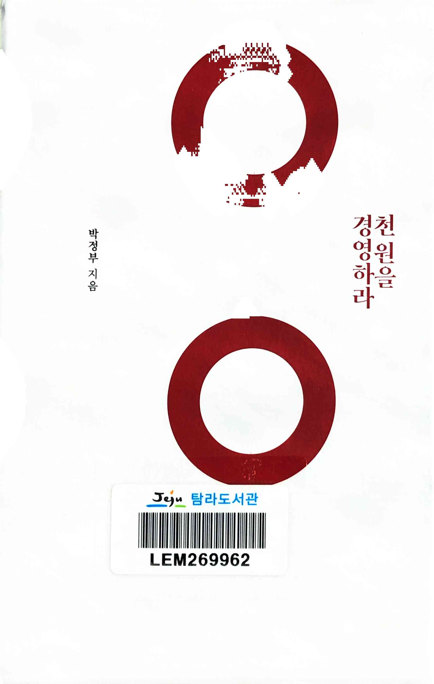

> `C(비용) < P(가격) < V(가치)`

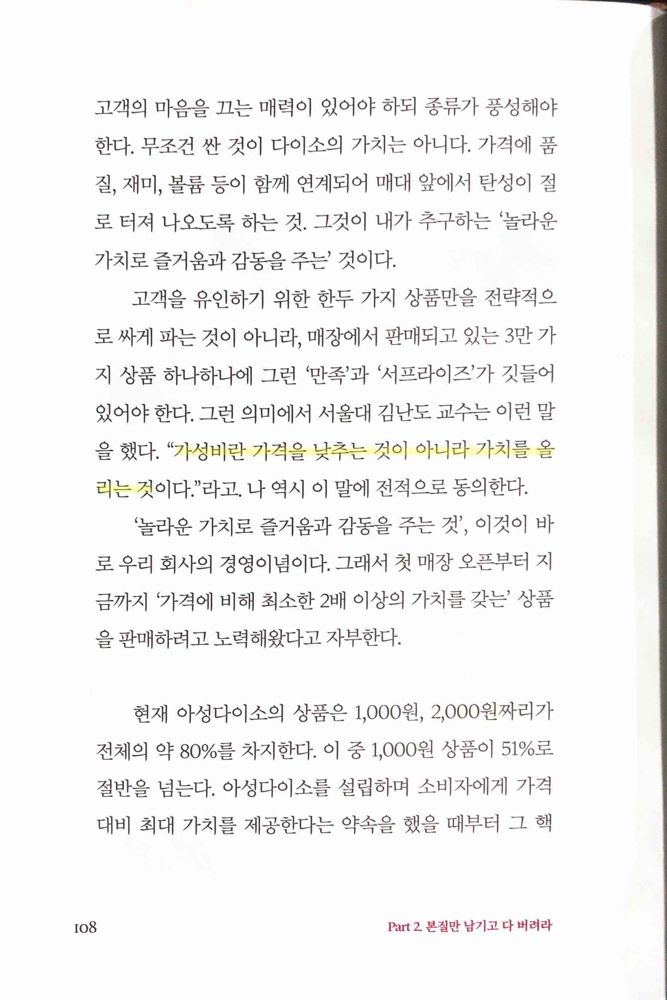

> 가성비란 낮추는 것이 아니라 가치를 올리는 것이다
* '아프니까 청춘이다'같은 건 가치가 낮은(혹은 없는) 책이라고 생각하지만 이 말에는 전적으로 동의

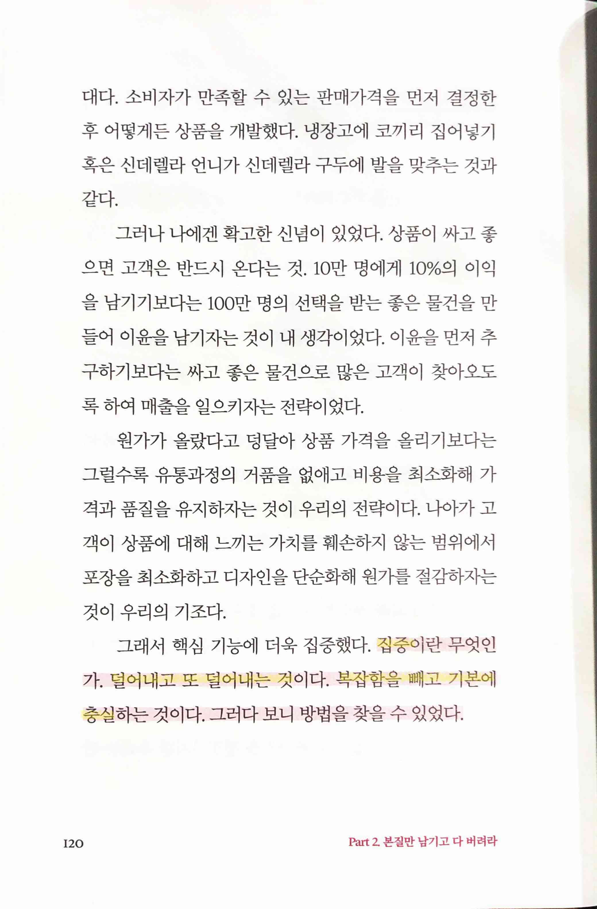

> `집중` 덜어내고 또 덜어내는 것. 복잡함을 빼고 기본에 충실

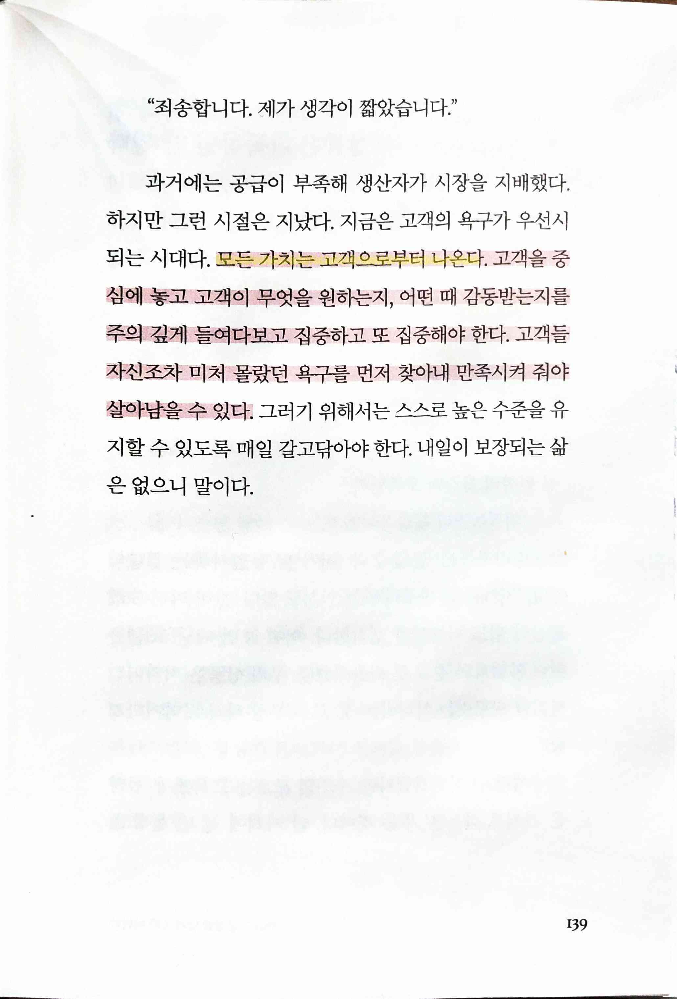

> 모든 가치는 고객으로부터 나온다

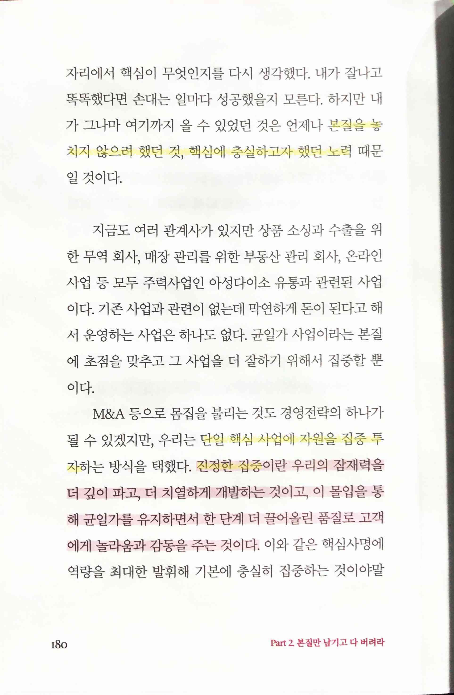

> 본질을 놓치지 않으려 했던 것, 핵심에 충실하고자 했던 노력

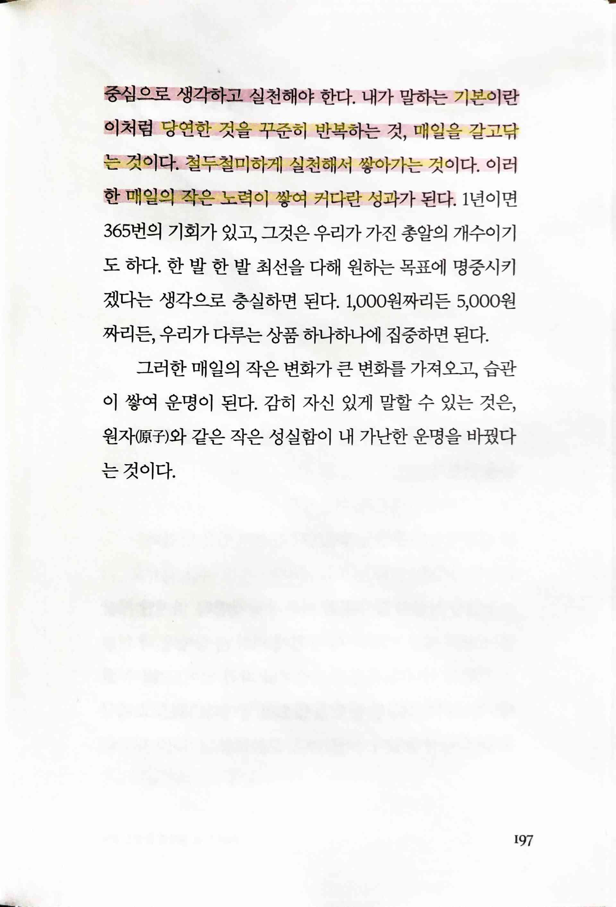

> `기본` 당연한 것을 꾸준히 반복하는 것, 매일을 갈고닦는 것. 철두철미하게 실천해서 쌓아가는 것. 매일의 작은 노력이 쌓여 커다란 성과

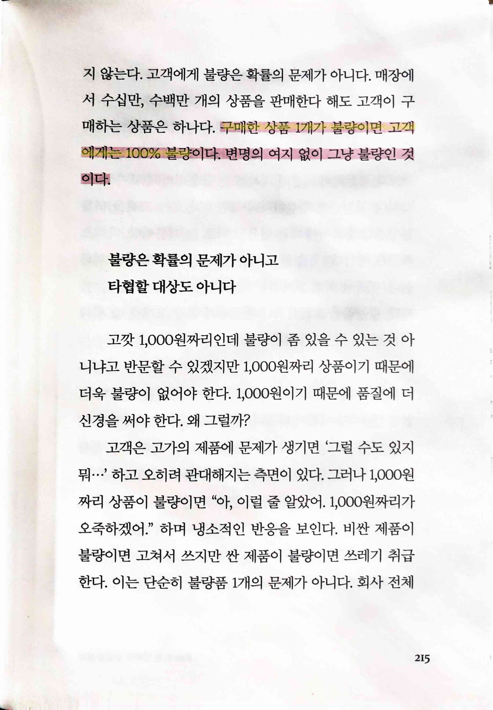

> 구매한 상품 1개가 불량이면 고객에게는 100% 불량

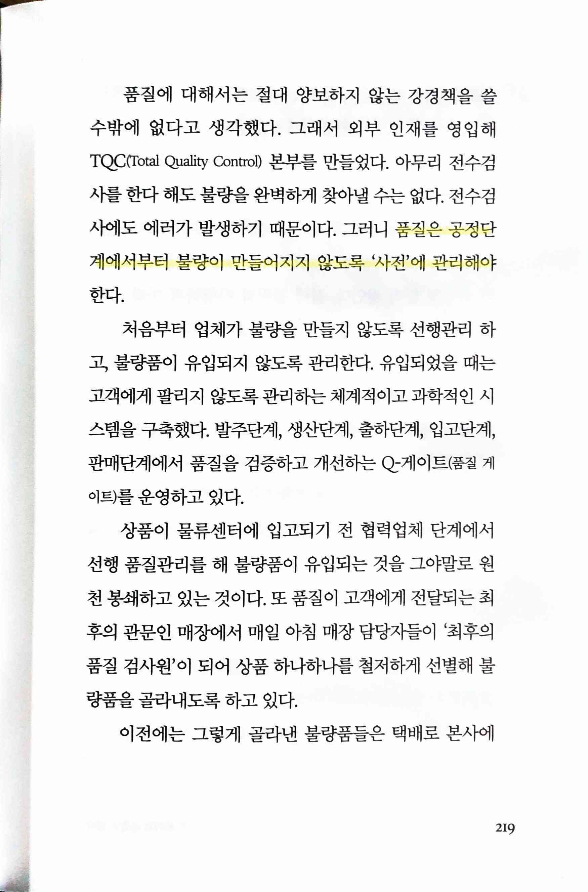 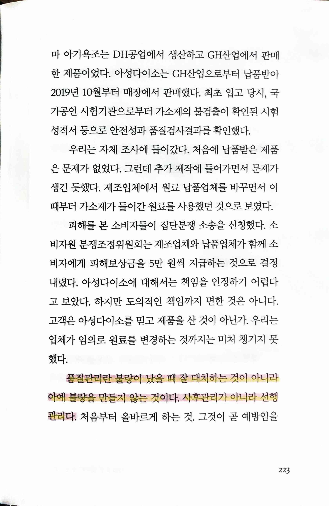 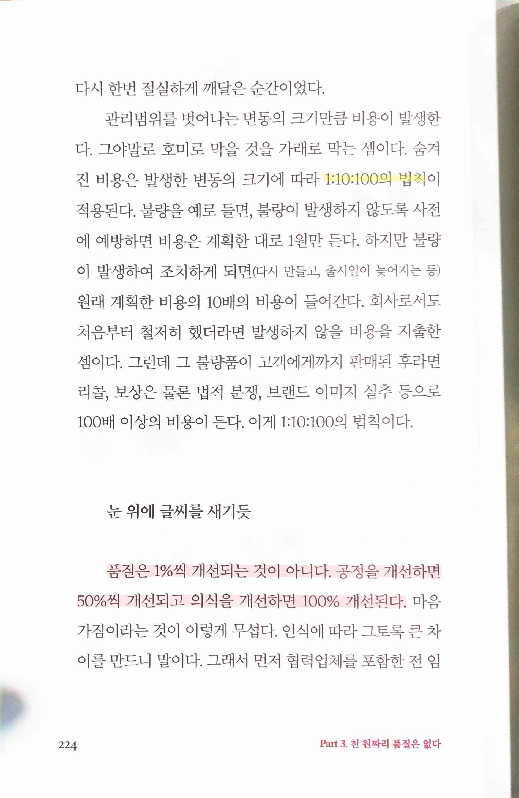

> `품질` 공정단계에서부터 불량이 만들어지지 않도록 '사전'에 관리해야
>
> 품질관리란 불량이 났을 때 잘 대처하는 것이 아니라 아예 불량을 만들지 않는 것. 사후관리가 아니라 선행관리. 처음부터 올바르게 하는 것. 예방
>
> 1:10:100의 법칙

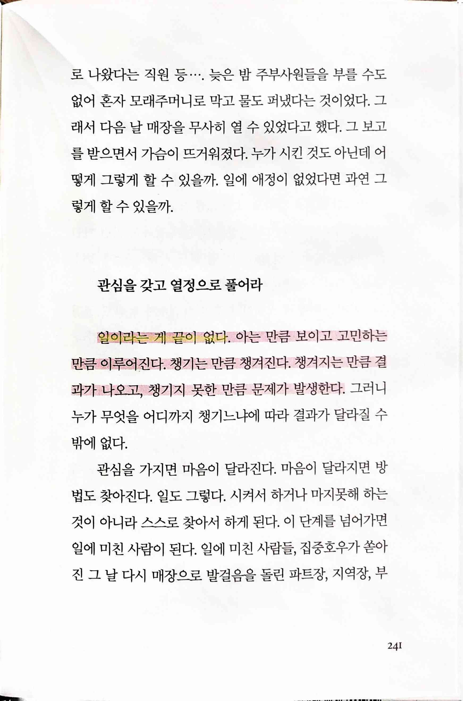

> 일이라는 게 끝이 없다.

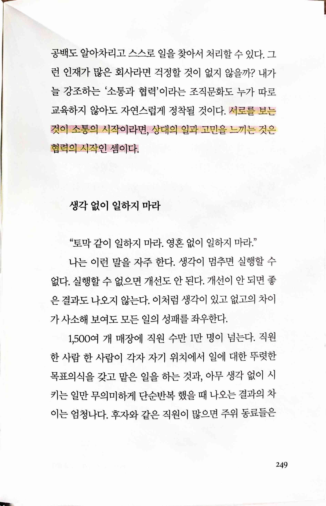

> 서로를 보는 것이 `소통`의 시작, 상대의 일과 고민을 느끼는 것은 `협력`의 시작