매니지먼트 3.0
==============
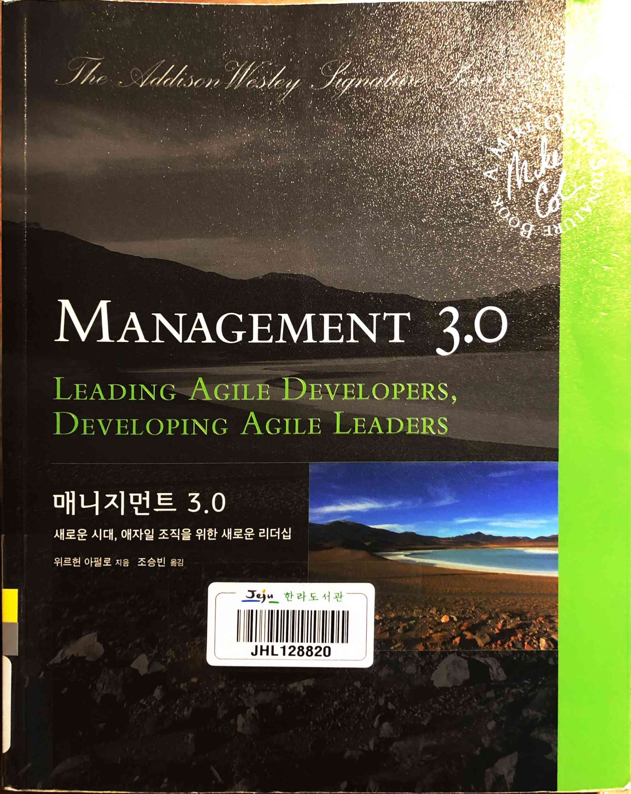

# 01 세상 일은 왜 그렇게 단순하지 않을까?
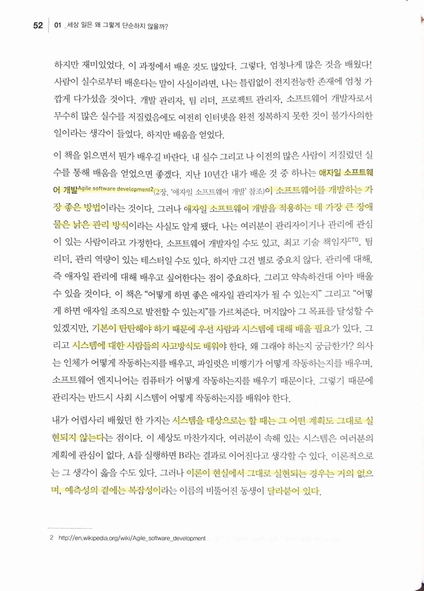

> 애자일 소프트웨어 개발 Agile software development 이 소프트웨어를 개발하는 가장 좋은 방법... 애자일 소프트웨어 개발을 적용하는 데 가장 큰 장애물은 낡은 관리 방식... 기본이 탄탄해야 하기 때문에 우선 사람과 시스템에 대해 배울 필요... 시스템에 대한 사람들의 사고방식도 배워야
>
> 시스템을 대상으로는 할 때는 그 어떤 계획도 그대로 실현되지 않는다... 이론이 현실에서 그대로 실현되는 경우는 거의 없으며, 예측성의 곁에는 복잡성이... 달라붙어 있다.

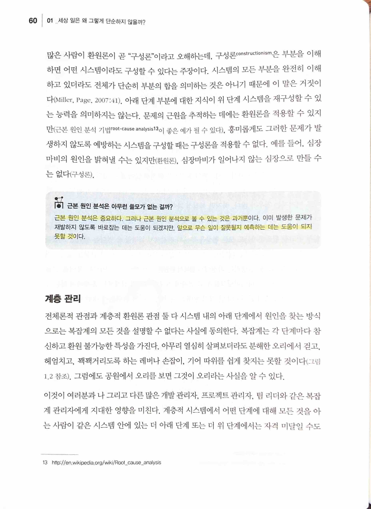

> 근본 원인 분석은 중요하다. 그러나 근본 원인 분석으로 볼 수 있는 것은 과거뿐... 앞으로 무슨 일이 잘못될지 예측하는 데는 도움이 되지못할 것

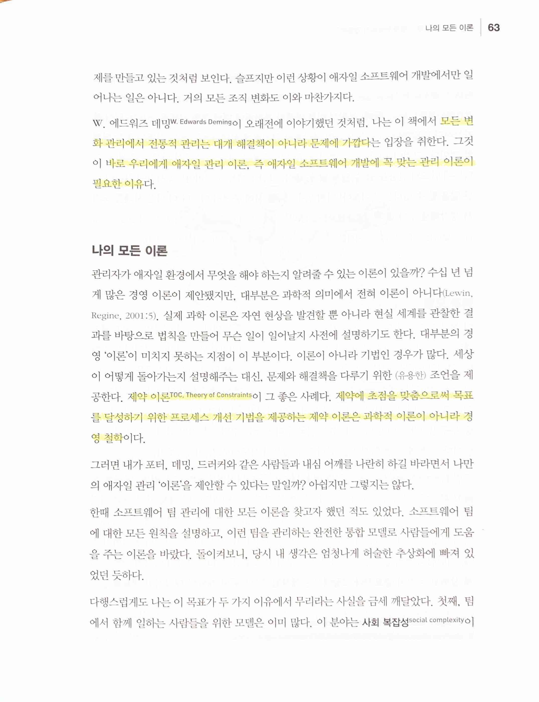

> `W. 에드워즈 데밍 W. Edwards Deming` 모든 변화 관리에서 전통적 관리는 대개 해결책이 아니라 문제에 가깝다... 바로 우리에게 애자일 관리 이론, 즉 애자일 소프트웨어 개발에 꼭 맞는 관리 이론이 필요한 이유
>
> `제약 이론 TOC. Theory of Constraints` 제약에 초점을 맞춤으로써 목표를 달성하기 위한 프로세스 개선 기법을 제공하는 제약 이론은 과학적 이론이 아니라 경영 철학
* [The Goal](https://github.com/hyunjun/bookmarks/blob/master/books/the_goal.md)

# 02 애자일 소프트웨어 개발

# 03 복잡계 이론
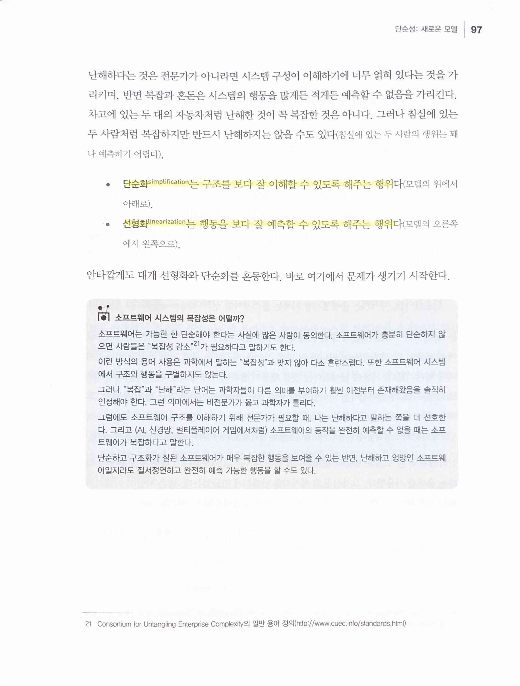

> `단순화 simplification` 구조를 보다 잘 이해할 수 있도록 해주는 행위(모델의 위에서 아래로)
>
> `선형화 linearization` 행동을 보다 잘 예측할 수 있도록 해주는 행위(모델의 오른쪽에서 왼쪽으로)

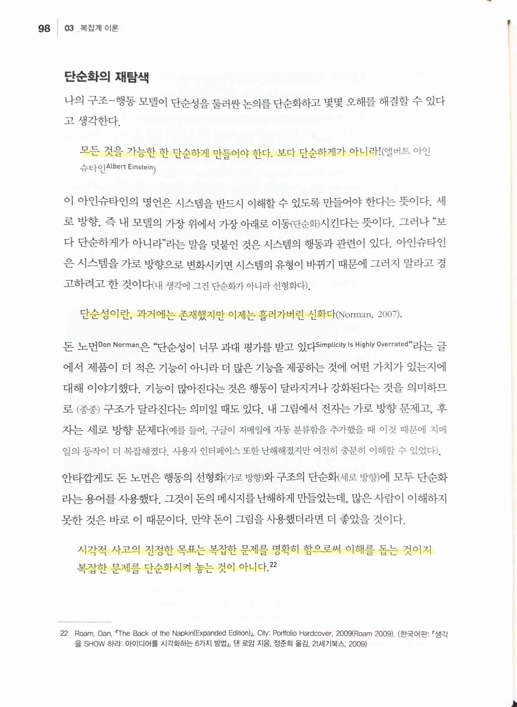

> 모든 것을 가능한 한 단순하게 만들어야 한다. 보다 단순하게가 아니라!(앨버트 아인슈타인Albert Einstein)
>
> 단순성이란, 과거에는 존재했지만 이제는 흘러가버린 신화다(Norman, 2007).
>
> 시각적 사고의 진정한 목표는 복잡한 문제를 명확히 함으로써 이해를 돕는 것이지 복잡한 문제를 단순화시켜 놓는 것이 아니다.
* flow diagram을 그려 business tech alignment를 달성하려는 내 생각의 목표도 여기에 있다는 걸 항상 잊지 말아야 겠다

# 04 정보 - 혁신 시스템
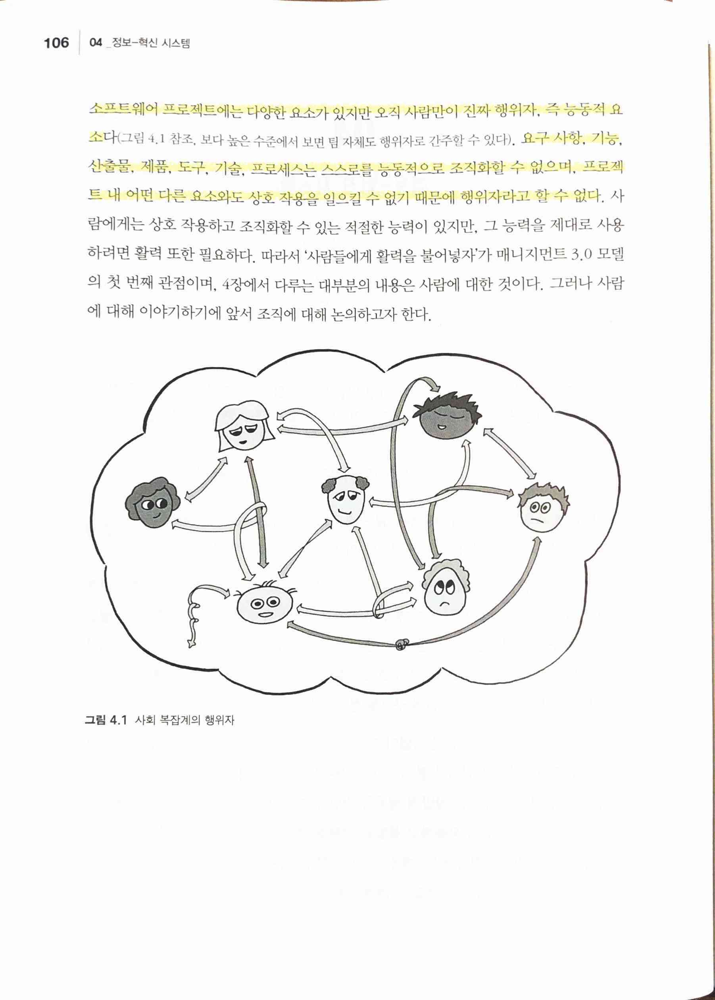

> 소프트웨어 프로젝트에는 다양한 요소가 있지만 오직 사람만이 진짜 행위자, 즉 능동적 요소... 요구 사항, 기능, 산출물, 제품, 도구, 기술, 프로세스는 스스로를 능동적으로 조직화할 수 없으며, 프로젝트 내 어떤 다른 요소와도 상호 작용을 일으킬 수 없기 때문에 행위자라고 할 수 없다.

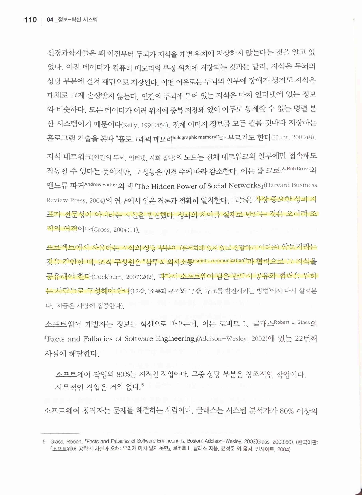

> 가장 중요한 성과 지표가 전문성이 아니라... 성과의 차이를 실제로 만드는 것은 오히려 조직의 연결
>
> 프로젝트에서 사용하는 지식의 상당 부분이 (문서화돼 있지 않고 전달하기 어려운) 암묵지라는 것을 감안할 때, 조직 구성원은 `삼투적 의사소통 osmotic communication`과 협력으로 그 지식을 공유해야 한다. 따라서 소프트웨어 팀은 반드시 공유와 협력을 원하는 사람들로 구성해야 한다
* [What is Osmotic Communication? – Agile-Mercurial](https://agile-mercurial.com/2019/01/26/what-is-osmotic-communication/)

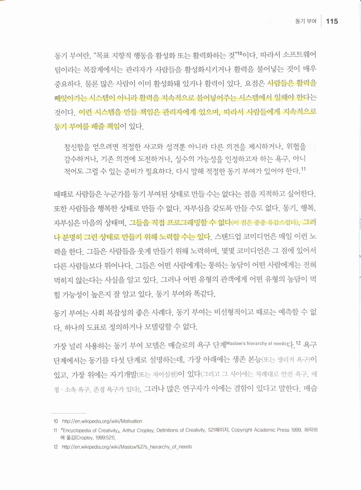

> 사람들은 활력을 빼앗아가는 시스템이 아니라 활력을 지속적으로 불어넣어주는 시스템에서 일해야 한다... 이런 시스템을 만들 책임은 관리자에게 있으며, 따라서 사람들에게 지속적으로 동기부여를 해줄 책임이 있다.
>
> 그들을 직접 프로그래밍할 수 없다. 그러나 분명히 그런 상태로 만들기 위해 노력할 수는 있다.

> 시스템이 안정적이려면 제어되는 시스템의 상태 수보다 제어하는 시스템의 상태 수가 크거나 같아야 한다.
>
> 어떤 소프트웨어 프로젝트에서도 가장 복잡한 요소는 사람
>
> 프로세스, 도구, 설계가 자신의 주인을 능가할 수는 없다. 사람이 없다면 이런 것들은 아무런 쓸모가 없다.

# 05 사람들에게 활력을 불어넣는 방법
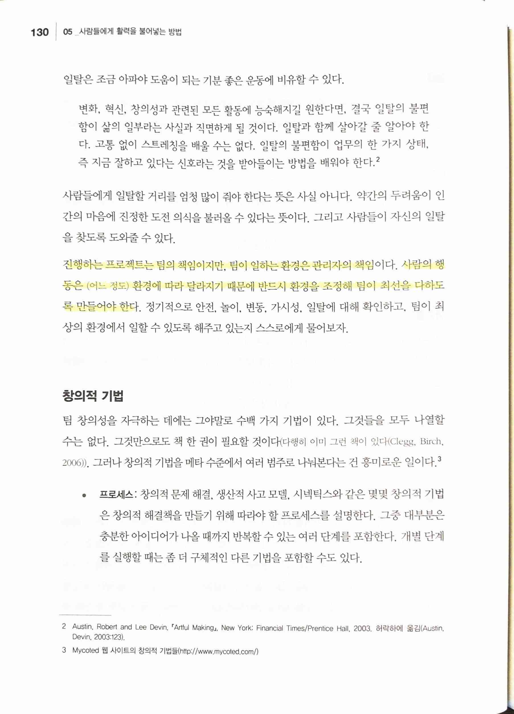

> 진행하는 프로젝트는 팀의 책임이지만, 팀이 일하는 환경은 관리자의 책임. 사람의 행동은 (어느 정도) 환경에 따라 달라지기 때문에 반드시 환경을 조정해 팀이 최선을 다하도록 만들어야 한다.

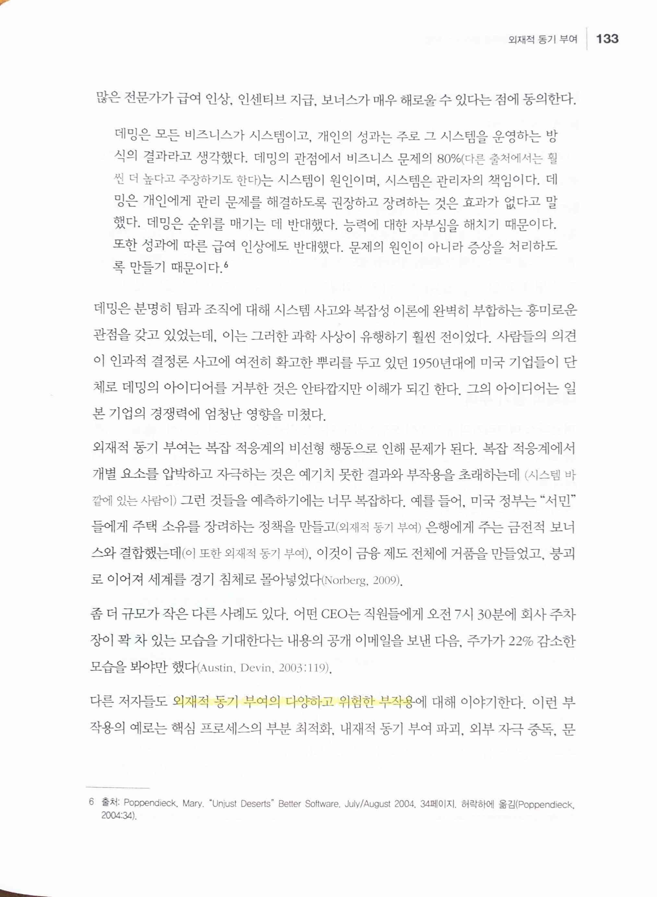

> 외재적 동기 부여의 다양하고 위험한 부작용

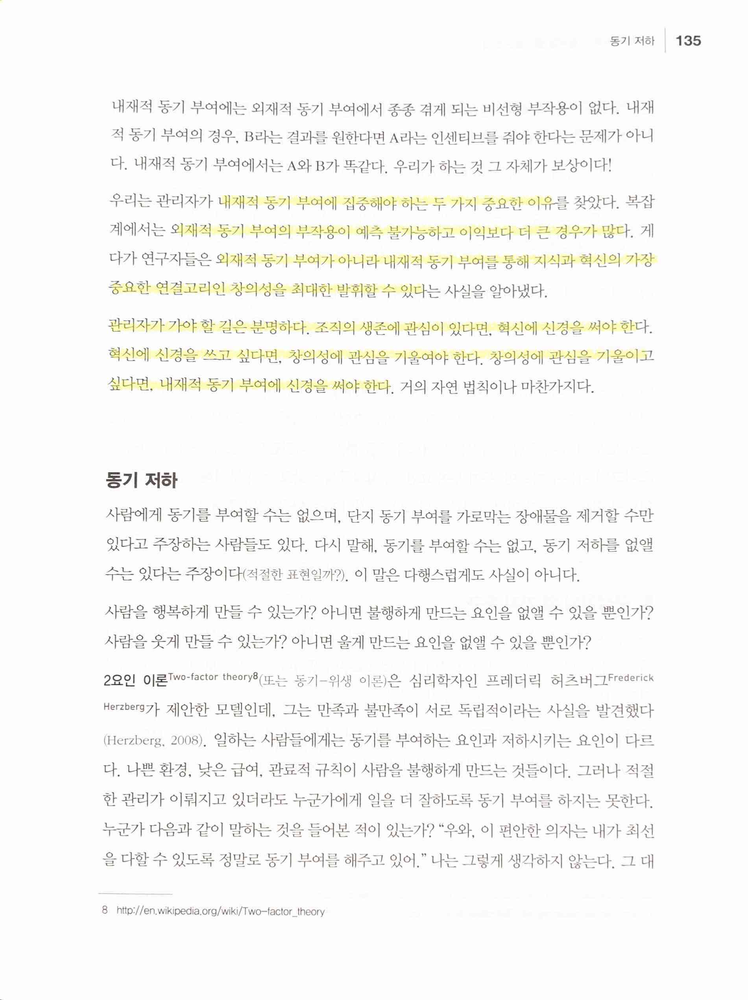

> 내재적 동기 부여에 집중해야 하는 두 가지 중요한 이유. 외재적 동기 부여의 부작용이 예측 불가능하고 이익보다 더 큰 경우가 많다. 외재적 동기 부여가 아니라 내재적 동기 부여를 통해 지식과 혁신의 가장 중요한 연결고리인 창의성을 최대한 발휘할 수 있다.
>
> 관리자가 가야할 길은 분명하다. 조직의 생존에 관심이 있다면, 혁신에 신경을 써야 한다. 혁신에 신경을 쓰고 싶다면, 창의성에 관심을 기울여야 한다. 창의성에 관심을 기울이고 싶다면, 내재적 동기 부여에 신경을 써야 한다.
* 조직의 생존 -> 혁신 -> 창의성 -> 내재적 동기 부여

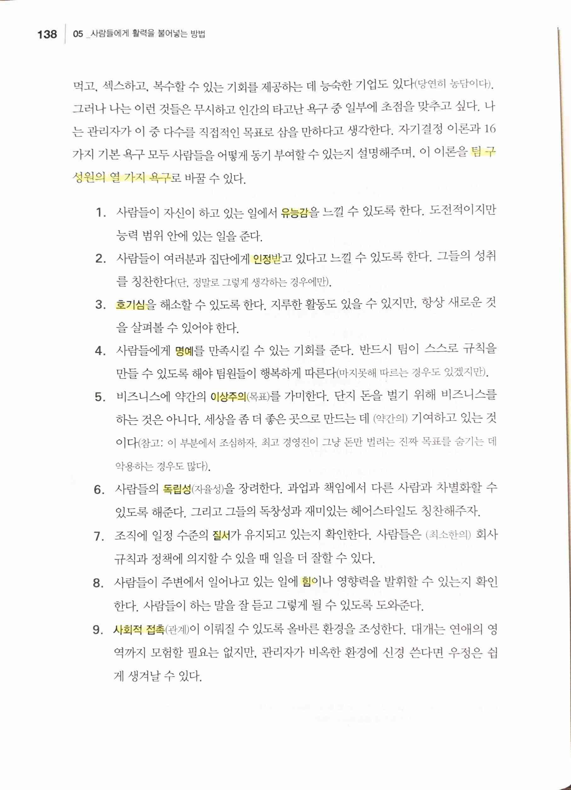 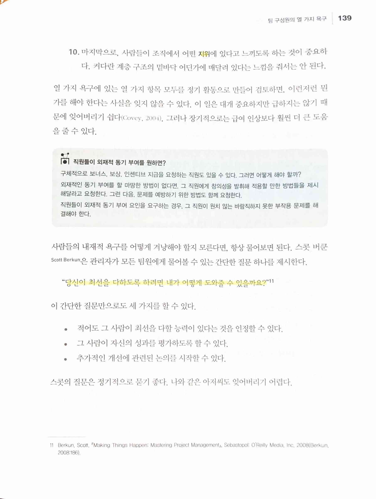

> 팀 구성원의 열 가지 욕구
>
> 1. `유능감` 도전적이지만 능력 범위 안에 있는 일을 준다.
>
> 2. `인정` 성취를 칭찬
>
> 3. `호기심` 항상 새로운 것을 살펴볼 수 있어야 한다.
>
> 4. `명예` 반드시 팀이 스스로 규칙을 만들 수 있도록 해야 팀원들이 행복하게 따른다
>
> 5. `이상주의(목표)` 세상을 좀 더 좋은 곳으로 만드는 데 (약간의) 기여하고 있는 것이다
>
> 6. `독립성(자율성)` 과업과 책임에서 다른 사람과 차별화
>
> 7. `질서` 회사 규칙과 정책에 의지할 수 있을 때 일을 더 잘할 수 있다.
>
> 8. `힘 영향력`
>
> 9. `사회적 접촉(관계)`
>
> 10. `지위` 계층 구조의 밑바닥 어딘가에 매달려 있다는 느낌을 줘서는 안 된다.
>
> `스콧 버쿤 Scott Berkun` "당신이 최선을 다하도록 하려면 내가 어떻게 도와줄 수 있을까요?"

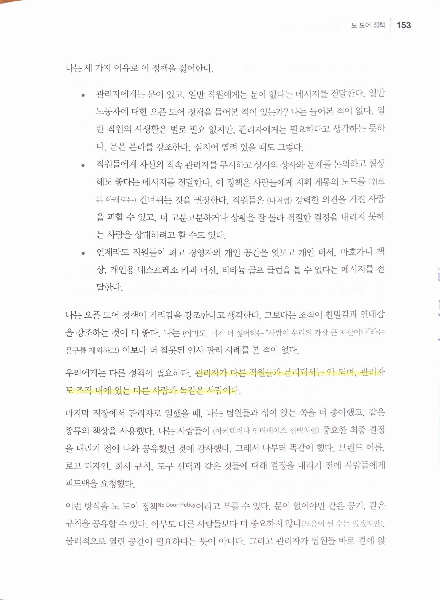

> 관리자가 다른 직원들과 분리돼서는 안 되며, 관리자도 조직 내에 있는 다른 사람과 똑같은 사람

# 06 자기조직화의 기본
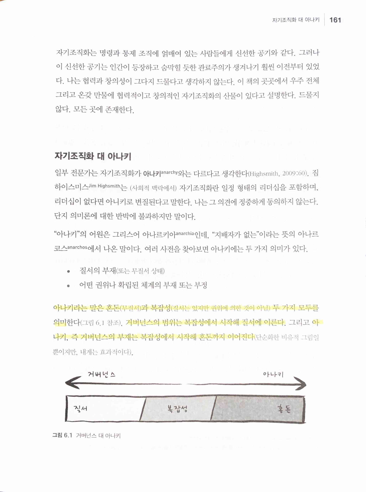

> 아나키라는 말은 혼돈(무질서)과 복잡성(질서는 있지만 권위에 의한 것이 아님) 두 가지 모두를 의미. 거버넌스의 범위는 복잡성에서 시작해 질서에 이른다. 아나키, 즉 거버넌스의 부재는 복잡성에서 시작해 혼돈까지 이어진다

# 07 팀에 권한을 부여하는 방법

> 지식 노동자는 지식을 갖고 있기 때문에 조직 내에서 진정한 힘을 행사
>
> 관리를 스포츠 팀을 이끄는 것과 비교. 스포츠 팀에서 관리자(감독)는 퍼실리테이터이자 코치 역할을 하고, 진짜 일은 스타 플레이어가 한다.

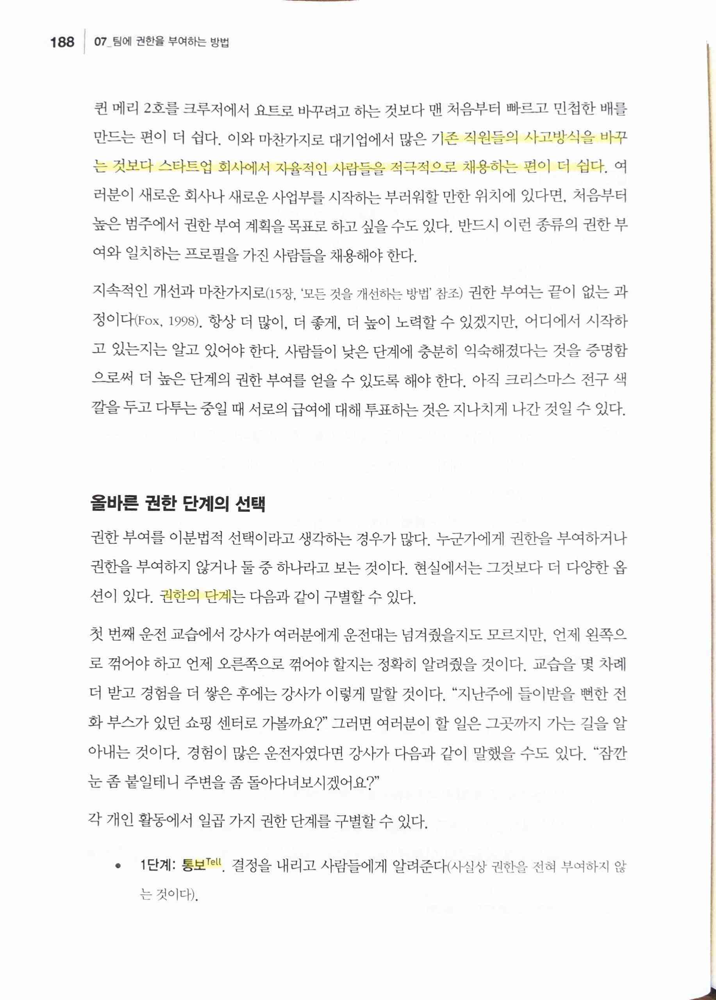 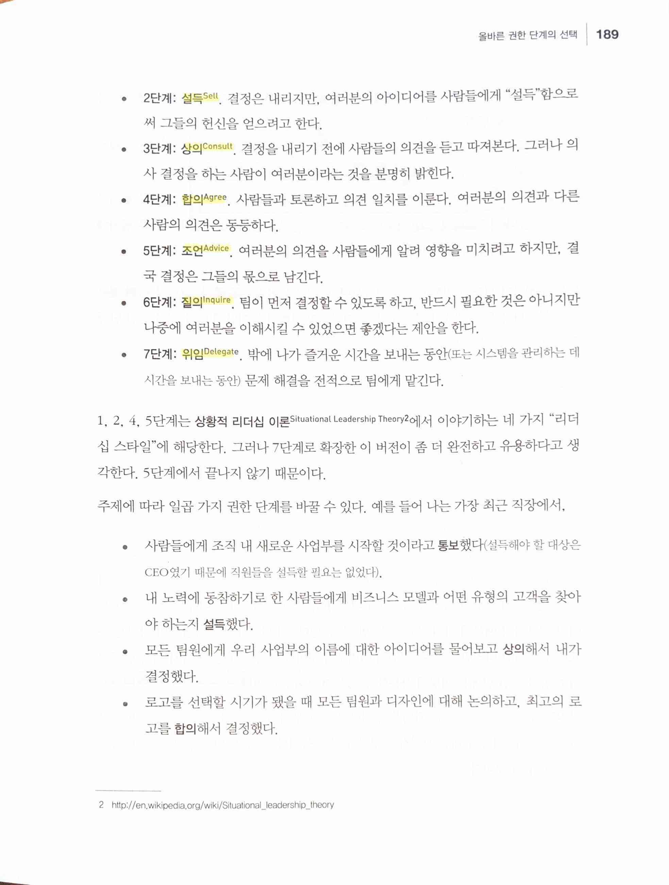 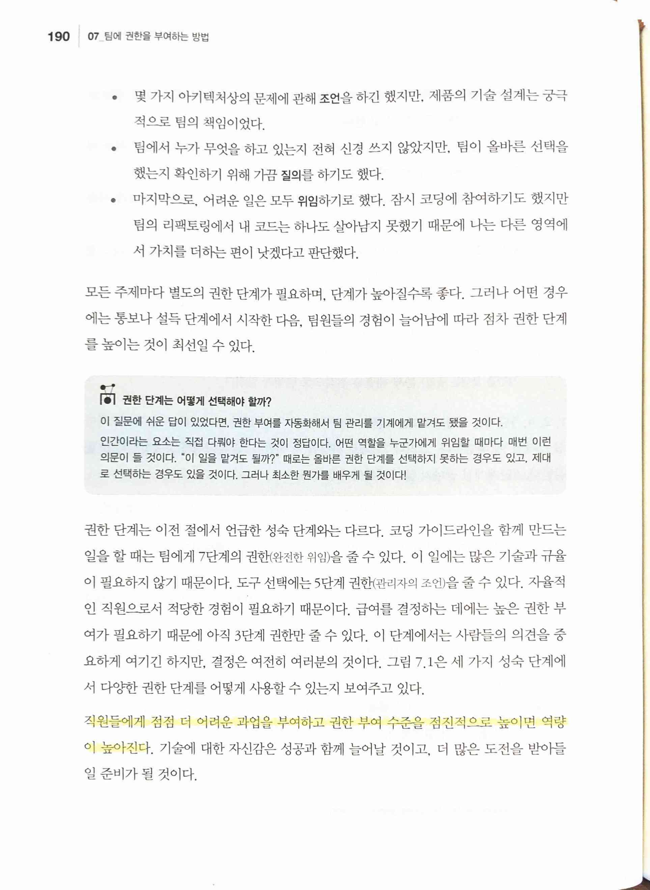 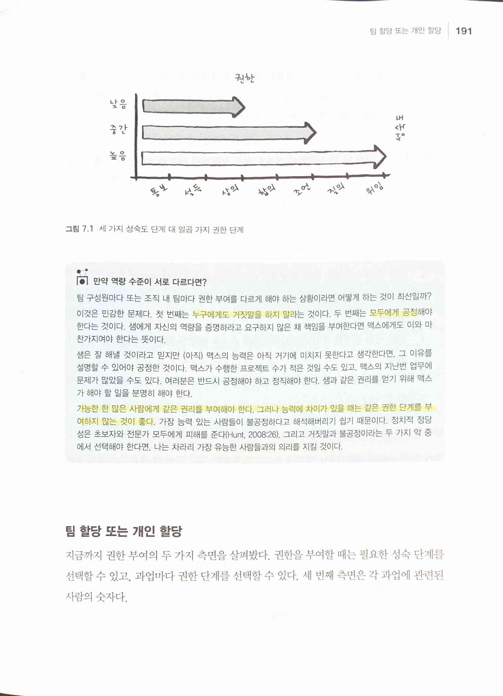

> 기존 직원들의 사고방식을 바꾸는 것보다 ... 자율적인 사람들을 적극적으로 채용하는 편이 더 쉽다.
>
> `권한`의 단계
>
> 1단계: 통보 Tell
>
> 2단계: 설득 Sell
>
> 3단계: 상의 Consult
>
> 4단계: 합의 Agree
>
> 5단계: 조언 Advice
>
> 6단계: 질의 Inquire
>
> 7단계: 위임 Delegate
>
> 1, 2, 4, 5단계는 상황적 리더십 이론 Situational Leadership Theory에서 이야기하는 네 가지 "리더십 스타일"에 해당
* [Situational leadership theory - Wikipedia](https://en.wikipedia.org/wiki/Situational_leadership_theory)
> 직원들에게 점점 더 어려운 과업을 부여하고 권한 부여 수준을 점진적으로 높이면 역량이 높아진다.
>
> 만약 역량 수준이 서로 다르다면?
>
> 누구에게도 거짓말을 하지 말라... 모두에게 공정해야
>
> 가능한 한 많은 사람에게 같은 권리를 부여해야 한다. 그러나 능력에 차이가 있을 때는 같은 권한 단계를 부여하지 않는 것이 좋다.

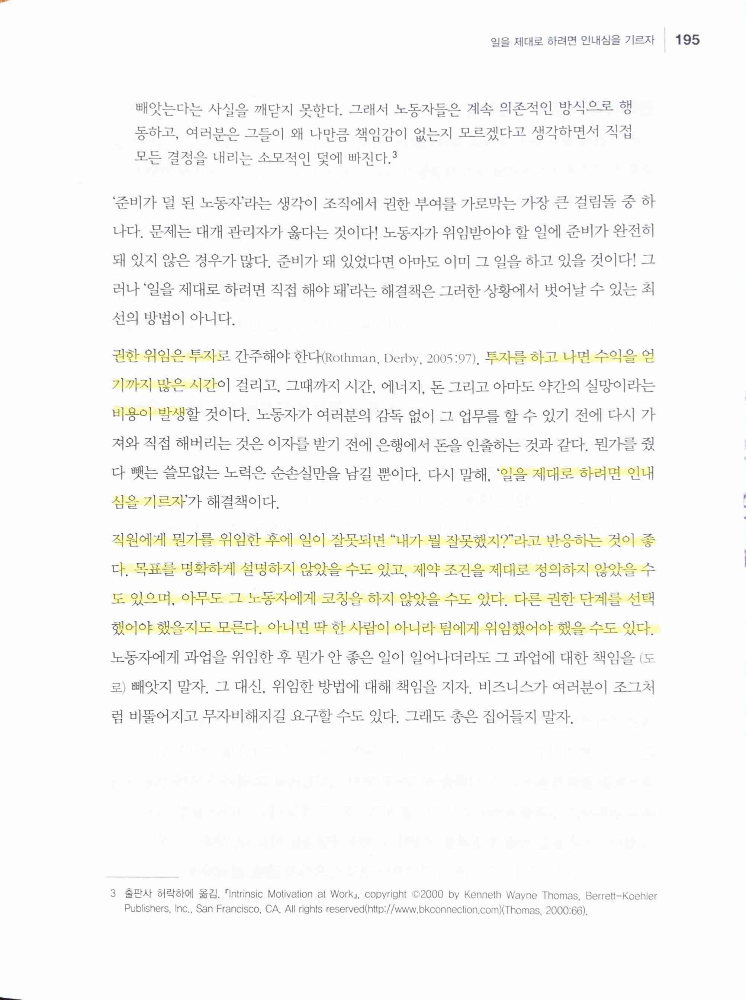

> 권한 `위임`은 투자. 투자를 하고 나면 수익을 얻기까지 많은 시간 ... 비용이 발생... '일을 제대로 하려면 인내심을 기르자'가 해결책
>
> 직원에게 뭔가를 위임한 후에 일이 잘못되면 "내가 뭘 잘못했지?"라고 반응하는 것이 좋다. 목표를 명확하게 설명하지 않았을 수도 있고, 제약 조건을 제대로 정의하지 않았을 수도 있으며, 아무도 그 노동자에게 코칭을 하지 않았을 수도 있다. 다른 권한 단계를 선택했어야 했을지도 모른다. 아니면 딱 한 사람이 아니라 팀에게 위임했어야 했을 수도 있다.노동자에게 과업을 위임한 후 뭔가 안 좋은 일이 일어나더라도 그 과업에 대한 책임을 도로 빼앗지 말자. 그 대신, 위임한 방법에 대해 `책임`을 지자.

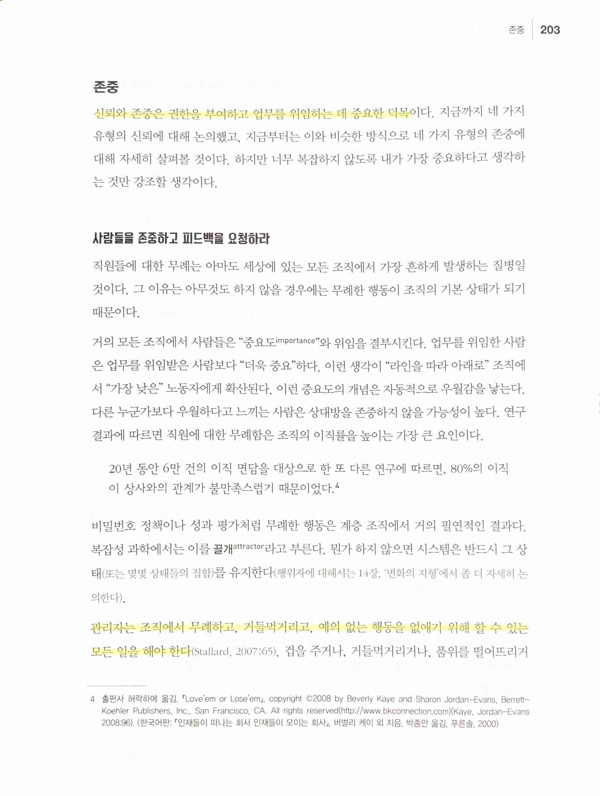 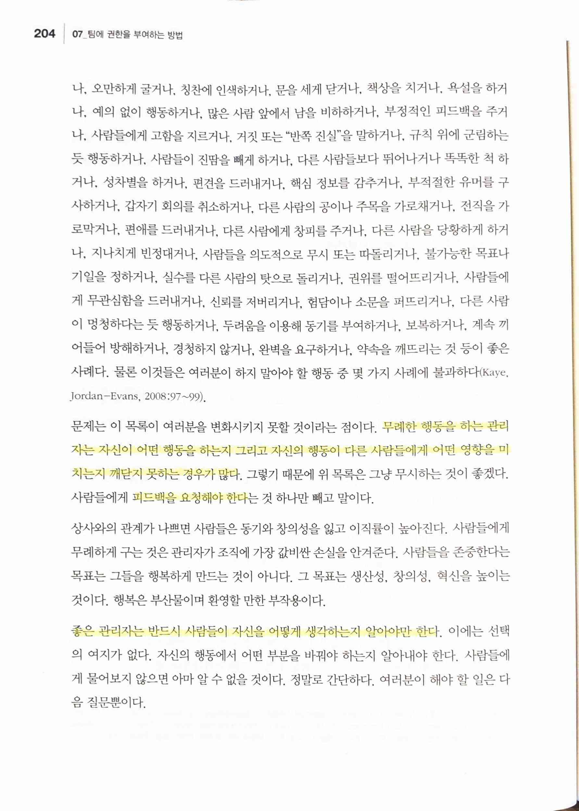

> `신뢰`와 `존중`은 권한을 부여하고 업무를 위임하는 데 중요한 덕목
>
> 관리자는 조직에서 무례하고 거들먹거리고, 예의 없는 행동을 없애기 위해 할 수 있는 모든 일을 해야 한다
>
> 무례한 행동을 하는 관리자는 자신이 어떤 행동을 하는지 그리고 자신의 행동이 다른 사람들에게 어떤 영향을 미치는지 깨닫지 못하는 경우가 많다... 피드백을 요청해야 한다
>
> 좋은 관리자는 반드시 사람들이 자신을 어떻게 생각하는지 알아야만 한다.
* 내가 사용한 방법; 1 on 1, 익명 메일 요청, 익명 대화 도구 사용(slido), 익명 설문 조사, 이야기해달라고 지속적으로 말하기

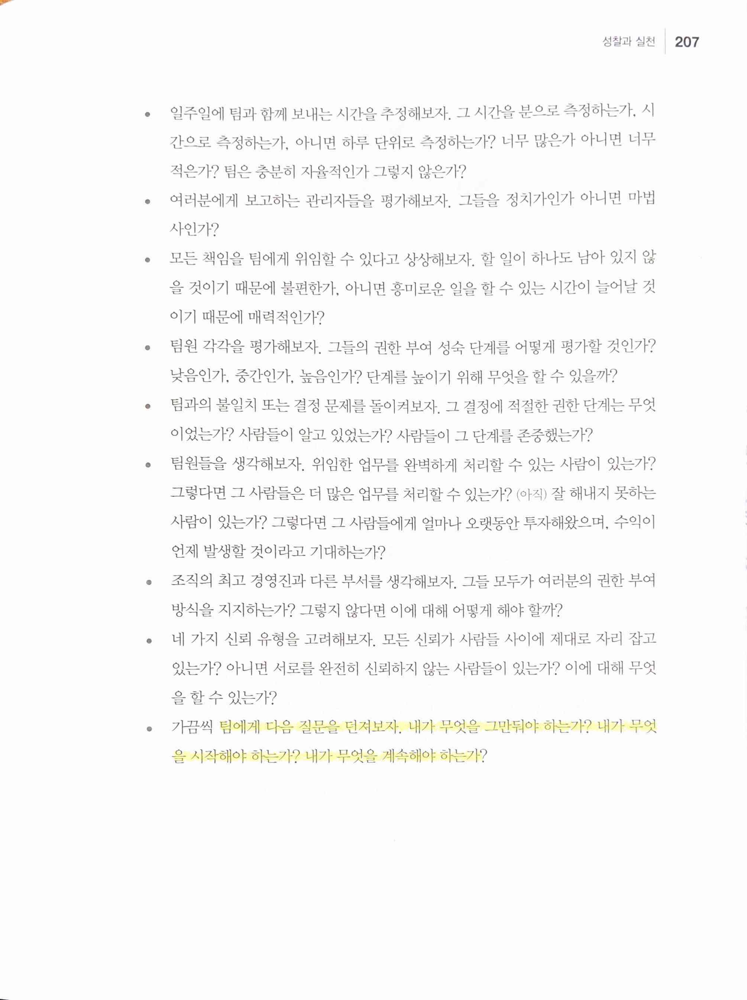

> 팀에게 다음 질문을 던져보자. 내가 무엇을 그만둬야 하는가? 내가 무엇을 시작해야 하는가? 내가 무엇을 계속해야 하는가?
* KPT와 유사하단 생각이 듦

# 08 목적에 따른 리드와 지배
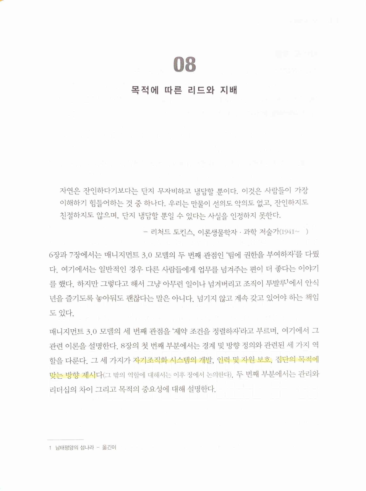

> 경계 및 방향 정의와 관련된 세 가지 역할... 자기조직화 시스템의 개발, 인력 및 자원 보호, 집단의 목적에 맞는 방향 제시

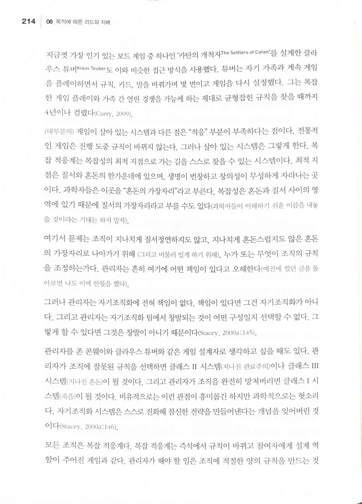

 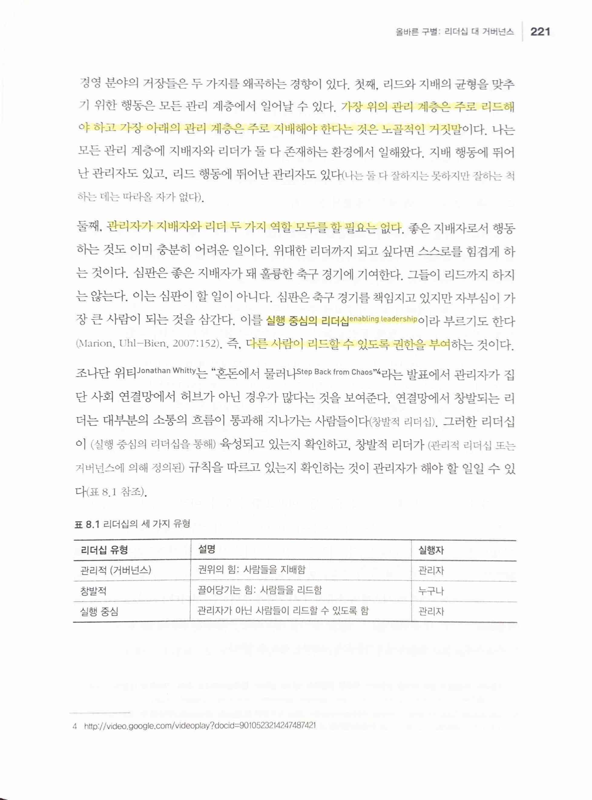

> `리더`는 끌어당기는 힘을 통해 사람들에게 무엇을 해야 하는지에 대한 확신을 심어주지만, `지배자`는 권위의 힘을 통해 사람들에게 무엇을 해야 하는지 알려준다.
>
> 지배자로서의 행동은 권한 단계 1(통보), 2(설득), 3(상의)에 해당, 리더로서의 행동은 권한 단계 4(합의), 5(조언), 6(질의)에 해당... 권한 단계 7(완전한 위임)을 사용하면 더 이상 리더로서 관여하지 않아도 된다.
>
> 가장 위의 관리 계층은 주로 리드해야 하고 가장 아래의 관리 계층은 주로 지배해야 한다는 것은 노골적인 거짓말
>
> 관리자가 지배자와 리더 두 가지 역할 모두를 할 필요는 없다... `실행 중심의 리더십 enabling leadership` 다른 사람이 리드할 수 있도록 권한을 부여

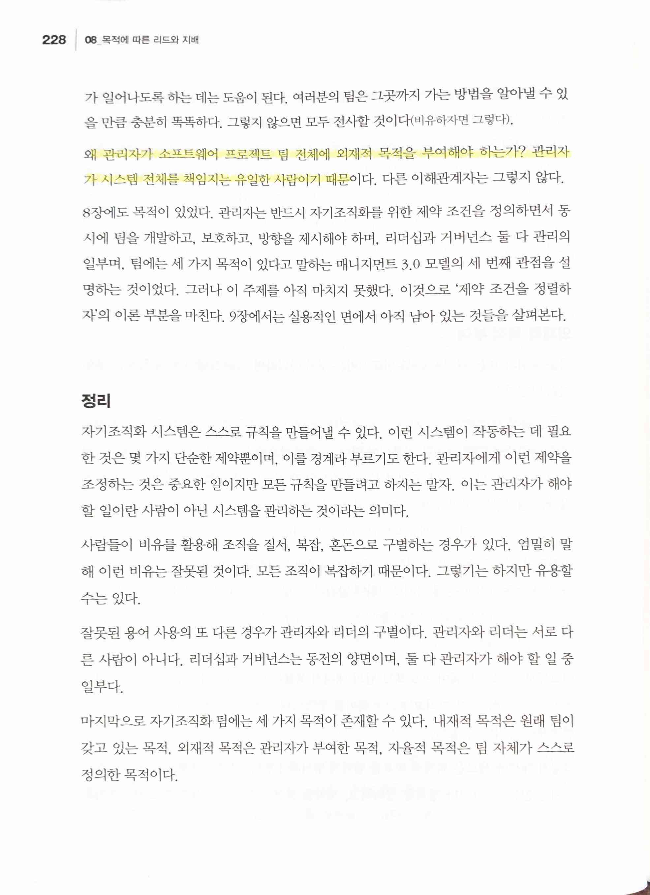

> 왜 관리자가 소프트웨어 프로젝트 팀 전체에 외재적 목적을 부여해야 하는가? 관리자가 시스템 전체를 책임지는 유일한 사람이기 때문이다. 다른 이해관계자는 그렇지 않다.

# 09 제약 조건을 정렬하는 방법
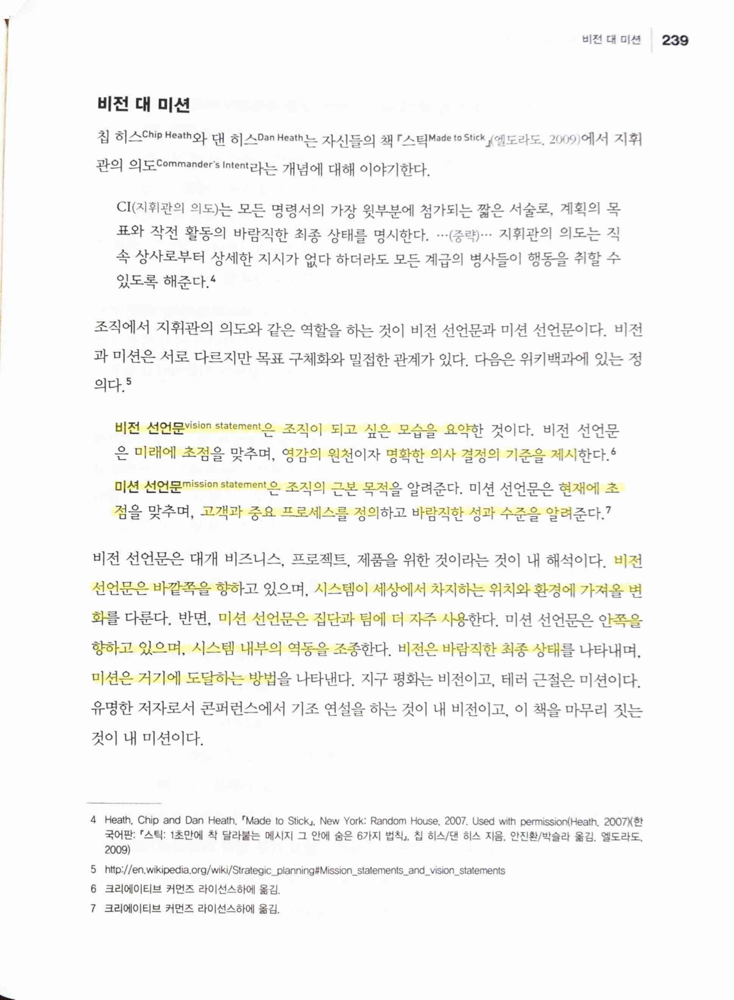

> `비전 선언문 vision statement` 조직이 되고 싶은 모습을 요약. 미래에 초점. 영감의 원천. 명확한 의사 결정의 기준 제시. 바깥쪽을 향하고 있으며, 시스템이 세상에서 차지하는 위치와 환경에 가져올 변화를 다룬다. `vision` = 바람직한 최종 상태
>
> `미션 선언문 mission statement` 조직의 근본 목적. 현재에 초점. 고객과 중요 프로세스를 정의. 바람직한 성과 수준을 알려준다. 집단과 팀에 더 자주 사용. 안쪽을 향하고 있으며, 시스템 내부의 역동을 조종. `mission` = 비전에 도달하는 방법

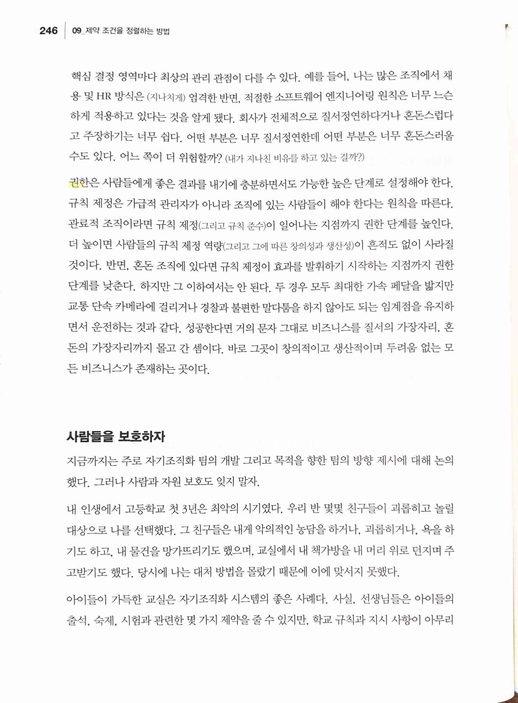

> `권한`은 사람들에게 좋은 결과를 내기에 충분하면서도 가능한 높은 단계로 설정해야 한다.

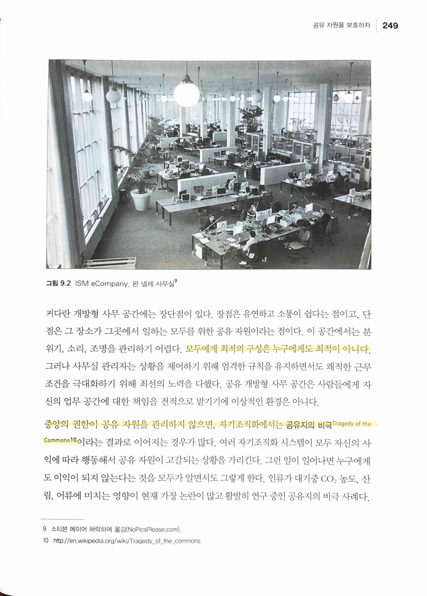

> 모두에게 최적의 구성은 누구에게도 최적이 아니다.
>
> 중앙의 권한이 공유 자원을 관리하지 않으면, 자기조직화에서는 `공유지의 비극 Tragedy of the Commons`

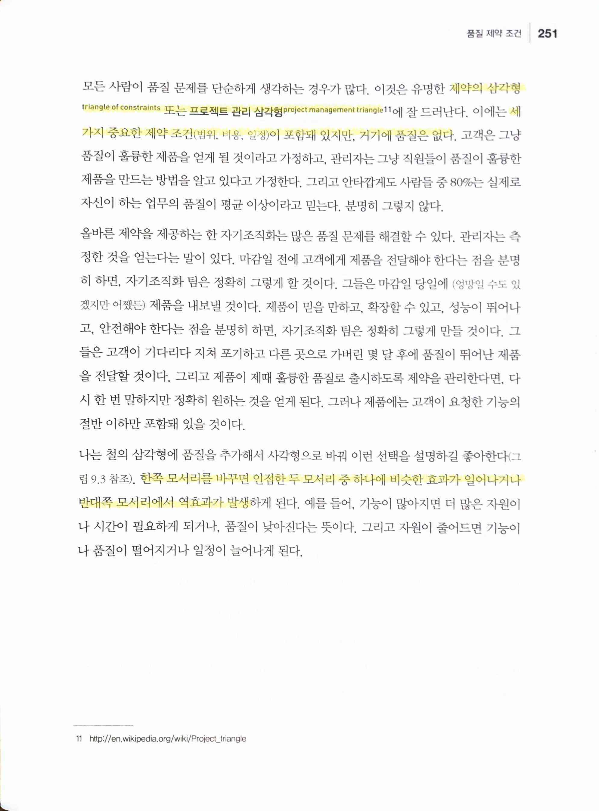 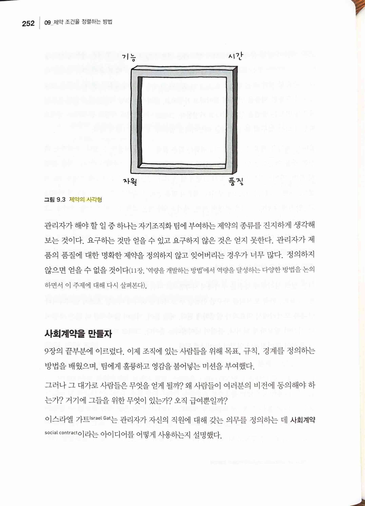

> `제약의 삼각형 triangle of constraints` 또는 `프로젝트 관리 삼각형 project management triangle` 세 가지 중요한 제약 조건(범위, 비용, 일정)이 포함돼 있지만, 거기에 품질은 없다.
* [Project management triangle - Wikipedia](https://en.wikipedia.org/wiki/Project_management_triangle)
> 한쪽 모서리를 바꾸면 인접한 두 모서리 중 하나에 비슷한 효과가 일어나거나 반대쪽 모서리에서 역효과가 발생
>
> 그림 9.3 제약의 사각형

# 10 규칙을 만드는 기술

> 규칙을 만드는 일이 선형 사고를 하는 사람들이 생각하는 것처럼 간단하지 않다

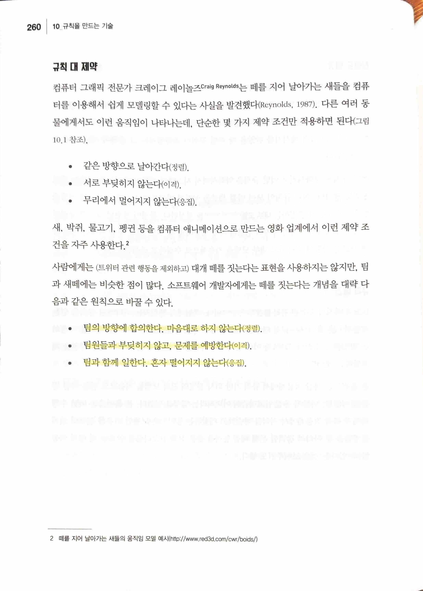

> 팀의 방향에 합의한다. 마음대로 하지 않는다`정렬`
>
> 팀원들과 부딪히지 않고, 문제를 예방한다`이격`
>
> 팀과 함께 일한다. 혼자 떨어지지 않는다`응집`
* [3 Simple Rules of Flocking Behaviors: Alignment, Cohesion, and Separation](https://gamedevelopment.tutsplus.com/tutorials/3-simple-rules-of-flocking-behaviors-alignment-cohesion-and-separation--gamedev-3444)

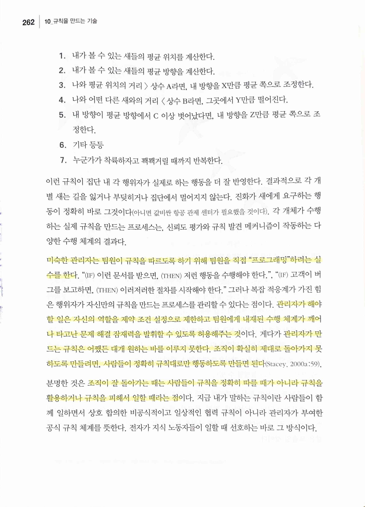 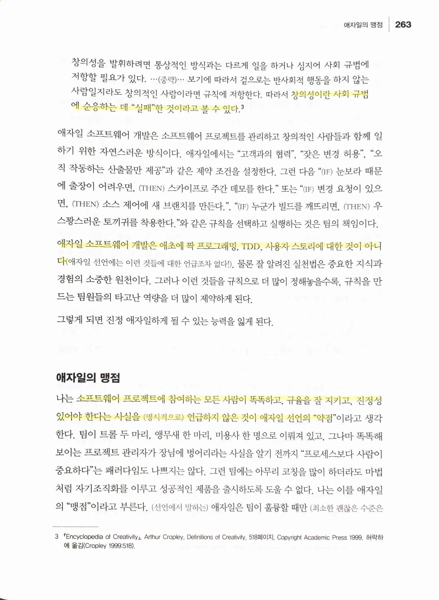

> 미숙한 관리자는 팀원이 규칙을 따르도록 하기 위해 팀원을 직접 프로그래밍"하려는 실수를 한다... 관리자가 해야할 일은 자신의 역할을 제약 조건 설정으로 제한하고 팀원에게 내재된 수행 체계가 깨어나 타고난 문제 해결 잠재력을 발휘할 수 있도록 허용해주는 것... 관리자가 만드는 규칙은 어쨌든 대개 원하는 바를 이루지 못한다. 조직이 확실히 제대로 돌아가지 못하도록 만들려면, 사람들이 정확히 규칙대로만 행동하도록 만들면 된다.
>
> 조직이 잘 돌아가는 때는 사람들이 규칙을 정확히 따를 때가 아니라 규칙을 활용하거나 규칙을 피해서 일할 때
>
> `창의성`이란 사회 규범에 순응하는 데 “실패"한 것이라고 볼 수 있다.
>
> 애자일 소프트웨어 개발은 애초에 짝 프로그래밍, TDD, 사용자 스토리에 대한 것이 아니다

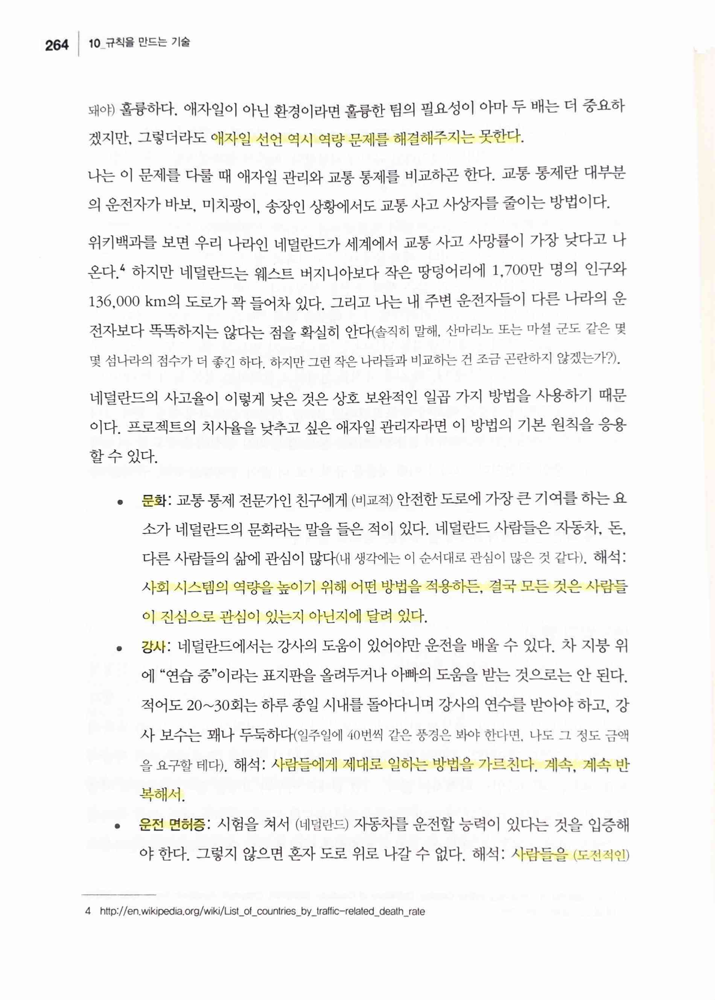 

> 소프트웨어 프로젝트에 참여하는 모든 사람이 똑똑하고 규율을 잘 지키고, 진정성 있어야 한다는 사실을 명시적으로 언급하지 않은 것이 `애자일 선언의 "약점"`이라고 생각
>
> 애자일 선언 역시 역량 문제를 해결해주지는 못한다.
>
> 상호 보완적인 일곱 가지 방법
>
> `문화` 사회 시스템의 역량을 높이기 위해 어떤 방법을 적용하든, 결국 모든 것은 사람들이 진심으로 관심이 있는지 아닌지에 달려 있다.
>
> `강사` 사람들에게 제대로 일하는 방법을 가르친다. 계속 계속 반복해서.
>
> `운전 면허증` 사람들을 (도전적인) 프로젝트에 참여시키기 전에 적절한 테스트를 해야 한다.
>
> `도로 표지판` 현명하고 혁신적인 도구, 체크리스트, 경고, 알림 등을 사용해서 팀에 문제가 생길 가능성을 낮춘다.
>
> `교통 경찰` 프로젝트 결과로부터 표본을 수집하고 품질이 높은 결과를 만들어내는지 확인하는 프로세스 관리자를 둔다.
>
> `경적` 팀원들에게 일상 업무를 어떻게 개선할지 서로 이야기할 수 있는 용기가 있는지 확인한다.
>
> `정부` 관리자는 혼란을 정리할 필요가 있다.
>
> 그냥 알아서 잘한다. 이 부분이 바로 대부분의 애자일 개발 방법론에서 내리고 있는 가정 애자일의 맹점... 세상은 완벽하지 않고... 관리자는 맹점을 어떻게 다뤄야 할지 그리고 안전하게 운전하려면 어떻게 해야 할지 알아내야만 한다.

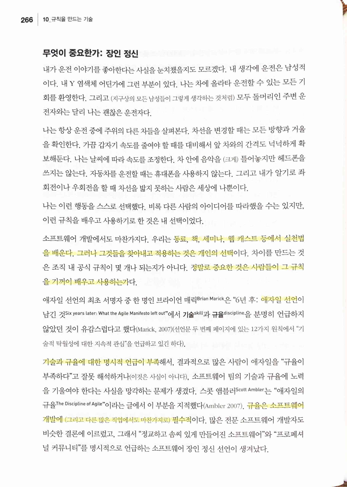 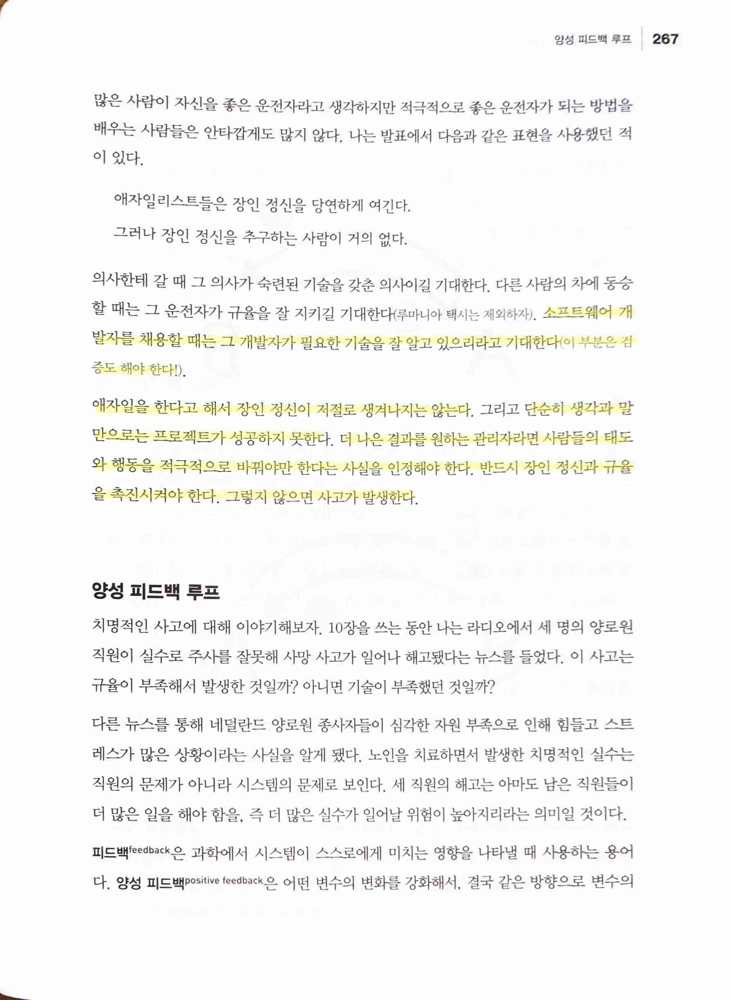

> 동료, 책, 세미나, 웹 캐스트 등에서 실천법을 배운다. 그러나 그것들을 찾아내고 적용하는 것은 개인의 선택... 정말로 중요한 것은 사람들이 그 규칙을 기꺼이 배우고 사용하는가
>
> 애자일 선언... 기술과 규율에 대한 명시적 언급이 부족... `규율`은 소프트웨어 개발에 (그리고 다른 많은 직업에서도 마찬가지로) 필수적
>
> 소프트웨어 개발자를 채용할 때는 그 개발자가 필요한 `기술`을 잘 알고 있으리라고 기대한다(이 부분은 검증도 해야 한다).
>
> 애자일을 한다고 해서 장인 정신이 저절로 생겨나지는 않는다. 그리고 단순히 생각과 말만으로는 프로젝트가 성공하지 못한다. 더 나은 결과를 원하는 관리자라면 사람들의 태도와 행동을 적극적으로 바꿔야만 한다는 사실을 인정해야 한다. 반드시 장인 정신과 규율을 촉진시켜야 한다. 그렇지 않으면 사고가 발생한다.

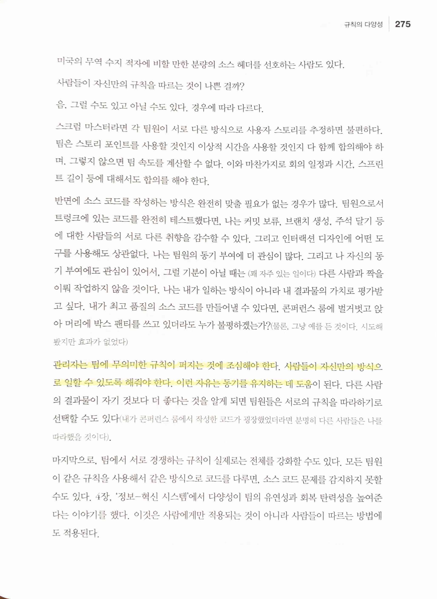

> 관리자는 팀에 무의미한 규칙이 퍼지는 것에 조심해야 한다. 사람들이 자신만의 방식으로 일할 수 있도록 해줘야 한다. 이런 자유는 동기를 유지하는 데 도움
* 어디까지가 무의미한 규칙인지는 조금 애매한 면이 있는 듯한 설명. 브랜치 정책이 무의미한 규칙일까? 서로 다른 형태로 브랜치를 만들고 merge를 하게 되면 일하는 방식이 통일되지 않아 communication cost가 증가할 뿐만 아니라 최악의 경우는 conflict가 발생하고, bug가 production에 그대로 release될 수 있을텐데, 이 부분에 대해서는 애자일 선언의 약점에서 이야기했듯이 저자도 모든 개발자들이 브랜치 정책을 개별로 사용해도 문제가 발생하지 않을 거란 가정을 하고 있는 걸로 보인다

# 11 역량을 개발하는 방법

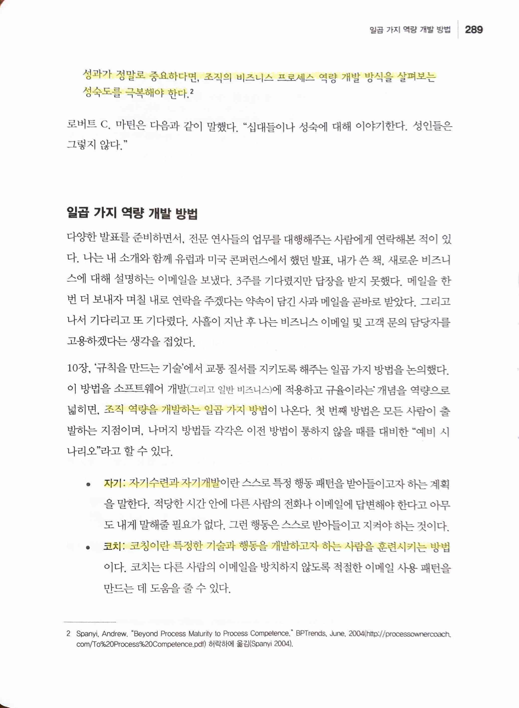 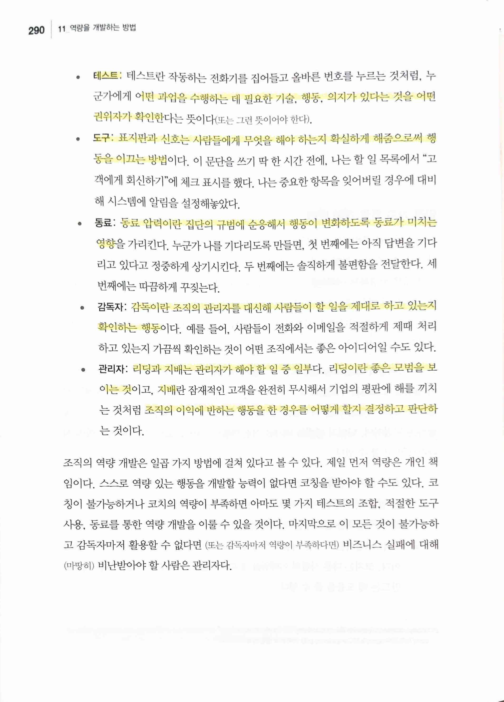

> 성과가 정말로 중요하다면, 조직의 비즈니스 프로세스 역량 개발 방식을 살펴보는 성숙도를 극복해야 한다.
* [Microsoft Word - 06-04 ART Dev Business Process Competence - Spanyi.doc](https://www.bptrends.com/bpt/wp-content/publicationfiles/06-04%20ART%20Dev%20Business%20Process%20Competence%20-%20Spanyi.pdf)
> 조직 역량을 개발하는 일곱 가지 방법
>
> `자기` 자기수련과 자기개발
>
> `코치` 코칭이란 특정한 기술과 행동을 개발하고자 하는 사람을 훈련시키는 방법
>
> `테스트` 어떤 과업을 수행하는 데 필요한 기술, 행동, 의지가 있다는 것을 어떤 권위자가 확인
>
> `도구` 표지판과 신호는 사람들에게 무엇을 해야 하는지 확실하게 해줌으로써 행동을 이끄는 방법
>
> `동료` 동료 압력이란 집단의 규범에 순응해서 행동이 변화하도록 동료가 미치는 영향
>
> `감독자` 감독이란 조직의 관리자를 대신해 사람들이 할 일을 제대로 하고 있는지 확인하는 행동
>
> `관리자` 리딩과 지배는 관리자가 해야 할 일 중 일부 `리딩`이란 좋은 모범을 보이는 것 `지배`란 조직의 이익에 반하는 행동을 한 경우를 어떻게 할지 결정하고 판단하는 것

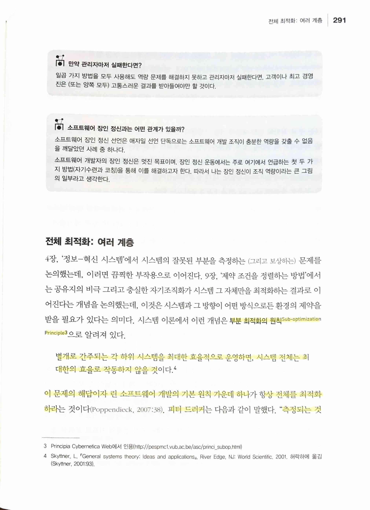 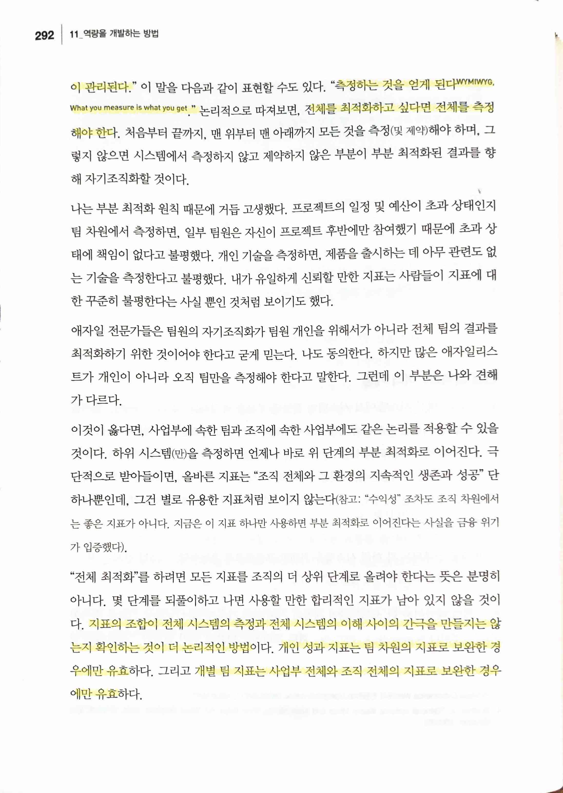

> 전체 최적화: 여러 계층
>
> `부분 최적화의 원칙 Sub-optimization Principle`
* [PRINCIPLE OF SUBOPTIMIZATION](http://pespmc1.vub.ac.be/ASC/PRINCI_SUBOP.html)
> 별개로 간주되는 각 하위 시스템을 최대한 효율적으로 운영하면, 시스템 전체는 최대한의 효율로 작동하지 않을 것이다.
* [https://e-library.namdu.uz/81 Тилшунослик/General systems theory. Lars Skyttner.pdf](https://e-library.namdu.uz/81%20%D0%A2%D0%B8%D0%BB%D1%88%D1%83%D0%BD%D0%BE%D1%81%D0%BB%D0%B8%D0%BA/General%20systems%20theory.%20Lars%20Skyttner.pdf)
> 이 문제의 해답이자 린 소프트웨어 개발의 기본 원칙 가운데 하나가 항상 전체를 최적화
>
> `피터 드러커 "측정되는 것이 관리된다."`... 측정하는 것을 얻게 된다 WYMIWYG, What you measure is what you get... 전체를 최적화하고 싶다면 전체를 측정해야 한다.
>
> 지표의 조합이 전체 시스템의 측정과 전체 시스템의 이해 사이의 간극을 만들지는 않는지 확인하는 것이 더 논리적인 방법. 개인 성과 지표는 팀 차원의 지표로 보완한 경우에만 유효. 개별 팀 지표는 사업부 전체와 조직 전체의 지표로 보완한 경우에만 유효

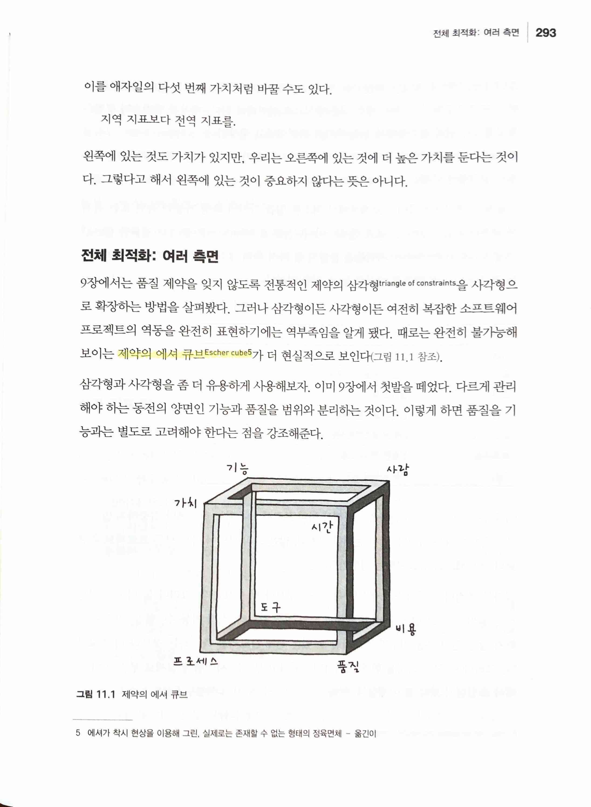 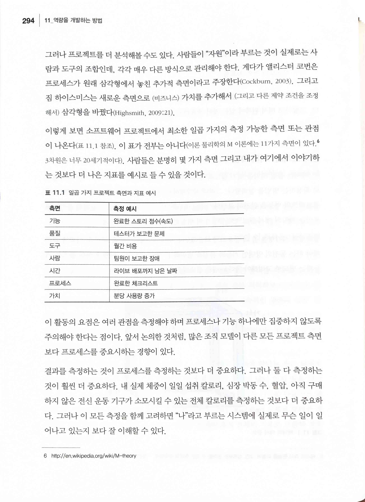

> 전체 최적화: 여러 측면
>
> 제약의 에셔 큐브 Escher cube
>
> 표 11.1 일곱 가지 프로젝트 측면과 지표 예시
* 기능, 품질, 도구, 사람, 시간, 프로세스, 가치

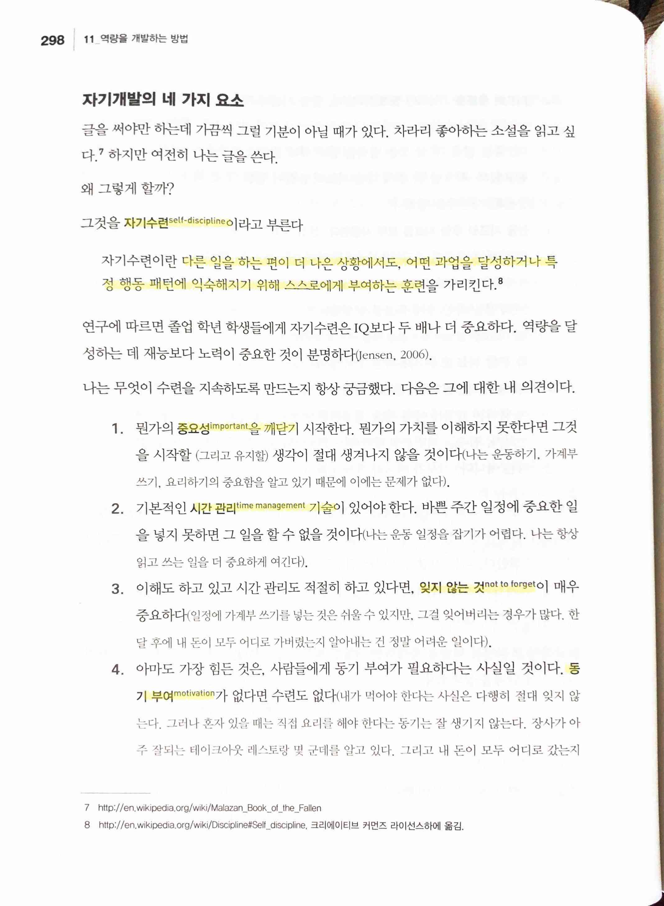 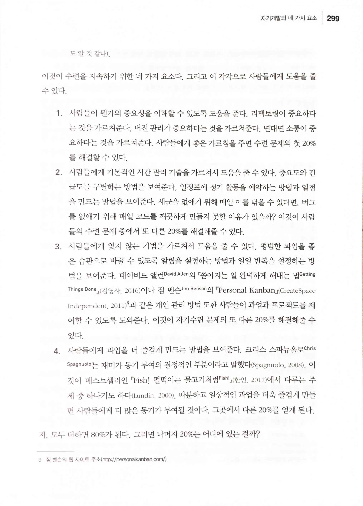 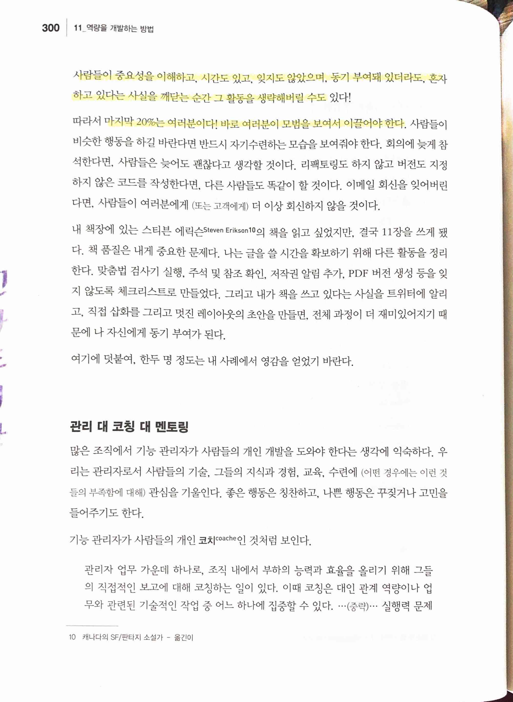

> `자기수련 self-discipline` 다른 일을 하는 편이 더 나은 상황에서도, 어떤 과업을 달성하거나 특정 행동 패턴에 익숙해지기 위해 스스로에게 부여하는 훈련
* [Discipline - Wikipedia](https://en.wikipedia.org/wiki/Discipline#Self_discipline)
> 1. 중요성 important 을 깨닫기 시작
>
> 2. 시간 관리time management 기술
>
> 3. 잊지 않는 것 not to forget이 매우 중요
>
> 4. 동기 부여 motivation
>
> 사람들이 중요성을 이해하고, 시간도 있고, 잊지도 않았으며, 동기 부여돼 있더라도 혼자하고 있다는 사실을 깨닫는 순간 그 활동을 생략해버릴 수도 있다!
>
> 따라서 마지막 20%는 여러분이다! 바로 여러분이 모범을 보여서 이끌어야 한다.

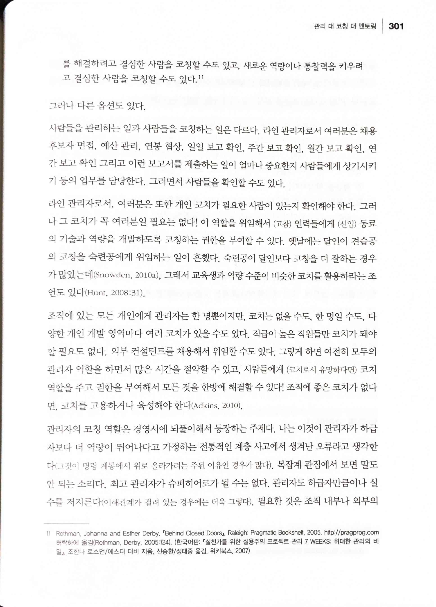 

> 관리 대 코칭 대 멘토링
>
> `멘토`는 직원의 개인 생활이나 경력을 다루고, 특별한 어젠다는 없으며, 오직 개인에게만 초점 `코치`는 개인의 과업과 역할을 다루고, 구체적인 어젠다 또는 개발 방식이 있으며, 개인의 성과에 초점

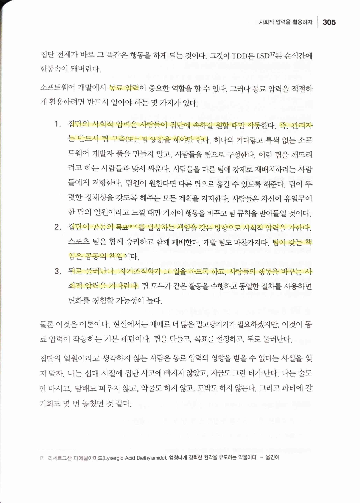

> `동료 압력`
>
> 1. 집단의 사회적 압력은 사람들이 집단에 속하길 원할 때만 작동. 즉, 관리자는 반드시 팀 구축(또는 팀 양성)을 해야만 한다.
>
> 2. 집단이 공동의 목표를 달성하는 책임을 갖는 방향으로 사회적 압력을 가한다... 함께 승리하고 함께 패배... 팀이 갖는 책임은 공동의 책
>
> 3. 뒤로 물러난다. 자기조직화가 그 일을 하도록 하고, 사람들의 행동을 바꾸는 사회적 압력을 기다린다.

> `도구` 생산성, 품질, 효율성을 높이기 위해 사용
>
> 프로세스상의 `실수 방지 mistake-proof`("포카 요케poka yoke"라고도 부른다)를 위해 도구 설정을 이용... 실수 방지란 더 높은 수준의 규율로 이끌어주는 코치를 기술적 형태로 바꾼 모습

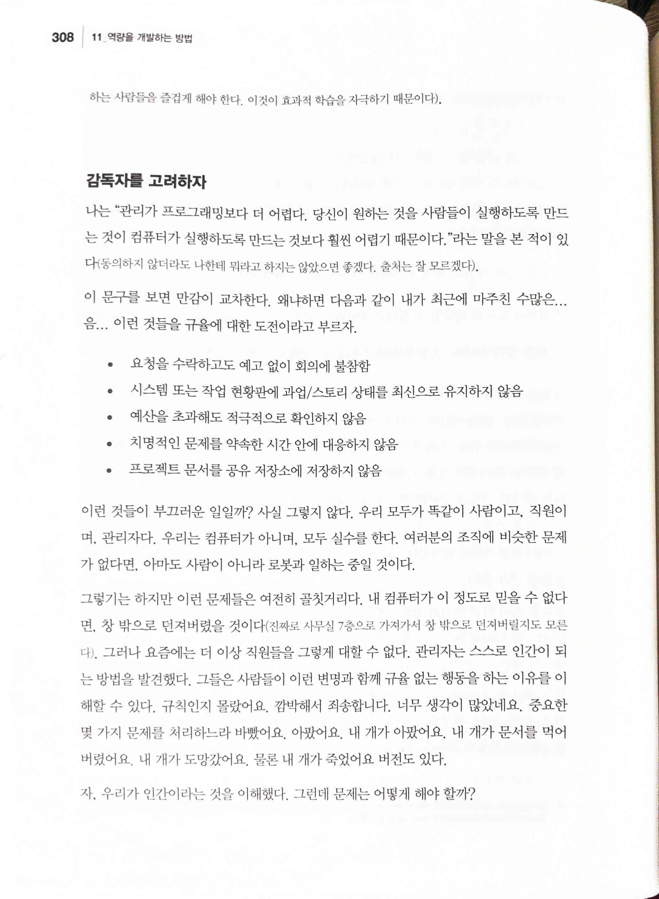 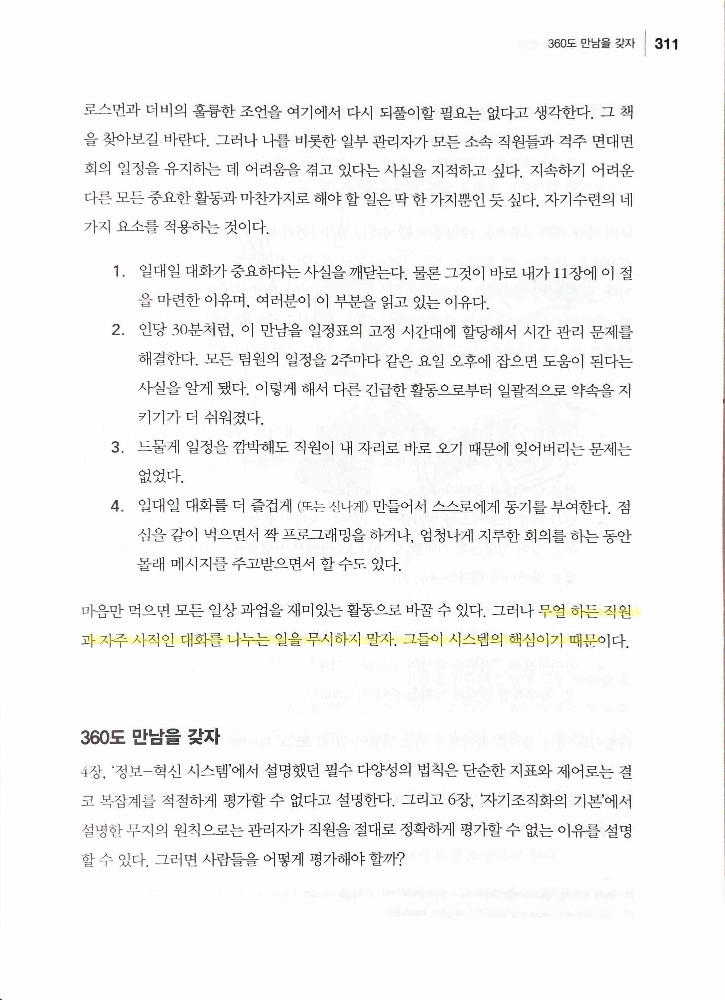

> 우리가 인간이라는 것을 이해
>
> 무얼 하든 직원과 자주 사적인 대화를 나누는 일을 무시하지 말자. 그들이 시스템의 핵심이기 때문

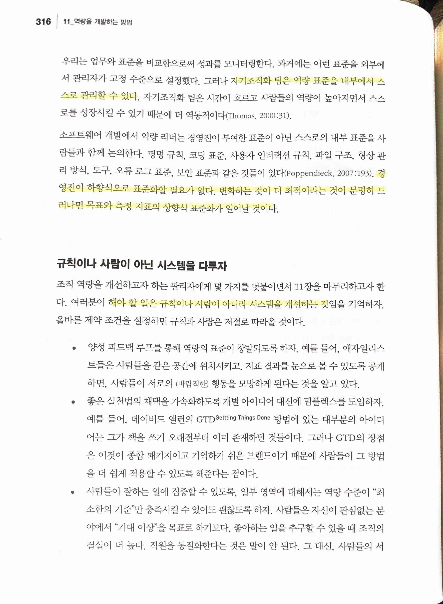

> 자기조직화 팀은 역량 표준을 내부에서 스스로 관리할 수 있다
>
> 경영진이 하향식으로 표준화할 필요가 없다. 변화하는 것이 더 최적이라는 것이 분명히 드러나면 목표와 측정 지표의 상향식 표준화가 일어날 것이다.
>
> 해야 할 일은 규칙이나 사람이 아니라 시스템을 개선하는 것

# 12 소통과 구조
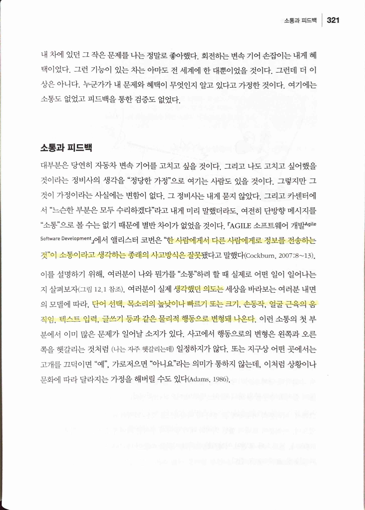

> “한 사람에게서 다른 사람에게로 정보를 전송하는것"이 `소통`이라고 생각하는 종래의 사고방식은 잘못됐다
* [Communication on Agile Software Teams](http://agilemodeling.com/essays/communication.htm)
> 실제 생각했던 의도는... 단어 선택, 목소리의 높낮이나 빠르기 또는 크기, 손동작, 얼굴 근육의 움직임, 텍스트 입력, 글쓰기 등과 같은 물리적 행동으로 변형돼 나온다.

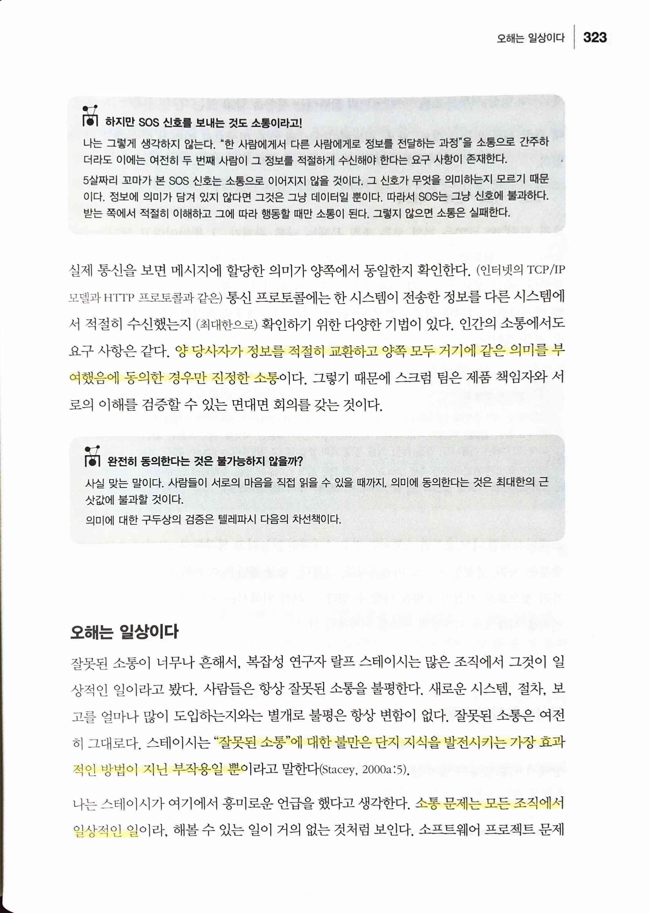

> 양 당사자가 정보를 적절히 교환하고 양쪽 모두 거기에 같은 의미를 부여했음에 동의한 경우만 진정한 소통
* TCP 3 way handshaking같이 ACK까지 전달되어야
> "잘못된 소통"에 대한 불만은 단지 지식을 발전시키는 가장 효과적인 방법이 지닌 부작용일 뿐
>
> 소통 문제는 모든 조직에서 일상적인 일

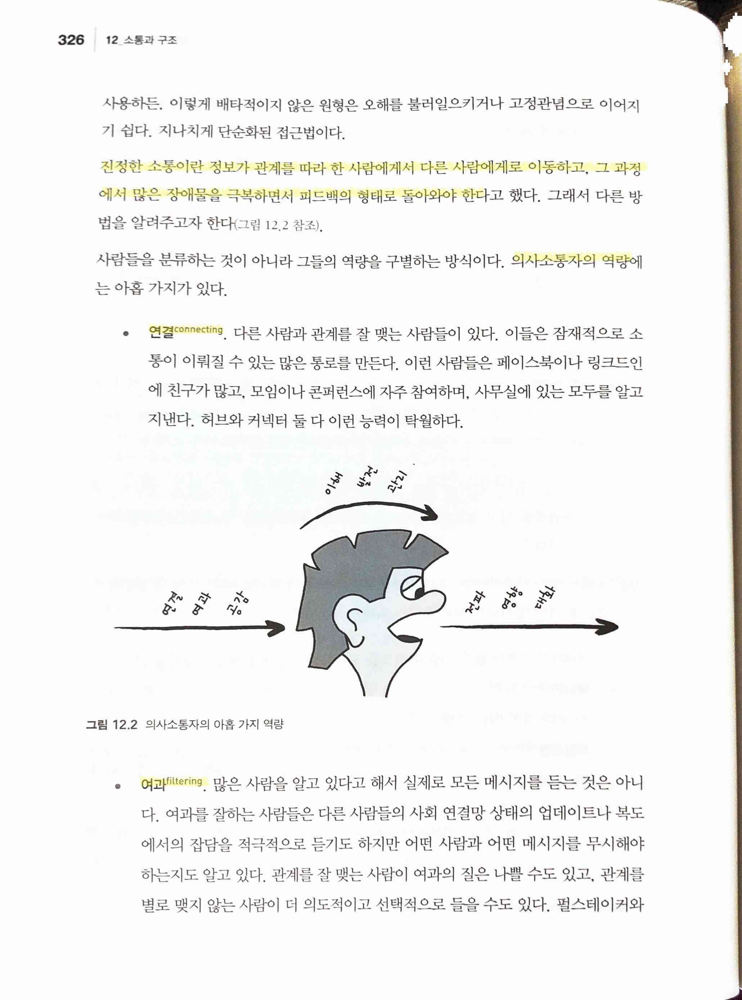 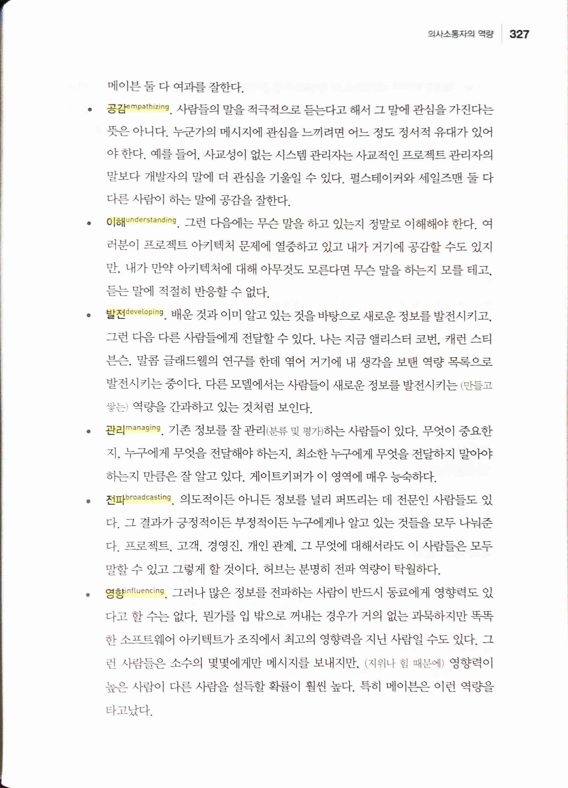 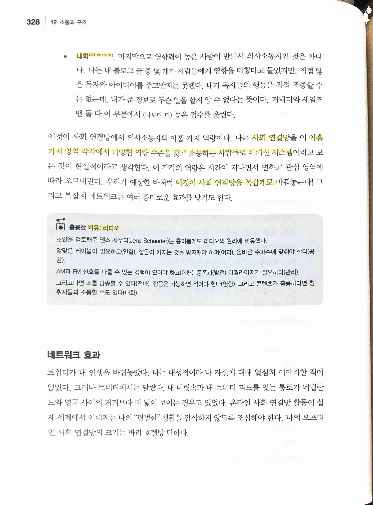

> 진정한 `소통`이란 정보가 관계를 따라 한 사람에게서 다른 사람에게로 이동하고, 그 과정에서 많은 장애물을 극복하면서 피드백의 형태로 돌아와야 한다
>
> 의사소통자의 역량
>
> `연결 connecting`
>
> `여과 filtering`
>
> `공감 empathizing`
>
> `이해 understanding`
>
> `발전 developing`
>
> `관리 managing`
>
> `전파 broadcasting`
>
> `영향 influencing`
>
> `대화 conversing`
>
> 사회 연결망 이 아홉가지 영역 각각에서 다양한 역량수준을 갖고 소통하는 사람들로 이뤄진 시스템... 이것이 사회 연결망을 복잡계로 바꿔놓는다
>
> 훌륭한 비유: 라디오
>
> 알맞은 케이블이 필요하고(연결), 잡음이 커지는 것을 방지해야 하며(여과), 올바른 주파수에 맞춰야 한다(공감).
>
> AM과 FM 신호를 다룰 수 있는 경험이 있어야 하고(이해), 증폭과(발전) 이퀄라이저가 필요하다(관리).
>
> 그리고나면 쇼를 방송할 수 있다(전파). 잡음은 가능하면 적어야 한다(영향). 그리고 콘텐츠가 훌륭하다면 청취자들과 소통할 수도 있다(대화).

# 13 구조를 발전시키는 방법

> 좋은 구조에서 좋은 소통이 나온다

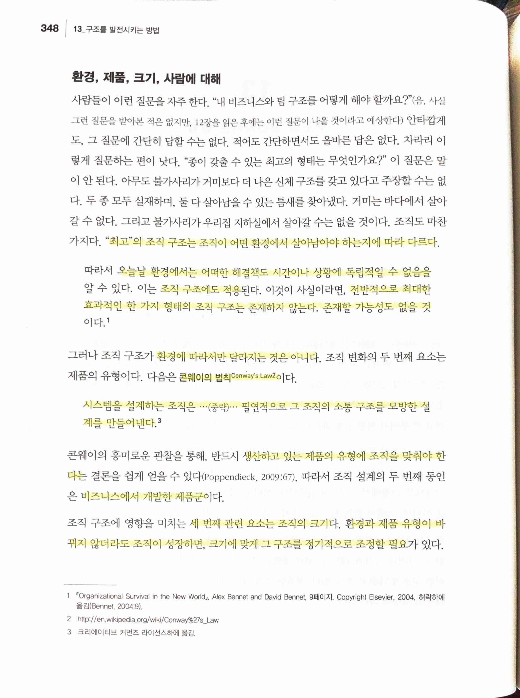

> "최고"의 조직 구조는 조직이 어떤 `환경`에서 살아남아야 하는지에 따라 다르다.
>
> 오늘날 환경에서는 어떠한 해결책도 시간이나 상황에 독립적일 수 없음. 조직 구조에도 적용. 전반적으로 최대한 효과적인 한 가지 형태의 조직 구조는 존재하지 않는다. 존재할 가능성도 없을 것
>
> `제품의 유형` 콘웨이의 법칙 Conway's Law
>
> 시스템을 설계하는 조직은 ・・・(중략)..… 필연적으로 그 조직의 소통 구조를 모방한 설계를 만들어낸다.
>
> 생산하고 있는 제품의 유형에 조직을 맞춰야 한다... 조직 설계의 두 번째 동인은 비즈니스에서 개발한 제품군
>
> `조직의 크기` 환경과 제품 유형이 바뀌지 않더라도 조직이 성장하면, 크기에 맞게 그 구조를 정기적으로 조정할 필요

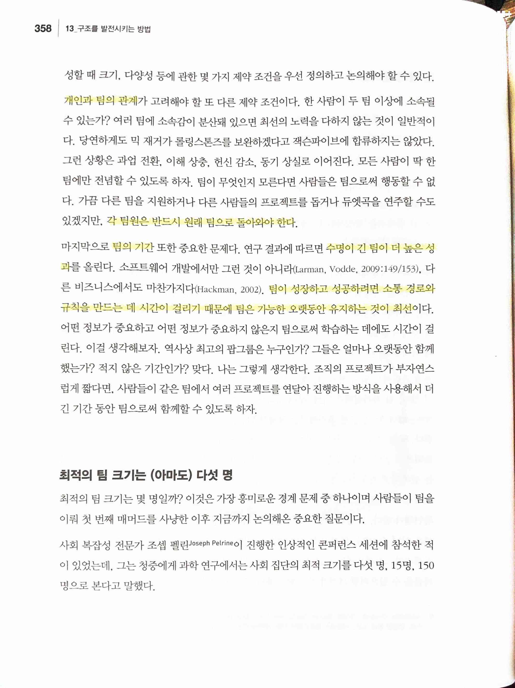

> `개인과 팀의 관계` 각 팀원은 반드시 원래 팀으로 돌아와야 한다.
>
> `팀의 기간` 수명이 긴 팀이 더 높은 성과... 팀이 성장하고 성공하려면 소통 경로와 규칙을 만드는 데 시간이 걸리기 때문에 팀은 가능한 오랫동안 유지하는 것이 최선
* 이 두 가지와 정확하게 반대로 하는 조직을 경험해봤다. 결과는 말할 필요도 없이 최악. 회사의 핵심 product가 망가져도 이걸 고칠 생각을 하지 않는 걸 보면서 떠나게 되었다

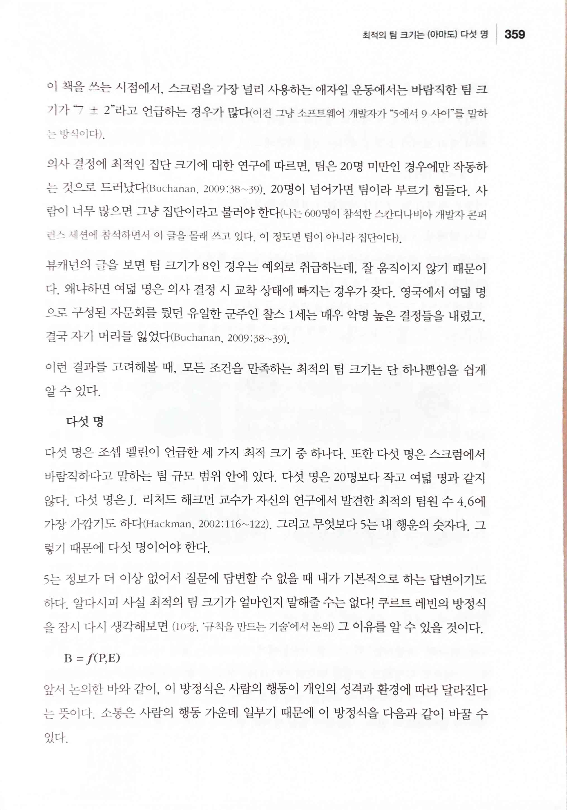 

> `최적의 팀 크기` (아마도) 다섯 명
>
> 최적의 팀 크기가 사람들의 성격과 환경에 따라 달라진다
>
> 팀 환경이나 성격의 조합이 바뀌면 모든 것을 다시 고려해볼 수 있다

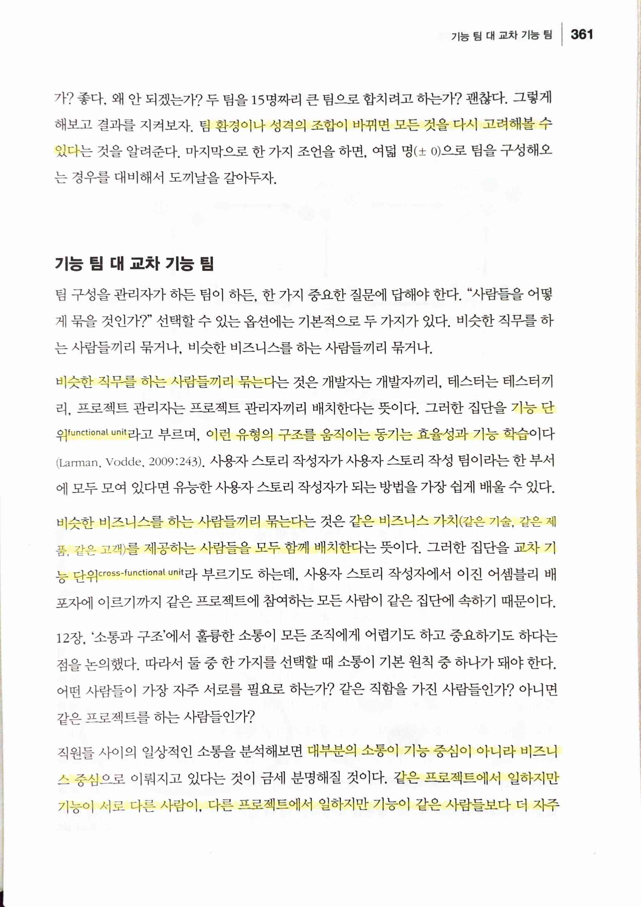 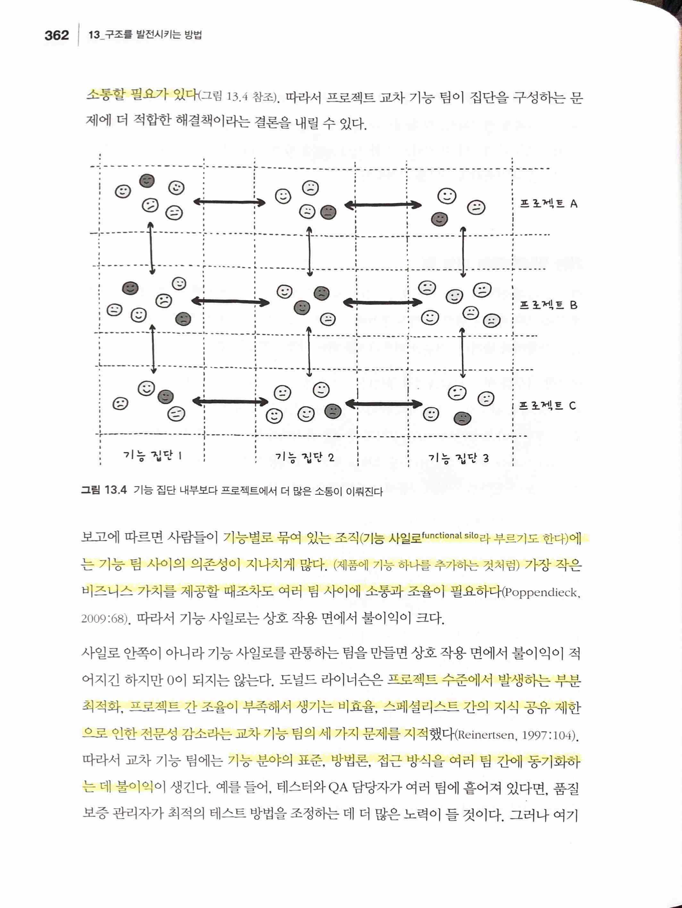 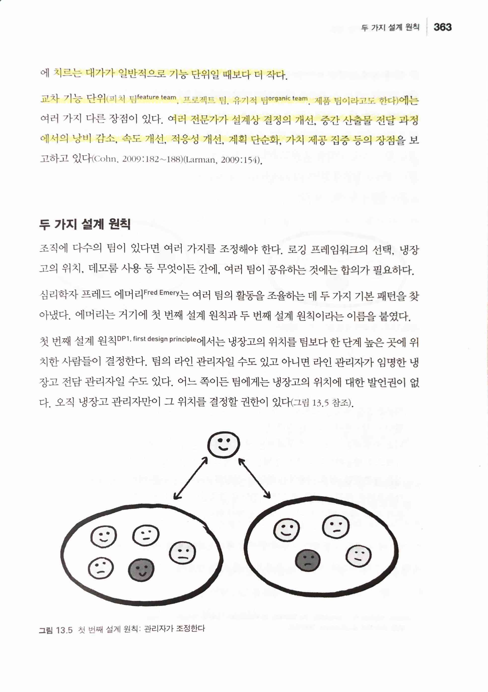

> 비슷한 직무를 하는 사람들끼리 묶는다 `기능 단위functional unit` 이런 유형의 구조를 움직이는 동기는 효율성과 기능 학습이다
>
> 비슷한 비즈니스를 하는 사람들끼리 묶는다, 같은 비즈니스 가치(같은 기술, 같은 제품, 같은 고객)를 제공하는 사람들을 모두 함께 배치 `교차 기능 단위 cross-functional unit`
>
> **대부분의 소통이 기능 중심이 아니라 비즈니스 중심**... 같은 프로젝트에서 일하지만 기능이 서로 다른 사람이 다른 프로젝트에서 일하지만 기능이 같은 사람들보다 더 자주 소통할 필요가 있다
>
> 기능별로 묶여 있는 조직(기능 사일로 functional silo라 부르기도 한다)에는 기능 팀 사이의 의존성이 지나치게 많다. (제품에 기능 하나를 추가하는 것처럼) 가장 작은 비즈니스 가치를 제공할 때조차도 여러 팀 사이에 소통과 조율이 필요
>
> 프로젝트 수준에서 발생하는 부분 최적화 프로젝트 간 조율이 부족해서 생기는 비효율, 스페셜리스트 간의 지식 공유 제한으로 인한 전문성 감소라는 교차 기능 팀의 세 가지 문제... 교차 기능 팀에는 기능 분야의 표준, 방법론, 접근 방식을 여러 팀 간에 동기화하는 데 불이익... 치르는 대가가 일반적으로 기능 단위일 때보다 더 작다.
>
> 교차 기능 단위(피처 팀 feature team. 프로젝트 팀, 유기적 팀 organic team. 제품 팀이라고도 한다)... 여러 전문가가 설계상 결정의 개선, 중간 산출물 전달 과정에서의 낭비 감소, 속도 개선, 적응성 개선, 계획 단순화, 가치 제공 집중 등의 장점

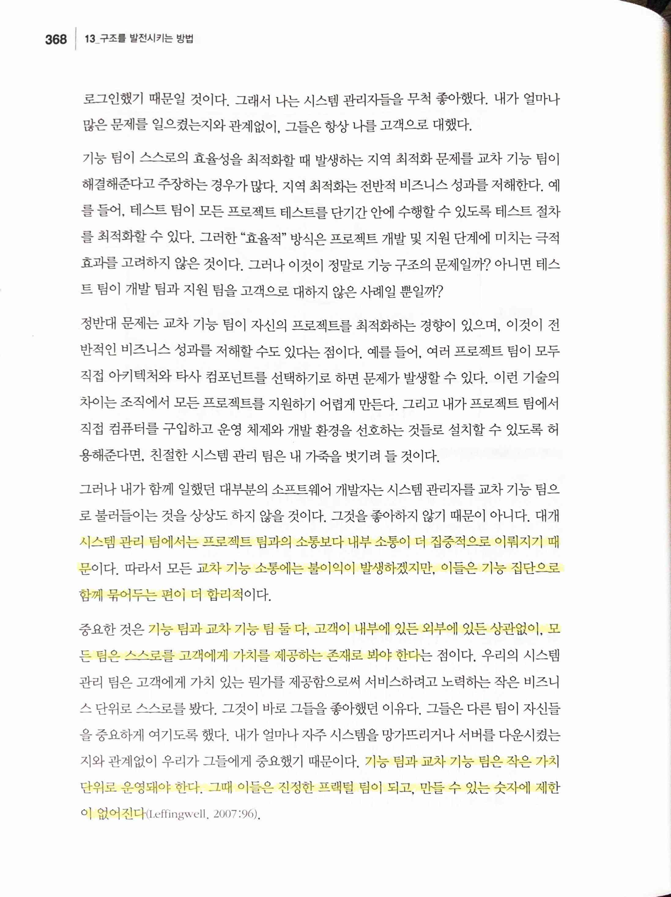

> 시스템 관리 팀에서는 프로젝트 팀과의 소통보다 내부 소통이 더 집중적으로 이뤄지기... 모든 교차 기능 소통에는 불이익이 발생하겠지만, 이들은 기능 집단으로 함께 묶어두는 편이 더 합리적
* 내 생각에 여기에 가장 부합하는 예가 infra나 DB를 관리하는 조직
> 기능 팀과 교차 기능 팀 둘 다 고객이 내부에 있든 외부에 있든 상관없이, 모든 팀은 스스로를 고객에게 가치를 제공하는 존재로 봐야 한다... 기능 팀과 교차 기능 팀은 작은 가치단위로 운영돼야 한다. 그때 이들은 진정한 프랙털 팀이 되고, 만들 수 있는 숫자에 제한이 없어진다

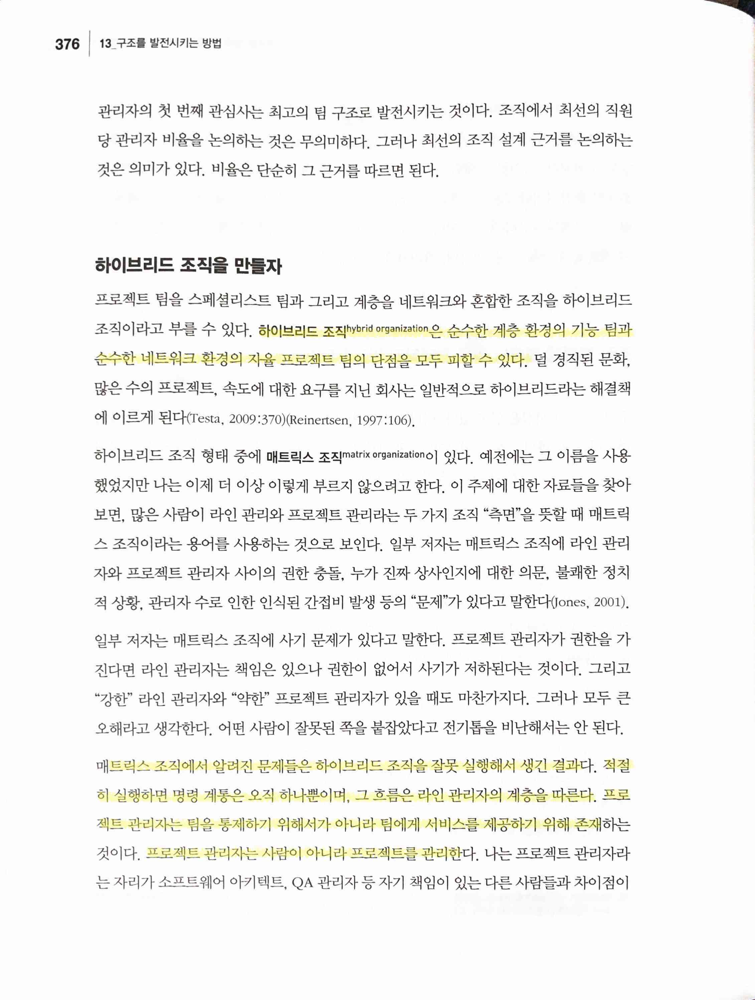

> `하이브리드 조직 hybrid organization` 순수한 계층 환경의 기능 팀과 순수한 네트워크 환경의 자율 프로젝트 팀의 단점을 모두 피할 수 있다.
>
> `매트릭스 조직`에서 알려진 문제들은 하이브리드 조직을 잘못 실행해서 생긴 결과다. 적절히 실행하면 명령 계통은 오직 하나뿐이며, 그 흐름은 라인 관리자의 계층을 따른다. 프로젝트 관리자는 팀을 통제하기 위해서가 아니라 팀에게 서비스를 제공하기 위해 존재. 프로젝트 관리자는 사람이 아니라 프로젝트를 관리
* 하지만 저자가 썼듯 (소위 spotify model을 따른) 매트릭스 조직의 실행은 매우 어렵다. 주변에서 보거나 실제로 경험했던 조직들은 다들 이 실행의 어려움으로 인해 문제를 가지고 있었다. 역시 그 어려움이 spotify model을 만든 Spotify도 결국 그 model을 버린 이유 중의 하나였다.
  * [Spotify’s Failed #SquadGoals](https://www.jeremiahlee.com/posts/failed-squad-goals/)
> 하이브리드 조직에는 대개 두 가지 이상의 "측면"이 있다는 것을 분명히 해준다. 위로 올라가는 라인은 라인 관리를 통한 오직 하나뿐이지만, 옆으로 뻗어나가는 라인은 여러 개

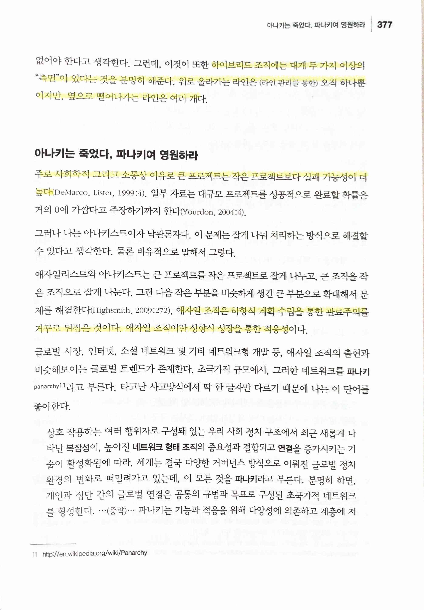 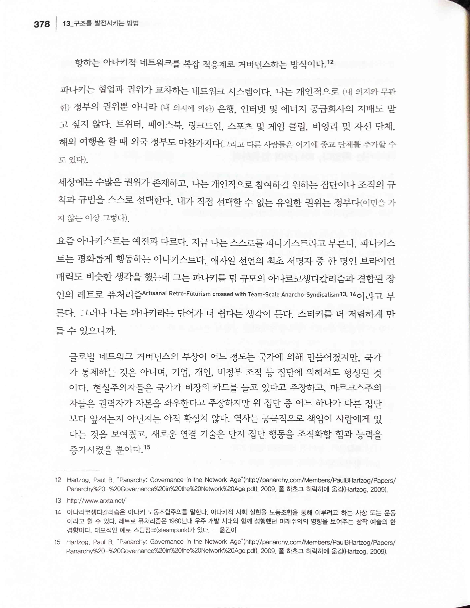 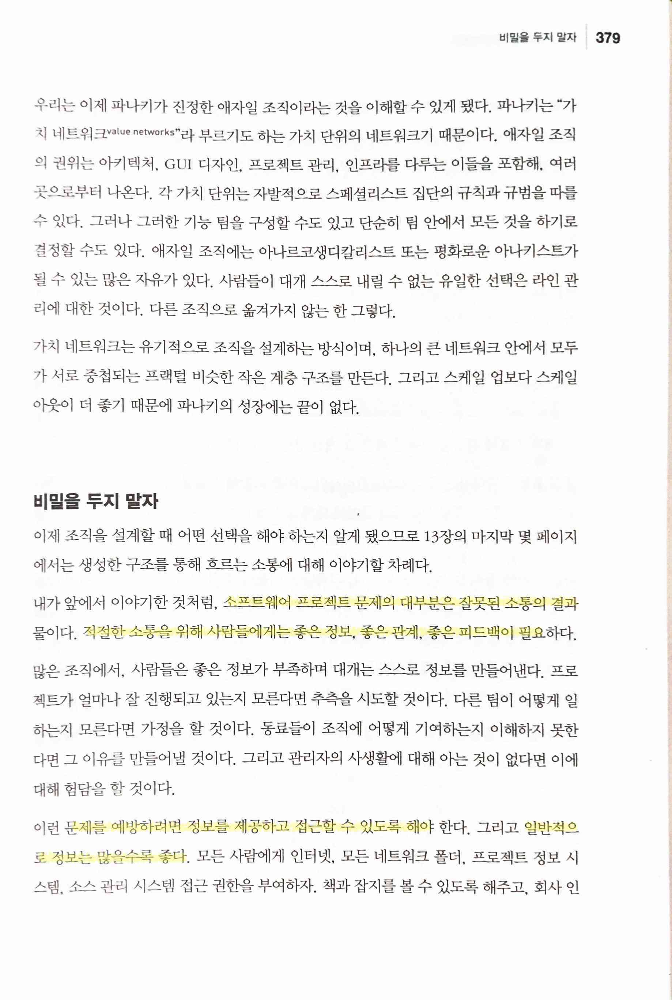

> 주로 사회학적 그리고 소통상 이유로 큰 프로젝트는 작은 프로젝트보다 실패 가능성이 더높다
>
> 애자일 조직은 하향식 계획 수립을 통한 관료주의를 거꾸로 뒤집은 것이다. 애자일 조직이란 상향식 성장을 통한 적응성
>
> 소프트웨어 프로젝트 문제의 대부분은 잘못된 소통의 결과물. 적절한 소통을 위해 사람들에게는 좋은 정보, 좋은 관계, 좋은 피드백이 필요
* 소프트웨어 프로젝트 뿐만이 아니라 인간이 하는 대부분의 일이 잘못된 원인은 잘못된 소통
> 이런 문제를 예방하려면 정보를 제공하고 접근할 수 있도록 해야 한다. 그리고 일반적으로 정보는 많을수록 좋다.

# 14 변화의 지형
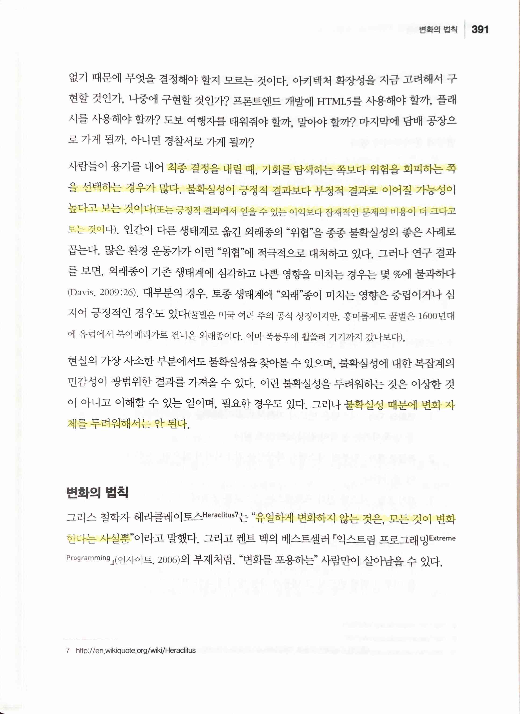

> 사람들이 용기를 내어 최종 결정을 내릴 때, 기회를 탐색하는 쪽보다 위험을 회피하는 쪽을 선택하는 경우가 많다. 불확실성이 긍정적 결과보다 부정적 결과로 이어질 가능성이 높다고 보는 것이다(또는 긍정적 결과에서 얻을 수 있는 이익보다 잠재적인 문제의 비용이 더 크다고 보는 것이다)
* 행동경제학 책에서 종종 보게 되는 이야기
> 불확실성 때문에 변화 자체를 두려워해서는 안 된다.
>
> 그리스 철학자 헤라클레이토스 Heraclitus "유일하게 변화하지 않는 것은, 모든 것이 변화한다는 사실뿐"
* [Heraclitus - Wikiquote](https://en.wikiquote.org/wiki/Heraclitus)

# 15 모든 것을 개선하는 방법
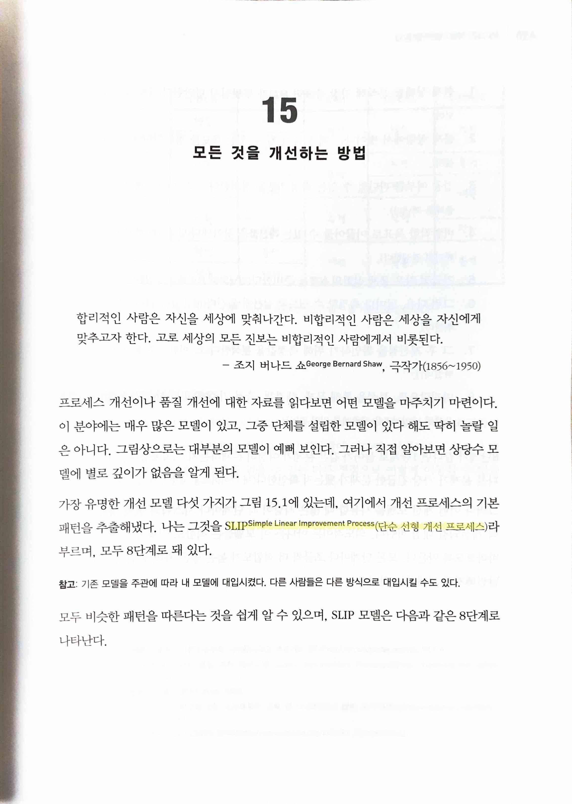 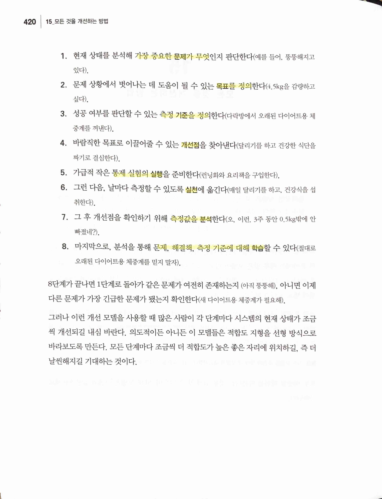

> SLIP Simple Linear Improvement Process(단순 선형 개선 프로세스)
>
> 1. 가장 중요한 `문제`가 무엇인지 판단
>
> 2. `목표` 정의
>
> 3. `측정 기준` 정의
>
> 4. `개선점`
>
> 5. 통제 실험 `실행`
>
> 6. `실천`
>
> 7. 측정값 `분석`
>
> 8. 문제, 해결책, 측정 기준 `학습`

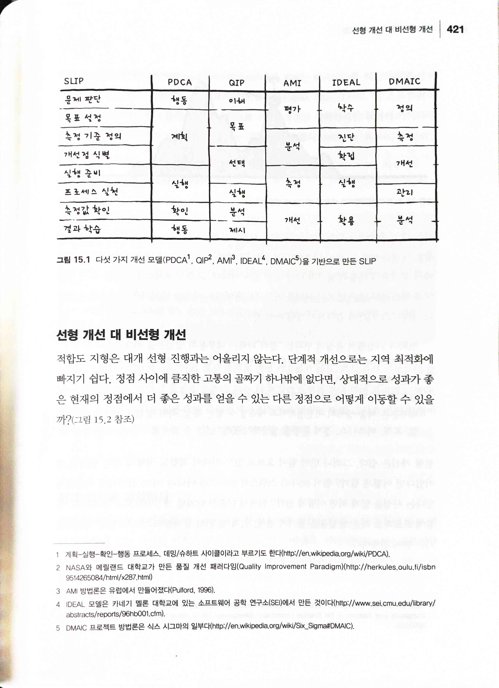

> 그림 15.1 다섯 가지 개선 모델(PDCA, QIP, AMP, IDEAL, DMAIC)을 기반으로 만든 SLIP
* [PDCA - Wikipedia](https://en.wikipedia.org/wiki/PDCA)
* [jultika.oulu.fi/Record/isbn951-42-6508-4](http://jultika.oulu.fi/Record/isbn951-42-6508-4)
* [IDEAL: A User's Guide for Software Process Improvement](https://resources.sei.cmu.edu/library/asset-view.cfm?assetID=12449)
* [DMAIC - Wikipedia](https://en.wikipedia.org/wiki/DMAIC)

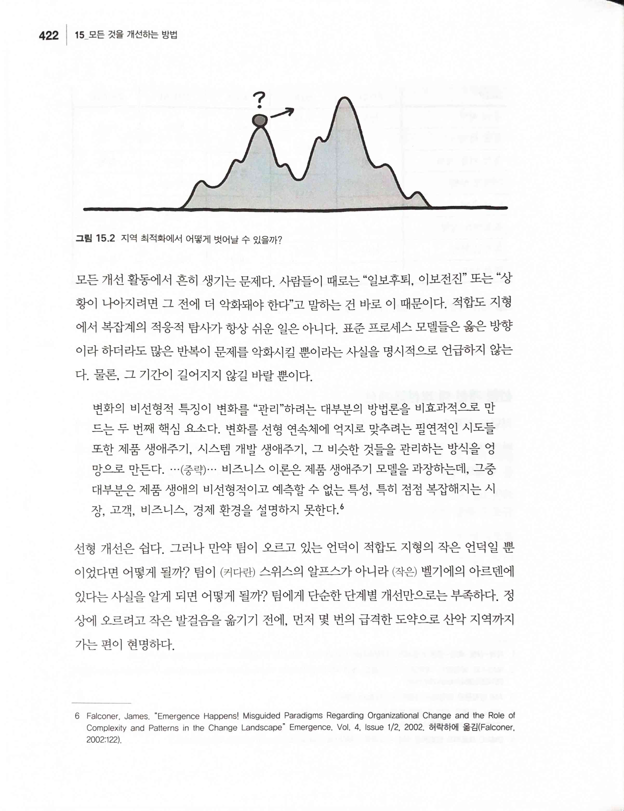 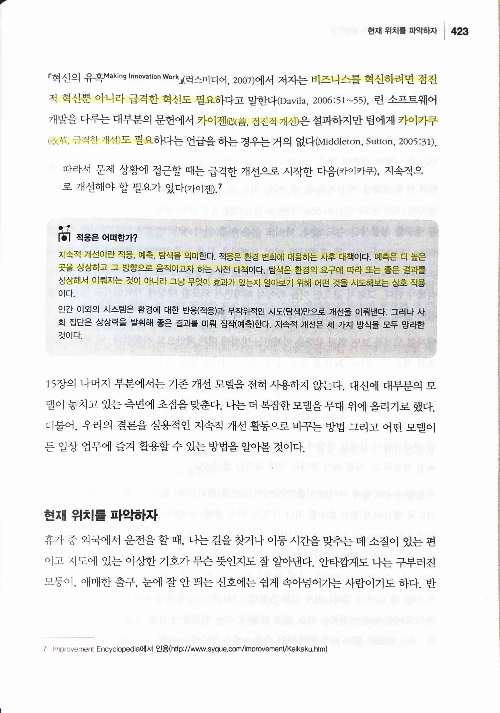

> 비즈니스를 혁신하려면 점진적 혁신 `카이젠(改善, 점진적 개선)`뿐 아니라 `급격한 혁신 카이카쿠(改革, 급격한 개선)`도 필요
>
> 지속적 개선이란 적응, 예측, 탐색을 의미. `적응`은 환경 변화에 대응하는 사후 대책. `예측`은 더 높은 곳을 상상하고 그 방향으로 움직이고자 하는 사전 대책. `탐색`은 환경의 요구에 따라 또는 좋은 결과를 상상해서 이뤄지는 것이 아니라 그냥 무엇이 효과가 있는지 알아보기 위해 어떤 것을 시도해보는 상호 작용

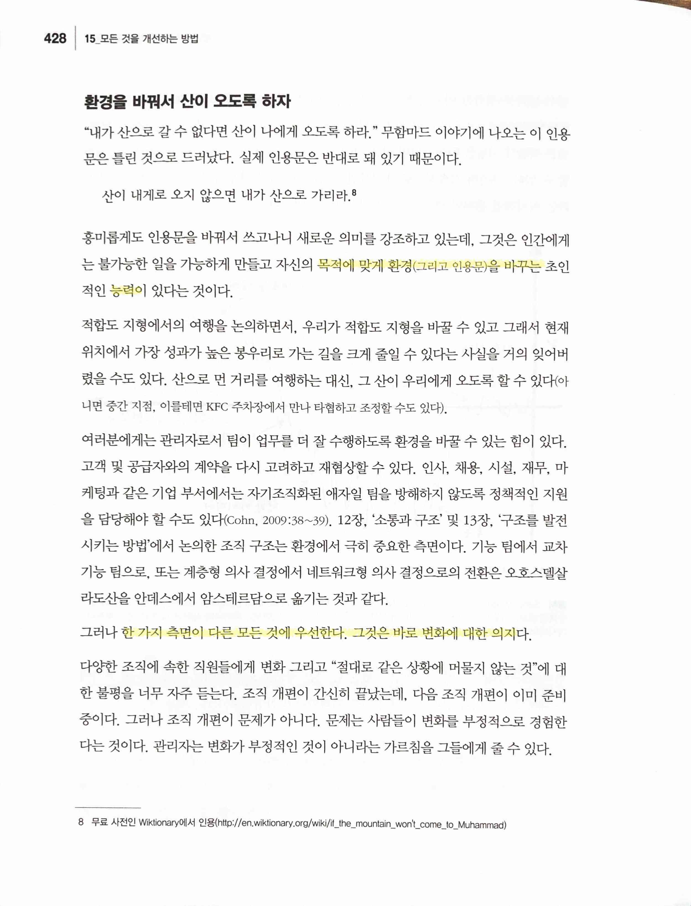

> 자신의 목적에 맞게 환경(그리고 인용문)을 바꾸는 능력
>
> 한가지 측면이 다른 모든 것에 우선한다. 그것은 바로 변화에 대한 `의지`
* 의지가 있어도 주변 환경과 충돌하면 어떻게 해야 할까? 어디까지 의지를 관철시키고 어디까지 타협해야 할까? 이 부분이 너무 어렵고 정확한 방법을 모르겠다

# 16 모두 틀리다. 하지만 유용한 것도 있다
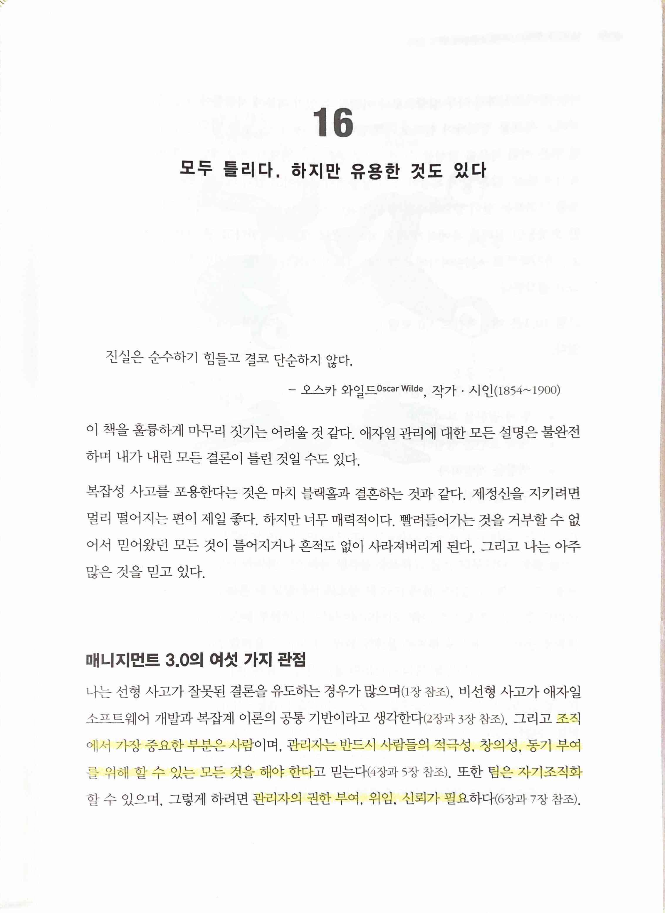

> 조직에서 가장 중요한 부분은 사람, 관리자는 반드시 사람들의 적극성, 창의성, 동기 부여를 위해 할 수 있는 모든 것을 해야 한다. 팀은 자기조직화할 수 있으며, 관리자의 권한 부여, 위임, 신뢰가 필요

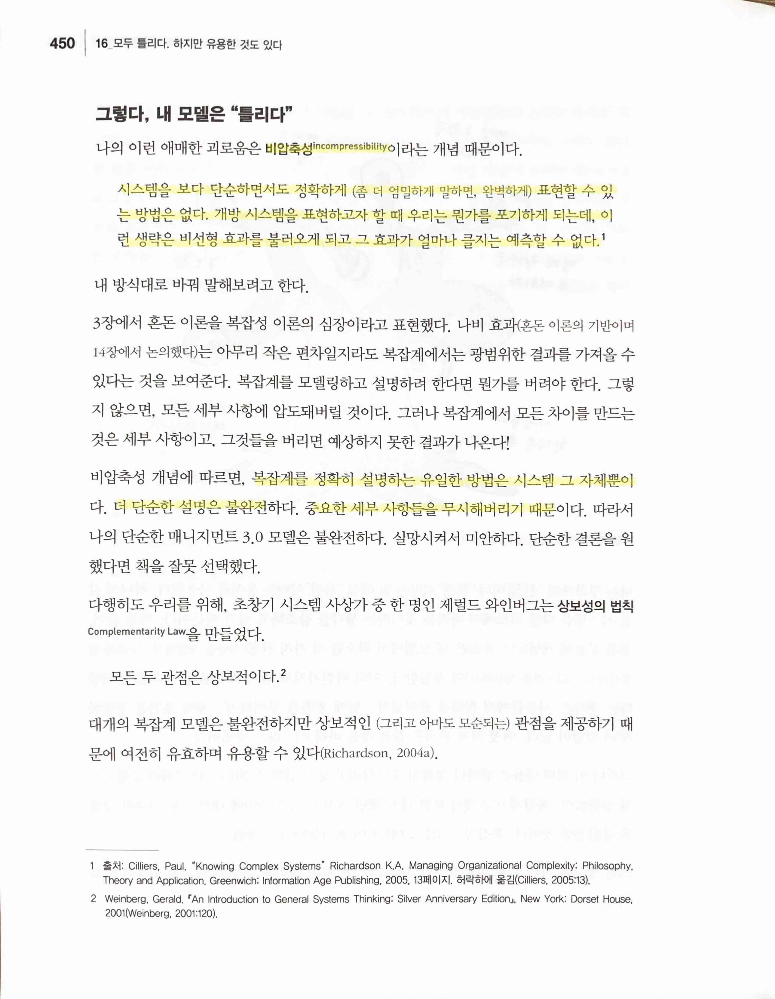

> `비압축성 incompressibility`
>
> 시스템을 보다 단순하면서도 정확하게 (좀 더 엄밀하게 말하면, 완벽하게) 표현할 수 있는 방법은 없다. 개방 시스템을 표현하고자 할 때 우리는 뭔가를 포기하게 되는데, 이런 생략은 비선형 효과를 불러오게 되고 그 효과가 얼마나 클지는 예측할 수 없다.
>
> 복잡계를 정확히 설명하는 유일한 방법은 시스템 그 자체뿐. 더 단순한 설명은 불완전. 중요한 세부 사항들을 무시해버리기 때문

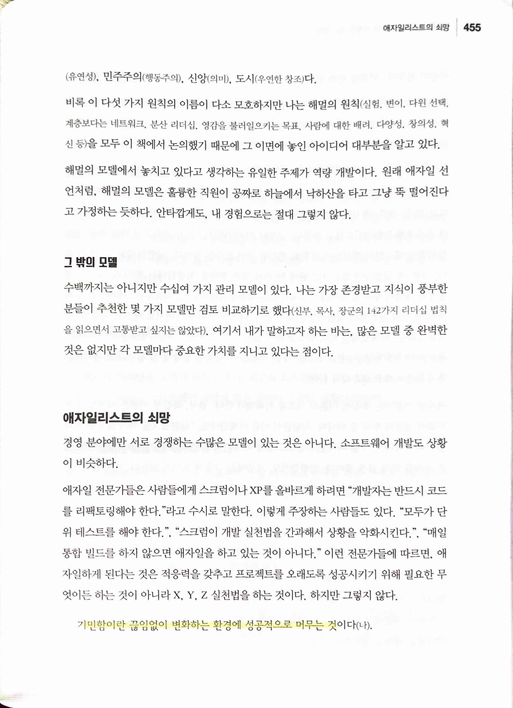 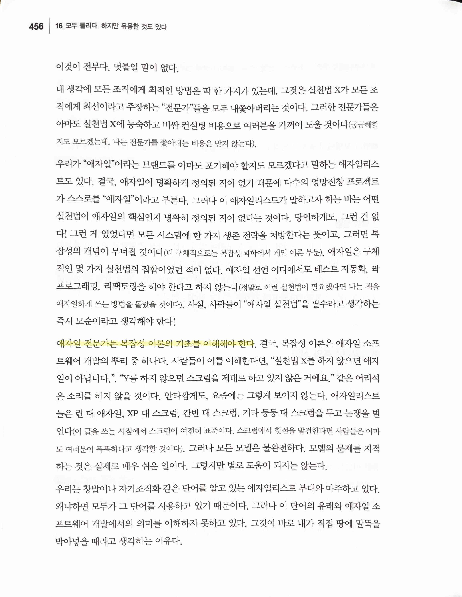

> 기민함이란 끊임없이 변화하는 환경에 성공적으로 머무는 것
>
> 애자일 전문가는 복잡성 이론의 기초를 이해해야 한다

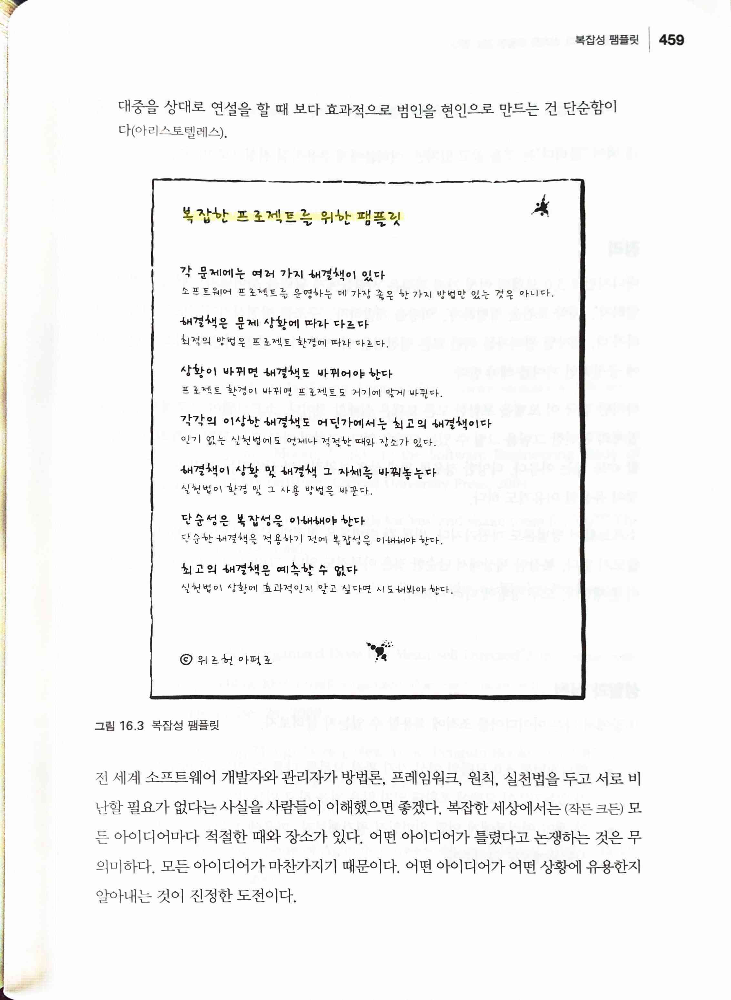

> 복잡한 프로젝트를 위한 팸플릿
>
> 각 문제에는 여러 가지 해결책이 있다.
>
> 해결책은 문제 상황에 따라 다르다.
>
> 상황이 바뀌면 해결책도 바뀌어야 한다.
>
> 각각의 이상한 해결책도 어딘가에서는 최고의 해결책이다.
>
> 해결책이 상황 및 해결책 그 자체를 바꿔놓는다.
>
> 단순성은 복잡성을 이해해야 한다.
>
> 최고의 해결책은 예측할 수 없다.