Moonshot 문샷 불가능을 가능으로 만든 화이자의 대담한 전략
=========================================================
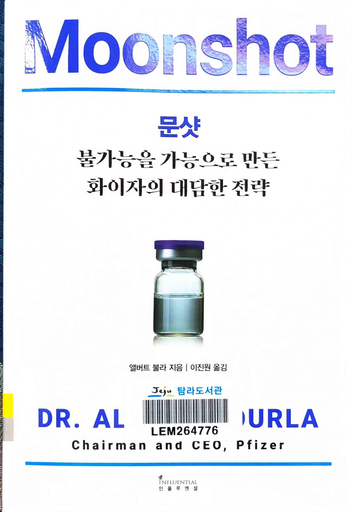

# 프롤로그 기회는 준비된 자에게 찾아온다
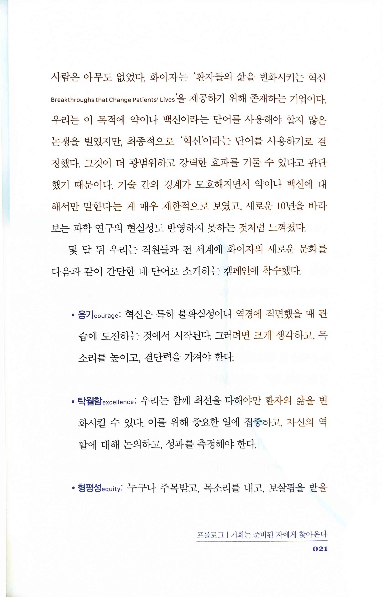 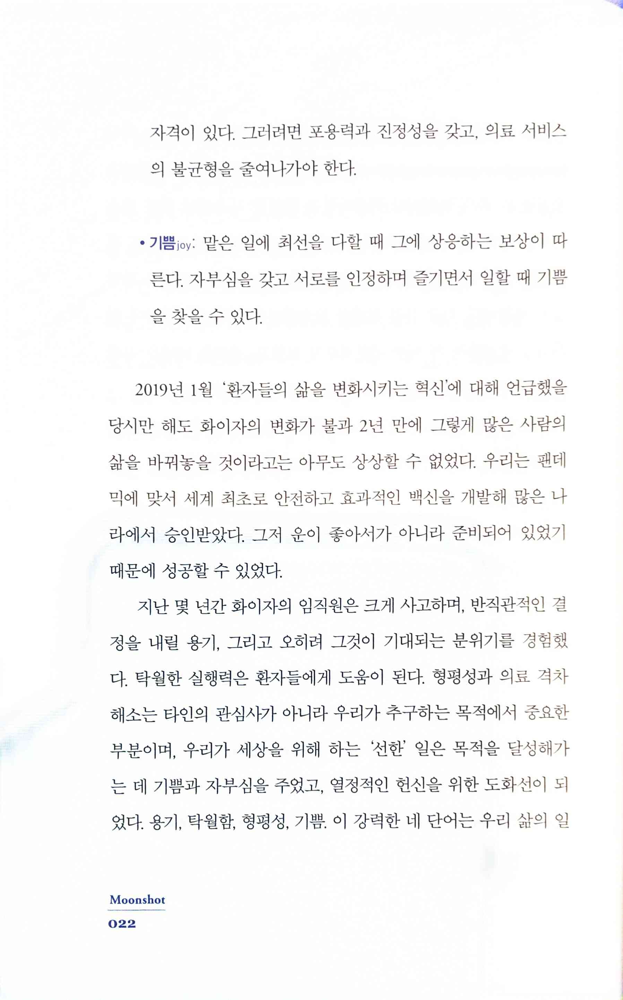

> 우리는 이 목적에 약이나 백신이라는 단어를 사용해야 할지 많은 논쟁을 벌였지만, 최종적으로 '혁신'이라는 단어를 사용하기로 결정했다. 그것이 더 광범위하고 강력한 효과를 거둘 있다고 판단했기 때문이다. 기술 간의 경계가 모호해지면서 약이나 백신에 대해서만 말한다는 게 매우 제한적으로 보였고, 새로운 10년을 바라보는 과학 연구의 현실성도 반영하지 못하는 것처럼 느껴졌다.
>
> 몇 달 뒤 우리는 직원들과 전 세계에 화이자의 새로운 문화를 다음과 같이 간단한 네 단어로 소개하는 캠페인에 착수했다.
>
> • 용기 courage: 혁신은 특히 불확실성이나 역경에 직면했을 때 관습에 도전하는 것에서 시작된다. 그러려면 크게 생각하고, 목소리를 높이고, 결단력을 가져야 한다.
>
> • 탁월함 excellence: 우리는 함께 최선을 다해야만 환자의 삶을 변화시킬 수 있다. 이를 위해 중요한 일에 집중하고, 자신의 역할에 대해 논의하고, 성과를 측정해야 한다.
>
> • 형평성 equity: 누구나 주목받고, 목소리를 내고, 보살핌을 받을 자격이 있다. 그러려면 포용력과 진정성을 갖고, 의료 서비스의 불균형을 줄여나가야 한다.
>
> • 기쁨 joy 맡은 일에 최선을 다할 때 그에 상응하는 보상이 따른다. 자부심을 갖고 서로를 인정하며 즐기면서 일할 때 기쁨을 찾을 수 있다.
>
> 그저 운이 좋아서가 아니라 준비되어 있었기 때문에 성공할 수 있었다.
>
> 지난 몇 년간 화이자의 임직원은 크게 사고하며, 반직관적인 결정을 내릴 용기, 그리고 오히려 그것이 기대되는 분위기를 경험했다.

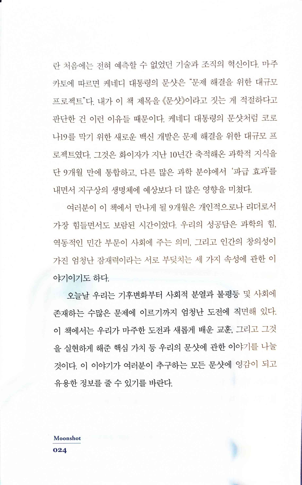

> 케네디 대통령의 문샷은 “문제 해결을 위한 대규모 프로젝트"다.

# 1장 평소와는 다른 비즈니스
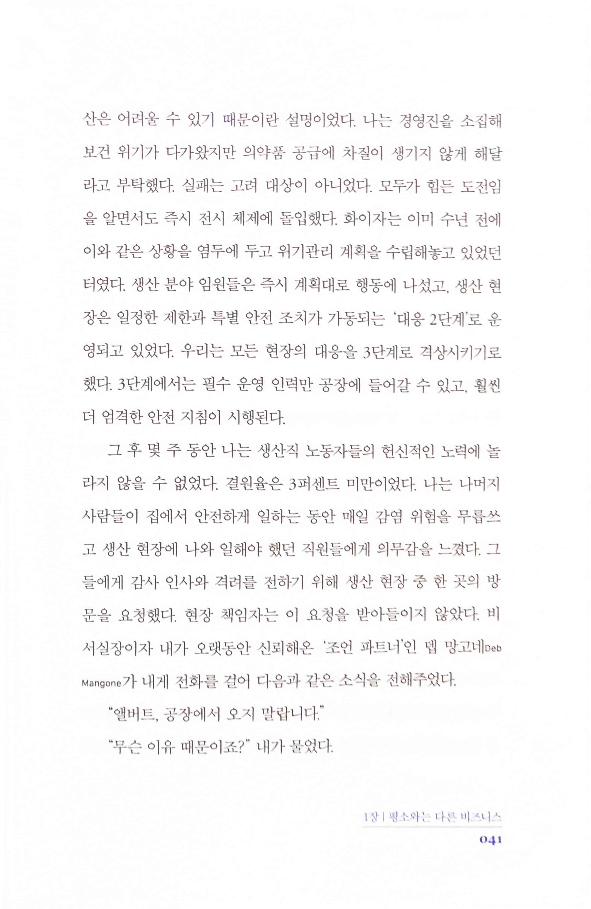 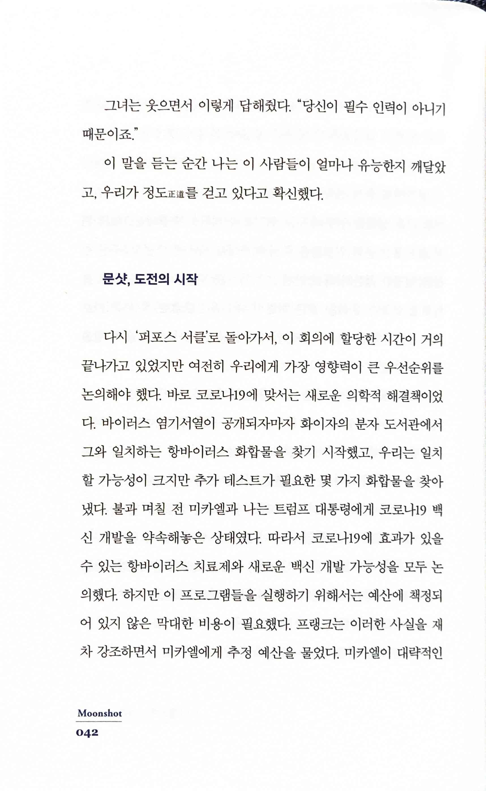

* 감사 인사를 하려고 생산 현장에 방문하려고 했지만, 공장에서 필수 인력이 아니라 거부당했다는 유쾌한 에피소드

# 2장 분명한 것이 항상 옳은 것은 아니다

# 3장 불가능을 가능으로 만드는 대담한 전략
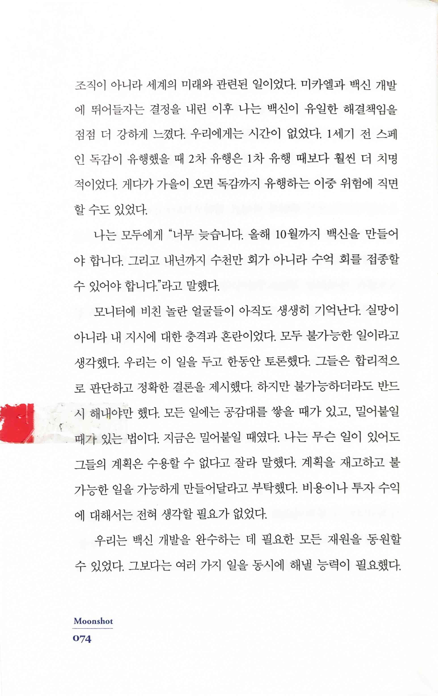

> 모든 일에는 공감대를 쌓을 때가 있고, 밀어붙일 때가 있는 법이다.

# 4장 광속 프로젝트
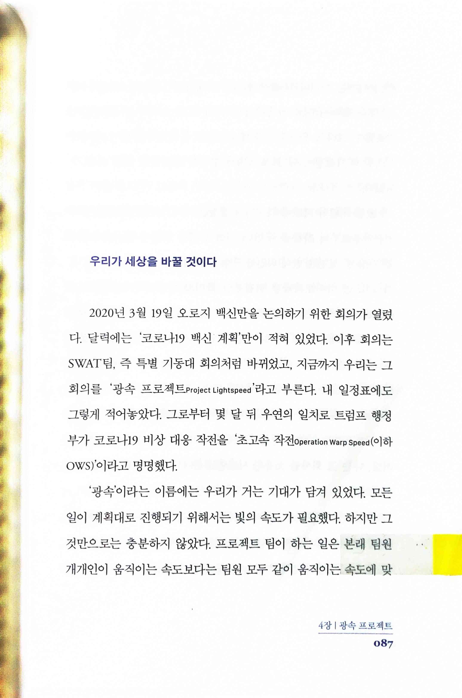

> 프로젝트 팀이 하는 일은 본래 팀원 개개인이 움직이는 속도보다는 팀원 모두 같이 움직이는 속도에 맞춰 돌아가는 법이다... 다시 말해, 전체가 부분보다 더 중요했다.

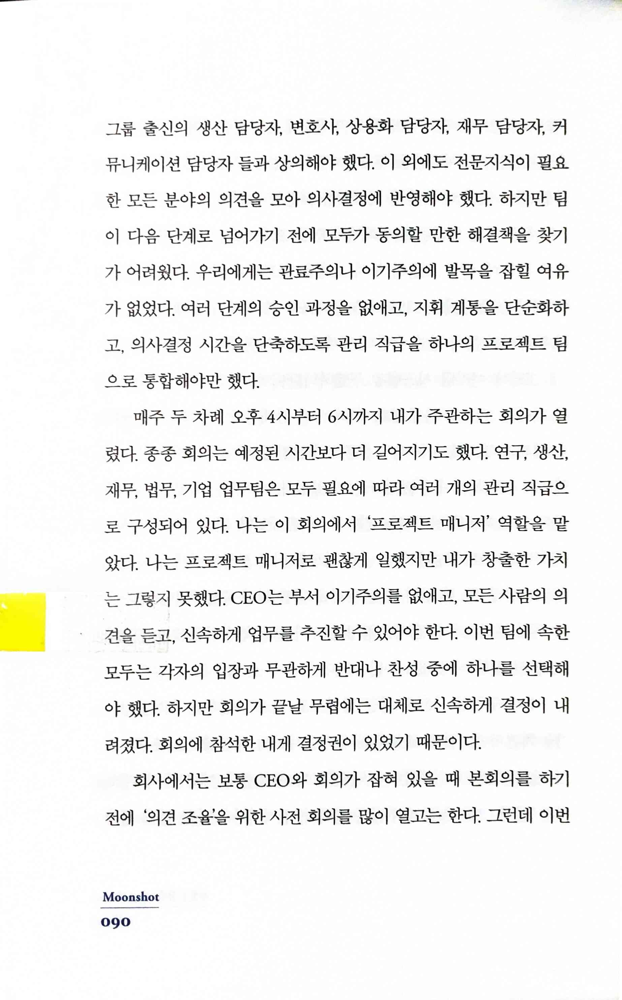

> CEO는 부서 이기주의를 없애고, 모든 사람의 의견을 듣고, 신속하게 업무를 추진할 수 있어야 한다. 이번 팀에 속한 모두는 각자의 입장과 무관하게 반대나 찬성 중에 하나를 선택해야 했다. 하지만 회의가 끝날 무렵에는 대체로 신속하게 결정이 내려졌다. 회의에 참석한 내게 결정권이 있었기 때문이다.
* CEO뿐만 아니라 리더라면 가진 권한 내에서는 항상 이래야 하지 않을까?

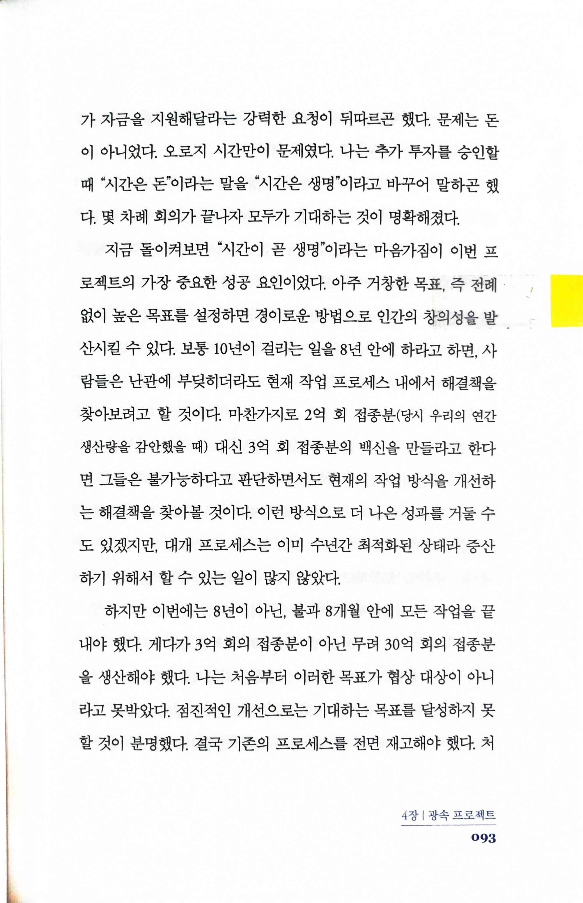

> 지금 돌이켜보면 "시간이 곧 생명"이라는 마음가짐이 이번 프로젝트의 가장 중요한 성공 요인이었다. 아주 거창한 목표, 즉 전례없이 높은 목표를 설정하면 경이로운 방법으로 인간의 창의성을 발산시킬 수 있다.
* 이 부분이 참 어려운 일 중 하나인 듯. 이 일은 워낙 시급하고 중요한 일이니 논외로 하더라도, 일반적인 경우 OKR과 같은 맥락에서 이렇게 정하는 게 맞을까?

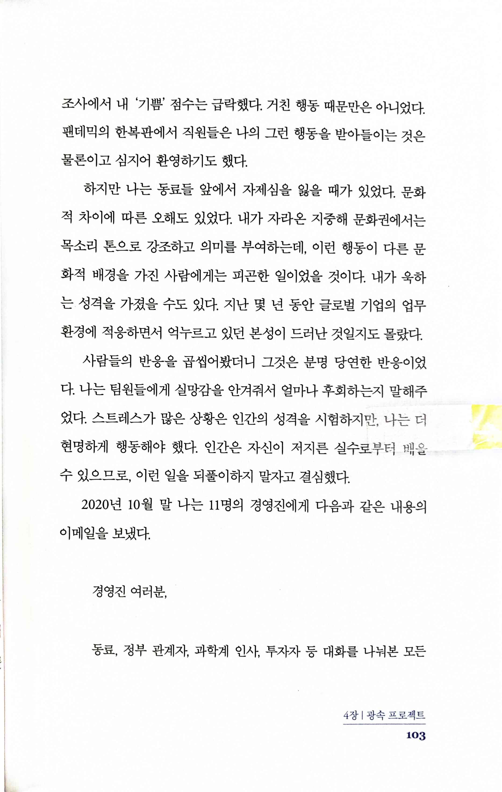

> 스트레스가 많은 상황은 인간의 성격을 시험하지만, 나는 더 현명하게 행동해야 했다. 인간은 자신이 저지른 실수로부터 배울수 있으므로, 이런 일을 되풀이하지 말자고 결심했다.

# 5장 궁극의 기쁨

# 6장 과거, 현재, 그리고 미래
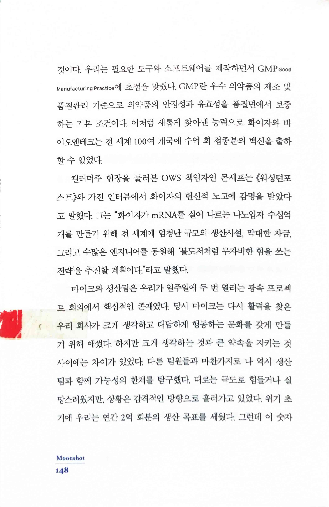

> 하지만 크게 생각하는 것과 큰 약속을 지키는 것 사이에는 차이가 있었다.
* 결국 실천이 더 중요

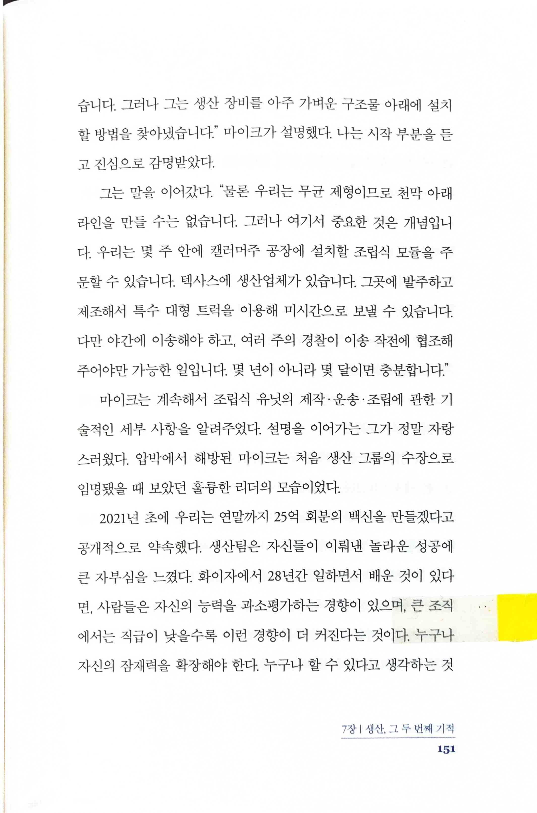

> 사람들은 자신의 능력을 과소평가하는 경향이 있으며, 큰 조직에서는 직급이 낮을수록 이런 경향이 더 커진다는 것이다. 누구나 자신의 잠재력을 확장해야 한다. 누구나 할 수 있다고 생각하는 것 이상으로 해낼 수 있으며, 스스로 더 강하게 밀어붙일 수 있다.

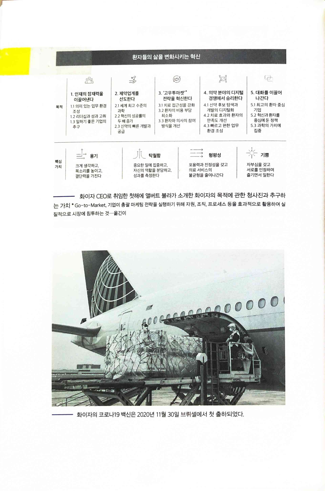

> 화이자 CEO로 취임한 첫해에 앨버트 불라가 소개한 화이자의 목적에 관한 청사진과 추구하는 가치

# 8장 백신 평등을 위한 발걸음

> "좋은 평판을 쌓는 방법은 보여주고 싶은 모습을 갖추기 위해 노력하는 것이다." 고대 그리스 철학자 소크라테스

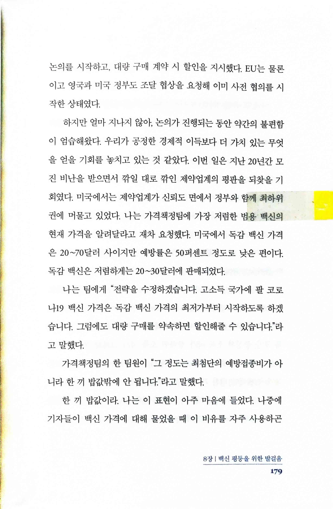

> 미국에서는 제약업계가 신뢰도 면에서 정부와 함께 최하위권에 머물고 있었다.
>
> 가격책정팀의 한 팀원이 "그 정도는 최첨단의 예방접종비가 아니라 한 끼 밥값밖에 안 됩니다."라고 말했다.
>
> 한 끼 밥값이라. 나는 이 표현이 아주 마음에 들었다.

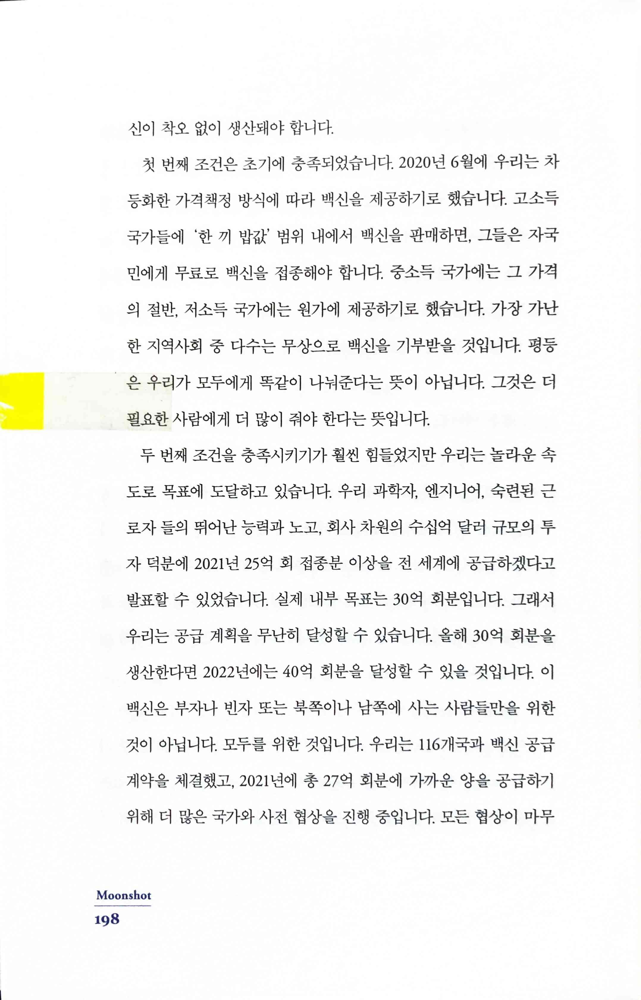

> 평등은 우리가 모두에게 똑같이 나눠준다는 뜻이 아닙니다. 그것은 더 필요한 사람에게 더 많이 줘야 한다는 뜻입니다.
* [Equity vs Equality? What is the Difference?](https://dividedwefall.org/equity-vs-equality/)
* [equality_v._equity_04_05_2021.pdf](https://www.marinhhs.org/sites/default/files/boards/general/equality_v._equity_04_05_2021.pdf)

# 9장 정치적 지뢰밭을 헤쳐나가기

> 나는 당시 사건으로 우리 팀이 큰 의미 있는 가치관을 배우길 바랐다. 책임을 지고, 숨지 말라는 것이다. 그리고 문제가 생기면 해결할 방법을 알아보고, 직접 사과하며, 알아낸 결과를 설명하라는 것이다.

# 10장 희망의 등불
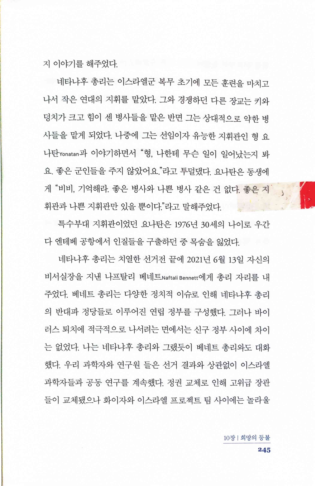

> "좋은 병사와 나쁜 병사 같은 건 없다. 좋은 지휘관과 나쁜 지휘관만 있을 뿐이다."

# 11장 신뢰의 과학
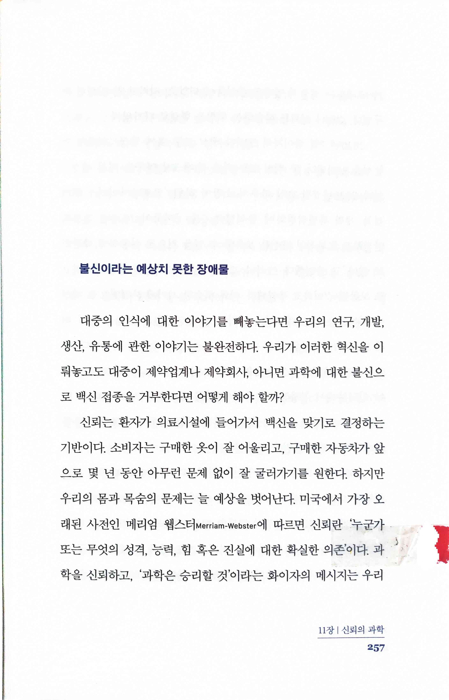

> 미국에서 가장 오래된 사전인 메리엄 웹스터Merriam-Webster에 따르면 `신뢰`란 '누군가 또는 무엇의 성격, 능력, 힘 혹은 진실에 대한 확실한 의존'이다.

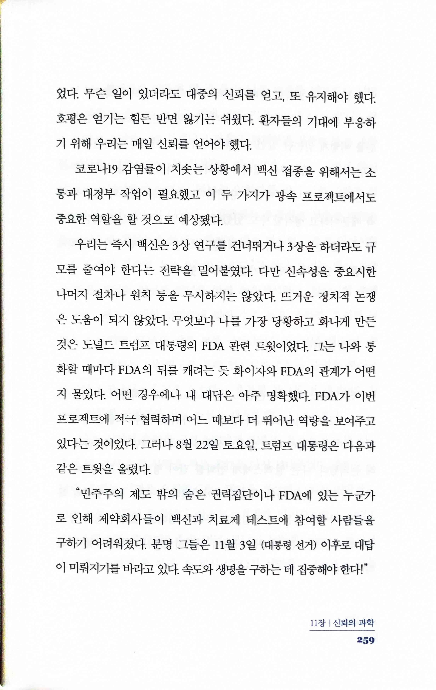

> 무슨 일이 있더라도 대중의 신뢰를 얻고, 또 유지해야 했다. 호평은 얻기는 힘든 반면 잃기 쉬웠다. 환자들의 기대에 부응하기 위해 우리는 매일 신뢰를 얻어야 했다.

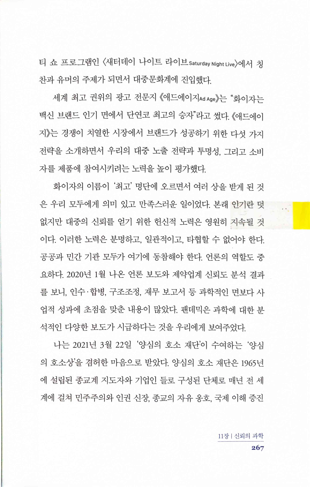

> 본래 인기란 덧없지만 대중의 신뢰를 얻기 위한 헌신적 노력은 영원히 지속될 것이다. 이러한 노력은 분명하고, 일관적이고, 타협할 수 없어야 한다.

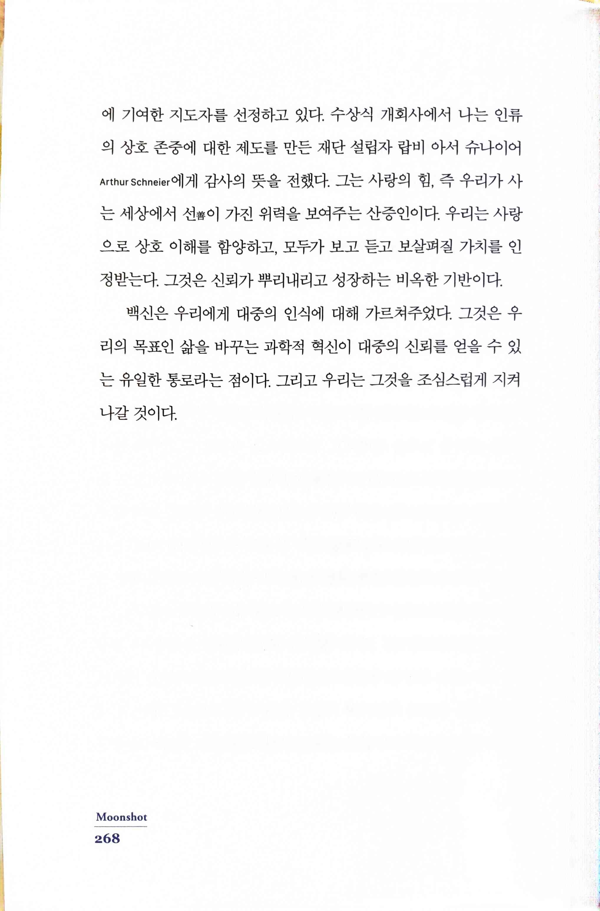

> 우리는 사랑으로 상호 이해를 함양하고, 모두가 보고 듣고 보살펴질 가치를 인정받는다. 그것은 신뢰가 뿌리내리고 성장하는 비옥한 기반이다.
>
> 우리의 목표인 삶을 바꾸는 과학적 혁신이 대중의 신뢰를 얻을 수 있는 유일한 통로

# 12장 친환자적이고 친혁신적인 제언

# 에필로그 변화를 만드는 화이자의 목적 지향 문화
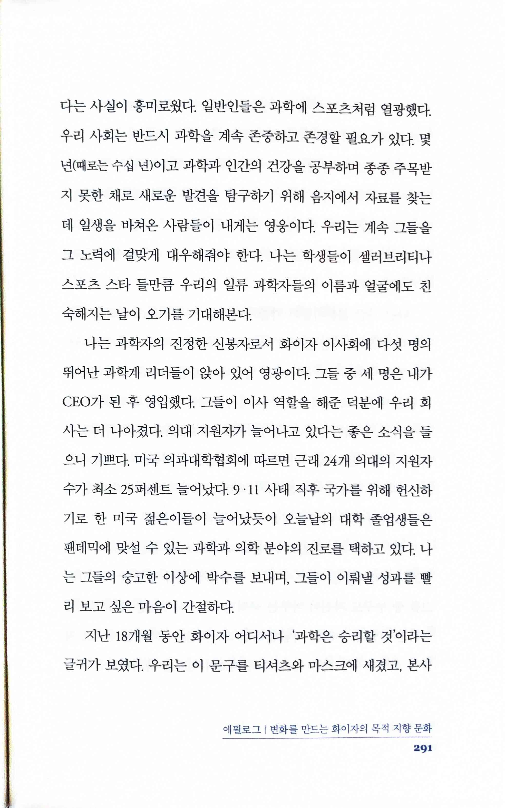

> 우리 사회는 반드시 과학을 계속 존중하고 존경할 필요가 있다.

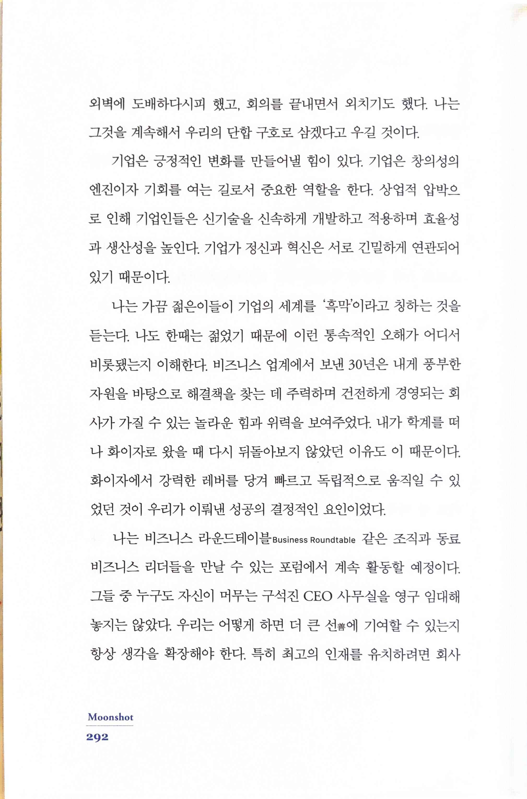

> 기업은 긍정적인 변화를 만들어낼 힘이 있다. 기업은 창의성의 엔진이자 기회를 여는 길로서 중요한 역할을 한다. 상업적 압박으로 인해 기업인들은 신기술을 신속하게 개발하고 적용하며 효율성과 생산성을 높인다. 기업가 정신과 혁신은 서로 긴밀하게 연관되어 있기 때문이다.

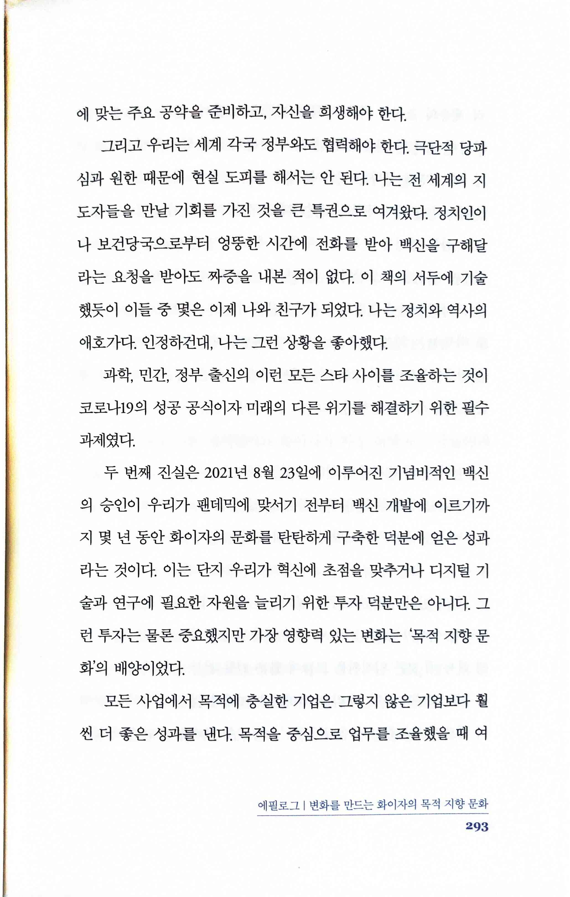

> 가장 영향력 있는 변화는 '목적 지향 문화'의 배양이었다.

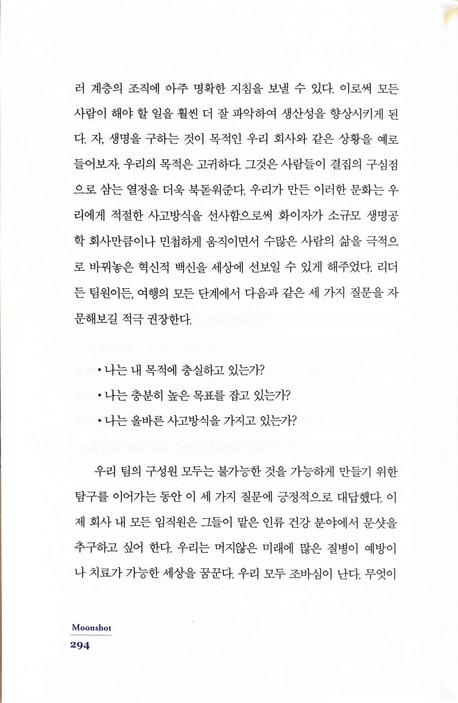

> • 나는 내 목적에 충실하고 있는가?
>
> • 나는 충분히 높은 목표를 잡고 있는가?
>
> • 나는 올바른 사고방식을 가지고 있는가?

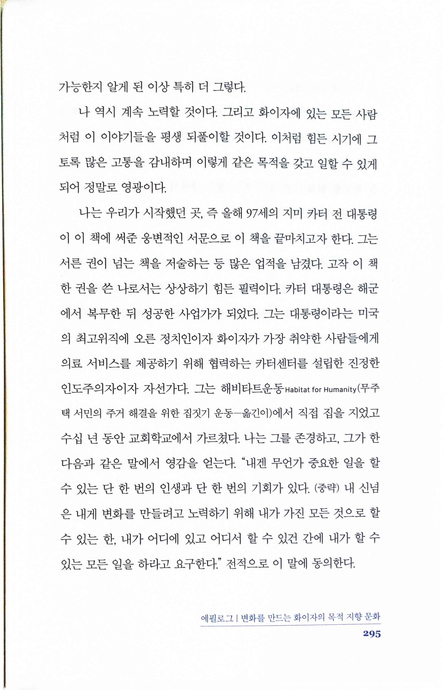

> "내겐 무언가 중요한 일을 할 수 있는 단 한 번의 인생과 단 한 번의 기회가 있다. (중략) 내 신념은 내게 변화를 만들려고 노력하기 위해 내가 가진 모든 것으로 할 수 있는 한, 내가 어디에 있고 어디서 할 수 있건 간에 내가 할 수 있는 모든 일을 하라고 요구한다." 전적으로 이 말에 동의한다.
* 지미 카터에 대한 좋은 이야기. 재임 시절 어떤 일을 했었는지도 물론 기억해야 한다.