# 애자일 조직은 이렇게 일합니다 More Effective Agile A Roadmap for Software Leaders

* [Home | More Effective Agile](https://moreeffectiveagile.com/)

## 01 더 효과적인 애자일

### 1장 시작
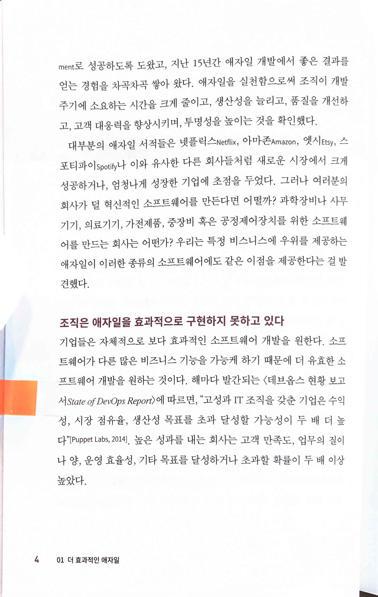

> <데브옵스 현황 보고서 State of DevOps Report>에 따르면, “고성과 IT 조직을 갖춘 기업은 수익성, 시장 점유율, 생산성 목표를 초과 달성할 가능성이 두 배 더 높다”[Puppet Labs, 2014], 높은 성과를 내는 회사는 고객 만족도, 업무의 질이나 양, 운영 효율성, 기타 목표를 달성하거나 초과할 확률이 두 배 이상 높았다.

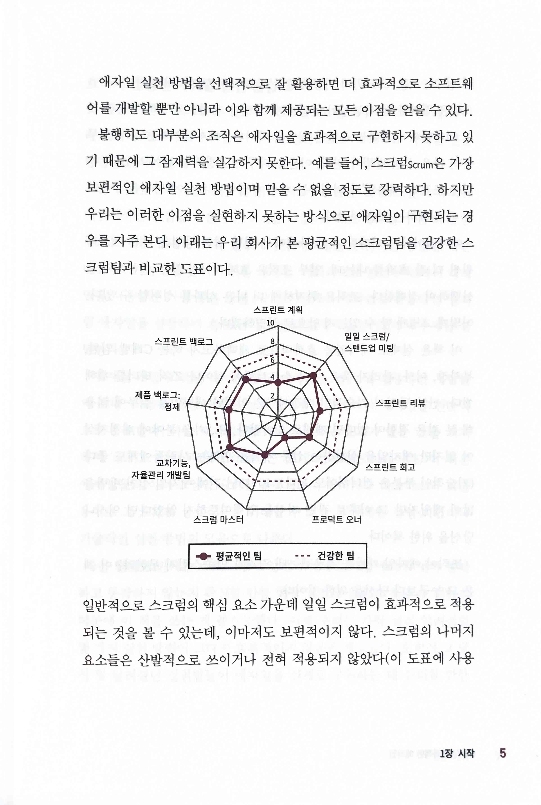

> 평균적인 스크럼팀을 건강한 스크럼팀과 비교한 도표

### 2장 오늘의 애자일
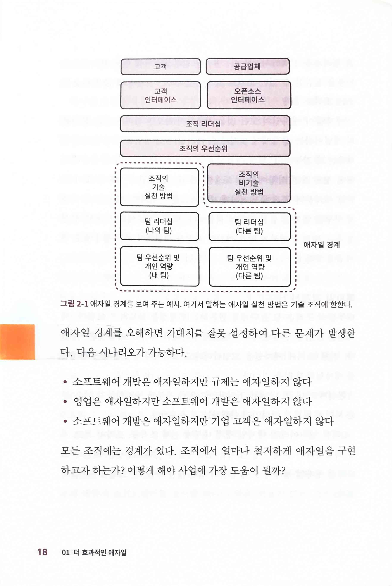

> 애자일 경계를 오해하면 기대치를 잘못 설정하여 다른 문제가 발생한다.

### 3장 복잡성과 불확실성에 대응하기
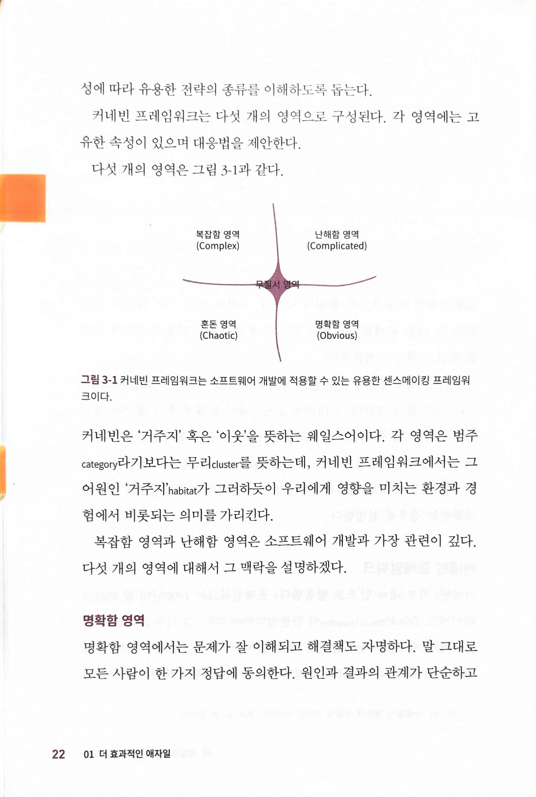

> 커네빈 프레임워크는 다섯 개의 영역으로 구성된다. 각 영역에는 고유한 속성이 있으며 대응법을 제안한다.
>
> 복잡함 영역 (Complex) 혼돈 영역 (Chaotic) 난해함 영역 (Complicated) 명확함 영역 (Obvious)

> 명확함 영역에서는 문제가 잘 이해되고 해결책도 자명하다. 말 그대로 모든 사람이 한 가지 정답에 동의한다. 원인과 결과의 관계가 단순하고 직접적이다. 이는 프로그래밍되어 있고, 절차적이고, 반복적인 암기 동작 같은 패턴이 적용되는 영역이다.

> 난해함 영역에서 여러분은 문제의 일반적인 형태가 어떤지, 어떤 질문을 해야 하는지, 어떻게 답을 얻어야 하는지 알고 있다. 또한 정답이 여러 개 존재한다. 원인과 결과 사이의 관계가 복잡하여 이를 이해하려면 전문적인 지식을 분석하고, 조사하고, 적용해야 한다. 모든 사람이 원인과 결과의 관계를 볼 수 있거나 이해할 수 있지는 않기 때문에 전문가 영역이 난해해지는 것이다.
>
> 먼저 문제에 대한 이해와 접근방식을 공식화한 다음 문제해결로 직행한다

 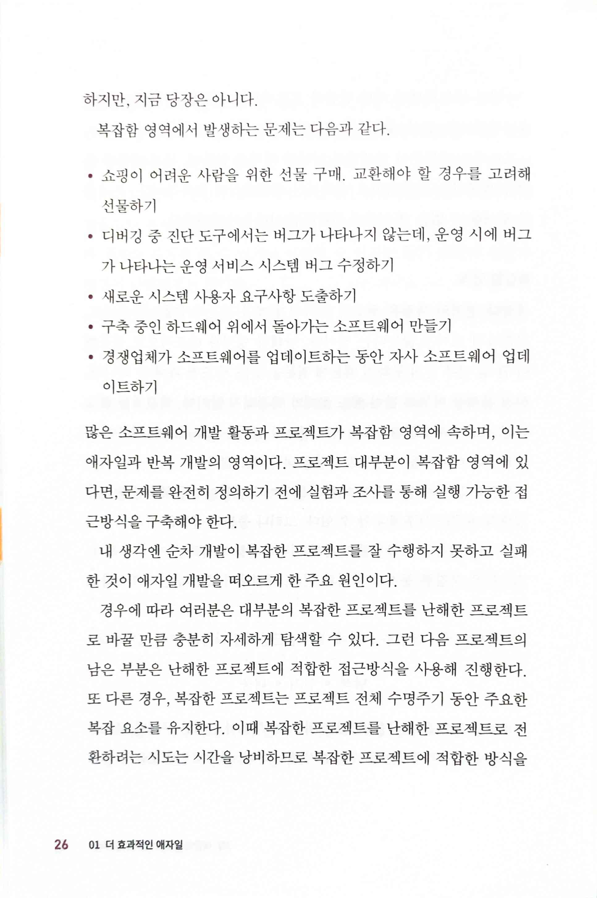

> 복잡함 영역의 특징은 원인과 결과의 관계가 전문가에게조차 곧바로, 명확하게 보이지 않는다는 점이다. 난해함 영역과 대조적으로 질문해야 할 걸 전부 알지 못하기 때문에 질문을 찾는 게 도전 과제 중 하나다. 사전 분석을 아무리 많이 해도 문제가 해결되지 않기에, 해결책을 찾으려면 실험이 필요하다. 사실 어느 정도의 실패는 프로세스의 일부이고, 불완전한 데이터를 기반으로 결정을 내릴 때도 많다.
>
> 많은 소프트웨어 개발 활동과 프로젝트가 복잡함 영역에 속하며, 이는 애자일과 반복 개발의 영역이다. 프로젝트 대부분이 복잡함 영역에 있다면, 문제를 완전히 정의하기 전에 실험과 조사를 통해 실행 가능한 접근방식을 구축해야 한다.

> 혼돈 영역은 앞서 언급한 세 개의 영역에 기반하여 예측할 수 있는 패턴에서 약간 벗어난다. 혼돈 영역에서는 원인과 결과의 관계가 격변하고 유동적이다. 반복적인 실험을 해도, 상황이 지나고 나서 돌이켜 봐도, 원인과 결과 사이에 어떤 관계를 밝히기 어렵다.
>
> 커네빈은 혼돈 영역을 결단력 있고, 행동 지향적인 리더십 영역으로 정의한다. 따라서 권장하는 접근방식은 혼돈에 질서를 부여하고 이를 빠르게 수행하는 것이다.

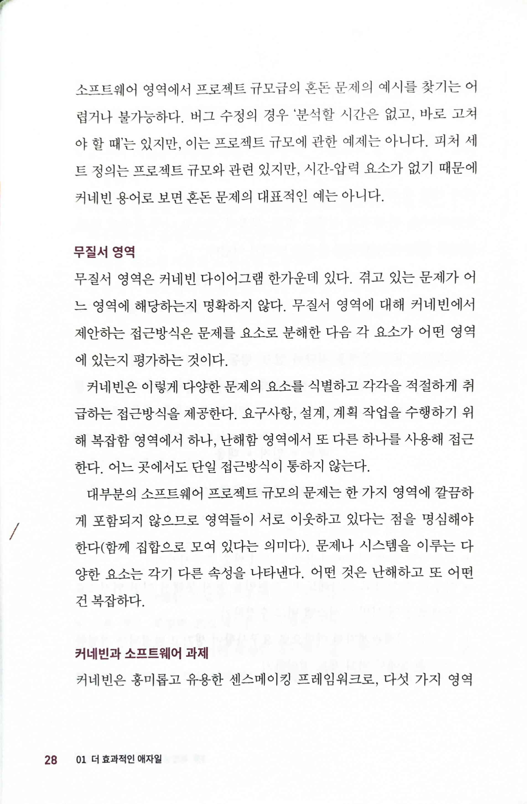

> 문제를 요소로 분해한 다음 각 요소가 어떤 영역에 있는지 평가하는 것이다.

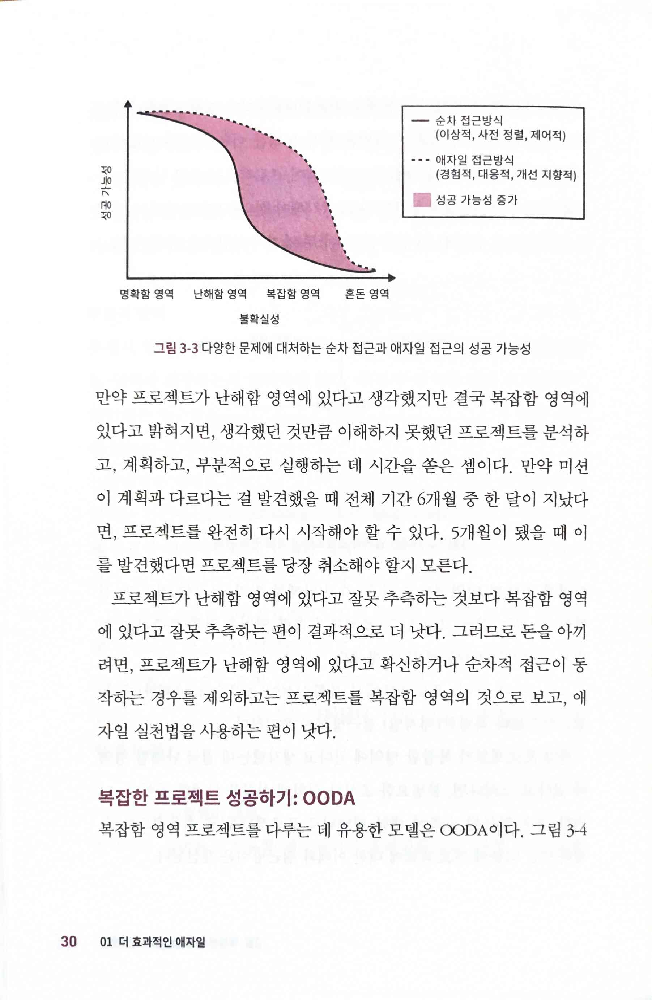

> 그림 3-3 다양한 문제에 대처하는 순차 접근과 애자일 접근의 성공 가능성

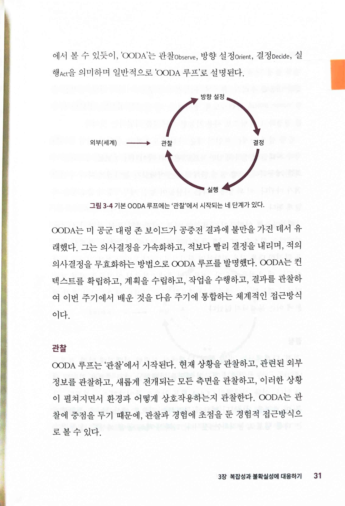 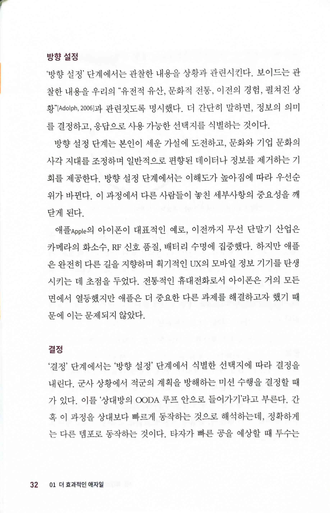  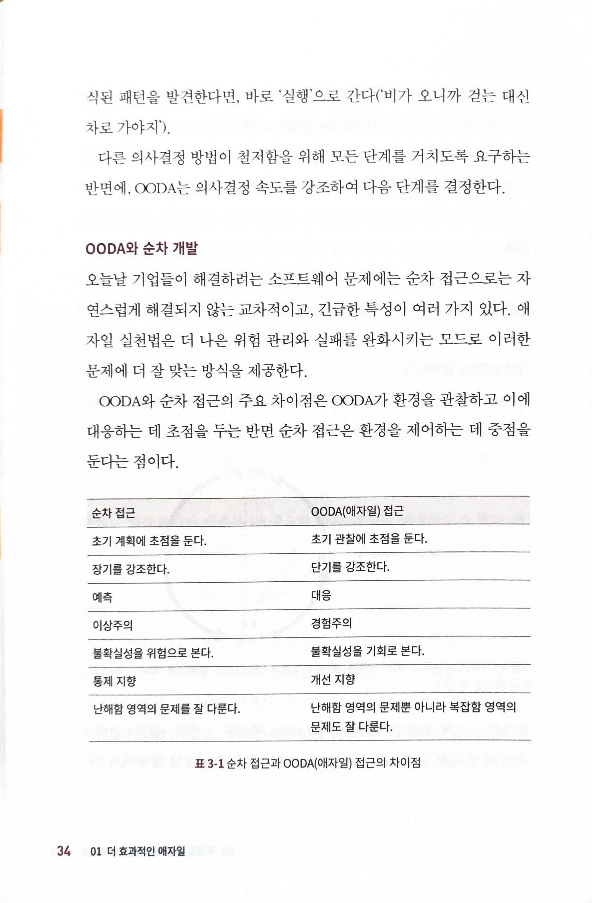

> 복잡함 영역 프로젝트를 다루는 데 유용한 모델은 OODA이다. 그림 3-4에서 볼 수 있듯이, 'OODA'는 관찰Observe, 방향 설정Orient, 결정Decide, 실행Act 을 의미하며 일반적으로 'OODA 루프'로 설명된다.
>
> OODA는 컨텍스트를 확립하고, 계획을 수립하고, 작업을 수행하고, 결과를 관찰하여 이번 주기에서 배운 것을 다음 주기에 통합하는 체계적인 접근방식이다.

## 02 더 효과적인 팀

### 4장 스크럼의 기쁨과 슬픔
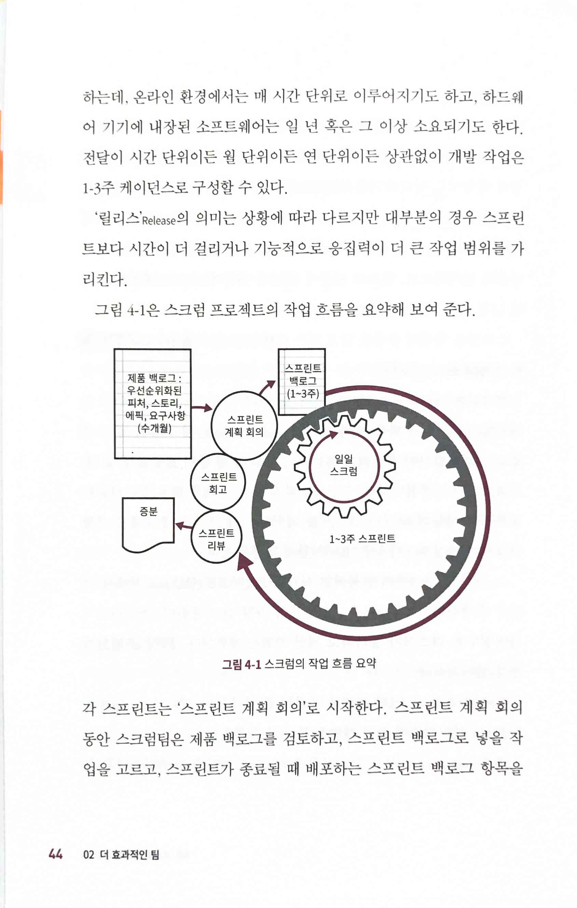

> 그림 4-1 스크럼의 작업 흐름 요약

> 스프린트가 진행되는 동안 스프린트 백로그는 닫힌 박스와 같다. 스프린트 내내 요구사항을 명료화하지만, PO가 스프린트를 취소하고 주기를 다시 시작하기로 동의하지 않는 한 아무도 스프린트 목표를 위태롭게 하는 요구사항을 더하거나 빼거나 수정할 수 없다... 스프린트 목표와 세부사항은 우선순위가 바뀔 때 상호 합의에 의해 변경되기도 한다.

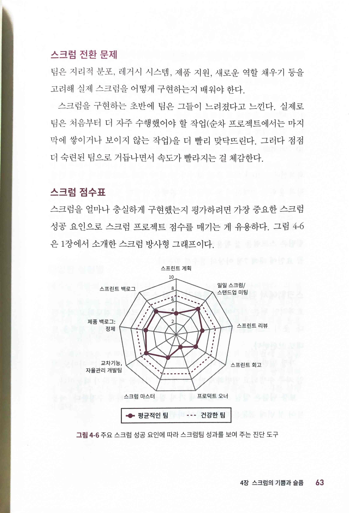

> 그림 4-6 주요 스크럼 성공 요인에 따라 스크럼팀 성과를 보여 주는 진단 도구

### 5장 애자일팀 구조

> 효과적인 애자일팀은 독립적으로 즉, 자체적으로 일하는 데 필요한 기능이나 원칙을 가지고 있다.

> 스프린트를 중단할 수 있는 작업의 종류에 관한 정책을 만들자. 향후스프린트를 위해 제품 백로그에 들어갈 수 있는 정기적인 업무와 스프린트에 개입해야 할 정도로 긴급하고 중요한 문제를 구분하자. "우선순위 1, 심각도 1, SLAService Level Agreement, 서비스 수준 협약서 관련 결함은 스프린트 목표보다 우선한다"와 같은 구체적인 정의가 가장 유용하다.

> 애자일 안티 패턴은 진정한 자율관리팀을 만들지 않고 스크럼을 채택하는 것이다. 만약 경영진이 세부적인 수준에서 팀을 지휘하고 통제하면서 말로만 자체적으로 관리한다고 한다면, 애자일 구현은 실패할 것이다. 기꺼이 의지가 있고, 준비되어 있고, 자율관리팀을 만들어 이를 지원하는 데 전념하려는 조직이 아니라면 애자일을 채택해서는 안 된다.

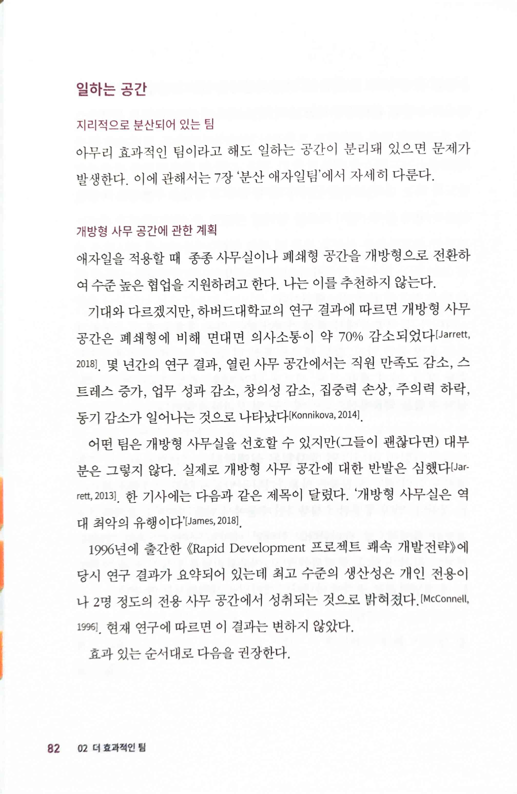 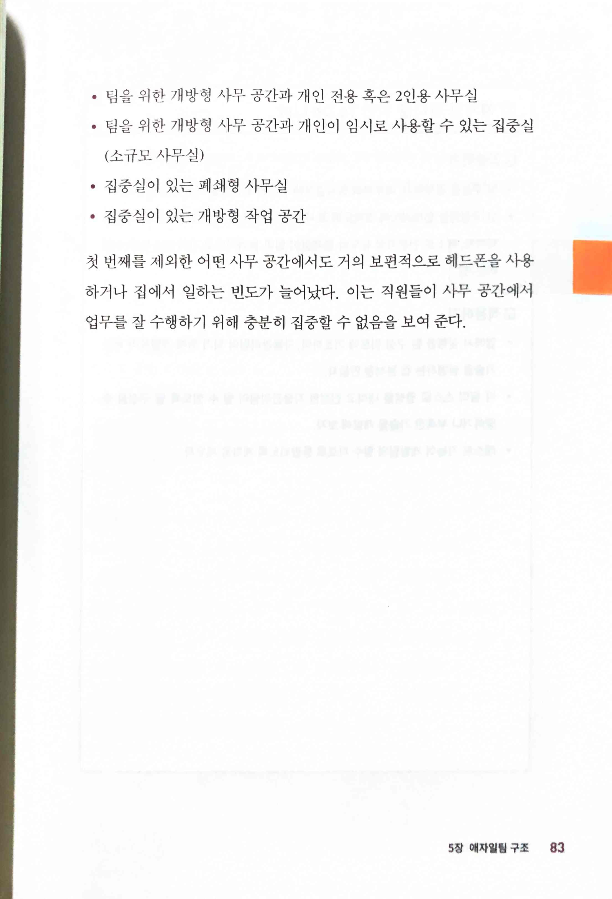

> 《Rapid Development 프로젝트 쾌속 개발전략》에 당시 연구 결과가 요약되어 있는데 최고 수준의 생산성은 개인 전용이나 2명 정도의 전용 사무 공간에서 성취되는 것으로 밝혀졌다. [McConnell, 1996]. 현재 연구에 따르면 이 결과는 변하지 않았다.
* 개방형 사무실의 단점

### 6장 애자일팀 문화

> 대부분의 생산성 연구에 따르면 생산성은 다른 어떤 요소보다 동기에 의존하는 정도가 더 높다[Boehm, 1981]. 소프트웨어 개발 업무의 경우, 여러 가지 동기 가운데 내적 동기가 가장 중요하다. 회사는 본질적으로 사람들의 두뇌를 빌려서 직원들에게 돈을 지불하고 회사가 원하는 것을 생각하도록 시킨다. 다른 사람에게 무엇에 대해 생각하기를 강요할 수 없기 때문에 외부의 동기는 작동하지 않는다. 그저 직원들이 원해서 회사의 문제를 생각하도록 상황을 설정할 뿐이다.

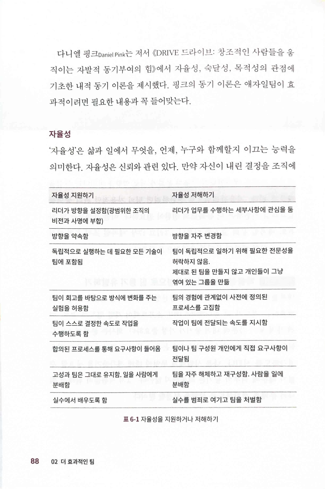

> '자율성'은 삶과 일에서 무엇을, 언제, 누구와 함께할지 이끄는 능력을 의미한다. 자율성은 신뢰와 관련 있다. 만약 자신이 내린 결정을 조직에서 신뢰하지 않는다고 믿는 사람이 있다면, 진정한 자율성을 가지고 있다고 생각하지 않을 것이다. 자신의 힘으로 의사결정을 할 수 있는 능력과 권한을 가진 교차기능 애자일팀을 발전시키려면 각자의 자율성도 지원해야 한다.

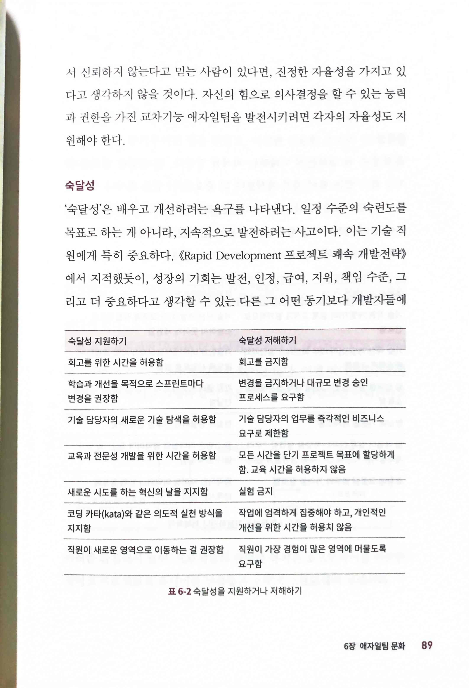

> '숙달성'은 배우고 개선하려는 욕구를 나타낸다. 일정 수준의 숙련도를목표로 하는 게 아니라, 지속적으로 발전하려는 사고이다. 이는 기술 직원에게 특히 중요하다. 《Rapid Development 프로젝트 쾌속 개발전략》에서 지적했듯이, 성장의 기회는 발전, 인정, 급여, 지위, 책임 수준, 그리고 더 중요하다고 생각할 수 있는 다른 그 어떤 동기보다 개발자들에게 더 강력한 동기부여가 되는 것으로 밝혀졌다.

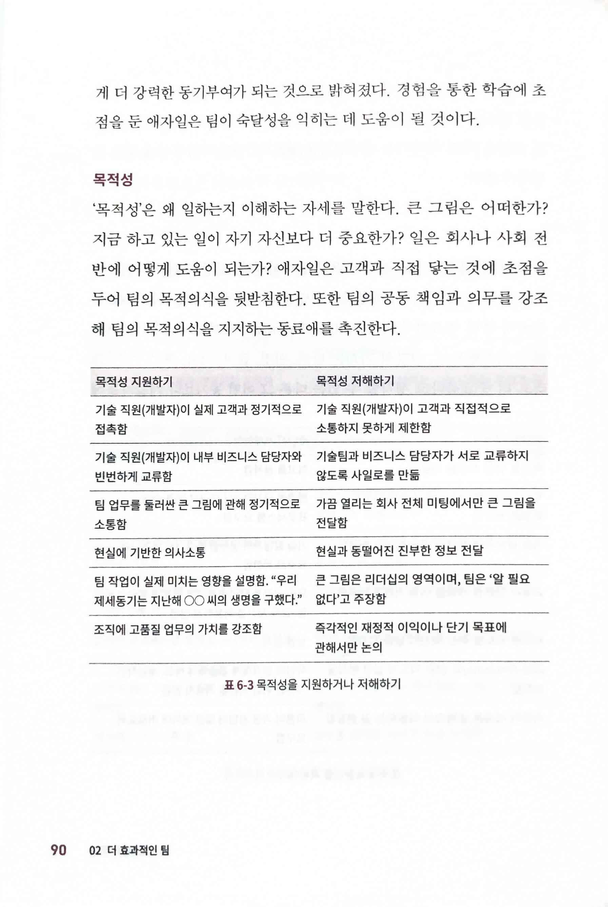

> '목적성'은 왜 일하는지 이해하는 자세를 말한다. 큰 그림은 어떠한가? 지금 하고 있는 일이 자기 자신보다 더 중요한가? 일은 회사나 사회 전반에 어떻게 도움이 되는가? 애자일은 고객과 직접 닿는 것에 초점을 두어 팀의 목적의식을 뒷받침한다. 또한 팀의 공동 책임과 의무를 강조해 팀의 목적의식을 지지하는 동료애를 촉진한다.

> 개발자를 사용자와 직접 접촉하게 하는 일은 매우 드물게 수행되는 믿기 힘들 정도로 간단한 아이디어이지만, 완료할 때마다 의미 있는 결과를 낳는다.

### 7장 분산 애자일팀
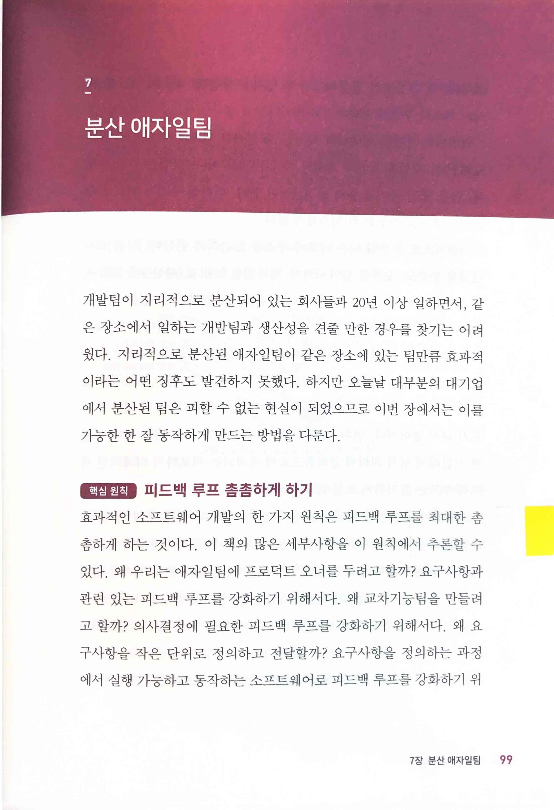

> 효과적인 소프트웨어 개발의 한 가지 원칙은 피드백 루프를 최대한 촘촘하게 하는 것이다.

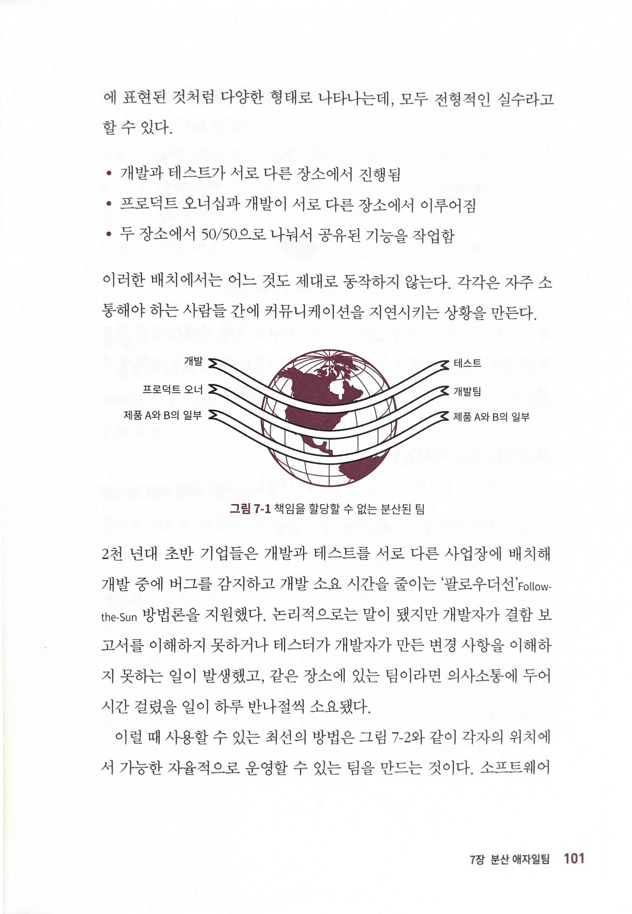

> 그림 7-1 책임을 할당할 수 없는 분산된 팀
>
> 이럴 때 사용할 수 있는 최선의 방법은 그림 7-2와 같이 각자의 위치에서 가능한 자율적으로 운영할 수 있는 팀을 만드는 것이다.
* 개발을 모르는 CEO들은 아마 이걸 보고 역시 같이 모이는게 중요하다고 하겠지만 사실 더 중요한 건 자율

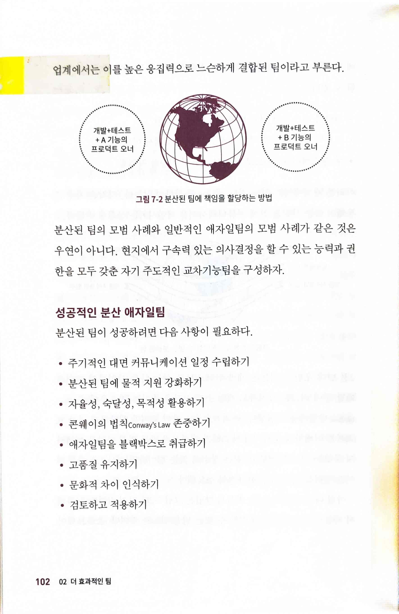

> 성공적인 분산 애자일팀
>
> • 주기적인 대면 커뮤니케이션 일정 수립하기
>
> • 분산된 팀에 물적 지원 강화하기
>
> • 자율성, 숙달성, 목적성 활용하기
>
> • 콘웨이의 법칙Conway's Law 존중하기
>
> • 애자일팀을 블랙박스로 취급하기
>
> • 고품질 유지하기
>
> • 문화적 차이 인식하기
>
> • 검토하고 적용하기

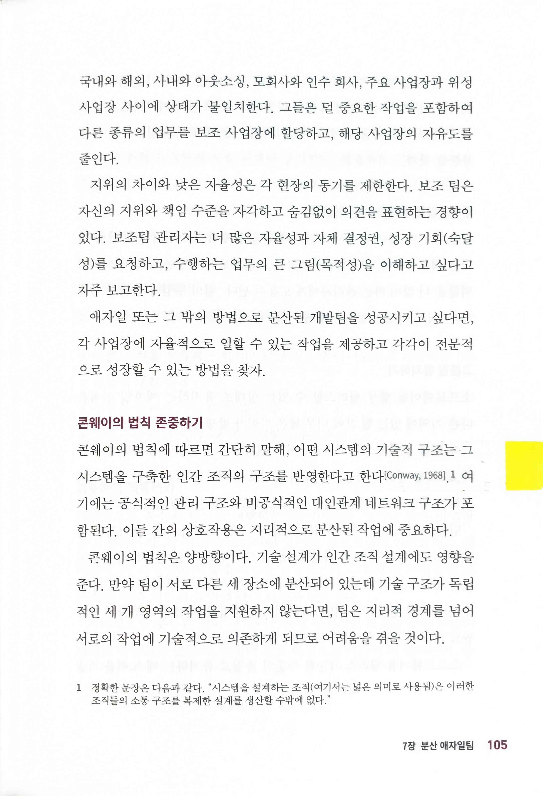

> 콘웨이의 법칙에 따르면 간단히 말해, 어떤 시스템의 기술적 구조는 그 시스템을 구축한 인간 조직의 구조를 반영한다고 한다[Conway, 1968]. 여기에는 공식적인 관리 구조와 비공식적인 대인관계 네트워크 구조가 포함된다. 이들 간의 상호작용은 지리적으로 분산된 작업에 중요하다.
>
> "시스템을 설계하는 조직(여기서는 넓은 의미로 사용됨)은 이러한 조직들의 소통 구조를 복제한 설계를 생산할 수밖에 없다."

### 8장 개인과 상호작용
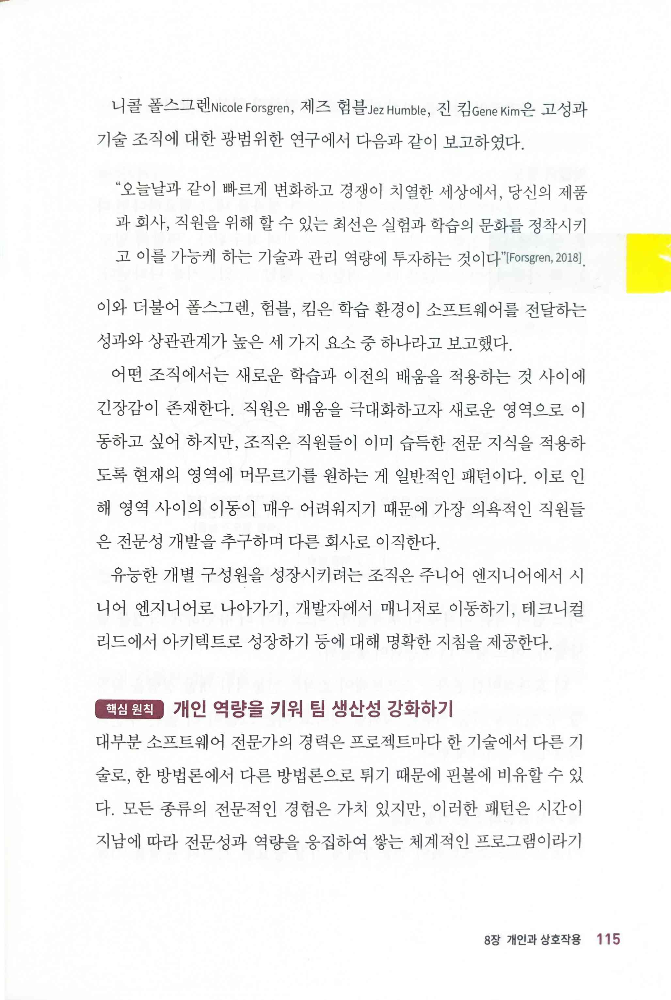

> “오늘날과 같이 빠르게 변화하고 경쟁이 치열한 세상에서, 당신의 제품과 회사, 직원을 위해 할 수 있는 최선은 실험과 학습의 문화를 정착시키고 이를 가능케 하는 기술과 관리 역량에 투자하는 것이다"[Forsgren, 2018]
>
> 학습 환경이 소프트웨어를 전달하는 성과와 상관관계가 높은 세 가지 요소 중 하나라고 보고했다.

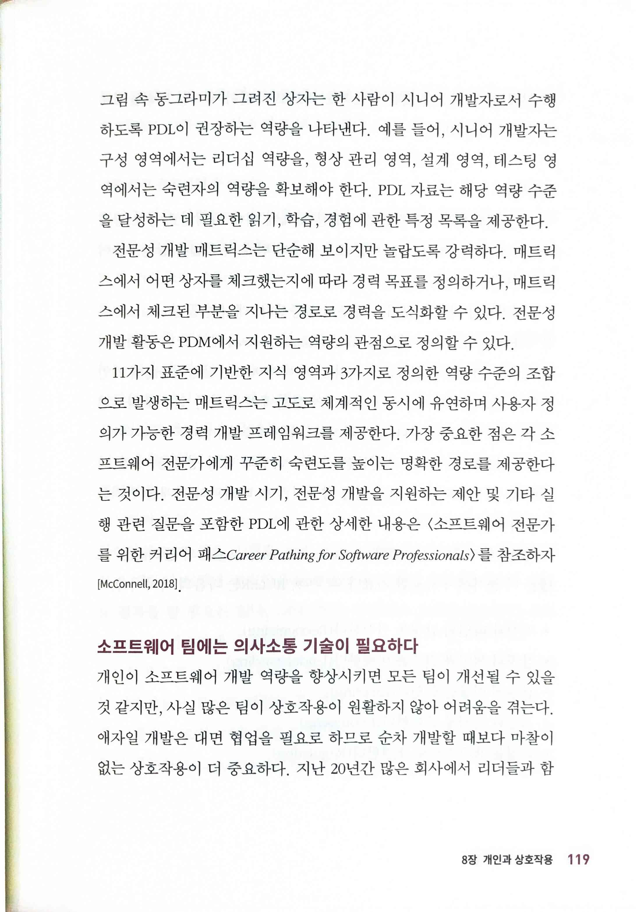

> 소프트웨어 팀에는 의사소통 기술이 필요하다
>
> 개인이 소프트웨어 개발 역량을 향상시키면 모든 팀이 개선될 수 있을것 같지만, 사실 많은 팀이 상호작용이 원활하지 않아 어려움을 겪는다. 애자일 개발은 대면 협업을 필요로 하므로 순차 개발할 때보다 마찰이없는 상호작용이 더 중요하다.

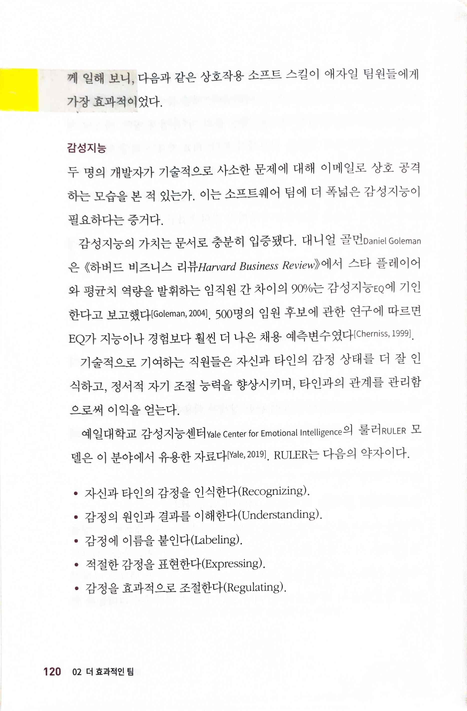

> 다음과 같은 상호작용 소프트 스킬이 애자일 팀원들에게 가장 효과적이었다.
>
> 감성지능: 기술적으로 기여하는 직원들은 자신과 타인의 감정 상태를 더 잘 인식하고, 정서적 자기 조절 능력을 향상시키며, 타인과의 관계를 관리함으로써 이익을 얻는다.

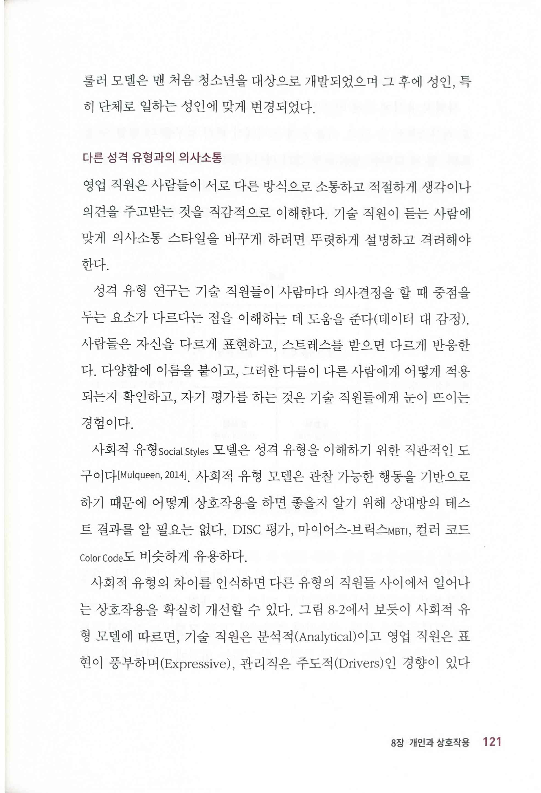

> 다른 성격 유형과의 의사소통: 영업 직원은 사람들이 서로 다른 방식으로 소통하고 적절하게 생각이나 의견을 주고받는 것을 직감적으로 이해한다. 기술 직원이 듣는 사람에 맞게 의사소통 스타일을 바꾸게 하려면 뚜렷하게 설명하고 격려해야한다.

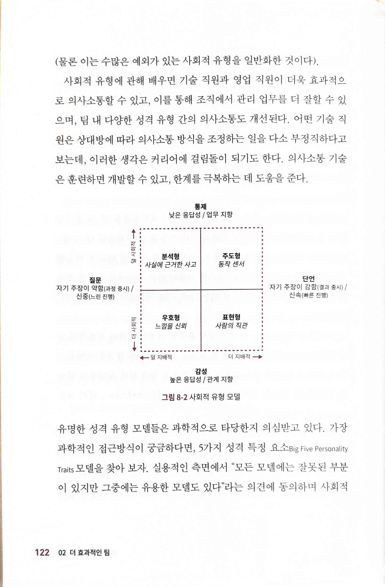

> 사회적 유형에 관해 배우면 기술 직원과 영업 직원이 더욱 효과적으로 의사소통할 수 있고, 이를 통해 조직에서 관리 업무를 더 잘할 수 있으며, 팀 내 다양한 성격 유형 간의 의사소통도 개선된다. 어떤 기술 직원은 상대방에 따라 의사소통 방식을 조정하는 일을 다소 부정직하다고 보는데, 이러한 생각은 커리어에 걸림돌이 되기도 한다. 의사소통 기술은 훈련하면 개발할 수 있고, 한계를 극복하는 데 도움을 준다.

> 결정적 순간의 대화
>
> 경영진과의 커뮤니케이션

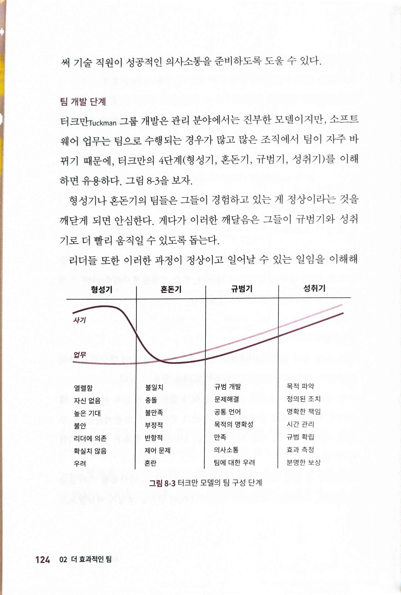

> 8-3 터크만 모델의 팀 구성 단계

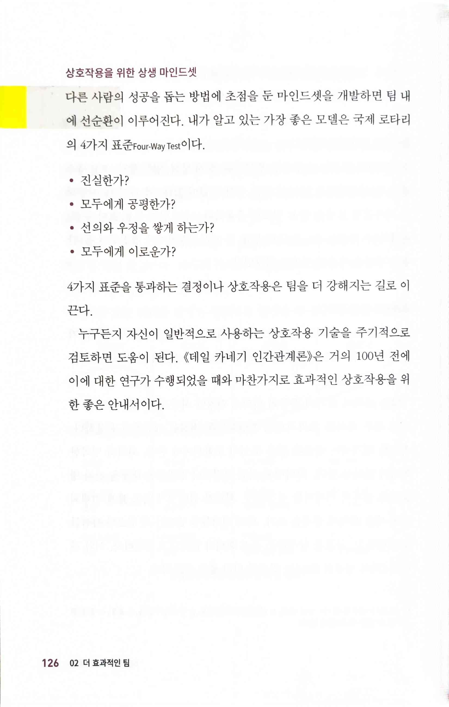

> 상호작용을 위한 상생 마인드셋: 다른 사람의 성공을 돕는 방법에 초점을 둔 마인드셋을 개발하면 팀 내에 선순환이 이루어진다.
>
> 국제 로타리의 4가지 표준Four-Way Test
>
> • 진실한가?
>
> • 모두에게 공평한가?
>
> • 선의와 우정을 쌓게 하는가?
>
> • 모두에게 이로운가?.

## 03 더 효과적인 일

### 9장 애자일 프로젝트

> 그림 9-1처럼 작은 프로젝트일수록 대규모 프로젝트보다 성공적으로 완료하는 것이 훨씬 쉽기 때문에 작은 프로젝트를 강조하는 일이 중요했다.

 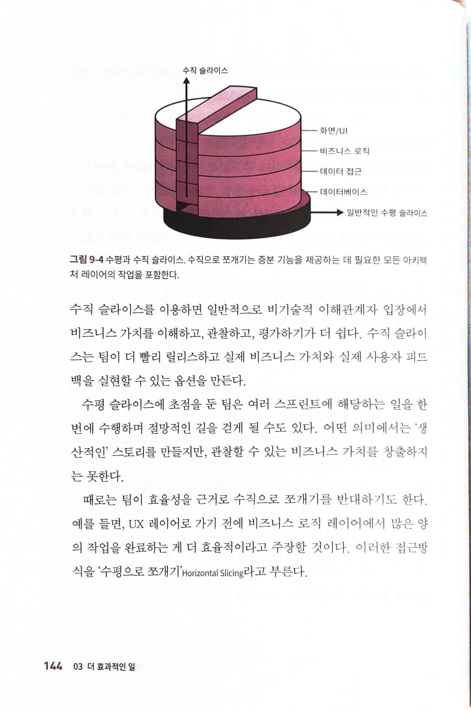 

> 핵심 원칙 수직 슬라이스로 배포하기
>
> 짧은 스프린트가 작동하려면, 팀이 동작하는 기능의 작은 조각을 자주 전달할 수 있는 능력을 개발해야 한다. 이를 뒷받침하는 설계 방식을 '수직으로 쪼개기'Vertical Slicing라고 부르는데, 점진적인 기능이나 가치를 제공하기 위해 아키텍처의 각 레이어를 변경하는 것을 의미한다.
>
> 수직 슬라이스는 '은행 명세서에 필드 추가하기' 혹은 '사용자의 거래확인 시간 1초 줄이기'와 같이 풀스택 기능을 나타낸다. 이는 그림 9-4처럼 일반적으로 기술 스택 전반에 걸친 작업이 필요하다.
>
> 수직 슬라이스를 이용하면 일반적으로 비기술적 이해관계자 입장에서 비즈니스 가치를 이해하고, 관찰하고, 평가하기가 더 쉽다.

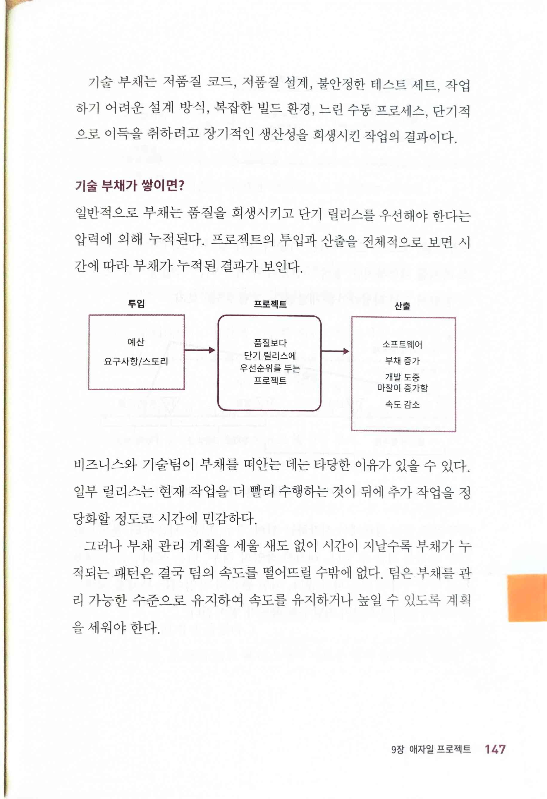

> 부채 관리 계획을 세울 새도 없이 시간이 지날수록 부채가 누적되는 패턴은 결국 팀의 속도를 떨어뜨릴 수밖에 없다. 팀은 부채를 관리 가능한 수준으로 유지하여 속도를 유지하거나 높일 수 있도록 계획을 세워야 한다.

### 10장 대규모 애자일 프로젝트
 

> 프레더릭 브룩스는 <맨먼스 미신》에서 대규모 프로젝트에 더 효과적인 애자일 실천법을 어떻게 도입할 수 있는지 한 가지 관점을 제시했다[Brooks, 1975]. 브룩스의 법칙Brooks' Law에 따르면 기한을 넘긴 프로젝트에 사람을 추가하면 마감이 더 늦춰진다. 브룩스는 작업을 완전히 나눌 수 있다면 브룩스의 법칙이 반드시 적용되는 것은 아니라고 주장했다.
>
> 그러나 브룩스가 지적한 것처럼, 대규모 프로젝트를 여러 개의 소규모 프로젝트로 쪼개려면 작업을 완전히 분할해야 한다. 작업을 완전히 나누는 건 어렵다. 작업이 대부분 나뉘어져 있는 경우에도 (여전히 다른 프로젝트 팀 간의 조정이 필요하다) 여러 개의 소규모 프로젝트는 대규모 프로젝트처럼 보이고 작동하기 시작한다. 그러면 여러분은 소규모 프로젝트로 나눠 달성하려고 했던 걸 이루지 못할 것이다.

> 소규모 애자일팀에 대한 관심과 마이크로서비스 아키텍처의 출현이 함께 나타난 건 우연이 아니다. 마이크로서비스 아키텍처의 목표는 애플리케이션을 결합도가 낮은 서비스로 구조화하는 것이다. 이와 유사하게, 대규모 애자일 프로젝트를 구성하는 목적은 인간 조직을 결합도가 낮은 작은 팀으로 구조화하는 것이다.
>
> 완전히 분할된 작업을 뒷받침하는 대규모 시스템을 설계하는 데 성공한 조직은 자신들이 대규모 프로젝트를 하고 있다고 인식하지 않는다. 그저 독립적으로 일하는 작은 팀들이 모여 있다고 느낀다. 팀들이 지닌 유일한 공통점은 모두 공통의 코드 베이스에 기여한다는 점이다.

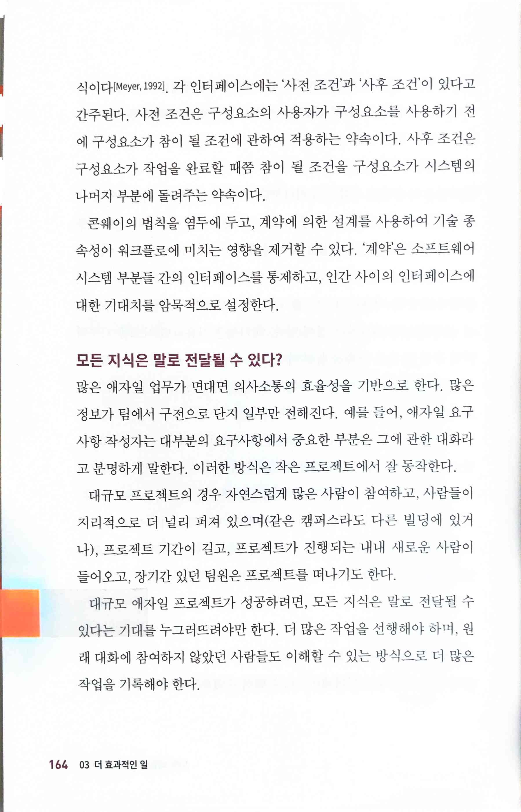

> 대규모 애자일 프로젝트가 성공하려면, 모든 지식은 말로 전달될 수 있다는 기대를 누그러뜨려야만 한다. 더 많은 작업을 선행해야 하며, 원래 대화에 참여하지 않았던 사람들도 이해할 수 있는 방식으로 더 많은 작업을 기록해야 한다.

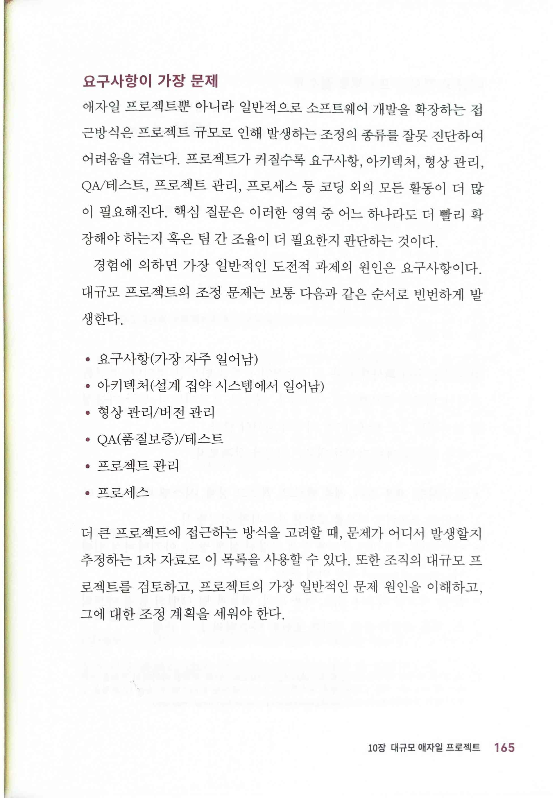

> 경험에 의하면 가장 일반적인 도전적 과제의 원인은 요구사항이다. 대규모 프로젝트의 조정 문제는 보통 다음과 같은 순서로 빈번하게 발생한다.
>
> • 요구사항(가장 자주 일어남)
>
> • 아키텍처(설계 집약 시스템에서 일어남)
>
> • 형상관리/버전 관리
>
> • QA(품질보증)/테스트
>
> • 프로젝트 관리
>
> • 프로세스

> 소프트웨어 조직과 함께 일하면 작은 회사들은 모두 자신이 매우 독특하다고 생각하지만 사실 그렇지 않다. 그들은 같은 방식으로 고칠 수 있는 동일한 문제를 가지고 있다. 대기업들은 모두 자신과 똑같은 다른 회사가 있을 것이라 생각하지만 그렇지 않다. 그들은 특유의 비즈니스 관행과 문화뿐만 아니라 고유한 기술을 성장시키고 발전시키며 개선해왔다.

### 11장 애자일 품질
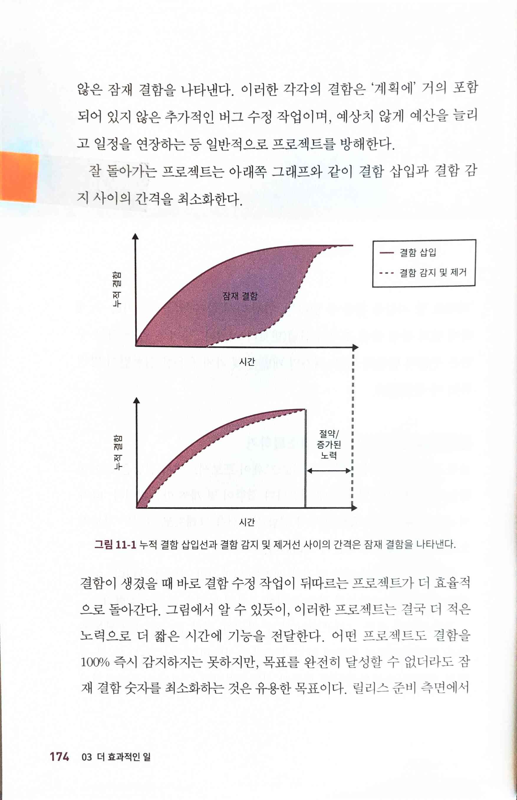

> 잘 돌아가는 프로젝트는 아래쪽 그래프와 같이 결함 삽입과 결함 감지 사이의 간격을 최소화한다... 결함이 생겼을 때 바로 결함 수정 작업이 뒤따르는 프로젝트가 더 효율적으로 돌아간다.

### 12장 애자일 테스팅

> 이상적인 테스트 모음을 개발할 능력이 없다는 게 자동화 테스트를 만들지 않는 이유가 될 수는 없다.

### 13장 애자일 요구사항 만들기

> 소프트웨어 개발 분야에서 일했던 25년 동안, 내가 접한 프로젝트가 어려움에 처하거나 실패한 원인을 조사한 모든 연구에서 문제의 주요 원인은 불완전하고, 부정확하고, 모순이 있는 등 형편없는 요구사항인 것으로 나타났다. 지난 10년간 우리가 애자일 프로젝트에서 발견한 가장 일반적인 문제의 원인은 프로덕트 오너가 제대로 역할을 하지 못하는데 있었다. 이는 여러분이 짐작하듯이 요구사항과 관련이 있다.

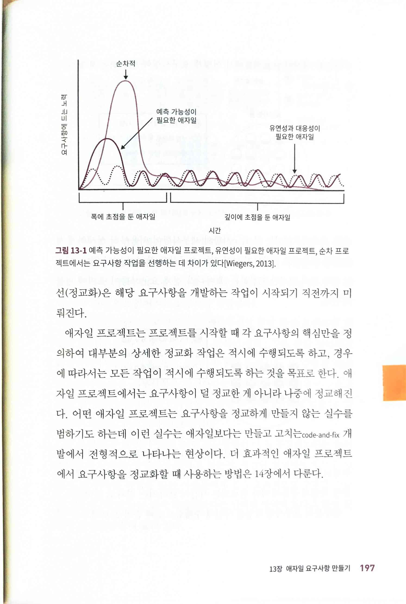

> 애자일 프로젝트는 프로젝트를 시작할 때 각 요구사항의 핵심만을 정의하여 대부분의 상세한 정교화 작업은 적시에 수행되도록 하고, 경우에 따라서는 모든 작업이 적시에 수행되도록 하는 것을 목표로 한다. 애자일 프로젝트에서는 요구사항이 덜 정교한 게 아니라 나중에 정교해진다. 어떤 애자일 프로젝트는 요구사항을 정교하게 만들지 않는 실수를 범하기도 하는데 이런 실수는 애자일보다는 만들고 고치는 code-and-fix 개발에서 전형적으로 나타나는 현상이다.

### 14장 애자일 요구사항 우선순위 매기기

> 애자일 개발의 주요 강조점 가운데 하나는 비즈니스 우선순위가 높은순에서 낮은 순으로 기능을 전달하는 일이다.

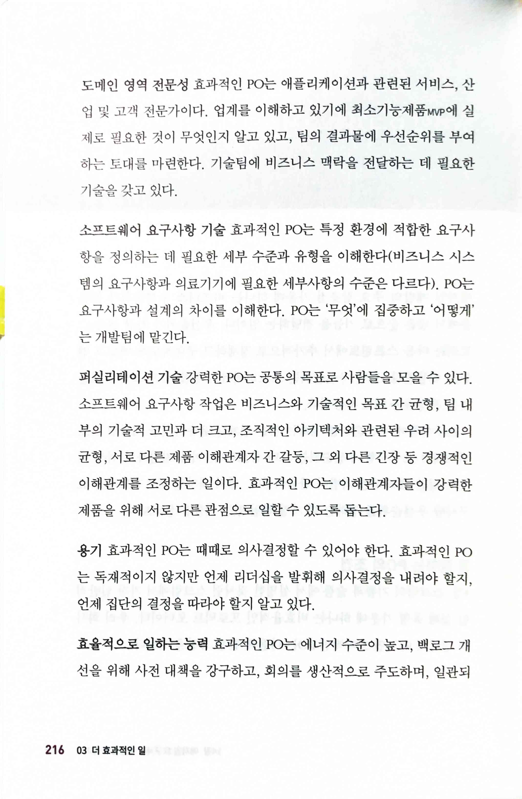

> 효과적인 PO는 다음과 같은 자질을 지닌다.
>
> 도메인 영역 전문성
>
> 소프트웨어 요구사항 기술
>
> 퍼실리테이션 기술
>
> 용기
>
> 효율적으로 일하는 능력

* 티셔츠 사이즈를 이용한 추정

> 효과적인 애자일 실천법은 업무를 시각화해야 한다고 강조한다. 단지 웹페이지에서 작업에 접근하는 것만이 아니라 업무 환경에도 가시적인 부분이 있어야 한다. 벽에 붙은 스토리 맵은 팀의 우선순위, 현재 과제, 향후 작업 흐름을 끊임없이 상기시킨다. 애자일팀은 이러한 종류의 디스플레이를 '정보 방열기 Information Radiator라고 부른다. 연구에 따르면 이러한시각적 디스플레이는 전달 성능을 향상시키는 데 필수다[Forsgren, 2018].

### 15장 애자일 전달

> 전달과 배포에 가까워질수록 컴퓨터가 작업을 수행하도록 자동화하는 것이 더 합리적이다.

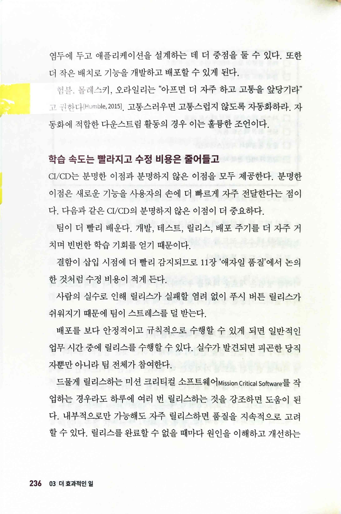

> 험블, 몰레스키, 오라일리는 "아프면 더 자주 하고 고통을 앞당기라"고 권한다[Humble, 2015], 고통스러우면 고통스럽지 않도록 자동화하라.

## 04 더 효과적인 조직

### 16장 애자일 리더십

> 리더십은 애자일 구현의 성패를 좌우

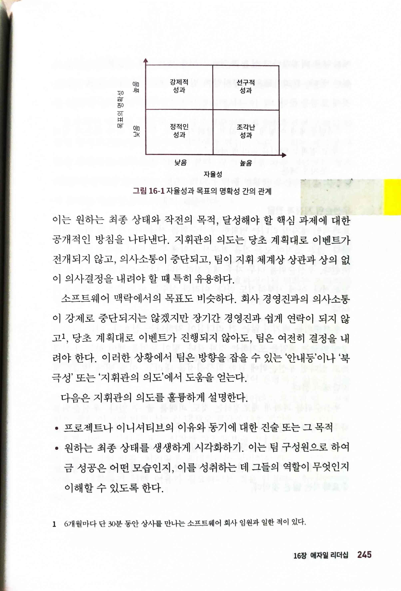

> 그림 16-1 자율성과 목표의 명확성 간의 관계

> 우선순위를 매기지 않는 건 리더십이 약하다는 신호다. 이는 의사결정에 따르는 책임을 포기하는 것과 같다. 팀이 무엇을 해야 하는지 신경쓰고 있다면 우선순위에 관한 의사결정을 내리고, 이를 팀에 명료하게 전달해야 한다.
>
> 우선순위를 과하게 재조정하는 것도 피해를 줄 수 있다.

 

> 효과적인 리더는 이끄는 사람들에게서 보고 싶은 행동을 구체화한다.
>
> • 성장 마인드셋 개발하기
>
> • 검토 및 적용하기
>
> • 실수 처벌하지 않기
>
> • 개인이 아닌 시스템 고치기
>
> • 고품질 약속하기
>
> • 비즈니스에 초점을 두고 개발하기
>
> • 피드백 루프 강화하기

### 17장 애자일 조직 문화
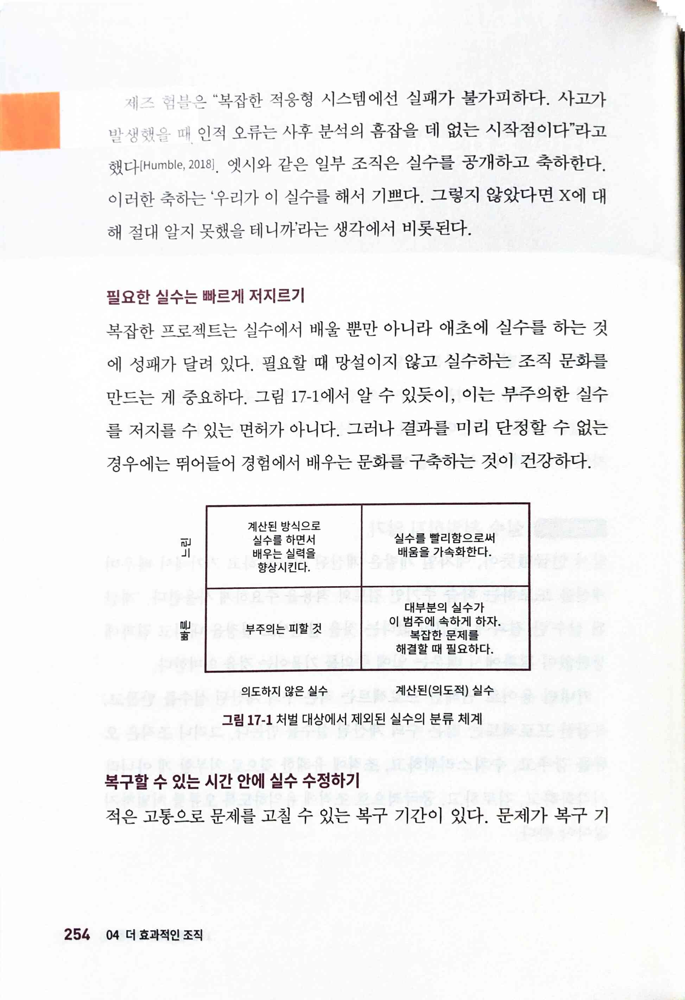

> 제주 험블은 "복잡한 적응형 시스템에선 실패가 불가피하다. 사고가 발생했을 때 인적 오류는 사후 분석의 흠잡을 데 없는 시작점이다"라고했다[Humble, 2018]. 엣시와 같은 일부 조직은 실수를 공개하고 축하한다. 이러한 축하는 '우리가 이 실수를 해서 기쁘다. 그렇지 않았다면 X에 대해 절대 알지 못했을 테니까'라는 생각에서 비롯된다.
>
> 그림 17-1 처벌 대상에서 제외된 실수의 분류 체계

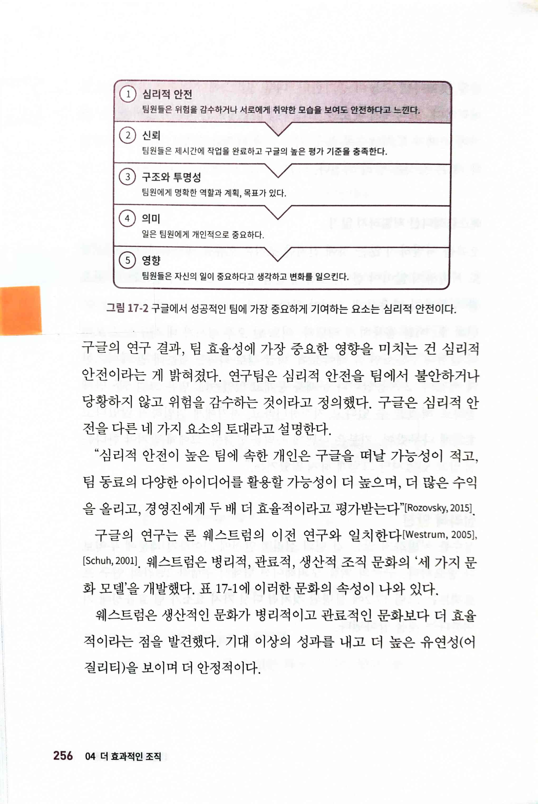

> 그림 17-2 구글에서 성공적인 팀에 가장 중요하게 기여하는 요소는 심리적 안전이다.

### 18장 애자일 측정

> 팀 간에 운영 방식, 목표, 점수를 비교하는 일은 무의미하다.

### 19장 애자일 프로세스 개선

> 효과적인 애자일의 프로세스 접근방식 "개인이 아니라 시스템을 고쳐라."
>
> 보다 효과적인 애자일 구현은 개선을 통해 더 빠르게 나아지는 일에 집중한다.

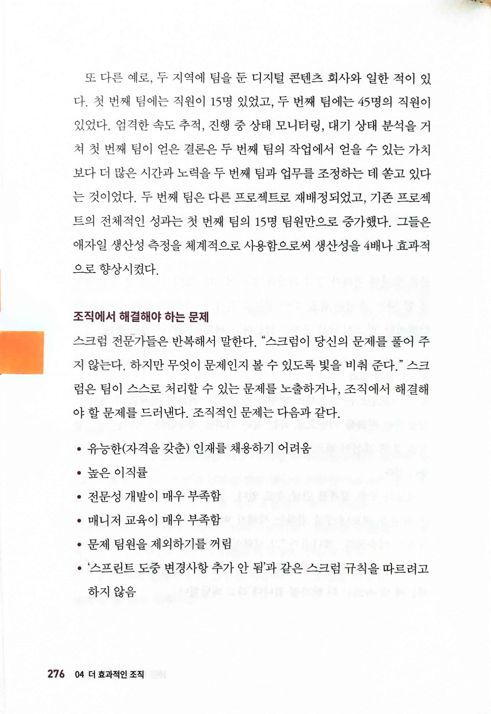

> 스크럼 전문가들은 반복해서 말한다. "스크럼이 당신의 문제를 풀어 주지 않는다. 하지만 무엇이 문제인지 볼 수 있도록 빛을 비춰 준다." 스크럼은 팀이 스스로 처리할 수 있는 문제를 노출하거나, 조직에서 해결해야 할 문제를 드러낸다.

### 20장 애자일 예측성

> 의학, 교육, 소프트웨어를 포함한 수많은 분야에서 개인의 생산성을 측정하려고 시도했다. 모든 경우에 개인의 생산성을 측정하는 유효한 방법은 없다.

> 많은 경우 추정의 역할은 정확한 예측을 하는 것이 아니라 일반적인 유형의 작업을 대략적인 시간 프레임 안에 완료할 수 있을지 이해를 얻는 것이다[McConnell, 2000]. 여러분이 예측하려는 대상은 계속해서 변화하기 때문에 이는 실제로 '예측'이 아니다. 이는 사실상 예측과 제어의 조합이다. 그 특성이 어떻든지 간에 이는 '예측성'을 필요로 하는 조직의 요구를 충족시키고, 소프트웨어 프로젝트를 수행하는 효과적인 방법이 될 수 있다. 애자일은 이러한 느슨한 예측성을 훌륭하게 지원한다.

> 고객과의 협업은 애자일 선언문에 기술된 원래 가치 가운데 하나이다. 만약 애자일팀이 고객이 원하는 걸 제공하는 것보다 비즈니스 자체를 재정의해야 한다고 주장한다면, 고객이 원하는 것에 새롭게 초점을 맞추자고 제안하자.

### 21장 규제 산업에서 더 효과적인 애자일

> 애자일 방법론이 규제 상품에 대한 작업을 더 혹은 덜 어렵게 만드는게 아니다. 애자일에서는 문서화에 더 주의를 기울여야 한다. 문서화의 효율성은 규제 산업에서 애자일을 채택할 때 가장 중요한 고려사항이다.

### 22장 애자일 포트폴리오 관리
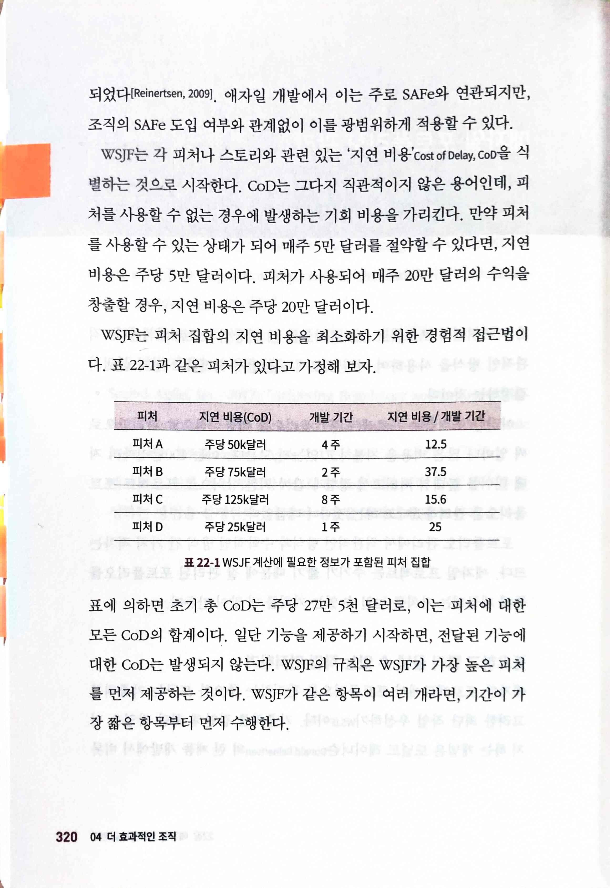 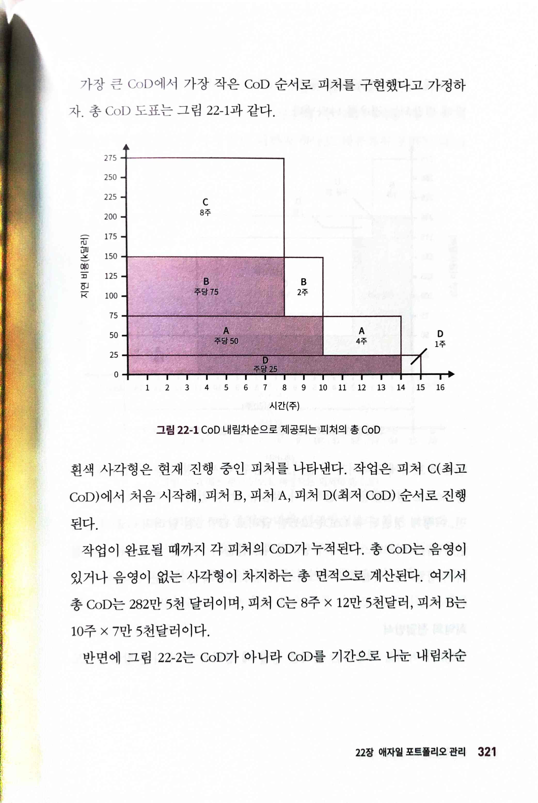 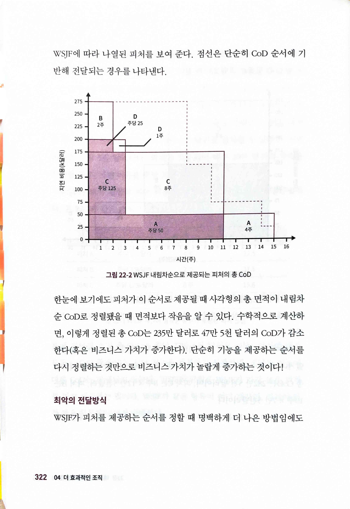

> WSJF는 각 피처나 스토리와 관련 있는 '지연 비용'Cost of Delay, CoD을 식별하는 것으로 시작한다. CoD는 그다지 직관적이지 않은 용어인데, 피처를 사용할 수 없는 경우에 발생하는 기회 비용을 가리킨다.
>
> WSJF의 규칙은 WSJF가 가장 높은 피처를 먼저 제공하는 것이다. WSJF가 같은 항목이 여러 개라면, 기간이 가장 짧은 항목부터 먼저 수행한다.

### 23장 애자일 도입

> 하버드대학교의 존 코터 John Kotter 교수는 3단계에 걸친 성공적인 변화를 위한 8단계 프로세스를 이야기한다 [Kotter, 2012].
>
> • 변화를 위한 환경 조성 (고정 해제)
>
> • 조직 참여 및 활성화 (변경)
>
> • 변화 구현 및 유지 (다시 고정)

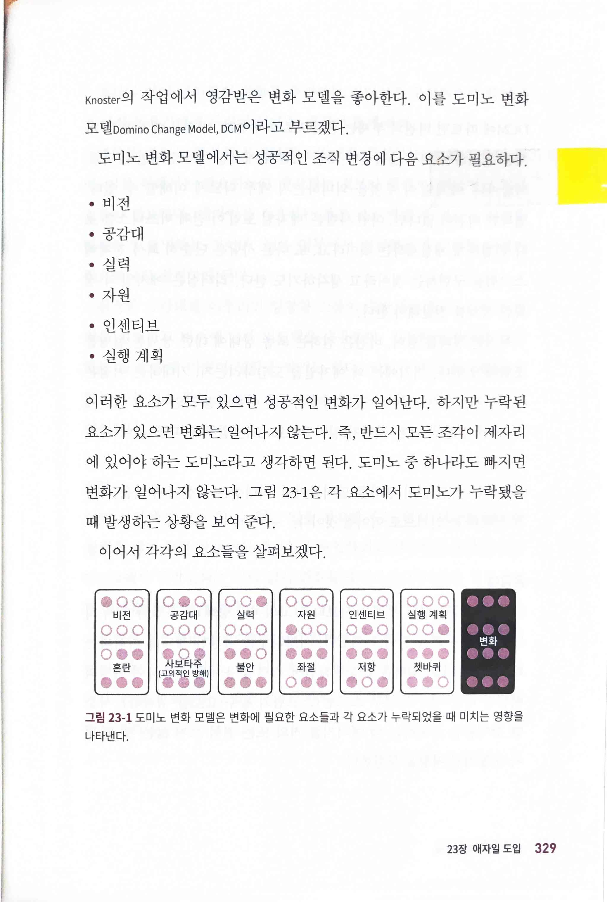

> 도미노 변화모델Domino Change Model, DCM
>
> 비전 공감대 실력 자원 인센티브 실행 계획

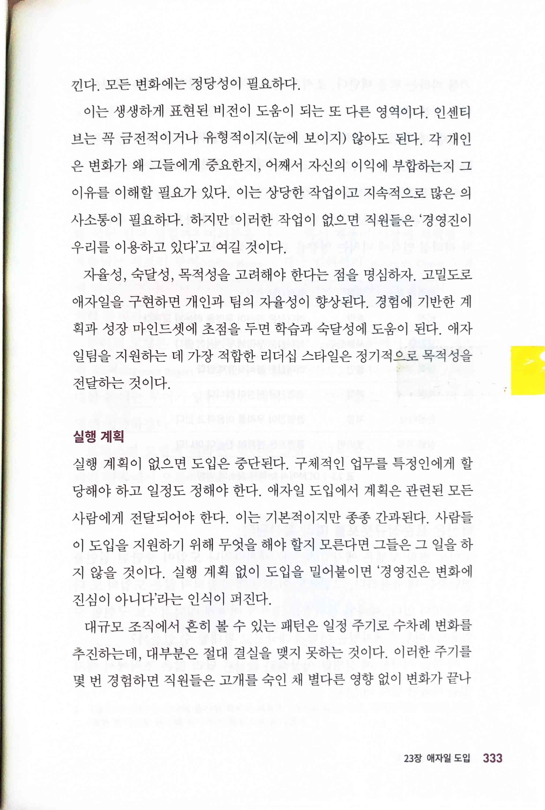

> 자율성, 숙달성, 목적성을 고려해야 한다는 점을 명심하자. 고밀도로 애자일을 구현하면 개인과 팀의 자율성이 향상된다. 경험에 기반한 계획과 성장 마인드셋에 초점을 두면 학습과 숙달성에 도움이 된다. 애자일팀을 지원하는 데 가장 적합한 리더십 스타일은 정기적으로 목적성을 전달하는 것이다.

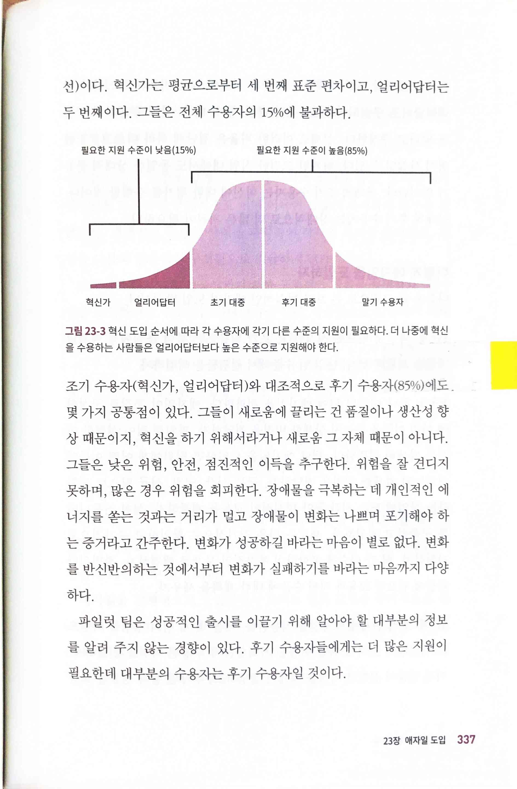

> 그림 23-3 혁신 도입 순서에 따라 각 수용자에 각기 다른 수준의 지원이 필요하다. 더 나중에 혁신을 수용하는 사람들은 얼리어답터보다 높은 수준으로 지원해야 한다.

## 05 마무리

> 현재의 애자일은 애자일의 목표가 단순히 애자일해지는 것이 아님을 알고 있다. 목표는 애자일과 기타 실천법을 사용하여 비즈니스 목표와 전략을 지원하는 것이다.

> 결국 반복적인 변화가 팀을 탈바꿈시킨다. 그들은 빠르게 전달하고 빠르게 방향을 바꾼다. 이렇게 조직이 향상된 개발 역량을 사용하여 새롭고 효과적으로 계획하고 실행할 수 있는 전략적 기회가 열린다.