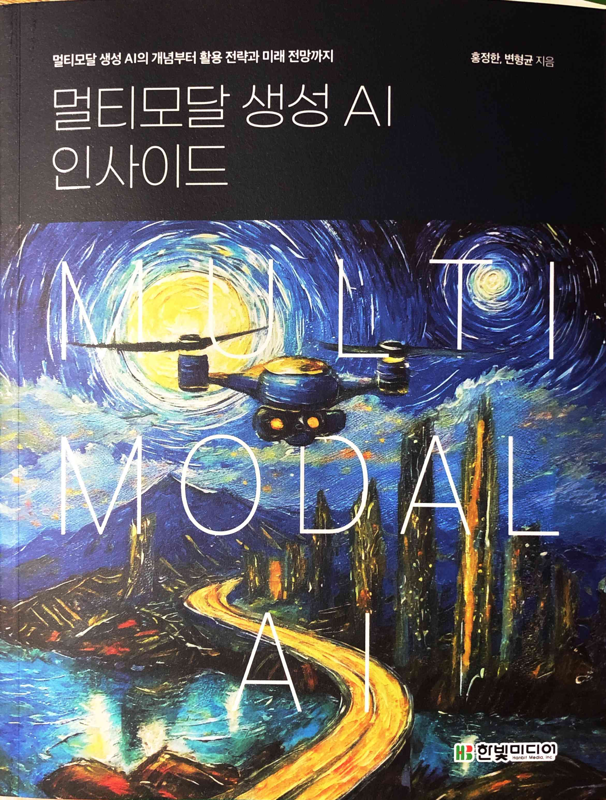

# 멀티모달 생성 AI 인사이드

Tags: artificial-intelligence
Date: March 11, 2024
Score: ★★★☆☆

- ★★★☆☆ March 11, 2024
- 소제목에서도 드러나지만, 기술 서적은 아니고 AI의 전반적인 개념부터 활용 분야나 미래에 대한 전망까지 이야기하는 책이다. AI를 도입해 내부에 적용하거나 새로운 분야를 개척하는 등 어떤 집단을 담당하는 리더들을 대상으로 썼다는 생각이 들었다. 그래서 그런지 책 앞의 추천사들도 어디 원장이나 학과장, 책임자뿐 아니라 정책을 만드는 듯한 서울시 공무원분도 있었다.
    - 목차를 보면 개념, 기술 변천 과정, 활용 분야, 관련 기업, 주요 이슈, 전략 및 정책, 제언의 순서로 이어진다. 책의 장점은 정말 다양한 주제를 다룬다는 점이다. 개념, 활용 분야 같은 부분도 괜찮았지만, 기술적인 부분을 다루는 책은 정말 많지만, 이쪽을 다루는 서적은 많이 없기 때문에 전략 및 정책이나 제언 부분이 돋보였다. AI가 사회에 미치는 영향이 정말 클 거라는 건 모두 동의하는 바지만, 아직 미래가 어떻게 전개될지 정확히 예측할 수 없기 때문에 이런 저런 걱정이나 우려도 많은데 그런 점에서 이렇게 기술 외적인 부분을 논의하는 자료가 기술만큼이나 중요하다고 생각한다.
    - 아쉬운 점까지는 아니지만 약간 어울리지 않는다고 생각한 점은 두 가지. 첫째, 제목이나 각 장에서 다루는 ‘멀티모달’. 책 제목부터 ‘멀티모달 생성 AI 인사이드’로 멀티모달을 내세우고 있으나 다루는 내용을 보면 멀티모달보다는 일반적인 AI의 관점에서 보는 분량이 더 많다. 둘째, 두 번째 장에서 기술 변천 과정을 설명하면서 코드도 함께 실었으나 이 책의 (내가 추정하는) 잠재 독자층을 볼 때 코드에 관심이나 필요성은 낮다고 생각한다.
    - 책의 분량이나 내용으로 고려할 때 ‘저자의 말’에서 썼듯이 독자들에게 다양한 관점을 제시하고 가질 수 있게 하는 목적을 충분히 달성할 수 있다고 생각한다. 추천!
    
- 한빛미디어 <나는 리뷰어다> 활동을 위해서 책을 제공받아 작성된 서평입니다
