# 네이키드 애자일

* 무엇보다 정답을 (제시할 수 없는 주제라는 걸 알고) 제시하지 않는 책이라는 점이 맘에 든다. 아쉬운 점도 있지만, 전반적으로 기업의 관리자/책임자들이 읽기에 매우 좋은 책이다.
* 아쉬웠던 점
  * 스포티파이의 matrix 구조가 스포티파이 내부에서 어떤 결말로 이어졌는지 생략(혹은 조사 불충분): 팀 토폴로지를 읽을 때 저자에게 질문을 하기도 했지만, 대부분의 책에서 스포티파이의 matrix 구조가 굉장히 혁신적이고 성괄르 보였다고만 생각하지 그 뒤에 스포티파이에서 matrix 구조를 버렸다는 점은 다들 빠뜨린다. 이 부분이 왜 그랬는지에 대해 생략되었다.
  * (불필요한) MBO와 OKR의 구분: 이 책에서는 현실에서 문제를 일으키고 있는 MBO와 (일부 회사에서) 성과를 내고 있는 OKR을 비교하기 위해 구분한 점은 알지만, 사실 OKR 자체가 MBO에서 유래한 것이고 둘이 서로 다르지 않다. 이 점은 이 책의 저자도 인용한 high output management를 통해서도 알 수 있었을텐데 이걸 놓친 점이 아쉽다.

## 1장 전환시대의 도래: '애자일'에 열광하는 이유

### 디지털 전환: 새 술을 담는 새 부대가 바로 '애자일' 28
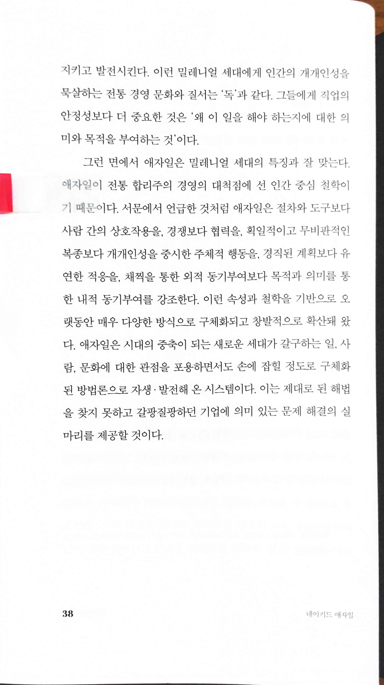

> 애자일이 전통 합리주의 경영의 대척점에 선 인간 중심 철학

### 소비자 주도의 전환 소비자가 변했다 32

### 문화의 전환: 밀레니얼 세대와 일하기 34

## 2장 애자일은 문화다

### 패러다임 전환: 경영혁명 메타포로서의 '애자일' 42
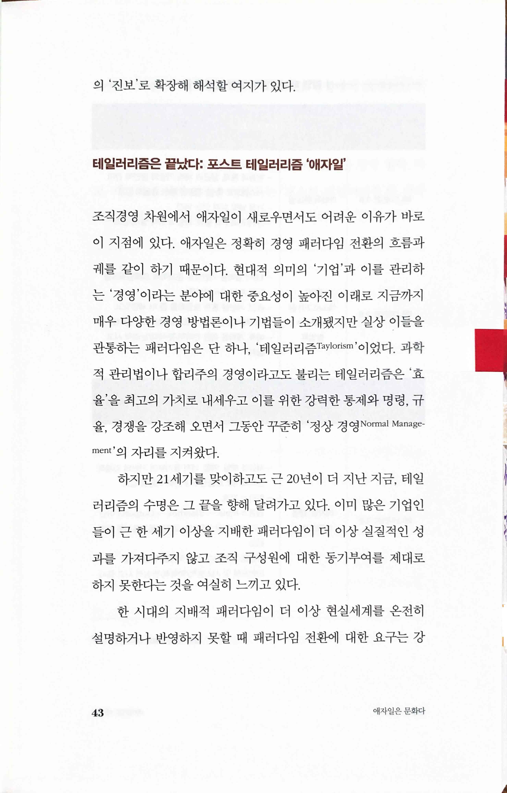

> 현대적 의미의 '기업'과 이를 관리하는 '경영'이라는 분야에 대한 중요성이 높아진 이래로 지금까지 매우 다양한 경영 방법론이나 기법들이 소개됐지만 실상 이들을 관통하는 패러다임은 단 하나, '테일러리즘 Taylorism'이었다. 과학적 관리법이나 합리주의 경영이라고도 불리는 테일러리즘은 '효율'을 최고의 가치로 내세우고 이를 위한 강력한 통제와 명령, 규율, 경쟁을 강조해 오면서 그동안 꾸준히 '정상 경영 Normal Management'의 자리를 지켜왔다.

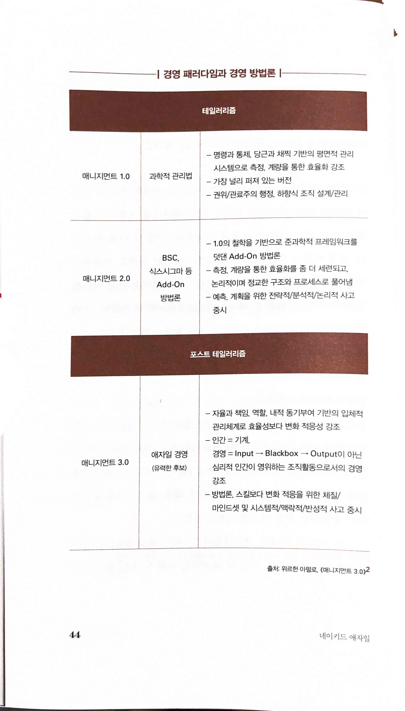

> 경영 패러다임과 경영 방법론, 출처: 위르헌 아펄로 매니지먼트 3.0

### 협의의 애자일 방법론 vs. 광의의 애자일 경영 46
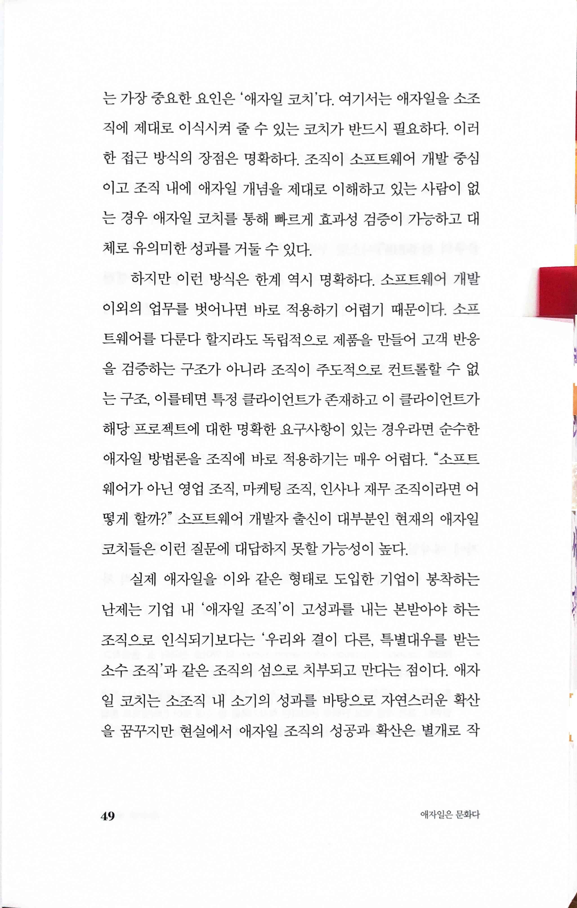

> 조직이 주도적으로 컨트롤할 수 없는 구조, 이를테면 특정 클라이언트가 존재하고 이 클라이언트가 해당 프로젝트에 대한 명확한 요구사항이 있는 경우라면 순수한 애자일 방법론을 조직에 바로 적용하기는 매우 어렵다.

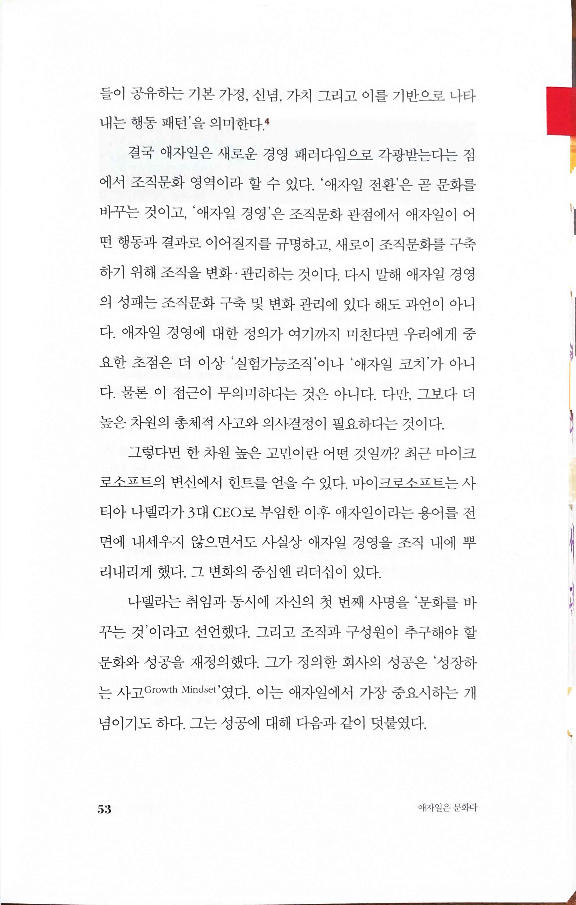

> 조직문화는 '외부 환경에 대한 적응과 조직의 내적 통합 과정에서 발생하는 문제들을 풀기 위해 조직 구성원들이 공유하는 기본 가정, 신념, 가치 그리고 이를 기반으로 나타내는 행동 패턴'을 의미한다.
>
> 결국 애자일은 새로운 경영 패러다임으로 각광받는다는 점에서 조직문화 영역이라 할 수 있다. '애자일 전환'은 곧 문화를 바꾸는 것이고, '애자일 경영'은 조직문화 관점에서 애자일이 어떤 행동과 결과로 이어질지를 규명하고, 새로이 조직문화를 구축하기 위해 조직을 변화·관리하는 것이다. 다시 말해 애자일 경영의 성패는 조직문화 구축 및 변화 관리에 있다 해도 과언이 아니다.

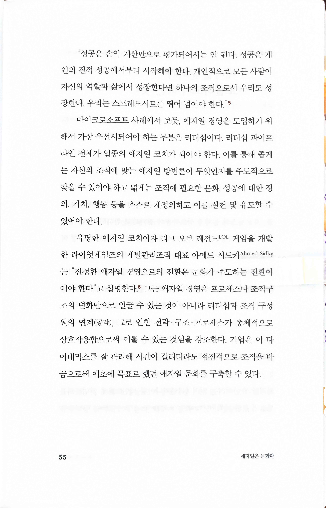

> 애자일 경영을 도입하기 위해서 가장 우선시되어야 하는 부분은 리더십이다.  리더십 파이프라인 전체가 일종의 애자일 코치가 되어야 한다. 이를 통해 좁게는 자신의 조직에 맞는 애자일 방법론이 무엇인지를 주도적으로 찾을 수 있어야 하고 넓게는 조직에 필요한 문화, 성공에 대한 정의 가치, 행동 등을 스스로 재정의하고 이를 실천 및 유도할 수 있어야 한다.
>
> “진정한 애자일 경영으로의 전환은 문화가 주도하는 전환이어야 한다". 그는 애자일 경영은 프로세스나 조직구조의 변화만으로 일굴 수 있는 것이 아니라 리더십과 조직 구성원의 연계(공감), 그로 인한 전략 · 구조 · 프로세스가 총체적으로 상호작용함으로써 이룰 수 있는 것. 기업은 이 다이내믹스를 잘 관리해 시간이 걸리더라도 점진적으로 조직을 바꿈으로써 애초에 목표로 했던 애자일 문화를 구축할 수 있다.

### 애자일 문화가 도달하고자 하는 것 56
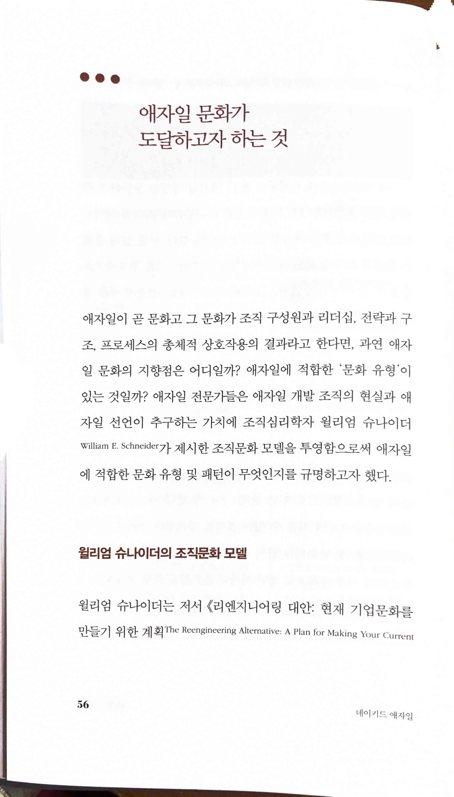 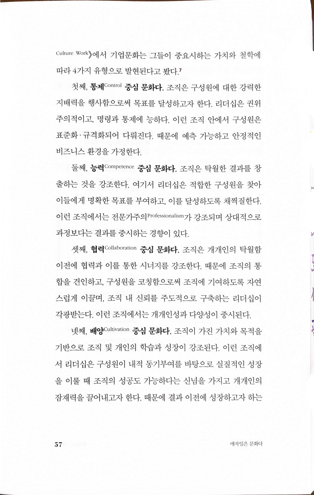

> 윌리엄 슈나이더는 저서 <리엔지니어링 대안 현재 기업문화를 만들기 위한 계획 The Reengineering Alternative: A Plan for Making Your Current Culture Work>에서 기업문화는 그들이 중요시하는 가치와 철학에따라 4가지 유형으로 발현된다고 봤다.
>
> 첫째, 통제 Control 중심 문화. 리더십은 권위주의적 명령 통제. 구성원은 표준화 · 규격화. 예측 가능하고 안정적인 비즈니스 환경 가정
>
> 둘째, 능력 Competence 중심 문화. 리더십은 적합한 구성원을 찾아 명확한 목표 부여, 달성 독려. 전문가주의 Professionalism 강조 과정보다 결과 중시
>
> 셋째, 협력 Collaboration 중심 문화. 협력과 시너지 강조. 조직의 통합 견인, 구성원 코칭, 조직 내 신뢰 구축 리더십이. 개개인성과 다양성 중시
>
> 넷째, 배양 Cultivation 중심 문화. 조직 및 개인의 학습과 성장 강조. 리더십은 구성원이 내적 동기부여를 바탕으로 성장할 때 조직의 성공도 가능하다는 신념을 가지고 개개인의잠재력 유도. 성장하고자 하는 진정성있는 태도와 과정 강조

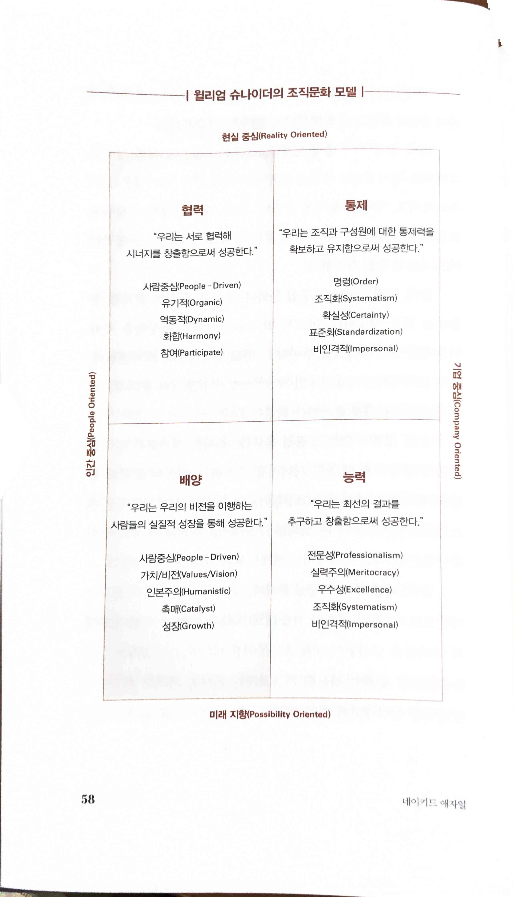 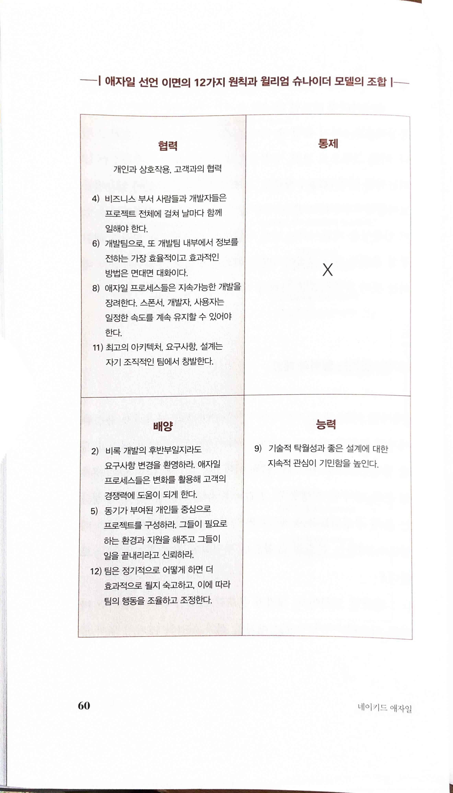

### 〈It's Agile Time> 조직이 문화 혁신에 실패하는 이유 62
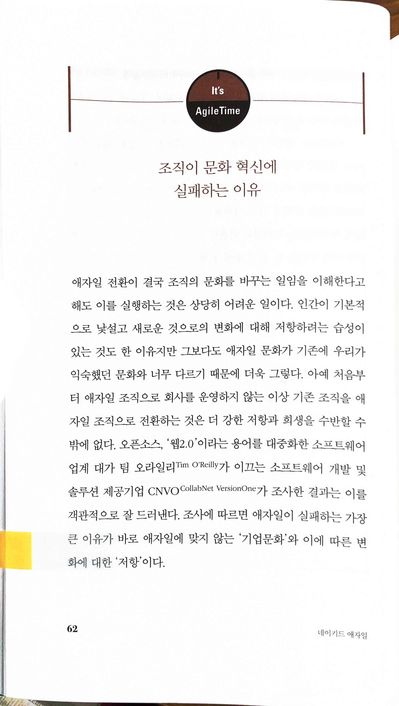

> 애자일이 실패하는 가장 큰 이유가 바로 애자일에 맞지 않는 '기업문화'와 이에 따른 변화에 대한 '저항'

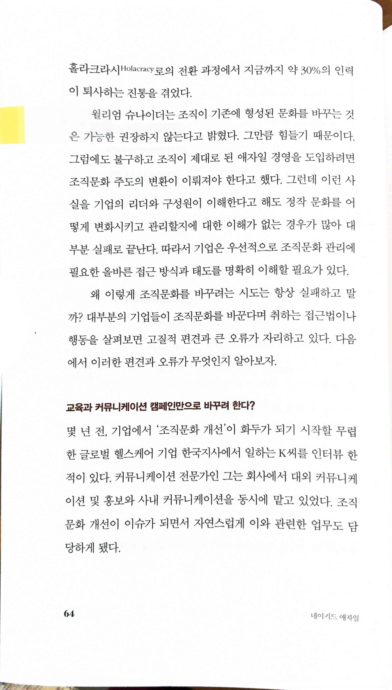

> 윌리엄 슈나이더는 조직이 기존에 형성된 문화를 바꾸는 것은 가능한 권장하지 않는다고 밝혔다. 그만큼 힘들기 때문이다. 그럼에도 불구하고 조직이 제대로 된 애자일 경영을 도입하려면 조직문화 주도의 변환이 이뤄져야 한다고 했다. 그런데 이런 사실을 기업의 리더와 구성원이 이해한다고 해도 정작 문화를 어떻게 변화시키고 관리할지에 대한 이해가 없는 경우가 많아 대부분 실패로 끝난다. 따라서 기업은 우선적으로 조직문화 관리에 필요한 올바른 접근 방식과 태도를 명확히 이해할 필요가 있다.

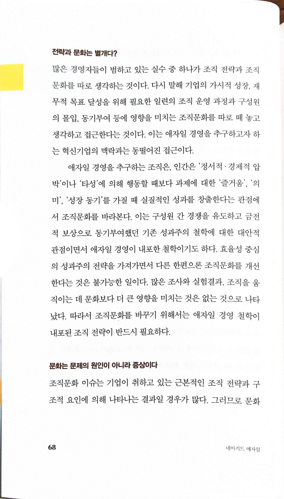

> 많은 경영자들이 범하고 있는 실수 중 하나가 조직 전략과 조직문화를 따로 생각하는 것이다. 다시 말해 기업의 가시적 성장, 재무적 목표 달성을 위해 필요한 일련의 조직 운영 과정과 구성원의 몰입, 동기부여 등에 영향을 미치는 조직문화를 따로 떼 놓고생각하고 접근한다는 것이다. 이는 애자일 경영을 추구하고자 하는 혁신기업의 맥락과는 동떨어진 접근이다.

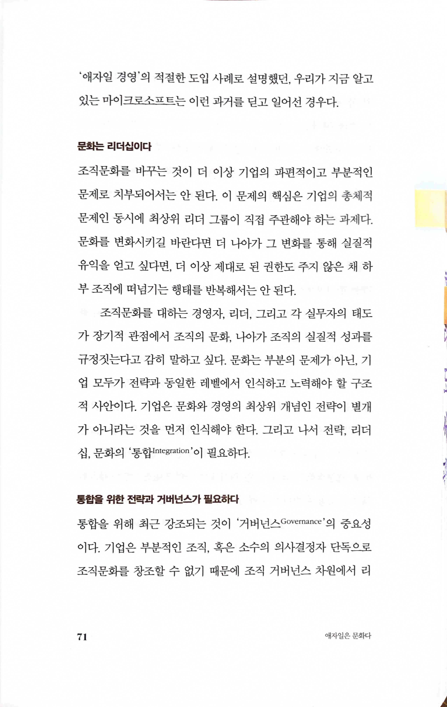

> 조직문화를 바꾸는 것이 더 이상 기업의 파편적이고 부분적인 문제로 치부되어서는 안 된다. 이 문제의 핵심은 기업의 총체적 문제인 동시에 최상위 리더 그룹이 직접 주관해야 하는 과제다. 문화를 변화시키길 바란다면 더 나아가 그 변화를 통해 실질적 유익을 얻고 싶다면, 더 이상 제대로 된 권한도 주지 않은 채 하부 조직에 떠넘기는 행태를 반복해서는 안 된다.

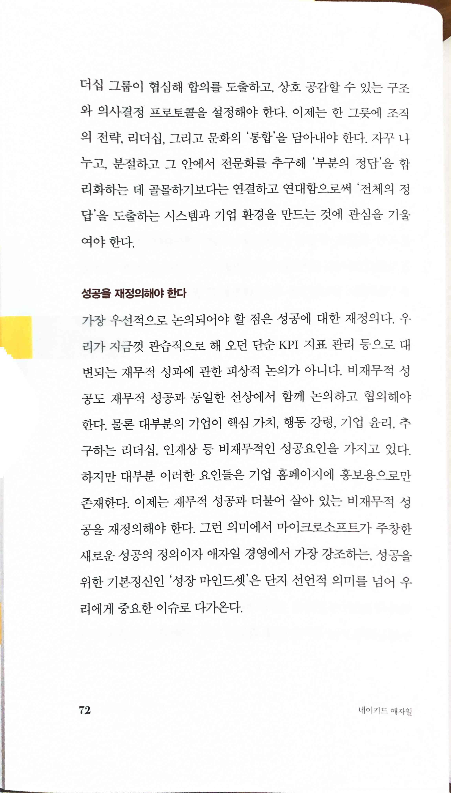

> 가장 우선적으로 논의되어야 할 점은 성공에 대한 재정의다.

## 3장 테일러리즘과의 비교를 통해 알아본 애자일 철학

### 인간은 믿을 수 있는 존재인가? 인간을 바라보는 관점 79
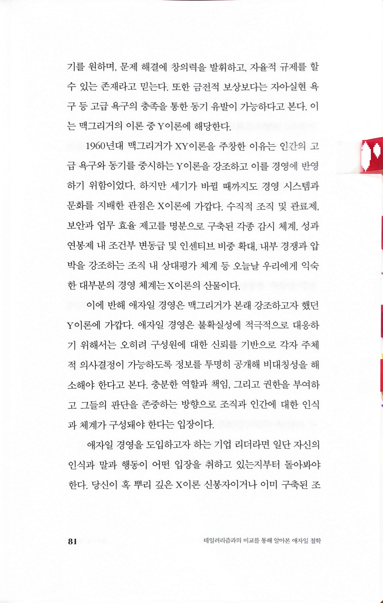

> 1960년대 맥그리거가 XY 이론을 주창한 이유는 인간의 고급 욕구와 동기를 중시하는 Y이론을 강조하고 이를 경영에 반영하기 위함이었다. 하지만 세기가 바뀔 때까지도 경영 시스템과 문화를 지배한 관점은 X이론에 가깝다. 수직적 조직 및 관료제, 보안과 업무 효율 제고를 명분으로 구축된 각종 감시 체계, 성과 연봉제 내 조건부 변동급 및 인센티브 비중 확대, 내부 경쟁과 압박을 강조하는 조직 내 상대평가 체계 등 오늘날 우리에게 익숙한 대부분의 경영 체계는 X이론의 산물이다.

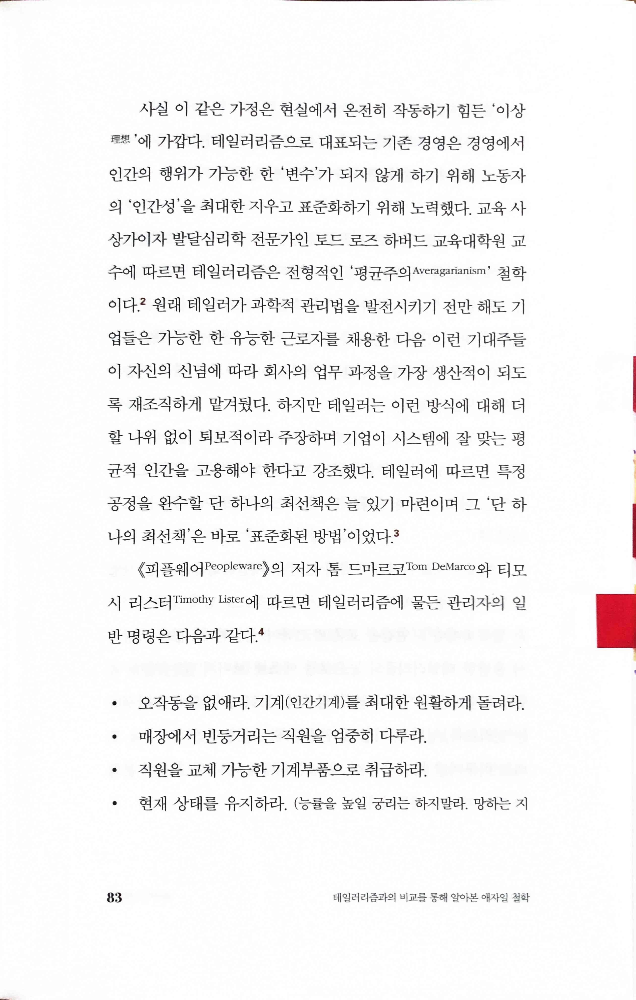

> 테일러리즘에 물든 관리자의 일반 명령

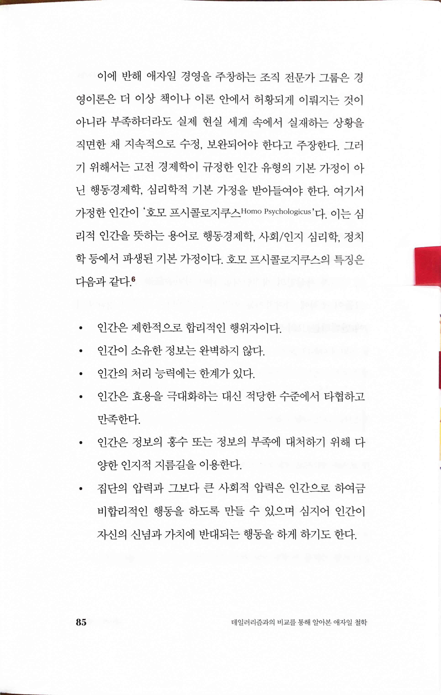

> 호모 프시콜로지쿠스 Homo Psychologicus의 특징

### 애자일 경영은 어떤 사람을 원하는가?: 인재에 대한 관점 87
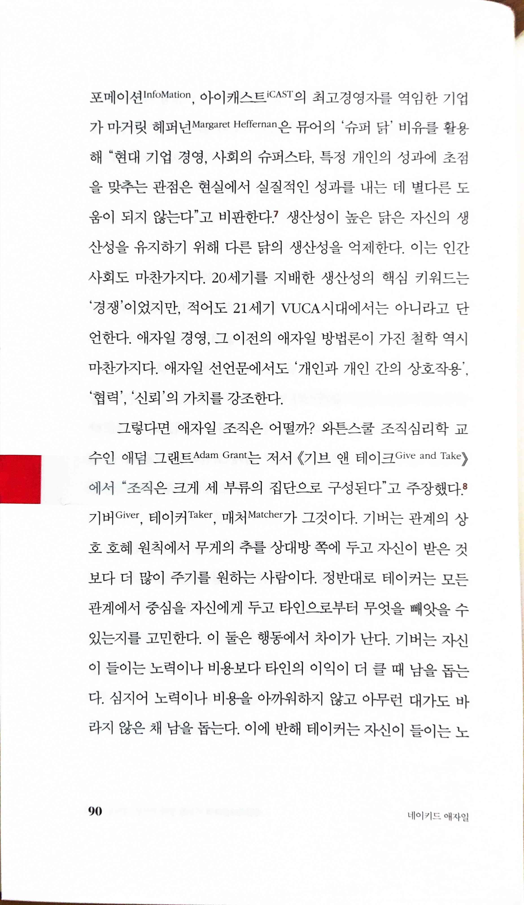

> 와튼스쿨 조직심리학 교수인 애덤 그랜트Adam Grant는 저서 <기브 앤 테이크Give and Take>에서 "조직은 크게 세 부류의 집단으로 구성된다"고 주장했다. 기버 Giver, 테이커 Taker, 매처 Matcher가 그것이다. 기버는 관계의 상호 호혜 원칙에서 무게의 추를 상대방 쪽에 두고 자신이 받은 것보다 더 많이 주기를 원하는 사람이다. 정반대로 테이커는 모든 관계에서 중심을 자신에게 두고 타인으로부터 무엇을 빼앗을 수 있는지를 고민한다. 이 둘은 행동에서 차이가 난다. 기버는 자신이 들이는 노력이나 비용보다 타인의 이익이 더 클 때 남을 돕는다. 심지어 노력이나 비용을 아까워하지 않고 아무런 대가도 바라지 않은 채 남을 돕는다. 이에 반해 테이커는 자신이 들이는 노력 이상의 이익이 돌아올 경우에만 전략적으로 남을 돕는다. 매처는 기버와 테이커의 중간에 위치하는 사람들로 현실에 가장 많이 존재하는 유형이라고 할 수 있다. 공평함을 원칙으로 삼는 매처는 남을 도울 때 상부상조 원리를 내세워 자기 이익을 보호한다.

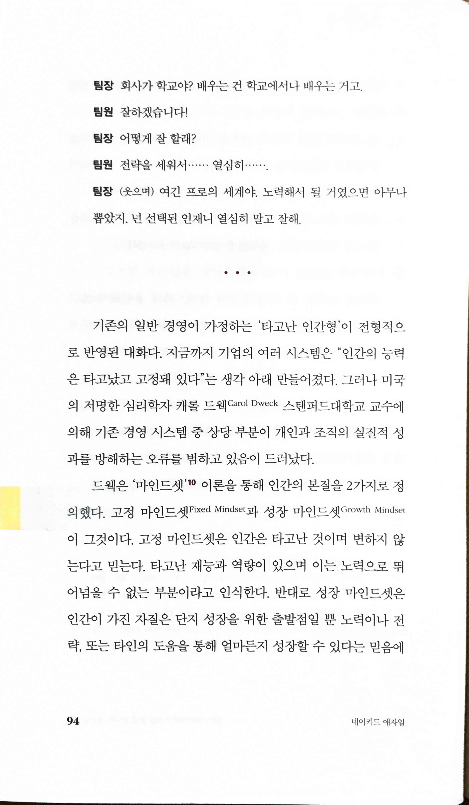

> 고정 마인드셋Fixed Mindset과 성장 마인드셋Growth Mindset이 그것이다. 고정 마인드셋은 인간은 타고난 것이며 변하지 않는다고 믿는다. 타고난 재능과 역량이 있으며 이는 노력으로 뛰어넘을 수 없는 부분이라고 인식한다. 반대로 성장 마인드셋은 인간이 가진 자질은 단지 성장을 위한 출발점일 뿐 노력이나 전략, 또는 타인의 도움을 통해 얼마든지 성장할 수 있다는 믿음에 바탕을 두고 있다.

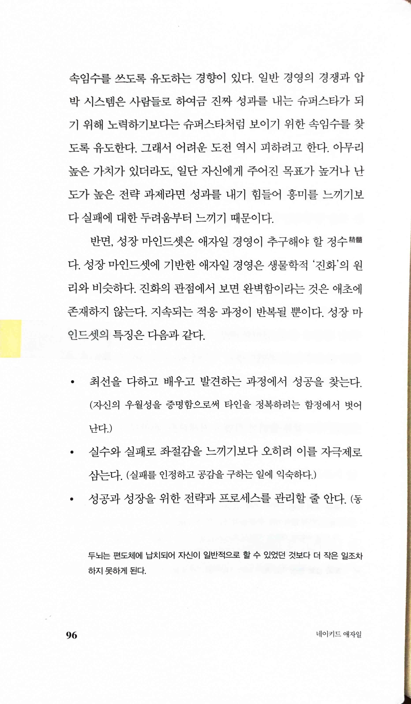 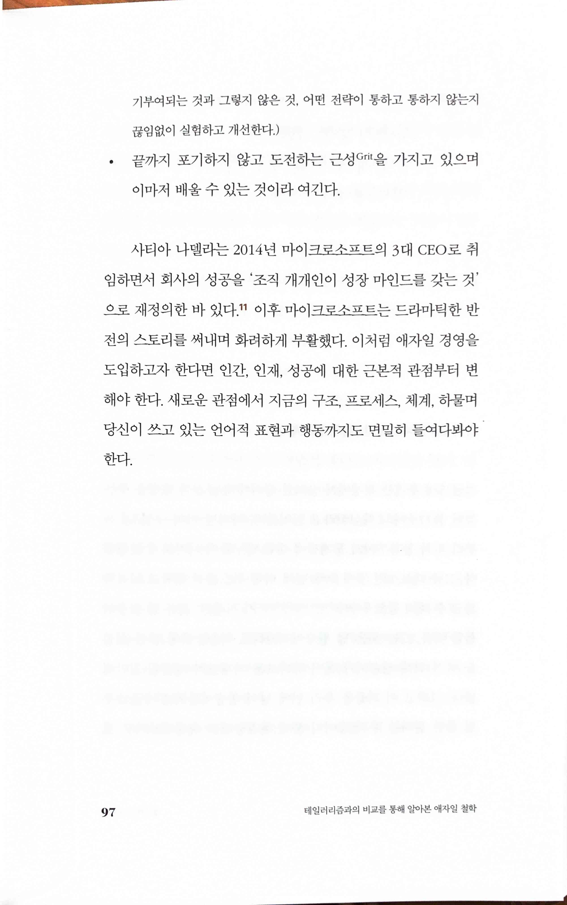

> 성장 마인드셋은 애자일 경영이 추구해야 정수다. 성장 마인드셋에 기반한 애자일 경영은 생물학적 '진화'의 원리와 비슷하다. 진화의 관점에서 보면 완벽함이라는 것은 애초에 존재하지 않는다. 지속되는 적응 과정이 반복될 뿐이다. 성장 마인드셋의 특징은 다음과 같다.
>
> 최선을 다하고 배우고 발견하는 과정에서 성공을 찾는다.(자신의 우월성을 증명함으로써 타인을 정복하려는 함정에서 벗어난다.)
>
> 실수와 실패로 좌절감을 느끼기보다 오히려 이를 자극제로 삼는다. (실패를 인정하고 공감을 구하는 일에 익숙하다.)
>
> 성공과 성장을 위한 전략과 프로세스를 관리할 줄 안다. (동기부여되는 것과 그렇지 않은 것, 어떤 전략이 통하고 통하지 않는지 끊임없이 실험하고 개선한다.)
>
> 끝까지 포기하지 않고 도전하는 근성Grit 을 가지고 있으며 이마저 배울 수 있는 것이라 여긴다.
>
> 이처럼 애자일 경영을 도입하고자 한다면 인간, 인재, 성공에 대한 근본적 관점부터 변해야 한다. 새로운 관점에서 지금의 구조, 프로세스, 체계, 하물며 당신이 쓰고 있는 언어적 표현과 행동까지도 면밀히 들여다봐야 한다.

### 지속가능한 조직은 무엇에 초점을 두는가?: 인재운용에 대한 관점 98
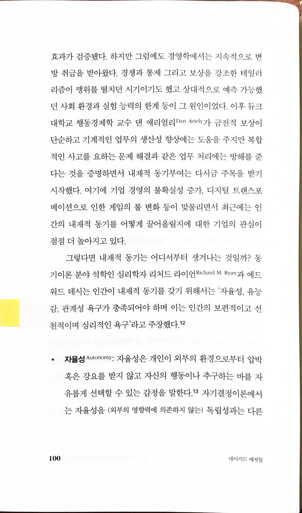 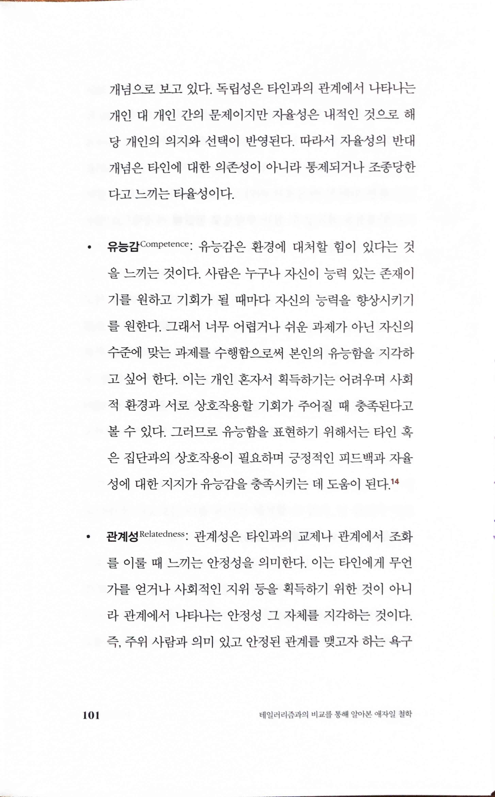 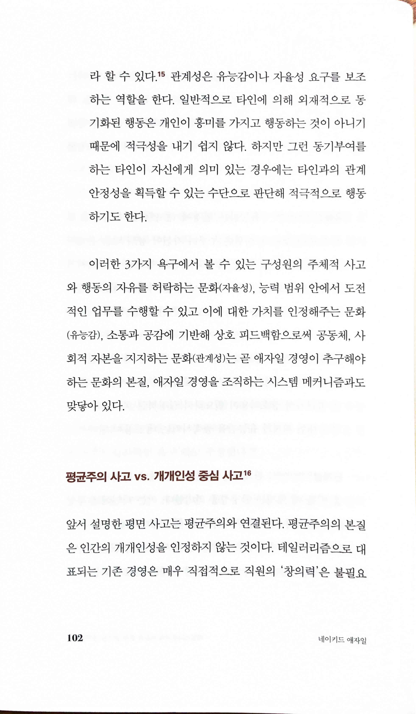

> 동기이론 분야 석학인 심리학자 리처드 라이언Richard M. Ryan과 에드워드 데시는 인간이 내재적 동기를 갖기 위해서는 '자율성, 유능감, 관계성 욕구가 충족되어야 하며 이는 인간의 보편적이고 선천적이며 심리적인 욕구'라고 주장했다.

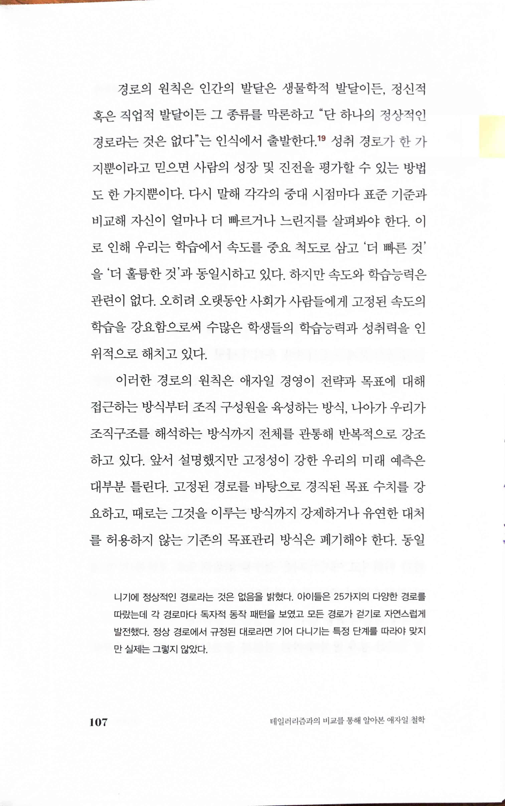

> 경로의 원칙은 인간의 발달은 생물학적 발달이든, 정신적 혹은 직업적 발달이든 그 종류를 막론하고 "단 하나의 정상적인 경로라는 것은 없다"는 인식에서 출발한다. 성취 경로가 한 가지뿐이라고 믿으면 사람의 성장 및 진전을 평가할 수 있는 방법도 한 가지뿐이다. 다시 말해 각각의 중대 시점마다 표준 기준과 비교해 자신이 얼마나 더 빠르거나 느린지를 살펴봐야 한다. 이로 인해 우리는 학습에서 속도를 중요 척도로 삼고 '더 빠른 것'을 '더 훌륭한 것'과 동일시하고 있다. 하지만 속도와 학습능력은 관련이 없다. 오히려 오랫동안 사회가 사람들에게 고정된 속도의 학습을 강요함으로써 수많은 학생들의 학습능력과 성취력을 인위적으로 해치고 있다.

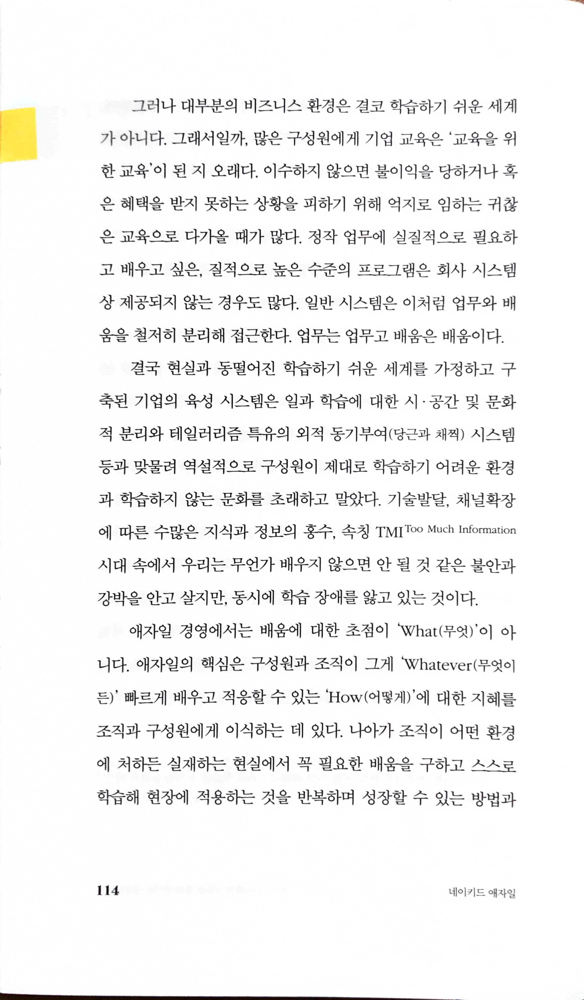

> 대부분의 비즈니스 환경은 결코 학습하기 쉬운 세계가 아니다.
>
> 애자일 경영에서는 배움에 대한 초점이 'What (무엇)'이 아니다. 애자일의 핵심은 구성원과 조직이 그게 'Whatever(무엇이든)' 빠르게 배우고 적응할 수 있는 'How(어떻게)'에 대한 지혜를 조직과 구성원에게 이식하는 데 있다. 나아가 조직이 어떤 환경에 처하든 실재하는 현실에서 꼭 필요한 배움을 구하고 스스로 학습해 현장에 적용하는 것을 반복하며 성장할 수 있는 방법과 태도를 갖추는 것이 바로 애자일이 추구하는 목표다.

### 맥락에 맞는 유연한 적응이 핵심이다. 문제 해결에 대한 관점 120

> 애자일 경영에서는 기업이 실수를 자연스러운 것으로 받아들이고 격려하는 문화를 만들어야 한다고 말한다. 애자일 경영에서 실수는 막아야 하는 부정적인 것이 아니라 막으려 해도 막을 수 없는 자연스러운 것이다. 우리는 실수를 자연스럽게 공유하고 협력해서 관리하는 방향으로 초점을 바꿔야 한다.

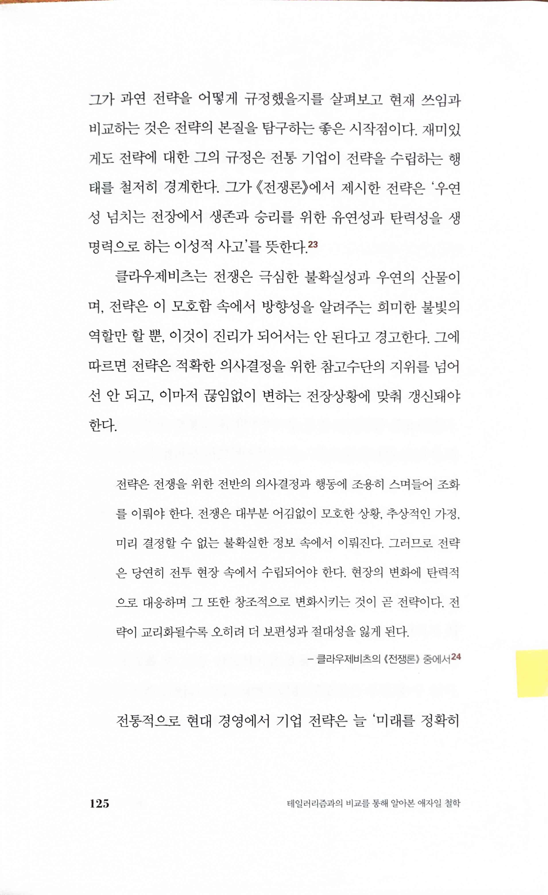

> 《전쟁론》에서 제시한 전략은 '우연성 넘치는 전장에서 생존과 승리를 위한 유연성과 탄력성을 생명력으로 하는 이성적 사고'
* `사슴을 이끄는 사자의 리더십`의 다음 부분이 연상되었다
  * [게임 상황에서는 커뮤니케이션이 원활해야 한다. 선수들이 상황에 즉각적으로 반응해야 하기 때문이다. 멈추어서 다음 동작을 결정할 만한 여유는 없다. 마치 잠시도 긴장을 늦출 수 없는 경영진처럼 한시라도 방심해선 안 된다. 상황에 발 빠르게 대응해야 중대한 득점기회를 놓치지 않는다.](https://github.com/hyunjun/bookmarks/blob/master/programming_books/leading_with_the_heart.md#%ED%8C%80%EC%9B%8C%ED%81%AC)

### 조직이 효율적으로 작동하고 성장하기 위한 방법: 관리에 대한 관점 127
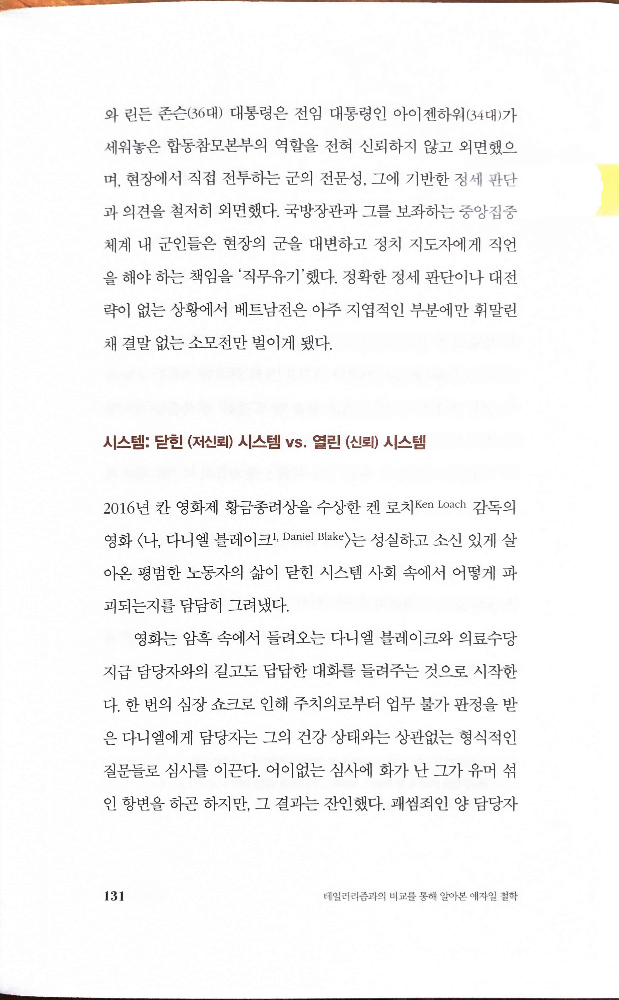

> 존 F. 케네디(35대)와 린든 존슨(36대) 대통령은 전임 대통령인 아이젠하워 (34대)가 세워놓은 합동참모본부의 역할을 전혀 신뢰하지 않고 외면했으며, 현장에서 직접 전투하는 군의 전문성, 그에 기반한 정세 판단과 의견을 철저히 외면했다. 국방장관과 그를 보좌하는 중앙집중체계 내 군인들은 현장의 군을 대변하고 정치 지도자에게 직언을 해야 하는 책임을 '직무유기'했다. 정확한 정세 판단이나 대전략이 없는 상황에서 베트남전은 아주 지엽적인 부분에만 휘말린 채 결말 없는 소모전만 벌이게 됐다.

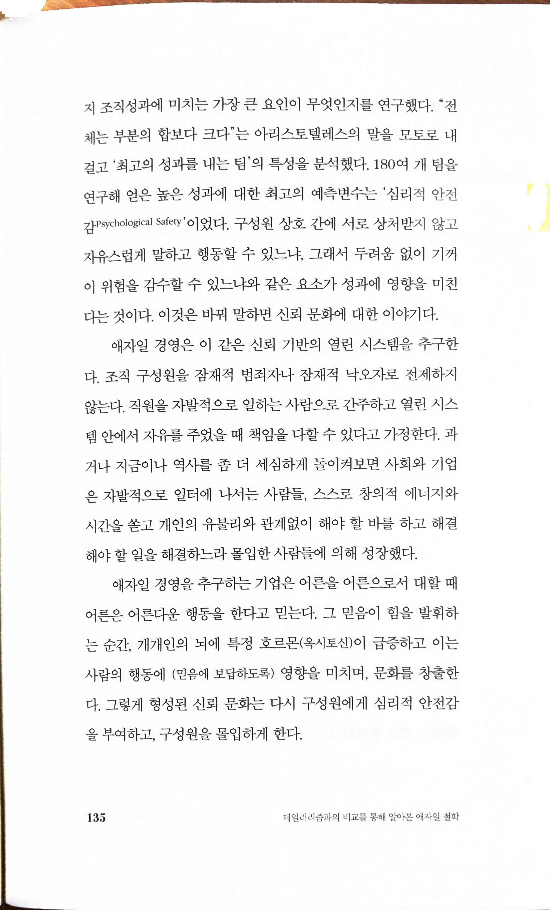

> '심리적 안전Psychological Safety'

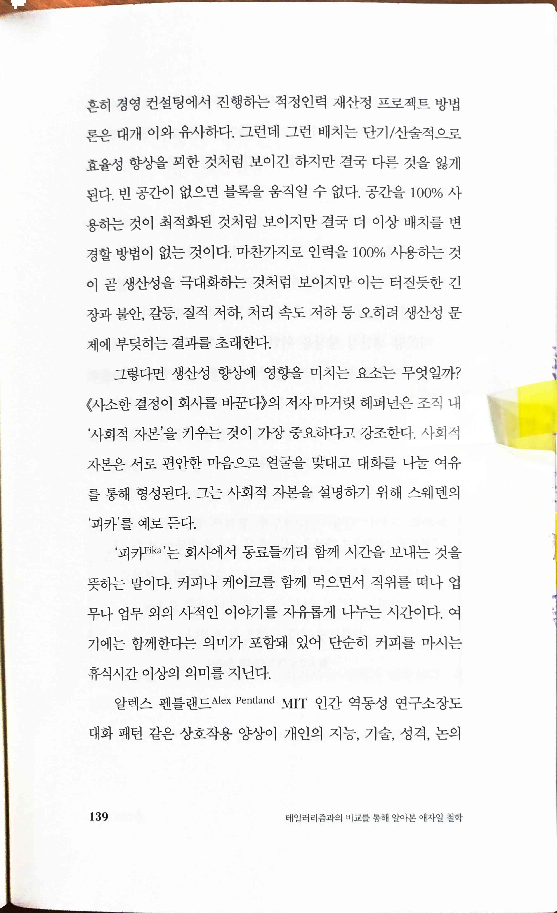

> 생산성 향상에 영향을 미치는 요소? 《사소한 결정이 회사를 바꾼다>의 저자 마거릿 헤퍼넌은 조직 내'사회적 자본'을 키우는 것이 가장 중요하다고 강조한다. 사회적 자본은 서로 편안한 마음으로 얼굴을 맞대고 대화를 나눌 여유를 통해 형성된다.

### 진정한 자유란?: 자율에 대한 관점 141
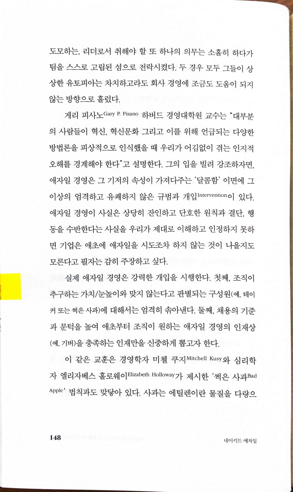

> 애자일 경영은 강력한 개입을 시행한다. 첫째, 조직이 추구하는 가치/눈높이와 맞지 않는다고 판별되는 구성원(예, 테이커 또는 썩은 사과)에 대해서는 엄격히 솎아낸다. 둘째, 채용의 기준과 문턱을 높여 애초부터 조직이 원하는 애자일 경영의 인재상(예, 기버)을 충족하는 인재만을 신중하게 뽑고자 한다.

### <It's Agile Time> 일과 삶의 관계는 무엇인가?: 워크 앤 라이프 밸런스 vs. 워크 앤 라이프 하모니 151
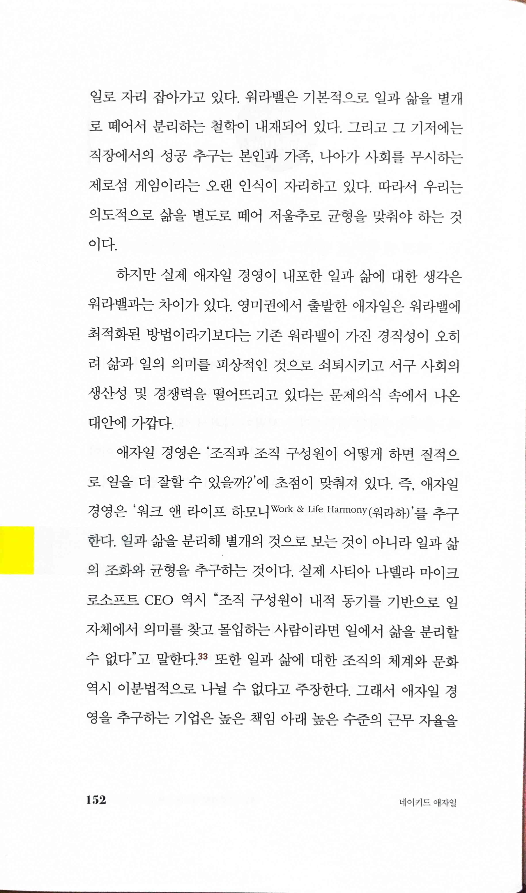

> 일과 삶을 분리해 별개의 것으로 보는 것이 아니라 일과 삶의 조화와 균형을 추구하는 것이다... 애자일 경영을 추구하는 기업은 높은 책임 아래 높은 수준의 근무 자율을 지향하는 경우가 많다.

## 4장 애자일 조직 만들기

### 애자일 조직의 특징 161
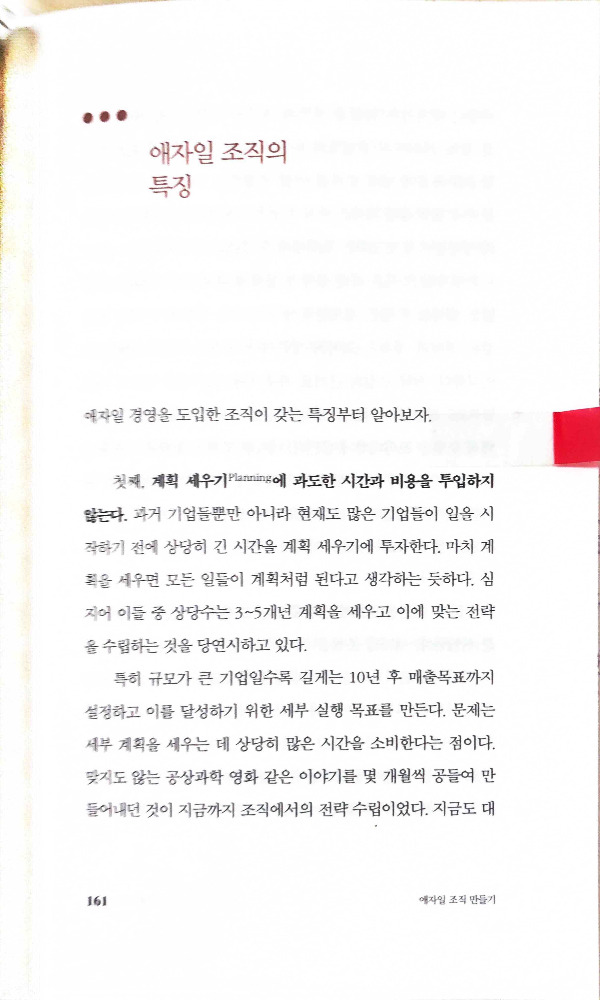 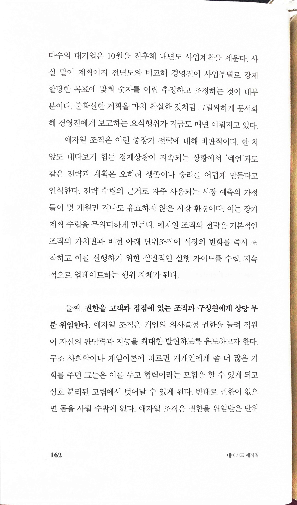 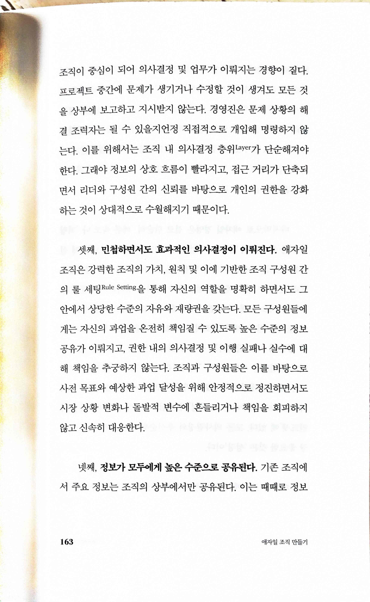 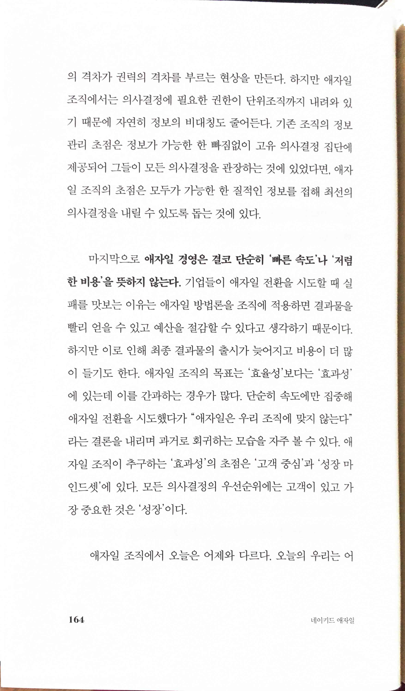 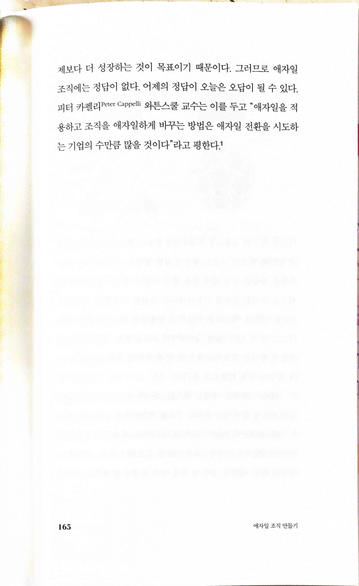

> 애자일 경영을 도입한 조직이 갖는 특징
>
> 첫째, 계획 세우기 Planning에 과도한 시간과 비용을 투입하지 않는다.
>
> 둘째, 권한을 고객과 접점에 있는 조직과 구성원에게 상당 부분 위임한다.
>
> 셋째, 민첩하면서도 효과적인 의사결정이 이뤄진다.
>
> 넷째, 정보가 모두에게 높은 수준으로 공유된다.
>
> 마지막으로 애자일 경영은 결코 단순히 '빠른 속도'나 '저렴한 비용'을 뜻하지 않는다... 애자일 조직의 목표는 '효율성'보다는 '효과성'에 있는데 이를 간과하는 경우가 많다... 애자일 조직이 추구하는 '효과'의 초점은 '고객 중심'과 '성장 마인드셋'에 있다. 모든 의사결정의 우선순위에는 고객이 있고 가장 중요한 것은 '성장'이다.
>
> 애자일 조직에는 정답이 없다.

### 애자일 조직의 정답은 현장에 있다 166
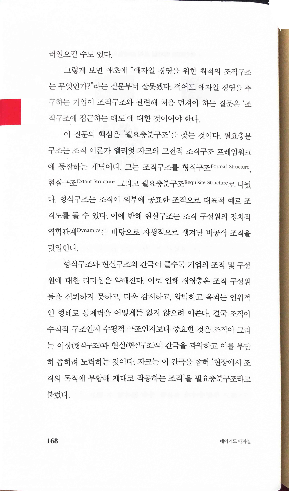

> 애초에 "애자일 경영을 위한 최적의 조직구조는 무엇인가?"라는 질문부터 잘못됐다. 적어도 애자일 경영을 추구하는 기업이 조직구조와 관련해 처음 던져야 하는 질문은 '조직구조에 접근하는 태도'에 대한 것이어야 한다.
>
> 이 질문의 핵심은 '필요충분구조'를 찾는 것이다. 필요충분구조는 조직 이론가 엘리엇 자크의 고전적 조직구조 프레임워크에 등장하는 개념이다. 그는 조직구조를 형식구조 Formal Structure, 현실구조 Extant Structure 그리고 필요충분구조 Requisite Structure로 나눴다. 형식구조는 조직이 외부에 공표한 조직으로 대표적 예로 조직도를 들 수 있다. 이에 반해 현실구조는 조직 구성원의 정치적 역학관계 Dynamics를 바탕으로 자생적으로 생겨난 비공식 조직을 덧입힌다.
>
> 형식구조와 현실구조의 간극이 클수록 기업의 조직 및 구성원에 대한 리더십은 약해진다. 이로 인해 경영층은 조직 구성원들을 신뢰하지 못하고, 더욱 감시하고, 압박하고 옥죄는 인위적인 형태로 통제력을 어떻게든 잃지 않으려 애쓴다. 결국 조직이 수직적 구조인지 수평적 구조인지보다 중요한 것은 조직이 그리는 이상(형식구조)과 현실(현실구조의 간극을 파악하고 이를 부단히 좁히려 노력하는 것이다. 자크는 이 간극을 좁혀 '현장에서 조직의 목적에 부합해 제대로 작동하는 조직'을 필요충분구조라고 불렀다.

### 자율경영 조직의 유형 170
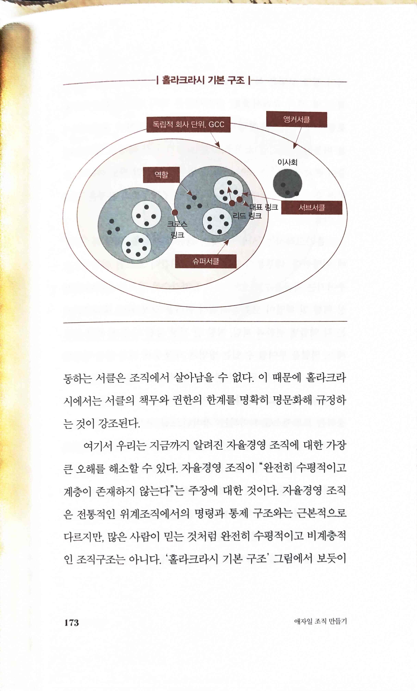

> 홀라크라시 Holacracy 기본 구조

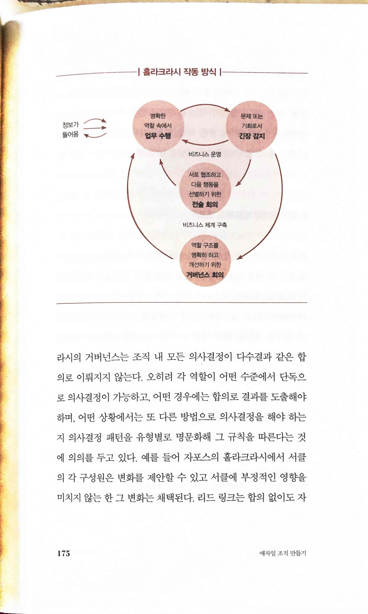

> 홀라크라시 작동 방식

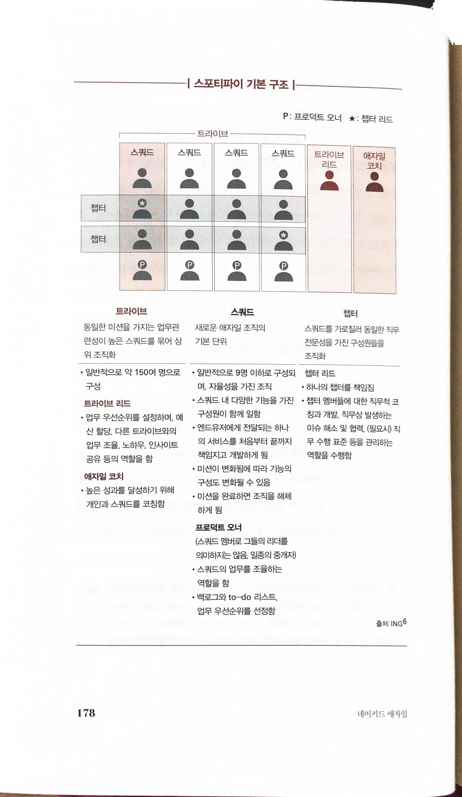

> 스포티파이 기본 구조

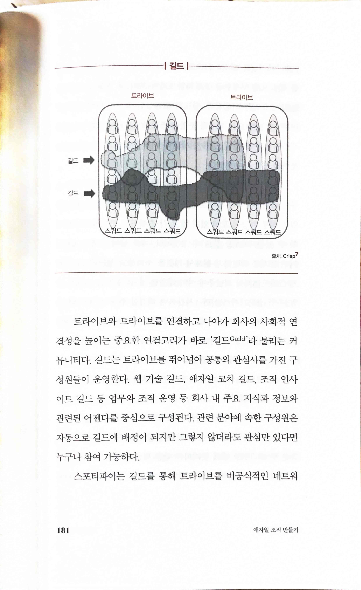

> 미 항공우주국 NASA의 매트릭스 구조

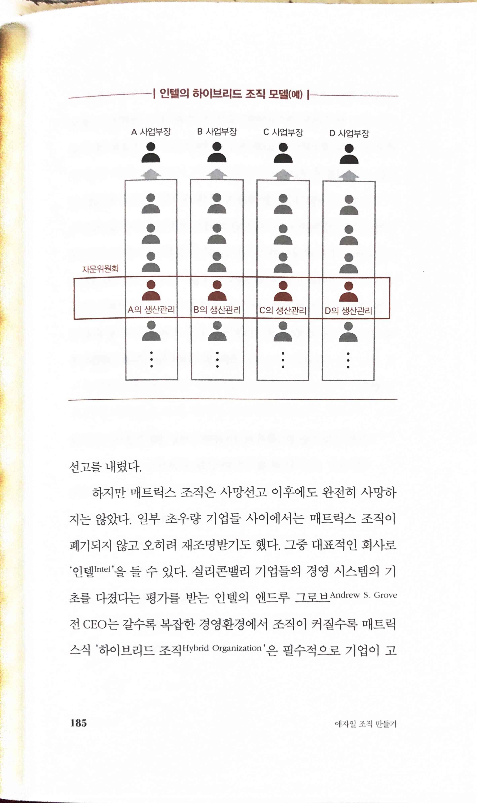

> 인텔의 하이브리드 조직 모델(예)

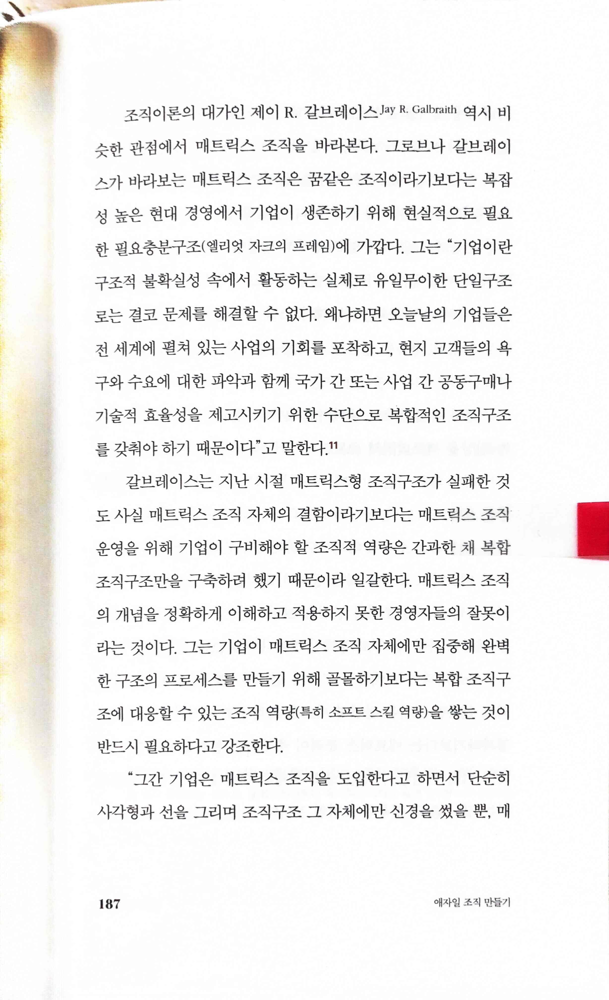

> 갈브레이스는 지난 시절 매트릭스형 조직구조가 실패한 것도 사실 매트릭스 조직 자체의 결함이라기보다는 매트릭스 조직운영을 위해 기업이 구비해야 할 조직적 역량은 간과한 채 복합 조직구조만을 구축하려 했기 때문이라 일갈한다. 매트릭스 조직의 개념을 정확하게 이해하고 적용하지 못한 경영자들의 잘못이라는 것이다. 그는 기업이 매트릭스 조직 자체에만 집중해 완벽한 구조의 프로세스를 만들기 위해 골몰하기보다는 복합 조직구조에 대응할 수 있는 조직 역량(특히 소프트 스킬 역량)을 쌓는 것이 반드시 필요하다고 강조한다.

### 자율경영 조직에 대한 기업의 바람직한 접근 태도 190
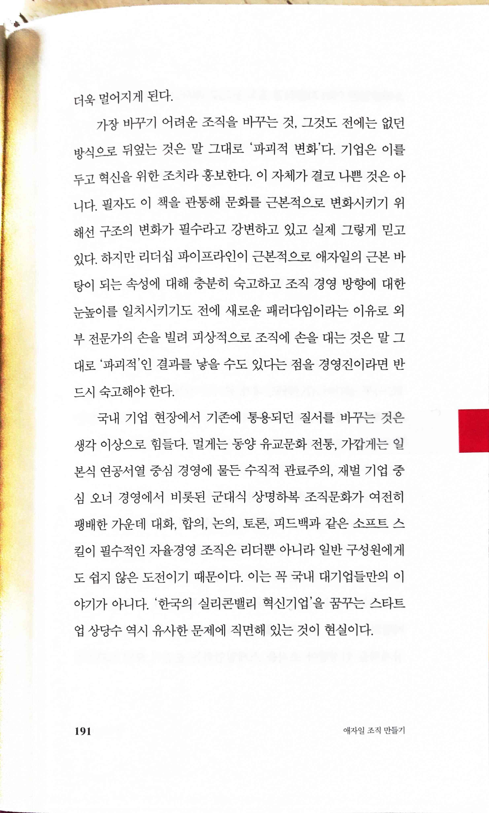

> 국내 기업 현장에서 기존에 통용되던 질서를 바꾸는 것은 생각 이상으로 힘들다. 멀게는 동양 유교문화 전통, 가깝게는 일본식 연공서열 중심 경영에 물든 수직적 관료주의, 재벌 기업 중심 오너 경영에서 비롯된 군대식 상명하복 조직문화가 여전히 팽배한 가운데 대화, 합의, 논의, 토론, 피드백과 같은 소프트 스킬이 필수적인 자율경영 조직은 리더뿐 아니라 일반 구성원에게도 쉽지 않은 도전이기 때문이다.

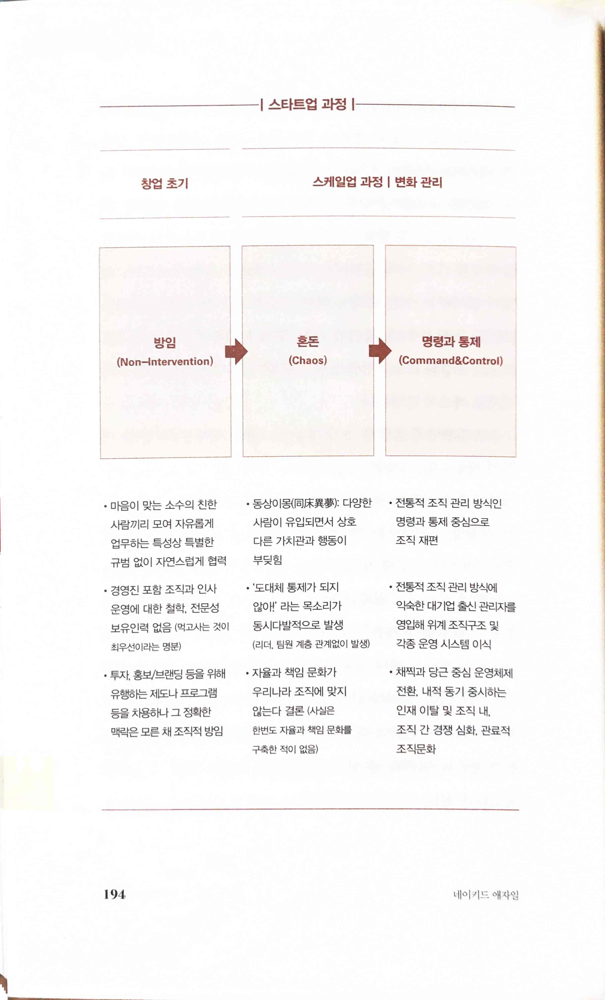

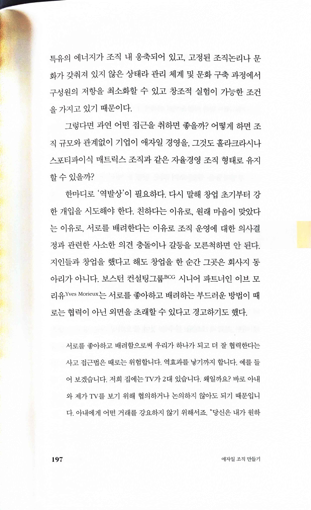 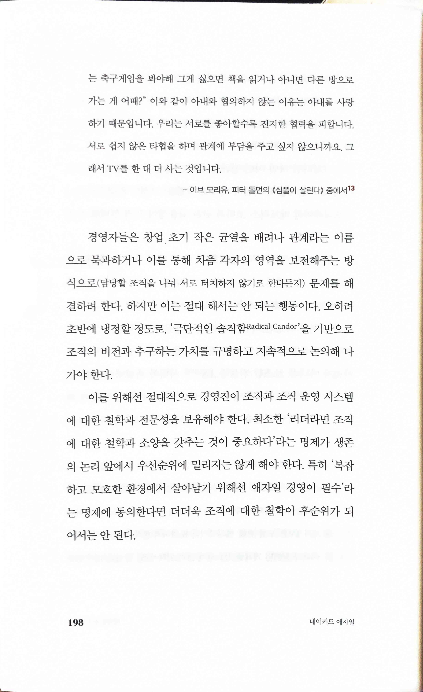

> 한마디로 '역발상'이 필요하다. 다시 말해 창업 초기부터 강한 개입을 시도해야 한다. 친하다는 이유로, 원래 마음이 맞았다는 이유로, 서로를 배려한다는 이유로 조직 운영에 대한 의사결정과 관련한 사소한 의견 충돌이나 갈등을 모른척하면 안 된다.지인들과 창업을 했다고 해도 창업을 한 순간 그곳은 회사지 동아리가 아니다. 보스턴 컨설팅그룹BCG 시니어 파트너인 이브 모리유Yves Morieux는 서로를 좋아하고 배려하는 부드러운 방법이 때로는 협력이 아닌 외면을 초래할 수 있다고 경고하기도 했다.
>
> 경영자들은 창업 초기 작은 균열을 배려나 관계라는 이름으로 묵과하거나 이를 통해 차츰 각자의 영역을 보전해주는 방식으로(담당할 조직을 나눠 서로 터치하지 않기로 한다든지) 문제를 해결하려 한다. 하지만 이는 절대 해서는 안 되는 행동이다. 오히려 초반에 냉정할 정도로, '극단적인 솔직함Radical Candor'을 기반으로 조직의 비전과 추구하는 가치를 규명하고 지속적으로 논의해 나가야 한다.
>
> 이를 위해선 절대적으로 경영진이 조직과 조직 운영 시스템에 대한 철학과 전문성을 보유해야 한다. 최소한 '리더라면 조직에 대한 철학과 소양을 갖추는 것이 중요하다'라는 명제가 생존의 논리 앞에서 우선순위에 밀리지는 않게 해야 한다. 특히 '복잡하고 모호한 환경에서 살아남기 위해선 애자일 경영이 필수'라는 명제에 동의한다면 더더욱 조직에 대한 철학이 후순위가 되어서는 안 된다.

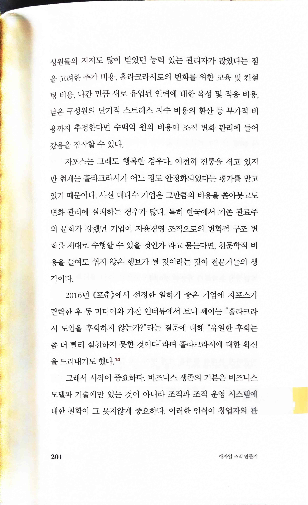

> 비즈니스 생존의 기본은 비즈니스 모델과 기술에만 있는 것이 아니라 조직과 조직 운영 시스템에 대한 철학이 그 못지않게 중요하다.

### <It's Agile Time> 애자일 경영은 제조업과 무관한 이야기다?!: 모닝스타 이야기 206

### 전통 조직구조 안에서의 애자일 전환 212

### 애자일 전환의 핵심 변화 관리 222
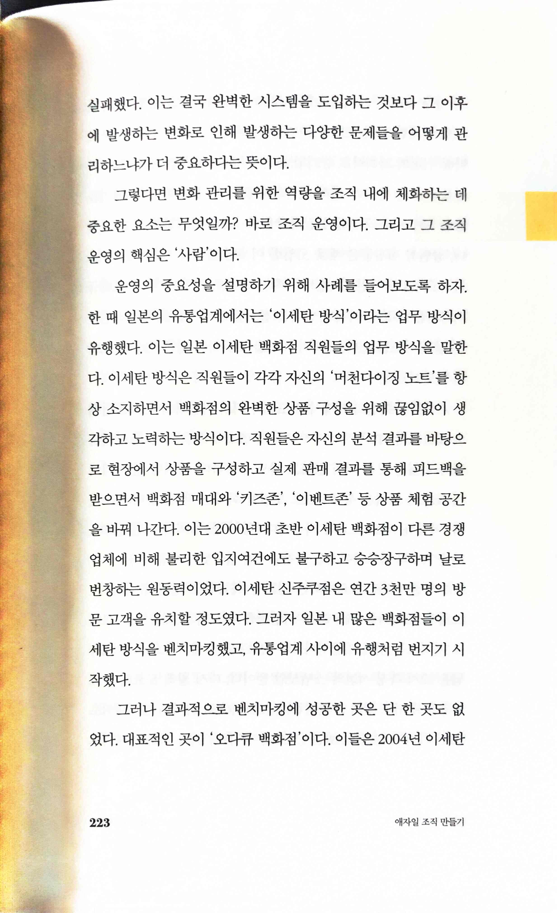

> 변화 관리를 위한 역량을 조직 내에 체화하는 데 중요한 요소는 조직 운영. 조직운영의 핵심은 '사람'

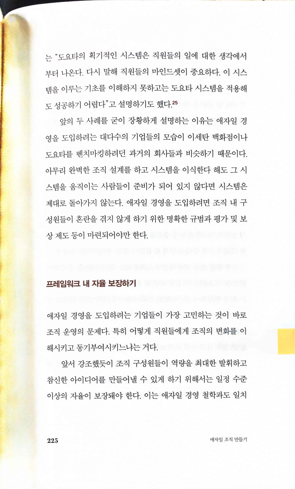

> 애자일 경영을 도입하려는 기업들이 가장 고민하는 것이 바로 조직 운영의 문제다. 특히 어떻게 직원들에게 조직의 변화를 이해시키고 동기부여시키느냐는 거다.

> 이상적으로는 목적, 우선순위, 원칙이라는 3단계가 각각 조직 내 모든 직원의 피드백을 통해 지속적으로 재정의되고 변경돼야 한다. 그렇지 않으면 프레임워크가 현실에 적용되지 못하거나, 이해관계를 반영하지 못하거나, 일관성을 잃게 된다.

### 애자일 전환의 핵심 성과 관리 232
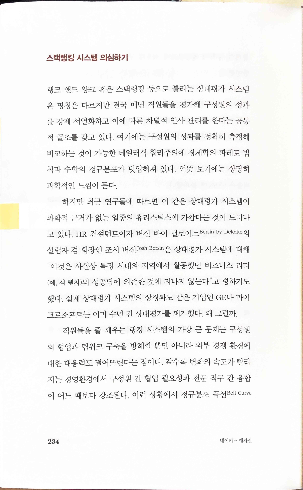

> 상대평가 시스템은 과학적 근거가 없는 일종의 휴리스틱스
>
> 랭킹 시스템의 가장 큰 문제는 구성원의 협업과 팀워크 구축을 방해할 뿐만 아니라 외부 경쟁 환경에 대한 대응력도 떨어뜨린다는 점

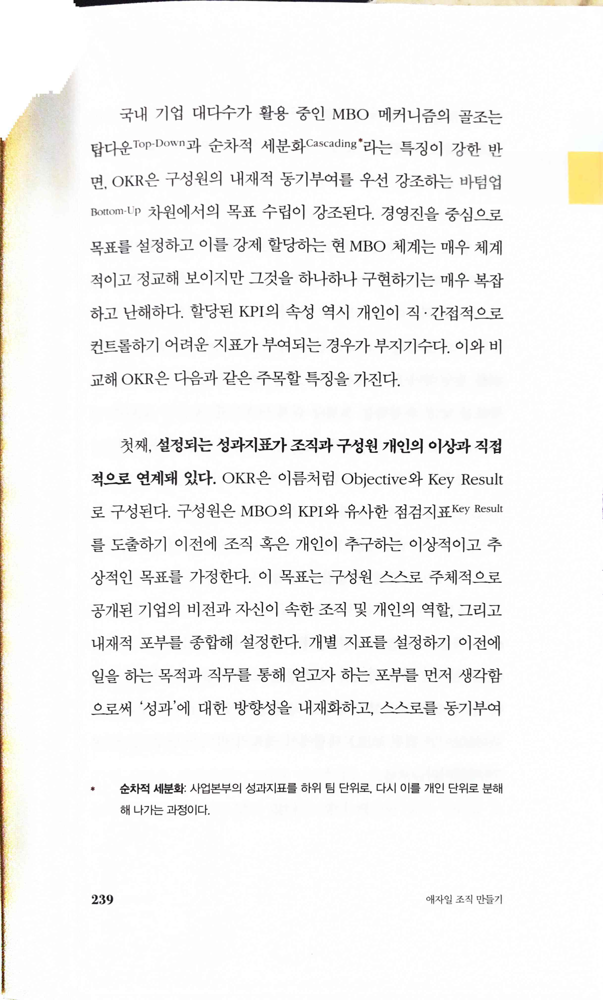

> 국내 기업 대다수가 활용 중인 MBO 메커니즘의 골조는 탑다운 Top-Down과 순차적 세분화Cascading라는 특징이 강한 반면 OKR은 구성원의 내재적 동기부여를 우선 강조하는 바텀업 Bottom-Up 차원에서의 목표 수립이 강조된다.

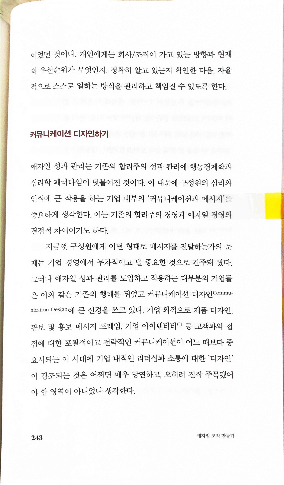

> 애자일 성과 관리는 기존의 합리주의 성과 관리에 행동경제학과 심리학 패러다임이 덧붙여진 것이다. 이 때문에 구성원의 심리와 인식에 큰 작용을 하는 기업 내부의 '커뮤니케이션과 메시지'를 중요하게 생각한다. 이는 기존의 합리주의 경영과 애자일 경영의 결정적 차이이기도 하다.

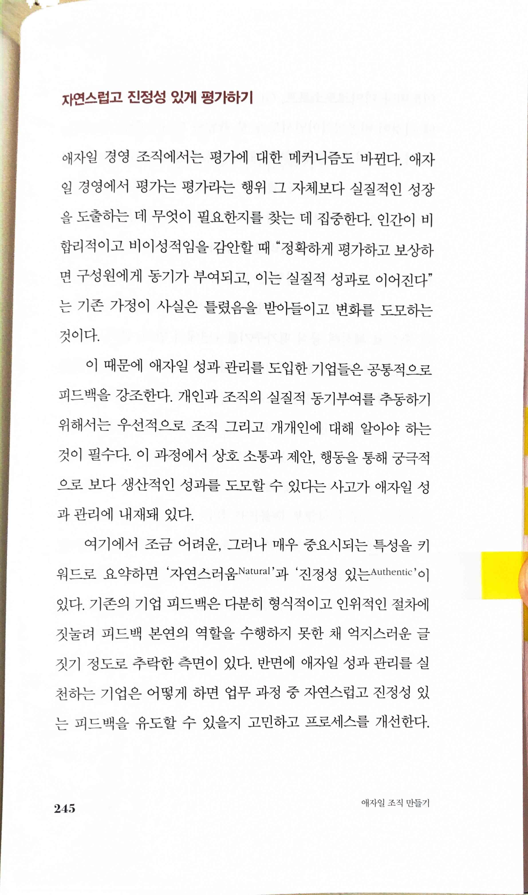

> '자연스러움Natural'과 '진정성 있는 Authentic'... 애자일 성과 관리를 실천하는 기업은 어떻게 하면 업무 과정 중 자연스럽고 진정성 있는 피드백을 유도할 수 있을지 고민하고 프로세스를 개선한다.

### 애자일 경영은 직원을 어떻게 대할까? 247
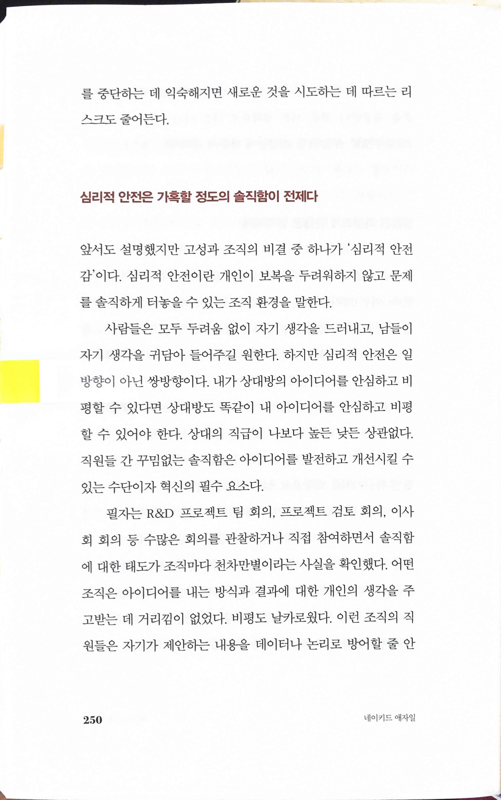

> 심리적 안전은 일방향이 아닌 쌍방향

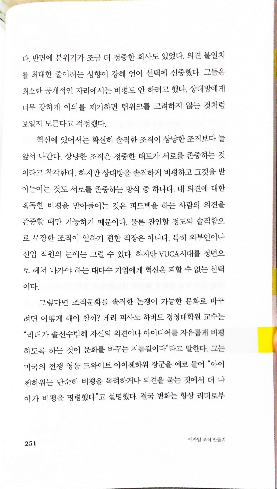

> 조직문화를 솔직한 논쟁이 가능한 문화로 바꾸려면? 게리 피사노 하버드 경영대학원 교수는 “리더가 솔선수범해 자신의 의견이나 아이디어를 자유롭게 비평하도록 하는 것이 문화를 바꾸는 지름길이다"라고 말한다. 그는 미국의 전쟁 영웅 드와이트 아이젠하워 장군을 예로 들어 "아이젠하워는 단순히 비평을 독려하거나 의견을 묻는 것에서 더 나아가 비평을 명령했다"고 설명했다. 결국 변화는 항상 리더로부터 온다.

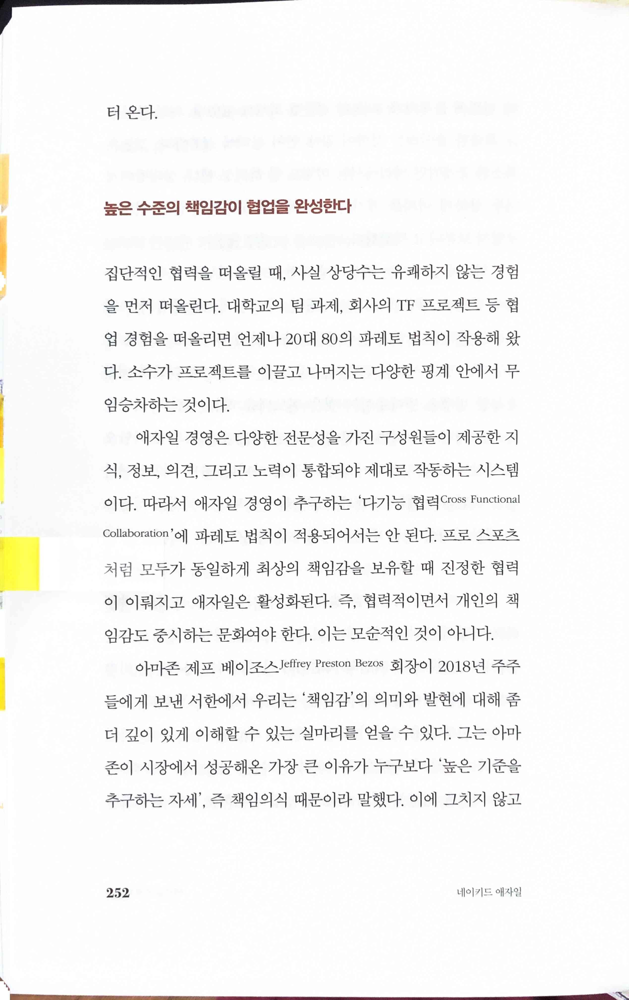

> 프로 스포츠처럼 모두가 동일하게 최상의 책임감을 보유할 때 진정한 협력이 이뤄지고 애자일은 활성화된다. 즉, 협력적이면서 개인의 책임감도 중시하는 문화여야 한다. 이는 모순적인 것이 아니다.
* 내가 항상 야구와의 유사성으로 설명하는 이유

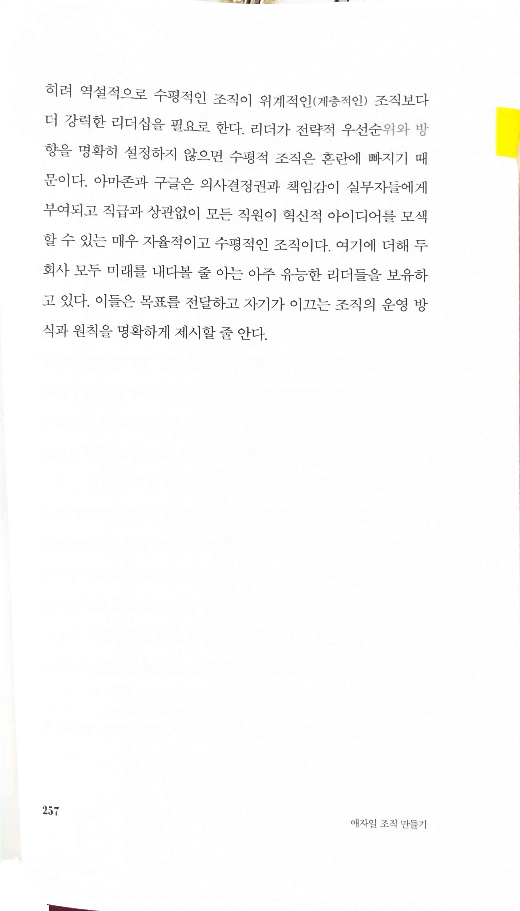

> 위계가 없다고 해서 리더십이 약하다는 의미는 아니다. 오히려 역설적으로 수평적인 조직이 위계적인 계층적인 조직보다 더 강력한 리더십을 필요로 한다. 리더가 전략적 우선순위와 방향을 명확히 설정하지 않으면 수평적 조직은 혼란에 빠지기 때문이다. 아마존과 구글은 의사결정권과 책임감이 실무자들에게 부여되고 직급과 상관없이 모든 직원이 혁신적 아이디어를 모색할 수 있는 매우 자율적이고 수평적인 조직이다. 여기에 더해 두회사 모두 미래를 내다볼 줄 아는 아주 유능한 리더들을 보유하고 있다. 이들은 목표를 전달하고 자기가 이끄는 조직의 운영 방식과 원칙을 명확하게 제시할 줄 안다.

### 〈It's Agile Time> 애자일 경영은 한국사회 정착이 용이한가?: 한국 정책 vs. 애자일 정책 258

## 5장 조직의 생존과 성장에 대한 새로운 의미부여

### 작동하는 애자일 조직구조를 위한 설계의 대원칙 277
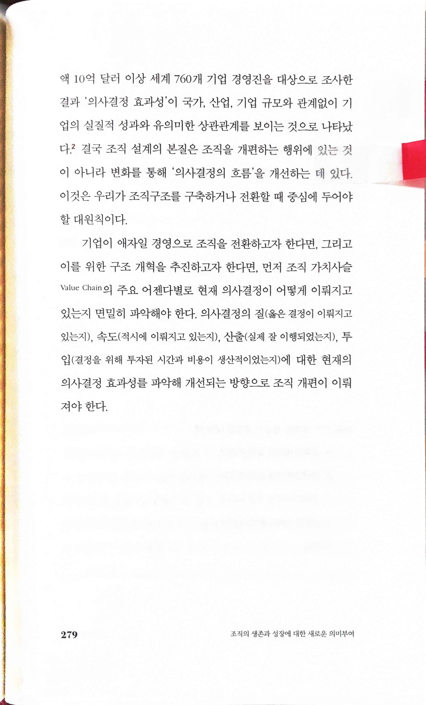

> 결국 조직 설계의 본질은 조직을 개편하는 행위에 있는 것이 아니라 변화를 통해 '의사결정의 흐름'을 개선하는 데 있다.이것은 우리가 조직구조를 구축하거나 전환할 때 중심에 두어야 할 대원칙이다.

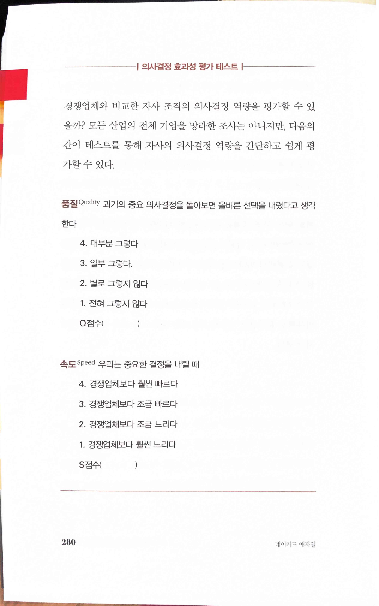 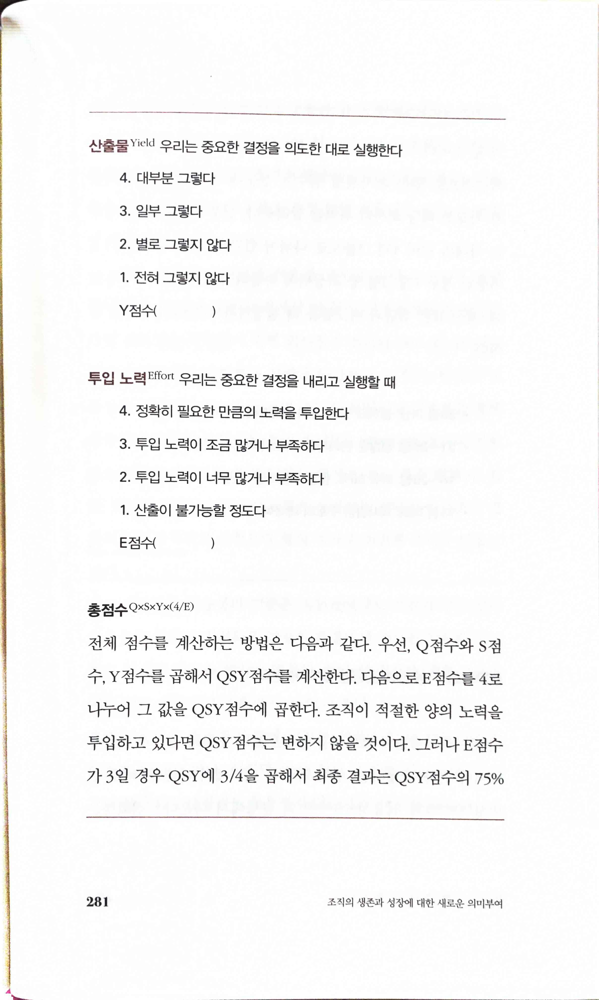 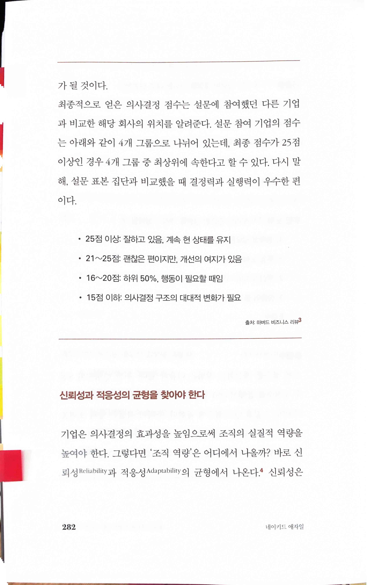

> 의사결정 효과성 평가 테스트

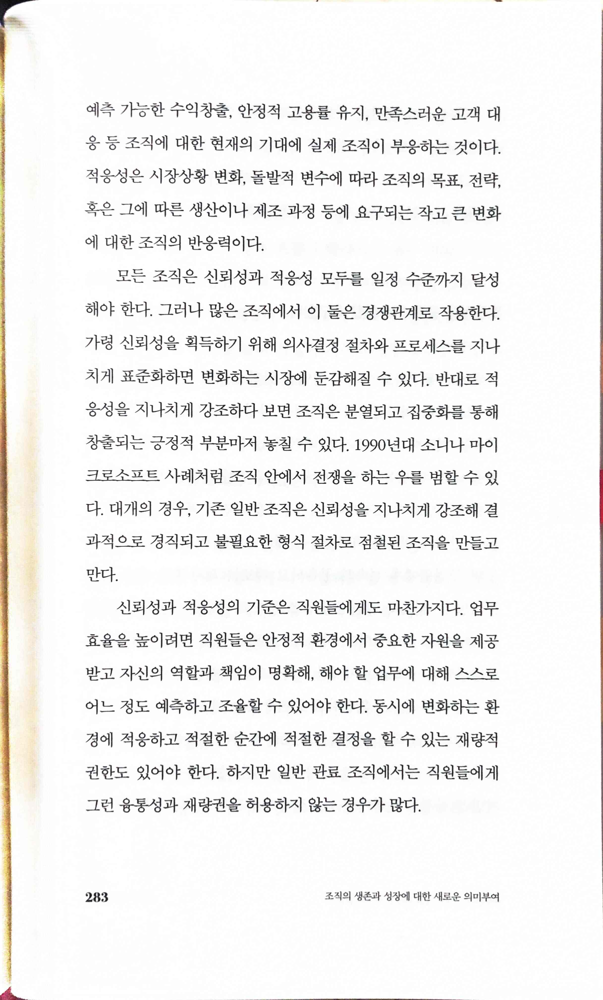

> '조직 역량'은 신뢰성 Reliability 과 적응성 Adaptability 의 균형에서 나온다
>
> 모든 조직은 신뢰성과 적응성 모두를 일정 수준까지 달성해야 한다. 그러나 많은 조직에서 이 둘은 경쟁관계로 작용한다. 가령 신뢰성을 획득하기 위해 의사결정 절차와 프로세스를 지나치게 표준화하면 변화하는 시장에 둔감해질 수 있다. 반대로 적응성을 지나치게 강조하다 보면 조직은 분열되고 집중화를 통해 창출되는 긍정적 부분마저 놓칠 수 있다.

> 애자일 경영을 위해 조직의 신뢰성과 적응성을 조율하며 의사결정의 효과성을 달성할 수 있는 조직 설계를 꾀하는 기업이 갖는 유사한 패턴이 있다. 가장 효과적인 의사결정을 내릴 수 있는 주체에게 의사결정 권한을 주는 의사결정 권한의 탈집중화가 그것이다. 의사결정을 가진 주체가 현실적인 복잡성 안에서 민첩한 의사결정을 내리면서도 이것이 경영진이나 주변 구성원에게 신속히 공유되고 때로는 의사결정 전에 쉽게 논의할 수 있도록 자율경영 구조든, 트리 구조든 간에 계층Layer의 단순화는 필수적이다.

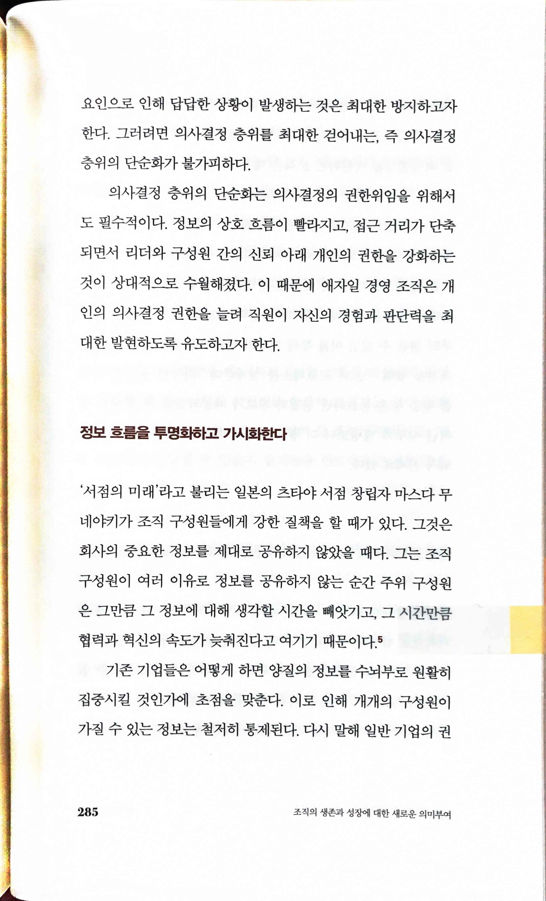

> 조직구성원이 여러 이유로 정보를 공유하지 않는 순간 주위 구성원은 그만큼 그 정보에 대해 생각할 시간을 빼앗기고, 그 시간만큼 협력과 혁신의 속도가 늦춰진다

### 애자일 경영의 완성 295

> 아무리 취지와 의미, 메커니즘이 좋은 조직 설계라 할지라도 궁극적인 성공 조건은 '잘 디자인된 변화 관리'에 있다. 구조가 인간 행동에 큰 영향을 미치는 것은 주지의사실이나 형식구조 하나만으로 이룰 수 있는 것은 거의 없다. 베인 앤 컴퍼니가 실시한 조직 개편 연구에서 성과와 높은 상관관계를 보인 것은 '의사결정' 요인이고 정작 형식적인 조직구조 자체는 상관관계가 없는 것으로 나타났다는 사실도 이를 방증하는근거 중 하나다. 조직구조가 의도된 바대로 작동하도록, 형식조직이 필요충분구조로 나아갈 수 있게 하는 데는 응당 변화 관리를 전제한 '운영 Operation'이 필요하다. 그리고 이 운영은 다시 구조적 시스템과 시스템의 공백을 메우는 인간 행동으로 구현된다.

 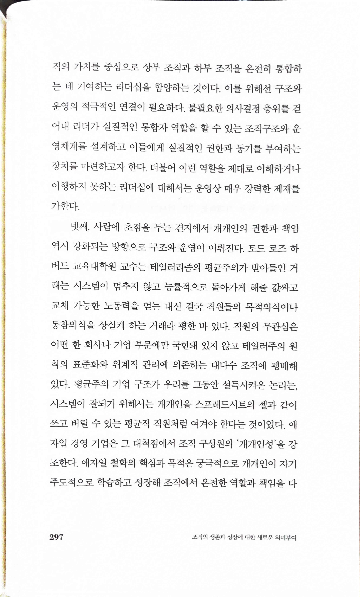 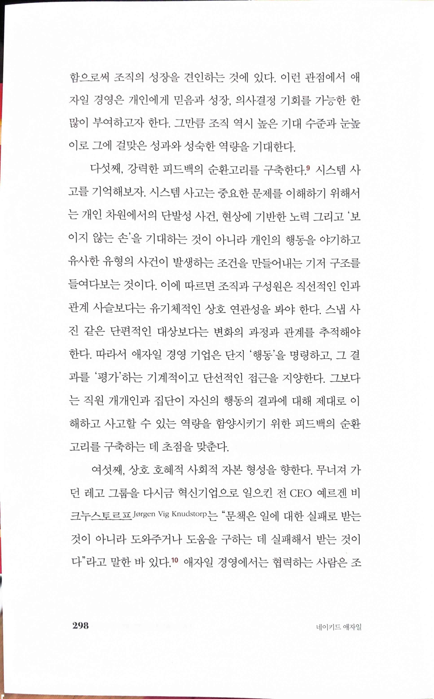

> 첫째, 조직 구성원들이 실질적으로 수행하는 업무가 무엇인지 쉽게 파악할 수 있도록 한다.
>
> 둘째, 규정보다 사람에 초점을 둔다.
>
> 셋째, 이 연장선 상에서 조직 통합자로서의 리더십 역할을 조정하고 중간 리더가 이 역할을 잘 이행할 수 있는 방향으로 구조와 운영에 초점을 맞춘다.
>
> 넷째, 사람에 초점을 두는 견지에서 개개인의 권한과 책임역시 강화되는 방향으로 구조와 운영이 이뤄진다.
>
> 다섯째, 강력한 피드백의 순환고리를 구축한다.
>
> 여섯째, 상호 호혜적 사회적 자본 형성을 향한다. 무너져 가던 레고 그룹을 다시금 혁신기업으로 일으킨 전 CEO 예르겐 비크누스토르프Jorgen Vig Knudstorp는 "문책은 일에 대한 실패로 받는 것이 아니라 도와주거나 도움을 구하는 데 실패해서 받는 것이 다"라고 말한 바 있다.

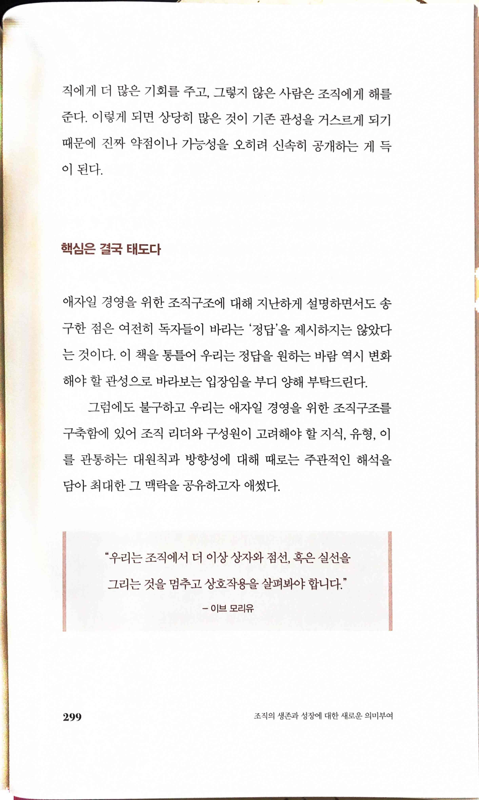 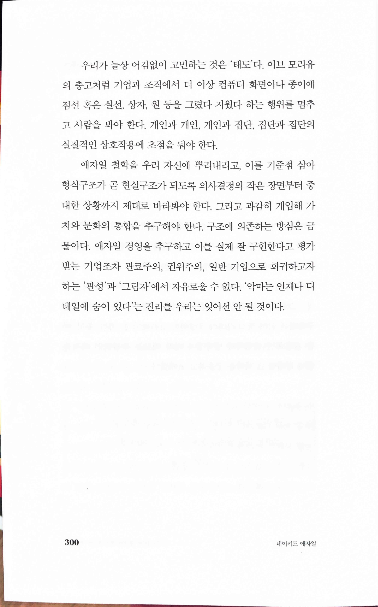

> "우리는 조직에서 더 이상 상자와 점선, 혹은 실선을 그리는 것을 멈추고 상호작용을 살펴봐야 합니다." -이브 모리유
>
> 애자일 철학을 우리 자신에 뿌리내리고, 이를 기준점 삼아 형식구조가 곧 현실구조가 되도록 의사결정의 작은 장면부터 중대한 상황까지 제대로 바라봐야 한다. 그리고 과감히 개입해 가치와 문화의 통합을 추구해야 한다. 구조에 의존하는 방심은 금물이다. 애자일 경영을 추구하고 이를 실제 잘 구현한다고 평가받는 기업조차 관료주의, 권위주의, 일반 기업으로 회귀하고자 하는 '관성'과 '그림자'에서 자유로울 수 없다. '악마는 언제나 디테일에 숨어 있다'는 진리를 우리는 잊어선 안 될 것이다.

## 에필로그 301
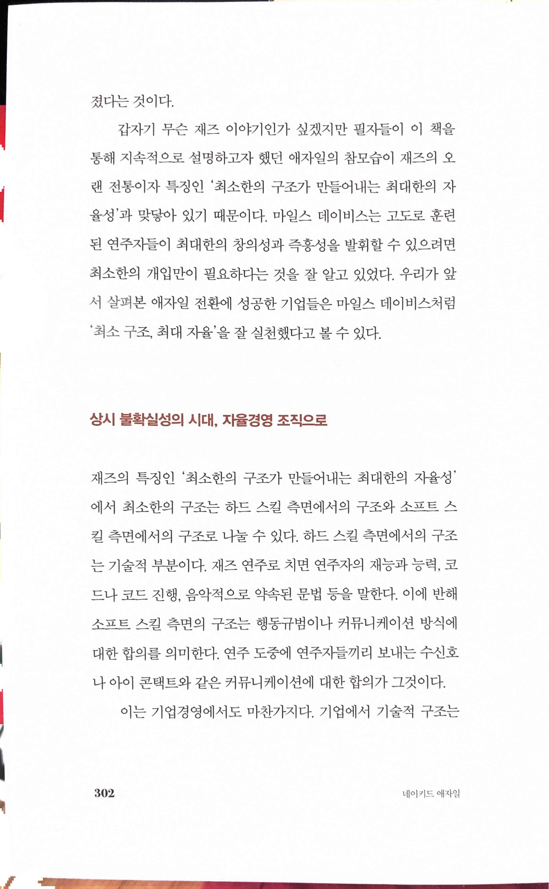

> 애자일의 참모습이 재즈의 오랜 전통이자 특징인 '최소한의 구조가 만들어내는 최대한의 자율성'과 맞닿아 있다. 마일스 데이비스는 고도로 훈련된 연주자들이 최대한의 창의성과 즉흥성을 발휘할 수 있으려면 최소한의 개입만이 필요하다는 것을 잘 알고 있었다. 우리가 앞서 살펴본 애자일 전환에 성공한 기업들은 마일스 데이비스처럼 '최소 구조, 최대 자율'을 잘 실천했다고 볼 수 있다.
>
> 재즈의 특징인 '최소한의 구조가 만들어내는 최대한의 자율성'에서 최소한의 구조는 하드 스킬 측면에서의 구조와 소프트 스킬 측면에서의 구조로 나눌 수 있다. 하드 스킬 측면에서의 구조는 기술적 부분이다. 재즈 연주로 치면 연주자의 재능과 능력, 코드나 코드 진행, 음악적으로 약속된 문법 등을 말한다. 이에 반해 소프트 스킬 측면의 구조는 행동규범이나 커뮤니케이션 방식에 대한 합의를 의미한다. 연주 도중에 연주자들끼리 보내는 수신호나 아이 콘택트와 같은 커뮤니케이션에 대한 합의가 그것이다.

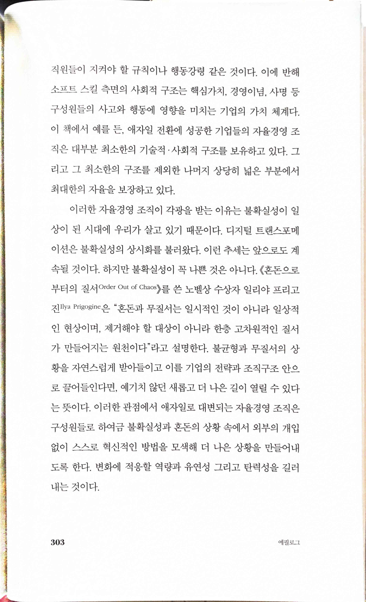

> 기업에서 기술적 구조는 직원들이 지켜야 할 규칙이나 행동강령 같은 것이다. 이에 반해 소프트 스킬 측면의 사회적 구조는 핵심가치, 경영이념, 사명 등 구성원들의 사고와 행동에 영향을 미치는 기업의 가치 체계다.
>
> 이러한 자율경영 조직이 각광을 받는 이유는 불확실성이 일상이 된 시대에 우리가 살고 있기 때문이다. 디지털 트랜스포메이션은 불확실성의 상시화를 불러왔다. 이런 추세는 앞으로도 계속될 것이다. 하지만 불확실성이 꼭 나쁜 것은 아니다. <혼돈으로부터의 질서 Order Out of Chaos>를 쓴 노벨상 수상자 일리야 프리고진Ilya Prigogine은 “혼돈과 무질서는 일시적인 것이 아니라 일상적인 현상이며, 제거해야 할 대상이 아니라 한층 고차원적인 질서가 만들어지는 원천이다"라고 설명한다. 불균형과 무질서의 상황을 자연스럽게 받아들이고 이를 기업의 전략과 조직구조 안으로 끌어들인다면, 예기치 않던 새롭고 더 나은 길이 열릴 수 있다는 뜻이다. 이러한 관점에서 애자일로 대변되는 자율경영 조직은 구성원들로 하여금 불확실성과 혼돈의 상황 속에서 외부의 개입없이 스스로 혁신적인 방법을 모색해 더 나은 상황을 만들어내도록 한다. 변화에 적응할 역량과 유연성 그리고 탄력성을 길러내는 것이다.