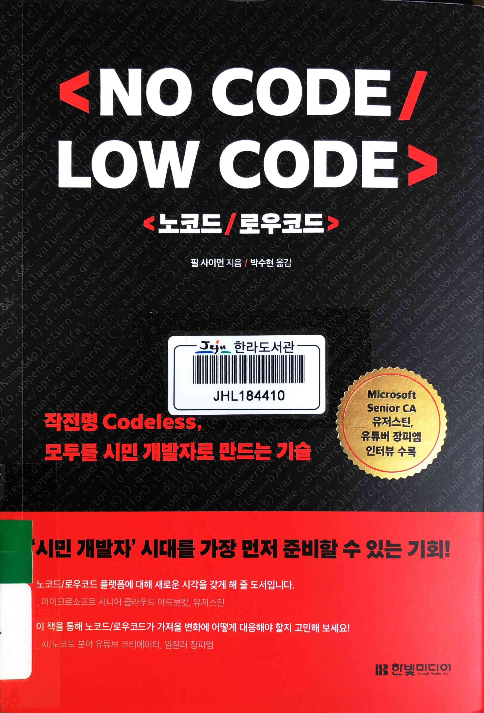
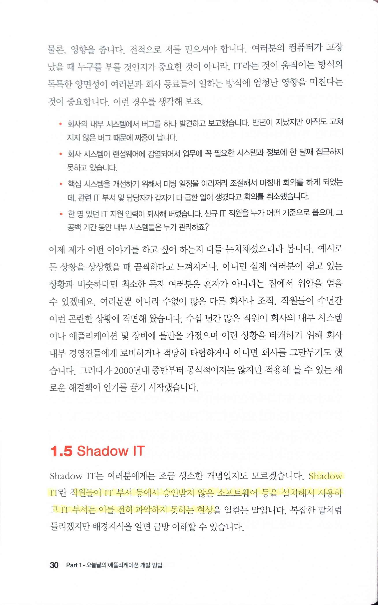
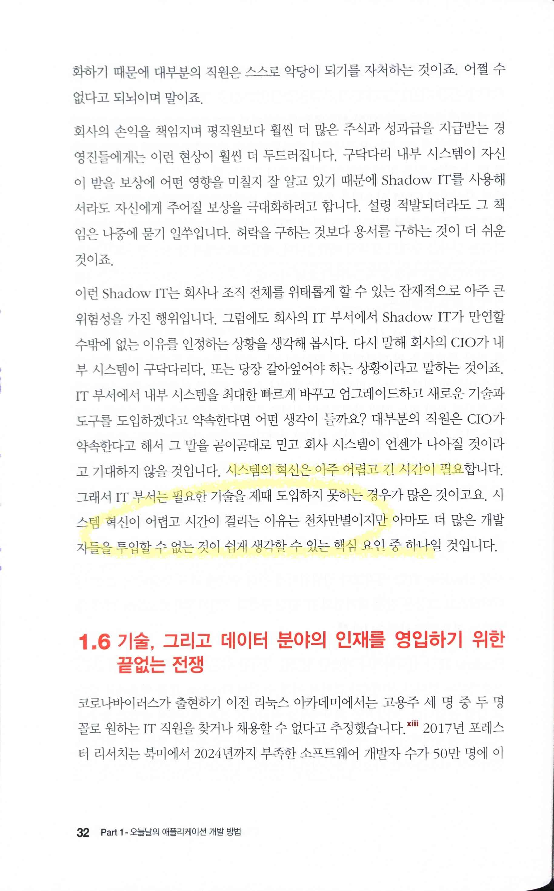
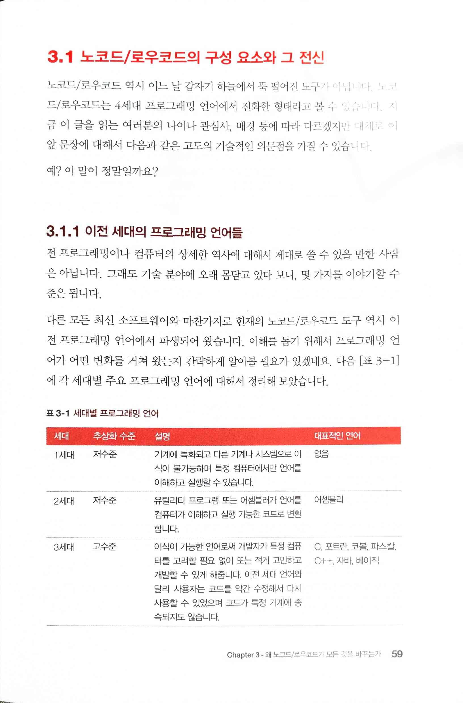
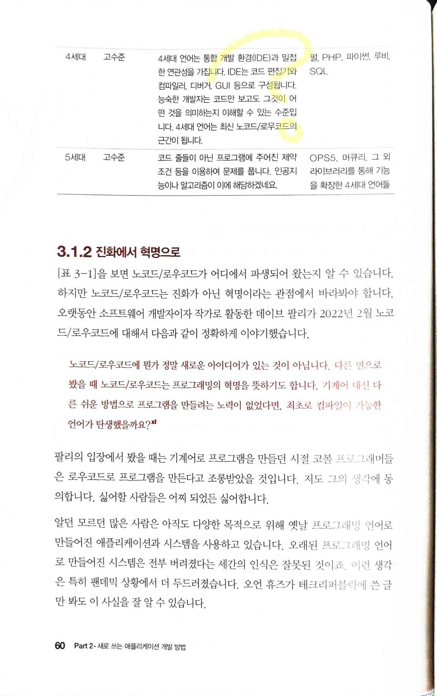
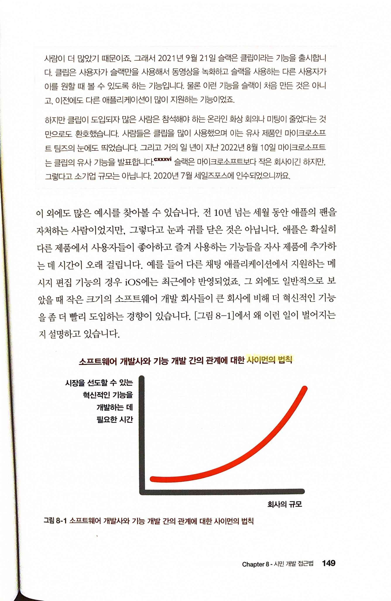
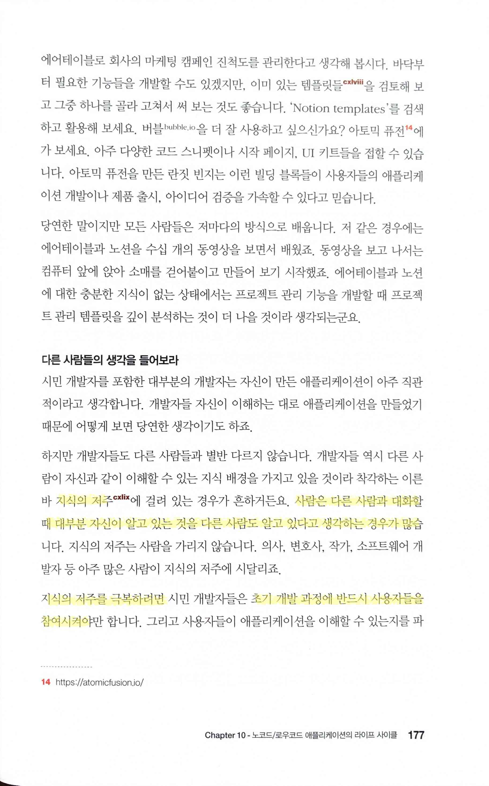

# 노코드/로우코드

Date: March 1, 2024
Score: ★★☆☆☆

- [노코드/로우코드(No Code, Low Code)](https://www.hanbit.co.kr/media/books/book_view.html?p_code=B6361136908)
    - ★★☆☆☆ March 1, 2024 책이 나쁜 건 아니지만 내가 관심있는 부분과 다름
    - 한라 005.1-사68ㄴ

- `Shadow IT`

    > 직원들이 IT 부서 등에서 승인받지 않은 소프트웨어 등을 설치해서 사용하고 IT 부서는 이를 전혀 파악하지 못하는 현상
    >

- 이해가 가지 않는 프로그래밍 언어 세대 분류

- `사이먼의 법칙`

- `지식의 저주`

    > 사람은 다른 사람과 대화할 때 대부분 자신이 알고 있는 것을 다른 사람도 알고 있다고 생각하는 경우가 많습니다… 지식의 저주를 극복하려면… 초기 개발 과정에 반드시 사용자들을 참여시켜야
    >

- `샤이니 오브젝트 신드롬 shiny object syndrome`

    > 새롭고 아름다워 보이는 것을 추구하고 갈망
    >
    - 오히려 개발자들이 (기술 부분에 한정해서는) 훨씬 더할텐데?
