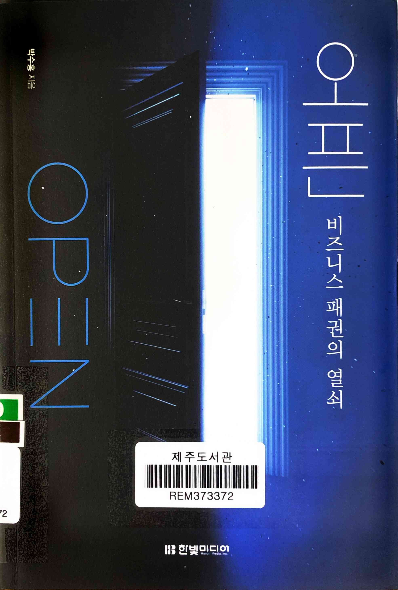
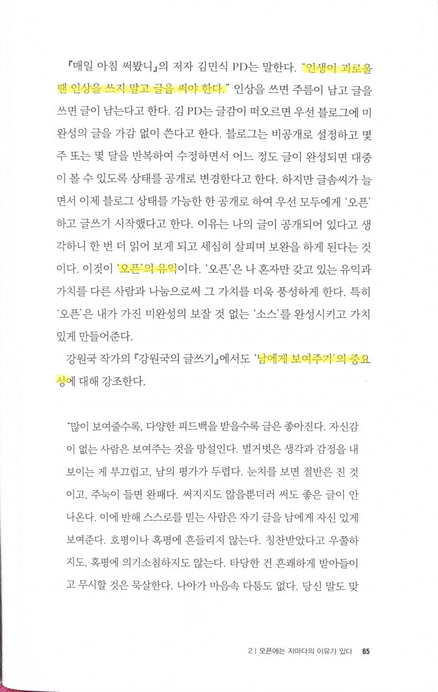
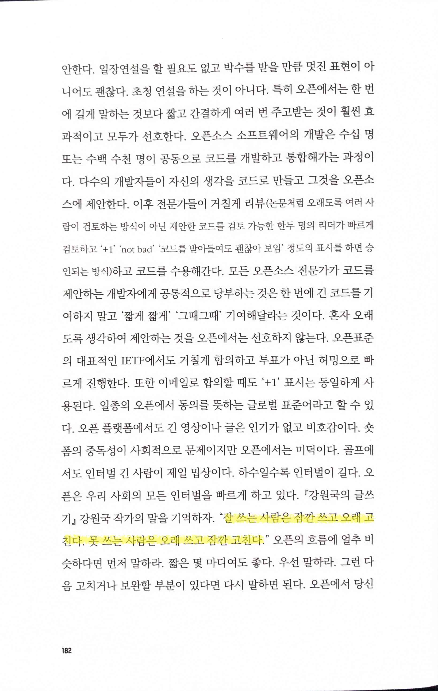
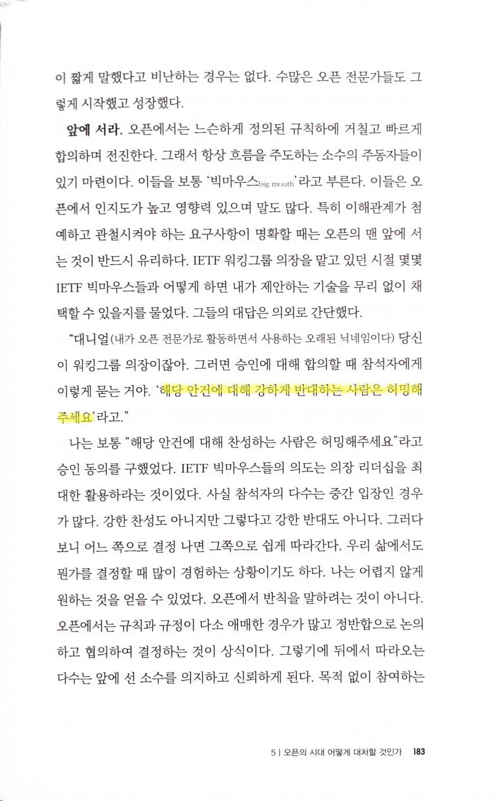
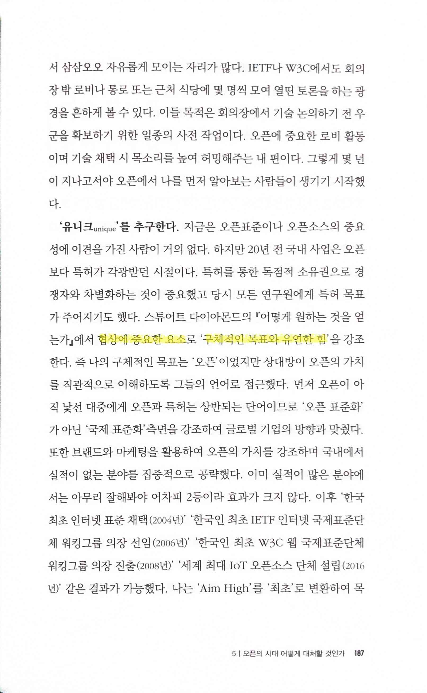
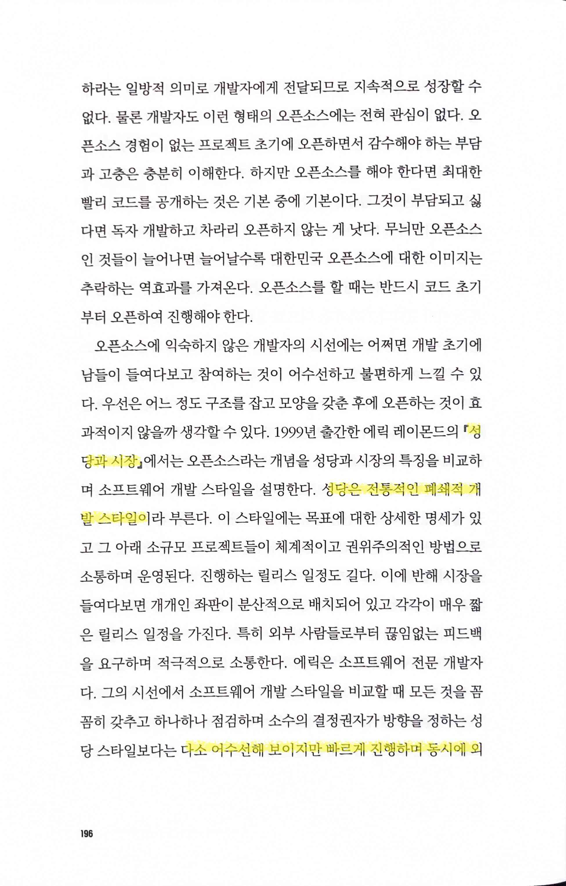

# 오픈 비즈니스 패권의 열쇠

Tags: open-source
Date: November 16, 2024
Score: ★★★☆☆

- ★★★☆☆ 2024.11.16
    - 《오픈: 비즈니스 패권의 열쇠》는 단순한 검색으로는 알기 어려운 오픈소스의 실질적 이면과 본질을 조명하는 책이다. 오픈소스는 협업과 공유라는 이상적인 이미지를 내세우지만, 이 책은 그 뒤에 숨은 실리와 전략적 동기를 분석한다. 현재 소프트웨어 분야는 경기 침체와 AI에 대한 환상 속에서 투자 환경이 보수적인데, 이러한 상황은 오픈소스에 대해 더 강하게 적용될 가능성이 크다.
    - 책은 오랜 기간 글로벌 IT 기업 및 커뮤니티와 함께해온 전문가의 시각에서 오픈소스의 강점과 약점을 균형 있게 서술한다. 독자는 오픈소스가 단순히 선의에 기댄 철학이 아니라, 비즈니스 생존과 성장의 수단으로 활용되고 있음을 다양한 사례를 통해 이해할 수 있다. 미래를 향한 혁신의 열쇠로서 오픈소스는 분명 매력적인 투자처지만, 의사 결정권자들이 이를 전략적으로 선택할지는 미지수다. 현실적인 제약을 감안하면 이러한 결정이 쉽지 않다는 점은 이해되지만, 그럼에도 불구하고 아쉬움이 남는다.
    - 특히 이 책은 "오픈"이라는 개념을 단순히 기술적 영역에 국한하지 않고, 사회적 철학과 글로벌 비즈니스 전략으로 확장해 다룬다. 성공한 오픈소스의 조건, 글로벌 빅테크가 이를 어떻게 활용하는지, 그리고 개인과 기업이 오픈소스를 통해 미래를 준비해야 하는 방향성까지 제시하며, 오늘날 오픈의 시대를 이해하는 데 중요한 길잡이가 된다.
    - https://www.hanbit.co.kr/store/books/look.php?p_code=B1112748219
- pp65~66
    - p65 “인생이 괴로울 땐 인상을 쓰지 말고 글을 써야 한다.”, ‘오픈’의 유익, “강원국의 글쓰기” ‘남에게 보여주기’의 중요성

        

    - p66 오픈의 이유는 성장

        

- p149 앨런 케이 “소프트웨어에 진심인 사람은 자신만의 하드웨어를 만들어야 한다”

    

- pp182~184
    - p182 “강원국의 글쓰기” ‘잘 쓰는 사람은 잠깐 쓰고 오래 고친다. 못 쓰는 사람은 오래 쓰고 잠깐 고친다.’

        

    - p183 ‘해당 안건에 대해 강하게 반대하는 사람은 허밍해주세요’

        

    - p184 ‘아는 척’이 쌓이면 자신감은 떨어지고 오픈에서 신뢰를 잃을 수 있다

        

        - 나를 드러내는 오픈은 늘 부담스럽다. 그렇지만 오픈에는 오픈이 답이다. 무수히 많은 상처를 받겠지만 그럼에도 계속 오픈하라. ‘상처받지 말고’가 아닌 ‘아무리 상처받아도 상처받지 않은 것처럼’ 오픈하라. 시간이 지나면 상처는 반드시 아물고 나만의 ‘훅’이 흔적으로 남는다.
- p187 스튜어트 다이아몬드 “어떻게 원하는 것을 얻는가” 협상에 중요한 요소 ‘구체적인 목표와 유연한 힘’

    

- pp196~197 성당과 시장
    - p196 성당은 전통적인 폐쇄적 개발 스타일

        

    - p197 다소 어수선해 보이지만 빠르게 진행하며 동시에 외부의 다양한 관점에서의 피드백을 적극 수용하며 진행하는 시장 스타일

        
