초개인주의
==========
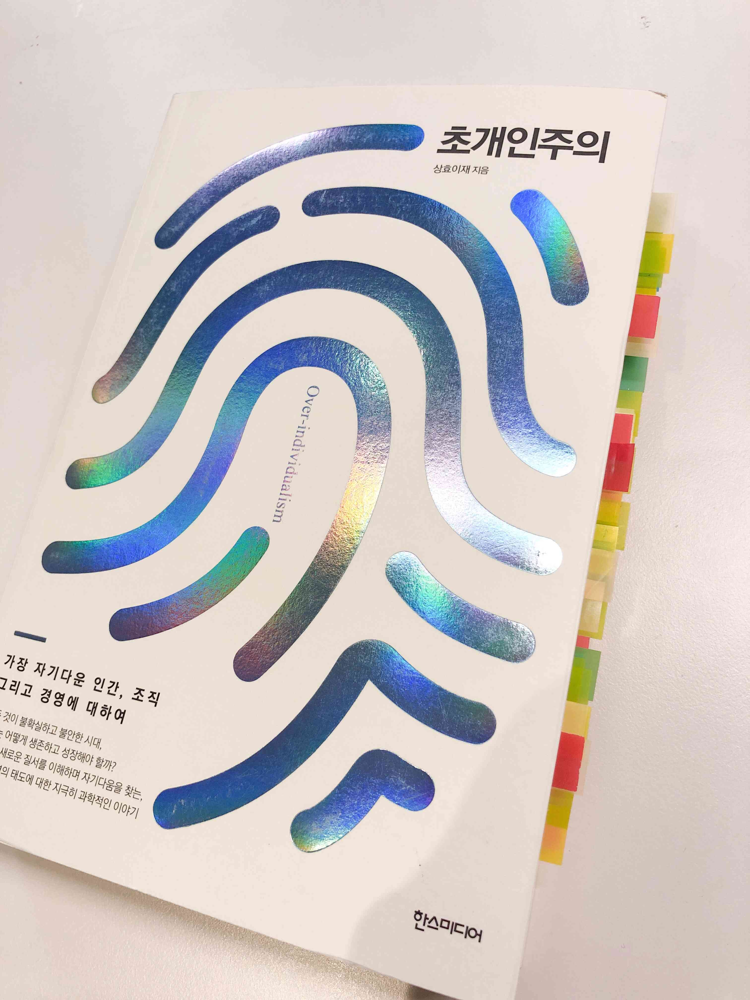

# 프롤로그 불안의 시대, 어떻게 생존하고 성장할 것인가?
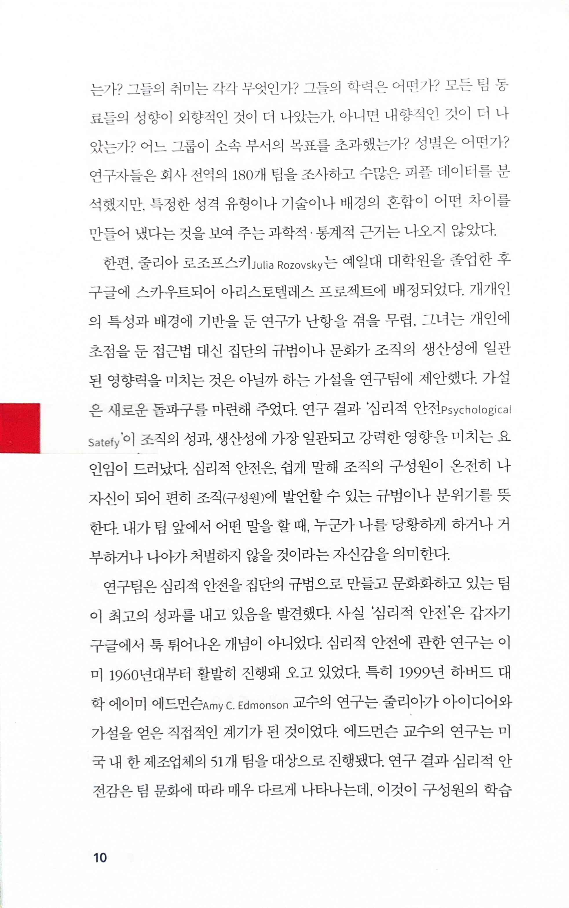

> '심리적 안전Psychological Satefy'이 조직의 성과, 생산성에 가장 일관되고 강력한 영향을 미치는 요인

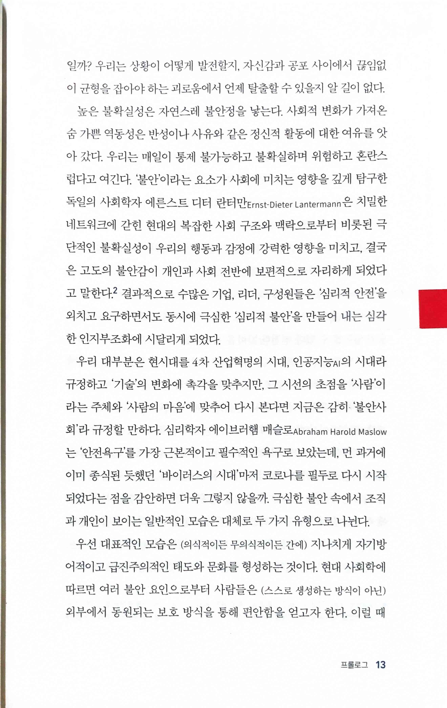

> '불안'이라는 요소가 사회에 미치는 영향을 깊게 탐구한 독일의 사회학자 에른스트 디터 란터만Ernst-Dieter Lantermann은 치밀한 네트워크에 갇힌 현대의 복잡한 사회 구조와 맥락으로부터 비롯된 극단적인 불확실성이 우리의 행동과 감정에 강력한 영향을 미치고, 결국은 고도의 불안감이 개인과 사회 전반에 보편적으로 자리하게 되었다고 말한다. 결과적으로 수많은 기업, 리더, 구성원들은 '심리적 안전'을 외치고 요구하면서도 동시에 극심한 '심리적 불안'을 만들어 내는 심각한 인지부조화에 시달리게 되었다.
>
> 심리학자 에이브러햄 매슬로Abraham Harold Maslow는 '안전욕구'를 가장 근본적이고 필수적인 욕구로 보았다

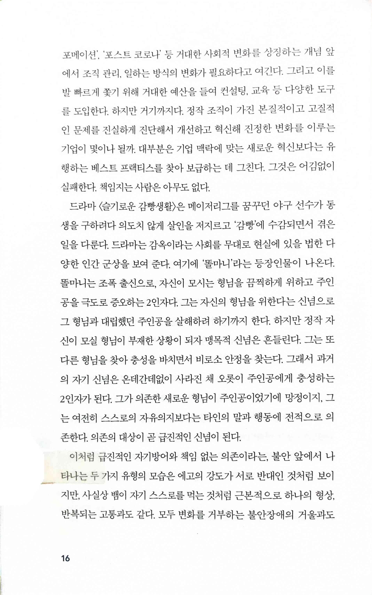

> 급진적인 자기방어와 책임 없는 의존이라는 불안 앞에서 나타나는 두 가지 유형의 모습은 에고의 강도가 서로 반대인 것처럼 보이지만, 사실상 뱀이 자기 스스로를 먹는 것처럼 근본적으로 하나의 형상, 반복되는 고통과도 같다.
* [우로보로스 - 위키백과, 우리 모두의 백과사전](https://ko.wikipedia.org/wiki/%EC%9A%B0%EB%A1%9C%EB%B3%B4%EB%A1%9C%EC%8A%A4)

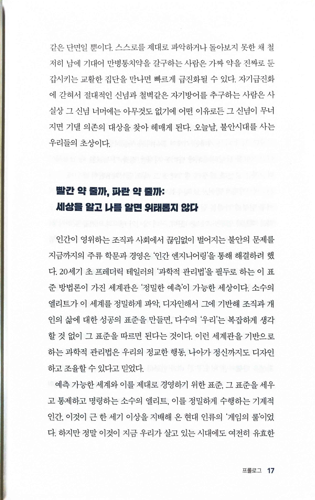

> 인간이 영위하는 조직과 사회에서 끊임없이 벌어지는 불안의 문제를 지금까지의 주류 학문과 경영은 '인간 엔지니어링'을 통해 해결하려 했다. 20세기 초 프레더릭 테일러의 '과학적 관리법'을 필두로 하는 이 표준 방법론이 가진 세계관은 '정밀한 예측'이 가능한 세상이다... 이런 세계관을 기반으로 하는 과학적 관리법은 우리의 정교한 행동, 나아가 정신까지도 디자인하고 조율할 수 있다고 믿었다.

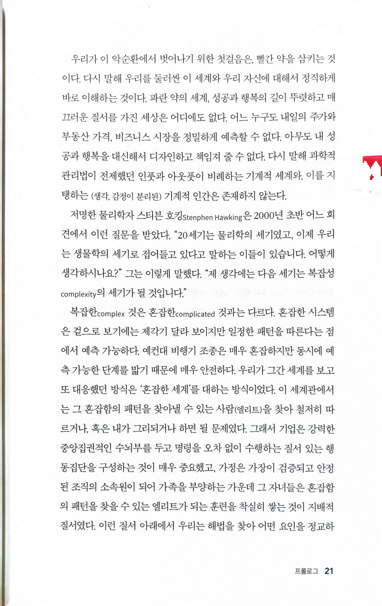

> 과학적 관리법이 전제했던 인풋과 아웃풋이 비례하는 기계적 세계와, 이를 지탱하는 (생각,감정이 분리된) 기계적 인간은 존재하지 않는다.
>
> 복잡한complex 것은 혼잡한complicated 것과는 다르다. 혼잡한 시스템은 겉으로 보기에는 제각기 달라 보이지만 일정한 패턴을 따른다는 점에서 예측 가능하다... 우리가 그간 세계를 보고 또 대응했던 방식은 '혼잡한 세계'를 대하는 방식이었다. 이 세계관에서는 그 혼잡함의 패턴을 찾아낼 수 있는 사람(엘리트)을 찾아 철저히 따르거나, 혹은 내가 그리되거나 하면 될 문제였다.
* [more effective agile 3장 복잡성과 불확실성에 대응하기](https://github.com/hyunjun/bookmarks/blob/master/programming_books/more_effective_agile.md#3%EC%9E%A5-%EB%B3%B5%EC%9E%A1%EC%84%B1%EA%B3%BC-%EB%B6%88%ED%99%95%EC%8B%A4%EC%84%B1%EC%97%90-%EB%8C%80%EC%9D%91%ED%95%98%EA%B8%B0)
  * complex(복잡함) vs. complicated(난해함으로 번역)에 대해 더 볼 수 있음

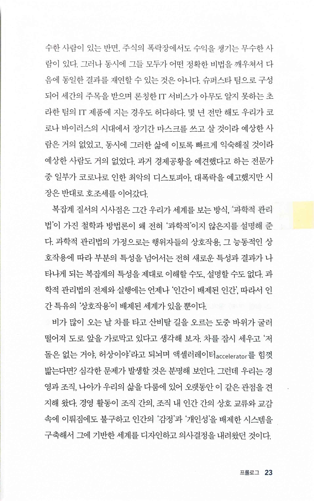

> 복잡계 질서의 시사점은 그간 우리가 세계를 보는 방식, '과학적 관리법'이 가진 철학과 방법론이 왜 전혀 '과학적'이지 않은지를 설명해 준다. 과학적 관리법의 가정으로는 행위자들의 상호작용, 그 능동적인 상호작용에 따라 부분의 특성을 넘어서는 전혀 새로운 특성과 결과가 나타나게 되는 복잡계의 특성을 제대로 이해할 수도, 설명할 수도 없다. 과학적 관리법의 전제와 실행에는 언제나 '인간이 배제된 인간', 따라서 인간특유의 상호작용'이 배제된 세계가 있을 뿐이다.

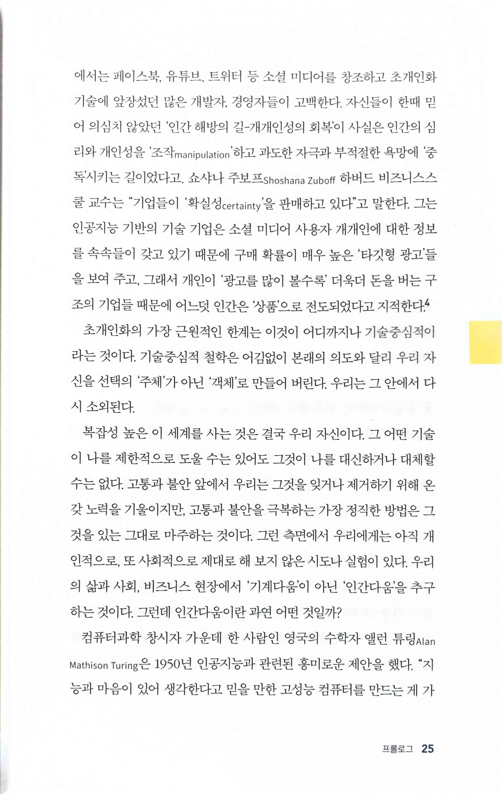

> 초개인화의 가장 근원적인 한계는 이것이 어디까지나 기술중심적이라는 것이다. 기술중심적 철학은 어김없이 본래의 의도와 달리 우리 자신을 선택의 '주체'가 아닌 '객체'로 만들어 버린다. 우리는 그 안에서 다시 소외된다.

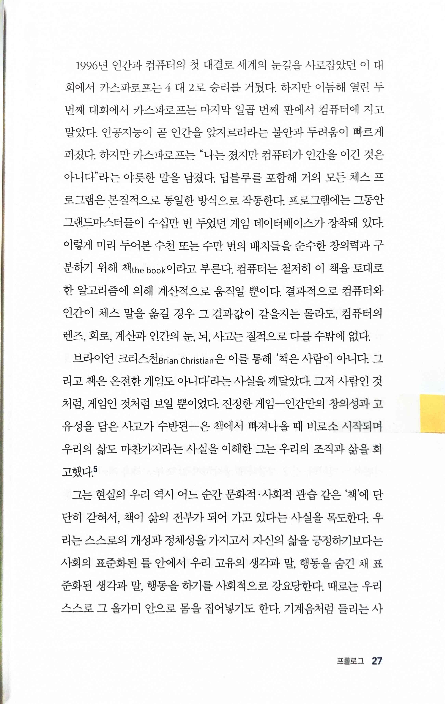

> 진정한 게임-인간만의 창의성과 고유성을 담은 사고가 수반된-은 책에서 빠져나올 때 비로소 시작되며 우리의 삶도 마찬가지

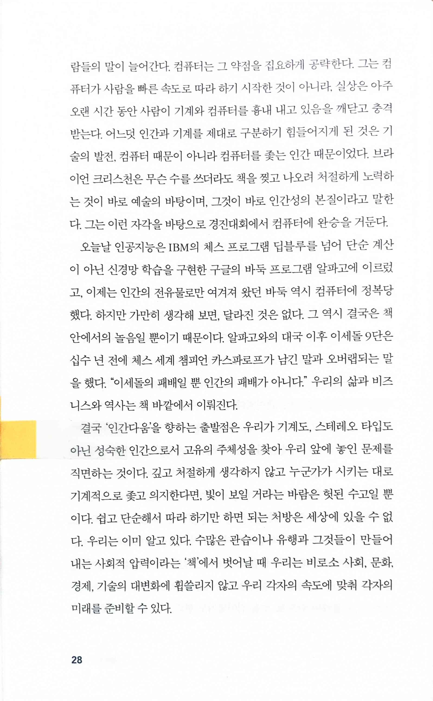

> 결국 '인간다움'을 향하는 출발점은 우리가 기계도, 스테레오 타입도 아닌 성숙한 인간으로서 고유의 주체성을 찾아 우리 앞에 놓인 문제를 직면하는 것이다.

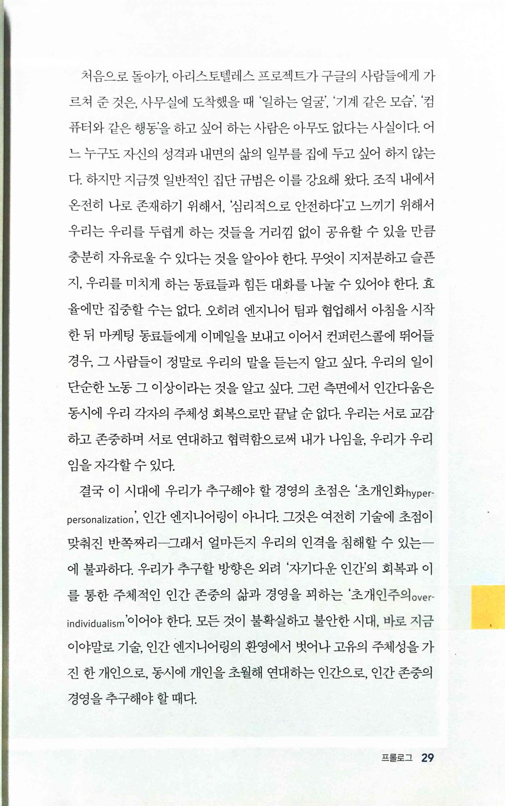

> 이 시대에 우리가 추구해야 할 경영의 초점은 '초개인화hyperpersonalization', 인간 엔지니어링이 아니다. 그것은 여전히 기술에 초점이 맞춰진 반쪽짜리-그래서 얼마든지 우리의 인격을 침해할 수 있는-에 불과하다. 우리가 추구할 방향은 외려 '자기다운 인간'의 회복과 이를 통한 주체적인 인간 존중의 삶과 경영을 꾀하는 '초개인주의 overindividualism'이어야 한다. 모든 것이 불확실하고 불안한 시대, 바로 지금이야말로 기술, 인간 엔지니어링의 환영에서 벗어나 고유의 주체성을 가진 한 개인으로, 동시에 개인을 초월해 연대하는 인간으로, 인간 존중의 경영을 추구해야 할 때다.

# 1부 복잡계: 세상의 새로운 질서를 이해하라

## 1장 게임의 룰이 바뀌었다. 단순계보다 복잡계
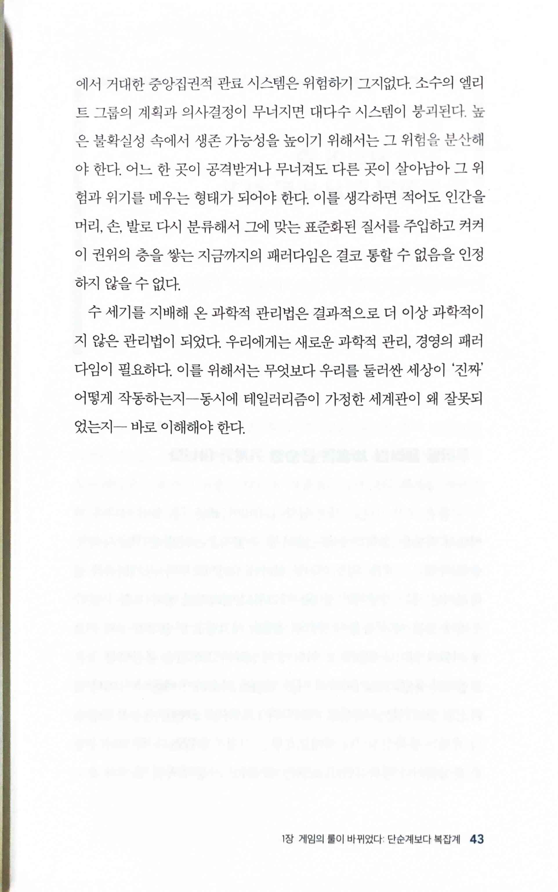

> 수 세기를 지배해 온 과학적 관리법은 결과적으로 더 이상 과학적이지 않은 관리법이 되었다. 우리에게는 새로운 과학적 관리, 경영의 패러다임이 필요하다. 이를 위해서는 무엇보다 우리를 둘러싼 세상이 '진짜' 어떻게 작동하는지-동시에 테일러리즘이 가정한 세계관이 왜 잘못되었는지-바로 이해해야 한다 .

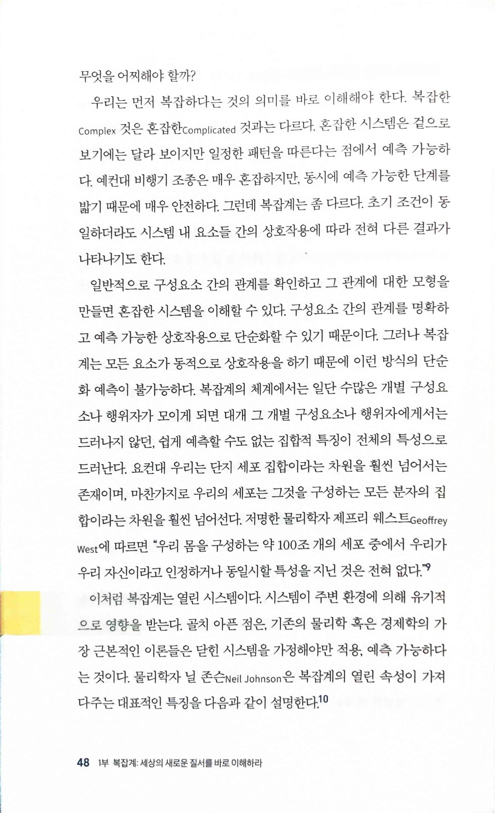 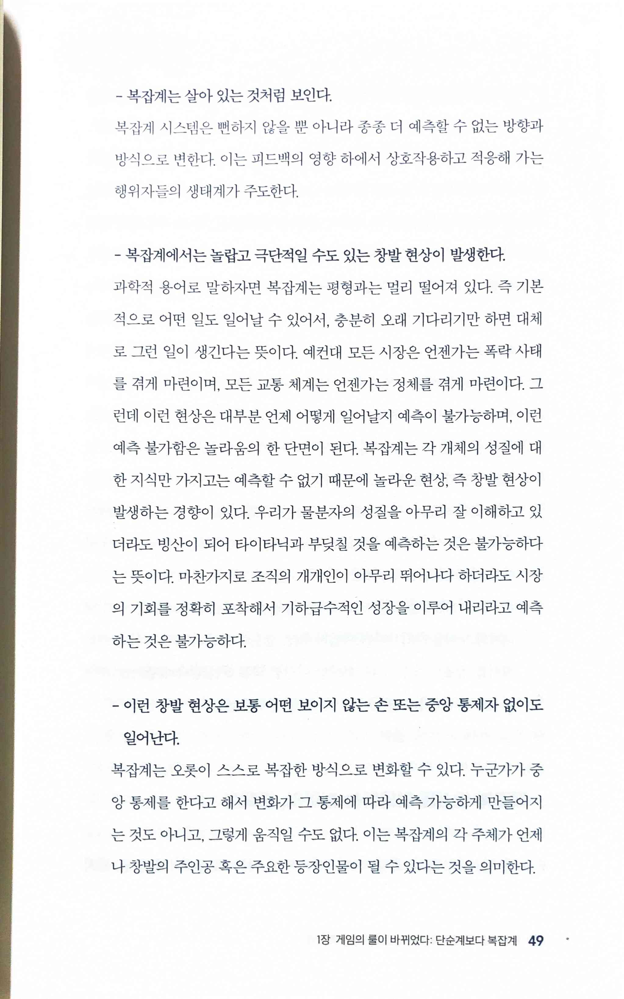 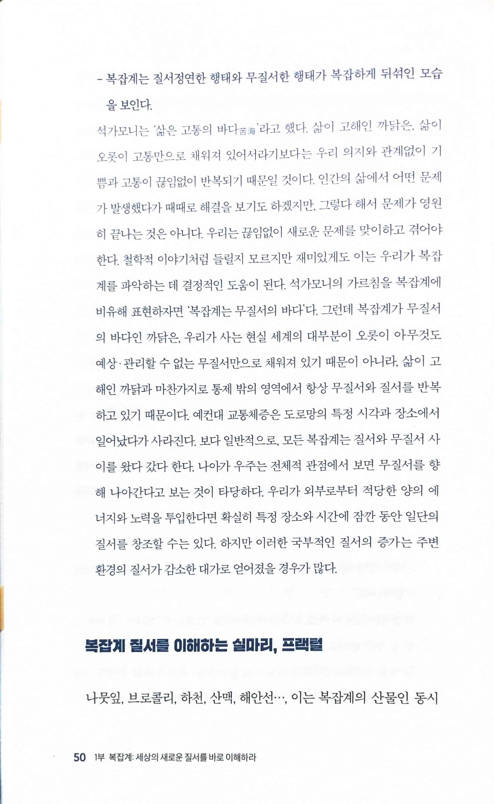

> 이처럼 복잡계는 열린 시스템이다. 시스템이 주변 환경에 의해 유기적으로 영향을 받는다. 골치 아픈 점은, 기존의 물리학 혹은 경제학의 가장 근본적인 이론들은 닫힌 시스템을 가정해야만 적용, 예측 가능하다는 것이다. 물리학자 닐 존슨Neil Johnson은 복잡계의 열린 속성이 가져다주는 대표적인 특징을 다음과 같이 설명한다.
>
> - 복잡계는 살아 있는 것처럼 보인다.
>
> - 복잡계에서는 놀랍고 극단적일 수도 있는 창발 현상이 발생한다.
>
> - 이런 창발 현상은 보통 어떤 보이지 않는 손 또는 중앙 통제자 없이도 일어난다.
>
> - 복잡계는 질서정연한 행태와 무질서한 행태가 복잡하게 뒤섞인 모습을 보인다.

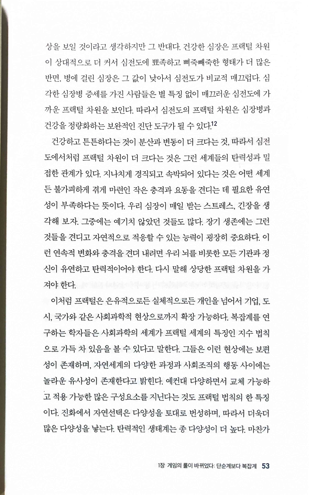

> 건강하고 튼튼하다는 것이 분산과 변동이 더 크다는 것... 지나치게 경직되고 속박되어 있다는 것은 어떤 세계든 불가피하게 겪게 마련인 작은 충격과 요동을 견디는 데 필요한 유연성이 부족하다는 뜻이다... 이런 연속적 변화와 충격을 견뎌 내려면 우리 뇌를 비롯한 모든 기관과 정신이 유연하고 탄력적이어야 한다. 다시 말해 상당한 프랙털 차원을 가져야 한다.
>
> 다양하면서 교체 가능하고 적용 가능한 많은 구성요소를 지닌다는 것도 프랙털 법칙의 한 특징

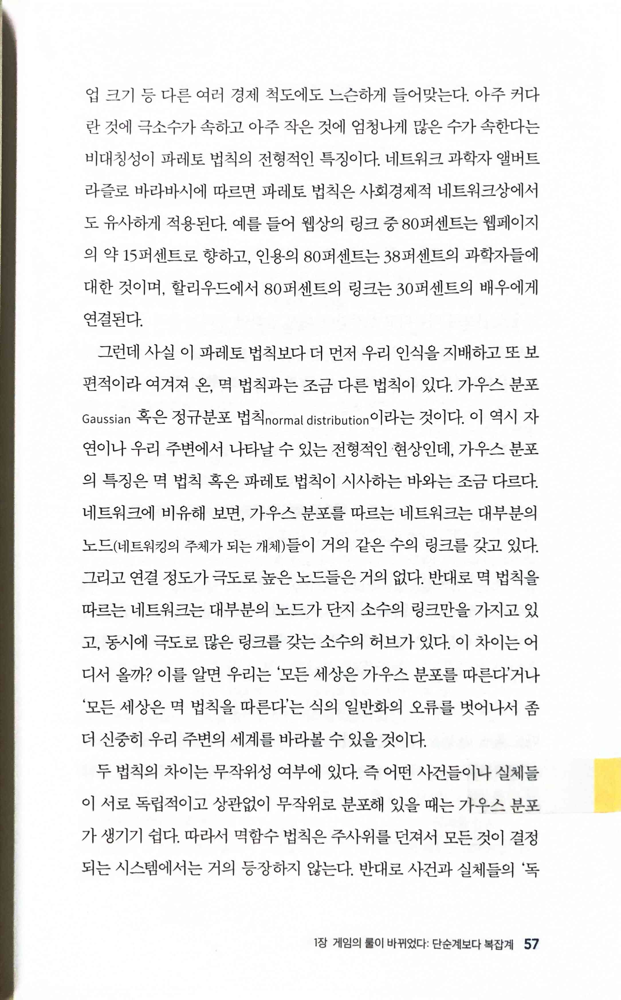

> 아주 커다란 것에 극소수가 속하고 아주 작은 것에 엄청나게 많은 수가 속한다는 비대칭성이 멱 법칙/파레토 법칙의 전형적인 특징
>
> 가우스 분포Gaussian 혹은 정규분포 법칙normal distribution을 따르는 네트워크는 대부분의 노드(네트워킹의 주체가 되는 개체)들이 거의 같은 수의 링크를 갖고 있다.그리고 연결 정도가 극도로 높은 노드들은 거의 없다.
>
> 두 법칙의 차이는 무작위성 여부에 있다. 즉 어떤 사건들이나 실체들이 서로 독립적이고 상관없이 무작위로 분포해 있을 때는 가우스 분포가 생기기 쉽다. 따라서 멱함수 법칙은 주사위를 던져서 모든 것이 결정되는 시스템에서는 거의 등장하지 않는다.

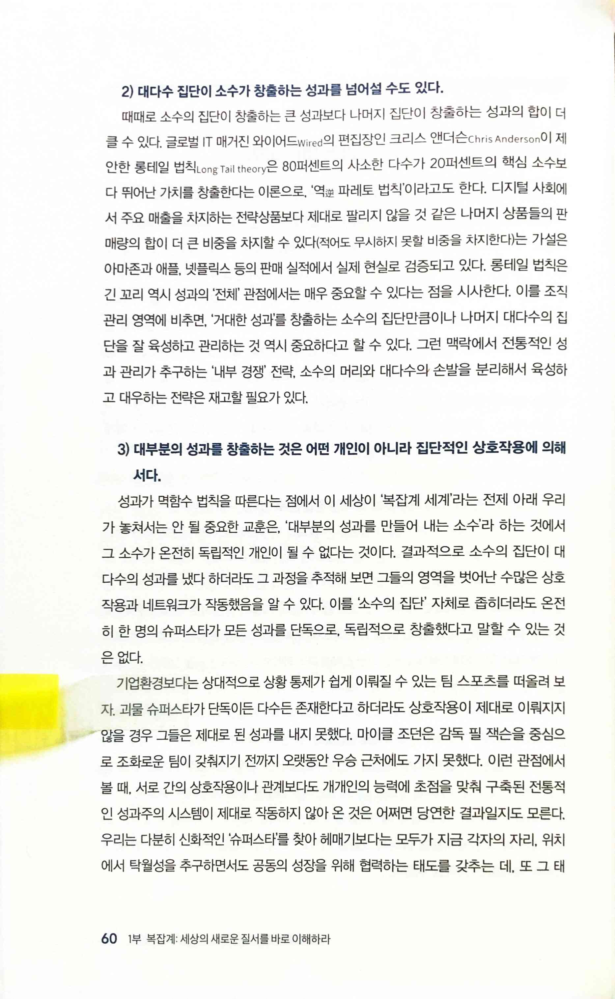 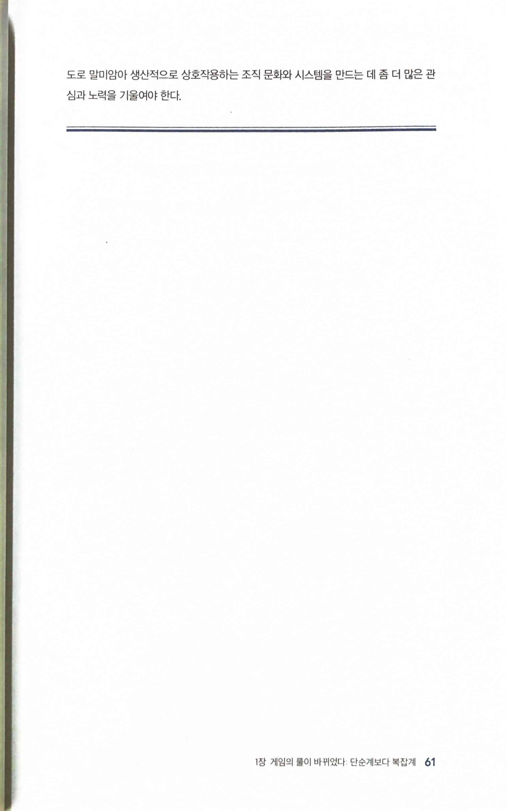

> 2) 대다수 집단이 소수가 창출하는 성과를 넘어설 수도 있다.
>
> 3) 대부분의 성과를 창출하는 것은 어떤 개인이 아니라 집단적인 상호작용에 의해서다.
>
> 기업환경보다는 상대적으로 상황 통제가 쉽게 이뤄질 수 있는 팀 스포츠를 떠올려 보자 괴물 슈퍼스타가 단독이든 다수든 존재한다고 하더라도 상호작용이 제대로 이뤄지지 않을 경우 그들은 제대로 된 성과를 내지 못했다... 이런 관점에서 볼 때, 서로 간의 상호작용이나 관계보다도 개개인의 능력에 초점을 맞춰 구축된 전통적인 성과주의 시스템이 제대로 작동하지 않아 온 것은 어쩌면 당연한 결과일지도 모른다.

## 2장 생존 게임의 룰: 새로운 질서가 요구하는 삶과 경영의 태도
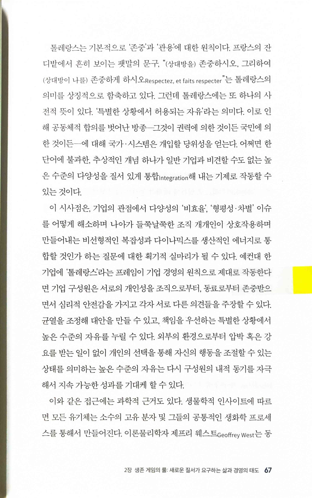

> 톨레랑스는 기본적으로 '존중'과 '관용'에 대한 원칙, '특별한 상황에서 허용되는 자유'라는 의미
>
> 한 기업에 '톨레랑스'라는 프레임이 기업 경영의 원칙으로 제대로 작동한다면 기업 구성원은 서로의 개인성을 조직으로부터, 동료로부터 존중받으면서 심리적 안전감을 가지고 각자 서로 다른 의견들을 주장할 수 있다.

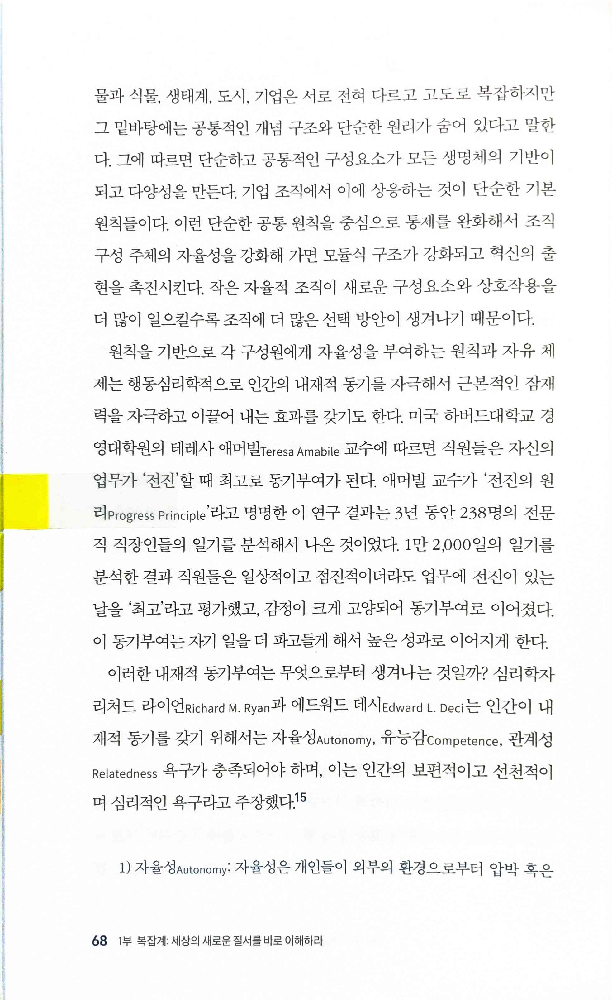

> 기업 조직에서 이에 상응하는 것이 단순한 기본원칙들이다. 이런 단순한 공통 원칙을 중심으로 통제를 완화해서 조직구성 주체의 자율성을 강화해 가면 모듈식 구조가 강화되고 혁신의 출현을 촉진시킨다. 작은 자율적 조직이 새로운 구성요소와 상호작용을 더 많이 일으킬수록 조직에 더 많은 선택 방안이 생겨나기 때문이다.
>
> 미국 하버드대학교 경영대학원의 테레사 애머빌Teresa Amabile 교수에 따르면 직원들은 자신의 업무가 '전진'할 때 최고로 동기부여가 된다. 애머빌 교수가 '전진의 원리 Progress Principle'라고 명명한 이 연구 결과는 3년 동안 238명의 전문직 직장인들의 일기를 분석해서 나온 것이었다. 1만 2,000일의 일기를 분석한 결과 직원들은 일상적이고 점진적이더라도 업무에 전진이 있는 날을 '최고'라고 평가했고, 감정이 크게 고양되어 동기부여로 이어졌다. 이 동기부여는 자기 일을 더 파고들게 해서 높은 성과로 이어지게 한다.
>
> 심리학자 리처드 라이언Richard M. Ryan과 에드워드 데시Edward L. Deci는 인간이 내재적 동기를 갖기 위해서는 자율성Autonomy, 유능감competence, 관계성Relatedness 욕구가 충족되어야 하며, 이는 인간의 보편적이고 선천적이며 심리적인 욕구라고 주장했다.

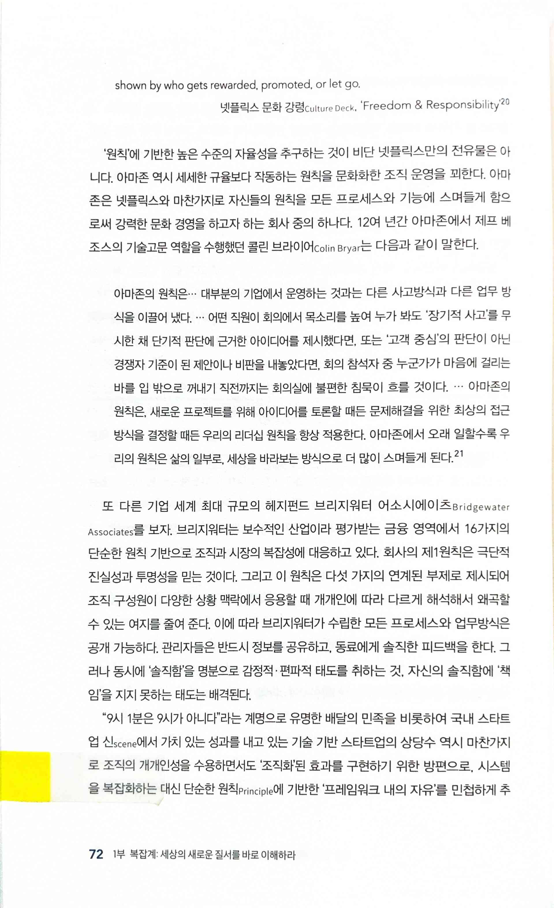

> 조직의 개개인성을 수용하면서도 '조직화'된 효과를 구현하기 위한 방편으로, 시스템을 복잡화하는 대신 단순한 원칙Principle에 기반한 '프레임워크 내의 자유'를 민첩하게 추구

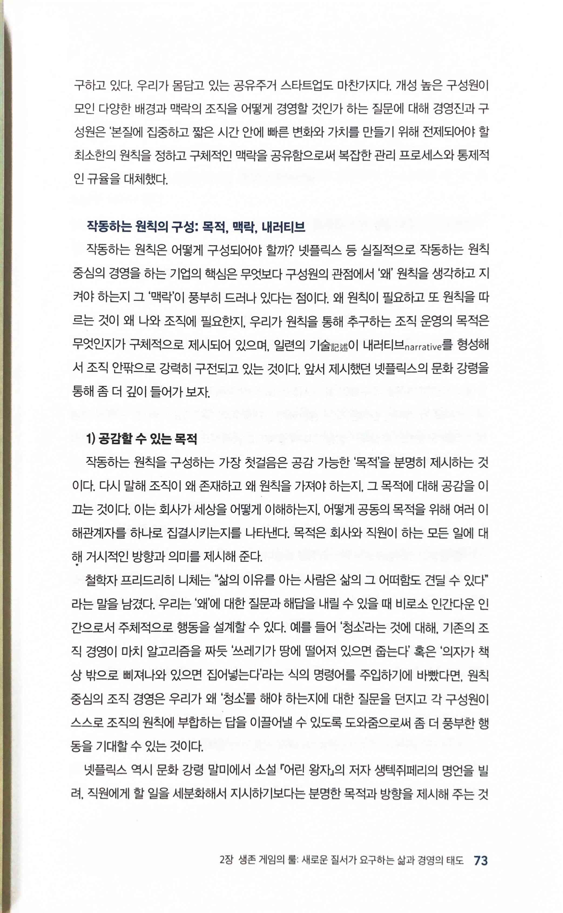

> 개성 높은 구성원이 모인 다양한 배경과 맥락의 조직을 어떻게 경영할 것인가 하는 질문에 대해 경영진과 구성원은 '본질에 집중하고 짧은 시간 안에 빠른 변화와 가치를 만들기 위해 전제되어야 할 최소한의 원칙을 정하고 구체적인 맥락을 공유'함으로써 복잡한 관리 프로세스와 통제적인 규율을 대체했다.
>
> 작동하는 원칙을 구성하는 가장 첫 걸음은 공감 가능한 '목적'을 분명히 제시하는 것
>
> 철학자 프리드리히 니체 "삶의 이유를 아는 사람은 삶의 그 어떠함도 견딜 수 있다"

> 넷플릭스는 조직 규모가 커질수록 원칙과 이를 기반한 자율성 강화가 '왜' 더 중요하게 되는지에 대한 맥락도 전달한다... 넷플릭스가 가지는 원칙은 모든 상황에서 그대로 따라 하면 되는 세세한 규칙의 개념이 아니라 모호하고 추상적인 상황에서 자율적이고 능동적으로 행동하기 위한 최소한의 목적 나침반을 제공하는 것에 가깝다.

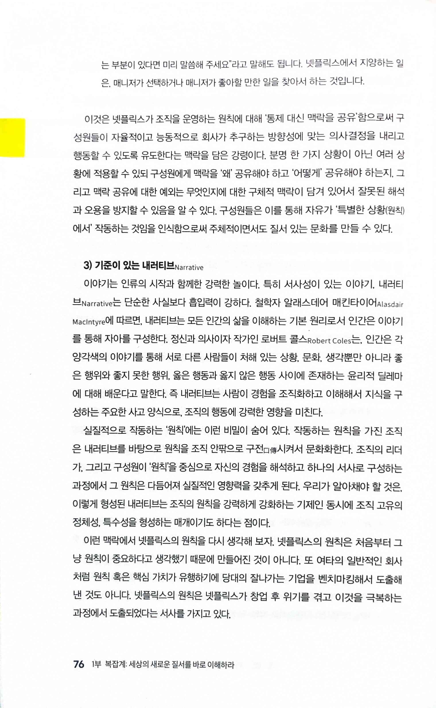

> 넷플릭스가 조직을 운영하는 원칙에 대해 통제 대신 맥락을 공유함으로써 구성원들이 자율적이고 능동적으로 회사가 추구하는 방향성에 맞는 의사결정을 내리고 행동할 수 있도록 유도한다

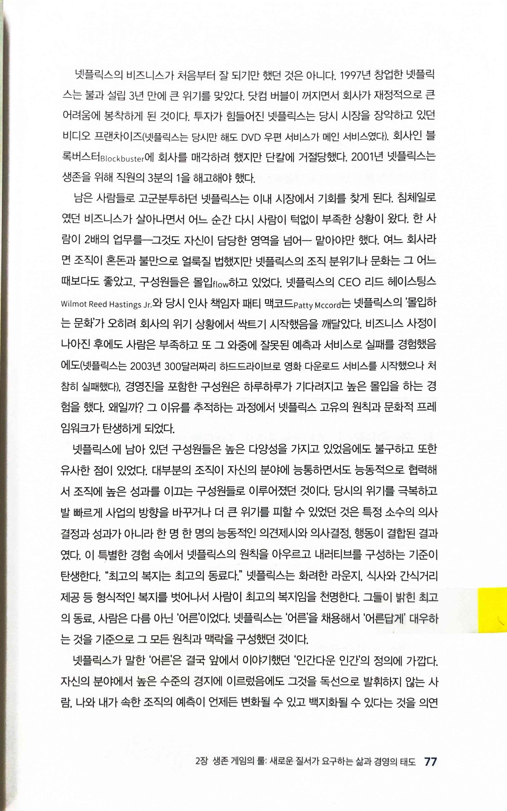

> 그들이 밝힌 최고의 동료, 사람은 다름 아닌 '어른'이었다. 넷플릭스는 '어른'을 채용해서 '어른답게' 대우하는 것을 기준으로 그 모든 원칙과 맥락을 구성했던 것이다.

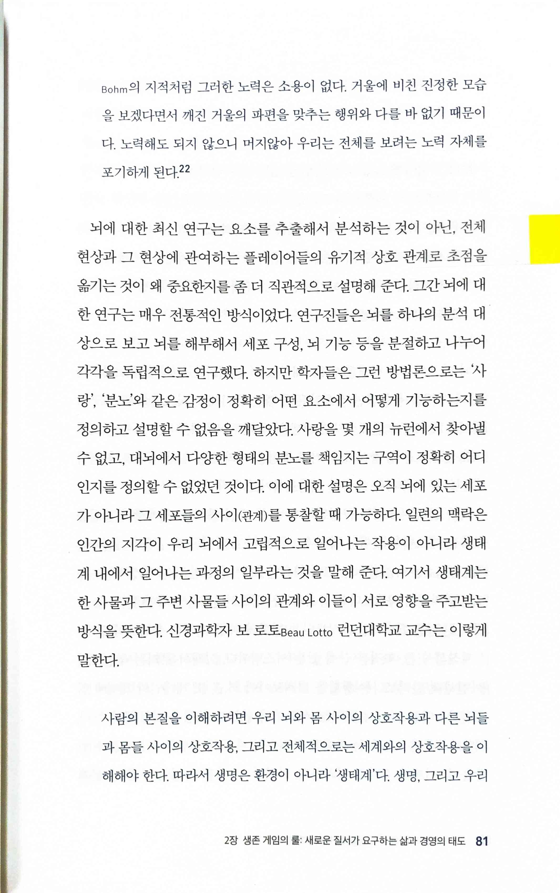

> 뇌에 대한 최신 연구는 요소를 추출해서 분석하는 것이 아닌, 전체현상과 그 현상에 관여하는 플레이어들의 유기적 상호 관계로 초점을 옮기는 것이 왜 중요한지를 좀 더 직관적으로 설명해 준다... 인간의 지각이 우리 뇌에서 고립적으로 일어나는 작용이 아니라 생태계 내에서 일어나는 과정의 일부라는 것을 말해 준다. 여기서 생태계는 한 사물과 그 주변 사물들 사이의 관계와 이들이 서로 영향을 주고받는 방식을 뜻한다.

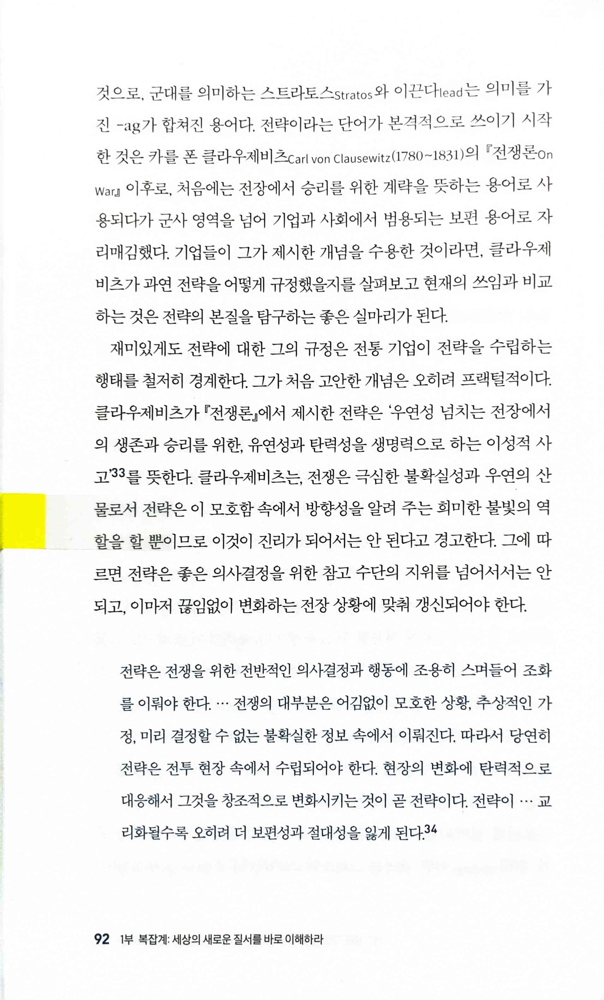

> 클라우제비츠가 『전쟁론』에서 제시한 전략은 '우연성 넘치는 전장에서의 생존과 승리를 위한, 유연성과 탄력성을 생명력으로 하는 이성적 사고'를 뜻한다. 클라우제비츠는 전쟁은 극심한 불확실성과 우연의 산물로서 전략은 이 모호함 속에서 방향성을 알려 주는 희미한 불빛의 역할을 할 뿐이므로 이것이 진리가 되어서는 안 된다고 경고한다. 그에 따르면 전략은 좋은 의사결정을 위한 참고 수단의 지위를 넘어서서는 안되고, 이마저 끊임없이 변화하는 전장 상황에 맞춰 갱신되어야 한다.

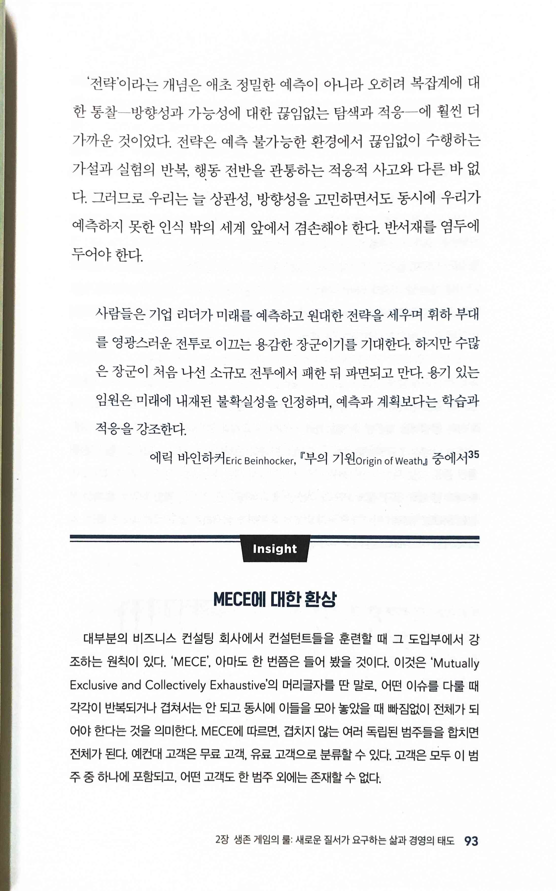

> '전략'이라는 개념은 애초 정밀한 예측이 아니라 오히려 복잡계에 대한 통찰 방향성과 가능성에 대한 끊임없는 탐색과 적응에 훨씬 더 가까운 것이었다. 전략은 예측 불가능한 환경에서 끊임없이 수행하는 가설과 실험의 반복, 행동 전반을 관통하는 적응적 사고와 다른 바 없다. 그러므로 우리는 늘 상관성, 방향성을 고민하면서도 동시에 우리가 예측하지 못한 인식 밖의 세계 앞에서 겸손해야 한다.

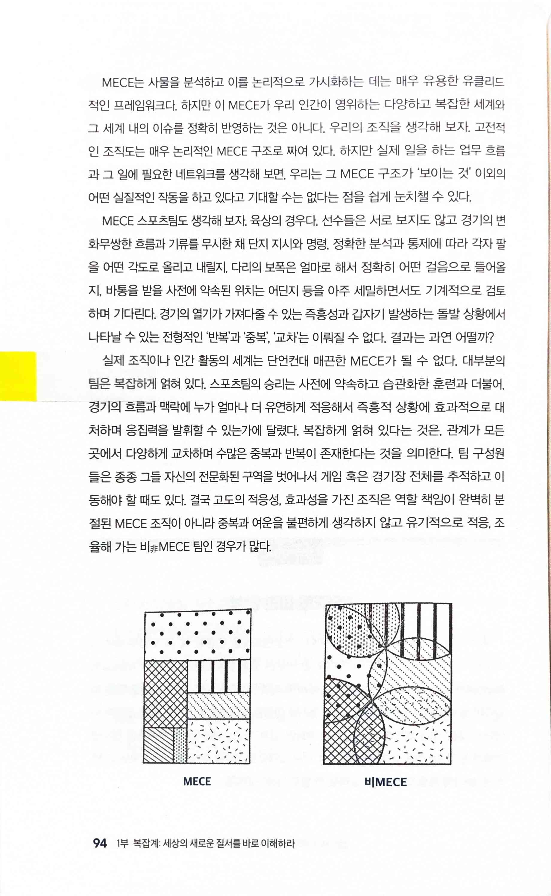

> MECE Mutually Exclusive and Collectively Exhaustive
>
> MECE는 사물을 분석하고 이를 논리적으로 가시화하는 데는 매우 유용한 유클리드적인 프레임워크다.
>
> 실제 조직이나 인간 활동의 세계는 단언컨대 매끈한 MECE가 될 수 없다.
* 정말 맘에 드는 부분. 그래서 스포츠팀의 경우 여러가지 상황을 미리 가정하고 반복 연습을 통해 선수들간의 연결에 문제가 없도록 비시즌에 준비한다. 그럼에도 불구하고 실전에서는 예측하지 못하는 상황이 나오는데 이럴 때 대처하는 방식에 따라 강팀과 약팀이 나뉘는데, 만약 이런 부분을 연결, 본문에서 중복과 반복,을 신경쓰지 않는다면 절대 좋은 팀이 될 수 없다

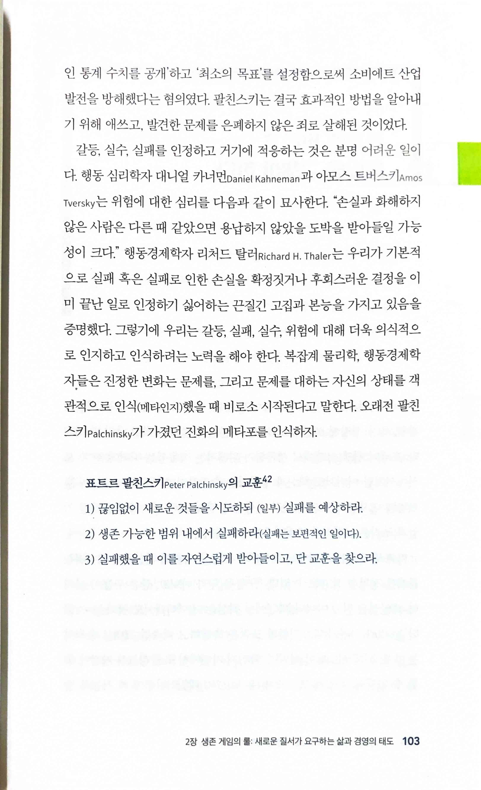

> 갈등, 실수, 실패를 인정하고 거기에 적응하는 것은 분명 어려운 일이다. 행동 심리학자 대니얼 카너먼Daniel Kahneman과 아모스 트버스키Amos Tversky는 위험에 대한 심리를 다음과 같이 묘사한다. "손실과 화해하지 않은 사람은 다른 때 같았으면 용납하지 않았을 도박을 받아들일 가능성이 크다." 행동경제학자 리처드 탈러 Richard H. Thaler 는 우리가 기본적으로 실패 혹은 실패로 인한 손실을 확정짓거나 후회스러운 결정을 이미 끝난 일로 인정하기 싫어하는 끈질긴 고집과 본능을 가지고 있음을 증명했다. 그렇기에 우리는 갈등, 실패, 실수, 위험에 대해 더욱 의식적으로 인지하고 인식하려는 노력을 해야 한다. 복잡계 물리학, 행동경제학자들은 진정한 변화는 문제를, 그리고 문제를 대하는 자신의 상태를 객관적으로 인식(메타인지)했을 때 비로소 시작된다고 말한다.
>
> 표트르 팔친스키Peter Palchinsky의 교훈
>
> 1) 끊임없이 새로운 것들을 시도하되 (일부) 실패를 예상하라
>
> 2) 생존 가능한 범위 내에서 실패하라(실패는 보편적인 일이다).
>
> 3) 실패했을 때 이를 자연스럽게 받아들이고, 다른 교훈을 찾으라

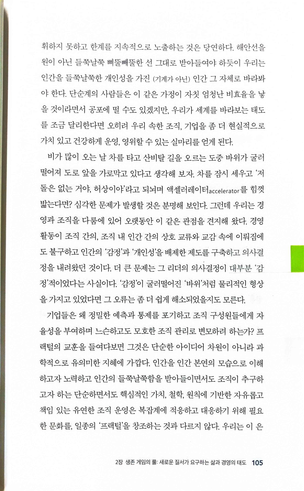

> 경영활동이 조직 간의 조직 내 인간 간의 상호 교류와 교감 속에 이뤄짐에도 불구하고 인간의 '감정'과 '개인성'을 배제한 제도를 구축하고 의사결정을 내려왔던 것이다. 더 큰 문제는 그 리더의 의사결정이 대부분 '감정적'이었다는 사실이다. 

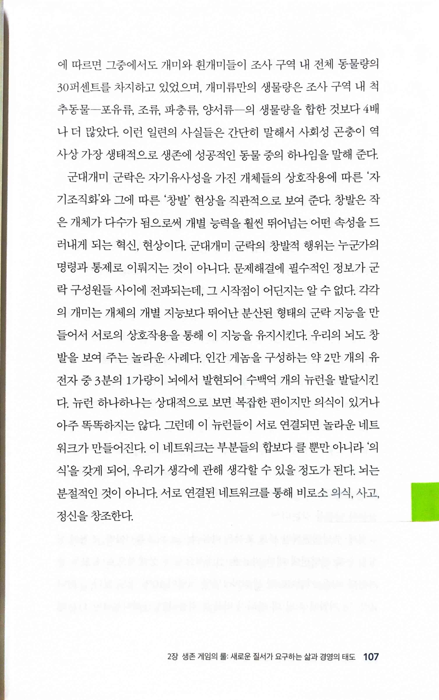

> 창발은 작은 개체가 다수가 됨으로써 개별 능력을 훨씬 뛰어넘는 어떤 속성을 드러내게 되는 혁신, 현상이다...뇌는 서로 연결된 네트워크를 통해 비로소 의식, 사고, 정신을 창조한다.

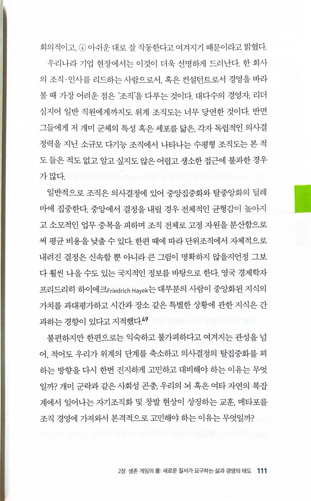

> 일반적으로 조직은 의사결정에 있어 중앙집중화와 탈중앙화의 딜레마에 집중한다. 중앙에서 결정을 내릴 경우 전체적인 균형감이 높아지고 소모적인 업무 중복을 피하며 조직 전체로 고정 자원을 분산함으로써 평균 비용을 낮출 수 있다. 한편 때에 따라 단위조직에서 자체적으로내려진 결정은 신속할 뿐 아니라 큰 그림이 명확하지 않을지언정 그보다 훨씬 나을 수도 있는 국지적인 정보를 바탕으로 한다. 영국 경제학자프리드리히 하이에크Friedrich Hayek 는 대부분의 사람이 중앙화된 지식의 가치를 과대평가하고 시간과 장소 같은 특별한 상황에 관한 지식은 간과하는 경향이 있다고 지적했다.
* [장재군 군명유소불수(將在軍 君命有所不受)](https://blog.naver.com/mgblsori/221202159287) '전쟁터의 장수는 (경우에 따라) 임금의 명령도 듣지 않을 수 있다'와도 연결되는 말 아닐까?

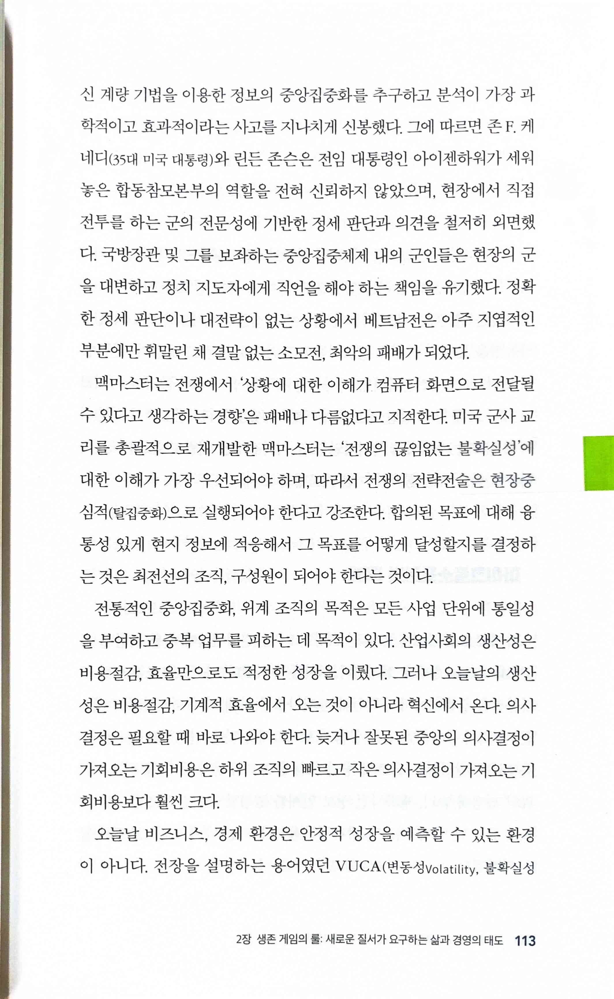

> 맥마스터는 전쟁에서 '상황에 대한 이해가 컴퓨터 화면으로 전달될 수 있다고 생각하는 경향'은 패배나 다름없다고 지적한다. 미국 군사 교리를 총괄적으로 재개발한 맥마스터는 '전쟁의 끊임없는 불확실성'에 대한 이해가 가장 우선되어야 하며, 따라서 전쟁의 전략전술은 현장중심적(탈집중화)으로 실행되어야 한다고 강조한다. 합의된 목표에 대해 융통성 있게 현지 정보에 적응해서 그 목표를 어떻게 달성할지를 결정하는 것은 최전선의 조직, 구성원이 되어야 한다는 것이다.
>
> 전통적인 중앙집중화, 위계 조직의 목적은 모든 사업 단위에 통일성을 부여하고 중복 업무를 피하는 데 목적이 있다. 산업사회의 생산성은 비용절감 효율만으로도 적정한 성장을 이뤘다. 그러나 오늘날의 생산성은 비용절감, 기계적 효율에서 오는 것이 아니라 혁신에서 온다. 의사결정은 필요할 때 바로 나와야 한다. 늦거나 잘못된 중앙의 의사결정이 가져오는 기회비용은 하위 조직의 빠르고 작은 의사결정이 가져오는 기회비용보다 훨씬 크다.

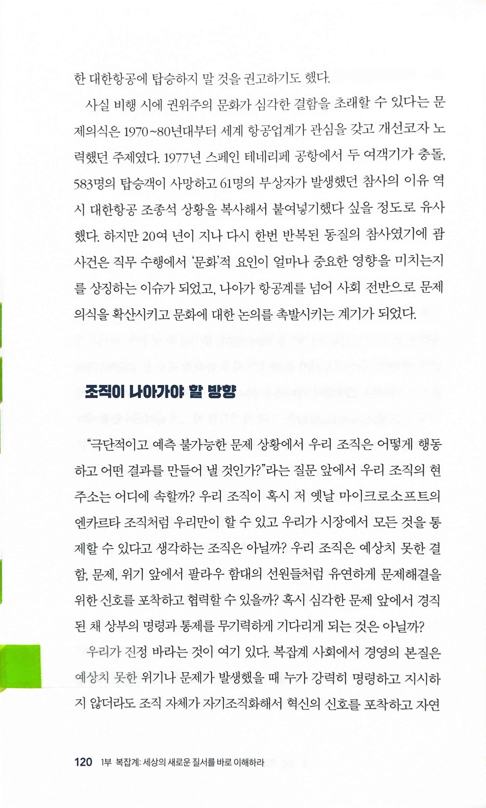 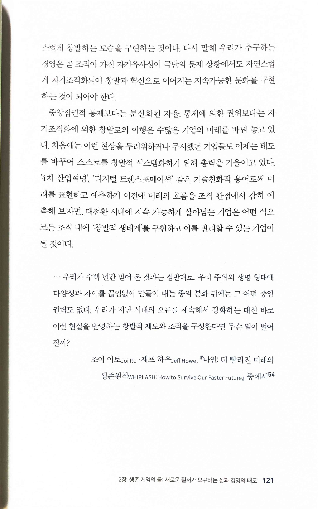

> 복잡계 사회에서 경영의 본질은 예상치 못한 위기나 문제가 발생했을 때 누가 강력히 명령하고 지시하지 않더라도 조직 자체가 자기조직화해서 혁신의 신호를 포착하고 자연스럽게 창발하는 모습을 구현하는 것이다. 다시 말해 우리가 추구하는 경영은 곧 조직이 가진 자기유사성이 극단의 문제 상황에서도 자연스럽게 자기조직화되어 창발과 혁신으로 이어지는 지속가능한 문화를 구현하는 것이 되어야 한다.

## 3장 도시에서 배우는 기업의 생존 전략
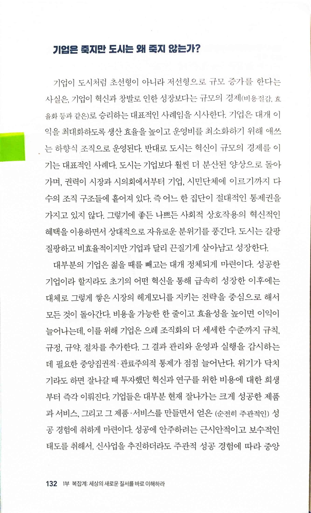

> 기업은 대개 이익을 최대화하도록 생산 효율을 높이고 운영비를 최소화하기 위해 애쓰는 하향식 조직으로 운영된다. 반대로 도시는 혁신이 규모의 경제를 이기는 대표적인 사례다.

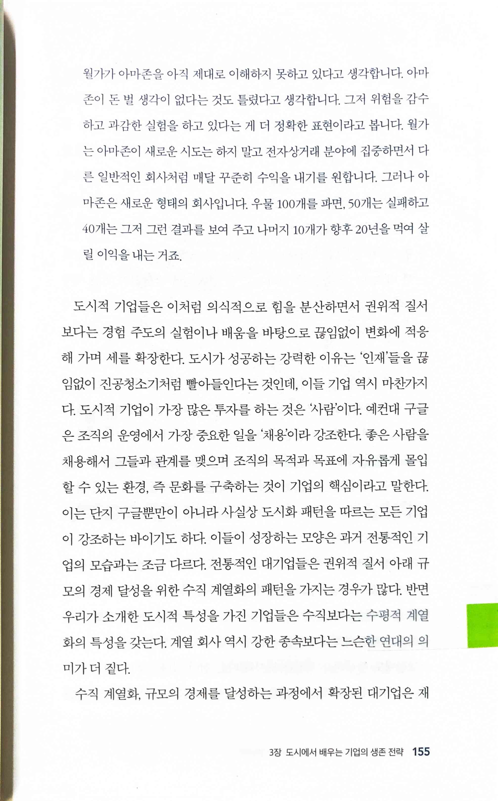

> 도시적 특성을 가진 기업들은 수직보다는 수평적 계열화의 특성을 갖는다. 계열 회사 역시 강한 종속보다는 느슨한 연대의 의미가 더 짙다.

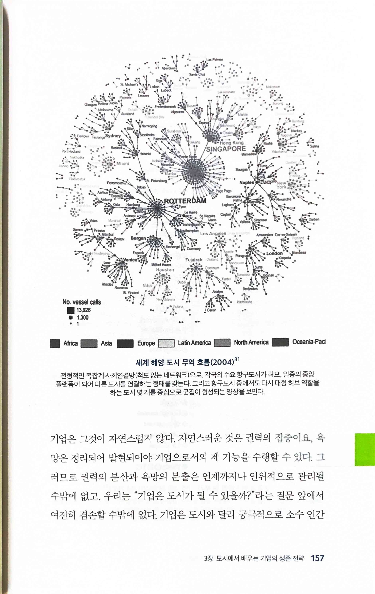

> 자연스러운 것은 권력의 집중이요, 욕망은 정리되어 발현되어야 기업으로서의 제 기능을 수행할 수 있다. 그러므로 권력의 분산과 욕망의 분출은 언제까지나 인위적으로 관리될 수밖에 없고, 우리는 "기업은 도시가 될 수 있을까?"라는 질문 앞에서 여전히 겸손할 수밖에 없다.

# 2부 초개인주의: 생존의 핵심은 기술보다 인간이다

## 1장 왜 초개인인가: 가장 자기다운 인간으로서의 초개인
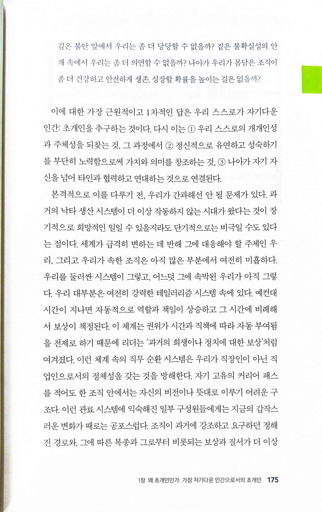

> 깊은 불안 앞에서 우리는 좀 더 당당할 수 없을까? 짙은 불확실성의 안개 속에서 우리는 좀 더 의연할 수 없을까? 나아가 우리가 몸담은 조직이 좀 더 건강하고 안전하게 생존 성장할 확률을 높이는 길은 없을까?
>
> 이에 대한 가장 근원적이고 1차적인 답은 우리 스스로가 자기다운 인간: 초개인을 추구하는 것이다. 다시 이는 ① 우리 스스로의 개개인성과 주체성을 되찾는 것, 그 과정에서 ② 정신적으로 유연하고 성숙하기를 부단히 노력함으로써 가치와 의미를 창조하는 것 ③ 나아가 자기 자신을 넘어 타인과 협력하고 연대하는 것으로 연결된다.
 
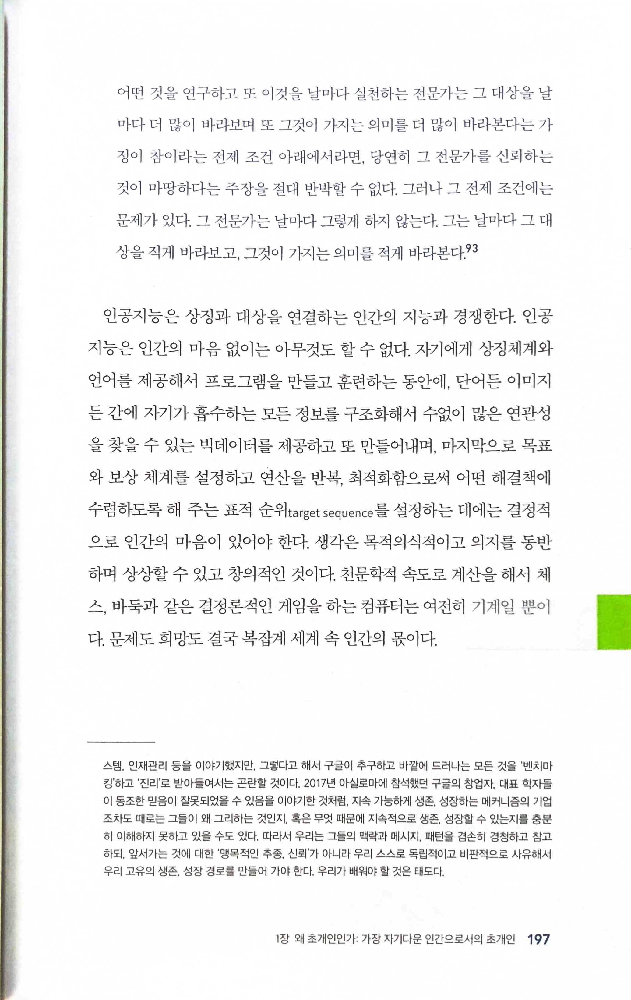

> 인공지능은 상징과 대상을 연결하는 인간의 지능과 경쟁한다. 인공지능은 인간의 마음 없이는 아무것도 할 수 없다... 생각은 목적의식적이고 의지를 동반하며 상상할 수 있고 창의적인 것이다. 천문학적 속도로 계산을 해서 체스, 바둑과 같은 결정론적인 게임을 하는 컴퓨터는 여전히 기계일 뿐이다. 문제도 희망도 결국 복잡계 세계 속 인간의 몫이다.

## 2장 가장 자기다운 인간, '초개인'의 정체성을 되찾아라
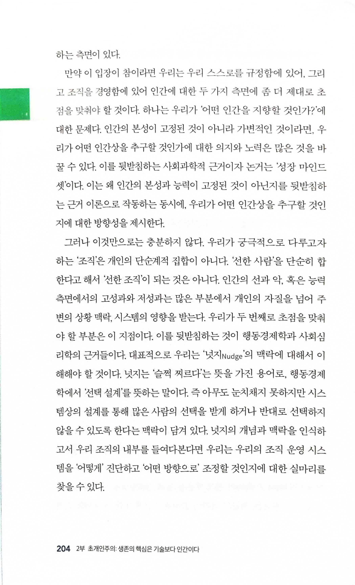

> 우리는 우리 스스로를 규정함에 있어, 그리고 조직을 경영함에 있어 인간에 대한 두 가지 측면에 좀 더 제대로 초점을 맞춰야 할 것이다. 하나는 우리가 어떤 인간을 지향할 것인가?'에 대한 문제다.
>
> 인간의 선과 악, 혹은 능력 측면에서의 고성과와 저성과는 많은 부분에서 개인의 자질을 넘어 주변의 상황 맥락, 시스템의 영향을 받는다. 우리가 두 번째로 초점을 맞춰야 할 부분은 이 지점이다. 이를 뒷받침하는 것이 행동경제학과 사회심리학의 근거들이다. 대표적으로 우리는 '넛지Nudge'의 맥락에 대해서 이해해야 할 것이다. 넛지는 '슬쩍 찌르다'는 뜻을 가진 용어로, 행동경제학에서 '선택 설계'를 뜻하는 말이다. 즉 아무도 눈치채지 못하지만 시스템상의 설계를 통해 많은 사람의 선택을 받게 하거나 반대로 선택하지 않을 수 있도록 한다는 맥락이 담겨 있다.
 
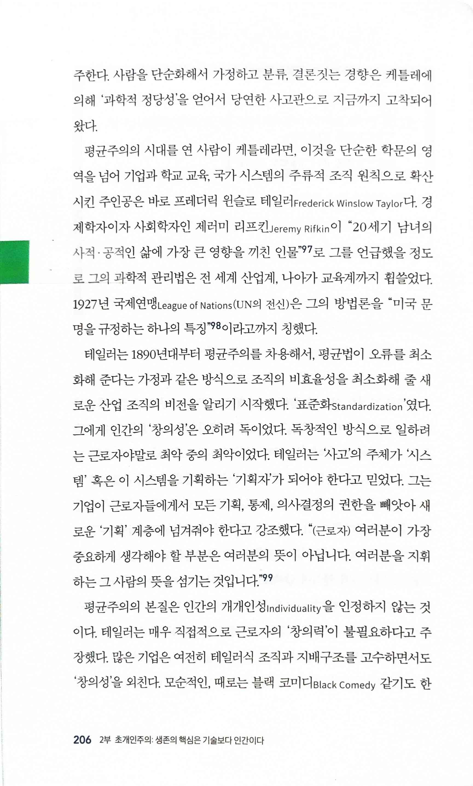

> 사람을 단순화해서 가정하고 분류, 결론짓는 경향은 케틀레에 의해 '과학적 정당성'을 얻어서 당연한 사고관으로 지금까지 고착되어왔다.
>
> 평균주의의 시대를 연 사람이 케틀레라면, 이것을 단순한 학문의 영역을 넘어 기업과 학교 교육, 국가 시스템의 주류적 조직 원칙으로 확산시킨 주인공은 바로 프레더릭 윈슬로 테일러Frederick Winslow Taylor다. 경제학자이자 사회학자인 제러미 리프킨Jeremy Rifkin 이 "20세기 남녀의 사적 공적인 삶에 가장 큰 영향을 끼친 인물로 그를 언급했을 정도로 그의 과학적 관리법은 전 세계 산업계, 나아가 교육계까지 휩쓸었다. 1927년 국제연맹League of Nations(UN의 전신)은 그의 방법론을 “미국 문명을 규정하는 하나의 특징이라고까지 칭했다.
>
> 테일러는 1890년대부터 평균주의를 차용해서, 평균법이 오류를 최소화해 준다는 가정과 같은 방식으로 조직의 비효율성을 최소화해 줄 새로운 산업 조직의 비전을 알리기 시작했다. '표준화Standardization'였다.
>
> 평균주의의 본질은 인간의 개개인성 Individuality 을 인정하지 않는 것이다.

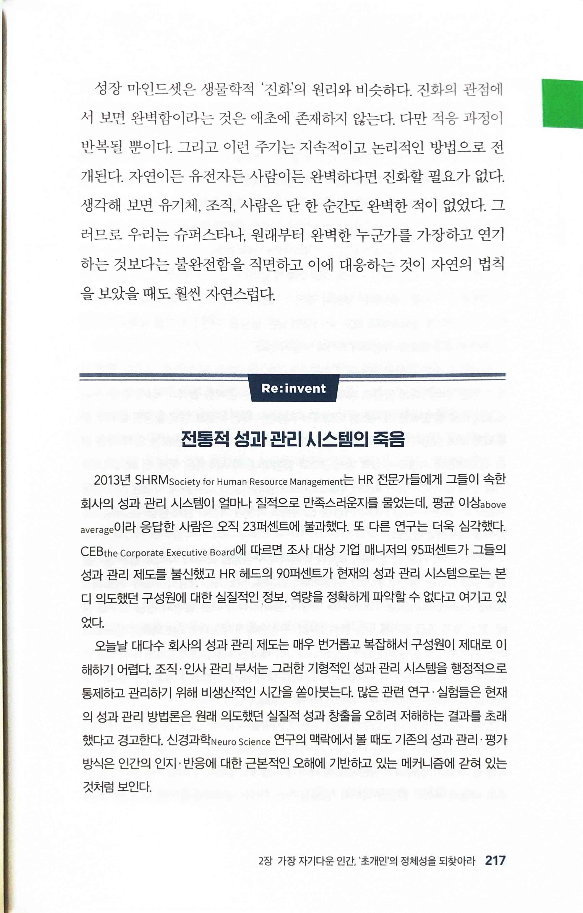

> 성장 마인드셋은 생물학적 '진화'의 원리와 비슷하다. 진화의 관점에서 보면 완벽함이라는 것은 애초에 존재하지 않는다. 다만 적응 과정이 반복될 뿐이다. 그리고 이런 주기는 지속적이고 논리적인 방법으로 전개된다. 자연이든 유전자든 사람이든 완벽하다면 진화할 필요가 없다. 생각해 보면 유기체, 조직, 사람은 단 한 순간도 완벽한 적이 없었다. 그러므로 우리는 슈퍼스타나, 원래부터 완벽한 누군가를 가장하고 연기하는 것보다는 불완전함을 직면하고 이에 대응하는 것이 자연의 법칙을 보았을 때도 훨씬 자연스럽다.

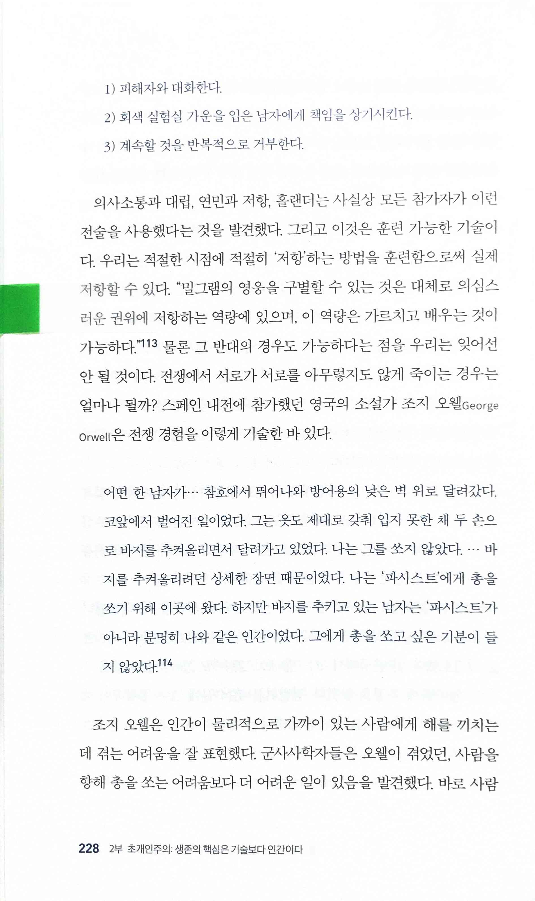

> 우리는 적절한 시점에 적절히 저항하는 방법을 훈련함으로써 실제 저항할 수 있다. "밀그램의 영웅을 구별할 수 있는 것은 대체로 의심스러운 권위에 저항하는 역량에 있으며, 이 역량은 가르치고 배우는 것이 가능하다." 물론 그 반대의 경우도 가능하다는 점을 우리는 잊어선 안 될 것이다.

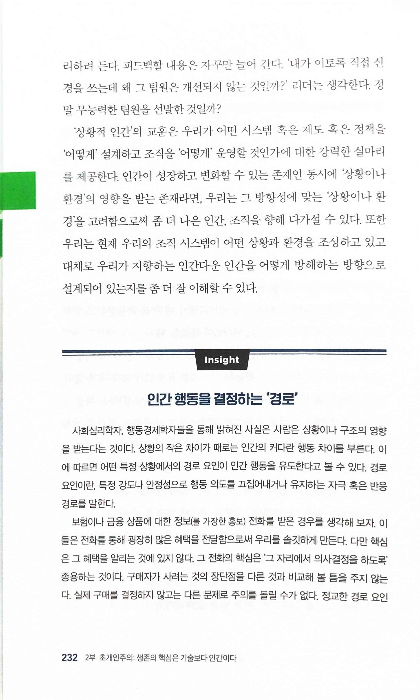

> '상황적 인간'의 교훈은 우리가 어떤 시스템 혹은 제도 혹은 정책을 '어떻게' 설계하고 조직을 '어떻게' 운영할 것인가에 대한 강력한 실마리를 제공한다. 인간이 성장하고 변화할 수 있는 존재인 동시에 '상황이나 환경'의 영향을 받는 존재라면, 우리는 그 방향성에 맞는 '상황이나 환경'을 고려함으로써 좀 더 나은 인간, 조직을 향해 다가설 수 있다. 또한 우리는 현재 우리의 조직 시스템이 어떤 상황과 환경을 조성하고 있고 대체로 우리가 지향하는 인간다운 인간을 어떻게 방해하는 방향으로 설계되어 있는지를 좀 더 잘 이해할 수 있다.

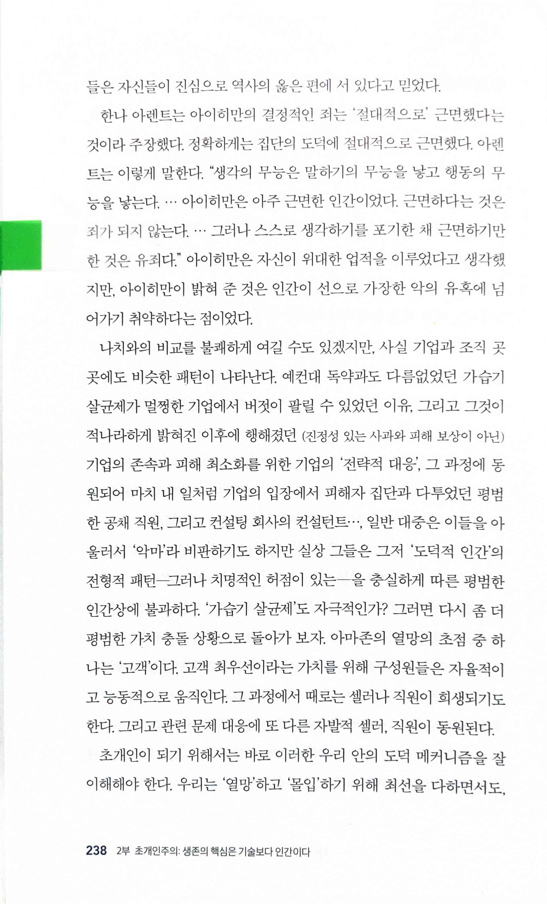

> 한나 아렌트는 아이히만의 결정적인 죄는 '절대적으로' 근면했다는 것이라 주장했다. 정확하게는 집단의 도덕에 절대적으로 근면했다. 아렌트는 이렇게 말한다. "생각의 무능은 말하기의 무능을 낳고 행동의 무능을 낳는다. ・・・ 아이히만은 아주 근면한 인간이었다. 근면하다는 것은 죄가 되지 않는다. . 그러나 스스로 생각하기를 포기한 채 근면하기만 한 것은 유죄다" 아이히만은 자신이 위대한 업적을 이루었다고 생각했지만, 아이히만이 밝혀 준 것은 인간이 선으로 가장한 악의 유혹에 넘어가기 취약하다는 점이었다.

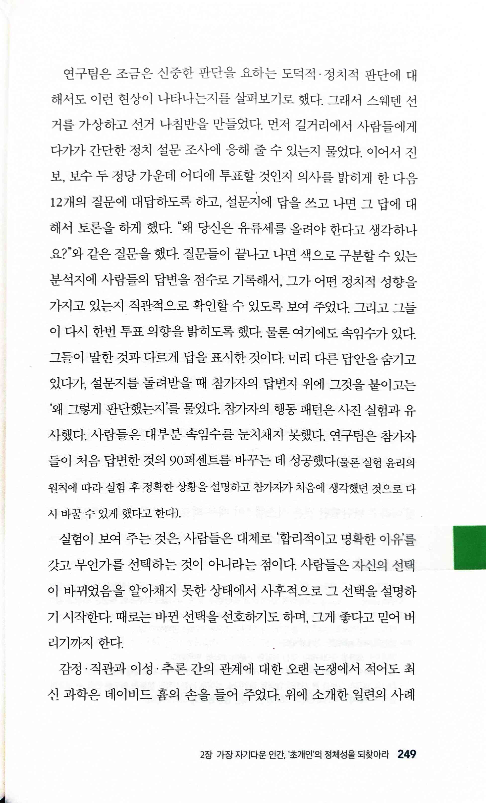

> 실험이 보여 주는 것은, 사람들은 대체로 '합리적이고 명확한 이유'를 갖고 무언가를 선택하는 것이 아니라는 점이다. 사람들은 자신의 선택이 바뀌었음을 알아채지 못한 상태에서 사후적으로 그 선택을 설명하기 시작한다. 때로는 바뀐 선택을 선호하기도 하며, 그게 좋다고 믿어 버리기까지 한다.

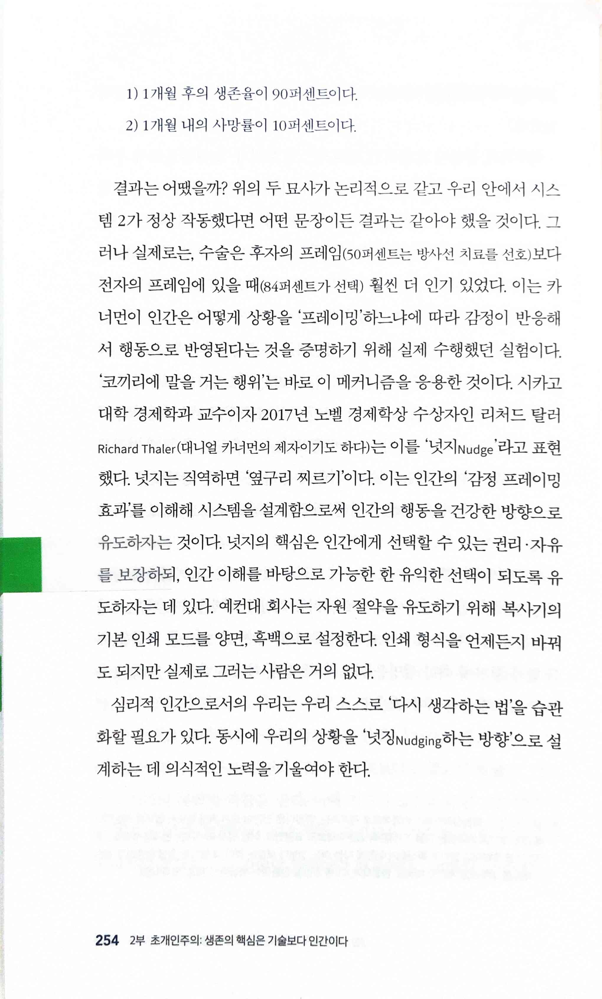

> 시카고대학 경제학과 교수이자 2017년 노벨 경제학상 수상자인 리처드 탈러Richard Thaler (대니얼 카너먼의 제자이기도 하다)는 이를 '넛지 Nudge'라고 표현했다. 넛지는 직역하면 '옆구리 찌르기'이다. 이는 인간의 '감정 프레이밍 효과'를 이해해 시스템을 설계함으로써 인간의 행동을 건강한 방향으로 유도하자는 것이다. 넛지의 핵심은 인간에게 선택할 수 있는 권리·자유를 보장하되, 인간 이해를 바탕으로 가능한 한 유익한 선택이 되도록 유도하자는 데 있다.

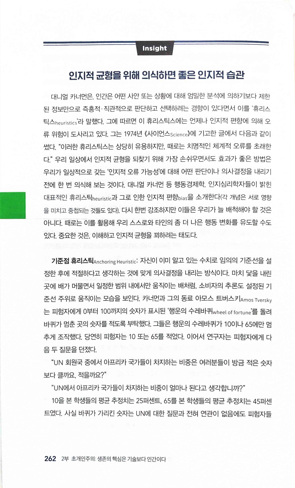 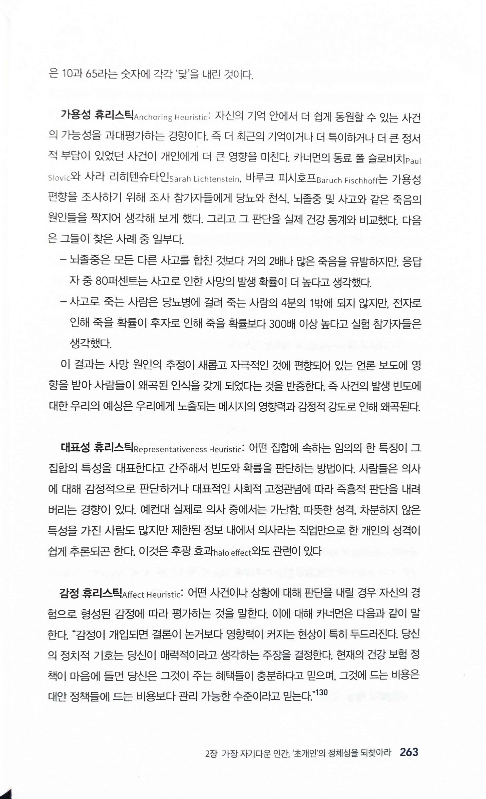 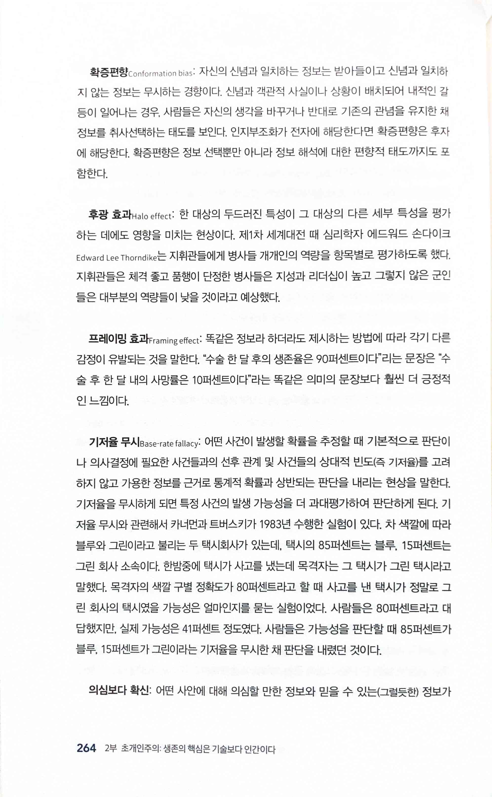 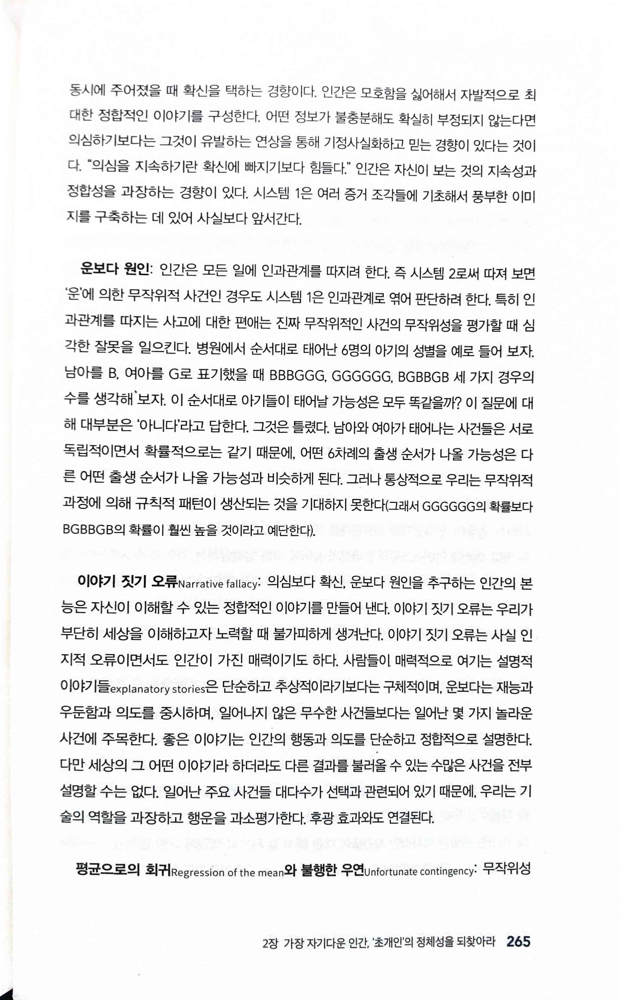 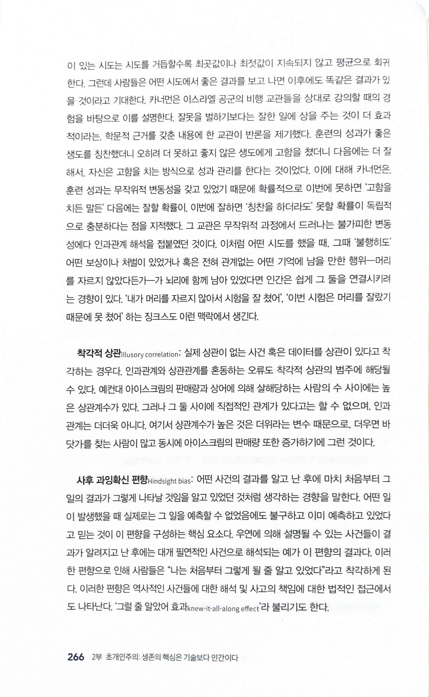 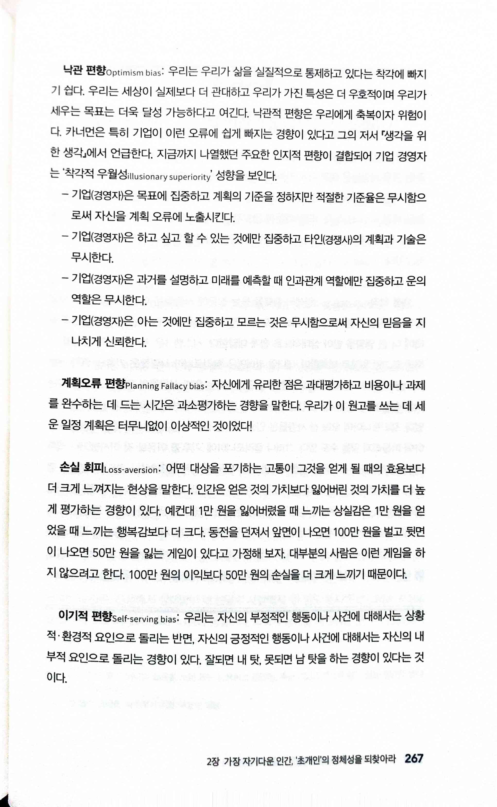 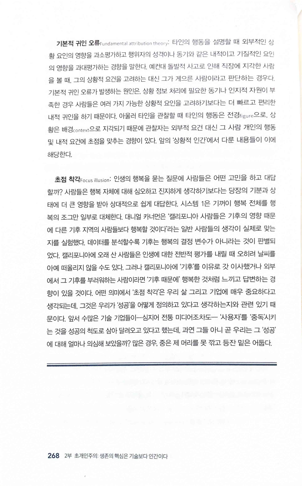

> 대니얼 카너먼 등 행동경제학, 인지심리학자들이 밝힌 대표적인 휴리스틱heuristic과 그로 인한 인지적 편향bias을 소개한다. 다시 한번 강조하지만 이들은 우리가 늘 배척해야 할 것은 아니다. 때로는 이를 활용해 우리 스스로와 타인의 좀 더 나은 행동 변화를 유도할 수도 있다. 중요한 것은 이해하고 인지적 균형을 꾀하려는 태도다.
>
> 기준점 휴리스틱Anchoring Heuristic. 자신이 이미 알고 있는 수치로 임의의 기준선을 설정한 후에 적절하다고 생각하는 것에 맞게 의사결정을 내리는 방식이다. 마치 닻을 내린 곳에 배가 머물면서 일정한 범위 내에서만 움직이는 배처럼, 소비자의 추론도 설정된 기준선 주위로 움직이는 모습을 보인다.
>
> 가용성 휴리스틱 Anchoring Heuristic. 자신의 기억 안에서 더 쉽게 동원할 수 있는 사건의 가능성을 과대평가하는 경향이다. 즉 더 최근의 기억이거나 더 특이하거나 더 큰 정서적 부담이 있었던 사건이 개인에게 더 큰 영향을 미친다.
>
> 대표성 휴리스틱Representativeness Heuristic. 어떤 집합에 속하는 임의의 한 특징이 그집합의 특성을 대표한다고 간주해서 빈도와 확률을 판단하는 방법이다. 사람들은 의사에 대해 감정적으로 판단하거나 대표적인 사회적 고정관념에 따라 즉흥적 판단을 내려버리는 경향이 있다.
>
> 감정 휴리스틱Affect Heuristic. 어떤 사건이나 상황에 대해 판단을 내릴 경우 자신의 경험으로 형성된 감정에 따라 평가하는 것을 말한다.
>
> 확증편향Conformation bias: 자신의 신념과 일치하는 정보는 받아들이고 신념과 일치하지 않는 정보는 무시하는 경향이다. 신념과 객관적 사실이나 상황이 배치되어 내적인 갈등이 일어나는 경우, 사람들은 자신의 생각을 바꾸거나 반대로 기존의 관념을 유지한 채 정보를 취사선택하는 태도를 보인다. 인지부조화가 전자에 해당한다면 확증편향은 후자에 해당한다. 확증편향은 정보 선택뿐만 아니라 정보 해석에 대한 편향적 태도까지도 포함한다.
>
> 후광 효과Halo effect. 한 대상의 두드러진 특성이 그 대상의 다른 세부 특성을 평가하는 데에도 영향을 미치는 현상이다.
>
> 프레이밍 효과Framing effect. 똑같은 정보라 하더라도 제시하는 방법에 따라 각기 다른 감정이것을 말한다.
>
> 기저율 무시Base-rate fallacy. 어떤 사건이 발생할 확률을 추정할 때 기본적으로 판단이나 의사결정에 필요한 사건들과의 선후 관계 및 사건들의 상대적 빈도(즉 기저율)를 고려하지 않고 가용한 정보를 근거로 통계적 확률과 상반되는 판단을 내리는 현상을 말한다. 기저율을 무시하게 되면 특정 사건의 발생 가능성을 더 과대평가하여 판단하게 된다.
>
> 의심보다 확신: 어떤 사안에 대해 의심할 만한 정보와 믿을 수 있는(그럴듯한 정보가 동시에 주어졌을 때 확신을 택하는 경향이다. 인간은 모호함을 싫어해서 자발적으로 최대한 정합적인 이야기를 구성한다. 어떤 정보가 불충분해도 확실히 부정되지 않는다면 의심하기보다는 그것이 유발하는 연상을 통해 기정사실화하고 믿는 경향이 있다는 것이다. "의심을 지속하기란 확신에 빠지기보다 힘들다. 인간은 자신이 보는 것의 지속성과 정합성을 과장하는 경향이 있다.
>
> 운보다 원인: 인간은 모든 일에 인과관계를 따지려 한다.
>
> 이야기 짓기 오류Narrative fallacy: 의심보다 확신, 운보다 원인을 추구하는 인간의 본능은 자신이 이해할 수 있는 정합적인 이야기를 만들어 낸다. 이야기 짓기 오류는 우리가 부단히 세상을 이해하고자 노력할 때 불가피하게 생겨난다... 후광 효과와도 연결된다.
>
> 평균으로의 회귀Regression of the mean와 불행한 우연Unfortunate contingency: 무작위성이 있는 시도는 시도를 거듭할수록 최곳값이나 최젓값이 지속되지 않고 평균으로 회귀한다. 그런데 사람들은 어떤 시도에서 좋은 결과를 보고 나면 이후에도 똑같은 결과가 있을 것이라고 기대한다... 징크스도 이런 맥락에서 생긴다.
>
> 착각적 상관Illusory correlation: 실제 상관이 없는 사건 혹은 데이터를 상관이 있다고 착각하는 경우다. 인과관계와 상관관계를 혼동하는 오류도 착각적 상관의 범주에 해당될수 있다.
>
> 사후 과잉확신 편향 Hindsight bias: 어떤 사건의 결과를 알고 난 후에 마치 처음부터 그일의 결과가 그렇게 나타날 것임을 알고 있었던 것처럼 생각하는 경향을 말한다. 어떤 일이 발생했을 때 실제로는 그 일을 예측할 수 없었음에도 불구하고 이미 예측하고 있었다고 믿는 것이 이 편향을 구성하는 핵심 요소다... '그럴 줄 알았어 효과knew-it-all-along effect'라 불리기도 한다.
>
> 낙관 편향optimism bias: 우리는 우리가 삶을 실질적으로 통제하고 있다는 착각에 빠지기 쉽다. 우리는 세상이 실제보다 더 관대하고 우리가 가진 특성은 더 우호적이며 우리가 세우는 목표는 더욱 달성 가능하다고 여긴다.
>
> 계획오류 편향Planning Fallacy bias: 자신에게 유리한 점은 과대평가하고 비용이나 과제를 완수하는 데 드는 시간은 과소평가하는 경향을 말한다.
>
> 손실 회피 Loss-aversion: 어떤 대상을 포기하는 고통이 그것을 얻게 될 때의 효용보다더 크게 느껴지는 현상을 말한다. 인간은 얻은 것의 가치보다 잃어버린 것의 가치를 더 높게 평가하는 경향이 있다.
>
> 이기적 편향self-serving bias: 우리는 자신의 부정적인 행동이나 사건에 대해서는 상황적·환경적 요인으로 돌리는 반면, 자신의 긍정적인 행동이나 사건에 대해서는 자신의 내부적 요인으로 돌리는 경향이 있다. 잘되면 내 탓. 못되면 남 탓을 하는 경향이 있다는 것이다.
>
> 기본적 귀인 오류Fundamental attribution theory. 타인의 행동을 설명할 때 외부적인 상황 요인의 영향을 과소평가하고 행위자의 성격이나 동기와 같은 내적이고 기질적인 요인의 영향을 과대평가하는 경향을 말한다.
>
> 초점 착각 Focus illusion: 인생의 행복을 묻는 질문에 사람들은 어떤 고민을 하고 대답할까? 사람들은 행복 자체에 대해 심오하고 진지하게 생각하기보다는 당장의 기분과 상태에 더 큰 영향을 받아 상대적으로 쉽게 대답한다... 어떤 의미에서 '초점 착각'은 우리 삶 그리고 기업에 매우 중요하다고 생각되는데, 그것은 우리가 '성공'을 어떻게 정의하고 있다고 생각하는지와 관련 있기 때문이다.

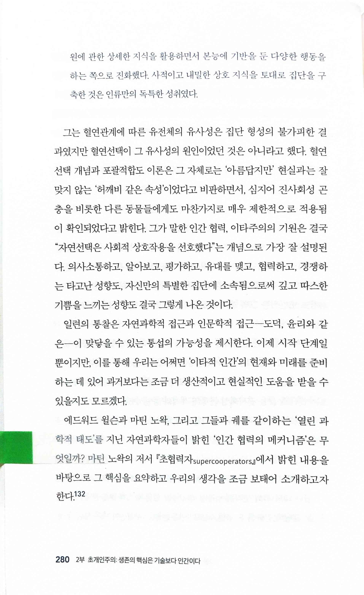 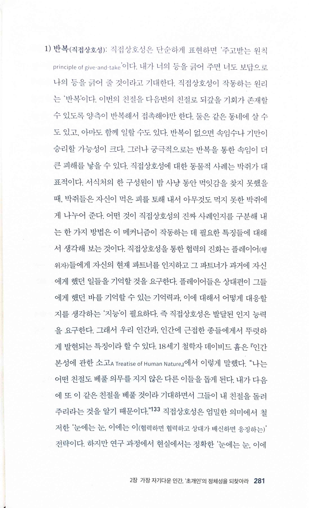 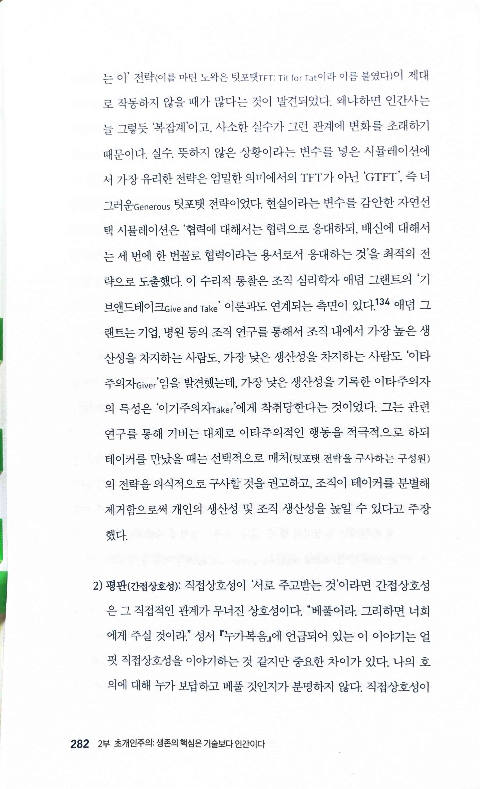 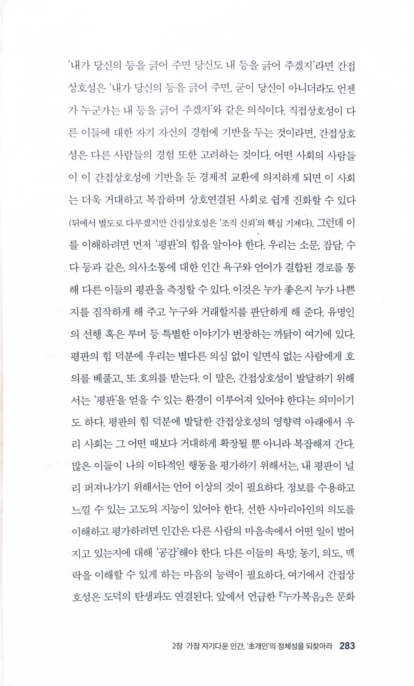 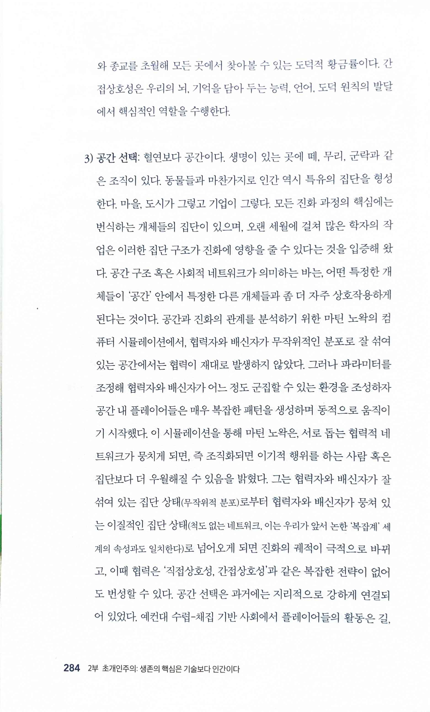 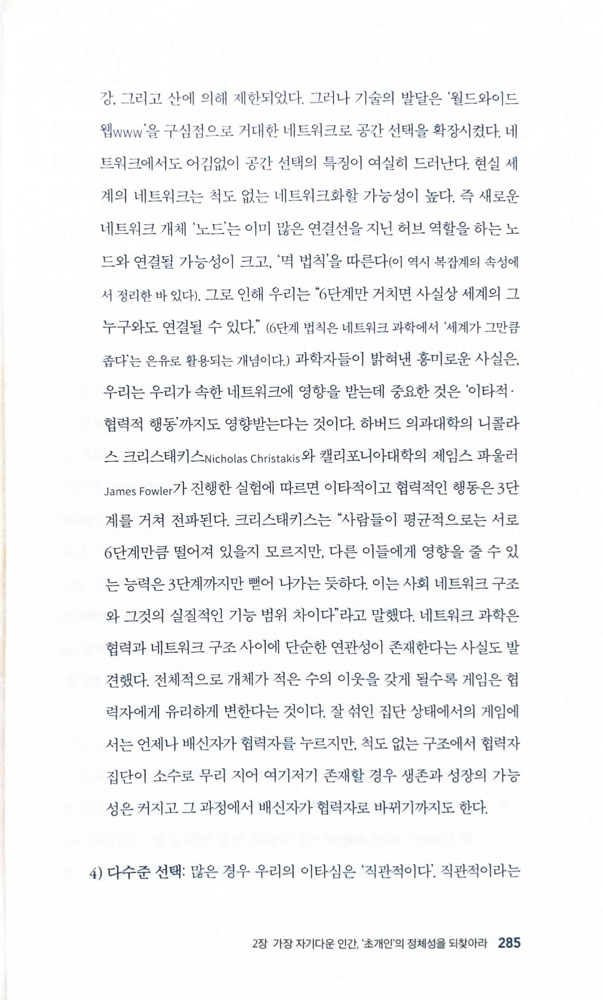 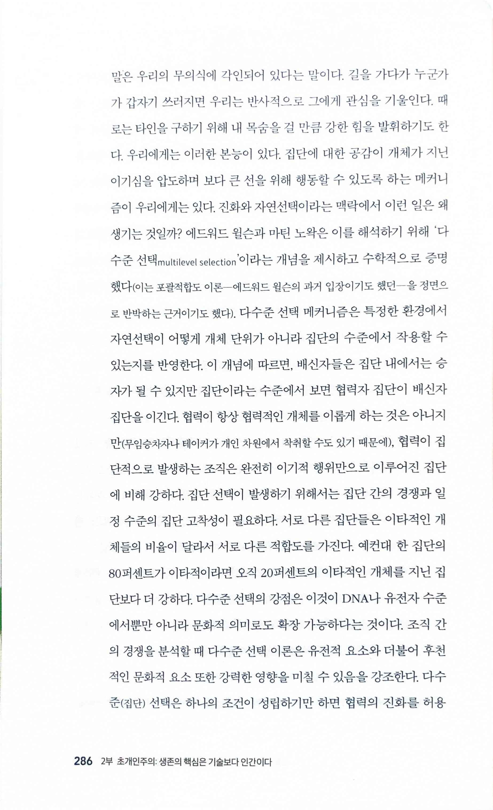 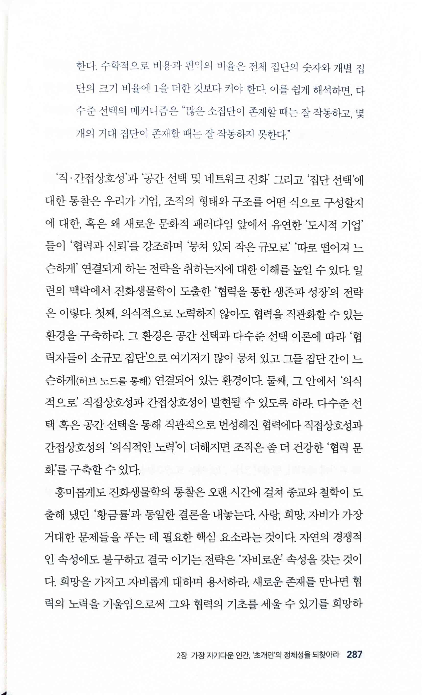

> 에드워드 윌슨과 마틴 노왁, 그리고 그들과 궤를 같이하는 '열린 과학적 태도'를 지닌 자연과학자들이 밝힌 '인간 협력의 메커니즘', 마틴 노왁의 저서 『초협력자supercooperators』
>
> 1) 반복(직접상호): 직접상호성은 단순하게 표현하면 주고받는 원칙principle of give-and-take'이다... 직접상호성이 작동하는 원리는 '반복'이다. 이번의 친절을 다음번의 친절로 되갚을 기회가 존재할수 있도록 양측이 반복해서 접촉해야만 한다.
>
> 시뮬레이션에서 가장 유리한 전략은 엄밀한 의미에서의 TFT가 아닌 'GTFT', 즉 너그러운Generous 팃포탯 전략이었다. 현실이라는 변수를 감안한 자연선택 시뮬레이션은 '협력에 대해서는 협력으로 응대하되, 배신에 대해서는 세 번에 한 번꼴로 협력이라는 용서로서 응대하는 것'을 최적의 전략으로 도출
>
> 2) 평판(간접상호성) 직접상호성이 '서로 주고받는 것'이라면 간접상호성은 그 직접적인 관계가 무너진 상호성이다... 직접상호성이 다른 이들에 대한 자기 자신의 경험에 기반을 두는 것이라면, 간접상호성은 다른 사람들의 경험 또한 고려하는 것이다. 어떤 사회의 사람들이 이 간접상호성에 기반을 둔 경제적 교환에 의지하게 되면 이 사회는 더욱 거대하고 복잡하며 상호연결된 사회로 쉽게 진화할 수 있다(뒤에서 별도로 다루겠지만 간접상호성은 '조직 신뢰'의 핵심 기제다). 그런데 이를 이해하려면 먼저 '평판'의 힘을 알아야 한다... 평판의 힘 덕분에 우리는 별다른 의심 없이 일면식 없는 사람에게 호의를 베풀고, 또 호의를 받는다. 이 말은, 간접상호성이 발달하기 위해서는 '평판'을 얻을 수 있는 환경이 이루어져 있어야 한다는 의미이기도 하다. 평판의 힘 덕분에 발달한 간접상호성의 영향력 아래에서 우리 사회는 그 어떤 때보다 거대하게 확장될 뿐 아니라 복잡해져 간다. 많은 이들이 나의 이타적인 행동을 평가하기 위해서는 내 평판이 널리 퍼져나가기 위해서는 언어 이상의 것이 필요하다. 
>
> 3) 공간 선택: 혈연보다 공간이다... 모든 진화 과정의 핵심에는 번식하는 개체들의 집단이 있으며, 오랜 세월에 걸쳐 많은 학자의 작업은 이러한 집단 구조가 진화에 영향을 줄 수 있다는 것을 입증해 왔다. 공간구조 혹은 사회적 네트워크가 의미하는 바는, 어떤 특정한 개체들이 '공간' 안에서 특정한 다른 개체들과 좀 더 자주 상호작용하게 된다는 것이다... 마틴 노왁은 서로 돕는 협력적 네트워크가 뭉치게 되면, 즉 조직화되면 이기적 행위를 하는 사람 혹은 집단보다 더 우월해질 수 있음을 밝혔다.
>
> 4) 다수준 선택: 많은 경우 우리의 이타심은 '직관적이다. 직관적이라는 말은 우리의 무의식에 각인되어 있다는 말이다... 집단에 대한 공감이 개체가 지닌 이기심을 압도하며 보다 큰 선을 위해 행동할 수 있도록 하는 메커니즘이 우리에게는 있다... 에드워드 윌슨과 마틴 노왁은 이를 해석하기 위해 '다수준 선택multilevel selection'이라는 개념을 제시하고 수학적으로 증명했다(이는 포괄적합도 이론-에드워드 윌슨의 과거 입장이기도 했던을 정면으로 반박하는 근거이기도 했다). 다수준 선택 메커니즘은 특정한 환경에서 자연선택이 어떻게 개체 단위가 아니라 집단의 수준에서 작용할 수 있는지를 반영한다. 이 개념에 따르면, 배신자들은 집단 내에서는 승자가 될 수 있지만 집단이라는 수준에서 보면 협력자 집단이 배신자 집단을 이긴다. 협력이 항상 협력적인 개체를 이롭게 하는 것은 아니지만(무임승차자나 테이커가 개인 차원에서 착취할 수도 있기 때문에), 협력이 집단적으로 발생하는 조직은 완전히 이기적 행위만으로 이루어진 집단에 비해 강하다.
>

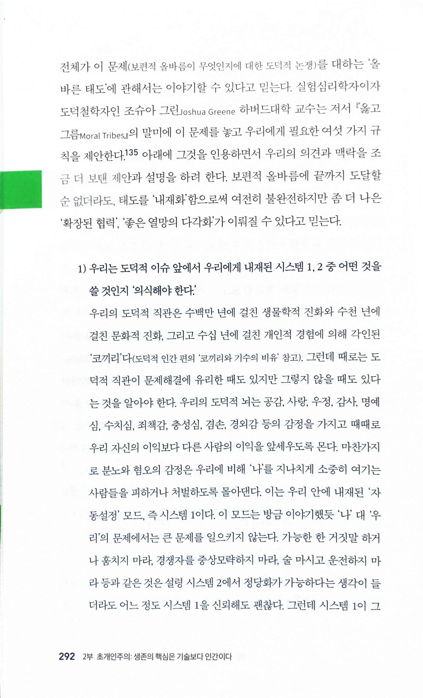

> 보편적 올바름에 끝까지 도달할 순 없더라도, 태도를 '내재화'함으로써 여전히 불완전하지만 좀 더 나은 '확장된 협력', '좋은 열망의 다각화'가 이뤄질 수 있다고 믿는다.
  
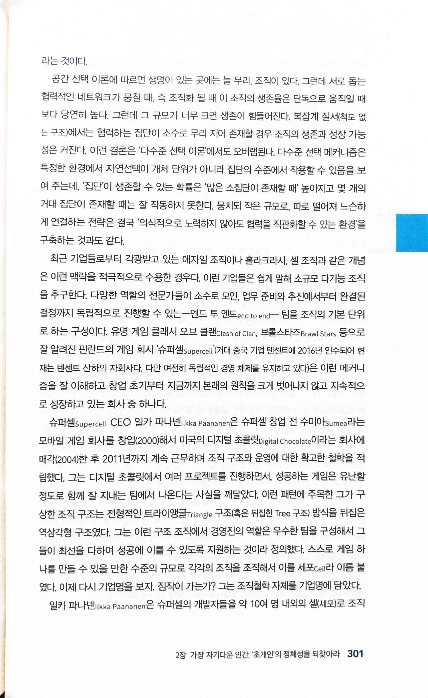

> 뭉치되 작은 규모로, 따로 떨어져 느슨하게 연결하는 전략은 결국 '의식적으로 노력하지 않아도 협력을 직관화할 수 있는 환경'을 구축하는 것과도 같다.
>
> 최근 기업들로부터 각광받고 있는 애자일 조직이나 홀라크라시, 셀 조직과 같은 개념은 이런 맥락을 적극적으로 수용한 경우다. 이런 기업들은 쉽게 말해 소규모 다기능 조직을 추구한다. 다양한 역할의 전문가들이 소수로 모인 업무 준비와 추진에서부터 완결된 결정까지 독립적으로 진행할 수 있는 -엔드 투 엔드end to end- 팀을 조직의 기본 단위로 하는 구성이다.

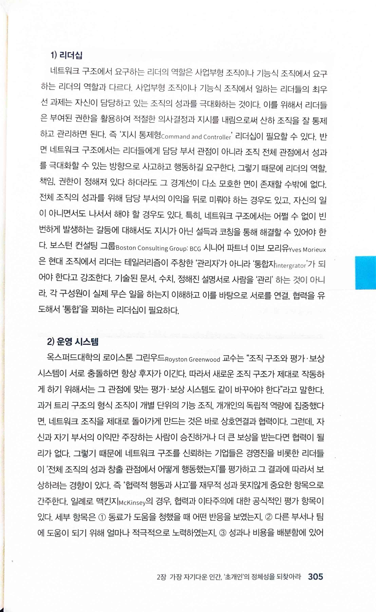

> 네트워크 구조에서는 어쩔 수 없이 빈번하게 발생하는 갈등에 대해서도 지시가 아닌 설득과 코칭을 통해 해결할 수 있어야 한다. 보스턴 컨설팅 그룹Boston Consulting Group: BCG 시니어 파트너 이브 모리유Yves Morieux은 현대 조직에서 리더는 테일러리즘이 주창한 '관리자'가 아니라 '통합자Intergrator'가 되어야 한다고 강조한다. 기술된 문서, 수치, 정해진 설명서로 사람을 '관리' 하는 것이 아니라. 각 구성원이 실제 무슨 일을 하는지 이해하고 이를 바탕으로 서로를 연결, 협력을 유도해서 '통합'을 꾀하는 리더십이 필요하다.

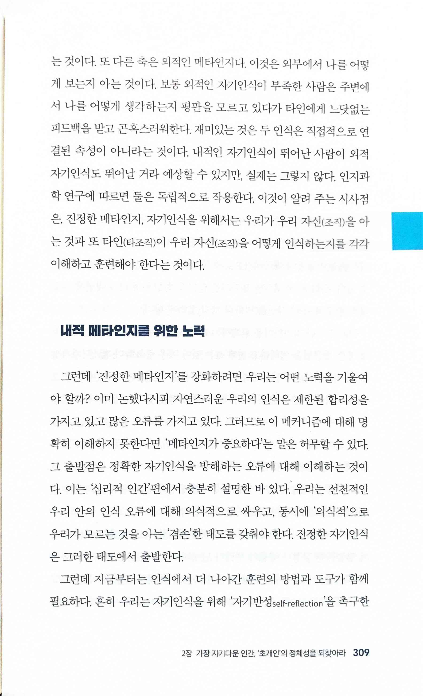

> 진정한 메타인지, 자기인식을 위해서는 우리가 우리 자신(조직)을 아는 것과 또 타인(타조직)이 우리 자신(조직)을 어떻게 인식하는지를 각각 이해하고 훈련해야 한다는 것이다.

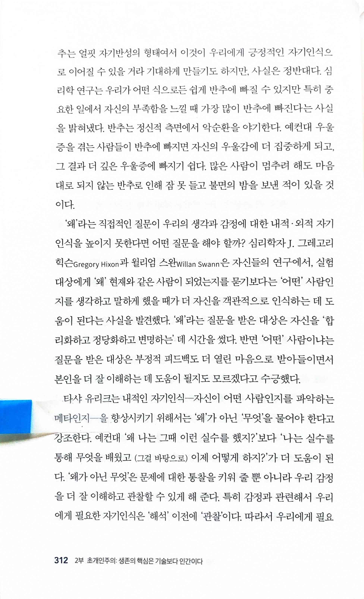

> 타샤 유리크는 내적인 자기인식-자신이 어떤 사람인지를 파악하는 메타인지을 향상시키기 위해서는 '왜'가 아닌 '무엇'을 물어야 한다고 강조한다. 예컨대 '왜 나는 그때 이런 실수를 했지?'보다 '나는 실수를 통해 무엇을 배웠고 (그걸 바탕으로) 이제 어떻게 하지?'가 더 도움이 된다. '왜가 아닌 무엇'은 문제에 대한 통찰을 키워 줄 뿐 아니라 우리 감정을 더 잘 이해하고 관찰할 수 있게 해 준다. 특히 감정과 관련해서 우리에게 필요한 자기인식은 '해석' 이전에 '관찰'이다.

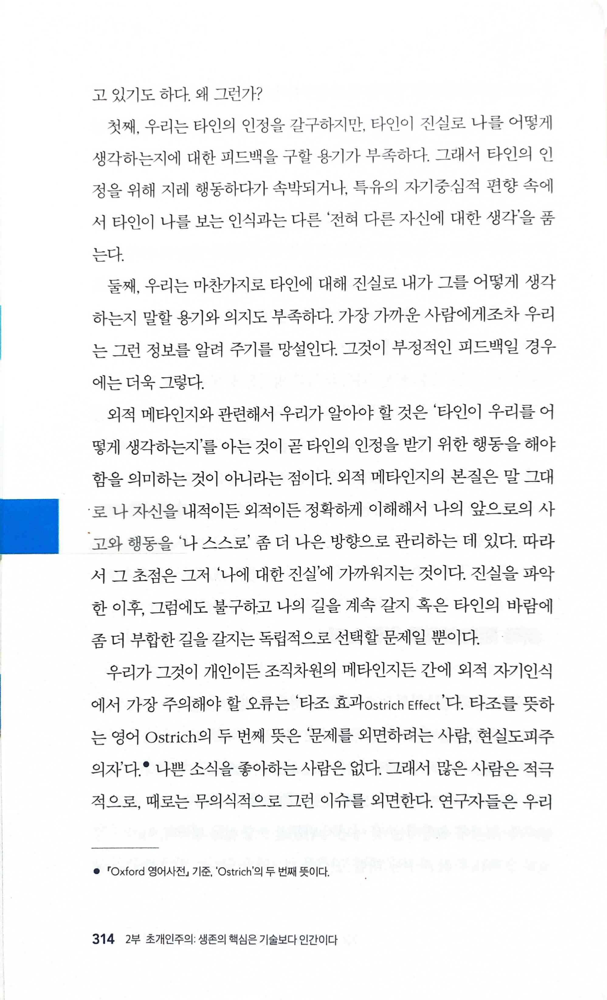

> 외적 메타인지의 본질은 말 그대로 나 자신을 내적이든 외적이든 정확하게 이해해서 나의 앞으로의 사고와 행동을 '나 스스로' 좀 더 나은 방향으로 관리하는 데 있다. 따라서 그 초점은 그저 '나에 대한 진실'에 가까워지는 것이다. 진실을 파악한 이후, 그럼에도 불구하고 나의 길을 계속 갈지 혹은 타인의 바람에 좀 더 부합한 길을 갈지는 독립적으로 선택할 문제일 뿐이다.

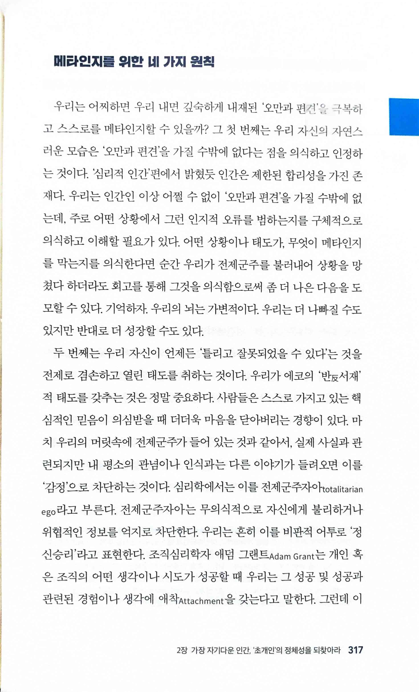

> 우리는 어찌하면 우리 내면 깊숙하게 내재된 '오만과 편견'을 극복하고 스스로를 메타인지할 수 있을까? 그 첫 번째는 우리 자신의 자연스러운 모습은 '오만과 편견을 가질 수밖에 없다는 점을 의식하고 인정하는 것이다.
>
> 두 번째는 우리 자신이 언제든 '틀리고 잘못되었을 수 있다'는 것을 전제로 겸손하고 열린 태도를 취하는 것이다... 심리학에서는 이를 전제군주자아totalitarianego라고 부른다. 전제군주자아는 무의식적으로 자신에게 불리하거나 위협적인 정보를 억지로 차단한다. 우리는 흔히 이를 비판적 어투로 '정신승리'라고 표현한다.

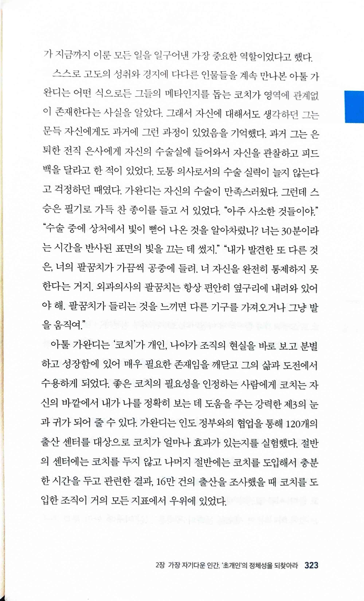

> 스스로 고도의 성취와 경지에 다다른 인물들을 계속 만나본 아툴 가완디는 어떤 식으로든 그들의 메타인지를 돕는 코치가 영역에 관계없이 존재한다는 사실을 알았다.

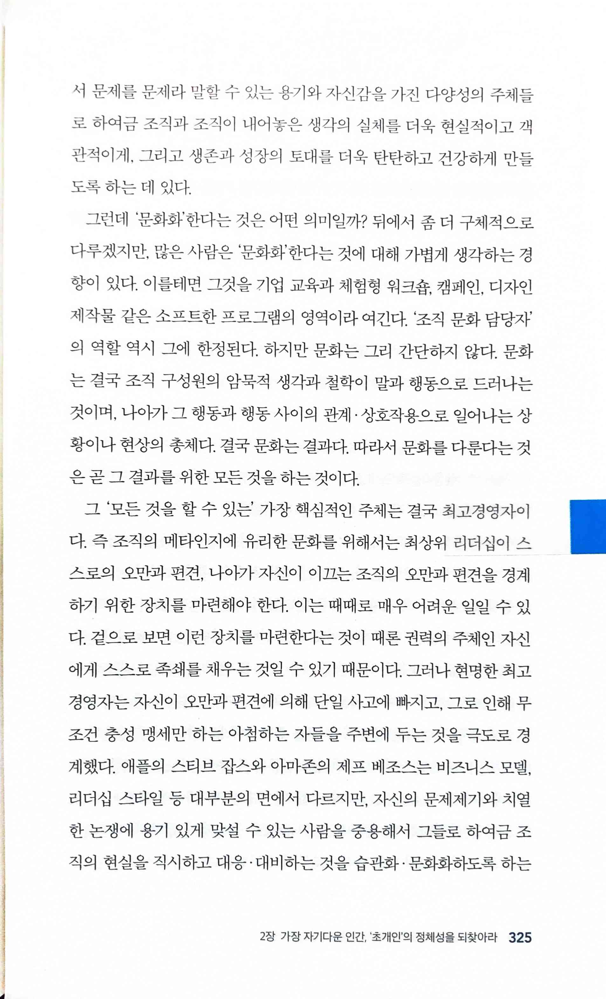

> 그 '모든 것을 할 수 있는' 가장 핵심적인 주체는 결국 최고경영자이다. 즉 조직의 메타인지에 유리한 문화를 위해서는 최상위 리더십이 스스로의 오만과 편견, 나아가 자신이 이끄는 조직의 오만과 편견을 경계하기 위한 장치를 마련해야 한다.

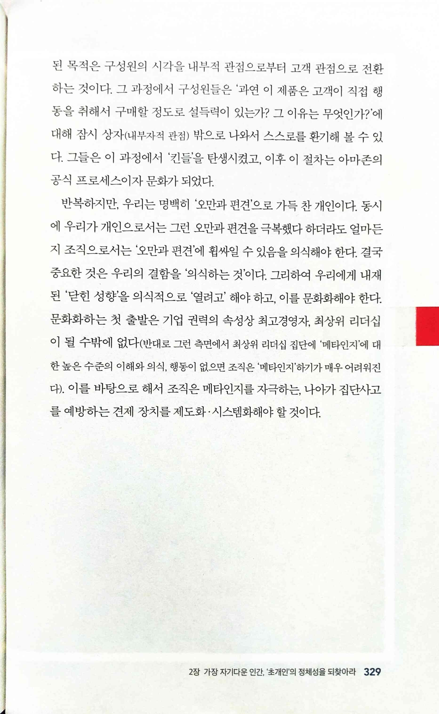

> 우리는 명백히 '오만과 편견'으로 가득 찬 개인이다. 동시에 우리가 개인으로서는 그런 오만과 편견을 극복했다 하더라도 얼마든지 조직으로서는 '오만과 편견'에 휩싸일 수 있음을 의식해야 한다. 결국 중요한 것은 우리의 결함을 의식하는 것'이다. 그리하여 우리에게 내재된 '닫힌 성향'을 의식적으로 '열려고 해야 하고, 이를 문화화해야 한다. 문화화하는 첫 출발은 기업 권력의 속성상 최고경영자, 최상위 리더십이 될 수밖에 없다(반대로 그런 측면에서 최상위 리더십 집단에 '메타인지'에 대한 높은 수준의 이해와 의식, 행동이 없으면 조직은 '메타인지'하기가 매우 어려워진다). 이를 바탕으로 해서 조직은 메타인지를 자극하는, 나아가 집단사고를 예방하는 견제 장치를 제도화·시스템화해야 할 것이다.

# 3부 호모 디그누스의 초개인주의 경영: 초불확실성 시대를 건너는 신뢰와 존중의 과학적 관리법

## 1장 신뢰의 과학
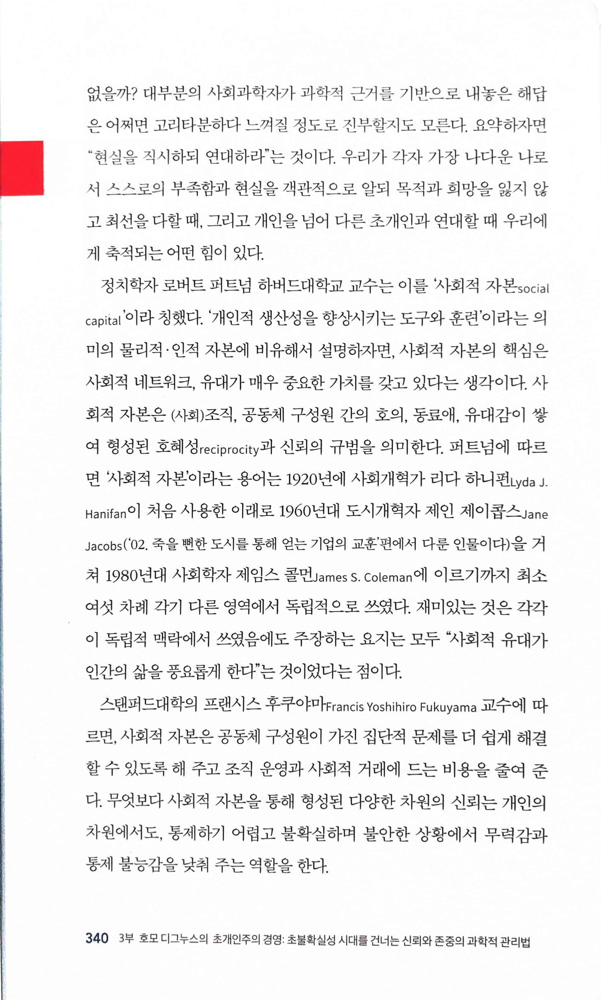

> 대부분의 사회과학자가 과학적 근거를 기반으로 내놓은 해답은 어쩌면 고리타분하다 느껴질 정도로 진부할지도 모른다. 요약하자면 "현실을 직시하되 연대하라"는 것이다. 우리가 각자 가장 나다운 나로서 스스로의 부족함과 현실을 객관적으로 알되 목적과 희망을 잃지 않고 최선을 다할 때, 그리고 개인을 넘어 다른 초개인과 연대할 때 우리에게 축적되는 어떤 힘이 있다.

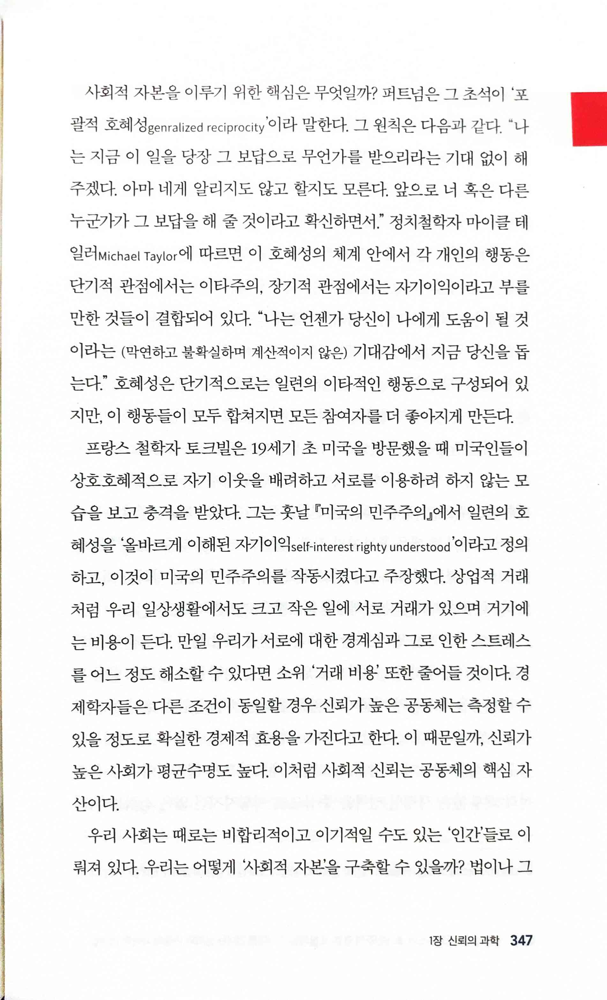

> 사회적 자본을 이루기 위한 핵심은 무엇일까? 퍼트넘은 그 초석이 '포괄적 호혜성genralized reciprocity'이라 말한다. 그 원칙은 다음과 같다. “나는 지금 이 일을 당장 그 보답으로 무언가를 받으리라는 기대 없이 해주겠다. 아마 네게 알리지도 않고 할지도 모른다. 앞으로 너 혹은 다른 누군가가 그 보답을 해 줄 것이라고 확신하면서 정치철학자 마이클 테일러Michael Taylor에 따르면 이 호혜성의 체계 안에서 각 개인의 행동은 단기적 관점에서는 이타주의, 장기적 관점에서는 자기이익이라고 부를만한 것들이 결합되어 있다. "나는 언젠가 당신이 나에게 도움이 될 것이라는 (막연하고 불확실하며 계산적이지 않은) 기대감에서 지금 당신을 돕는다." 호혜성은 단기적으로는 일련의 이타적인 행동으로 구성되어 있지만, 이 행동들이 모두 합쳐지면 모든 참여자를 더 좋아지게 만든다.
>
> ... 경제학자들은 다른 조건이 동일할 경우 신뢰가 높은 공동체는 측정할 수 있을 정도로 확실한 경제적 효용을 가진다고 한다. 이 때문일까, 신뢰가 높은 사회가 평균수명도 높다. 이처럼 사회적 신뢰는 공동체의 핵심 자산이다.

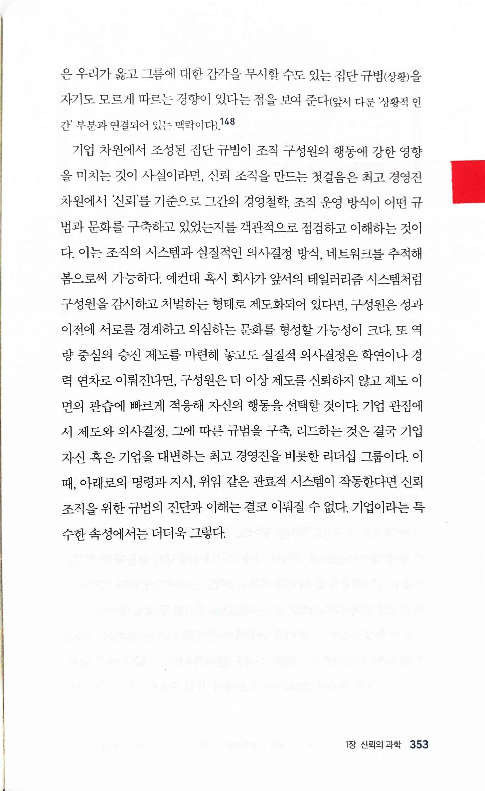

> 기업 차원에서 조성된 집단 규범이 조직 구성원의 행동에 강한 영향을 미치는 것이 사실이라면, 신뢰 조직을 만드는 첫걸음은 최고 경영진차원에서 '신뢰'를 기준으로 그간의 경영철학, 조직 운영 방식이 어떤 규범과 문화를 구축하고 있었는지를 객관적으로 점검하고 이해하는 것이다. 이는 조직의 시스템과 실질적인 의사결정 방식, 네트워크를 추적해봄으로써 가능하다... 기업 관점에서 제도와 의사결정, 그에 따른 규범을 구축, 리드하는 것은 결국 기업자신 혹은 기업을 대변하는 최고 경영진을 비롯한 리더십 그룹이다.

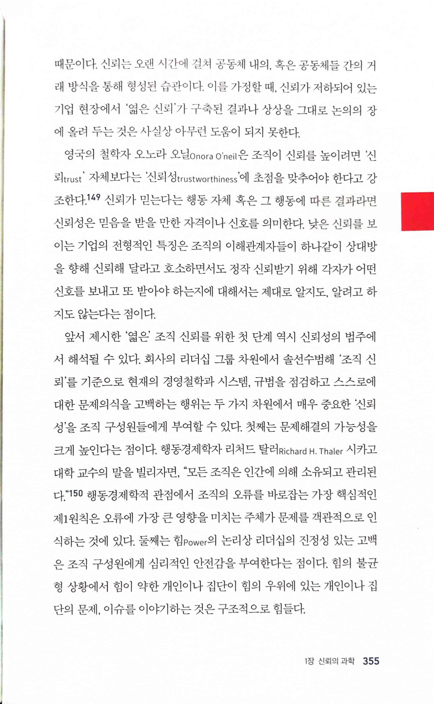

> 영국의 철학자 오노라 오닐Onora O'neil 은 조직이 신뢰를 높이려면 '신뢰trust' 자체보다는 '신뢰성trustworthiness'에 초점을 맞추어야 한다고 강조한다. 신뢰가 믿는다는 행동 자체 혹은 그 행동에 따른 결과라면 신뢰성은 믿음을 받을 만한 자격이나 신호를 의미한다. 낮은 신뢰를 보이는 기업의 전형적인 특징은 조직의 이해관계자들이 하나같이 상대방을 향해 신뢰해 달라고 호소하면서도 정작 신뢰받기 위해 각자가 어떤 신호를 보내고 또 받아야 하는지에 대해서는 제대로 알지도 알려고 하지도 않는다는 점이다.
>
> 회사의 리더십 그룹 차원에서 솔선수범해 '조직 신뢰'를 기준으로 현재의 경영철학과 시스템, 규범을 점검하고 스스로에 대한 문제의식을 고백하는 행위는 두 가지 차원에서 매우 중요한 '신뢰성'을 조직 구성원들에게 부여할 수 있다. 첫째는 문제해결의 가능성을 크게 높인다는 점이다.  행동경제학자 리처드 탈러Richard H. Thaler 시카고 대학 교수의 말을 빌리자면, "모든 조직은 인간에 의해 소유되고 관리된다. 행동경제학적 관점에서 조직의 오류를 바로잡는 가장 핵심적인 제1원칙은 오류에 가장 큰 영향을 미치는 주체가 문제를 객관적으로 인식하는 것에 있다. 둘째는 힘Power의 논리상 리더십의 진정성 있는 고백은 조직 구성원에게 심리적인 안전감을 부여한다는 점이다. 힘의 불균형 상황에서 힘이 약한 개인이나 집단이 힘의 우위에 있는 개인이나 집단의 문제, 이슈를 이야기하는 것은 구조적으로 힘들다.
* 과연 내가 했던 선택(jira에 글쓰기를 통해 작은 신뢰부터 쌓자고 했던 부분)은 옳은 선택이었을까?

## 2장 초개인주의 경영: 다차원적 존중의 10가지 전략
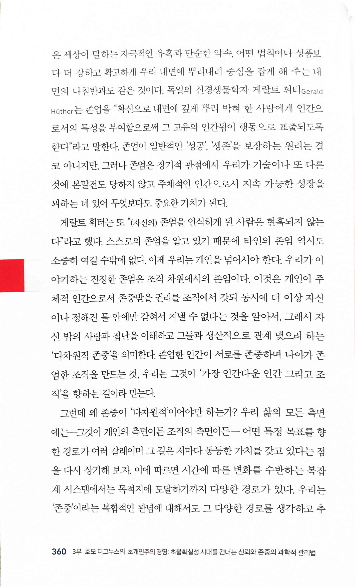

> 이제 우리는 개인을 넘어서야 한다. 우리가 이야기하는 진정한 존엄은 조직 차원에서의 존엄이다. 이것은 개인이 주체적 인간으로서 존중받을 권리를 조직에서 갖되 동시에 더 이상 자신이나 정해진 틀 안에만 갇혀서 지낼 수 없다는 것을 알아서, 그래서 자신 밖의 사람과 집단을 이해하고 그들과 생산적으로 관계 맺으려 하는 '다차원적 존중'을 의미한다. 존엄한 인간이 서로를 존중하며 나아가 존엄한 조직을 만드는 것, 우리는 그것이 '가장 인간다운 인간 그리고 조직'을 향하는 길이라 믿는다.

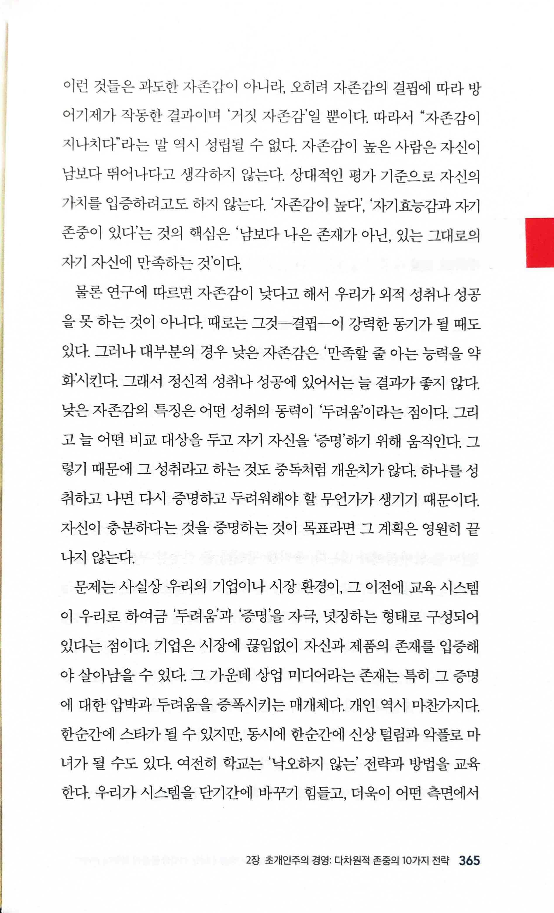

> 자존감이 높은 사람은 자신이 남보다 뛰어나다고 생각하지 않는다. 상대적인 평가 기준으로 자신의 가치를 입증하려고도 하지 않는다. '자존감이 높다', '자기효능감과 자기존중이 있다'는 것의 핵심은 '남보다 나은 존재가 아닌, 있는 그대로의 자기 자신에 만족하는 것'이다.
>
> 문제는 사실상 우리의 기업이나 시장 환경이, 그 이전에 교육 시스템이 우리로 하여금 '두려움'과 '증명'을 자극, 넛징하는 형태로 구성되어 있다는 점이다.

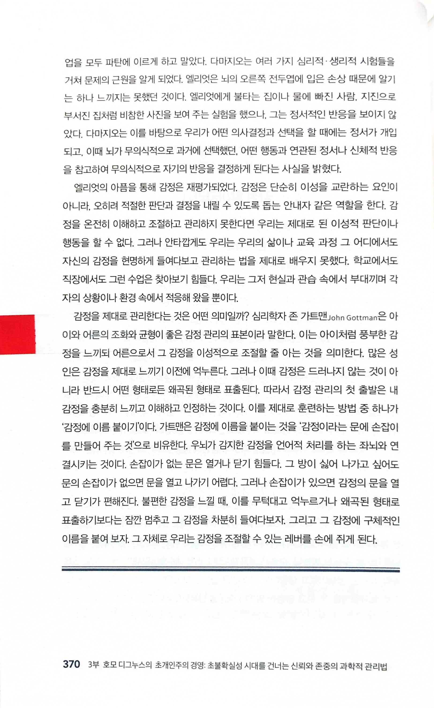

> 감정을 제대로 관리한다는 것은 어떤 의미일까? 심리학자 존 가트맨 John Gottman은 아이와 어른의 조화와 균형이 좋은 감정 관리의 표본이라 말한다. 이는 아이처럼 풍부한 감정을 느끼되 어른으로서 그 감정을 이성적으로 조절할 줄 아는 것을 의미한다.

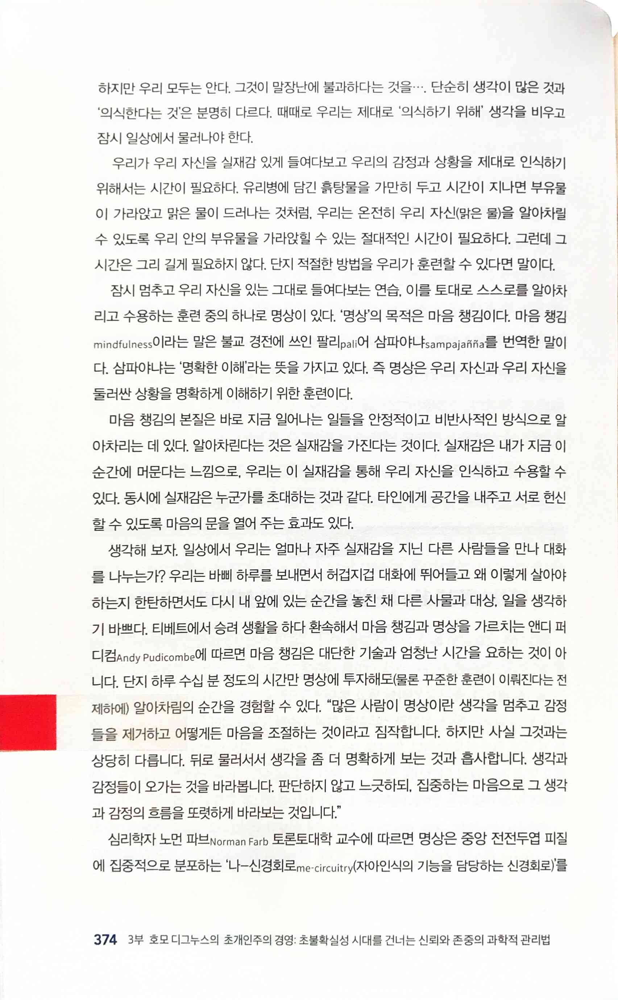

> 앤디 퍼디컴 Andy Pudicombe에 따르면 마음 챙김은 대단한 기술과 엄청난 시간을 요하는 것이 아니다. 단지 하루 수십 분 정도의 시간만 명상에 투자해도(물론 꾸준한 훈련이 이뤄진다는 전제하에) 알아차림의 순간을 경험할 수 있다. "많은 사람이 명상이란 생각을 멈추고 감정들을 제거하고 어떻게든 마음을 조절하는 것이라고 짐작합니다. 하지만 사실 그것과는 상당히 다릅니다. 뒤로 물러서서 생각을 좀 더 명확하게 보는 것과 흡사합니다. 생각과 감정들이 오가는 것을 바라봅니다. 판단하지 않고 느긋하되, 집중하는 마음으로 그 생각과 감정의 흐름을 또렷하게 바라보는 것입니다."

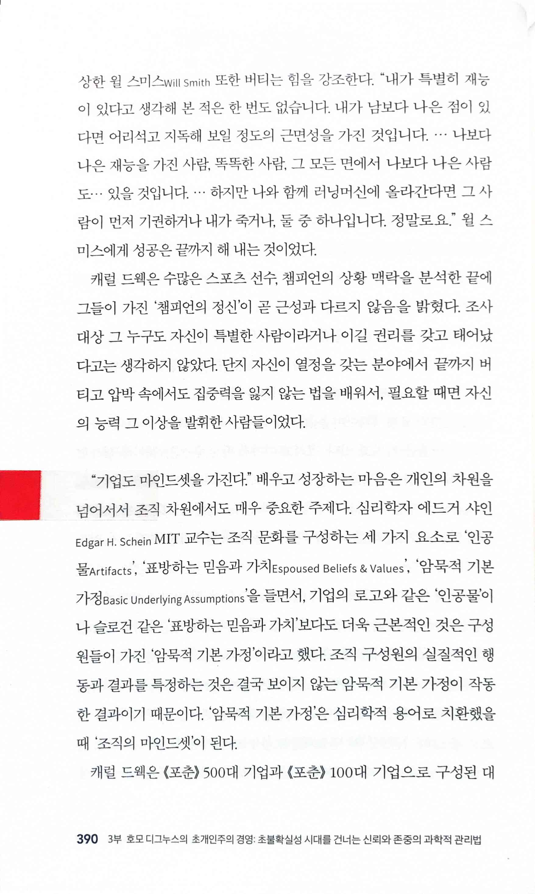

> “기업도 마인드셋을 가진다." 배우고 성장하는 마음은 개인의 차원을 넘어서서 조직 차원에서도 매우 중요한 주제다. 심리학자 에드거 샤인 Edgar H. Schein MIT 교수는 조직 문화를 구성하는 세 가지 요소로 '인공물Artifacts', '표방하는 믿음과 가치Espoused Beliefs & Values', '암묵적 기본 가정Basic Underlying Assumptions'을 들면서, 기업의 로고와 같은 '인공물'이나 슬로건 같은 '표방하는 믿음과 가치보다도 더욱 근본적인 것은 구성원들이 가진 '암묵적 기본 가정'이라고 했다. 조직 구성원의 실질적인 행동과 결과를 특정하는 것은 결국 보이지 않는 암묵적 기본 가정이 작동한 결과이기 때문이다. '암묵적 기본 가정'은 심리학적 용어로 치환했을 때 '조직의 마인드셋'이 된다.

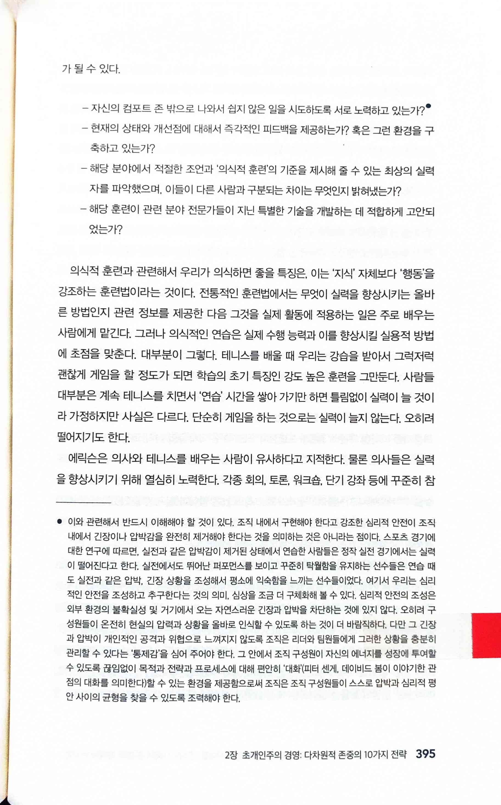

> 조직 내에서 구현해야 한다고 강조한 심리적 안전이 조직 내에서 긴장이나 압박감을 완전히 제거해야 한다는 것을 의미하는 것은 아니라는 점이다. 스포츠 경기에 대한 연구에 따르면, 실전과 같은 압박감이 제거된 상태에서 연습한 사람들은 정작 실전 경기에서는 실력이 떨어진다고 한다. 실전에서도 뛰어난 퍼포먼스를 보이고 꾸준히 탁월함을 유지하는 선수들은 연습 때도 실전과 같은 압박, 긴장 상황을 조성해서 평소에 익숙함을 느끼는 선수들이었다. 여기서 우리는 심리적인 안전을 조성하고 추구한다는 것의 의미, 심상을 조금 더 구체화해 볼 수 있다. 심리적 안전의 조성은 외부 환경의 불확실성 및 거기에서 오는 자연스러운 긴장과 압박을 차단하는 것에 있지 않다. 오히려 구성원들이 온전히 현실의 압력과 상황을 올바로 인식할 수 있도록 하는 것이 더 바람직하다. 다만 그 긴장과 압박이 개인적인 공격과 위협으로 느껴지지 않도록 조직은 리더와 팀원들에게 그러한 상황을 충분히 관리할 수 있다는 '통제감'을 심어 주어야 한다. 그 안에서 조직 구성원이 자신의 에너지를 성장에 투여할 수 있도록 끊임없이 목적과 전략과 프로세스에 대해 편안히 '대화'(피터 센게, 데이비드 봄이 이야기한 관점의 대화를 의미한다)할 수 있는 환경을 제공함으로써 조직은 조직 구성원들이 스스로 압박과 심리적 평안 사이의 균형을 찾을 수 있도록 조력해야 한다.

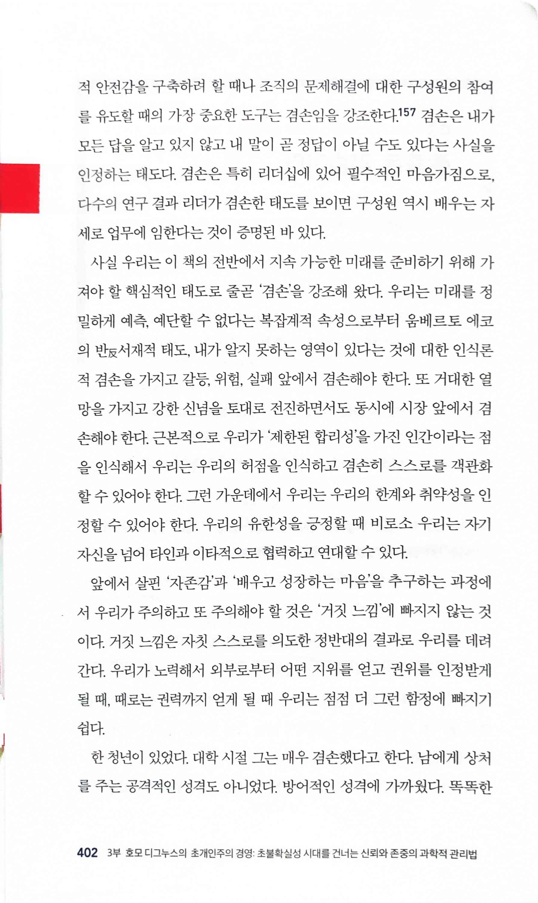

> 겸손은 특히 리더십에 있어 필수적인 마음가짐으로, 다수의 연구 결과 리더가 겸손한 태도를 보이면 구성원 역시 배우는 자세로 업무에 임한다는 것이 증명된 바 있다.

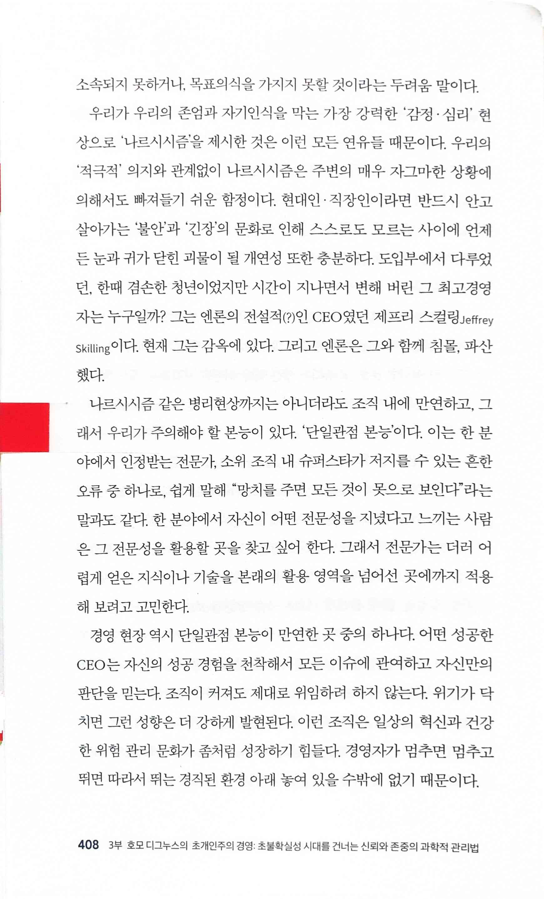

> 나르시시즘 같은 병리현상까지는 아니더라도 조직 내에 만연하고, 그래서 우리가 주의해야 할 본능이 있다. '단일관점 본능'이다. 이는 한 분야에서 인정받는 전문가, 소위 조직 내 슈퍼스타가 저지를 수 있는 흔한오류 중 하나로, 쉽게 말해 "망치를 주면 모든 것이 못으로 보인다”라는 말과도 같다. 한 분야에서 자신이 어떤 전문성을 지녔다고 느끼는 사람은 그 전문성을 활용할 곳을 찾고 싶어 한다. 그래서 전문가는 더러 어렵게 얻은 지식이나 기술을 본래의 활용 영역을 넘어선 곳에까지 적용해 보려고 고민한다.
>
> 경영 현장 역시 단일관점 본능이 만연한 곳 중의 하나다. 어떤 성공한 CEO는 자신의 성공 경험을 천착해서 모든 이슈에 관여하고 자신만의 판단을 믿는다. 조직이 커져도 제대로 위임하려 하지 않는다. 위기가 닥치면 그런 성향은 더 강하게 발현된다. 이런 조직은 일상의 혁신과 건강한 위험 관리 문화가 좀처럼 성장하기 힘들다. 경영자가 멈추면 멈추고 뛰면 따라서 뛰는 경직된 환경 아래 놓여 있을 수밖에 없기 때문이다.

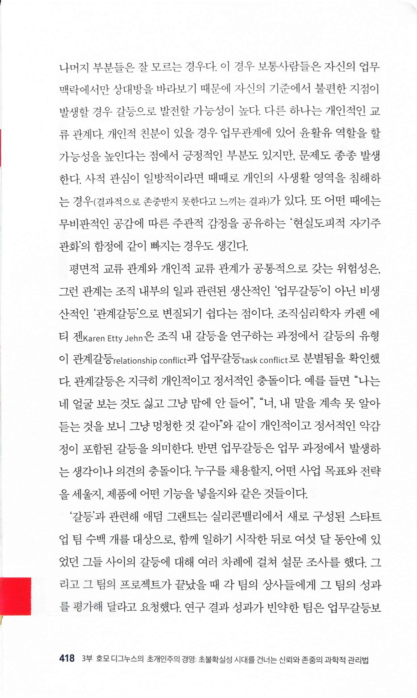

> 평면적 교류 관계와 개인적 교류 관계가 공통적으로 갖는 위험성은, 그런 관계는 조직 내부의 일과 관련된 생산적인 '업무갈등'이 아닌 비생산적인 '관계갈등'으로 변질되기 쉽다는 점이다. 조직심리학자 카렌 에티 젠Karen Etty Jehn은 조직 내 갈등을 연구하는 과정에서 갈등의 유형이 관계갈등relationship conflict과 업무갈등 task conflict로 분별됨을 확인했다. 관계갈등은 지극히 개인적이고 정서적인 충돌이다... 반면 업무갈등은 업무 과정에서 발생하는 생각이나 의견의 충돌이다.

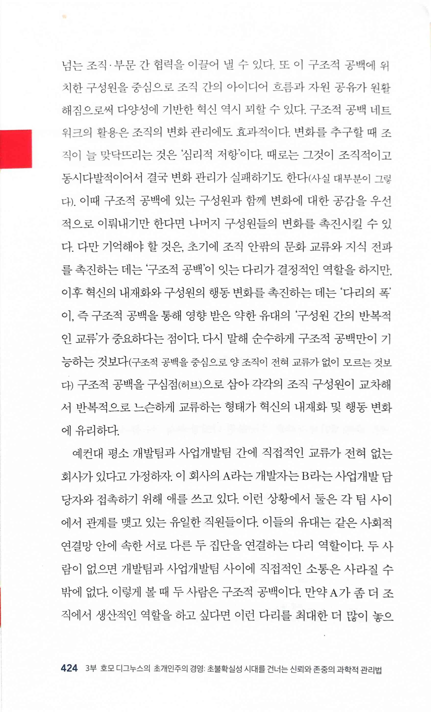

> 변화를 추구할 때 조직이 늘 맞닥뜨리는 것은 '심리적 저항'이다. 때로는 그것이 조직적이고 동시다발적이어서 결국 변화 관리가 실패하기도 한다(사실 대부분이 그렇다). 이때 구조적 공백에 있는 구성원과 함께 변화에 대한 공감을 우선적으로 이뤄내기만 한다면 나머지 구성원들의 변화를 촉진시킬 수 있다... 구조적 공백을 구심점(허브)으로 삼아 각각의 조직 구성원이 교차해서 반복적으로 느슨하게 교류하는 형태가 혁신의 내재화 및 행동 변화에 유리하다.

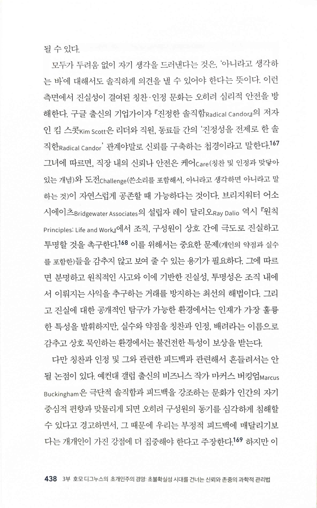

> 진정한 솔직함Radical Candor의 저자인킴 스콧Kim Scott 은 리더와 직원, 동료들 간의 '진정성을 전제로 한 솔직한Radical Candor' 관계야말로 신뢰를 구축하는 첩경이라고 말한다. 그녀에 따르면, 직장 내의 신뢰나 안전은 케어care (칭찬 및 인정과 맞닿아있는 개념)와 도전Challenge(쓴소리를 포함해서, 아니라고 생각하면 아니라고 말하는 것)이 자연스럽게 공존할 때 가능하다는 것이다. 브리지워터 어소시에이츠Bridgewater Associates 의 설립자 레이 달리오Ray Dalio 역시 원칙 Principles: Life and Works에서 조직, 구성원이 상호 간에 극도로 진실하고 투명할 것을 촉구한다. 이를 위해서는 중요한 문제(개인의 약점과 실수를 포함한)들을 감추지 않고 보여 줄 수 있는 용기가 필요하다. 그에 따르면 분명하고 원칙적인 사고와 이에 기반한 진실성, 투명성은 조직 내에서 이뤄지는 사익을 추구하는 거래를 방지하는 최선의 해법이다. 그리고 진실에 대한 공개적인 탐구가 가능한 환경에서는 인재가 가장 훌륭한 특성을 발휘하지만, 실수와 약점을 칭찬과 인정, 배려라는 이름으로 감추고 상호 묵인하는 환경에서는 불건전한 특성이 보상을 받는다.
* [실리콘밸리의 팀장들 radical candor](https://github.com/hyunjun/bookmarks/blob/master/programming_books/radical_candor.md)

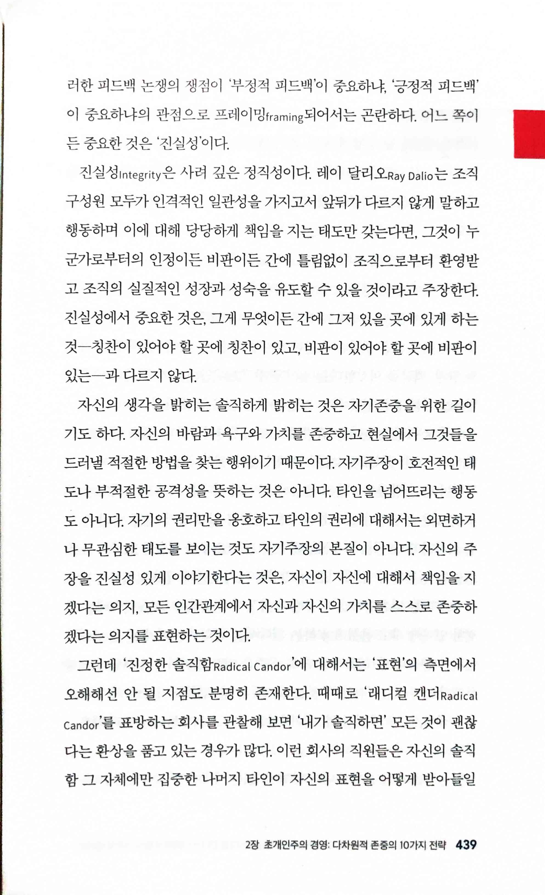

> 피드백 논쟁의 쟁점이 '부정적 피드백'이 중요하냐, '긍정적 피드백'이 중요하냐의 관점으로 프레이밍framing되어서는 곤란하다. 어느 쪽이든 중요한 것은 '진실성'이다.
>
> 진실성 Integrity 은 사려 깊은 정직성이다. 레이 달리오Ray Dalio 는 조직구성원 모두가 인격적인 일관성을 가지고서 앞뒤가 다르지 않게 말하고 행동하며 이에 대해 당당하게 책임을 지는 태도만 갖는다면, 그것이 누군가로부터의 인정이든 비판이든 간에 틀림없이 조직으로부터 환영받고 조직의 실질적인 성장과 성숙을 유도할 수 있을 것이라고 주장한다. 진실성에서 중요한 것은, 그게 무엇이든 간에 그저 있을 곳에 있게 하는 것칭찬이 있어야 할 곳에 칭찬이 있고, 비판이 있어야 할 곳에 비판이 있는 과 다르지 않다.

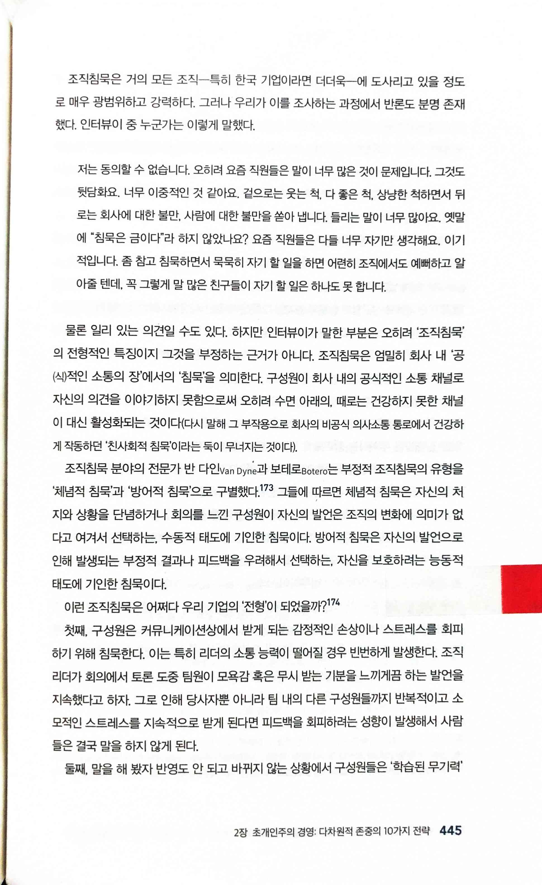 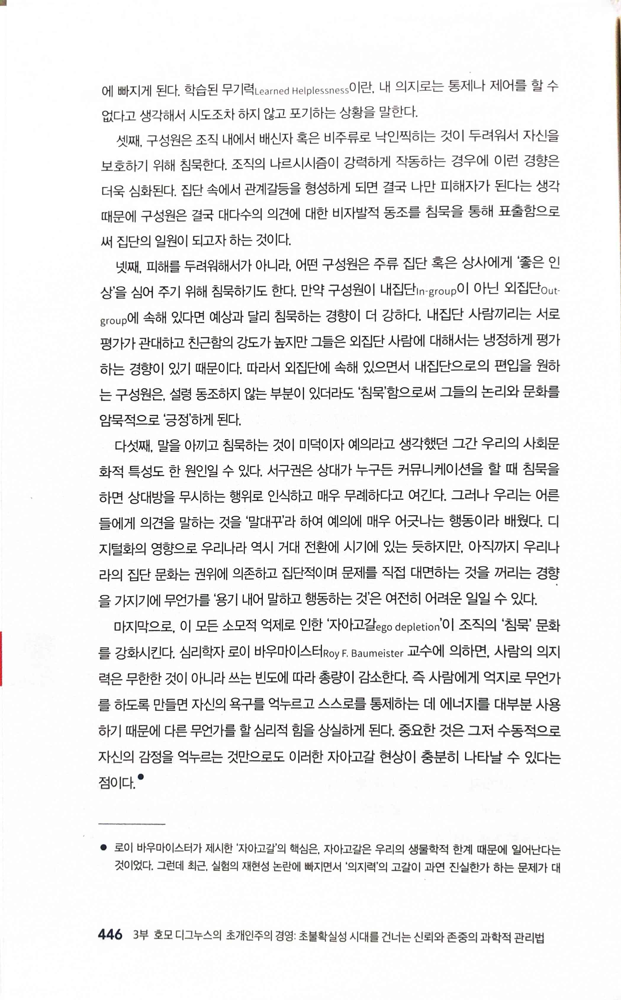

> 조직침묵 분야의 전문가 반 다인Van Dyne과 보테로Botero는 부정적 조직침묵의 유형을'체념적 침묵'과 '방어적 침묵'으로 구별했다. 그들에 따르면 체념적 침묵은 자신의 처지와 상황을 단념하거나 회의를 느낀 구성원이 자신의 발언은 조직의 변화에 의미가 없다고 여겨서 선택하는 수동적 태도에 기인한 침묵이다. 방어적 침묵은 자신의 발언으로인해 발생되는 부정적 결과나 피드백을 우려해서 선택하는 자신을 보호하려는 능동적 태도에 기인한 침묵이다.
>
> 첫째, 구성원은 커뮤니케이션상에서 받게 되는 감정적인 손상이나 스트레스를 회피하기 위해 침묵한다. 이는 특히 리더의 소통 능력이 떨어질 경우 빈번하게 발생한다.
>
> 둘째, 말을 해 봤자 반영도 안 되고 바뀌지 않는 상황에서 구성원들은 '학습된 무기력'에 빠지게 된다. 학습된 무기력Learned Helplessness 이란, 내 의지로는 통제나 제어를 할 수 없다고 생각해서 시도조차 하지 않고 포기하는 상황을 말한다.
>
> 셋째, 구성원은 조직 내에서 배신자 혹은 비주류로 낙인찍히는 것이 두려워서 자신을 보호하기 위해 침묵한다. 조직의 나르시시즘이 강력하게 작동하는 경우에 이런 경향은 더욱 심화된다.
>
> 넷째, 피해를 두려워해서가 아니라, 어떤 구성원은 주류 집단 혹은 상사에게 '좋은 인상'을 심어 주기 위해 침묵하기도 한다. 만약 구성원이 내집단in-group이 아닌 외집단 out group에 속해 있다면 예상과 달리 침묵하는 경향이 더 강하다. 내집단 사람끼리는 서로 평가가 관대하고 친근함의 강도가 높지만 그들은 외집단 사람에 대해서는 냉정하게 평가하는 경향이 있기 때문이다.
>
> 다섯째, 말을 아끼고 침묵하는 것이 미덕이자 예의라고 생각했던 그간 우리의 사회문화적 특성도 한 원인일 수 있다. 
>
> 마지막으로, 이 모든 소모적 억제로 인한 '자아고갈ego depletion'이 조직의 '침묵' 문화를 강화시킨다. 심리학자 로이 바우마이스터Roy F. Baumeister 교수에 의하면, 사람의 의지력은 무한한 것이 아니라 쓰는 빈도에 따라 총량이 감소한다. 즉 사람에게 억지로 무언가를 하도록 만들면 자신의 욕구를 억누르고 스스로를 통제하는 데 에너지를 대부분 사용하기 때문에 다른 무언가를 할 심리적 힘을 상실하게 된다. 중요한 것은 그저 수동적으로 자신의 감정을 억누르는 것만으로도 이러한 자아고갈 현상이 충분히 나타날 수 있다는 점이다.

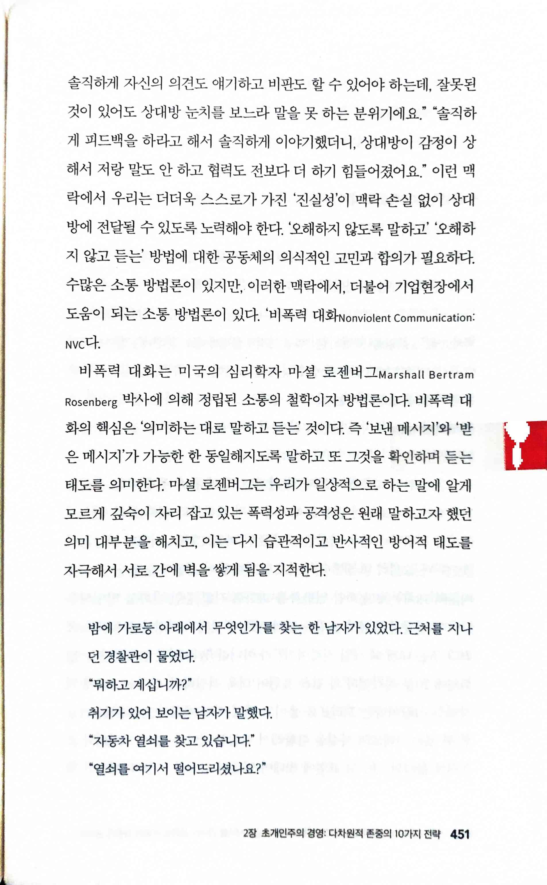

> 비폭력 대화는 미국의 심리학자 마셜 로젠버그 Marshall Bertram Rosenberg 박사에 의해 정립된 소통의 철학이자 방법론이다. 비폭력 대화의 핵심은 '의미하는 대로 말하고 듣는' 것이다. 즉 '보낸 메시지'와 '받은 메시지'가 가능한 한 동일해지도록 말하고 또 그것을 확인하며 듣는 태도를 의미한다. 마셜 로젠버그는 우리가 일상적으로 하는 말에 알게 모르게 깊숙이 자리 잡고 있는 폭력성과 공격성은 원래 말하고자 했던 의미 대부분을 해치고, 이는 다시 습관적이고 반사적인 방어적 태도를 자극해서 서로 간에 벽을 쌓게 됨을 지적한다.

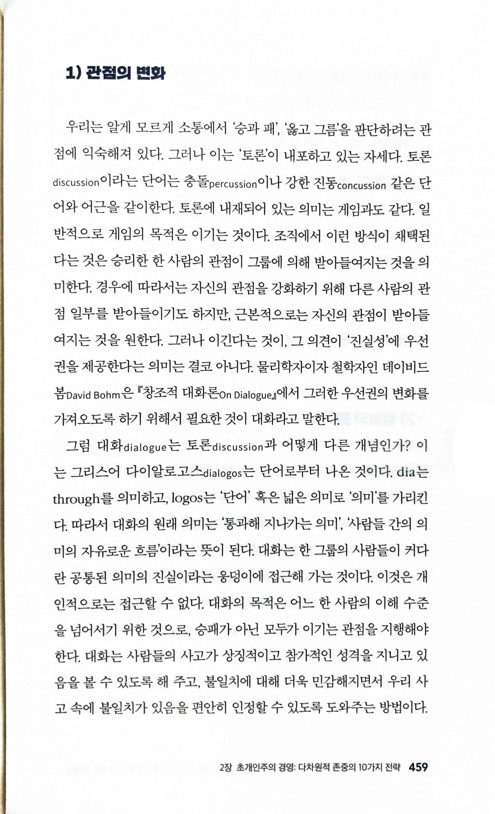

> 우리는 알게 모르게 소통에서 '승과 패', '옳고 그름'을 판단하려는 관점에 익숙해져 있다. 그러나 이는 '토론'이 내포하고 있는 자세다. 토론 discussion이라는 단어는 충돌percussion이나 강한 진동concussion 같은 단어와 어근을 같이한다... 근본적으로는 자신의 관점이 받아들여지는 것을 원한다. 그러나 이긴다는 것이, 그 의견이 '진실성'에 우선권을 제공한다는 의미는 결코 아니다.
>
> 그럼 대화dialogue 는 토론discussion과 어떻게 다른 개념인가? 이는 그리스어 다이알로고스dialogos는 단어로부터 나온 것이다. dia는 through 를 의미하고, logos는 '단어' 혹은 넓은 의미로 '의미'를 가리킨다. 따라서 대화의 원래 의미는 '통과해 지나가는 의미', '사람들 간의 의미의 자유로운 흐름'이라는 뜻이 된다. 대화는 한 그룹의 사람들이 커다란 공통된 의미의 진실이라는 웅덩이에 접근해 가는 것이다. 이것은 개인적으로는 접근할 수 없다. 대화의 목적은 어느 한 사람의 이해 수준을 넘어서기 위한 것으로 승패가 아닌 모두가 이기는 관점을 지행해야 한다. 대화는 사람들의 사고가 상징적이고 참가적인 성격을 지니고 있음을 볼 수 있도록 해 주고, 불일치에 대해 더욱 민감해지면서 우리 사고 속에 불일치가 있음을 편안히 인정할 수 있도록 도와주는 방법이다.

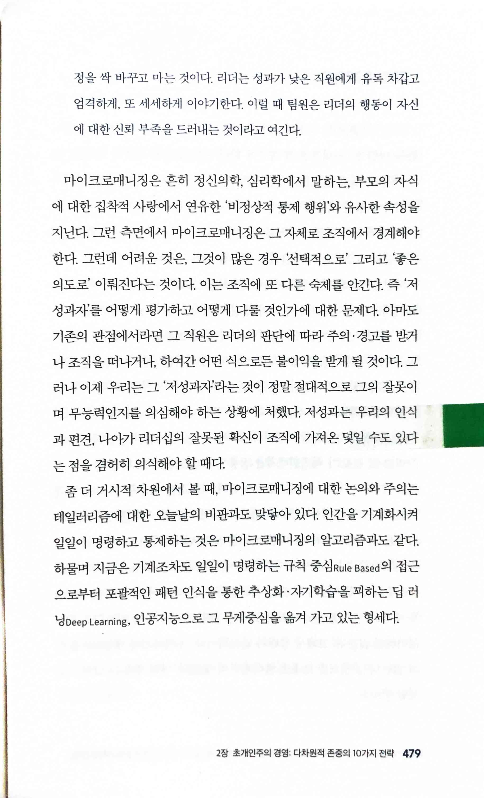

> 저성과는 우리의 인식과 편견, 나아가 리더십의 잘못된 확신이 조직에 가져온 덫일 수도 있다는 점을 겸허히 의식해야 할 때다.

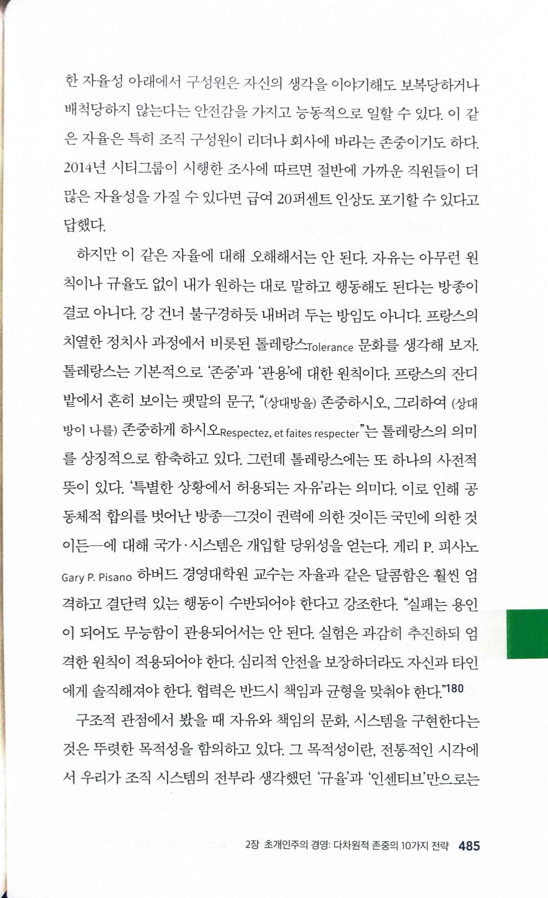

> 게리 P. 피사노Gary P. Pisano 하버드 경영대학원 교수는 자율과 같은 달콤함은 훨씬 엄격하고 결단력 있는 행동이 수반되어야 한다고 강조한다. “실패는 용인이 되어도 무능함이 관용되어서는 안 된다. 실험은 과감히 추진하되 엄격한 원칙이 적용되어야 한다. 심리적 안전을 보장하더라도 자신과 타인에게 솔직해져야 한다. 협력은 반드시 책임과 균형을 맞춰야 한다."

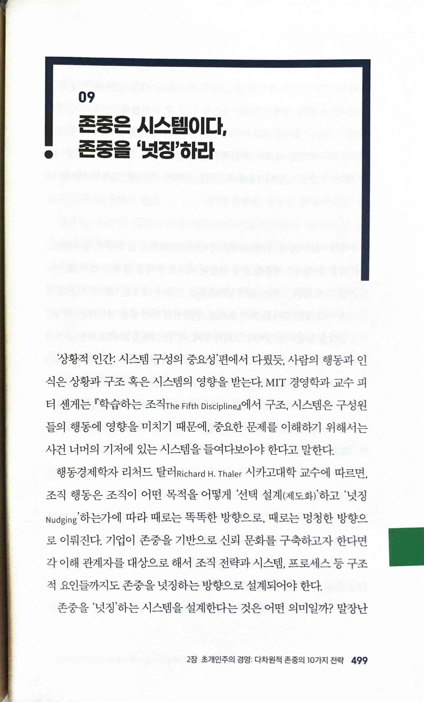

> 행동경제학자 리처드 탈러 Richard H. Thaler 시카고대학 교수에 따르면, 조직 행동은 조직이 어떤 목적을 어떻게 '선택 설계(제도화)'하고 '넛징 Nudging'하는가에 따라 때로는 똑똑한 방향으로, 때로는 멍청한 방향으로 이뤄진다. 기업이 존중을 기반으로 신뢰 문화를 구축하고자 한다면 각 이해 관계자를 대상으로 해서 조직 전략과 시스템, 프로세스 등 구조적 요인들까지도 존중을 넛징하는 방향으로 설계되어야 한다.

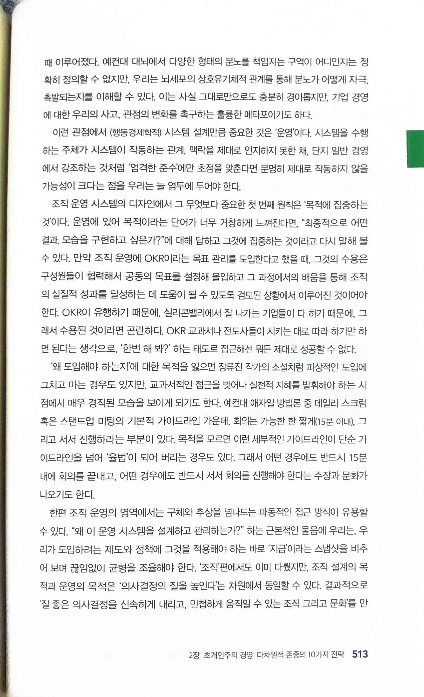

> 이런 관점에서 (행동경제학적) 시스템 설계만큼 중요한 것은 '운영'이다. 시스템을 수행하는 주체가 시스템이 작동하는 관계, 맥락을 제대로 인지하지 못한 채, 단지 일반 경영에서 강조하는 것처럼 '엄격한 준수'에만 초점을 맞춘다면 분명히 제대로 작동하지 않을가능성이 크다는 점을 우리는 늘 염두에 두어야 한다.
>
> 조직 운영 시스템의 디자인에서 그 무엇보다 중요한 첫 번째 원칙은 '목적에 집중하는것'이다. 

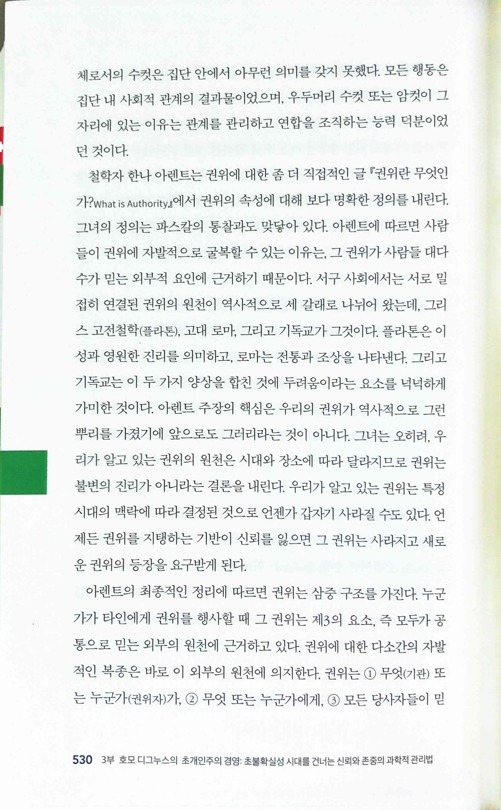

> 철학자 한나 아렌트는 권위에 대한 좀 더 직접적인 글 권위란 무엇인가? What is Authority에서 권위의 속성에 대해 보다 명확한 정의를 내린다.그녀의 정의는 파스칼의 통찰과도 맞닿아 있다. 아렌트에 따르면 사람들이 권위에 자발적으로 굴복할 수 있는 이유는, 그 권위가 사람들 대다수가 믿는 외부적 요인에 근거하기 때문이다. 서구 사회에서는 서로 밀접히 연결된 권위의 원천이 역사적으로 세 갈래로 나뉘어 왔는데, 그리스 고전철학(플라톤), 고대 로마, 그리고 기독교가 그것이다. 플라톤은 이성과 영원한 진리를 의미하고, 로마는 전통과 조상을 나타낸다. 그리고 기독교는 이 두 가지 양상을 합친 것에 두려움이라는 요소를 넉넉하게 가미한 것이다. 아렌트 주장의 핵심은 우리의 권위가 역사적으로 그런뿌리를 가졌기에 앞으로도 그러리라는 것이 아니다. 그녀는 오히려, 우리가 알고 있는 권위의 원천은 시대와 장소에 따라 달라지므로 권위는불변의 진리가 아니라는 결론을 내린다. 우리가 알고 있는 권위는 특정시대의 맥락에 따라 결정된 것으로 언젠가 갑자기 사라질 수도 있다. 언제든 권위를 지탱하는 기반이 신뢰를 잃으면 그 권위는 사라지고 새로운 권위의 등장을 요구받게 된다.
* [arendt_what-is-authority.pdf](https://blogs.law.columbia.edu/uprising1313/files/2017/09/arendt_what-is-authority.pdf)

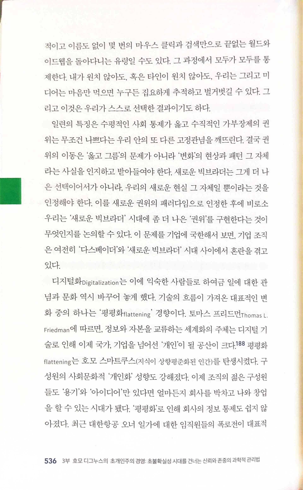

> 권위의 이동은 '옳고 그름'의 문제가 아니라 '변화'의 현상과 패턴 그 자체라는 사실을 인지하고 받아들여야 한다. 새로운 빅브라더는 그게 더 나은 선택이어서가 아니라, 우리의 새로운 현실 그 자체일 뿐이라는 것을 인정해야 한다.

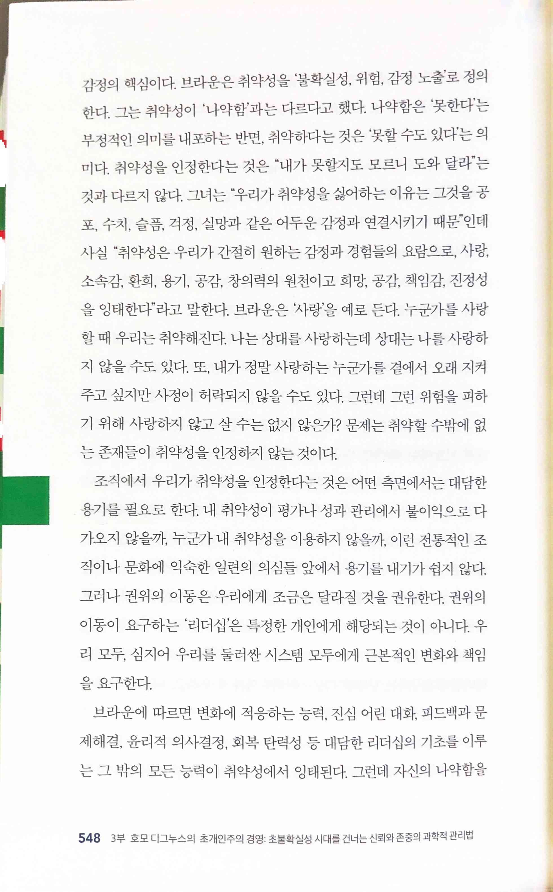

> 조직에서 우리가 취약성을 인정한다는 것은 어떤 측면에서는 대담한 용기를 필요로 한다. 내 취약성이 평가나 성과 관리에서 불이익으로 다가오지 않을까, 누군가 내 취약성을 이용하지 않을까 이런 전통적인 조직이나 문화에 익숙한 일련의 의심들 앞에서 용기를 내기가 쉽지 않다. 그러나 권위의 이동은 우리에게 조금은 달라질 것을 권유한다. 권위의 이동이 요구하는 '리더십'은 특정한 개인에게 해당되는 것이 아니다. 우리 모두, 심지어 우리를 둘러싼 시스템 모두에게 근본적인 변화와 책임을 요구한다.

# 에필로그 더 나음을 위한 마음과 태도
