피플 애널리틱스
===============
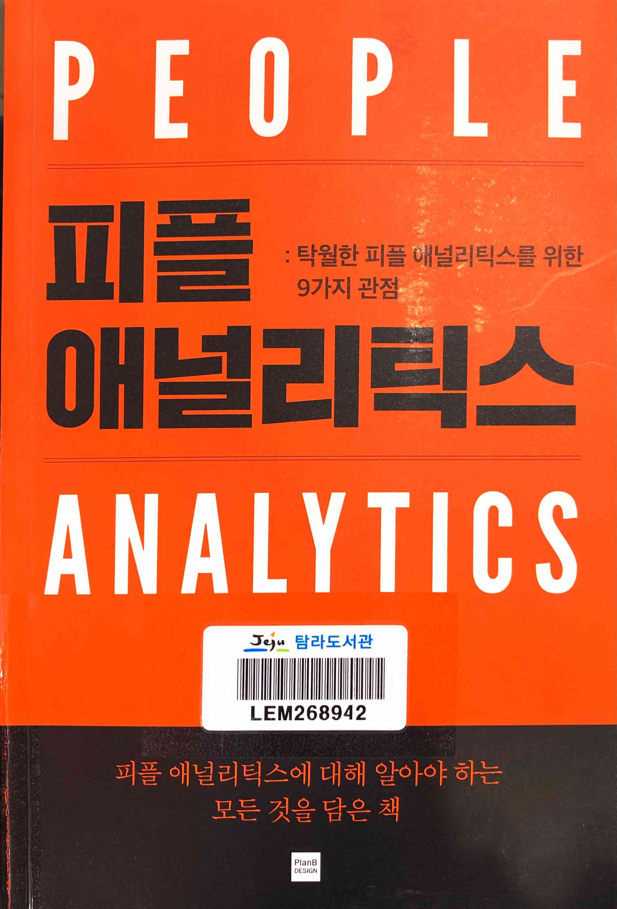

# Part 1 피플 애널리틱스 사례
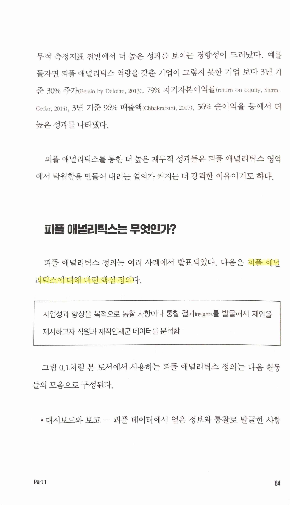 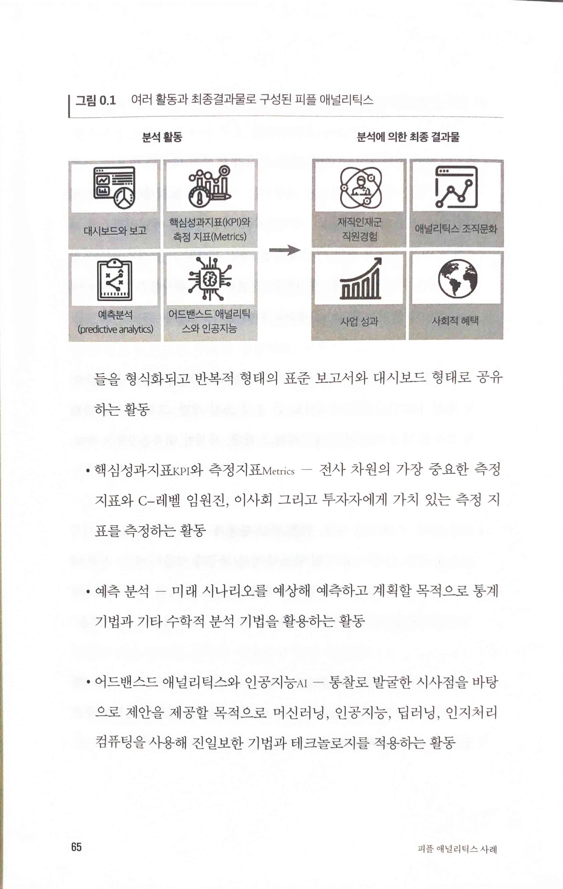 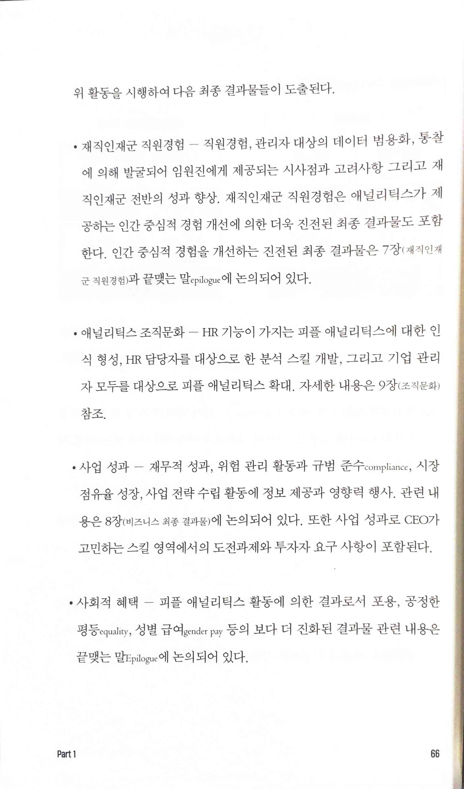 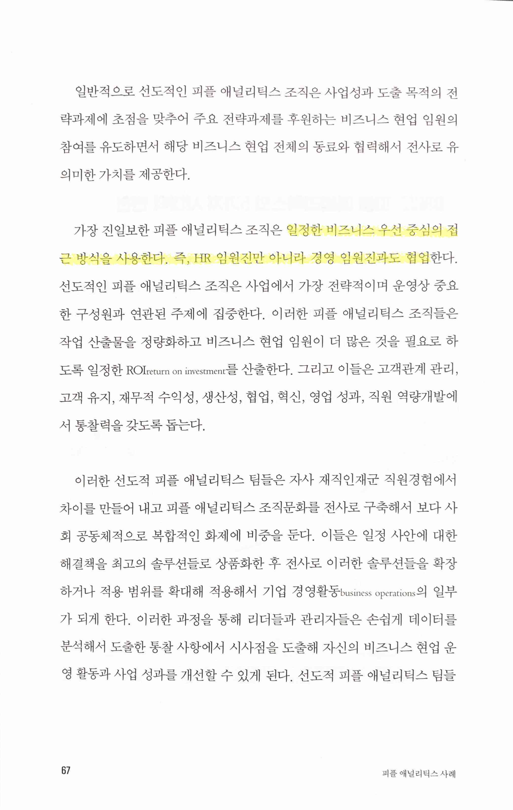

> 피플 애널리틱스에 대해 내린 핵심 정의
>
> 사업성과 향상을 목적으로 통찰 사항이나 통찰 결과 insights 를 발굴해서 제안을 제시하고자 직원과 재직인재군 데이터를 분석함
>
> 가장 진일보한 피플 애널리틱스 조직은 일정한 비즈니스 우선 중심의 접근 방식을 사용. 즉, HR 임원진만 아니라 경영 임원진과도 협업

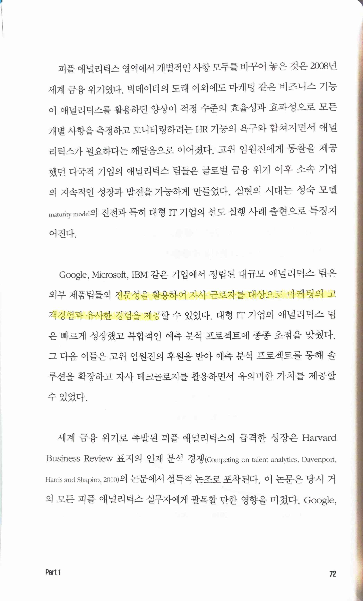

> 대규모 애널리틱스 팀은 외부 제품팀들의 전문성을 활용하여 자사 근로자를 대상으로 마케팅의 고객경험과 유사한 경험을 제공
* 내부 고객의 개념으로 접근하는 걸까?

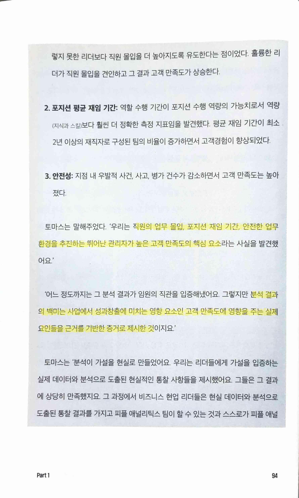

> 직원의 업무 몰입, 포지션 재임 기간, 안전한 업무 환경을 추진하는 뛰어난 관리자가 높은 고객 만족도의 핵심 요소
>
> 분석 결과의 백미는 사업에서 성과창출에 미치는 영향 요소인 고객 만족도에 영향을 주는 실제 요인들을 근거를 기반한 증거로 제시한 것

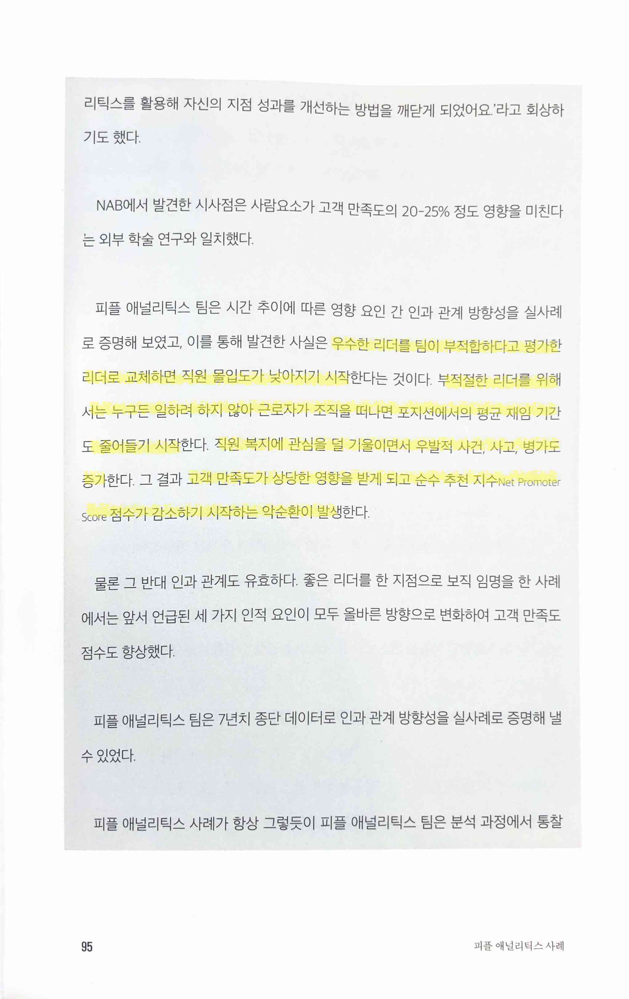

> 우수한 리더를 팀이 부적합하다고 평가한 리더로 교체하면 직원 몰입도가 낮아지기 시작. 부적절한 리더를 위해서는 누구든 일하려 하지 않아 근로자가 조직을 떠나면 포지션에서의 평균 재임 기간도 줄어들기 시작. 직원 복지에 관심을 덜 기울이면서 우발적 사건, 사고, 병가도 증가. 그 결과 고객 만족도가 상당한 영향을 받게 되고 순수 추천 지수 Net Promoter Score 점수가 감소하기 시작하는 악순환이 발생

# Part 2 탁월한 피플 애널리틱스를 위한 9가지 관점

## 01 통제와 관리체제 (governance)

## 02 방법론(Methodology)
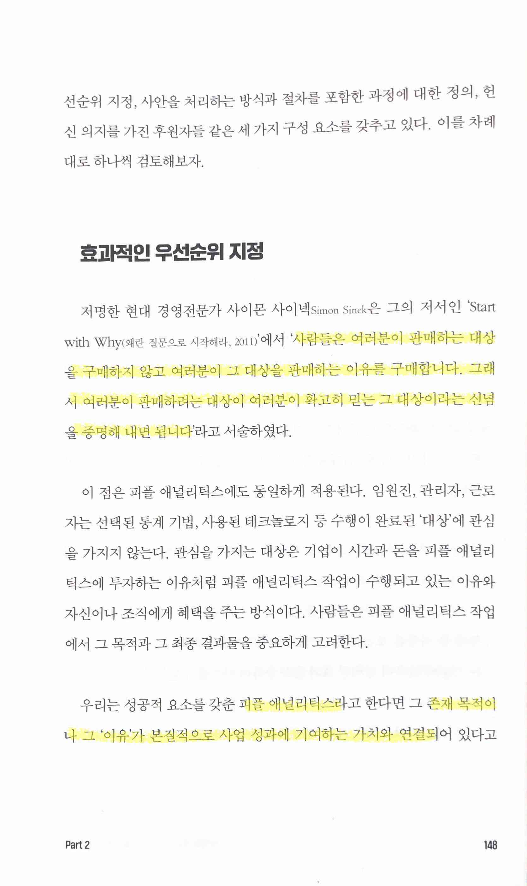

> 사이몬 사이넥 Simon Sinck, 'Start with Why(왜란 질문으로 시작해라 2011)', '사람들은 여러분이 판매하는 대상을 구매하지 않고 여러분이 그 대상을 판매하는 이유를 구매합니다. 그래서 여러분이 판매하려는 대상이 여러분이 확고히 믿는 그 대상이라는 신념을 증명해 내면 됩니다'
>
> 피플 애널리틱스... 존재 목적이나 그 '이유'가 본질적으로 사업 성과에 기여하는 가치와 연결
* 피플 애널리틱스만이 아니라 모든 기업 활동이 본질적으로 그렇다

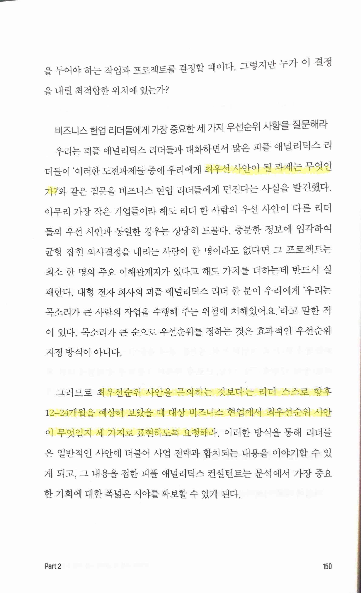

> 최우선 사안이 될 과제는 무엇인가?
>
> 최우선순위 사안을 문의하는 것보다는 리더 스스로 향후 12-24개월을 예상해 보았을 때 대상 비즈니스 현업에서 최우선순위 사안이 무엇일지 세 가지로 표현하도록 요청해라.
* 내가 지금 이런 실수를 하고 있는건지 자문이 필요한 상황

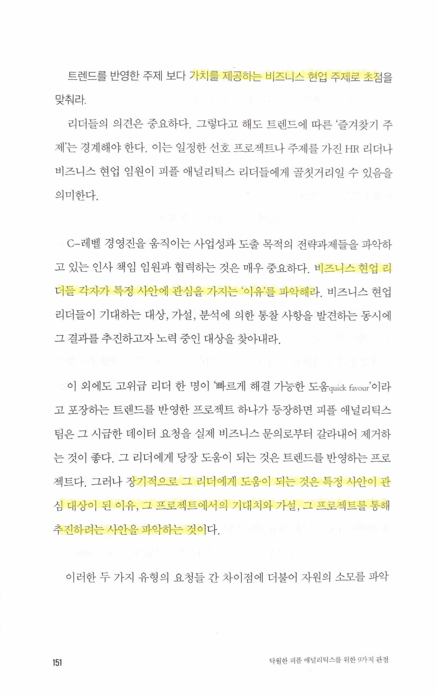

> 가치를 제공하는 비즈니스 현업 주제로 초점
>
> 비즈니스 현업 리더들 각자가 특정 사안에 관심을 가지는 '이유'를 파악해라.
>
> 장기적으로 그 리더에게 도움이 되는 것은 특정 사안이 관심 대상이 된 이유, 그 프로젝트에서의 기대치와 가설, 그 프로젝트를 통해 추진하려는 사안을 파악하는 것

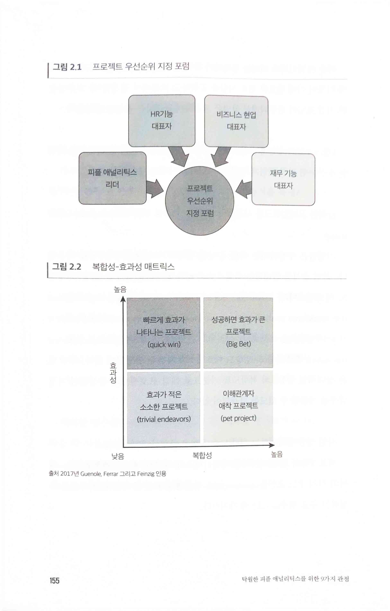

> 프로젝트 우선순위 지정 포럼, 복합성-효과성 매트릭스

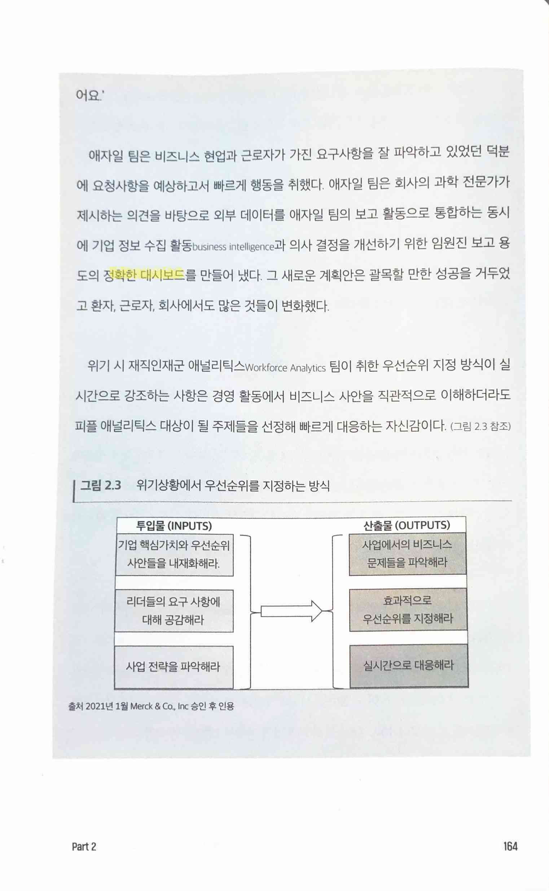

> 의사 결정을 개선하기 위한 임원진 보고 용도의 정확한 대시보드
* 현재 내가 부족하다고 느끼는 많은 것들 중 하나

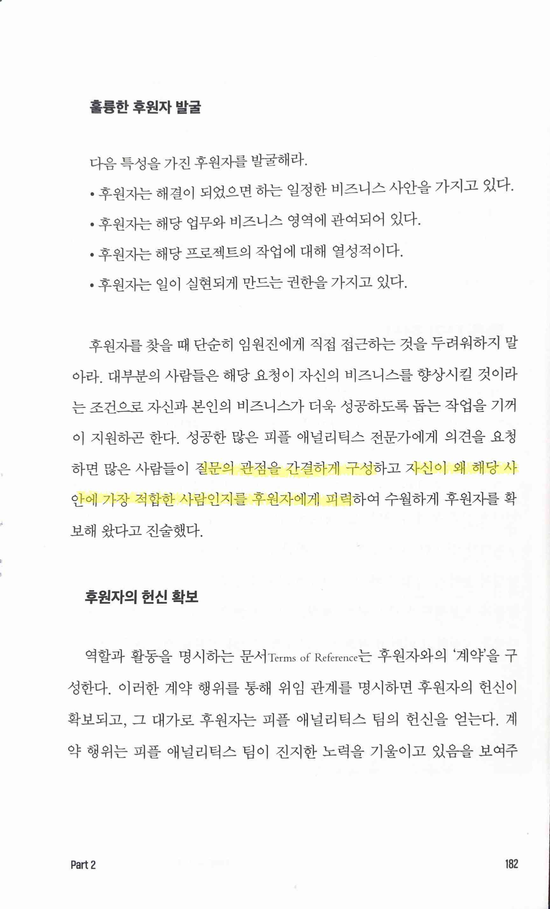

> 질문의 관점을 간결하게 구성, 자신이 왜 해당 사안에 가장 적합한 사람인지를 후원자에게 피력
* friction을 줄일 방법 중 하나로 필요

## 03 이해관계자 관리 (Stakeholder Management)
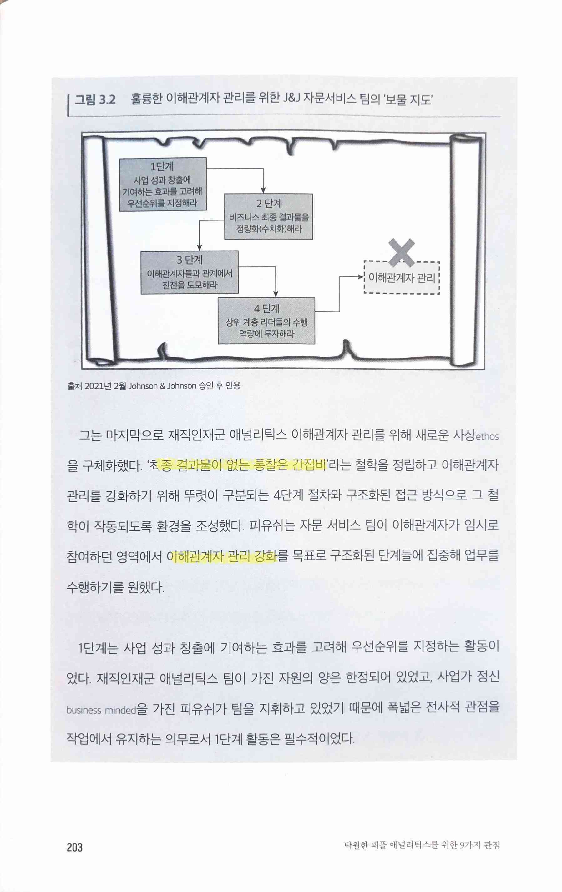

> '최종 결과물이 없는 통찰은 간접비'... 이해관계자 관리 강화

## 04 스킬(skills)
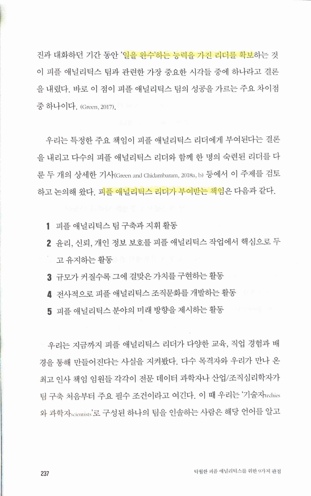

> 일을 완수하는 능력을 가진 리더 확보
>
> 피플 애널리틱스 리더가 부여받는 책임

## 05 테크놀로지
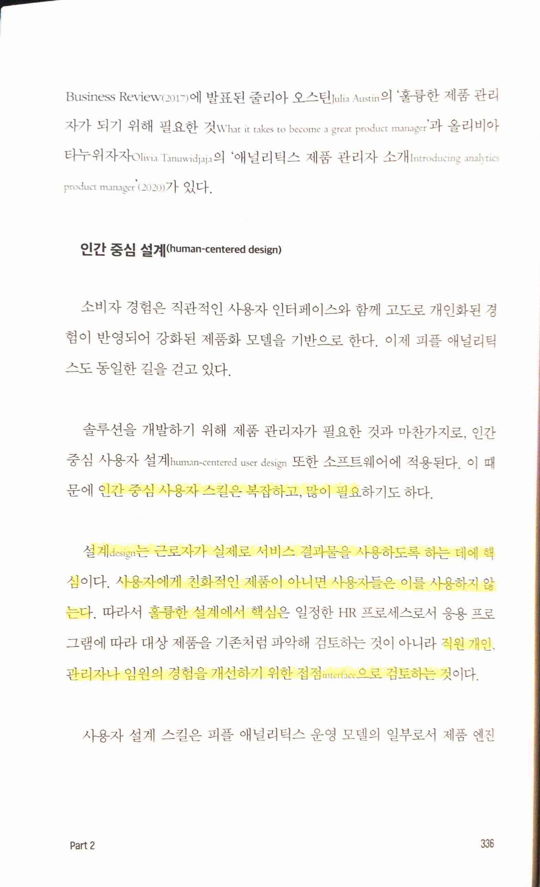

> 인간 중심 사용자 스킬은 복잡하고, 많이 필요
>
> 설계 design는 근로자가 실제로 서비스 결과물을 사용하도록 하는 데에 핵심. 사용자에게 친화적인 제품이 아니면 사용자들은 이를 사용하지 않는다. 훌륭한 설계에서 핵심은... 직원 개인, 관리자나 임원의 경험을 개선하기 위한 접점 interface으로 검토하는 것

## 06 데이터(data)
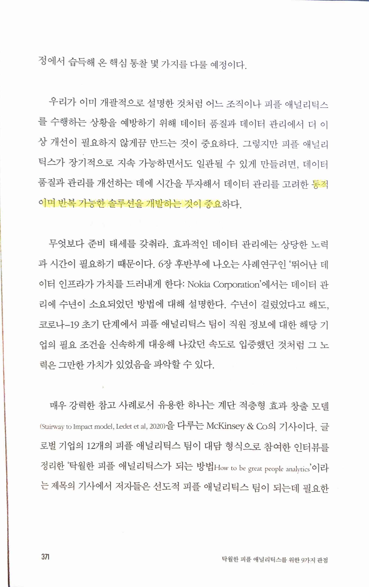

> 동적이며 반복 가능한 솔루션을 개발하는 것이 중요
* 역시 피플 애널리틱스만이 아니라 일반적인 개발의 원리로 중요

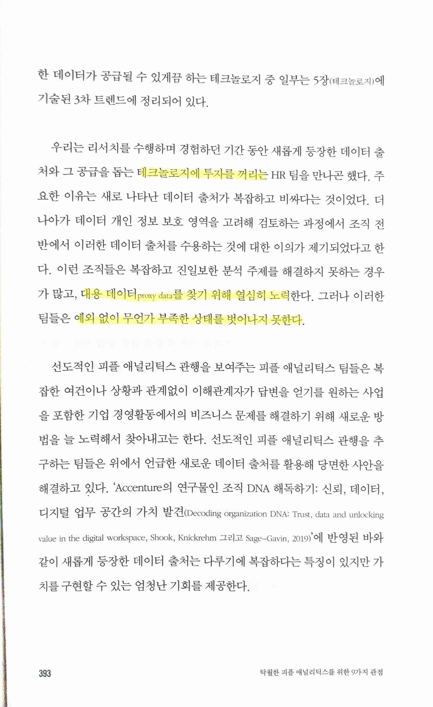

> 테크놀로지에 투자를 꺼리는... 복잡하고 진일보한 분석 주제를 해결하지 못하는 경우가 많고, 대용 데이터 proxy data를 찾기 위해 열심히 노력... 예외 없이 무언가 부족한 상태를 벗어나지 못한다.

* 불타는 갑판(burning flatform)
  * 변하지 않았을 경우 사람들이 겪게 될 결과를 보도록 돕는 과정을 설명하는 용어
  * 그대로 현상 유지가 되면 어떻게 되는지에 대해 충분한 우려를 촉발시켜 사람들이 변화를 수용하게 한다.
* NPS(Net Promoter Score)
  * Fred Reichheld, Bain & Company와 Satmetrix Systems, Inc.에서 개발한 (등록 상표) 고객 충성도 측정 지표
  * Reichheld는 2003년 Harvard Business Review 기사 'One number you need to grow'에서 NPS를 소개
  * [The One Number You Need to Grow](https://hbr.org/2003/12/the-one-number-you-need-to-grow)

## 07 재직인재군 직원경험 (workforce Experiences)
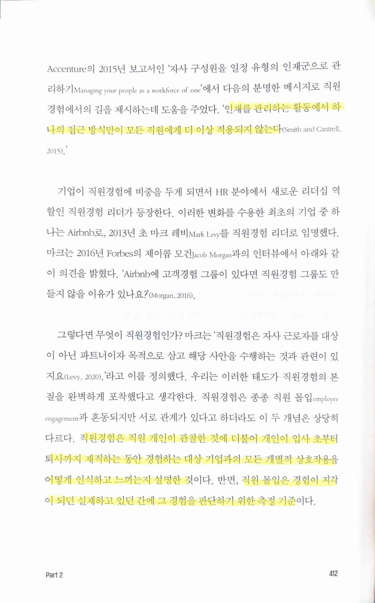

> '인재를 관리하는 활동에서 하나의 접근 방식만이 모든 직원에게 더 이상 적용되지 않는다'
>
> `직원경험`은 직원 개인이 관찰한 것에 더불어 개인이 입사 초부터 퇴사까지 재직하는 동안 경험하는 대상 기업과의 모든 개별적 상호작용을 어떻게 인식하고 느끼는지 설명한 것. `직원 몰입`은 경험이 지각이 되던 실재하고 있던 간에 그 경험을 판단하기 위한 측정 기준

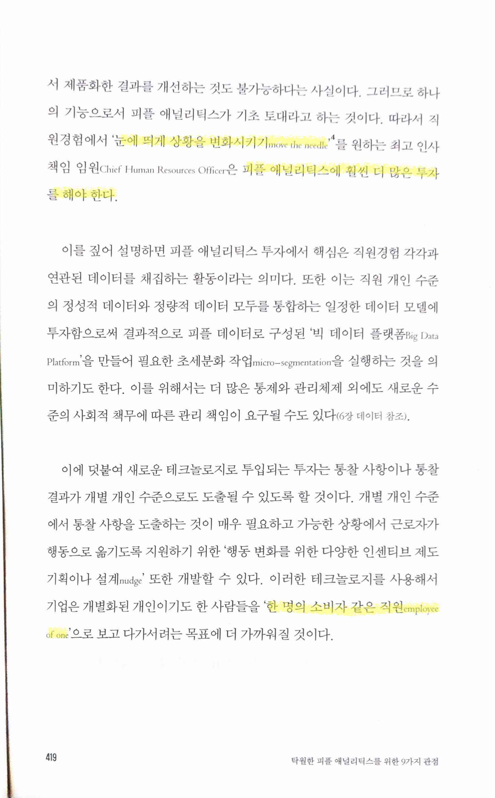

> '눈에 띄게 상황을 변화시키기 move the needle'... 피플 애널리틱스에 훨씬 더 많은 투자를 해야 한다.
>
> '한 명의 소비자 같은 직원 employee of one'

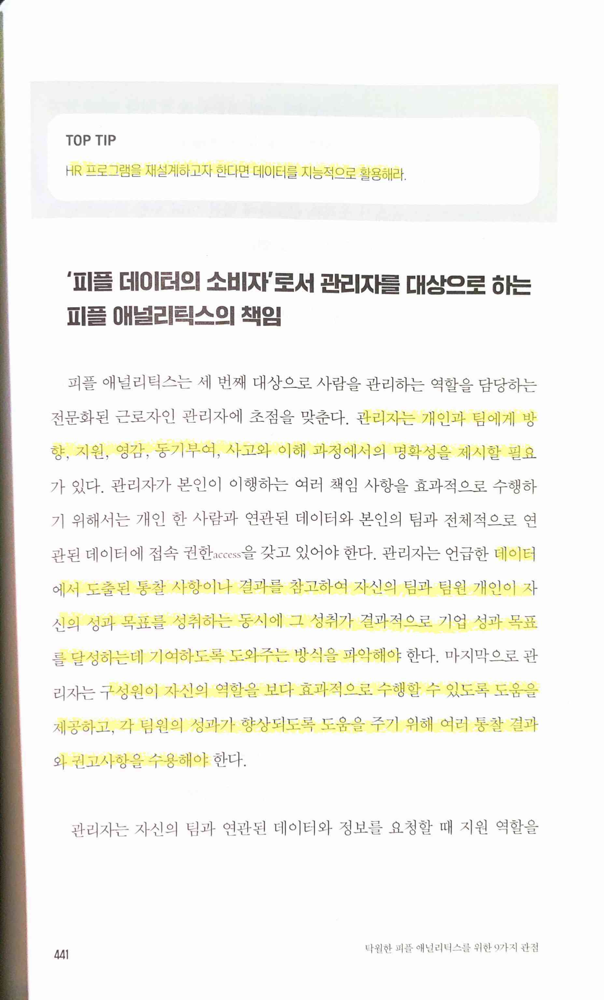

> HR 프로그램을 재설계하고자 한다면 데이터를 지능적으로 활용해라
>
> 관리자는 개인과 팀에게 방향, 지원, 영감, 동기부여, 사고와 이해 과정에서의 명확성을 제시할 필요... 데이터에서 도출된 통찰 사항이나 결과를 참고하여 자신의 팀과 팀원 개인이 자신의 성과 목표를 성취하는 동시에 그 성취가 결과적으로 기업 성과 목표를 달성하는데 기여하도록 도와주는 방식을 파악해야... 구성원이 자신의 역할을 보다 효과적으로 수행할 수 있도록 도움을 제공하고, 각 팀원의 성과가 향상되도록 도움을 주기 위해 여러 통찰 결과와 권고사항을 수용해야

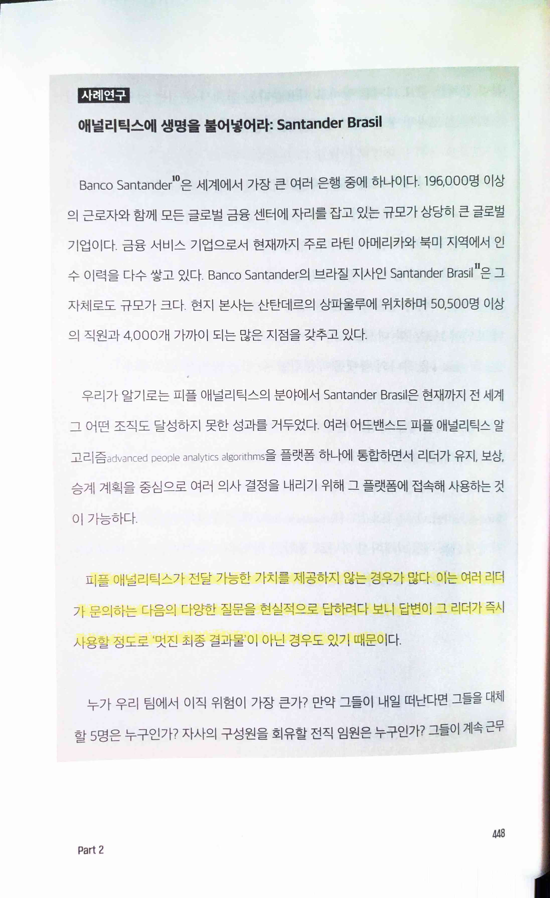 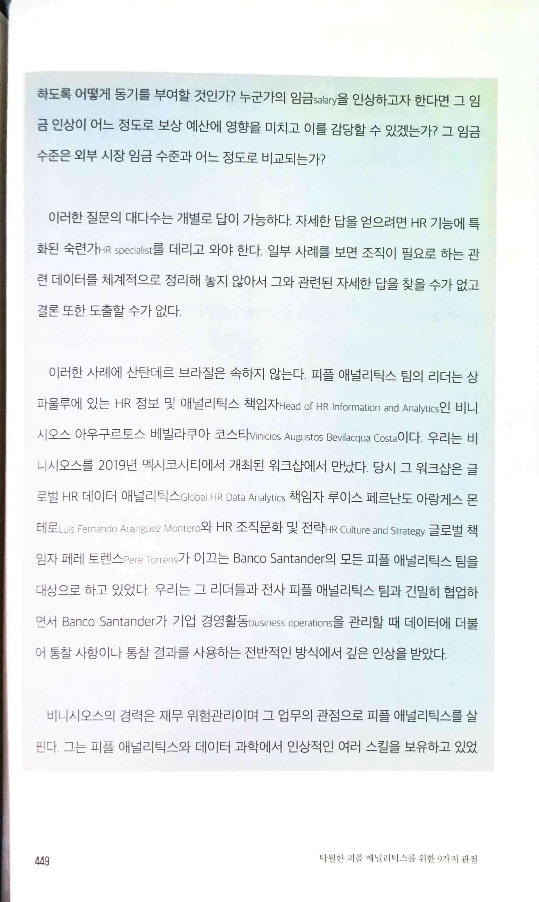 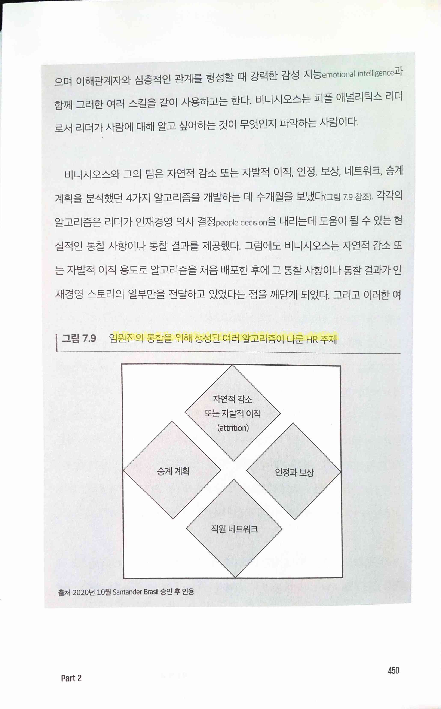

> 피플 애널리틱스가 전달 가능한 가치를 제공하지 않는 경우가 많다. 이는 여러 리더가 문의하는 다음의 다양한 질문을 현실적으로 답하려다 보니 답변이 그 리더가 즉시 사용할 정도로 '멋진 최종 결과물'이 아닌 경우도 있기 때문
* 결국은 tech 바탕에 사람의 정성적인 부분이 들어가야 하는 걸까? ChatGPT같은 녀석이 이런 걸 언제쯤 대체할 수 있을까?
> 임원진의 통찰을 위해 생성된 여러 알고리즘이 다룬 HR 주제

## 08 비즈니스 최종 결과물

> 수요의 7가지 동인

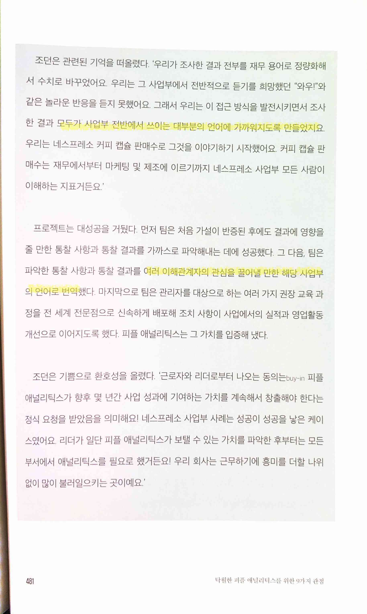

> 모두가 사업부 전반에서 쓰이는 대부분의 언어에 가까워지도록 만들었지요.
>
> 여러 이해관계자의 관심을 끌어낼 만한 해당 사업부의 언어로 번역

## 09 조직문화
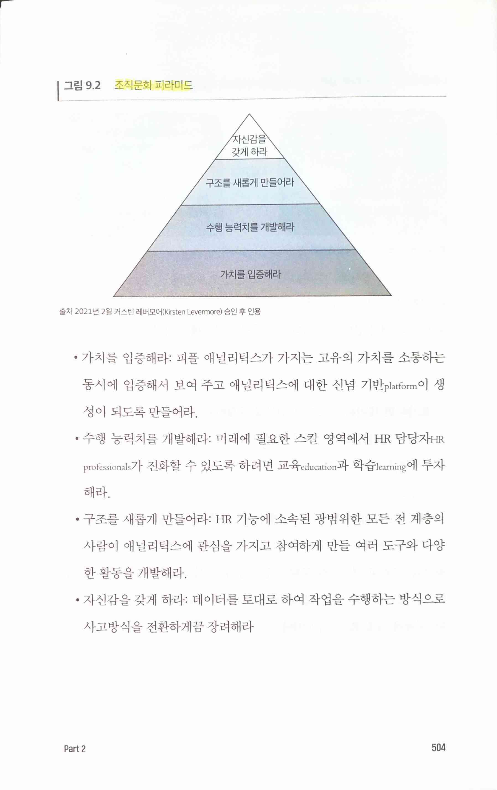

> 조직문화 피라미드

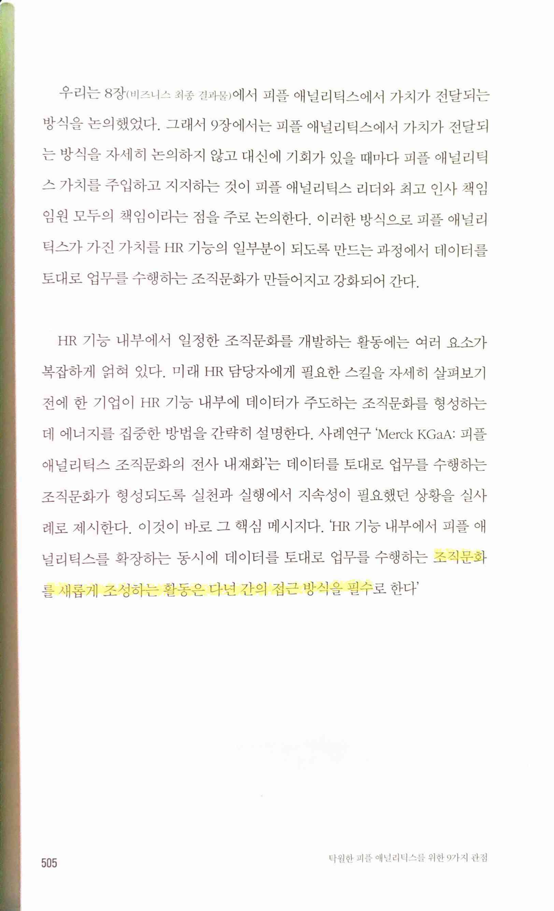

> 조직문화를 새롭게 조성하는 활동은 다년간의 접근 방식을 필수
* 얼마나 길게 보고 접근해야 할까?

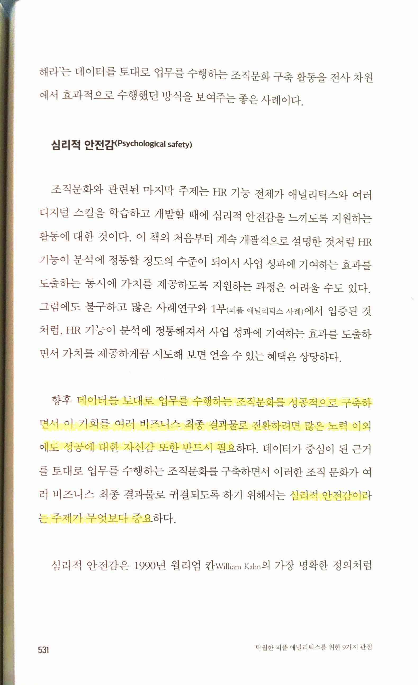

> 데이터를 토대로 업무를 수행하는 조직문화를 성공적으로 구축하면서 이 기회를 여러 비즈니스 최종 결과물로 전환하려면 많은 노력 이외에도 성공에 대한 자신감 또한 반드시 필요... 심리적 안전감이라는 주제가 무엇보다 중요

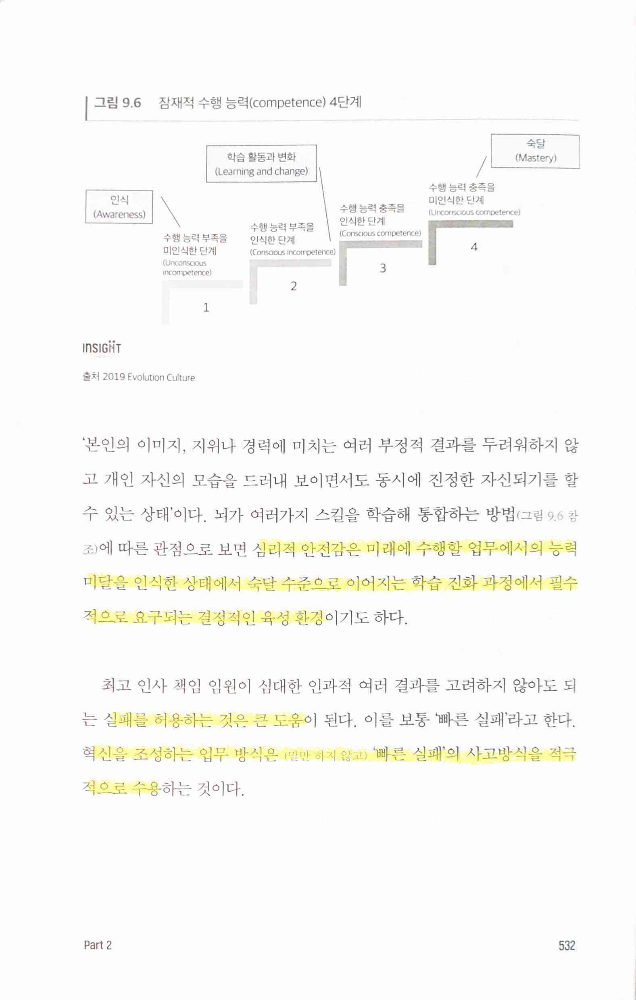

> 심리적 안전감은 미래에 수행할 업무에서의 능력 미달을 인식한 상태에서 숙달 수준으로 이어지는 학습 진화 과정에서 필수적으로 요구되는 결정적인 육성 환경
>
> 실패를 허용하는 것은 큰 도움... 혁신을 조성하는 업무 방식은 말만 하지 않고 '빠른 실패'의 사고방식을 적극적으로 수용하는 것

# Part 3 피플 애널리틱스의 다음 단계
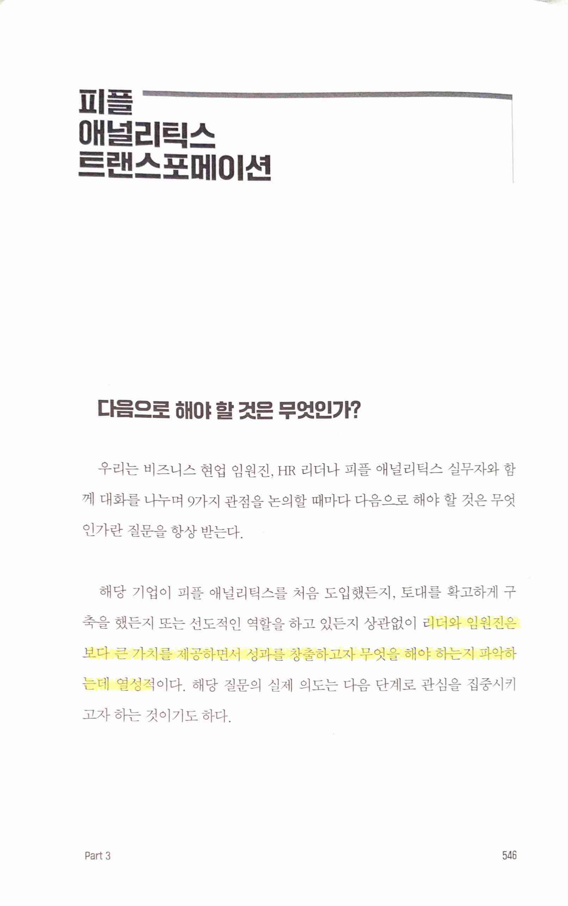

> 리더와 임원진은 보다 큰 가치를 제공하면서 성과를 창출하고자 무엇을 해야 하는지 파악하는데 열성적
* 다만 그 방향성을 맞추는 게 어려울 뿐

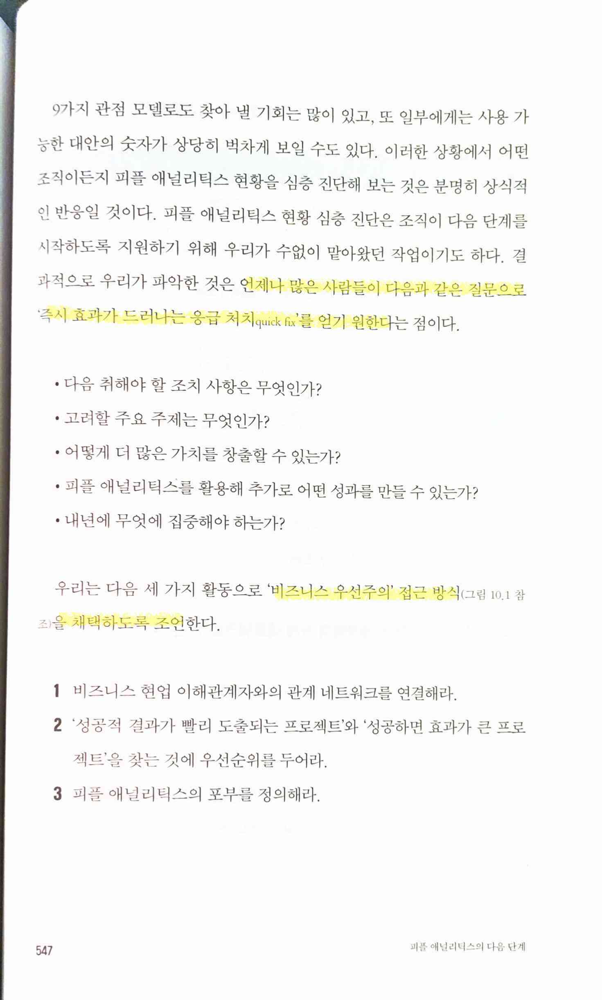 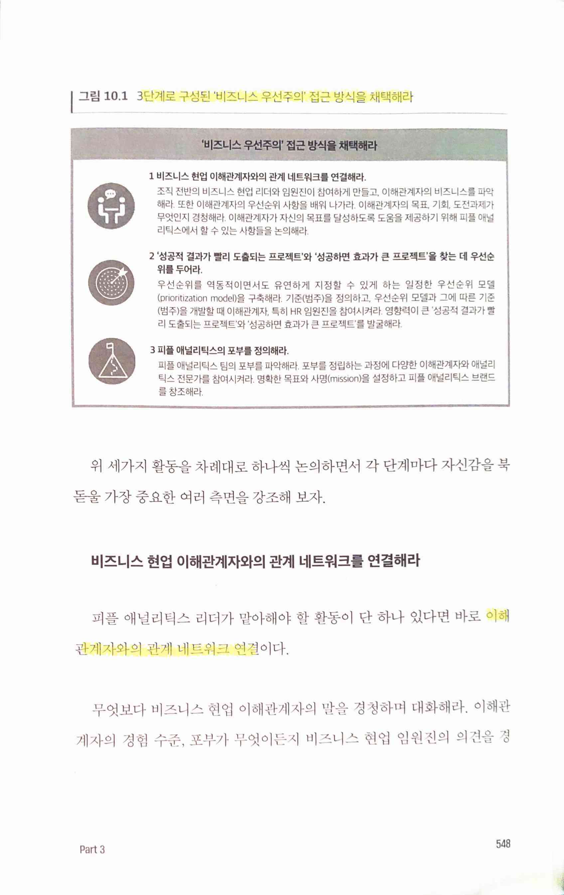

> 언제나 많은 사람들이 다음과 같은 질문으로 즉시 효과가 드러나는 응급 처치quick fix를 얻기 원한다
>
> '비즈니스 우선주의' 접근 방식을 채택하도록 조언
>
> 맏아해야 할 활동이 단 하나 있다면 바로 이해관계자와의 관계 네트워크 연결

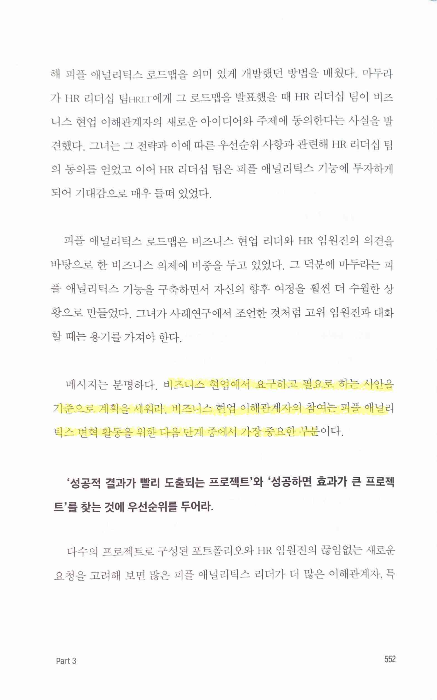

> 비즈니스 현업에서 요구하고 필요로 하는 사안을 기준으로 계획을 세워라. 비즈니스 현업 이해관계자의 참여는 피플 애널리틱스 변혁 활동을 위한 다음 단계 중에서 가장 중요한 부분

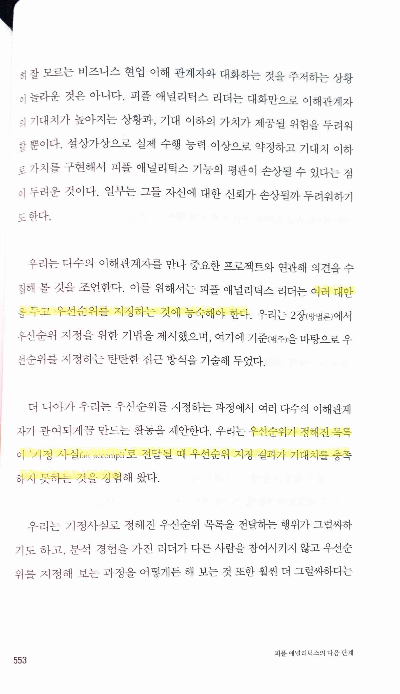

> 여러 대안을 두고 우선순위를 지정하는 것에 능숙해야 한다.
>
> 우선순위가 정해진 목록이 `'기정 사실 fait accompli'`로 전달될 때 우선순위 지정 결과가 기대치를 충족하지 못하는 것을 경험
* [<시사금융용어> 페타 꼼플리(Fait Accompli) - 연합인포맥스](https://news.einfomax.co.kr/news/articleView.html?idxno=345768)

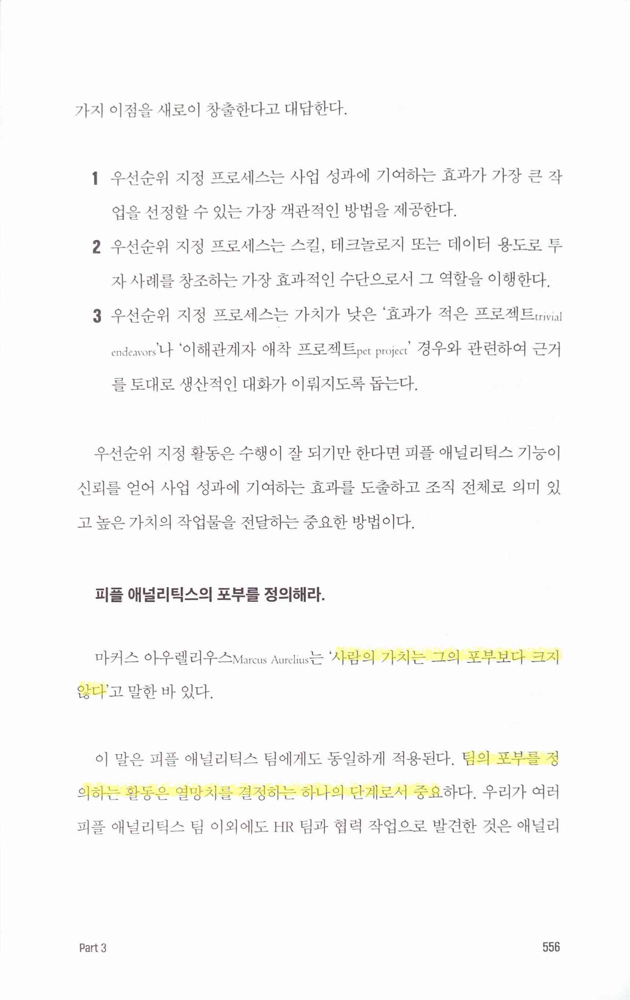

> 마커스 아우렐리우스 Marcus Aurelius '사람의 가치는 그의 포부보다 크지 않다'
* 영웅주의 역사관 아닌가? 동의할 수 없음
> 팀의 포부를 정의하는 활동은 열망치를 결정하는 하나의 단계로서 중요

## 끝맺는 말: 피플 애널리틱스의 미래

## 맺음말