플레이 나이스 벗 윈
===================
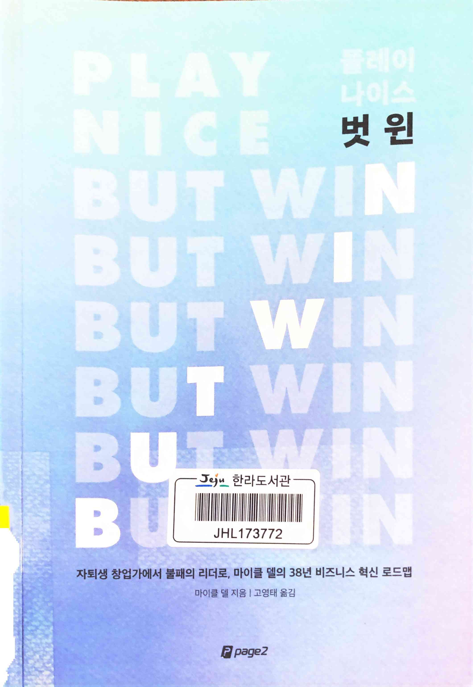

# Chapter 1 중요한 건 '성장'이다
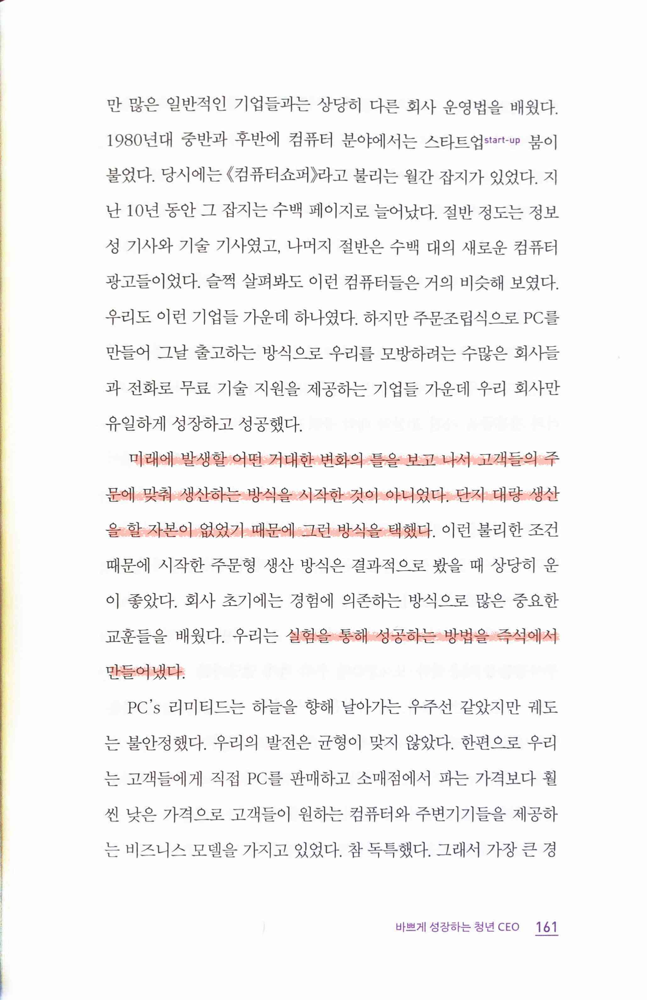

> 미래에 발생할 어떤 거대한 변화의 틀을 보고 나서 고객들의 주문에 맞춰 생산하는 방식을 시작한 것이 아니었다. 단지 대량 생산을 할 자본이 없었기 때문에 그런 방식을 택했다... 우리는 실험을 통해 성공하는 방법을 즉석에서 만들어냈다.
* 뒤에서도 나오지만 마치 agile 방식과도 비슷한, 주문제작방식의 시작이 우연이었다는 건 참 재미있는 일이다

# Chapter 2 투명하게 혁신하라
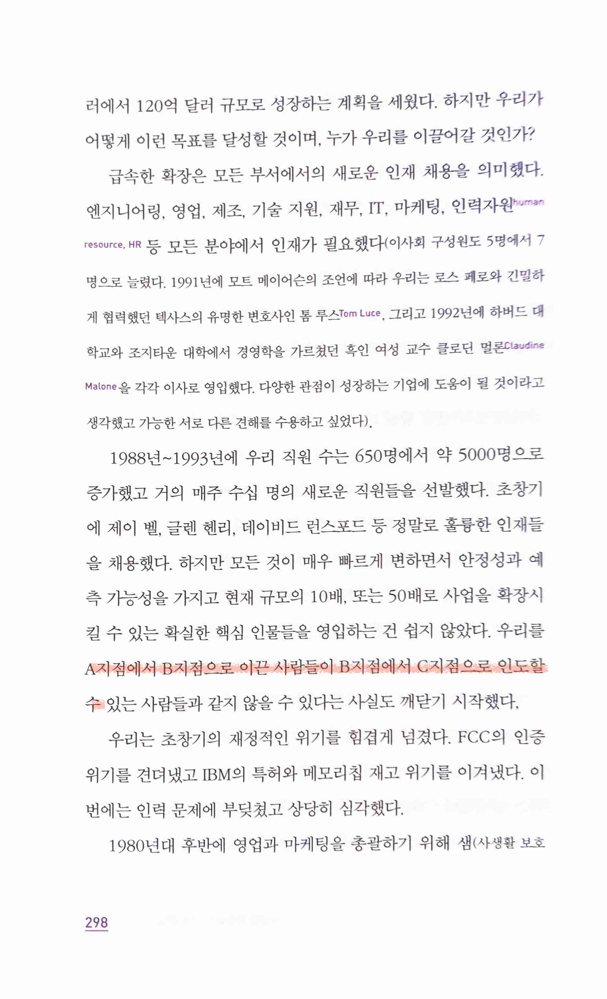

> A지점에서 B지점으로 이끈 사람들이 B지점에서 C지점으로 인도할 수 있는 사람들과 같지 않을 수 있다

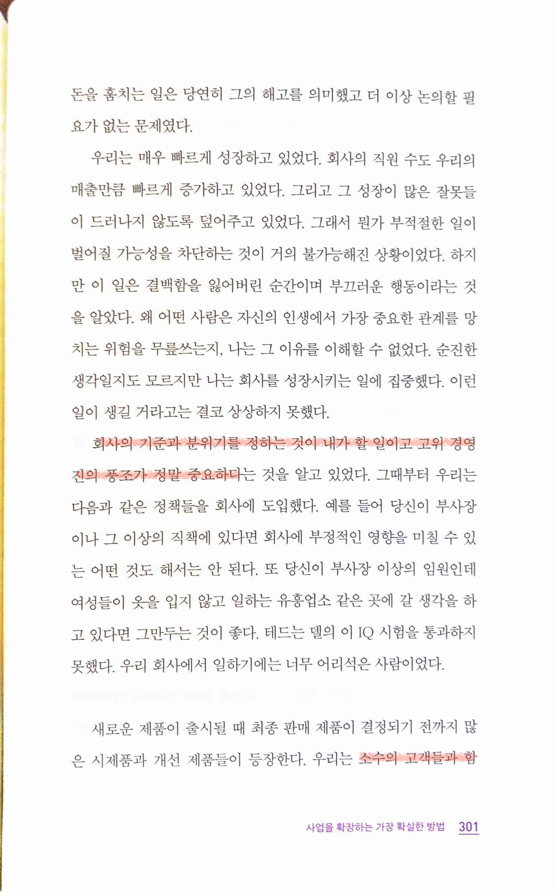

> 회사의 기준과 분위기를 정하는 것이 내가 할 일이고 고위 경영진의 풍조가 정말 중요하다는 것을 알고 있었다.
* 다른 모든 일이 그렇듯 회사가 잘 되는 시기에는 어지간한 문제는 회사의 전진에 큰 걸림돌이 되지 않는다. 하지만 경기가 좋지 않거나 잘 안 되는 시기에는 이런 평소에 신경쓰지 않던 일들이 큰 어려움이 되는 경우를 종종 볼 수 있다. 내가 주변인들에게 상위권 팀/하위권 팀으로 나눠서 이야기하는 비유와도 마찬가지. 프로스포츠에서도 상위권 팀들은 팀원들간의 불화가 있어도 별 문제가 없다. 성적이 좋으면 더 큰 보상을 기대할 수 있으므로. 하지만 하위권 팀은 작은 불화도 문제가 되고 추락의 원인인 듯 보도되면서 다시 증폭되는 경우도 많다.

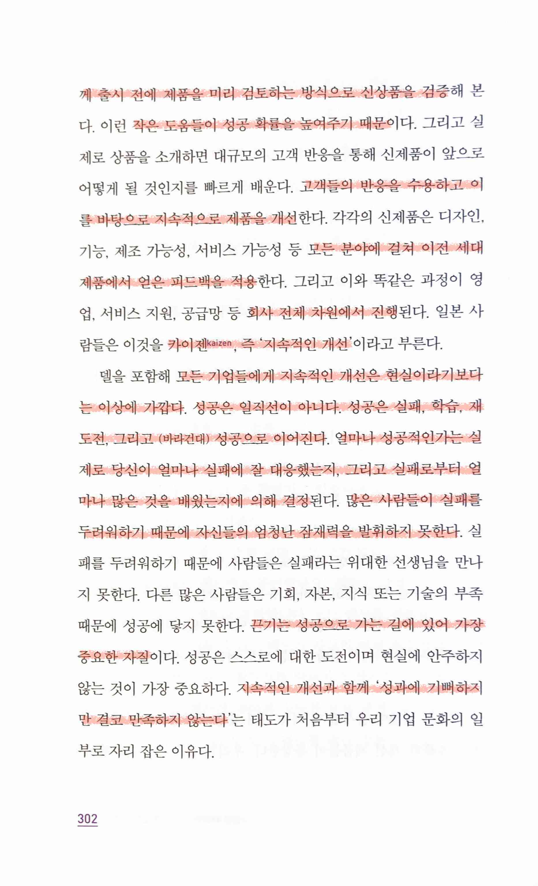

> 소수의 고객들과 함께 출시 전에 제품을 미리 검토하는 방식으로 신상품을 검증해 본다. 이런 작은 도움들이 성공 확률을 높여주기 때문이다... 고객들의 반응을 수용하고 이를 바탕으로 지속적으로 제품을 개선한다... 모든 분야에 걸쳐 이전 세대 제품에서 얻은 피드백을 적용한다... 회사 전체 차원에서 진행된다. 일본 사람들은 이것을 카이젠kaizen, 즉 '지속적인 개선'이라고 부른다.
* 간단한 문장들이지만, agile의 정신과 일치한다는 생각이 든다.
> 모든 기업들에게 지속적인 개선은 현실이라기보다는 이상에 가깝다. 성공은 일직선이 아니다. 성공은 실패, 학습, 재도전, 그리고 바라건대) 성공으로 이어진다. 얼마나 성공적인가는 실제로 당신이 얼마나 실패에 잘 대응했는지, 그리고 실패로부터 얼마나 많은 것을 배웠는지에 의해 결정된다. 많은 사람들이 실패를두려워하기 때문에 자신들의 엄청난 잠재력을 발휘하지 못한다... 끈기는 성공으로 가는 길에 있어 가장 중요한 자질이다... 지속적인 개선과 함께 '성과에 기뻐하지만 결코 만족하지 않는다'는 태도가 처음부터 우리 기업 문화의 일부로 자리 잡은 이유다.

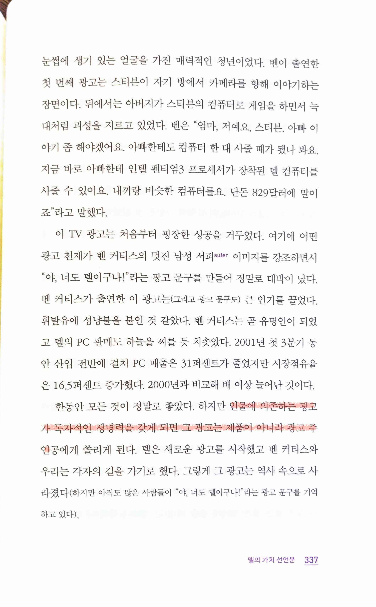

> 인물에 의존하는 광고가 독자적인 생명력을 갖게 되면 그 광고는 제품이 아니라 광고 주인공에게 쏠리게 된다.

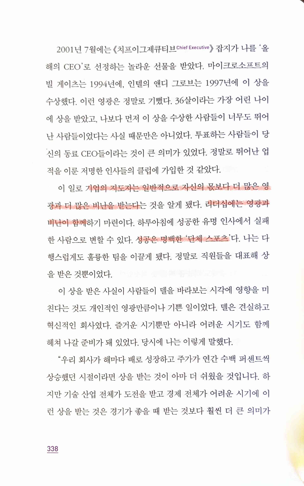

> 기업의 지도자는 일반적으로 자신의 몫보다 더 많은 영광과 더 많은 비난을 받는다... 리더십에는 영광과 비난이 함께하기 마련이다... 성공은 명백한 '단체 스포츠'다.

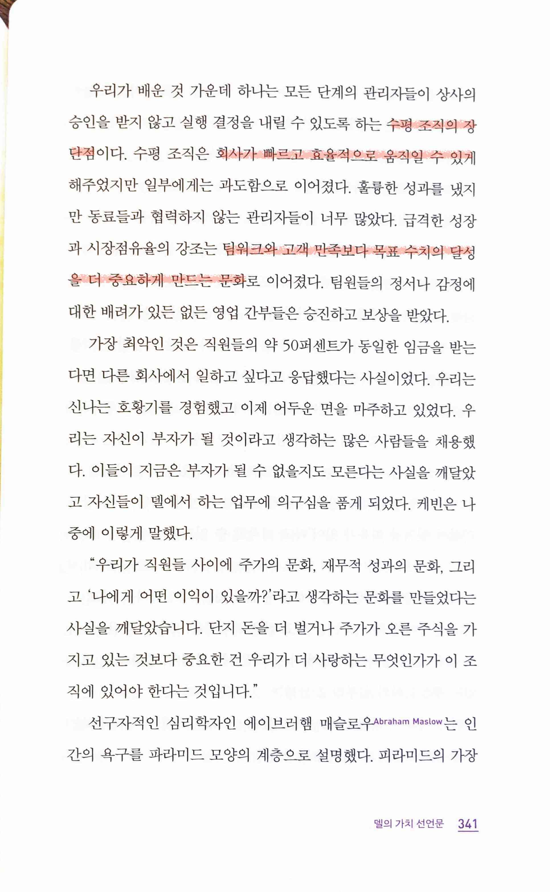

> 수평 조직의 장단점. 빠르고 효율적으로 움직일 수 있게... 팀워크와 고객 만족보다 목표 수치의 달성을 더 중요하게 만드는 문화

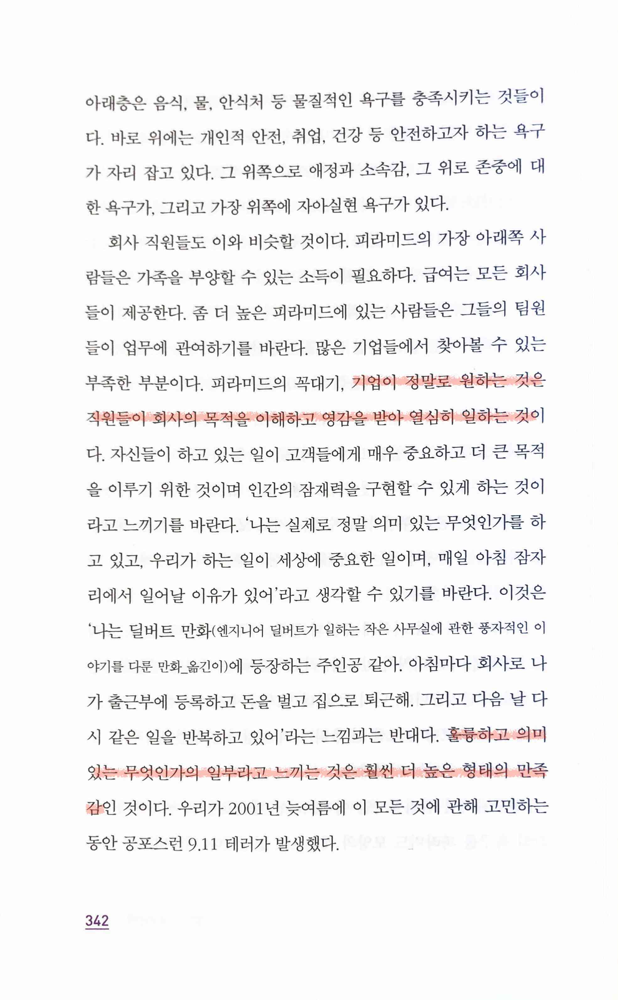

> 기업이 정말로 원하는 것은 직원들이 회사의 목적을 이해하고 영감을 받아 열심히 일하는 것... 훌륭하고 의미있는 무엇인가의 일부라고 느끼는 것은 훨씬 더 높은 형태의 만족감

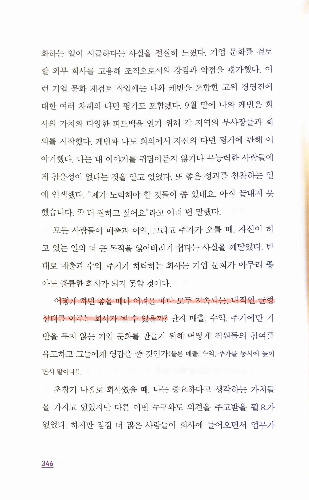

> 어떻게 하면 좋을 때나 어려울 때나 모두 지속되는 내적인 균형상태를 이루는 회사가 될 수 있을까?

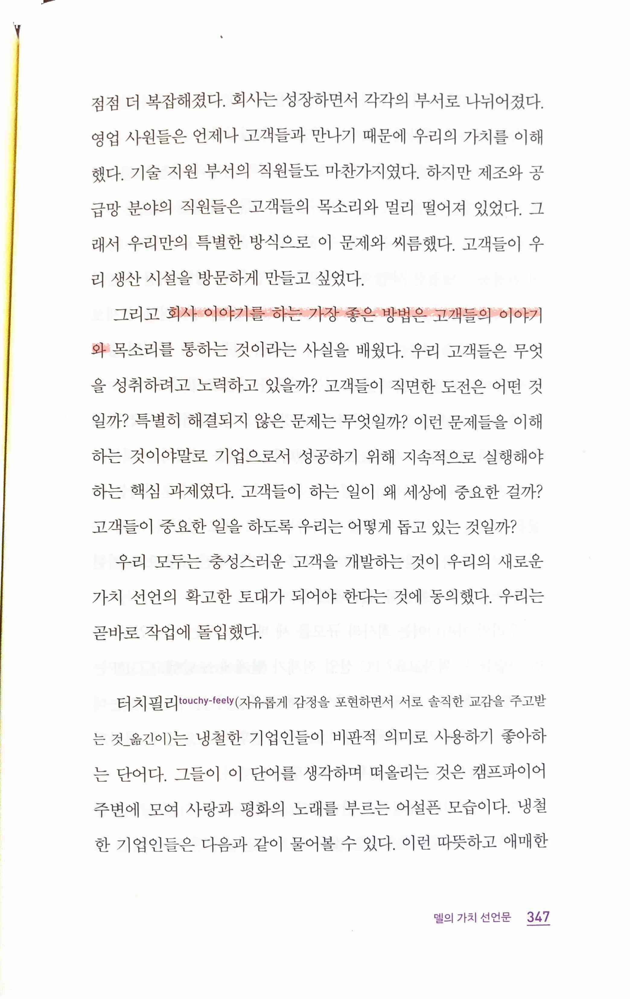

> 회사 이야기를 하는 가장 좋은 방법은 고객들의 이야기와 목소리를 통하는 것

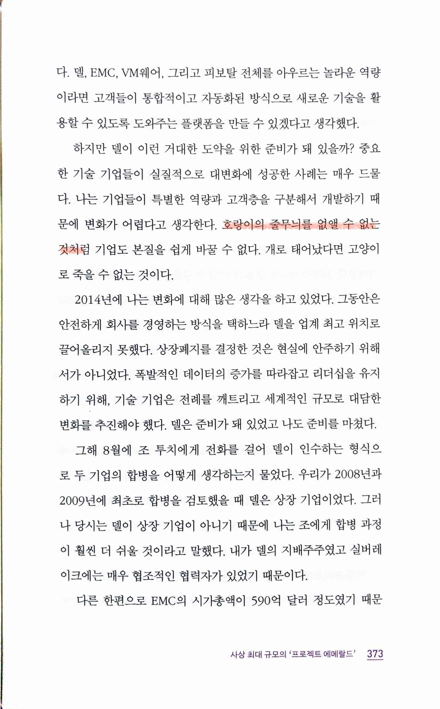

> 호랑이의 줄무늬를 없앨 수 없는 것처럼 기업도 본질을 쉽게 바꿀 수 없다.
* 전체 규모가 300여명인 회사의 프로세스를 바꾸려는 시도도 정말 힘들었기에 이 말이 정말 와닿는다.

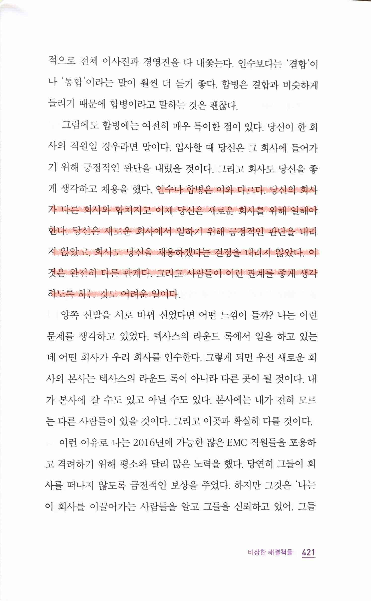

> 인수나 합병은 이와 다르다. 당신의 회사가 다른 회사와 합쳐지고 이제 당신은 새로운 회사를 위해 일해야한다. 당신은 새로운 회사에서 일하기 위해 긍정적인 판단을 내리지 않았고, 회사도 당신을 채용하겠다는 결정을 내리지 않았다. 이것은 완전히 다른 관계다. 그리고 사람들이 이런 관계를 좋게 생각하도록 하는 것도 어려운 일이다.
* 내가 일하던 (그리고 정말 좋아하던) 회사가 피인수 당하는 경험을 해봤기 때문에 이 부분 또한 이해하기 쉽다.

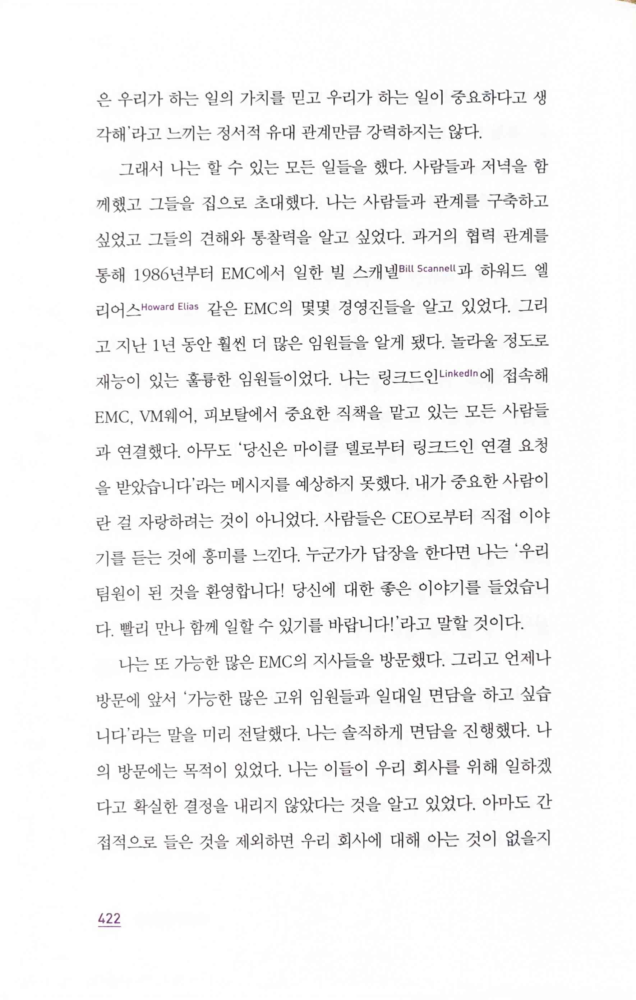 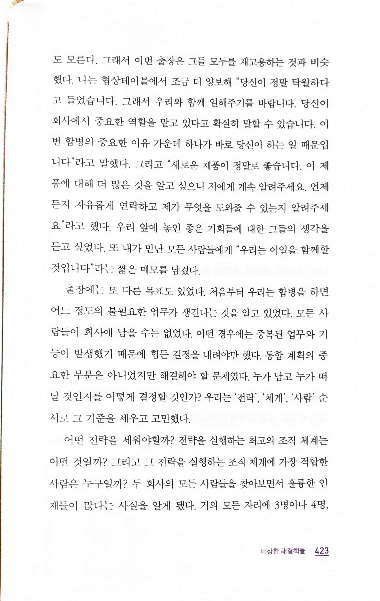

* 마이클 델이 화학적인 결합을 위해 노력했다는 점을 내세우는 부분

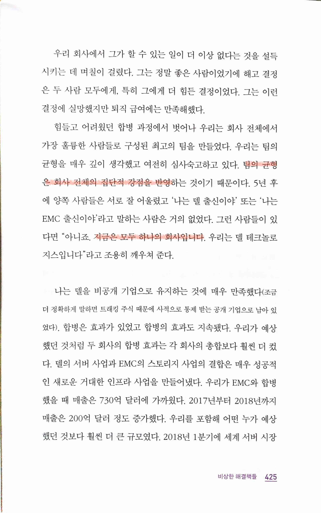

> 팀의 균형은 회사 전체의 집단적 강점을 반영
>
> 지금은 모두 하나의 회사입니다.
* 내가 경험했던 합병에서 제1주주는 과연 이런 생각을 했던 건지가 궁금했다.

# 부록 마이클 델의 신조
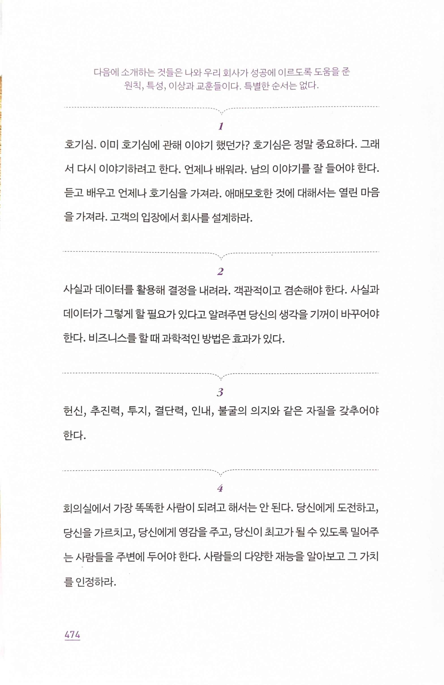 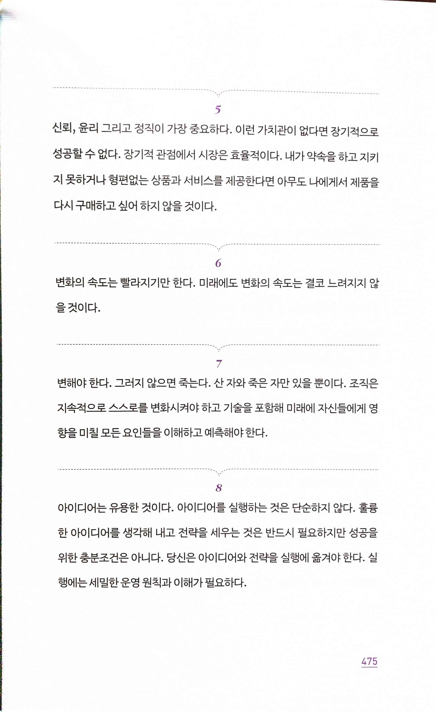 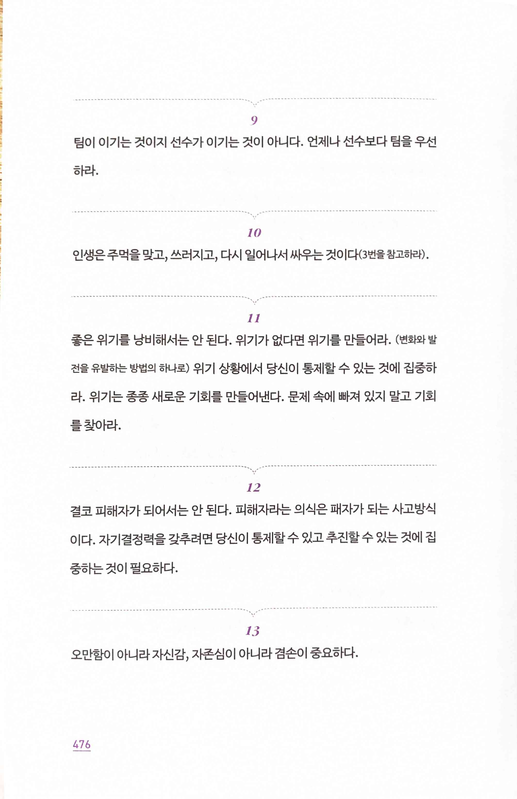 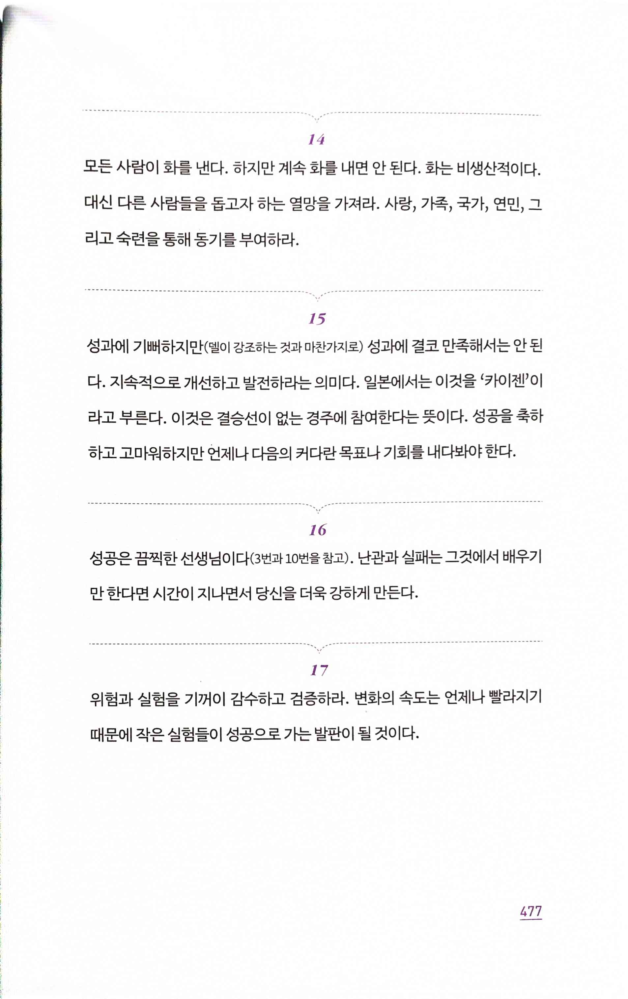 