# 프로덕트 매니저 원칙

Tags: product
Date: January 19, 2024
Score: ★★★☆☆

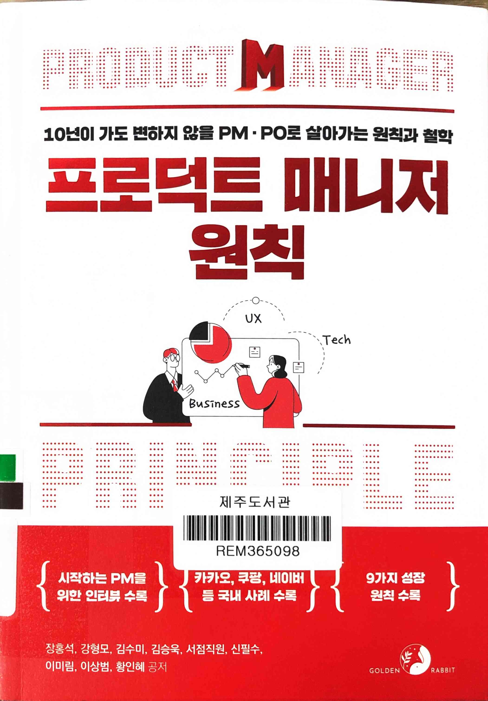

- [프로덕트 매니저 원칙 - 골든래빗](https://goldenrabbit.co.kr/product/pmpo/)
    - ★★★☆☆ January 18, 2024 → January 19, 2024  다양한 PO, PM 출신들의 이야기를 통해 어떤 원칙을 가지고 product 만드는 일을 해야 할지 생각을 하나씩 정리해볼 수 있는 좋은 책
    - 제주 325.571-장95프
    - [컴퓨터 vs 책: [독서광] 프로덕트 매니저 원칙](https://jhrogue.blogspot.com/2023/12/blog-post_27.html)

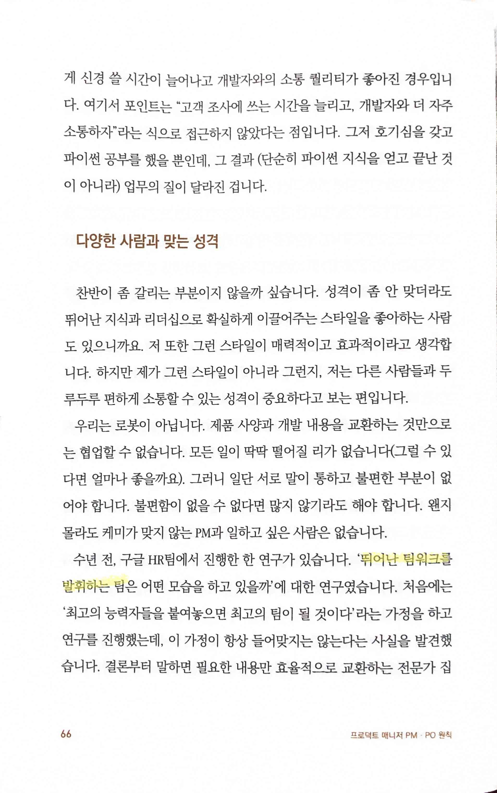

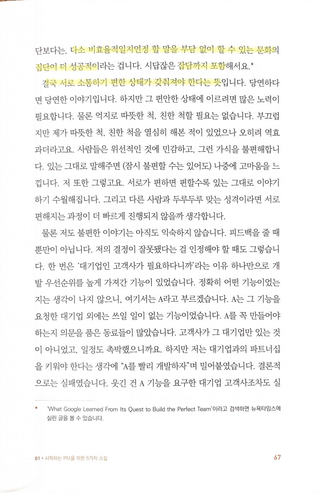

- `뛰어난 팀워크를 발휘하는 팀`
    - `다소 비효율적일지언정 할 말을 부담 없이 할 수 있는 문화의 집단이 더 성공적`, `잡담까지 포함`
    - `결국 서로 소통하기 편한 상태가 갖춰여쟈 한다는 뜻`
    - [What Google Learned From Its Quest to Build the Perfect Team - The New York Times](https://www.nytimes.com/2016/02/28/magazine/what-google-learned-from-its-quest-to-build-the-perfect-team.html)
    - [구글의 일 잘하는 팀은 무엇이 다른가](https://www.carnegie.co.kr/forum/view/707760)
    - [심리적 안전감이란?](https://brunch.co.kr/@younghakjang/112)

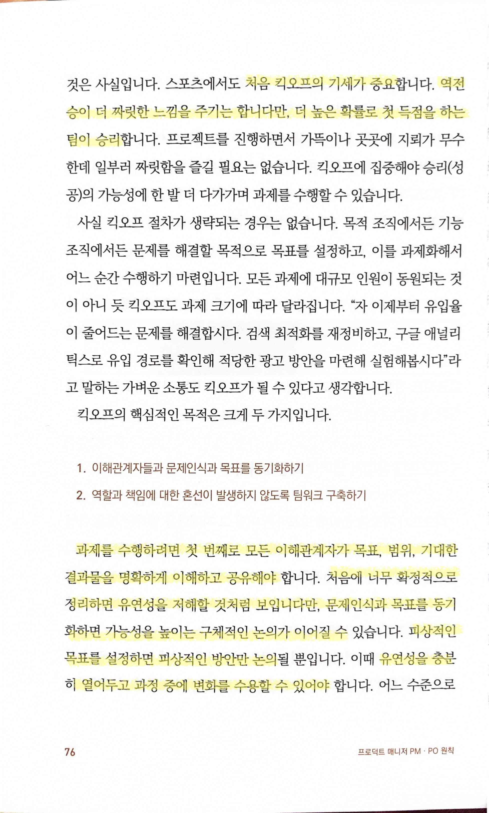

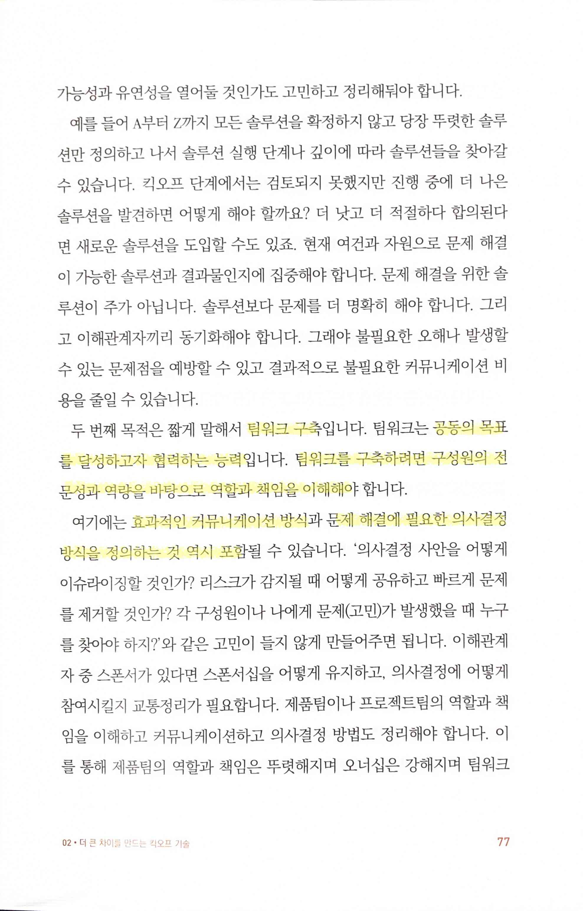

- pp76~77
    - `처음 킥오프의 기세가 중요`
        - `역전승이 더 짜릿한 느낌을 주기는 합니다만, 더 높은 확률로 첫 득점을 하는 팀이 승리`
        - 마침 가장 최근의 startup bible에도 비슷한 글이 있었는데 매우 동감
            - [헤일메리패스는 없었다](https://www.thestartupbible.com/2024/01/no-room-for-hail-mary-pass.html)
    - `과제를 수행하려면 첫 번째로 모든 이해관계자가 목표, 범위, 기대한 결과물을 명확하게 이해하고 공유해야`
        - `처음에 너무 확정적으로 정리하면 유연성을 저해할 것처럼 보입니다만, 문제인식과 목표를 동기화하면 가능성을 높이는 구체적인 논의가 이어질 수`
        - `피상적인 목표를 설정하면 피상적인 방안만 논의`
        - `유연성을 충분히 열어두고 과정 중에 변화를 수용할 수 있어야`
        - January 19, 2024 meeting에서도 이런 일이 있었다. PM이 CEO에게 열심히 설명해서 이야기를 했는데 정작 이걸 개발자들과 논의하는 자리에서 CEO가 딴 소리를 해서 PM이 답답해하는. 많은 회사들에서 이런 일이 생기는데(결정권자가 했던 이야기를 뒤집거나 바꾸는), 이걸 방지하기 위해서는 documentation(혹은 다른 걸 통해서, 나는 visualization을 추천)을 통해 합의를 기록해둬야 이런 일이 줄어드는데(없어지는 않을 것), CEO들은 시키는 일에 익숙하고 자기가 정리해서 공유하는 일은 잘 못 하는 경우가 많아 쉽지가 않다
    - `팀워크 구축`
        - `공동의 목표를 달성하고자 협력하는 능력`
        - `팀워크를 구축하려면 구성원의 전문성과 역량을 바탕으로 역할과 책임을 이해해야`
        - `효과적인 커뮤니케이션 방식과 문제 해결에 필요한 의사결정 방식을 정의하는 것 역시 포함`
        - 이런 부분이 결국 process의 구축으로 연결됨. 정해진 routine을 통해 협업의 방식은 정해두고(물론 이 부분에도 지속적인 개선 필요), 논의 자체는 자유롭게 열어두는 게 필요함

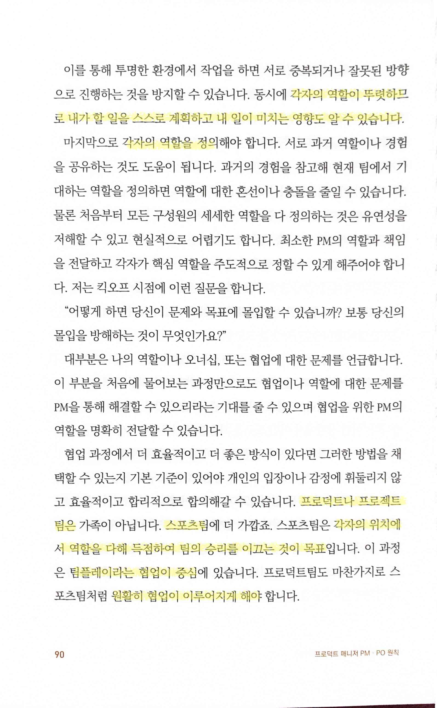

- p90
    - `각자의 역할이 뚜렷하므로 내가 할 일을 스스로 계획하고 내 일이 미치는 영향도 알 수 있습니다.`
        - `각자의 역할을 정의해야`
        - 아래 스포츠팀과도 연결되는 부분인데 포지션에 따른 역할이 있듯이 팀에서는 각자 할 일이 있고 기본적으로 해당 역할을 충실히 하는게 기본이고 우선
    - `프로덕트나 프로젝트 팀은… 스포츠팀`
        - `각자의 위치에서 역할을 다해 득점하여 팀의 승리를 이끄는 것이 목표`
        - `팀플레이라는 협업이 중심`
        - `원활히 협업이 이루어지게 해야`
        - 내가 가진 management에 대한 관점과 완전히 일치. 이걸 위해 process를 만들고 반복적인 연습을 통해 routine한 업무 방식 수립이 필요. 이걸 비유할 때 보통 야구의 내야 수비 연습을 많이 이야기한다. 1사 1, 2루 같은 상황을 가정하고 그 때 선수들의 수비위치를 정하고 타구에 따라 어떤 순서로 움직이며 공을 주고 받는지 반복 연습하는.

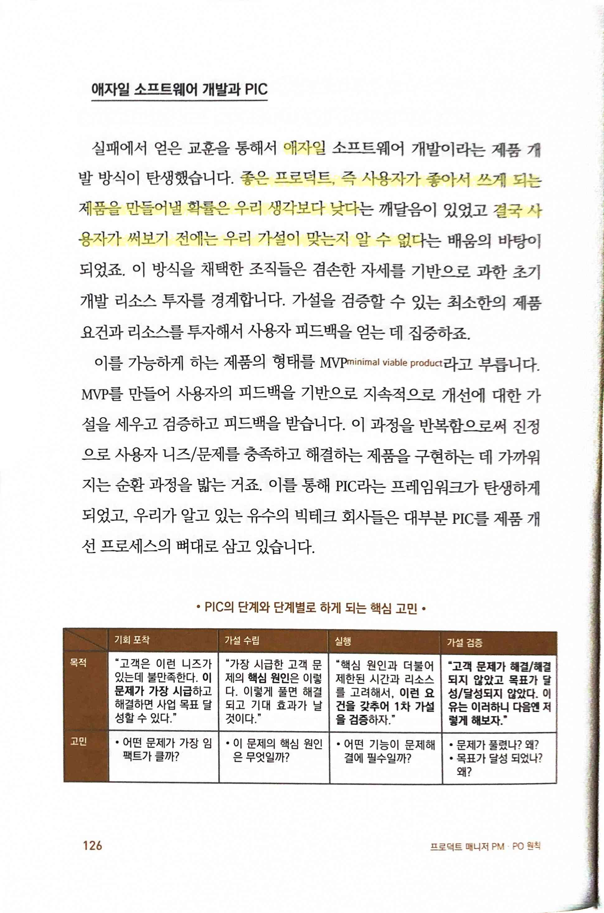

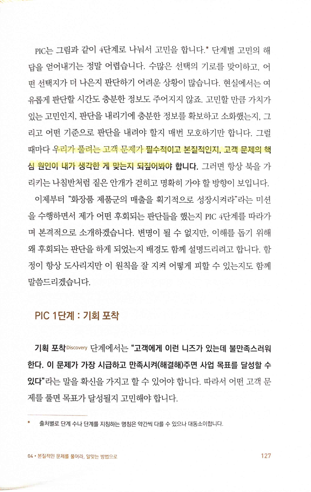

- `애자일`
    - `좋은 프로덕트, 즉 사용자가 좋아서 쓰게 되는 제품을 만들어낸 확률은 우리 생각보다 낮다`
    - `결국 사용자가 써보기 전에는 우리 가설이 맞는지 알 수 없다`
    - `우리가 풀려는 고객 문제가 필수적이고 본질적인지, 고객 문제의 핵심 원인이 내가 생각한 게 맞는지 되짚어봐야`
        - 뒤에서도 나오지만 이 부분이 가장 어렵다. 정말 어렵다. 그러니 [Zero to One - Wikipedia](https://en.wikipedia.org/wiki/Zero_to_One) 같은 책도 있겠지

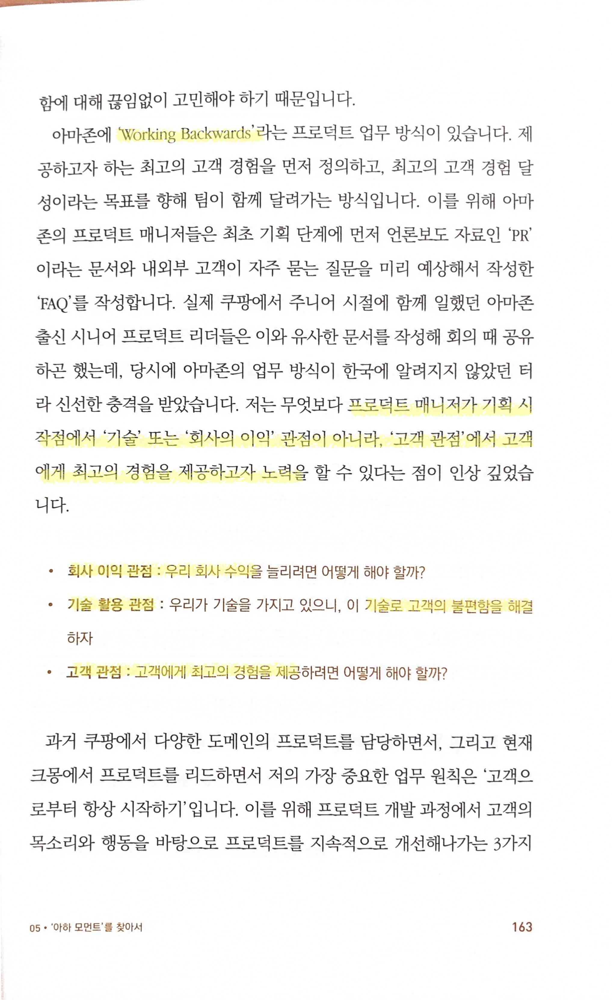

- `Working Backwards`
    - `프로덕트 매니저가 기획 시작점에서 ‘기술’ 또는 ‘회사의 이익’ 관점이 아니라, ‘고객 관점’에서 고객에게 최고의 경험을 제공하고자 노력`
    - `회사 이익 관점: 우리 회사 이익`
    - `기술 활용 관점: 기술로 고객의 불편함을 해결`
    - `고객 관점: 고객에게 최고의 경험을 제공`
    - [순서파괴 Working Backwards](https://github.com/hyunjun/bookmarks/blob/master/programming_books/working_backwards.md)
    - [순서파괴 Working Backwards. 그린 컴퍼니의 채용 프로세스에는 몇 가지 중대한 오류가 있다. 첫째… | by Jun | Medium](https://nymets.medium.com/%EC%88%9C%EC%84%9C%ED%8C%8C%EA%B4%B4-working-ba-9b3068303d1e)

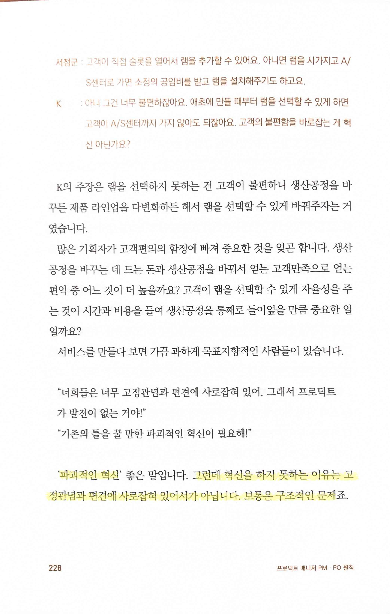

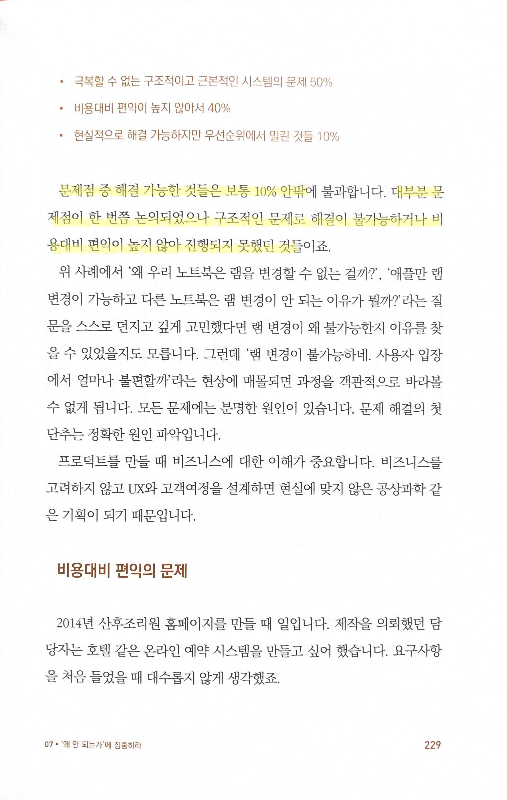

- `파괴적인 혁신`
    - `그런데 혁신을 하지 못하는 이유는 고정관념과 편견에 사로잡혀 있어서가 아닙니다. 보통은 구조적인 문제`
    - `문제점 중 해결 가능한 것들은 보통 10% 안팎… 대부분 문제점이 한 번쯤 논의되었으나 구조적인 문제로 해결이 불가능하거나 비용대비 편익이 높지 않아 진행되지 못했던 것`
    - 맞는 말이지만, 구조적인 문제인 경우 구조를 해결하면 가능성이 보이기도 하고, 구조를 해결하겠다고 하는 의지가 필요하기도 함. 이 경우 흔히 이야기하는 sponsor, 의사 결정권자의 추진 의지가 정말 중요

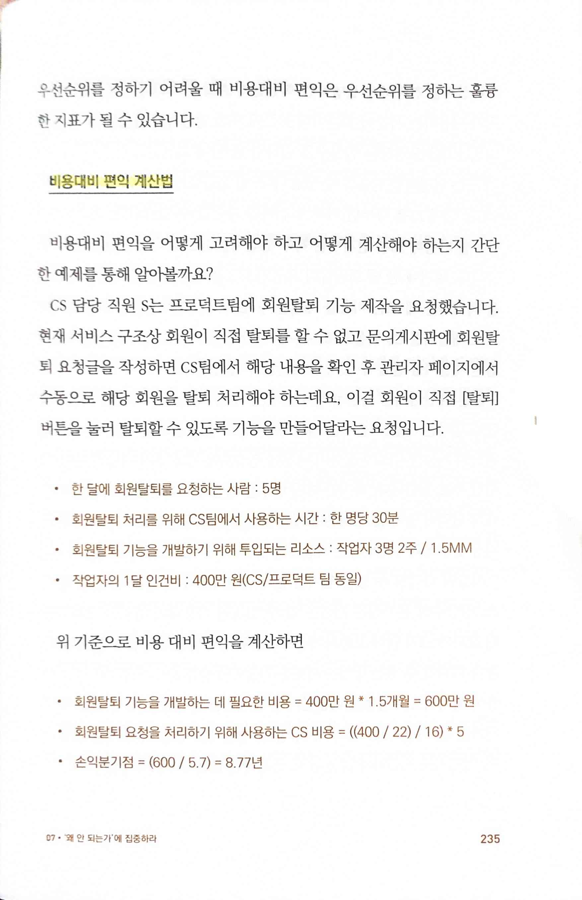

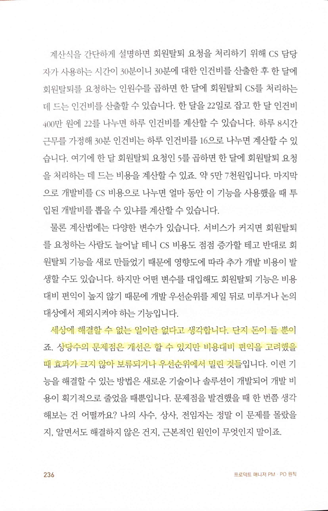

- `비용대비 편익 계산법`
    - `세상에 해결할 수 없는 일이란 없다고 생각합니다. 단지 돈이 들 뿐… 상당수의 문제점은 개선은 할 수 있지만 비용대비 편익을 고려했을 때 효과가 크지 않아 보류되거나 우선순위에서 밀린 것들`
    - 꼭 그렇진 않지만(해결 할 수 없는 일도 있지만) 어떤 의미인지는 당연히 이해가 감

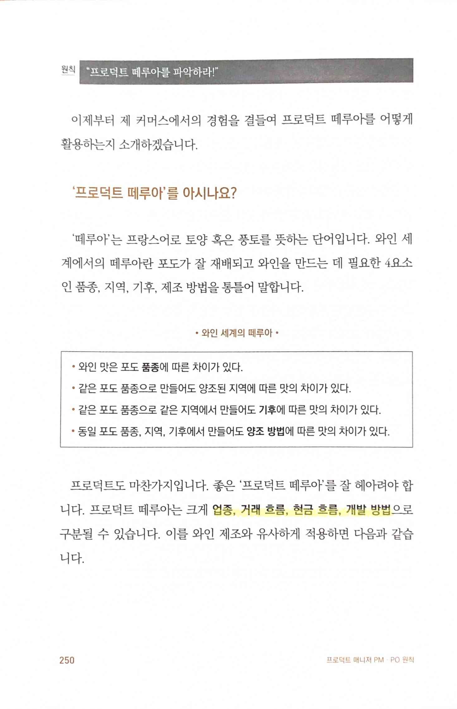

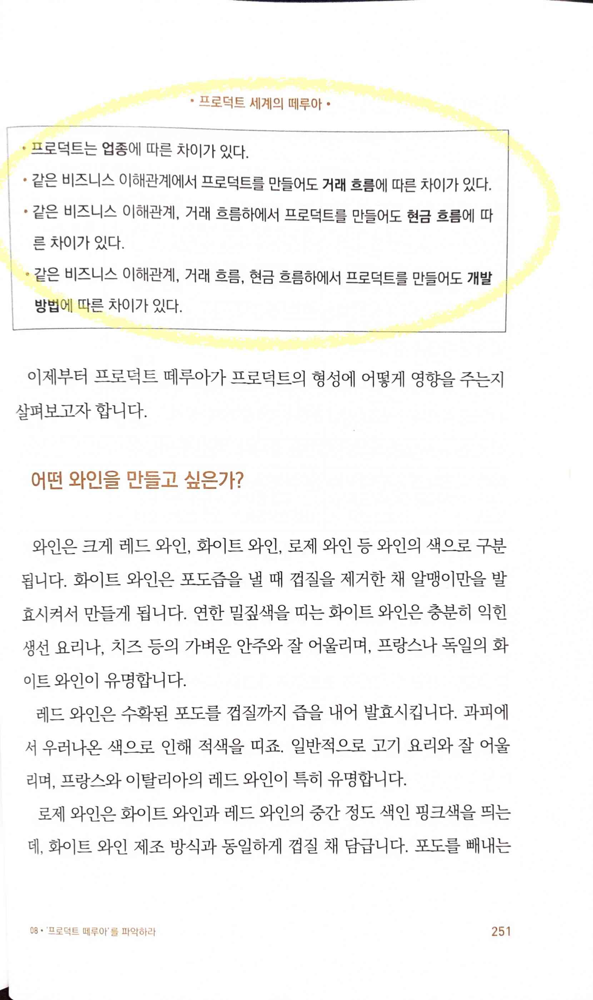

- `업종, 거래 흐름, 현금 흐름, 개발 방법`
    - 프로덕트 떼루아라는 말은 좀 어색하게 들리지만, 비유적으로 설명하기 위해 잘 만들었다는 생각도 듦
    - 결국 거래 흐름, 현금 흐름 부분은 business의 전체 flow를 이해하고 그 특성에 맞춰야 한다는 뜻이기에 역시 나도 중요하게 생각하는 부분

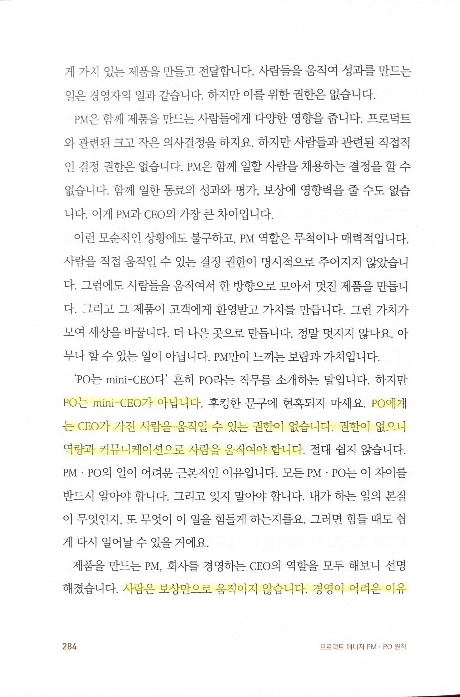

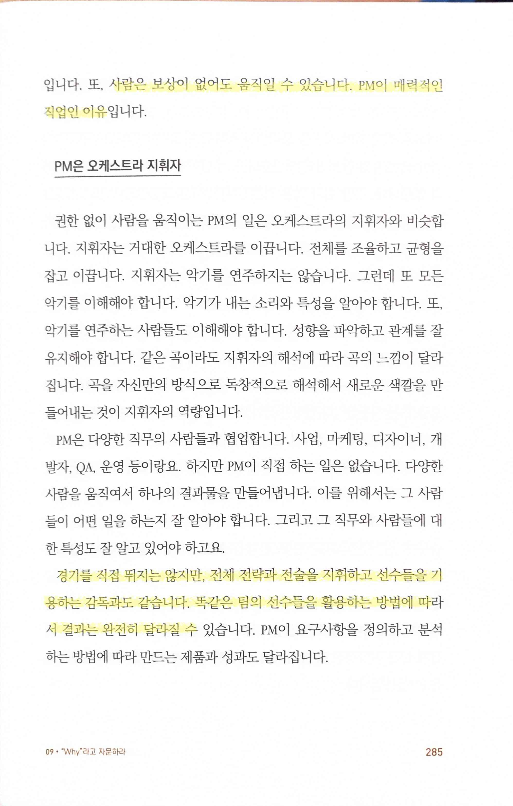

- pp284~285
    - `PO는 mini-CEO가 아닙니다… PO에게는 CEO가 가진 사람을 움직일 수 있는 권한이 없습니다. 권한이 없으니 역량과 커뮤니케이션으로 사람을 움직여야 합니다.`
        - `사람은 보상만으로 움직이지 않습니다. 경영이 어려운 이유`
        - `사람은 보상이 없어도 움직일 수 있습니다. PM이 매력적인 이유`
        - (이 책에서만 나오는 거도 아니지만) 이런 걸 보면 PO가 평가자도 아니고 people management의 leader가 아니라는 게 잘 알려져야 하는데 일부 회사의 경우 PO를 people management의 leader 역할을 맡기고 평가를 하게 하면서 개발자, 디자이너들의 불만을 불러오고 PO들도 자기 본연의 업무조차 제대로 진행하지 못하게 하는 경우를 보면 참 답답하기도 하고 웃기기도 하다
    - `경기를 직접 뛰지는 않지만, 전체 전략과 전술을 지휘하고 선수들을 기용하는 감독과도 같습니다. 똑같은 팀의 선수들을 활용하는 방법에 따라서 결과는 완전히 달라질 수`

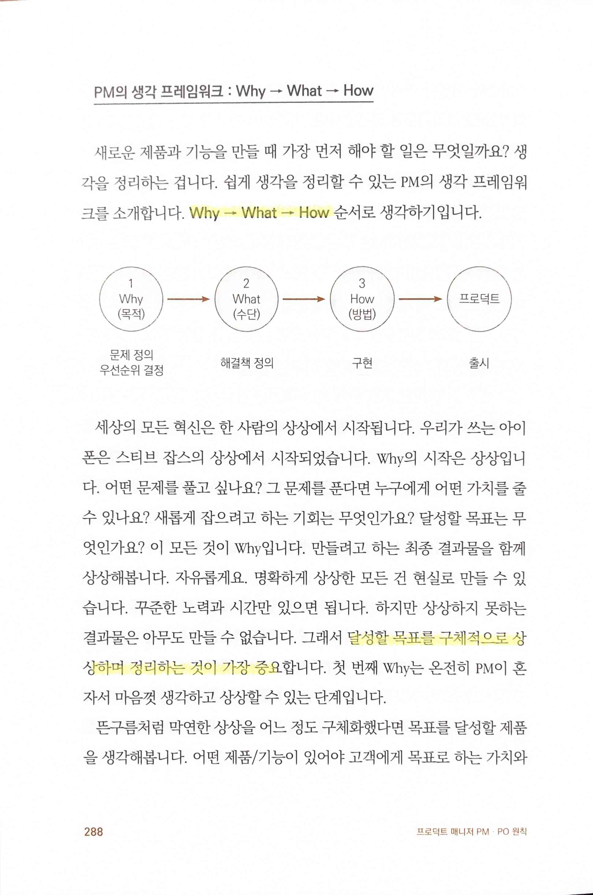

- `Why → What → How`
    - `달성할 목표를 구체적으로 상상하며 정리하는 것이 가장 중요`
