# PROJECT TO PRODUCT 프로젝트에서 제품으로
* 

## 서문
* 

    * `전체 비즈니스 가치 흐름에 걸쳐 팀이 일하는 방식을 바꿔야만 이를 달성할 수 있다고 말한다.`
    * (내가 현재 달성하고 싶어하는 가장 중요한 일 중 하나. 회사 business 기능의 모든 flow를 end to end로 flow diagram으로 표현해서 구조를 파악하고 서로 communication하는데 낭비가 없도록 하는 일)

## 옮긴이의 말
* 

    * `IT 조직은 애자일이나 데브옵스 등과 같이 프로젝트를 효율적으로 진행할 수 있는 도구를 익히고 이를 통해 의사소통합니다. 반면 소프트웨어에 대한 비즈니스 조직의 시각은 여전히 테일러리즘 방식에 머물러 있습니다. 이러한 차이가 디지털 변혁의 큰 장벽 중 하나입니다. 이는 IT 조직과 비즈니스 조직의 의사소통에 문제를 일으키고 디지털 변혁 실패의 원인이 됩니다.`
    * (내가 개발자라서가 아니라, 정말 전통 산업의 경우 굉장히 많은 부분이 뒤쳐져 있다. 항상 새로운 걸 받아들여야 하고, 개선이 필요한 개발업계와 달리 큰 변화없이도 업무를 진행할 수 있는 업계에서는 변화를 남의 일이라고 생각하거나 필요성을 느끼지 못하는 걸로 보인다)

## 들어가며
*      

    * `기술 부채나 스토리 포인트와 같이 기술자에게 익숙한 소프트웨어 전달 개념은 IT 이니셔티브를 프로젝트로 관리하고 일정과 지출 비용 준수 여부로 프로젝트를 평가하는 대부분 비즈니스 리더에게는 별 의미가 없다. 프로젝트 지향적 관리 프레임워크는 다리를 짓는다거나 데이터 센터를 만드는 데에는 적합하지만, 소프트웨어 시대의 전환점에서 살아남기에는 매우 부적합하다.`
    * `플로우 프레임워크는 '가치 흐름'에 알맞게 소프트웨어 전달을 측정하고 모든 IT 투자를 조정하는 새로운 방법이다. 여기서 '가치 흐름'이란 소프트웨어 제품이나 서비스로서의 소프트웨어 Saas. Software asa Service 를 통해 비즈니스 가치를 시장으로 전달하기 위해 수행하는 모든 활동을 말한다. 플로우 프레임워크는 프로젝트 지향 관리 방식에서 원가 중심으로 예산을 측정하던 방식과 조직 차트로 소프트웨어이니셔티브를 측정하던 방식을 대체한다. 지난 방식들은 기술에 대한투자가 비즈니스 결과로 연결되도록 하는 '플로우 지표'로 대체된다.플로우 프레임워크는 흐름, 피드백, 지속적 학습으로 구성된 데브옵스의 세 가지 방법(『데브옵스 핸드북』 참고)을 기술 조직을 넘어 비즈니스 전체에 적용할 수 있도록 한다.`
    * `우리는 미래를 바꿀 수 있다. 우리 기업을 경쟁력 있게 만들 수 있다. 거대 기술 기업과 스타트업이 주는 교훈을 우리의 복잡한 비즈니스에 도입할 수 있다. 소프트웨어 시대의 디지털 네이티브 기업들이하고 있는 것처럼, IT라는 블랙박스를 가치 흐름이라는 투명한 네트워크로 바꾸고 관리할 수 있다. 이를 성취하려면 변혁 활동보다는 측정 가능한 비즈니스 결과에 집중해야 한다.`
    * ('측정 가능'이라는 게 개발 회사가 아닌 곳에 오니 정말 어렵다는 걸 절실히 느끼고 있다. 일단 측정을 하기 위한 장치나 프로세스를 만드는 거부터 거센 저항이 있다)
  
## 1부 플로우 프레임워크
* 

  * `IT 조직이 자신들의 생산 단위가 무엇인지에 대해 합의해본 적조차 없다는 것이다…경영진은 철강 시대에 자리 잡은 테일러리즘의 관점에 머물러 있다…기술 언어와 비즈니스 언어의 격차는 여전하다.`
*  

  * `제조업의 발자취를 무작정 따르는 것은 아무것도 하지 않는 것만큼 많은 위험이 따른다는 불편한 진실이다.`
  * (피터 드러커의 what gets measured gets managed가 생각이 났다. 워낙 유명해서 나도 자주 들어봤고 많은 사람들이 이 말을 사용하지만, 사실 이 말이 오용되고 있다는 주장 - e.g. http://www.innovator.or.kr/2015/08/blog-post.html - 도 있다. 정말 중요한 건 측정하기 어렵거나 불가능한데, 저 말 때문에 많은 사람들이 측정 가능한 거만 집착하고 있다는 뜻. 위의 말도 어느 정도 맞닿아 있다는 생각이다. 나도 개발자 출신이라 측정해서 그대로 다 진실을 보여주고 싶지만, 이게 가능한지, 또 가능하더라도 무조건 좋은 일인지가 아직 확신이 들진 않는다)

### 1장 소프트웨어 시대
*  

  * `새로운 생산 방식을 마스터한 기업은 비교적 느리게 움직이는 시장일지라도 이를 마스터하는 데 시간이 오래 걸리는기업을 대체할 것이다… 산업 분야나 시장과 관계없이 소프트웨어 시대의 전환점을 통과하고 있는 현시점에 안전한 비즈니스는 없다는 점을 강조하려 한다… 문제는 기업이 파괴에 대한 취약성을 모른다는 것이 아니다…이런 변혁이 실패하고 있다는 것이 문제다.`
  * `다만 프로젝트 지향적 접근이 인재를 끌어들이는 대신 조직 밖으로 밀어내는 상황을 만든다는 것이다…결론은 최고의 전략과 의도가 있어도 소프트웨어 전달 능력과 역량이 디지털 변혁의 병목 지점이 된다는 것이다. 문제가 매우 조금씩 그리고 천천히 나타나기 때문에 비즈니스 측에서는 문제가 왜 일어나는지와 어떻게 해야 하는지를 이해하지 못한다.`
  * ("기업이 파괴에 대한 취약성을 모른다는 것이 아니다"와 "비즈니스 측에서는 문제가 왜 일어나는지와 어떻게 해야 하는지를 이해하지 못한다"가 처음에는 상충되는 거 아닌가 했는데 그게 아니었다. 문제점 자체의 위력은 알고 있지만, 이유를 모르니 대처할 방법도 모른다는 뜻이었네)

*  

  * `앨런 케이 Alan Kay의 "미래를 예측하는 가장 좋은 방법은 미래를 발명하는 것이다'`
  * (정말 멋진 말이지만 언제나 그렇듯 발명을 선도하는 사람은 극소수이고 그 중에서 성공하는 건 더 소수였다)
  * `지난 20년 동안 디지털 통신 및 협력으로 향하는 변화에 처음으로 노출된 코닥Kodak이나 블록버스터 BlockBuster와 같은 기업은 파괴의 첫 번째 희생양이 되고 말았다. 현재와의 차이점이라면 지금은 경제 전체가 파괴를 겪고 있다는 점이다.`

*  

  * `소프트웨어 혁신을 이룬 기업은 승자가 되고, 그렇지 못한 기업은 점차 쇠락의 길을 걷거나 블록버스터의 전철을 밟게 될 것이다.`
  * `비즈니스가 어떤 상황에 있든지 간에 소프트웨어 시대에 성공하려면 어떤 유형의 파괴가 비즈니스를 위험에 빠뜨렸는지 정확히 정의해야 한다.`
* 

  * `이미 전환전에 들어선 지 수십년이고 활용기에 들어서면 전환하지 못한 기업들은 모두 사라질 거라는 무서운 이야기`

*     

  * `우리는 오랜 기간 많은 기업이 IT, 애자일, 데브옵스 전환을 시도했다가 실패하는 사례를 지켜봤다. 최신 기술 시대에서 살아남기위한 싸움을 해 볼 기회를 얻으려는 대부분 기업에는 이번이 마지막 기회가 될 것이다.`
  * `첫 번째 깨달음: 소프트웨어 규모가 확장함에 따라 아키텍처와 가치 흐름 사이의 단절로 생산성은 감소하고 낭비는 증가한다. - 개발자가 가치 흐름으로부터 단절돼 있을 때 소프트웨어 생산성이 감소하고 낭비가 증가한다`
  * `두 번째 깨달음: 단절된 소프트웨어 가치 흐름은 소프트웨어 전달의 병목 지점이 된다. 가치 흐름의 단절 원인은 프로젝트 관리 모델의 잘못된 사용에 있다. - e.g. 개발자가 시간을 어떻게 사용하는지 좀 더 자세한 분석을 수행했고 오직 34%의 시간만이 개발에 사용된다는 것이 드러났다. 코드를 작성하는 일이 개발자에게 급여를 지급하는 이유이며 개발자가 하고 싶어 하는 일인데도 말이다. 이것은 심각한 시스템적 문제였다. 또한 개발자만의 문제도 아니었다.`
  * `세 번째 깨달음: 소프트웨어 가치 흐름은 선형적인 제조 공정이 아니라 제품에 따라 조정돼야 하는 복잡한 협업 네트워크다. - 소프트웨어 가치 흐름을 고려하기 위한 모델 전체가 잘못되었다는 생각이었다.`
  * `비즈니스와 기술자의 간극은 변혁 이니셔티브를 통해 좁아지기는 커녕 오히려 넓어지고 있다`

* 

  * `가장 큰 문제는 경영 관점에서 기성 기업은 이전 시대의 관리 방법 및 생산 방식을 사용하고 있으며 그렇기 때문에 실패하고 있다는 점이다.`

### 2장 프로젝트에서 제품으로
* 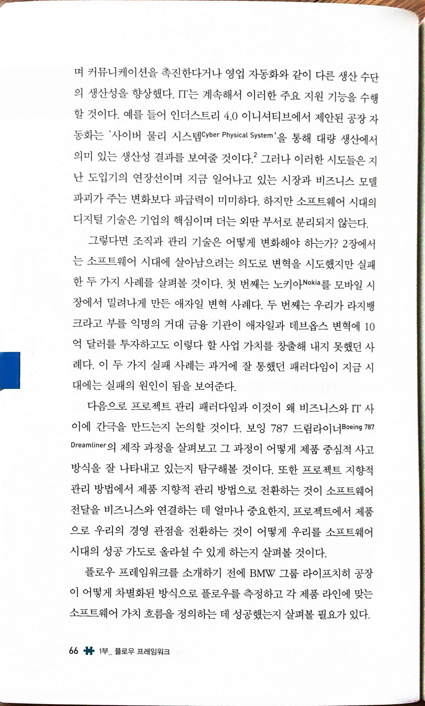

  * `이 두 가지 실패 사례는 과거에 잘 통했던 패러다임이 지금 시대에는 실패의 원인이 됨을 보여준다.`
  * (과거에 안주하면 실패하는 건 모든 분야에서 마찬가지이지만, 개발과 관련된 쪽은 특히 심하다. 어렸을 때 삼성에서 일하던 시절 NOKIA는 정말 넘을 수 없는 벽이었다. 당시 삼성에서도 상상하기 힘든 저가로 적당한 품질의 폰을 만들며 승승장구했다. 그러나 스마트폰 시대가 도래하며 순식간에 몰락하고 결국 MS에 팔린 후 순식간에 사라졌다)
* 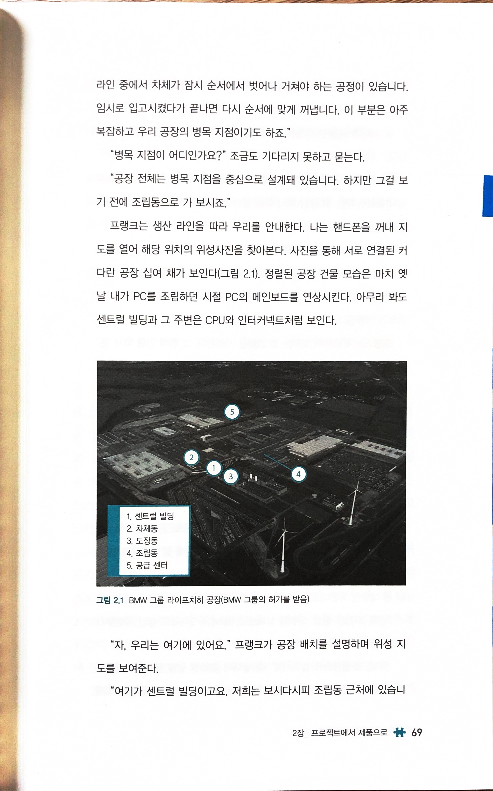

  * `공장 전체는 병목 지점을 중심으로 설계돼 있습니다.`
  * (결국 병목 지점, 병목 자원을 중심으로, 잘 활용할 수 있게 설계하는 게 필요. HW냐 SW냐는 중요하지 않다)
* 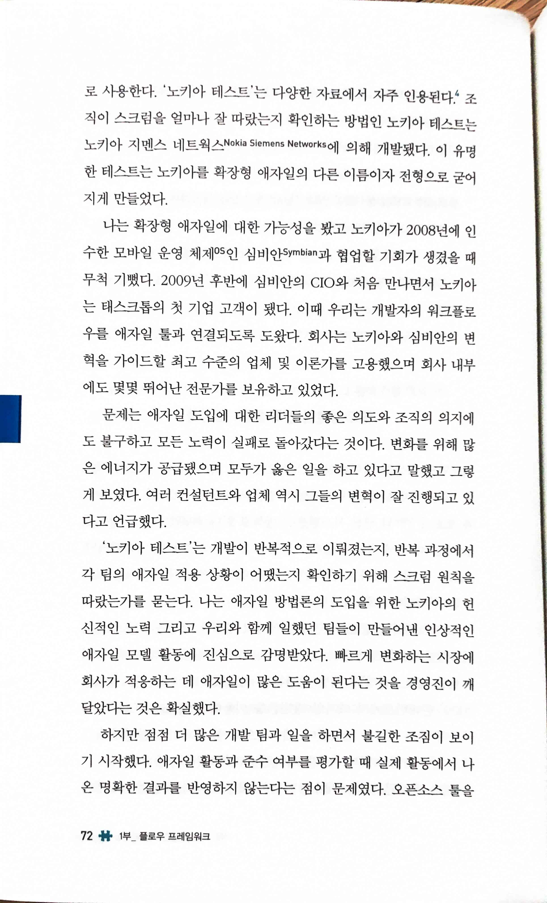 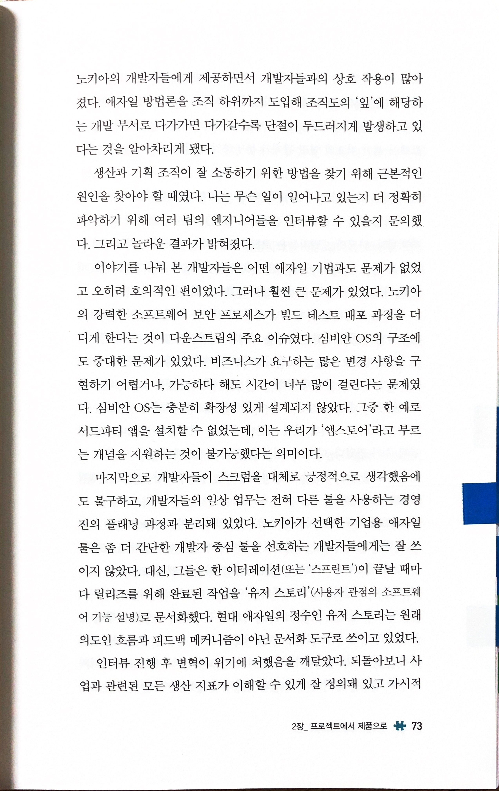 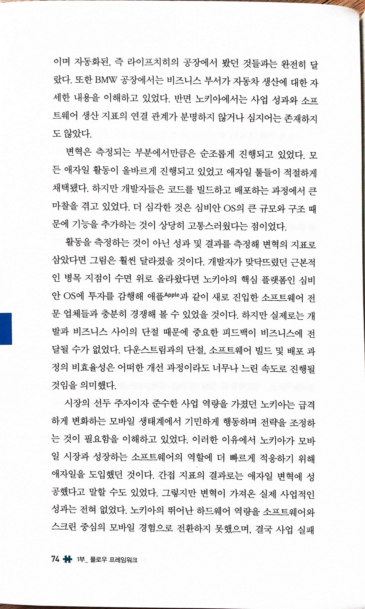 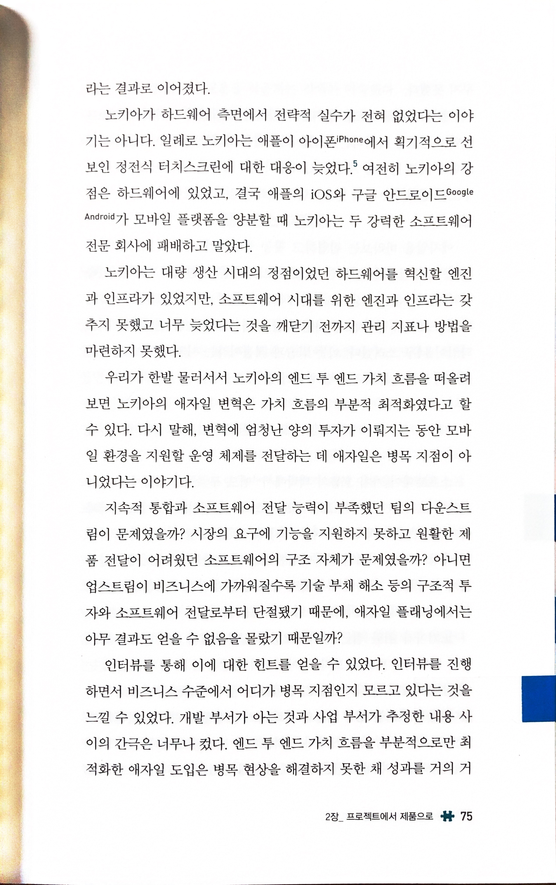

  * `문제는 애자일 도입에 대한 리더들의 좋은 의도와 조직의 의지에도 불구하고 모든 노력이 실패로 돌아갔다는 것이다. 변화를 위해 많은 에너지가 공급됐으며 모두가 옳은 일을 하고 있다고 말했고 그렇게 보였다.`
  * `나는 애자일 방법론의 도입을 위한 노키아의 헌신적인 노력 그리고 우리와 함께 일했던 팀들이 만들어낸 인상적인 애자일 모델 활동에 진심으로 감명받았다. 빠르게 변화하는 시장에 회사가 적응하는 데 애자일이 많은 도움이 된다는 것을 경영진이 깨달았다는 것은 확실했다.`
  * `하지만 점점 더 많은 개발 팀과 일을 하면서 불길한 조짐이 보이기 시작했다. 애자일 활동과 준수 여부를 평가할 때 실제 활동에서 나온 명확한 결과를 반영하지 않는다는 점이 문제였다.`
  * `이야기를 나눠 본 개발자들은 어떤 애자일 기법과도 문제가 없었고 오히려 호의적인 편이었다. 그러나 훨씬 큰 문제가 있었다. 노키아의 강력한 소프트웨어 보안 프로세스가 빌드 테스트 배포 과정을 더디게 한다는 것이 다운스트림의 주요 이슈였다. 심비안 OS의 구조에도 중대한 문제가 있었다... 심비안 OS는 충분히 확장성 있게 설계되지 않았다.`
  * `마지막으로 개발자들이 스크럼을 대체로 긍정적으로 생각했음에도 불구하고, 개발자들의 일상 업무는 전혀 다른 툴을 사용하는 경영진의 플래닝 과정과 분리돼 있었다...현대 애자일의 정수인 유저 스토리는 원래의도인 흐름과 피드백 메커니즘이 아닌 문서화 도구로 쓰이고 있었다.`
  * `활동을 측정하는 것이 아닌 성과 및 결과를 측정해 변혁의 지표로 삼았다면 그림은 훨씬 달라졌을 것이다. 개발자가 맞닥뜨렸던 근본적인 병목 지점이 수면 위로 올라왔다면 노키아의 핵심 플랫폼인 심비안 OS에 투자를 감행해 애플Apple과 같이 새로 진입한 소프트웨어 전문 업체들과 충분히 경쟁해 볼 수 있었을 것이다. 하지만 실제로는 개발과 비즈니스 사이의 단절 때문에 중요한 피드백이 비즈니스에 전달될 수가 없었다. 다운스트림과의 단절, 소프트웨어 빌드 및 배포 과정의 비효율성은 어떠한 개선 과정이라도 너무나 느린 속도로 진행될것임을 의미했다.`
  * `시장의 선두 주자이자 준수한 사업 역량을 가졌던 노키아는 급격하게 변화하는 모바일 생태계에서 기민하게 행동하며 전략을 조정하는 것이 필요함을 이해하고 있었다... 그렇지만 변혁이 가져온 실제 사업적인 성과는 전혀 없었다.`
  * `비즈니스 수준에서 어디가 병목 지점인지 모르고 있다는 것을 느낄 수 있었다. 개발 부서가 아는 것과 사업 부서가 추정한 내용 사이의 간극은 너무나 컸다. 엔드 투 엔드 가치 흐름을 부분적으로만 최적화한 애자일 도입은 병목 현상을 해결하지 못한 채 성과를 거의 거두지 못했다.`
  * (내가 가장 중요하게 생각하며 또 경계해야 하는 부분. 개발 프로세스를 개선하려는 내 의도가 비즈니스 수준에서의 병목 문제를 해결해야 하지, 부분 최적화에 그치면 절대 실패)
* 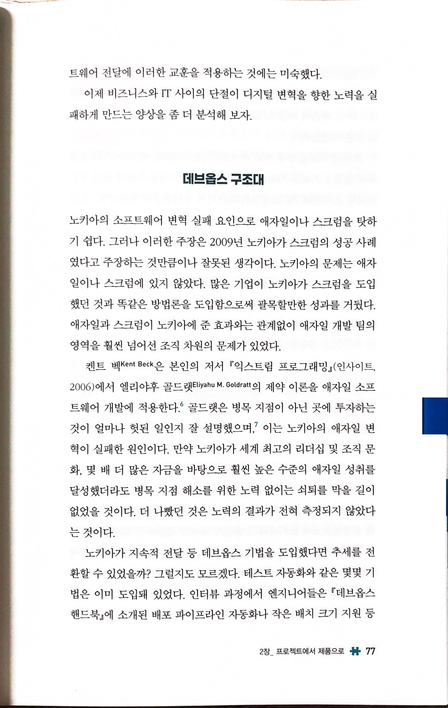

  * `골드랫은 병목 지점이 아닌 곳에 투자하는 것이 얼마나 헛된 일인지 잘 설명했으며, 이는 노키아의 애자일 변혁이 실패한 원인이다.`
* 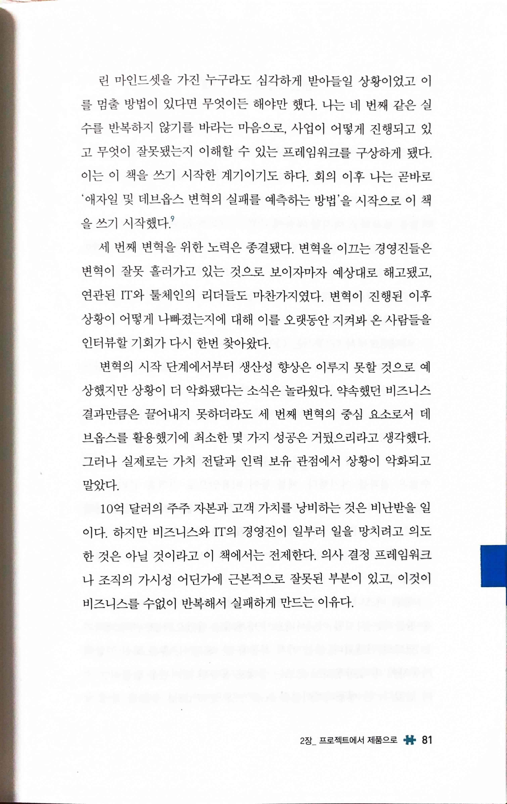

  * `의사 결정 프레임워크나 조직의 가시성 어딘가에 근본적으로 잘못된 부분이 있고, 이것이 비즈니스를 수없이 반복해서 실패하게 만드는 이유다.`
* 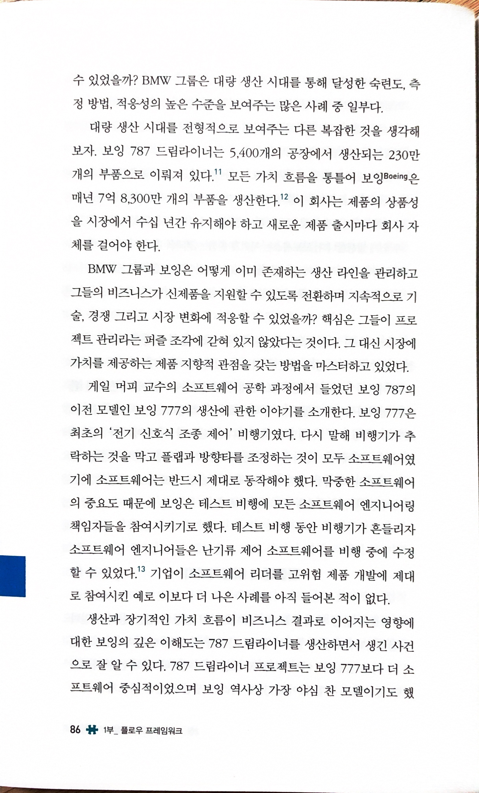

  * `테스트 비행 동안 비행기가 흔들리자 소프트웨어 엔지니어들은 난기류 제어 소프트웨어를 비행 중에 수정할 수 있었다. 기업이 소프트웨어 리더를 고위험 제품 개발에 제대로 참여시킨 예로 이보다 더 나은 사례를 아직 들어본 적이 없다.`
  * (정말 극단적이긴 하지만, 또 어느 정도 이해는 간다. 결국 제품을 체험해야 한다는 뜻일까?)
* 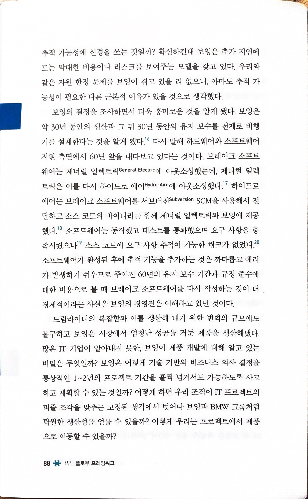

  * `보잉은 약 30년 동안의 생산과 그 뒤 30년 동안의 유지 보수를 전제로 비행기를 설계한다는 것을 알게 됐다. 다시 말해 하드웨어와 소프트웨어 지원 측면에서 60년 앞을 내다보고 있다는 것이다.`
  * (6개월도 예측하기 힘든데 60년을 예측한다는 건 어떤 걸까?)
* 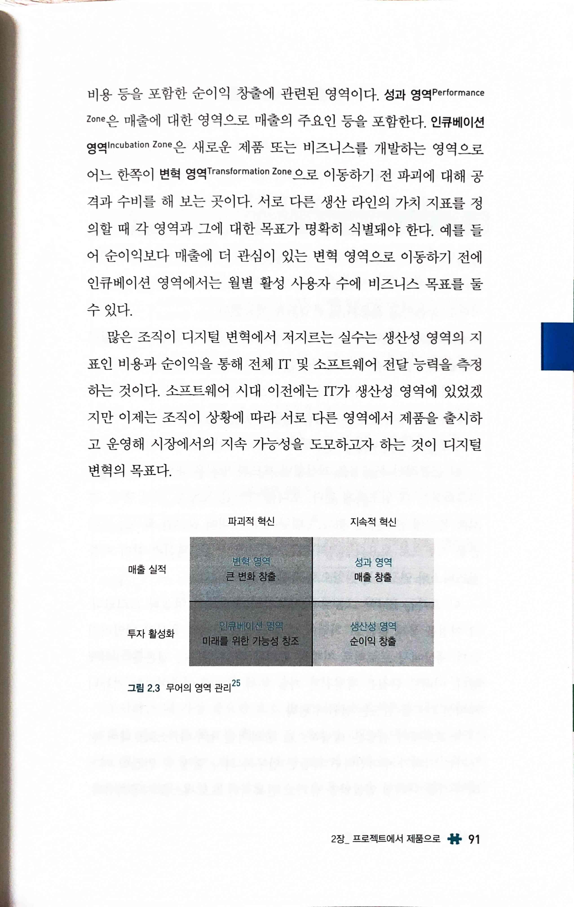

  * `많은 조직이 디지털 변혁에서 저지르는 실수는 생산성 영역의 지표인 비용과 순이익을 통해 전체 IT 및 소프트웨어 전달 능력을 측정하는 것이다. 소프트웨어 시대 이전에는 IT가 생산성 영역에 있었겠지만 이제는 조직이 상황에 따라 서로 다른 영역에서 제품을 출시하고 운영해 시장에서의 지속 가능성을 도모하고자 하는 것이 디지털 변혁의 목표다.`
  * (그러나 비용에 대해 이야기하는 비즈니스의 이야기를 무시할 수도 없는게 딜레마다)

* 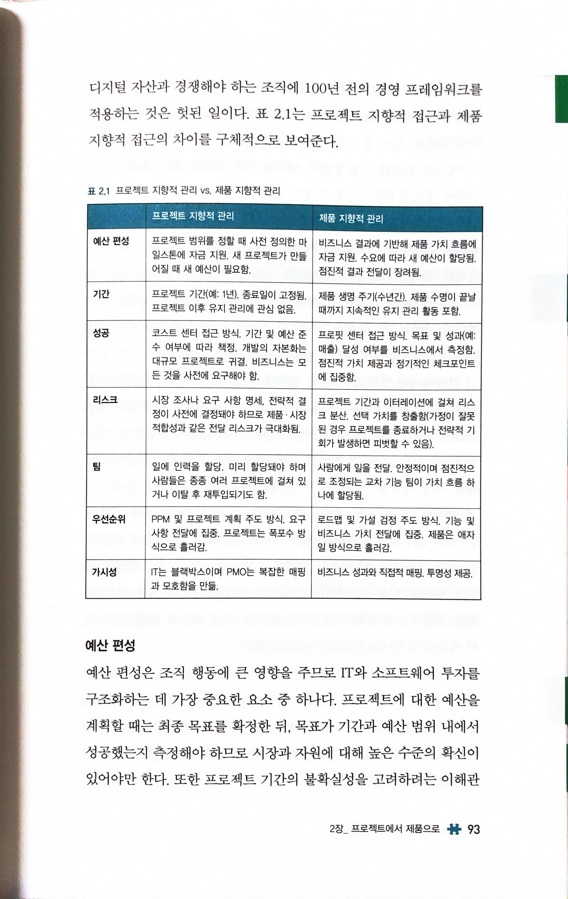

  * `프로젝트 지향적 관리 vs. 제품 지향적 관리`
  * (내가 작년 11월 프로세스 개편을 하면서 기존의 프로젝트 기반의 TF 형태로 일하는 걸 폐지하면서 했던 이야기들이 포함되어 있다)
* 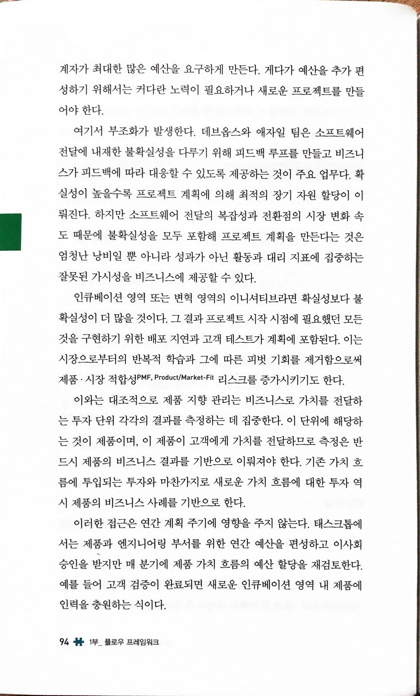

  * `여기서 부조화가 발생한다. 데브옵스와 애자일 팀은 소프트웨어전달에 내재한 불확실성을 다루기 위해 피드백 루프를 만들고 비즈니스가 피드백에 따라 대응할 수 있도록 제공하는 것이 주요 업무다. 확실성이 높을수록 프로젝트 계획에 의해 최적의 장기 자원 할당이 이뤄진다. 하지만 소프트웨어 전달의 복잡성과 전환점의 시장 변화 속도 때문에 불확실성을 모두 포함해 프로젝트 계획을 만든다는 것은 엄청난 낭비일 뿐 아니라 성과가 아닌 활동과 대리 지표에 집중하는 잘못된 가시성을 비즈니스에 제공할 수 있다.`
  * `이와는 대조적으로 제품 지향 관리는 비즈니스로 가치를 전달하는 투자 단위 각각의 결과를 측정하는 데 집중한다. 이 단위에 해당하는 것이 제품이며, 이 제품이 고객에게 가치를 전달하므로 측정은 반드시 제품의 비즈니스 결과를 기반으로 이뤄져야 한다. 기존 가치 흐름에 투입되는 투자와 마찬가지로 새로운 가치 흐름에 대한 투자 역시 제품의 비즈니스 사례를 기반으로 한다.`
  * (확실하다면, 프로젝트 기반 방식도 나쁘지 않고 가능하다. "확실"하다면. 하지만 비즈니스에서 확실한 게 요즘 어디 있는가? 결국 agile도 유연성을 높이기 위한 방법이고, product 조직을 만드는 이유도 여기 있는 법)
* 

  * `한 엔지니어가 가치 흐름을 하나 이상 할당받는 경우 생산성이 크게 떨어진다는 것을 알게 됐다.`
  * (이런 이유로 WIP를 제한하고 싶으나, 현실은 오히려 급건이라는 이유로 하루에도 몇 개씩 sprint planning에서 논의되지 않은 issue들이 들어오고 있다)
* 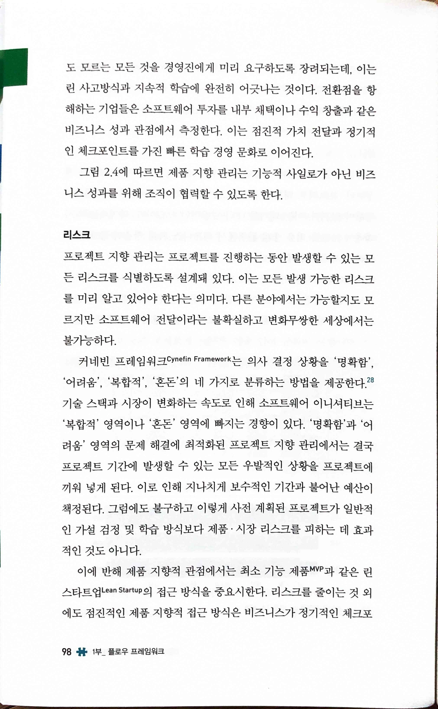 

  * 리스크
    * `프로젝트 지향 관리는 프로젝트를 진행하는 동안 발생할 수 있는 모든 리스크를 식별하도록 설계돼 있다. 이는 모든 발생 가능한 리스크를 미리 알고 있어야 한다는 의미다. 다른 분야에서는 가능할지도 모르지만 소프트웨어 전달이라는 불확실하고 변화무쌍한 세상에서는 불가능하다.`
    * `이에 반해 제품 지향적 관점에서는 최소 기능 제품MVP과 같은 린스타트업 Lean Startup의 접근 방식을 중요시한다. 리스크를 줄이는 것 외에도 점진적인 제품 지향적 접근 방식은 비즈니스가 정기적인 체크포인트에서 방향을 재설정할 수 있도록 해 선택 가치를 만들어낸다. 더 잦은 리뷰와 체크포인트는 비싼 관리 비용을 요구하기 때문에 추가비용이 발생한다. 하지만 소프트웨어의 복잡성과 시장이 바뀌는 속도를 고려하면 제품 생애 주기 전반에 걸쳐 추가 비용이 고루 퍼져 있는것이 낫다.`
  * 팀
    * `프로젝트 지향적 관리에서는 리소스가 프로젝트에 할당된다. 이는 사람을 대체 가능한 소모품으로 보는 테일러리즘의 사고방식이다. 이러한 생각은 소프트웨어 전달이라는 가장 복잡한 지적 작업의 분야에서는 무의미하다.`
    * `개인별 IT 인력의 생산성 및 만족도에 대한 비용 위에 팀 비용이 더해져야 한다. 심리학자 브루스 터크만Bruce Tuckman은 복잡한 문제를 수행하는 팀이 경험하게 되는 형성기, 혼돈기, 규범기, 성취기의 발달주기를 제시했다. 인력을 재할당하는 것은 발달 주기를 방해해 더 많은 사람이 이동할수록 팀의 생산성에 드는 비용을 증가시킨다.`
    * `소프트웨어 전달과 같은 복잡한 지식 산업에 '일에 사람을 투입'하는 프로젝트 지향적 관리 접근은 적합하지 않다. 높은 성과를 내는 소프트웨어 조직은 이미 '사람에게 일을 전달' 하는 것의 효과를 잘 알고 있다.`
* 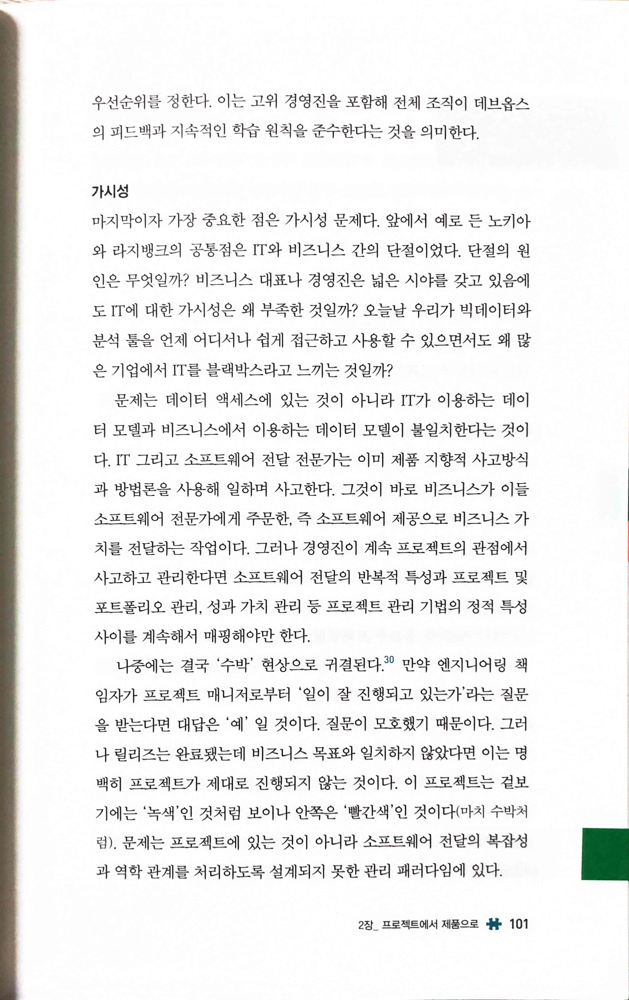

  * `경영진이 계속 프로젝트의 관점에서 사고하고 관리한다면 소프트웨어 전달의 반복적 특성과 프로젝트 및 포트폴리오 관리, 성과 가치 관리 등 프로젝트 관리 기법의 정적 특성 사이를 계속해서 매핑해야만 한다.`
  * `나중에는 결국 '수박' 현상으로 귀결된다. 만약 엔지니어링 책임자가 프로젝트 매니저로부터 '일이 잘 진행되고 있는가'라는 질문을 받는다면 대답은 '예' 일 것이다. 질문이 모호했기 때문이다. 그러나 릴리즈는 완료됐는데 비즈니스 목표와 일치하지 않았다면 이는 명백히 프로젝트가 제대로 진행되지 않는 것이다. 이 프로젝트는 겉보기에는 '녹색'인 것처럼 보이나 안쪽은 '빨간색인 것이다(마치 수박처럼), 문제는 프로젝트에 있는 것이 아니라 소프트웨어 전달의 복잡성과 역학 관계를 처리하도록 설계되지 못한 관리 패러다임에 있다.`
  * (좀 더 명확한 비즈니스 목표와, 더 명확한 비즈니스와 프로덕트의 연결)
* 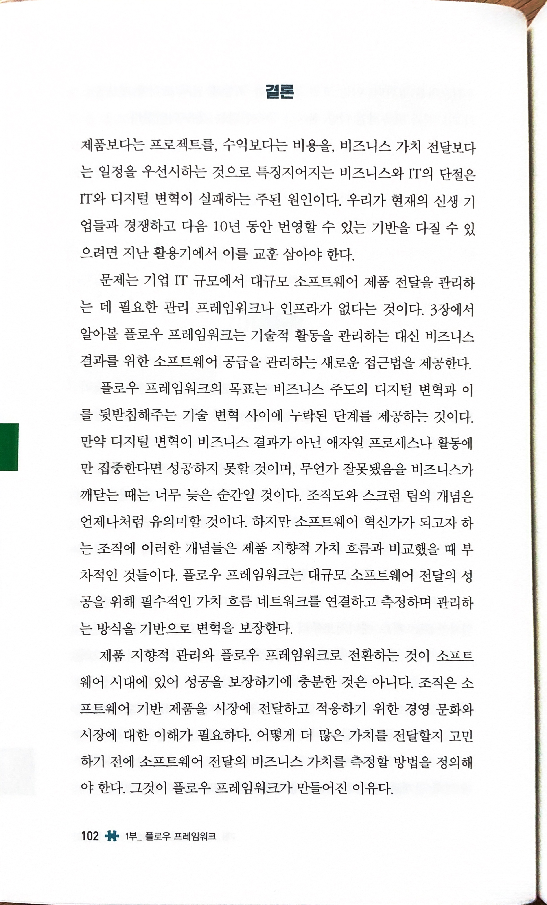

  * `만약 디지털 변혁이 비즈니스 결과가 아닌 애자일 프로세스나 활동에만 집중한다면 성공하지 못할 것이며, 무언가 잘못됐음을 비즈니스가 깨닫는 때는 너무 늦은 순간일 것이다.`
  * `제품 지향적 관리와 플로우 프레임워크로 전환하는 것이 소프트웨어 시대에 있어 성공을 보장하기에 충분한 것은 아니다. 조직은 소프트웨어 기반 제품을 시장에 전달하고 적응하기 위한 경영 문화와 시장에 대한 이해가 필요하다. 어떻게 더 많은 가치를 전달할지 고민하기 전에 소프트웨어 전달의 비즈니스 가치를 측정할 방법을 정의해야 한다. 그것이 플로우 프레임워크가 만들어진 이유다.`
  * (개발에만 국한되지 않은 전사적인 변화, 경영진의 이해, 시장/비즈니스에 대한 이해... 하나같이 정말 쉽지 않다)

### 3장 플로우 프레임워크 소개

## 2부 가치 흐름 지표

### 4장 플로우 지표 수집하기

### 5장 비즈니스 결과로 연결하기

### 6장 파괴 추적

## 3부 가치 흐름 네트워크

### 7장 기업 툴 네트워크의 실측 정보

### 8장 전문화된 불과 가치 흐름

### 9장 가치 흐름 관리

## 맺음말 전환점을 넘어서