# PROJECT TO PRODUCT 프로젝트에서 제품으로
* 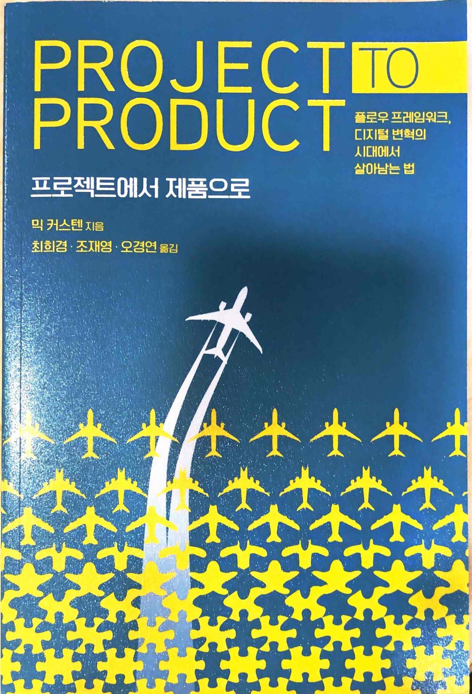
* 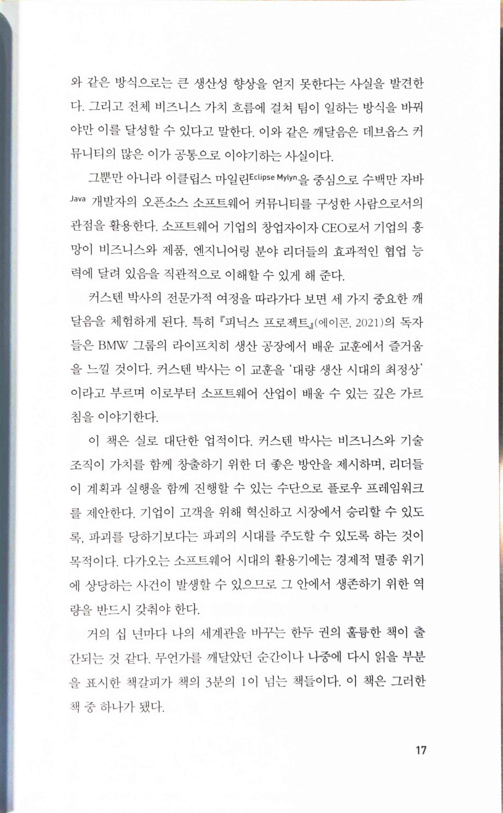

    * `전체 비즈니스 가치 흐름에 걸쳐 팀이 일하는 방식을 바꿔야만 이를 달성할 수 있다고 말한다.`
    * (내가 현재 달성하고 싶어하는 가장 중요한 일 중 하나. 회사 business 기능의 모든 flow를 end to end로 flow diagram으로 표현해서 구조를 파악하고 서로 communication하는데 낭비가 없도록 하는 일)
* 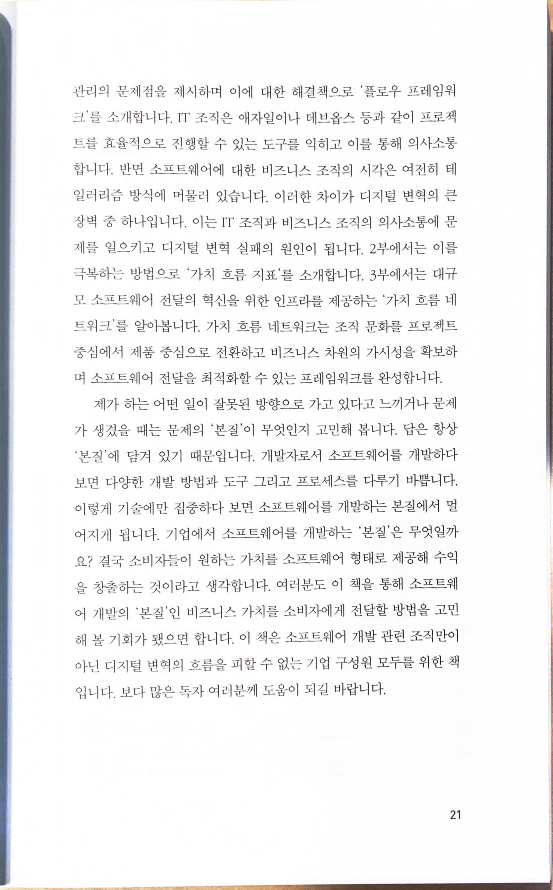

    * `IT 조직은 애자일이나 데브옵스 등과 같이 프로젝트를 효율적으로 진행할 수 있는 도구를 익히고 이를 통해 의사소통합니다. 반면 소프트웨어에 대한 비즈니스 조직의 시각은 여전히 테일러리즘 방식에 머물러 있습니다. 이러한 차이가 디지털 변혁의 큰 장벽 중 하나입니다. 이는 IT 조직과 비즈니스 조직의 의사소통에 문제를 일으키고 디지털 변혁 실패의 원인이 됩니다.`
    * (내가 개발자라서가 아니라, 정말 전통 산업의 경우 굉장히 많은 부분이 뒤쳐져 있다. 항상 새로운 걸 받아들여야 하고, 개선이 필요한 개발업계와 달리 큰 변화없이도 업무를 진행할 수 있는 업계에서는 변화를 남의 일이라고 생각하거나 필요성을 느끼지 못하는 걸로 보인다)

* 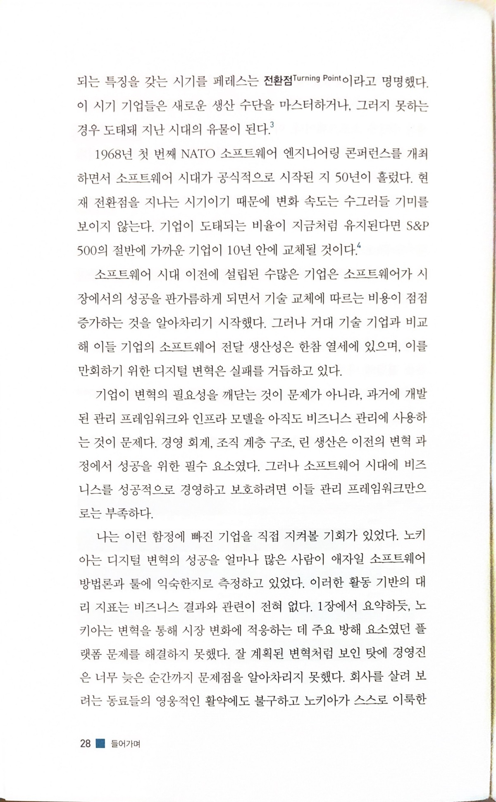 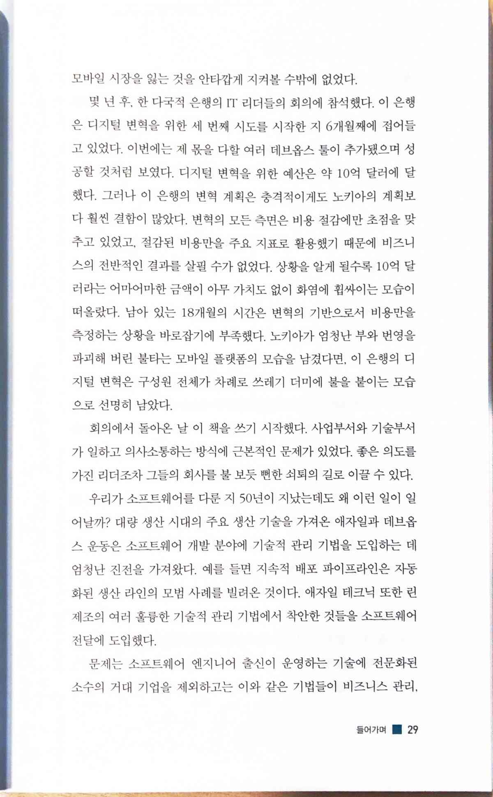 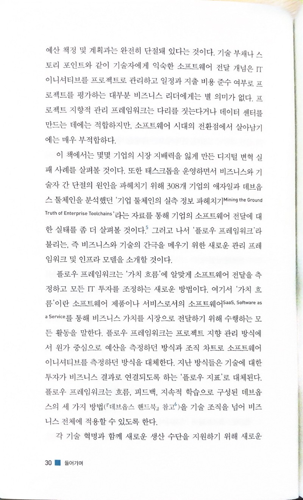 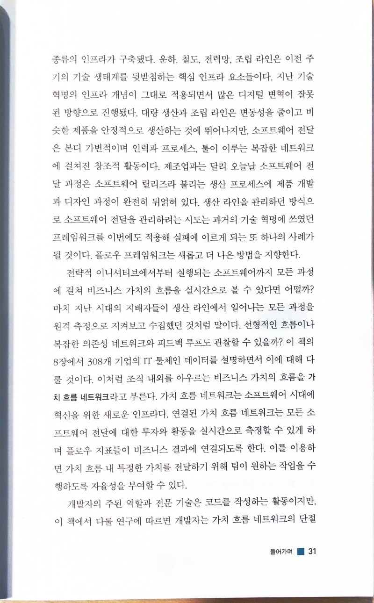 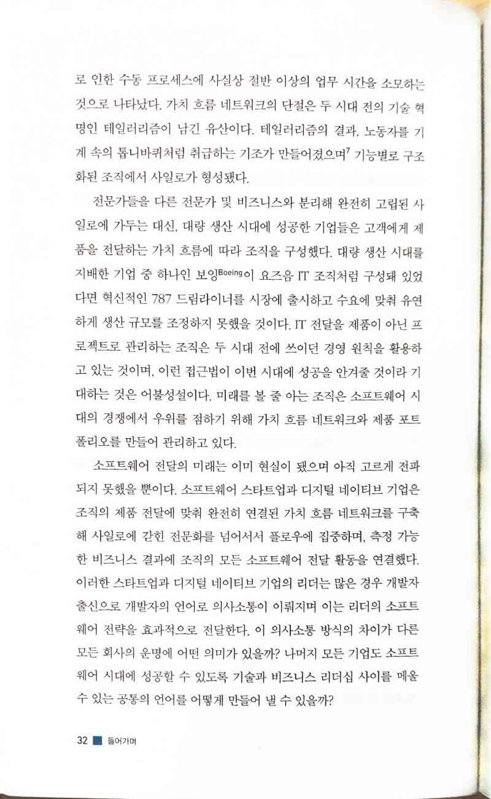 

    * `기술 부채나 스토리 포인트와 같이 기술자에게 익숙한 소프트웨어 전달 개념은 IT 이니셔티브를 프로젝트로 관리하고 일정과 지출 비용 준수 여부로 프로젝트를 평가하는 대부분 비즈니스 리더에게는 별 의미가 없다. 프로젝트 지향적 관리 프레임워크는 다리를 짓는다거나 데이터 센터를 만드는 데에는 적합하지만, 소프트웨어 시대의 전환점에서 살아남기에는 매우 부적합하다.`
    * `플로우 프레임워크는 '가치 흐름'에 알맞게 소프트웨어 전달을 측정하고 모든 IT 투자를 조정하는 새로운 방법이다. 여기서 '가치 흐름'이란 소프트웨어 제품이나 서비스로서의 소프트웨어 Saas. Software asa Service 를 통해 비즈니스 가치를 시장으로 전달하기 위해 수행하는 모든 활동을 말한다. 플로우 프레임워크는 프로젝트 지향 관리 방식에서 원가 중심으로 예산을 측정하던 방식과 조직 차트로 소프트웨어이니셔티브를 측정하던 방식을 대체한다. 지난 방식들은 기술에 대한투자가 비즈니스 결과로 연결되도록 하는 '플로우 지표'로 대체된다.플로우 프레임워크는 흐름, 피드백, 지속적 학습으로 구성된 데브옵스의 세 가지 방법(『데브옵스 핸드북』 참고)을 기술 조직을 넘어 비즈니스 전체에 적용할 수 있도록 한다.`
    * `우리는 미래를 바꿀 수 있다. 우리 기업을 경쟁력 있게 만들 수 있다. 거대 기술 기업과 스타트업이 주는 교훈을 우리의 복잡한 비즈니스에 도입할 수 있다. 소프트웨어 시대의 디지털 네이티브 기업들이하고 있는 것처럼, IT라는 블랙박스를 가치 흐름이라는 투명한 네트워크로 바꾸고 관리할 수 있다. 이를 성취하려면 변혁 활동보다는 측정 가능한 비즈니스 결과에 집중해야 한다.`
    * ('측정 가능'이라는 게 개발 회사가 아닌 곳에 오니 정말 어렵다는 걸 절실히 느끼고 있다. 일단 측정을 하기 위한 장치나 프로세스를 만드는 거부터 거센 저항이 있다)
* 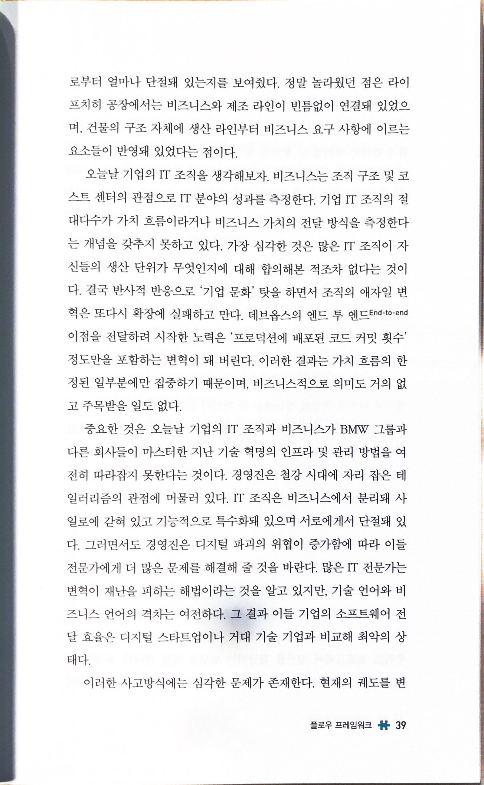

  * `IT 조직이 자신들의 생산 단위가 무엇인지에 대해 합의해본 적조차 없다는 것이다…경영진은 철강 시대에 자리 잡은 테일러리즘의 관점에 머물러 있다…기술 언어와 비즈니스 언어의 격차는 여전하다.`
* 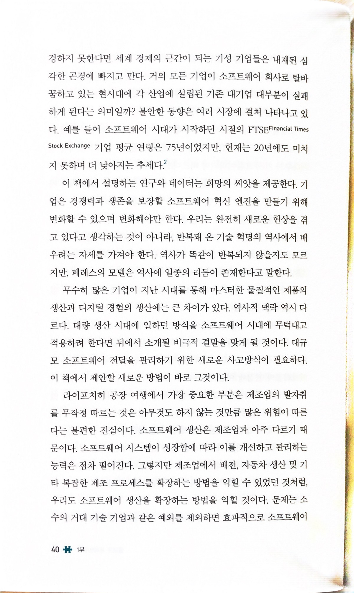 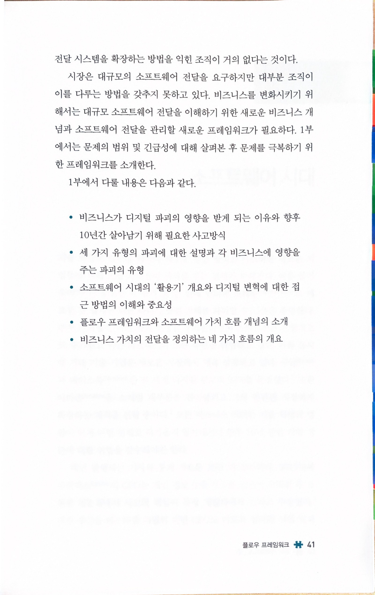

  * `제조업의 발자취를 무작정 따르는 것은 아무것도 하지 않는 것만큼 많은 위험이 따른다는 불편한 진실이다.`
  * (피터 드러커의 what gets measured gets managed가 생각이 났다. 워낙 유명해서 나도 자주 들어봤고 많은 사람들이 이 말을 사용하지만, 사실 이 말이 오용되고 있다는 주장 - e.g. http://www.innovator.or.kr/2015/08/blog-post.html - 도 있다. 정말 중요한 건 측정하기 어렵거나 불가능한데, 저 말 때문에 많은 사람들이 측정 가능한 거만 집착하고 있다는 뜻. 위의 말도 어느 정도 맞닿아 있다는 생각이다. 나도 개발자 출신이라 측정해서 그대로 다 진실을 보여주고 싶지만, 이게 가능한지, 또 가능하더라도 무조건 좋은 일인지가 아직 확신이 들진 않는다)

* 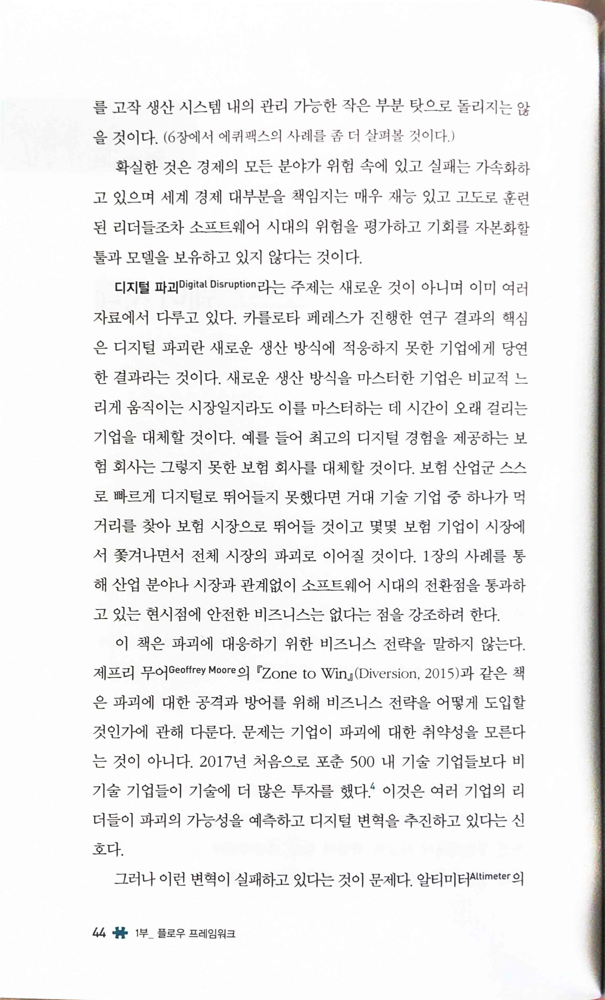 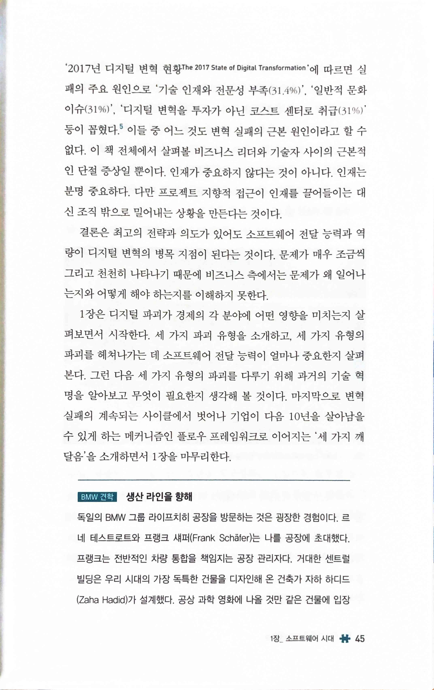

  * `새로운 생산 방식을 마스터한 기업은 비교적 느리게 움직이는 시장일지라도 이를 마스터하는 데 시간이 오래 걸리는기업을 대체할 것이다… 산업 분야나 시장과 관계없이 소프트웨어 시대의 전환점을 통과하고 있는 현시점에 안전한 비즈니스는 없다는 점을 강조하려 한다… 문제는 기업이 파괴에 대한 취약성을 모른다는 것이 아니다…이런 변혁이 실패하고 있다는 것이 문제다.`
  * `다만 프로젝트 지향적 접근이 인재를 끌어들이는 대신 조직 밖으로 밀어내는 상황을 만든다는 것이다…결론은 최고의 전략과 의도가 있어도 소프트웨어 전달 능력과 역량이 디지털 변혁의 병목 지점이 된다는 것이다. 문제가 매우 조금씩 그리고 천천히 나타나기 때문에 비즈니스 측에서는 문제가 왜 일어나는지와 어떻게 해야 하는지를 이해하지 못한다.`
  * ("기업이 파괴에 대한 취약성을 모른다는 것이 아니다"와 "비즈니스 측에서는 문제가 왜 일어나는지와 어떻게 해야 하는지를 이해하지 못한다"가 처음에는 상충되는 거 아닌가 했는데 그게 아니었다. 문제점 자체의 위력은 알고 있지만, 이유를 모르니 대처할 방법도 모른다는 뜻이었네)

* 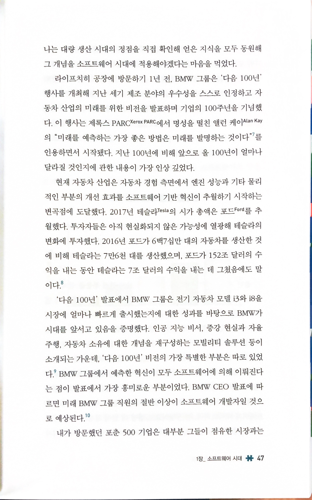 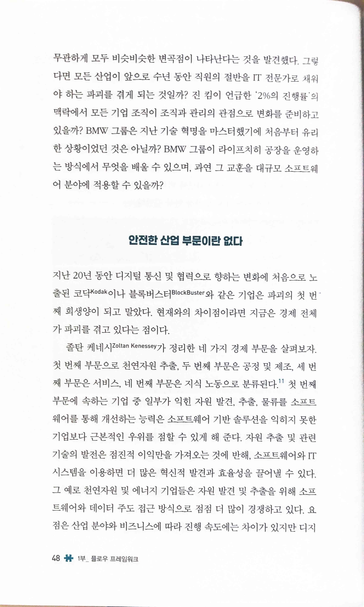

  * `앨런 케이 Alan Kay의 "미래를 예측하는 가장 좋은 방법은 미래를 발명하는 것이다'`
  * (정말 멋진 말이지만 언제나 그렇듯 발명을 선도하는 사람은 극소수이고 그 중에서 성공하는 건 더 소수였다)
  * `지난 20년 동안 디지털 통신 및 협력으로 향하는 변화에 처음으로 노출된 코닥Kodak이나 블록버스터 BlockBuster와 같은 기업은 파괴의 첫 번째 희생양이 되고 말았다. 현재와의 차이점이라면 지금은 경제 전체가 파괴를 겪고 있다는 점이다.`

* 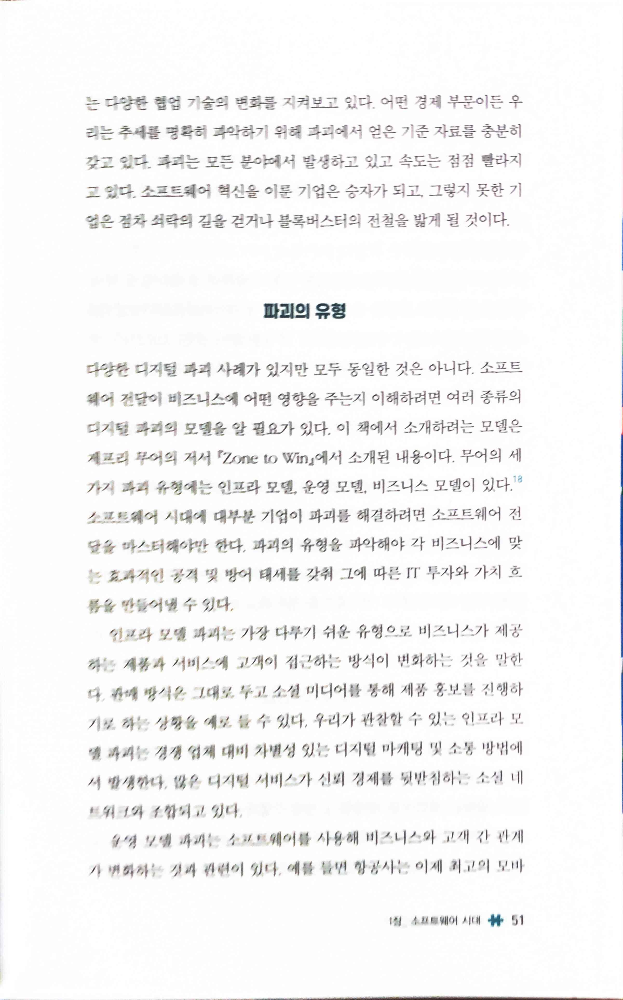 

  * `소프트웨어 혁신을 이룬 기업은 승자가 되고, 그렇지 못한 기업은 점차 쇠락의 길을 걷거나 블록버스터의 전철을 밟게 될 것이다.`
  * `비즈니스가 어떤 상황에 있든지 간에 소프트웨어 시대에 성공하려면 어떤 유형의 파괴가 비즈니스를 위험에 빠뜨렸는지 정확히 정의해야 한다.`
* 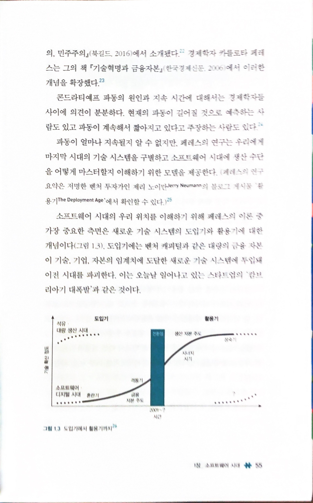

  * `이미 전환전에 들어선 지 수십년이고 활용기에 들어서면 전환하지 못한 기업들은 모두 사라질 거라는 무서운 이야기`

* 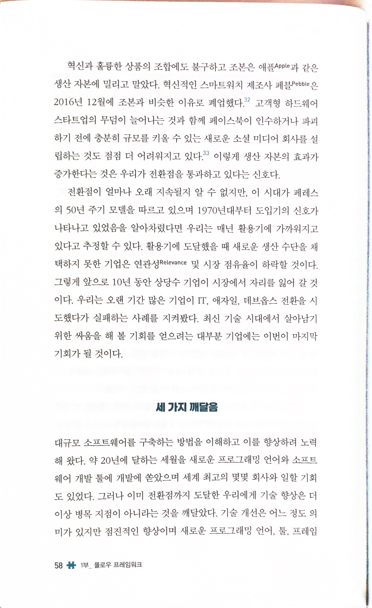 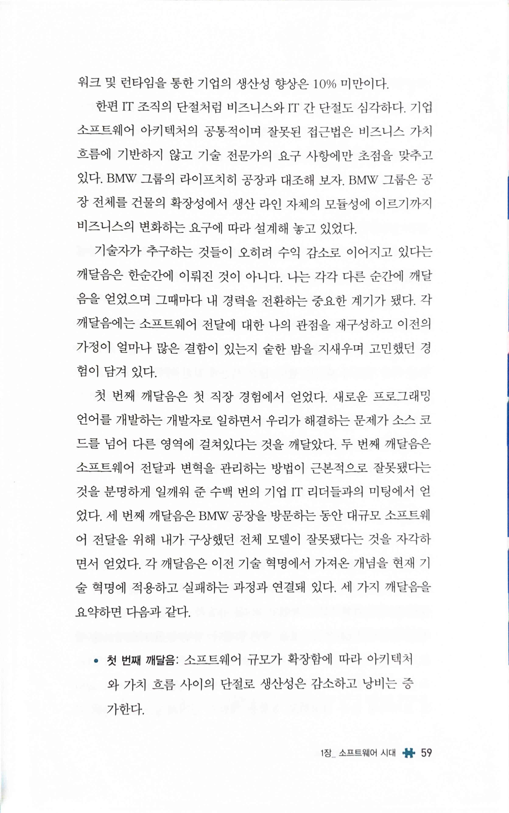 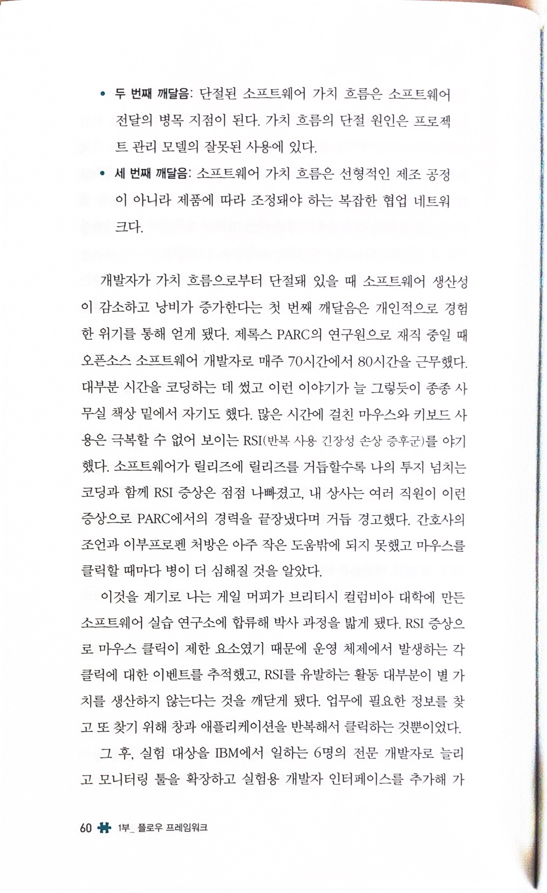 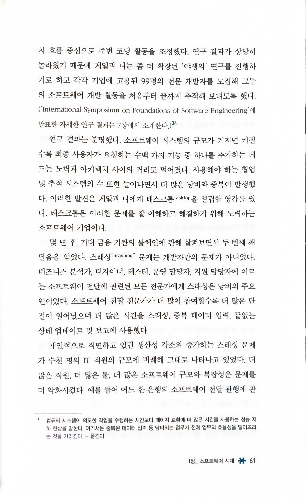 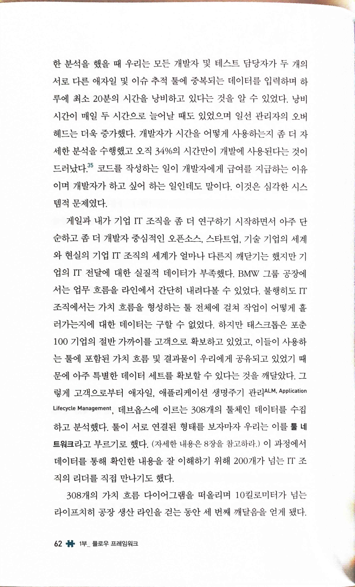

  * `우리는 오랜 기간 많은 기업이 IT, 애자일, 데브옵스 전환을 시도했다가 실패하는 사례를 지켜봤다. 최신 기술 시대에서 살아남기위한 싸움을 해 볼 기회를 얻으려는 대부분 기업에는 이번이 마지막 기회가 될 것이다.`
  * `첫 번째 깨달음: 소프트웨어 규모가 확장함에 따라 아키텍처와 가치 흐름 사이의 단절로 생산성은 감소하고 낭비는 증가한다. - 개발자가 가치 흐름으로부터 단절돼 있을 때 소프트웨어 생산성이 감소하고 낭비가 증가한다`
  * `두 번째 깨달음: 단절된 소프트웨어 가치 흐름은 소프트웨어 전달의 병목 지점이 된다. 가치 흐름의 단절 원인은 프로젝트 관리 모델의 잘못된 사용에 있다. - e.g. 개발자가 시간을 어떻게 사용하는지 좀 더 자세한 분석을 수행했고 오직 34%의 시간만이 개발에 사용된다는 것이 드러났다. 코드를 작성하는 일이 개발자에게 급여를 지급하는 이유이며 개발자가 하고 싶어 하는 일인데도 말이다. 이것은 심각한 시스템적 문제였다. 또한 개발자만의 문제도 아니었다.`
  * `세 번째 깨달음: 소프트웨어 가치 흐름은 선형적인 제조 공정이 아니라 제품에 따라 조정돼야 하는 복잡한 협업 네트워크다. - 소프트웨어 가치 흐름을 고려하기 위한 모델 전체가 잘못되었다는 생각이었다.`
  * `비즈니스와 기술자의 간극은 변혁 이니셔티브를 통해 좁아지기는 커녕 오히려 넓어지고 있다`

* 

  * `가장 큰 문제는 경영 관점에서 기성 기업은 이전 시대의 관리 방법 및 생산 방식을 사용하고 있으며 그렇기 때문에 실패하고 있다는 점이다.`