# 실리콘밸리의 팀장들

[Radical Candor — Be A Kick-Ass Leader And Empower Your Team](https://www.radicalcandor.com/)

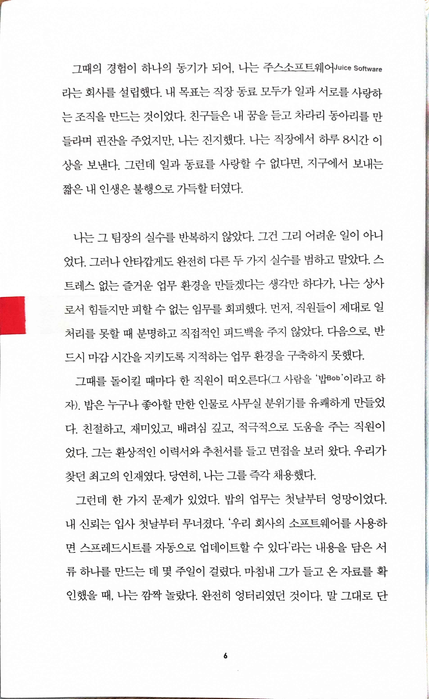

> 스트레스 없는 즐거운 업무 환경을 만들겠다는 생각만 하다가, 나는 상사로서 힘들지만 피할 수 없는 임무를 회피했다. 먼저, 직원들이 제대로 일처리를 못할 때 분명하고 직접적인 피드백을 주지 않았다. 다음으로, 반드시 마감 시간을 지키도록 지적하는 업무 환경을 구축하지 못했다.

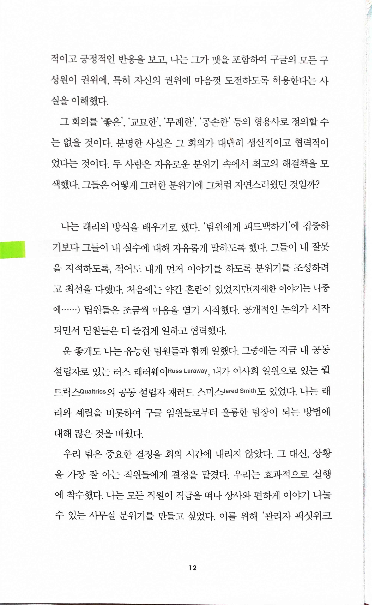

> 나는 래리의 방식을 배우기로 했다. '팀원에게 피드백하기'에 집중하기보다 그들이 내 실수에 대해 자유롭게 말하도록 했다. 그들이 내 잘못을 지적하도록, 적어도 내게 먼저 이야기를 하도록 분위기를 조성하려고 최선을 다했다.

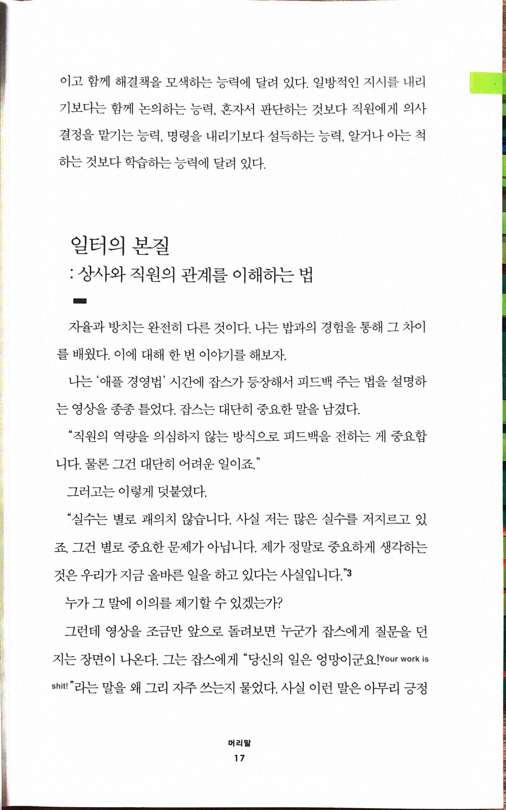

> 일방적인 지시를 내리기보다는 함께 논의하는 능력, 혼자서 판단하는 것보다 직원에게 의사결정을 맡기는 능력, 명령을 내리기보다 설득하는 능력, 알거나 아는 척하는 것보다 학습하는 능력에 달려 있다.

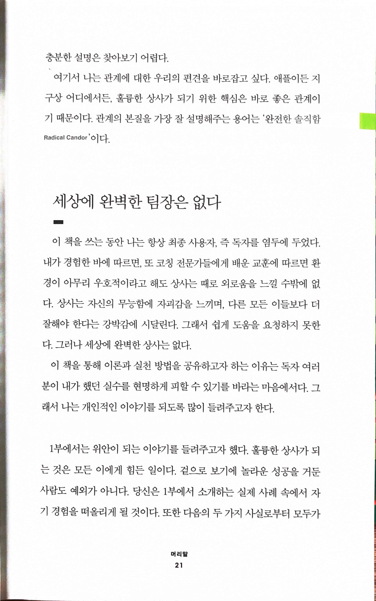

> 지구상 어디에서든, 훌륭한 상사가 되기 위한 핵심은 바로 좋은 관계이기 때문이다. 관계의 본질을 가장 잘 설명해주는 용어는 '완전한 솔직함Radical Candor' 이다.

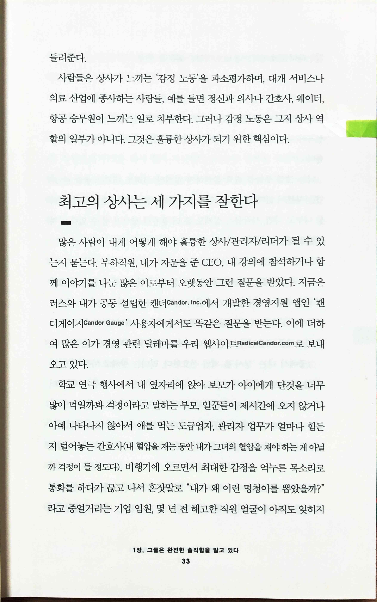

> 감정 노동은 그저 상사 역할의 일부가 아니다. 그것은 훌륭한 상사가 되기 위한 핵심이다.

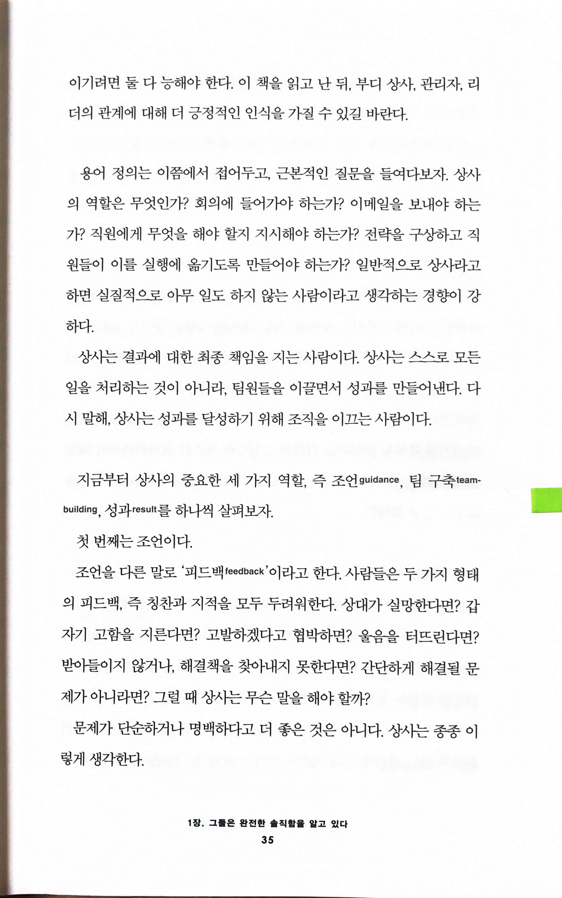

> 상사의 중요한 세 가지 역할, 즉 조언 guidance, 팀 구축 teambuilding, 성과 result

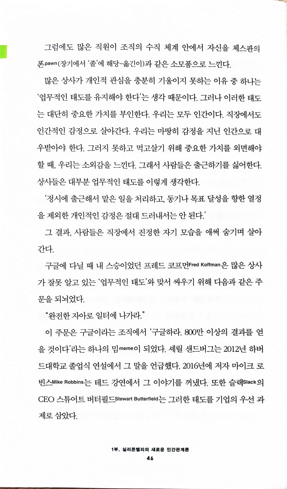

> 많은 직원이 조직의 수직 체계 안에서 자신을 체스판의 폰 pawn 과 같은 소모품으로 느낀다.
>
> 많은 상사가 개인적 관심을 충분히 기울이지 못하는 이유 중 하나는'업무적인 태도를 유지해야 한다'는 생각 때문이다. 그러나 이러한 태도는 대단히 중요한 가치를 부인한다. 우리는 모두 인간이다. 직장에서도인간적인 감정으로 살아간다. 우리는 마땅히 감정을 지닌 인간으로 대우받아야 한다. 그러지 못하고 먹고살기 위해 중요한 가치를 외면해야할 때, 우리는 소외감을 느낀다. 그래서 사람들은 출근하기를 싫어한다.상사들은 대부분 업무적인 태도를 이렇게 생각한다.
>
> '정시에 출근해서 맡은 일을 처리하고, 동기나 목표 달성을 향한 열정을 제외한 개인적인 감정은 절대 드러내서는 안 된다.
>
> 그 결과, 사람들은 직장에서 진정한 자기 모습을 애써 숨기며 살아간다.
>
> 구글에 다닐 때 내 스승이었던 프레드 코프먼Fred Koffman은 많은 상사가 잘못 알고 있는 업무적인 태도'와 맞서 싸우기 위해 다음과 같은 주문을 되뇌었다.
>
> “완전한 자아로 일터에 나가라."

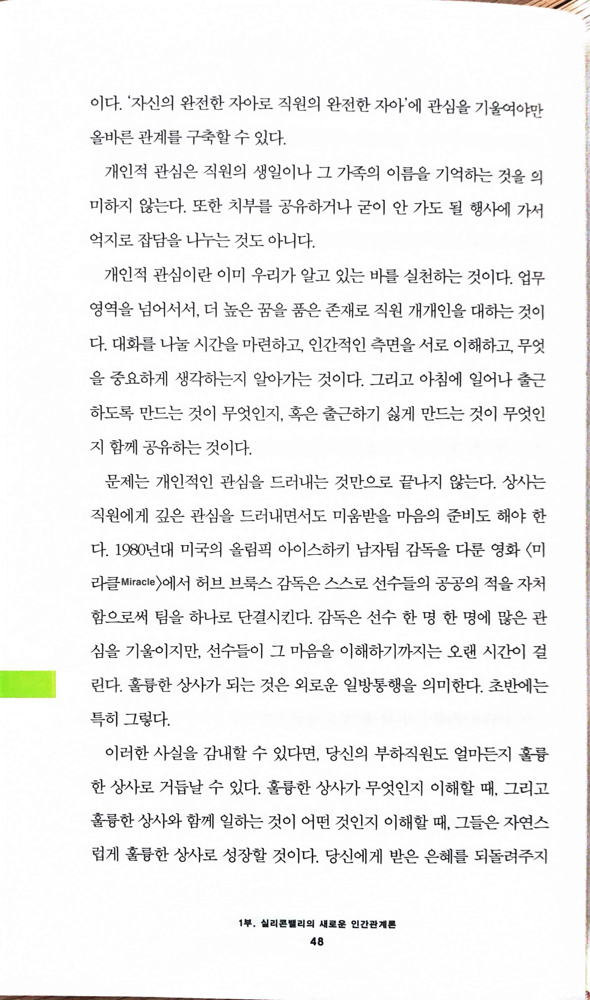

> '자신의 완전한 자아로 직원의 완전한 자아'에 관심을 기울여야만 올바른 관계를 구축할 수 있다.
>
> 개인적 관심이란 이미 우리가 알고 있는 바를 실천하는 것이다. 업무영역을 넘어서서, 더 높은 꿈을 품은 존재로 직원 개개인을 대하는 것이다. 대화를 나눌 시간을 마련하고, 인간적인 측면을 서로 이해하고, 무엇을 중요하게 생각하는지 알아가는 것이다. 그리고 아침에 일어나 출근하도록 만드는 것이 무엇인지, 혹은 출근하기 싫게 만드는 것이 무엇인지 함께 공유하는 것이다.
>
> 훌륭한 상사가 되는 것은 외로운 일방통행을 의미한다. 초반에는 특히 그렇다.

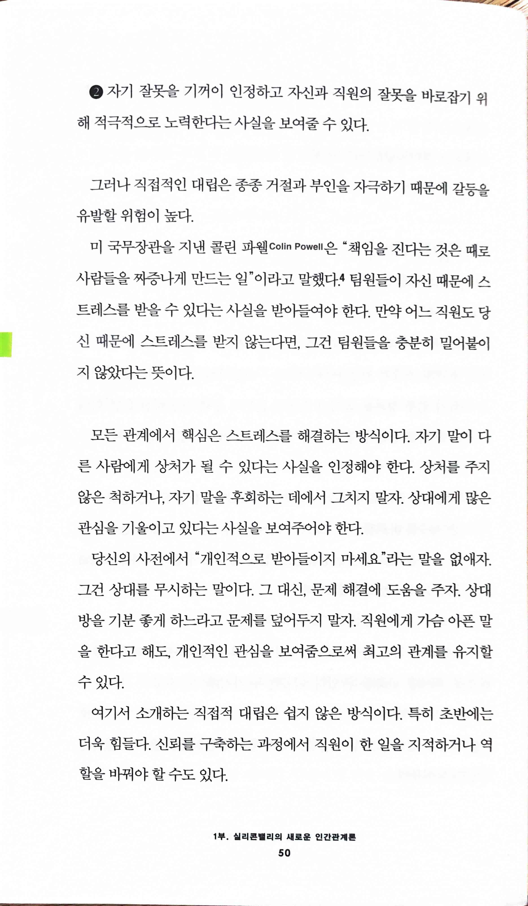

> 미 국무장관을 지낸 콜린 파웰 Colin Powel은 “책임을 진다는 것은 때로 사람들을 짜증나게 만드는 일"이라고 말했다. 팀원들이 자신 때문에 스트레스를 받을 수 있다는 사실을 받아들여야 한다. 만약 어느 직원도 당신 때문에 스트레스를 받지 않는다면, 그건 팀원들을 충분히 밀어붙이지 않았다는 뜻이다.
>
> 모든 관계에서 핵심은 스트레스를 해결하는 방식이다.

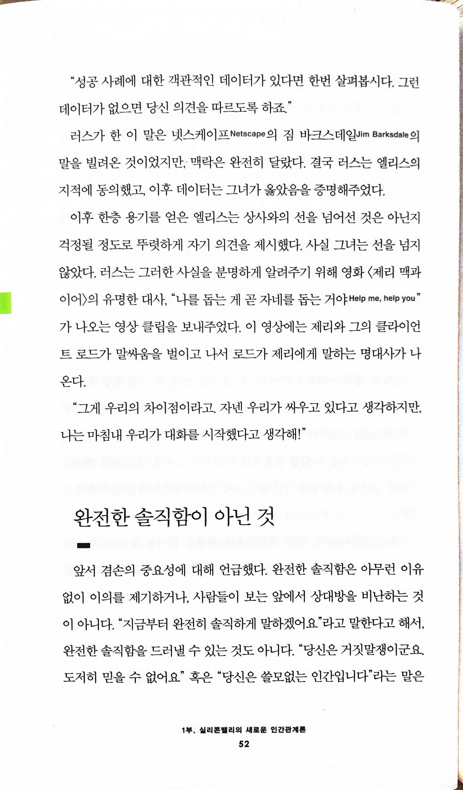

> <제리 맥과이어>의 유명한 대사, “나를 돕는 게 곧 자네를 돕는 거야 Help me, help you"

> 셰릴 샌드버그와의 일화

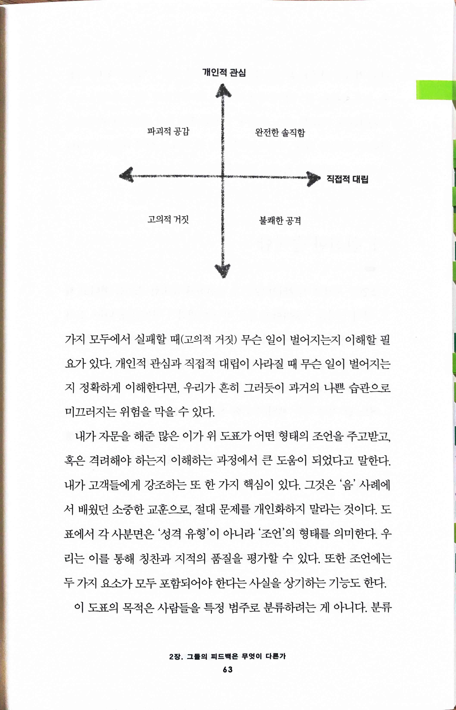

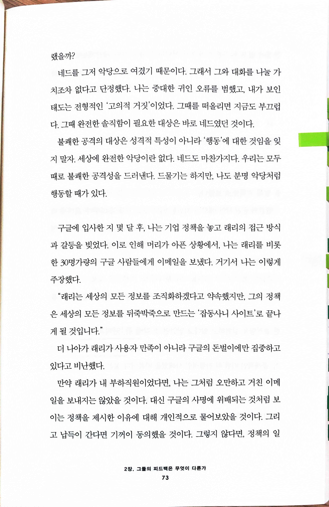

> 불쾌한 공격의 대상은 성격적 특성이 아니라 '행동'에 대한 것임을 잊지 말자. 세상에 완전한 악당이란 없다... 우리는 모두 때로 불쾌한 공격성을 드러낸다.

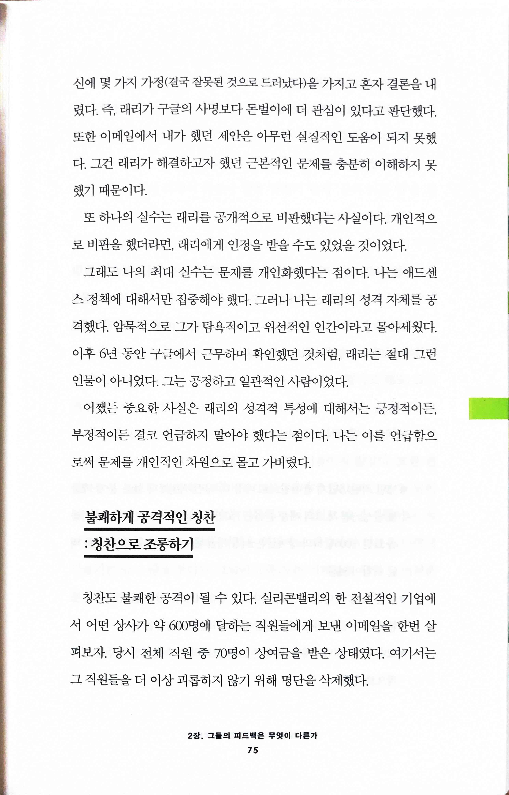

> 중요한 사실은 성격적 특성에 대해서는 긍정적이든, 부정적이든 결코 언급하지 말아야 했다는 점이다. 나는 이를 언급함으로써 문제를 개인적인 차원으로 몰고 가버렸다.

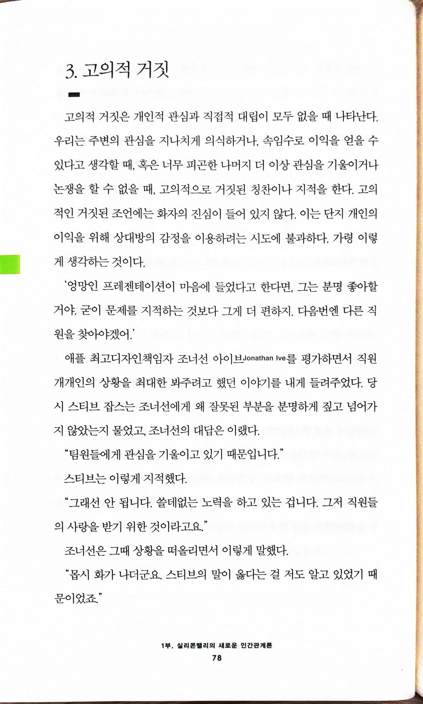

> 고의적인 거짓된 조언에는 화자의 진심이 들어 있지 않다. 이는 단지 개인의 이익을 위해 상대방의 감정을 이용하려는 시도에 불과하다.

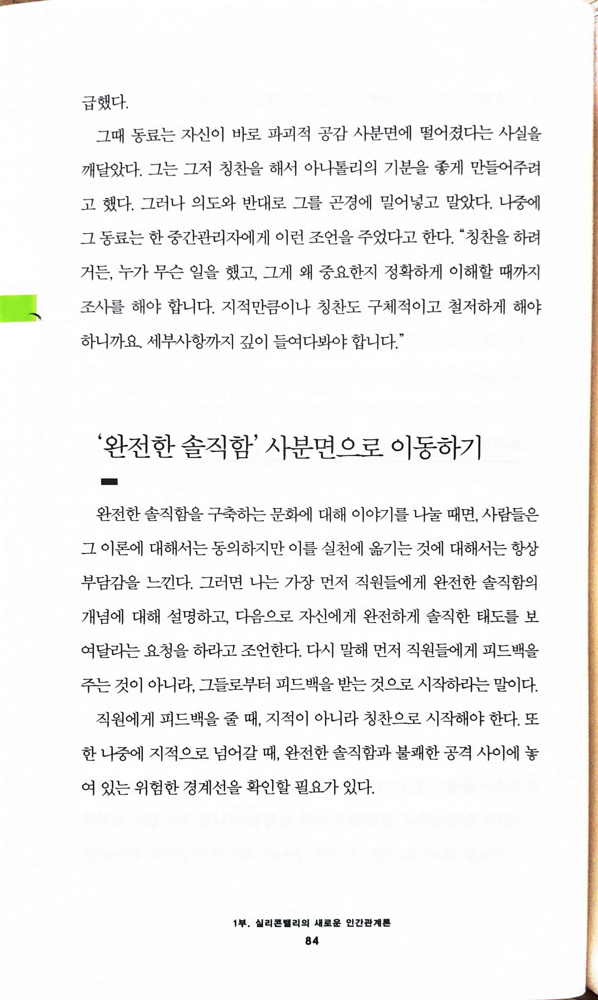

> “칭찬을 하려거든, 누가 무슨 일을 했고, 그게 왜 중요한지 정확하게 이해할 때까지 조사를 해야 합니다. 지적만큼이나 칭찬도 구체적이고 철저하게 해야 하니까요. 세부사항까지 깊이 들여다봐야 합니다."

> 먼저 피드백을 요구하라: 지적받기 전에 먼저 지적하지 말자
>
> 직원들에게 자신에 대한 지적을 요구함으로써 완전한 솔직함의 문화를 시작할 수 있다. 이러한 주장을 뒷받침하는 몇 가지 근거가 있다.
>
> 첫째, 자신도 종종 실수를 저지른다는 사실을 인정하고, 그럴 때마다 조언을 얻고 싶다는 태도를 보여줄 수 있다.
>
> 둘째, 실질적으로 많은 것을 배울 수 있다. 부하직원만큼이나 당신을 가까이에서 관찰하는 사람은 없다. 이를 통해 내가 래리에게 잘못된 이메일을 보내는 것과 같은 치명적인 실수를 예방할 수 있다.
>
> 셋째, 지적을 받는 것이 어떤 것인지 직접 경험함으로써 자신의 조언이 직원들에게 어떻게 전달될 것인지 예상할 수 있다.
>
> 넷째, 지적을 요구함으로써 신뢰를 구축하고 관계를 강화할 수 있다.
>
> 지적을 요청하는 것만큼이나 중요한 일은 팀원들끼리 지적을 주고받도록 분위기를 만드는 것이다

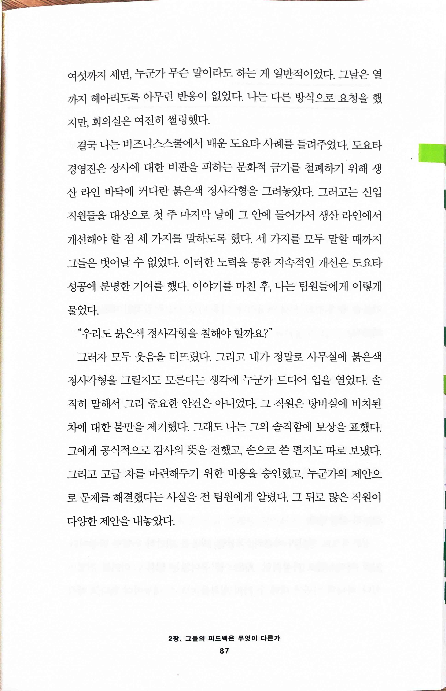

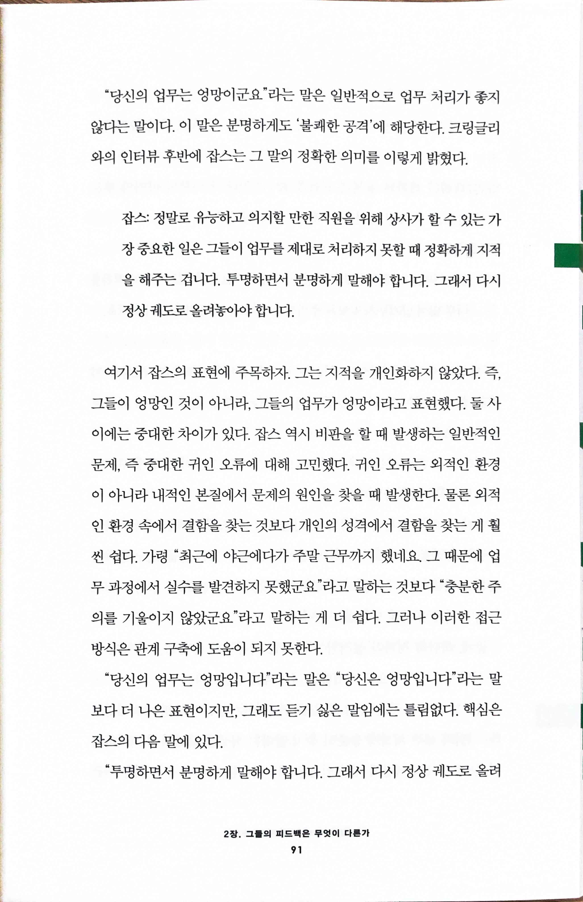 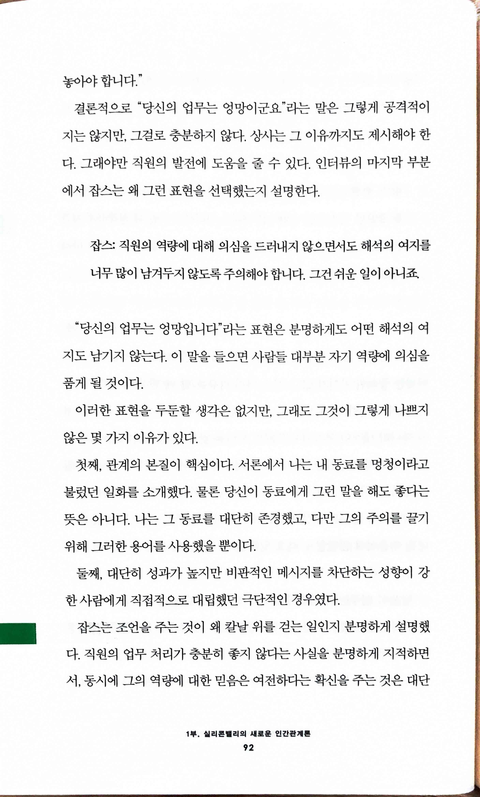

> 잡스: 정말로 유능하고 의지할 만한 직원을 위해 상사가 할 수 있는 가장 중요한 일은 그들이 업무를 제대로 처리하지 못할 때 정확하게 지적을 해주는 겁니다. 투명하면서 분명하게 말해야 합니다. 그래서 다시 정상 궤도로 올려놓아야 합니다.

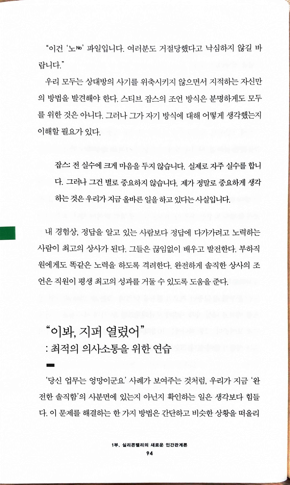

> 정답을 알고 있는 사람보다 정답에 다가가려고 노력하는 사람이 최고의 상사가 된다. 그들은 끊임없이 배우고 발전한다. 부하직원에게도 똑같은 노력을 하도록 격려한다. 완전하게 솔직한 상사의 조언은 직원이 평생 최고의 성과를 거둘 수 있도록 도움을 준다.

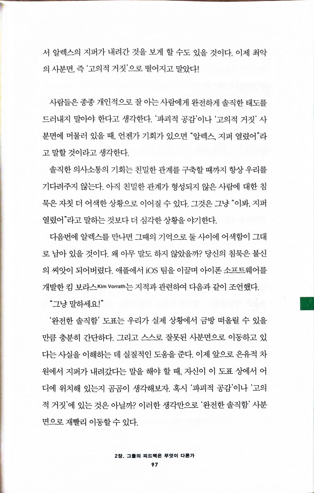

> 킴 보라스 Kim Vorrath는 지적과 관련하여 다음과 같이 조언했다.
>
> “그냥 말하세요!"

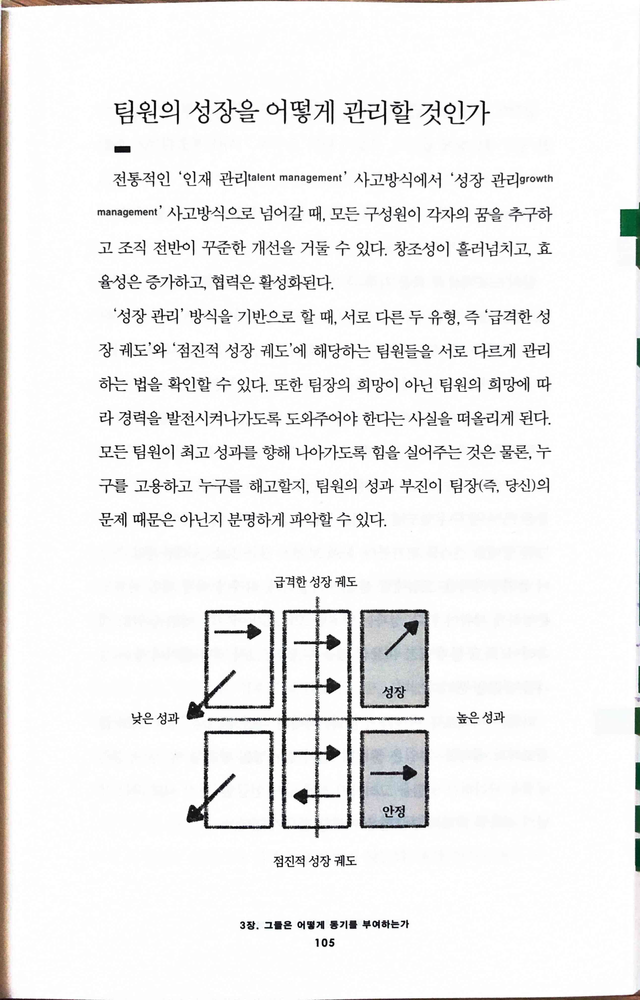

> 전통적인 '인재 관리 talent management' 사고방식에서 '성장 관리 growth management' 사고방식으로 넘어갈 때, 모든 구성원이 각자의 꿈을 추구하고 조직 전반이 꾸준한 개선을 거둘 수 있다. 창조성이 흘러넘치고, 효율성은 증가하고, 협력은 활성화된다.

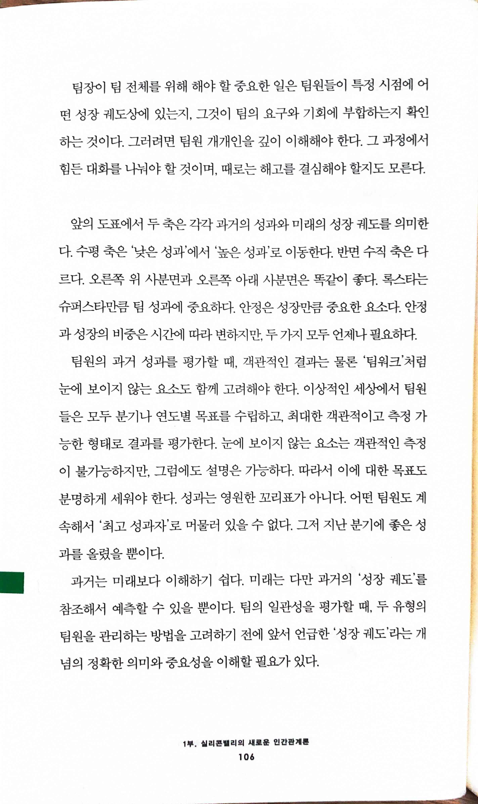

> 팀원의 과거 성과를 평가할 때, 객관적인 결과는 물론 '팀워크' 처럼 눈에 보이지 않는 요소도 함께 고려해야 한다... 과거는 미래보다 이해하기 쉽다. 미래는 다만 과거의 '성장 궤도'를 참조해서 예측할 수 있을 뿐이다. 팀의 일관성을 평가할 때, 두 유형의 팀원을 관리하는 방법을 고려하기 전에 앞서 언급한 '성장 궤도'라는 개념의 정확한 의미와 중요성을 이해할 필요가 있다.

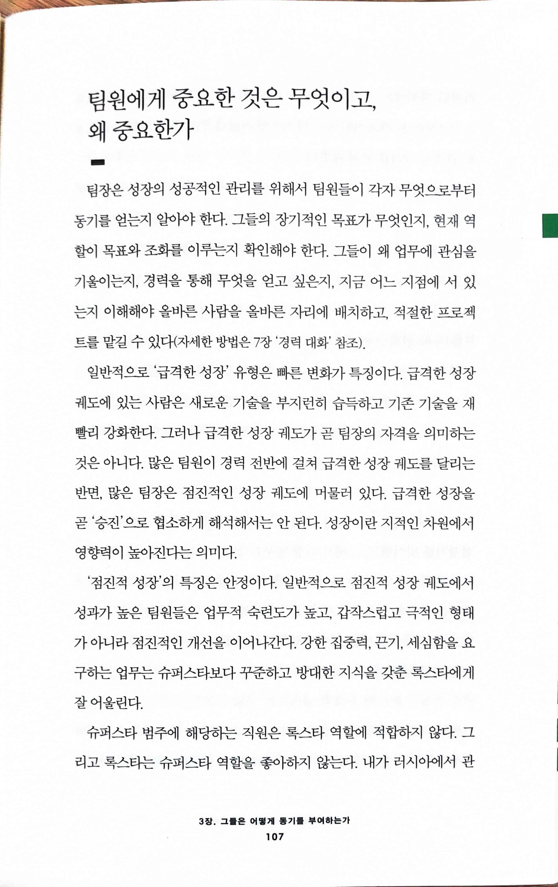

> 팀장은 성장의 성공적인 관리를 위해서 팀원들이 각자 무엇으로부터 동기를 얻는지 알아야 한다. 그들의 장기적인 목표가 무엇인지, 현재 역할이 목표와 조화를 이루는지 확인해야 한다. 그들이 왜 업무에 관심을 기울이는지, 경력을 통해 무엇을 얻고 싶은지, 지금 어느 지점에 서 있는지 이해해야 올바른 사람을 올바른 자리에 배치하고, 적절한 프로젝트를 맡길 수 있다

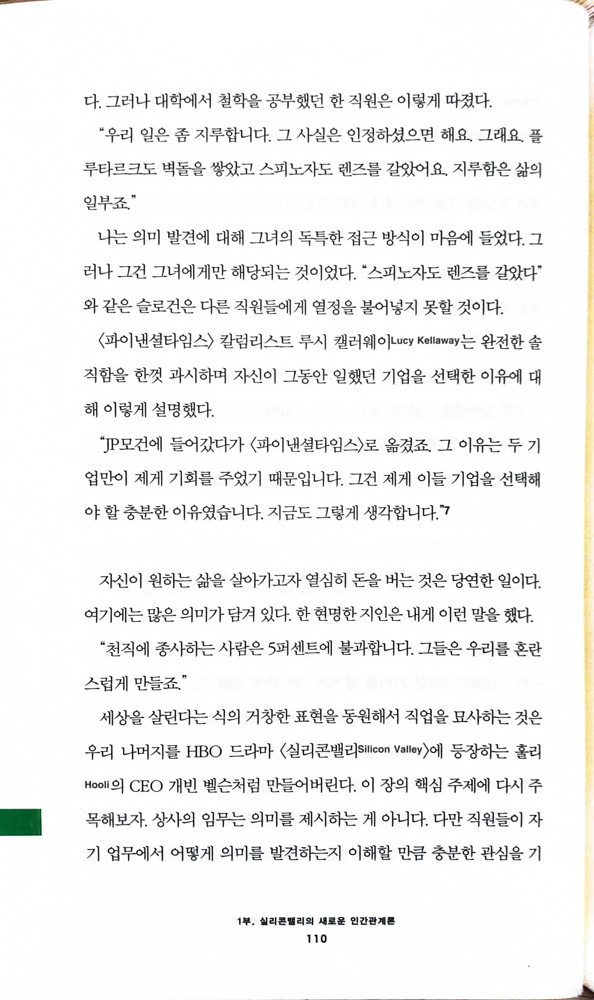 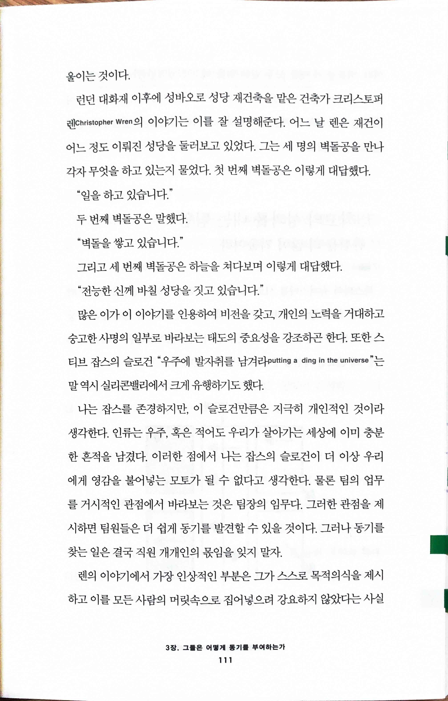

> 상사의 임무는 의미를 제시하는 게 아니다. 다만 직원들이 자기 업무에서 어떻게 의미를 발견하는지 이해할 만큼 충분한 관심을 기울이는 것이다... 물론 팀의 업무를 거시적인 관점에서 바라보는 것은 팀장의 임무다. 그러한 관점을 제시하면 팀원들은 더 쉽게 동기를 발견할 수 있을 것이다. 그러나 동기를 찾는 일은 결국 직원 개개인의 몫임을 잊지 말자.

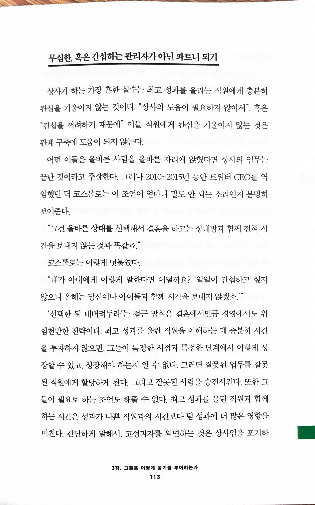 

> 최고 성과를 올린 직원과 함께하는 시간은 성과가 나쁜 직원과의 시간보다 팀 성과에 더 많은 영향을 미친다. 간단하게 말해서, 고성과자를 외면하는 것은 상사임을 포기하는 처사다.
>
> 당신은 더 이상 무관심한 관리자, 혹은 지나치게 간섭하는 관리자가 되어서는 안 된다. 그 대신, 파트너가 되어야 한다. 다시 말해, 최고 성과자가 난관을 극복하고 더 높은 성과를 올리도록 더 많은 시간을 투자해야 한다. 미묘한 차이를 알기 위해서 직원 개개인의 구체적인 상황을 파악해야 한다는 점에서, 이러한 노력에는 많은 에너지가 든다. 무엇보다 직원들에게 많은 질문을 던지고 많은 대답을 듣는 노력이 필요하다. 다시 말해, 상사는 그들에게 적극적으로 다가서야 한다.
* (동감. 그래서 조직 형태와도 관련이 있지만, 기본적으로 다른 구성원들보다 조직장들과 더 많은 이야기가 필요하다고 생각한다)

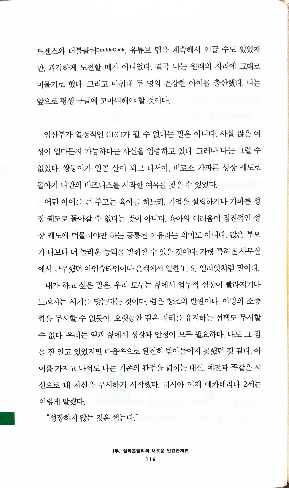

> 예카테리나 2세 “성장하지 않는 것은 썩는다."

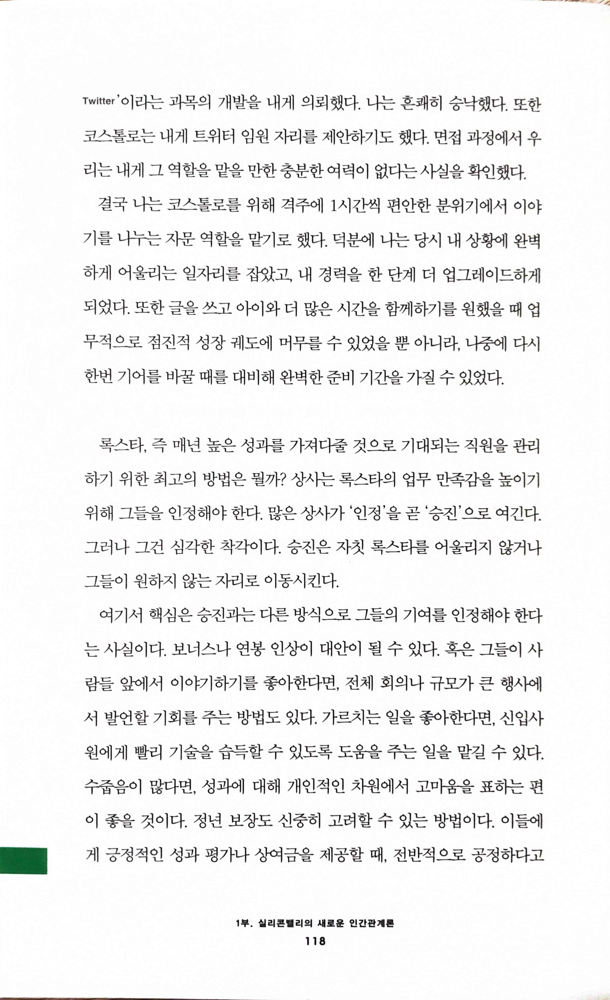

> 매년 높은 성과를 가져다줄 것으로 기대되는 직원을 관리하기 위한 최고의 방법은 뭘까?... 핵심은 승진과는 다른 방식으로 그들의 기여를 인정해야 한다는 사실이다.

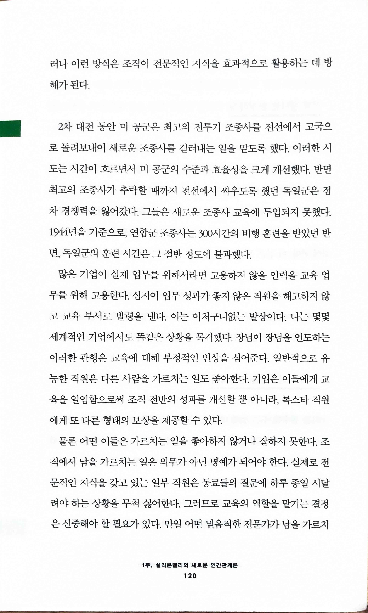

> 교육의 중요성

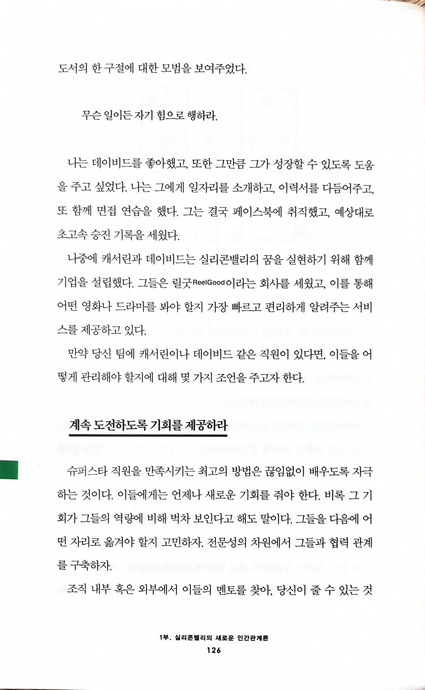

> 슈퍼스타 직원을 만족시키는 최고의 방법은 끊임없이 배우도록 자극하는 것이다. 이들에게는 언제나 새로운 기회를 줘야 한다. 비록 그 기회가 그들의 역량에 비해 벅차 보인다고 해도 말이다.

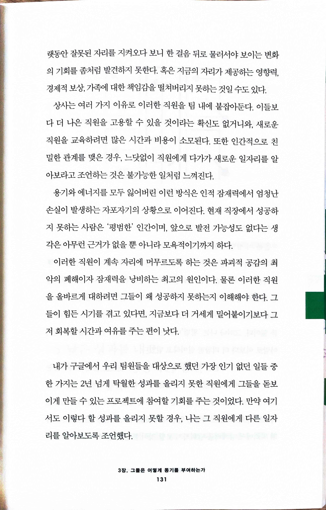

> 용기와 에너지를 모두 잃어버린 이런 방식은 인적 잠재력에서 엄청난 손실이 발생하는 자포자기의 상황으로 이어진다...물론 이러한 직원을 올바르게 대하려면 그들이 왜 성공하지 못하는지 이해해야 한다. 그들이 힘든 시기를 겪고 있다면, 지금보다 더 거세게 밀어붙이기보다 그저 회복할 시간과 여유를 주는 편이 낫다.

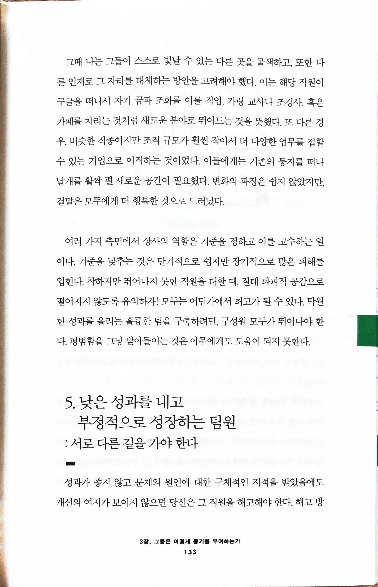

> 여러 가지 측면에서 상사의 역할은 기준을 정하고 이를 고수하는 일이다. 기준을 낮추는 것은 단기적으로 쉽지만 장기적으로 많은 피해를 입힌다. 착하지만 뛰어나지 못한 직원을 대할 때, 절대 파괴적 공감으로 떨어지지 않도록 유의하자! 모두는 어딘가에서 최고가 될 수 있다. 탁월한 성과를 올리는 훌륭한 팀을 구축하려면, 구성원 모두가 뛰어나야 한다. 평범함을 그냥 받아들이는 것은 아무에게도 도움이 되지 못한다.

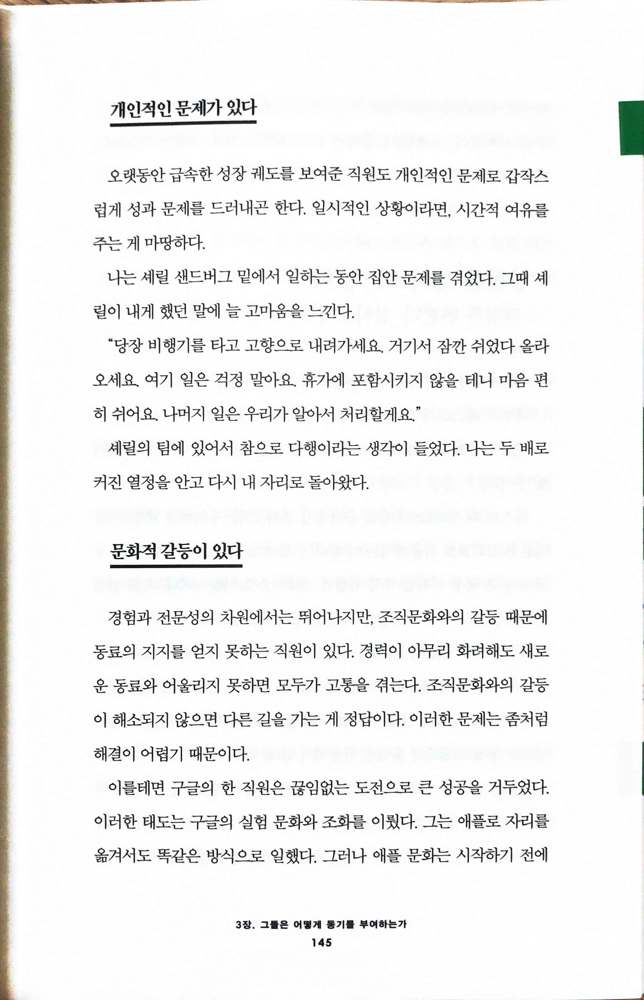

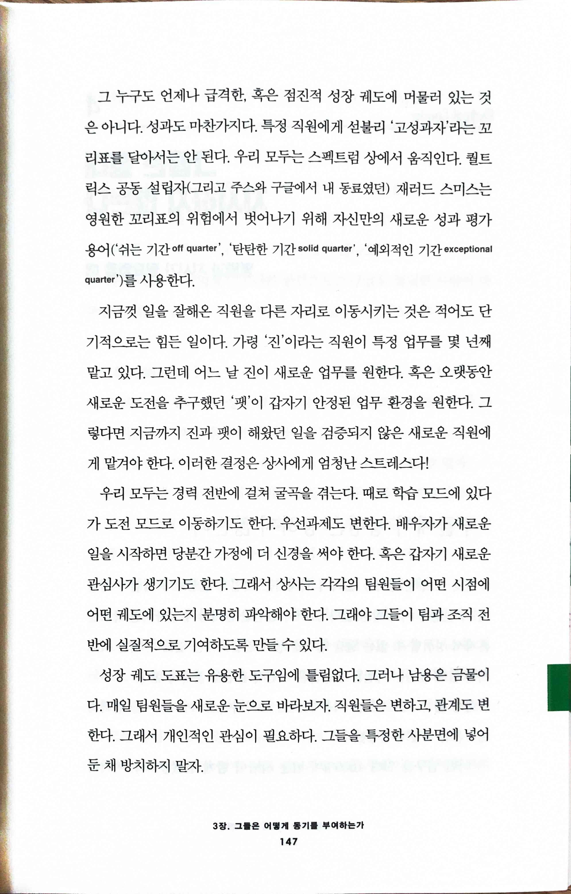

> 성장 궤도 도표는 유용한 도구임에 틀림없다. 그러나 남용은 금물이다. 매일 팀원들을 새로운 눈으로 바라보자. 직원들은 변하고, 관계도 변한다. 그래서 개인적인 관심이 필요하다. 그들을 특정한 사분면에 넣어둔 채 방치하지 말자.

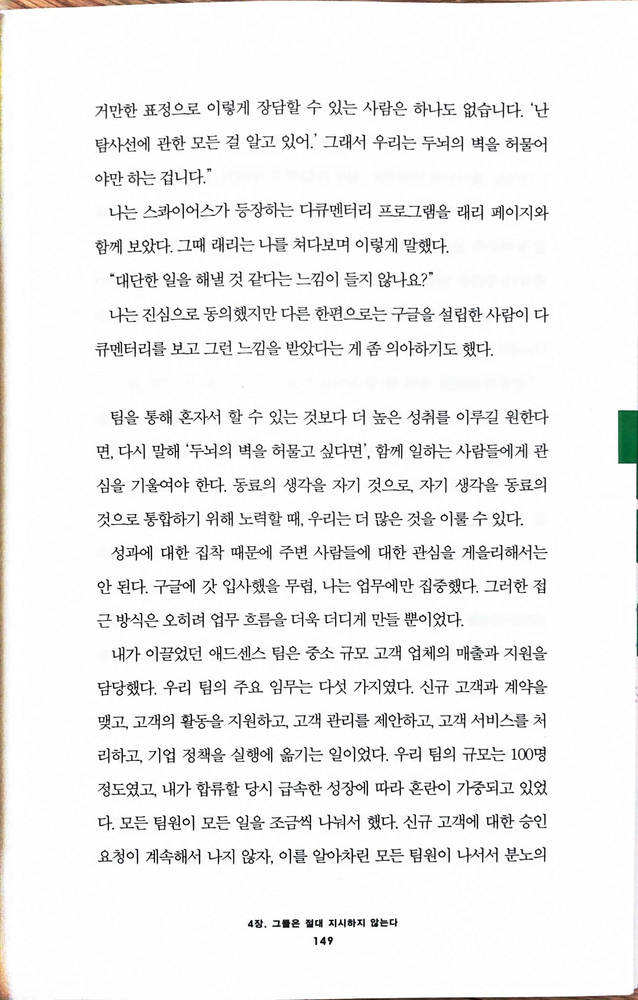

> 팀을 통해 혼자서 할 수 있는 것보다 더 높은 성취를 이루길 원한다.면, 다시 말해 '두뇌의 벽을 허물고 싶다면, 함께 일하는 사람들에게 관심을 기울여야 한다. 동료의 생각을 자기 것으로, 자기 생각을 동료의것으로 통합하기 위해 노력할 때, 우리는 더 많은 것을 이룰 수 있다.

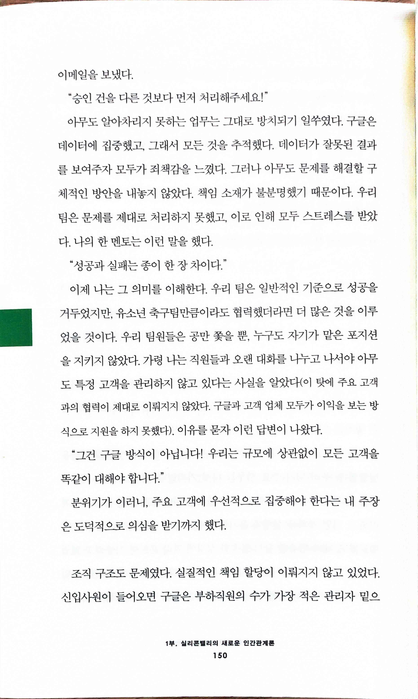

> 우리 팀원들은 공만 쫓을 뿐, 누구도 자기가 맡은 포지션을 지키지 않았다.
* (유소년 축구팀 비유는 나도 자주 쓰는 건데, 이와는 반대의 경우)

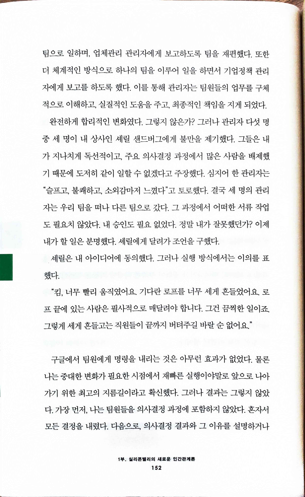

> 중대한 변화가 필요한 시점에서 재빠른 실행이야말로 앞으로 나아가기 위한 최고의 지름길이라고 확신했다. 그러나 결과는 그렇지 않았다.

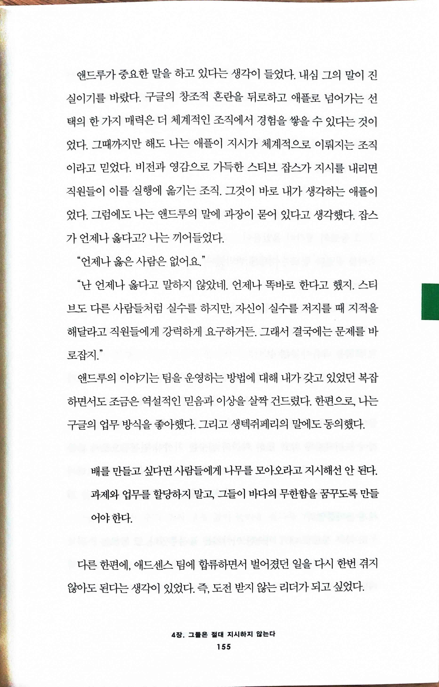

> "난 언제나 옳다고 말하지 않았네. 언제나 똑바로 한다고 했지. 스티브도 다른 사람들처럼 실수를 하지만, 자신이 실수를 저지를 때 지적을 해달라고 직원들에게 강력하게 요구하거든. 그래서 결국에는 문제를 바로잡지.”

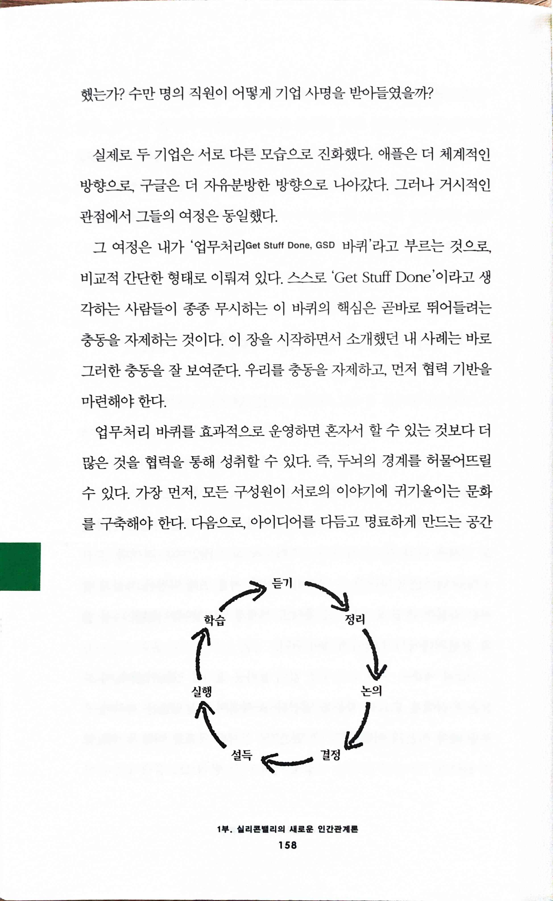

> '업무처리 Get Stuft Done, GSD 바퀴'

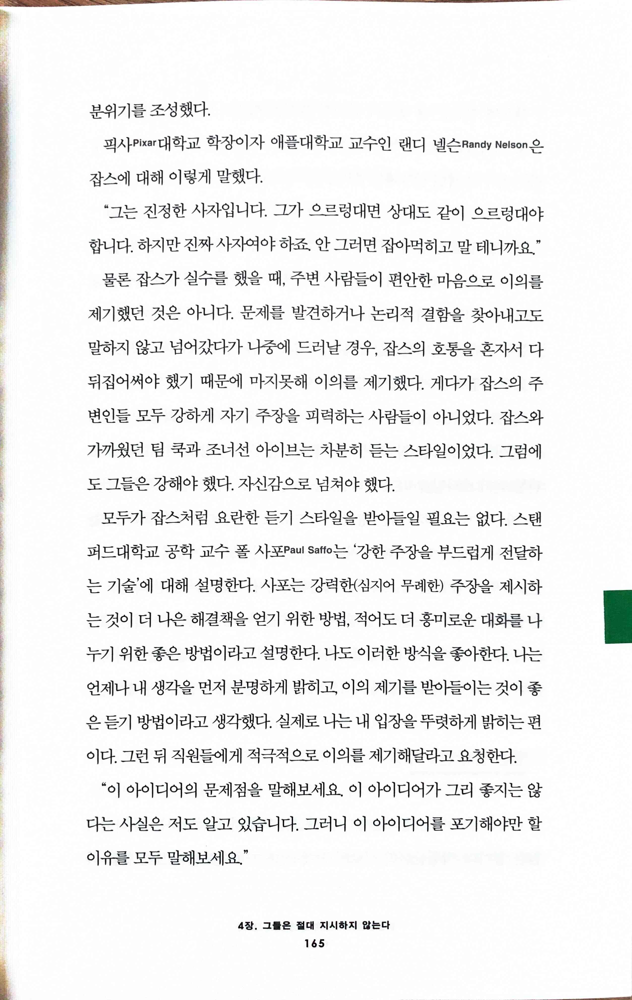

> '강한 주장을 부드럽게 전달하는 기술'... 생각을 먼저 분명하게 밝히고, 이의 제기를 받아들이는 것

> 권한 부여에 관한 원칙... 그 원칙이란 누가 어떤 아이디어를 가져와도 받아들여야 한다는 것이다. 만약 거절했다면 왜 거절했는지 분명하게 설명하고, 또한 가치 있다고 판단할 경우에 해당 직원이 자기 아이디어를 완성할 수 있도록 적극 지원해야 한다.

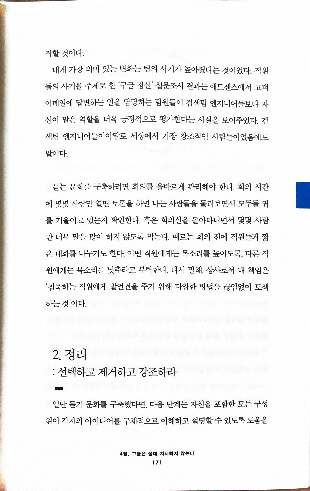

> 듣는 문화를 구축하려면 회의를 올바르게 관리해야 한다... 상사로서 내 책임은 '침묵하는 직원에게 발언권을 주기 위해 다양한 방법을 끊임없이 모색하는 것'이다.

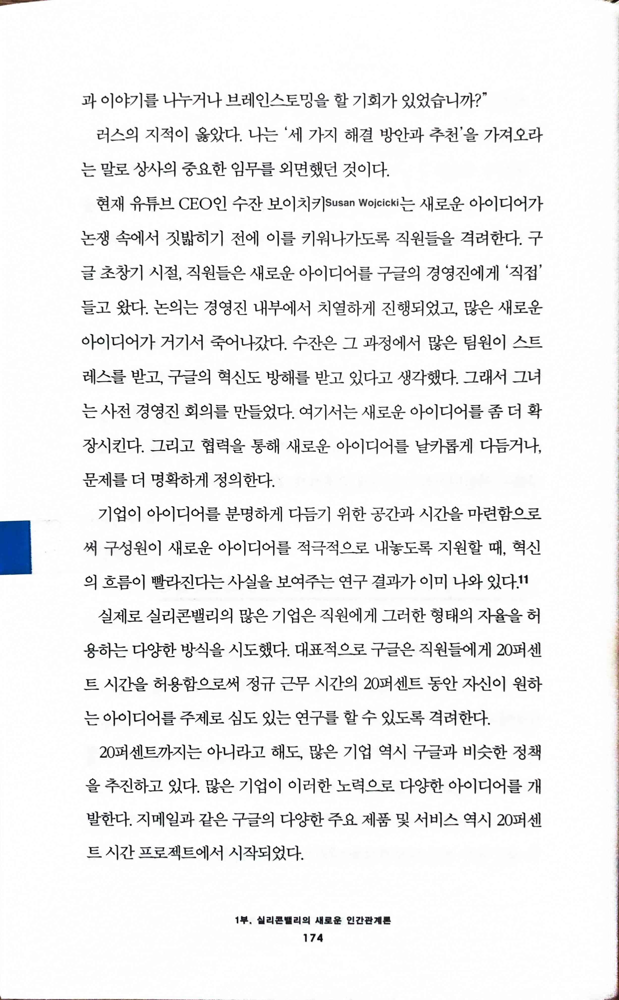

> 기업이 아이디어를 분명하게 다듬기 위한 공간과 시간을 마련함으로써 구성원이 새로운 아이디어를 적극적으로 내놓도록 지원할 때, 혁신의 흐름이 빨라진다는 사실을 보여주는 연구 결과가 이미 나와 있다.

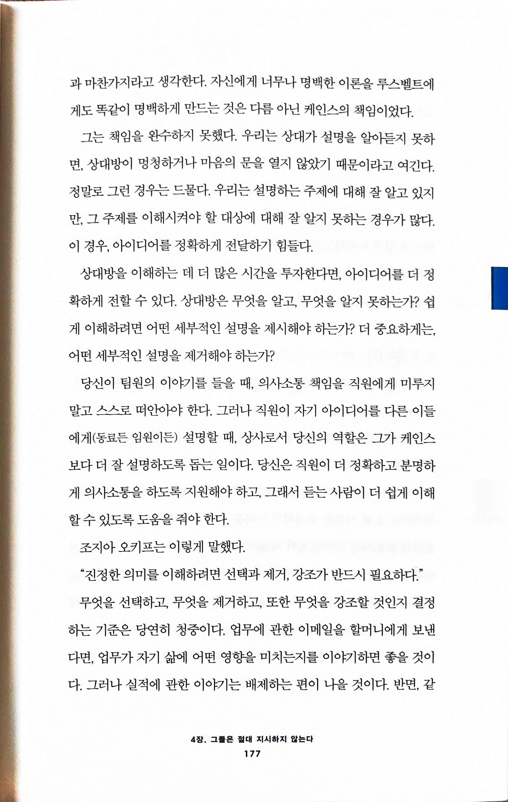

> 상대방을 이해하는 데 더 많은 시간을 투자한다면, 아이디어를 더 정확하게 전할 수 있다. 상대방은 무엇을 알고, 무엇을 알지 못하는가? 쉽게 이해하려면 어떤 세부적인 설명을 제시해야 하는가? 더 중요하게는, 어떤 세부적인 설명을 제거해야 하는가?
>
> 조지아 오키프
>
> “진정한 의미를 이해하려면 선택과 제거, 강조가 반드시 필요하다."

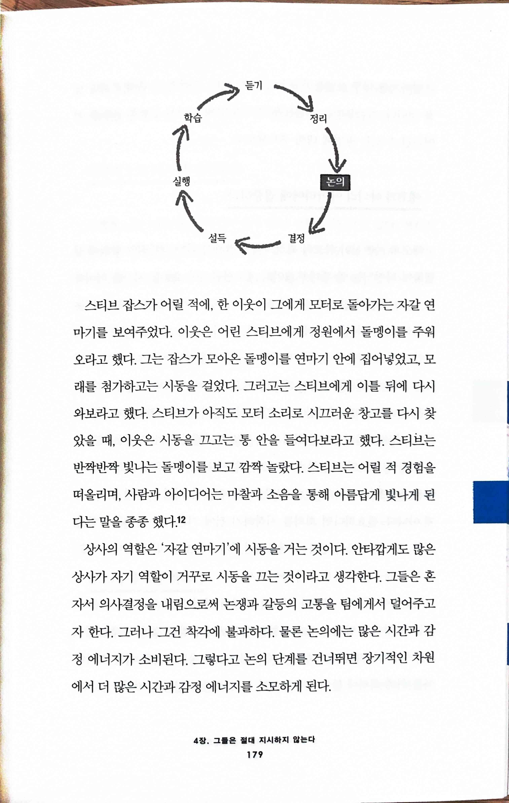

> 스티브는 어릴 적 경험을 떠올리며, 사람과 아이디어는 마찰과 소음을 통해 아름답게 빛나게 된다는 말을 종종 했다.
>
> 상사의 역할은 '자갈 연마기'에 시동을 거는 것이다. 안타깝게도 많은 상사가 자기 역할이 거꾸로 시동을 끄는 것이라고 생각한다. 그들은 혼자서 의사결정을 내림으로써 논쟁과 갈등의 고통을 팀에게서 덜어주고자 한다. 그러나 그건 착각에 불과하다. 물론 논의에는 많은 시간과 감정 에너지가 소비된다. 그렇다고 논의 단계를 건너뛰면 장기적인 차원에서 더 많은 시간과 감정 에너지를 소모하게 된다.

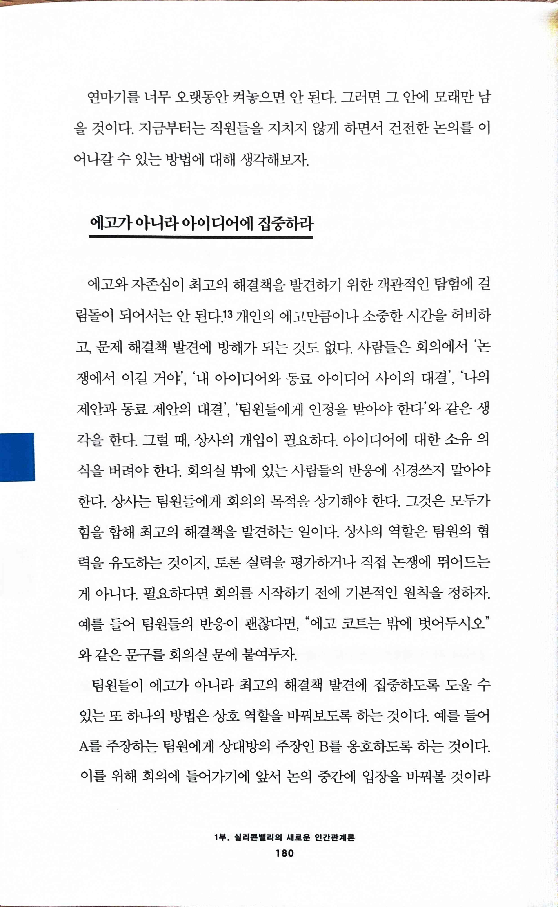

> 개인의 에고만큼이나 소중한 시간을 허비하고, 문제 해결책 발견에 방해가 되는 것도 없다... 아이디어에 대한 소유 의식을 버려야 한다... 상사는 팀원들에게 회의의 목적을 상기해야 한다. 그것은 모두가 힘을 합해 최고의 해결책을 발견하는 일이다. 상사의 역할은 팀원의 협력을 유도하는 것이지, 토론 실력을 평가하거나 직접 논쟁에 뛰어드는게 아니다.

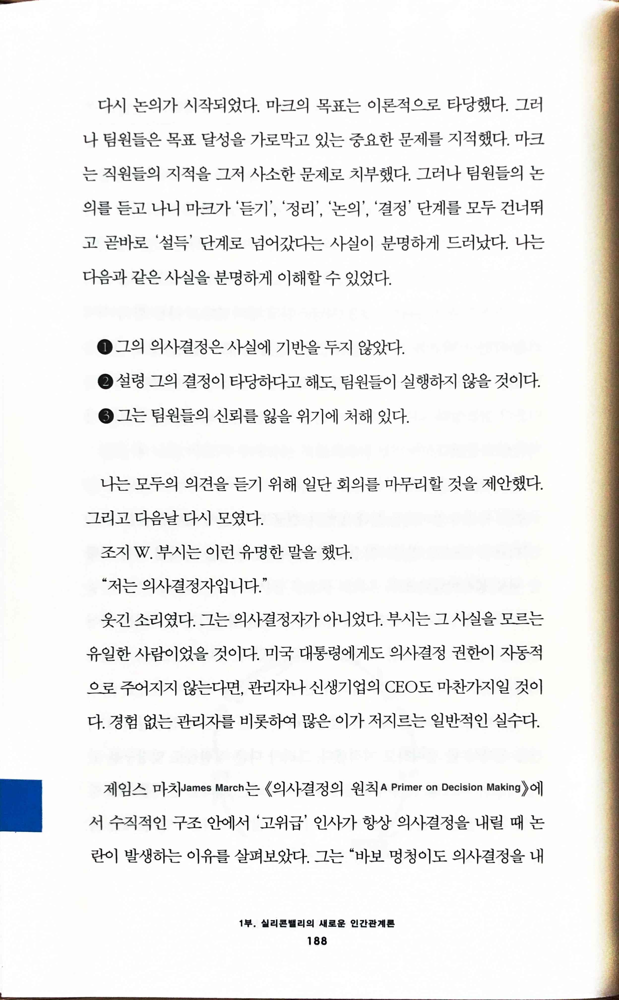

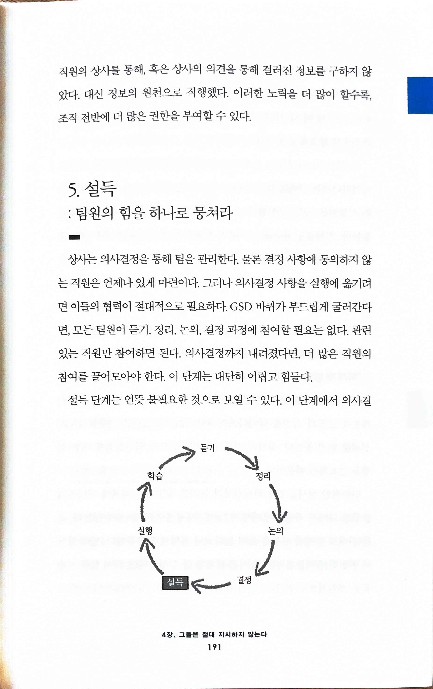

> 정보의 원천으로 직행

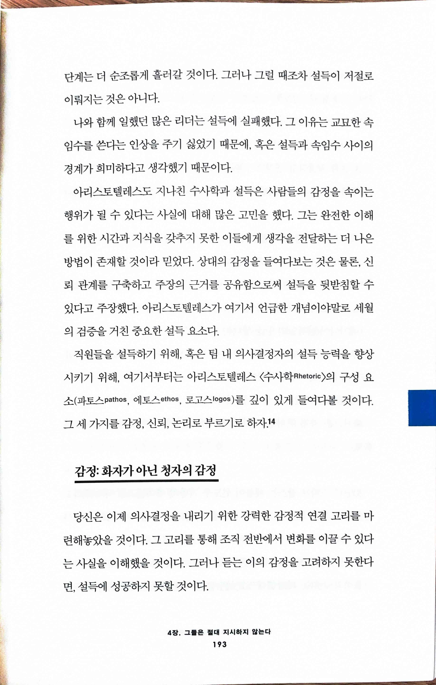

> 직원들을 설득하기 위해, 혹은 팀 내 의사결정자의 설득 능력을 향상시키기 위해, 여기서부터는 아리스토텔레스 수사학 Rhetoric>의 구성 요소(파토스pathos, 에토스ethos, 로고스logos)를 깊이 있게 들여다볼 것이다. 그 세 가지를 감정, 신뢰, 논리로 부르기로 하자

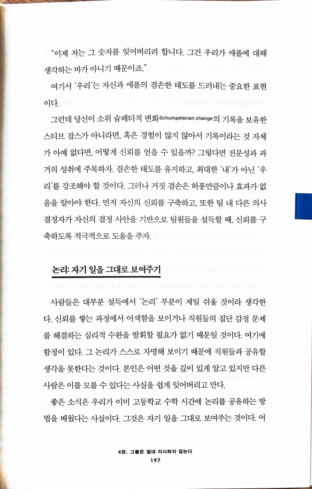

> 먼저 자신의 신뢰를 구축하고, 또한 팀 내 다른 의사결정자가 자신의 결정 사안을 기반으로 팀원들을 설득할 때, 신뢰를 구축하도록 적극적으로 도움을 주자.

> 협력세의 대부분은 상사가 떠안아야 한다. 그럼에도 100퍼센트를 져서는 안 된다. 팀원들의 훌륭한 파트너가 되기 위해, GSD 바퀴가 부드럽게 돌아가도록 하기 위해, 당신은 실무의 끈을 놓아서는 안 된다. 직원들의 실행을 지켜보는 것은 물론, 때로는 스스로 실행에 참여해야 한다. 당신이 실행자의 역할을 맡을 때, 자신의 도구를 끊임없이 활용해야 한다. 

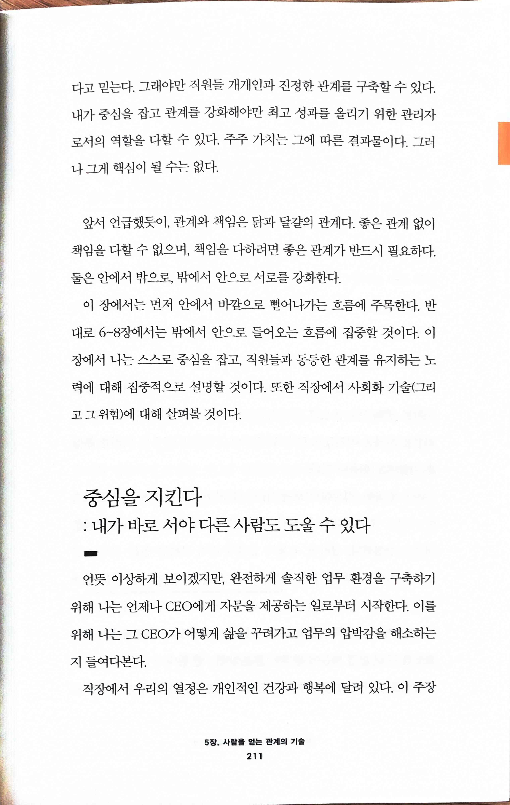

> 내가 중심을 잡고 관계를 강화해야만 최고 성과를 올리기 위한 관리자로서의 역할을 다할 수 있다. 주주 가치는 그에 따른 결과물이다. 그러나 그게 핵심이 될 수는 없다.
>
> 관계와 책임은 닭과 달걀의 관계다. 좋은 관계 없이 책임을 다할 수 없으며, 책임을 다하려면 좋은 관계가 반드시 필요하다. 둘은 안에서 밖으로, 밖에서 안으로 서로를 강화한다.


> 일과 삶을 하나로 통합하는 것이다... 일과 삶은 서로를 강화한다.


> 무엇이든 자신에게 도움이 되는 방법을 실행에 옮기자. 핵심은 힘든 시간이 왔을 때 그 방법을 우선적으로(단, 지나치지는 않게) 실행하는 것이다. 스트레스를 받거나 정신이 없을 때, 다시 중심으로 돌아가게 해주는 행동을 위해 시간을 마련하려는 노력이 무엇보다 중요하다.


> 독재보다 무정부 상태가 더 나쁘다. 홉스는 리바이어던 Leviathan 에서 무정부 상태를 “더럽고, 야만적이고, 짧다” 라고 표현했다. 무정부상태에서 악당은 오로지 이기심만을 추구하므로 협력을 통한 성과는 찾아볼 수 없다.

> 때로 상사가 팀원들에게 줄 수 있는 최고의 선물은 그들을 그냥 집에 가도록 내버려두는 것이다.


> 어떤 관계든지 신뢰 구축에는 시간이 걸리게 마련이다. 신뢰는 꾸준한 행동 패턴으로부터 비롯되기 때문이다.


> 완전하게 솔직한 관계를 구축하려면, 완전히 다른 세계관을 갖고 있는 사람들, 혹은 그 삶을 이해하기 어렵거나 자신의 믿음과 상반되는 행동을 하는 사람들과도 얼마든지 관계를 부드럽게 유지할 수 있다는 사실을 직원들에게 강조하는 것이 중요하다.


> 부정적인 감정은 억누르려 해도 효과가 없을 때가 많다.


> 직원과 관계를 구축하려면 시간과 에너지가 필요하다. 특히 상황이 좋지 않을 때, 관계 구축은 가장 힘든 일이다. 그러나 관계 구축은 상사의 핵심 업무라는 점을 기억하자. 그 과정에서 직원에게 긍정적인 영향을 미칠 때, 관계를 구축하는 노력이 업무 성과 이상의 의미가 있다는 사실을 깨닫게 될 것이다.


> “나와 함께 더 수월하게 일을 하기 위해, 내가 새롭게 해야 하거나 중단해야 할 일이 있습니까?"


> 당신이 얻은 조언을 기록하자. 직원들은 일주일에 몇 번 당신을 비판하는가? 얼마나 자주 칭찬하는가?


> 경영 버그 추적 시스템


> '상황, 행동, 영향 situation, behavior, impact'
>
> 조언을 줄 때 세 가지를 명심하라고 말한다.
>
> 1. 목격한 상황 2. 행동(좋든 나쁘든) 3. 드러난 영향
>
> 이 방법은 상대의 지식과 상식, 내적인 선함 등 여러 다양한 개인적인 특질에 대해서는 평가 내리지 말 것을 권고한다. 이러한 판단을 담을 때, 조언은 오만하게 들릴 수밖에 없다.


> 도움을 주는 일이 모든 해결책을 알고 있거나 모든 일을 처리해줘야 한다는 것을 의미하지는 않는다는 것이다. 도움을 준다는 것은 상대방이 직면한 문제를 확실히 이해할 수 있도록 조언을 준다는 뜻이다.


> 조언을 최대한 빨리, 되도록 비공식적으로 전하는 것, 이것이 완전한 솔직함의 필수적인 부분이다.


> 조언에 대한 한 가지 원칙은 공개적으로 칭찬하고, 개인적으로 지적하라는 것이다. 공식적인 지적은 방어적인 반응을 자극해 당사자가 실수를 저질렀다는 사실을 인정하고 이를 통해 학습하는 것을 어렵게 만든다. 반면 공식적인 칭찬은 더 많은 힘을 실어주고, 다른 직원들이 선례를 따르도록 격려한다.


> 개인의 특성에서 원인을 발견하려는 방식이다. 이는 두 가지 점에서 문제가 된다.
>
> 1. 일반적으로 정확하지 않다.
>
> 2. 해결 가능한 문제를 수정하기 힘들게 만들어버린다. 그 이유는 개인의 내적 특질을 바꾸는 것은 대단히 어렵고 시간이 많이 드는 일이기 때문이다.


> 당신이 상사로서, 인간으로서 해야 할 일은 상대방의 감정 반응을 그대로 인정하고, 적절하게 대처하는 것이다. 감정을 절대 외면하거나 부정하지 말자.


> 완전하게 솔직한 태도를 권한다. 그러나 일자리를 포기하면서까지 상사와 대립할 필요는 없다.


> 앤드루 S. 그로브의 주문 '듣기, 도전, 실행.'
>
> 그가 말하는 강한 리더란 귀기울일 줄 아는 겸손함, 끊임없이 도전하는 자신감, 논쟁을 끝내고 실행에 옮길 때를 아는 지혜를 갖춘 인물이다.


> 자신에 대한 업무적인 지적을 머뭇거린다고 걱정하는 직원이라면, 스스로 더 많은 지적을 원한다는 사실을 적극적으로 알리자.


> 공식적인 성과 평가에서 깜짝 놀라는 일이 벌어져서는 곤란하다. 직접적인 조언을 정기적으로 꾸준히 건넨다면, 이러한 일이 벌어질 가능성은 낮다.


> 일반적으로 기업은 다분히 수직적인 형태를 취하고 있다. 완전히 '평등한 조직은 이상에 불과하다. 비즈니스 세계에서 수직 구조는 피할 수 없는 부분이다. 수직체계에 따른 조직 장벽을 최대한 낮출 수 있는 좋은 방법은 그러한 장벽의 존재를 인정하고, 인간적인 차원에서 평등한 지위를 보장할 수 있는 방안을 모색하는 것이다. 이를 통해 모든 직원이 자유롭게 “권력에게 진실을 말할 수 있다"는 확신을 갖도록 해야 한다.


> 상사는 모든 부하직원과 개인적으로 경력 대화를 나눠볼 필요가 있다.


> 리더십이라는 말보다 스튜어드십 stewardship


> 좋은 성과를 올리는 직원
>
> 성과가 낮지만 개선의 신호를 분명하게 보여주는 직원
>
> 성과도 낮고 개선의 여지도 없는 직원


> 많은 관리자가 특정 팀원의 성과가 낮다는 사실을 너무 늦게 인정하는 경향이 있었다.


> 구글에서도 보이지 않는 곳에서 중요한 혁신을 일구어낸 직원보다 뚜렷하게 드러나는 프로젝트를 완수한 직원이 승진 기회를 더 쉽게 잡는다.


> “직원들을 통제하려 들지 말 것. 그러면 신뢰를 얻지 못합니다. 그보다 먼저 귀를 기울이세요."


> 1 on 1


> 공식적인 안건을 원하든, 아니면 자유로운 형태를 원하든 간에, 안건은 당신이 아니라 부하직원이 들고 와야 한다. 여기서 상사의 역할은 그들이 제대로 준비를 하지 않았을 때 이에 대해 책임을 지도록 하는 것이다. 혹은 때로 특별한 안건 없이 일대일 회의를 진행해도 좋다는 결정을 내리는 것이다.


> 관리자 회의의 목표는 '배우기, 듣기, 정리하기' 세 가지다. 지난주 업무 진척 상황을 확인하고, 직원들끼리 중요한 업데이트를 공유하고, 주요 의사결정 사항을 분명하게 확인하고, 다음 일주일 상황에 대해 이야기를 나눈다. 그걸로 끝이다. 관리자 회의는 안건을 논의하거나 의사결정을 내리는 자리가 아니다. 여기서 상사의 역할은 일관적인 안건을 마련하고, 직원들의 관심을 끌어모으며, 너무 오랫동안 한 가지 프로젝트에 매달려 있거나 궤도에서 벗어난 직원들을 정렬하는 것이다.


> 까다로운 질문에 리더가 올바른 답을 제시할 때, 일반적으로 질의응답 시간은 프레젠테이션 시간보다 더 효과적일 수 있다.


> 직원을 평가할 때처럼 개인의 성격보다 행동에 초점을 맞추자. 즉, 본질이 아니라 행위에 집중하자. 진정성 있게 계속해서 피드백을 요구한다면, 자신의 특질 중 가장 문제가 많은 것들을 파악하게 될 것이다. 앞서 언급했듯이 모든 직원과 완전하게 솔직한 관계를 맺기 위해 노력하는 과정에서 팀 문화는 완전한 솔직함의 사분면으로 나아가게 될 것이다. 당신은 GSD 바퀴의 각 단계에서 의식적인 행동을 통해 조직문화의 다양한 측면에 영향을 미칠 수 있다.


> 어떤 면에서 상사가 된다는 것은 구금을 당하는 것과도 같다. 당신의 말과 행동은 당신 자신에게 불리하게 활용될 위험이 있다.


> 놀랍게도 당신의 사소한 행동마저 조직문화에 영향을 미친다. 그 영향은 당신이 조직을 떠난 뒤에도 남는다.


> 약점을 기꺼이 드러내자. 개인적인 이야기는 어떤 경영이론보다 당신이 하고자 하는 일과 그 이유에 대해 잘 설명해줄 것이다.