# REFACTORING 리팩터링 2판

* [Refactoring](https://refactoring.com/)
* [WegraLee/Refactoring: 『리팩터링, 2판』(한빛미디어, 2020)](https://github.com/WegraLee/Refactoring)
* [리팩터링 이름 비교 & IDE들이 제공하는 리팩터링 목록_『리팩터링, 2판』(개앞맵시/남기혁 옮김, 한빛미디어, 2020) - Google Sheets](https://docs.google.com/spreadsheets/d/1nFx-PjZ9Qs3QBZFzaMo6MSUSrWjSsO-iz5kpBtlVRPQ/edit#gid=866204681)
* [리팩터링 이름 비교 & IDE들이 제공하는 리팩터링 목록_『리팩터링, 2판』(개앞맵시/남기혁 옮김, 한빛미디어, 2020) - Google Sheets](https://docs.google.com/spreadsheets/d/1sjMHL6O3XdB1_BhDklmm9DYtdDG4nFMvEh9Hmt6jOtE/edit#gid=866204681)

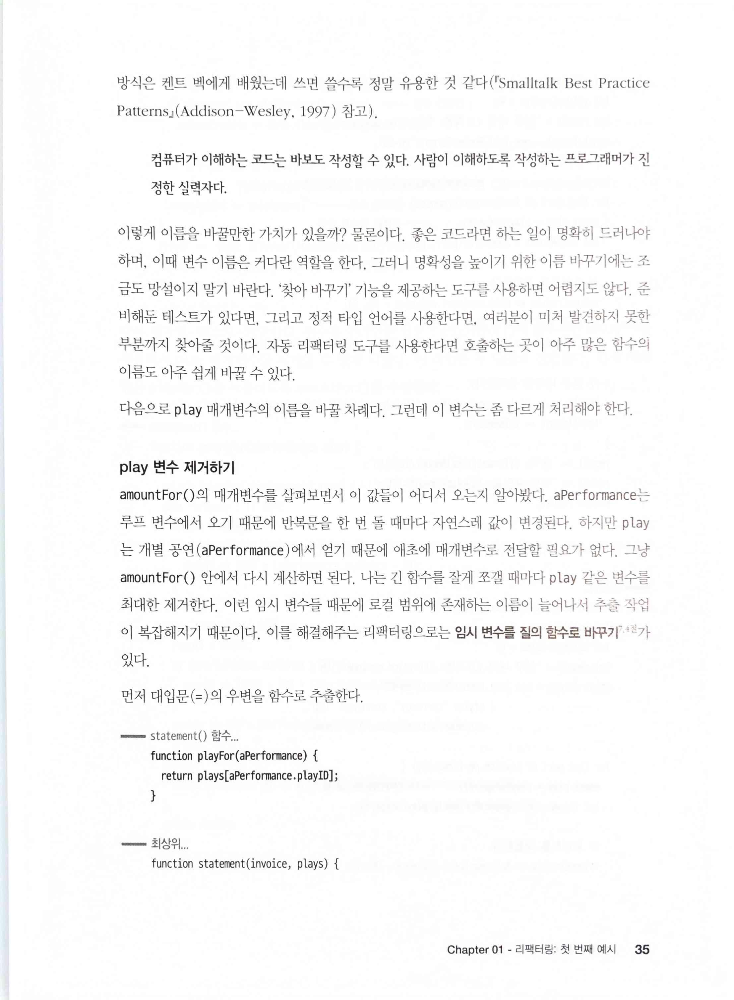

> 컴퓨터가 이해하는 코드는 바보도 작성할 수 있다. 사람이 이해하도록 작성하는 프로그래머가 진정한 실력자다.

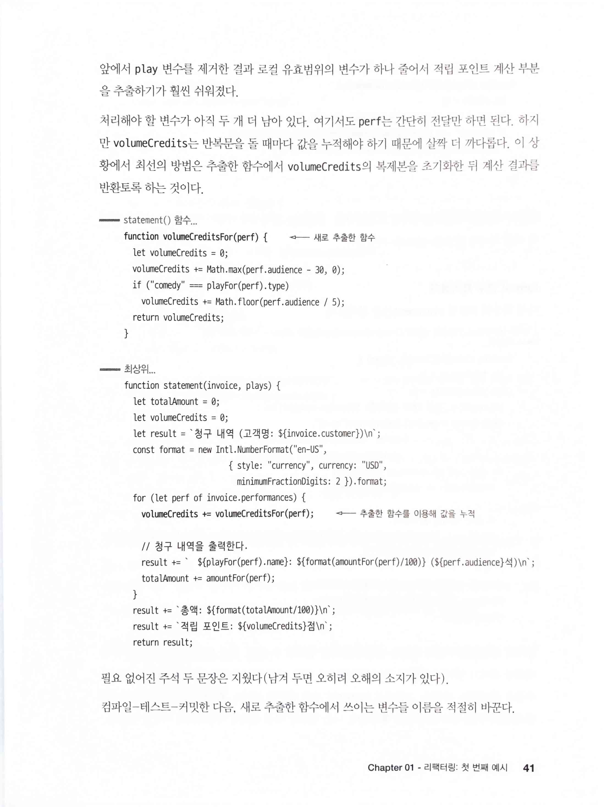

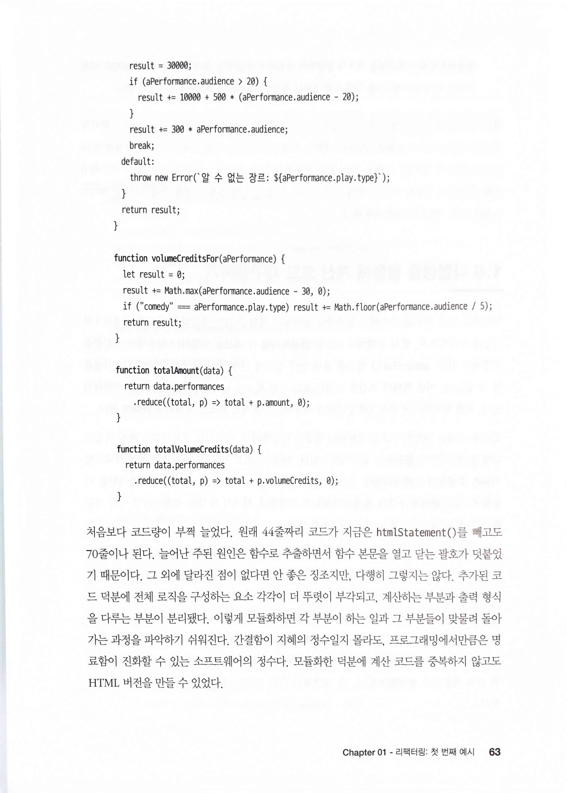

> 간결함이 지혜의 정수일지 몰라도, 프로그래밍에서만큼은 명료함이 진화할 수 있는 소프트웨어의 정수다.

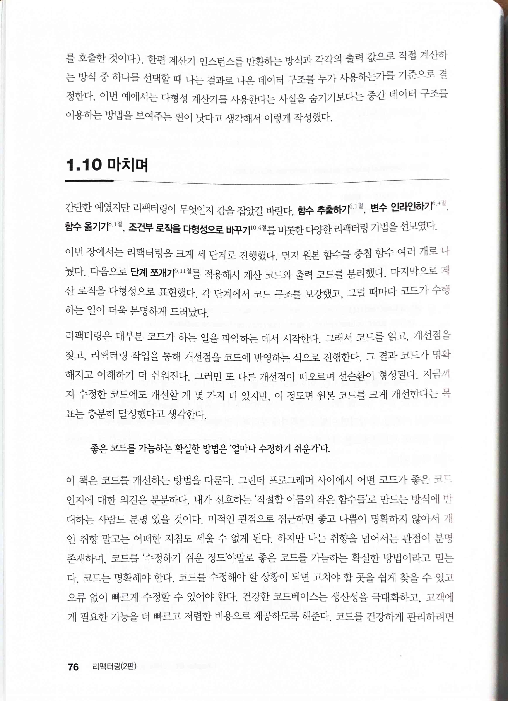

> 좋은 코드를 가늠하는 확실한 방법은 '얼마나 수정하기 쉬운가'다.

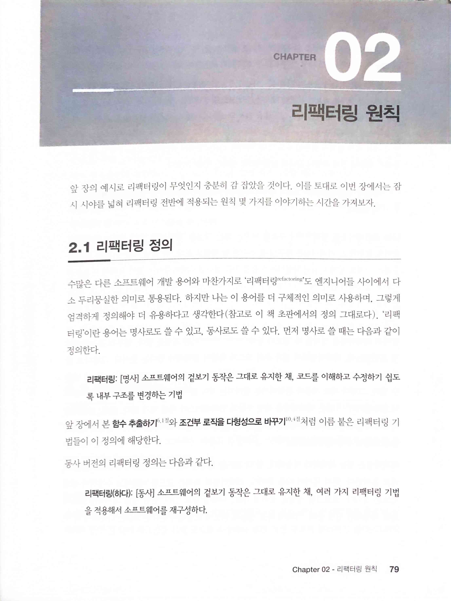

> 리팩터링 : [명사] 소프트웨어의 겉보기 동작은 그대로 유지한 채, 코드를 이해하고 수정하기 쉽도록 내부 구조를 변경하는 기법
>
> 리팩터링(하다) [동사] 소프트웨어의 겉보기 동작은 그대로 유지한 채, 여러 가지 리팩터링 기법을 적용해서 소프트웨어를 재구성하다.

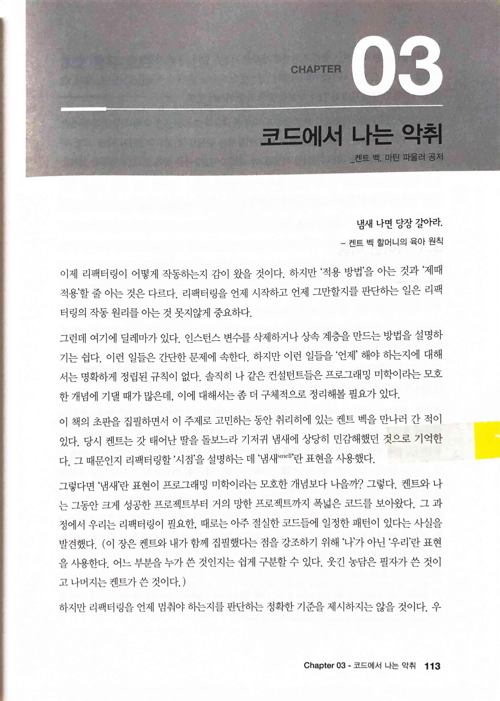

> 이 책의 초판을 집필하면서 이 주제로 고민하는 동안 취리히에 있는 켄트 벡을 만나러 간 적이있다. 당시 켄트는 갓 태어난 딸을 돌보느라 기저귀 냄새에 상당히 민감해했던 것으로 기억한다. 그 때문인지 리팩터링할 '시점'을 설명하는 데 '냄새smell'란 표현을 사용했다.

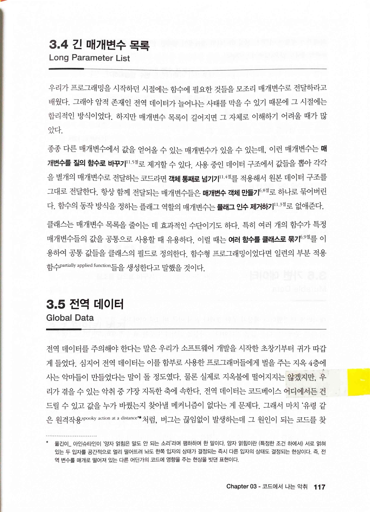

> 전역 데이터를 주의해야 한다는 말은 우리가 소프트웨어 개발을 시작한 초창기부터 귀가 따갑게 들었다. 심지어 전역 데이터는 이를 함부로 사용한 프로그래머들에게 벌을 주는 지옥 4층에사는 악마들이 만들었다는 말이 돌 정도였다. 물론 실제로 지옥불에 떨어지지는 않겠지만, 우리가 겪을 수 있는 악취 중 가장 지독한 축에 속한다. 전역 데이터는 코드베이스 어디에서든 건드릴 수 있고 값을 누가 바꿨는지 찾아낼 메커니즘이 없다는 게 문제다. 그래서 마치 '유령 같은 원격작용spooky action at a distancern 처럼, 버그는 끊임없이 발생하는데 그 원인이 되는 코드를 찾

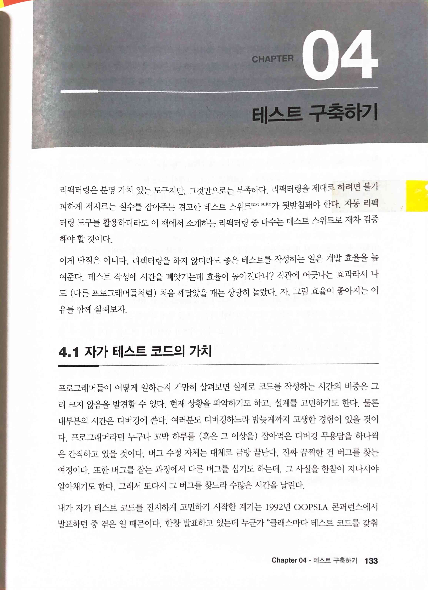

> 리팩터링은 분명 가치 있는 도구지만, 그것만으로는 부족하다. 리팩터링을 제대로 하려면 불가피하게 저지르는 실수를 잡아주는 견고한 테스트 스위트 test suite가 뒷받침돼야 한다. 자동 리팩터링 도구를 활용하더라도 이 책에서 소개하는 리팩터링 중 다수는 테스트 스위트로 재차 검증해야 할 것이다.

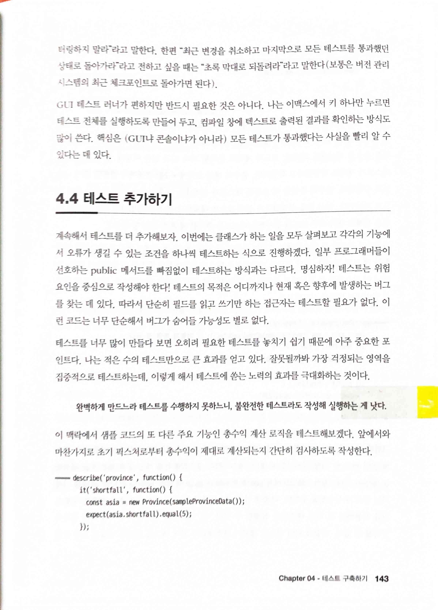

> 완벽하게 만드느라 테스트를 수행하지 못하느니, 불완전한 테스트라도 작성해 실행하는 게 낫다.

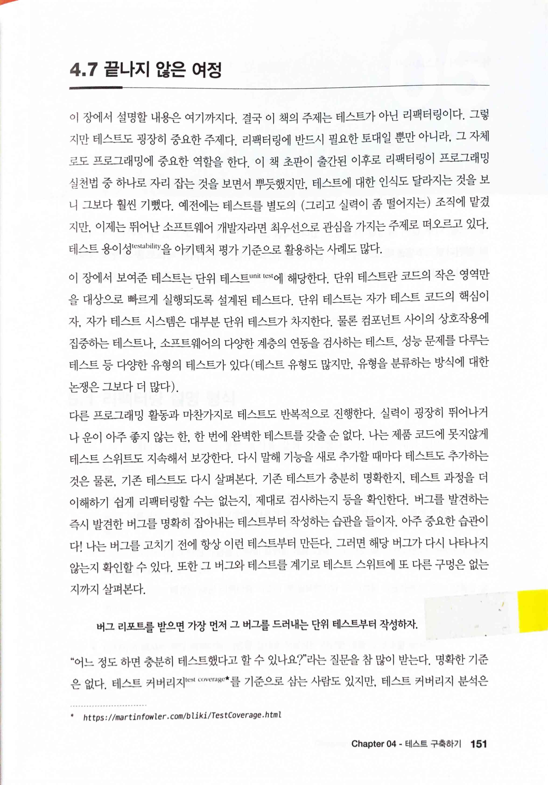

> 버그리포트를 받으면 가장 먼저 그 버그를 드러내는 단위 테스트부터 작성하자.

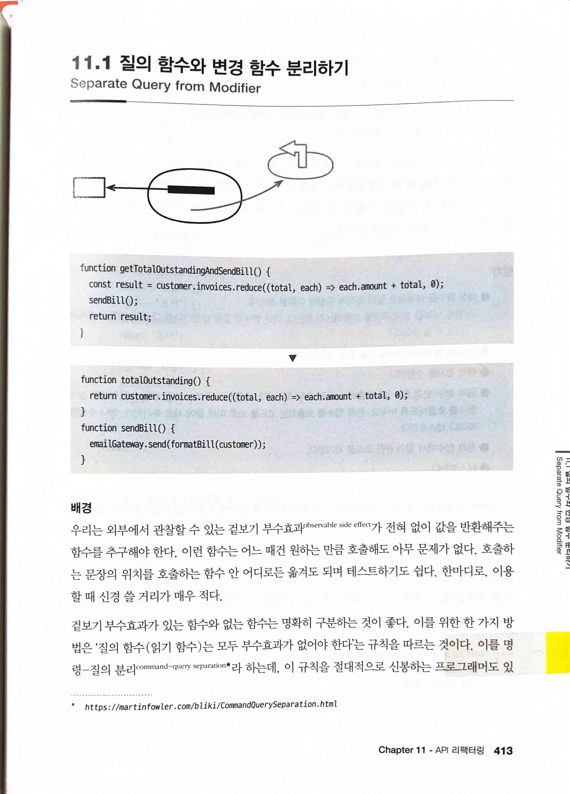

> 겉보기 부수효과가 있는 함수와 없는 함수는 명확히 구분하는 것이 좋다. 이를 위한 한 가지 방법은 '질의 함수 (읽기 함수)는 모두 부수효과가 없어야 한다'는 규칙을 따르는 것이다. 이를 명령 - 질의 분리command-query separation 라 하는데, 이 규칙을 절대적으로 신봉하는 프로그래머도 있
* [CommandQuerySeparation](https://martinfowler.com/bliki/CommandQuerySeparation.html)