# 팀장님, 우리도 협업 도구 쓸까요?

* 어떻게 보면 여러가지 도구를 다루고 또 애자일에 대한 이야기를 하면서 혼란스러울 수 있으나, 협업을 잘 하기 위해 필요한 것들을 이야기한다는 관점에서 바라보면 이해가 간다. 특히 조직의 변화를 이야기하는 부분은 참 공감도 가고 현재 경험을 하고 있는 내 입장에서는 고생했겠다는 생각이 든다. 굉장히 잘 정리된 건 아니지만, 그만큼 저자가 고생했던 걸 모아놨다는 걸 생각하면 모든 노하우를 정리하기도 어려웠을 거 같단 생각이 든다.

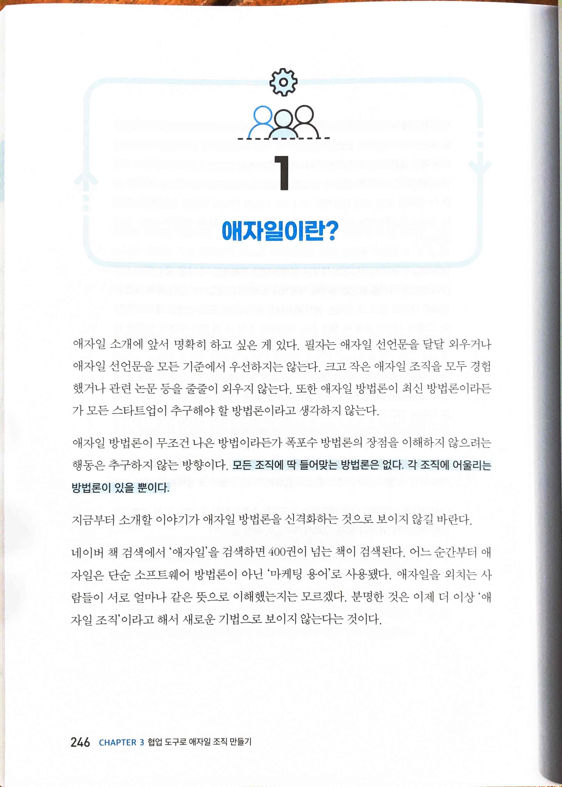

* `모든 조직에 딱 들어맞는 방법론은 없다. 각 조직에 어울리는 방법론이 있을 뿐이다.`

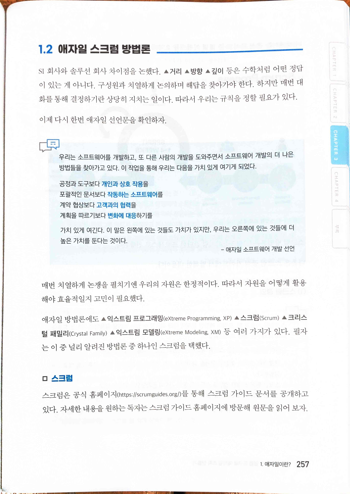

* [Home | Scrum Guides](https://scrumguides.org/)

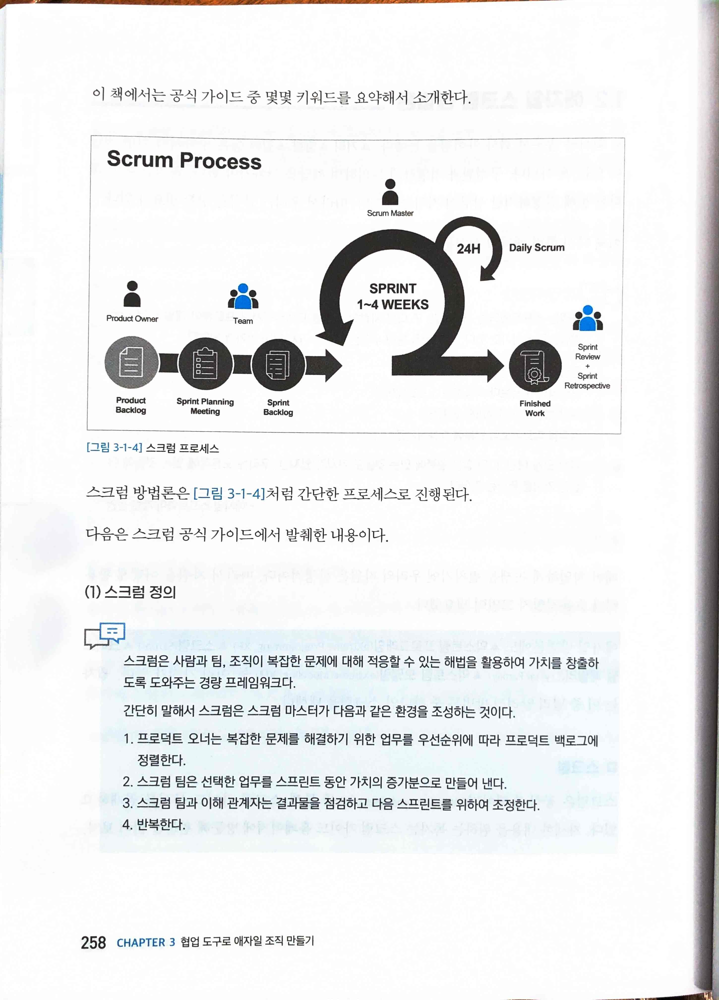

* `(1) 스크럼 정의`
  * `스크럼은 사람과 팀, 조직이 복잡한 문제에 대해 적응할 수 있는 해법을 활용하여 가치를 창출하도록 도와주는 경량 프레임워크다.`
  * `간단히 말해서 스크럼은 스크럼 마스터가 다음과 같은 환경을 조성하는 것이다.`
  1. 프로덕트 오너는 복잡한 문제를 해결하기 위한 업무를 우선순위에 따라 프로덕트 백로그에 정렬한다.
  2. 스크럼 팀은 선택한 업무를 스프린트 동안 가치의 증가분으로 만들어 낸다.
  3. 스크럼 팀과 이해 관계자는 결과물을 점검하고 다음 스프린트를 위하여 조정한다.
  4. 반복한다.

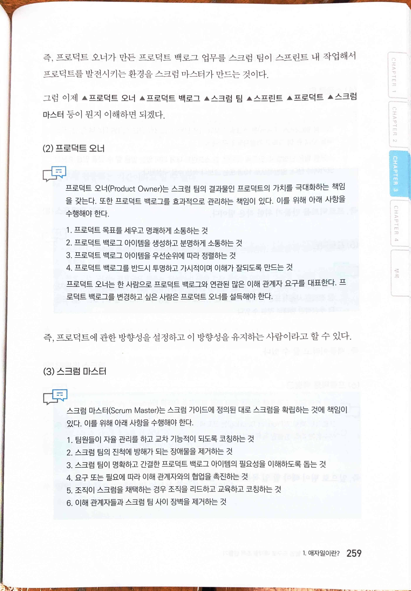

* `(2) 프로덕트 오너`
  * `프로덕트 오너(Product Owner)는 스크럼 팀의 결과물인 프로덕트의 가치를 극대화하는 책임을 갖는다. 또한 프로덕트 백로그를 효과적으로 관리하는 책임이 있다. 이를 위해 아래 사항을 수행해야 한다.`
  1. 프로덕트 목표를 세우고 명쾌하게 소통하는 것
  2. 프로덕트 백로그 아이템을 생성하고 분명하게 소통하는 것
  3. 프로덕트 백로그 아이템을 우선순위에 따라 정렬하는 것
  4. 프로덕트 백로그를 반드시 투명하고 가시적이며 이해가 잘되도록 만드는 것
  * `프로덕트 오너는 한 사람으로 프로덕트 백로그와 연관된 많은 이해 관계자 요구를 대표한다. 프로덕트 백로그를 변경하고 싶은 사람은 프로덕트 오너를 설득해야 한다.`
  * `즉, 프로덕트에 관한 방향성을 설정하고 이 방향성을 유지하는 사람이라고 할 수 있다.`
* `(3) 스크럼 마스터`
  * `스크럼 마스터(Scrum Master)는 스크럼 가이드에 정의된 대로 스크럼을 확립하는 것에 책임이있다. 이를 위해 아래 사항을 수행해야 한다.`
  1. 팀원들이 자율 관리를 하고 교차 기능적이 되도록 코칭하는 것
  2. 스크럼 팀의 진척에 방해가 되는 장애물을 제거하는 것
  3. 스크럼 팀이 명확하고 간결한 프로덕트 백로그 아이템의 필요성을 이해하도록 돕는 것
  4. 요구 또는 필요에 따라 이해 관계자와의 협업을 촉진하는 것
  5. 조직이 스크럼을 채택하는 경우 조직을 리드하고 교육하고 코칭하는 것
  6. 이해 관계자들과 스크럼 팀 사이 장벽을 제거하는 것
  * `즉, 스크럼이 잘 진행되기 위해 조직 사이사이에 위치하는 사람이라고 할 수 있다.`

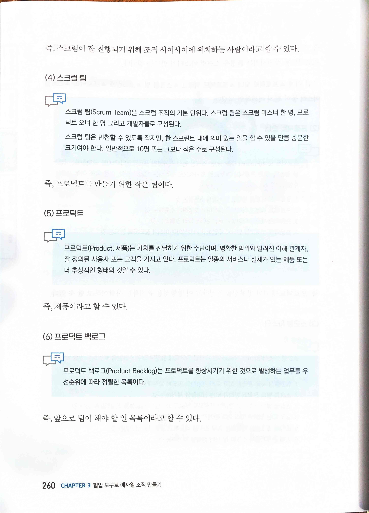

* `(4) 스크럼 팀`
  * `스크럼 팀(Scrum Team)은 스크럼 조직의 기본 단위다. 스크럼 팀은 스크럼 마스터 한 명, 프로덕트 오너 한 명 그리고 개발자들로 구성된다.`
  * `스크럼 팀은 민첩할 수 있도록 작지만, 한 스프린트 내에 의미 있는 일을 할 수 있을 만큼 충분한 크기여야 한다. 일반적으로 10명 또는 그보다 적은 수로 구성된다.`
  * `즉, 프로덕트를 만들기 위한 작은 팀이다.`
* `(5) 프로덕트`
  * `프로덕트(Product, 제품)는 가치를 전달하기 위한 수단이며, 명확한 범위와 알려진 이해 관계자, 잘 정의된 사용자 또는 고객을 가지고 있다. 프로덕트는 일종의 서비스나 실체가 있는 제품 또는 더 추상적인 형태의 것일 수 있다.`
  * `즉, 제품이라고 할 수 있다.`
* `(6) 프로덕트 백로그`
  * `프로덕트 백로그(Product Backlog)는 프로덕트를 향상시키기 위한 것으로 발생하는 업무를 우선순위에 따라 정렬한 목록이다.`
  * `즉, 앞으로 팀이 해야 할 일 목록이라고 할 수 있다.`

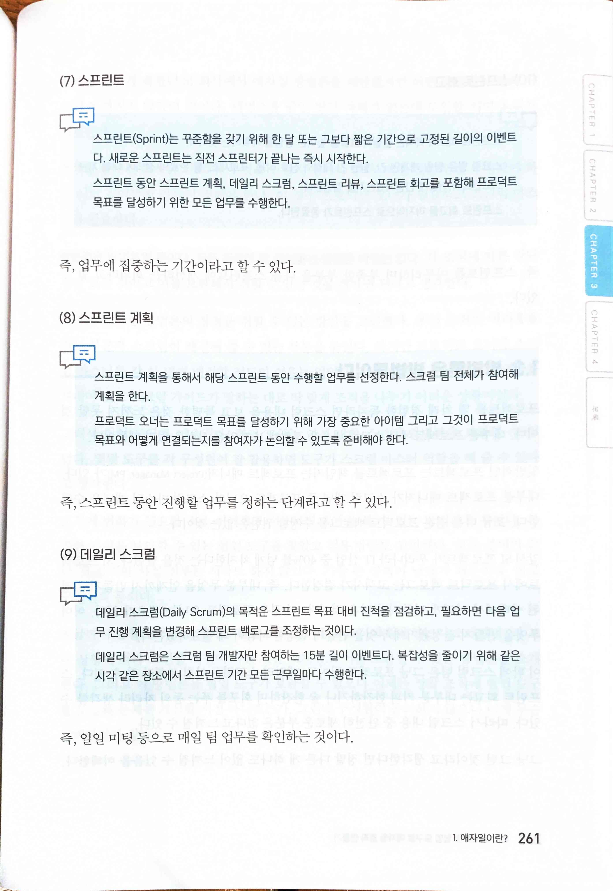

* `(7) 스프린트`
  * `스프린트(Sprint)는 꾸준함을 갖기 위해 한 달 또는 그보다 짧은 기간으로 고정된 길이의 이벤트다. 새로운 스프린트는 직전 스프린터가 끝나는 즉시 시작한다.`
  * `스프린트 동안 스프린트 계획, 데일리 스크럼, 스프린트 리뷰, 스프린트 회고를 포함해 프로덕트 목표를 달성하기 위한 모든 업무를 수행한다.`
  * `즉, 업무에 집중하는 기간이라고 할 수 있다.`
* `(8) 스프린트 계획`
  * `스프린트 계획을 통해서 해당 스프린트 동안 수행할 업무를 선정한다. 스크럼 팀 전체가 참여해 계획을 한다.`
  * `프로덕트 오너는 프로덕트 목표를 달성하기 위해 가장 중요한 아이템 그리고 그것이 프로덕트 목표와 어떻게 연결되는지를 참여자가 논의할 수 있도록 준비해야 한다.`
  * `즉, 스프린트 동안 진행할 업무를 정하는 단계라고 할 수 있다.`
* `(9) 데일리 스크럼`
  * `데일리 스크럼(Daily Scrum)의 목적은 스프린트 목표 대비 진척을 점검하고, 필요하면 다음 업무 진행 계획을 변경해 스프린트 백로그를 조정하는 것이다.`
  * `데일리 스크럼은 스크럼 팀 개발자만 참여하는 15분 길이 이벤트다. 복잡성을 줄이기 위해 같은 시각 같은 장소에서 스프린트 기간 모든 근무일마다 수행한다.`
  * `즉, 일일 미팅 등으로 매일 팀 업무를 확인하는 것이다.`

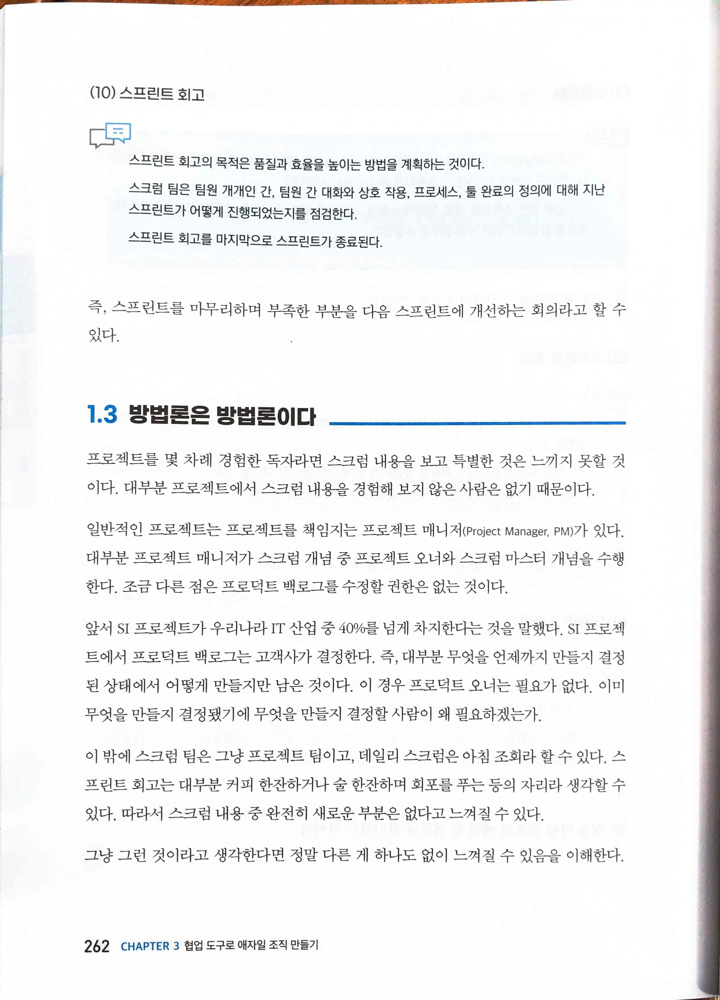

* `(10) 스프린트 회고`
  * `스프린트 회고의 목적은 품질과 효율을 높이는 방법을 계획하는 것이다.`
  * `스크럼 팀은 팀원 개개인 간, 팀원 간 대화와 상호 작용, 프로세스, 둘 완료의 정의에 대해 지난 스프린트가 어떻게 진행되었는지를 점검한다.`
  * `스프린트 회고를 마지막으로 스프린트가 종료된다`
  * `즉, 스프린트를 마무리하며 부족한 부분을 다음 스프린트에 개선하는 회의라고 할 수 있다.`

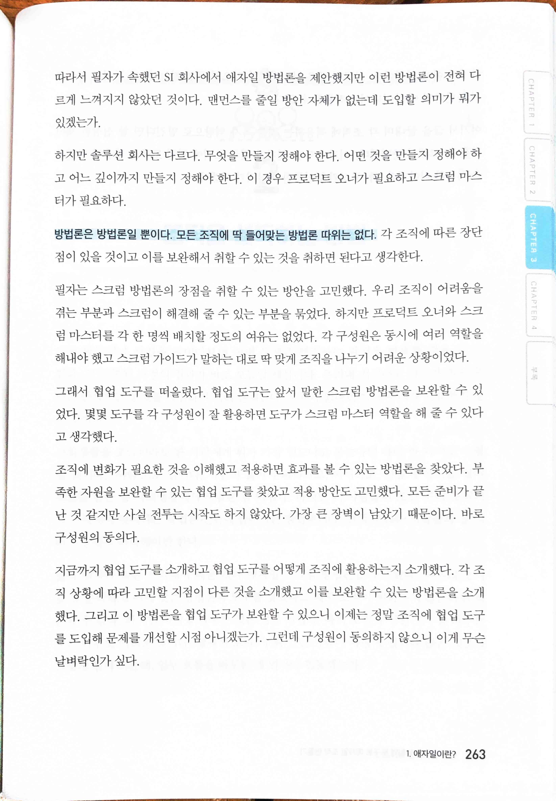

* `방법론은 방법론일 뿐이다. 모든 조직에 딱 들어맞는 방법론 따위는 없다. 각 조직에 따른 장단점이 있을 것이고 이를 보완해서 취할 수 있는 것을 취하면 된다고 생각한다.`

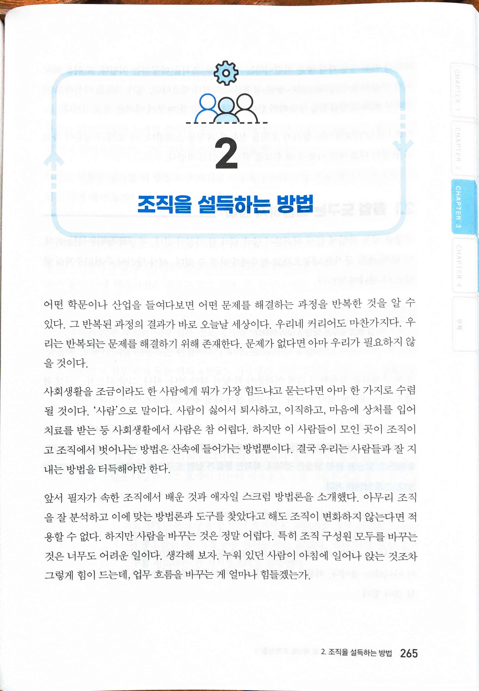

* `하지만 사람을 바꾸는 것은 정말 어렵다. 특히 조직 구성원 모두를 바꾸는 것은 너무도 어려운 일이다. 생각해 보자. 누워 있던 사람이 아침에 일어나 앉는 것조차 그렇게 힘이 드는데, 업무 흐름을 바꾸는 게 얼마나 힘들겠는가.`

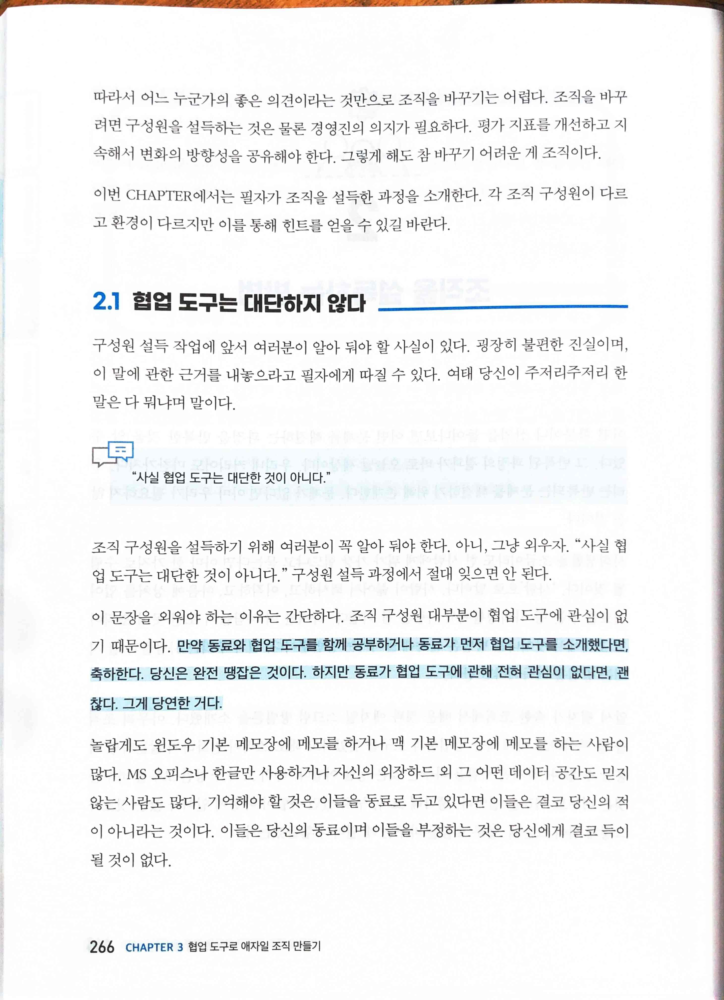

* `조직을 바꾸려면 구성원을 설득하는 것은 물론 경영진의 의지가 필요하다. 평가 지표를 개선하고 지속해서 변화의 방향성을 공유해야 한다. 그렇게 해도 참 바꾸기 어려운 게 조직이다.`
* `“사실 협업 도구는 대단한 것이 아니다."`

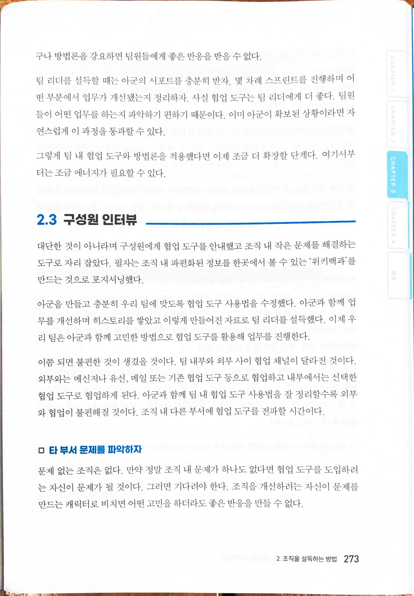

* `타 부서 문제를 파악하자`

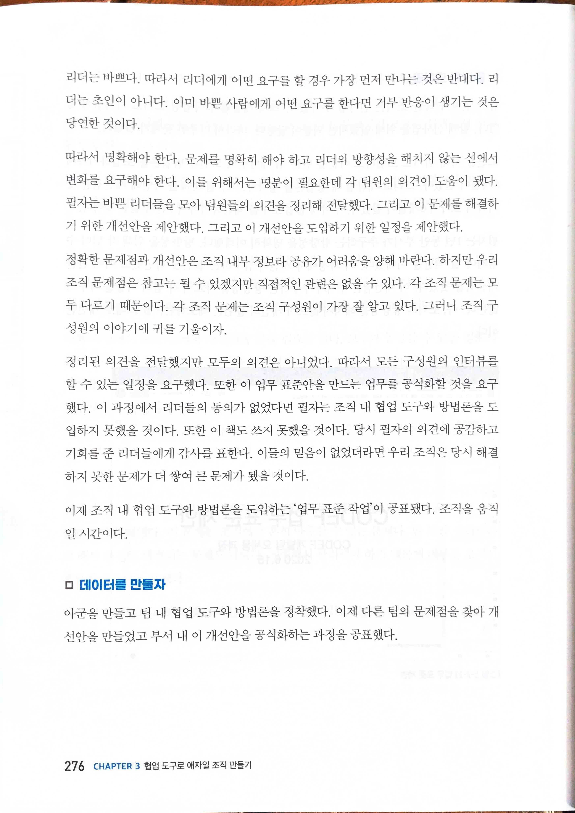

* `문제를 명확히 해야 하고 리더의 방향성을 해치지 않는 선에서 변화를 요구해야 한다. 이를 위해서는 명분이 필요한데 각 팀원의 의견이 도움이 됐다. 필자는 바쁜 리더들을 모아 팀원들의 의견을 정리해 전달했다. 그리고 이 문제를 해결하기 위한 개선안을 제안했다. 그리고 이 개선안을 도입하기 위한 일정을 제안했다.`
* `데이터를 만들자`

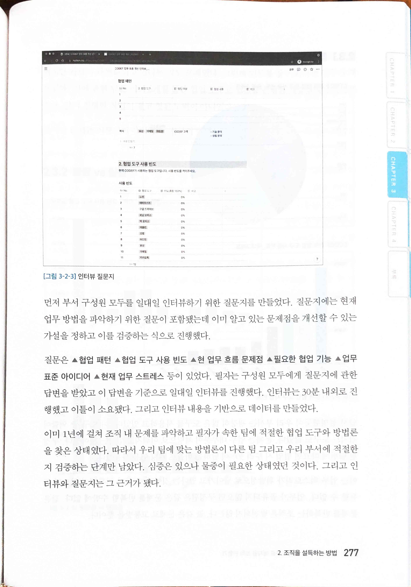

* `먼저 부서 구성원 모두를 일대일 인터뷰하기 위한 질문지를 만들었다. 질문지에는 현재 업무 방법을 파악하기 위한 질문이 포함됐는데 이미 알고 있는 문제점을 개선할 수 있는 가설을 정하고 이를 검증하는 식으로 진행했다.`

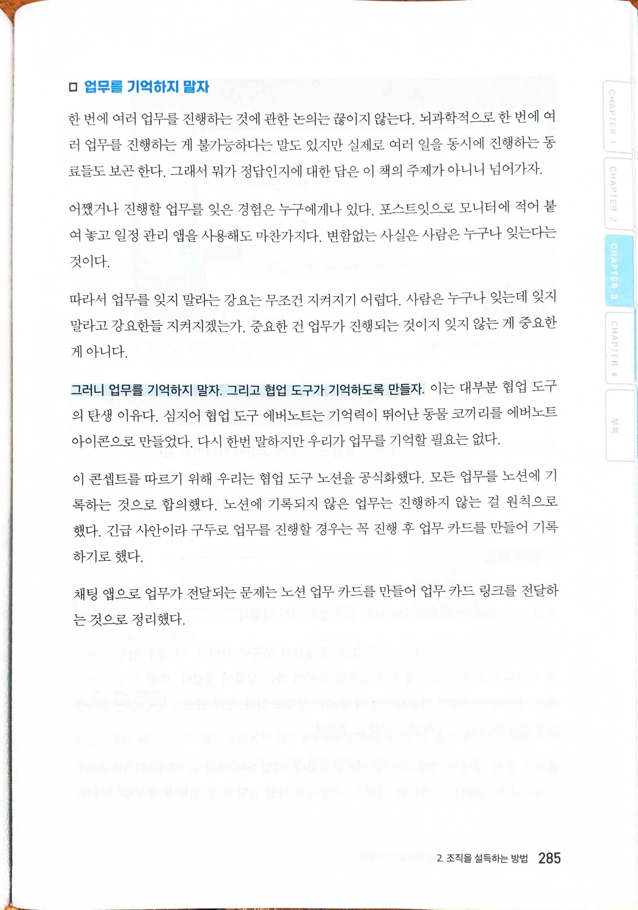

* `업무를 기억하지 말자. 협업 도구가 기억하도록 만들자. 이는 대부분 협업 도구의 탄생 이유다. 심지어 협업 도구 에버노트는 기억력이 뛰어난 동물 코끼리를 에버노트 아이콘으로 만들었다. 다시 한번 말하지만 우리가 업무를 기억할 필요는 없다.`

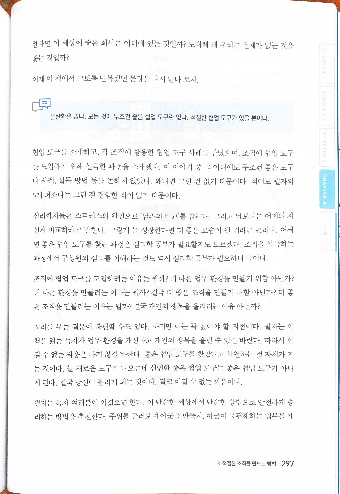

* `은탄환은 없다. 모든 것에 무조건 좋은 협업 도구란 없다. 적절한 협업 도구가 있을 뿐이다.`