# 심플 소프트웨어 Understanding Software

* [Understanding Software](https://www.oreilly.com/library/view/understanding-software/9781788628815/)
* [Understanding Software » Code Simplicity](https://www.codesimplicity.com/post/understanding-software/)

## 1부 프로그래머를 위한 원칙

### 1장 시작하기 전에 016

### 2장 엔지니어의 자세 019
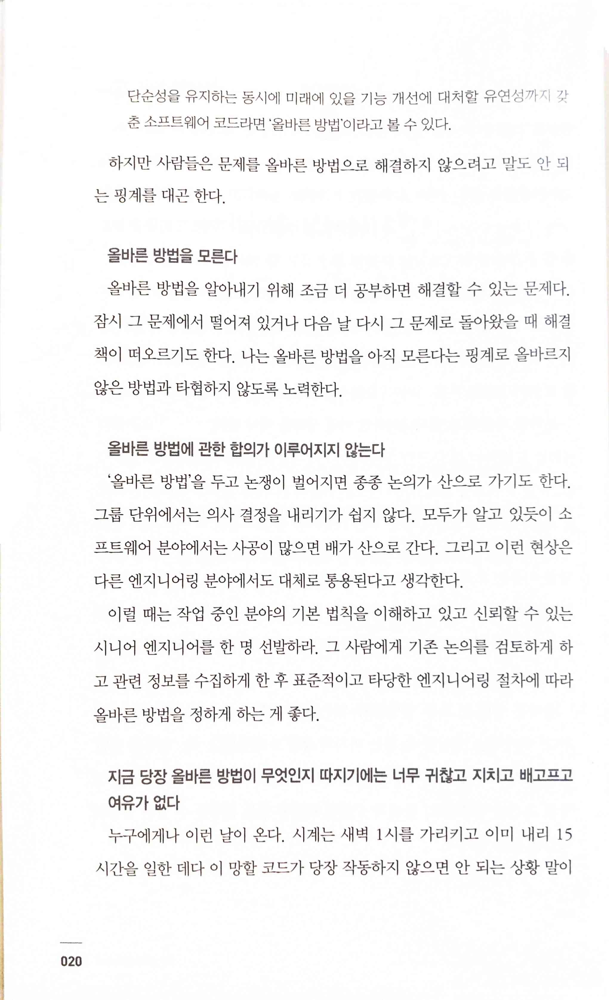

> 단순성을 유지하는 동시에 미래에 있을 기능 개선에 대처할 유연성까지 갖춘 소프트웨어 코드라면 '올바른 방법'이라고 볼 수 있다.

### 3장 능력자 프로그래머의 한 가지 비밀 022
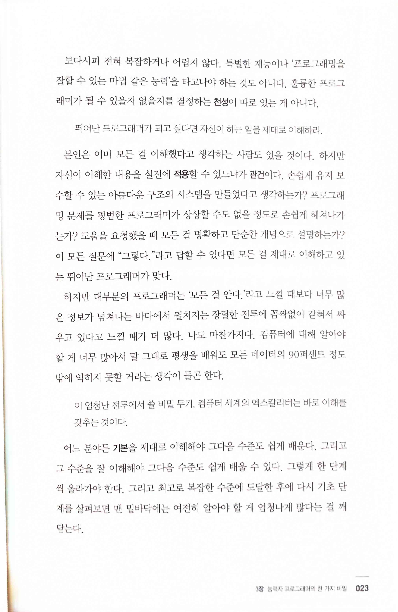

> 어느 분야든 기본을 제대로 이해해야 그다음 수준도 쉽게 배운다.

### 4장 두 문장으로 요약한 소프트웨어 설계 025
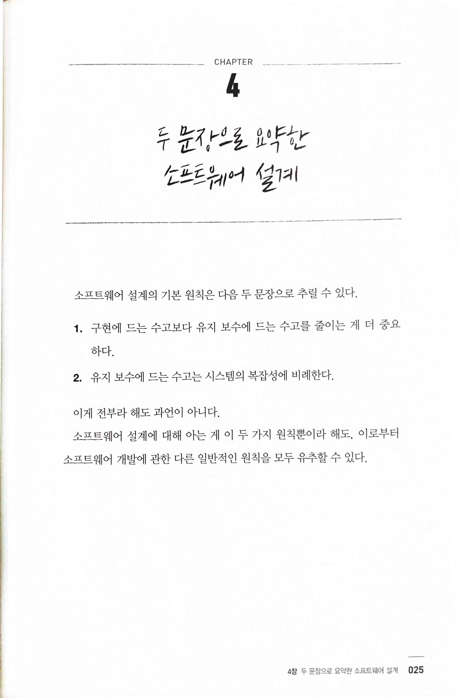

> 소프트웨어 설계의 기본 원칙
>
> 1. 구현에 드는 수고보다 유지 보수에 드는 수고를 줄이는 게 더 중요하다.
>
> 2. 유지 보수에 드는 수고는 시스템의 복잡성에 비례한다.

## 2부 소프트웨어의 복잡성과 원인

### 5장 복잡성의 단서 028

### 6장 복잡성을 키우는 방법 : API 분리 029

### 7장 하위 호환성이 가치를 잃는 시점은 언제인가? 033
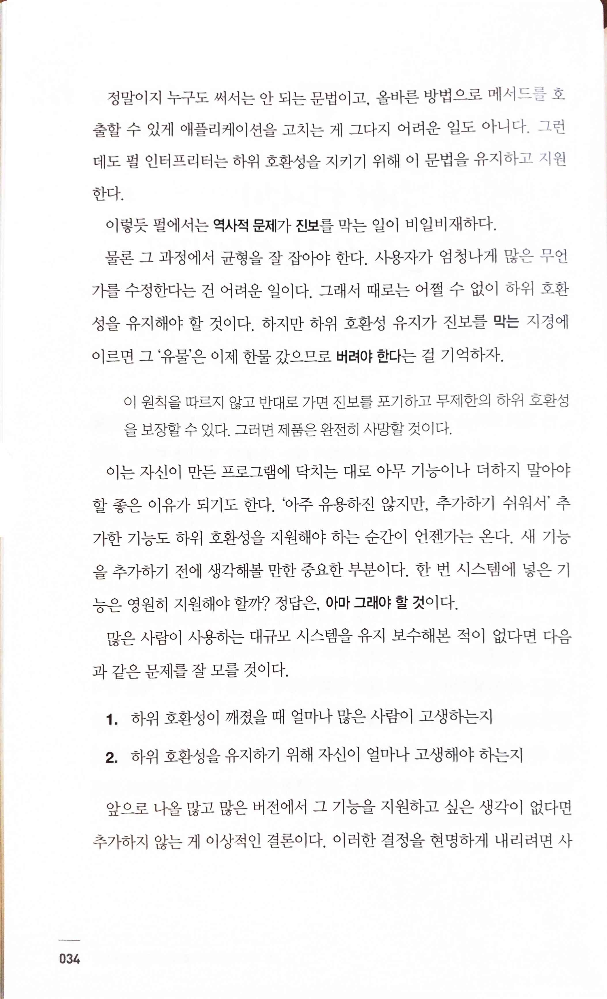

> 이렇듯 펄에서는 역사적 문제가 진보를 막는 일이 비일비재하다.
>
> 앞으로 나올 많고 많은 버전에서 그 기능을 지원하고 싶은 생각이 없다면 추가하지 않는 게 이상적인 결론이다.

### 8장 복잡성은 감옥이다 036

> 복잡성은 감옥이고 단순성은 자유다.

## 3부 단순성과 소프트웨어 설계

### 9장 설계는 프로젝트 초반에 하라 040
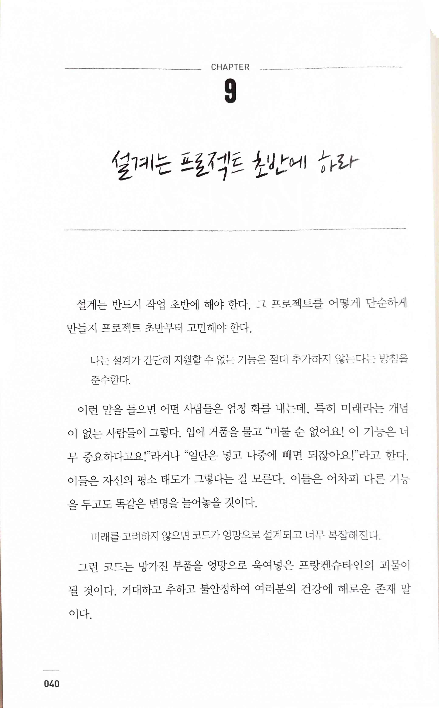

> 설계가 간단히 지원할 수 없는 기능은 절대 추가하지 않는다는 방침을 준수
>
> 미래를 고려하지 않으면 코드가 엉망으로 설계되고 너무 복잡해진다.

### 10장 미래 예측의 정확성 042
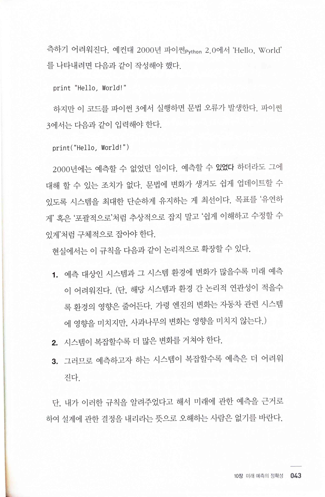

> 목표를 '유연하게' 혹은 '포괄적으로'처럼 추상적으로 잡지 말고 '쉽게 이해하고 수정할 수 있게'처럼 구체적으로 잡아야 한다.
>
> 미래에 관한 예측을 근거로 하여 설계에 관한 결정을 내리라는 뜻으로 오해하는 사람은 없기를 바란다.

### 11장 단순성과 엄격성 045
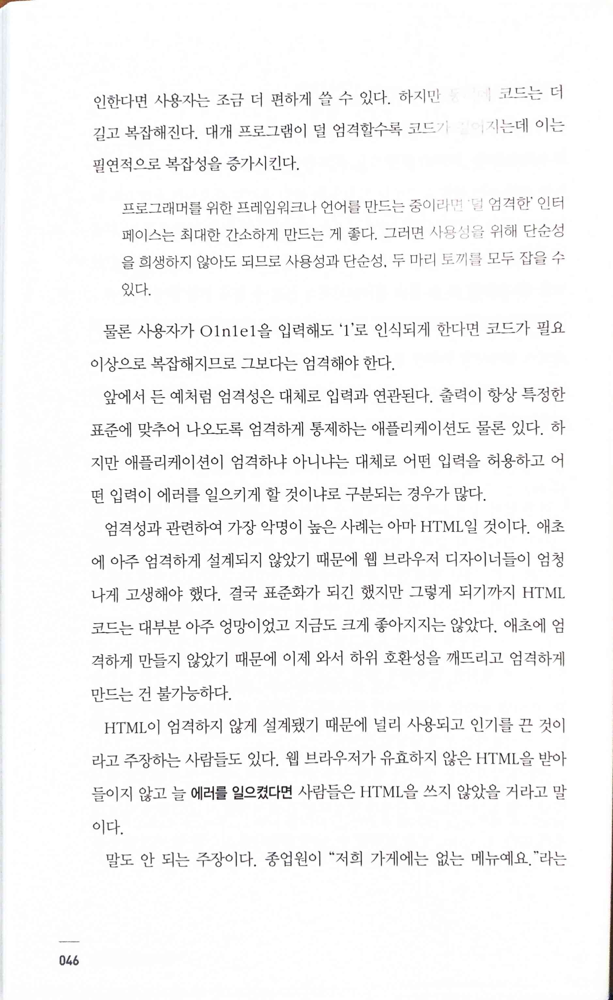

> HTML. 애초에 아주 엄격하게 설계되지 않았기 때문에 웹 브라우저 디자이너들이 엄청나게 고생해야 했다. 결국 표준화가 되긴 했지만 그렇게 되기까지 HTML 코드는 대부분 아주 엉망이었고 지금도 크게 좋아지지는 않았다. 애초에 엄격하게 만들지 않았기 때문에 이제 와서 하위 호환성을 깨뜨리고 엄격하게 만드는 건 불가능하다.

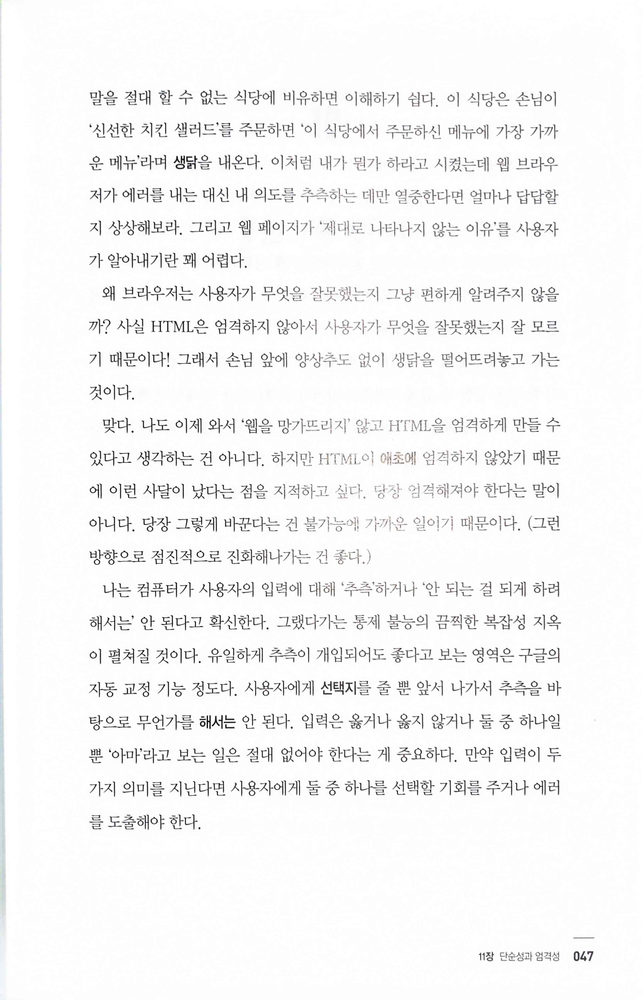

> 컴퓨터가 사용자의 입력에 대해 '추측'하거나 '안 되는 걸 되게 하려해서는' 안 된다
>
> 사용자에게 선택지를 줄 뿐 앞서 나가서 추측을 바탕으로 무언가를 해서는 안 된다.

### 12장 둘은 너무 많다 049

### 13장 분별 있는 소프트웨어 설계 052

## 4부 디버깅

### 14장 버그란 무엇인가? 062

### 15장 버그의 원인 064

### 16장 재발을 방지하라 067

> 코드베이스의 문제를 해결할 때는 증상이 멈췄다고 할 일이 끝난 게 아니다. 문제가 완전히 사라져서 다시는 발생하지 않아야 임무를 완수한 것이다.
>
> 소프트웨어에서 가장 신경 써야 할 부분은 미래다.

### 17장 디버깅의 기본 철학 073
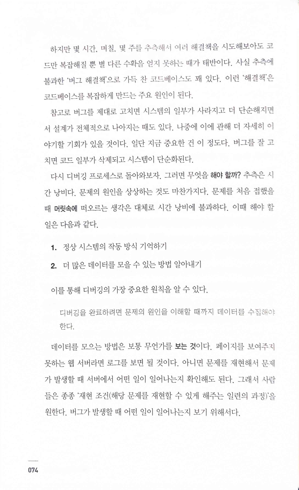

> 디버깅을 완료하려면 문제의 원인을 이해할 때까지 데이터를 수집해야 한다.
* 데이터를 수집하려면 각종 metric, monitoring system이 있어야 하고, 그러려면 결국 logging이 바탕이 되어야 한다

## 5부 엔지니어링 팀에서 일하기

### 18장 엔지니어링 생산성을 효과적으로 개선하기 082
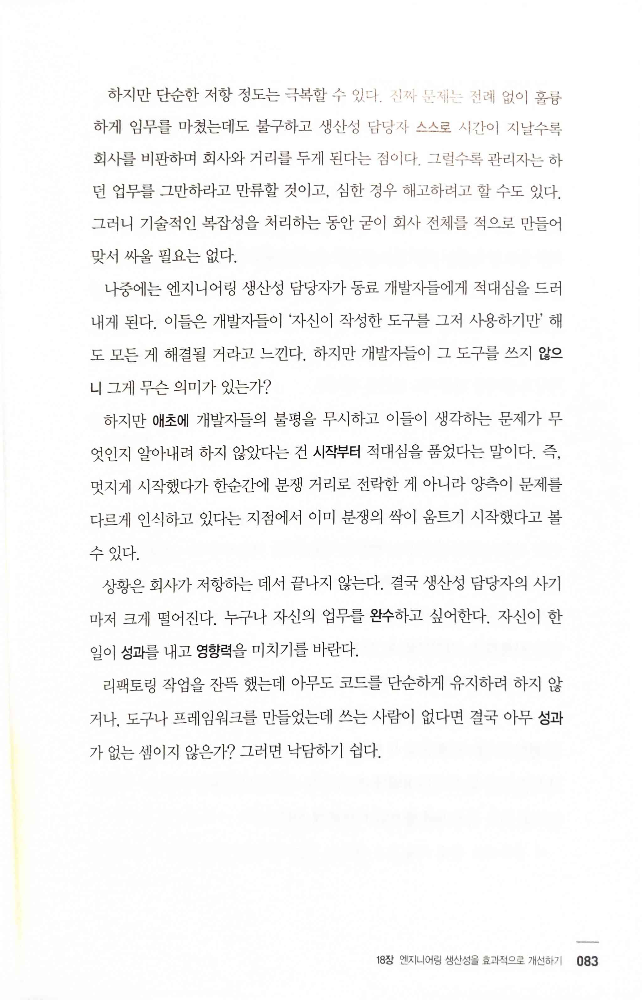

> 멋지게 시작했다가 한순간에 분쟁 거리로 전락한 게 아니라 양측이 문제를 다르게 인식하고 있다는 지점에서 이미 분쟁의 싹이 움트기 시작

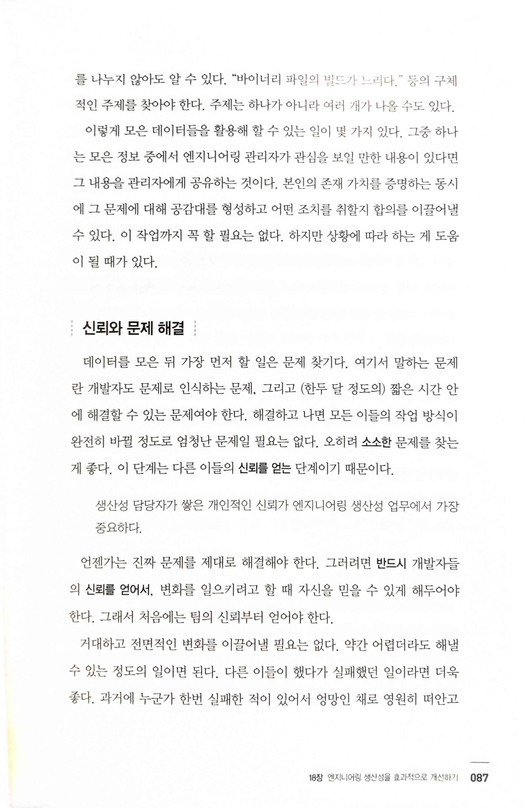

> 생산성 담당자가 쌓은 개인적인 신뢰가 엔지니어링 생산성 업무에서 가장 중요하다.
* "개인적인 신뢰가 (모든) 업무에서 가장 중요하다."로 바꿔도 큰 무리가 없다

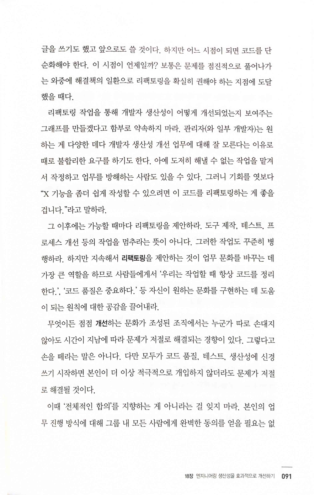

> 무엇이든 점점 개선하는 문화가 조성된 조직에서는 누군가 따로 손대지 않아도 시간이 지남에 따라 문제가 저절로 해결되는 경향이 있다.

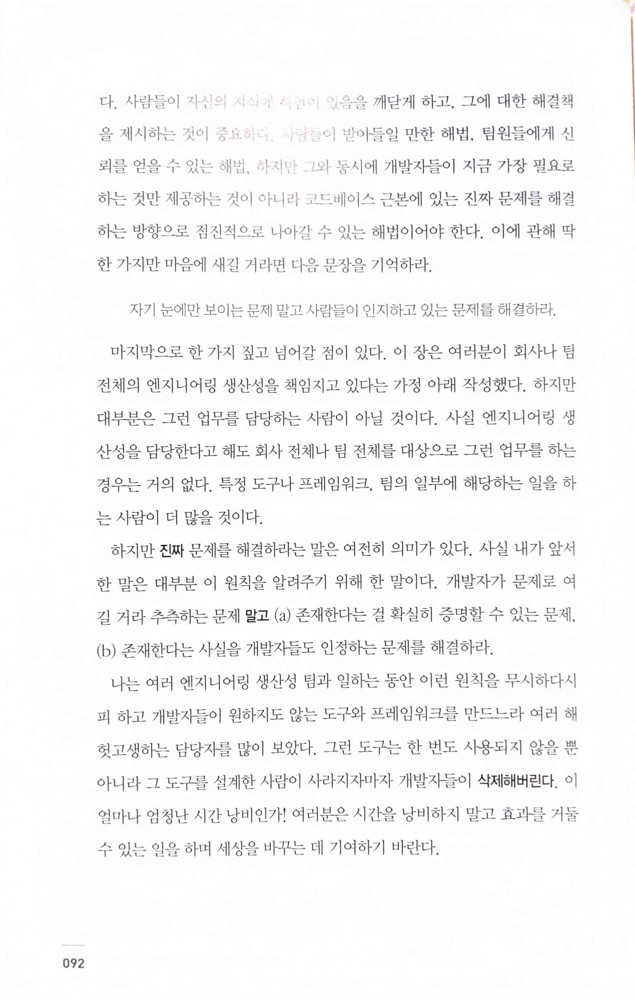

> 자기 눈에만 보이는 문제 말고 사람들이 인지하고 있는 문제를 해결하라.

### 19장 개발자 생산성 측정하기 093

### 20장 소프트웨어 회사에서 코드 복잡성을 다루는 법 101
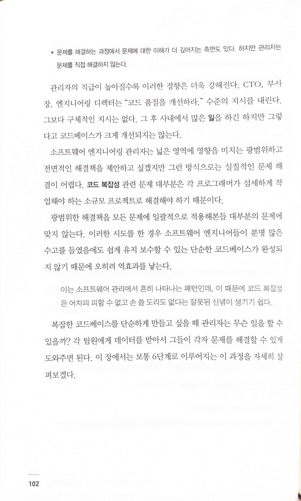

> 소프트웨어 엔지니어링 관리자는 넓은 영역에 영향을 미치는 광범위하고 전면적인 해결책을 제안하고 싶겠지만 그런 방식으로는 실질적인 문제 해결이 어렵다... 광범위한 해결책을 모든 문제에 일괄적으로 적용해본들 대부분의 문제에 맞지 않는다.
 
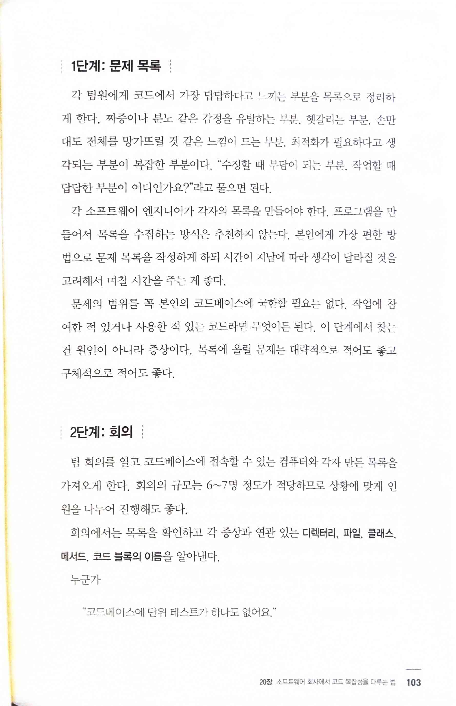

> 1단계: 문제 목록

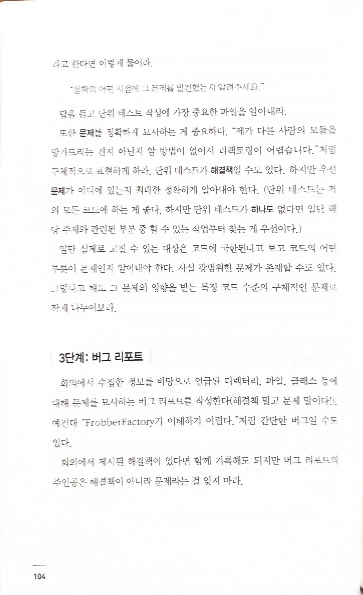

> 2단계: 회의
>
> 문제를 정확하게 묘사하는 게 중요
>
> 3단계: 버그 리포트
>
> 버그 리포트의 주인공은 해결책이 아니라 문제

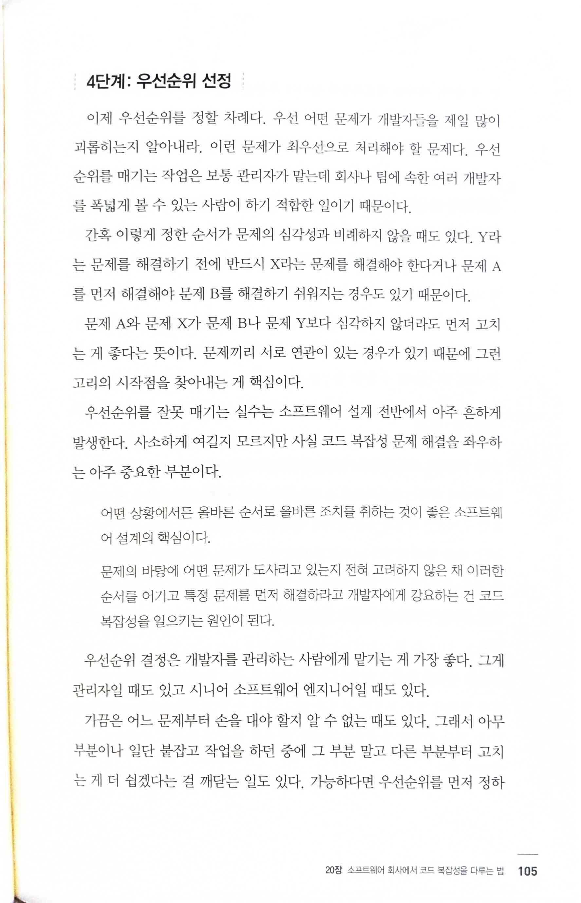

> 4단계: 우선순위 선정
>
> 문제끼리 서로 연관이 있는 경우가 있기 때문에 그런 고리의 시작점을 찾아내는 게 핵심이다... 어떤 상황에서든 올바른 순서로 올바른 조치를 취하는 것이 좋은 소프트웨어 설계의 핵심이다.

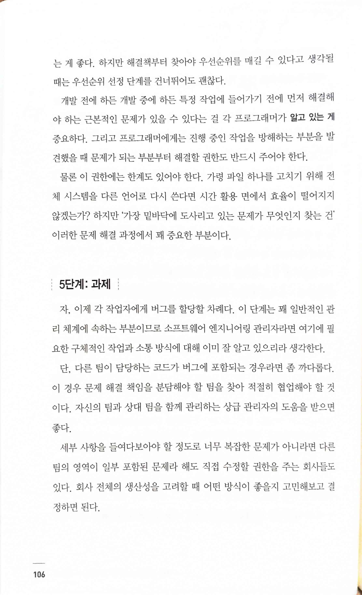

> 5단계: 과제

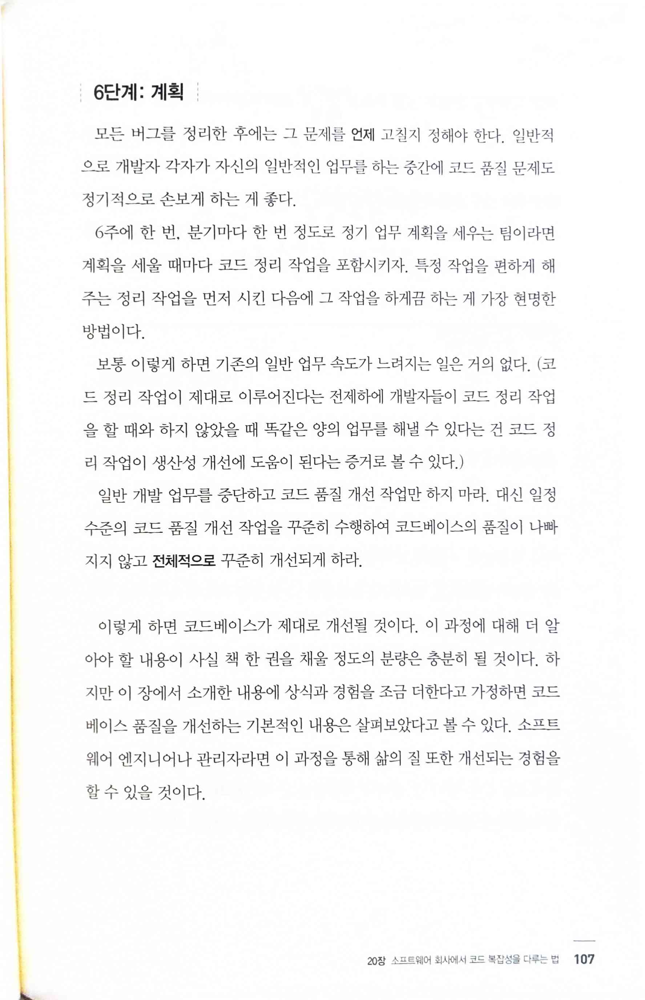

> 6단계: 계획
>
> 일반 개발 업무를 중단하고 코드 품질 개선 작업만 하지 마라. 대신 일정 수준의 코드 품질 개선 작업을 꾸준히 수행하여 코드베이스의 품질이 나빠지지 않고 전체적으로 꾸준히 개선되게 하라.

### 21장 리팩토링할 때는 기능에 주목하라 108

### 22장 친절과 코드 116

> 소프트웨어 엔지니어링의 근간에는 인간이 있다.

> 개발자 말고 코드에 대해 이야기하는 게 중요하다.
* 문제에 대해 말할 때는 사람이 아니라 문제 그 자체, 현상 혹은 상황에 대해 이야기하는 게 필요하다. 역시 개발뿐만 아니라 모든 업무에 해당하는 이야기

### 23장 간략하게 살펴보는 오픈 소스 커뮤니티 121
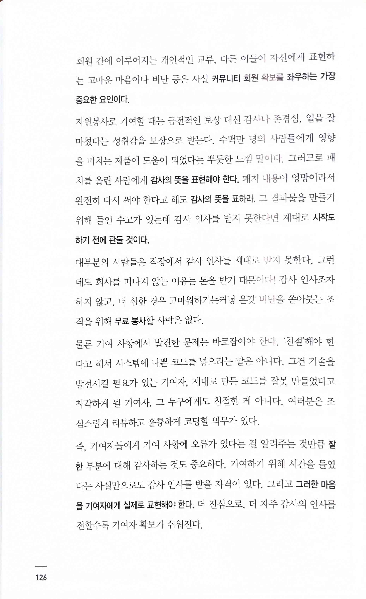

> 회원 간에 이루어지는 개인적인 교류, 다른 이들이 자신에게 표현하는 고마운 마음이나 비난 등은 사실 커뮤니티 회원 확보를 좌우하는 가장 중요한 요인이다.

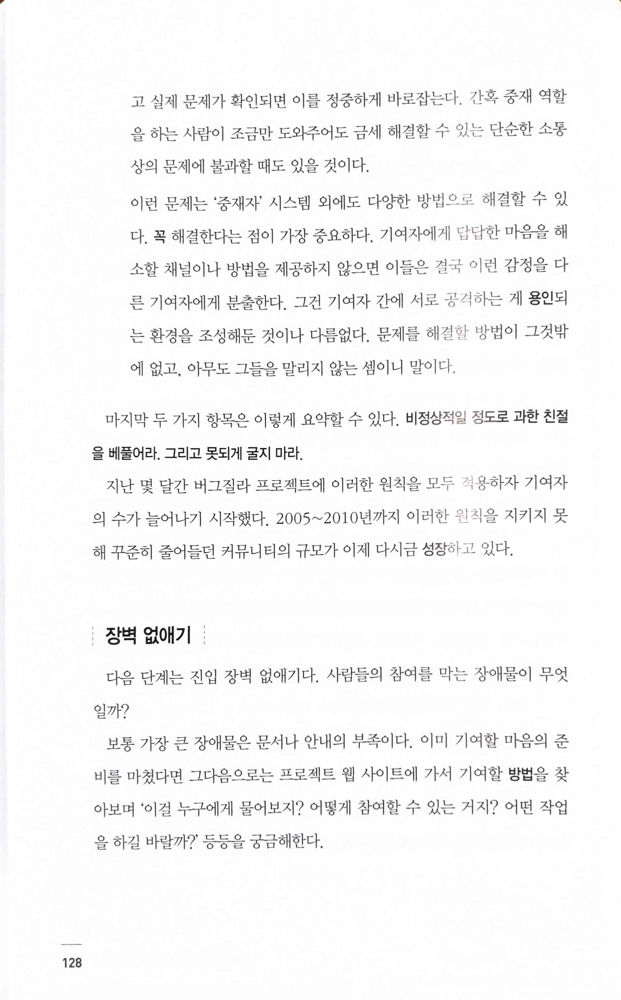

> 비정상적일 정도로 과한 친절을 베풀어라. 그리고 못되게 굴지 마라.

## 6부 소프트웨어 이해하기

### 24장 컴퓨터란 무엇인가? 136

### 25장 소프트웨어 구성 요소: 구조, 동작, 결과 139

### 26장 소프트웨어 개정판: (I)SAR 구별하기 141
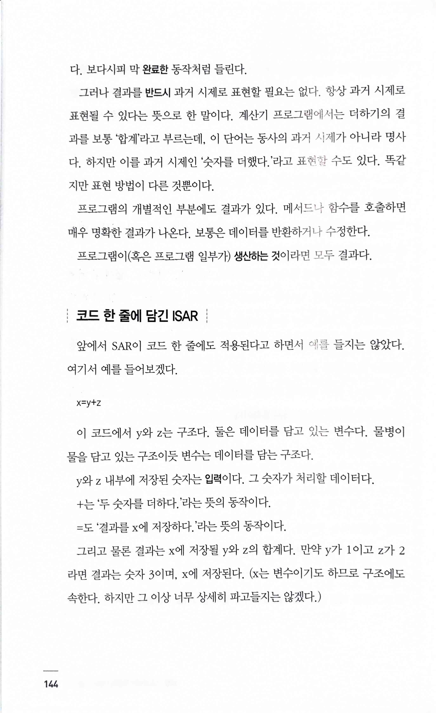

> 코드 한 줄에 담긴 ISAR
* Input, Structure, Action, Result

### 27장 지식으로서의 소프트웨어 146

### 28장 기술의 목적 149

### 29장 간략하게 살펴보는 프라이버시 문제 152
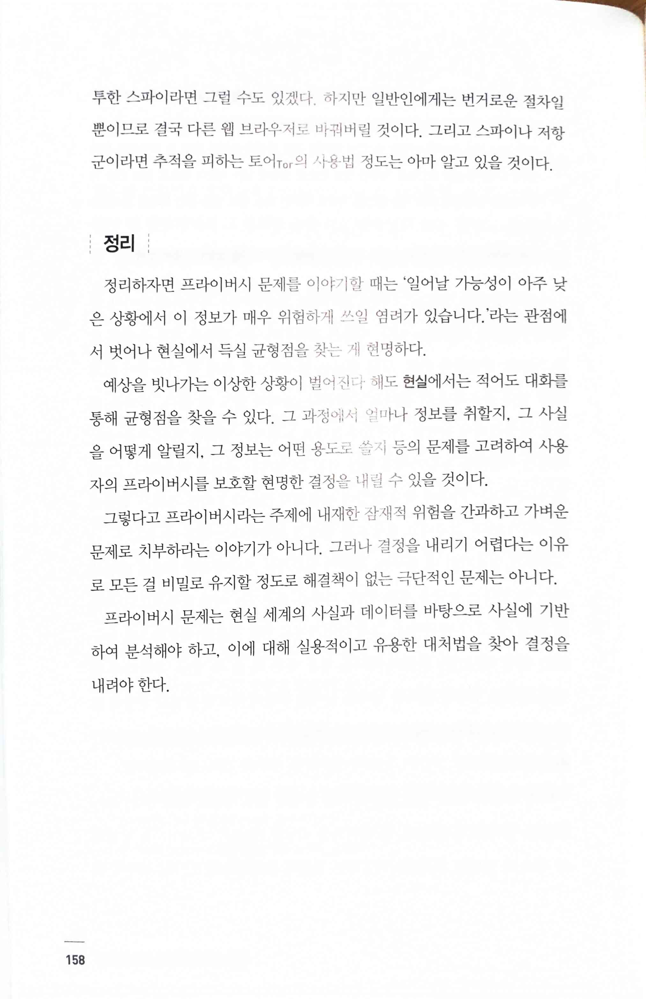

> 프라이버시 문제를 이야기할 때는 '일어날 가능성이 아주 낮은 상황에서 이 정보가 매우 위험하게 쓰일 염려가 있습니다.'라는 관점에서 벗어나 현실에서 득실 균형점을 찾는 게 현명하다.

### 30장 단순성과 보안 159

### 31장 테스트 주도 개발과 관찰 주기 162
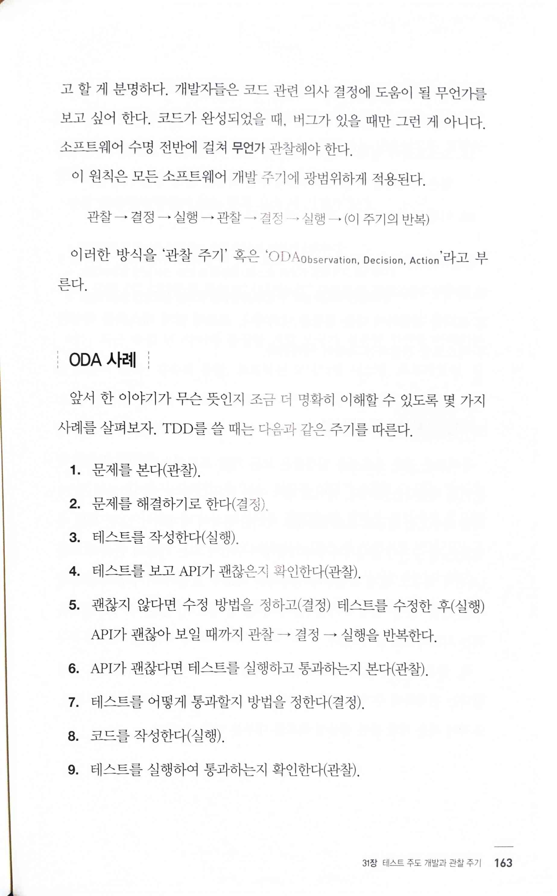

> '관찰 주기' 혹은 'ODA Observation, Decision, Action'

### 32장 테스트 철학 167
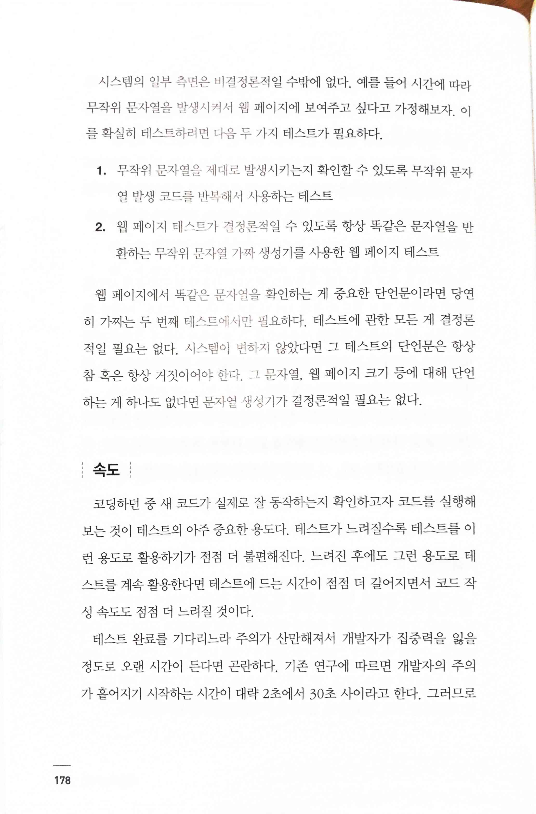

> 기존 연구에 따르면 개발자의 주의가 흩어지기 시작하는 시간이 대략 2초에서 30초 사이
* 개발자의 주의가 아니라 인간의 주의가 흩어지기 시작하는 시간으로 써도 괜찮을 듯

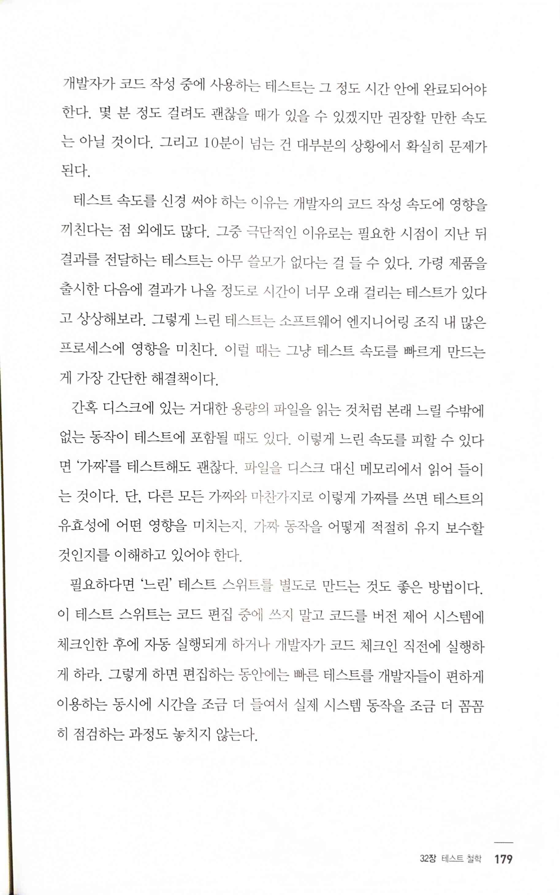

> 테스트 속도를 신경 써야 하는 이유
>
> 개발자의 코드 작성 속도에 영향을 끼친다
>
> 필요한 시점이 지난 뒤 결과를 전달하는 테스트는 아무 쓸모가 없다... 느린 테스트는 소프트웨어 엔지니어링 조직 내 많은 프로세스에 영향을 미친다. 이럴 때는 그냥 테스트 속도를 빠르게 만드는게 가장 간단한 해결책이다.
>
> 필요하다면 '느린' 테스트 스위트를 별도로 만드는 것도 좋은 방법이다.

## 7부 나아지기

### 33장 성공의 비밀: 나아지기 182
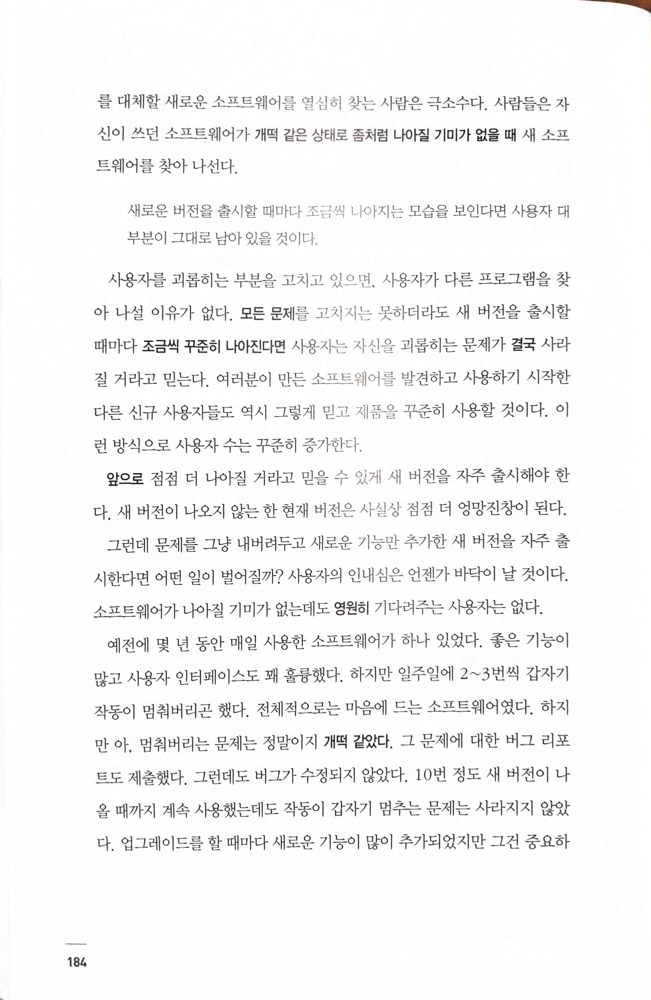

> 새로운 버전을 출시할 때마다 조금씩 나아지는 모습을 보인다면 사용자 대부분이 그대로 남아 있을 것이다.

### 34장 개떡 같은 부분을 찾는 방법 186

### 35장 '아니요'의 힘 190

### 36장 프로그래머가 개떡 같은 이유 195

### 37장 빠른 프로그래밍의 비결 : 생각하지 않기 201

> 이해에 도달할 유일한 길은 행동이다.

### 38장 개발자의 자만심 208
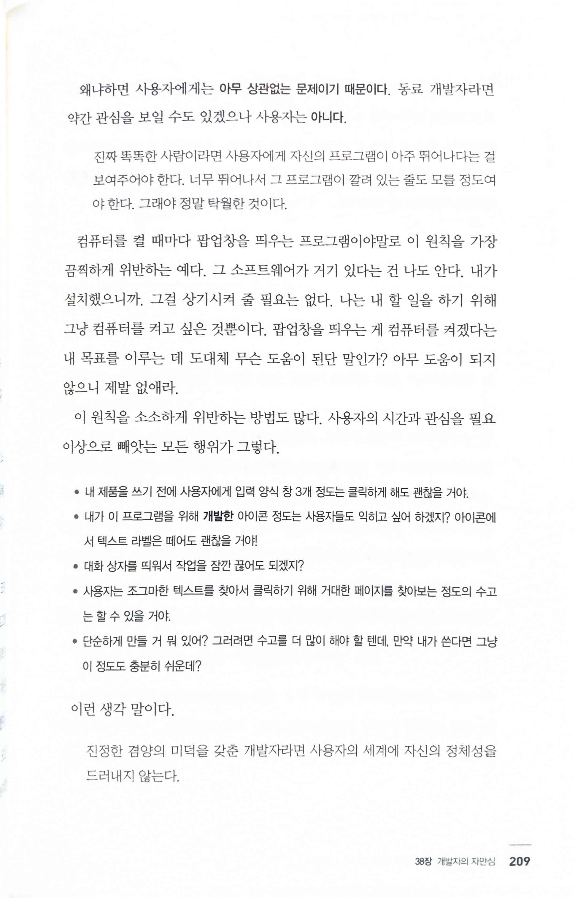

> 진짜 똑똑한 사람이라면 사용자에게 자신의 프로그램이 아주 뛰어나다는 걸 보여주어야 한다. 너무 뛰어나서 그 프로그램이 깔려 있는 줄도 모를 정도여야 한다. 그래야 정말 탁월한 것이다.
>
> 진정한 겸양의 미덕을 갖춘 개발자라면 사용자의 세계에 자신의 정체성을 드러내지 않는다.

### 39장 '일관성'과 '획일성은 다르다 211

### 40장 사용자는 문제를 알려주고 개발자는 해결책을 만든다 213

> 소프트웨어 세계에서 소프트웨어 개발자의 과제는 사용자의 문제를 해결하는 것이다. 사용자는 문제를 알려주고 개발자는 문제를 고친다. 이 역할이 뒤바뀌면 문제가 뒤따른다.

### 41장 즉각적인 만족감 = 즉각적인 실패 217

### 42장 성공은 혁신이 아니라 실행에서 온다 220

> 성공에 이르는 길은 혁신이 아니라 실행이다.
>
> 크게 성공한 이들은 어떤 아이디어를 처음 낸 사람이 아니라 그 아이디어를 정말 훌륭하게 실행한 사람이란 걸 알 수 있다.

### 43장 훌륭한 소프트웨어 222
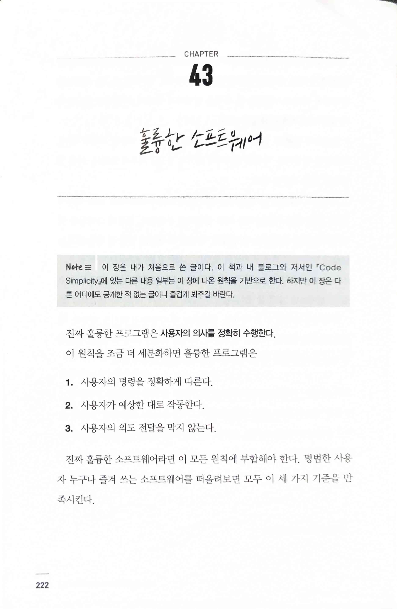

> 진짜 훌륭한 프로그램은 사용자의 의사를 정확히 수행한다.
>
> 이 원칙을 조금 더 세분화하면 훌륭한 프로그램은
>
> 1. 사용자의 명령을 정확하게 따른다.
>
> 2. 사용자가 예상한 대로 작동한다.
>
> 3. 사용자의 의도 전달을 막지 않는다.