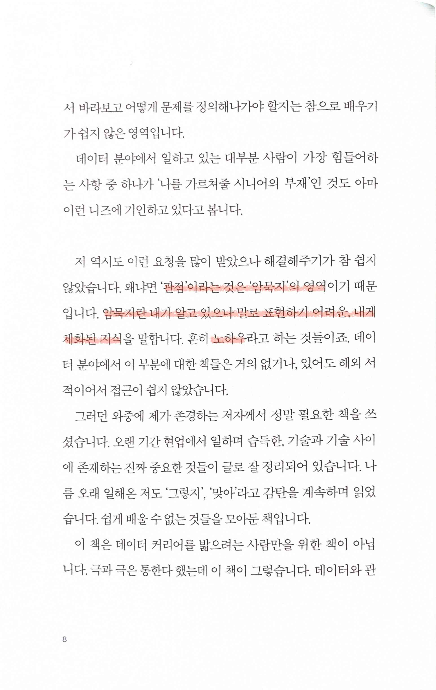
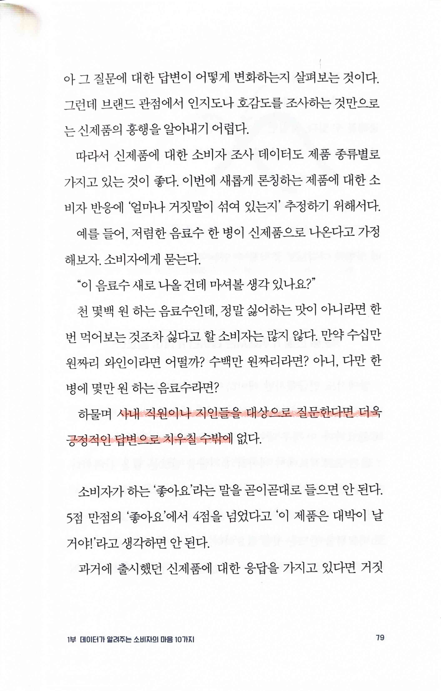
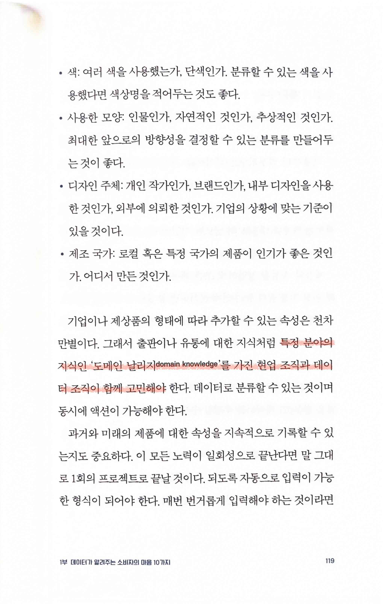
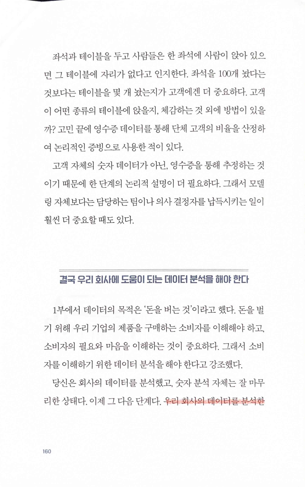
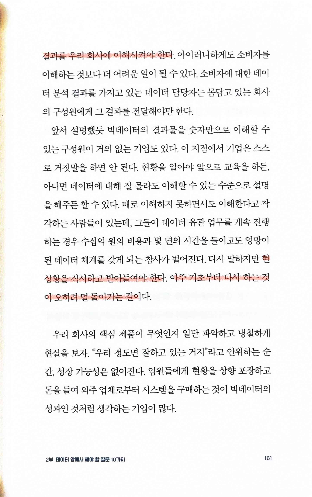
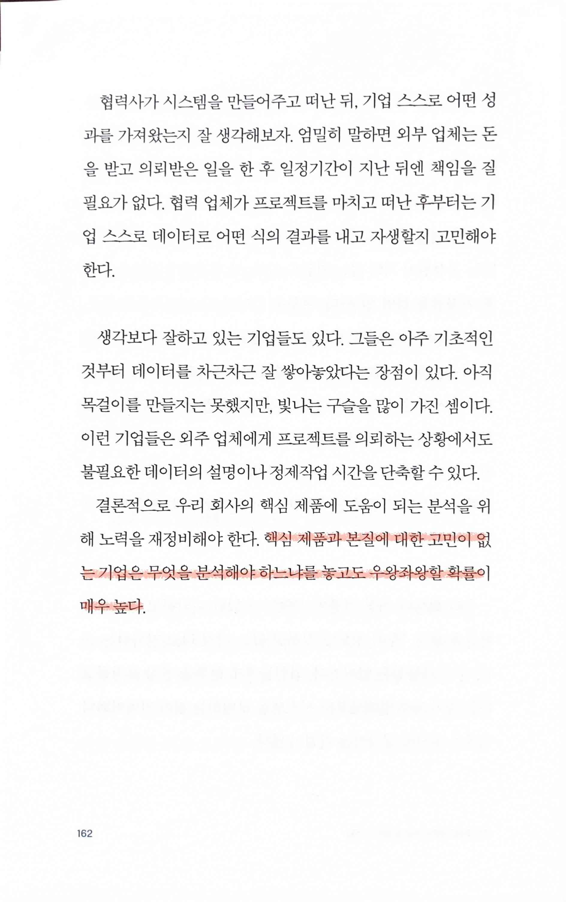
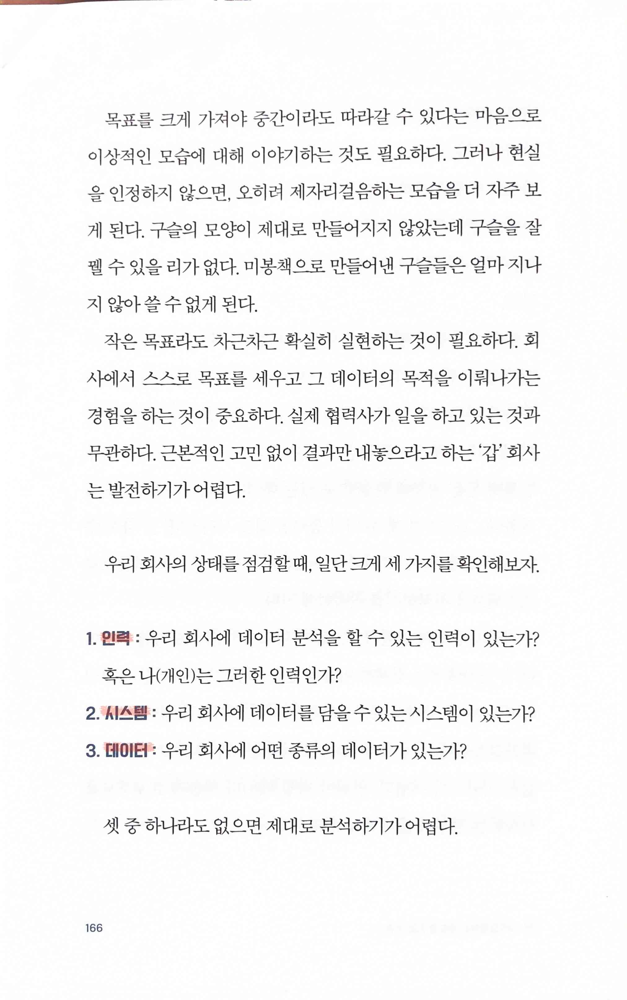
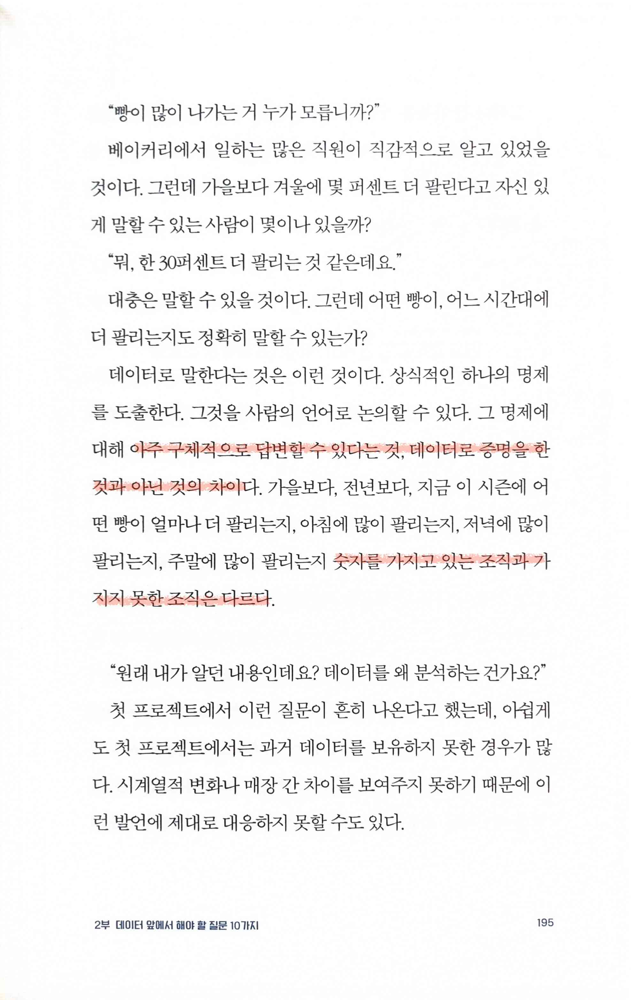
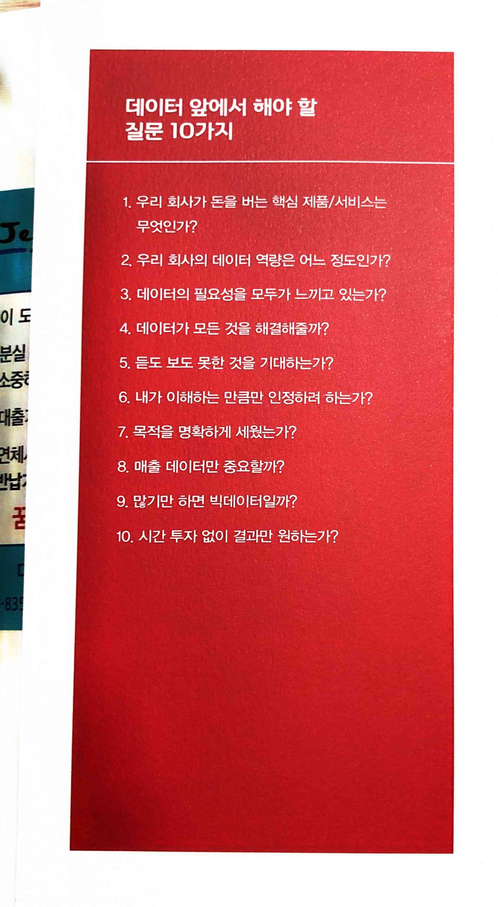

데이터 읽기의 기술
==================

> '관점'이라는 것은 '암묵지'의 영역
>
> 암묵지란 내가 알고 있으나 말로 표현하기 어려운 내게 체화된 지식, 노하우

* 사용자, 소비자 조사의 어려움. 이런 점을 생각지도 않고 무작정 조사를 하고 최소 몇 점 이상 나오는 product를 만들겠다고 생각하는 사람을 겪어봤다.

> 특정 분야의 지식인 '도메인 날리지 domain knowledge'를 가진 현업 조직과 데이터 조직이 함께 고민해야

  

> 우리 회사의 데이터를 분석한 결과를 우리 회사에 이해시켜야 한다. 아이러니하게도 소비자를 이해하는 것보다 더 어려운 일이 될 수 있다.
>
> 현 상황을 직시하고 받아들여야 한다. 아주 기초부터 다시 하는 것이 오히려 덜 돌아가는 길이다.
>
> 핵심 제품과 본질에 대한 고민이 없는 기업은 무엇을 분석해야 하느냐를 놓고도 우왕좌왕할 확률이 매우 높다.

> 우리 회사의 상태를 점검할 때, 일단 크게 세 가지를 확인해보자.
>
> 1. 인력 : 우리 회사에 데이터 분석을 할 수 있는 인력이 있는가?혹은나(개인)는 그러한 인력인가?
>
> 2. 시스템 : 우리 회사에 데이터를 담을수 있는 시스템이 있는가?
>
> 3. 데이터 : 우리 회사에 어떤 종류의 데이터가 있는가?

> 아주 구체적으로 답변할 수 있다는 것, 데이터로 증명을 한 것과 아닌 것의 차이
>
> 숫자를 가지고 있는 조직과 가지지 못한 조직은 다르다.

> 데이터가 맞았다고 해서 사람의 눈이 틀린 것이 아니고, 데이터가 틀렸다고 말해도 사람의 의견이 맞는 것은 아니다.

> 데이터 앞에서 해야 할 질문 10가지
>
> 1. 우리 회사가 돈을 버는 핵심 제품/서비스는 무엇인가?
>
> 2. 우리 회사의 데이터 역량은 어느 정도인가?
>
> 3. 데이터의 필요성을 모두가 느끼고 있는가?
>
> 4. 데이터가 모든 것을 해결해줄까?
>
> 5. 듣도 보도 못한 것을 기대하는가?
>
> 6. 내가 이해하는 만큼만 인정하려 하는가?
>
> 7. 목적을 명확하게 세웠는가?
>
> 8. 매출 데이터만 중요할까?
>
> 9. 많기만 하면 빅데이터일까?
>
> 10. 시간 투자 없이 결과만 원하는가?