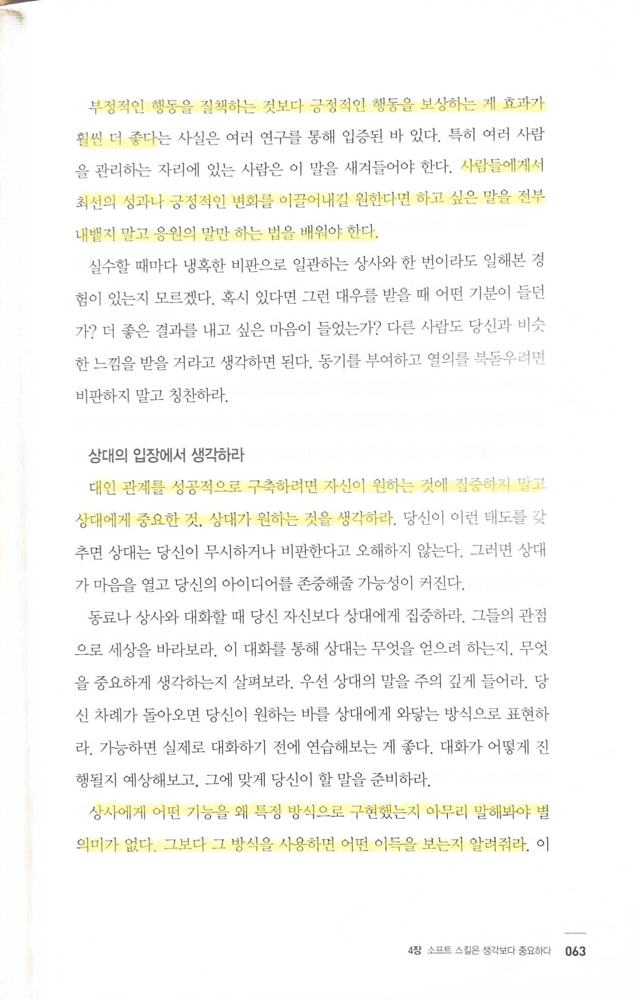
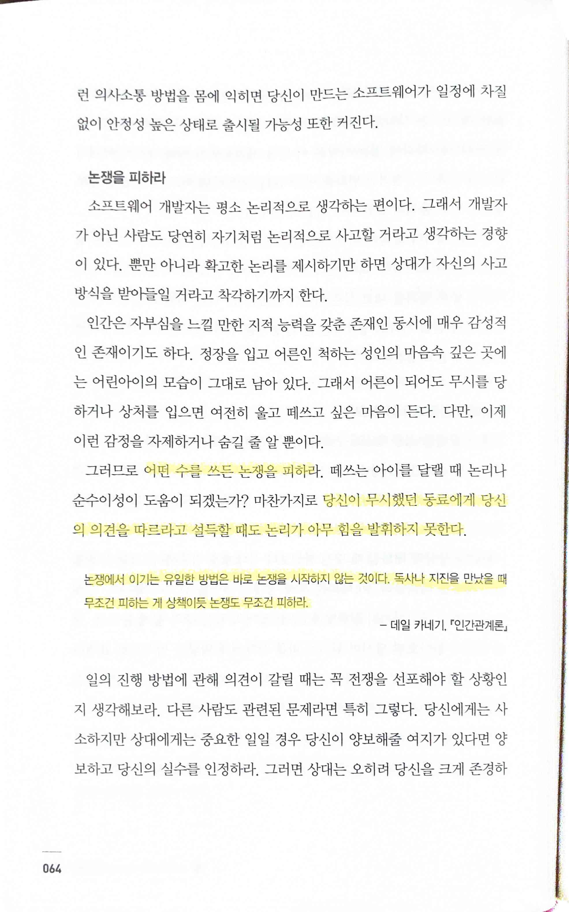
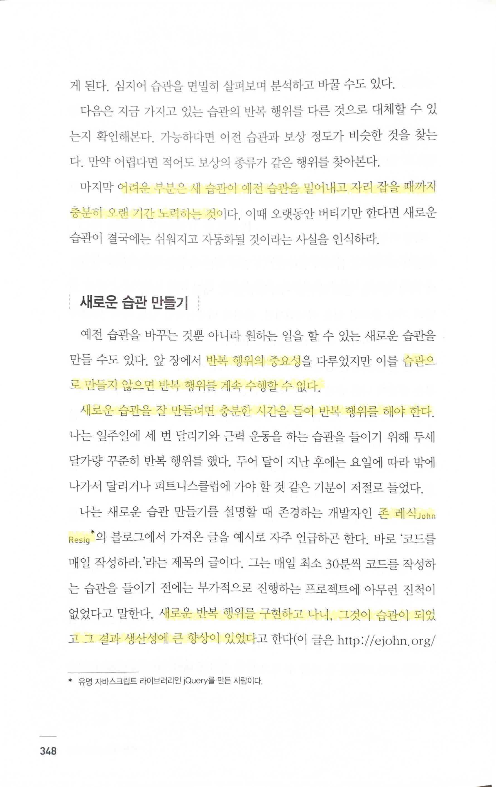
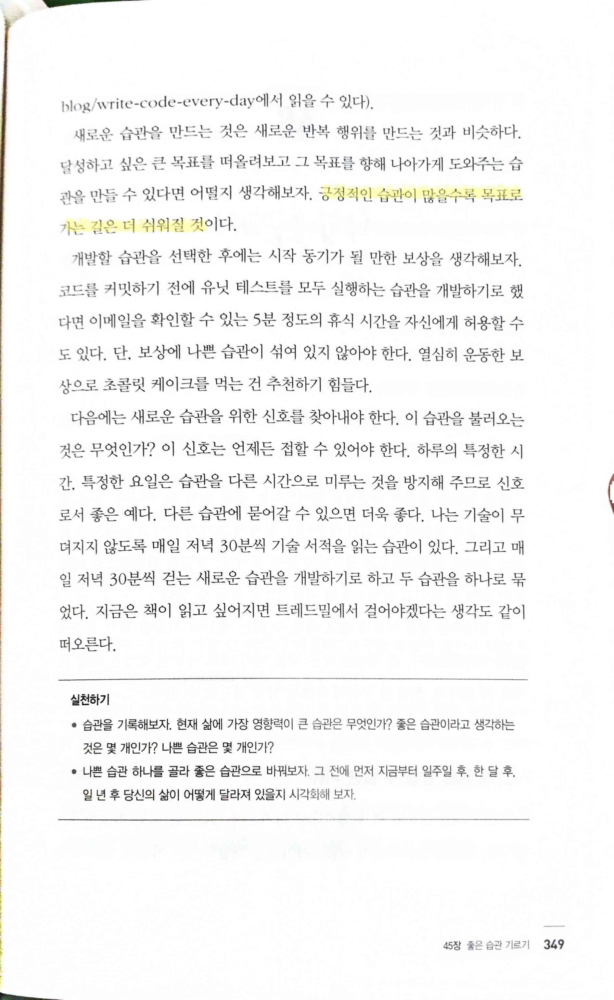
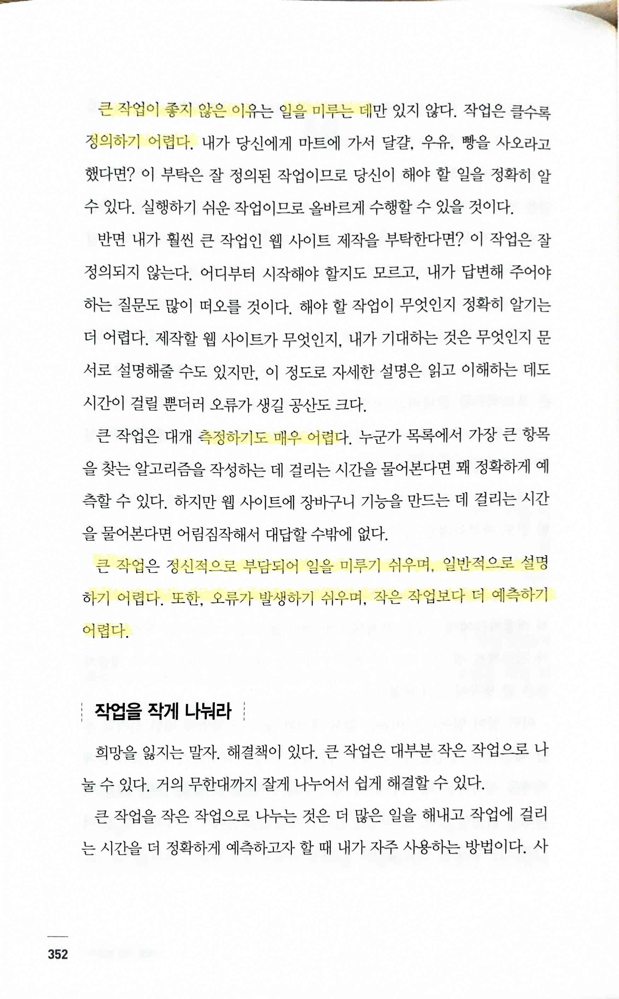
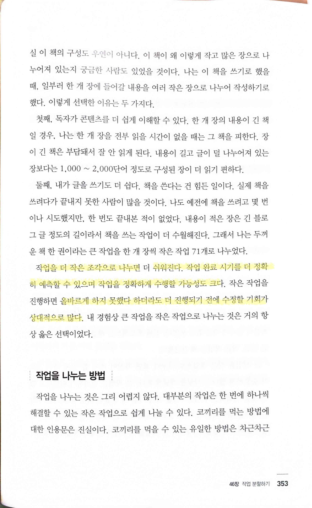
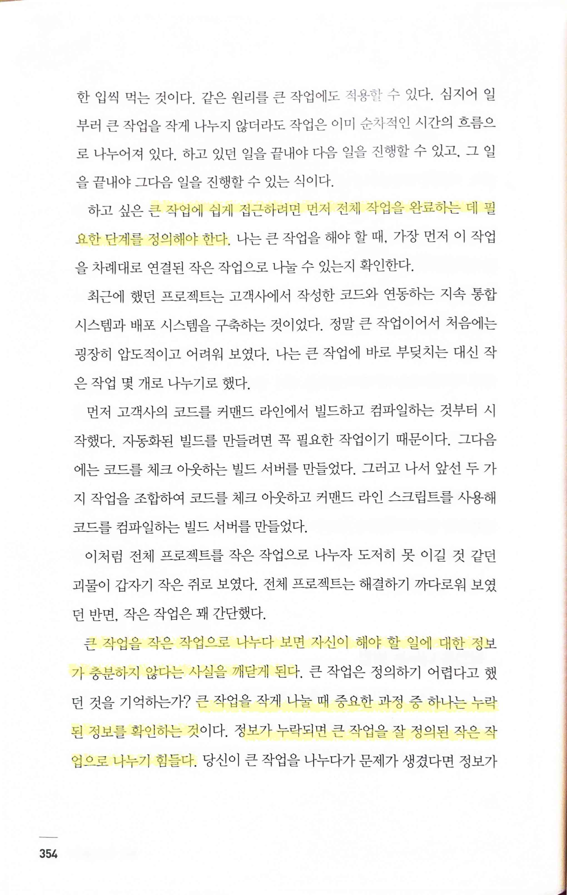
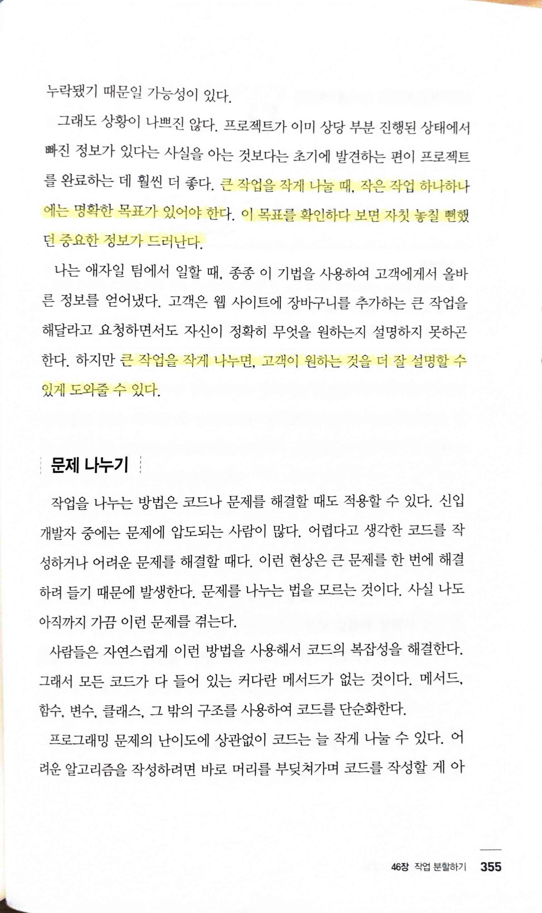

# 소프트 스킬

Tags: programmer
Date: July 7, 2023
Score: ★★★☆☆

- ★★★☆☆ 2023.07.07 엄청나게 좋은 책은 아닐지 몰라도 실용적이고 개발자로뿐만 아니라 생활인으로 살아가는데 필요한 여러가지 좋은 이야기들을 썼다. 이에 공감하는 사람들이 있으니 개정판도 출간할 수 있었을 거라 생각한다.
    - 우당 문005.104-손33ㅅ
    - [https://entreprogrammers.com/](https://entreprogrammers.com/)

- p63
    - `부정적인 행동을 질책하는 것보다 긍정적인 행동을 보상하는 게 효과가 훨씬 더 좋다`
        - `사람들에게서 최선의 성과나 긍정적인 변화를 이끌어내길 원한다면 하고 싶은 말을 전부 내뱉지 말고 응원의 말만 하는 법을 배워야 한다`
    - `대인 관계를 성공적으로 구축하려면 자신이 원하는 것에 집중하지 말고 상대에게 중요한 것, 상대가 원하는 것을 생각하라`
    - `상사에게 어떤 기능을 왜 특정 방식으로 구현했는지 아무리 말해봐야 별 의미가 없다. 그보다 그 방식을 사용하면 어떤 이득을 보는지 알려줘라.`
        - 이게 내가 꼭 기억해야 하는 부분일까? 알고 싶다고 스스로 말하는 (개발자 출신이 아닌) 사람들에게 내용을 이야기해봐야 소용이 없긴 했다

- `어떤 수를 쓰든 논쟁을 피하라… 당신이 무시했던 동료에게 당신의 의견을 따르라고 설득할 때도 논리가 아무 힘을 발휘하지 못한다.`
    - `논쟁에서 이기는 유일한 방법은 바로 논쟁을 시작하지 않는 것이다. 독사나 지진을 만났을 때무조건 피하는 게 상책이듯 논쟁도 무조건 피하라. 데일 카네기 인간관계론`
    - 이게 정말 정답일까? 어떻게 하면 상대를 무시하거나 자세한 설명을 해주지 않는다는 생각을 갖지 않게 하면서 이걸 할 수 있을까?

- pp348~349
    - `어려운 부분은 새 습관이 예전 습관을 밀어내고 자리 잡을 때까지 충분히 오랜 기간 노력하는 것`
        - `반복 행위의 중요성… 습관으로 만들지 않으면 반복 행위를 계속 수행할 수 없다.`
        - `새로운 습관을 잘 만들려면 충분한 시간을 들여 반복 행위를 해야 한다.`
        - `새로운 반복 행위를 구현하고 나니, 그것이 습관이 되었고 그 결과 생산성에 큰 향상이 있었다 - 존 레식 JohnResig`
            - [John Resig - Write Code Every Day](https://johnresig.com/blog/write-code-every-day/)
            - jQuery 제작자
    - `긍정적인 습관이 많을수록 목표로 가는 길은 더 쉬워질 것`

- pp352~355
    - `큰 작업이 좋지 않은 이유는`
        - `일을 미루는 데만 있지 않다.`
        - `작업은 클수록 정의하기 어렵다.`
        - `측정하기도 매우 어렵다.`
        - `큰 작업은 정신적으로 부담되어 일을 미루기 쉬우며, 일반적으로 설명하기 어렵다. 또한, 오류가 발생하기 쉬우며, 작은 작업보다 더 예측하기 어렵다.`
    - `작업을 더 작은 조각으로 나누면 더 쉬워진다. 작업 완료 시기를 더 정확히 예측할 수 있으며 작업을 정확하게 수행할 가능성도 크다… 올바르게 하지 못했다 하더라도 더 진행되기 전에 수정할 기회가 상대적으로 많다.`
    - `큰 작업에 쉽게 접근하려면 먼저 전체 작업을 완료하는 데 필요한 단계를 정의해야 한다.`
        - `큰 작업을 작은 작업으로 나누다 보면 자신이 해야 할 일에 대한 정보가 충분하지 않다는 사실을 깨닫게 된다… 큰 작업을 작게 나눌 때 중요한 과정 중 하나는 누락된 정보를 확인하는 것이다. 정보가 누락되면 큰 작업을 잘 정의된 작은 작업으로 나누기 힘들다.`
    - `큰 작업을 작게 나눌 때, 작은 작업 하나하나에는 명확한 목표가 있어야 한다. 이 목표를 확인하다 보면 자칫 놓칠 뻔했던 중요한 정보가 드러난다.`
        - `큰 작업을 작게 나누면 고객이 원하는 것을 더 잘 설명할 수 있게 도와줄 수 있다.`
