데이터로 말해요! 데이터 중심의 사고·기획·보고의 기술
====================================================
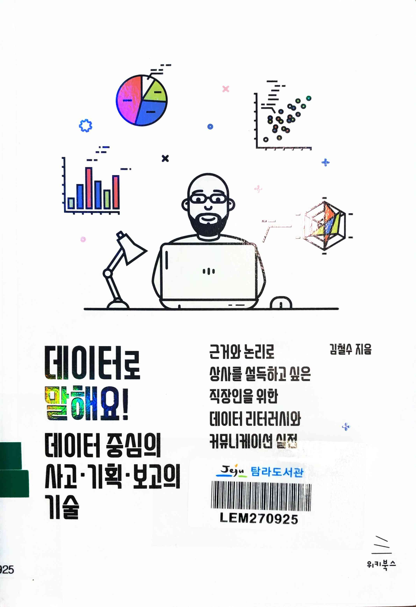

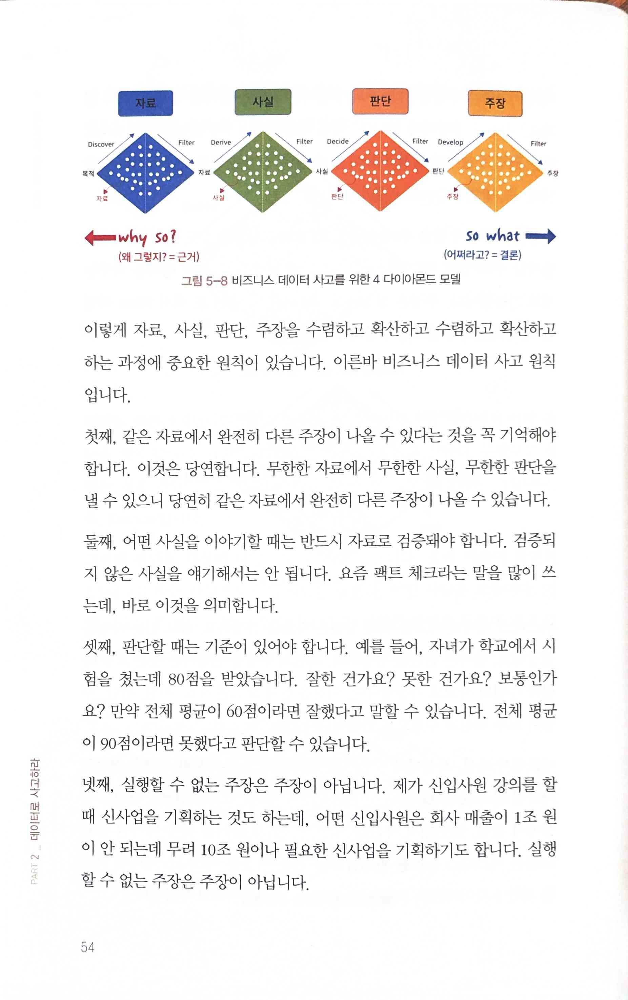

> 그림 5-8 비즈니스 데이터 사고를 위한 4 다이아몬드 모델
>
> 자료, 사실, 판단, 주장

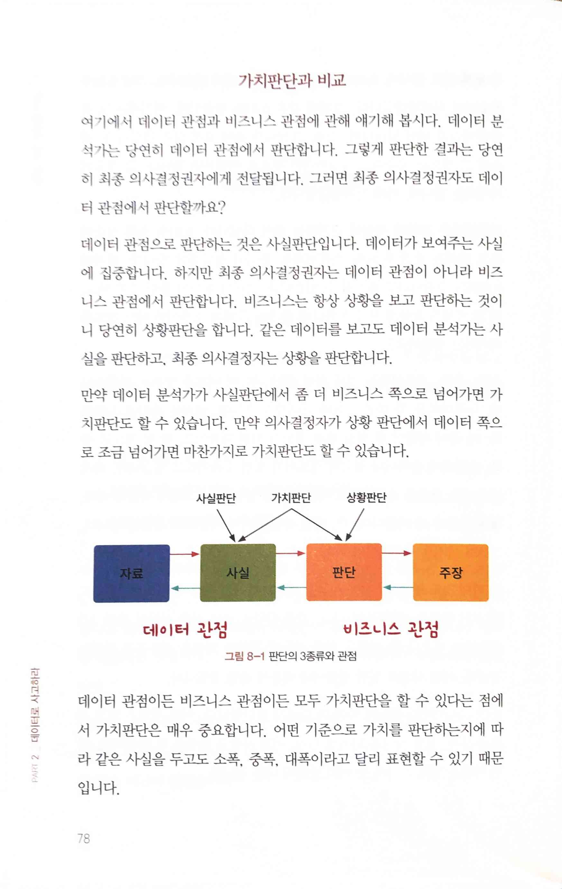

> 그림 8-1 판단의 3종류와 관점
>
> 사실 판단 가치 판단 상황 판단

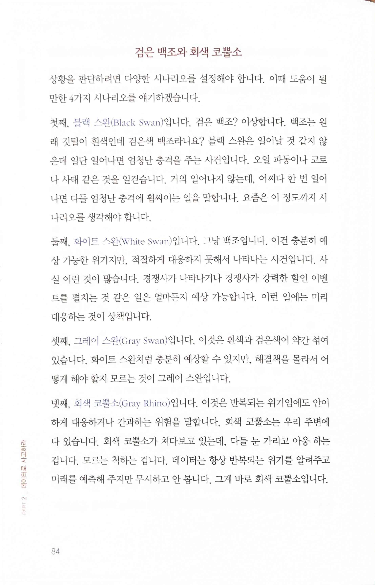

> `블랙 스완(Black Swan)` 거의 일어나지 않는데, 어쩌다 한 번 일어나면 다들 엄청난 충격에 휩싸이는 일
>
> `화이트 스완(White Swan)` 충분히 예상 가능한 위기지만, 적절하게 대응하지 못해서 나타나는 사건. 미리대응하는 것이 상책
>
> `그레이 스완(Gray Swan)` 화이트 스완처럼 충분히 예상할 수 있지만, 해결책을 몰라서 어떻게 해야 할지 모르는 것
>
> `회색 코뿔소(Gray Rhino)` 반복되는 위기임에도 안이하게 대응하거나 간과하는 위험

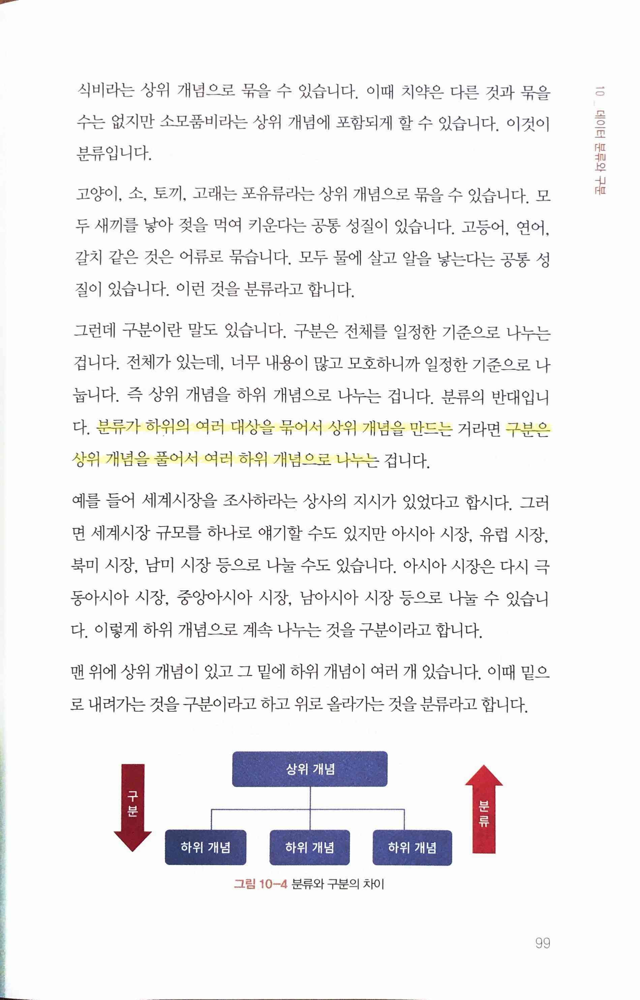

> `분류`가 하위의 여러 대상을 묶어서 상위 개념을 만드는 거라면 `구분`은 상위 개념을 풀어서 여러 하위 개념으로 나누는 겁니다.

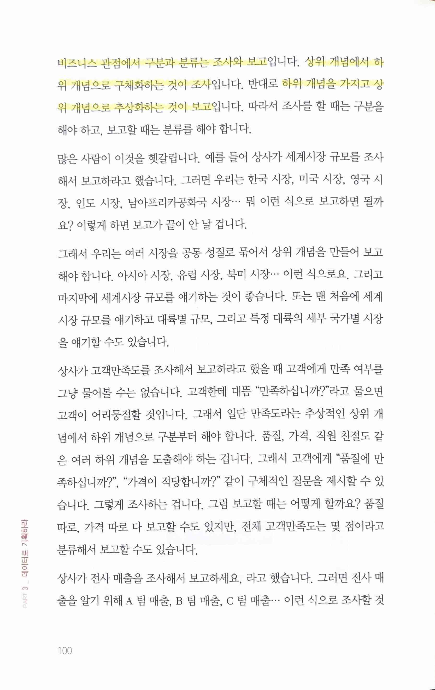

> 비즈니스 관점에서 구분과 분류는 조사와 보고. 상위 개념에서 하위 개념으로 구체화하는 것이 `조사`. 반대로 하위 개념을 가지고 상위 개념으로 추상화하는 것이 `보고`

> `MECE Mutually Exclusive Collectively Exhaustive` `상호 배제` 중복되는 요소가 있으면 안 된다 `전체 포괄` 누락이 없다
* SRP, DRY같은 설계의 원리와도 이어지지만, 그보다 loosely coupled, tightly cohesive가 더 직접적으로 연결되는 듯

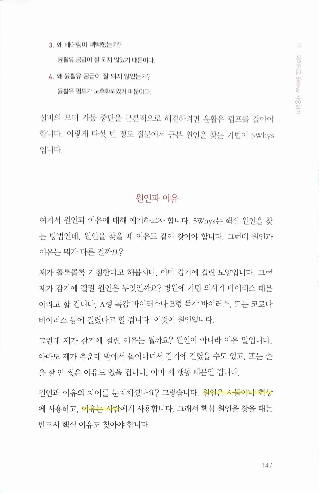 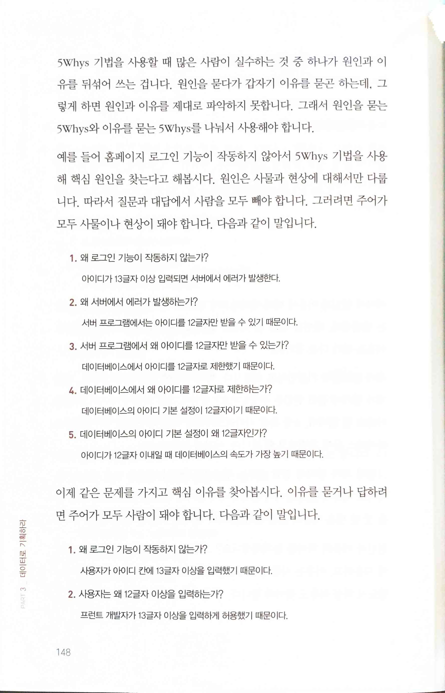 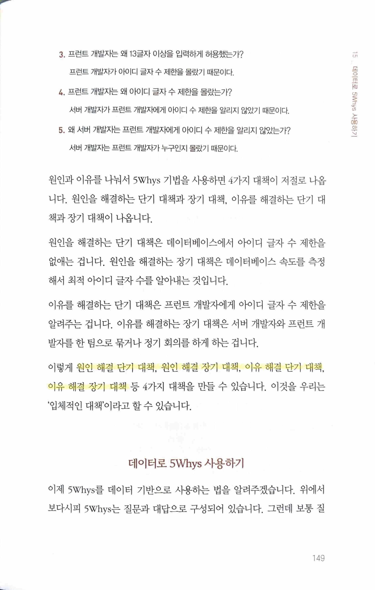

> `원인`은 사물이나 현상에 사용하고, `이유`는 사람에게 사용
* 이 부분은 찾아보면 여러가지 주장이 있는데, 사람/사물로 나누는 근거는 잘 모르겠다. 특별히 근거 자료가 있는 걸로 보이진 않음
> 원인 해결 단기 대책, 원인 해결 장기 대책, 이유 해결 단기 대책, 이유 해결 장기 대책 등 4가지 대책

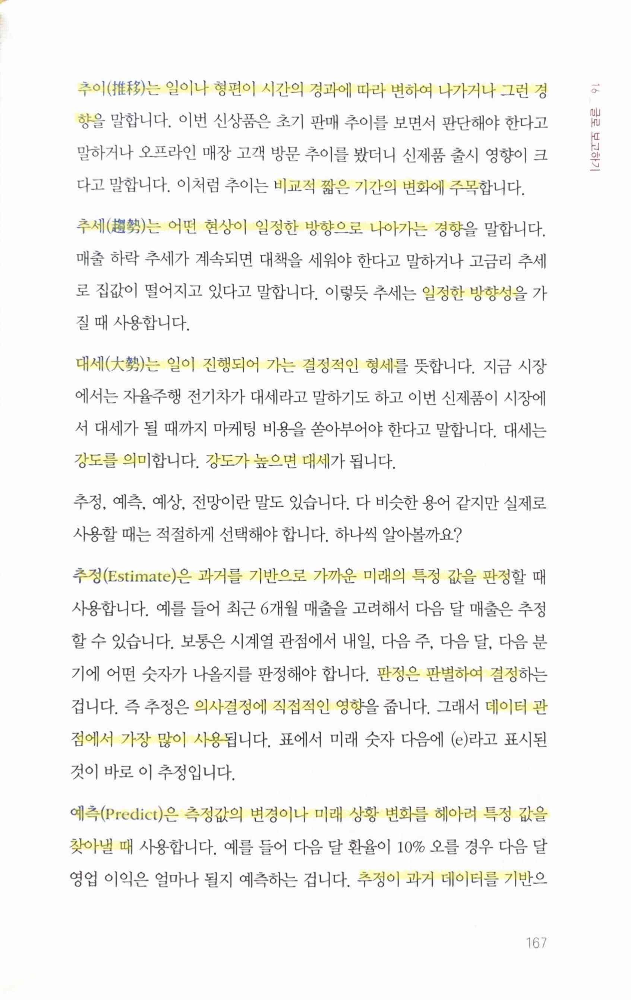 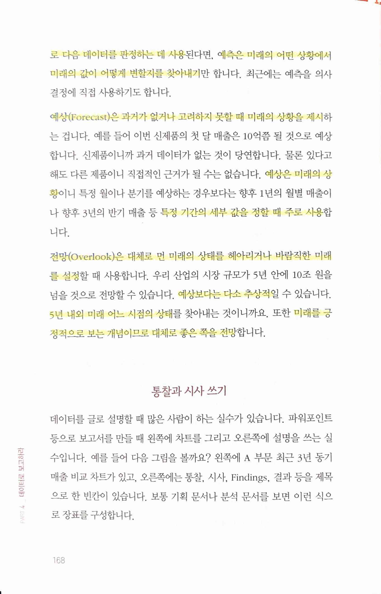

> `추이(推移)` 일이나 형편이 시간의 경과에 따라 변하여 나가거나 그런 경향. 비교적 짧은 기간의 변화에 주목
>
> `추세(勢)` 어떤 현상이 일정한 방향으로 나아가는 경향. 일정한 방향성을 가질 때 사용
>
> `대세(大勢)` 일이 진행되어 가는 결정적인 형세. 강도 의미. 강도가 높으면 대세
>
> `추정(Estimate)` 과거를 기반으로 가까운 미래의 특정 값을 판정할 때 사용. 판정은 판별하여 결정. 의사결정에 직접적인 영향. 데이터 관점에서 가장 많이 사용
>
> `예측(Predict)` 측정값의 변경이나 미래 상황 변화를 헤아려 특정 값을 찾아낼 때 사용. 추정이 과거 데이터를 기반으로 다음 데이터를 판정하는 데 사용, 예측은 미래의 어떤 상황에서 미래의 값이 어떻게 변할지를 찾아내기만
>
> `예상(Forecast)` 과거가 없거나 고려하지 못할 때 미래의 상황을 제시. 예상은 미래의 상황. 특정 기간의 세부 값을 정할 때 주로 사용
>
> `전망(Overlook)` 대체로 먼 미래의 상태를 헤아리거나 바람직한 미래를 설정할 때 사용. 예상보다는 다소 추상적. 5년 내외 미래 어느 시점의 상태. 미래를 긍정적으로 보는 개념이므로 대체로 좋은 쪽을 전망

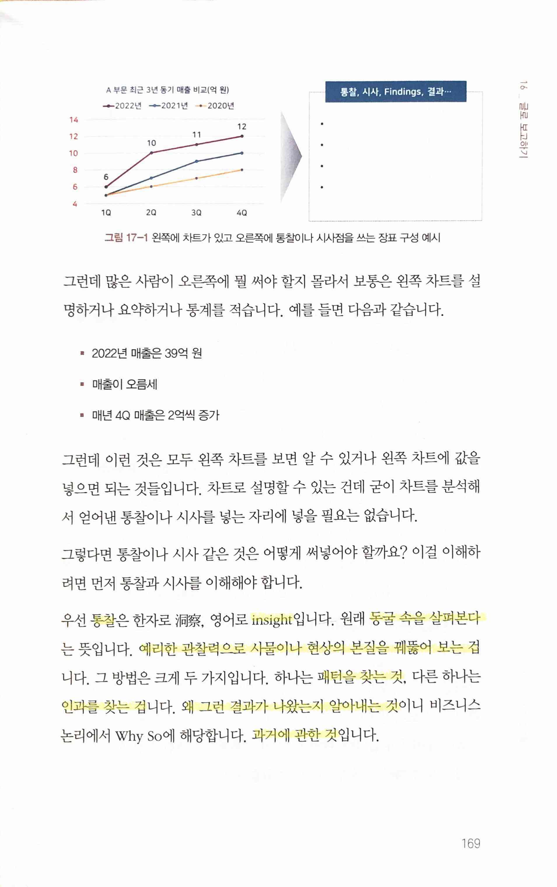  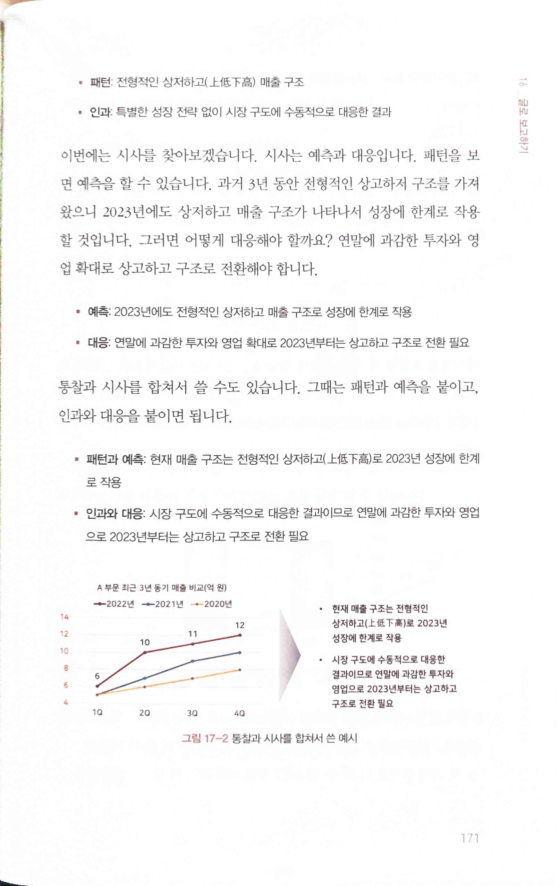

> `통찰 insight` 원래 동굴 속을 살펴본다는 뜻. 예리한 관찰력으로 사물이나 현상의 본질을 꿰뚫어 보는 것. 패턴/인과를 찾는 것. 왜 그런 결과가 나왔는지 알아내는 것. 과거에 관한 것
>
> `시사 implication` 무언가를 보여주고 부추긴다는 뜻. 어떤 것을 미리 간접적으로 표현해 주고 뭔가를 하라고 부추기는 것. 예측/대응. 미래에 관한 것
>
> • 통찰(과거, Why So): 패턴 + 인과
>
> • 시사(미래, So What): 예측 + 대응

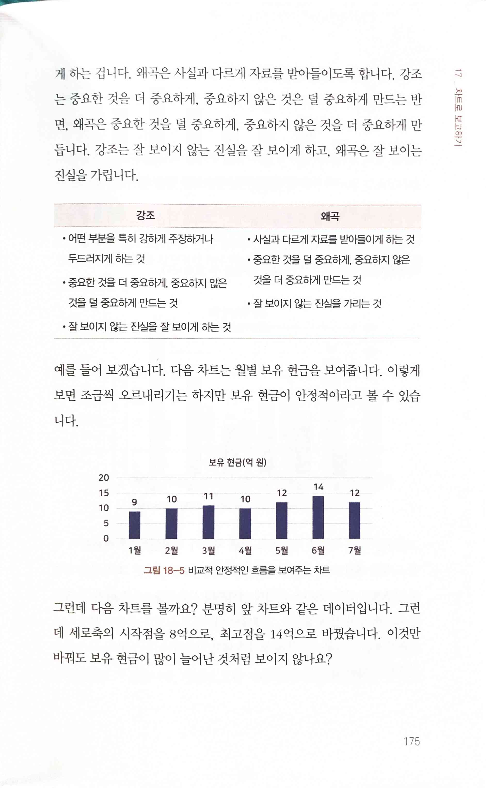

> 강조, 왜곡

> 목표는 무한. 그래서 어떤 것을 목표로 선정할지가 중요

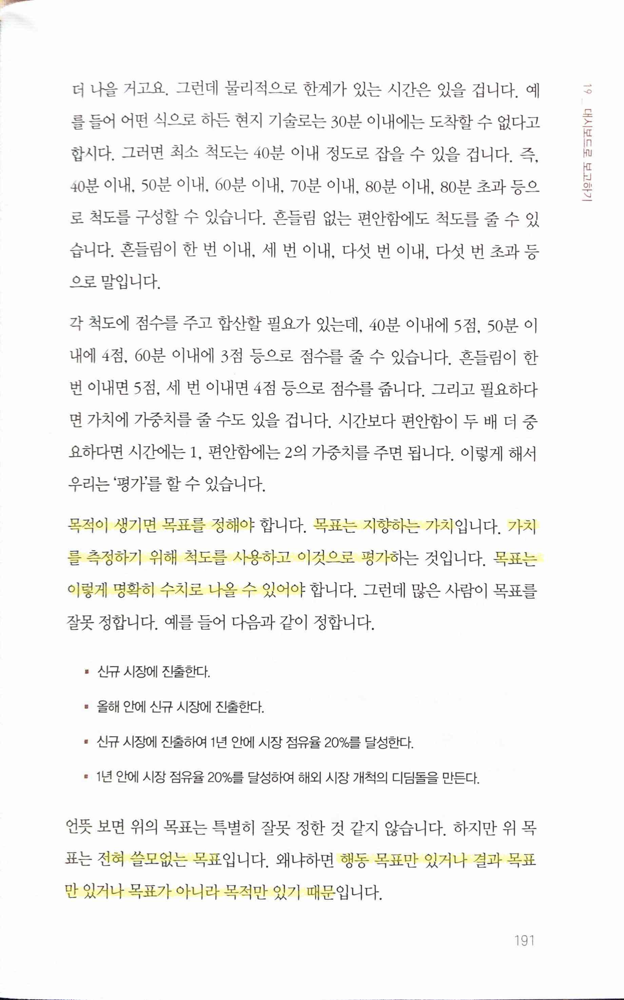 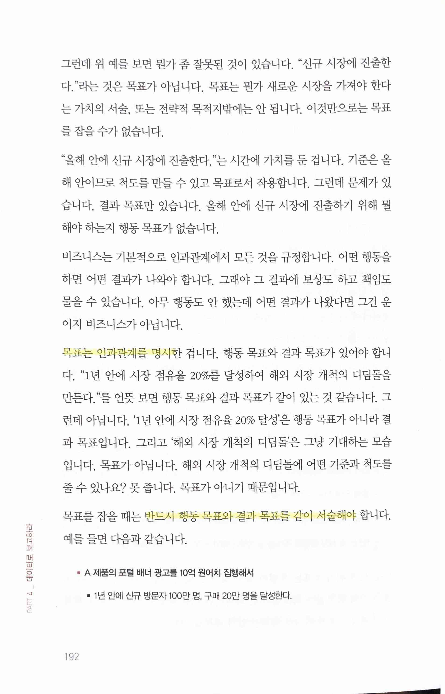

> 목적이 생기면 목표를 정해야. `목표`는 지향하는 가치. 가치를 측정하기 위해 척도를 사용하고 이것으로 평가. 목표는 이렇게 명확히 수치로 나올 수 있어야
>
> 전혀 쓸모없는 목표 행동 목표만 있거나 결과 목표만 있거나 목표가 아니라 목적만 있기 때문
>
> 목표는 인과관계를 명시
>
> 반드시 행동 목표와 결과 목표를 같이 서술해야

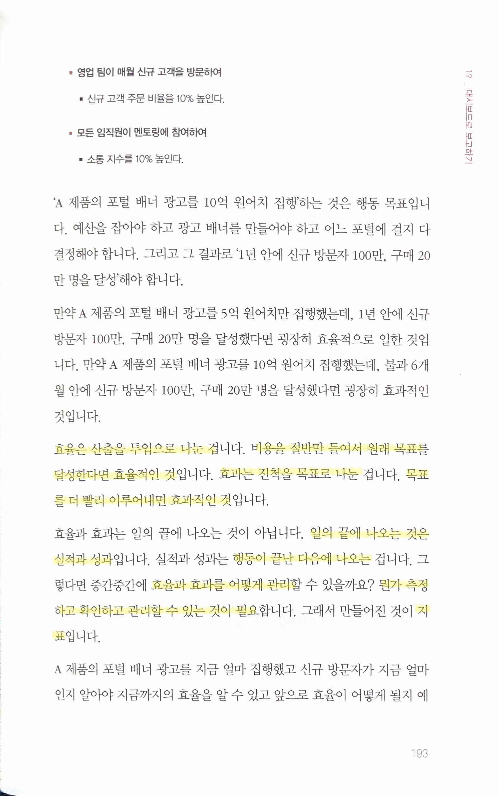 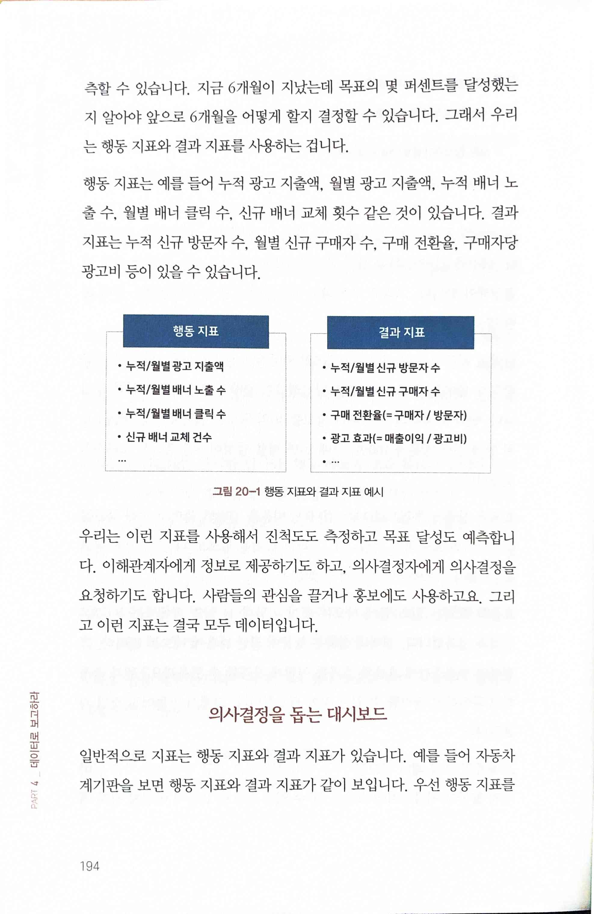

> `효율`은 산출을 투입으로 나눈 겁니다. 비용을 절반만 들여서 원래 목표를 달성한다면 효율적인 것. `효과`는 진척을 목표로 나눈 겁니다. 목표를 더 빨리 이루어내면 효과적인 것
* 이 역시 좀 자의적인 해석이 아닐까 싶음. 이 비용/속도보다는 피터 드러커의 설명이 훨씬 와 닿는다
  * `Efficiency is doing things right; effectiveness is doing the right things. Peter Drucker`
* 아니면 Effectiveness를 더 중시하는 Klaus Bucka-Lassen의 설명도 좋음
  * [Agility is Inefficient • Klaus Bucka-Lassen & Dirk Bucka-Lassen • GOTO 2022 - YouTube](https://www.youtube.com/watch?v=BvydomrrdyQ)
> 일의 끝에 나오는 것은 실적과 성과, 행동이 끝난 다음에 나오는 겁니다. 효율과 효과는 뭔가 측정하고 확인하고 관리할 수 있는 것이 필요. 그래서 만들어진 것이 지표

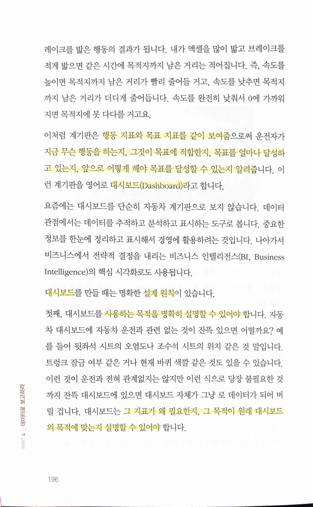 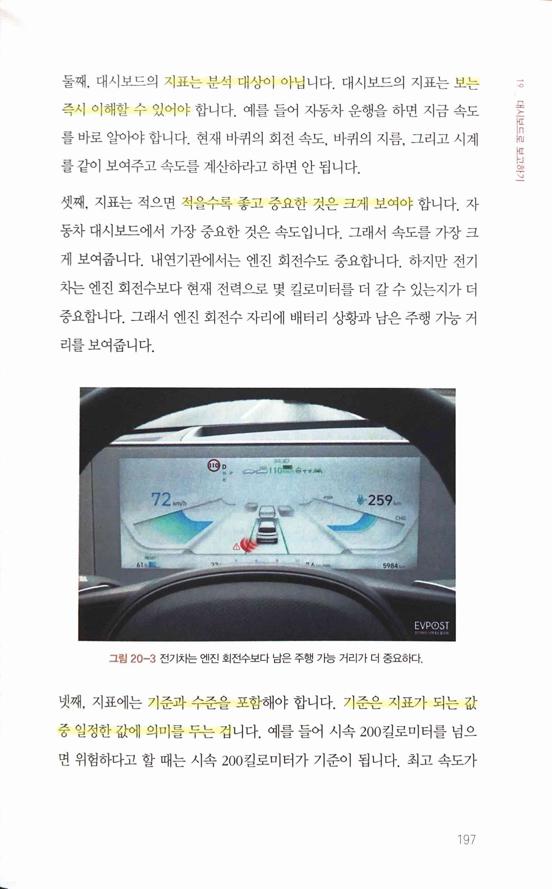 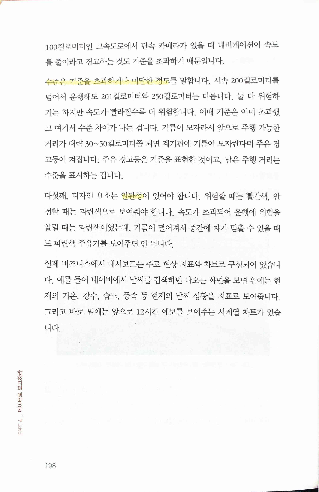

> 행동 지표와 목표 지표를 같이 보여줌. 지금 무슨 행동을 하는지, 그것이 목표에 적합한지, 목표를 얼마나 달성하고 있는지, 앞으로 어떻게 해야 목표를 달성할 수 있는지 알려주는 계기판을 영어로 대시보드(Dashboard)
>
> 대시보드 설계 원칙
>
> 사용하는 목적을 명확히 설명. 그 지표가 왜 필요한지, 그 목적이 원래 대시보드의 목적에 맞는지 설명할 수 있어야
>
> 지표는 분석 대상이 아니고 보는 즉시 이해할 수 있어야
>
> 지표는 적으면 적을수록 좋고 중요한 것은 크게 보여야
>
> 지표에는 기준과 수준 포함. 기준은 지표가 되는 값중 일정한 값에 의미를 두는 것. 수준은 기준을 초과하거나 미달한 정도
>
> 디자인 요소는 일관성이 있어야

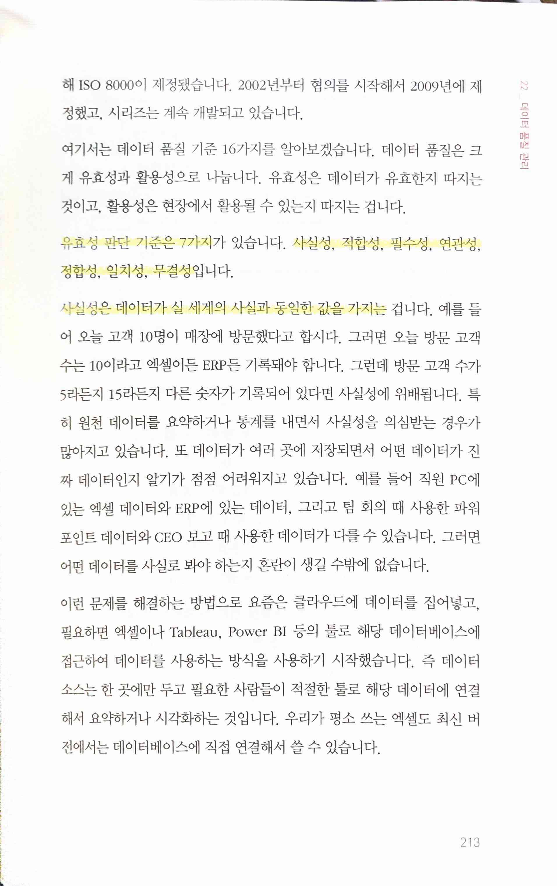

> 유효성 판단 기준 7가지. 사실성, 적합성, 필수성, 연관성, 정합성, 일치성, 무결성
>
> `사실성` 데이터가 실 세계의 사실과 동일한 값을 가지는 것

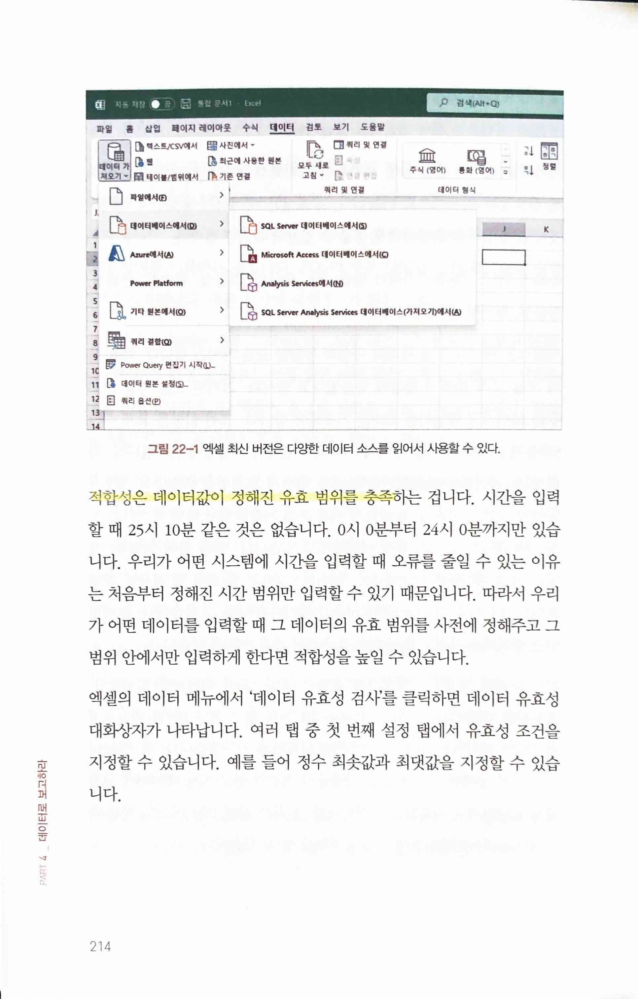

> `적합성` 데이터값이 정해진 유효 범위를 충족

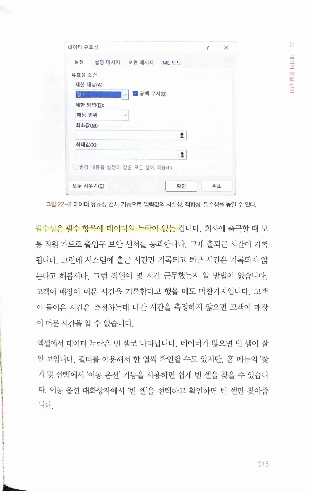

> `필수성` 필수 항목에 데이터의 누락이 없는

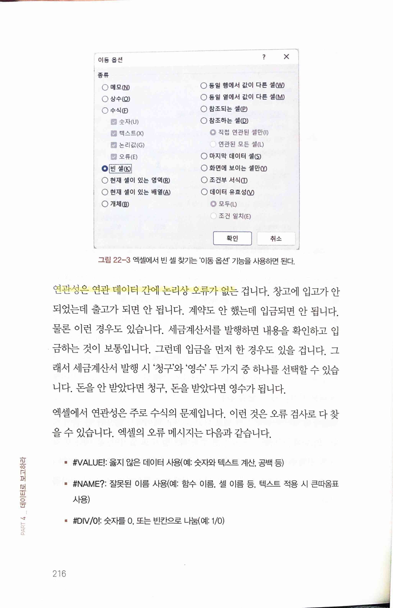

> `연관성` 연관 데이터 간에 논리상 오류가 없는

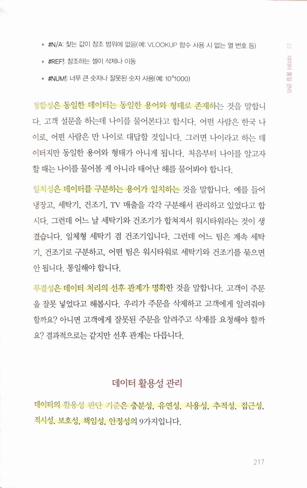

> `정합성` 동일한 데이터는 동일한 용어와 형태로 존재
>
> `일치성` 데이터를 구분하는 용어가 일치
>
> `무결성` 데이터 처리의 선후 관계가 명확

 

> 데이터의 활용성 판단 기준은 충분성, 유연성, 사용성, 추적성, 접근성,적시성, 보호성, 책임성, 안정성 9가지
>
> `충분성` 데이터가 사용자의 요구사항 충족
>
> `유연성` 데이터가 유연한 구조를 가지는 것
>
> `사용성` 데이터가 현장에서 실제로 사용
>
> `추적성` 데이터 변경 내역 관리
>
> `접근성` 데이터를 쉽게 사용
>
> `적시성` 필요할 때 데이터를 볼 수 있는 것
>
> `보호성` 데이터가 훼손, 변조, 유출 등의 위협에서 안전
>
> `책임성` 데이터의 접근 권한과 책임이 정해져 있는 것
>
> `안전성` 데이터를 소실해도 빨리 복구 가능