# 도메인 주도 개발 시작하기
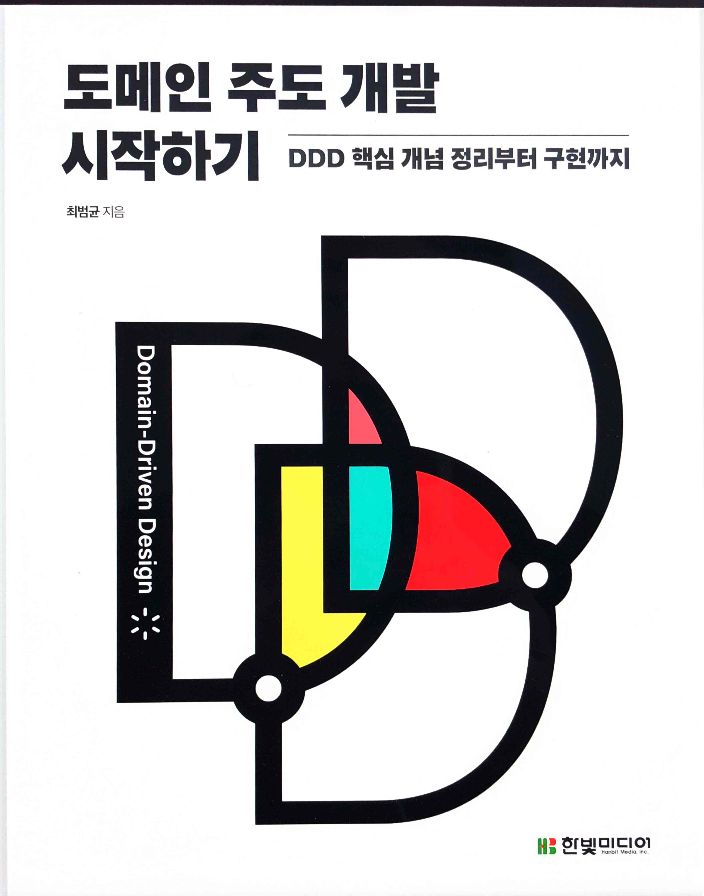

* 개발 세계에는 여러가지 개발 방법론이 많다. 가장 유명한 건 아무래도 TDD이겠지만, 최근 가장 각광받는 건 DDD라고 생각한다. 그 이유는 아마 세상의 수많은 software는 대부분 현실의 문제를 해결하기 위해 만들었을텐데, 그걸 해결하는 게 여전히 힘들기 때문이라고 생각한다.
* 현실의 문제를 해결하는 게 아직도 힘든 이유도 여러가지가 있겠지만, 그 중 하나는 비즈니스를 하는 사람들과 개발자들간의 간극에 있다. 개발자들은 요구 사항에 맞춰 서비스를 만들(었다고 생각하)지만, 비즈니스를 하는 사람들은 내가 요구한 게 아니라는, 이 업계가 탄생한 순간부터 발생했던 문제. 애자일 방법론도 사실 이 문제 때문에 나오지 않았던가. 동작하는 소프트웨어를 전달하기 위해서.
* DDD는 이런 간극을 좁히기 위한 고민의 산물이다. 그래서 오히려 초반에 'Garbage in garbage out'이라는 이 업계의 유명한 문구와 함께 도메인 전문가가 같이 개발에 참여해야 한다는 걸 이야기한다. 또 도메인 전문가의 요구 사항도 항상 옳은 건 아니라는 점을 알려준다. 즉 개발자와 도메인 전문가는 같은 도메인의 비즈니스 문제를 해결하기 위해 상호 작용을 하며 고민을 통해 문제를 해결해야 한다는 지극히 상식적인, 커뮤니케이션 문제부터 짚고 간다(그리고 이게 사실 애자일 선언문의 이야기이기도 하다) . 또 서로간의 소통을 해결하기 위해 용어를 통일해 모호함을 줄이고 이런 용어 역시 계속 업데이트해야 한다는 점도(소프트웨어 뿐만 아니라 문서도 지속적인 업데이트가 필요한데 이걸 모르는 경우가 참 많다).
* 도메인, 애그리거트, 계층 구조, 바운디드 컨텍스트 등 각 용어의 의미와 구조를 그림과 코드를 통해 설명하기 때문에 하나씩 따라가기도 좋다. 또 이 책을 읽다보면 처음부터 생각할 수도 있겠지만, 결국 이런 도메인 구조에 따라 코드를 작성하는 게 MSA와 바로 연결된다는 걸 알 수 있다. DDD를 계속해서 파고들었던 저자가 쓴 책인데다가 번역서가 아니라서 참 읽기도 자연스럽고 편하다는 점이 더 좋기도 하다.
* 여담으로 저자의 책 중에 DDD Start라는 책이 있는데, 그래서 그런지 이번 책의 github repository 이름이 ddd-start2이다.

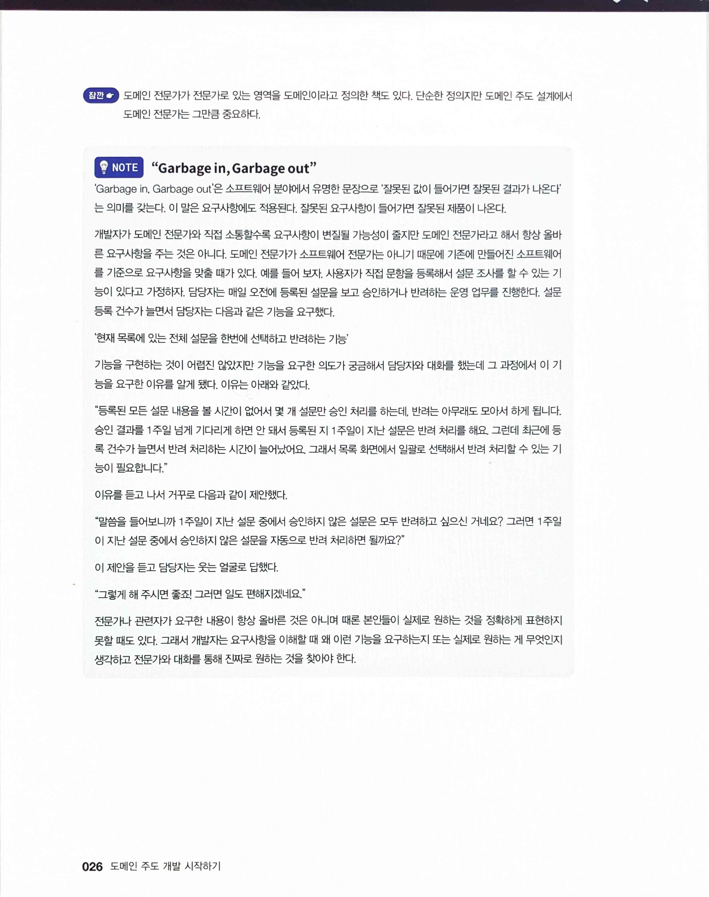

* `'Garbage in. Garbage out'은 소프트웨어 분야에서 유명한 문장으로 '잘못된 값이 들어가면 잘못된 결과가 나온다.는 의미를 갖는다. 이 말은 요구사항에도 적용된다. 잘못된 요구사항이 들어가면 잘못된 제품이 나온다.`
* `개발자가 도메인 전문가와 직접 소통할수록 요구사항이 변질될 가능성이 줄지만 도메인 전문가라고 해서 항상 올바른 요구사항을 주는 것은 아니다. 도메인 전문가가 소프트웨어 전문가는 아니기 때문에 기존에 만들어진 소프트웨어를 기준으로 요구사항을 맞출 때가 있다.`
* `전문가나 관련자가 요구한 내용이 항상 올바른 것은 아니며 때론 본인들이 실제로 원하는 것을 정확하게 표현하지 못할 때도 있다. 그래서 개발자는 요구사항을 이해할 때 왜 이런 기능을 요구하는지 또는 실제로 원하는 게 무엇인지 생각하고 전문가와 대화를 통해 진짜로 원하는 것을 찾아야 한다.`

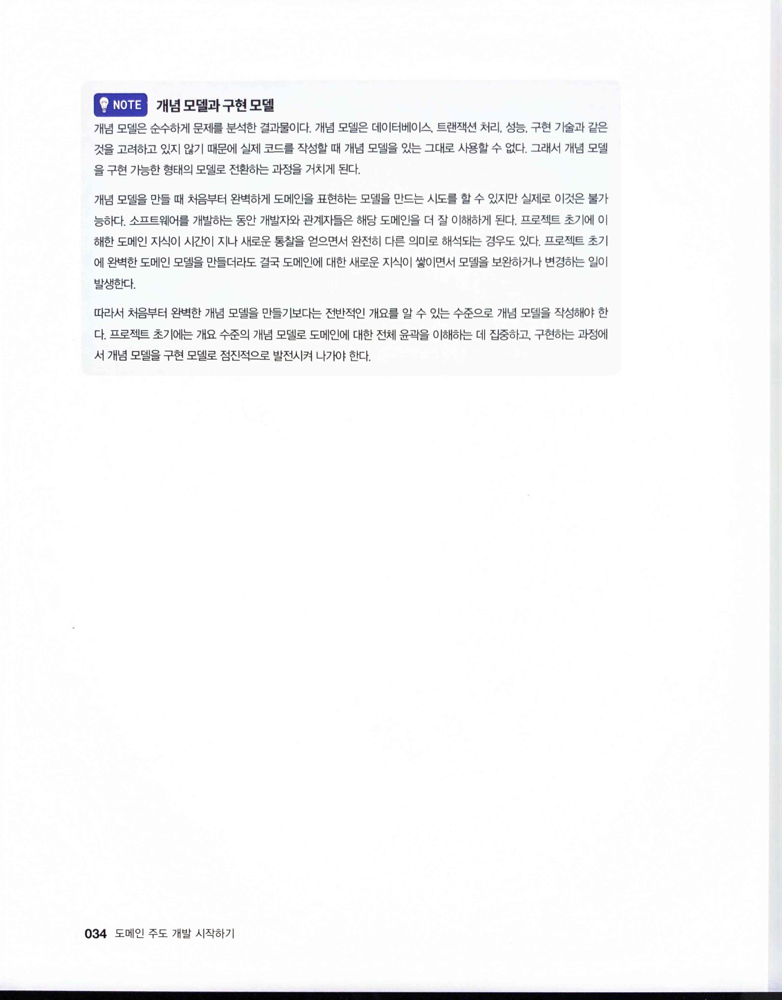

* `프로젝트 초기에는 개요 수준의 개념 모델로 도메인에 대한 전체 윤곽을 이해하는 데 집중하고, 구현하는 과정에서 개념 모델을 구현 모델로 점진적으로 발전시켜 나가야 한다.`

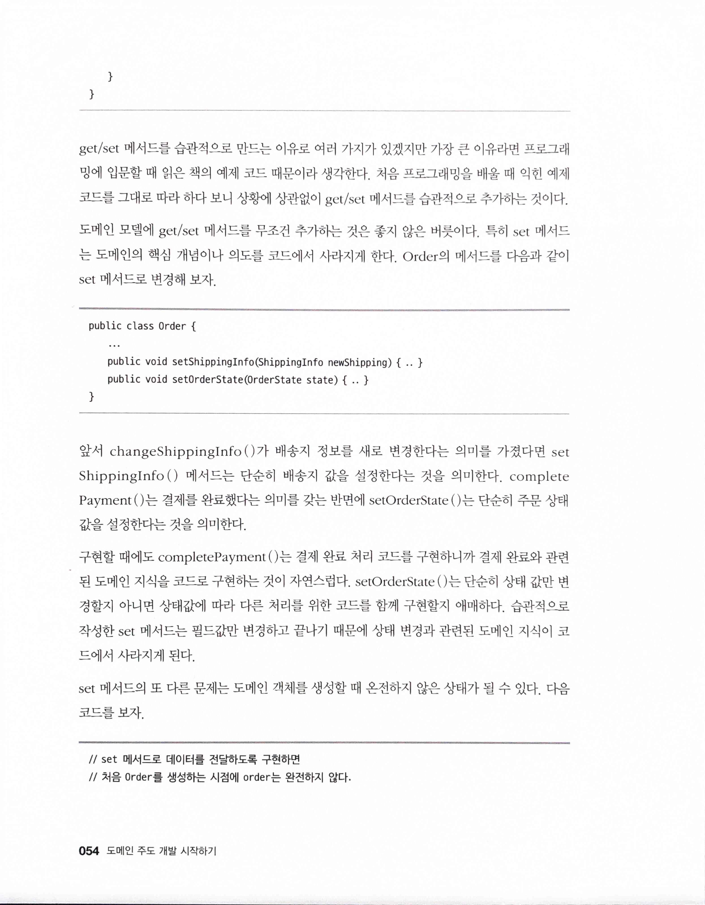

* `도메인 모델에 get/set 메서드를 무조건 추가하는 것은 좋지 않은 버릇이다. 특히 set 메서드는 도메인의 핵심 개념이나 의도를 코드에서 사라지게 한다.`

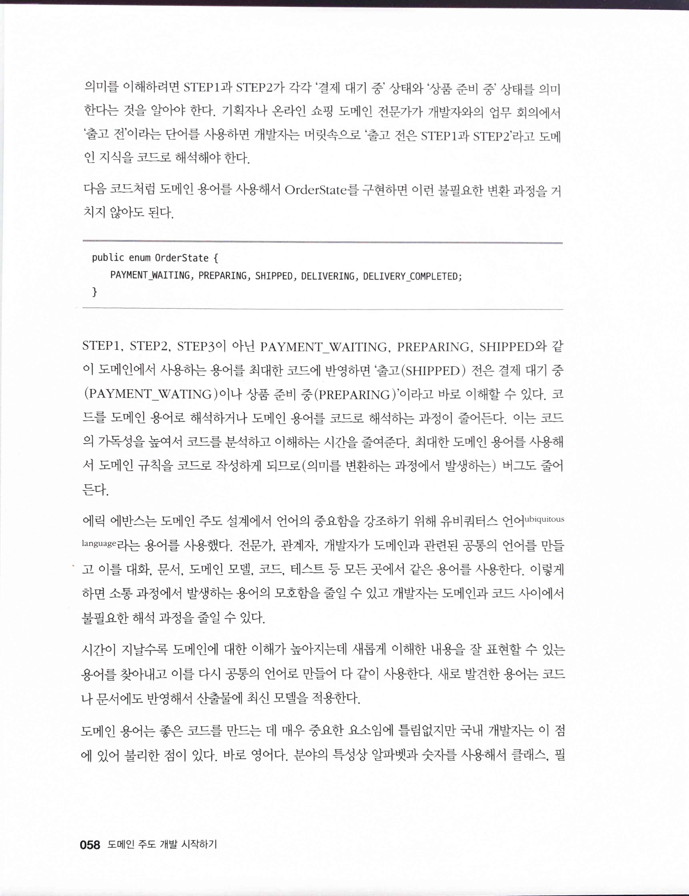

* `에릭 에반스는 도메인 주도 설계에서 언어의 중요함을 강조하기 위해 유비쿼터스 언어 ubiquitous Language라는 용어를 사용했다. 전문가, 관계자, 개발자가 도메인과 관련된 공통의 언어를 만들고 이를 대화, 문서, 도메인 모델, 코드, 테스트 등 모든 곳에서 같은 용어를 사용한다. 이렇게 하면 소통 과정에서 발생하는 용어의 모호함을 줄일 수 있고 개발자는 도메인과 코드 사이에서 불필요한 해석 과정을 줄일 수 있다.`
* `시간이 지날수록 도메인에 대한 이해가 높아지는데 새롭게 이해한 내용을 잘 표현할 수 있는 용어를 찾아내고 이를 다시 공통의 언어로 만들어 다 같이 사용한다. 새로 발견한 용어는 코드나 문서에도 반영해서 산출물에 최신 모델을 적용한다.`

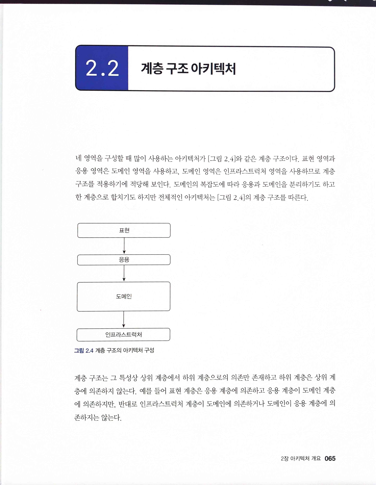

* `계층 구조는 그 특성상 상위 계층에서 하위 계층으로의 의존만 존재하고 하위 계층은 상위 계충에 의존하지 않는다. 예를 들어 표현 계층은 응용 계층에 의존하고 응용 계층이 도메인 계층에 의존하지만, 반대로 인프라스트럭처 계층이 도메인에 의존하거나 도메인이 응용 계층에 의존하지는 않는다.`

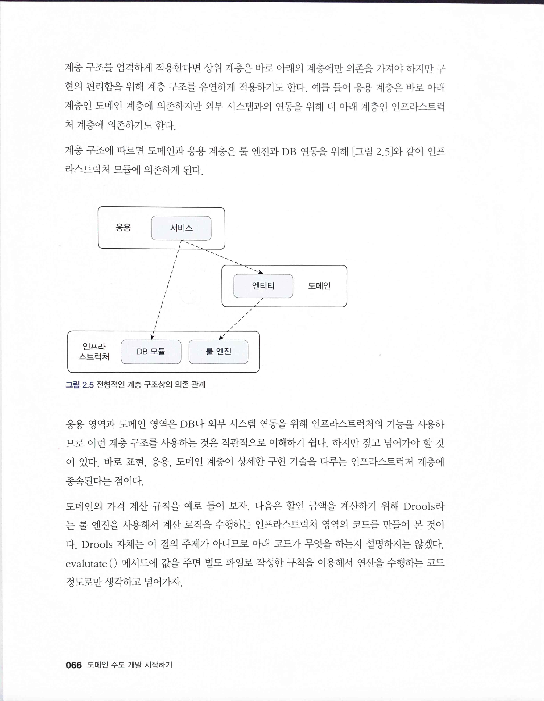

* `응용 영역과 도메인 영역은 DB나 외부 시스템 연동을 위해 인프라스트럭처의 기능을 사용하므로 이런 계층 구조를 사용하는 것은 직관적으로 이해하기 쉽다. 하지만 짚고 넘어가야 할 것이 있다. 바로 표현, 응용, 도메인 계층이 상세한 구현 기술을 다루는 인프라스트럭처 계층에 종속된다는 점이다.`

* `인프라스트럭처에 의존하면 '테스트 어려움'과 '기능 확장의 어려움'이라는 두 가지 문제가 발생하는 것을 알게 되었다. 그렇다면 어떻게 해야 이 두 문제를 해소할 수 있을까?? 해답은 DIP에 있다.`

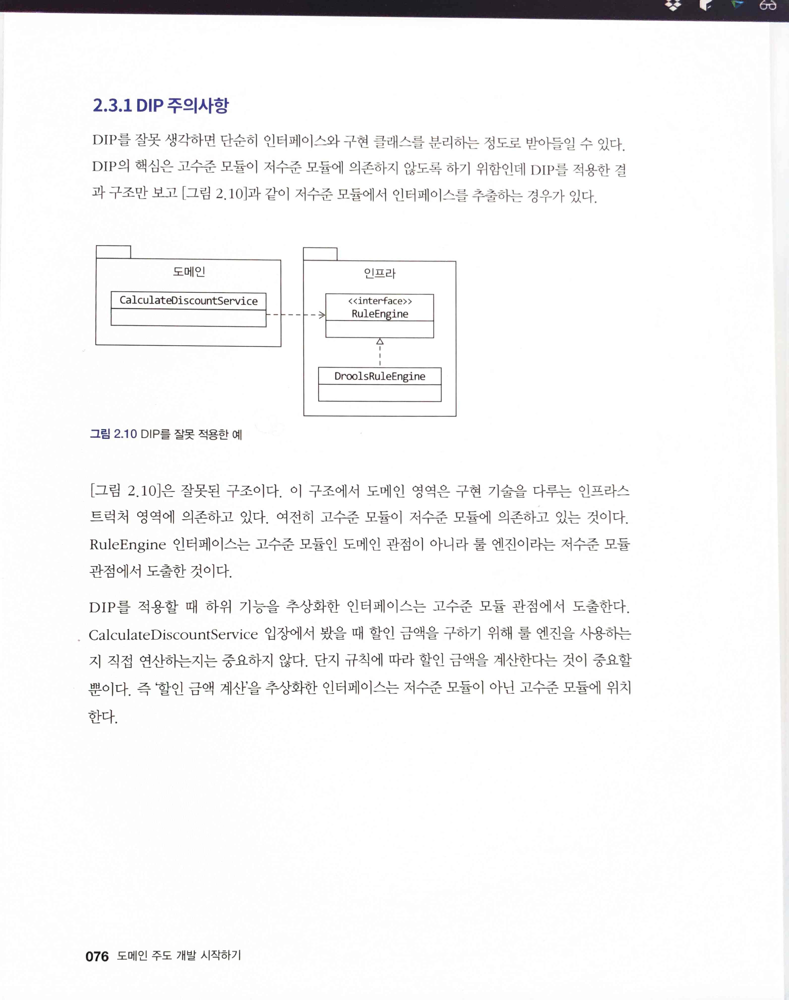

* `DIP를 적용할 때 하위 기능을 추상화한 인터페이스는 고수준 모듈 관점에서 도출한다.`

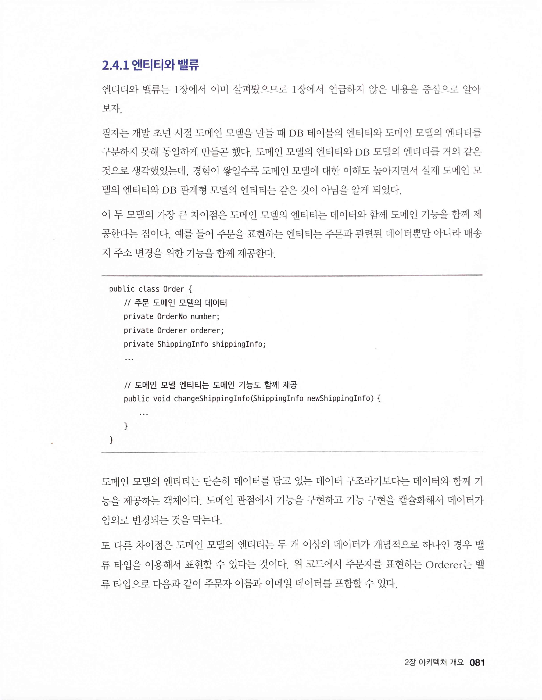

* `실제 도메인 모델의 엔티티와 DB 관계형 모델의 엔티티는 같은 것이 아님`
* `도메인 모델의 엔티티는 단순히 데이터를 담고 있는 데이터 구조라기보다는 데이터와 함께 기능을 제공하는 객체이다. 도메인 관점에서 기능을 구현하고 기능 구현을 캡슐화해서 데이터가 임의로 변경되는 것을 막는다.`
* `또 다른 차이점은 도메인 모델의 엔티티는 두 개 이상의 데이터가 개념적으로 하나인 경우 밸류 타입을 이용해서 표현할 수 있다는 것이다.`

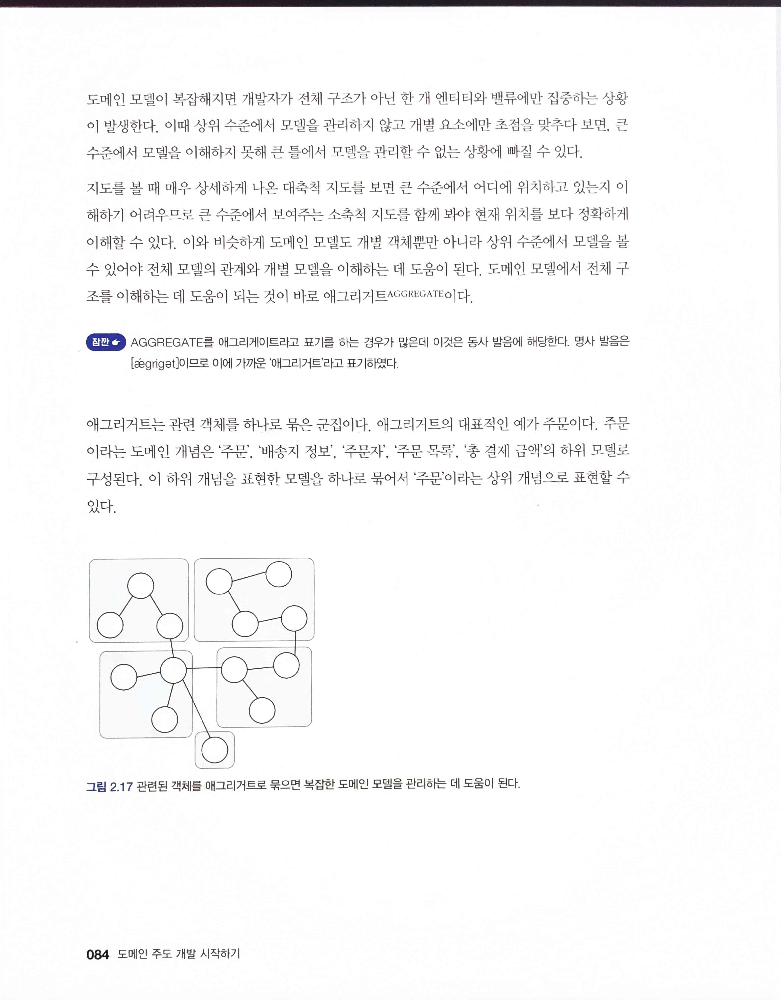

* `애그리거트는 관련 객체를 하나로 묶은 군집이다.`

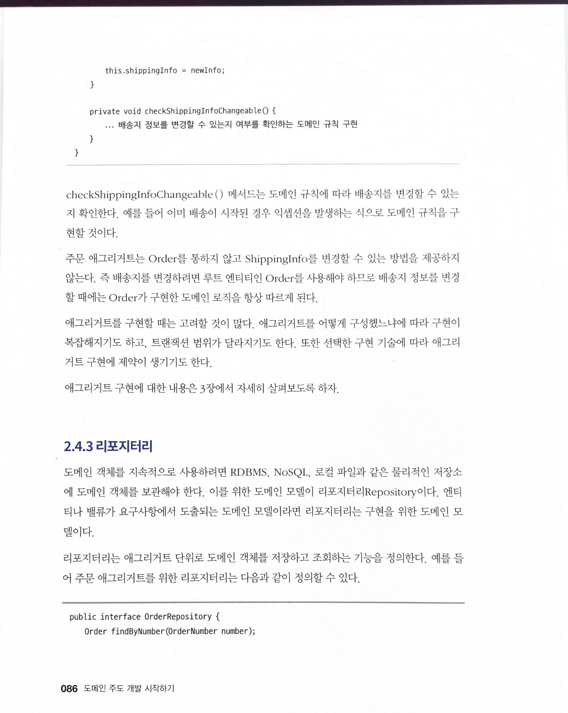

* `도메인 객체를 지속적으로 사용하려면 RDBMS, NoSQL, 로컬 파일과 같은 물리적인 저장소에 도메인 객체를 보관해야 한다. 이를 위한 도메인 모델이 리포지터리 Repository이다. 엔티티나 밸류가 요구사항에서 도출되는 도메인 모델이라면 리포지터리는 구현을 위한 도메인 모델이다.`
* `리포지터리는 애그리거트 단위로 도메인 객체를 저장하고 조회하는 기능을 정의한다.`

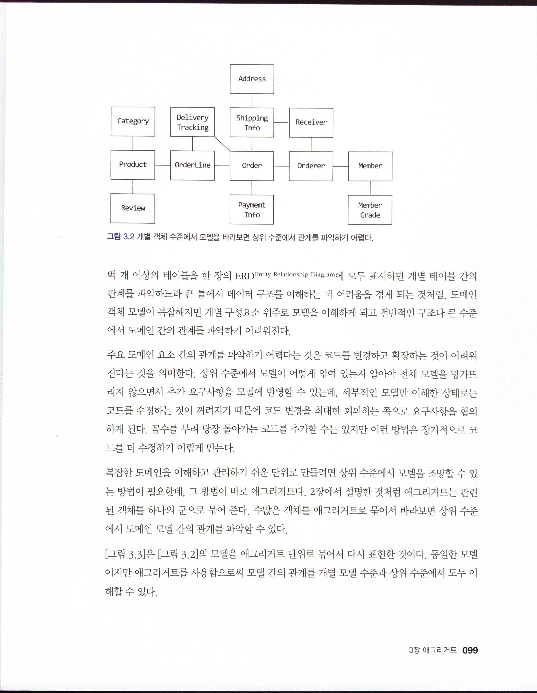

* `주요 도메인 요소 간의 관계를 파악하기 어렵다는 것은 코드를 변경하고 확장하는 것이 어려워진다는 것을 의미한다. 상위 수준에서 모델이 어떻게 엮여 있는지 알아야 전체 모델을 망가뜨리지 않으면서 추가 요구사항을 모델에 반영할 수 있는데, 세부적인 모델만 이해한 상태로는 코드를 수정하는 것이 꺼려지기 때문에 코드 변경을 최대한 회피하는 쪽으로 요구사항을 협의하게 된다.`
* `복잡한 도메인을 이해하고 관리하기 쉬운 단위로 만들려면 상위 수준에서 모델을 조망할 수 있는 방법이 필요한데, 그 방법이 바로 애그리거트다. 수많은 객체를 애그리거트로 묶어서 바라보면 상위 수준에서 도메인 모델 간의 관계를 파악할 수 있다.`

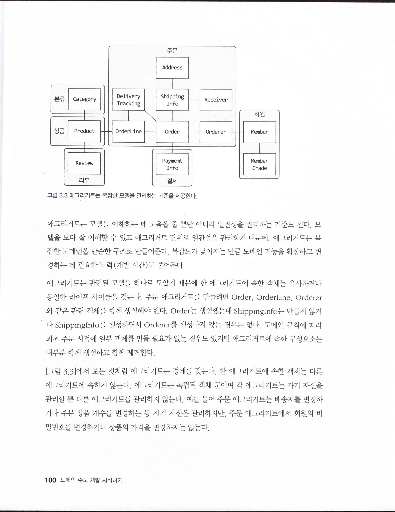

* `애그리거트는 경계를 갖는다. 한 애그리거트에 속한 객체는 다른 애그리거트에 속하지 않는다. 애그리거트는 독립된 객체 군이며 각 애그리거트는 자기 자신을 관리할 뿐 다른 애그리거트를 관리하지 않는다.`

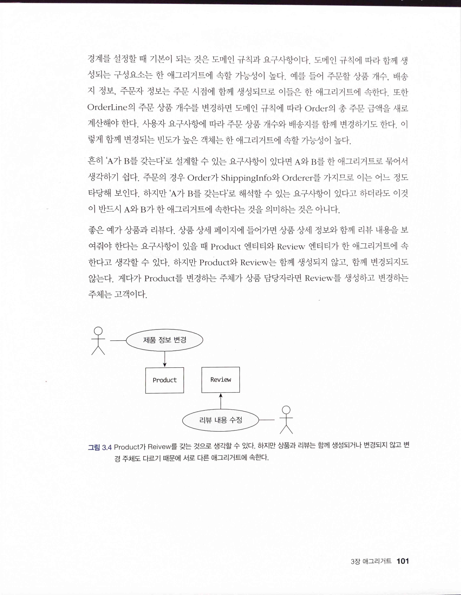

* `경계를 설정할 때 기본이 되는 것은 도메인 규칙과 요구사항이다. 도메인 규칙에 따라 함께 생성되는 구성요소는 한 애그리거트에 속할 가능성이 높다... 이렇게 함께 변경되는 빈도가 높은 객체는 한 애그리거트에 속할 가능성이 높다.`
* `하지만 'A가 B를 갖는다'로 해석할 수 있는 요구사항이 있다고 하더라도 이것이 반드시 A와 B가 한 애그리거트에 속한다는 것을 의미하는 것은 아니다. 함께 생성되거나 변경되지 않고 변경 주체도 다르면 서로 다른 애그리거트에 속한다.`

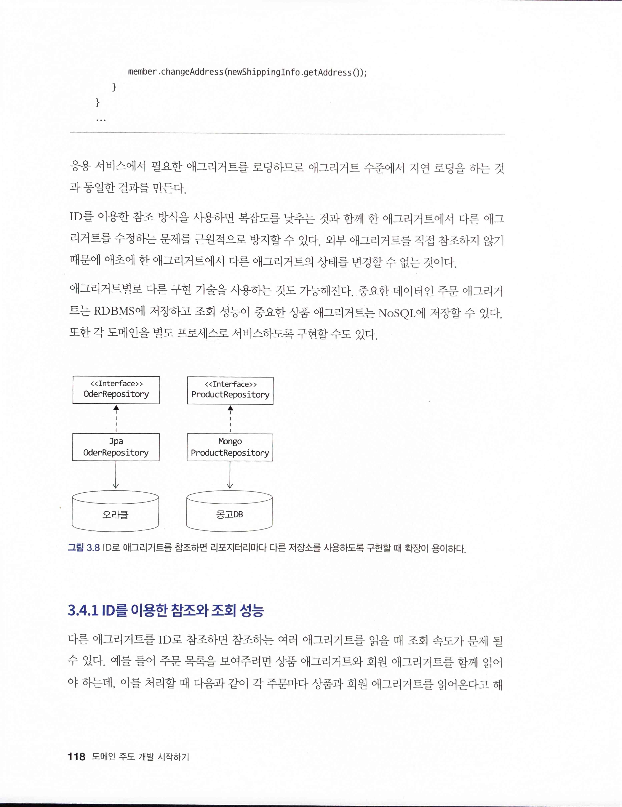

* `ID를 이용한 참조 방식을 사용하면 복잡도를 낮추는 것과 함께 한 애그리거트에서 다른 애그리거트를 수정하는 문제를 근원적으로 방지할 수 있다. 외부 애그리거트를 직접 참조하지 않기 때문에 애초에 한 애그리거트에서 다른 애그리거트의 상태를 변경할 수 없는 것이다.`
* `애그리거트별로 다른 구현 기술을 사용하는 것도 가능해진다.`

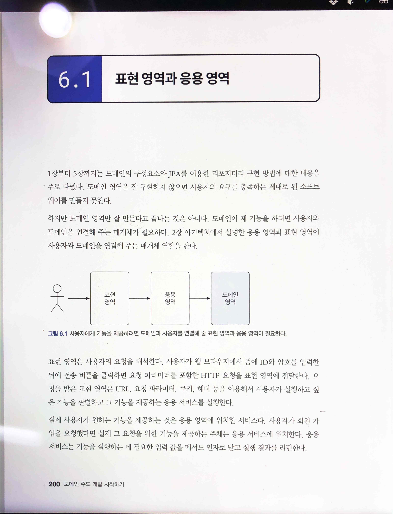 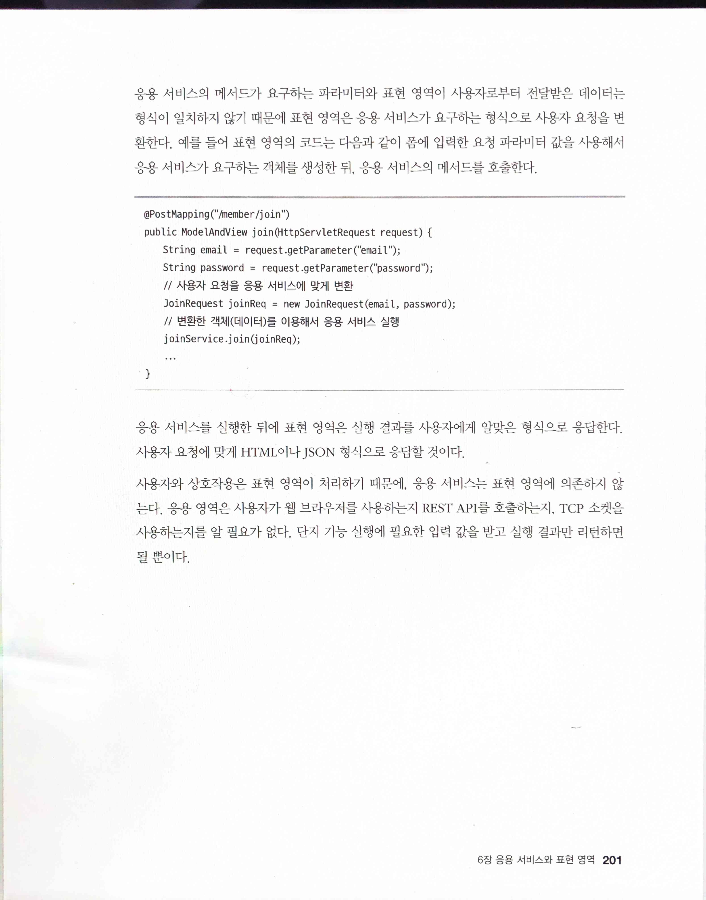

* `도메인 영역을 잘 구현하지 않으면 사용자의 요구를 충족하는 제대로 된 소프트웨어를 만들지 못한다.`
* `도메인이 제 기능을 하려면 사용자와 도메인을 연결해 주는 매개체가 필요하다. 응용 영역과 표현 영역이 사용자와 도메인을 연결해 주는 매개체 역할을 한다.`
* `표현 영역은 사용자의 요청을 해석한다. 사용자가 입력하면 HTTP 요청을 표현 영역에 전달한다. 요청을 받은 표현 영역은 사용자가 실행하고 싶은 기능을 판별하고 그 기능을 제공하는 응용 서비스를 실행한다.`
* `실제 사용자가 원하는 기능을 제공하는 것은 응용 영역에 위치한 서비스다. 사용자 요청을 위한 기능을 제공하는 주체는 응용 서비스에 위치한다. 응용 서비스는 기능을 실행하는 데 필요한 입력 값을 메서드 인자로 받고 실행 결과를 리턴한다.`
* `사용자와 상호작용은 표현 영역이 처리하기 때문에, 응용 서비스는 표현 영역에 의존하지 않는다. 응용 영역은 사용자가 웹 브라우저를 사용하는지 REST API를 호출하는지, TCP 소켓을 사용하는지를 알 필요가 없다. 단지 기능 실행에 필요한 입력 값을 받고 실행 결과만 리턴하면 될 뿐이다.`

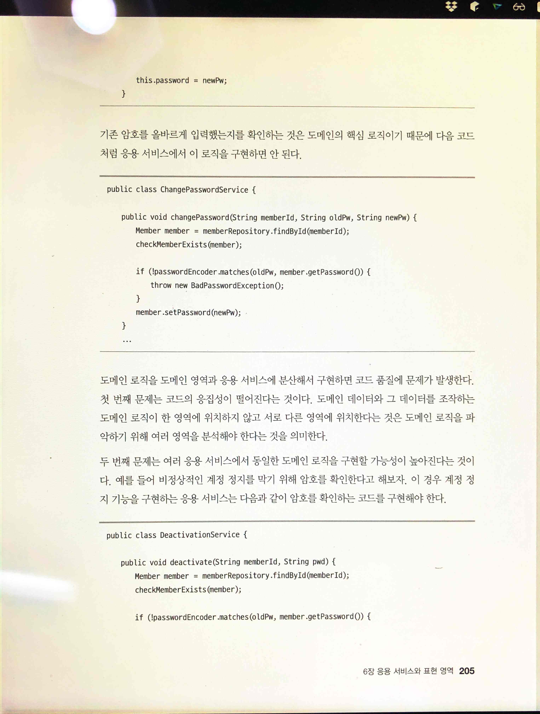 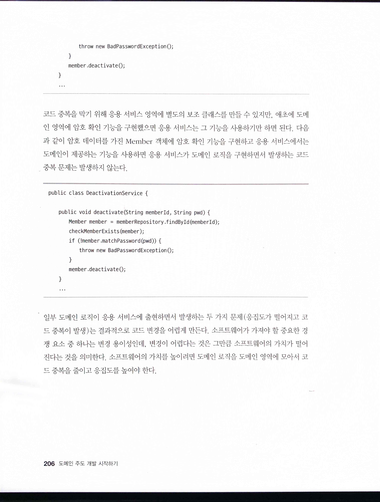

* `도메인 로직을 도메인 영역과 응용 서비스에 분산해서 구현하면 코드 품질에 문제가 발생한다. 첫 번째 문제는 코드의 응집성이 떨어진다는 것이다. 도메인 데이터와 그 데이터를 조작하는 도메인 로직이 한 영역에 위치하지 않고 서로 다른 영역에 위치한다는 것은 도메인 로직을 파악하기 위해 여러 영역을 분석해야 한다는 것을 의미한다.`
* `두 번째 문제는 여러 응용 서비스에서 동일한 도메인 로직을 구현할 가능성이 높아진다는 것이다.`
* `일부 도메인 로직이 응용 서비스에 출현하면서 발생하는 두 가지 문제 (응집도가 떨어지고 코드 중복이 발생)는 결과적으로 코드 변경을 어렵게 만든다. 소프트웨어가 가져야 할 중요한 경쟁 요소 중 하나는 변경 용이성인데, 변경이 어렵다는 것은 그만큼 소프트웨어의 가치가 떨어진다는 것을 의미한다. 소프트웨어의 가치를 높이려면 도메인 로직을 도메인 영역에 모아서 코드 중복을 줄이고 응집도를 높여야 한다.`

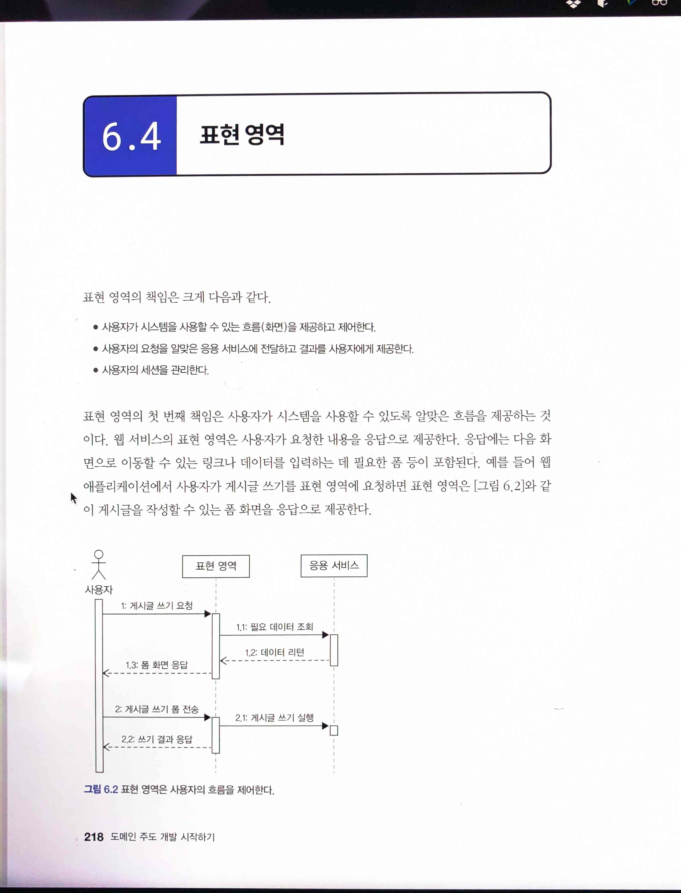

* `표현 영역의 책임`
  * `사용자가 시스템을 사용할 수 있는 흐름(화면)을 제공하고 제어한다.`
  * `사용자의 요청을 알맞은 응용 서비스에 전달하고 결과를 사용자에게 제공한다.`
  * `사용자의 세션을 관리한다.`

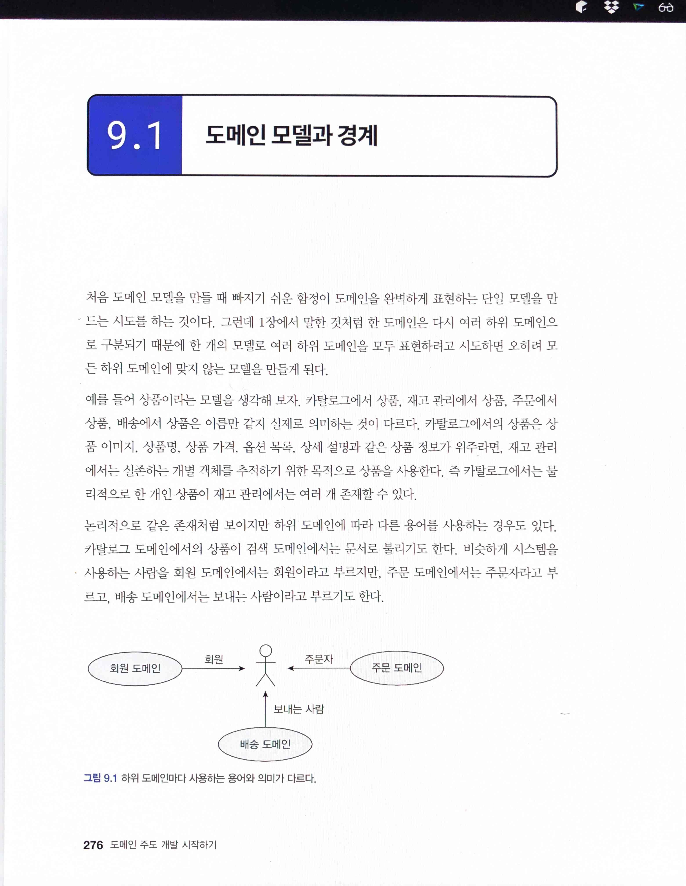 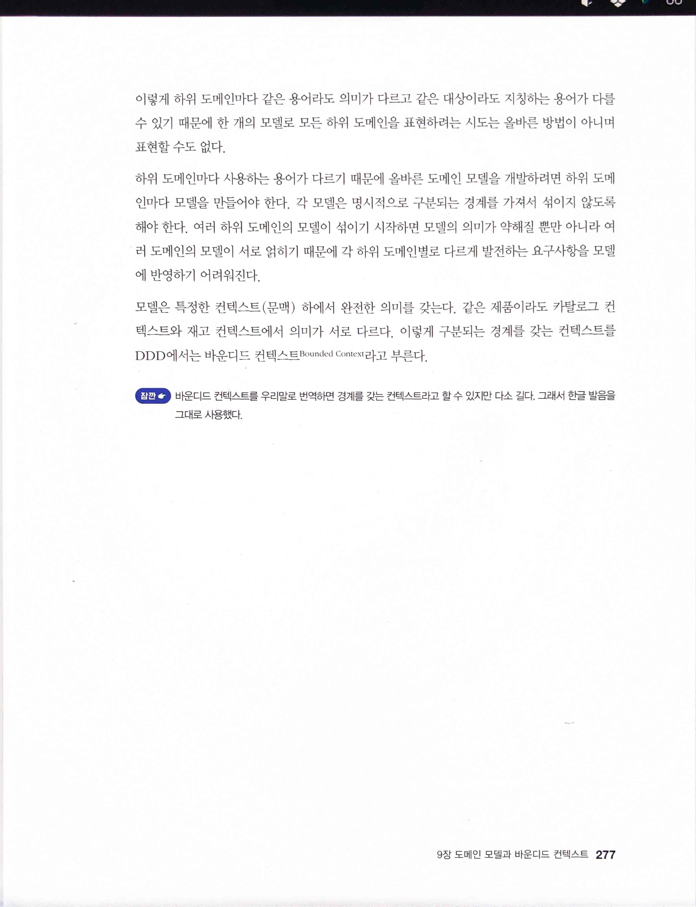

* `처음 도메인 모델을 만들 때 빠지기 쉬운 함정이 도메인을 완벽하게 표현하는 단일 모델을 만드는 시도를 하는 것이다. 그런데 한 도메인은 다시 여러 하위 도메인으로 구분되기 때문에 한 개의 모델로 여러 하위 도메인을 모두 표현하려고 시도하면 오히려 모든 하위 도메인에 맞지 않는 모델을 만들게 된다.`
* `하위 도메인마다 같은 용어라도 의미가 다르고 같은 대상이라도 지칭하는 용어가 다를 수 있기 때문에 한 개의 모델로 모든 하위 도메인을 표현하려는 시도는 올바른 방법이 아니며 표현할 수도 없다.`
* `하위 도메인마다 사용하는 용어가 다르기 때문에 올바른 도메인 모델을 개발하려면 하위 도메인마다 모델을 만들어야 한다. 각 모델은 명시적으로 구분되는 경계를 가져서 섞이지 않도록 해야 한다. 여러 하위 도메인의 모델이 섞이기 시작하면 모델의 의미가 약해질 뿐만 아니라 여러 도메인의 모델이 서로 얽히기 때문에 각 하위 도메인별로 다르게 발전하는 요구사항을 모델에 반영하기 어려워진다.`
* `모델은 특정한 컨텍스트(문맥) 하에서 완전한 의미를 갖는다. 같은 제품이라도 카탈로그 컨텍스트와 재고 컨텍스트에서 의미가 서로 다르다. 이렇게 구분되는 경계를 갖는 컨텍스트를 DDD에서는 바운디드 컨텍스트 Boundled Context 라고 부른다.`

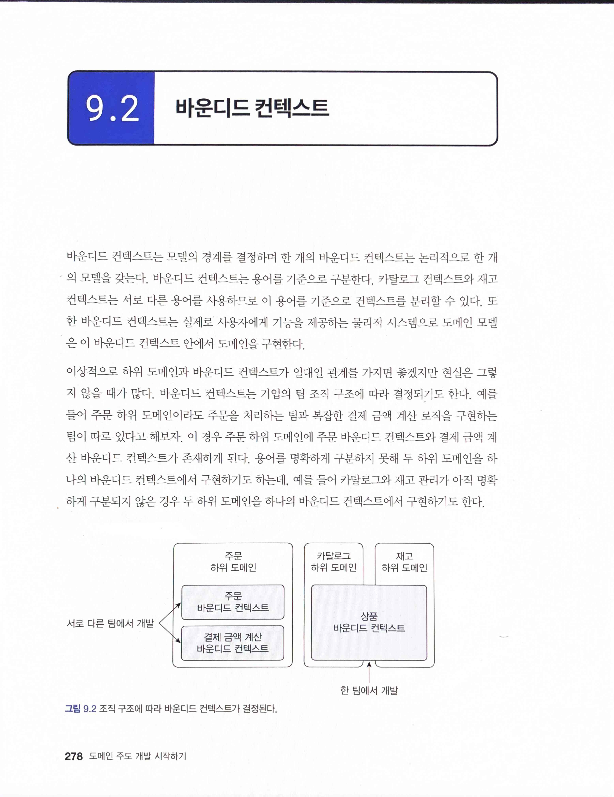

* `바운디드 컨텍스트는 모델의 경계를 결정하며 한 개의 바운디드 컨텍스트는 논리적으로 한 개의 모델을 갖는다. 바운디드 컨텍스트는 용어를 기준으로 구분한다. 바운디드 컨텍스트는 실제로 사용자에게 기능을 제공하는 물리적 시스템으로 도메인 모델은 이 바운디드 컨텍스트 안에서 도메인을 구현한다.`
* `이상적으로 하위 도메인과 바운디드 컨텍스트가 일대일 관계를 가지면 좋겠지만 현실은 그렇지 않을 때가 많다. 바운디드 컨텍스트는 기업의 팀 조직 구조에 따라 결정되기도 한다.`

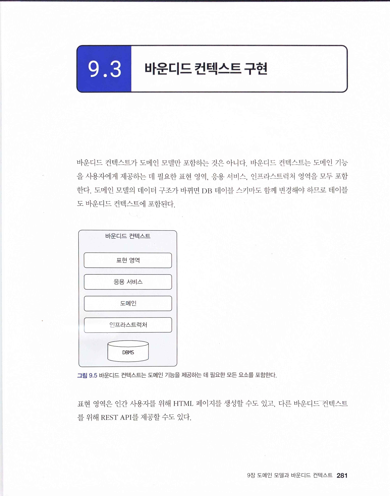

* `바운디드 컨텍스트가 도메인 모델만 포함하는 것은 아니다. 바운디드 컨텍스트는 도메인 기능을 사용자에게 제공하는 데 필요한 표현 영역, 응용 서비스, 인프라스트럭처 영역을 모두 포함한다. 도메인 모델의 데이터 구조가 바뀌면 DB 테이블 스키마도 함께 변경해야 하므로 테이블도 바운디드 컨텍스트에 포함된다.`

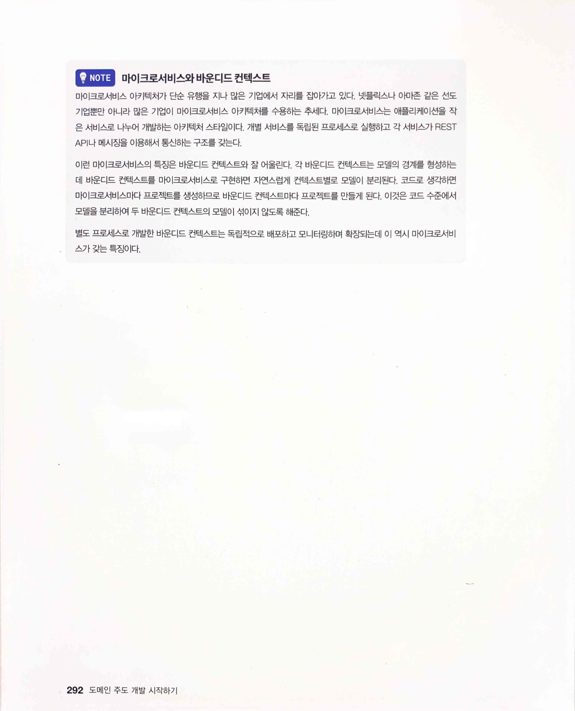

* `마이크로서비스의 특징은 바운디드 컨텍스트와 잘 어울린다. 각 바운디드 컨텍스트는 모델의 경계를 형성하는데 바운디드 컨텍스트를 마이크로서비스로 구현하면 자연스럽게 컨텍스트별로 모델이 분리된다. 코드로 생각하면 마이크로서비스마다 프로젝트를 생성하므로 바운디드 컨텍스트마다 프로젝트를 만들게 된다. 이것은 코드 수준에서 모델을 분리하여 두 바운디드 컨텍스트의 모델이 섞이지 않도록 해준다.`
* `별도 프로세스로 개발한 바운디드 컨텍스트는 독립적으로 배포하고 모니터링하며 확장되는데 이 역시 마이크로서비스가 갖는 특징이다.`