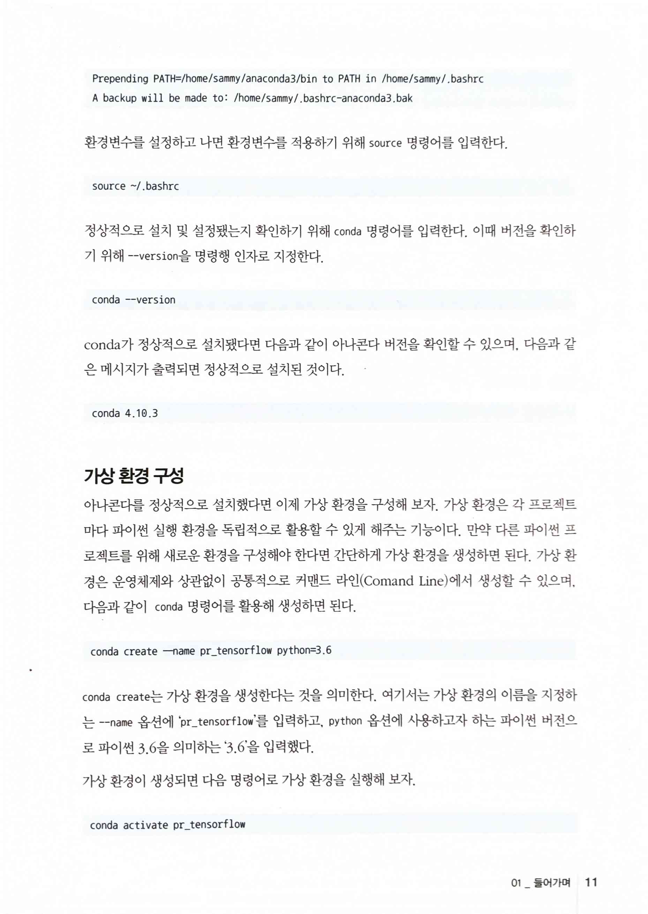
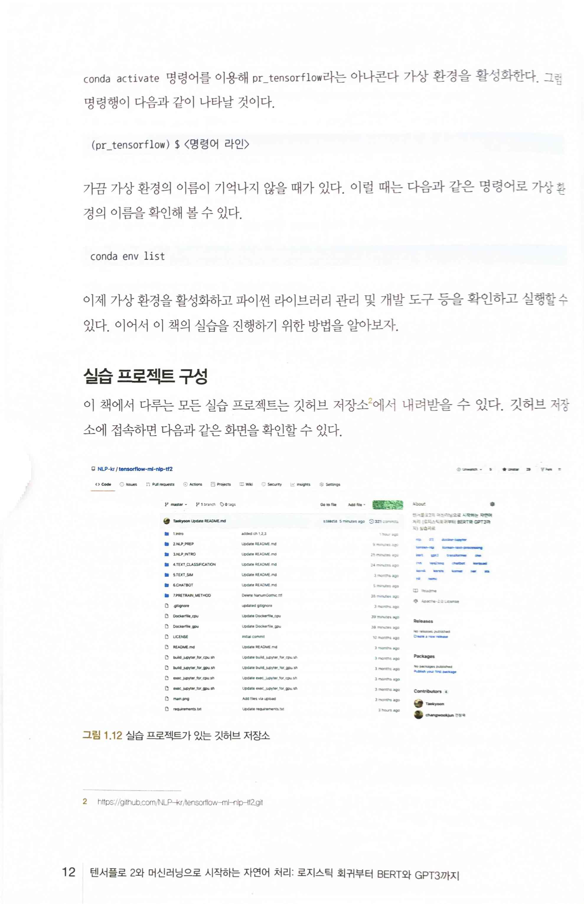
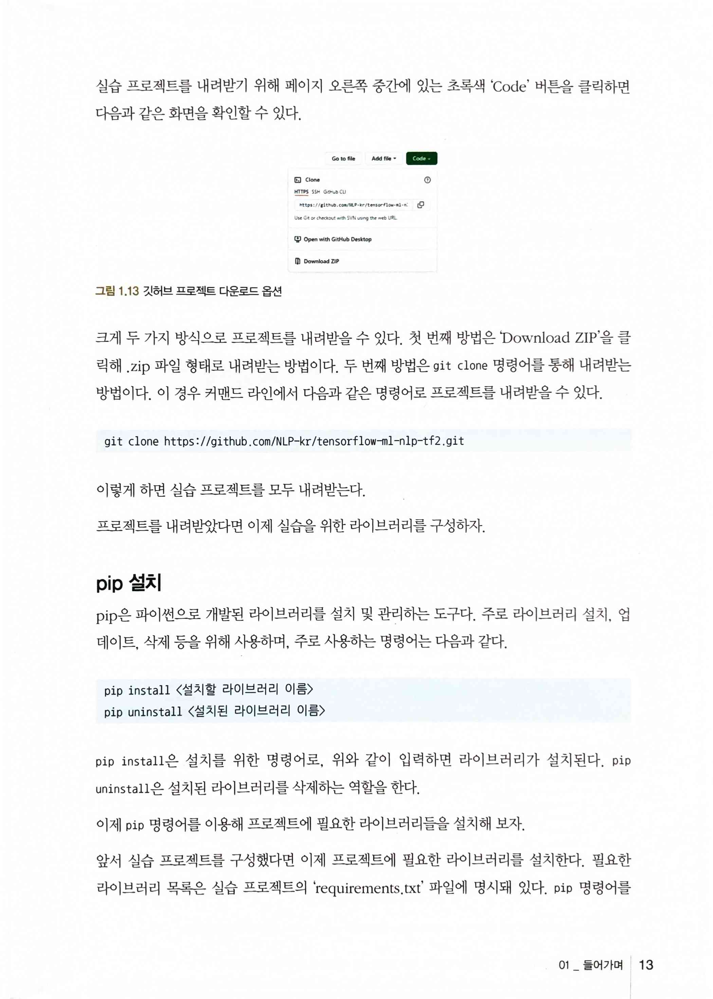
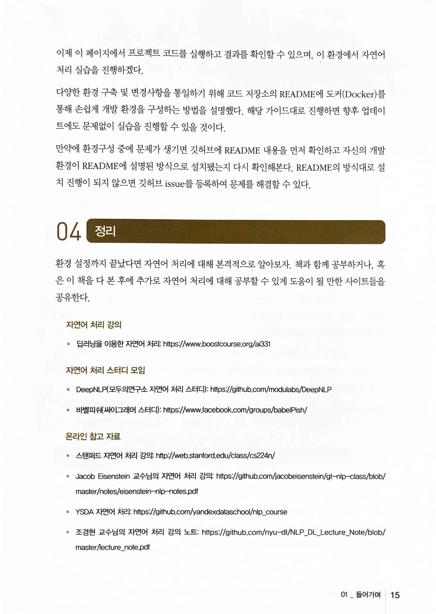

텐서플로 2와 머신러닝으로 시작하는 자연어처리
=============================================

* [딥러닝을 이용한 자연어 처리 강좌소개 : 부스트코스](https://www.boostcourse.org/ai331)
* [modulabs/DeepNLP: 딥러닝 NLP](https://github.com/modulabs/DeepNLP)
* [바벨피쉬 | Facebook](https://www.facebook.com/groups/babelpish)
* [Stanford CS 224N | Natural Language Processing with Deep Learning](https://web.stanford.edu/class/cs224n/)
* [jacobeisenstein/gt-nlp-class: Course materials for Georgia Tech CS 4650 and 7650, "Natural Language"](https://github.com/jacobeisenstein/gt-nlp-class)
* [yandexdataschool/nlp_course: YSDA course in Natural Language Processing](https://github.com/yandexdataschool/nlp_course)
* [nyu-dl/NLP_DL_Lecture_Note](https://github.com/nyu-dl/NLP_DL_Lecture_Note)