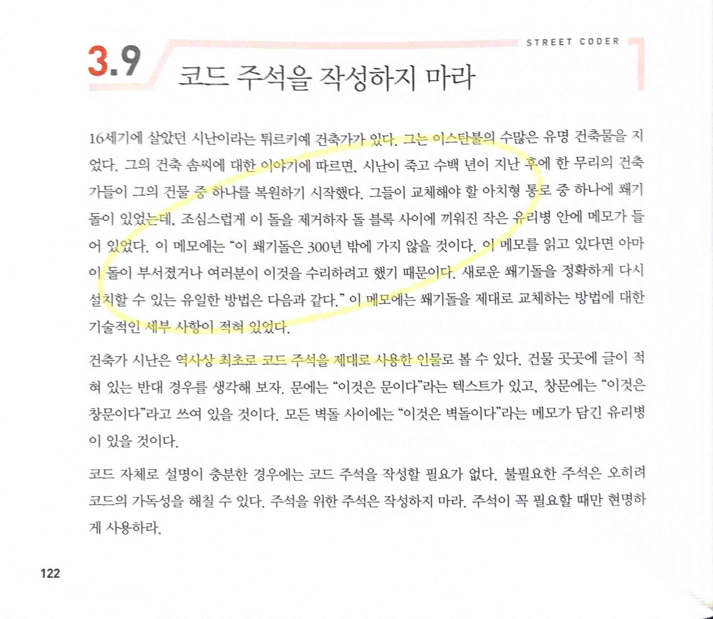
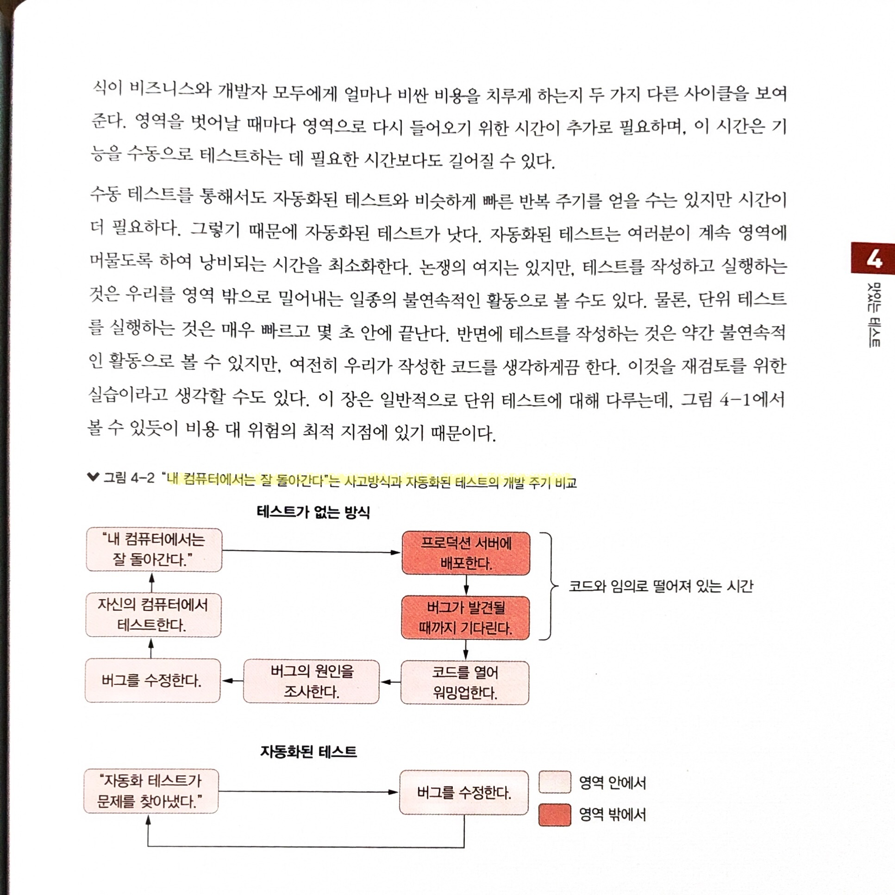
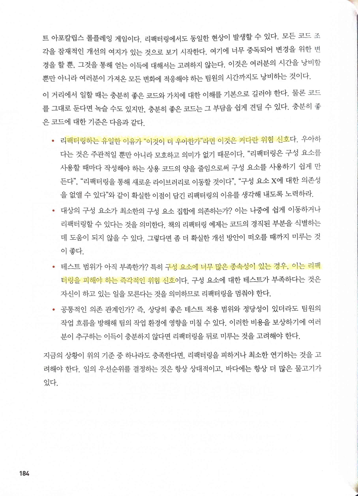
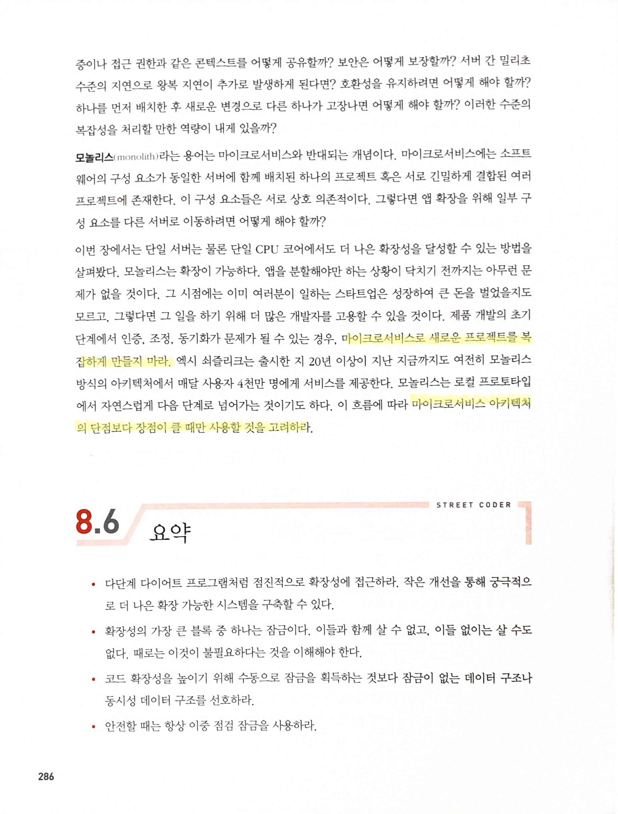
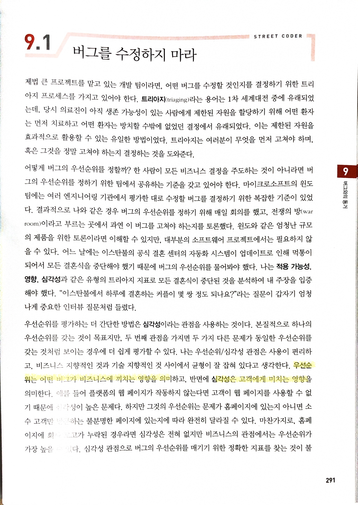
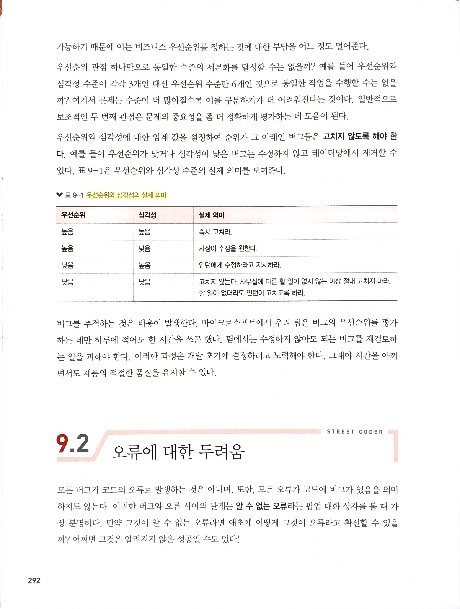

# 스트리트 코더

Tags: software-engineering
Date: January 14, 2024
Score: ★★★☆☆

- ★★★☆☆ 2023.01.14 좋은 software 개발을 위해 각자 알고 실천해야 할 사항들로 참고하기 좋은 책. 팀으로서 만들법한 부분들도 많지만, 개인의 발전을 위해 필요하고 또 실천해야 할 사항들에 더 가깝다고 생각한다
    - 한라 005.13-카892ㅅ
    - https://github.com/gilbutITbook/080325

- 찾아보고 싶었는데 이름은 동일하지만 이 사람인지는 잘 모르겠음
    - [Mimar Sinan - Wikipedia](https://en.wikipedia.org/wiki/Mimar_Sinan)

- automated test의 유무에 따른 개발 주기

- 입버릇처럼 우아한 코드를 이야기하는 사람이 기억이 나는데, 나는 이쪽에 동의한다. ‘우아’라는 측정할 수 없는 말보다는 정상적으로 문제없이 동작하는 코드가 훨씬 중요하고 가치가 있다고 생각한다.

- MSA라는 독은 이미 퍼질대로 퍼져서 조금만 방심하면 수많은 개발팀의 효율을 떨어뜨리고 있다고 생각한다

- 우선순위와 심각성에 대한 좋은 글
    - 우선순위: (bug뿐만이 아니라, 그냥 feature라도, 아니 뭐가 되었건) business에 끼치는 영향
    - 심각성: 고객에게 미치는 영향. 생각해보면 고객은 자기 일이면 심각하고, 자기 일이 아니면 알 바 아니다
