# 가상 면접 사례로 배우는 대규모 시스템 설계 기초

## 1장 사용자 수에 따른 규모 확장성
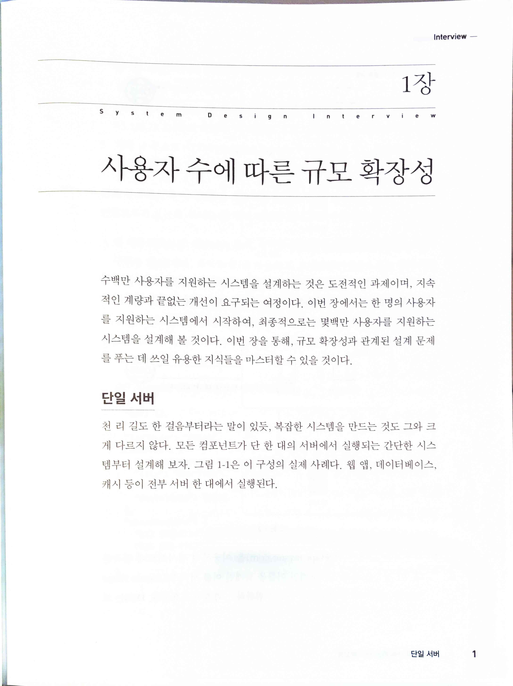

## 2장 개략적인 규모 추정
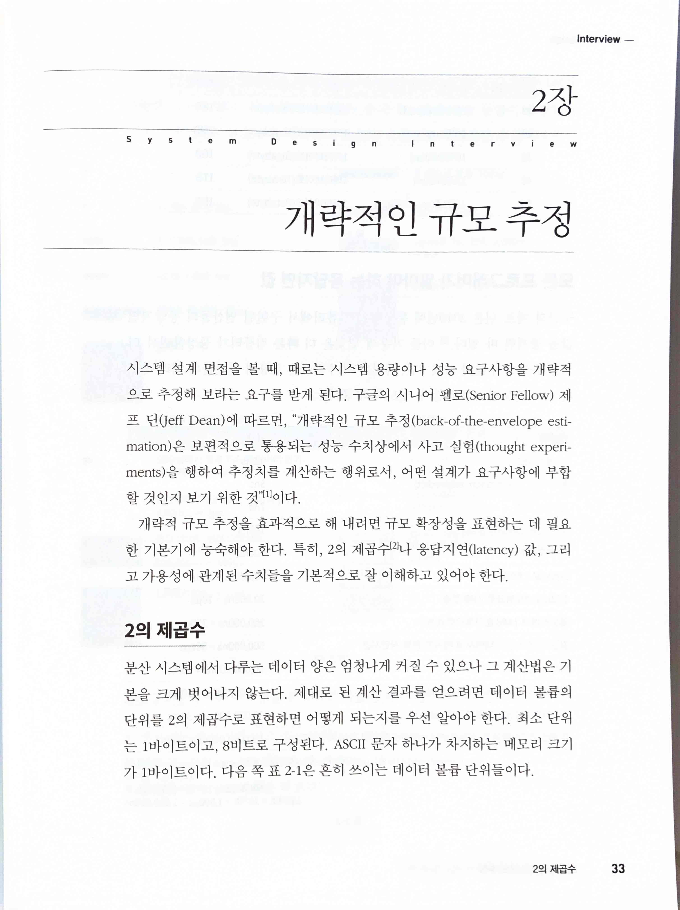

> 구글의 시니어 펠로(Senior Fellow) 제프 딘(Jeff Dean)에 따르면, “개략적인 규모 추정(back-of-the-envelope estimation)은 보편적으로 통용되는 성능 수치상에서 사고 실험(thought experiments)을 행하여 추정치를 계산하는 행위로서, 어떤 설계가 요구사항에 부합할 것인지 보기 위한 것이다.

## 3장 시스템 설계 면접 공략법
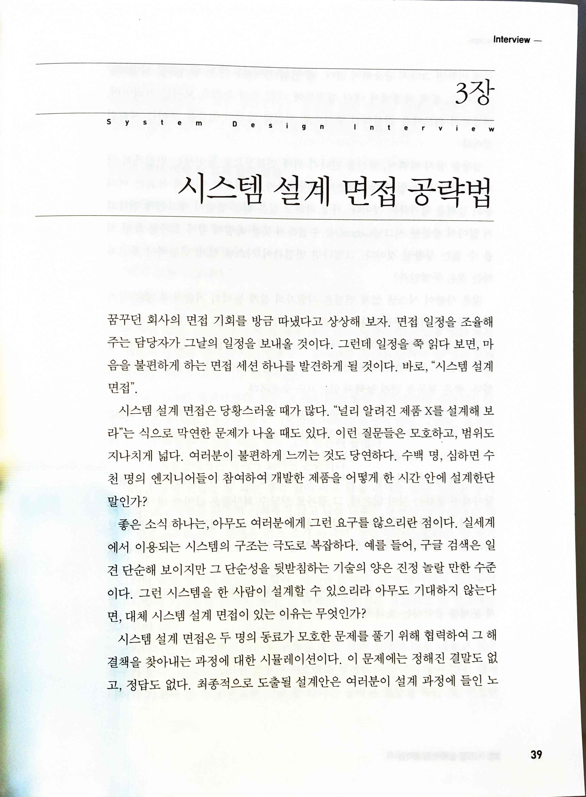

## 4장 처리율 제한 장치의 설계
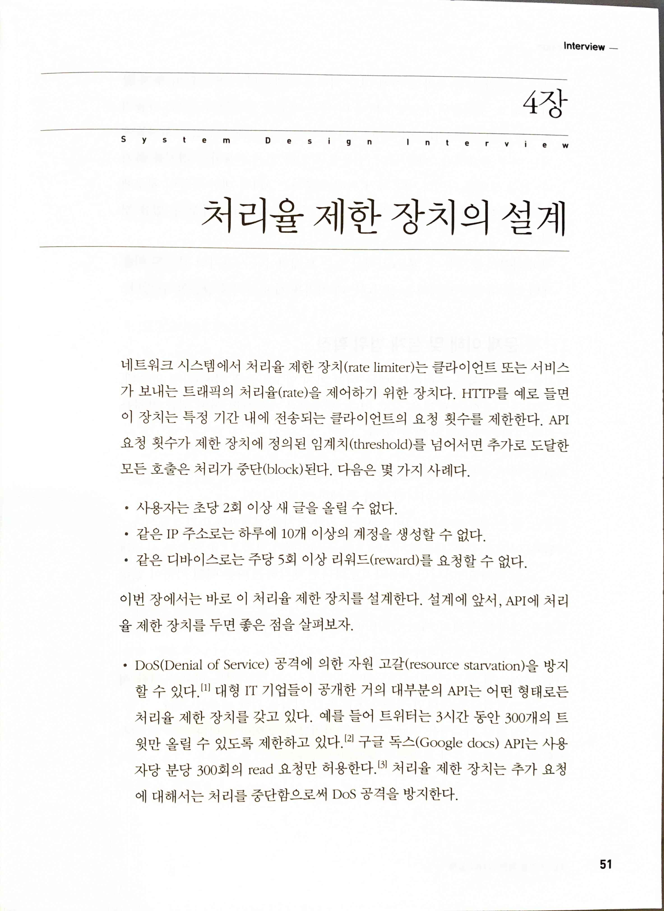

> 처리율 제한 장치(rate limiter)

## 5장 안정 해시 설계
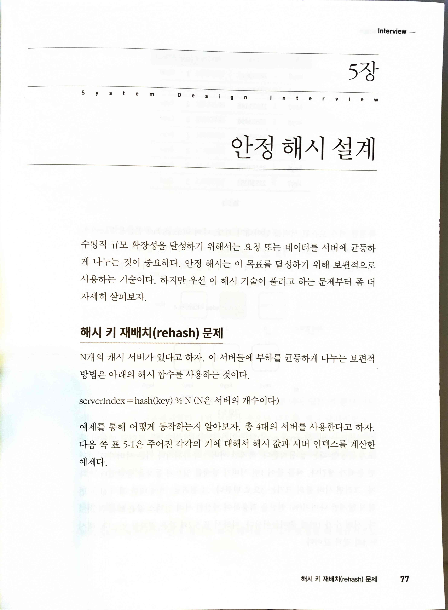

> consistent hashing

## 6장 키-값 저장소 설계
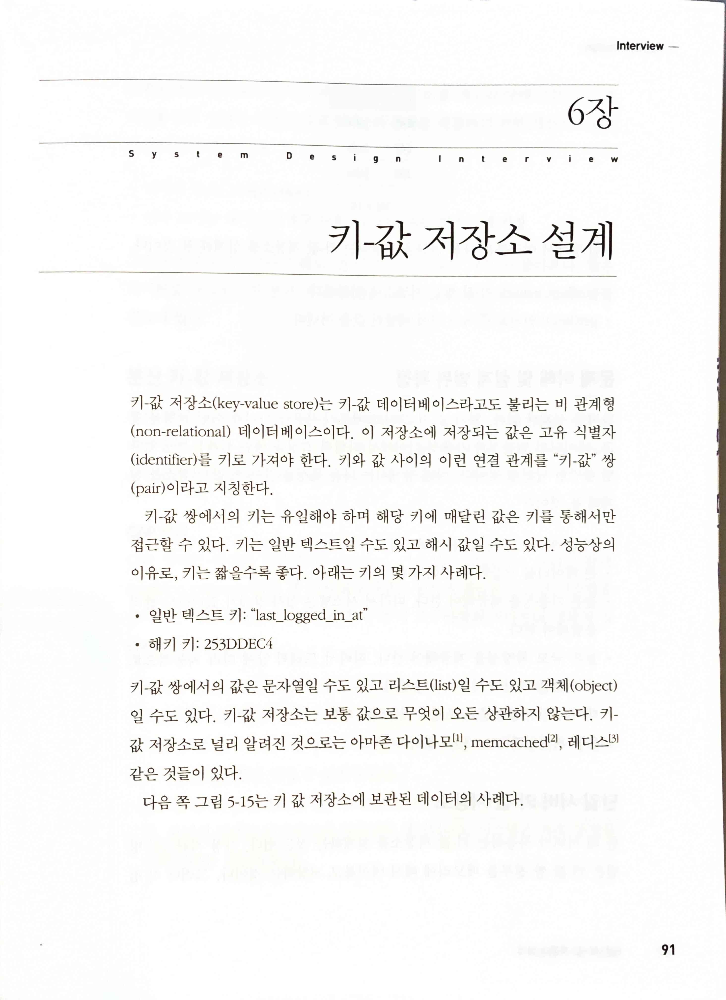

## 7장 분산 시스템을 위한 유일 ID 생성기 설계
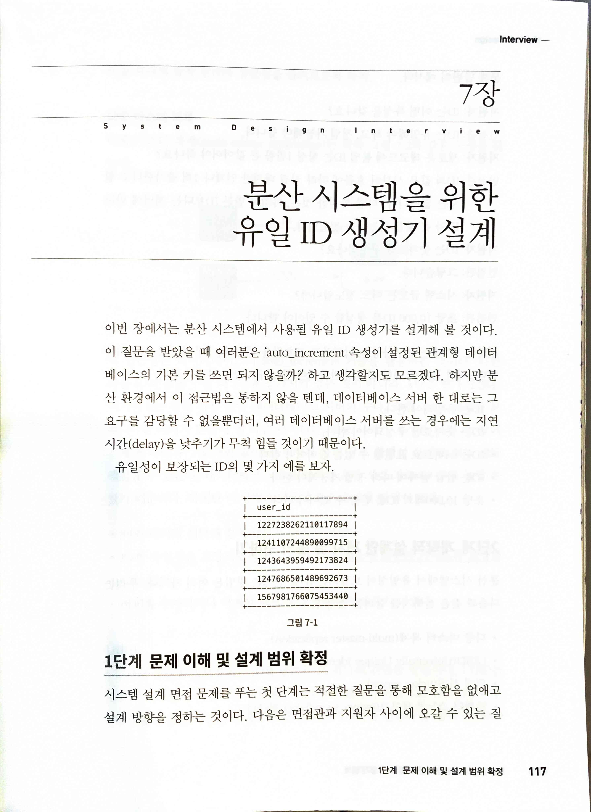

## 8장 URL 단축기 설계
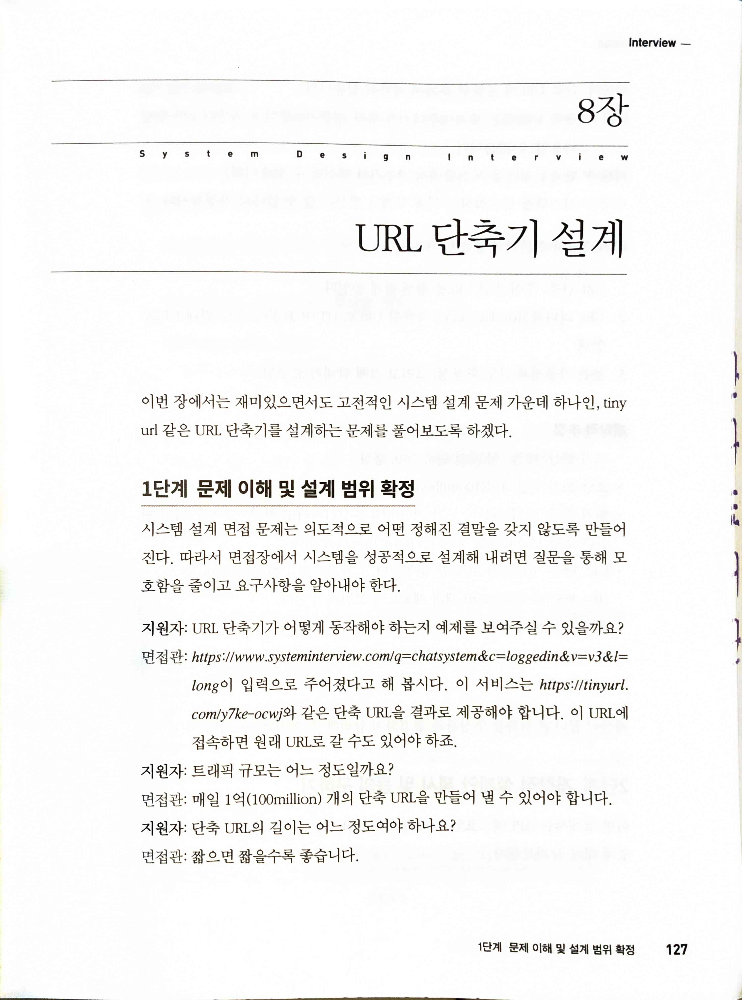

## 9장 웹 크롤러 설계
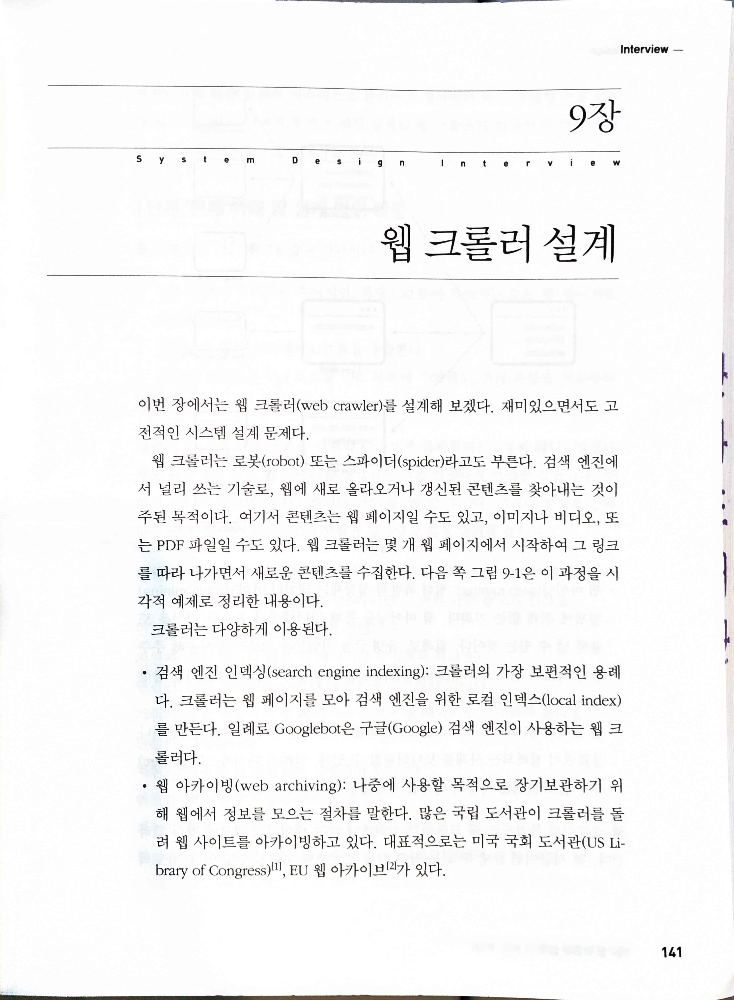

## 10장 알림 시스템 설계
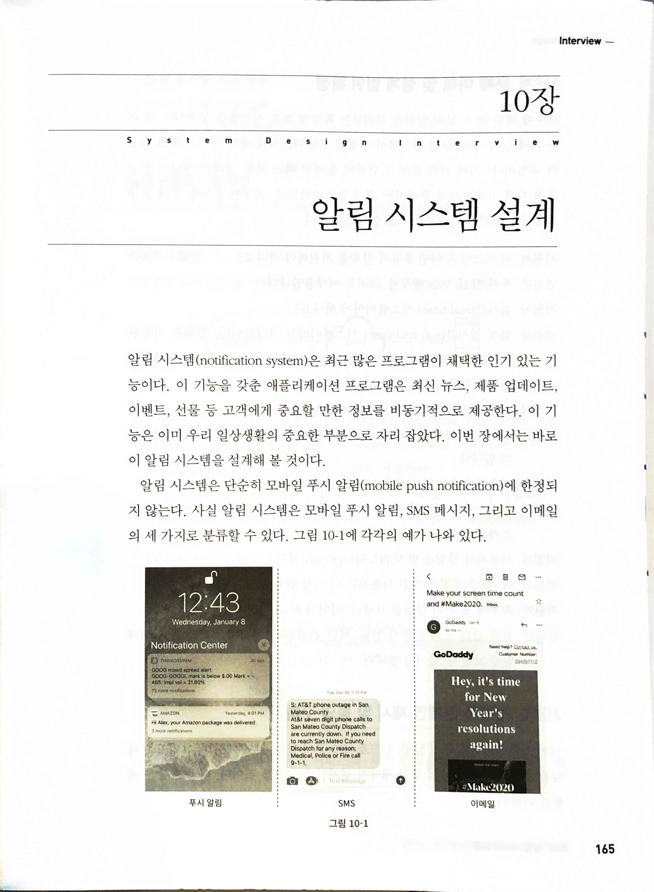

## 11장 뉴스 피드 시스템 설계

## 12장 채팅 시스템 설계
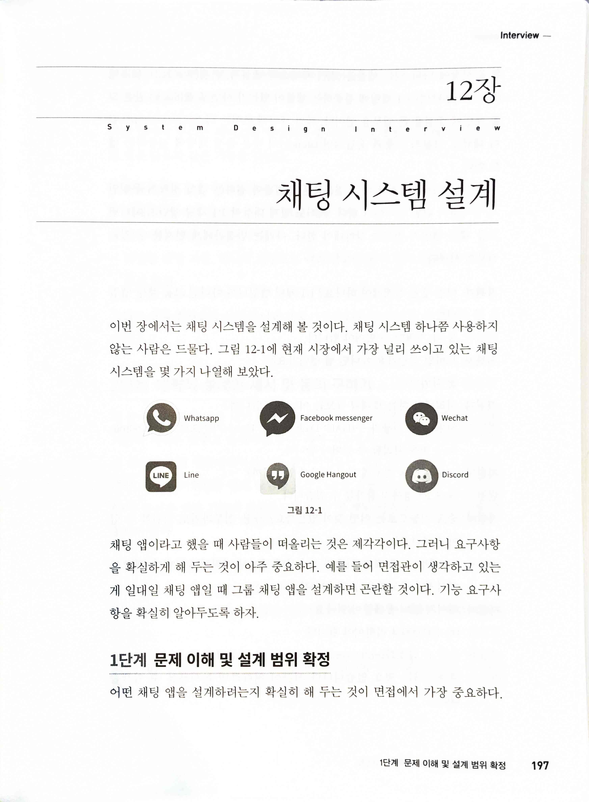

## 13장 검색어 자동완성 시스템
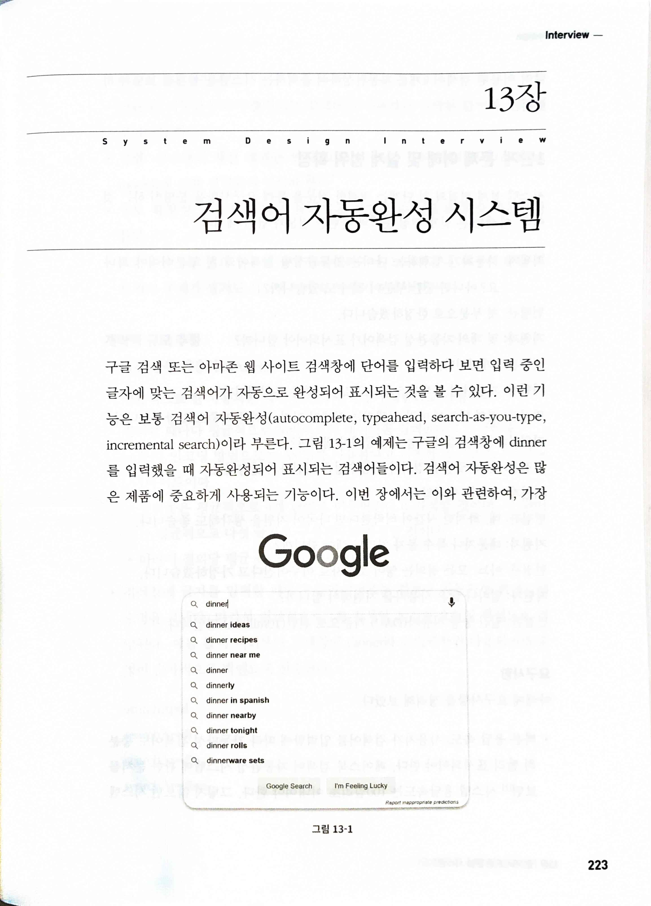

## 14장 유튜브 설계
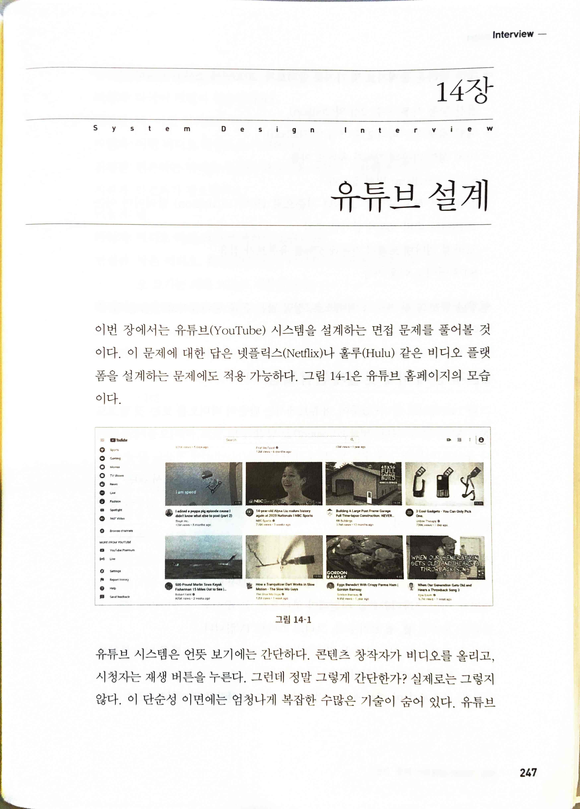

## 15장 구글 드라이브 설계
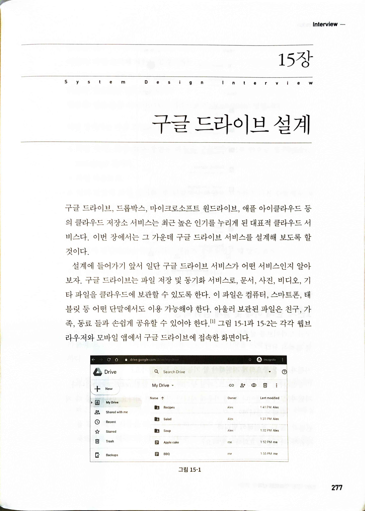

## 16장 배움은 계속된다
* [Facebook Timeline: Brought to You by the Power of Denormalization - High Scalability -](http://highscalability.com/blog/2012/1/23/facebook-timeline-brought-to-you-by-the-power-of-denormaliza.html)
* [Scale at Facebook](https://www.infoq.com/presentations/Scale-at-Facebook/)
* [Building Timeline: Scaling up to hold your life story - Engineering at Meta](https://engineering.fb.com/2012/01/05/web/building-timeline-scaling-up-to-hold-your-life-story/)
* 페이스북에서 Erlang을 사용하는 방법 Erlang at Facebook (Facebook chat)
  * [EugeneLetuchy-ErlangatFacebook.pdf](http://www.erlang-factory.com/upload/presentations/31/EugeneLetuchy-ErlangatFacebook.pdf)
* 건초더미에서 바늘 찾기: 페이스북의 사진 저장소 Finding a needle in Haystack: Facebook's photo storage
  * [Beaver.pdf](https://www.usenix.org/legacy/event/osdi10/tech/full_papers/Beaver.pdf)
* [Serving Facebook Multifeed: Efficiency, performance gains through redesign - Engineering at Meta](https://engineering.fb.com/2015/03/10/production-engineering/serving-facebook-multifeed-efficiency-performance-gains-through-redesign/)
* 페이스북 멤캐시 시스템의 규모 확장성 Scaling Memcache at Facebook
  * [memcache-fb.pdf](https://www.cs.bu.edu/~jappavoo/jappavoo.github.com/451/papers/memcache-fb.pdf)
* TAO: 페이스북의 소셜 그래프 분산 저장소 TAO: Facebook's Distributed Data Store for the Social Graph
  * [TAO: The power of the graph - Engineering at Meta](https://engineering.fb.com/2013/06/25/core-data/tao-the-power-of-the-graph/)
* [Amazon Architecture - High Scalability -](http://highscalability.com/amazon-architecture)
* 다이나모: 아마존의 고가용성 키-값 저장소 Dynamo: Amazon's Highly Available Key-value Store
  * [Microsoft Word - sosp067-decandia1.doc](https://www.read.seas.harvard.edu/~kohler/class/cs239-w08/decandia07dynamo.pdf)
* [A 360 Degree View of the Entire Netflix Stack - High Scalability -](http://highscalability.com/blog/2015/11/9/a-360-degree-view-of-the-entire-netflix-stack.html)
* [It’s All A/Bout Testing: The Netflix Experimentation Platform | by Netflix Technology Blog | Netflix TechBlog](https://netflixtechblog.com/its-all-a-bout-testing-the-netflix-experimentation-platform-4e1ca458c15)
* [Netflix Recommendations: Beyond the 5 stars (Part 1) | by Netflix Technology Blog | Netflix TechBlog](https://netflixtechblog.com/netflix-recommendations-beyond-the-5-stars-part-1-55838468f429)
* [Netflix Recommendations: Beyond the 5 stars (Part 2) | by Netflix Technology Blog | Netflix TechBlog](https://netflixtechblog.com/netflix-recommendations-beyond-the-5-stars-part-2-d9b96aa399f5)
* [Google Architecture - High Scalability -](http://highscalability.com/google-architecture)
* 구글 파일 시스템 The Google File stem (Google Docs)
  * [paper.dvi](http://static.googleusercontent.com/media/research.google.com/zh-CN/us/archive/gfs-sosp2003.pdf)
* 차이 기반 동기화(델타 동기화) Differential Synchronization (Google Docs)
  * [Neil Fraser: Writing: Differential Synchronization](https://neil.fraser.name/writing/sync/)
* [YouTube Architecture - High Scalability -](http://highscalability.com/youtube-architecture)
* [Seattle Conference on Scalability: YouTube Scalability - YouTube](https://www.youtube.com/watch?v=w5WVu624fY8)
* 빅테이블: 구조화된 데이터를 위한 분산 저장소 시스템 Bigtable: A Distributed Storage System for Structured Data
  * [bigtable-osdi06.pdf](https://static.googleusercontent.com/media/research.google.com/en//archive/bigtable-osdi06.pdf)
* [Instagram Architecture: 14 Million users, Terabytes of Photos, 100s of Instances, Dozens of Technologies - High Scalability -](http://highscalability.com/blog/2011/12/6/instagram-architecture-14-million-users-terabytes-of-photos.html)
* [The Architecture Twitter Uses to Deal with 150M Active Users, 300K QPS, a 22 MB/S Firehose, and Send Tweets in Under 5 Seconds - High Scalability -](http://highscalability.com/blog/2013/7/8/the-architecture-twitter-uses-to-deal-with-150m-active-users.html)
* [Scaling Twitter: Making Twitter 10000 Percent Faster - High Scalability -](http://highscalability.com/scaling-twitter-making-twitter-10000-percent-faster)
* [Announcing Snowflake](https://blog.twitter.com/engineering/en_us/a/2010/announcing-snowflake)
* [Timelines at Scale](https://www.infoq.com/presentations/Twitter-Timeline-Scalability/)
* [How Uber Scales Their Real-time Market Platform - High Scalability -](http://highscalability.com/blog/2015/9/14/how-uber-scales-their-real-time-market-platform.html)
* [Scaling Pinterest - From 0 to 10s of Billions of Page Views a Month in Two Years - High Scalability -](http://highscalability.com/blog/2013/4/15/scaling-pinterest-from-0-to-10s-of-billions-of-page-views-a.html)
* [Pinterest Architecture Update - 18 Million Visitors, 10x Growth,12 Employees, 410 TB of Data - High Scalability -](http://highscalability.com/blog/2012/5/21/pinterest-architecture-update-18-million-visitors-10x-growth.html)
* [A Brief History of Scaling LinkedIn | LinkedIn Engineering](https://engineering.linkedin.com/architecture/brief-history-scaling-linkedin)
* [Flickr Architecture - High Scalability -](http://highscalability.com/flickr-architecture)
* [How We've Scaled Dropbox - YouTube](https://www.youtube.com/watch?v=PE4gwstWhmc)
* [The WhatsApp Architecture Facebook Bought For $19 Billion - High Scalability -](http://highscalability.com/blog/2014/2/26/the-whatsapp-architecture-facebook-bought-for-19-billion.html)
* Engineering blogs
  * [Google Developers Blog](https://developers.googleblog.com/)
  * [Groupon Product and Engineering – Medium](https://medium.com/groupon-eng)
  * [The GitHub Blog: Engineering News and Updates](https://github.blog/category/engineering/)
  * [Nextdoor Engineering](https://engblog.nextdoor.com/)
  * [Netflix TechBlog](https://netflixtechblog.com/)
  * [Docker Blog - Docker](https://www.docker.com/blog/)
  * [Dropbox Tech Blog - Dropbox](https://dropbox.tech/)
  * [Upvoted | The Official Reddit Blog](https://www.redditinc.com/blog)
  * [Blog | LinkedIn Engineering](https://engineering.linkedin.com/blog)
  * [The Signal | The Mixpanel Blog](https://mixpanel.com/blog/)
  * [The BitTorrent Engineering Blog | Notes from the front lines of BitTorrent innovation](https://engineering.bittorrent.com/)
  * [All posts | SoundCloud Backstage Blog](https://developers.soundcloud.com/blog/)
  * [Thumbtack Engineering – Medium](https://medium.com/thumbtack-engineering)
  * [404 Error | Salesforce Developers](https://developer.salesforce.com/blogs/engineering)
  * [Shopify Engineering](https://shopify.engineering/)
  * [Slack Engineering -](https://slack.engineering/)
  * [Stripe Blog: Engineering](https://stripe.com/blog/engineering)
  * [Spotify Engineering](https://engineering.atspotify.com/)
  * [AWS Architecture Blog](https://aws.amazon.com/ko/blogs/architecture/)
  * [Asana Engineering Blog](https://blog.asana.com/category/eng/)
  * [Atlassian Developer Blog -](https://blog.developer.atlassian.com/)
  * [Yahoo Engineering](https://yahooeng.tumblr.com/)
  * [The Airbnb Tech Blog – Medium](https://medium.com/airbnb-engineering)
  * [Uber Engineering Blog](https://eng.uber.com/)
  * [Yelp Engineering and Product Blog](https://engineeringblog.yelp.com/)
  * [Tech Blog - eBay Inc.](https://tech.ebayinc.com/)
  * [Instagram Engineering](https://instagram-engineering.com/)
  * [tech-at-instacart](https://tech.instacart.com/)
  * [Zoom Developer Blog – Medium](https://medium.com/zoom-developer-blog)
  * [Engineering at Quora](https://quoraengineering.quora.com/)
  * [Cloudera Blog](https://blog.cloudera.com/)
  * [Engineering](https://blog.twitter.com/engineering/en_us)
  * [Engineering at Meta](https://engineering.fb.com/)
  * [The PayPal Technology Blog – Medium](https://medium.com/paypal-tech)
  * [Pinterest Engineering Blog – Medium](https://medium.com/pinterest-engineering)
  * [High Scalability -](http://highscalability.com/)
* [system-design-primer: Learn how to design large-scale systems. Prep for the system design interview. Includes Anki flashcards](https://github.com/donnemartin/system-design-primer)