팀장으로 산다는 건
==================

# PART 1 처음 팀장이 된다는 건

## CHAPTER 1 두통의 시작
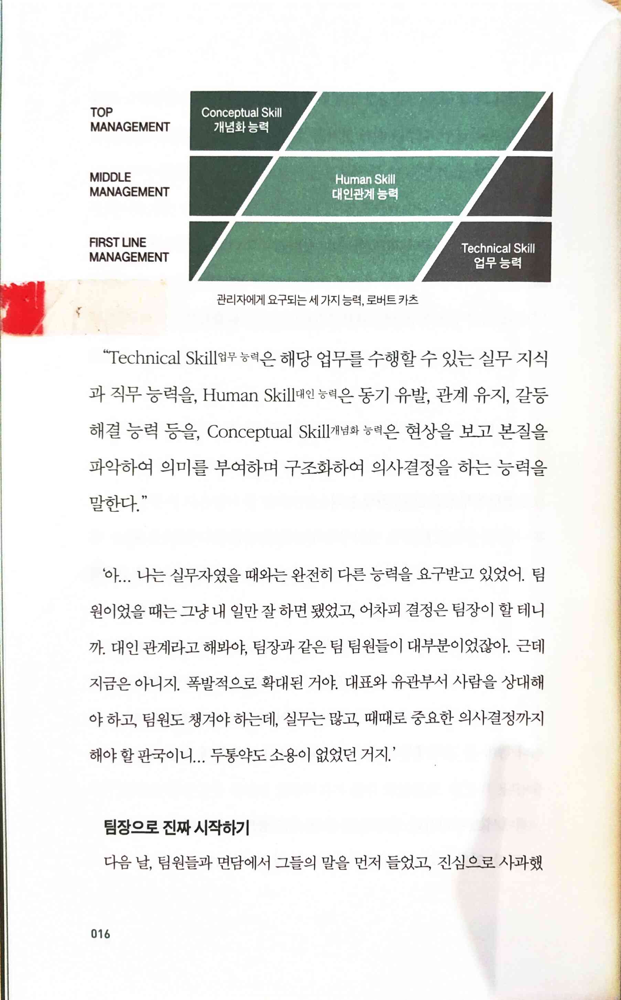

> 관리자에게 요구되는 세 가지 능력
>
> Technical Skill 업무능력은 해당 업무를 수행할 수 있는 실무 지식과 직무 능력
>
> Human Skill 대인 능력은 동기 유발, 관계 유지, 갈등 해결 능력 등
>
> Conceptual Skill 개념화 능력은 현상을 보고 본질을 파악하여 의미를 부여하며 구조화하여 의사결정을 하는 능력

## CHAPTER 2 열심히 하면 팀장이 되는 줄 알았다

## CHAPTER 3 리더가 될 사람은 따로 있다
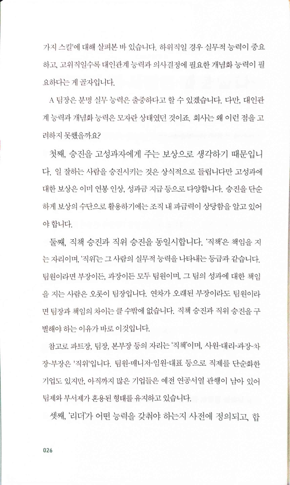 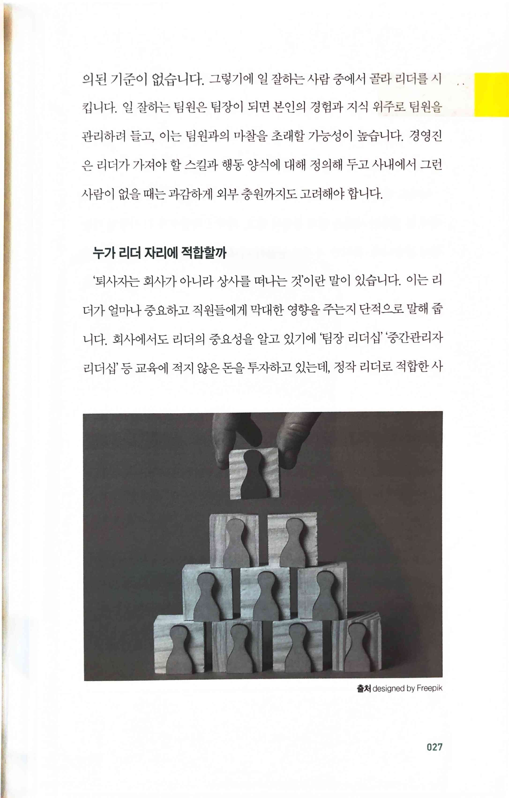

> 하위직일 경우 실무적 능력이 중요하고 고위직일수록 대인관계 능력과 의사결정에 필요한 개념화 능력이 필요하다
>
> 첫째, 승진을 고성과자에게 주는 보상으로 생각
>
> 둘째, 직책 승진과 직위 승진을 동일시
>
> 셋째, '리더'가 어떤 능력을 갖춰야 하는지 사전에 정의되고 합의된 기준이 없음
>
> 일 잘하는 팀원은 팀장이 되면 본인의 경험과 지식 위주로 팀원을 관리하려 들고, 이는 팀원과의 마찰을 초래할 가능성이 높습니다. 경영진은 리더가 가져야 할 스킬과 행동 양식에 대해 정의해 두고 사내에서 그런 사람이 없을 때는 과감하게 외부 충원까지도 고려해야 합니다.
>
> '퇴사자는 회사가 아니라 상사를 떠나는 것'

# PART 2 팀장으로 일한다는 견

## 1 '사람'이 시작과 끝이다

### CHAPTER 1 실력 있다고 뽑아놨더니
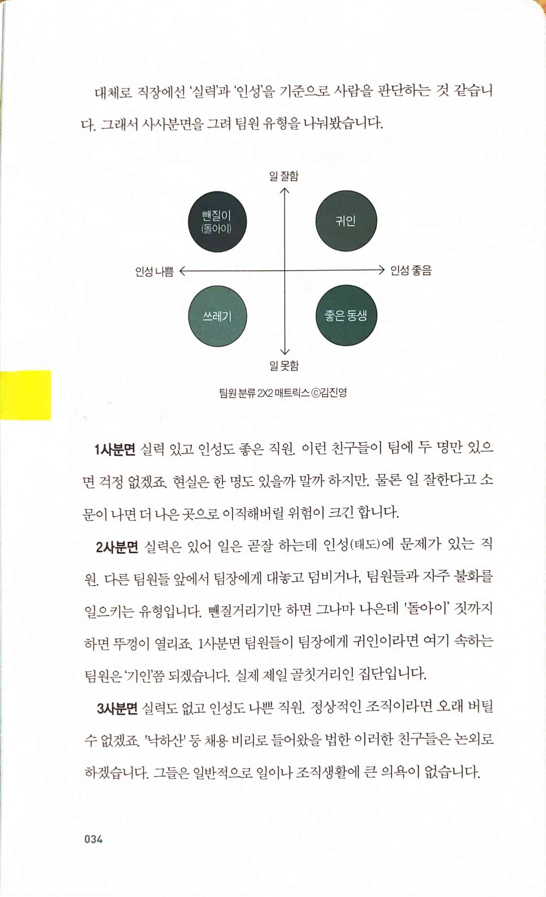

> 팀원분류 2X2 매트릭스

### CHAPTER 2 문제 팀원, 사람 만들기
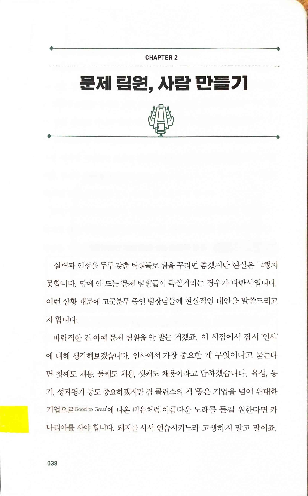

> 인사에서 가장 중요한 건 채용
>
> 짐 콜린스의 책 '좋은 기업을 넘어 위대한 기업으로 Good to Great'에 나온 비유처럼 아름다운 노래를 듣길 원한다면 카나리아를 사야 합니다. 돼지를 사서 연습시키느라 고생하지 말고 말이죠

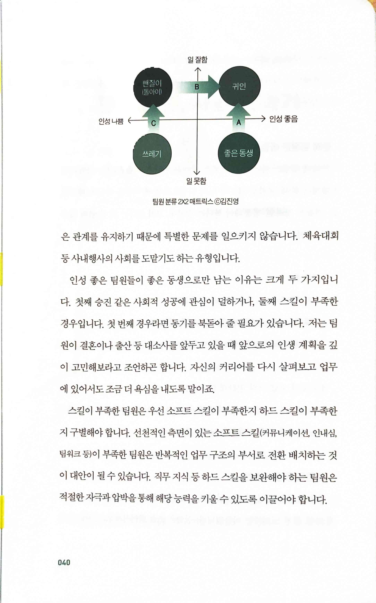

> 팀원분류 2X2 매트릭스

### CHAPTER 3 팀원이 사표를 냈다

### CHAPTER 4 우리 모두 프로가 됩시다

### CHAPTER 5 귀찮은 연례행사가 돼 버린 인사평가

## 2 '업무'는 다 함께 한다

### CHAPTER 1 카리스마 없는 리더가 더 낫다
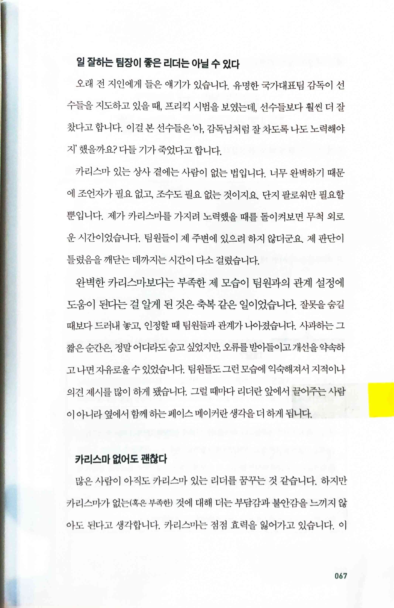

> 리더란 앞에서 끌어주는 사람이 아니라 옆에서 함께 하는 페이스 메이커

### CHAPTER 2 대화는 했지만, 통한 건 아닐지도
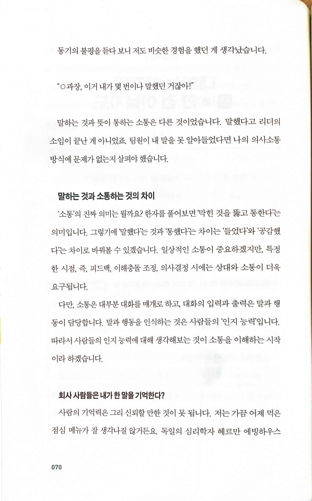

> 사람들의 인지 능력에 대해 생각해보는 것이 소통을 이해하는 시작

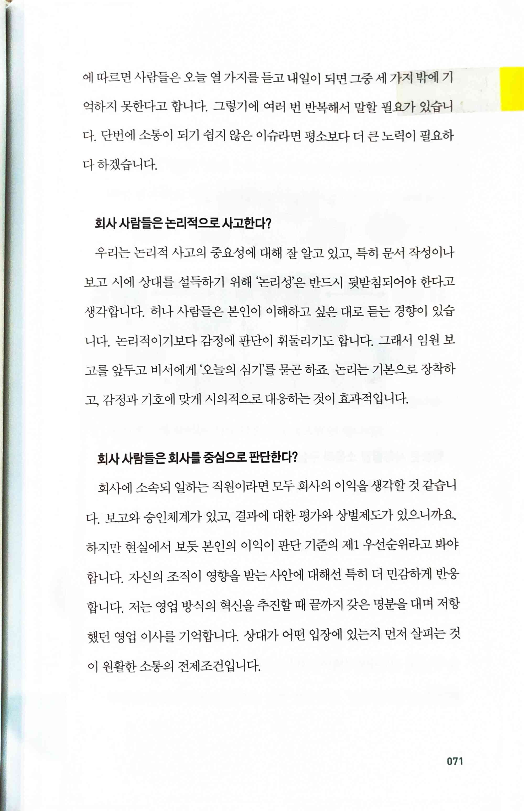

> 사람들은 오늘 열 가지를 듣고 내일이 되면 그중 세 가지 밖에 기억하지 못한다
>
> 논리는 기본으로 장착하고, 감정과 기호에 맞게 시의적으로 대응하는 것이 효과적
>
> 상대가 어떤 입장에 있는지 먼저 살피는 것이 원활한 소통의 전제조건

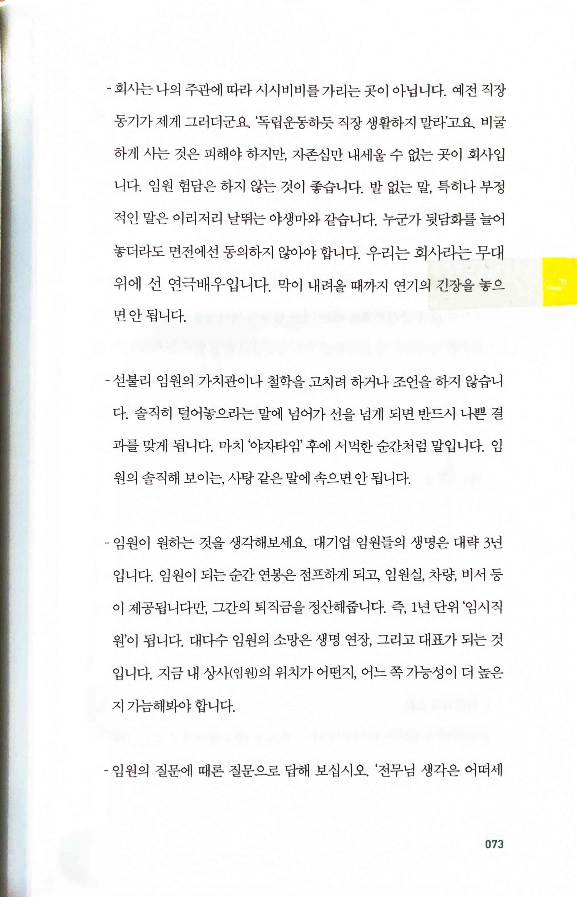

> 우리는 회사라는 무대 위에 선 연극배우. 막이 내려올 때까지 연기의 긴장을 놓으면 안됨

### CHAPTER 3 회의가 회의스러운 이유
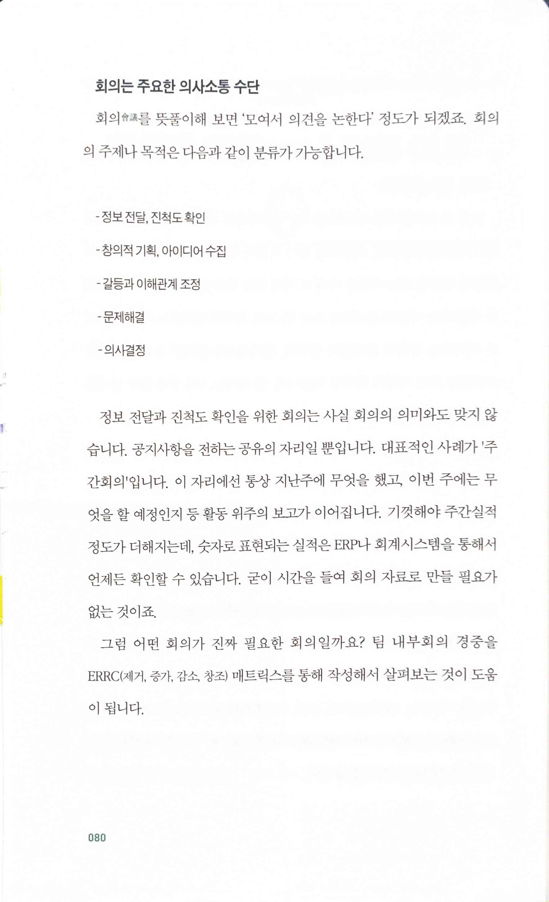

> 회의의 주제나 목적
>
> 정보 전달, 진척도 확인
>
> 창의적 기획, 아이디어 수집
>
> 갈등과 이해관계 조정
>
> 문제해결
>
> 의사결정

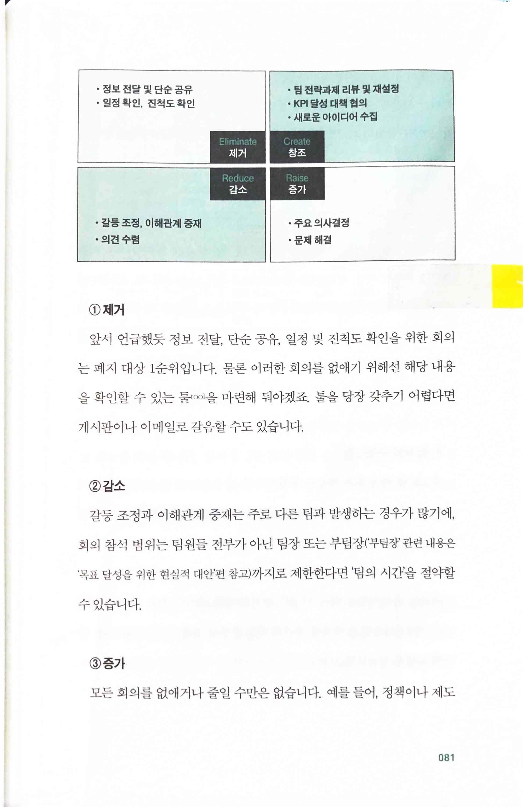

> ERRC 매트릭스 - Eliminate 제거 Reduce 감소 Raise 증가 Create 창조

### CHAPTER 4 내부의 적이 더 무섭다

### CHAPTER 5 신박한 아이디어 창출법
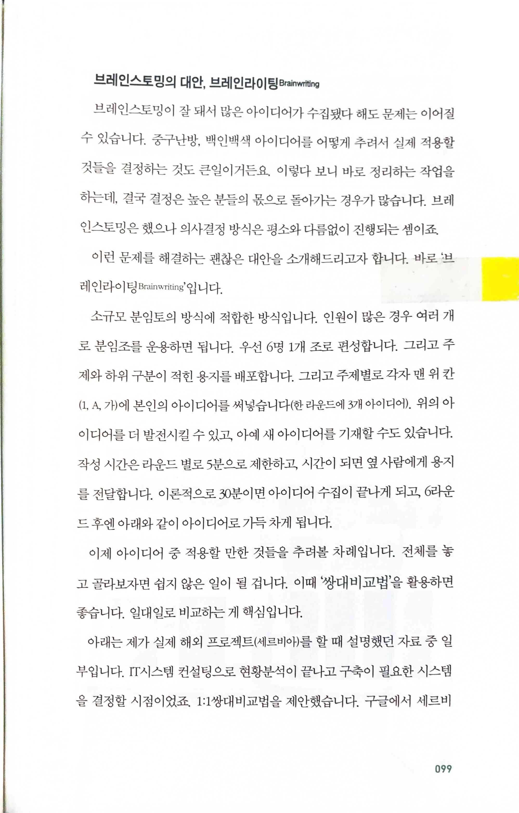

> 브레인스토밍의 대안, 브레인라이팅Brainwriting
>
> '쌍대비교법'을 활용하면 좋습니다. 일대일로 비교하는 게 핵심

### CHAPTER 6 똑똑한 팀장도 이상한 결정을 한다
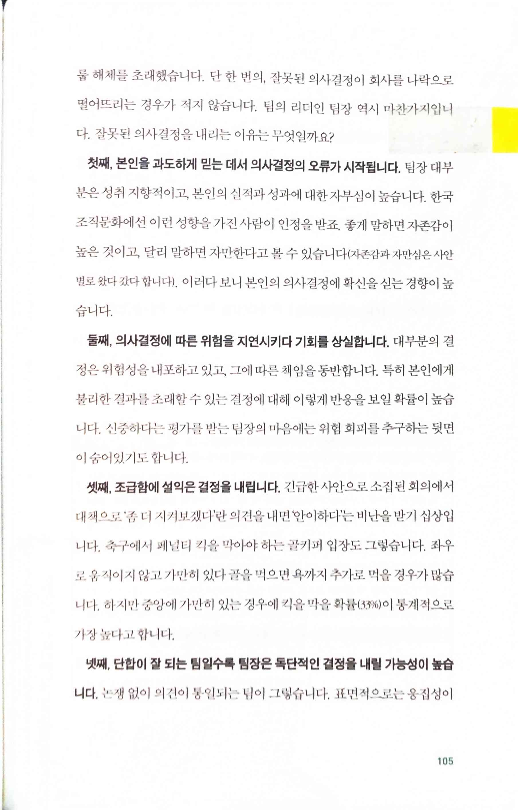 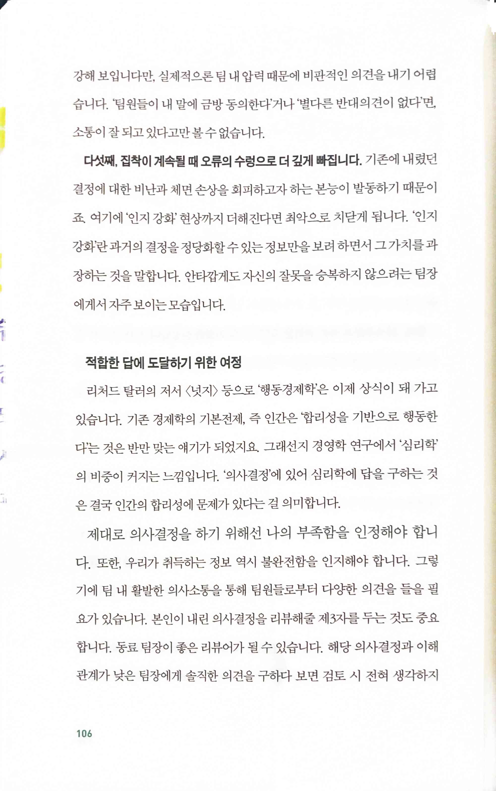

> 잘못된 의사결정을 내리는 이유
>
> 첫째, 본인을 과도하게 믿는 데서 의사결정의 오류가 시작
>
> 둘째, 의사결정에 따른 위험을 지연시키다 기회를 상실
>
> 셋째, 조급함에 설익은 결정
>
> 넷째, 단합이 잘 되는 팀일수록 팀장은 독단적인 결정을 내릴 가능성이 높음
>
> 다섯째, 집착이 계속될 때 오류의 수렁으로 더 깊게 빠짐
>
> 리처드 탈러의 저서 <넛지> 등으로 '행동경제학'은 이제 상식이 돼 가고 있습니다. 기존 경제학의 기본전제, 즉 인간은 합리성을 기반으로 행동한다는 것은 반만 맞는 얘기가 되었지요. 그래선지 경영학 연구에서 '심리학'의 비중이 커지는 느낌입니다. '의사결정'에 있어 심리학에 답을 구하는 것은 결국 인간의 합리성에 문제가 있다는 걸 의미합니다.
>
> 또한, 우리가 취득하는 정보 역시 불완전함을 인지해야 합니다.
* code review를 비롯한 협력 활동이 필요한 이유 역시 여기에 있다고 볼 수도 있을 듯

### CHAPTER 7 리더는 일이 아닌 구조를 관리한다
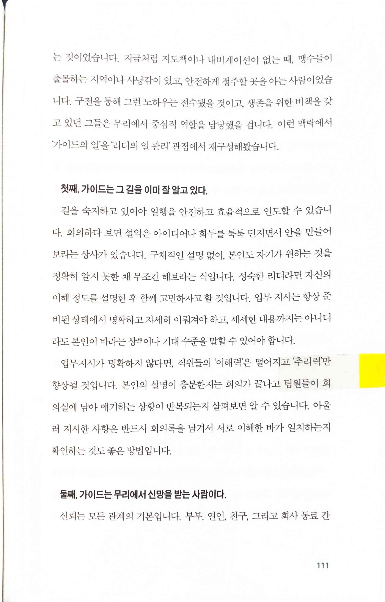

> 업무지시가 명확하지 않다면, 직원들의 이해력은 떨어지고 추리력만 향상

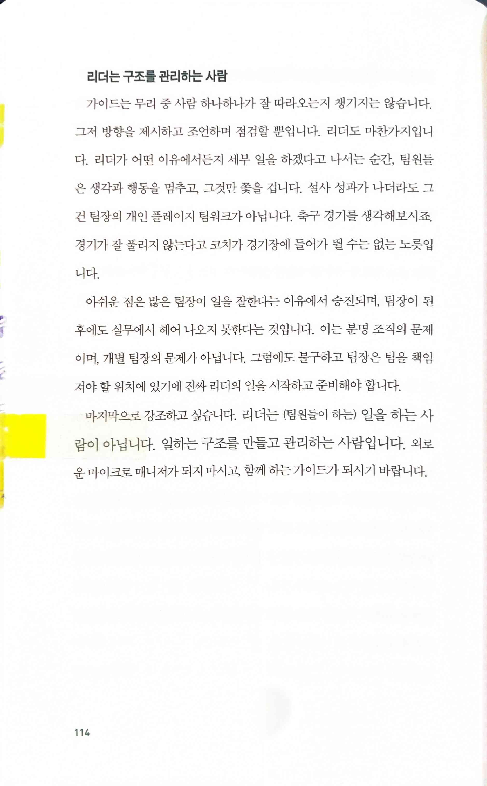

> 리더는 팀원들이 하는 일을 하는 사람이 아닙니다. 일하는 구조를 만들고 관리하는 사람입니다. 외로운 마이크로 매니저가 되지 마시고 함께 하는 가이드가 되시기 바랍니다.

## 3 '성과'로 결론을 맺는다

### CHAPTER 1 목표 달성을 위한 현실적 대안
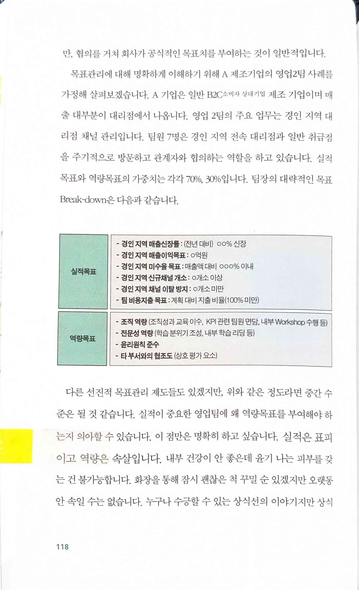

> 실적은 표피이고 역량은 속살입니다. 내부 건강이 안 좋은데 윤기 나는 피부를 갖는 건 불가능

### CHAPTER 2 철학이 있는 성과관리
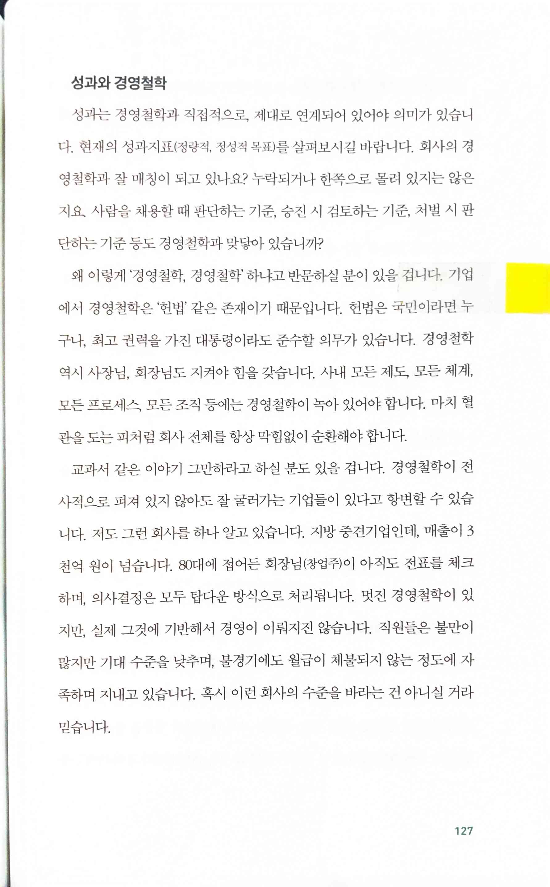

> 기업에서 경영철학은 '헌법' 같은 존재... 사내 모든 제도, 모든 체계, 모든 프로세스, 모든 조직 등에는 경영철학이 녹아 있어야 합니다.

> 고성과 조직

### CHAPTER 3 실적이 좋을 때, 진짜 해야 할 일

### CHAPTER 4 비대면 시대가 요구하는 새로운 리더십
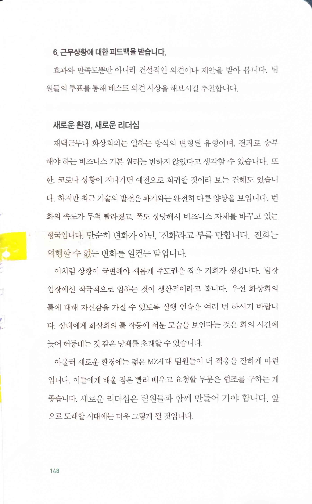

> 재택근무나 화상회의는 일하는 방식의 변형된 유형이며, 결과로 승부해야 하는 비즈니스 기본 원리는 변하지 않았다고 생각할 수 있습니다. 또한, 코로나 상황이 지나가면 예전으로 회귀할 것이라 보는 견해도 있습니다. 하지만 최근 기술의 발전은 과거와는 완전히 다른 양상을 보입니다. 변화의 속도가 무척 빨라졌고, 폭도 상당해서 비즈니스 자체를 바꾸고 있는 형국입니다. 단순히 변화가 아닌, '진화'라고 부를 만합니다. 진화는 역행할 수 없는 변화를 일컫는 말입니다.
>
> 새로운 리더십은 팀원들과 함께 만들어 가야 합니다. 앞으로 도래할 시대에는 더욱 그렇게 될 것입니다.

### CHAPTER 5 인사이트를 주는 영화 4선

# PART 3 팀장을 살아낸다는 건

## CHAPTER 1 외로움이 내게로 왔다
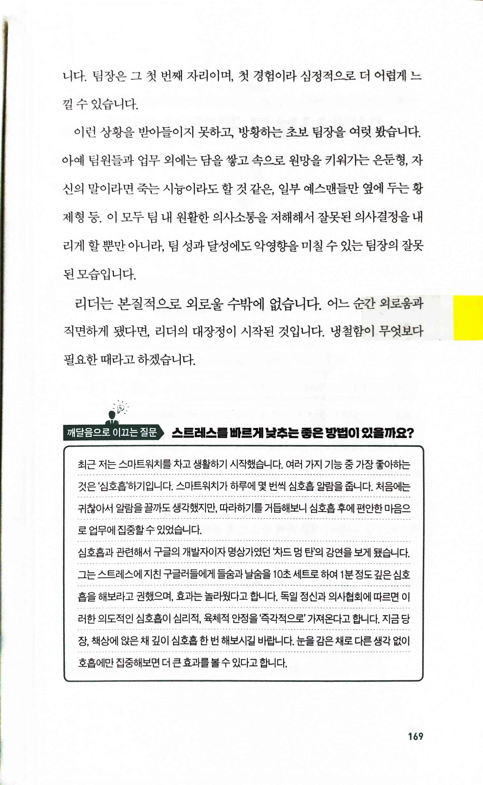

> 리더는 본질적으로 외로울 수밖에 없습니다. 어느 순간 외로움과 직면하게 됐다면, 리더의 대장정이 시작된 것입니다. 냉철함이 무엇보다 필요한 때라고 하겠습니다.

## CHAPTER 2 이제 나보고 꼰대라 한다

## CHAPTER 3 또라이 상사는 내 운명

## CHAPTER 4 때론 '잠시 멈춤'이 필요하다

## CHAPTER 5 임원승진이 당신의 목표인가요?

## CHAPTER 6 회사에서 '존'경받으며 '버'티는 방법

## CHAPTER 7 명함을 꺼내 회사를 지워보세요

## CHAPTER 8 위로가 되는 영화 4선
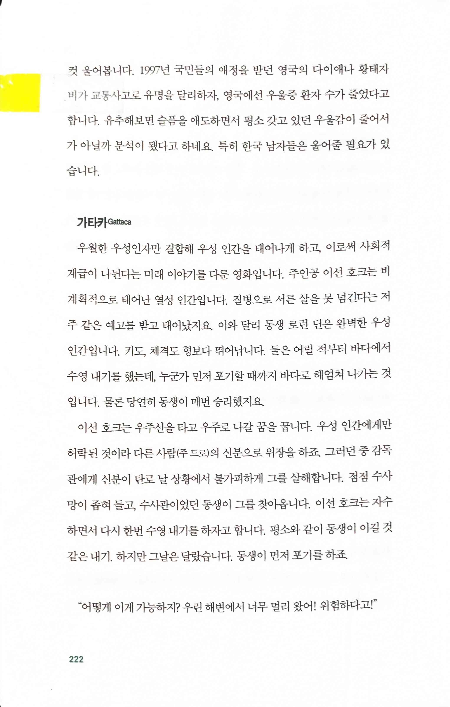

> 1997년 국민들의 애정을 받던 영국의 다이애나 황태자비가 교통사고로 유명을 달리하자, 영국에선 우울증 환자 수가 줄었다고 합니다. 유추해보면 슬픔을 애도하면서 평소 갖고 있던 우울감이 줄어서가 아닐까 분석이 됐다고 하네요.