팀장으로 산다는건 2
===================
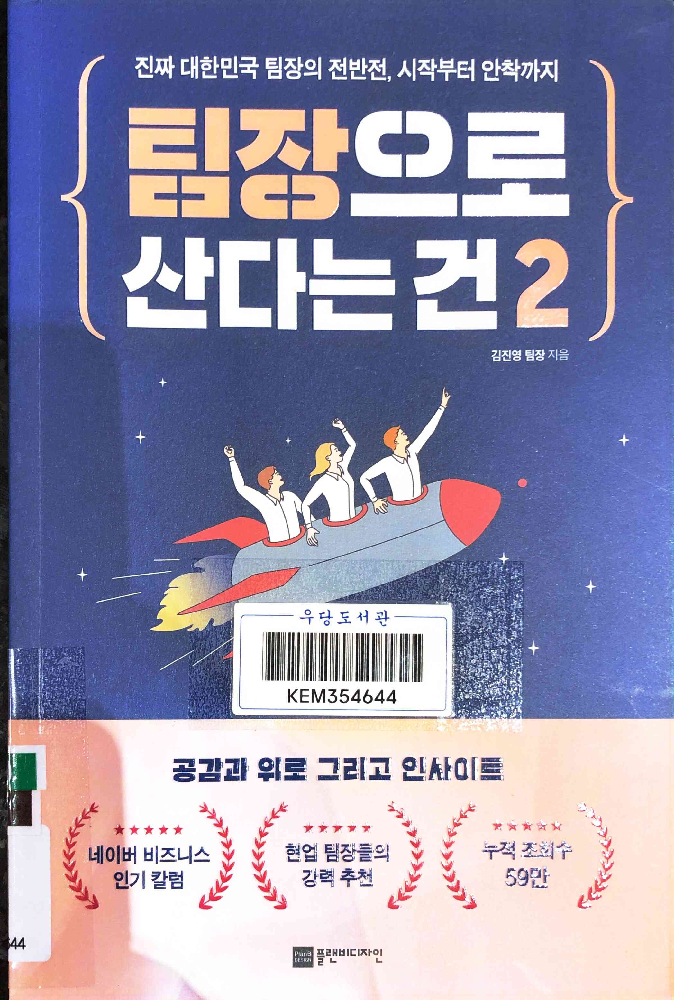

# PART 1 팀장으로 시작한다는 건

## 01 내일의 팀장이 오늘 반드시 해야할 일
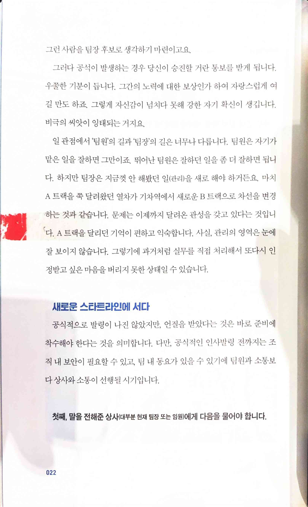

> 일 관점에서 '팀원'의 길과 '팀장'의 길은 너무나 다릅니다. 팀원은 자기가 맡은 일을 잘하면 그만이죠. 뛰어난 팀원은 잘하던 일을 좀 더 잘하면 됩니다. 하지만 팀장은 지금껏 안 해봤던 일(관리)을 새로 해야 하거든요. 마치 A 트랙을 쭉 달려왔던 열차가 기차역에서 새로운 B 트랙으로 차선을 변경하는 것과 같습니다. 문제는 이제까지 달려온 관성을 갖고 있다는 것입니다. A 트랙을 달리던 기억이 편하고 익숙합니다. 사실, 관리의 영역은 눈에 잘 보이지 않습니다. 그렇기에 과거처럼 실무를 직접 처리해서 또다시 인정받고 싶은 마음을 버리지 못한 상태일 수 있습니다.

## 02 신임 팀장에게 던지는, 단 하나의 질문
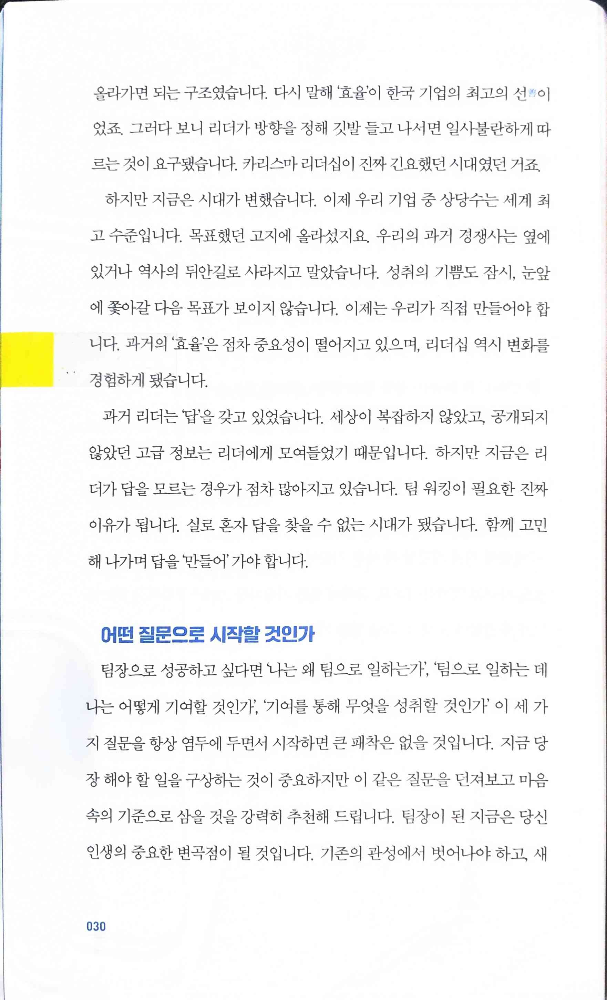

> 이제는 우리가 직접 만들어야 합니다. 과거의 '효율'은 점차 중요성이 떨어지고 있으며, 리더십 역시 변화를 경험하게 됐습니다.
* [축적의 시간](https://github.com/hyunjun/bookmarks/blob/master/books/accumulation_time.md)이나 [축적의 길](https://github.com/hyunjun/bookmarks/blob/master/books/accumulation_road.md)등과 일맥상통하는 이야기

## 03 그라운드 룰 수립이 초기 성공을 결정한다
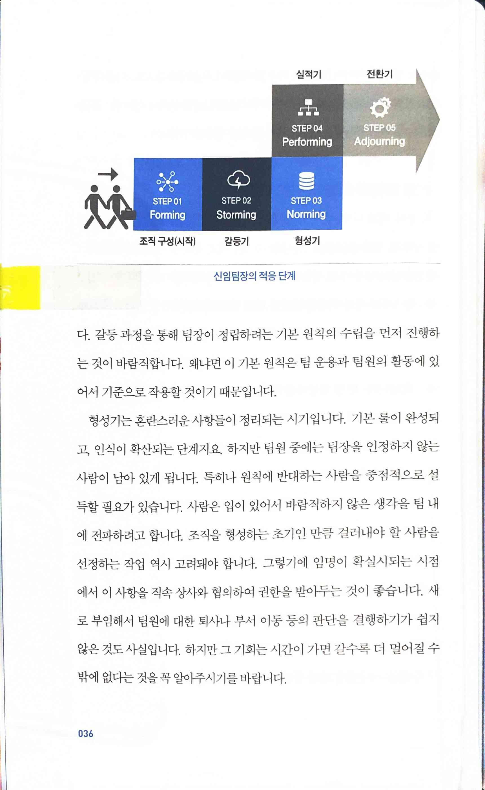

> 신임팀장의 적응 단계

## 04 부동산, 주식, 코인의 시대, 직원을 어떻게 동기부여 할 것인가?
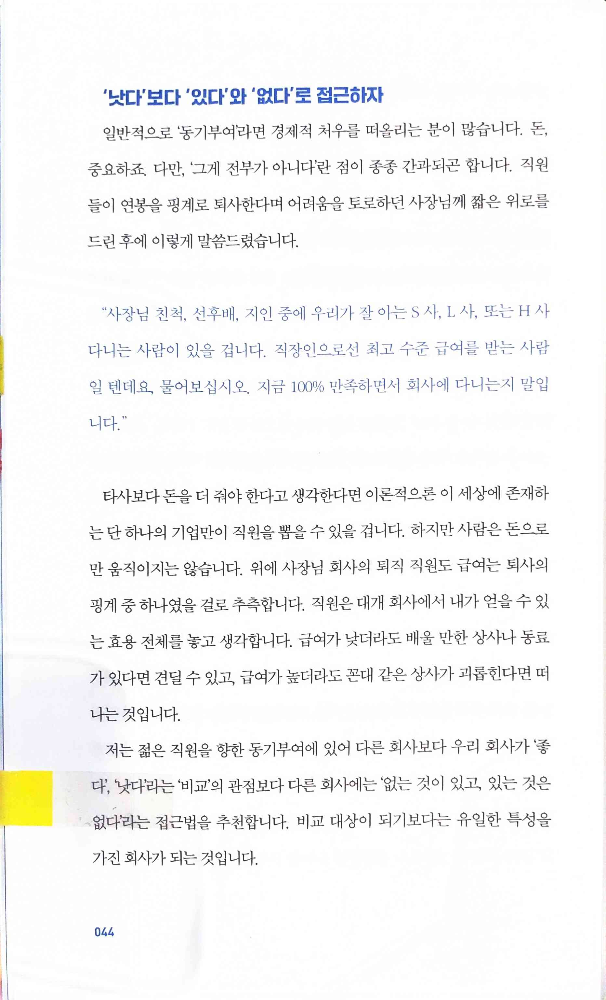

> 저는 젊은 직원을 향한 동기부여에 있어 다른 회사보다 우리 회사가 좋다', '낫다'라는 '비교'의 관점보다 다른 회사에는 '없는 것이 있고 있는 것은 없다'라는 접근법을 추천합니다. 비교 대상이 되기보다는 유일한 특성을 가진 회사가 되는 것입니다.

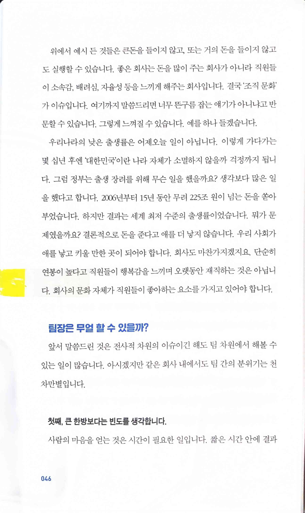

> 단순히 연봉이 높다고 직원들이 행복감을 느끼며 오랫동안 재직하는 것은 아닙니다. 회사의 문화 자체가 직원들이 좋아하는 요소를 가지고 있어야 합니다.

## 05 당신의 리더십이 향해야 할 곳
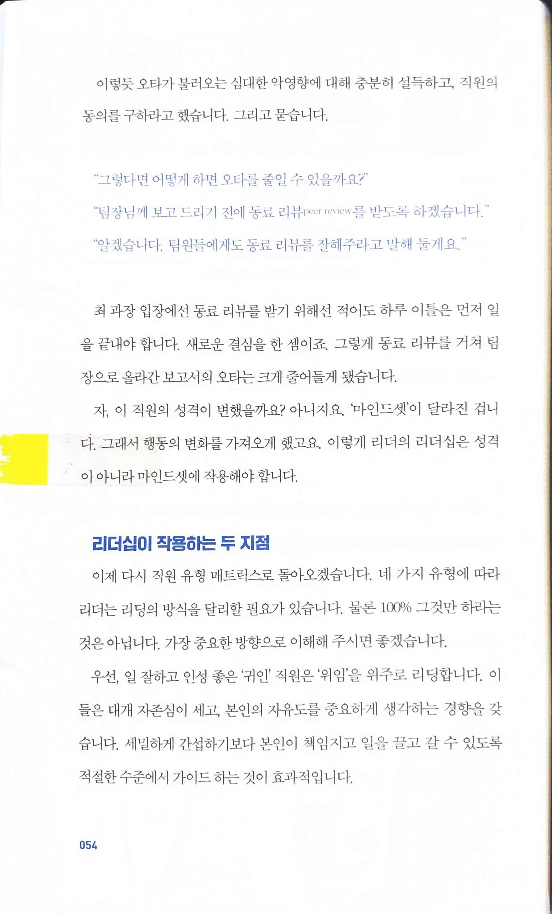

> 리더의 리더십은 성격이 아니라 마인드셋에 작용해야 합니다.

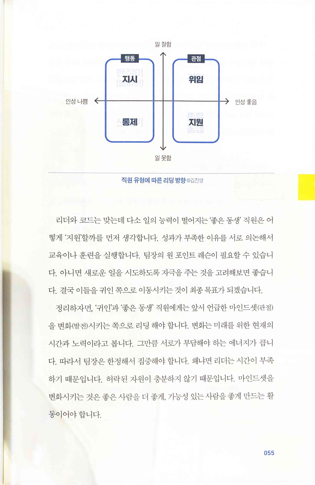

> 직원 유형에 따른 리딩 방향

## 06 팀장님은 충분히 똑똑합니다
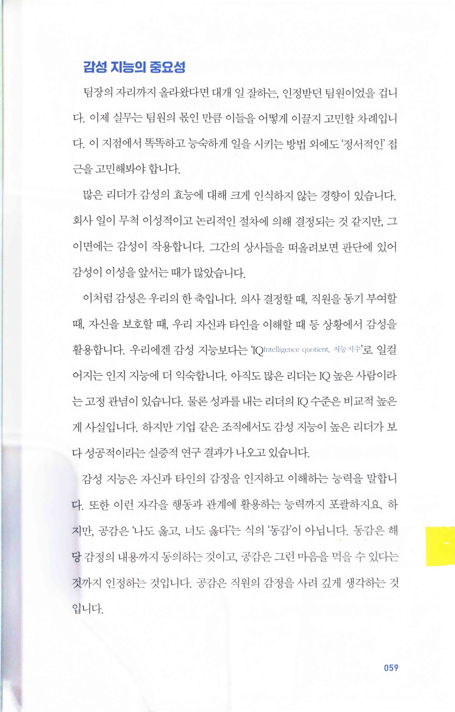

> 감성 지능은 자신과 타인의 감정을 인지하고 이해하는 능력을 말합니다. 또한 이런 자각을 행동과 관계에 활용하는 능력까지 포괄하지요. 하지만, 공감은 '나도 옳고 너도 옳다'는 식의 '동감'이 아닙니다. 동감은 해당감정의 내용까지 동의하는 것이고, 공감은 그런 마음을 먹을 수 있다는 것까지 인정하는 것입니다. 공감은 직원의 감정을 사려 깊게 생각하는 것입니다.

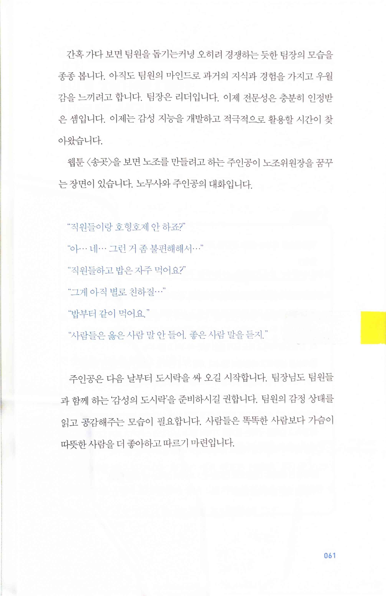

> 웹툰<송곳>, "사람들은 옳은 사람 말 안 들어. 좋은 사람 말을 듣지."
* 여전히 이게 옳은 건지는 모르겠지만, 현실이 그렇다는 뜻이겠지 아마

## 07 세대 차이에 대한 새로운 생각

## 08 팀장에게 꼭 필요한 마인드셋 다섯 장면
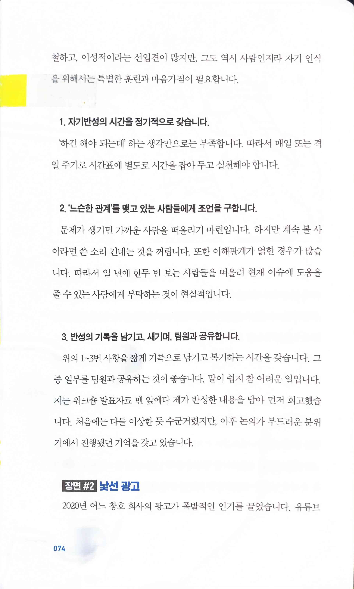

> 1. 자기반성의 시간을 정기적으로 갖습니다.
>
> 2. '느슨한 관계'를 맺고 있는 사람들에게 조언을 구합니다.
>
> 3. 반성의 기록을 남기고, 새기며, 팀원과 공유합니다.

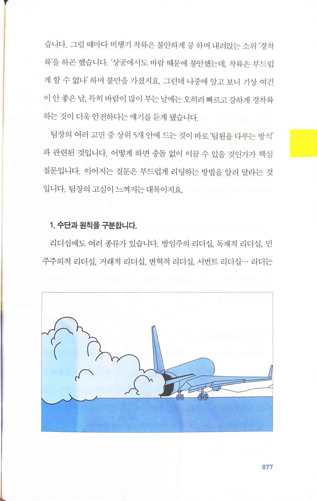 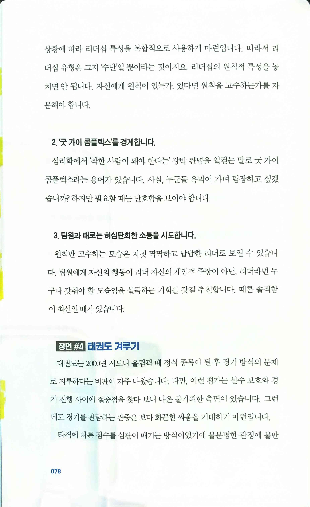

> 팀장의 여러 고민 중 상위 5개 안에 드는 것이 바로 '팀원을 다루는 방식'과 관련된 것입니다. 어떻게 하면 충돌 없이 이끌 수 있을 것인가가 핵심질문입니다. 이어지는 질문은 부드럽게 리딩하는 방법을 알려 달라는 것입니다. 팀장의 고심이 느껴지는 대목이지요.
>
> 1. 수단과 원칙을 구분합니다.
>
> 2. '굿 가이 콤플렉스'를 경계합니다.
>
> 3. 팀원과 때로는 허심탄회한 소통을 시도합니다.

> 팀장은 혼자 움직일 것이 아니라 조직을 움직여서 성과를 낼 수 있습니다.
>
> 1. 조직 문화에 주는 영향을 자각합니다.
>
> 2. 조직의 차원에서 생각합니다.
>
> 3. 결과는 정책과 제도로 결실을 맺습니다.

# PART 2 팀장으로 안착한다는 건

## 01 일을 잘 맡기는 3단계 방식
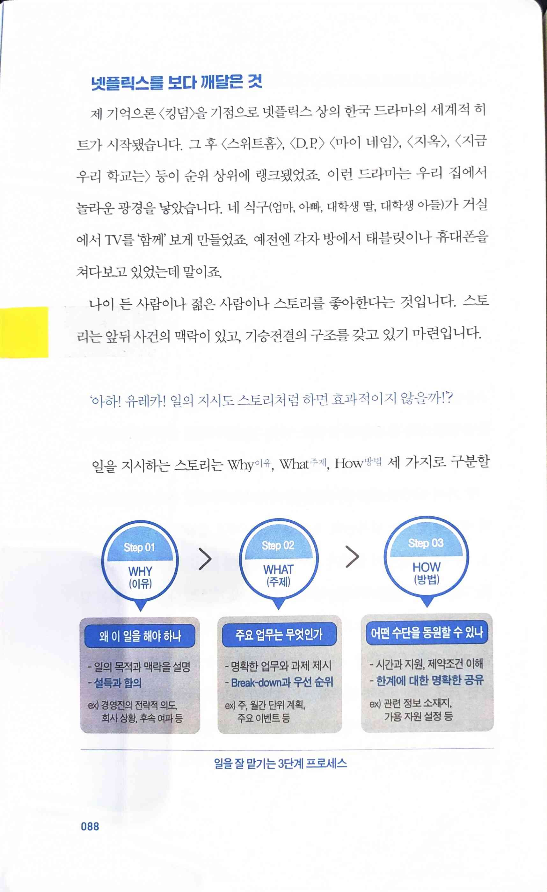 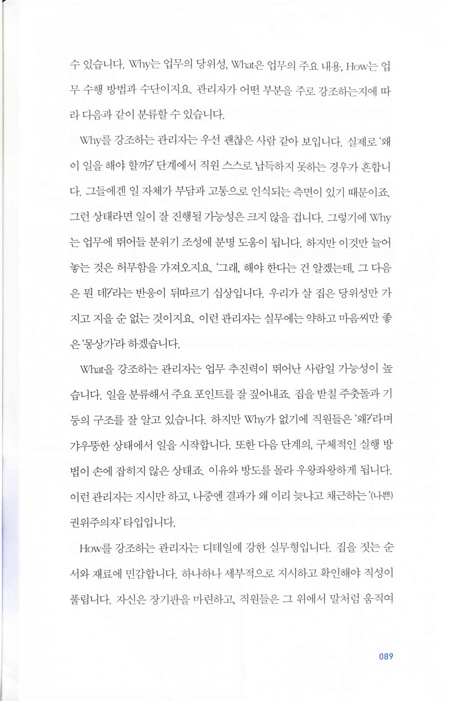

> 나이 든 사람이나 젊은 사람이나 스토리를 좋아한다는 것입니다. 스토리는 앞뒤 사건의 맥락이 있고, 기승전결의 구조를 갖고 있기 마련입니다.
>
> Why는 업무의 당위성: 분위기 조성, 실무에는 약하고 마음씨만 좋은 '몽상가'
>
> What은 업무의 주요 내용: 업무 추진력, 지시만 하고, 나중엔 결과가 왜 이리 늦냐고 채근하는 '나쁜 권위주의자' 타입
>
> How는 업무 수행 방법과 수단: 디테일에 강한 실무형, 마이크로매니저

## 02 이상한 직원에게 제대로 지시하는 법
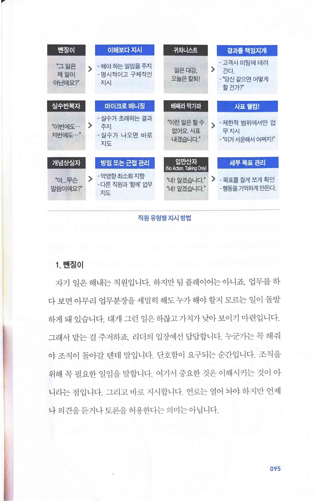

> 직원 유형별 지시 방법

## 03 코칭과 멘토링, 이걸 다 할 수 있나?
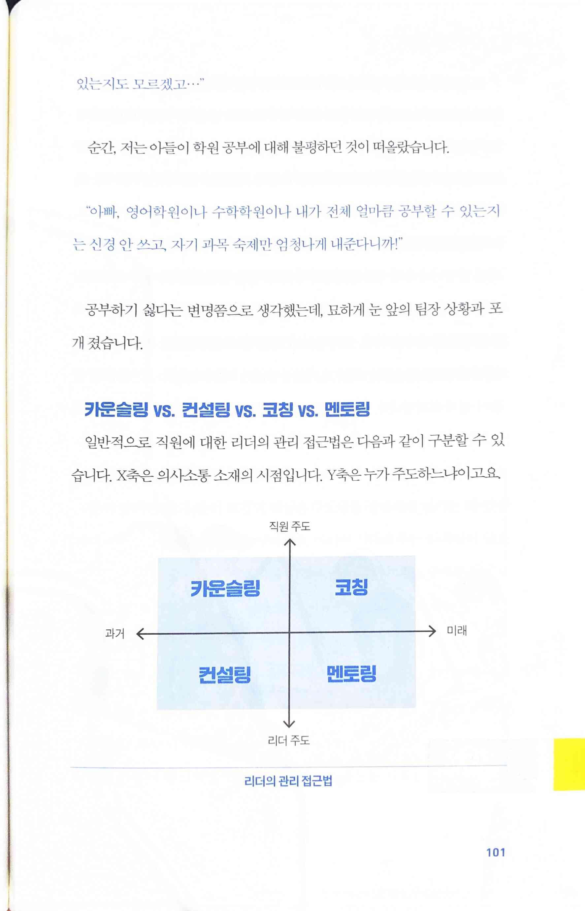 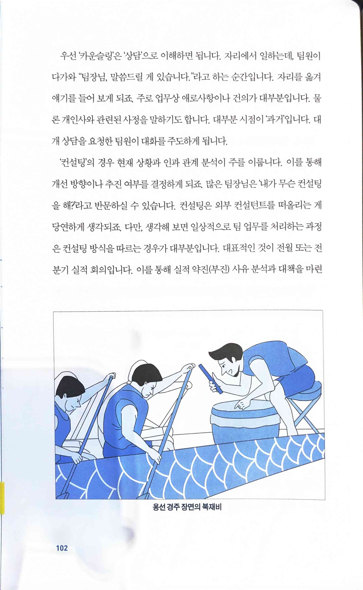 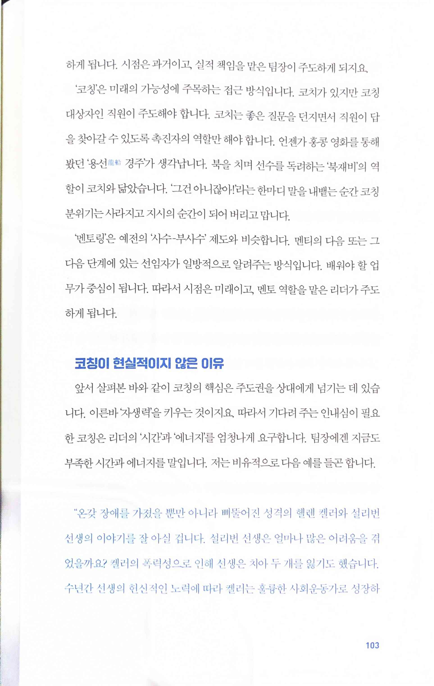

> 카운슬링 vs. 컨설팅 VS. 코칭 VS. 멘토링
>
> '카운슬링'은 '상담'
>
> '컨설팅'의 경우 현재 상황과 인과관계 분석
>
> '코칭'은 미래의 가능성에 주목하는 접근 방식, 핵심은 주도권을 상대에게 넘기는 데 있음. 이른바 '자생력'을 키우는 것. 인내심이 필요
>
> '멘토링'은 예전의 사수-부사수' 제도와 비슷

## 04 성과와 맞물린 팀 미팅과 1 on 1 면담
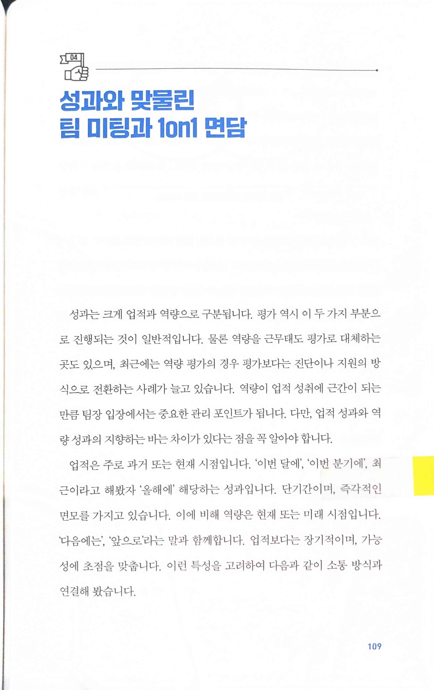

> 업적은 주로 과거 또는 현재 시점... 단기간이며, 즉각적인 면모
>
> 역량은 현재 또는 미래 시점... 업적보다는 장기적이며, 가능성에 초점

## 05 피드백의 일반 원칙
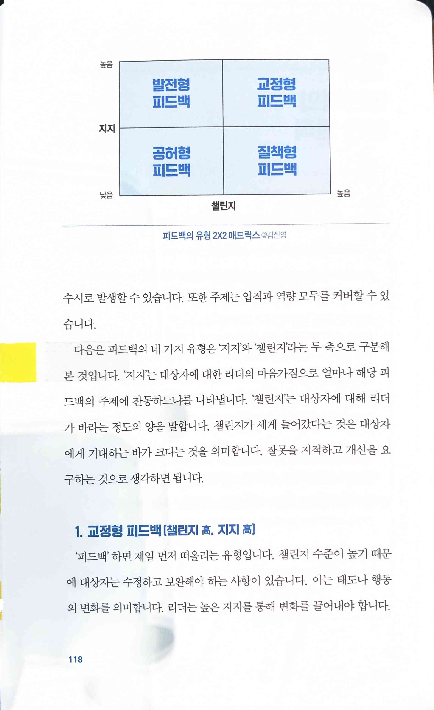

> 피드백의 유형 2X2 매트릭스
>
> '지지'는 대상자에 대한 리더의 마음가짐으로 얼마나 해당 피드백의 주제에 찬동하느냐
>
> '챌린지'는 대상자에 대해 리더가 바라는 정도의 양

 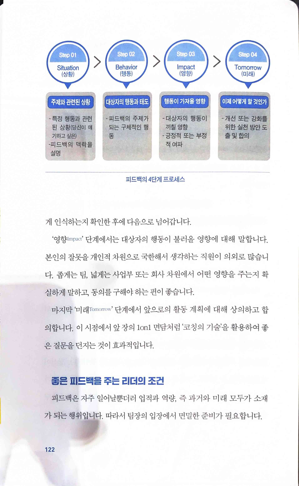

> 피드백의 프로세스, SBIT
>
> '상황 Situation'
>
> '행동과 태도 Behavior'
>
> '영향 Impact'
>
> '미래 Tomorrow'

## 06 모두가 꺼리는 평가결과 피드백

## 07 일잘 팀장은 상사와 껄끄럽다
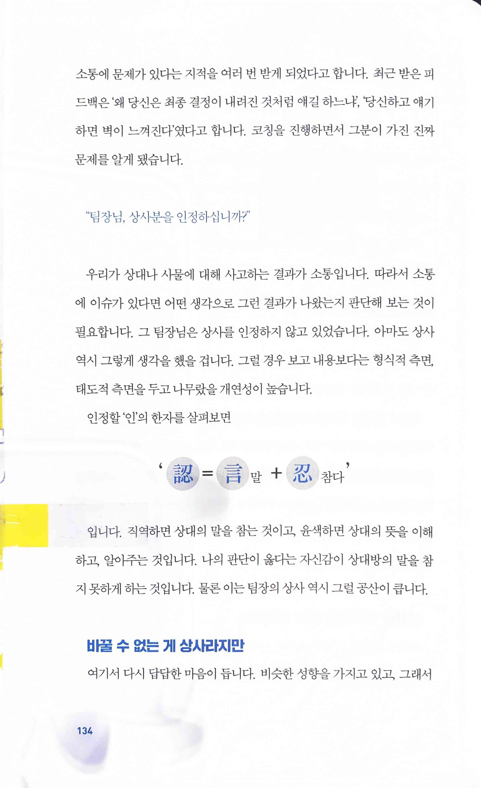

> 인정할 '인' 認 직역하면 상대의 말을 참는 것이고, 윤색하면 상대의 뜻을 이해하고 알아주는 것

## 08 회식만 바꿔도 달라지는 팀 분위기

## 09 원격근무를 리더십 재구축의 기회로

## 10 누구나 시작은 하지만, 아무나 끝맺진 못한다

## 11 인사이트를 주는 영화 3선
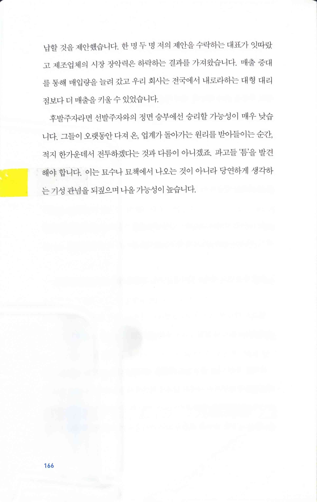

> 후발주자라면 선발주자와의 정면 승부에선 승리할 가능성이 매우 낮습니다. 그들이 오랫동안 다져 온 업계가 돌아가는 원리를 받아들이는 순간, 적지 한가운데서 전투하겠다는 것과 다름이 아니겠죠. 파고들 '틈'을 발견해야 합니다. 이는 묘수나 묘책에서 나오는 것이 아니라 당연하게 생각하는 기성관념을 되짚으며 나올 가능성이 높습니다.

# PART 3 팀장으로 발전한다는 건

## 01 처음부터 힘든 이유가 있었다
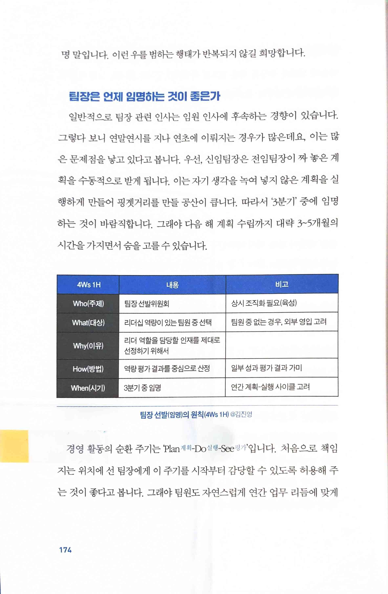

> 경영 활동의 순환 주기는 'Plan 계획-Do 실행-See 평가'

## 02 리더는 자신의 언어로 분명하게 말한다
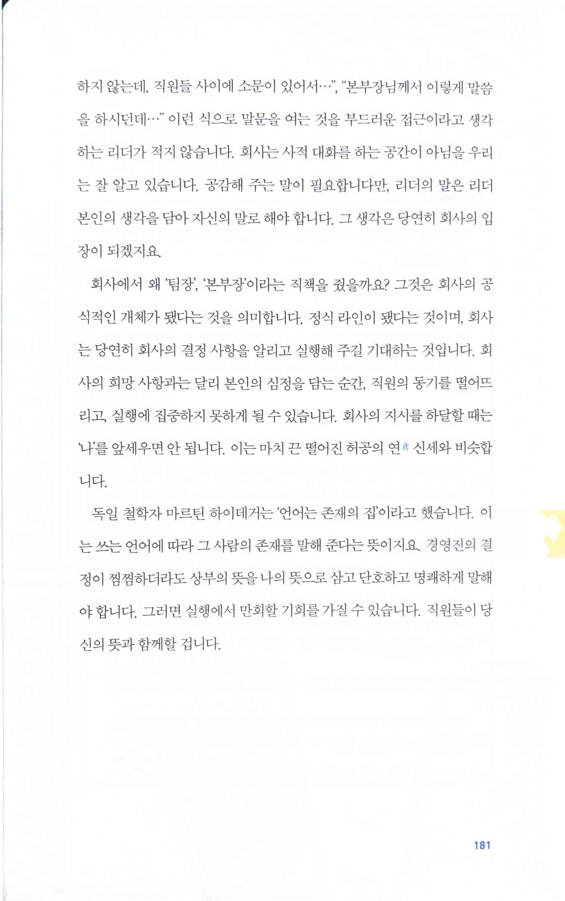

> 독일 철학자 마르틴 하이데거는 '언어는 존재의 집'이라고 했습니다. 이는 쓰는 언어에 따라 그 사람의 존재를 말해 준다는 뜻이지요.

## 03 리더십은 개인기가 아니다

## 04 실패를 예정하며 시작되는 혁신 활동
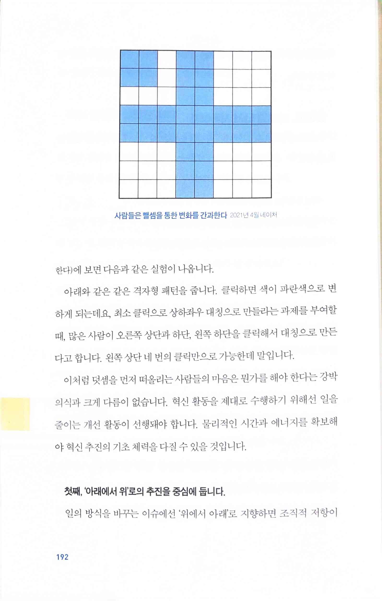

> 이처럼 덧셈을 먼저 떠올리는 사람들의 마음은 뭔가를 해야 한다는 강박의식과 크게 다름이 없습니다. 혁신 활동을 제대로 수행하기 위해선 일을 줄이는 개선 활동이 선행돼야 합니다.
* 핵심에 집중하는 거와 통하는 듯

## 05 사장처럼 일하라는 말의 의미
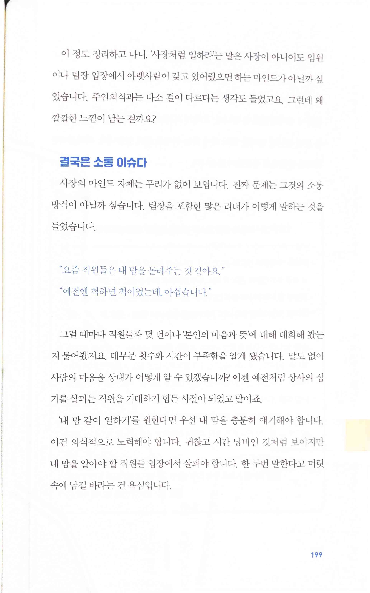

> '내 맘 같이 일하기'를 원한다면 우선 내 맘을 충분히 얘기해야 합니다. 이건 의식적으로 노력해야 합니다. 귀찮고 시간 낭비인 것처럼 보이지만 내 맘을 알아야 할 직원들 입장에서 살펴야 합니다. 한두번 말한다고 머릿속에 남길 바라는 건 욕심입니다.

## 06 벽 앞에 멈춰선 팀장 리더십

## 07 행복한 팀장을 위한 제언
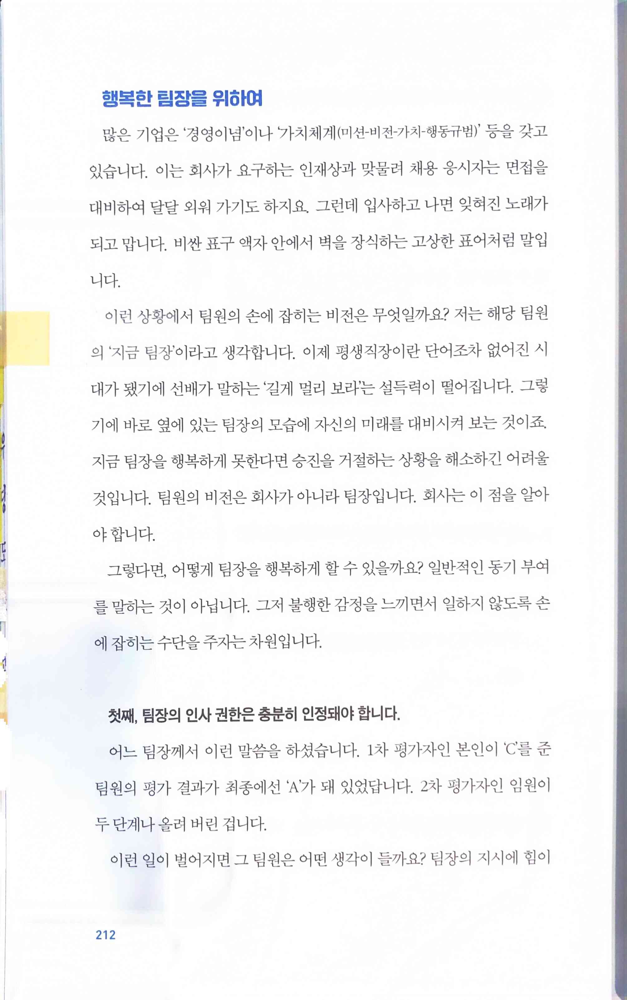

> 팀원의 손에 잡히는 비전은 해당 팀원의 '지금 팀장'

## 08 위로가 되는 영화 3선