# 팀 토폴로지
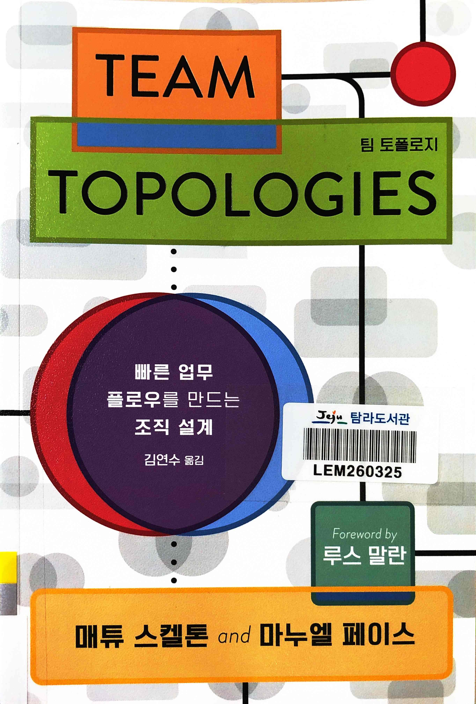

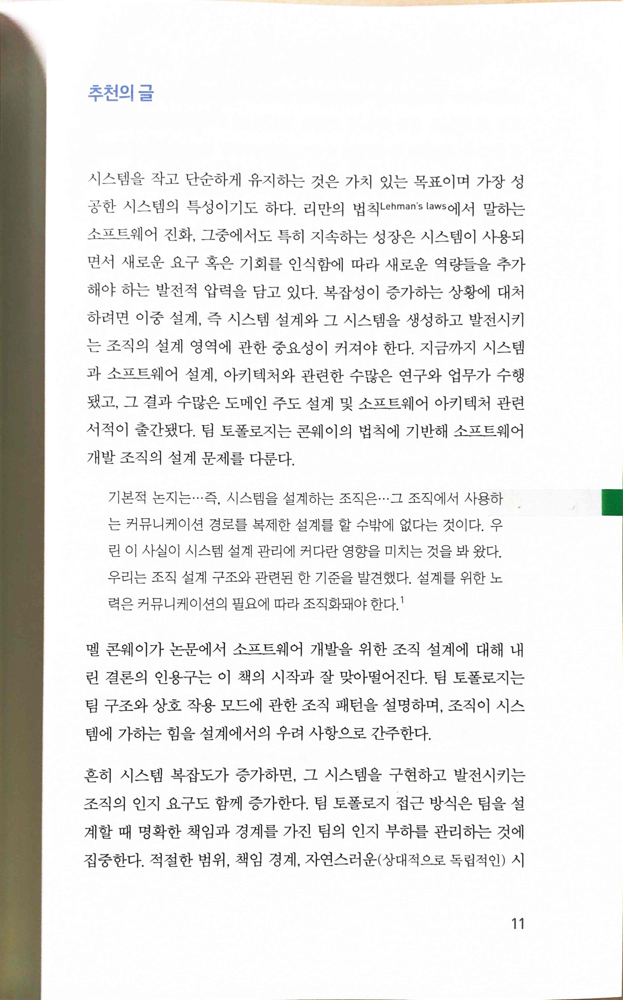

* `기본적 논지는 즉, 시스템을 설계하는 조직은..… 그 조직에서 사용하는 커뮤니케이션 경로를 복제한 설계를 할 수밖에 없다는 것이다. 우린 이 사실이 시스템 설계 관리에 커다란 영향을 미치는 것을 봐 왔다.우리는 조직 설계 구조와 관련된 한 기준을 발견했다. 설계를 위한 노력은 커뮤니케이션의 필요에 따라 조직화돼야 한다.`
  * Conway's law

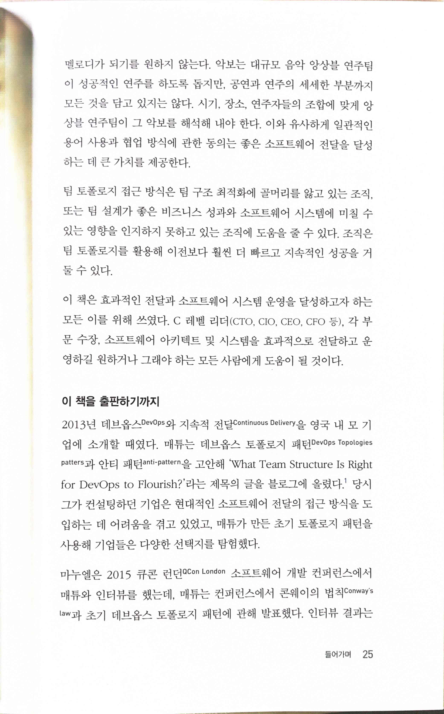

* `악보는 대규모 음악 앙상블 연주팀이 성공적인 연주를 하도록 돕지만, 공연과 연주의 세세한 부분까지 모든 것을 담고 있지는 않다. 시기, 장소, 연주자들의 조합에 맞게 앙상블 연주팀이 그 악보를 해석해 내야 한다. 이와 유사하게 일관적인 용어 사용과 협업 방식에 관한 동의는 좋은 소프트웨어 전달을 달성하는 데 큰 가치를 제공한다.`

## 1부 전달 수단으로서의 팀
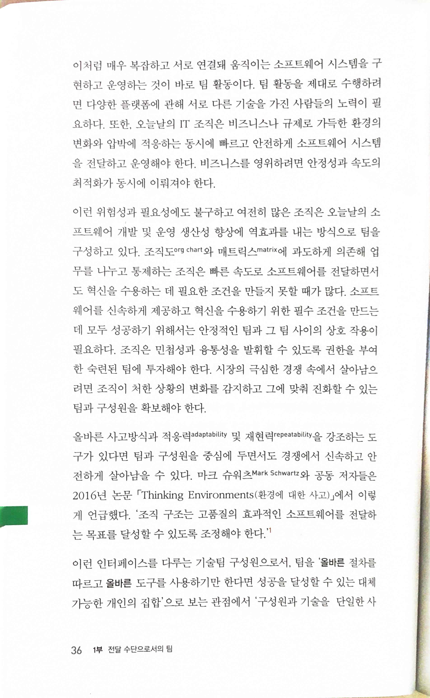

* `조직 구조는 고품질의 효과적인 소프트웨어를 전달하는 목표를 달성할 수 있도록 조정해야 한다.`
  * [Thinking Environments - IT Revolution](https://itrevolution.com/book/thinking-environments)

### 1장 조직도의 문제점
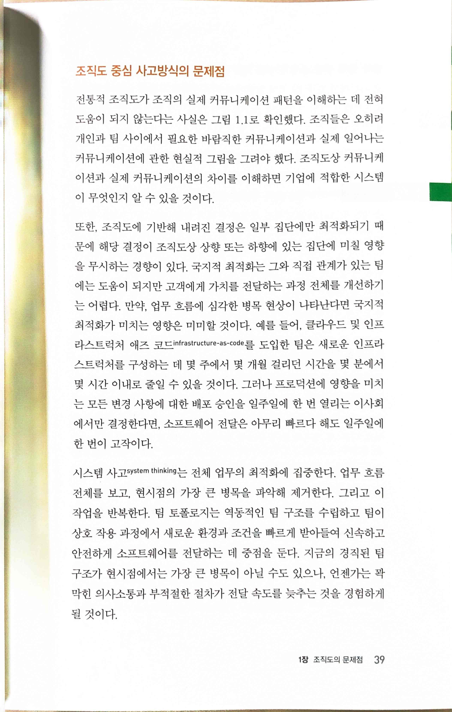

* `조직도상 커뮤니케이션과 실제 커뮤니케이션의 차이를 이해하면 기업에 적합한 시스템이 무엇인지 알 수 있을 것이다…조직도에 기반해 내려진 결정은 일부 집단에만 최적화되기 때문에 해당 결정이 조직도상 상향 또는 하향에 있는 집단에 미칠 영향을 무시하는 경향이 있다. 국지적 최적화는 그와 직접 관계가 있는 팀에는 도움이 되지만 고객에게 가치를 전달하는 과정 전체를 개선하기는 어렵다. 만약, 업무 흐름에 심각한 병목 현상이 나타난다면 국지적 최적화가 미치는 영향은 미미할 것이다.`
* `시스템 사고 system thinking는 전체 업무의 최적화에 집중한다. 업무 흐름 전체를 보고, 현시점의 가장 큰 병목을 파악해 제거한다. 그리고 이 작업을 반복한다.`
* (부분 최적화가 아니라 전체 업무의 최적화, 그리고 반복. 당연하게도 한 번에 되지도 않고, 또 계속 살펴보면서 상황이 바뀌면서 발생하는 문제를 계속 추적하고 해결해야 한다)

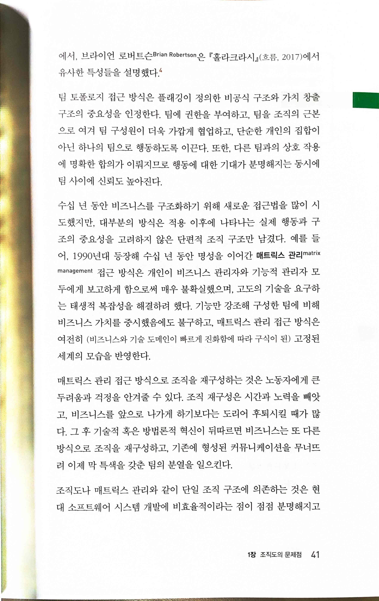

* `팀 토폴로지 접근 방식은 조직 구조에서 적응형 모델을 강조하고, 팀 관계를 무엇보다 중요하게 여기면서 기술불가지론적 technology-agnostic 메커니즘을 제공한다… 팀 토폴로지의 궁극적 목적은 팀이 고객의 요구를 제대로 반영한 소프트웨어를 만들고, 구현과 운영, 소유가 쉬운 소프트웨어를 제작하도록 돕는 것이다.`
* (기술 조직을 제대로 운영하기 위해서는 기술 외적인 부분을 신경써야 한다?)

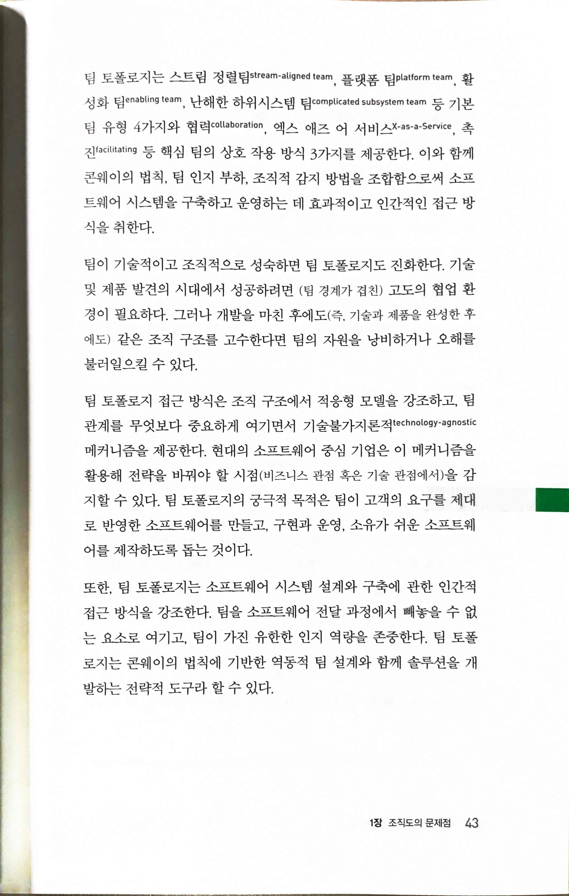

* `팀 토폴로지 접근 방식은 조직 구조에서 적응형 모델을 강조하고, 팀 관계를 무엇보다 중요하게 여기면서 기술불가지론적 technology-agnostic 메커니즘을 제공한다… 팀 토폴로지의 궁극적 목적은 팀이 고객의 요구를 제대로 반영한 소프트웨어를 만들고, 구현과 운영, 소유가 쉬운 소프트웨어를 제작하도록 돕는 것이다.`
  * (기술 조직을 제대로 운영하기 위해서는 기술 외적인 부분을 신경써야 한다는 뜻일까?)

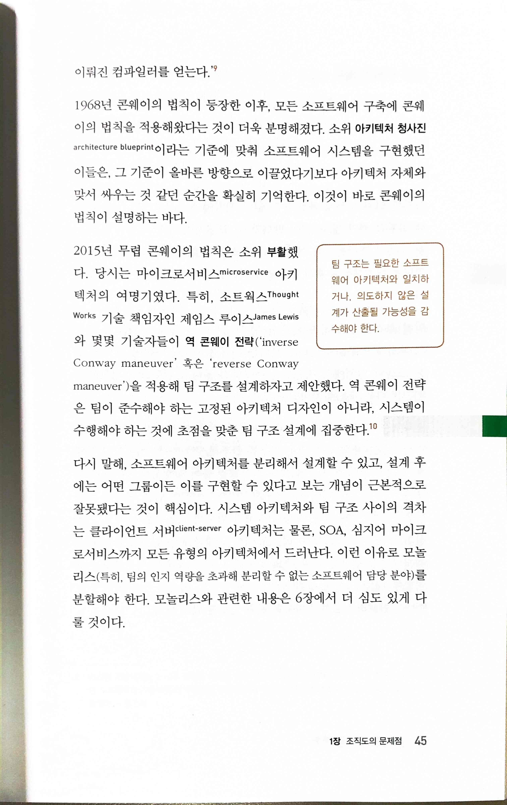

* `역 콘웨이 전략(inverse Conway maneuver 혹은 reverse Conway maneuver)은 팀이 준수해야 하는 고정된 아키텍처 디자인이 아니라, 시스템이 수행해야 하는 것에 초점을 맞춘 팀 구조 설계에 집중한다. 다시 말해, 소프트웨어 아키텍처를 분리해서 설계할 수 있고, 설계 후에는 어떤 그룹이든 이를 구현할 수 있다고 보는 개념이 근본적으로 잘못됐다는 것이 핵심이다.`

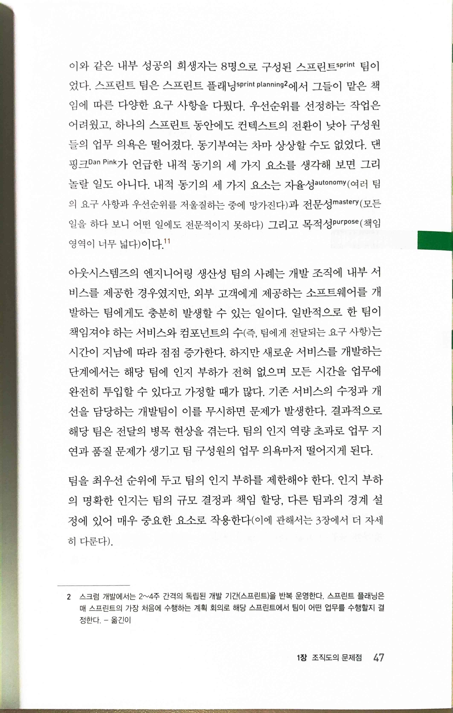

* `내적 동기의 세 가지 요소는 자율성 autonomy (여러 팀의 요구 사항과 우선순위를 저울질하는 중에 망가진다)과 전문성 mastery (모든 일을 하다 보니 어떤 일에도 전문적이지 못하다) 그리고 목적성purpose (책임영역이 너무 넓다)이다.`

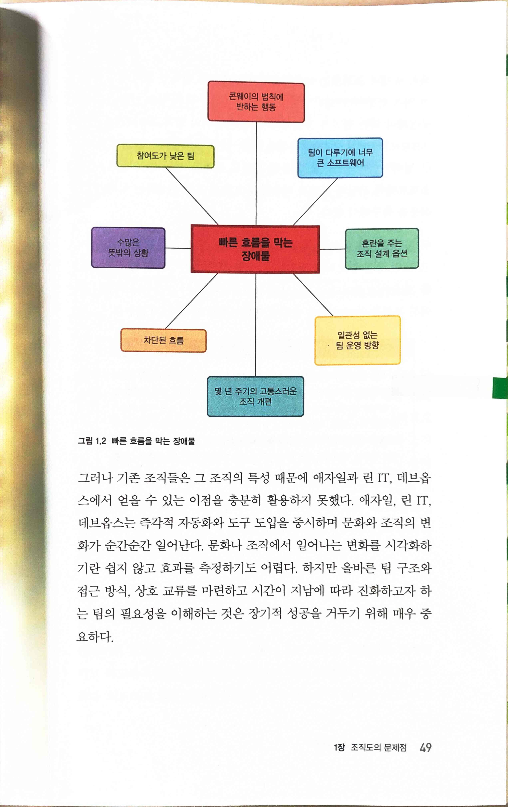

### 2장 콘웨이의 법칙과 중요성
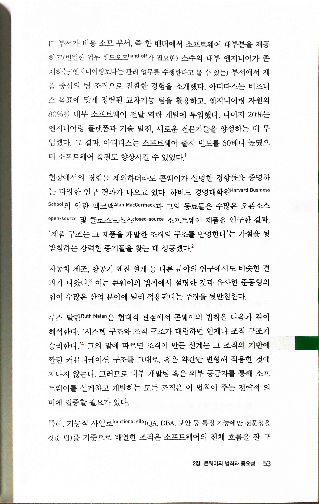

* `루스 말란Ruth Malan은 현대적 관점에서 콘웨이의 법칙을 다음과 같이 해석한다. '시스템 구조와 조직 구조가 대립하면 언제나 조직 구조가 승리한다.'`

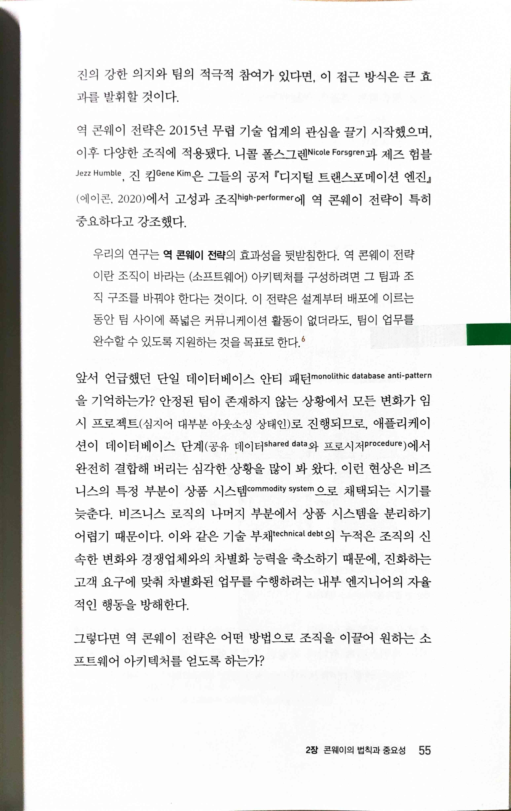

* `우리의 연구는 역 콘웨이 전략의 효과성을 뒷받침한다. 역 콘웨이 전략이란 조직이 바라는 (소프트웨어) 아키텍처를 구성하려면 그 팀과 조직 구조를 바꿔야 한다는 것이다. 이 전략은 설계부터 배포에 이르는 동안 팀 사이에 폭넓은 커뮤니케이션 활동이 없더라도, 팀이 업무를 완수할 수 있도록 지원하는 것을 목표로 한다.`

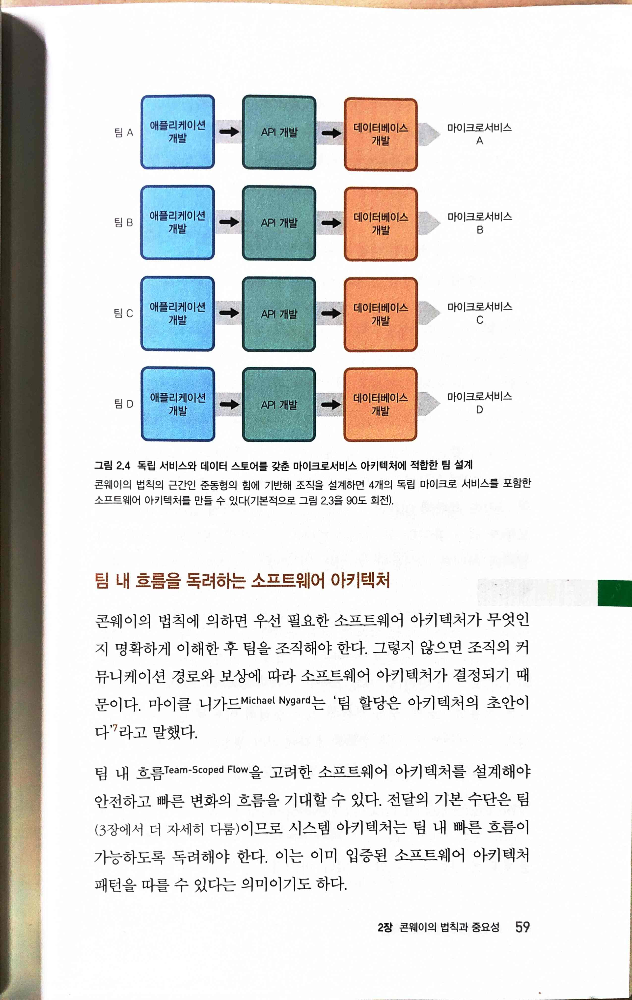

* `콘웨이의 법칙에 의하면 우선 필요한 소프트웨어 아키텍처가 무엇인지 명확하게 이해한 후 팀을 조직해야 한다. 그렇지 않으면 조직의 커뮤니케이션 경로와 보상에 따라 소프트웨어 아키텍처가 결정되기 때문이다.`

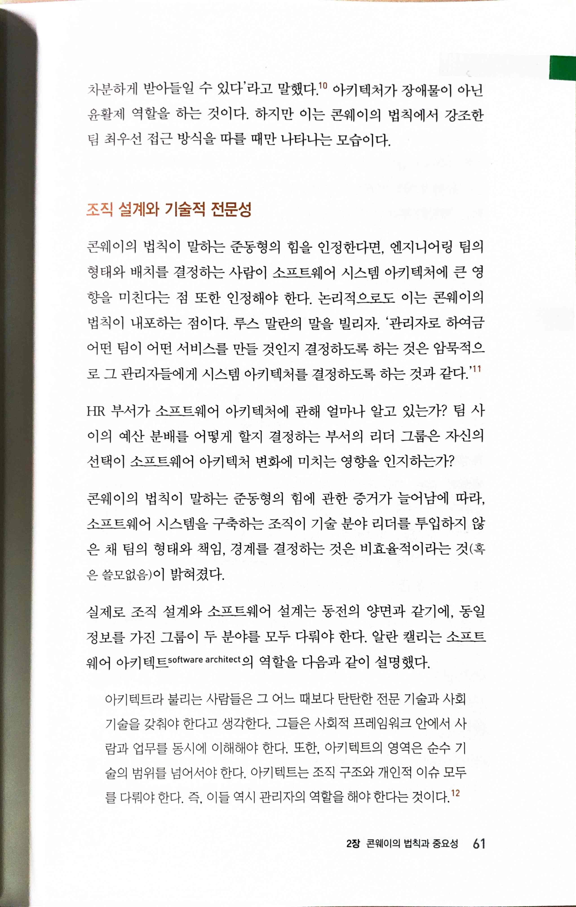 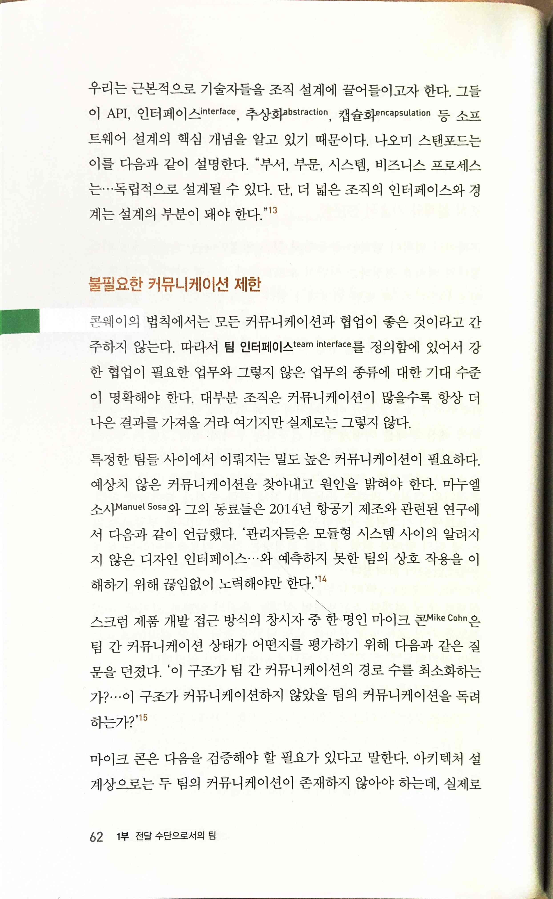 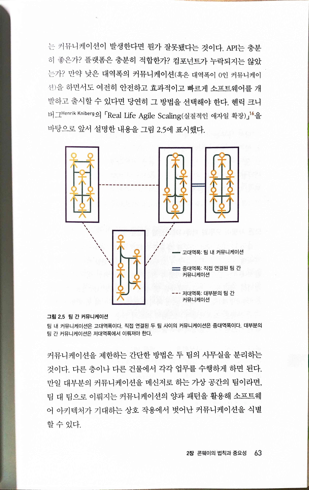

* `아키텍처가 장애물이 아닌 윤활제 역할을 하는 것이다. 하지만 이는 콘웨이의 법칙에서 강조한 팀 최우선 접근 방식을 따를 때만 나타나는 모습이다.`
* `콘웨이의 법칙에서는 모든 커뮤니케이션과 협업이 좋은 것이라고 간주하지 않는다. 따라서 팀 인터페이스 team interface를 정의함에 있어서 강한 협업이 필요한 업무와 그렇지 않은 업무의 종류에 대한 기대 수준이 명확해야 한다. 대부분 조직은 커뮤니케이션이 많을수록 항상 더 나은 결과를 가져올 거라 여기지만 실제로는 그렇지 않다.`
* `팀 내 커뮤니케이션은 고대역폭이다. 직접 연결된 두 팀 사이의 커뮤니케이션은 중대역폭이다. 대부분의 팀 간 커뮤니케이션은 저대역폭에서 이뤄져야 한다.`
* (이 부분을 이해하지 못하는 사람들이 굉장히 많다는 걸 실감하고 있다. 미팅을 무조건 신봉하고, 뭔가 일이 있으면 우선 미팅부터 하자는 이야기를 하는 경우도 많은 커뮤니케이션 = 좋은 결과라고 생각하기 때문에 발생하는 일이 아닐까?)

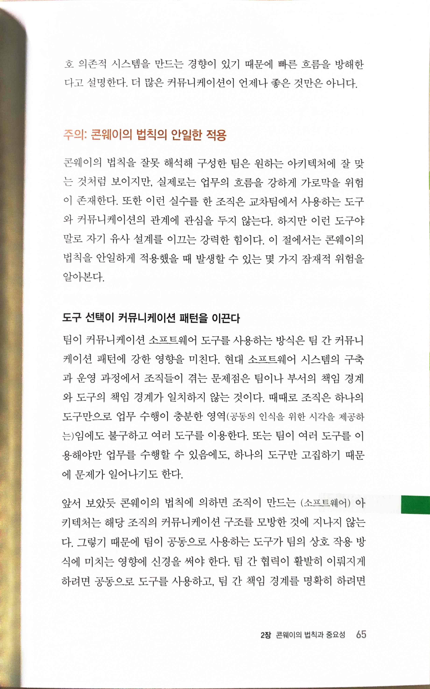

* `앞서 보았듯 콘웨이의 법칙에 의하면 조직이 만드는 (소프트웨어) 아키텍처는 해당 조직의 커뮤니케이션 구조를 모방한 것에 지나지 않는다. 그렇기 때문에 팀이 공동으로 사용하는 도구가 팀의 상호 작용 방식에 미치는 영향에 신경을 써야 한다. 팀 간 협력이 활발히 이뤄지게 하려면 공동으로 도구를 사용하고, 팀 간 책임 경계를 명확히 하려면 별도의 도구(혹은 동일 도구의 분리된 인스턴스)를 사용하는 것이 바람직하다.`
* (그래서 jira를 도입해서 비개발조직과의 communication을 통일하기를 원하지만 이 부분이 잘 되고 있지 않다. 비개발조직에 기본적으로 개발도구인 jira를 사용하자고 하는게 폭력적이라고 조언하시는 분도 있긴 하지만, 현실적으로 개발조직이 issue tracker를 쓰지 않을 수는 없다는 생각을 하기 때문에 최선은 아니더라도 필요하지 않을까? 라는 생각을 하고 있다)

* `콘웨이의 법칙에 따라 조직 구조를 변경하는 목적은 조직이 소프트웨어 시스템 관련 솔루션을 만드는 공간(컨텍스트, 제약 사항 등)을 개선하는 것이다. 이 두 가지 접근 방식은 상호 배타적이다. 소프트웨어 및 제품 개발사라면 조직 구조가 제품 아키텍처를 따라야 한다. 팀 최우선 접근 방식을 사용한다면, 관리 목적을 이유로 조직을 개편하는 일은 더이상 없어야 한다.`
* `좀 더 강하게 표현하면, 관리상 편의나 인원 감축을 위한 정기 조직개편은 조직이 소프트웨어 시스템을 효과적으로 개발하고 운영하는 능력을 마비시킨다.`

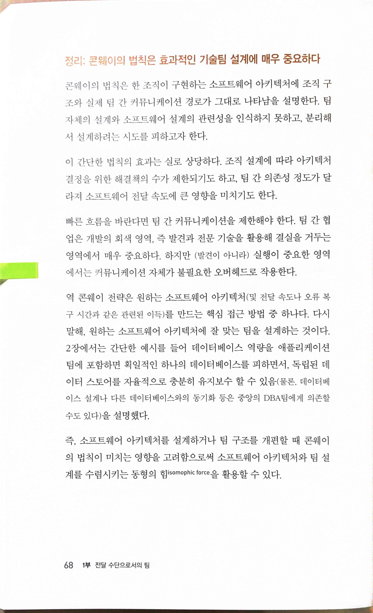

* `빠른 흐름을 바란다면 팀 간 커뮤니케이션을 제한해야 한다. 팀 간 협업은 개발의 회색 영역, 즉 발견과 전문 기술을 활용해 결실을 거두는 영역에서 매우 중요하다. 하지만 (발견이 아니라) 실행이 중요한 영역에서는 커뮤니케이션 자체가 불필요한 오버헤드로 작용한다.`

### 3장 팀 최우선 사고
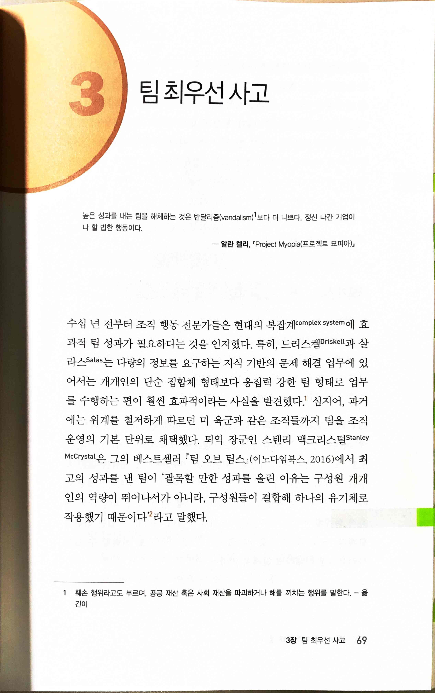

* `심지어, 과거에는 위계를 철저하게 따르던 미 육군과 같은 조직들까지 팀을 조직운영의 기본 단위로 채택했다. 퇴역 장군인 스탠리 맥크리스털 StanleyMcCrystal은 그의 베스트셀러 『팀 오브 팀스」(이노다임북스, 2016)에서 최고의 성과를 낸 팀이 '괄목할 만한 성과를 올린 이유는 구성원 개개인의 역량이 뛰어나서가 아니라, 구성원들이 결합해 하나의 유기체로 작용했기 때문이다'라고 말했다.`

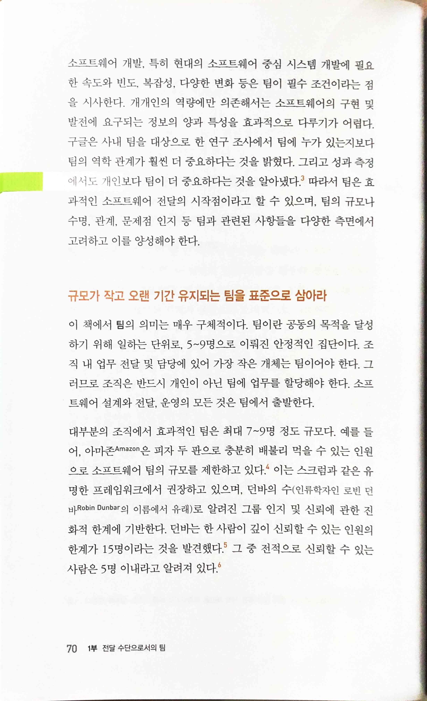

* `구글은 사내 팀을 대상으로 한 연구 조사에서 팀에 누가 있는지보다 팀의 역학 관계가 훨씬 더 중요하다는 것을 밝혔다. 그리고 성과 측정에서도 개인보다 팀이 더 중요하다는 것을 알아냈다. 따라서 팀은 효과적인 소프트웨어 전달의 시작점이라고 할 수 있으며, 팀의 규모나 수명, 관계, 문제점 인지 등 팀과 관련된 사항들을 다양한 측면에서 고려하고 이를 양성해야 한다.`

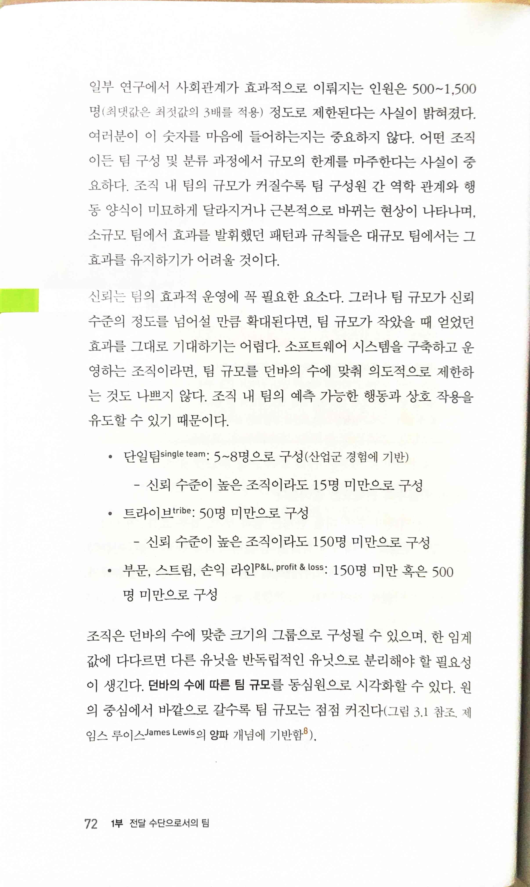

* `신뢰는 팀의 효과적 운영에 꼭 필요한 요소다. 그러나 팀 규모가 신뢰수준의 정도를 넘어설 만큼 확대된다면, 팀 규모가 작았을 때 얻었던효과를 그대로 기대하기는 어렵다. 소프트웨어 시스템을 구축하고 운영하는 조직이라면, 팀 규모를 던바의 수에 맞춰 의도적으로 제한하는 것도 나쁘지 않다. 조직 내 팀의 예측 가능한 행동과 상호 작용을 유도할 수 있기 때문이다.`

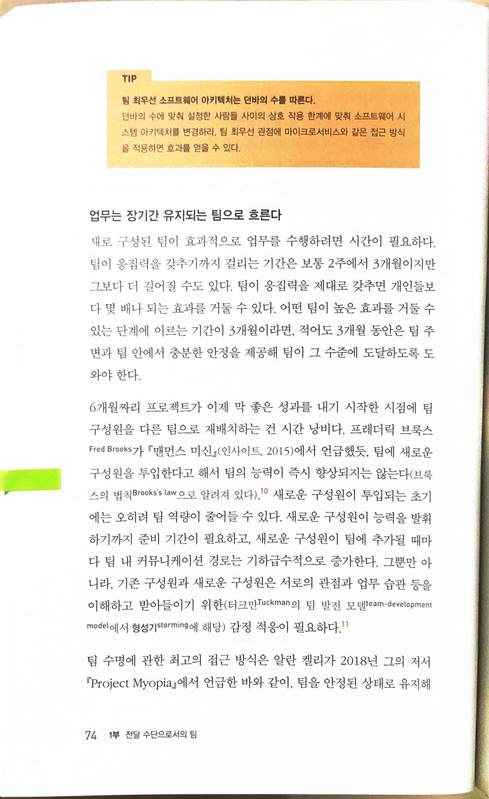

* `새로 구성된 팀이 효과적으로 업무를 수행하려면 시간이 필요하다. 팀이 응집력을 갖추기까지 걸리는 기간은 보통 2주에서 3개월이지만 그보다 더 길어질 수도 있다. 팀이 응집력을 제대로 갖추면 개인들보다 몇 배나 되는 효과를 거둘 수 있다. 어떤 팀이 높은 효과를 거둘 수 있는 단계에 이르는 기간이 3개월이라면, 적어도 3개월 동안은 팀 주변과 팀 안에서 충분한 안정을 제공해 팀이 그 수준에 도달하도록 도와야 한다.`
* `6개월짜리 프로젝트가 이제 막 좋은 성과를 내기 시작한 시점에 팀 구성원을 다른 팀으로 재배치하는 건 시간 낭비다. 프레더릭 브룩스 Fred Brooks가 『맨먼스 미신』(인사이트, 2015)에서 언급했듯, 팀에 새로운 구성원을 투입한다고 해서 팀의 능력이 즉시 향상되지는 않는다(브룩스의 법칙Brooks's law 으로 알려져 있다). 새로운 구성원이 투입되는 초기에는 오히려 팀 역량이 줄어들 수 있다. 새로운 구성원이 능력을 발휘하기까지 준비 기간이 필요하고, 새로운 구성원이 팀에 추가될 때마다 팀 내 커뮤니케이션 경로는 기하급수적으로 증가한다. 그뿐만 아니라, 기존 구성원과 새로운 구성원은 서로의 관점과 업무 습관 등을 이해하고 받아들이기 위한(터크만 Tuckman의 팀 발전 모델 team-development model에서 형성기 storming에 해당) 감정 적응이 필요하다."`

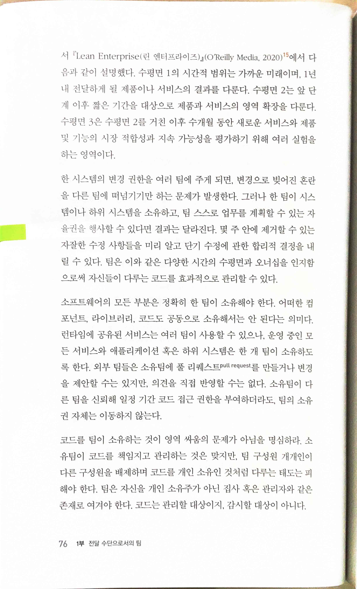

* `한 시스템의 변경 권한을 여러 팀에 주게 되면, 변경으로 빚어진 혼란을 다른 팀에 떠넘기기만 하는 문제가 발생한다. 그러나 한 팀이 시스템이나 하위 시스템을 소유하고, 팀 스스로 업무를 계획할 수 있는 자율권을 행사할 수 있다면 결과는 달라진다.`

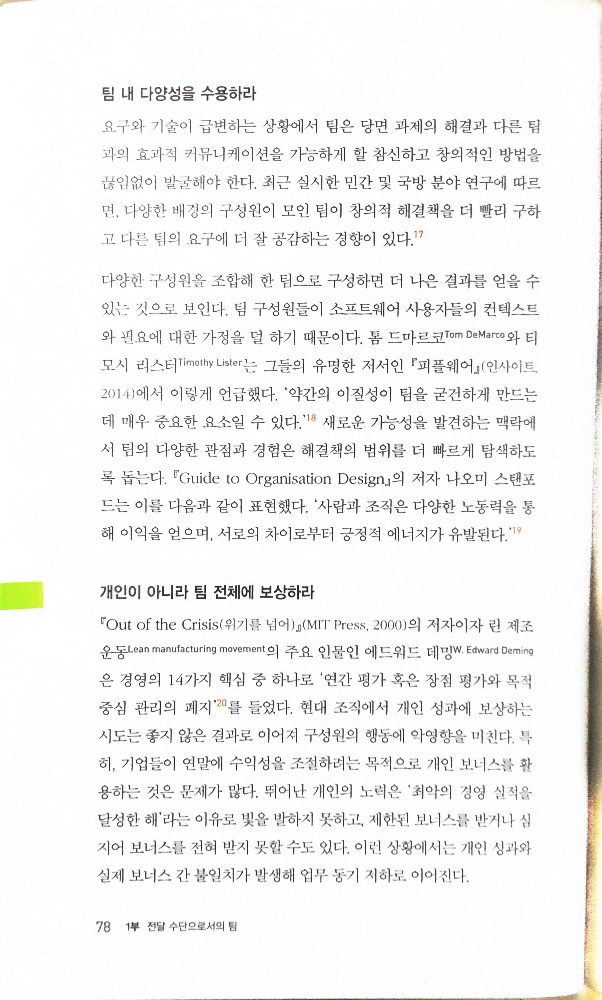

* `에드워드 데밍W. Edward Deming은 경영의 14가지 핵심 중 하나로 '연간 평가 혹은 장점 평가와 목적중심 관리의 폐지'를 들었다. 현대 조직에서 개인 성과에 보상하는 시도는 좋지 않은 결과로 이어져 구성원의 행동에 악영향을 미친다.`

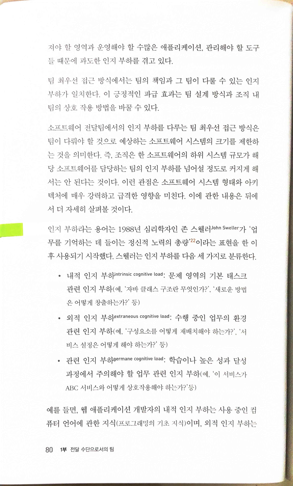

* `소프트웨어 전달팀에서의 인지 부하를 다루는 팀 최우선 접근 방식은 팀이 다뤄야 할 것으로 예상하는 소프트웨어 시스템의 크기를 제한하는 것을 의미한다. 즉, 조직은 한 소프트웨어의 하위 시스템 규모가 해당 소프트웨어를 담당하는 팀의 인지 부하를 넘어설 정도로 커지게 해서는 안 된다는 것이다. 이런 관점은 소프트웨어 시스템 형태와 아키텍처에 매우 강력하고 급격한 영향을 미친다.`
* `인지 부하라는 용어는 1988년 심리학자인 존 스웰러 John Sweller가 '업무를 기억하는 데 들이는 정신적 노력의 총량'이라는 표현을 한 이후 사용되기 시작했다.`
  * `내적 인지 부하 intinsic cognitive load : 문제 영역의 기본 태스크 관련 인지 부하(예, 자바 클래스 구조란 무엇인가?', '새로운 방법은 어떻게 창출하는가?' 등)`
  * `외적 인지 부하extraneous cognitive load: 수행 중인 업무의 환경 관련 인지 부하(예, 구성요소를 어떻게 재배치해야 하는가?', '서비스 설정은 어떻게 해야 하는가?' 등)`
  * `관련 인지 부하germane cognitive load: 학습이나 높은 성과 달성 과정에서 주의해야 할 업무 관련 인지 부하(예, '이 서비스가 ABC 서비스와 어떻게 상호작용해야 하는가? 등)`

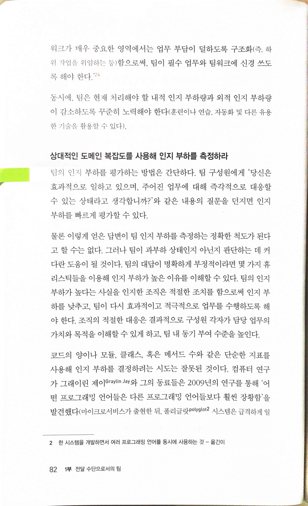

* `팀의 인지 부하를 평가하는 방법은 간단하다. 팀 구성원에게 '당신은 효과적으로 일하고 있으며, 주어진 업무에 대해 즉각적으로 대응할 수 있는 상태라고 생각합니까?'와 같은 내용의 질문을 던지면 인지 부하를 빠르게 평가할 수 있다.`

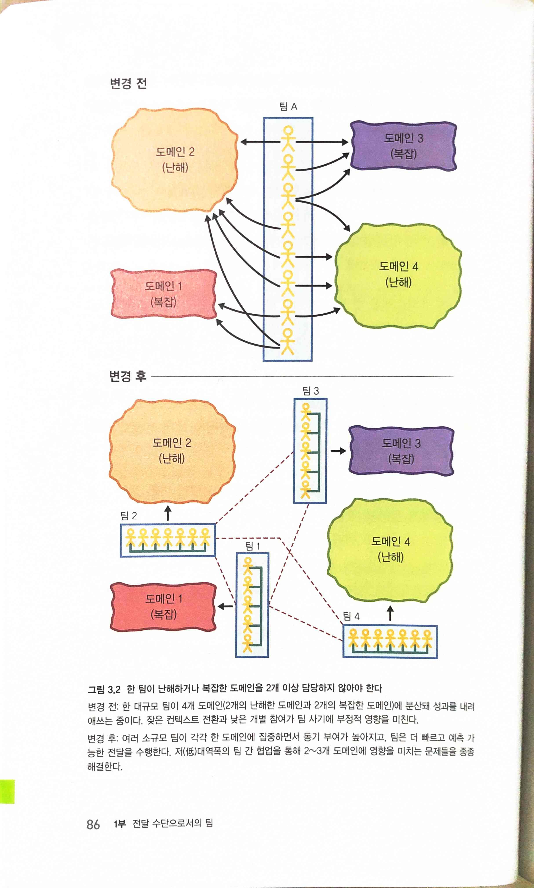

* `그림 3.2 한 팀이 난해하거나 복잡한 도메인을 2개 이상 담당하지 않아야 한다.`

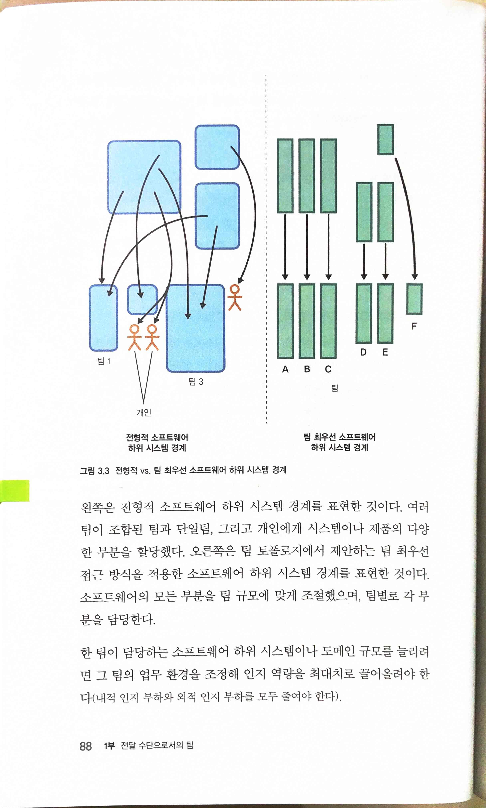

* `그림 3.3 전형적 vs. 팀 최우선 소프트웨어 하위 시스템 경계`

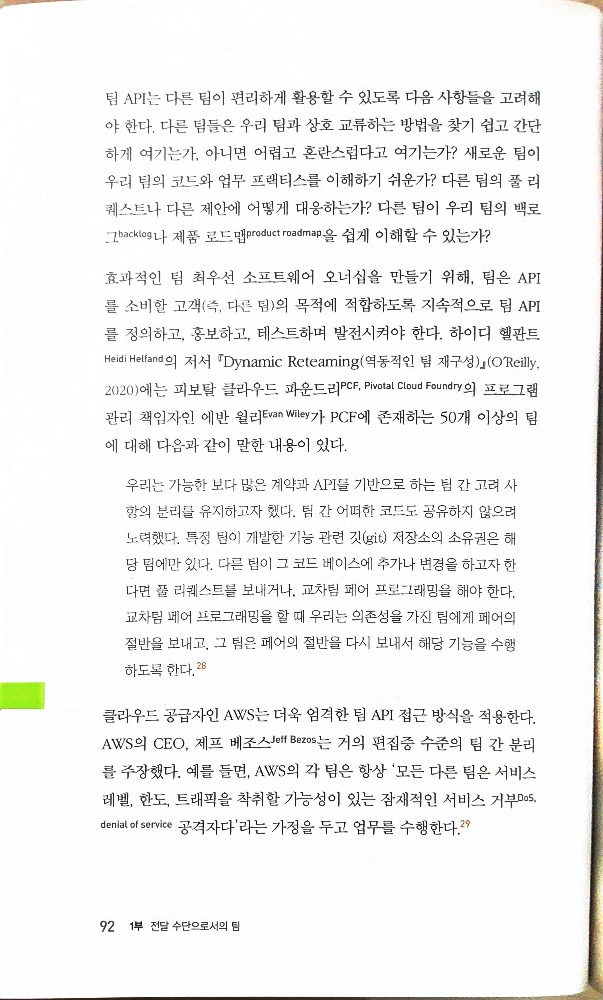

* `클라우드 공급자인 AWS는 더욱 엄격한 팀 API 접근 방식을 적용한다.AWS의 CEO, 제프 베조스Jeff Bezos는 거의 편집증 수준의 팀 간 분리를 주장했다. 예를 들면, AWS의 각 팀은 항상 '모든 다른 팀은 서비스 레벨, 한도, 트래픽을 착취할 가능성이 있는 잠재적인 서비스 거부DoS,denial of service 공격자다'라는 가정을 두고 업무를 수행한다.”`

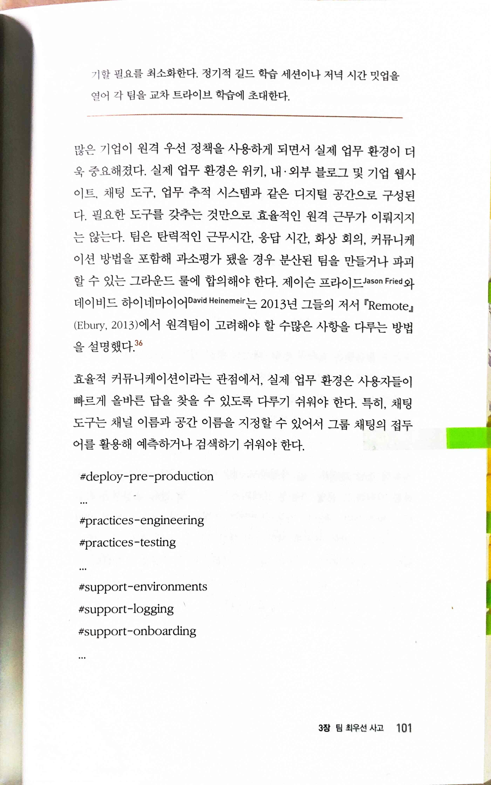

* `효율적 커뮤니케이션이라는 관점에서, 실제 업무 환경은 사용자들이 빠르게 올바른 답을 찾을 수 있도록 다루기 쉬워야 한다. 특히, 채팅 도구는 채널 이름과 공간 이름을 지정할 수 있어서 그룹 채팅의 접두어를 활용해 예측하거나 검색하기 쉬워야 한다.`

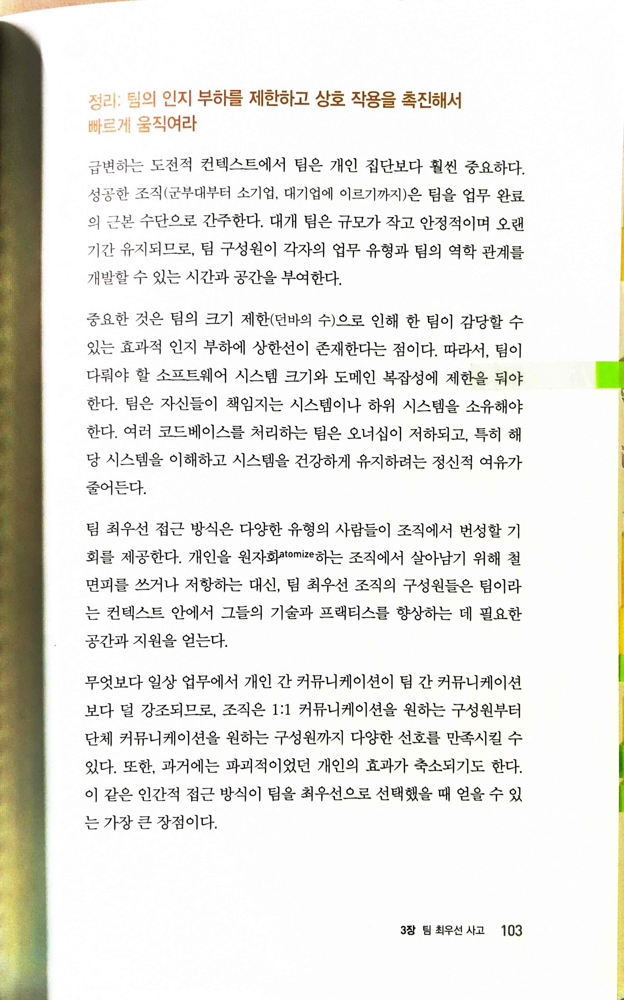

* `중요한 것은 팀의 크기 제한(던바의 수)으로 인해 한 팀이 감당할 수 있는 효과적 인지 부하에 상한선이 존재한다는 점이다. 따라서, 팀이 다뤄야 할 소프트웨어 시스템 크기와 도메인 복잡성에 제한을 둬야 한다. 팀은 자신들이 책임지는 시스템이나 하위 시스템을 소유해야 한다. 여러 코드베이스를 처리하는 팀은 오너십이 저하되고, 특히 해당 시스템을 이해하고 시스템을 건강하게 유지하려는 정신적 여유가 줄어든다.`

## 2부 효과적인 흐름을 만드는 팀 토폴로지

### 4장 정적 팀 토폴로지
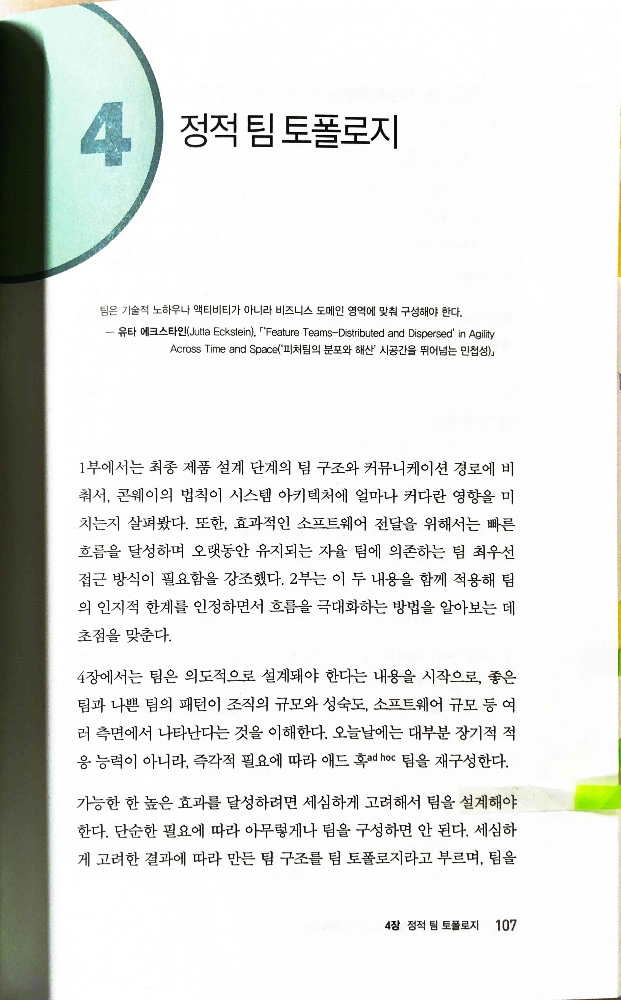

* `팀은 기술적 노하우나 액티비티가 아니라 비즈니스 도메인 영역에 맞춰 구성해야 한다.`
  * `유타 에크스타인 (Jutta Eckstein), 'Feature Teams-Distributed and Dispersed in Agility Across Time and Space('피처팀의 분포와 해산' 시공간을 뛰어넘는 민첩성)`
* `가능한 한 높은 효과를 달성하려면 세심하게 고려해서 팀을 설계해야 한다. 단순한 필요에 따라 아무렇게나 팀을 구성하면 안 된다.`

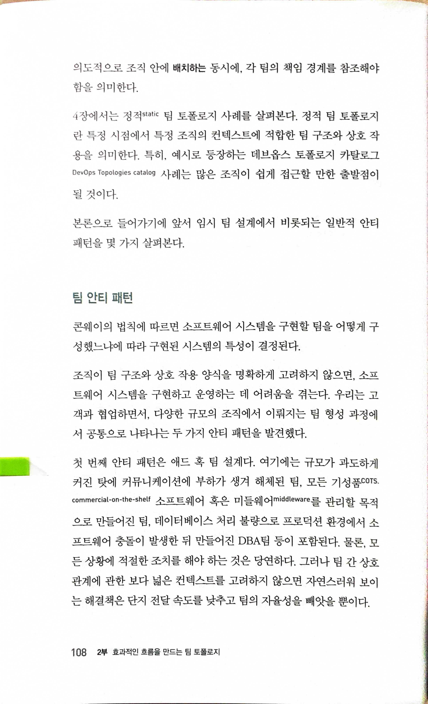 

* `안티 패턴`
* `애드 혹 팀 설계`
  * `여기에는 규모가 과도하게 커진 탓에 커뮤니케이션에 부하가 생겨 해체된 팀, 모든 기성품 COTS.commercial-on-the-shelf 소프트웨어 혹은 미들웨어 middleware 를 관리할 목적으로 만들어진 팀, 데이터베이스 처리 불량으로 프로덕션 환경에서 소프트웨어 충돌이 발생한 뒤 만들어진 DBA팀 등이 포함된다. 물론, 모든 상황에 적절한 조치를 해야 하는 것은 당연하다. 그러나 팀 간 상호관계에 관한 보다 넓은 컨텍스트를 고려하지 않으면 자연스러워 보이는 해결책은 단지 전달 속도를 낮추고 팀의 자율성을 빼앗을 뿐이다.`
* `팀 구성원을 뒤섞는 것`
  * `이렇게 하면 프로젝트 기반으로 조직했다가 프로젝트 종료 시 즉시 해체하는 휘발성이 매우 강한 팀이 만들어진다. 이때, 출시한 애플리케이션의 강화 및 유지보수는 프로젝트에 참여한 엔지니어 중 한두 명이 담당하도록 한다. 유연성이 높아져 마감 일정에 더 빨리 대응할 수 있는 방식이지만, 새로운 팀을 형성하고 반복적으로 컨텍스트를 바꾸는 데 필요한 비용은 간과된다(혹은 프로젝트 추정치에 무의식적으로 이런 비용을 삽입한다). 컴퓨터는 배치된 장소가 어디냐에 관계없이 동일한 작업을 수행하지만, 엔지니어는 어느 팀에 소속됐는지에 따라 업무 수행 성과가 확연히 달라진다.`

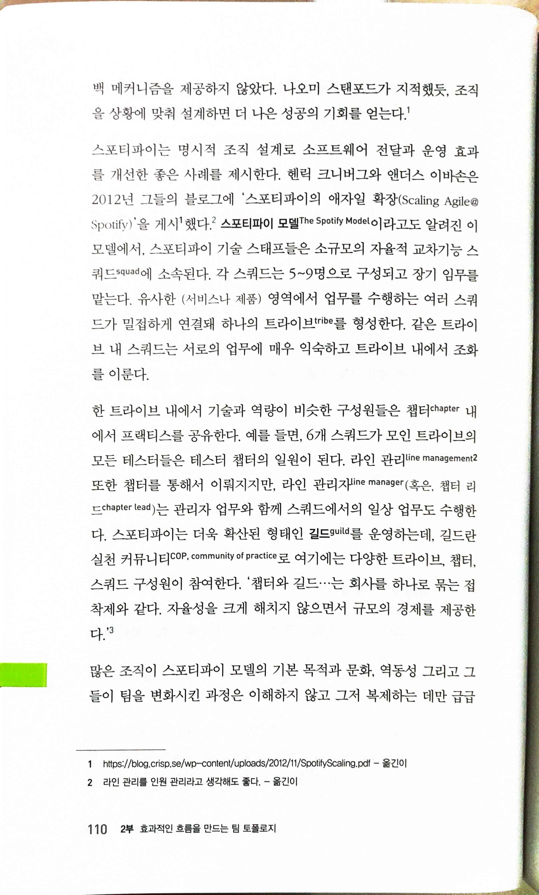

* `대규모 소프트웨어 시스템을 구현하고 운영하는 조직들은 변화 흐름 flow of change을 강조하는 조직 설계의 개념을 실제 동작하는 소프트웨어로 바꾸고 있다. 우리는 이를 마찰이 적은Low-friction 소프트웨어 전달이라고 부른다. 구시대 조직 모델들(서로 다른 부서 사이에 기능적 사일로가 존재하고, 아웃소싱을 과도하게 사용하며, 팀 간 업무 전달을 되풀이하는)은 속도면에서의 안정성이나, 일상에서 고객과 시장 상황에 반응하는 데 필요한 비즈니스 서비스를 지속적으로 발전시키기 위한 조직적 피드백 메커니즘을 제공하지 않았다. 나오미 스탠포드가 지적했듯, 조직을 상황에 맞춰 설계하면 더 나은 성공의 기회를 얻는다.`
* `많은 조직이 스포티파이 모델의 기본 목적과 문화, 역동성 그리고 그들이 팀을 변화시킨 과정은 이해하지 않고 그저 복제하는 데만 급급했다.`
  * 개인적으로는 matrix 조직을 선호하지 않기에 저자에게 [Spotify’s Failed #SquadGoals](https://www.jeremiahlee.com/posts/failed-squad-goals/)에 대해 어떤 생각인지 질문 메일을 보냈다
    * 다음 tweet들과 함꼐 [1](https://twitter.com/solomonjames/status/1258930064441425920) [2](https://twitter.com/ayyyylo/status/1253658456621539328) [3](https://twitter.com/chilicoder/status/1253429837185691656) [4](https://twitter.com/jharmn/status/1252229296522842121) [5](https://twitter.com/braedon/status/1256122236424957953)
  * 저자의 답변은 다음과 같았다
    * Have a look at this talk, it might give you the clarification you are looking for:
    * https://youtu.be/lj71GcOnIW8
    * In short, we don't think the Spotify model is either good or bad. It helps with certain aspects but there's more to think about for healthy organizational design and evolution.
* `팀 간 상호 작용을 설계할 때는 구성원들을 정적으로 배치하는 이상의 것들을 반드시 고려해야 한다.`

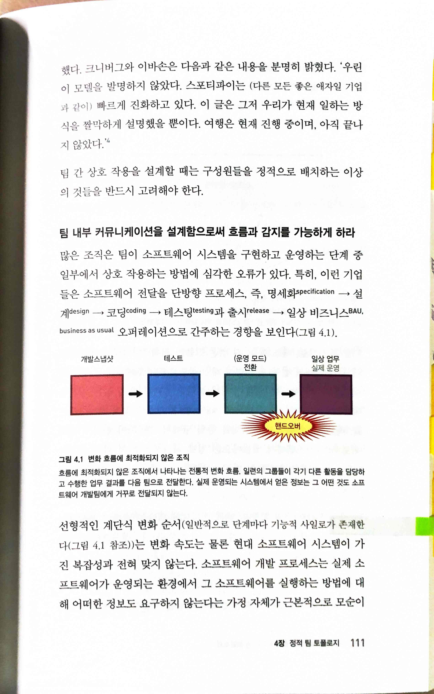 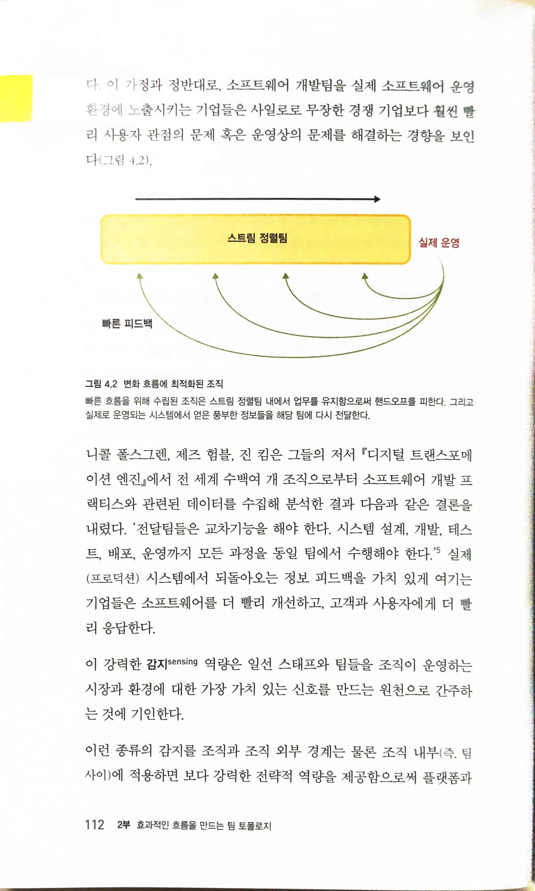

* `선형적인 계단식 변화 순서(일반적으로 단계마다 기능적 사일로가 존재한다(그림 4.1 참조))는 변화 속도는 물론 현대 소프트웨어 시스템이 가진 복잡성과 전혀 맞지 않는다. 소프트웨어 개발 프로세스는 실제 소프트웨어가 운영되는 환경에서 그 소프트웨어를 실행하는 방법에 대해 어떠한 정보도 요구하지 않는다는 가정 자체가 근본적으로 모순이다. 이 가정과 정반대로, 소프트웨어 개발팀을 실제 소프트웨어 운영 환경에 노출시키는 기업들은 사일로로 무장한 경쟁 기업보다 훨씬 빨리 사용자 관점의 문제 혹은 운영상의 문제를 해결하는 경향을 보인다(그림 4.2).`
* `니콜 폴스그렌, 제즈 험블, 진 킴은 그들의 저서 디지털 트랜스포메이션 엔진에서 전 세계 수백여 개 조직으로부터 소프트웨어 개발 프랙티스와 관련된 데이터를 수집해 분석한 결과 다음과 같은 결론을 내렸다. '전달팀들은 교차기능을 해야 한다. 시스템 설계, 개발, 테스트, 배포, 운영까지 모든 과정을 동일 팀에서 수행해야 한다. 실제(프로덕션) 시스템에서 되돌아오는 정보 피드백을 가치 있게 여기는 기업들은 소프트웨어를 더 빨리 개선하고, 고객과 사용자에게 더 빨리 응답한다.`

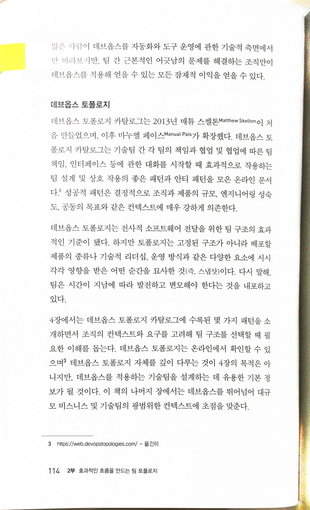

* `많은 사람이 데브옵스를 자동화와 도구 운영에 관한 기술적 측면에서만 바라보지만, 팀 간 근본적인 어긋남의 문제를 해결하는 조직만이 데브옵스를 적용해 얻을 수 있는 모든 잠재적 이익을 얻을 수 있다.`
  * [DevOps Topologies](https://web.devopstopologies.com/)
  * (결국 '프로젝트에서 제품으로'도 그렇고 여기서도 그렇고 비즈니스와 기술이 밀접하게 일을 하고 피드백이 바로 빨리 반영되는 구조가 되어야 한다는 뜻. 그렇기에 이 책은 팀 구조를 통해 그 부분을 어떻게 해결할지 조명하는 거고, '프로젝트에서 제품으로'는 전체 프로세스를 플로우라는 표현을 통해 살펴보는 걸로 보인다)
* `데브옵스 토폴로지 카탈로그는 기술팀 간 각 팀의 책임과 협업 및 협업에 따른 팀책임, 인터페이스 등에 관한 대화를 시작할 때 효과적으로 작용하는 팀 설계 및 상호 작용의 좋은 패턴과 안티 패턴을 모은 온라인 문서다. 성공적 패턴은 결정적으로 조직과 제품의 규모, 엔지니어링 성숙도, 공동의 목표와 같은 컨텍스트에 매우 강하게 의존한다.`
  * (엔지니어링 성숙도 항목을 제외하면, 비정형의 규정하기 어려운 부분들이고 결국 이런 부분이 문화나 비전 조직 규모에 따른 팀 형태 및 제품의 성격에 영향을 받는다는 뜻으로 해석)

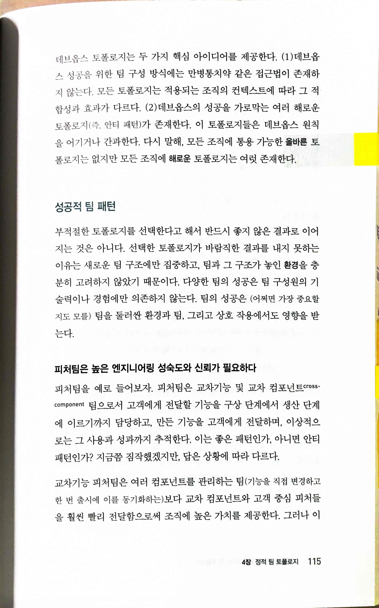

* 데브옵스 토폴로지
  * `(1) 데브옵스 성공을 위한 팀 구성 방식에는 만병통치약 같은 접근법이 존재하지 않는다. 모든 토폴로지는 적용되는 조직의 컨텍스트에 따라 그 적합성과 효과가 다르다.`
  * `(2) 데브옵스의 성공을 가로막는 여러 해로운 토폴로지(즉, 안티 패턴)가 존재한다. 이 토폴로지들은 데브옵스 원칙을 어기거나 간과한다.`
  * `다시 말해, 모든 조직에 통용 가능한 올바른 토폴로지는 없지만 모든 조직에 해로운 토폴로지는 여럿 존재한다.`
    * (모든 일이 그렇듯이 성공하기는 정말 어렵지만 실패하기는 매우 쉽다)
* `피처팀은 높은 엔지니어링 성숙도와 신뢰가 필요하다.`
  * `피처팀을 예로 들어보자. 피처팀은 교차기능 및 교차 컴포넌트 crosscomponent 팀으로서 고객에게 전달할 기능을 구상 단계에서 생산 단계에 이르기까지 담당하고, 만든 기능을 고객에게 전달하며, 이상적으로는 그 사용과 성과까지 추적한다.`
* `팀 간 커뮤니케이션과 의존성이 급격히 감소했으나, 여전히 누군가는 시스템 전체를 감시하면서 바람직한 사용자 경험과 성능, 신뢰성 기준에 맞춰 하위 시스템들이 통합되고 상호 작용하는지 확인해야만 했다. 이런 이유로 시스템 아키텍트 system architect와 시스템 오너 system owner, 통합 리드 integration lead 와 같은 역할이 생성됐다. 결정적으로 이 역할을 맡은 사람들은 커뮤니케이션 통로처럼 프로젝트와 조직 전체를 오가며 기능팀과 직접적이고 빈번하게 상호 작용했다. 이들은 교차 하위 시스템에서 고려해야 할 사항(인터페이스 통합 등)을 지원함으로써 피처팀들이 일반 기능을 전달하는 리듬을 유지할 수 있도록 했다.`
  * (구조를 잘 만들어서 팀 간 커뮤니케이션의 의존성이 감소했더라도 여전히 전체를 보는 역할은 필요하다)

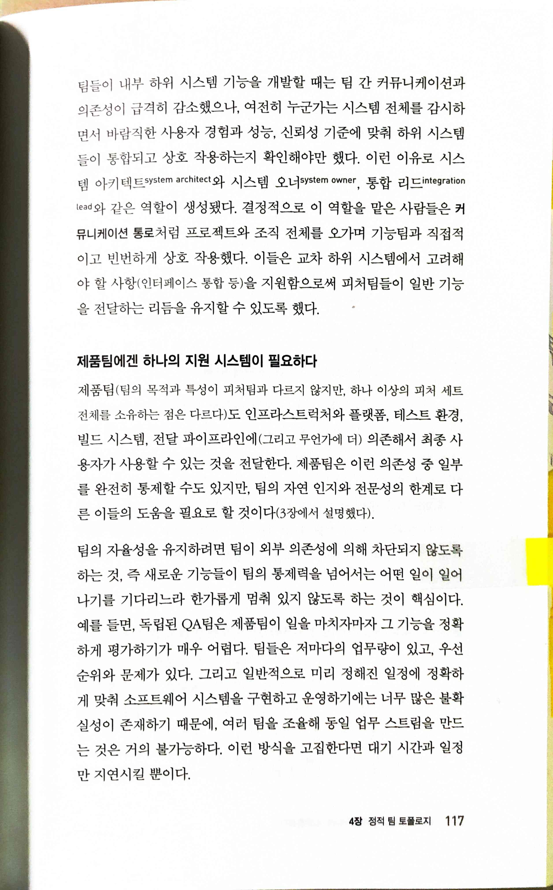

* `팀의 자율성을 유지하려면 팀이 외부 의존성에 의해 차단되지 않도록 하는 것, 즉 새로운 기능들이 팀의 통제력을 넘어서는 어떤 일이 일어나기를 기다리느라 한가롭게 멈춰 있지 않도록 하는 것이 핵심이다. 예를 들면, 독립된 QA팀은 제품팀이 일을 마치자마자 그 기능을 정확하게 평가하기가 매우 어렵다. 팀들은 저마다의 업무량이 있고, 우선순위와 문제가 있다. 그리고 일반적으로 미리 정해진 일정에 정확하게 맞춰 소프트웨어 시스템을 구현하고 운영하기에는 너무 많은 불확실성이 존재하기 때문에, 여러 팀을 조율해 동일 업무 스트림을 만드는 것은 거의 불가능하다. 이런 방식을 고집한다면 대기 시간과 일정만 지연시킬 뿐이다.`
  * (그래서 가능한 각 product팀은 독립적으로, 다른 팀에 의존하는 부분이 없이 일을 할 수 있어야 한다)

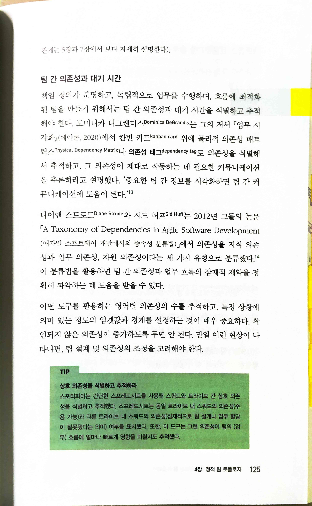

* `책임 정의가 분명하고, 독립적으로 업무를 수행하며, 흐름에 최적화된 팀을 만들기 위해서는 팀 간 의존성과 대기 시간을 식별하고 추적해야 한다. 도미니카 디그랜디스Dominica DeGrandis는 그의 저서 「업무 시각화』(에이콘, 2020)에서 칸반 카드 kanban card 위에 물리적 의존성 매트릭스Physical Dependency Matrix 나 의존성 태그dependency tag 로 의존성을 식별해서 추적하고, 그 의존성이 제대로 작동하는 데 필요한 커뮤니케이션을 추론하라고 설명했다. '중요한 팀 간 정보를 시각화하면 팀 간 커뮤니케이션에 도움이 된다.`
* 지식 의존성, 업무 의존성, 자원 의존성 - 애자일 소프트웨어 개발에서의 종속성 분류법
  * [(PDF) A Taxonomy of Dependencies in Agile Software Development](https://www.researchgate.net/publication/267706181_A_Taxonomy_of_Dependencies_in_Agile_Software_Development)
* `어떤 도구를 활용하든 영역별 의존성의 수를 추적하고, 특정 상황에 의미 있는 정도의 임겟값과 경계를 설정하는 것이 매우 중요하다. 확인되지 않은 의존성이 증가하도록 두면 안 된다. 만일 이런 현상이 나타나면, 팀 설계 및 의존성의 조정을 고려해야 한다.`

### 5장 4가지 기본 팀 토폴로지
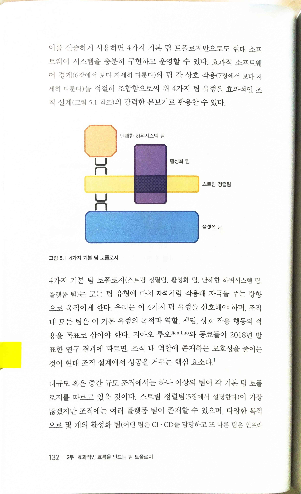

* `조직 내 역할에 존재하는 모호성을 줄이는 것이 현대 조직 설계에서 성공을 거두는 핵심 요소다.`

#### 스트림 정렬팀
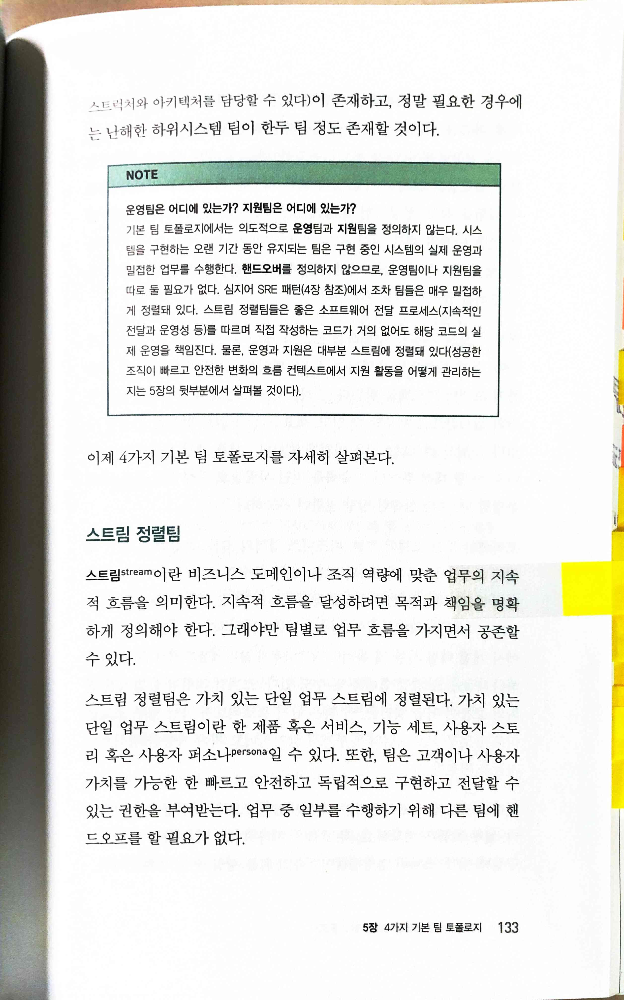 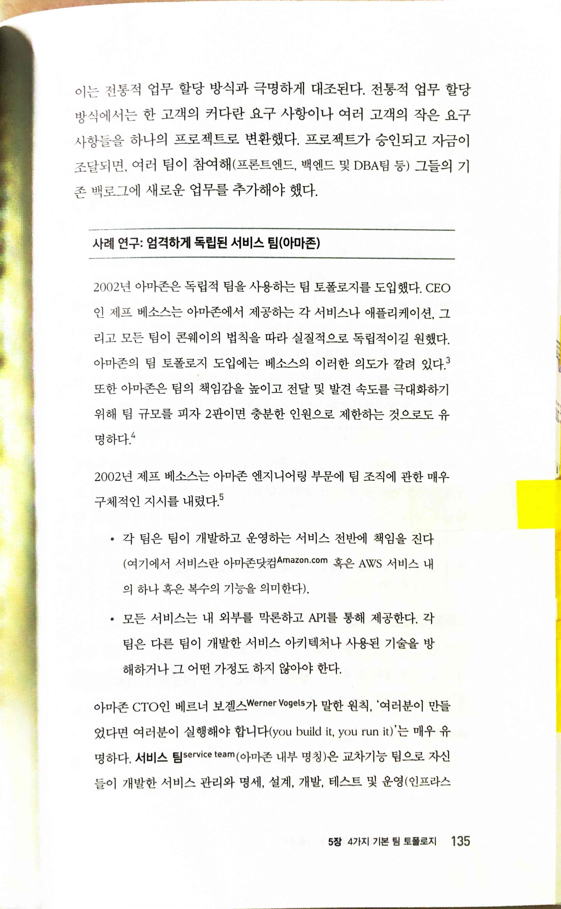 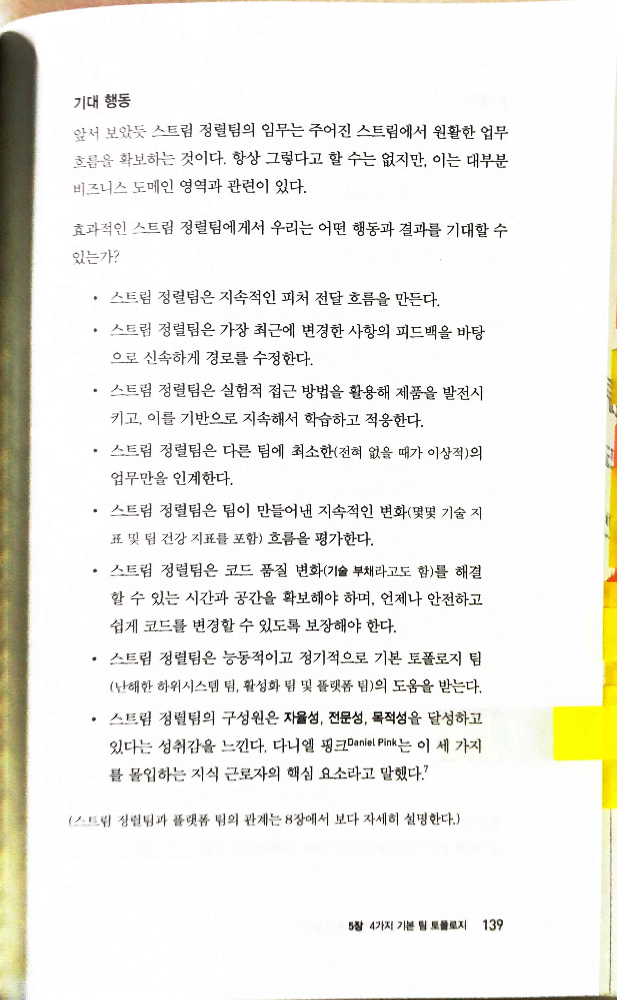

* `스트림 stream이란 비즈니스 도메인이나 조직 역량에 맞춘 업무의 지속적 흐름을 의미한다. 지속적 흐름을 달성하려면 목적과 책임을 명확하게 정의해야 한다. 그래야만 팀별로 업무 흐름을 가지면서 공존할 수 있다.`
* `스트림 정렬팀은 가치 있는 단일 업무 스트림에 정렬된다. 가치 있는 단일 업무 스트림이란 한 제품 혹은 서비스, 기능 세트, 사용자 스토리 혹은 사용자 퍼소나persona 일 수 있다. 또한, 팀은 고객이나 사용자 가치를 가능한 한 빠르고 안전하고 독립적으로 구현하고 전달할 수 있는 권한을 부여받는다. 업무 중 일부를 수행하기 위해 다른 팀에 핸드오프를 할 필요가 없다.`
  * (관련 업무는 모두 한 팀 내에서 독립적으로 일할 수 있다는 뜻일까?)
* `2002년 제프 베소스는 아마존 엔지니어링 부문에 팀 조직에 관한 매우 구체적인 지시를 내렸다.`
  * `• 각 팀은 팀이 개발하고 운영하는 서비스 전반에 책임을 진다(여기에서 서비스란 아마존닷컴 Amazon.com 혹은 AWS 서비스 내의 하나 혹은 복수의 기능을 의미한다).`
  * `· 모든 서비스는 내 외부를 막론하고 API를 통해 제공한다. 각 팀은 다른 팀이 개발한 서비스 아키텍처나 사용된 기술을 방해하거나 그 어떤 가정도 하지 않아야 한다.`
  * `아마존 CTO 베르너 보겔스 Werner Vogels 원칙, '여러분이 만들었다면 여러분이 실행해야 합니다 (you build it, you run it)'`
* `스트림 정렬팀의 구성원은 자율성, 전문성, 목적성을 달성하고 있다는 성취감을 느낀다. 다니엘 핑크Daniel Pink는 이 세 가지를 몰입하는 지식 근로자의 핵심 요소라고 말했다.`

#### 활성화 팀
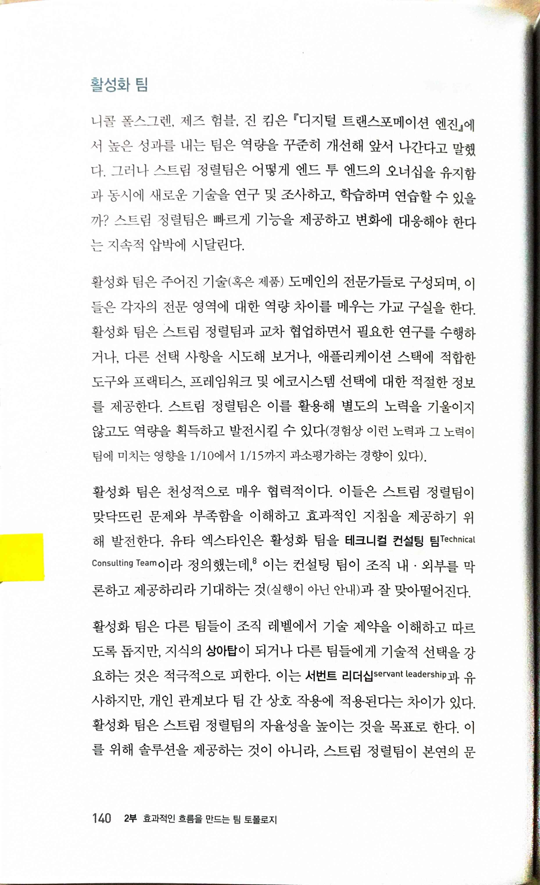

* `활성화 팀은 협력적이다. 이들은 스트림 정렬팀이 맞닥뜨린 문제와 부족함을 이해하고 효과적인 지침을 제공하기 위해 발전한다. 유타 엑스타인은 활성화 팀을 테크니컬 컨설팅 팀Technical Consulting Team이라 정의했는데, 이는 컨설팅 팀이 조직 내·외부를 막론하고 제공하리라 기대하는 것(실행이 아닌 안내)과 잘 맞아떨어진다.`
* `활성화 팀은 다른 팀들이 조직 레벨에서 기술 제약을 이해하고 따르도록 돕지만, 지식의 상아탑이 되거나 다른 팀들에게 기술적 선택을 강요하는 것은 적극적으로 피한다. 이는 서번트 리더십servant leadership과 유사하지만, 개인 관계보다 팀 간 상호 작용에 적용된다는 차이가 있다. 활성화 팀은 스트림 정렬팀의 자율성을 높이는 것을 목표로 한다.`

* `이런 엔지니어링 이슈를 해결하도록 팀에게 강요하는 시도는 반드시 실패한다. 현장에서 일하는 사람들의 마음을 얻어야만 한다. 활성화 팀 자체는 의도적으로 외부 컨설턴트들과 기존 팀의 개발자들을 조합해 만들었다. 팀과 팀의 임무 착수를 돕기 위해, 우린 조직 단위의 워크숍을 개최하고 모든 글로벌 팀의 대표자를 초대했다.`
* `엔지니어링 활성화 팀은 첫날부터 스스로를 없앨 계획을 세워야 한다. 그래야만 다른 팀들이 엔지니어링 활성화 팀에 의존하지 않는다.`

#### 난해한 하위시스템 팀
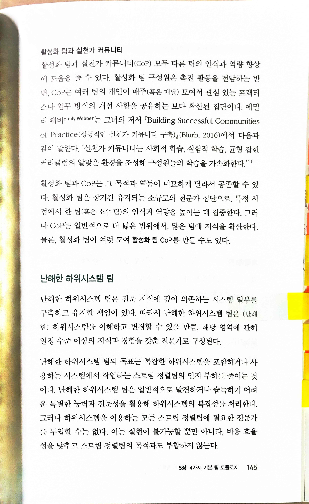

* `난해한 하위시스템 팀의 목표는 복잡한 하위시스템을 포함하거나 사용하는 시스템에서 작업하는 스트림 정렬팀의 인지 부하를 줄이는 것이다. 난해한 하위시스템 팀은 일반적으로 발견하거나 습득하기 어려운 특별한 능력과 전문성을 활용해 하위시스템의 복잡성을 처리한다.그러나 하위시스템을 이용하는 모든 스트림 정렬팀에 필요한 전문가를 투입할 수는 없다. 이는 실현이 불가능할 뿐만 아니라, 비용 효율성을 낮추고 스트림 정렬팀의 목적과도 부합하지 않는다.`

#### 플랫폼 팀
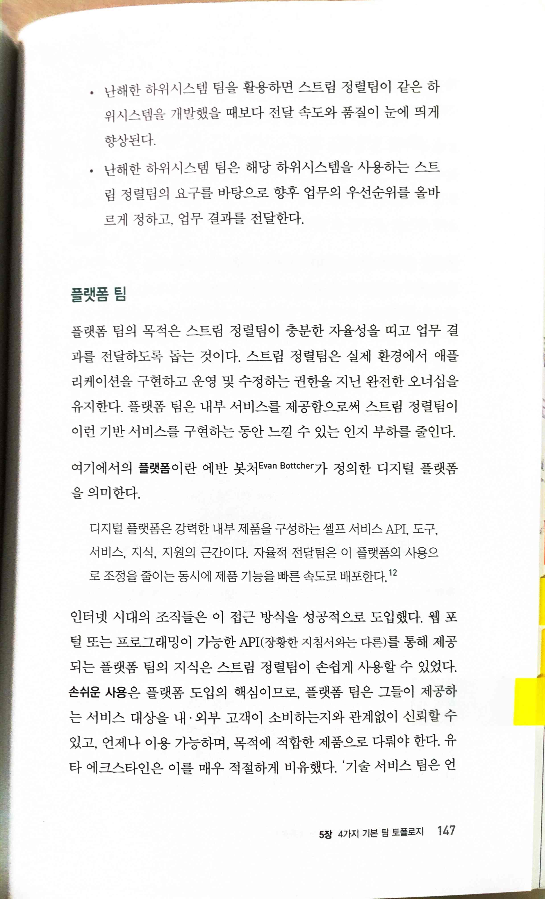

* `플랫폼 팀의 목적은 스트림 정렬팀이 충분한 자율성을 띠고 업무 결과를 전달하도록 돕는 것이다. 스트림 정렬팀은 실제 환경에서 애플리케이션을 구현하고 운영 및 수정하는 권한을 지닌 완전한 오너십을 유지한다. 플랫폼 팀은 내부 서비스를 제공함으로써 스트림 정렬팀이 이런 기반 서비스를 구현하는 동안 느낄 수 있는 인지 부하를 줄인다.`
* `손쉬운 사용은 플랫폼 도입의 핵심이므로, 플랫폼 팀은 그들이 제공하는 서비스 대상을 내 · 외부 고객이 소비하는지와 관계없이 신뢰할 수 있고, 언제나 이용 가능하며, 목적에 적합한 제품으로 다뤄야 한다.`

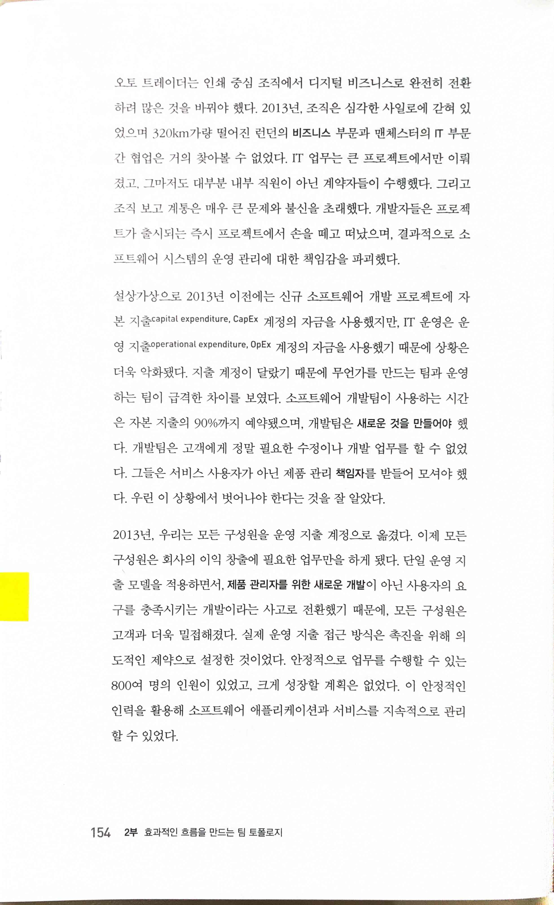

* 오토 트레이더 인쇄 중심 조직 -> 디지털 비즈니스로 전환
  * `2013년, 우리는 모든 구성원을 운영 지출 계정으로 옮겼다. 이제 모든 구성원은 회사의 이익 창출에 필요한 업무만을 하게 됐다. 단일 운영 지출 모델을 적용하면서, 제품 관리자를 위한 새로운 개발이 아닌 사용자의 요구를 충족시키는 개발이라는 사고로 전환했기 때문에, 모든 구성원은 고객과 더욱 밀접해졌다.`

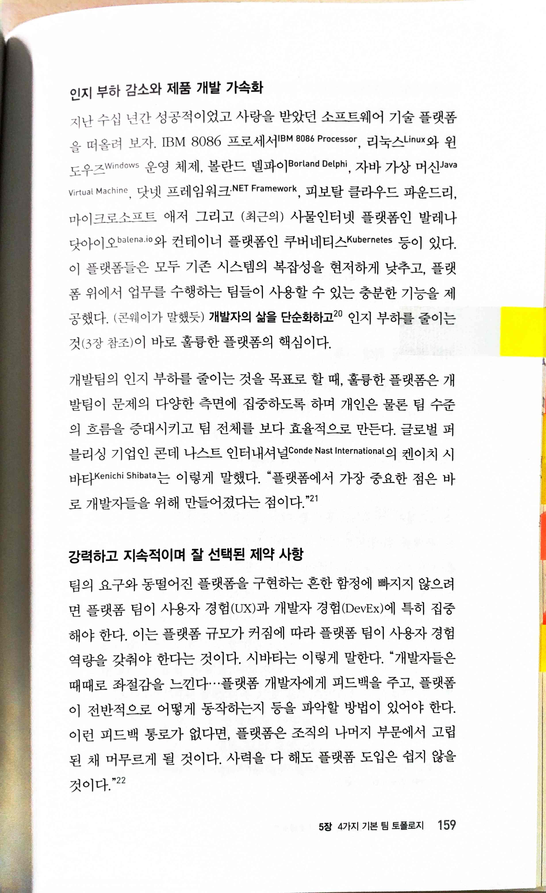

* `(콘웨이가 말했듯) 개발자의 삶을 단순화하고 인지 부하를 줄이는 것(3장 참조)이 바로 훌륭한 플랫폼의 핵심이다.`
* `개발팀의 인지 부하를 줄이는 것을 목표로 할 때, 훌륭한 플랫폼은 개발팀이 문제의 다양한 측면에 집중하도록 하며 개인은 물론 팀 수준의 흐름을 증대시키고 팀 전체를 보다 효율적으로 만든다... "플랫폼에서 가장 중요한 점은 바로 개발자들을 위해 만들어졌다는 점이다."`

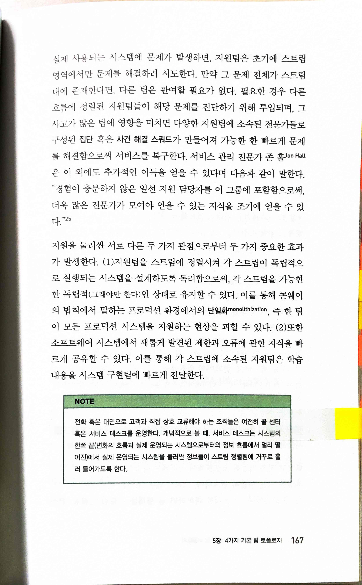

* 지원
  * `(1) 지원팀을 스트림에 정렬시켜 각 스트림이 독립적으로 실행되는 시스템을 설계하도록 독려함으로써, 각 스트림을 가능한 한 독립적(그래야만 한다)인 상태로 유지할 수 있다. 이를 통해 콘웨이의 법칙에서 말하는 프로덕션 환경에서의 단일화 monolithization, 즉 한 팀이 모든 프로덕션 시스템을 지원하는 현상을 피할 수 있다.`
  * `(2) 또한 소프트웨어 시스템에서 새롭게 발견된 제한과 오류에 관한 지식을 빠르게 공유할 수 있다. 이를 통해 각 스트림에 소속된 지원팀은 학습내용을 시스템 구현팀에 빠르게 전달한다.`
* `전화 혹은 대면으로 고객과 직접 상호 교류해야 하는 조직들은 여전히 콜 센터 혹은 서비스 데스크를 운영한다. 개념적으로 볼 때, 서비스 데스크는 시스템의 한쪽 끝(변화의 흐름과 실제 운영되는 시스템으로부터의 정보 흐름에서 멀리 떨어진)에서 실제 운영되는 시스템을 둘러싼 정보들이 스트림 정렬팀에 거꾸로 흘러 들어가도록 한다.`

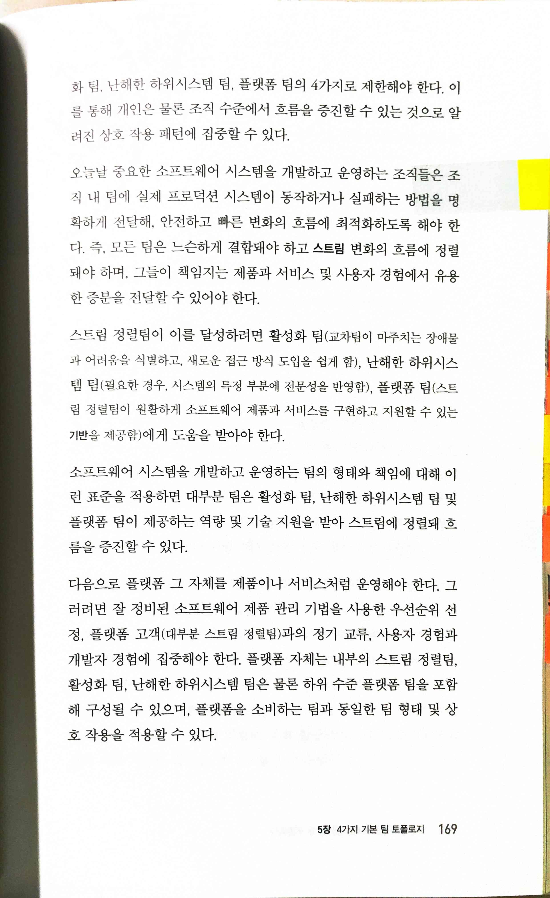

* `오늘날 중요한 소프트웨어 시스템을 개발하고 운영하는 조직들은 조직 내 팀에 실제 프로덕션 시스템이 동작하거나 실패하는 방법을 명확하게 전달해, 안전하고 빠른 변화의 흐름에 최적화하도록 해야 한다. 즉, 모든 팀은 느슨하게 결합돼야 하고 스트림 변화의 흐름에 정렬돼야 하며, 그들이 책임지는 제품과 서비스 및 사용자 경험에서 유용한 증분을 전달할 수 있어야 한다.`
* `스트림 정렬팀이 이를 달성하려면 활성화 팀(교차팀이 마주치는 장애물과 어려움을 식별하고, 새로운 접근 방식 도입을 쉽게 함), 난해한 하위시스템 팀(필요한 경우, 시스템의 특정 부분에 전문성을 반영함), 플랫폼 팀(스트림 정렬팀이 원활하게 소프트웨어 제품과 서비스를 구현하고 지원할 수 있는 기반을 제공함)에게 도움을 받아야 한다.`

### 6장 팀 최우선 경계 선택
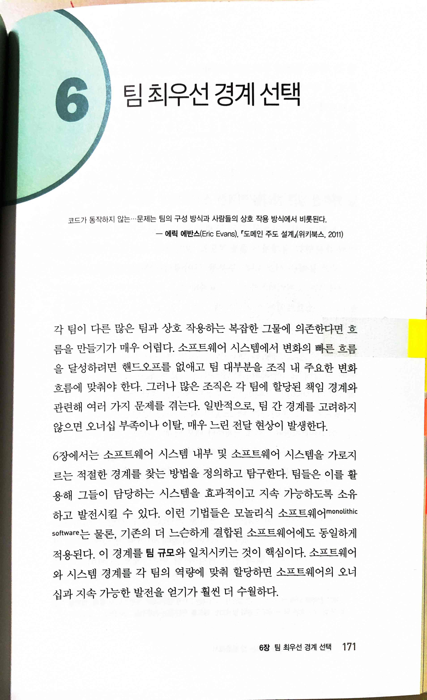

* `각 팀이 다른 많은 팀과 상호 작용하는 복잡한 그물에 의존한다면 흐름을 만들기가 매우 어렵다. 소프트웨어 시스템에서 변화의 빠른 흐름을 달성하려면 핸드오프를 없애고 팀 대부분을 조직 내 주요한 변화 흐름에 맞춰야 한다. 그러나 많은 조직은 각 팀에 할당된 책임 경계와 관련해 여러 가지 문제를 겪는다. 일반적으로, 팀 간 경계를 고려하지 않으면 오너십 부족이나 이탈, 매우 느린 전달 현상이 발생한다.`

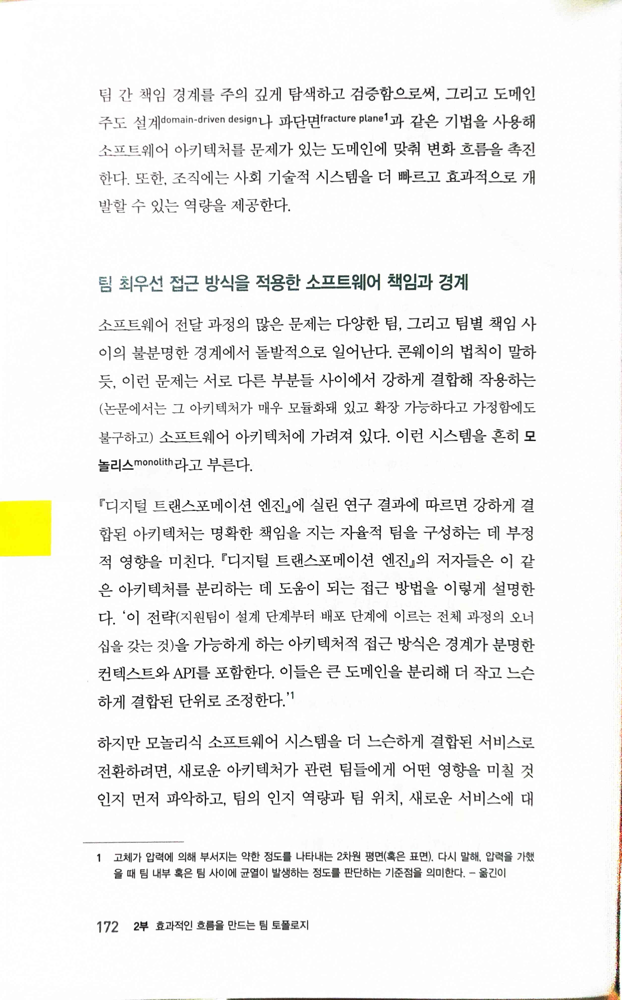

* `『디지털 트랜스포메이션 엔진』에 실린 연구 결과에 따르면 강하게 결합된 아키텍처는 명확한 책임을 지는 자율적 팀을 구성하는 데 부정적 영향을 미친다. 디지털 트랜스포메이션 엔진의 저자들은 이 같은 아키텍처를 분리하는 데 도움이 되는 접근 방법을 이렇게 설명한다. '이 전략(지원팀이 설계 단계부터 배포 단계에 이르는 전체 과정의 오너십을 갖는 것)을 가능하게 하는 아키텍처적 접근 방식은 경계가 분명한 컨텍스트와 API를 포함한다. 이들은 큰 도메인을 분리해 더 작고 느슨하게 결합된 단위로 조정한다."`
  * (하지만 바로 밑에 나와 있듯이 새로운 아키텍처가 관련 팀들에게 어떤 영향을 미칠 것인지, 팀의 인지 역량과 팀 위치, 새로운 서비스까지...)

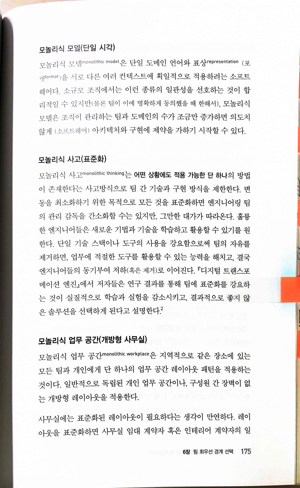

* `모놀리식 사고 monolithic thinking는 어떤 상황에도 적용 가능한 단 하나의 방법이 존재한다는 사고방식으로 팀 간 기술과 구현 방식을 제한한다. 변동을 최소화하기 위한 목적으로 모든 것을 표준화하면 엔지니어링 팀의 관리 감독을 간소화할 수는 있지만, 그만한 대가가 따라온다. 훌륭한 엔지니어들은 새로운 기법과 기술을 학습하고 활용할 수 있기를 원한다. 단일 기술 스택이나 도구의 사용을 강요함으로써 팀의 자유를 제거하면, 업무에 적절한 도구를 활용할 수 있는 능력을 해치고, 결국 엔지니어들의 동기부여 저하(혹은 제거)로 이어진다. 디지털 트랜스포메이션 엔진에서 저자들은 연구 결과를 통해 팀에 표준화를 강요하는 것이 실질적으로 학습과 실험을 감소시키고, 결과적으로 좋지 않은 솔루션을 선택하게 된다고 설명한다.`

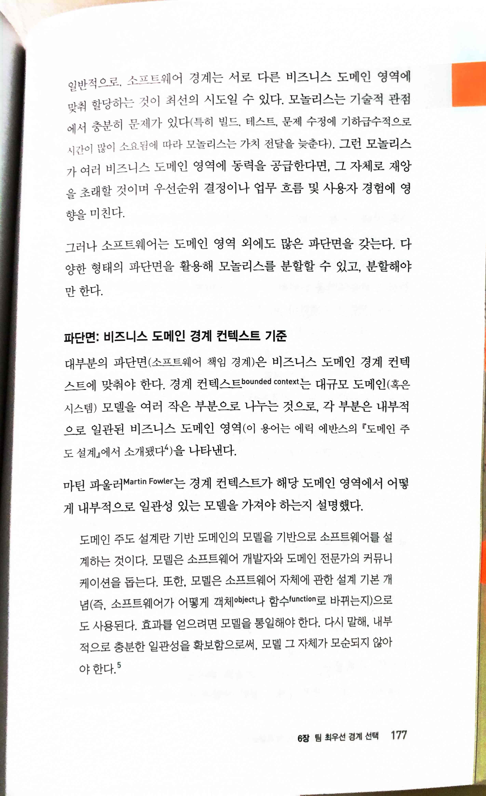 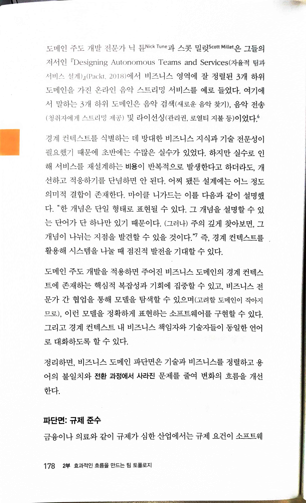

* `일반적으로, 소프트웨어 경계는 서로 다른 비즈니스 도메인 영역에 맞춰 할당하는 것이 최선의 시도일 수 있다.`
  * (기술적으로도 monolith가 문제이나 비즈니스에서도 여러 도메인에 관련된다면 역시 문제)
* `경계 컨텍스트 bounded context: 각 부분은 내부적으로 일관된 비즈니스 도메인 영역`
* `대부분의 파단면(소프트웨어 책임 경계)은 비즈니스 도메인 경계 컨텍스트에 맞춰야 한다.`
* 마틴 파울러 Martin Fowler
  * `도메인 주도 설계란 기반 도메인의 모델을 기반으로 소프트웨어를 설계하는 것이다. 모델은 소프트웨어 개발자와 도메인 전문가의 커뮤니케이션을 돕는다. 또한, 모델은 소프트웨어 자체에 관한 설계 기본 개념(즉, 소프트웨어가 어떻게 객체 object 나 함수 function 로 바뀌는지)으로도 사용된다. 효과를 얻으려면 모델을 통일해야 한다. 다시 말해, 내부적으로 충분한 일관성을 확보함으로써, 모델 그 자체가 모순되지 않아야 한다.`
* `경계 컨텍스트를 식별하는 데 방대한 비즈니스 지식과 기술 전문성이 필요했기 때문에 초반에는 수많은 실수가 있었다. 하지만 실수로 인해 서비스를 재설계하는 비용이 반복적으로 발생한다고 하더라도, 개선하고 적응하기를 단념하면 안 된다.`
* `비즈니스 도메인 파단면은 기술과 비즈니스를 정렬하고 용어의 불일치와 전환 과정에서 사라진 문제를 줄여 변화의 흐름을 개선한다.`

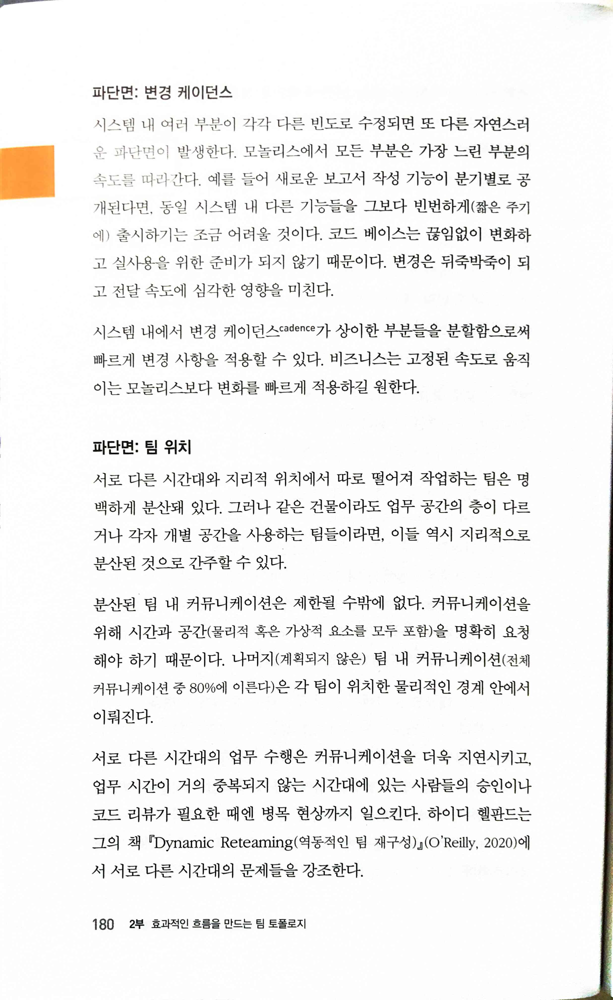

* `모놀리스에서 모든 부분은 가장 느린 부분의 속도를 따라간다.`
  * (monolith뿐만 아니라 아무리 잘 만들어진 MSA라도, 또 팀의 업무도 결국은 가장 느린 부분/팀원에 따라 전체적인 속도가 결정되는 건 자연스러운 일)

* `기술은 팀을 분리할 때 자주(역사적으로) 사용하는 경계다. 프론트엔드나 백엔드, 데이터 티어 등과 같은 형태로 팀을 구분하는 것이 얼마나 일반적인지 생각해 보라.`
* `그러나 이런 일반적 기술 주도 분할은 업무 제약을 줄이거나 업무 흐름을 개선하기보다는, 오히려 제약 사항을 늘리고 업무 흐름을 저하한다. 이는 분리된 팀들이 덜 자율적이기 때문인데, 제품에 의존성이 남아 있음에도 불구하고 각 팀이 해당 업무를 전체적으로 보지 못하게 되며, 팀 간 커뮤니케이션 경로 또한 팀 내의 경로보다 느리다.`
* `기술 기반 하위시스템 분할이 효과적일 때도 있다. 특히 오래됐거나 덜 자동화된 기술을 통합할 때가 그렇다... 이런 때에는 기술을 기준으로 팀의 책임을 분담함으로써 팀이 소프트웨어를 효과적으로 소유하고 발전시키도록 할 수 있다.`

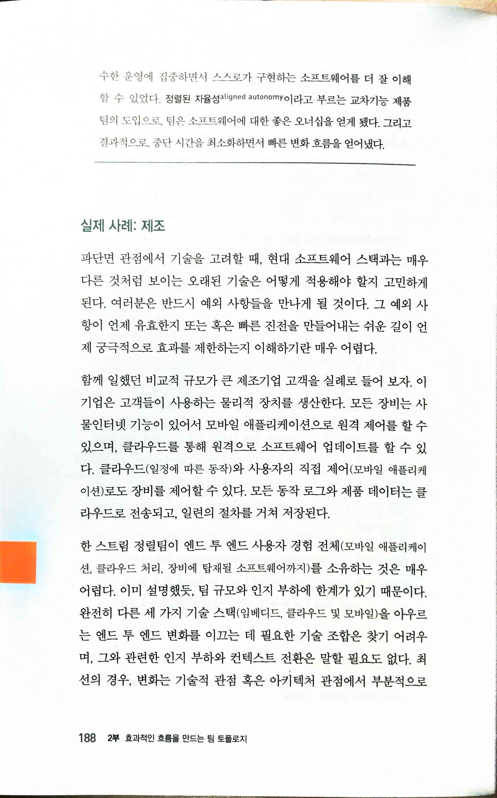

* `한 스트림 정렬팀이 엔드 투 엔드 사용자 경험 전체(모바일 애플리케이션, 클라우드 처리, 장비에 탑재될 소프트웨어까지)를 소유하는 것은 매우 어렵다. 이미 설명했듯, 팀 규모와 인지 부하에 한계가 있기 때문이다. 완전히 다른 세 가지 기술 스택(임베디드, 클라우드 및 모바일)을 아우르는 엔드 투 엔드 변화를 이끄는 데 필요한 기술 조합은 찾기 어려우며, 그와 관련한 인지 부하와 컨텍스트 전환은 말할 필요도 없다.`

## 3부 혁신과 빠른 전달을 위한 팀 상호 작용 진화

### 7장 팀 상호 작용 모드

* `적절하게 정의되지 않은 팀 상호 작용과 책임은 많은 조직에서 마찰을 가져오고 성과를 떨어뜨리는 주요 원인이 된다. 팀은 자신들이 자율적이고 자기 조직적이라는 말을 듣지만, 실제로 업무를 완수하기 위해서는 매우 많은 팀과 상호 작용해야 한다는 것을 발견한다. 그리고 구성원들은 그런 사실을 두려워하게 된다. 상대 팀에 API 혹은 서비스를 제공할 책임이 있지만 정작 당사자들이 이런 업무를 효과적으로 처리해 본 경험은 없다.`
* `팀 간 관계를 고려할 때는 한 목적을 달성하기 위해 다른 팀과 협력할 것인지 혹은 다른 팀을 서비스로 간주할 것인지를 결정하는 것이 핵심이다.`
* `모든 팀이 각각의 목표를 달성하기 위해 다른 모든 팀과 커뮤니케이션 하는 것은 반드시 피해야만 한다.`

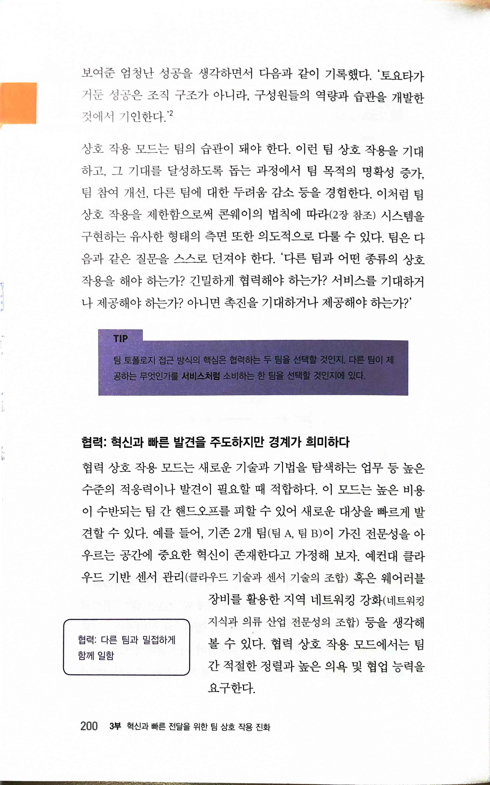

* `'토요타가 거둔 성공은 조직 구조가 아니라, 구성원들의 역량과 습관을 개발한 것에서 기인한다.'`
* `팀은 다음과 같은 질문을 스스로 던져야 한다. 다른 팀과 어떤 종류의 상호작용을 해야 하는가? 긴밀하게 협력해야 하는가? 서비스를 기대하거나 제공해야 하는가? 아니면 촉진을 기대하거나 제공해야 하는가?'`

* `집중하는 영역과 책임이 적게 중첩된 경우와 완전히 중첩된 경우 모두 팀은 협력을 통해 만든 결과에 공동 책임을 져야 한다. 협력 기반 행동에 따라 책임 경계가 희미해지기 때문이다. 공동 책임이 없으면 일이 잘못됐을 때 신뢰를 잃을 수 있다.`

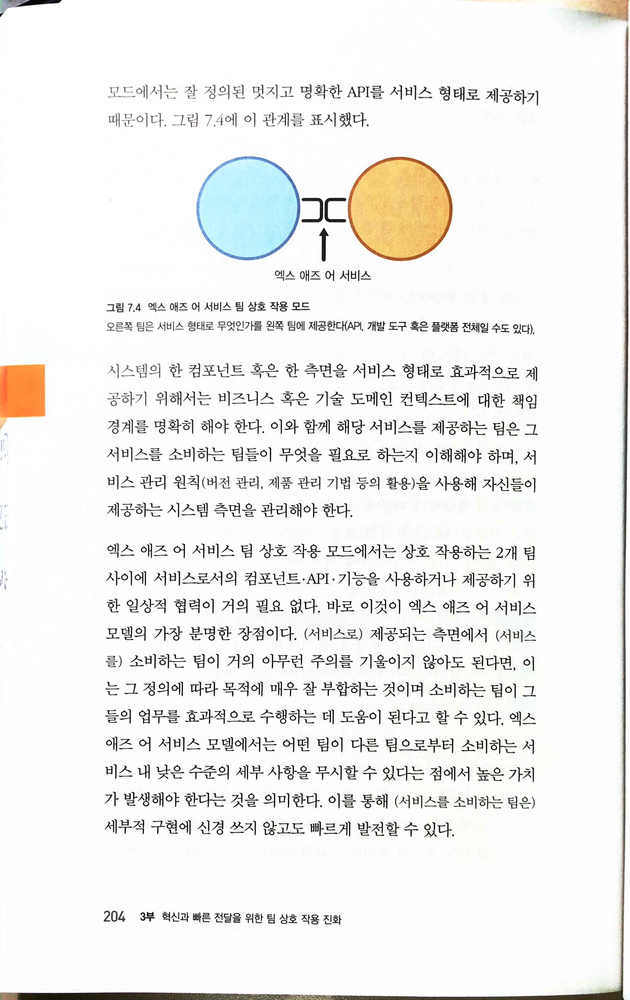

* `시스템의 한 컴포넌트 혹은 한 측면을 서비스 형태로 효과적으로 제공하기 위해서는 비즈니스 혹은 기술 도메인 컨텍스트에 대한 책임 경계를 명확히 해야 한다. 이와 함께 해당 서비스를 제공하는 팀은 그 서비스를 소비하는 팀들이 무엇을 필요로 하는지 이해해야 하며, 서비스 관리 원칙(버전 관리, 제품 관리 기법 등의 활용)을 사용해 자신들이 제공하는 시스템 측면을 관리해야 한다.`
* 엑스 애즈 어 서비스 팀 상호 작용 모드
  * 일상적 협력이 거의 필요 없다. 바로 이것이 가장 분명한 장점
  * `(서비스로) 제공되는 측면에서 (서비스를) 소비하는 팀이 거의 아무런 주의를 기울이지 않아도 된다면, 이는 그 정의에 따라 목적에 매우 잘 부합하는 것이며 소비하는 팀이 그들의 업무를 효과적으로 수행하는 데 도움이 된다고 할 수 있다. 엑스 애즈 어 서비스 모델에서는 어떤 팀이 다른 팀으로부터 소비하는 서비스 내 낮은 수준의 세부 사항을 무시할 수 있다는 점에서 높은 가치가 발생해야 한다는 것을 의미한다. 이를 통해 (서비스를 소비하는 팀은)세부적 구현에 신경 쓰지 않고도 빠르게 발전할 수 있다.`

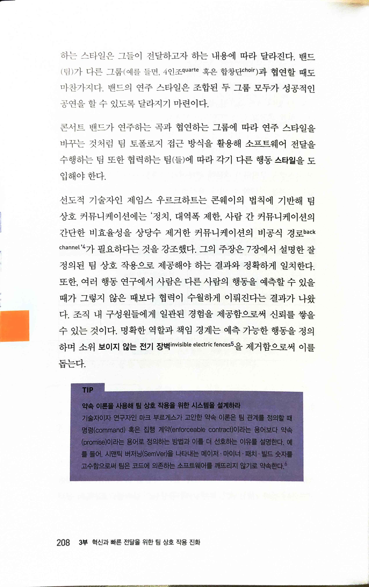

* `제임스 우르크하트는 콘웨이의 법칙에 기반해 팀 상호 커뮤니케이션에는 '정치, 대역폭 제한, 사람 간 커뮤니케이션의 간단한 비효율성을 상당수 제거한 커뮤니케이션의 비공식 경로 backchannel 가 필요하다는 것을 강조했다.`
* `여러 행동 연구에서 사람은 다른 사람의 행동을 예측할 수 있을 때가 그렇지 않은 때보다 협력이 수월하게 이뤄진다는 결과가 나왔다. 조직 내 구성원들에게 일관된 경험을 제공함으로써 신뢰를 쌓을 수 있는 것이다. 명확한 역할과 책임 경계는 예측 가능한 행동을 정의하며 소위 보이지 않는 전기 장벽 invisible electric fencess 을 제거함으로써 이를 돕는다.`

* `별도 아키텍처 팀을 두는 것은 일반적으로 피해야 할 안티 패턴이다. 하지만 조직 내 하나의 작은 소프트웨어 및 시스템 아키텍트 그룹은 매우 효과적일 수 있다. 단, 아키텍처 팀의 업무 영역이 결과적으로 시스템 아키텍처 사이의 상호 작용을 발견하고, 조정하고, 그 형태를 변경할 때 한해서다.`
* 알란 켈리 `"누군가 아키텍트에 기술적 능력과 사회적 능력이 모두 필요하다고 주장한다면… 아키텍트는 순수 기술 그 이상의 영역을 다뤄야 할 것이다. 또한 비즈니스 전략은 물론, 조직 구조 그리고 개인 이슈에 관해서도 알아야 한다. 즉, 아키텍트는 관리자여야 한다."`
* `조직의 아키텍트는 결과적으로 팀 API 설계자이며, 팀 API는 의도된 소프트웨어 아키텍처를 기대`
* `팀 내 구성원 개인들에게 온전히 의지해 경계를 확장하는 것보다(이는 매우 고되며 사회적 능력과 기술적 능력이 모두 필요하다), API 설계에 뛰어난 사람들을 통해 조직 내 팀 사이의 API를 설계하도록 하는 것이 효과적`
  * (의견 수렴은 필요하나 개개인의 의견을 전부 받아들이는 건 너무 힘들어 비효율적이거나 혹은 잘 되면 효과적이나 매우 힘들다는 이야기 중 어느 쪽일까?)

### 8장 조직적 감지로 팀 구조를 발전시켜라

* 적응력 `소프트웨어를 구현하고 운영하는 현대 조직 설계에 있어, 가장 중요한 것은 조직의 형태가 아닌 새로운 어려움이 나타났을 때 조직을 적웅 및 변화시키기 위해 활용할 규칙과 휴리스틱을 결정하는 것이다. 다시 말해, 조직 자체가 아니라 조직 구성에 필요한 규칙을 설계해야 한다.`

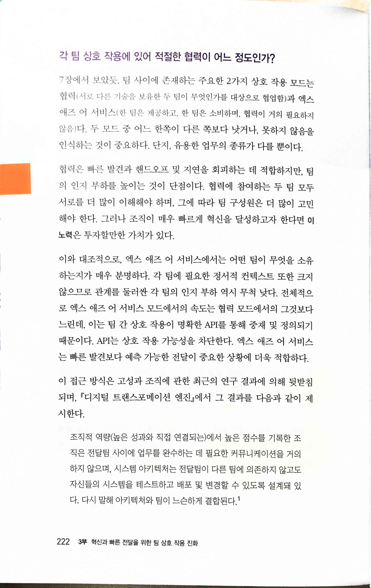

* 상호 작용 모드: `두 모드 중 어느 한쪽이 다른 쪽보다 낫거나, 못하지 않음을 인식하는 것이 중요하다. 단지, 유용한 업무의 종류가 다를 뿐`
* `협력 (서로 다른 기술을 보유한 두 팀이 무엇인가를 대상으로 협업함)`
  * `협력은 빠른 발견과 핸드오프 및 지연을 회피하는 데 적합하지만, 팀의 인지 부하를 높이는 것이 단점이다. 협력에 참여하는 두 팀 모두 서로를 더 많이 이해해야 하며, 그에 따라 팀 구성원은 더 많이 고민해야 한다. 그러나 조직이 매우 빠르게 혁신을 달성하고자 한다면 이 노력은 투자할만한 가치가 있다.`
  * 다른 팀의 기술 스택 혹은 논리적 도메인 모델의 일부를 탐험
* `엑스애즈 어 서비스(한 팀은 제공하고, 한 팀은 소비하며, 협력이 거의 필요하지 않음)`
  * `엑스 애즈 어 서비스에서는 어떤 팀이 무엇을 소유하는지가 매우 분명하다. 각 팀에 필요한 정서적 컨텍스트 또한 크지 않으므로 관계를 둘러싼 각 팀의 인지 부하 역시 무척 낮다. 전체적으로 엑스 애즈 어 서비스 모드에서의 속도는 협력 모드에서의 그것보다. 느린데, 이는 팀 간 상호 작용이 명확한 API를 통해 중재 및 정의되기 때문이다. API는 상호 작용 가능성을 차단한다. 엑스 애즈 어 서비스는 빠른 발견보다 예측 가능한 전달이 중요한 상황에 더욱 적합`
  * 다른 팀에서 발견한 새로운 성공적 전달의 접근 방식을 활용해 자신들의 전달에 대한 예측성을 높일 때

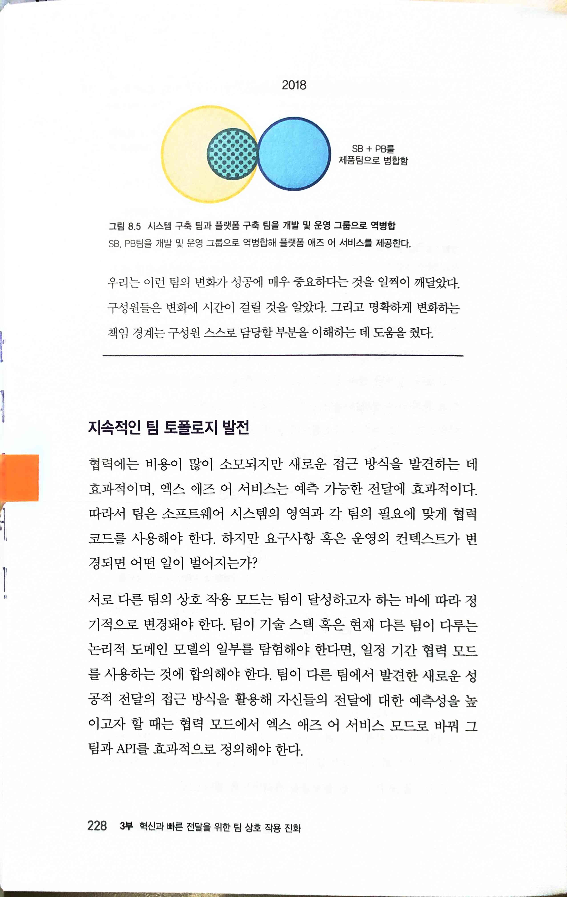

* `협력에는 비용이 많이 소모되지만 새로운 접근 방식을 발견하는 데 효과적이며, 엑스 애즈 어 서비스는 예측 가능한 전달에 효과적이다. 따라서 팀은 소프트웨어 시스템의 영역과 각 팀의 필요에 맞게 협력 코드를 사용해야 한다. 하지만 요구사항 혹은 운영의 컨텍스트가 변경되면 어떤 일이 벌어지는가?`

 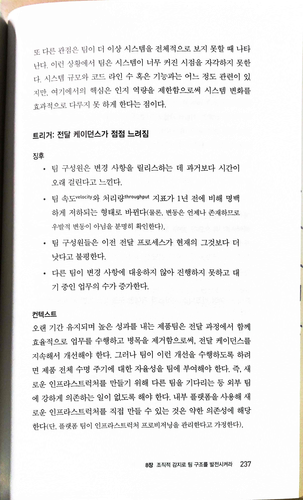

* `소프트웨어의 규모가 한 팀이 다룰 수 없을 만큼 커짐`
  * `• 한 스타트업 기업이 15명을 넘는 규모로 커진다(던바의 수).`
  * `• 다른 팀은 한 팀이 변화를 해결할 때까지 기다리느라 많은 시간을 소모한다.`
  * `• 팀 구성원(들)이 바쁨에도 불구하고, 시스템 내 특정한 컴포넌트나 워크플로우 변경 업무가 동일한 사람에게 반복적으로 할당된다.`
  * `팀 구성원(들)이 시스템 문서 부재에 대해 불평을 늘어놓는다.`
* `팀 내에서 시스템의 서로 다른 부문에 대한 전문화(주로 명시적 언급 없이)로 이어진다. 특정한 컴포넌트나 워크플로우에 대한 변경요청은 관습적으로 같은 팀 구성원(들)에게 할당된다. 그 구성원들이 팀의 해당 처리 요청을 누구보다 빠르게 완료할 수 있기 때문이다.`
* `이런 전문화 사이클 강화를 국지적 최적화(이 요청을 최대한 빨리 전달해야 한다)라고 부르며 이는 팀의 전체 업무 흐름에 부정적 영향을 미칠 수 있다. 업무 계획은 '우리가 지금 해야 할 일 중 가장 우선 순위가 높은 것은 무엇인가?'라는 질문이 아닌 '누가 무엇을 알고 있는가'라는 질문에 따라 결정된다. 바로 이 전문화 단계가 전달에 병목 현상을 가져온다.`
* `시스템을 전체적으로 보지 못할 때 나타난다`

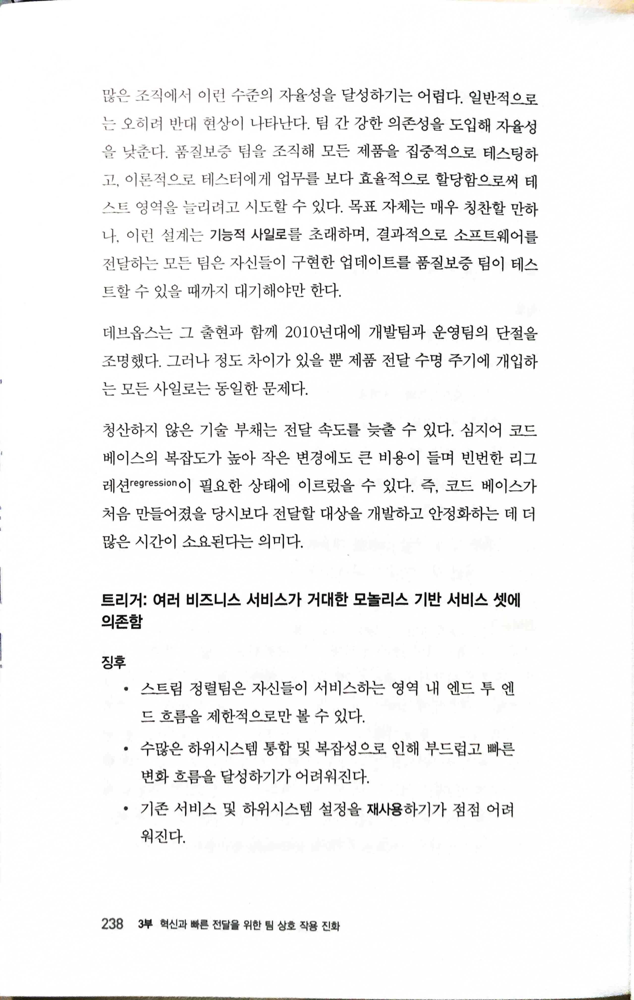 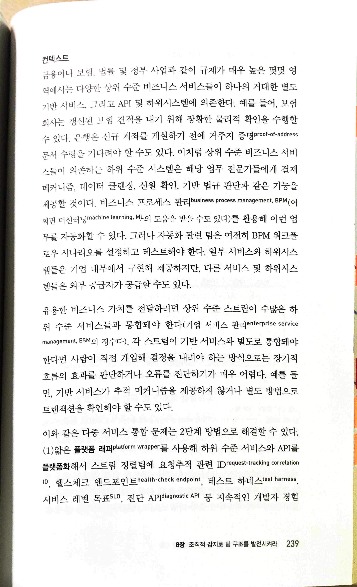 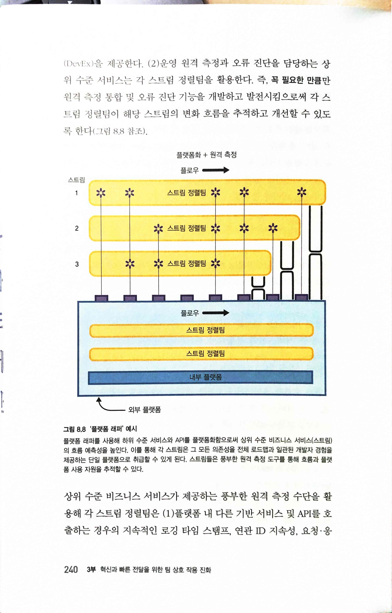

* `청산하지 않은 기술 부채는 전달 속도를 늦출 수 있다. 심지어 코드베이스의 복잡도가 높아 작은 변경에도 큰 비용이 들며 빈번한 리그레션regression이 필요한 상태에 이르렀을 수 있다. 즉, 코드 베이스가 처음 만들어졌을 당시보다 전달할 대상을 개발하고 안정화하는 데 더많은 시간이 소요된다는 의미다.`
* `여러 비즈니스 서비스가 거대한 모놀리스 기반 서비스 셋에 의존함`
  * `스트림 정렬팀은 자신들이 서비스하는 영역 내 엔드 투 엔드 흐름을 제한적으로만 볼 수 있다.`
  * `• 수많은 하위시스템 통합 및 복잡성으로 인해 부드럽고 빠른변화 흐름을 달성하기가 어려워진다.`
  * `• 기존 서비스 및 하위시스템 설정을 재사용하기가 점점 어려워진다.`
* `유용한 비즈니스 가치를 전달하려면 상위 수준 스트림이 수많은 하위 수준 서비스들과 통합돼야 한다(기업 서비스 관리 enterprise service management, ESM 의 정수다). 각 스트림이 기반 서비스와 별도로 통합돼야 한다면 사람이 직접 개입해 결정을 내려야 하는 방식으로는 장기적 흐름의 효과를 판단하거나 오류를 진단하기가 매우 어렵다. 예를 들면, 기반 서비스가 추적 메커니즘을 제공하지 않거나 별도 방법으로 트랜잭션을 확인해야 할 수도 있다.`
* `다중 서비스 통합 문제는 2단계 방법으로 해결할 수 있다.`
  * `(1) 얇은 플랫폼 래퍼 platform wrapper 를 사용해 하위 수준 서비스와 API를 플랫폼화해서 스트림 정렬팀에 요청추적 관련 ID request-tracking correlationID, 헬스체크 엔드포인트 health-check endpoint, 테스트 하네스 test harness, 서비스 레벨 목표 SLO, 진단 API diagnostic API 등 지속적인 개발자 경험을 제공한다.`
  * `(2) 운영 원격 측정과 오류 진단을 담당하는 상위 수준 서비스는 각 스트림 정렬팀을 활용한다. 즉, 꼭 필요한 만큼만 원격 측정 통합 및 오류 진단 기능을 개발하고 발전시킴으로써 각 스트림 정렬팀이 해당 스트림의 변화 흐름을 추적하고 개선할 수 있도록 한다`

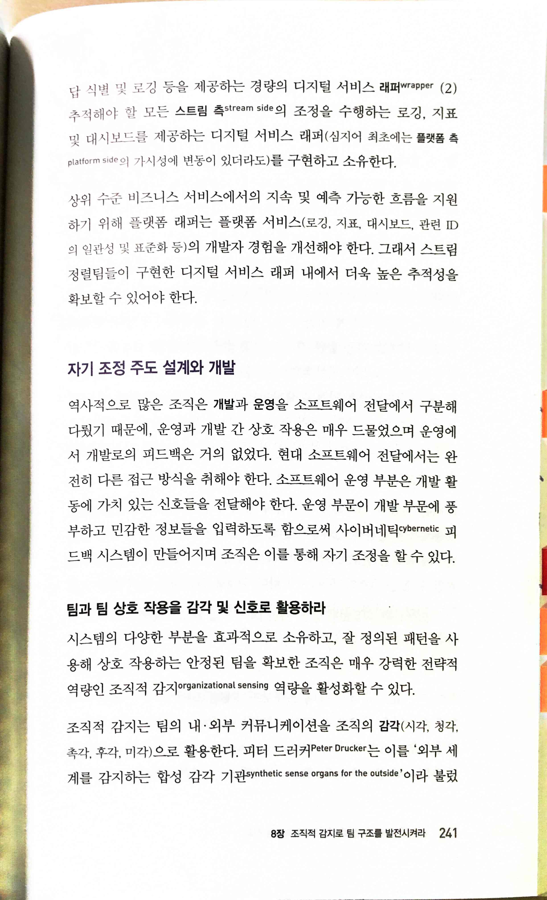

* `역사적으로 많은 조직은 개발과 운영을 소프트웨어 전달에서 구분해다뤘기 때문에, 운영과 개발 간 상호 작용은 매우 드물었으며 운영에서 개발로의 피드백은 거의 없었다. 현대 소프트웨어 전달에서는 완전히 다른 접근 방식을 취해야 한다. 소프트웨어 운영 부분은 개발 활동에 가치 있는 신호들을 전달해야 한다. 운영 부문이 개발 부문에 풍부하고 민감한 정보들을 입력하도록 함으로써 사이버네틱 cybernetic 피드백 시스템이 만들어지며 조직은 이를 통해 자기 조정을 할 수 있다.`

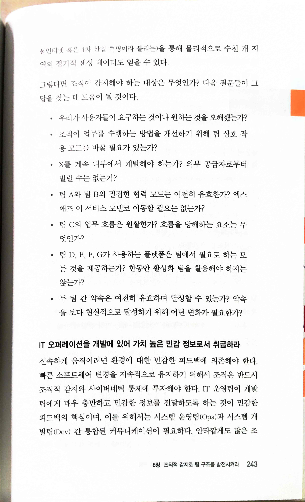

* 조직이 감지해야 하는 대상
  * `우리가 사용자들이 요구하는 것이나 원하는 것을 오해했는가? 조직이 업무를 수행하는 방법을 개선하기 위해 팀 상호 작용 모드를 바꿀 필요가 있는가?`
  * `X를 계속 내부에서 개발해야 하는가? 외부 공급자로부터 빌릴 수는 없는가?`
  * `팀 A와 팀 B의 밀접한 협력 모드는 여전히 유효한가? 엑스애즈 어 서비스 모델로 이동할 필요는 없는가?`
  * `팀 C의 업무 흐름은 원활한가? 흐름을 방해하는 요소는 무엇인가?`
  * `팀 D, E, F, G가 사용하는 플랫폼은 팀에서 필요로 하는 모든 것을 제공하는가? 한동안 활성화 팀을 활용해야 하지는 않는가?`
  * `두 팀 간 약속은 여전히 유효하며 달성할 수 있는가? 약속을 보다 현실적으로 달성하기 위해 어떤 변화가 필요한가?`
* `IT 운영팀이 개발팀에게 매우 충만하고 민감한 정보를 전달하도록 하는 것이 민감한 피드백의 핵심이며, 이를 위해서는 시스템 운영팀 (Ops)과 시스템 개발팀(Dev) 간 통합된 커뮤니케이션이 필요하다.`
  * (여기서는 IT 운영팀만 이야기하지만 사실 비즈니스 조직과도 이런 신호를 주고받을 수 있어야 하고 이게 되어야 '프로젝트에서 제품으로'가 이야기하는 플로우가 완성될 듯)

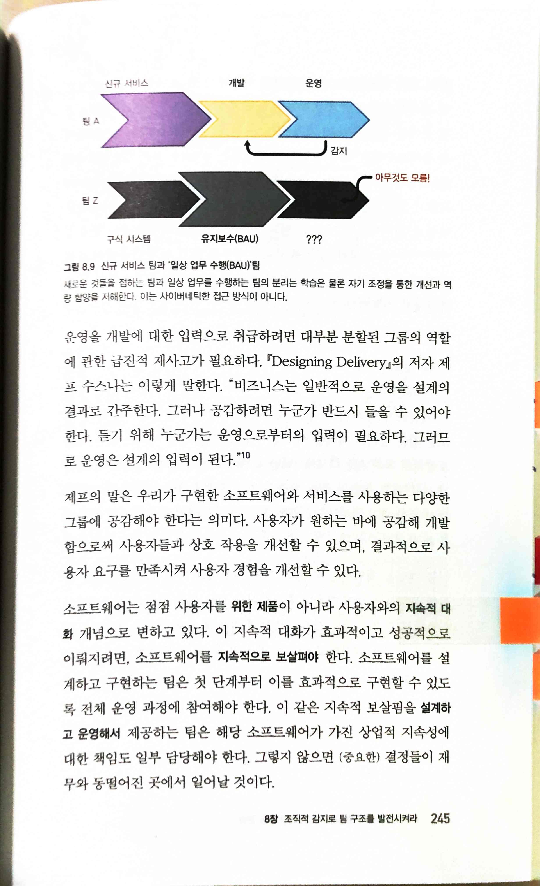

* `운영을 개발에 대한 입력으로 취급하려면 대부분 분할된 그룹의 역할에 관한 급진적 재사고가 필요하다. Designing Delivery 의 저자 제프 수스나는 이렇게 말한다. "비즈니스는 일반적으로 운영을 설계의 결과로 간주한다. 그러나 공감하려면 누군가 반드시 들을 수 있어야 한다. 듣기 위해 누군가는 운영으로부터의 입력이 필요하다. 그러므로 운영은 설계의 입력이 된다."`
* `소프트웨어는 점점 사용자를 위한 제품이 아니라 사용자와의 지속적 대화 개념으로 변하고 있다. 이 지속적 대화가 효과적이고 성공적으로 이뤄지려면, 소프트웨어를 지속적으로 보살펴야 한다. 소프트웨어를 설계하고 구현하는 팀은 첫 단계부터 이를 효과적으로 구현할 수 있도록 전체 운영 과정에 참여해야 한다. 이 같은 지속적 보살핌을 설계하고 운영해서 제공하는 팀은 해당 소프트웨어가 가진 상업적 지속성에 대한 책임도 일부 담당해야 한다.`

## 결론 차세대 디지털 운영 모델
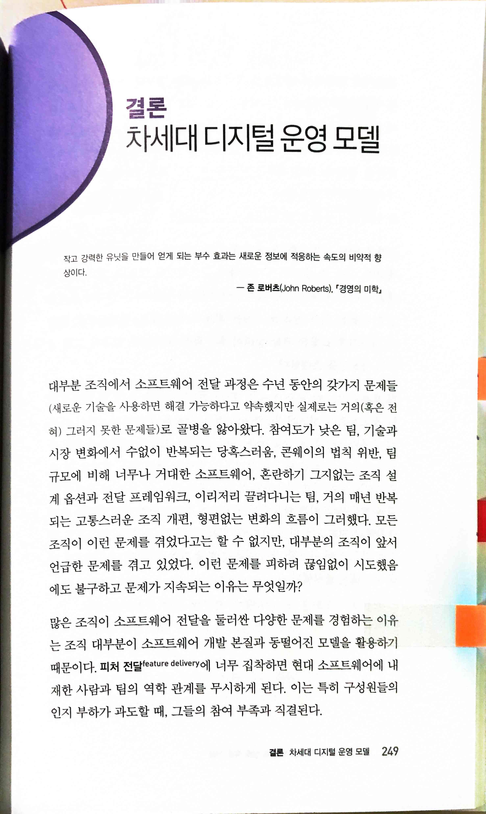

* 소프트웨어 전달 과정 문제들(새로운 기술을 사용하면 해결 가능하다고 약속했지만 실제로는 거의 (혹은 전혀) 그러지 못한 문제들)
  * 참여도가 낮은 팀
  * 기술과 시장 변화에서 수없이 반복되는 당혹스러움
  * 콘웨이의 법칙 위반
  * 팀규모에 비해 너무나 거대한 소프트웨어
  * 혼란하기 그지없는 조직 설계 옵션과 전달 프레임워크
  * 이리저리 끌려다니는 팀
  * 거의 매년 반복되는 고통스러운 조직 개편
  * 형편없는 변화의 흐름
* `이런 문제를 피하려 끊임없이 시도했음에도 불구하고 문제가 지속되는 이유는 무엇일까?`
* `많은 조직이 소프트웨어 전달을 둘러싼 다양한 문제를 경험하는 이유는 조직 대부분이 소프트웨어 개발 본질과 동떨어진 모델을 활용하기 때문이다. 피처 전달 feature delvery 에 너무 집착하면 현대 소프트웨어에 내재한 사람과 팀의 역학 관계를 무시하게 된다. 이는 특히 구성원들의 인지 부하가 과도할 때, 그들의 참여 부족과 직결된다.`

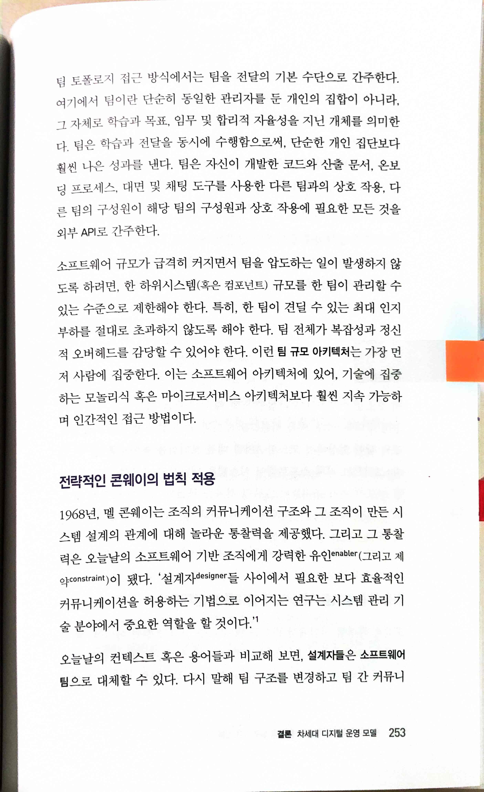

* 팀 토폴로지 접근 방식
  * 팀 = 전달의 기본 수단
  * 여기에서 팀이란 단순히 동일한 관리자를 둔 개인의 집합이 아니라, 그 자체로 학습과 목표, 임무 및 합리적 자율성을 지닌 개체를 의미
* `소프트웨어 규모가 급격히 커지면서 팀을 압도하는 일이 발생하지 않도록 하려면, 한 하위시스템(혹은 컴포넌트) 규모를 한 팀이 관리할 수있는 수준으로 제한해야 한다. 특히, 한 팀이 견딜 수 있는 최대 인지부하를 절대로 초과하지 않도록 해야 한다. 팀 전체가 복잡성과 정신적 오버헤드를 감당할 수 있어야 한다. 이런 팀 규모 아키텍처는 가장 먼저 사람에 집중한다. 이는 소프트웨어 아키텍처에 있어, 기술에 집중하는 모놀리식 혹은 마이크로서비스 아키텍처보다 훨씬 지속 가능하며 인간적인 접근 방법이다.`

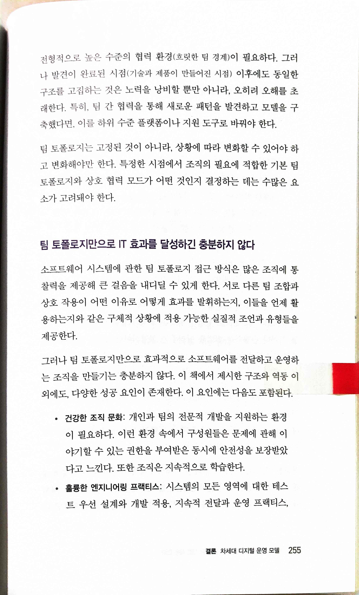

* `팀 토폴로지는 고정된 것이 아니라, 상황에 따라 변화할 수 있어야 하고 변화해야만 한다. 특정한 시점에서 조직의 필요에 적합한 기본 팀 토폴로지와 상호 협력 모드가 어떤 것인지 결정하는 데는 수많은 요소가 고려돼야 한다.`
* `팀 토폴로지만으로 효과적으로 소프트웨어를 전달하고 운영하는 조직을 만들기는 충분하지 않다. 이 책에서 제시한 구조와 역동 이외에도, 다양한 성공 요인이 존재한다. 이 요인에는 다음도 포함된다.`
  * `· 건강한 조직 문화: 개인과 팀의 전문적 개발을 지원하는 환경이 필요하다. 이런 환경 속에서 구성원들은 문제에 관해 이야기할 수 있는 권한을 부여받은 동시에 안전성을 보장받았다고 느낀다. 또한 조직은 지속적으로 학습한다.`
  * `• 훌륭한 엔지니어링 프랙티스: 시스템의 모든 영역에 대한 테스트 우선 설계와 개발 적용, 지속적 전달과 운영 프랙티스,`