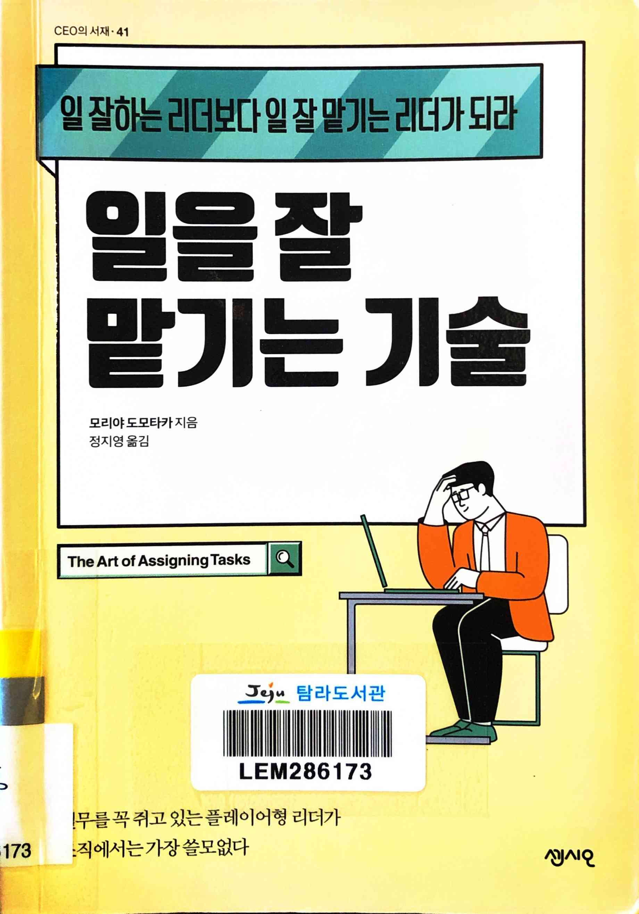
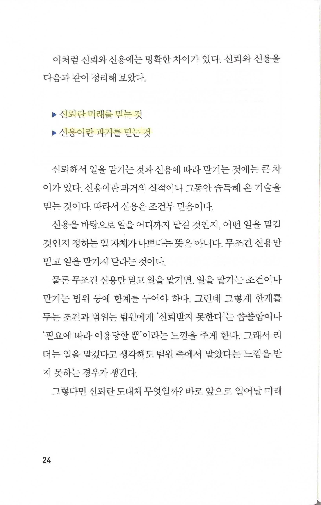
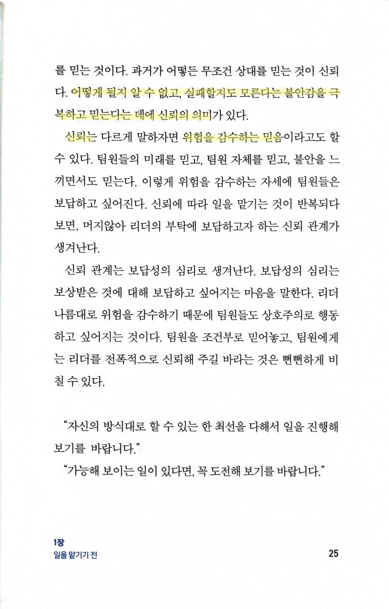
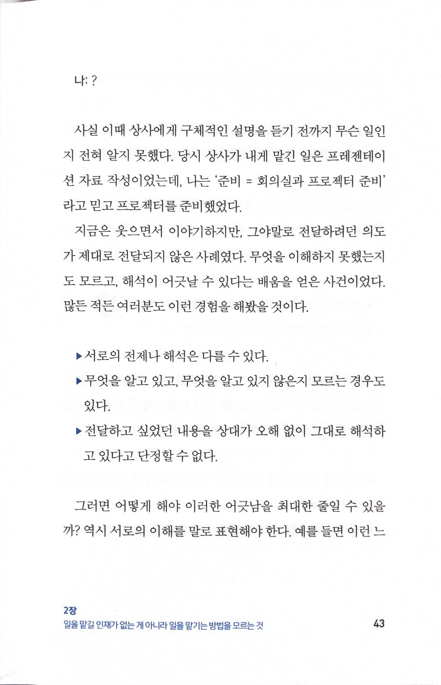
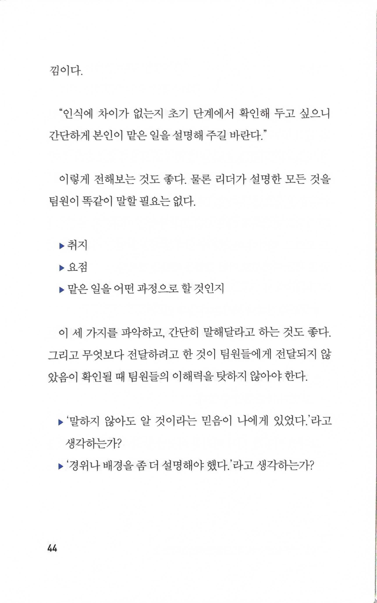

# 일을 잘 맡기는 기술

Tags: management
Date: August 20, 2024
Score: ★★★☆☆

- ★★★☆☆ August 20, 2024 일본에서 쓴 책은 자주 읽긴 하지만 나에게(혹은 내가 일하는 업계에) 잘 맞는다거나, 오래 기억이 남는 경우는 많지 않았다. 하지만 이번 책은 그래도 기록해두고 싶은 부분이 있어서 남겨둔다. management를 시작한지 대략 5년 정도이지만, 여전히 쉽지 않다. 일을 잘 맡기는 기술도 분명히 필요한 기술 중 하나이고, 같은 방식으로는 사람에 따라 효과적이기도 하고 아니기도 하기 때문에 분명히 참고할만한 책이다.
    - 한라 325.24-모298ㅇ 탐라 문325.24-모239ㅇ
- pp24~25

    

    - 신뢰란 미래를 믿는 것
    - 신용이란 과거를 믿는 것

    

    - 어떻게 될지 알 수 없고, 실패할지도 모른다는 불안감을 극복하고 믿는다는 데에 신뢰의 의미
    - 신뢰는… 위험을 감수하는 믿음
- pp43~44

    

    

    - communication의 문제점
