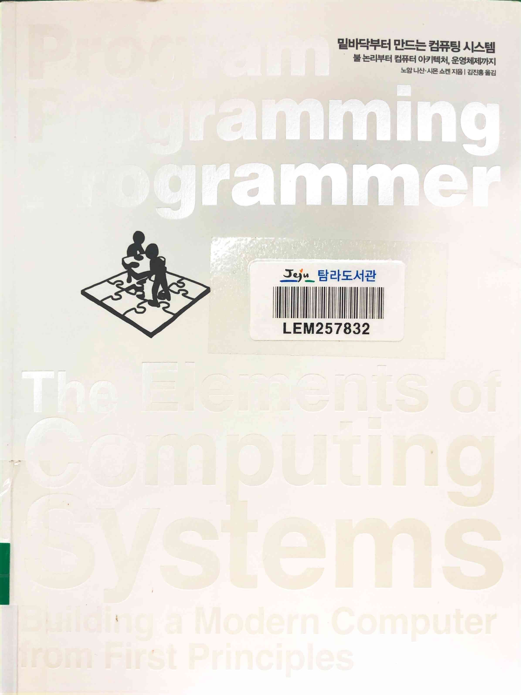
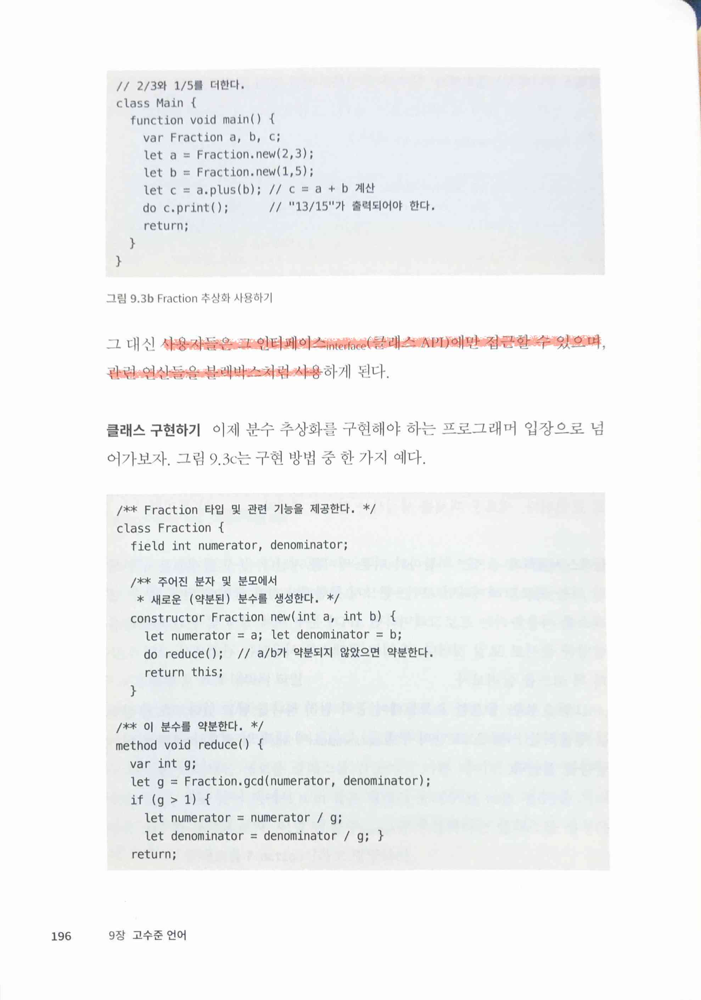
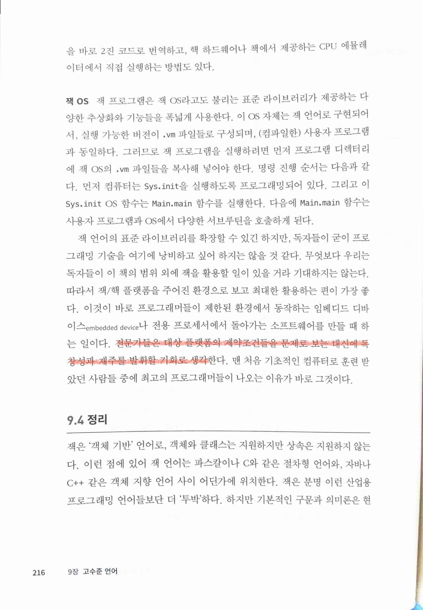
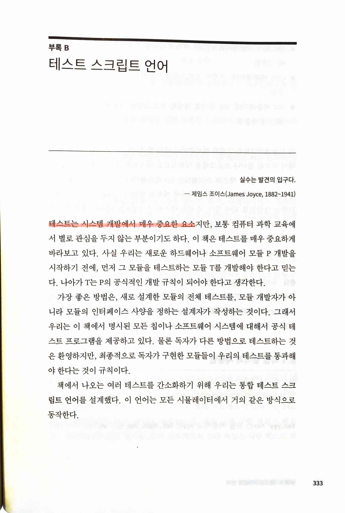

밑바닥부터 만드는 컴퓨팅 시스템
===============================

* [Home | nand2tetris](https://www.nand2tetris.org/)
* 책은 대략 훑어봐서 그 내용에 대해서는 이미 20년도 더 전에 다 잊어버렸던 걸, 다시 한 번 이런게 있었지 리마인드하는 정도로 지났고, 기술적인 부분보다 오히려 일에 대한 마음가짐을 다시 한 번 생각해보게 하는 문구들을 기록해둠

> 듣기만 하면 잊어버리게 마련이고, 보면 기억만 할 수 있을 뿐이고, 행해야 이해할 수 있다. 공자(기원전 551-479)
>
> (옮긴이) 이 말은 실제로 공자가 한 적이 없는 말이다. 그보다는 순자의 유효편에서 나온 불문불약문지(不聞不若聞之), 문지불약견지(聞之不若見之), 견지불약지지(見之不若知之), 지지불약행지(知之不若行之), 학지어행지이지의 (學至於行之而止矣)(듣지않는 것은 듣는 것만 못하고, 듣는 것은 보는 것만 못하며, 보는 것은 아는 것만 못하고, 아는 것은 행하는 것만 못하다. 배움이란 행하는 데에 이르러야 완성되는 것이다)에서 따온 말로 보인다.

> 여행에서 진짜 발견이란, 새로운 장소를 가는 것뿐 아니라 새로운 시각을 갖는 것이다.- 마르셀 프루스트(Marcel Proust, 1871-1922)
>
> 심리학자 칼 로저스 Carl Rogers는 "행동에 유의미하게 영향을 미치는 학습방법은, 경험을 통해 스스로 발견하고 스스로 적응하며 진리를 완전히 이해하는 방법뿐이다"

 

> 중요한 소프트웨어 공학 원리 하나. 추상화를 활용하는 사람은 그 안의 구현implementation에 대해 알 필요가 전혀 없어야 한다
>
> 사용자들은 그 인터페이스interface(클래스 API)에만 접근할 수 있으며, 관련 연산들을 블랙박스처럼 사용
* 생각해보면 모든 system이 그렇다. 흔히 하는 비유처럼 자동차 엔진의 동작 방법을 알아야 운전할 수 있는 게 아니듯, 서로 연결하는 시스템들도 어떤 수준에서건 서로간의 접점에 대해서만 이해를 하는 게 필요하지 그 내부를 알아야 사용할 수 있는 건 전혀 아니다(물론 내부 원리를 이해하는 건 좋은 일이지만)

> 전문가들은 대상 플랫폼의 제약조건들을 문제로 보는 대신에 독창성과 재주를 발휘할 기회로 생각한다.
* 기술적인 부분보다 오히려 마음가짐에 있어서 더 생각을 다시 하게 되는 부분

> 생각을 정리하고 표현하지 않으면 언어를 다듬을 수 없으며, 언어가 비추지 않으면 생각이 빛나지도 못합니다. - 키케로(Cicero, 기원전 106-43)

> 실수는 발견의 입구다. - 제임스 조이스(James Joyce, 1882~1941)
>
> 테스트는 시스템 개발에서 매우 중요한 요소