인피니트 게임
=============
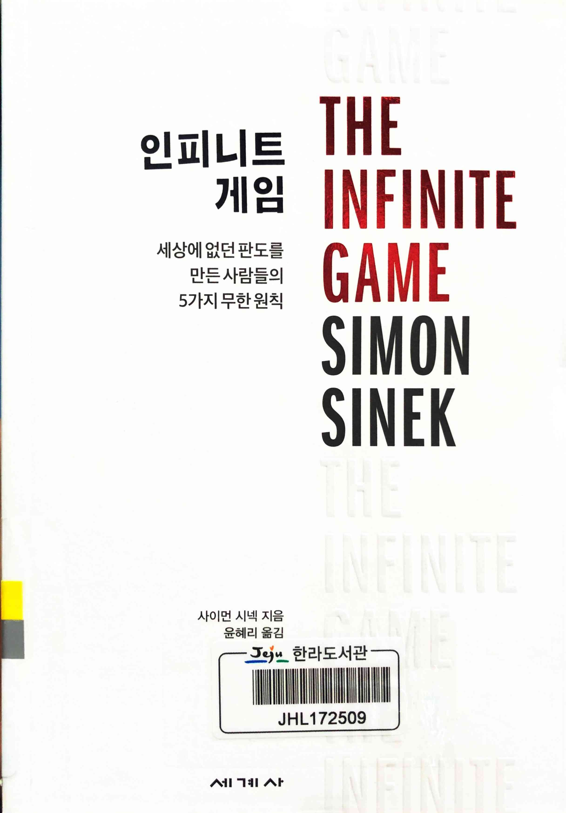

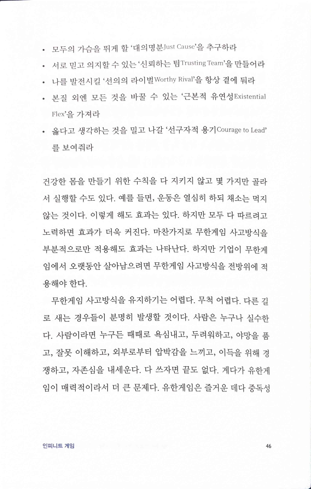 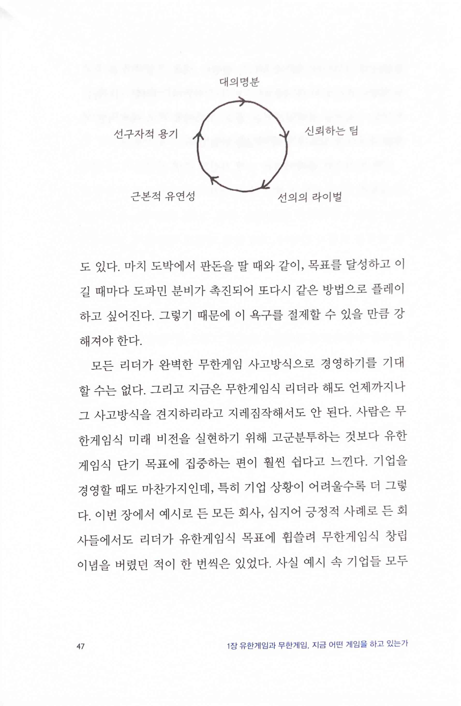

* '대의명분 Just Cause'
* '신뢰하는 팀 Trusting Team'
* '선의의 라이벌 Worthy Rival'
* '근본적 유연성 Existential Flex'
* '선구자적 용기 Courage to Lead'
> 무한게임에서 오랫동안 살아남으려면 무한게임 사고방식을 전방위에 적용해야 한다.
>
> 무한게임 사고방식을 유지하기는 어렵다.
>
> 사람은 무한게임식 미래 비전을 실현하기 위해 고군분투하는 것보다 유한게임식 단기 목표에 집중하는 편이 훨씬 쉽다고 느낀다.

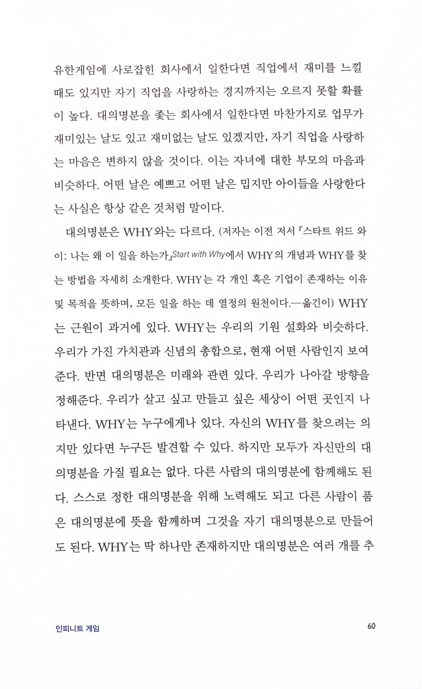 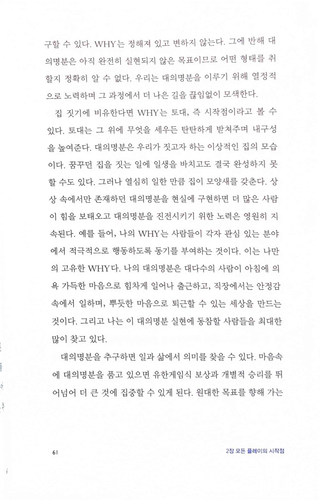 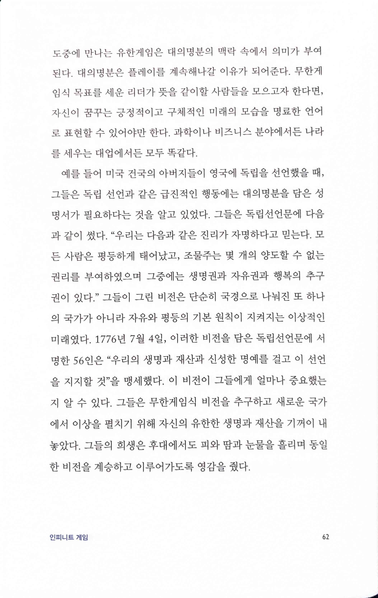 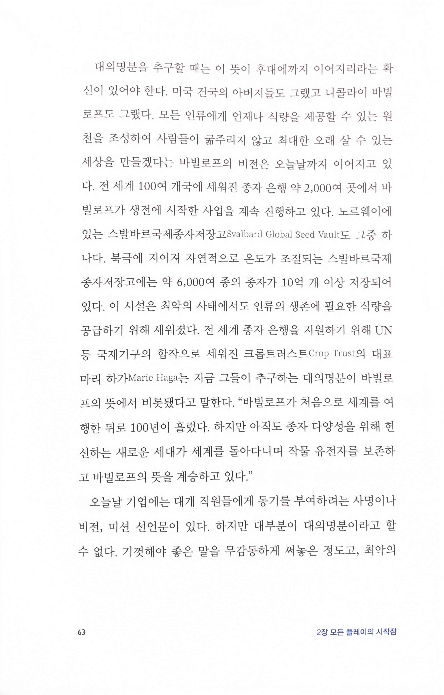

> 대의명분은 WHY와는 다르다. (저자는 이전 저서 「스타트 위드 와이: 나는 왜 이 일을 하는가」 Start with Why에서 WHY 의 개념과 WHY 를 찾는 방법을 자세히 소개한다. WHY 는 각 개인 혹은 기업이 존재하는 이유및 목적을 뜻하며, 모든 일을 하는 데 열정의 원천이다. 옮긴이) WHY는 근원이 과거에 있다. WHY 는 우리의 기원 설화와 비슷하다. 우리가 가진 가치관과 신념의 총합으로, 현재 어떤 사람인지 보여준다. 반면 대의명분은 미래와 관련 있다. 우리가 나아갈 방향을 정해준다. 우리가 살고 싶고 만들고 싶은 세상이 어떤 곳인지 나타낸다. WHY는 누구에게나 있다. 자신의 WHY를 찾으려는 의지만 있다면 누구든 발견할 수 있다... WHY 는 정해져 있고 변하지 않는다. 그에 반해 대의명분은 아직 완전히 실현되지 않은 목표이므로 어떤 형태를 취할지 정확히 알 수 없다. 우리는 대의명분을 이루기 위해 열정적으로 노력하며 그 과정에서 더 나은 길을 끊임없이 모색한다.
>
> 집 짓기에 비유한다면 WHY는 토대, 즉 시작점이라고 볼 수있다. 토대는 그 위에 무엇을 세우든 탄탄하게 받쳐주며 내구성을 높여준다. 대의명분은 우리가 짓고자 하는 이상적인 집의 모습이다.
>
> 대의명분을 추구하면 일과 삶에서 의미를 찾을 수 있다.
>
> 대의명분을 추구할 때는 이 뜻이 후대에까지 이어지리라는 확신이 있어야 한다... 모든 인류에게 언제나 식량을 제공할 수 있는 원천을 조성하여 사람들이 굶주리지 않고 최대한 오래 살 수 있는 세상을 만들겠다는 바빌로프의 비전은 오늘날까지 이어지고 있다. 전 세계 100여 개국에 세워진 종자 은행 약 2,000여 곳에서 바빌로프가 생전에 시작한 사업을 계속 진행하고 있다. 노르웨이에 있는 `스발바르국제종자저장고 Svalbard Global Seed Vault`도 그중 하나다.
* [영양실조로 생 마감한 '배부른 몽상가'의 궤적](https://www.pressian.com/pages/articles/65915)
* [식물판 노아의 방주 ‘국제 종자저장고’ – Sciencetimes](https://www.sciencetimes.co.kr/news/%EC%8B%9D%EB%AC%BC%ED%8C%90-%EB%85%B8%EC%95%84%EC%9D%98-%EB%B0%A9%EC%A3%BC-%EA%B5%AD%EC%A0%9C-%EC%A2%85%EC%9E%90%EC%A0%80%EC%9E%A5%EA%B3%A0/)

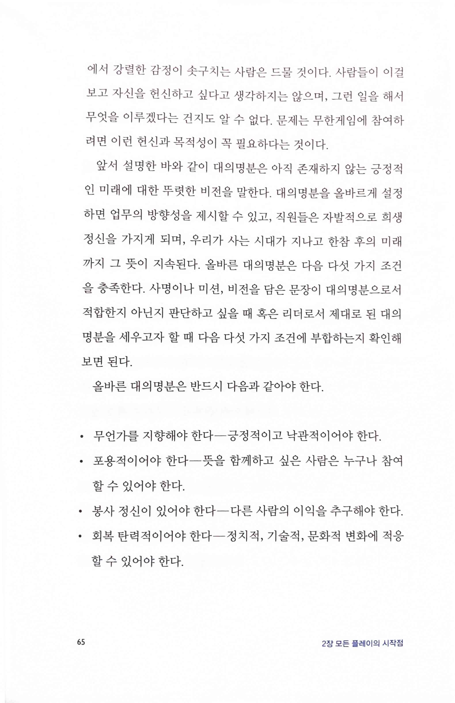 

> 올바른 대의명분은 반드시 다음과 같아야 한다.
>
> • 무언가를 지향해야 한다-긍정적이고 낙관적이어야 한다.
>
> • 포용적이어야 한다-뜻을 함께하고 싶은 사람은 누구나 참여할 수 있어야 한다.
>
> • 봉사 정신이 있어야 한다-다른 사람의 이익을 추구해야 한다.
>
> • 회복 탄력적이어야 한다-정치적, 기술적, 문화적 변화에 적응할 수 있어야 한다.
>
> • 이상적이어야 한다-크고 대담하며 궁극적으로 달성할 수 없는 목표여야 한다.
>
> 대의명분은 우리가 믿고 지지하는 비전이지 반대하는 대상이 아니다... 무언가를 지향하면 열의가 생긴다. 사람들은 의지를 불태우고 낙관적인 마음과 희망을 품는다. '지향'하는 행위는 모두 함께 선한 신념에 동참하도록 초대하는 것이다. 상상력을 자극해 아직 존재하지 않는 미래에 집중하게 한다.

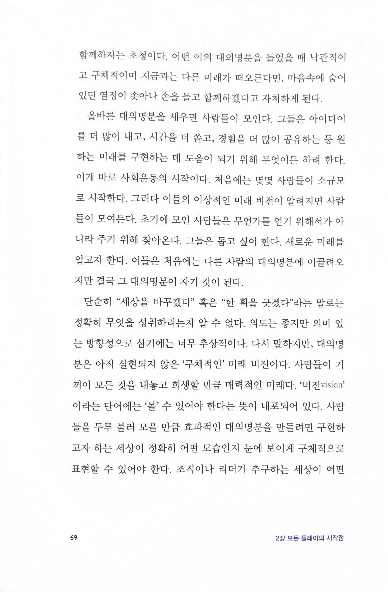

> 대의명분은 아직 실현되지 않은 '구체적인' 미래 비전이다. 사람들이 기꺼이 모든 것을 내놓고 희생할 만큼 매력적인 미래다. '비전 vision'이라는 단어에는 '볼 수 있어야 한다는 뜻이 내포되어 있다. 사람들을 두루 불러 모을 만큼 효과적인 대의명분을 만들려면 구현하고자 하는 세상이 정확히 어떤 모습인지 눈에 보이게 구체적으로 표현할 수 있어야 한다.
* [Word Root: vis (Root) | Membean](https://membean.com/roots/vis-see)

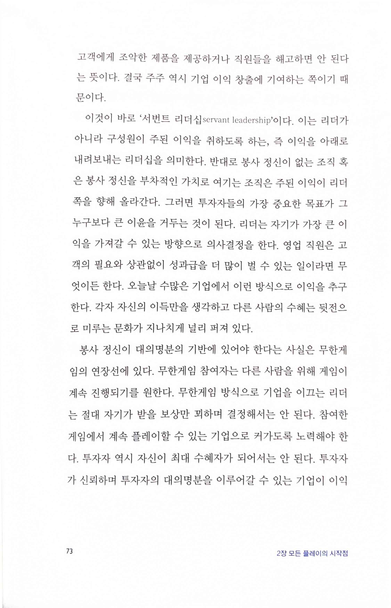

> 이것이 바로 '서번트 리더십 servant leadership'이다. 이는 리더가 아니라 구성원이 주된 이익을 취하도록 하는, 즉 이익을 아래로 내려보내는 리더십을 의미한다.
>
> 봉사 정신이 대의명분의 기반에 있어야 한다는 사실은 무한게임의 연장선에 있다.

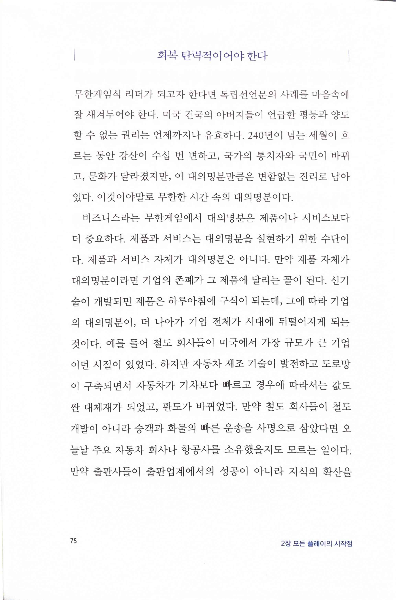

> 비즈니스라는 무한게임에서 대의명분은 제품이나 서비스보다 더 중요하다. 제품과 서비스는 대의명분을 실현하기 위한 수단이다. 제품과 서비스 자체가 대의명분은 아니다. 만약 제품 자체가 대의명분이라면 기업의 존폐가 그 제품에 달리는 꼴이 된다. 신기술이 개발되면 제품은 하루아침에 구식이 되는데, 그에 따라 기업의 대의명분이, 더 나아가 기업 전체가 시대에 뒤떨어지게 되는 것이다.

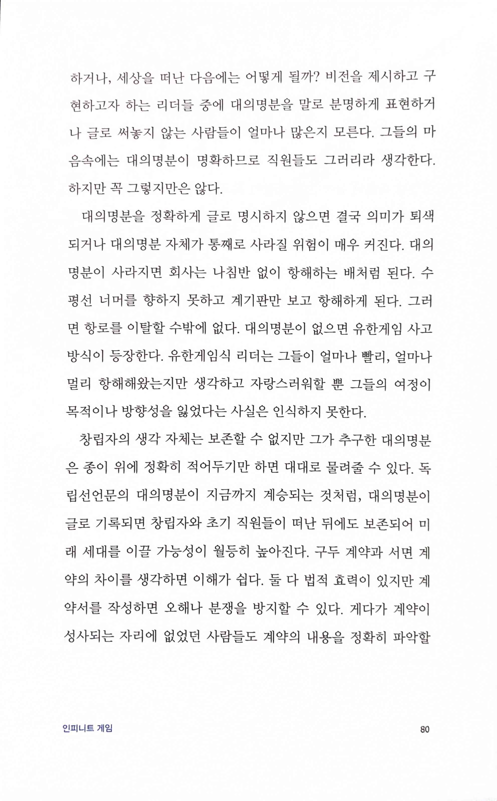 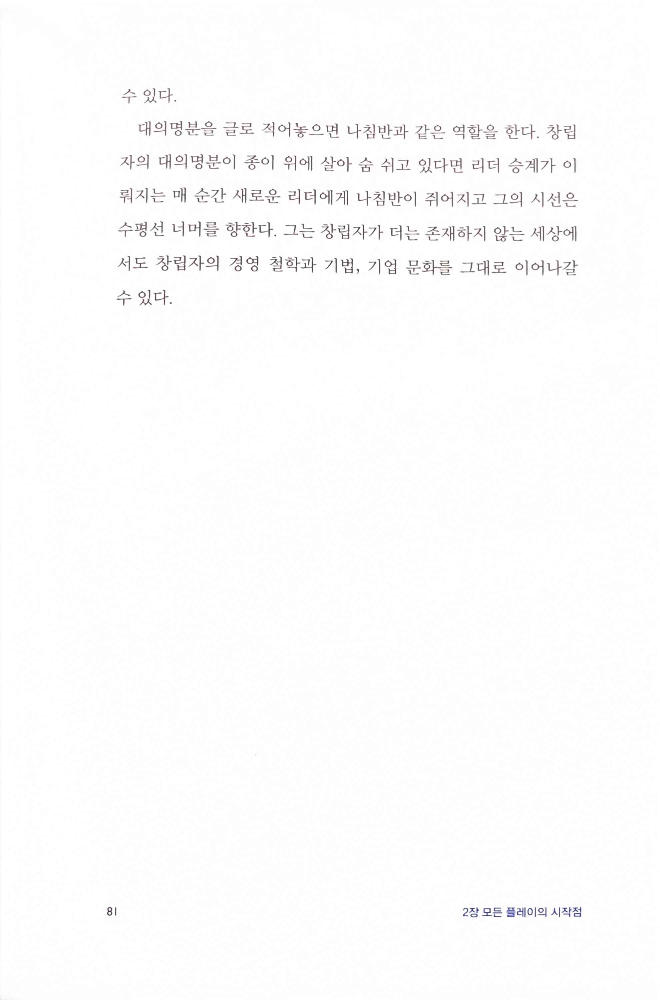

> 대의명분을 정확하게 글로 명시하지 않으면 결국 의미가 퇴색되거나 대의명분 자체가 통째로 사라질 위험이 매우 커진다. 대의명분이 사라지면 회사는 나침반 없이 항해하는 배처럼 된다. 수평선 너머를 향하지 못하고 계기판만 보고 항해하게 된다. 그러면 항로를 이탈할 수밖에 없다. 대의명분이 없으면 유한게임 사고방식이 등장한다. 유한게임식 리더는 그들이 얼마나 빨리, 얼마나 멀리 항해해왔는지만 생각하고 자랑스러워할 뿐 그들의 여정이 목적이나 방향성을 잃었다는 사실은 인식하지 못한다.
>
> 대의명분을 글로 적어놓으면 나침반과 같은 역할을 한다.

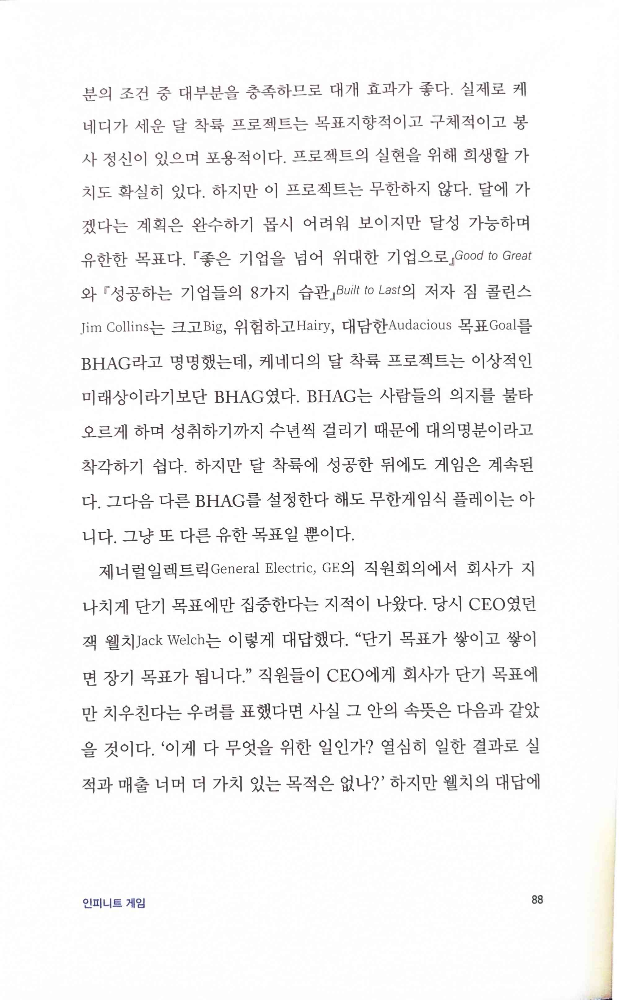 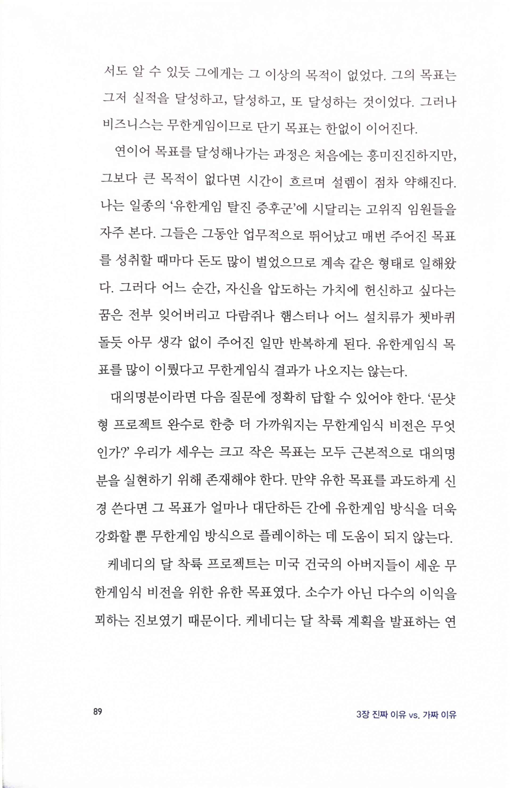

> 좋은 기업을 넘어 위대한 기업으로 Good to Great와 성공하는 기업들의 8가지 습관 Built to Last 의 저자 짐 콜린스 Jim Collins는 크고 Big, 위험하고 Hairy, 대담한 Audacious 목표 Goal BHAG라고 명명했는데, 케네디의 달 착륙 프로젝트는 이상적인 미래상이라기보단 BHAG였다. BHAG는 사람들의 의지를 불타오르게 하며 성취하기까지 수년씩 걸리기 때문에 대의명분이라고 착각하기 쉽다. 하지만 달 착륙에 성공한 뒤에도 게임은 계속된다. 그다음 다른 BHAG를 설정한다 해도 무한게임식 플레이는 아니다. 그냥 또 다른 유한 목표일 뿐이다.
* 이제는 여러 책에서 단기 목표에 집착하는 리더의 대명사로 전락한 잭 웰치 Jack Welch
> 유한게임식 목표를 많이 이뤘다고 무한게임식 결과가 나오지는 않는다.
>
> 우리가 세우는 크고 작은 목표는 모두 근본적으로 대의명분을 실현하기 위해 존재해야 한다. 만약 유한 목표를 과도하게 신경 쓴다면 그 목표가 얼마나 대단하든 간에 유한게임 방식을 더욱 강화할 뿐 무한게임 방식으로 플레이하는 데 도움이 되지 않는다.

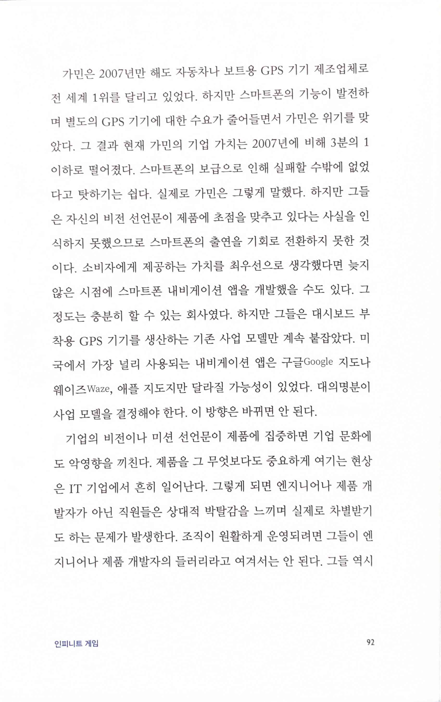 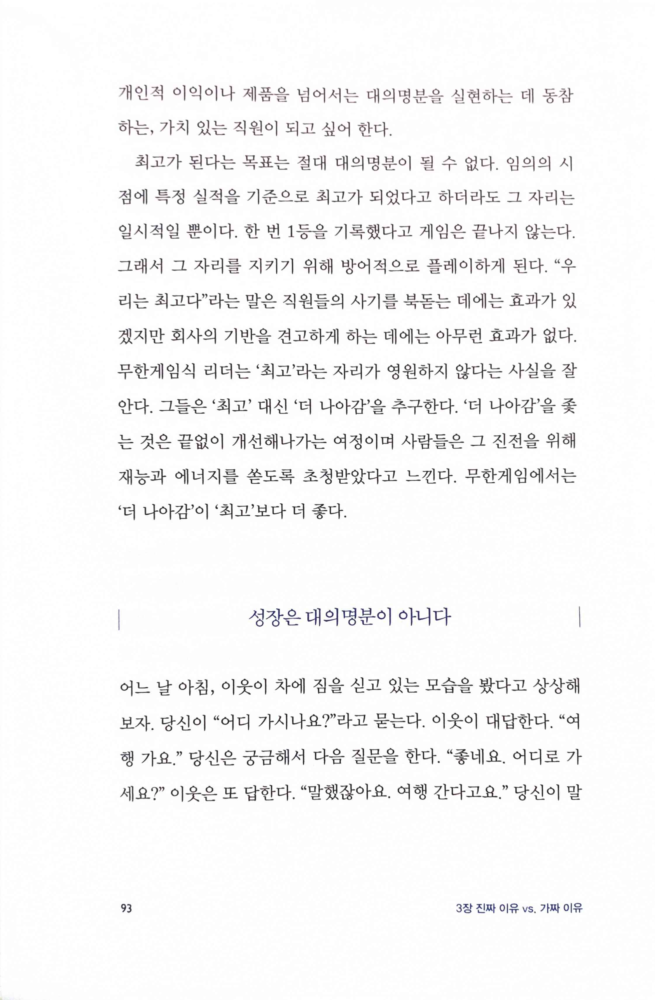

> 기업의 비전이나 미션 선언문이 제품에 집중하면 기업 문화에도 악영향을 끼친다. 제품을 그 무엇보다도 중요하게 여기는 현상은 IT 기업에서 흔히 일어난다. 그렇게 되면 엔지니어나 제품 개발자가 아닌 직원들은 상대적 박탈감을 느끼며 실제로 차별받기도 하는 문제가 발생한다. 조직이 원활하게 운영되려면 그들이 엔지니어나 제품 개발자의 들러리라고 여겨서는 안 된다. 그들 역시 개인적 이익이나 제품을 넘어서는 대의명분을 실현하는 데 동참하는, 가치 있는 직원이 되고 싶어 한다.
>
> 최고가 된다는 목표는 절대 대의명분이 될 수 없다... 무한게임식 리더는 '최고'라는 자리가 영원하지 않다는 사실을 잘 안다. 그들은 '최고' 대신 '더 나아감'을 추구한다. '더 나아감'을 좇는 것은 끝없이 개선해나가는 여정이며 사람들은 그 진전을 위해 재능과 에너지를 쏟도록 초청받았다고 느낀다. 무한게임에서는 '더 나아감'이 '최고'보다 더 좋다.

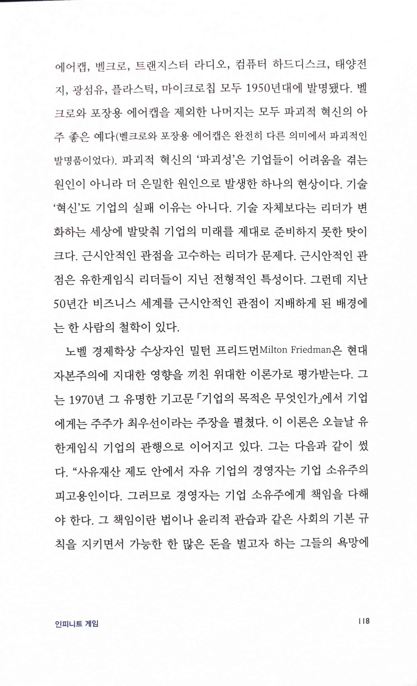 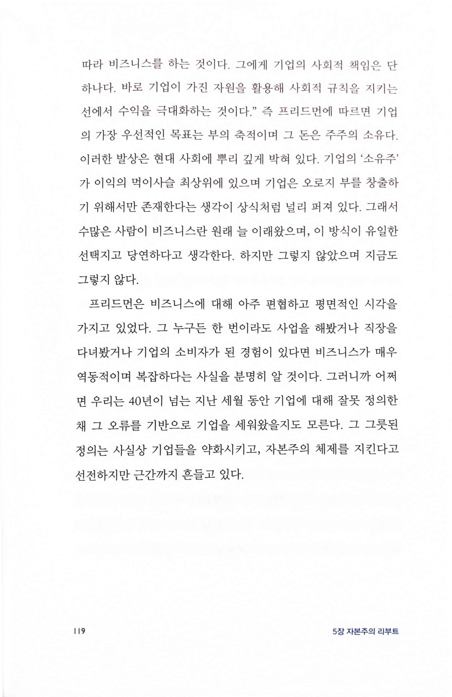

* 노벨 경제학상 수상자인 밀턴 프리드먼 Milton Friedman으로 인해 주주 자본주의가 상식이 되었다는 비판

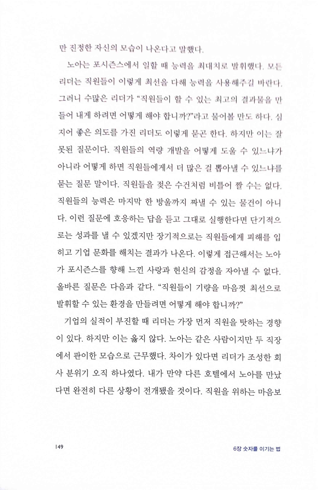

> "직원들이 할 수 있는 최고의 결과물을 만들어 내게 하려면 어떻게 해야 합니까?"는 잘못된 질문이다... 올바른 질문은 다음과 같다. “직원들이 기량을 마음껏 최선으로 발휘할 수 있는 환경을 만들려면 어떻게 해야 합니까?"
* 리더가 조성한 회사 분위기에 따른 차이

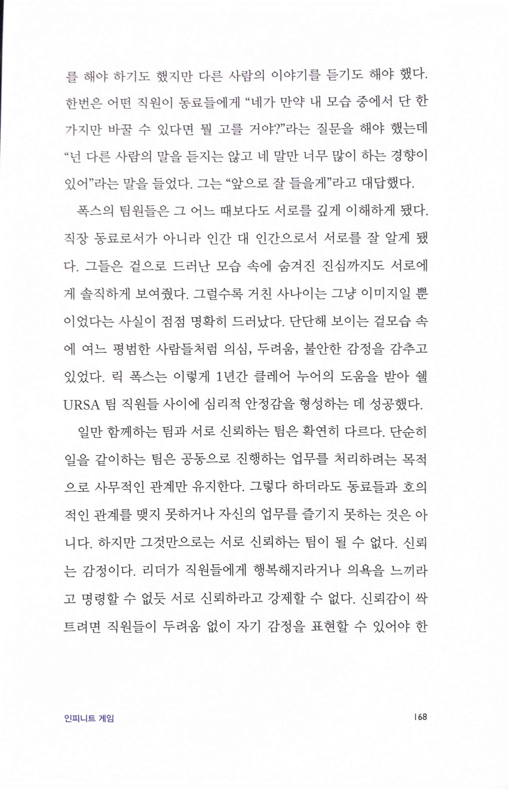 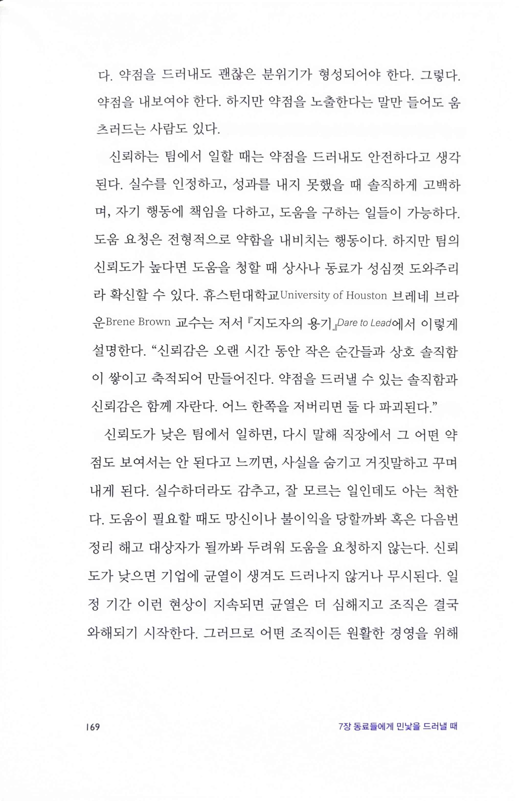 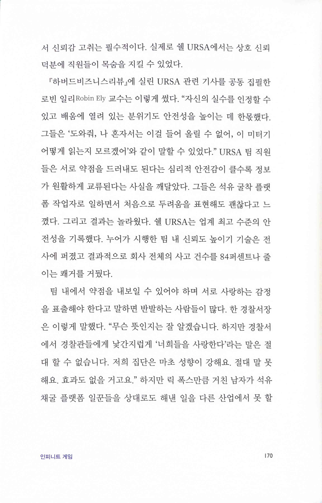 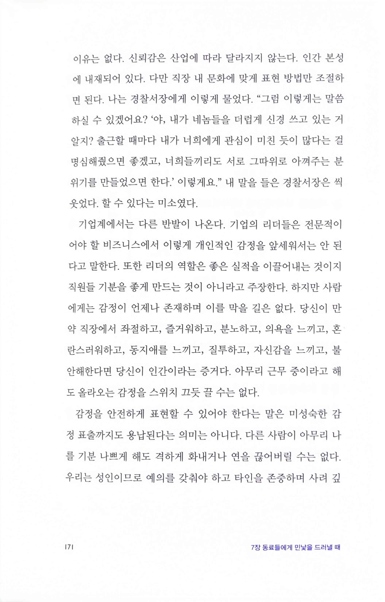

> 일만 함께하는 팀과 서로 신뢰하는 팀은 확연히 다르다... 신뢰는 감정이다. 리더가 직원들에게 행복해지거나 의욕을 느끼라고 명령할 수 없듯 서로 신뢰하라고 강제할 수 없다. 신뢰감이 싹트려면 직원들이 두려움 없이 자기 감정을 표현할 수 있어야 한다. 약점을 드러내도 괜찮은 분위기가 형성되어야 한다. 그렇다. 약점을 내보여야 한다.
>
> 휴스턴대학교 University of Houston 브레네 브라운 Brene Brown 교수는 저서 「지도자의 용기 Dare to Lead」에서 이렇게 설명한다. "신뢰감은 오랜 시간 동안 작은 순간들과 상호 솔직함이 쌓이고 축적되어 만들어진다. 약점을 드러낼 수 있는 솔직함과 신뢰감은 함께 자란다. 어느 한쪽을 저버리면 둘 다 파괴된다."
* [Brené Brown](https://brenebrown.com/)
> 신뢰도가 낮은 팀에서 일하면, 다시 말해 직장에서 그 어떤 약점도 보여서는 안 된다고 느끼면, 사실을 숨기고 거짓말하고 꾸며내게 된다. 실수하더라도 감추고, 잘 모르는 일인데도 아는 척한다. 도움이 필요할 때도 망신이나 불이익을 당할까봐 혹은 다음번 정리 해고 대상자가 될까봐 두려워 도움을 요청하지 않는다. 신뢰도가 낮으면 기업에 균열이 생겨도 드러나지 않거나 무시된다. 일정 기간 이런 현상이 지속되면 균열은 더 심해지고 조직은 결국 와해되기 시작한다. 그러므로 어떤 조직이든 원활한 경영을 위해서 신뢰감 고취는 필수적이다.
>
> 기업의 리더들은 전문적이어야 할 비즈니스에서 이렇게 개인적인 감정을 앞세워서는 안 된다고 말한다. 또한 리더의 역할은 좋은 실적을 이끌어내는 것이지 직원들 기분을 좋게 만드는 것이 아니라고 주장한다. 하지만 사람에게는 감정이 언제나 존재하며 이를 막을 길은 없다. 당신이 만약 직장에서 좌절하고, 즐거워하고, 분노하고, 의욕을 느끼고, 혼란스러워하고, 동지애를 느끼고, 질투하고, 자신감을 느끼고, 불안해한다면 당신이 인간이라는 증거다. 아무리 근무 중이라고 해도 올라오는 감정을 스위치 끄듯 끌 수는 없다.

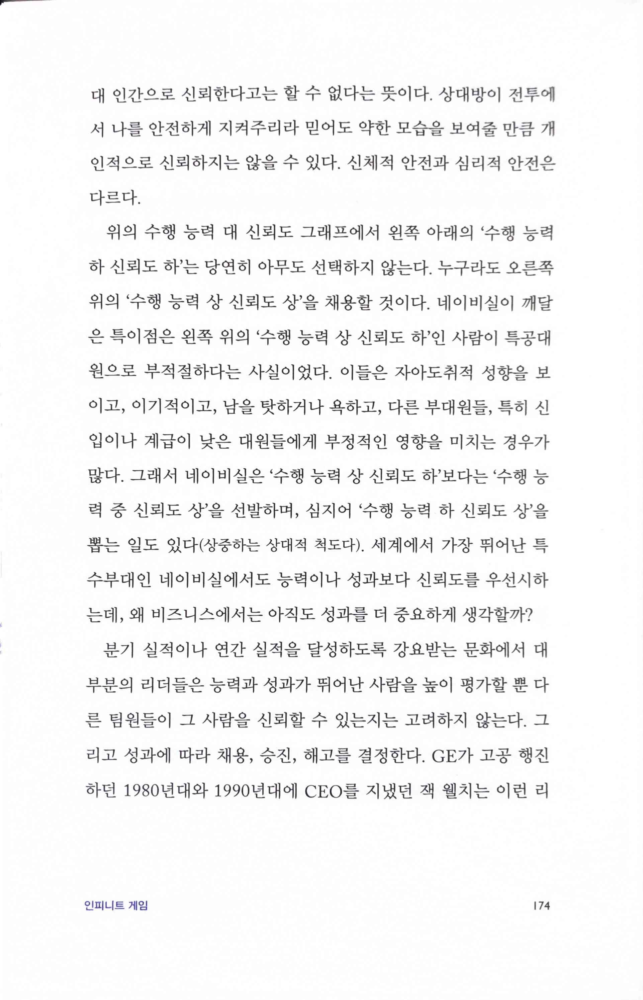

> 세계에서 가장 뛰어난 특수부대인 네이비실에서도 능력이나 성과보다 신뢰도를 우선시하는데, 왜 비즈니스에서는 아직도 성과를 더 중요하게 생각할까?
* 그럼 실력보다 인성을 중시해야 하는 걸까? 이걸 어떻게 알 수 있을까?

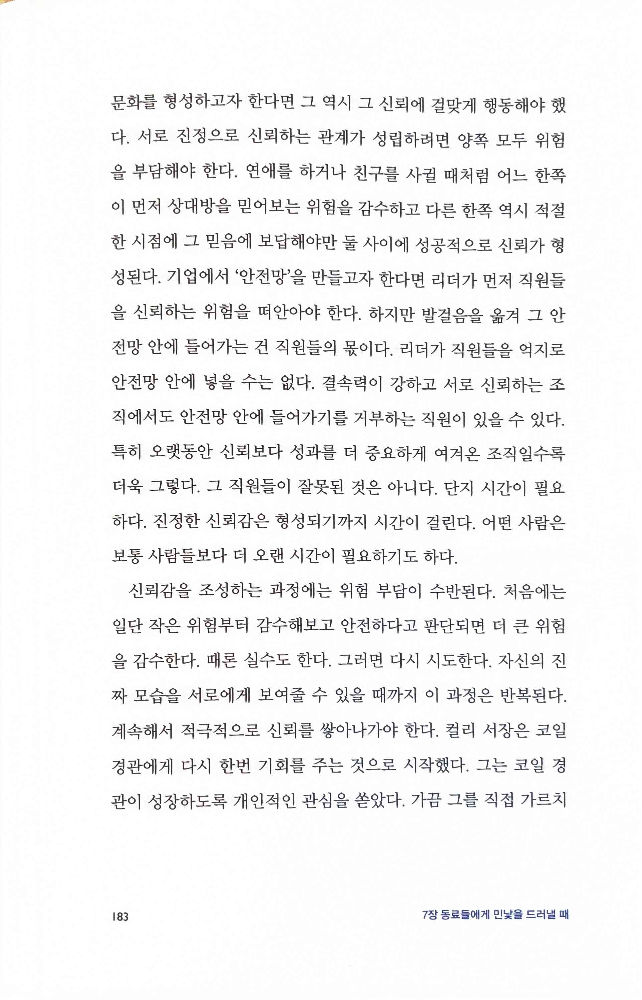

> 서로 진정으로 신뢰하는 관계가 성립하려면 양쪽 모두 위험을 부담해야 한다. 연애를 하거나 친구를 사귈 때처럼 어느 한쪽이 먼저 상대방을 믿어보는 위험을 감수하고 다른 한쪽 역시 적절한 시점에 그 믿음에 보답해야만 둘 사이에 성공적으로 신뢰가 형성된다. 기업에서 '안전망'을 만들고자 한다면 리더가 먼저 직원들을 신뢰하는 위험을 떠안아야 한다. 하지만 발걸음을 옮겨 그 안전망 안에 들어가는 건 직원들의 몫이다. 리더가 직원들을 억지로 안전망 안에 넣을 수는 없다.
>
> 신뢰감을 조성하는 과정에는 위험 부담이 수반된다.

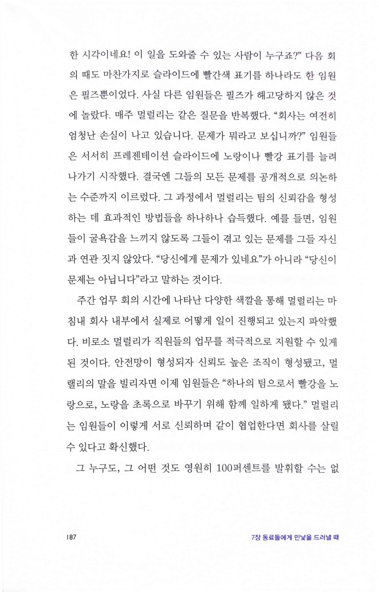

> "당신에게 문제가 있네요”가 아니라 “당신이 문제는 아닙니다"라고 말하는 것이다.

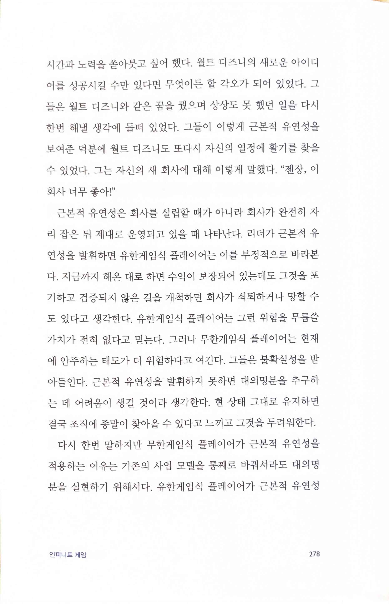 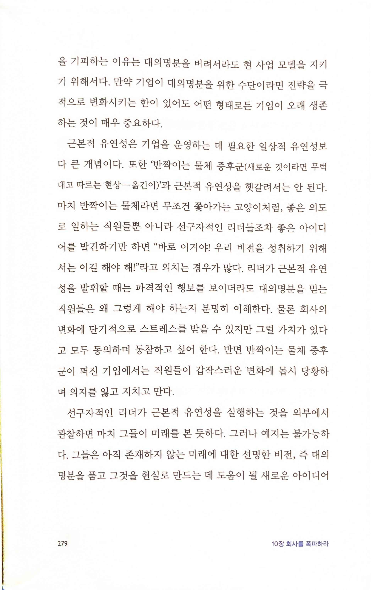

> 근본적 유연성은 회사를 설립할 때가 아니라 회사가 완전히 자리 잡은 뒤 제대로 운영되고 있을 때 나타난다... 무한게임식 플레이어는 현재에 안주하는 태도가 더 위험하다고 여긴다. 그들은 불확실성을 받아들인다. 근본적인 유연성을 발휘하지 못하면 대의명분을 추구하는 데 어려움이 생길 것이라 생각한다. 현 상태 그대로 유지하면 결국 조직에 종말이 찾아올 수 있다고 느끼고 그것을 두려워한다.
>
> 근본적 유연성은 기업을 운영하는 데 필요한 일상적 유연성보다 큰 개념이다.

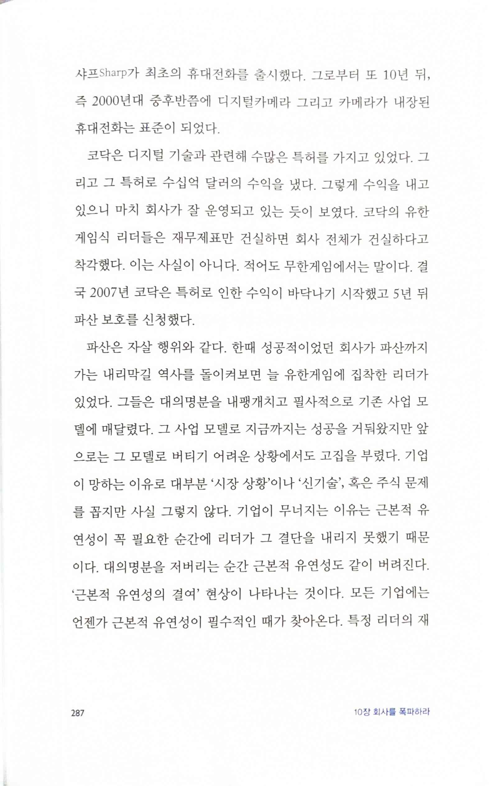 

> 기업이 망하는 이유로 대부분 '시장 상황'이나 '신기술', 혹은 주식 문제를 꼽지만 사실 그렇지 않다. 기업이 무너지는 이유는 근본적 유연성이 꼭 필요한 순간에 리더가 그 결단을 내리지 못했기 때문이다. 대의명분을 저버리는 순간 근본적 유연성도 같이 버려진다. '근본적 유연성의 결여' 현상이 나타나는 것이다. 모든 기업에는 언젠가 근본적 유연성이 필수적인 때가 찾아온다.

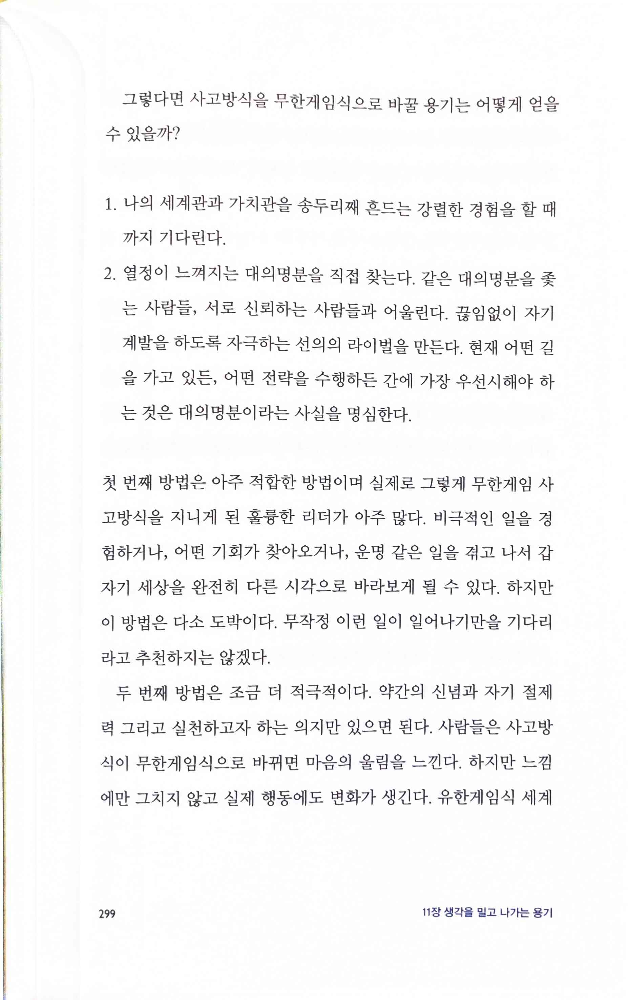

> 그렇다면 사고방식을 무한게임식으로 바꿀 용기는 어떻게 얻을 수 있을까?
>
> 1. 나의 세계관과 가치관을 송두리째 흔드는 강렬한 경험을 할 때까지 기다린다.
>
> 2. 열정이 느껴지는 대의명분을 직접 찾는다. 같은 대의명분을 좇는 사람들, 서로 신뢰하는 사람들과 어울린다. 끊임없이 자기계발을 하도록 자극하는 선의의 라이벌을 만든다. 현재 어떤 길을 가고 있든, 어떤 전략을 수행하든 간에 가장 우선시해야 하는 것은 대의명분이라는 사실을 명심한다.

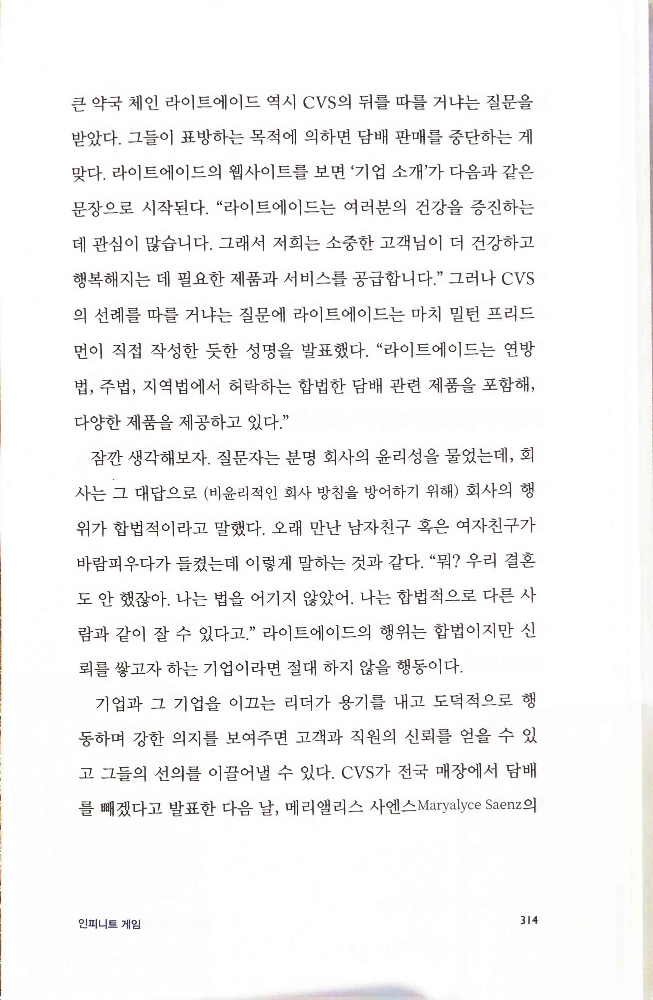 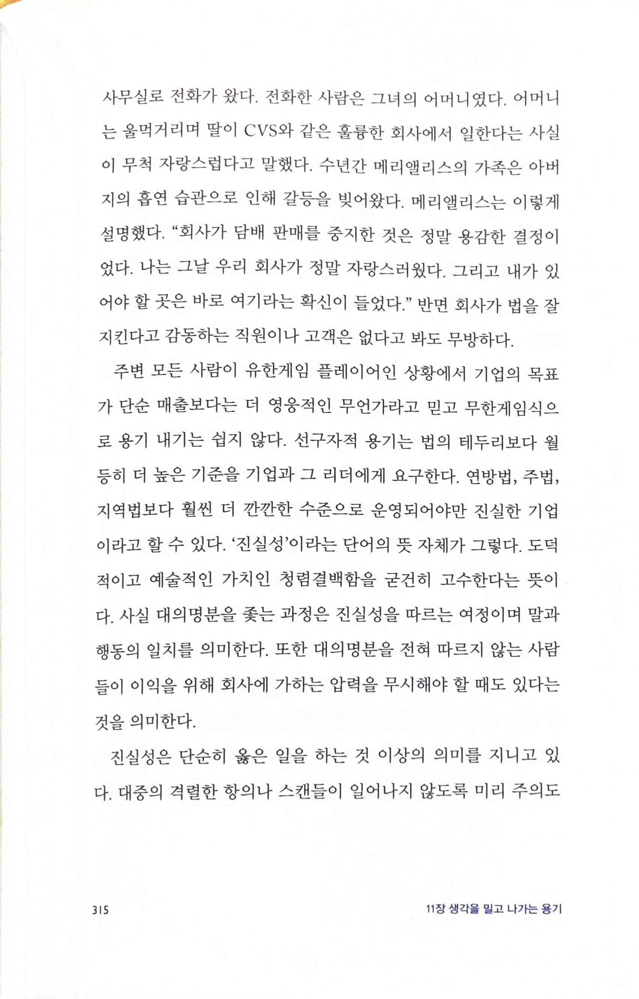

* 준법은 최소한의 선일뿐 그보다 높은 윤리나 도덕을 지켜야 한다는 이야기
> 선구자적 용기는 법의 테두리보다 월등히 더 높은 기준을 기업과 그 리더에게 요구한다. 연방법, 주법, 지역법보다 훨씬 더 깐깐한 수준으로 운영되어야만 진실한 기업이라고 할 수 있다. '진실성'이라는 단어의 뜻 자체가 그렇다. 도덕적이고 예술적인 가치인 청렴결백함을 굳건히 고수한다는 뜻이다. 사실 대의명분을 좇는 과정은 진실성을 따르는 여정이며 말과 행동의 일치를 의미한다. 또한 대의명분을 전혀 따르지 않는 사람들이 이익을 위해 회사에 가하는 압력을 무시해야 할 때도 있다는 것을 의미한다.

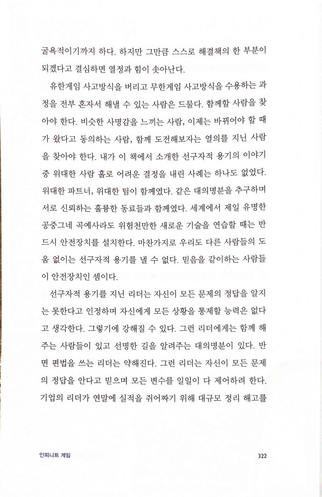 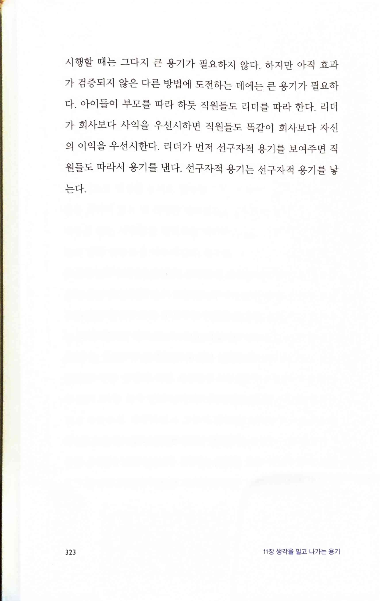

> 유한게임 사고방식을 버리고 무한게임 사고방식을 수용하는 과정을 전부 혼자서 해낼 수 있는 사람은 드물다. 함께할 사람을 찾아야 한다. 비슷한 사명감을 느끼는 사람, 이제는 바뀌어야 할 때가 왔다고 동의하는 사람, 함께 도전해보자는 열의를 지닌 사람을 찾아야 한다.
>
> 선구자적 용기를 지닌 리더는 자신이 모든 문제의 정답을 알지는 못한다고 인정하며 자신에게 모든 상황을 통제할 능력은 없다고 생각한다. 그렇기에 강해질 수 있다. 그런 리더에게는 함께 해주는 사람들이 있고 선명한 길을 알려주는 대의명분이 있다. 반면 편법을 쓰는 리더는 약해진다. 그런 리더는 자신이 모든 문제의 정답을 안다고 믿으며 모든 변수를 일일이 다 제어하려 한다... 리더가 먼저 선구자적 용기를 보여주면 직원들도 따라서 용기를 낸다. 선구자적 용기는 선구자적 용기를 낳는다.