# 필독! 개발자 온보딩 가이드

Tags: software-engineering
Date: November 24, 2023
Score: ★★★★☆

- [필독! 개발자 온보딩 가이드](https://www.onlybook.co.kr/entry/onboarding)
    - ★★★★☆ July 2, 2023 제목이 책의 내용을 다 담지 못하는 느낌. 그만큼 다양한 분야의 이야기들을 깊이가 조금은 부족하지만 잘 설명한다. 개발자가 회사에 적응하는 데 필요한 이야기를 넘어 software engineering의 전반을 다룬다. 내가 management를 하기로 생각한 이후 필요로 하거나 구축해야겠다고 생각하는 대부분의 주제들을 담고 있다. 매우 좋은, 추천할만한 책
    - ★★★★☆ November 24, 2023 다시 한 번 읽어봐도 참 좋은 책
    - 탐라 문005.1-리825ㅍ
    - [독서광 필독! 개발자 온보딩 가이드](https://jhrogue.blogspot.com/2023/05/blog-post_27.html)
    - [The Missing README: A Guide for the New Software Engineer: Riccomini, Chris, Ryaboy, Dmitriy: 9781718501836: Amazon.com: Books](https://www.amazon.com/Missing-README-Guide-Software-Engineer/dp/1718501838)

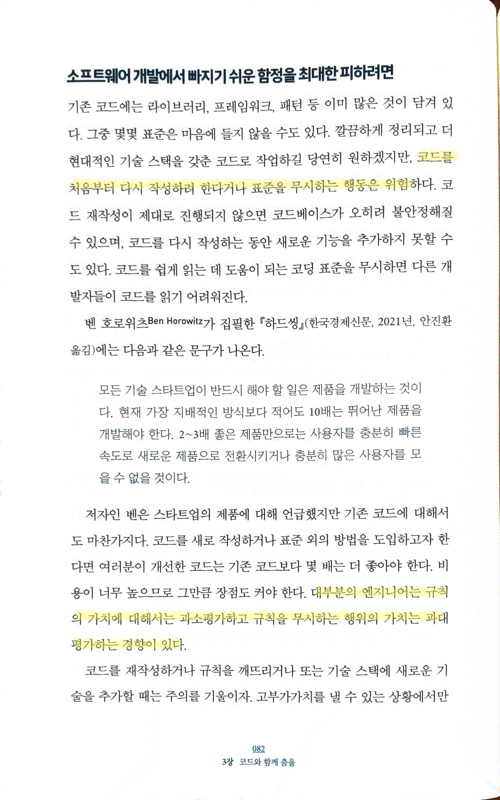

- `코드를 처음부터 다시 작성하려 한다거나 표준을 무시하는 행동은 위험`
    - `대부분의 엔지니어는 규칙의 가치에 대해서는 과소평가하고 규칙을 무시하는 행위의 가치는 과대평가하는 경향이 있다`
    - management를 하면서 점점 생각이 바뀌었고, [피닉스 프로젝트](https://www.notion.so/f902ca263a5548938484f0ad33d03388?pvs=21) 를 읽으면서 내가 어렴풋이 느끼고 있던 제조업의 관행이나 엄격한 규칙의 중요성을 확실히 깨닫게 되었다. 물론 맞지 않는 부분도 많기에 적절한 도입이 필요하지만 규칙의 중요성 그 자체만큼은 확실하다

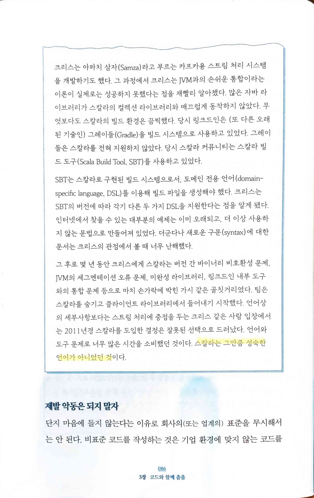

- `스칼라는 그만큼 성숙한 언어가 아니었던 것`
    - 물론 오래 전의 일이긴 하지만 시사하는 바는 확실하다

- `표준에서 벗어난다면 곧 그에 따른 비용이 발생… 그 방법이 표준으로 채택된 이유를 이해해야… 실용주의적 사고에 입각해 대처해야`

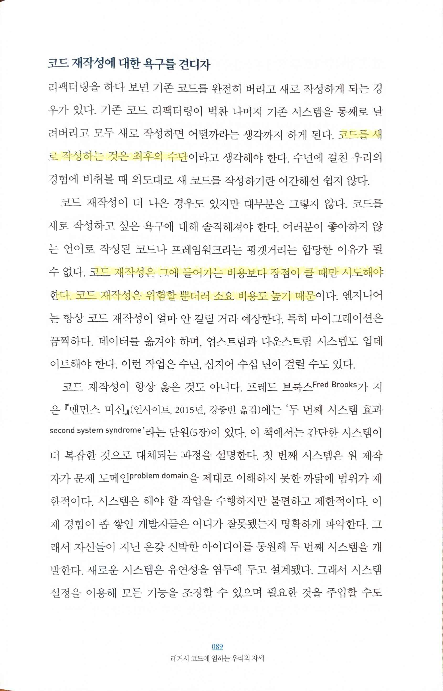

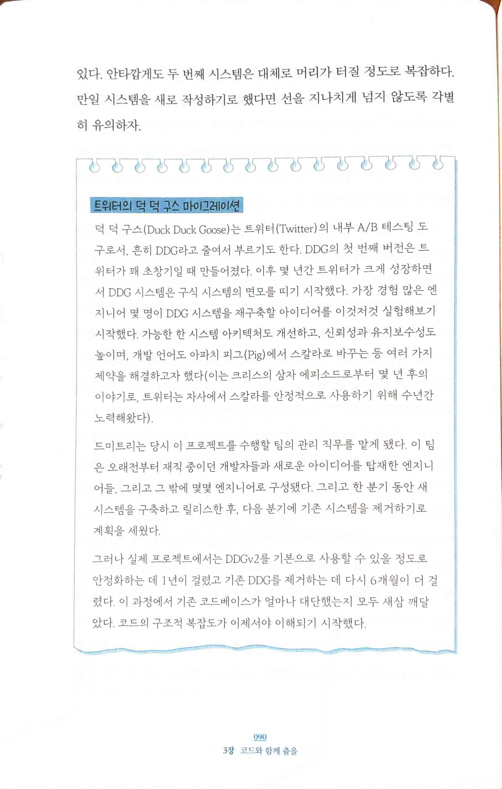

- pp89~90
    - `코드를 새로 작성하는 것은 최후의 수단`
    - `코드 재작성은 그에 들어가는 비용보다 장점이 클 때만 시도해야 한다. 코드 재작성은 위험할 뿐더러 소요 비용도 높기 때`문
    - e.g. Twitter의 Duck Duck Goose migration 사례

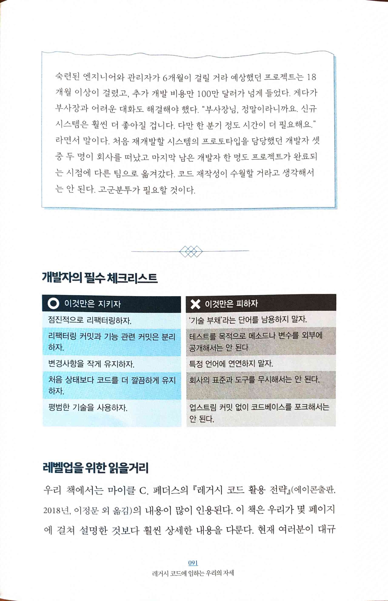

- 필수 체크리스트의 내용은 모두 정말 중요한 이야기들

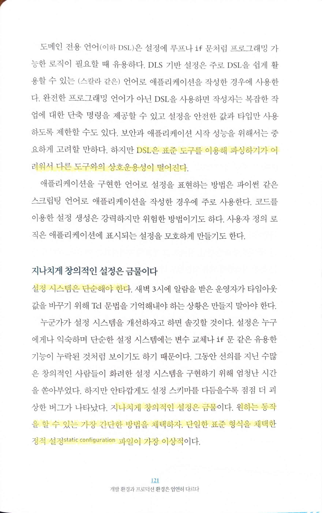

- pp121~122
    - `DSL은 표준 도구를 이용해 파싱하기가 어려워서 다른 도구와의 상호운용성이 떨어진다`
    - `설정 시스템은 단순해야 한다`
        - `지나치게 창의적인 설정은 금물… 원하는 동작을 할 수 있는 가장 간단한 방법을 채택하자. 단일한 표준 형식을 채택한 정적 설정 static configuration 파일이 가장 이상적`
        - `동적 설정은 그 복잡성 때문에 대부분의 경우에는 권장하지 않는다… 설정이 바뀔 수 있다는 가능성을 생각해야 하기 때문… 언제 누가 설정을 바꿨는지 여부는 운영 이슈를 디버깅하는 데 매우 중요한 반면, 실제로 그 정보를 추적하기는 어렵다… 다른 분산 시스템에 대한 의존성도`

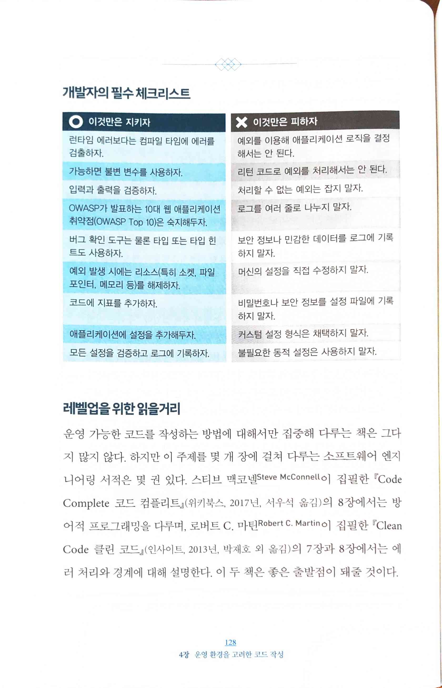

- 필수 체크리스트의 내용은 모두 정말 중요한 이야기들 (2)

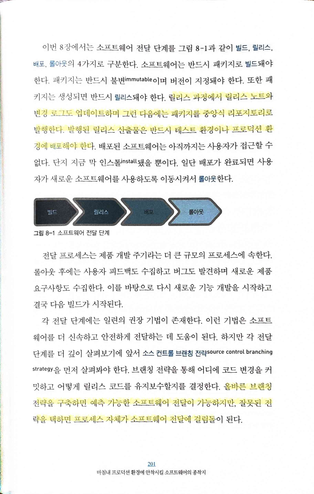

- `릴리스 과정에서 릴리스 노트와 변경 로그도 업데이트하며 그런 다음에는 패키지를 중앙식 리포지토리로 발행한다. 발행된 릴리스 산출물은 반드시 테스트 환경이나 프로덕션 환경에 배포해야 한다.`
    - `올바른 브랜칭 전략을 구축하면 예측 가능한 소프트웨어 전달이 가능하지만, 잘못된 전략을 택하면 프로세스 자체가 소프트웨어 전달에 걸림돌`

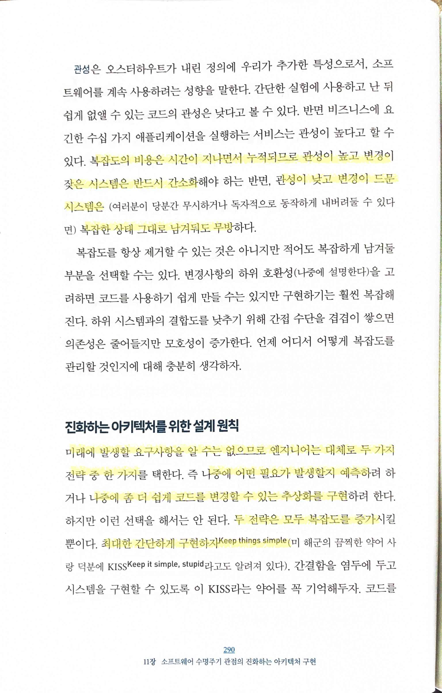

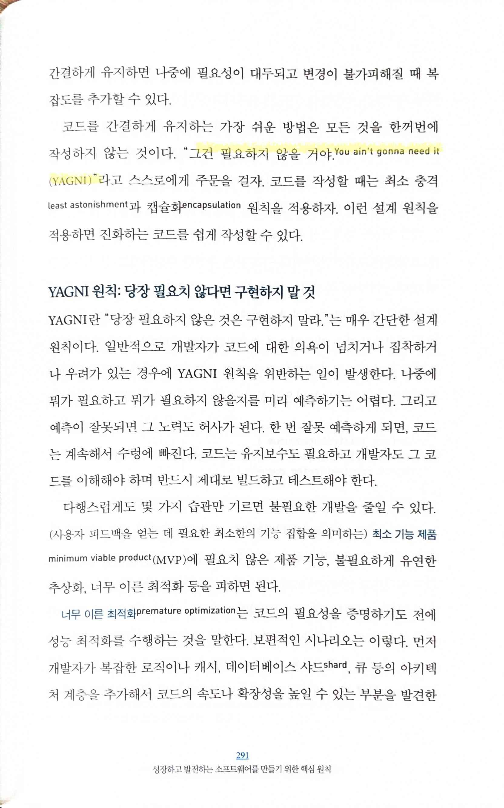

- pp290~291
    - `복잡도의 비용은 시간이 지나면서 누적되므로 관성이 높고 변경이 잦은 시스템은 반드시 간소화해야… 관성이 낮고 변경이 드문 시스템은 복잡한 상태 그대로 남겨둬도 무방`
    - `미래에 발생할 요구사항을 알 수는 없으므로 엔지니어는 대체로 두 가지 전략 중 한 가지… 나중에 어떤 필요가 발생할지 예측… 나중에 좀 더 쉽게 코드를 변경할 수 있는 추상화를 구현… 두 전략은 모두 복잡도를 증가… 최대한 간단하게 구현하자 Keep things simple`
        - 그러나 마치 MSA라는 명목하에 쓸데없이 service를 나누듯 abstraction이나 design pattern이라는 명목하에 쓸데없는 architecture를 사용하려는 경우가 많다
    - `그건 필요하지 않을 거야 You ain’t gonna need it (YAGNI)`

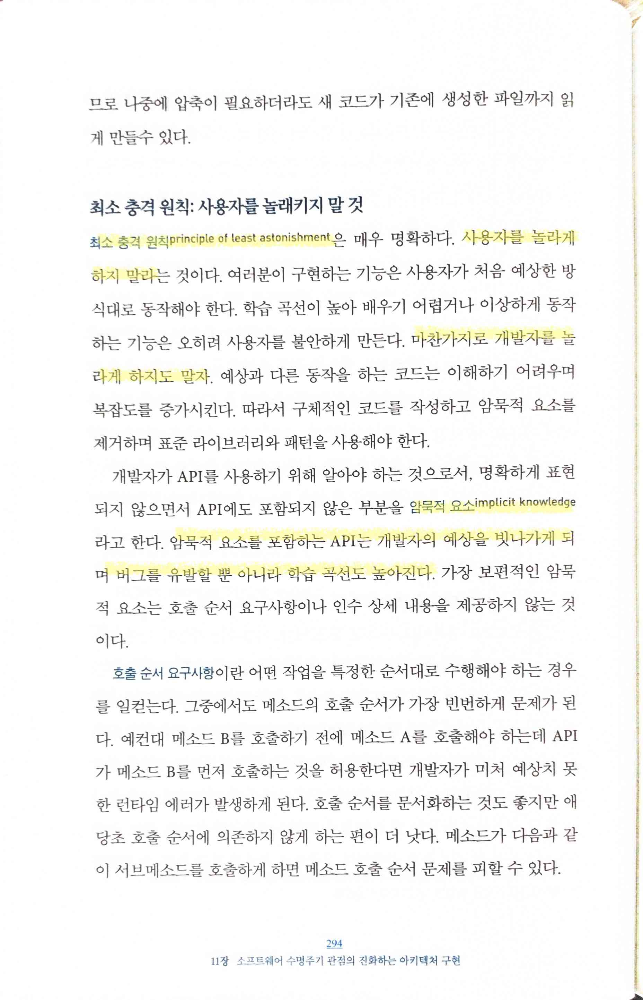

- `최소 충격 원칙 principle of least astonishment… 사용자를 놀라게 하지 말라… 마찬가지로 개발자를 놀라게 하지도 말자`
    - `암묵적 요소 implicit knowledge를 포함하는 API는 개발자의 예상을 빗나가게 되며 버그를 유발할 뿐 아니라 학습 곡선도 높아진다`
        - 약간 다른 이야기지만, scala의 implicit을 내가 싫어했던 이유와도 연결

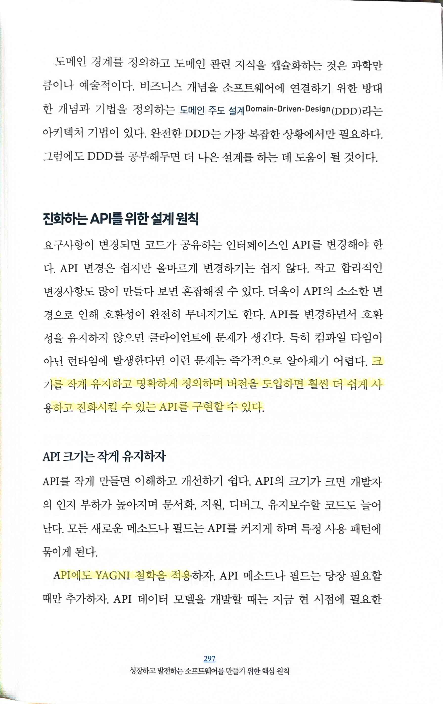

- `크기를 작게 유지하고 명확하게 정의하며 버전을 도입하면 훨씬 더 쉽게 사용하고 진화시킬 수 있는 API를 구현할 수 있다… API에도 YAGNI 철학을 적용하자`

- `스프린트를 진행하는 동안 새로운 업무가 등장해도 현재 스프린트에 억지로 끼워넣지 않는다`
    - 현실에서는 이렇게 하기 정말 어려운데…

- `리뷰는 스프린트 동안 완료한 업무를 논의하는 시간이며, 회고는 절차와 도구를 논의하는 시간`
    - 나는 간단하게 전달하기 위해 주로 product에 대해 돌아보는 시간과 process에 대해 돌아보는 시간으로 구분하곤 했다
    - 하지만 많은 사람들이 이 부분을 혼동하는 경우가 많다. 심지어는 scrum을 담당하는 PO라는 역할을 하는 사람이 둘의 차이가 뭐냐고 왜 구분해야 하냐고 하는 경우도 직접 경험해봤다

- `팀장들은 늘 회의 중인 것처럼 보이지만 정확히 무슨 일을 하는지는 명확하지 않다.`
