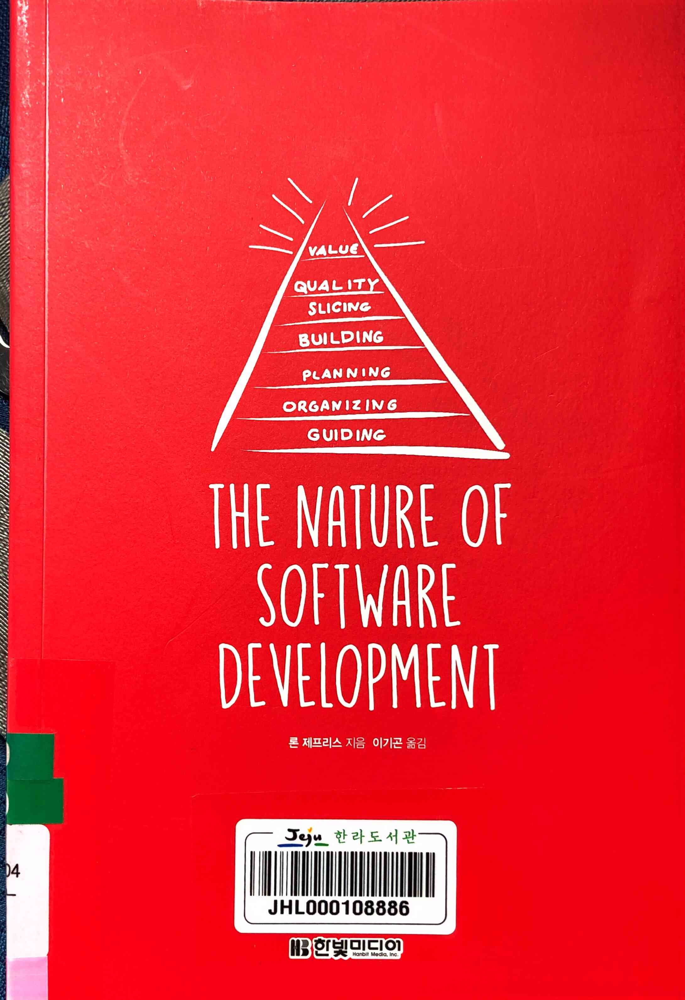
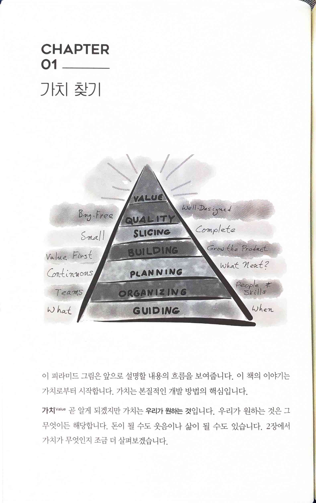
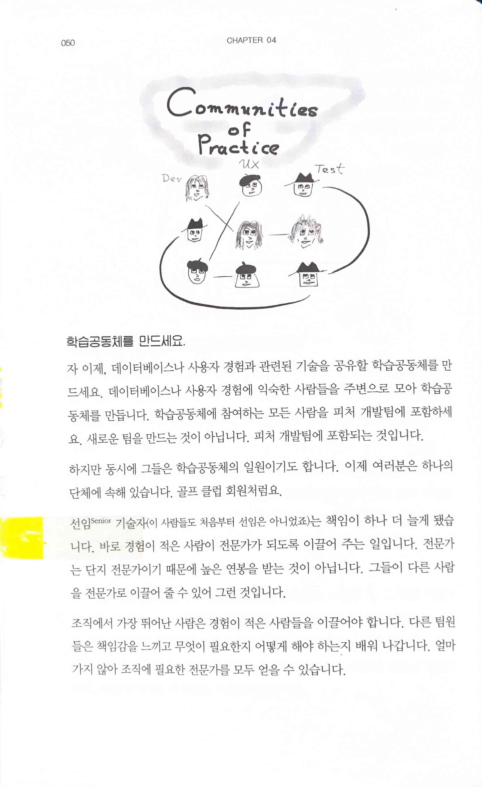
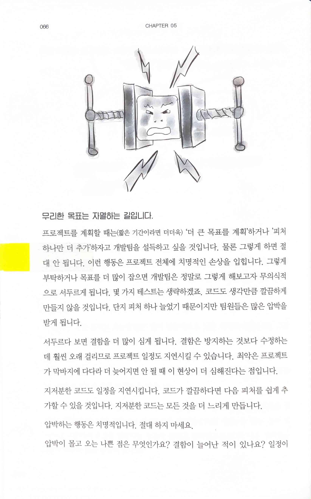
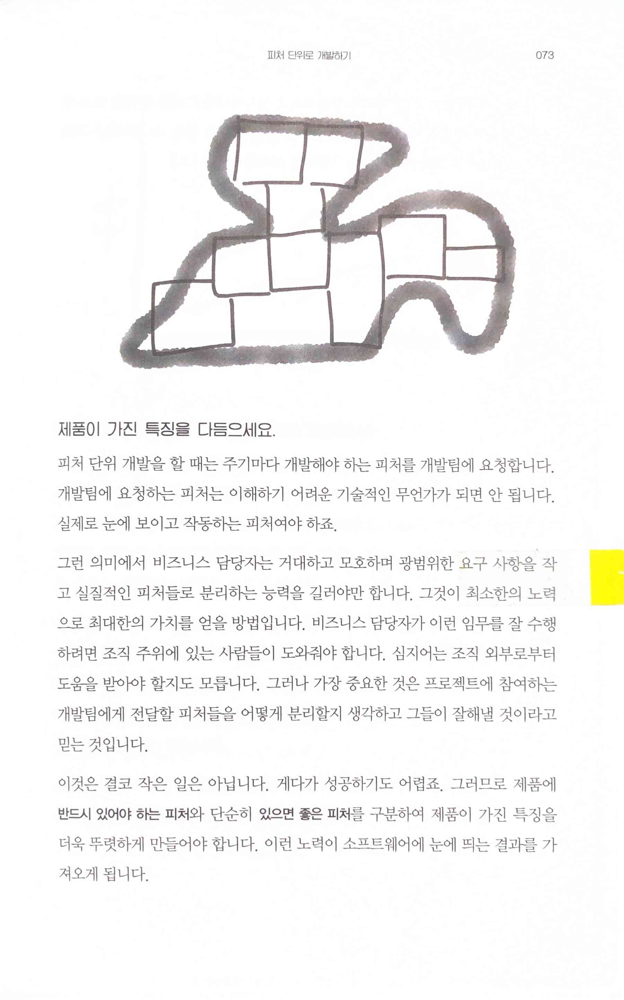
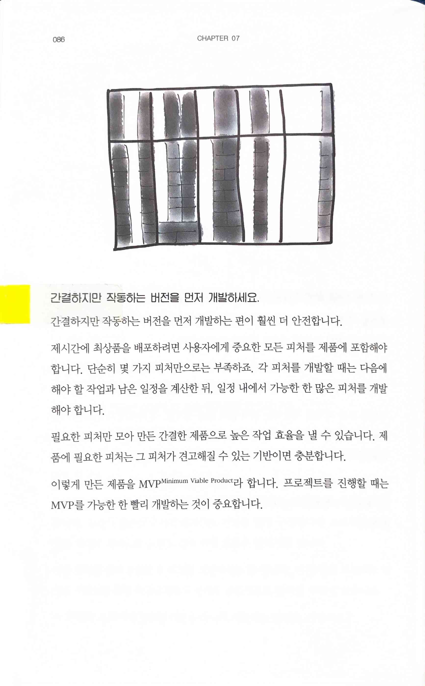
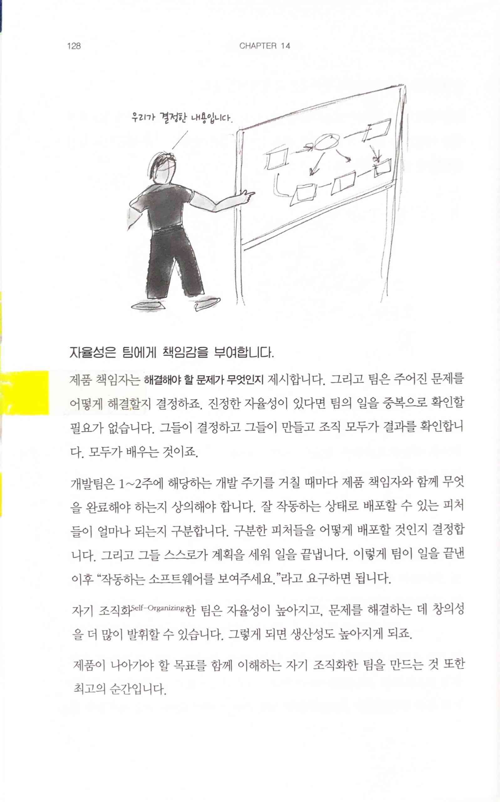
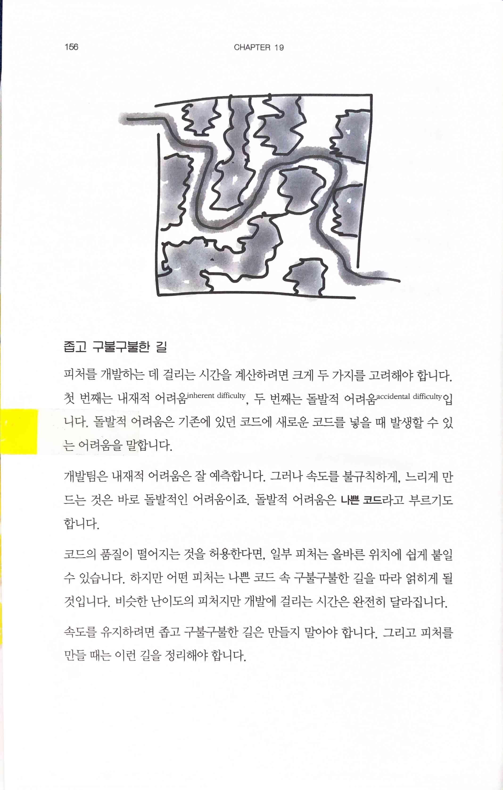
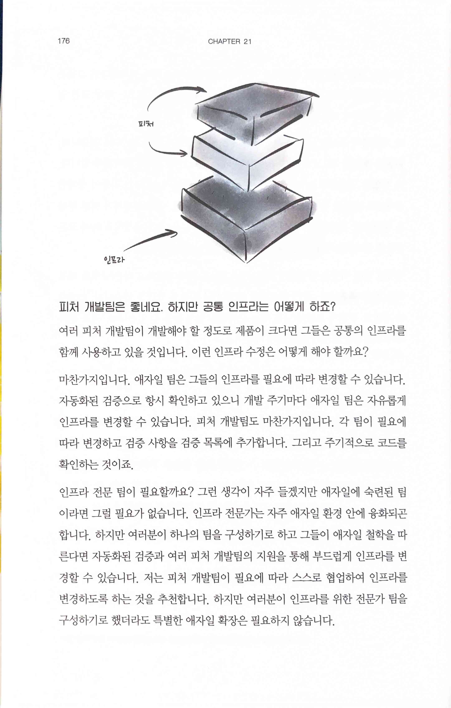

THE NATURE OF SOFTWARE DEVELOPMENT
==================================

> “소프트웨어 개발에는 본질적인 방법이 존재한다. 그 방법은 모두에게 도움을 준다."

# PART 1 가치를 이루는 것들

## CHAPTER 01 가치 찾기
 

> 가치 Value 우리가 원하는 것
>
> 가이드 Guiding 책임감 있게 가치를 생산해줄 개발팀을 구성해 가치를 만듭니다.
>
> 조직 구성 Organizing 피처 feature 를 기준으로 맡은 일을 끝낼 수 있는 개발팀을 구성해야 합니다.
>
> 계획 Panning 필요한 순서대로 피처를 선택하여 프로젝트를 이끌어야 합니다. 가치를 제때 완성해야 합니다.
>
> 개발 Building 피처 단위로 제품을 개발해야 합니다. 이 방법은 가치를 자주 전달할 수 있게 합니다.
>
> 분할 Sicing 피처를 가치가 있되, 가장 작은 단위로 쪼개야 합니다.
>
> 품질 Qualty 항상 제품이 잘 설계되고 최대한 결함 없는 제품을 만들어낼 수 있게 확인할 필수 프랙티스practice 를 적용해야 합니다. 가치를 만드는 일은 꾸준하고, 지속 가능하며, 끊임없어야 합니다.

## CHAPTER 02 가치, 우리가 원하는 것

> 가치를 확인해보고 싶다면 이렇게 말하세요.
>
> "작동하는 소프트웨어를 보여주세요.”

> 작고 가치 있는 피처를 자주 배포할 때 최고의 가치를 얻을 수 있습니다.
>
> 피처 단위로 소프트웨어를 배포한다면 최고의 결과를 얻을 수 있다는 것을 꼭 기억하세요.

## CHAPTER 03 피처 단위 개발을 위한 가이드라인

## CHAPTER 04 피처 단위로 조직 구성하기

> 답은 간단합니다. 제품 책임자 Product Champion가 이해할 수 있는 피처를 만들 수 있는 작은 개발팀을 여럿으로 구성하는 것입니다. 각 개발팀이 피처의 일부가 아닌 전체를 개발할 수 있는 기술을 가졌는지도 반드시 확인해야 합니다.

> 학습공동체에 참여하는 모든 사람을 피처 개발팀에 포함하세요. 새로운 팀을 만드는 것이 아닙니다. 피처 개발팀에 포함되는 것입니다.
>
> 선임 Senior 기술자(이 사람들도 처음부터 선임은 아니었죠)는 책임이 하나 더 늘게 됐습니다. 바로 경험이 적은 사람이 전문가가 되도록 이끌어 주는 일입니다. 전문가는 단지 전문가이기 때문에 높은 연봉을 받는 것이 아닙니다. 그들이 다른 사람을 전문가로 이끌어 줄 수 있어 그런 것입니다.

## CHAPTER 05 피처 단위로 계획하기

> 아이젠하워 장군General Eisenhower은 이렇게 말했습니다.
>
> “계획은 쓸모없을 때가 많습니다. 하지만 동시에 없어서는 안 될 부분입니다."
>
> 너무 세세한 계획은 시간만 낭비할 뿐이며 혼란만 일으킵니다.
>
> 먼저 개발해야 할 핵심 피처를 추리는 것이 중요합니다. 이것이 없으면 살 수 없을 정도로 중요한 피처 말이죠. 이런 피처를 먼저 추려내고 기록하세요.
>
> 가치가 낮은 피처는 최대한 뒤로 미루어야 합니다. 이런 피처를 생각하는 데 시간을 낭비하지 말고 언제든 찾아볼 수 있도록 기록만 해둡시다.

> 계획을 세우되, 언제든지 변화를 줄 수 있는 환경을 만들도록 합시다.

> 프로젝트를 계획할 때는 (짧은 기간이라면 더더욱) '더 큰 목표를 계획하거나 '피처 하나만 더 추가'하자고 개발팀을 설득하고 싶을 것입니다. 물론 그렇게 하면 절대 안 됩니다. 이런 행동은 프로젝트 전체에 치명적인 손상을 입힙니다.
>
> 압박하는 행동은 치명적입니다. 절대 하지 마세요.

## CHAPTER 06 피처 단위로 개발하기

> 비즈니스 담당자는 거대하고 모호하며 광범위한 요구 사항을 작고 실질적인 피처들로 분리하는 능력을 길러야만 합니다. 그것이 최소한의 노력으로 최대한의 가치를 얻을 방법입니다. 비즈니스 담당자가 이런 임무를 잘 수행하려면 조직 주위에 있는 사람들이 도와줘야 합니다.
>
> 제품에 반드시 있어야 하는 피처와 단순히 있으면 좋은 피처를 구분하여 제품이 가진 특징을 더욱 뚜렷하게 만들어야 합니다. 이런 노력이 소프트웨어에 눈에 띄는 결과를 가져오게 됩니다.

> 가장 중요한 피처를 가장 먼저 개발하는 것이 중요하죠. 어떤 피처가 더 적은 비용으로 높은 가치를 주는지 구분하려면 모든 팀이 함께 노력해야 합니다. 조직은 한정된 시간과 돈으로 가장 좋은 제품을 개발하는 방법을 배우게 됩니다.
>
> 모든 피처를 반드시 완료 또는 미완료로 구분해야 합니다. 중간은 없습니다.

## CHAPTER 07 피처와 기반을 동시에

> 간결하지만 작동하는 버전을 먼저 개발하는 편이 훨씬 더 안전합니다.
>
> 이렇게 만든 제품을 MVP Minimum Viable Product라 합니다. 프로젝트를 진행할 때는 MVP를 가능한 한 빨리 개발하는 것이 중요합니다.

## CHAPTER 08 무결점과 견고한 설계

## CHAPTER 09 요약

> 이것이 전부입니다. 무척 간결합니다. 가장 높은 위치에 있는 경영진부터 가장 아래쪽에 있는 제품 책임자, 그리고 개발자 모두가 알아야만 합니다. 

# PART 2 메모와 에세이

## CHAPTER 10 가치에 대해서

## CHAPTER 11 가치를 정하는 기준

> 우리는 그 숫자가 정말로 의미하는 것이 무엇인지 모릅니다. 대부분 제품을 봤을 때 숫자를 정확하게 예측할 수는 없습니다.

> 수익을 계산하는 방법이 대부분 뒤처진 지표란 사실입니다. 열차가 떠난 뒤에나 필요한 정보를 얻을 수 있다는 말이죠. 예상 수익이 좋은 기준인지 아닌지 알 수 있는 정확한 방법은 그 어디에도 없습니다. 돈은 최악의 지표입니다. 정보를 너무 느리게 가져올 뿐만 아니라 불확실하기까지 하죠.
>
> 가치를 평가하는 진정한 방법은 제품 책임자와 이해관계자, 그리고 팀과 함께 무엇이 정말로 가치 있는 것인지 고민하고 만들어 나아가는 것입니다.
>
> 가치를 정했다면 망설임 없이 피처를 개발하여 제품을 배포하도록 하세요. 그리고 사용자에게 의견을 들어야 합니다. 이 과정을 반복하는 것이 핵심입니다.

## CHAPTER 12 물론 힘든 일입니다

## CHAPTER 13 그리 단순하지 않습니다

## CHAPTER 14 성장하는 개발팀 만들기

> 제품 책임자는 해결해야 할 문제가 무엇인지 제시합니다. 그리고 팀은 주어진 문제를 어떻게 해결할지 결정하죠. 진정한 자율성이 있다면 팀의 일을 중복으로 확인할 필요가 없습니다. 그들이 결정하고 그들이 만들고 조직 모두가 결과를 확인합니다. 모두가 배우는 것이죠.
>
> 자기 조직화Self-Organizing한 팀은 자율성이 높아지고, 문제를 해결하는 데 창의성을 더 많이 발휘할 수 있습니다. 그렇게 되면 생산성도 높아지게 되죠.

## CHAPTER 15 초기 계획을 위한 '파이브 카드'

## CHAPTER 16 경영진을 위한 소프트웨어 개발의 본질

> 경영진이 해야 할 가장 중요한 일은 무엇이라고 생각하나요? 우리가 맡을 수 있는 제품과 프로그램의 개수에 제한을 두는 것입니다. 먼저 맡은 일을 끝내고 그후에 다른 일을 더해야만 합니다. 여러 일을 동시에 하는 것은 모든 일정을 지연시킬 뿐입니다.

> 소프트웨어 개발의 본질적인 방법은 일하는 사람에게 권한을 위임하는 것입니다. 이것 외에 다른 것은 아무것도 없습니다. 이것이 항상 경영진이 일해왔던 방법입니다.

## CHAPTER 17 더 강한 채찍질

> 압박한다면 개발팀은 잘못 돼가는 것을 알면서도 포기합니다.

## CHAPTER 18 속도를 내기 위한, 특별한 빌드 기술

> 팀은 이렇게 말합니다. 우리는 이 모든 피처를 2주 내로 끝낼 수 없습니다.
>
> 저는 시간을 더 주는 것 대신 작은 피처를 개발하게 하는 것을 추천합니다.그리고 개발팀에게 2주가 아닌 1주 안에 완성해달라고 요청하세요.

 

> 우리는 개발팀이 스프린트마다 제품에 피처를 추가할 수 있도록 해야 합니다. 이는 반드시 현재 완성의 정의를 맞출 수 있어야 합니다. 그리고 이 완성의 정의는 시간이 지날수록 엄격해져야 합니다.
>
> 비즈니스 측면에 있는 사람은 걱정합니다. "이 피처들이 함께 작동하는지 어떻게 알 수 있지?"라고 말입니다. 따라서 완성의 정의는 항상 엄격해야 합니다. 단 한 번의 빌드로 하나의 개발 컴퓨터에서 모든 피처가 작동할 수 있도록 말이죠. 개발팀은 이를 위해 더 작은 피처를 맡게 되겠지만 우리가 개발팀에게 원하는 것이 "작동하는 소프트웨어를 보여주세요."이기 때문에 비즈니스 측면에서는 좋은 결정입니다.
>
> 처음에는 느리다고 느낍니다. 조금 지나면 이 방법이 유연하며 효율적으로 느껴지고 절대 서두르지 않게 되죠. 배포할 수 있는 제품이 개발 주기마다 성장한 상태로 있어야 합니다. 이를 달성하려면 우리가 개발한 피처는 설계, 테스트, 모든 면에서 완벽해야 합니다. 이 말은 개발팀이 개발 주기마다 평소보다는 작은 피처를 맡는다는 뜻이므로 진행이 더디다고 느낄 것입니다. 차이가 있다면 개발이 끝났을 때 정말로 모든 피처가 완성된다는 것입니다.

> 개발 속도를 올리기 위해 우리가 할 수 있는 가장 가치 있는 일은 바로 개발팀의 빌드 기술을 향상시키는 것입니다. 빌드 기술 향상에 투자하면 결함을 수정하는데 들이는 시간을 줄여주고 부드러운 개발과 같은 형태를 통해 빠르게 되돌아옵니다. 효율적인 성과를 채찍질하는 것과 혼동해서는 안 됩니다. 가장 빠른 개발팀은 유연하고 우아하게 일을 진행합니다.

## CHAPTER 19 리팩토링

> 피처를 개발하는 데 걸리는 시간을 계산하려면 크게 두 가지를 고려해야 합니다.첫 번째는 내재적 어려움inherent difficulty, 두 번째는 돌발적 어려움accidental dificulty 입니다. 돌발적 어려움은 기존에 있던 코드에 새로운 코드를 넣을 때 발생할 수 있는 어려움을 말합니다.
>
> 속도를 유지하려면 좁고 구불구불한 길은 만들지 말아야 합니다. 그리고 피처를 만들 때는 이런 길을 정리해야 합니다.

## CHAPTER 20 애자일 방법들
  

> • 작고 간결한 프레임워크부터 도입하세요.
>
> • 가벼움을 유지하세요.
>
> • 프레임워크를 통제하세요. 프레임워크에 통제당해서는 안 됩니다.
>
> • 프로세스 변경은 개발팀과 밀접하게 유지하세요.
>
> • 우선순위를 만드세요.
>
> • 가장 중요한 것은 고민하는 것입니다. 가치 있는 제품을 개발하는 일은 복잡합니다. 최선의 결과를 달성하는 일은 모든 것을 예측하고 통제하는 것이 아니라 무엇이 발생했는지 관찰하고 그에 맞게 대응했을 때만 가능합니다. 마치 팀 스포츠 경기와도 같죠. 계획을 짜고, 그에 맞추어 행동하겠죠. 하지만 모든 게임에서는 항상 예상과는 다른 일이 일어납니다. 그래서 팀원들의 순간 대응 능력에 따라 성공 여부가 결정되죠. 역설적이지만 기회를 포착하는 능력은 행동을 취하기 전에 생각하는 사고 방식에서 나옵니다. 항상 고민하고 생각하세요.

## CHAPTER21 애자일 확장

> 쳇 헨드릭슨Chet Hendrickson은 애자일이 간결하므로 확장된 버전의 애자일도 간결하거나 더 간소화돼야만 한다고 말했습니다. 그렇지 않다면 그 프레임워크는 더 이상 애자일이 될 수 없습니다. 우리는 복잡한 확장된 애자일 프레임워크를 의심하고 살펴봐야 합니다.
>
> 알로 벨시Arlo Belshee도 개발팀이 애자일 소프트웨어 개발에 익숙해질 무렵에는 확장이 큰 문제가 아니라고 조언합니다. 개발팀이 스토리를 잘게 쪼개고, 그중 한번의 스프린트(혹은 예상 기간)에 완성할 수 있는 개수를 선택하여 결함 없이 기존 소프트웨어에 통합해낼 수 있다면, 확장은 매우 쉽다는 것이죠.

 

> 인프라 전문 팀이 필요할까요? 그런 생각이 자주 들겠지만 애자일에 숙련된 팀이라면 그럴 필요가 없습니다. 인프라 전문가는 자주 애자일 환경 안에 융화되곤 합니다. 하지만 여러분이 하나의 팀을 구성하기로 하고 그들이 애자일 철학을 따른다면 자동화된 검증과 여러 피처 개발팀의 지원을 통해 부드럽게 인프라를 변경할 수 있습니다. 저는 피처 개발팀이 필요에 따라 스스로 협업하여 인프라를 변경하도록 하는 것을 추천합니다. 하지만 여러분이 인프라를 위한 전문가 팀을 구성하기로 했더라도 특별한 애자일 확장은 필요하지 않습니다.
>
> 기억하세요. 개발팀이 애자일 방법을 잘 따른다면 피처 개발팀이 필요할 일은 없습니다. 피처 개발팀을 구성한다 하더라도 특별한 인프라 전문가 팀을 구성할 필요는 없습니다. 필요에 따라 그들 스스로 협업할 수 있는 여러 팀이 필요합니다.

> 작은 일로 쪼갤 수 없는 거대한 규모의 개발이 있다고 생각하지 않습니다. 정말로 있다면, 그 누구도 어떻게 접근해야 할지 모를 것입니다. 애자일 방법이든 아니든 말이죠. 많은 사람을 더 투입하고 싶다면 그 일을 쪼개야 합니다. 쪼개는 방법을 모른다면 사람이 많아봐야 도움이 되지 않습니다.
>
> 일을 어떻게 쪼개는지 알고 있다면 대부분의 상황에서 일반적인 애자일 방법으로 거대한 일을 끝낼 수 있습니다.

## CHAPTER 22 결론