# 실용주의 프로그래머

Tags: software-engineering
Date: April 15, 2022
Score: ★★★★★

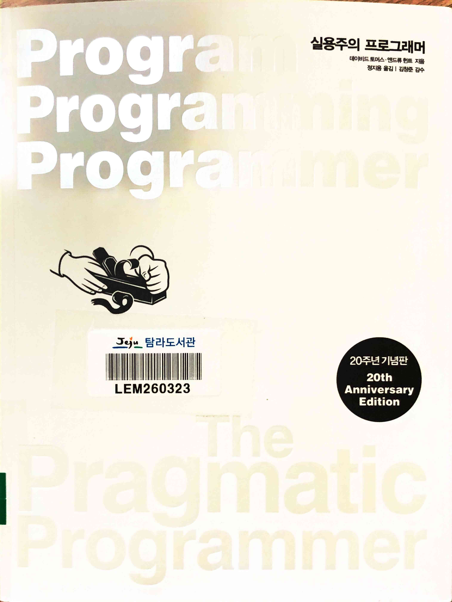

- ★★★★★ April 12, 2022 April 14, 2022 → April 15, 2022 정말 최고의 책. 한 페이지도 버릴 데가 없다
    - [실용주의 프로그래머(20주년 기념판) - 도서출판 인사이트](https://ebook.insightbook.co.kr/book/113)
    - [The Pragmatic Programmer, 20th Anniversary Edition: your journey to mastery by David Thomas, Andrew Hunt](https://pragprog.com/titles/tpp20/the-pragmatic-programmer-20th-anniversary-edition/)
    - [컴퓨터 vs 책: [독서광] 실용주의 프로그래머 20주년 기념판](https://jhrogue.blogspot.com/2022/03/20.html)
    - [011. 실용주의 프로그래머를 지향합니다.](https://www.linkedin.com/pulse/011-%25EC%258B%25A4%25EC%259A%25A9%25EC%25A3%25BC%25EC%259D%2598-%25ED%2594%2584%25EB%25A1%259C%25EA%25B7%25B8%25EB%259E%2598%25EB%25A8%25B8%25EB%25A5%25BC-%25EC%25A7%2580%25ED%2596%25A5%25ED%2595%25A9%25EB%258B%2588%25EB%258B%25A4-%25ED%2598%2584%25EC%259E%25AC-%25EC%259D%25B4/)
    
    [https://www.youtube.com/watch?v=4I9DZm2aBhY](https://www.youtube.com/watch?v=4I9DZm2aBhY)
    
    - [실용주의 프로그래머](https://jh4hj.tistory.com/entry/%EC%8B%A4%EC%9A%A9%EC%A3%BC%EC%9D%98-%ED%94%84%EB%A1%9C%EA%B7%B8%EB%9E%98%EB%A8%B8) November 13, 2009 → November 17, 2009
        - [008. 지속 가능한 소프트웨어 개발](https://www.linkedin.com/pulse/008-%EC%A7%80%EC%86%8D-%EA%B0%80%EB%8A%A5%ED%95%9C-%EC%86%8C%ED%94%84%ED%8A%B8%EC%9B%A8%EC%96%B4-%EA%B0%9C%EB%B0%9C-%ED%98%84%EC%9E%AC-%EC%9D%B4/)

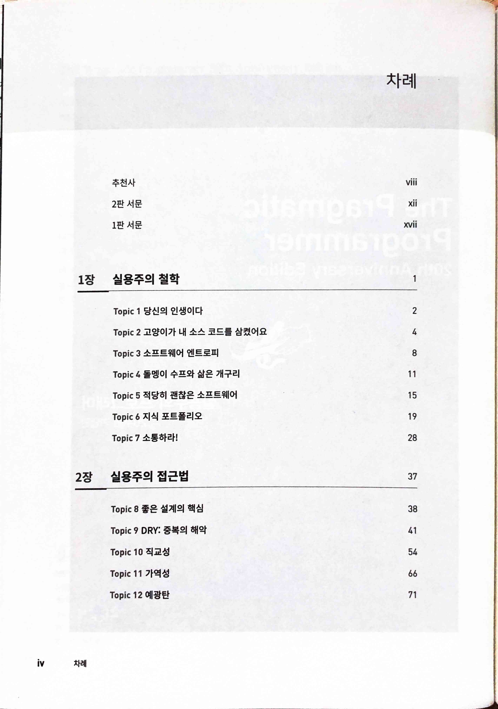

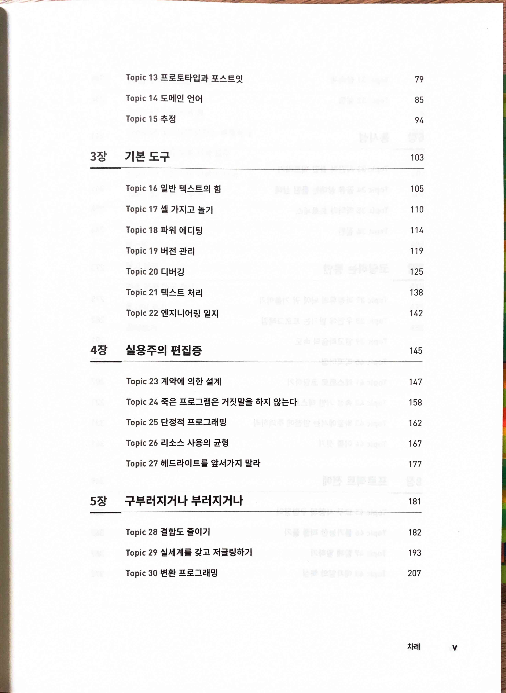

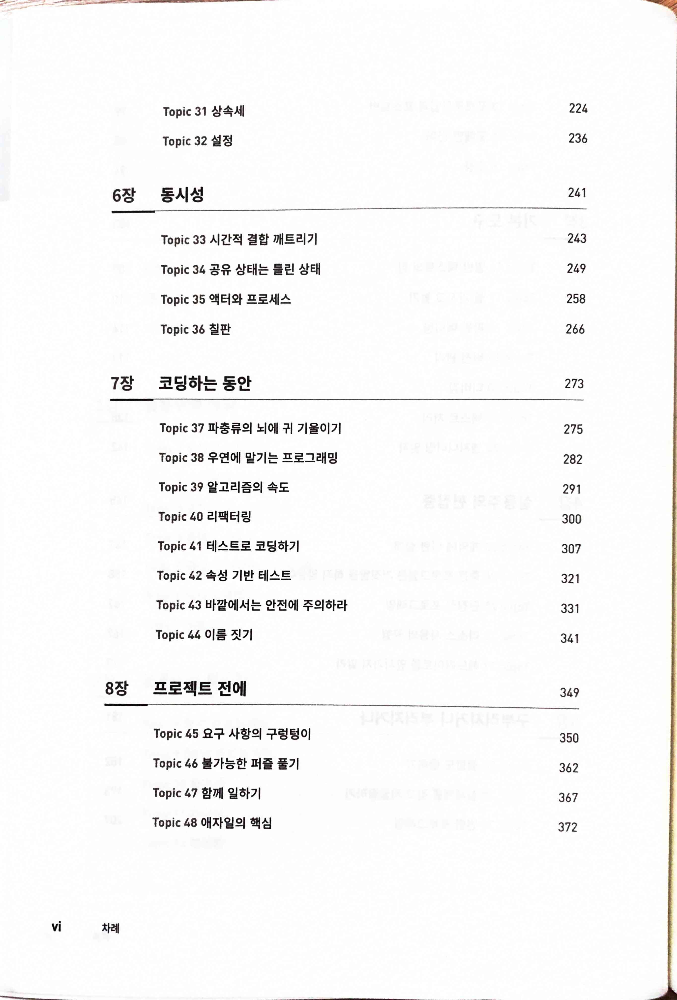


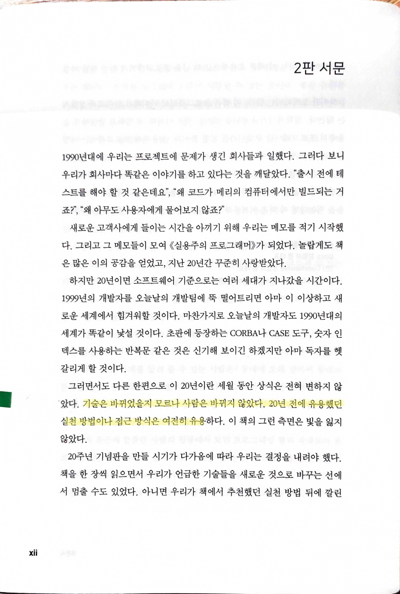

- `기술은 바뀌었을지 모르나 사람은 바뀌지 않았다. 20년 전에 유용했던 실천 방법이나 접근 방식은 여전히 유용`
 
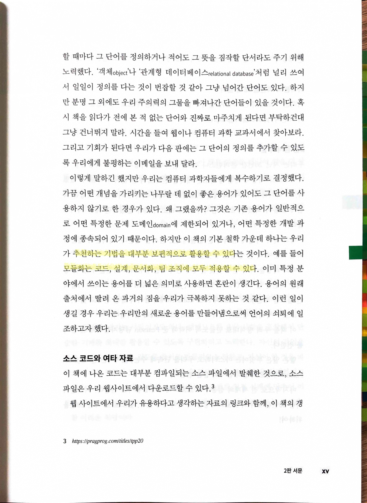

- `추천하는 기법을 대부분 보편적으로 활용할 수 있다… 모듈화는 코드, 설계, 문서화, 팀 조직에 모두 적용할 수 있다`

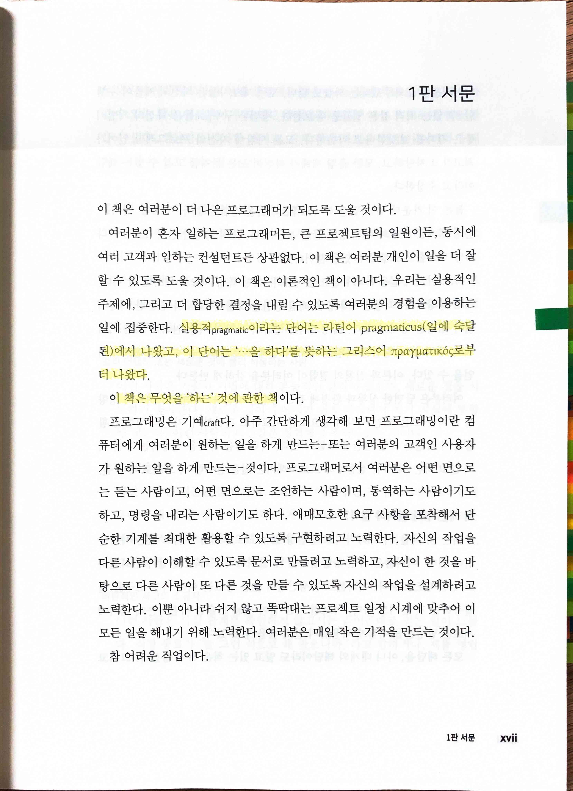

- `실용적 pragmatic이라는 단어는 라틴어 pragmaticus(일에 숙달된)에서 나왔고, 이 단어는 ‘…을 하다’를 뜻하는 그리스어 πραγματικός로부터 나왔다.`
    - `이 책은 무엇을 ‘하는’ 것에 관한 책`

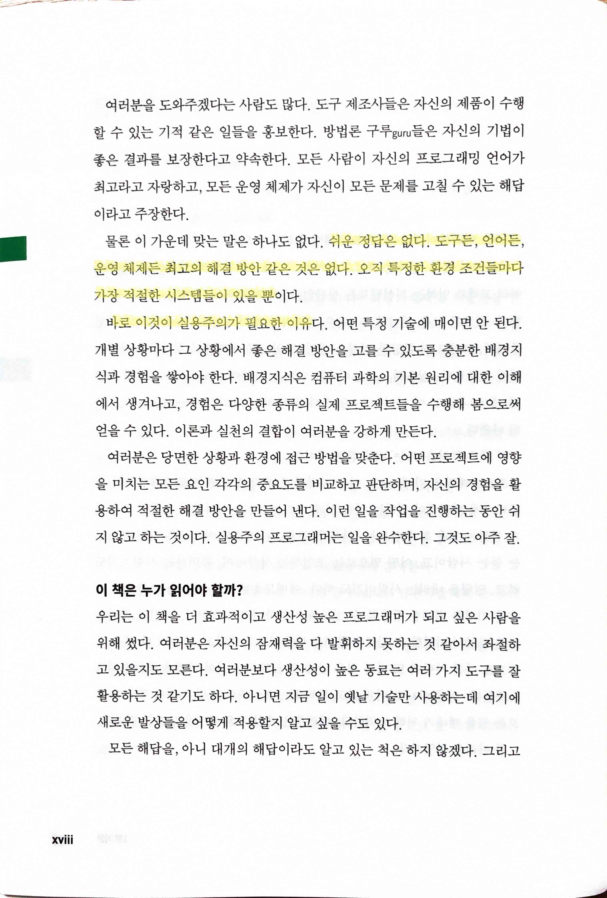

- `쉬운 정답은 없다. 도구든, 언어든, 운영 체제든 최고의 해결 방안 같은 것은 없다. 오직 특정한 환경 조건들마다 가장 적절한 시스템들이 있을 뿐`
    - No silver bullet
    - `바로 이것이 실용주의가 필요한 이유`


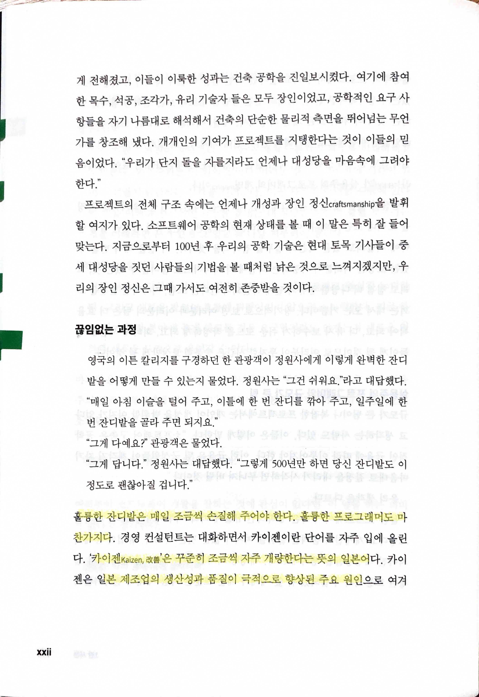

- pp xxi~xxii
    - p xxi
        - `모든 개발 과정에서, 매일, 여러분이 내리는 모든 결정을 끊임없이 비판적으로 평가해야 한다. 절대 기계적으로 일하지 말라. 언제나 일하면서 동시에 생각하고, 자기 일을 비평하라`
        - `물론 소프트웨어 구축은 공학적인 규율에 따라 이루어져야 한다. 하지만 그렇다고 개개인이 솜씨를 발휘할 여지가 없는 것은 아니다.`
    - p xxii
        - `훌륭한 잔디밭은 매일 조금씩 손질해 주어야 한다. 훌륭한 프로그래머도 마찬가지… ‘카이젠 Kaizen 改善’은 꾸준히 조금씩 자주 개량한다는 뜻의 일본어… 일본 제조업의 생산성과 품질이 극적으로 향상된 주요 원인`
            - 하지만 최근에 보면 그 상징이나 마찬가지인 도요타가 80년대부터 품질 정보를 속여왔다는 게 밝혀졌으니… 허탈하기도 하다
            - 물론 그렇다고 해도 내가 최근에 느끼는 [피닉스 프로젝트](https://www.notion.so/f902ca263a5548938484f0ad33d03388?pvs=21) 를 읽으면서 생각을 바꾸게 된, 제조업의 관행이나 엄격한 규칙의 중요성은 변하지 않는다

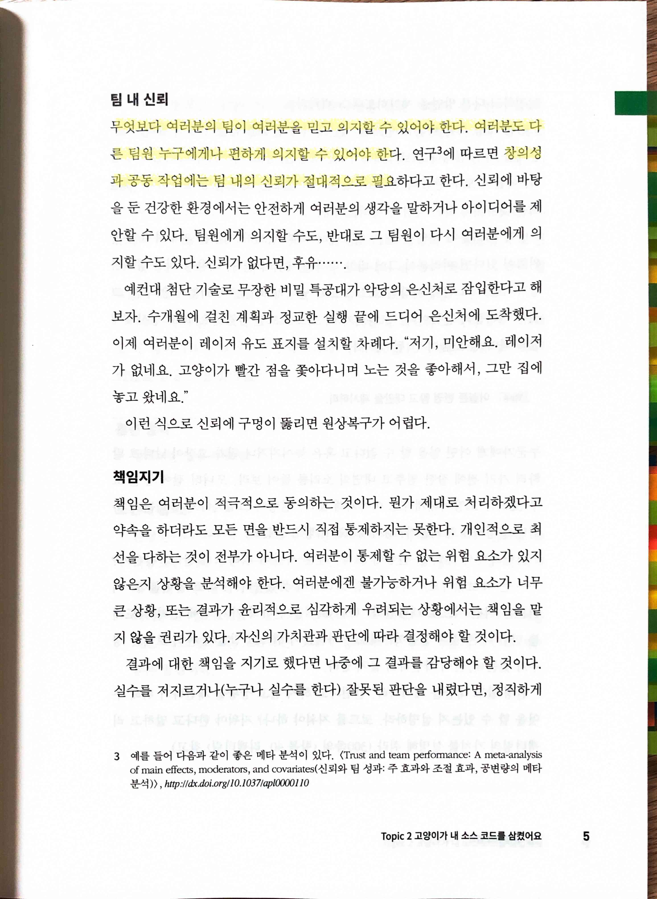

- `무엇보다 여러분의 팀이 여러분을 믿고 의지할 수 있어야 한다. 여러분도 다른 팀원 누구에게나 편하게 의지할 수 있어야 한다… 창의성과 공동 작업에는 팀 내의 신뢰가 절대적으로 필요`
    - 이제는 언급하기도 귀찮을 정도로 많이 사용했던 구글 이야기
        - [CHAPTER 3 지식 공유, Software Engineering at Google 구글 엔지니어는 이렇게 일한다](https://github.com/hyunjun/bookmarks/blob/master/programming_books/software_engineering_at_google.md#chapter-3-%EC%A7%80%EC%8B%9D-%EA%B3%B5%EC%9C%A0)

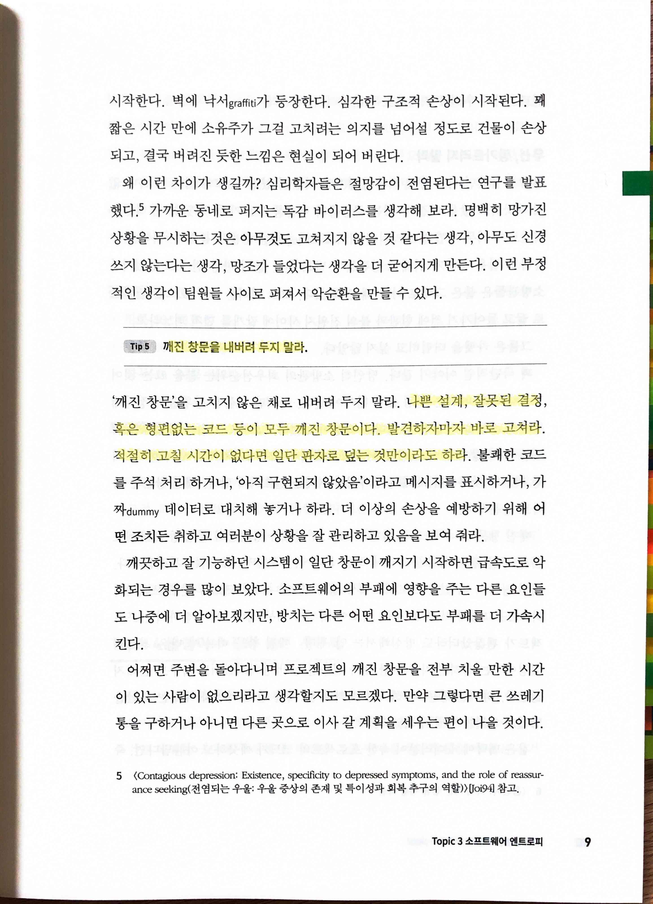

- `깨진 창문을 내버려 두지 말라`
    - `나쁜 설계, 잘못된 결정, 혹은 형편없는 코드 등이 모두 깨진 창문이다. 발견하자마자 바로 고쳐라. 적절히 고칠 시간이 없다면 일단 판자로 덮는 것만이라도 하라`


- `모든 사람이 각자 자신의 자원을 지키려고 할 것이다. 이걸 ‘시작 피로 start-up fatigue’라고도 부른다.`
    - `큰 무리 없이 요구할 수 있을 만한 것을 찾아라`
    - `계속되는 성공에 합류하기란 쉽다. 미래를 살짝이라도 보여 주면 사람들은 도와주기 위해 모여들 것이다`
    - `변화의 촉매가 되라`


- `‘적당히 괜찮은’이라는 표현은 너절하거나 형편없는 코드를 의미하지 않는다. 시스템이 성공하려면 사용자의 요구 사항을 충족해야 한다. 기본적인 성능이나 개인 정보 보호, 보안 기준도 맞추어야 한다… 생산해 낸 것이 적당히 괜찮게 사용자의 요구를 충족하는지 결정하는 과정에 사용자가 참여할 기회를 가져야 한다는 것`

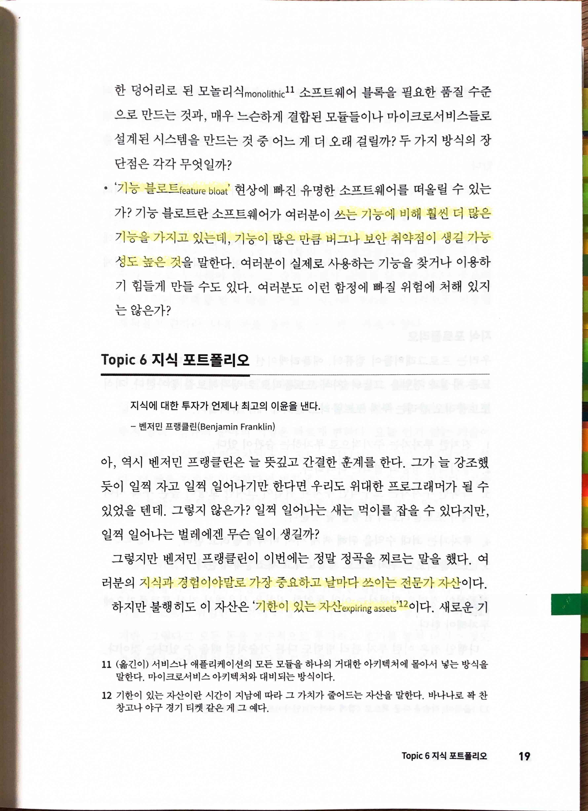

- p19
    - `‘기능 블로트 feature bloat’… 쓰는 기능에 비해 훨씬 더 많은 기능을 가지고 있는데, 기능이 많은 만큼 버그나 보안 취약점이 생길 가능성도 높은 것`
        - 내가 입버릇처럼 하던 말 중 하나. ‘있으면 좋을 거 같은 기능’은 추가하면 안 됨. ‘없으면 product나 service가 성립하지 않는 기능’만 제대로 하기도 쉽지 않음 → 이걸 priority framework로 이야기하면 더 설득력이 생길까?
    - `지식과 경험이야말로 가장 중요하고 날마다 쓰이는 전문가 자산… ‘기한이 있는 자산 expiring assets’`


- `사람을 대할 때는 완전히 다른 종류의 기술이 필요… ‘소프트 soft’ 스킬이라고 부르지만, 실제로는 익히기 정말 어렵다 hard`


- `다른 모든 형태의 의사소통과 마찬가지로… 비결은 피드백을 모으는 것… 질문을 기다리지 말고 먼저 물어보라. 손짓, 몸짓과 표정을 관찰하라`

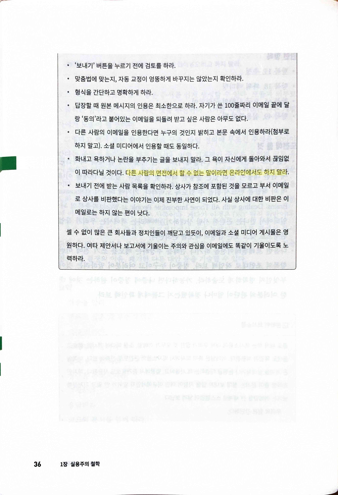

- `다른 사람의 면전에서 할 수 없는 말이라면 온라인에서도 하지 말라`

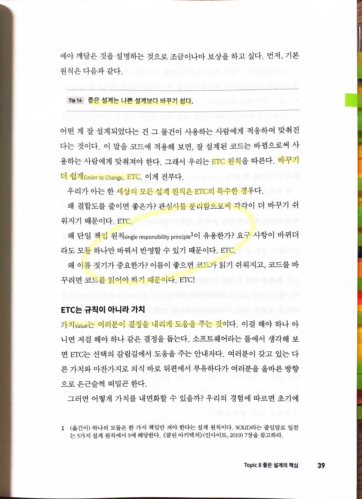

- `좋은 설계는 나쁜 설계보다 바꾸기 쉽다`
    - `ETC 원칙… 바꾸기 더 쉽게 Easier to Change ETC`
    - `세상의 모든 설계 원칙은 ETC의 특수한 경우`
    - 결합도 감소 → 관심사 분리 → 각각이 더 바꾸기 쉬워짐
    - 단일 책임 원칙 single responsibility principle → 요구사항이 바뀌어도 모듈 하나만 바꿔서 반영 가능
    - 이름 짓기 → 이름이 좋으면 읽기 쉬워짐 → 코드를 바꾸려면 코드를 읽어야 함

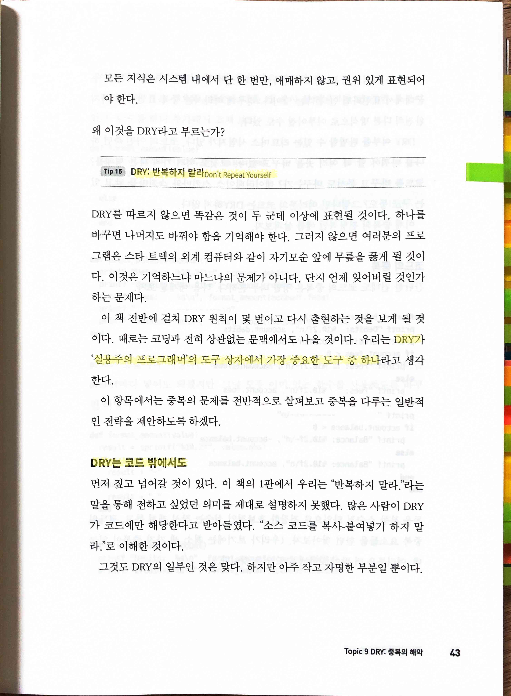

- `DRY: 반복하지 말라 Don’t Repeat Yourself`
    - `DRY가 ‘실용주의 프로그래머’의 도구 상자에서 가장 중요한 도구 중 하나`
    - `DRY는 코드 밖에서도`
        - source code copy & paste는 작은 부분일 뿐

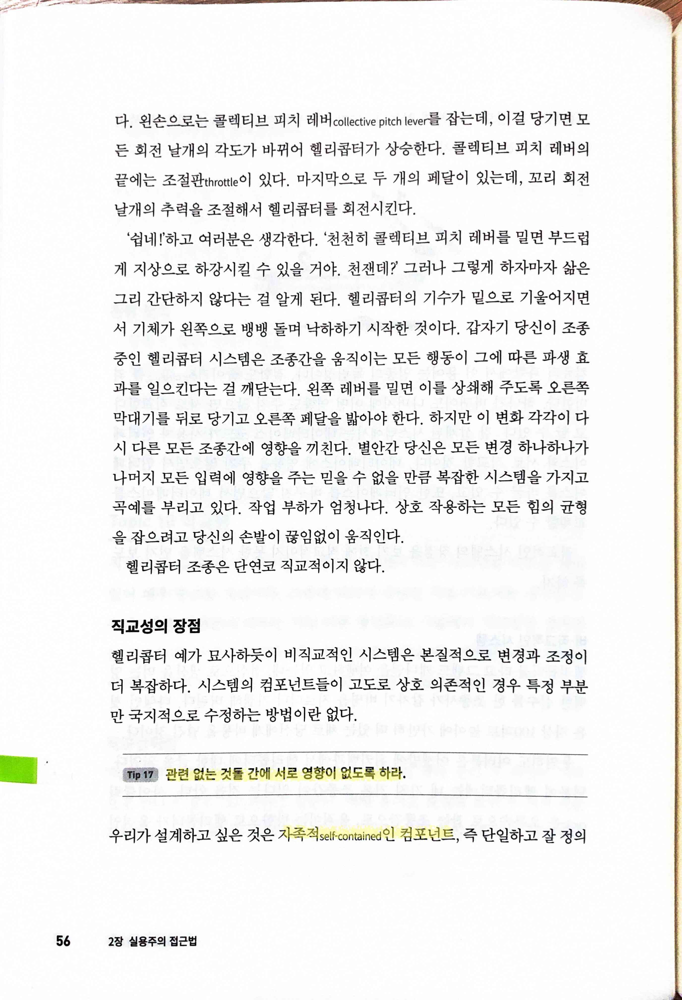

- `관련 없는 것들 간에 서로 영향이 없도록 하라`
    - `자족적 self-contained인 컴포넌트`

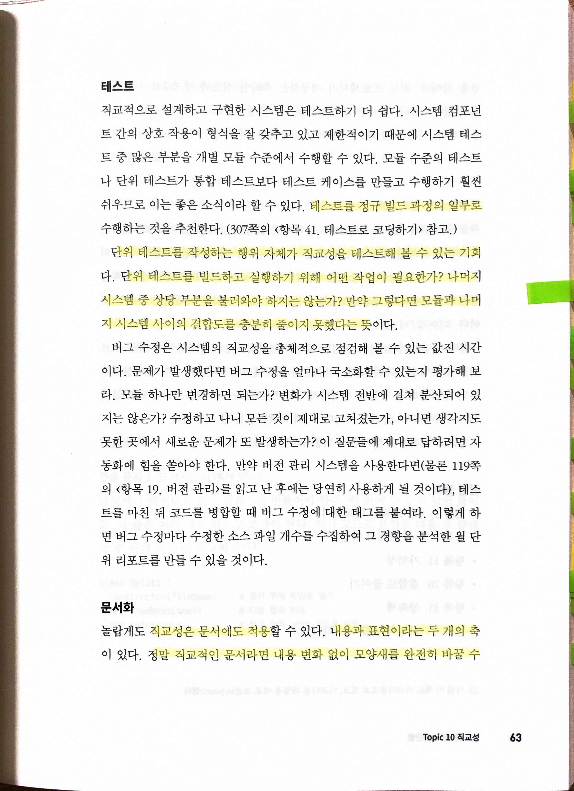

- `테스트를 정규 빌드 과정의 일부로`
    - `단위 테스트를 작성하는 행위 자체가 직교성을 테스트해 볼 수 있는 기회다. 단위 테스트를 빌드하고 실행하기 위해 어떤 작업이 필요한가? 나머지 시스템 중 상당 부분을 불러와야 하지는 않는가? 만약 그렇다면 모듈과 나머지 시스템 사이의 결합도를 충분히 줄이지 못했다는 뜻`
    - `직교성은 문서에도 적용… 내용과 표현이라는 두 개의 축… 정말 직교적인 문서라면 내용 변화 없이 모양새를 완전히 바꿀 수`

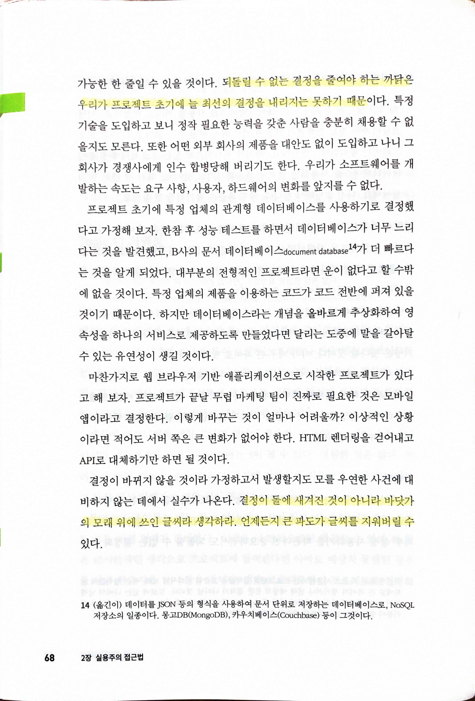

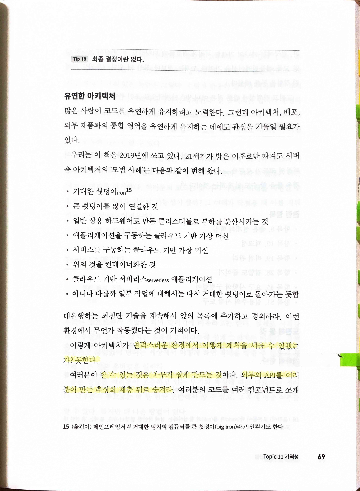

- pp68~69
    - p68
        - `되돌릴 수 없는 결정을 줄여야 하는 까닭은 우리가 프로젝트 초기에 늘 최선의 결정을 내리지는 못하기 때문`
        - `결정이 돌에 새겨진 것이 아니라 바닷가의 모래 위에 쓰인 글씨라 생각하라. 언제든지 큰 파도가 글씨를 지워버릴 수 있다`
    - p69
        - `변덕스러운 환경에서 어떻게 계획을 세울 수 있겠는가? 못한다`
        - `할 수 있는 것은 바꾸기 쉽게 만드는 것… 외부의 API를 여러분이 만든 추상화 계층 뒤로 숨겨라`

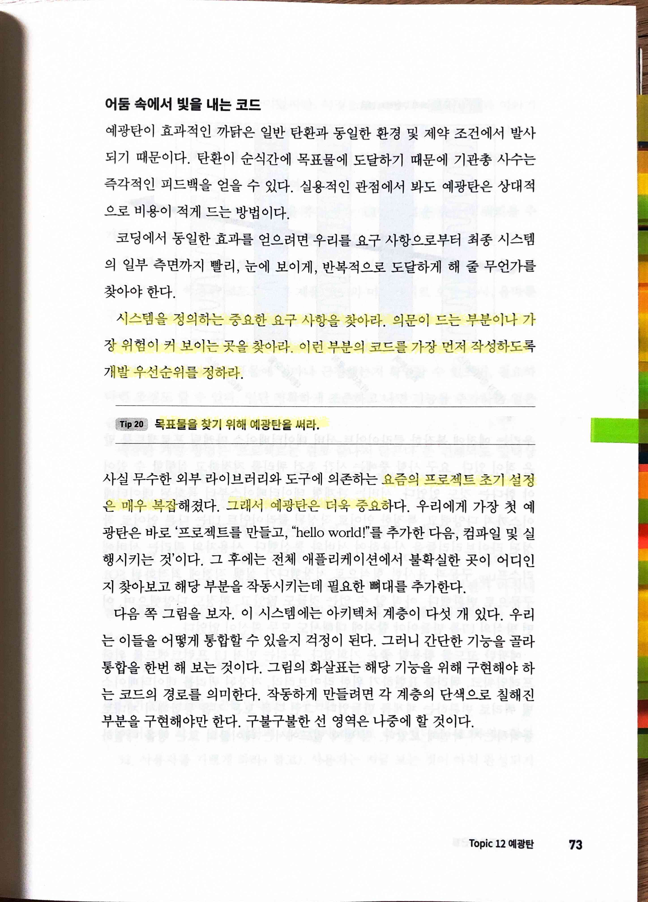

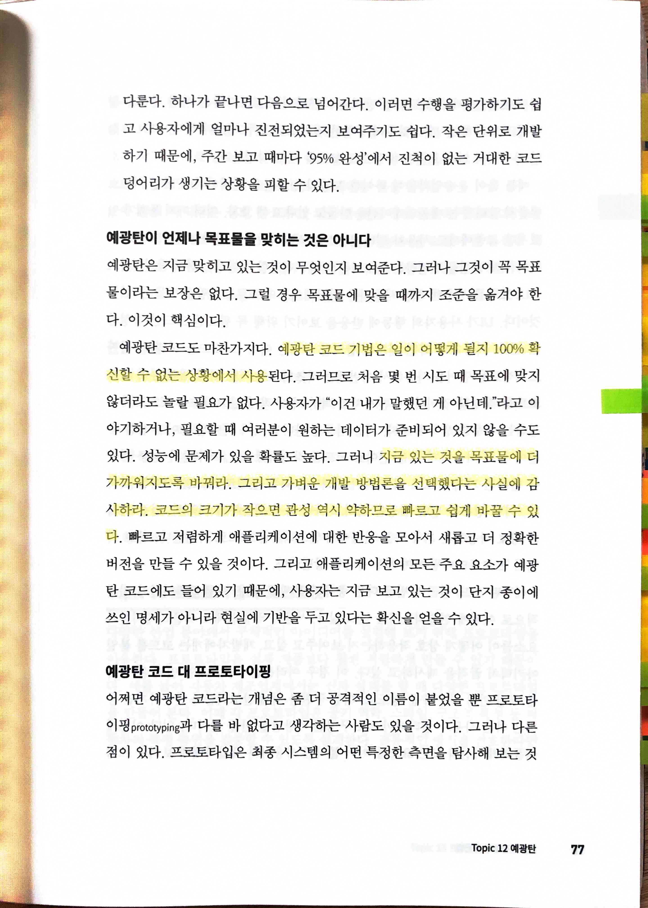

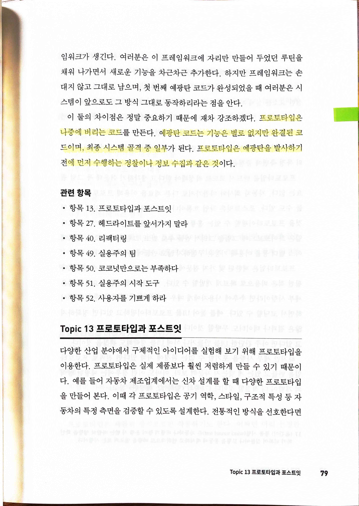

- p73, p77, p79
    - `시스템을 정의하는 중요한 요구 사항을 찾아라. 의문이 드는 부분이나 가장 위험이 커 보이는 곳을 찾아라. 이런 부분의 코드를 가장 먼저 작성하도록 개발 우선순위를 정하라`
        - `목표물을 찾기 위해 예광탄을 써라`
        - `요즘의 프로젝트 초기 설정은 매우 복잡… 그래서 예광탄은 더욱 중요`
    - `예광탄 코드 기법은 일이 어떻게 될지 100% 확실할 수 없는 상황에서 사용`
        - `지금 있는 것을 목표물에 더 가까워지도록 바꿔라. 그리고 가벼운 개발 방법론을 선택했다는 사실에 감사하라. 코드의 크기가 작으면 관성 역시 약하므로 빠르고 쉽게 바꿀 수 있다`
    - `프로토타입은 나중에 버리는 코드… 예광탄 코드는 기능은 별로 없지만 완결된 코드이며, 최종 시스템 골격 중 일부`
        - `프로토타입은 예광탄을 발사하기 전에 먼저 수행하는 정찰이나 정보 수집과 같은 것`


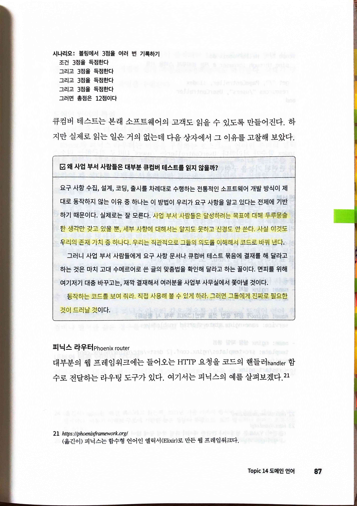

- p85, p87
    - `언제나 애플리케이션 도메인의 어휘를 사용해서 코드를 작성하려고 노력… 어떤 경우에는 한 차원 더 나아가서 그 도메인의 실제 어휘와 문법, 의미론을 - 즉, 그 도메인의 언어를 - 사용해서 프로그래밍할 수도 있다`
        - `문제 도메인에 가깝게 프로그래밍하라`
    - `사업 부서 사람들은 달성하려는 목표에 대해 두루뭉술한 생각만 갖고 있을 뿐, 세부 사항에 대해서는 알지도 못하고 신경도 안 쓴다. 사실 이것도 우리의 존재 가치 중 하나다. 우리는 직관적으로 그들의 의도를 이해해서 코드로 바꿔 낸다`
        - `동작하는 코드를 보여 줘라. 직접 사용해 볼 수 있게 하라. 그러면 그들에게 진짜로 필요한 것이 드러날 것`

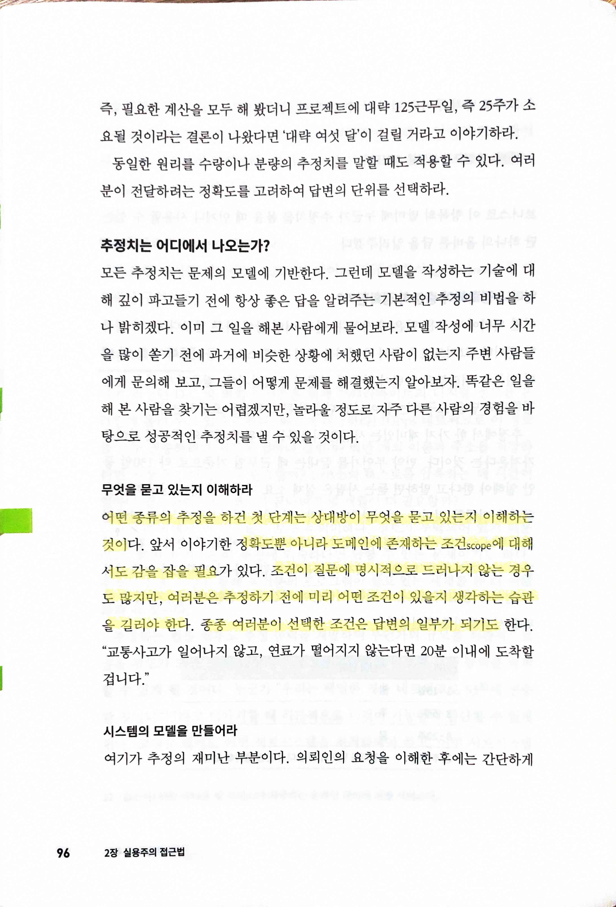


- p96, p99
    - `어떤 종류의 추정을 하건 첫 단계는 상대방이 무엇을 묻고 있는지 이해하는 것… 정확도뿐 아니라 도메인에 존재하는 조건 scope에 대해서도 감을 잡을 필요… 조건이 질문에 명시적으로 드러나지 않는 경우도 많지만, 여러분은 추정하기 전에 미리 어떤 조건이 있을지 생각하는 습관을 길러야 한다. 종종 여러분이 선택한 조건은 답변의 일부가 되기도`
    - `추정 실력을 기록하라`
        - `추정치가 틀렸더라도… 왜 틀렸는지 찾아라`


- `어떤 방법론은 반복 주기가 몇 번이나 필요한지를 초기 계획 단계에서 정하라고 요구하는데, 아주 간단한 프로젝트가 아닌 바에야 잘못된 방식… 초기의 계획은 어림짐작에 불과`
    - `첫 반복 주기의 경험을 바탕으로 반복 주기의 수와 각 반복 주기에서 무엇을 할지에 대한 처음의 추측을 다듬을 수 있을 것… 각 반복 주기가 끝날 때마다 추측을 더 다듬다 보면, 일정에 대한 확신도 이와 함께 커질 것… 이런 추정은 보통 각 반복 주기가 끝날 때 팀 리뷰 회의 시간에`
    - `코드와 함께 일정도 반복하며 조정하라`
    - `경영진은 보통 프로젝트가 시작되기도 전에 하나의 정확한 숫자를 원하기 때문… 여러분은 팀, 팀의 생산성 그리고 환경이 일정을 결정한다는 사실을 경영진에게 이해시켜야 한다`

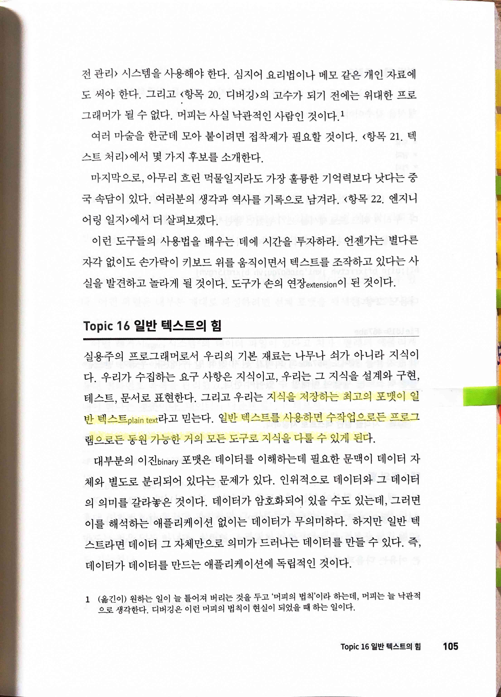

- `지식을 저장하는 최고의 포맷이 일반 텍스트 plain text… 일반 텍스트를 사용하면 수작업으로든 프로그램으로든 동원 가능한 거의 모든 도구로 지식을 다룰 수 있게 된다`


- `GUI의 장점은 WYSIWYG What You See Is What You Get, 즉 여러분이 보는 것이 여러분이 얻는 것이라는 점… 단점은 WYSIAYG What You See Is All You Get, 즉 여러분이 보는 것이 여러분이 얻는 전부라는 것`
    - `GUI 환경의 기능은 일반적으로 설계자가 의도한 범위를 넘어설 수 없다… 실용주의 프로그래머는 오직 코드만 쏟아 내거나, 객체 모델만 개발하거나, 문서만 작성하거나, 빌드 과정 자동화만 하지는 않는다. 이 모든 일을 다 한다`

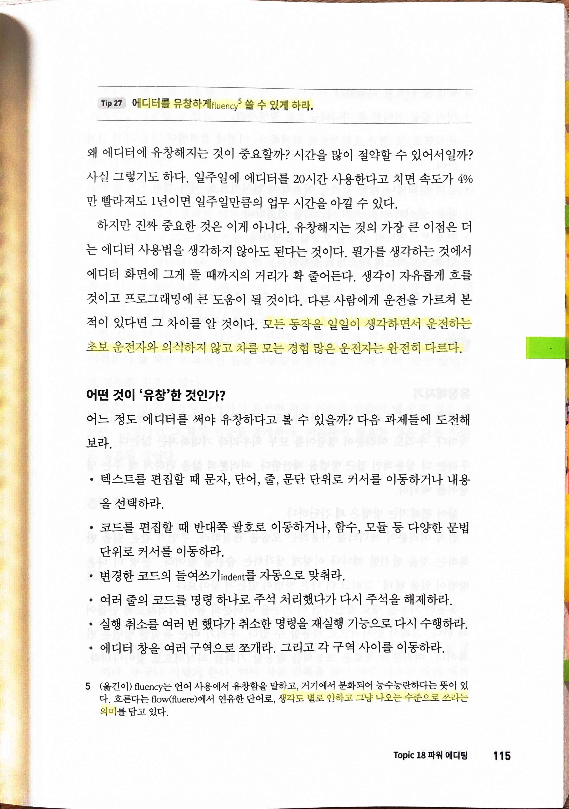

- `에디터를 유창하게 fluency 쓸 수 있게 하라 → 생각도 별로 안하고 그냥 나오는 수준으로 쓰라는 의미`
    - `모든 동작을 일일이 생각하면서 운전하는 초보 운전자와 의식하지 않고 차를 모는 경험 많은 운전자는 완전히 다르다`

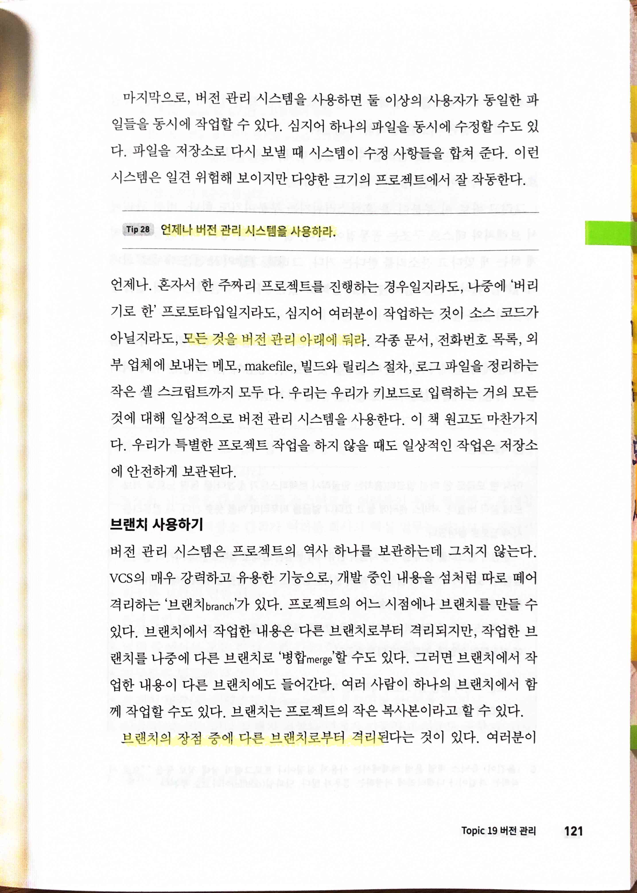

- `언제나 버전 관리 시스템을 사용하라`
    - `모든 것을 버전 관리 아래에 둬라`
    - `브랜치의 장점 중에 다른 브랜치로부터 격리`

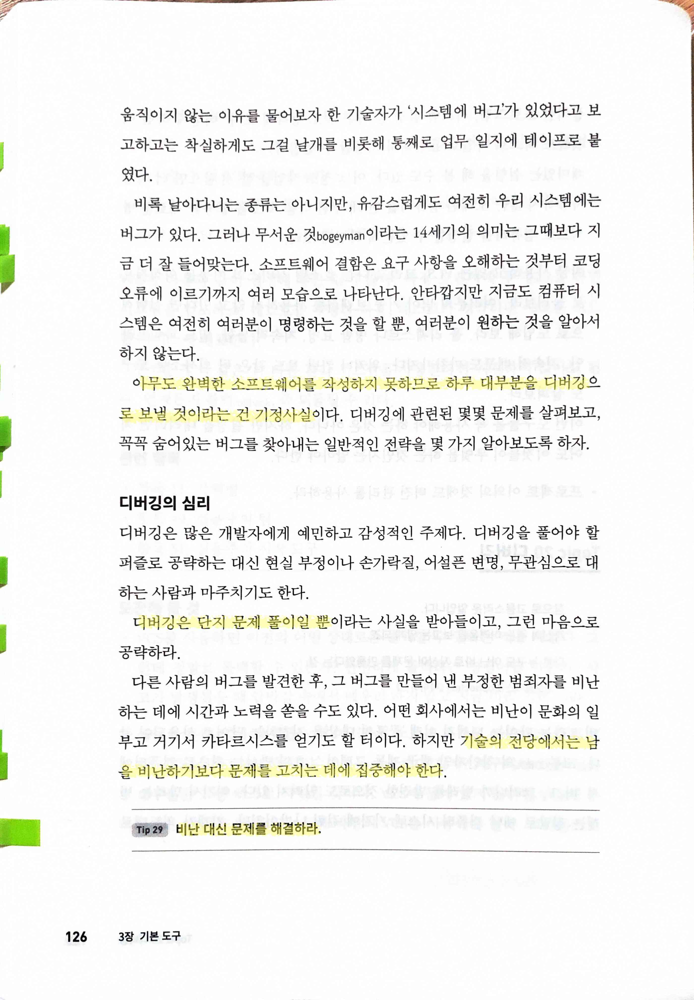

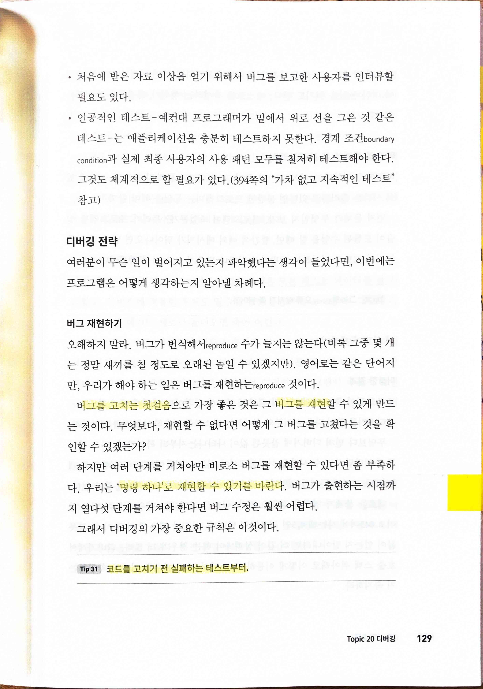

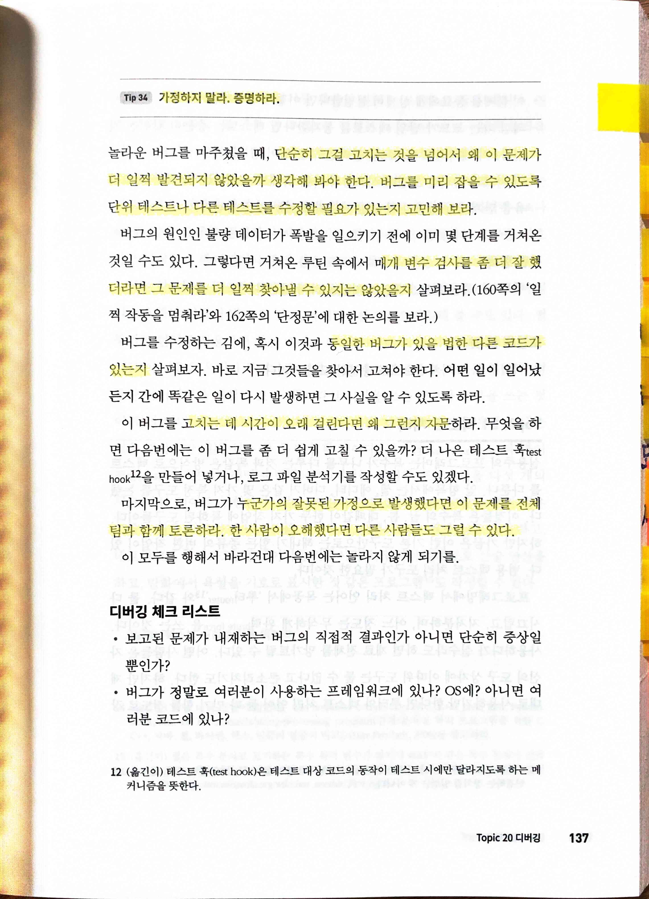

- p126, p129, p137
    - `아무도 완벽한 소프트웨어를 작성하지 못하므로 하루 대부분을 디버깅으로 보낼 것이라는 건 기정사실`
        - `디버깅은 단지 문제 풀이일 뿐`
        - `기술의 전당에서는 남을 비난하기보다 문제를 고치는 데에 집중해야 한다`
        - `비난 대신 문제를 해결하라`
    - `버그를 고치는 첫걸음… 버그를 재현… ‘명령 하나’로 재현할 수 있기를 바란다`
        - [테스트 코드 잘 짜는 프로그래머는 이걸 잘합니다 - YouTube](https://www.youtube.com/watch?v=VygGrcq0VX0)
        - `코드를 고치기 전 실패하는 테스트부터`
    - `가정하지 말라. 증명하라`
        - `단순히 그걸 고치는 것을 넘어서 왜 이 문제가 더 일찍 발견되지 않았을까 생각해봐야 한다. 버그를 미리 잡을 수 있도록 단위 테스트나 다른 테스트를 수정할 필요가 있는지 고민해 보라`
        - `매개 변수 검사를 좀 더 잘 했더라면 그 문제를 더 일찍 찾아낼 수 있지는 않았을지`
        - `동일한 버그가 있을 법한 다른 코드가 있는지`
        - `고치는 데 시간이 오래 걸린다면 왜 그런지 자문`
        - `누군가의 잘못된 가정으로 발생했다면 이 문제를 전체 팀과 함께 토론하라. 한 사람이 오해했다면 다른 사람들도 그럴 수 있다`


- `일지를 쓰면 좋은 점`
    - `기억보다 더 믿을 만하다`
    - `진행 중인 작업과 직접적인 관계가 없는 발상을 일단 쌓아 놓을 수 있는 곳이 생긴다`
    - `고무 오리와 같은 역할… 무언가를 쓰기 위해 하던 일을 멈추면 여러분의 뇌도 기어를 바꾼다. 누군가에게 이야기를 하는 것과 비슷하다. 하던 일을 돌아보기에 알맞은 기회가 생기는 것`

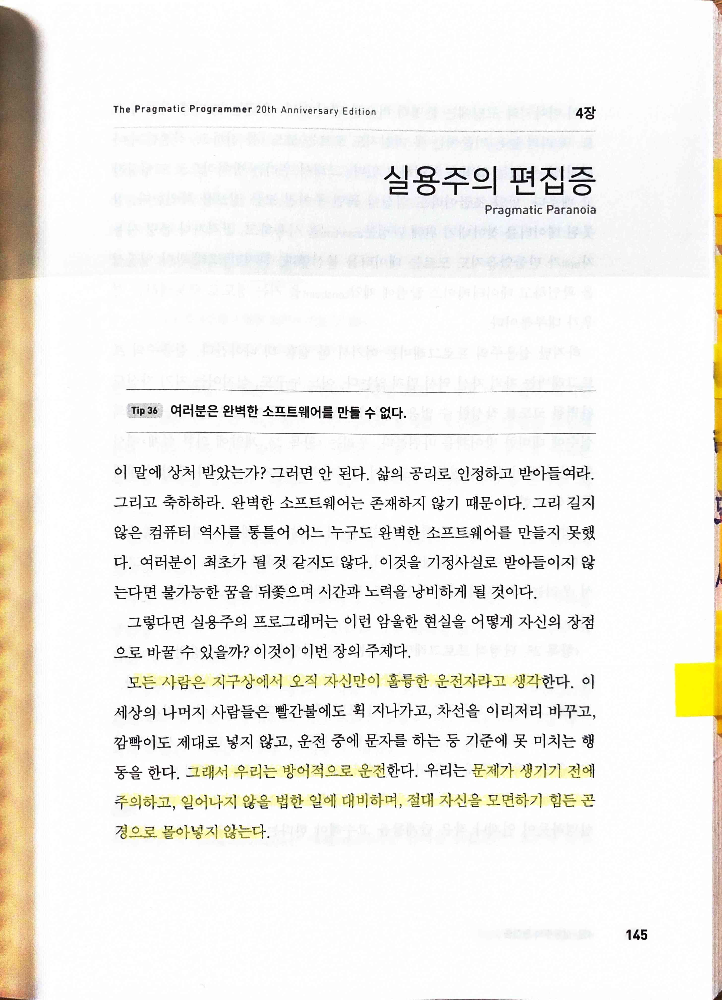

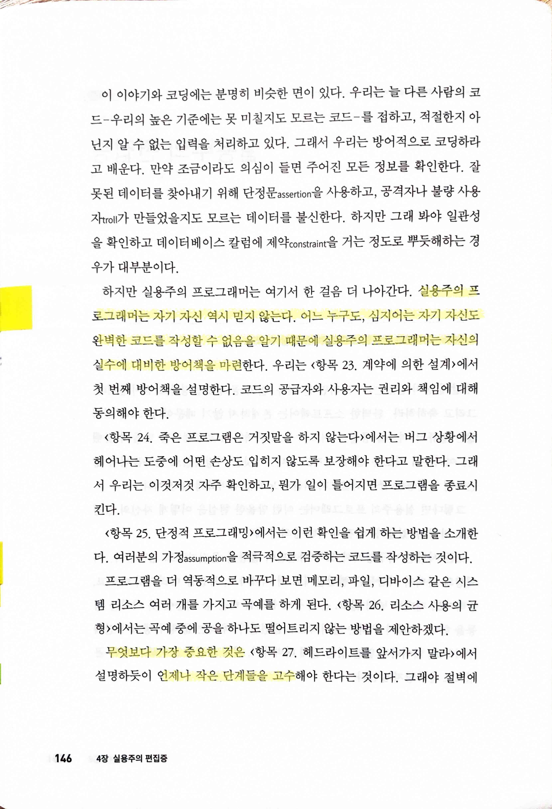

- pp145~146
    - `모든 사람은 지구상에서 오직 자신만이 훌륭한 운전자라고 생각… 그래서 우리는 방어적으로 운전… 문제가 생기기 전에 주의하고, 일어나지 않을 법한 일에 대비하며, 절대 자신을 모면하기 힘든 곤경으로 몰아놓지 않는다`
    - `실용주의 프로그래머는 자기 자신 역시 믿지 않는다. 어느 누구도, 심지어는 자기 자신도 완벽한 코드를 작성할 수 없음을 알기 때문에 실용주의 프로그래머는 자신의 실수에 대비한 방어책을 마련`
    - `무엇보다 가장 중요한 것은… 언제나 작은 단계들을 고수해야 한다는 것`

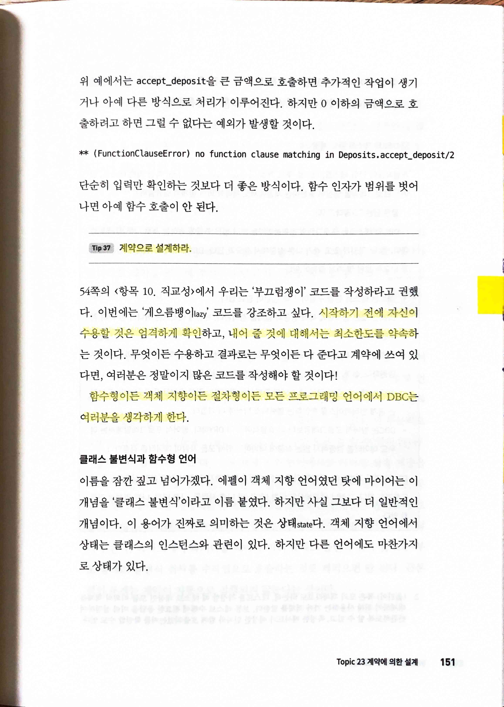

- `계약으로 설계하라`
    - `시작하기 전에 자신이 수용할 것은 엄격하게 확인… 내어 줄 것에 대해서는 최소한도를 약속`
    - `함수형이든 객체 지향이든 절차형이든 모든 프로그래밍 언어에서 DBC는 여러분을 생각하게 한다`

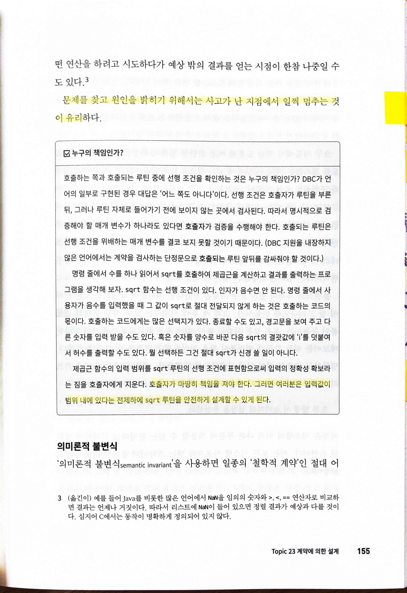

- `문제를 찾고 원인을 밝히기 위해서는 사고가 난 지점에서 일찍 멈추는 것이 유리`
    - `호출자가 마땅히 책임을 져야 한다. 그러면 여러분은 입력값이 범위 내에 있다는 전제하에 sqrt 루틴을 안전하게 설계할 수 있게 된다`
        - 하지만 방어적인 코드를 작성하는 측면에서 생각해보면 callee에서 defensive code를 작성해야 하는데?

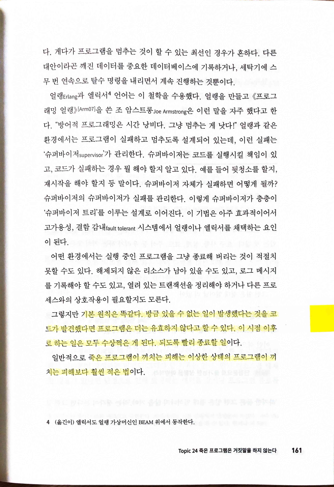

- `기본 원칙은 똑같다. 방금 있을 수 없는 일이 발생했다는 것을 코드가 발견했다면 프로그램은 더는 유효하지 않다고 할 수 있다. 이 시점 이후로 하는 일은 모두 수상쩍은 게 된다. 되도록 빨리 종료할 일`
    - `죽은 프로그램이 끼치는 피해는 이상한 상태의 프로그램이 끼치는 피해보다 훨씬 적은 법`

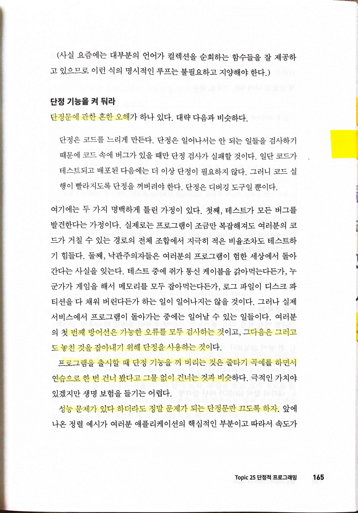

- `단정문에 관한 흔한 오해`
    - `첫 번째 방어선은 가능한 오류를 모두 검사하는 것… 그다음은 그러고도 놓친 것을 잡아내기 위해 단정을 사용하는 것`
    - `프로그램을 출시할 때 단정 기능을 꺼 버리는 것은 줄타기 곡예를 하면서 연습으로 한 번 건너 봤다고 그물 없이 건너는 것과 비슷`
    - `성능 문제가 있다 하더라도 정말 문제가 되는 단정문만 끄도록 하자`

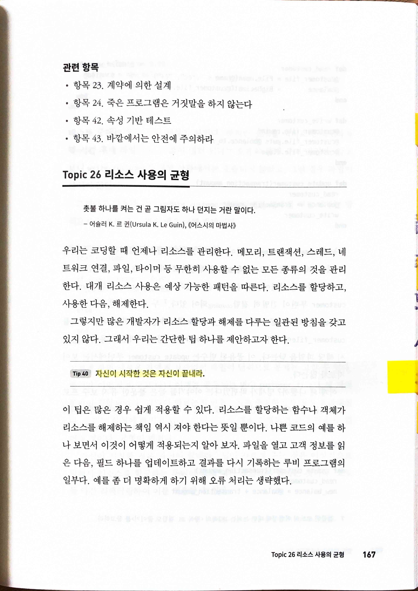

- `자신이 시작한 것은 자신이 끝내라`

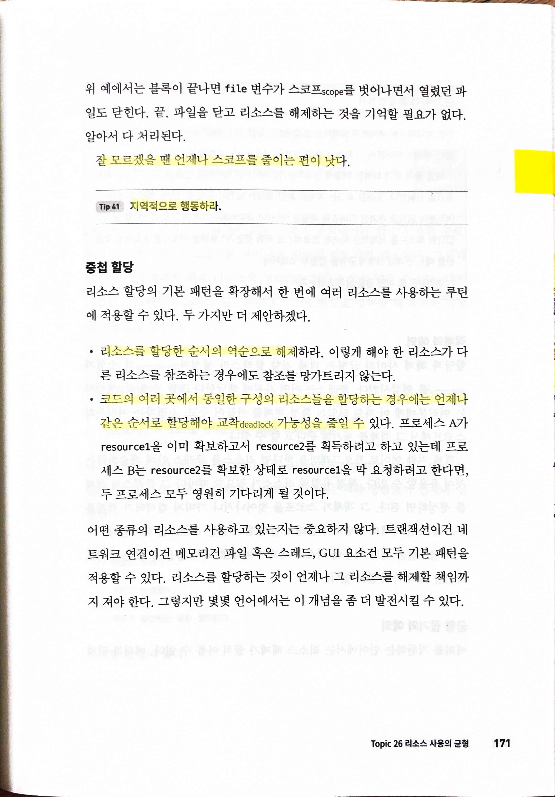

- `잘 모르겠을 땐 언제나 스코프를 줄이는 편이 낫다`
    - `지역적으로 행동하라`
    - `리소스를 할당한 순서의 역순으로 해제`
    - `코드의 여러 곳에서 동일한 구성의 리소스들을 할당하는 경우에는 언제나 같은 순서로 할당해야 교착 deadlock 가능성을 줄일 수`

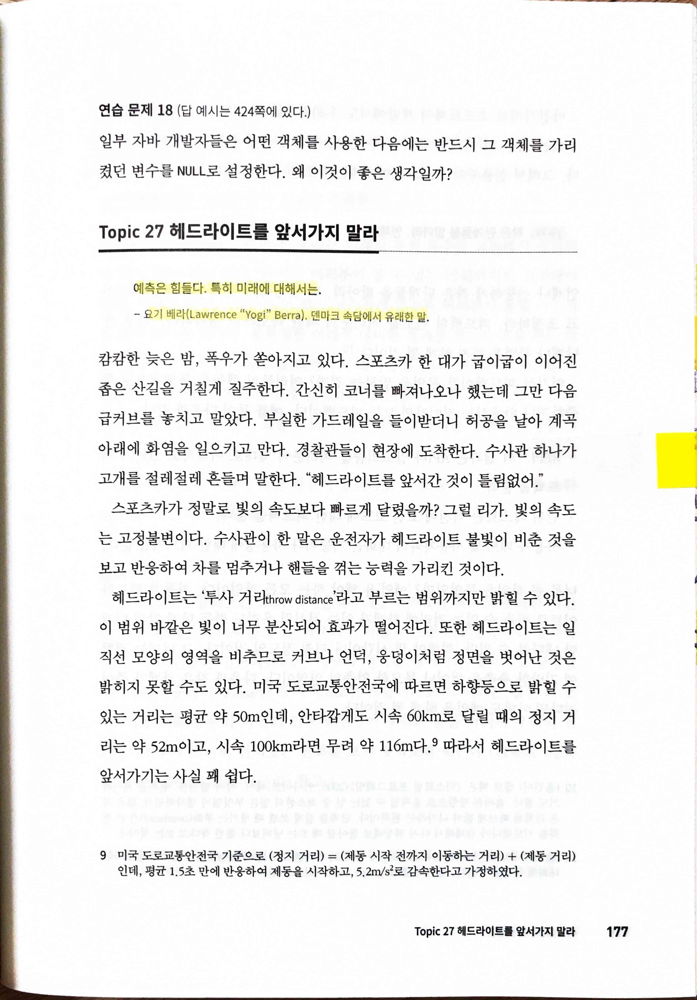

- `예측은 힘들다 특히 미래에 대해서는 - 요기 베라(Lawrence “Yogi” Berra). 덴마크 속담에서 유래한 말`


- `미래의 유지 보수를 고려해서 설계해야 하지 않느냐고? 맞다. 하지만 여러분이 볼 수 있는 미래까지만 고려해야 한다. 미래가 어떤 모습일지 더 많이 예측하려 할수록 여러분이 틀릴 가능성은 계속 높아질 것이다. 불확실한 미래에 대비한 설계를 하느라 진을 빼는 대신 언제나 교체 가능한 코드를 작성하여 대비… 코드를 교체할 수 있도록 하면 응집도나 결합도, DRY에도 도움이 되고, 전반적으로 더 나은 설계가 탄생`

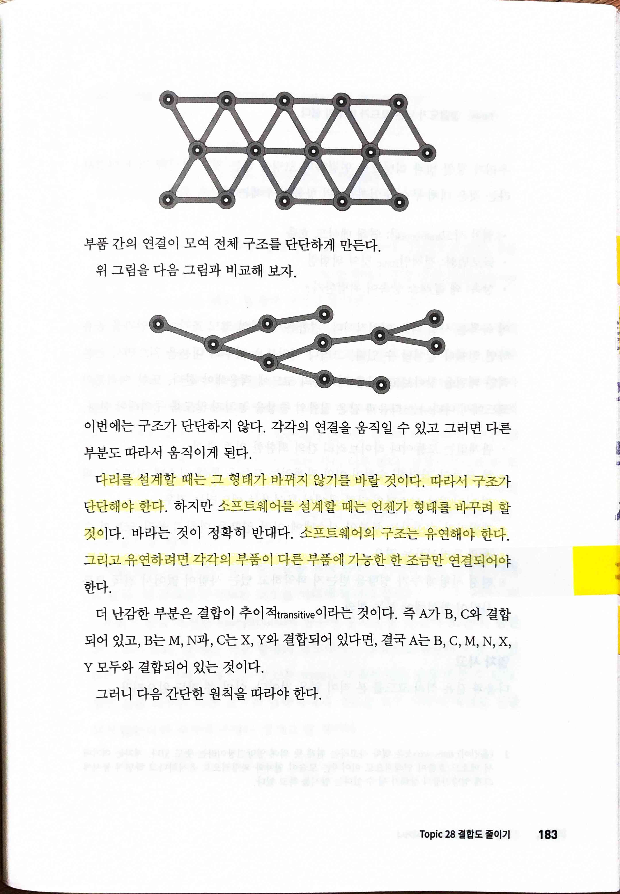

- `다리를 설계할 때는 그 형태가 바뀌지 않기를 바랄 것이다. 따라서 구조가 단단해야 한다… 하지만 소프트웨어를 설계할 때는 언젠가 형태를 바꾸려 할 것… 소프트웨어 구조는 유연해야 한다. 그리고 유연하려면 각각의 부품이 다른 부품에 가능한 한 조금만 연결되어야…`
    
    
    - software architecture의 architecture가 건축에서 유래한 말이지만, 건축의 속성까지 가져올 수 없는 이유

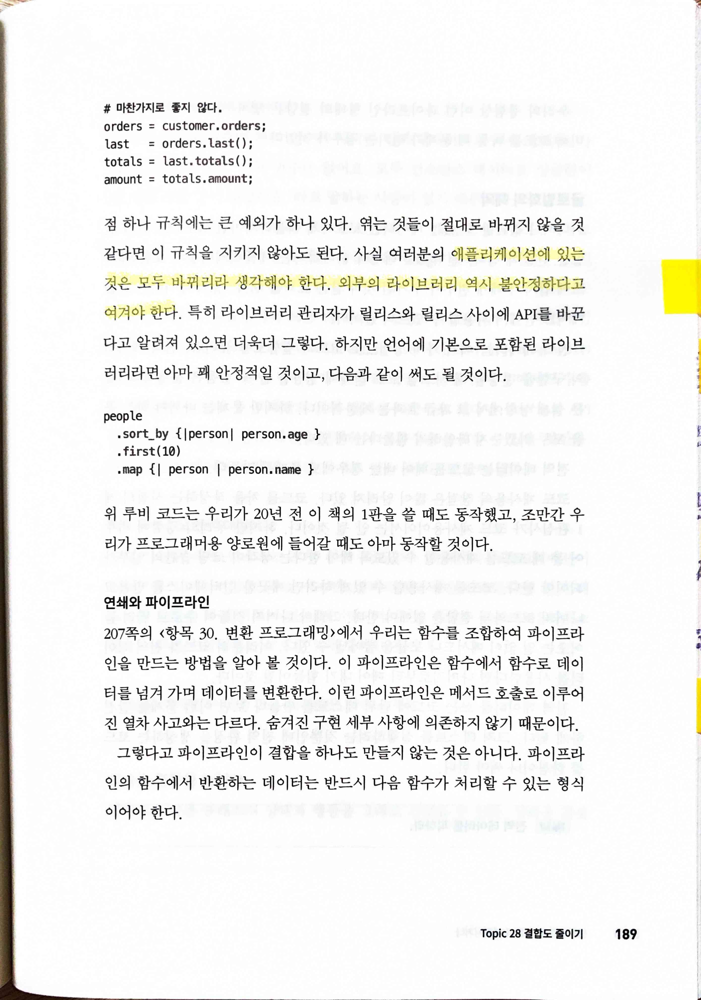

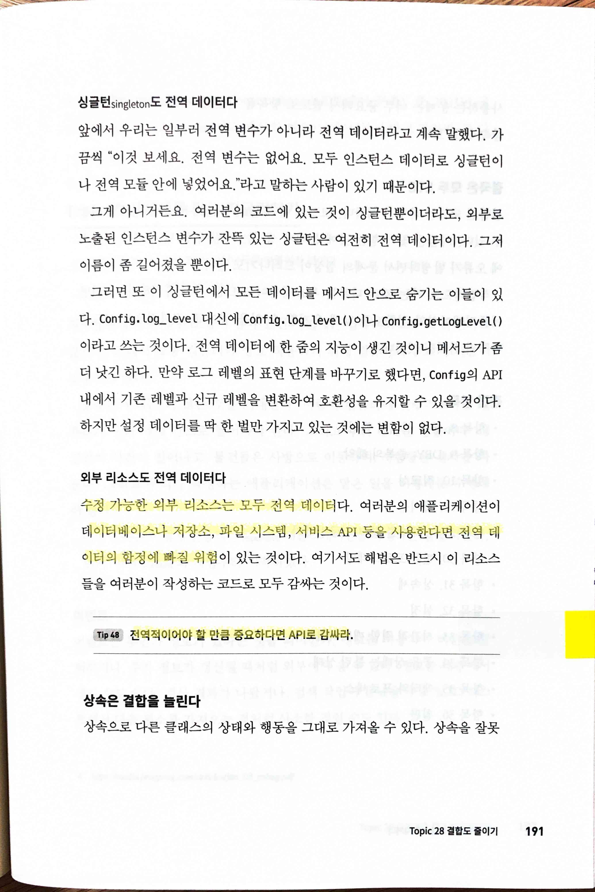

- p189, p191
    - `애플리케이션에 있는 것은 모두 바뀌리라 생각해야 한다. 외부의 라이브러리 역시 불안정하다고 여겨야 한다`
    - `수정 가능한 외부 리소스는 모두 전역 데이터… 데이터베이스나 저장소, 파일 시스템, 서비스 API 등을 사용한다면 전역 데이터의 함정에 빠질 위험`
        - `전역적이어야 할 만큼 중요하다면 API로 감싸라`

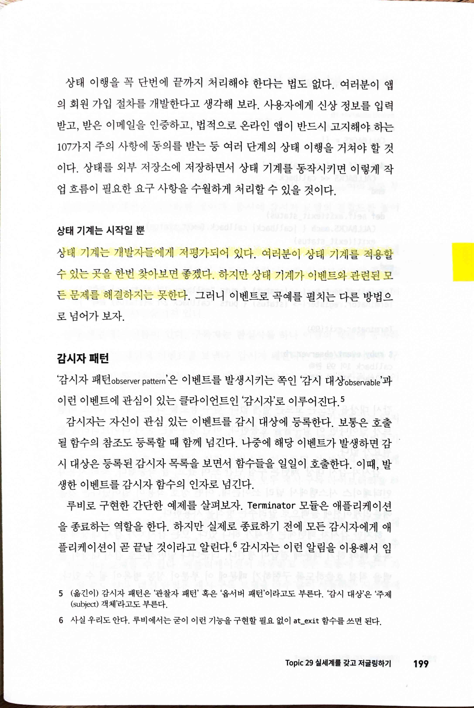

- `상태 기계는 개발자들에게 저평가되어 있다. 여러분이 상태 기계를 적용할 수 있는 곳을 한번 찾아보면 좋겠다. 하지만 상태 기계가 이벤트와 관련된 모든 문제를 해결하지는 못한다`

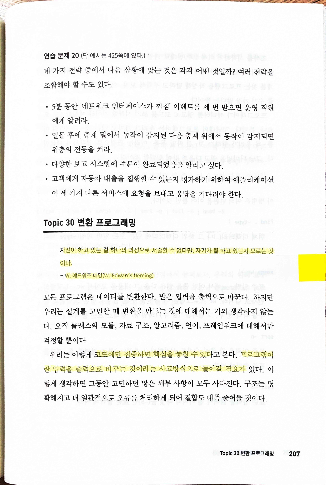

- `자신이 하고 있는 걸 하나의 과정으로 서술할 수 없다면, 자기가 뭘 하고 있는지 모르는 것이다 - W. 에드워즈 데밍(W. Edwards Deming)`
    - `코드에만 집중하면 핵심을 놓칠 수 있다… 프로그램이란 입력을 출력으로 바꾸는 것이라는 사고방식으로 돌아갈 필요`
    - unix/linux command의 pipe 연상

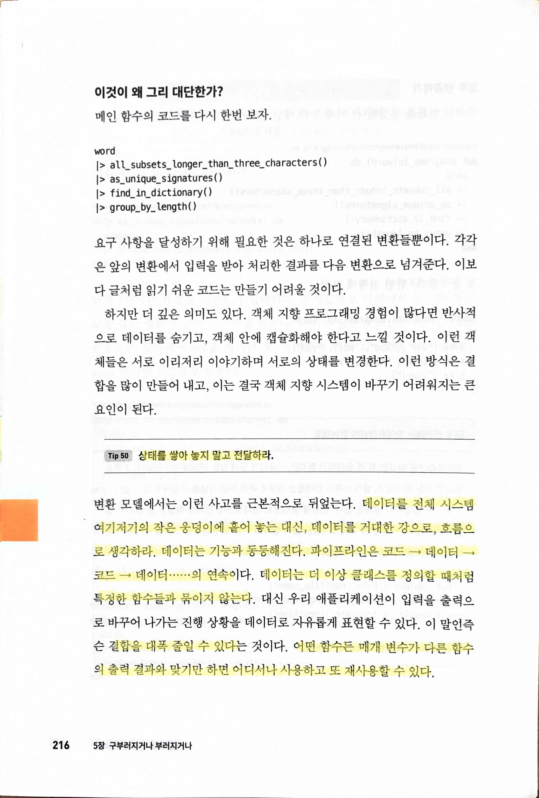

- `상태를 쌓아 놓지 말고 전달하라`
    - `데이터를 전체 시스템 여기저기의 작은 웅덩이에 흩어 놓는 대신, 데이터를 거대한 강으로, 흐름으로 생각하라. 데이터는 기능과 동등해진다. 파이프라인은 코드 → 데이터 → 코드 → 데이터 ……의 연속… 데이터는 더 이상 클래스를 정의할 때처럼 특정한 함수들과 묶이지 않는다… 결합을 대폭 줄일 수 있다… 어떤 함수든 매개 변수가 다른 함수의 출력 결과와 맞기만 하면 어디서나 사용하고 또 재사용할 수 있다`
    - 역시 위에서 이야기한 unix/linux command의 pipe와 마찬가지
        
        ```mermaid
        flowchart LR
          d1[data/input] --> c[code] --> d2[data/output & input] --> c2[code] --> d3[data/output & input] --> c3[...]
        ```
        

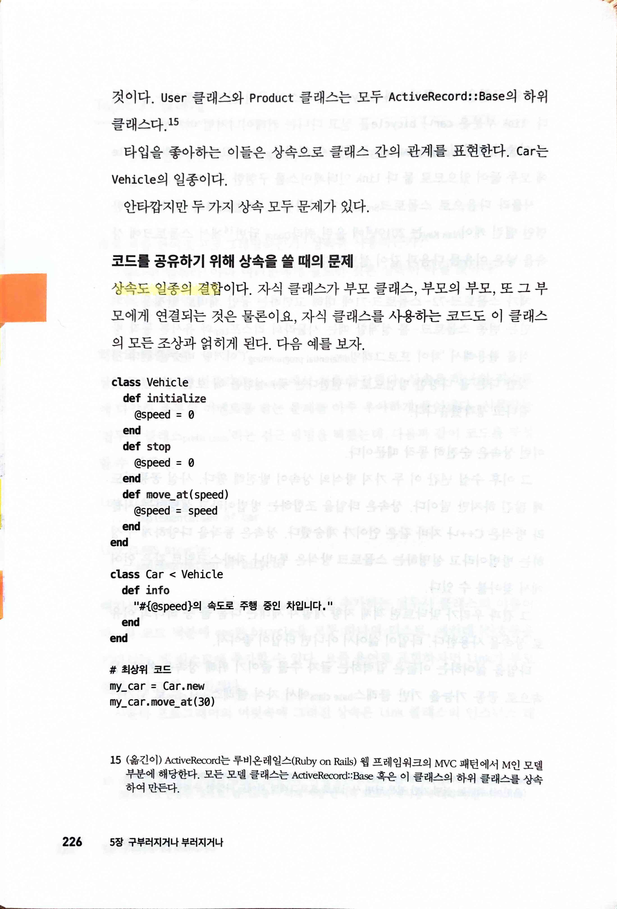

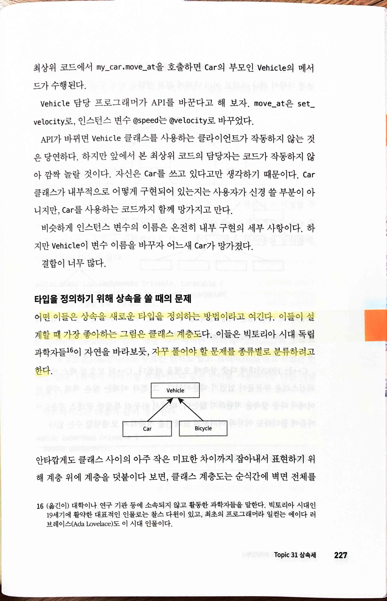

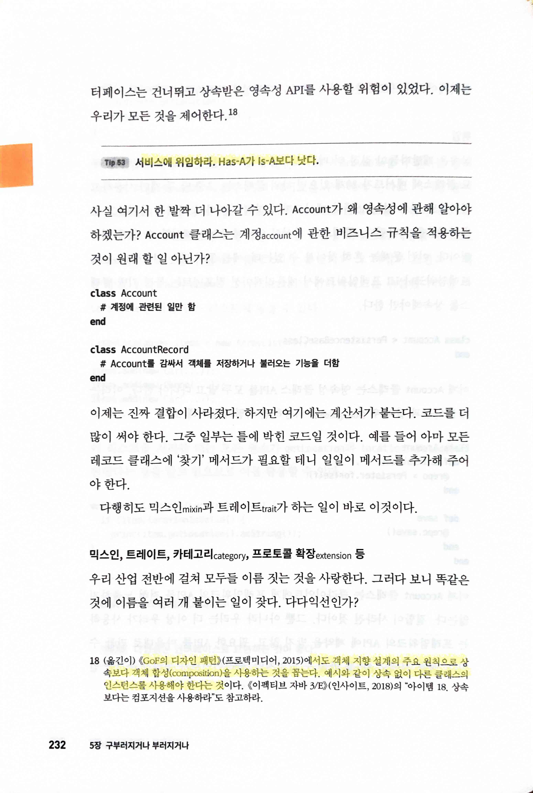

- pp226~227, p232
    - `상속도 일종의 결합`
    - `어떤 이들은 상속을 새로운 타입을 정의하는 방법이라고 여긴다. 이들이 설계할 때 가장 좋아하는 그림은 클래스 계층도… 자꾸 풀어야 할 문제를 종류별로 분류하려고 한다`
    - `서비스에 위임하라. Has-A가 Is-A보다 낫다`
        - `GoF의 디자인 패턴에서도 객체 지향 설계의 주요 원칙으로 상속보다 객체 합성 composition을 사용하는 것을 뽑는다. 예시와 같이 상속 없이 다른 클래스의 인스턴스를 사용해야 한다는 것`

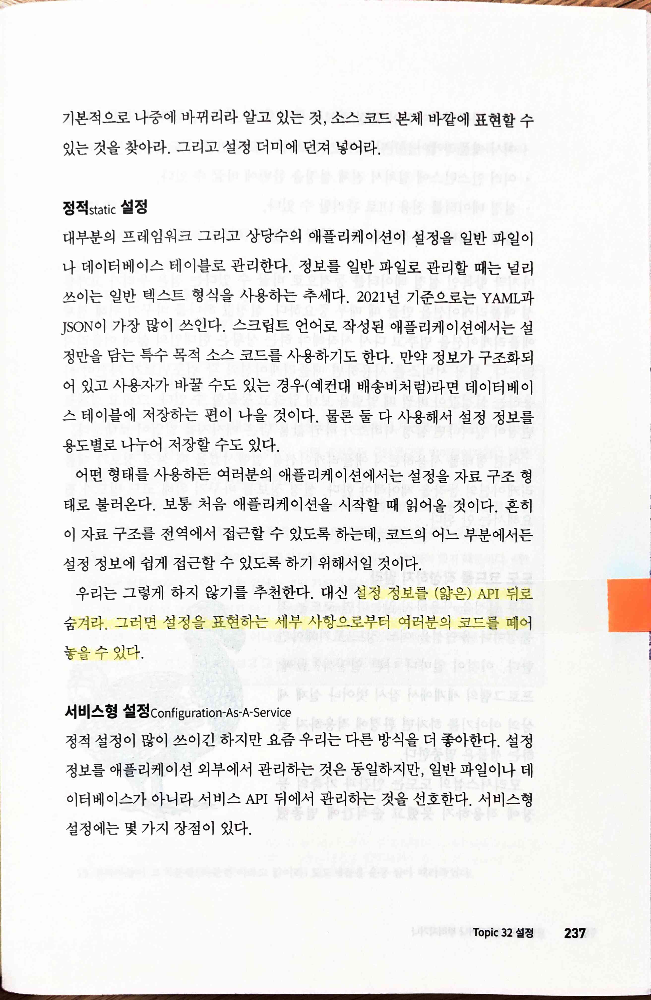

- `설정 정보를 (얇은) API 뒤로 숨겨라. 그러면 설정을 표현하는 세부 사항으로부터 여러분의 코드를 떼어 놓을 수 있다`

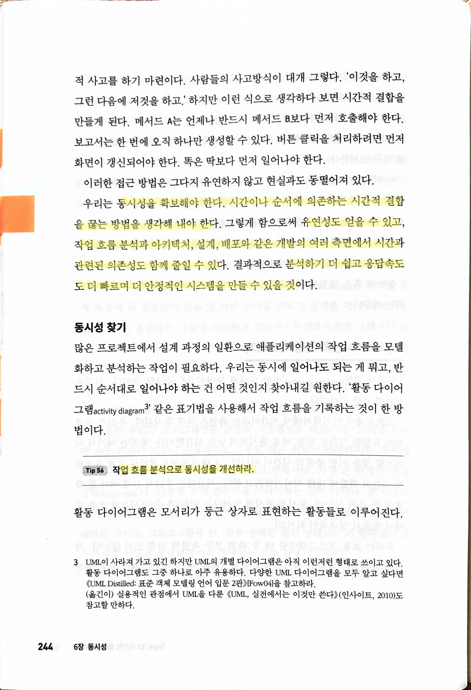

- `동시성을 확보해야 한다. 시간이나 순서에 의존하는 시간적 결합을 끊는 방법을 생각해 내야 한다… 유연성도 얻을 수 있고, 작업 흐름 분석과 아키텍처, 설계, 배포와 같은 개발의 여러 측면에서 시간과 관련된 의존성도 함께 줄일 수 있다… 분석하기 더 쉽고 응답속도도 더 빠르며 더 안정적인 시스템을 만들 수 있을 것`
    - `작업 흐름 분석으로 동시성을 개선하라`
    - activity diagram이 내가 이야기하는 business flow diagram과 (developer’s) architecture diagram의 중간 형태로 볼 수 있을 듯

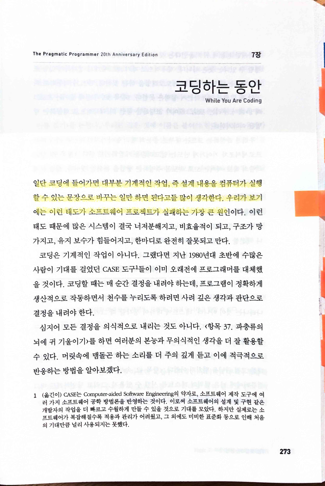

- `일단 코딩에 들어가면 대부분 기계적인 작업, 즉 설계 내용을 컴퓨터가 실행할 수 있는 문장으로 바꾸는 일만 하면 된다고들 많이 생각한다. 우리가 보기에는 이런 태도가 소프트웨어 프로젝트가 실패하는 가장 큰 원인`

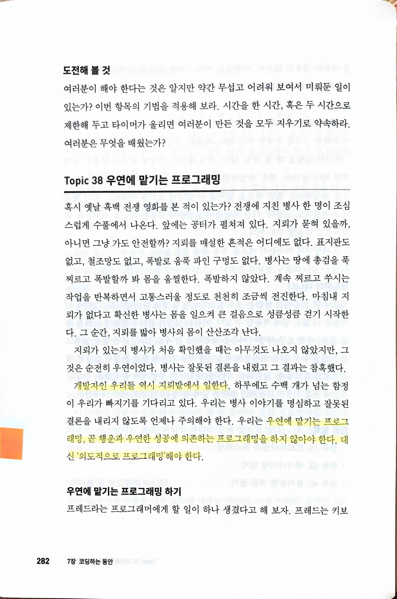

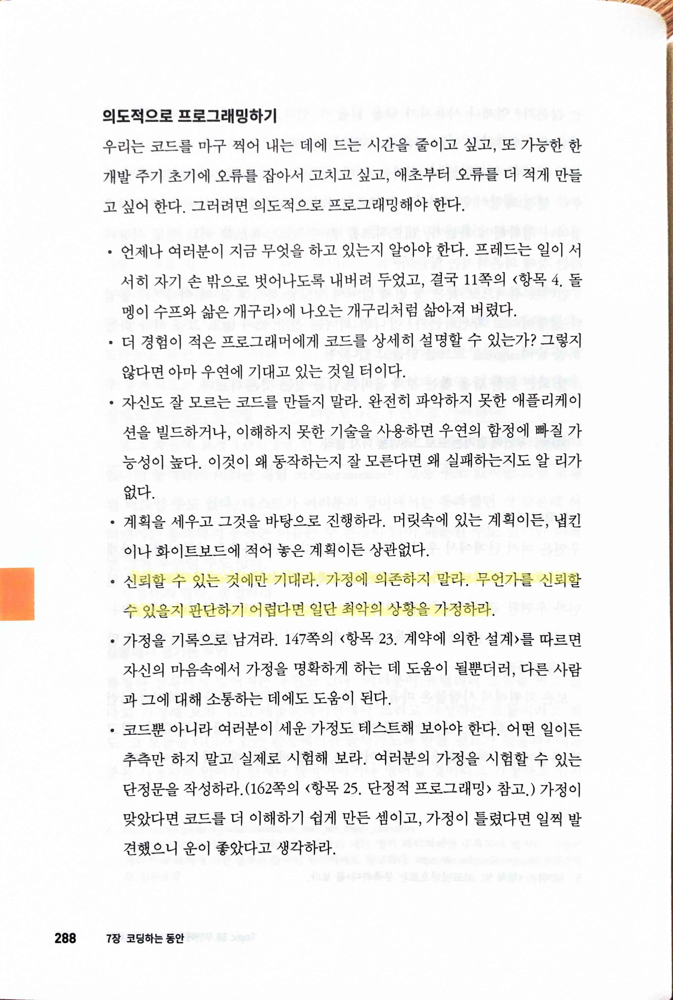

- p282, p288
    - `개발자인 우리들 역시 지뢰밭에서 일한다… 우연에 맡기는 프로그래밍, 곧 행운과 우연한 성공에 의존하는 프로그래밍을 하지 않아야 한다. 대신 ‘의도적으로 프로그래밍’해야 한다`
    - `신뢰할 수 있는 것에만 기대라. 가정에 의존하지 말라. 무언가를 신뢰할 수 있을지 판단하기 어렵다면 일단 최악의 상황을 가정하라`


- `이론적 요인과 실무적 요인을 모두 고려하려고 노력하라. 추정을 이미 했다고 하더라도 실제 서비스에서 실제 데이터로 돌아가는 코드의 수행 시간만이 정말로 의미 있는 수치`
    - `추정을 테스트하라`
    - metric monitoring

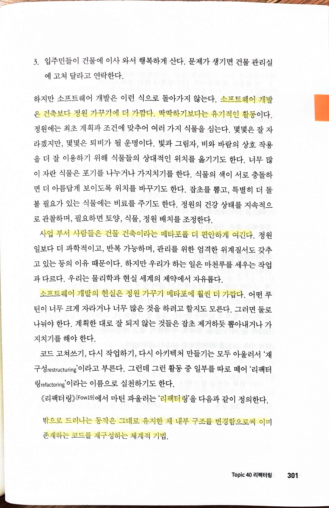

- p301
    - `소프트웨어 개발은 건축보다 정원 가꾸기에 더 가깝다. 딱딱하기보다는 유기적인 활동`
        - `사업 부서 사람들은 건물 건축이라는 메타포를 더 편한하게 여긴다`
        - `소프트웨어 개발의 현실은 정원 가꾸기 메타포에 훨씬 더 가깝다`
    - `리팩터링… 밖으로 드러나는 동작은 그대로 유지한 채 내부 구조를 변경함으로써 이미 존재하는 코드를 재구성하는 체계적 기법`


- p305
    1. `리팩터링과 기능 추가를 동시에 하지 말라`
    2. `시작하기 전 든든한 테스트가 있는지 먼저 확인… 할 수 있는 한 자주 테스트를 돌려 보라`
    3. `단계를 작게 나누어서 신중하게 작업… 단계를 작게 나누고, 한 단계가 끝날 때마다 테스트를 돌린다면 기나긴 디버깅 작업을 피할 수 있다`

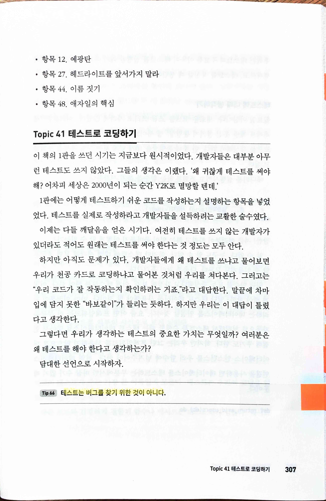

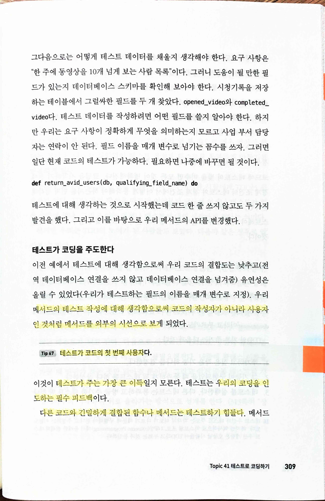

- p307, p309
    - `테스트는 버그를 찾기 위한 것이 아니다`
    - `메서드의 테스트 작성에 대해 생각함으로써 코드의 작성자가 아니라 사용자인 것처럼 메서드를 외부의 시선으로 보게`
        - `테스트가 코드의 첫 번째 사용자`
        - `테스트가 주는 가장 큰 이득… 우리의 코딩을 인도하는 필수 피드백`
        - `다른 코드와 긴밀하게 결합된 함수나 메서드는 테스트하기 힘들다`


- `설계 분야에는 두 개의 흐름 school… 하향식 top-down과 상향식 bottom-up`
    - `두 방식 공히 실제로는 잘 안 된다. 둘 다 소프트웨어 개발의 가장 중요한 측면을 놓치고 있기 때문… 바로 개발을 처음 시작할 때는 우리가 무엇을 하고 있는지 모른다는 것… 하향식 설계는 전체 요구 사항을 시작할 때 다 알고 있다면 가정하지만 사실은 알 수 없다. 상향식 설계는 추상화 계층을 쌓다 보면 결국에는 하나의 최상위 해결 계층에 도착할 것이라고 가정하지만 목표가 어디인지 모르는데 어떻게 각 계층의기능을 결정할 수 있단 말인가?`
    - `상향식이나 하향식이 아니라 끝에서 끝까지 end-to-end 만들어라`
    - `소프트웨어를 만드는 유일한 방법이 점진적인 방법… 한쪽 끝과 다른 쪽 끝을 잇는 조그만 기능 조각들을 만들고, 그 과정에서 문제에 대하여 배워라. 코드를 채워 나가면서 배운 것을 적용하고, 각 단계마다 고객을 참여시켜서 전체 과정을 안내하도록 하라`

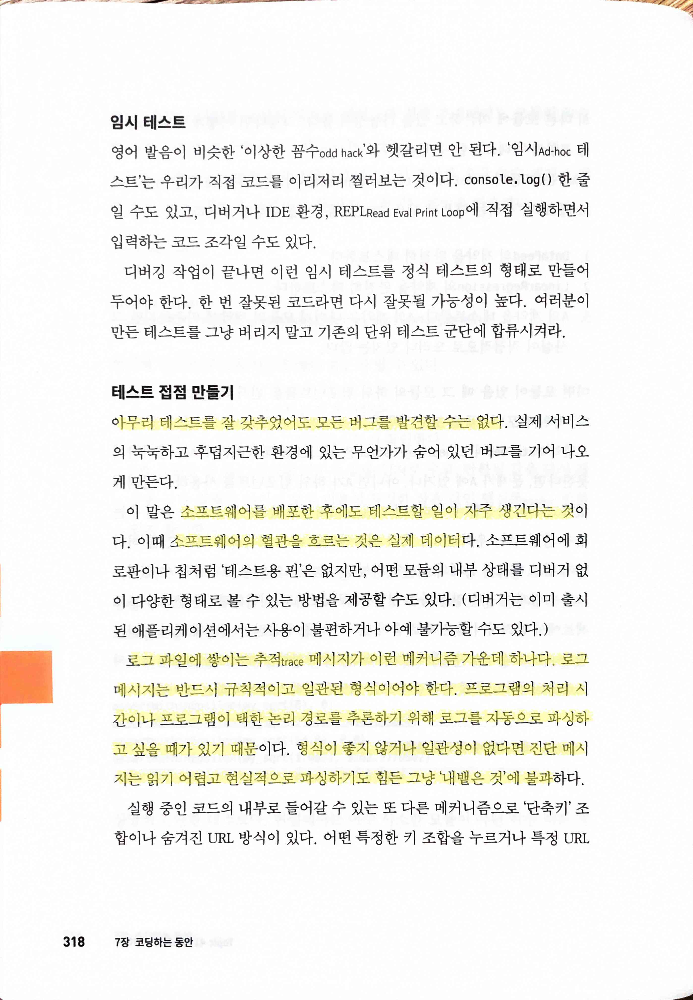

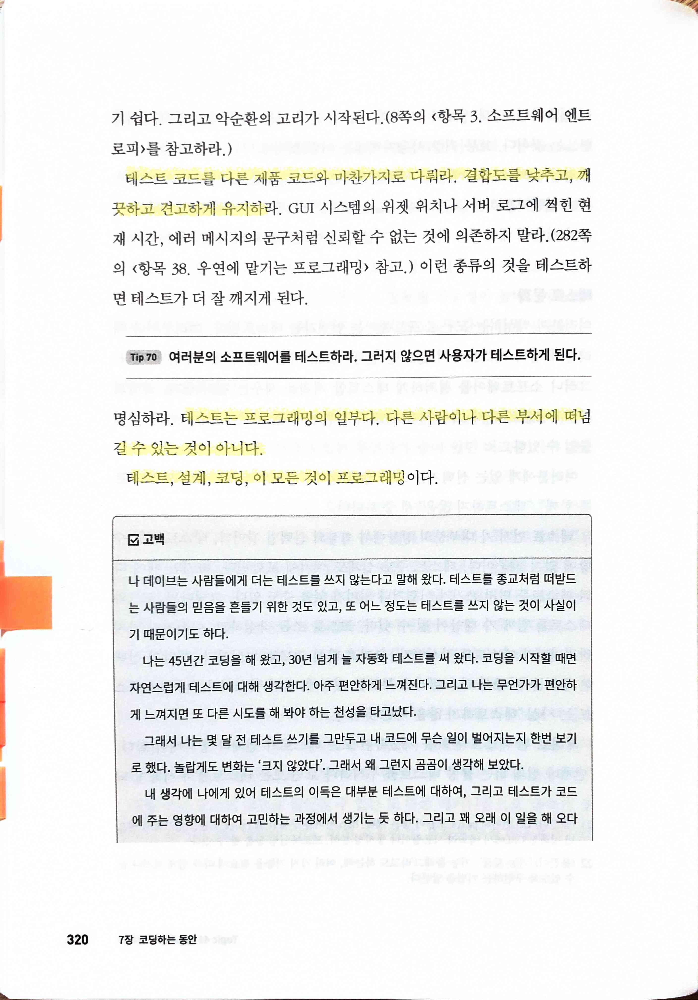

- p318, p320
    - `아무리 테스트를 잘 갖추었어도 모든 버그를 발견할 수는 없다`
        - `소프트웨어를 배포한 후에도 테스트할 일이 자주 생긴다는 것… 소프트웨어의 혈관을 흐르는 것은 실제 데이터`
        - `로그 파일에 쌓이는 추적 trace 메시지가 이런 메커니즘 가운데 하나다. 로그 메시지는 반드시 규칙적이고 일관된 형식이어야 한다. 프로그램의 처리 시간이나 프로그램이 택한 논리 경로를 추론하기 위해 로그를 자동으로 파싱하고 싶을 때가 있기 때문… 형식이 좋지 않거나 일관성이 없다면 진단 메시지는 읽기 어렵고 현실적으로 파싱하기도 힘든 그냥 ‘내뱉은 것’에 불과`
    - `테스트 코드를 다른 제품 코드와 마찬가지로 다뤄라. 결합도를 낮추고, 깨끗하고 견고하게 유지하라`
        - `테스트는 프로그래밍의 일부다. 다른 사람이나 다른 부서에 떠넘길 수 있는 것이 아니다`
        - `테스트, 설계, 코딩, 이 모든 것이 프로그래밍`

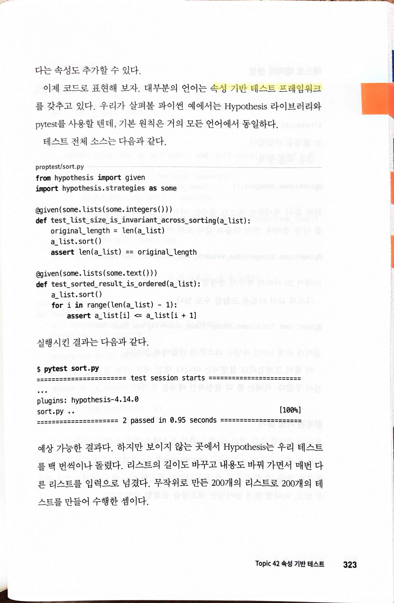

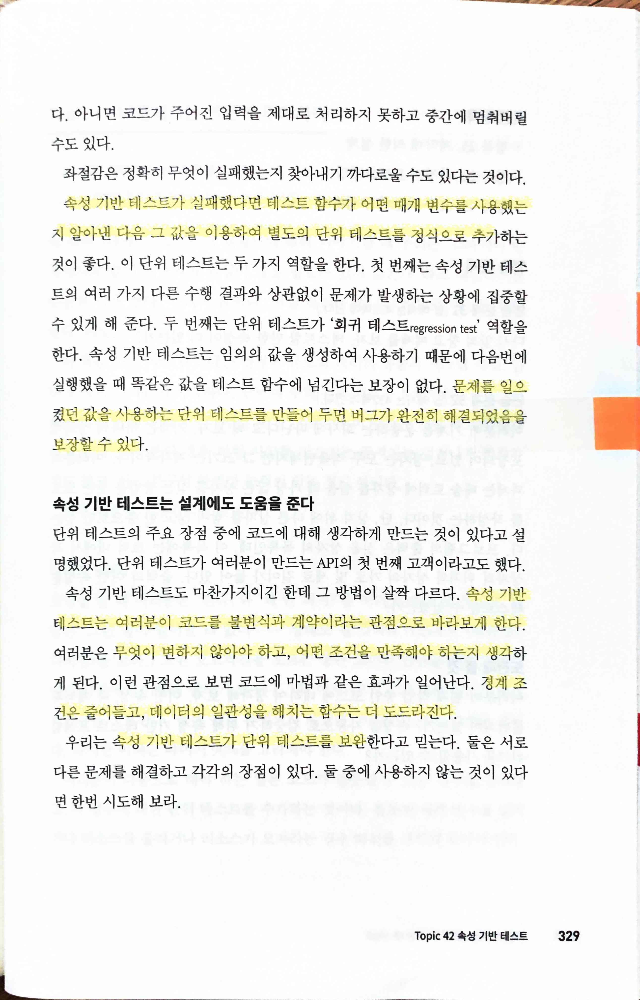

- p323, p329
    - `속성 기반 테스트 프레임워크` e.g. [https://github.com/hyunjun/practice/blob/master/python/test-hypothesis/sort.py](https://github.com/hyunjun/practice/blob/master/python/test-hypothesis/sort.py)
    - `속성 기반 테스트가 실패했다면 테스트 함수가 어떤 매개 변수를 사용했는지 알아낸 다음 그 값을 이용하여 별도의 단위 테스트를 정식으로 추가… 문제를 일으켰던 값을 사용하는 단위 테스트를 만들어 두면 버그가 완전히 해결되었음을 보장할 수 있다`
        - [효율적인 테스트 코드 작성법 - YouTube](https://www.youtube.com/watch?v=gs1qM1TF5zA)에서 비슷한 맥락의 이야기를 볼 수 있다
        - `속성 기반 테스트는 여러분이 코드를 불변식과 계약이라는 관점으로 바라보게 한다… 무엇이 변하지 않아야 하고, 어떤 조건을 만족해야 하는지 생각… 경계 조건은 줄어들고, 데이터의 일관성을 해치는 함수는 더 도드라진다`
        - `속성 기반 테스트가 단위 테스트를 보완`

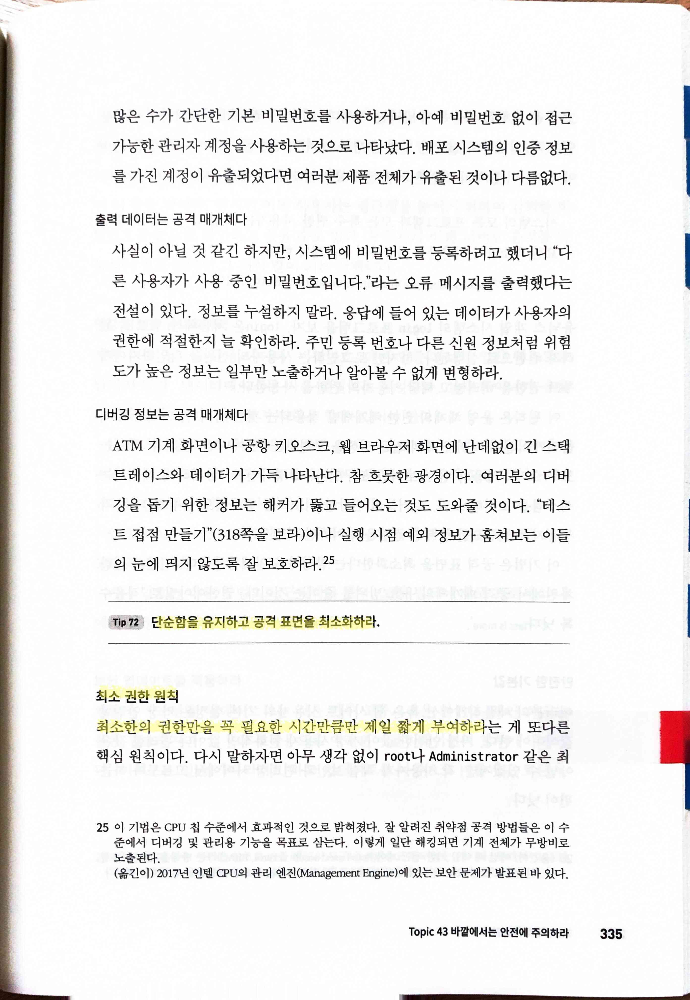

- `단순함을 유지하고 공격 표면을 최소화하라`
    - `최소 권한 원칙`
    - `최소한의 권한만을 꼭 필요한 시간만큼만 제일 짧게 부여하라`

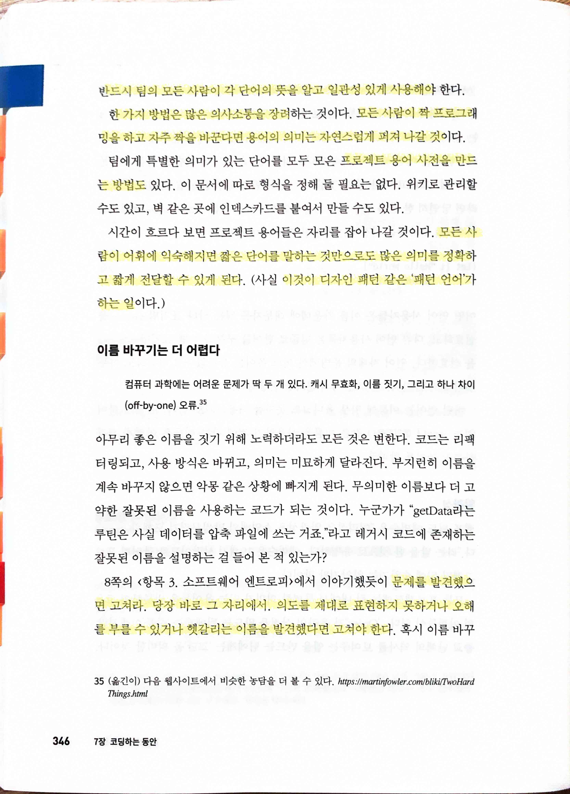

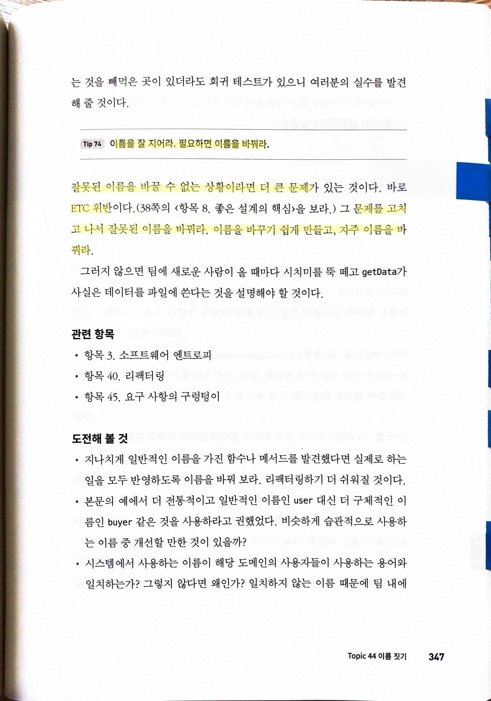

- pp346~347
    - `반드시 팀의 모든 사람이 각 단어의 뜻을 알고 일관성 있게 사용해야`
        - `한 가지 방법은 많은 의사소통을 장려… 모든 사람이 짝 프로그래밍을 하고 자주 짝을 바꾼다면 용어의 의미는 자연스럽게 퍼져 나갈 것`
        - `프로젝트 용어 사전을 만드는 방법도`
        - `모든 사람이 어휘에 익숙해지면 짧은 단어를 말하는 것만으로도 많은 의미를 정확하고 짧게 전달할 수 있게 된다(이것이 디자인 패턴 같은 ‘패턴 언어’가 하는 일)`
    - `문제를 발견했으면 고쳐라. 당장 바로 그 자리에서. 의도를 제대로 표현하지 못하거나 오해를 부를 수 있거나 헷갈리는 이름을 발견했다면 고쳐야 한다`
        - `이름을 잘 지어라. 필요하면 이름을 바꿔라`
        - `잘못된 이름을 바꿀 수 없는 상황이라면 더 큰 문제… ETC 위반… 문제를 고치고 나서 잘못된 이름을 바꿔라. 이름을 바꾸기 쉽게 만들고, 자주 이름을 바꿔라`

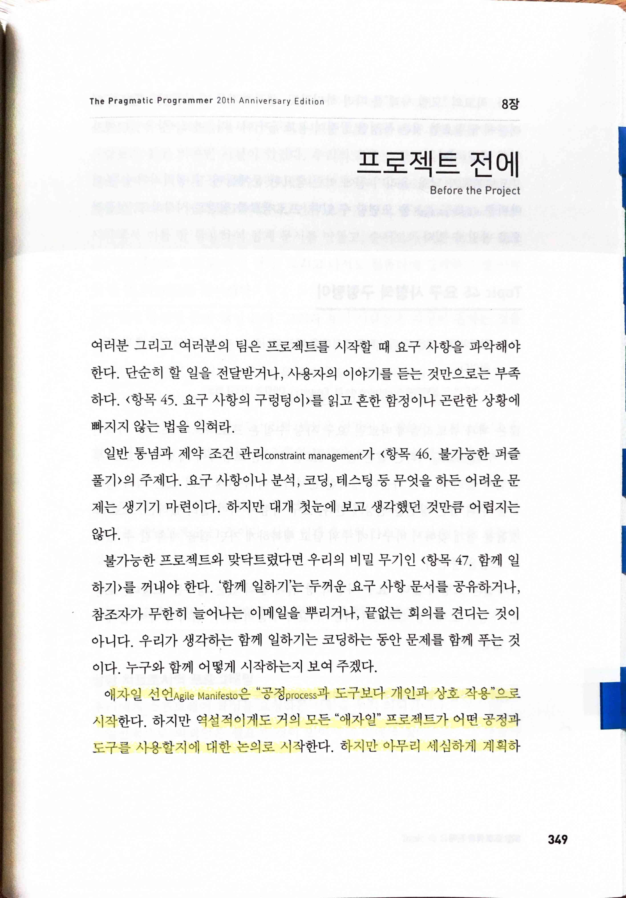

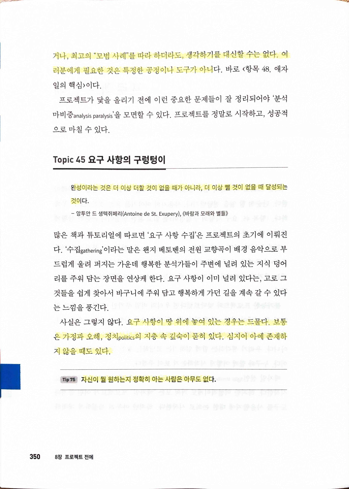

- pp349~350
    - `애자일 선언 Agile Manifesto은 “공정 process과 도구보다 개인과 상호 작용”으로 시작… 역설적이게도 거의 모든 “애자일” 프로젝트가 어떤 공정과 도구를 사용할지에 대한 논의로 시작… 하지만 아무리 세심하게 계획하건, 최고의 “모범 사례”를 따라 하더라도, 생각하기를 대신할 수는 없다. 여러분에게 필요한 것은 특정한 공정이나 도구가 아니다`
    - `완성이라는 것은 더 이상 더할 것이 없을 때가 아니라, 더 이상 뺄 것이 없을 때 달성되는 것이다 - 앙투안 드 생텍쥐베리(Antoine de St. Exupery), 바람과 모래와 별들`
    - `요구 사항이 땅 위에 놓여 있는 경우는 드물다. 보통은 가정과 오해, 정치 politics의 지층 속 깊숙이 묻혀 있다. 심지어 아예 존재하지 않을 때도 있다`
    - 자신이 뭘 원하는지 정확히 아는 사람은 아무도 없다

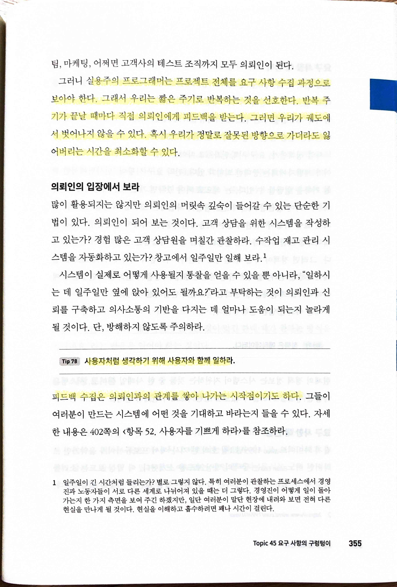

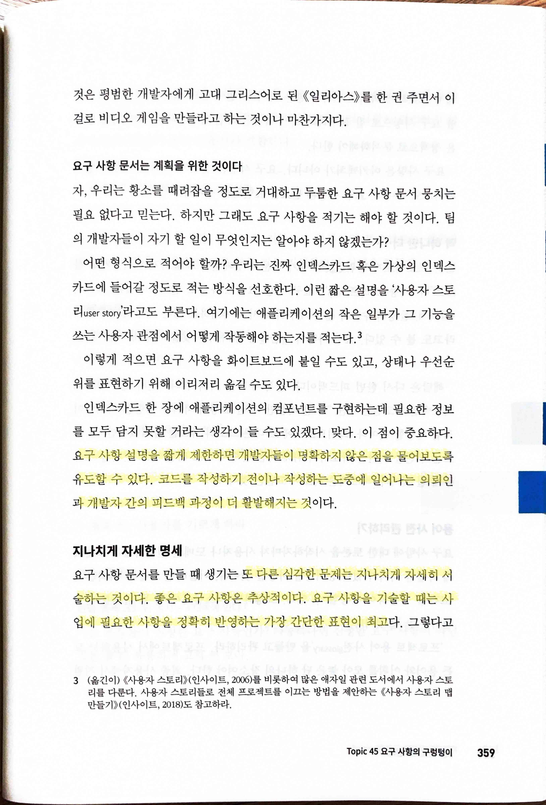

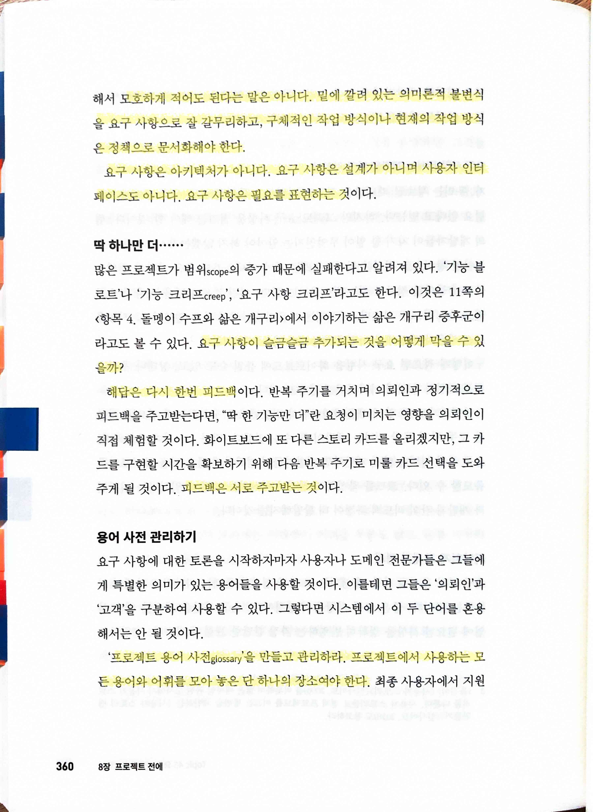

- p355, pp359~360
    - `실용주의 프로그래머는 프로젝트 전체를 요구 사항 수집 과정으로 보아야 한다. 그래서 우리는 짧은 주기로 반복하는 것을 선호한다. 반복 주기가 끝날 때마다 직접 의뢰인에게 피드백을 받는다. 그러면 우리가 궤도에서 벗어나지 않을 수 있다. 혹시 우리가 정말로 잘못된 방향으로 가더라도 잃어버리는 시간을 최소화할 수 있다`
        - `사용자처럼 생각하기 위해 사용자와 함께 일하라`
        - `피드백 수집은 의뢰인과의 관계를 쌓아 나가는 시작점이기도 하다`
    - `요구 사항 설명을 짧게 제한하면 개발자들이 명확하지 않은 점을 물어보도록 유도할 수 있다. 코드를 작성하기 전이나 작성하는 도중에 일어나는 의뢰인과 개바자 간의 피드백 과정이 더 활발해지는 것`
    - `또 다른 심각한 문제는 지나치게 자세히 서술하는 것이다. 좋은 요구 사항은 추상적이다. 요구 사항을 기술할 때는 사업에 필요한 사항을 정확히 반영하는 가장 간단한 표현이 최고…모호하게 적어도 된다는 말은 아니다. 밑에 깔여 있는 의미론적 불변식을 요구 사항으로 잘 갈무리하고, 구체적인 작업 방식이나 현재의 작업 방식은 정책으로 문서화해야 한다`
        - `요구 사항은 아키텍처가 아니다. 요구 사항은 설계가 아니며 사용자 인터페이스도 아니다. 요구 사항은 필요를 표현하는 것`
    - `요구 사항이 슬금슬금 추가되는 것을 어떻게 막을 수 있을까?`
        - `해답은 다시 한번 피드백… 피드백은 서로 주고 받는 것`
    - `‘프로젝트 용어 사전 glossary’을 만들고 관리하라. 프로젝트에서 사용하는 모든 용어와 어휘를 모아 놓은 단 하나의 장소여야 한다`

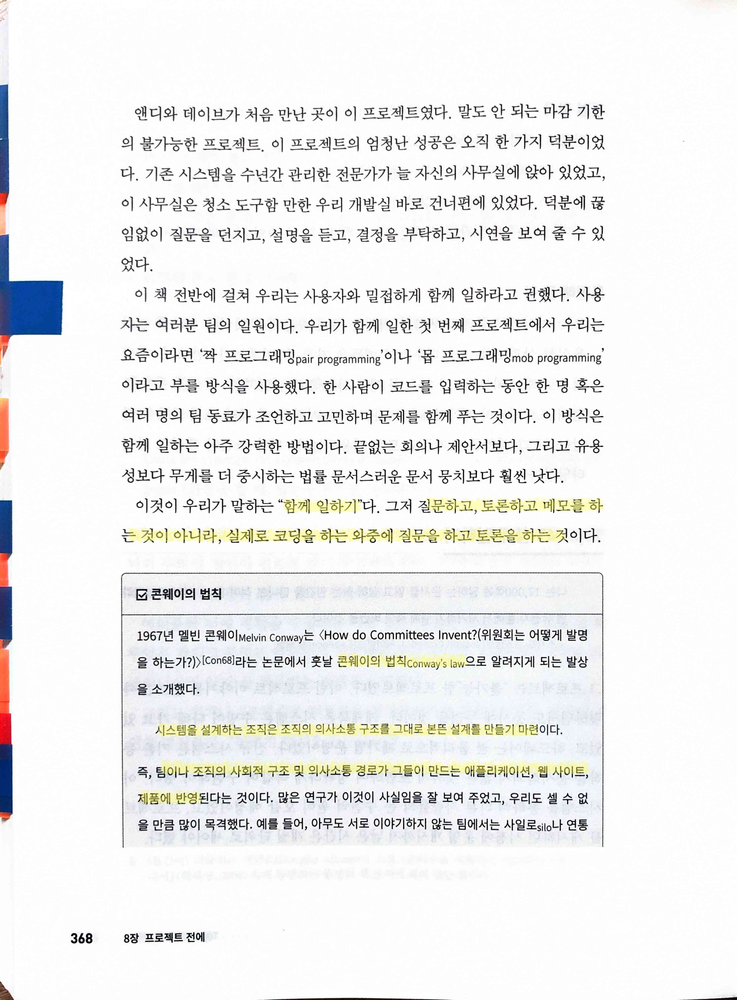

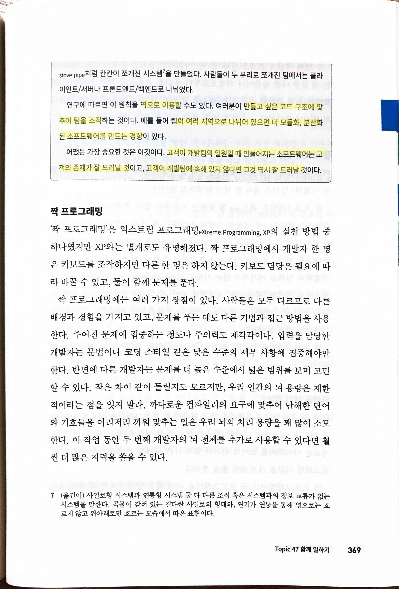

- pp368~396
    - `“함께 일하기”… 질문하고, 토론하고 메모를 하는 것이 아니라, 실제로 코딩을 하는 와중에 질문을 하고 토론을 하는 것`
    - `콘웨이의 법칙 Conway’s law`
        - `시스템을 설계하는 조직은 조직의 의사소통 구조를 그대로 본뜬 설계를 만들기 마련`
        - `팀이나 조직의 사회적 구조 및 의사소통 경로가 그들이 만드는 애플리케이션, 웹 사이트, 제품에 반영`
        - `역으로 이용… 만들고 싶은 코드 구조에 맞추어 팀을 조직… 팀이 여러 지역으로 나뉘어 있으면 더 모듈화, 분산화된 소프트웨어를 만드는 경향`
        - `고객이 개발팀의 일원일 때 만들어지는 소프트웨어는 고객의 존재가 잘 드러날 것… 고객이 개발팀에 속해 있지 않다면 그것 역시 잘 드러날 것`

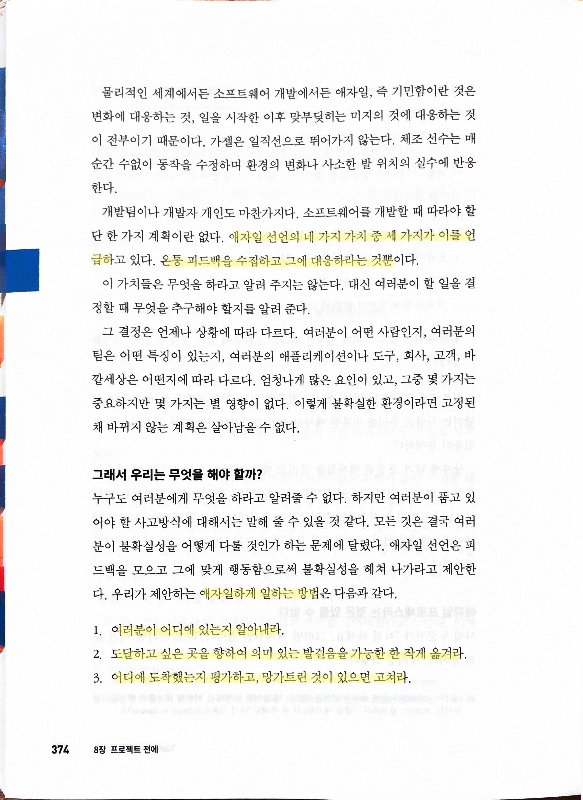

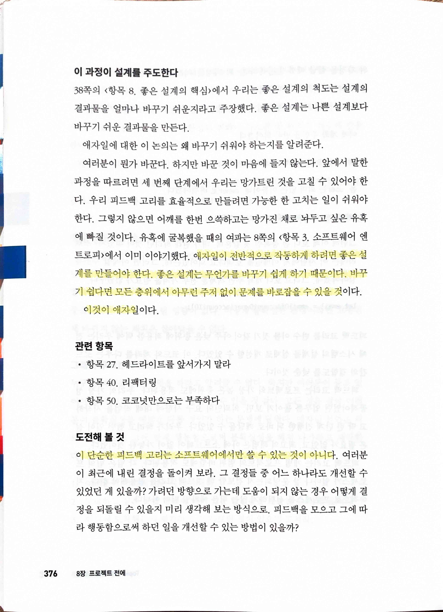

- p374, p376
    - `애자일 선언의 네 가지 가치 중 세 가지가 이를 언급… 온통 피드백을 수집하고 그에 대응하라는 것뿐`
    - `애자일하게 일하는 방법`
        1. `여러분이 어디에 있는지 알아내라`
        2. `도달하고 싶은 곳을 향하여 의미 있는 발걸음을 가능한 한 작게 옮겨라`
        3. `어디에 도착했는지 평가하고, 망가트린 것이 있으면 고쳐라`
    - `애자일이 전반적으로 작동하게 하려면 좋은 설계를 만들어야 한다. 좋은 설계는 무언가를 바꾸기 쉽게 하기 때문이다. 바꾸기 쉽다면 모든 층위에서 아무런 주저 없이 문제를 바로잡을 수 있을 것`
        - `이것이 애자일`
    - `이 단순한 피드백 고리는 소프트웨어에서만 쓸 수 있는 것이 아니다`

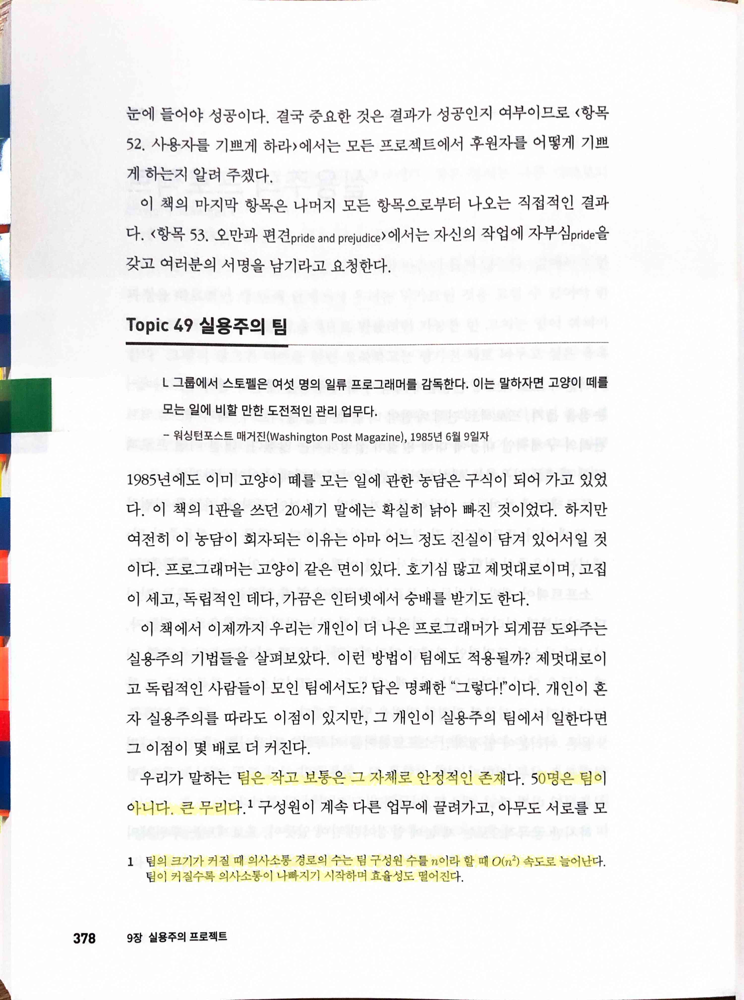


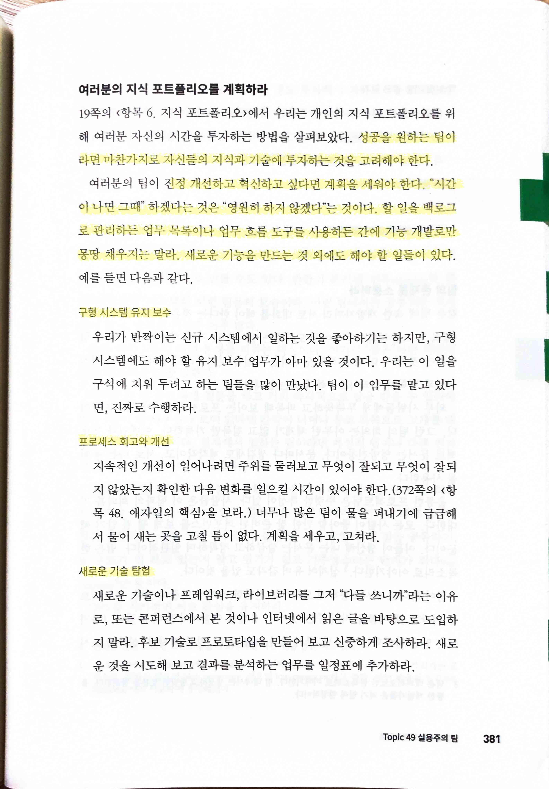

- p378, p380, p381
    - `팀은 작고 보통은 그 자체로 안정적인 존재… 50명은 팀이 아니다. 큰 무리`
        - `팀의 크기가 커질 때 의사소통 경로의 수는 팀 구성원 수를 n이라 할 때 O(n^2) 속도로 늘어난다. 팀이 커질수록 의사소통이 나빠지기 시작하며 효율성도 떨어진다`
    - `팀은 개인보다 더 삶은 개구리가 되기 쉽다. 사람들은 누군가가 문제를 처리하겠거니 생각하거나, 사용자가 요청한 변경 사항을 팀 리더가 이미 동의했겠거니 하고 여긴다`
        - `새 요구사항에 대한 수치를 관리하라. 이미 일어난 변화를 거부할 필요는 없다. 단지 그런 일이 벌어지고 있다는 것을 파악하고 있으면 된다.`
        - `“번다운(burndown) 차트”보다 “번업(burnup) 차트”가 더 낫다. 번업 차트가 있으면 추가 요구 사항이 어떻게 목표 지점을 옮겼는지 명확하게 볼 수 있다.`
            - `번다운 차트는 마일스톤까지 남은 작업의 양을 표시… 번업 차트는 전체 작업량과 완료한 작업량을 따로따로 표시`
            - `마일스톤을 완료했을 때 번다운 차트에서는 남은 작업량 그래프가 X축과 만나고, 번업 차트에서는 전체 작업량과 완료한 작업량이 만난다`
    - `성공을 원하는 팀이라면 마찬가지로 자신들의 지식과 기술에 투자하는 것을 고려해야 한다`
        - `진정 개선하고 혁신하고 싶다면 계획을 세워야 한다. “시간이 나면 그때” 하겠다는 것은 “영원히 하지 않겠다”는 것이다. 할 일을 백로그로 관리하든 업무 목록이나 업무 흐름 도구를 사용하든 간에 기능 개발로만 몽땅 채우지는 말라. 새로운 기능을 만드는 것 외에도 해야 할 일들이 있다`
        - `구형 시스템 유지 보수`
        - `프로세스 회고와 개선`
        - `새로운 기술 탐험`

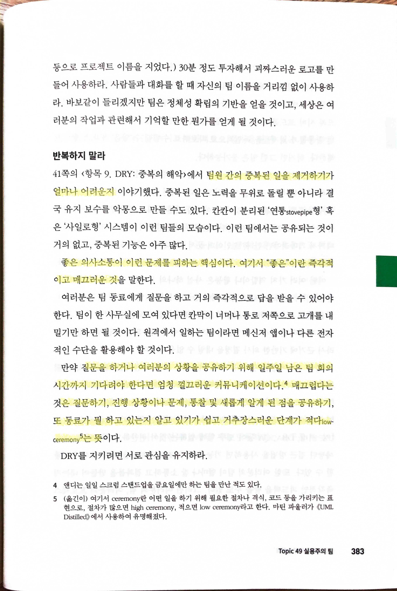

- `팀원 간의 중복된 일을 제거하기가 얼마나 어려운지`
    - `좋은 의사소통이 이런 문제를 피하는 핵심이다. 여기서 “좋은”이란 즉각적이고 매끄러운 것`
    - `질문을 하거나 여러분의 상황을 공유하기 위해 일주일 남은 팀 회의 시간까지 기다려야 한다면 엄청 껄끄러운 커뮤니케이션이다. 매끄럽다는 것은 질문하기, 진행 상황이나 문제, 통찰 및 새롭게 알게 된 점을 공유하기, 또 동료가 뭘 하고 있는지 알고 있기기 쉽고 거추장스러운 단계가 적다 low-ceremony`

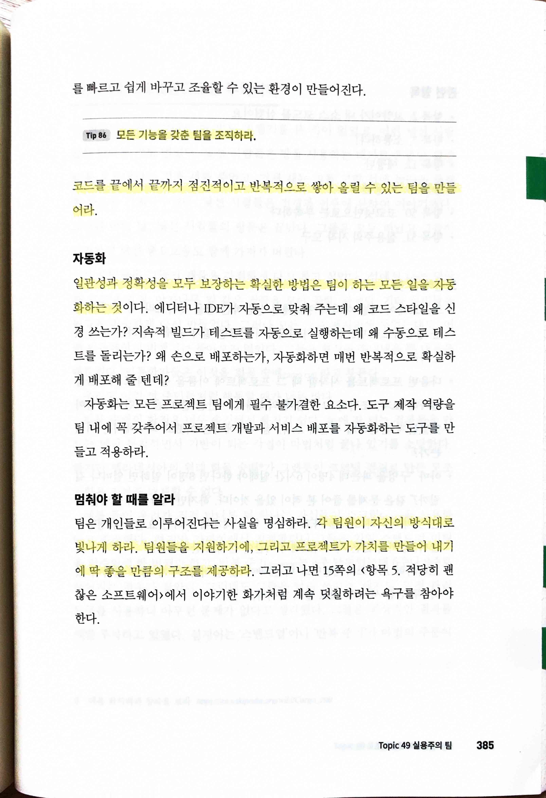

- p385
    - `모든 기능을 갖춘 팀을 조직하라`
        - `코드를 끝에서 끝까지 점진적이고 반복적으로 쌓아 올릴 수 있는 팀을 만들어라`
            - 내가 팀을 vetical로 구성하고 싶은 이유
    - `일관성과 정확성을 모두 보장하는 확실한 방법은 팀이 하는 모든 일을 자동화하는 것`
    - `각 팀원이 자신의 방식대로 빛나게 하라. 팀원들을 지원하기에, 그리고 프로젝트가 가치를 만들어 내기에 딱 좋을 만큼의 구조를 제공하라`


- `유행하는 것이 아니라 실제로 잘 맞는 것을 사용하라`
    - `“잘 맞는 것”을 어떻게 알 수 있을까?`
    - `한번 해 보라`
    - `작은 팀 하나나 조직 하나에서 아이디어를 시험해 보라. 잘 맞는 것 같은 좋은 부분만 유지하고 나머지는 낭비나 비용일 뿐이므로 버리면 된다`
        - 하지만 그걸 팀이 거부하면? e.g. bug report 같은 문서화와 관련된 부분, review에서 demo를 넣는 부분 등…

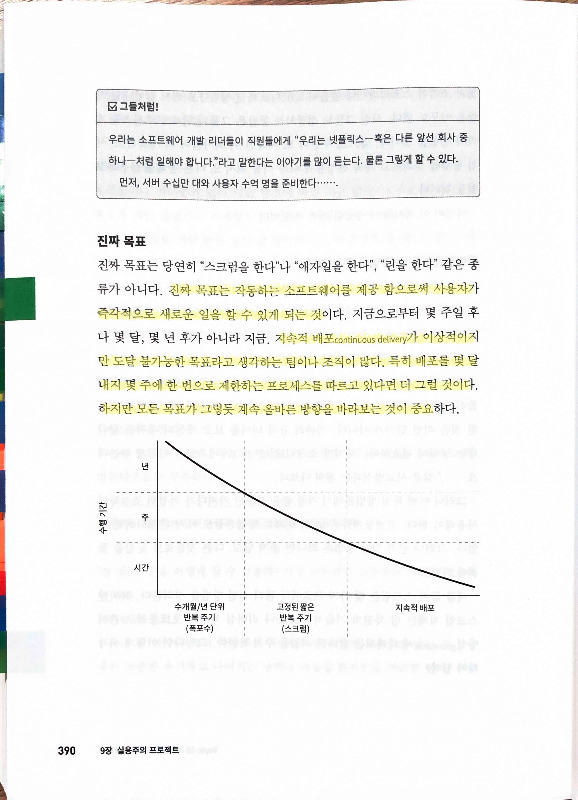

- `진짜 목표는 작동하는 소프트웨어를 제공 함으로써 사용자가 즉각적으로 새로운 일을 할 수 있게 되는 것… 지속적 배포 continuous delivery가 이상적이지만 도달 불가능한 목표라고 생각하는 팀이나 조직이 많다. 특히 배포를 몇 달 내지 몇 주에 한 번으로 제한하는 프로세스를 따르고 있다면 더 그럴 것이다. 하지만 모든 목표가 그렇듯 계속 올바른 방향을 바라보는 것이 중요`

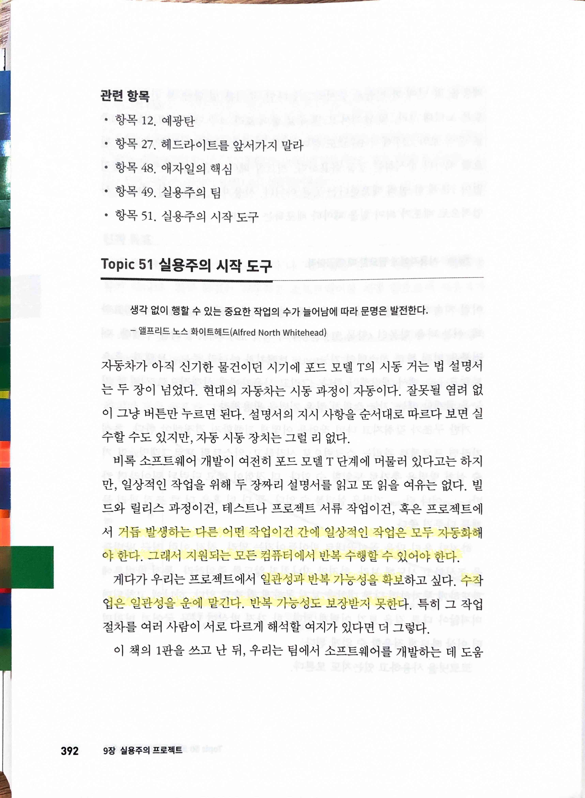

- p392
    - `거듭 발생하는 다른 어떤 작업이건 간에 일상적인 작업은 모두 자동화해야 한다. 그래서 지원되는 모든 컴퓨터에서 반복 수행할 수 있어야 한다`
    - `일관성과 반복 가능성을 확보… 수작업은 일관성을 운에 맡긴다. 반복 가능성도 보장받지 못한다`

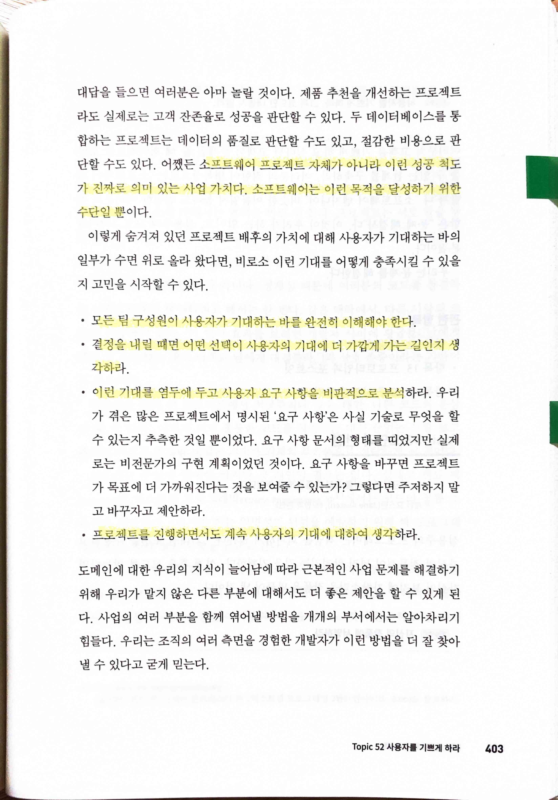

- p403
    - `소프트웨어 프로젝트 자체가 아니라 이런 성공 척도가 진짜로 의미 있는 사업 가치다. 소프트웨어는 이런 목적을 달성하기 위한 수단일 뿐`
        - `모든 팀 구성원이 사용자가 기대하는 바를 완전히 이해해야 한다`
        - `결정을 내릴 때면 어떤 선택이 사용자의 기대에 더 가깝게 가는 길인지 생각하라`
        - `이런 기대를 염두에 두고 사용자 요구 사항을 비판적으로 분석`
        - `프로젝트를 진행하면서도 계속 사용자의 기대에 대하여 생각`
    - 놀랍게도(?) Amazon의 customer obsession과 같은 이야기 아닌가?

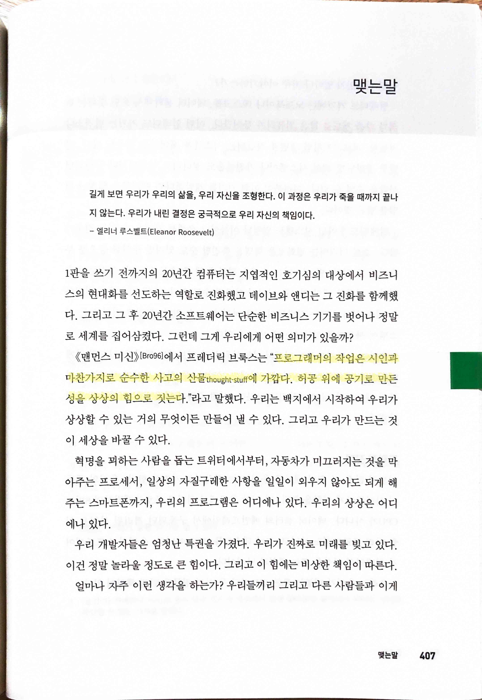

- `프로그래머의 작업은 시인과 마찬가지로 순수한 사고의 산물 thought-stuff에 가깝다. 허공 위에 공기로 만든 성을 상상의 힘으로 짓는다`
