# 기계의 반칙

Tags: artificial-intelligence
Date: March 9, 2024
Score: ★★★☆☆

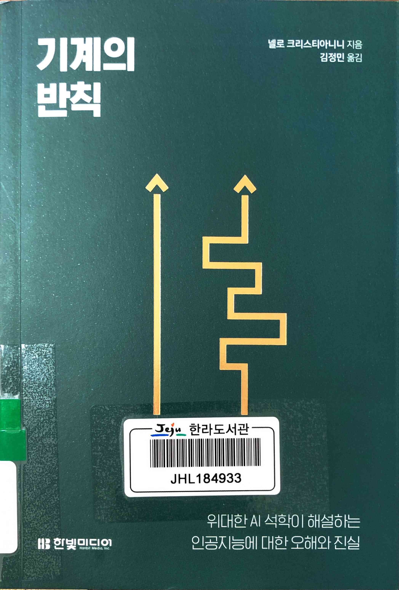

- [기계의 반칙](https://www.hanbit.co.kr/media/books/book_view.html?p_code=B5439705429)
    - ★★★☆☆ March 9, 2024  (기술 자체에 대한 책은 아니고) 지능형 agent를 중심으로 한 역사와 함께 신뢰할 수 있는 AI가 필요하다고 이야기
    - 한라 004.73-크298ㄱ
    - [리뷰 기계의 반칙 · TheoryDB](https://theorydb.github.io/review/2023/12/24/review-book-the-shortcut/)

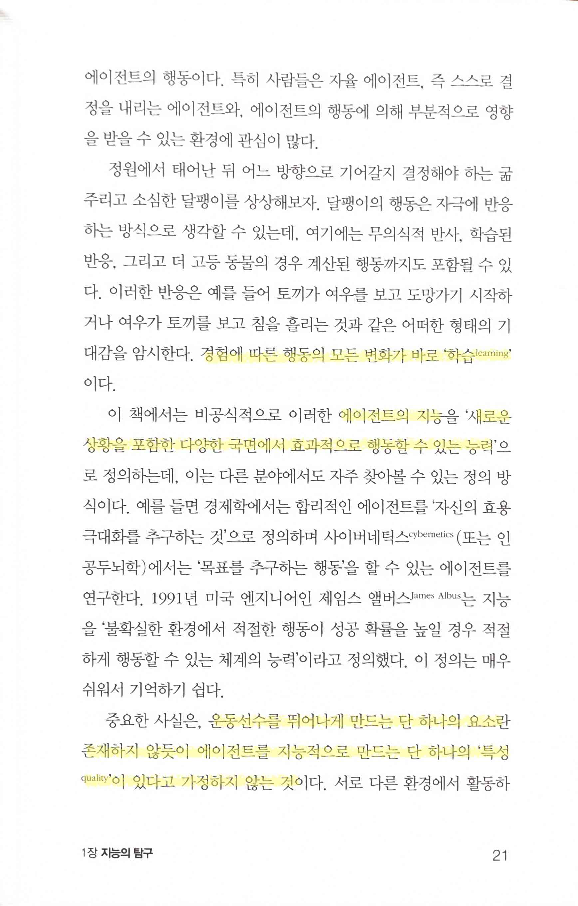

> 경험에 따른 행동의 모든 변화가 바로 ‘학습 Learning’
에이전트의 지능 ‘새로운 상황을 포함한 다양한 국면에서 효과적으로 행동할 수 있는 능력’
운동선수를 뛰어나게 만드는 단 하나의 요소란 존재하지 않듯이 에이전트를 지능적으로 만드는 단 하나의 ‘특성 quality’이 있다고 가정하지 않는 것
> 

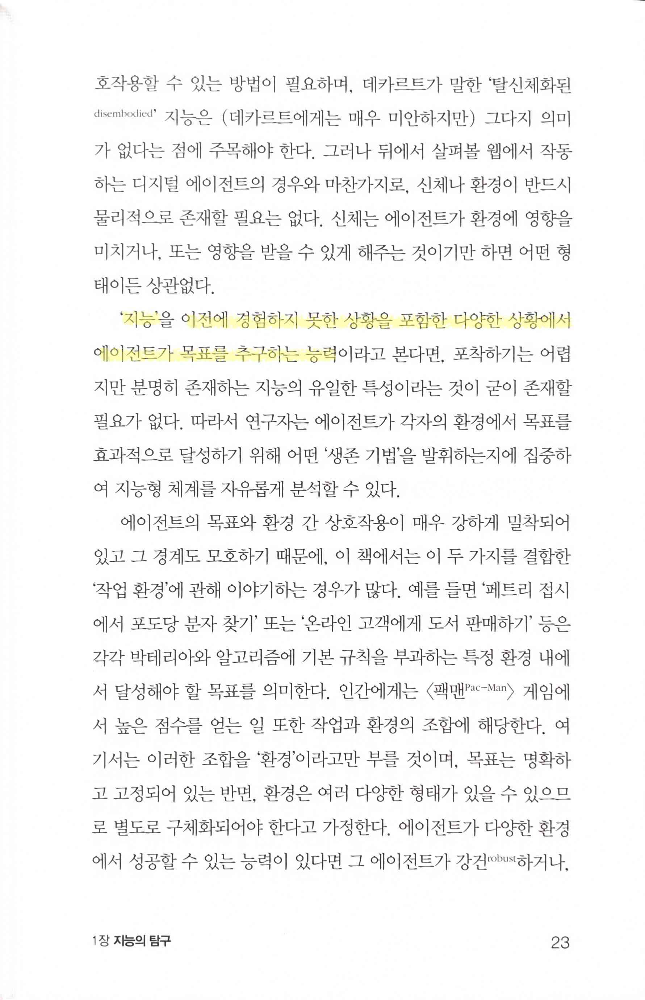

> ‘지능’ 이전에 경험하지 못한 상황을 포함한 다양한 상황에서 에이전트가 목표를 추구하는 능력
> 

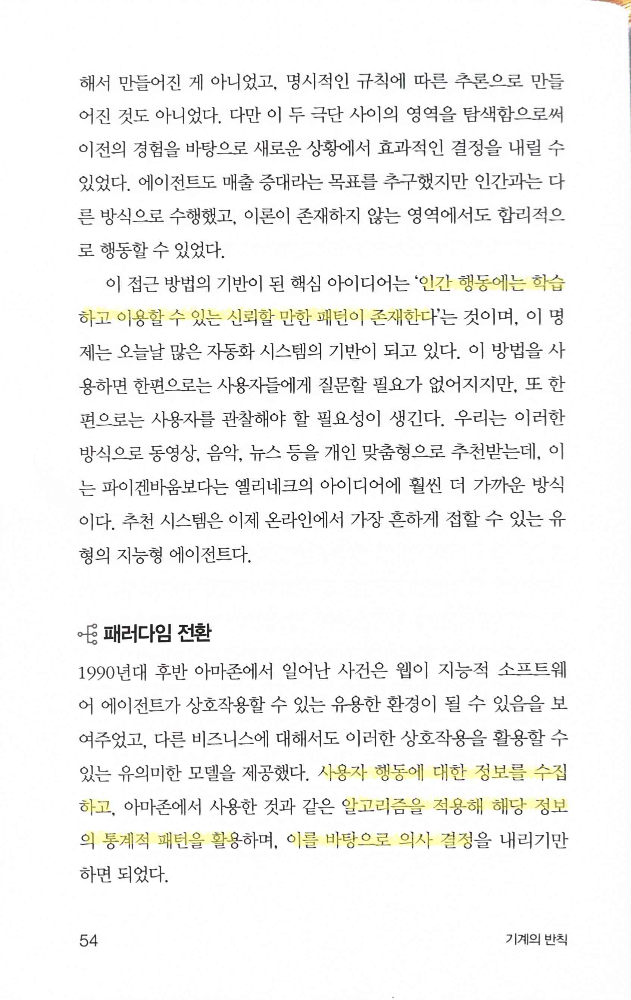

> ‘인간 행동에는 학습하고 이용할 수 있는 신뢰할 만한 패턴이 존재한다’
사용자 행동에 대한 정보를 수집하고,… 알고리즘을 적용해 해당 정보의 통계적 패턴을 활용하며, 이를 바탕으로 의사 결정
> 

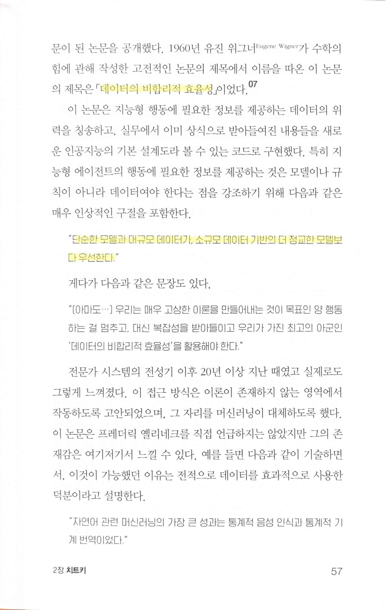

> ‘데이터의 비합리적 효율성’… “단순한 모델과 대규모 데이터가 소규모 데이터 기반의 더 정교한 모델보다 우선한다”
> 
> - [https://www.maths.ed.ac.uk/~v1ranick/papers/wigner.pdf](https://www.maths.ed.ac.uk/~v1ranick/papers/wigner.pdf)

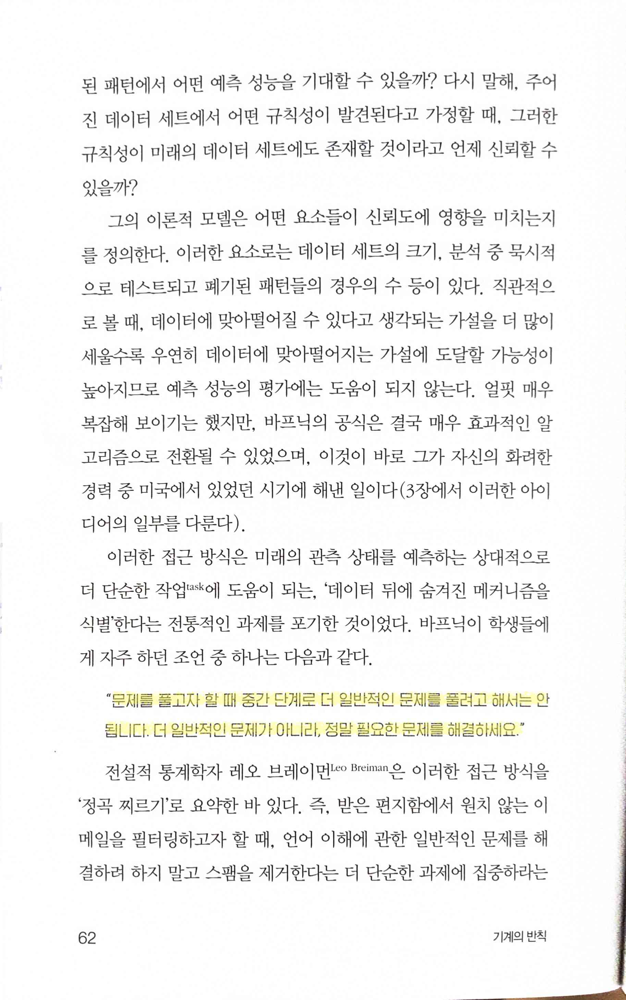

> “문제를 풀고자 할 때 중간 단계로 더 일반적인 문제를 풀려고 해서는 안 됩니다. 더 일반적인 문제가 아니라, 정말 필요한 문제를 해결하세요.”
결국 중요한 것은 에이전트의 행동… 일반적인 문제를 해결하려 하는 대신 에이전트의 행동이 추천, 분류, 또는 번역이 되도록 집중해야
> 
> - 연구에서도 product/service를 만들 때도 가장 중요한 건 정말 필요한 수요가 있는 문제에 집중해서 해결하는 일

> ‘조사 대상이 되는 세스템 자체를 이해하기보다는, 그 시스템이 앞으로 무슨 일을 할지 예측하기만 해도 충분할 수 있다’
> 

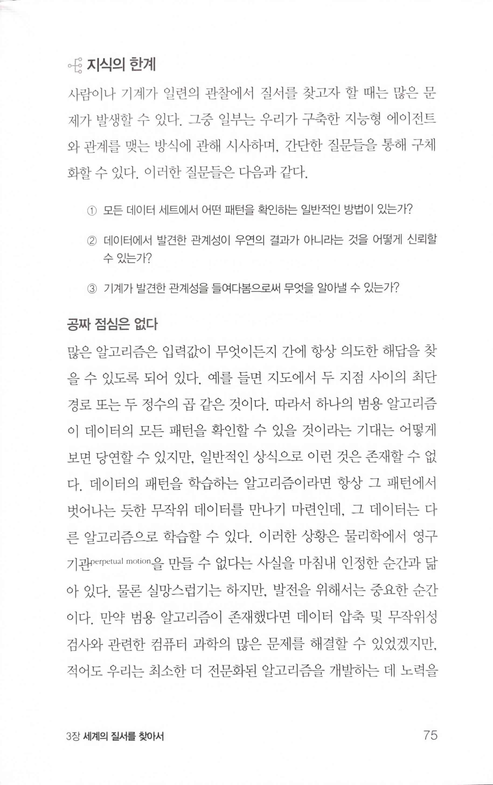

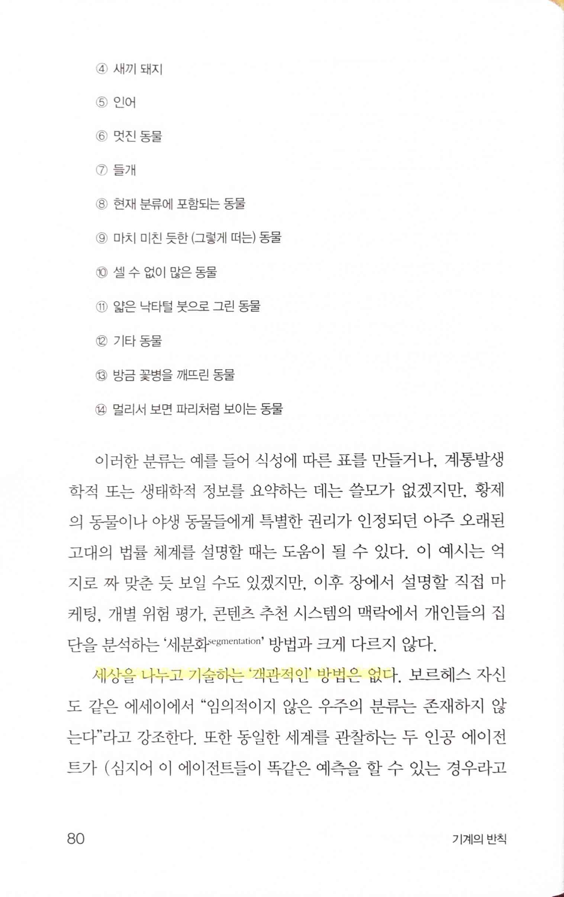

> 세상을 나누고 기술하는 ‘객관적인’ 방법은 없다
> 

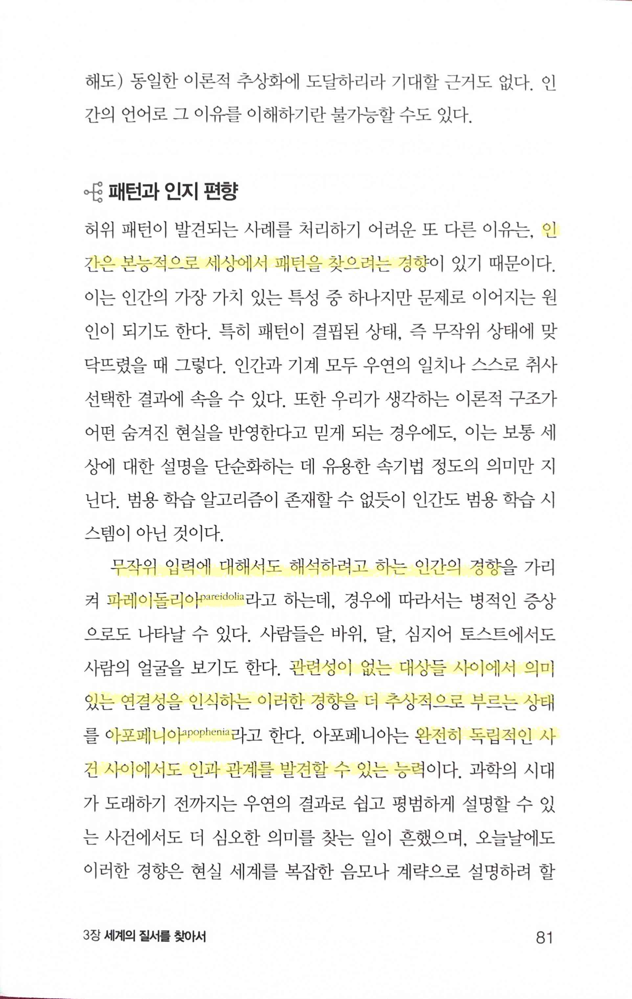

> 인간은 본능적으로 세상에서 패턴을 찾으려는 경향
파레이돌리아 pareidolia 무작위 입력에 대해서도 해석하려고 하는 인간의 경향
> 
> - [파레이돌리아 - 위키백과, 우리 모두의 백과사전](https://ko.wikipedia.org/wiki/%ED%8C%8C%EB%A0%88%EC%9D%B4%EB%8F%8C%EB%A6%AC%EC%95%84)
> 
> 아포페니아 apophenia 관련성이 없는 대상들 사이에서 의미있는 연결성을 인식하는 이러한 경향을 더 추상적으로 부르는 상태… 완전히 독립적인 사건 사이에서도 인과 관계를 발견할 수 있는 능력
> 
> - [아포페니아 - 위키백과, 우리 모두의 백과사전](https://ko.wikipedia.org/wiki/%EC%95%84%ED%8F%AC%ED%8E%98%EB%8B%88%EC%95%84)

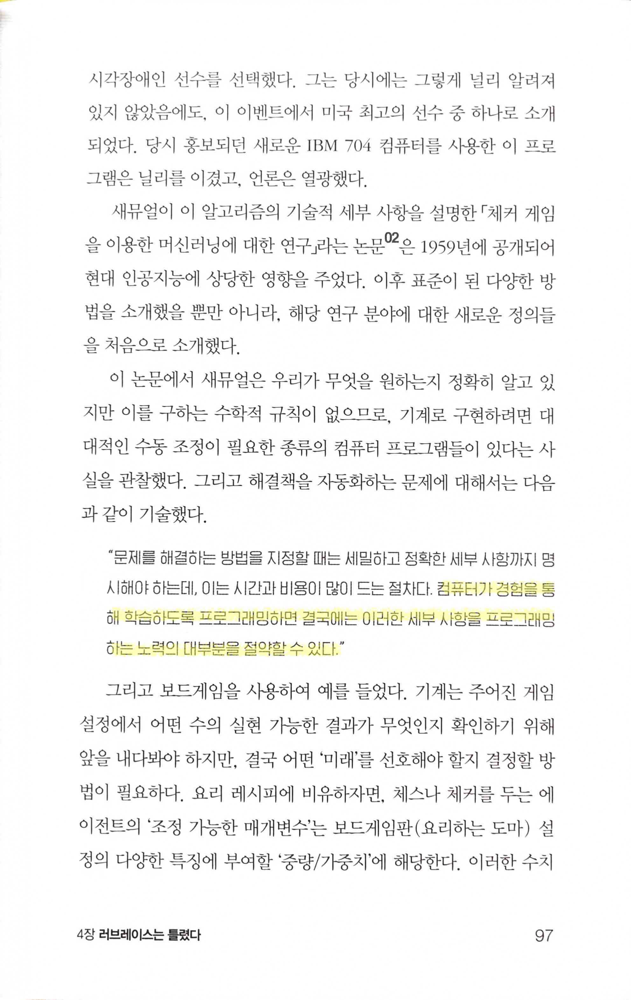

> 컴퓨터가 경험을 통해 학습하도록 프로그래밍하면 결국에는 이러한 세부 사항을 프로그래밍하는 노력의 대부분을 절약할 수 있다
> 
> - 이게 극한으로 가면 AGI가 되는 방향인가?

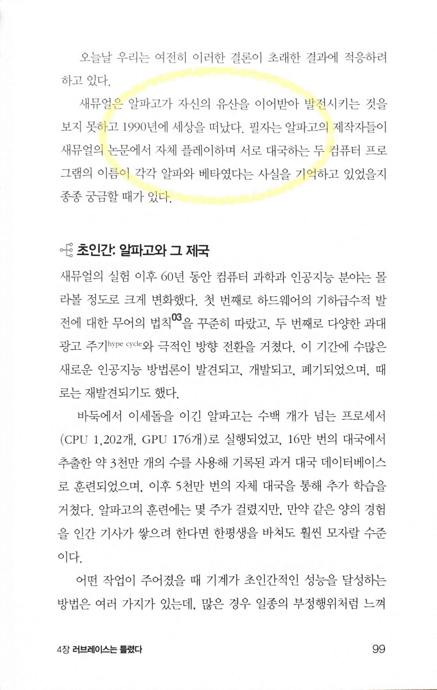

- alpha와 beta의 유래 [http://incompleteideas.net/papers/samuel.pdf](http://incompleteideas.net/papers/samuel.pdf)
    - `After a number of relatively unsuccessful attempts  to have the  program generalize while playing both sides of the game, the  program was arranged  to act  as  two dif- ferent players, for convenience called Alpha and Beta.`

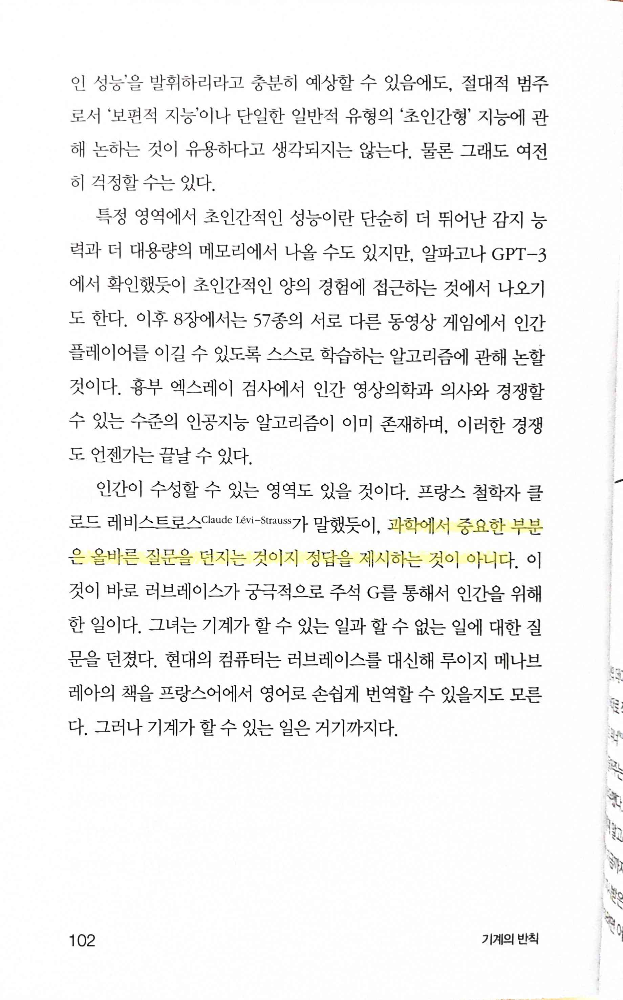

> 과학에서 중요한 부분은 올바른 질문을 던지는 것이지 정답을 제시하는 것이 아니다
> 
> - 세상의 많은 일들이 그렇다. 특히 뭔가 방향을 정하고 추진을 할 때 더욱 그렇다.

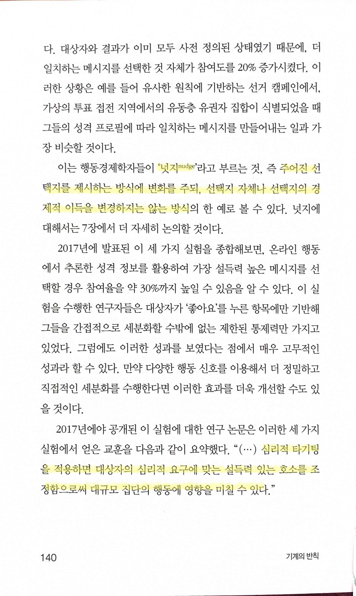

> ‘넛지 nudge’ 즉 주어진 선택지를 제시하는 방식에 변화를 주되, 선택지 자체나 선택지의 경제적 이득을 변경하는지는 않는 방식
심리적 타기팅을 적용하면 대상자의 심리적 요구에 맞는 설득력 있는 호소를 조정함으로써 대규모 집단의 행동에 영향을 미칠 수 있다
> 

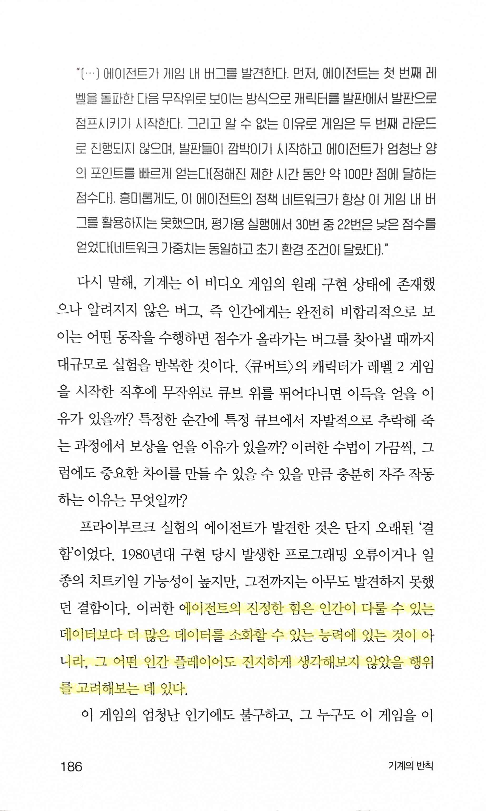

> 에이전트의 진정한 힘은 인간이 다룰 수 있는 데이터보다 더 많은 데이터를 소화할 수 있는 능력에 있는 것이 아니라, 그 어떤 인간 플레이어도 진지하게 생각해보지 않았을 행위를 고려해보는 데 있다
> 
> - 인간은 당연히 한정된 resource안에서 효율적인 선택을 해야 하기 때문에 취사선택을 하는 건데, 에이전트는 그걸 인간보다 훨씬 대량으로 할 수 있으니 취사선택할 필요가 없어서 인간이 선택하지 않을 법한 것도 하는 게 아닌가? 그러면 어느 쪽이 진정한 힘인지 나는 선뜻 선택하지는 못하겠다
