소프트웨어 장인 :프로페셔널리즘/실용주의/자부심
===============================================
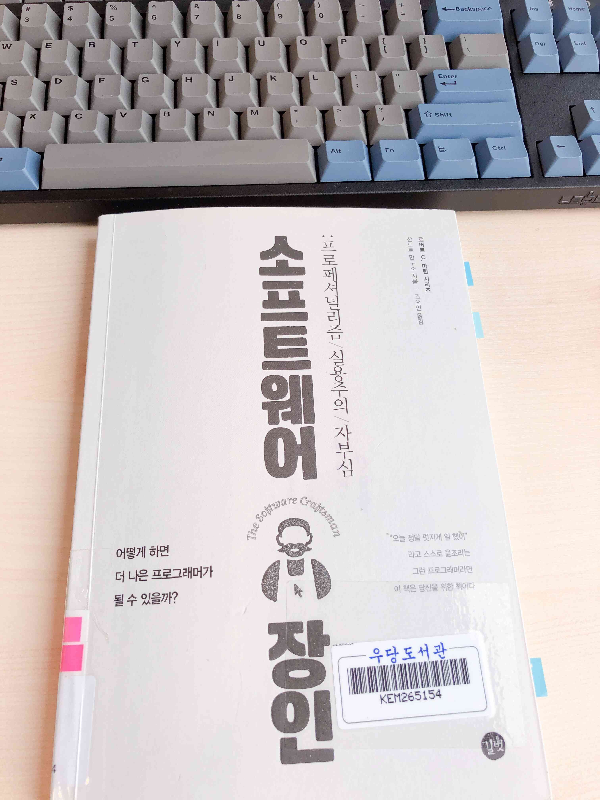

# Part 1 이념과 태도

## CHAPTER 1 21세기의 소프트웨어 개발
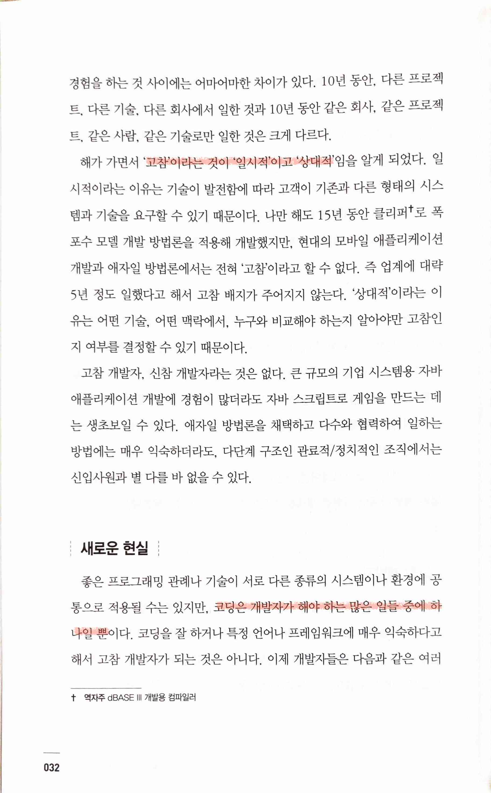 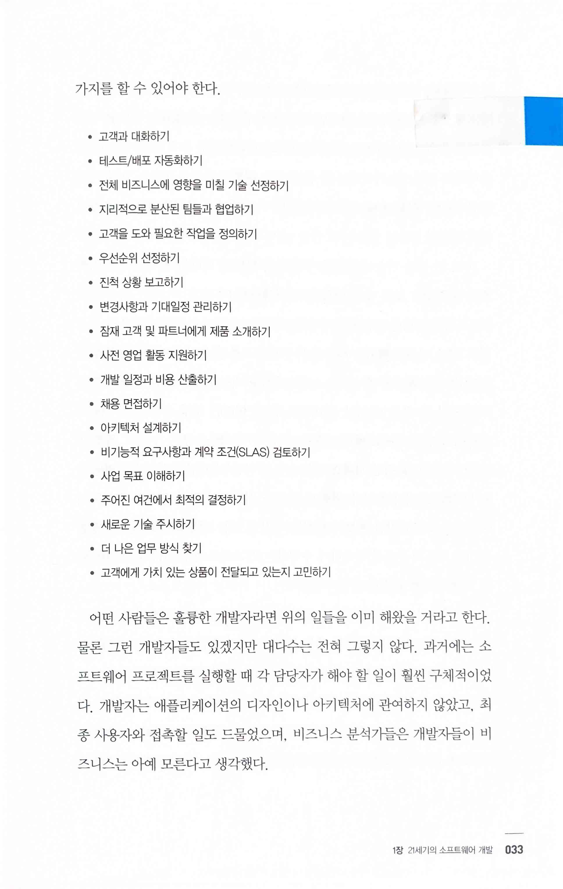

> '고참'이라는 것이 일시적이고 '상대적'
>
> 코딩은 개발자가 해야 하는 많은 일들 중에 하나일 뿐

## CHAPTER 2 애자일

> 애자일 원칙의 절차적인 부분들은 팀에 정말로 중요한 것, 비즈니스에 가치가 있는 것에 집중... 올바른 목표를 향해 진행 중인지 확인
>
> '애자일을 따른다'는 것은 새로운 환경에 성공적으로 적응하고 있다는 의미다. 톰 길브 Tom Gilb
>
> '민첩(Agile)'하다고 해서 애자일을 실행하고 있는 것은 아니다.
>
> 애자일 방법론들은 모두 빠르고 짧은 피드백 루프에 대한 것

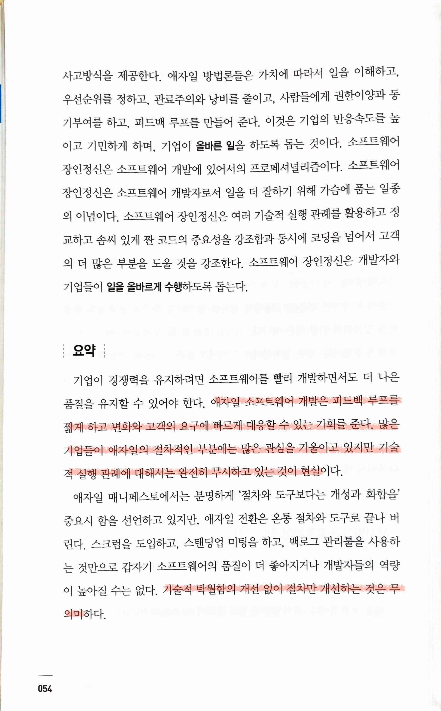

> 애자일 소프트웨어 개발은 피드백 루프를 짧게 하고 변화와 고객의 요구에 빠르게 대응할 수 있는 기회를 준다. 많은 기업들이 애자일의 절차적인 부분에는 많은 관심을 기울이고 있지만 기술적 실행 관례에 대해서는 완전히 무시하고 있는 것이 현실
>
> 기술적 탁월함의 개선 없이 절차만 개선하는 것은 무의미

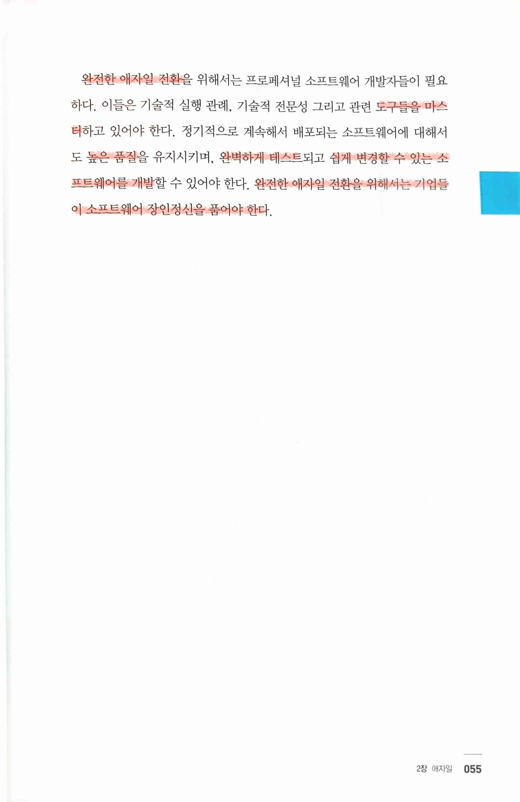

> 완전한 애자일 전환을 위해서는 프로페셔널 소프트웨어 개발자들이 필요하다. 이들은 기술적 실행 관례, 기술적 전문성 그리고 관련 도구들을 마스터하고 있어야 한다. 정기적으로 계속해서 배포되는 소프트웨어에 대해서도 높은 품질을 유지시키며, 완벽하게 테스트되고 쉽게 변경할 수 있는 소프트웨어를 개발할 수 있어야 한다. 완전한 애자일 전환을 위해서는 기업들이 소프트웨어 장인정신을 품어야 한다.

## CHAPTER 3 소프트웨어 장인정신
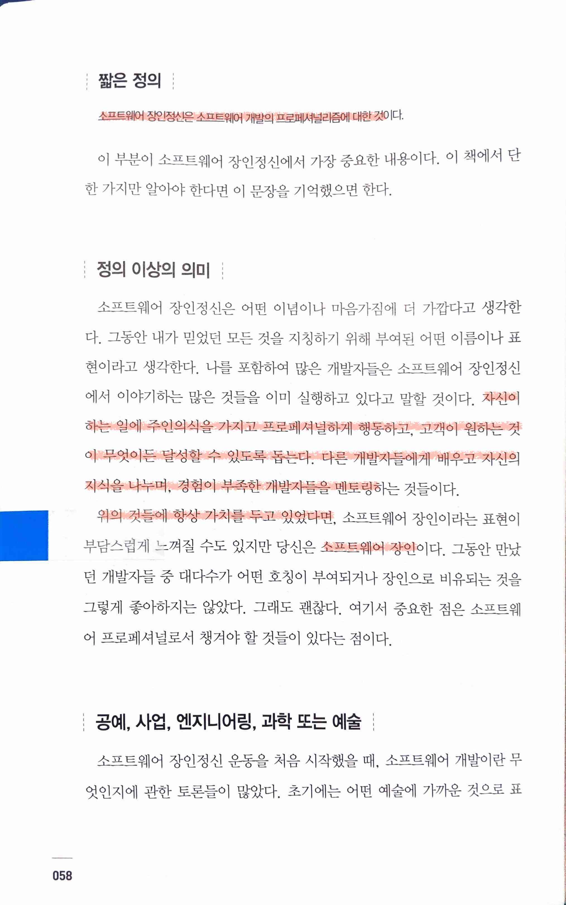

> 소프트웨어 장인정신은 소프트웨어 개발의 프로페셔널리즘에 대한 것
>
> 자신이 하는 일에 주인의식을 가지고 프로페셔널하게 행동하고, 고객이 원하는 것이 무엇이든 달성할 수 있도록 돕는다. 다른 개발자들에게 배우고 자신의 지식을 나누며, 경험이 부족한 개발자들을 멘토링
>
> 위의 것들에 항상 가치를 두고 있었다면,... 소프트웨어 장인

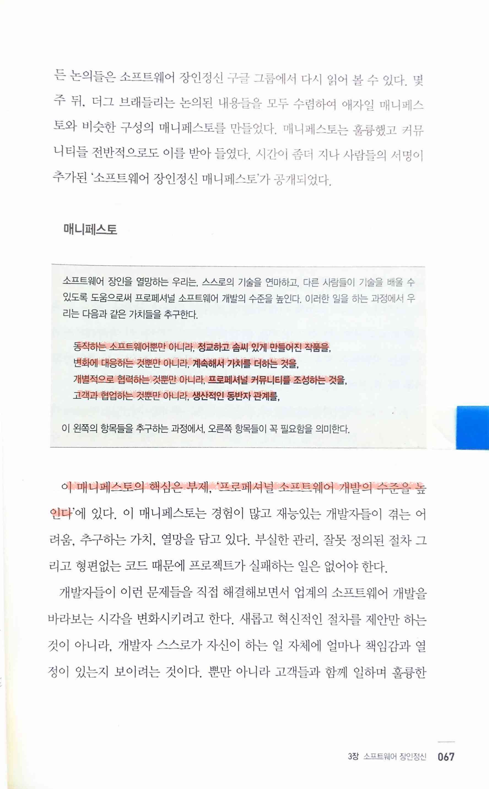

> 동작하는 소프트웨어뿐만 아니라 정교하고 솜씨 있게 만들어진 작품을,
>
> 변화에 대응하는 것뿐만 아니라 계속해서 가치를 더하는 것을,
>
> 개별적으로 협력하는 것뿐만 아니라, 프로페셔널 커뮤니티를 조성하는 것을,
>
> 고객과 협업하는 것뿐만 아니라, 생산적인 동반자 관계를,
>
> 이 매니페스토의 핵심은 부제, '프로페셔널 소프트웨어 개발의 수준을 높인다'

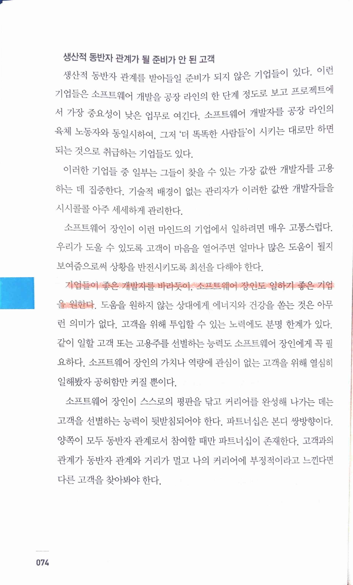

> 기업들이 좋은 개발자를 바라듯이, 소프트웨어 장인도 일하기 좋은 기업을 원한다.

## CHAPTER 4 소프트웨어 장인의 태도
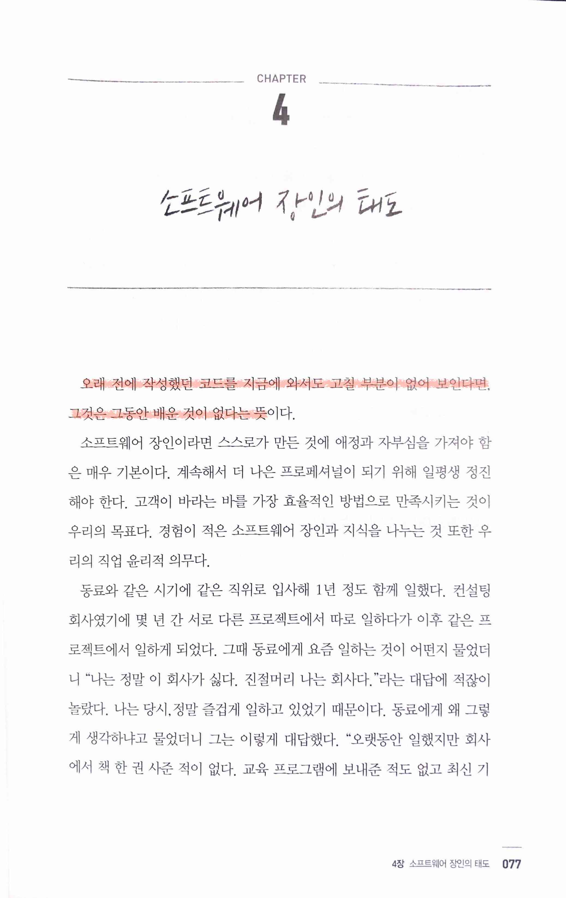

> 오래 전에 작성했던 코드를 지금에 와서도 고칠 부분이 없어 보인다면, 그것은 그동안 배운 것이 없다는 뜻

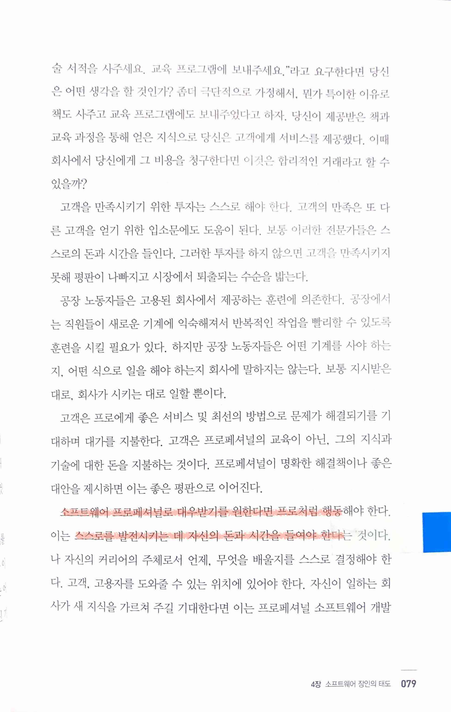

> 소프트웨어 프로페셔널로 대우받기를 원한다면 프로처럼 행동해야 한다. 이는 스스로를 발전시키는 데 자신의 돈과 시간을 들여야 한다는 것이다.

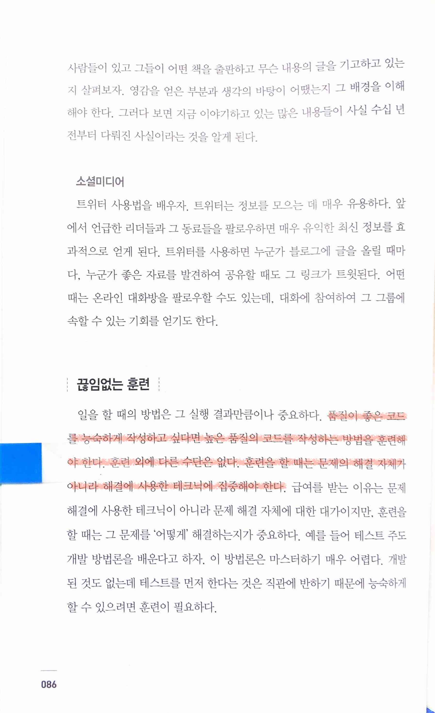

> 품질이 좋은 코드를 능숙하게 작성하고 싶다면 높은 품질의 코드를 작성하는 방법을 훈련해야 한다. 훈련 외에 다른 수단은 없다. 훈련을 할 때는 문제의 해결 자체가 아니라 해결에 사용한 테크닉에 집중해야 한다.

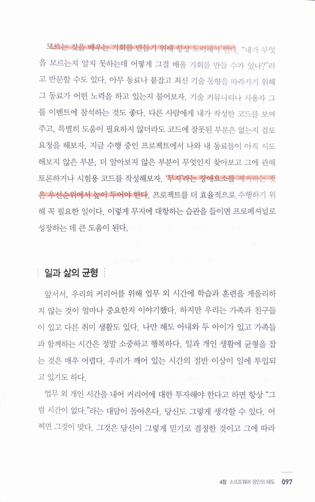

> 모르는 것을 배우는 기회를 만들기 위해 항상 노력해야 한다... '무지'라는 장애요소를 제거하는 것은 우선순위에서 높이 두어야 한다.

## CHAPTER 5 영웅, 선의 그리고 프로페셔널리즘
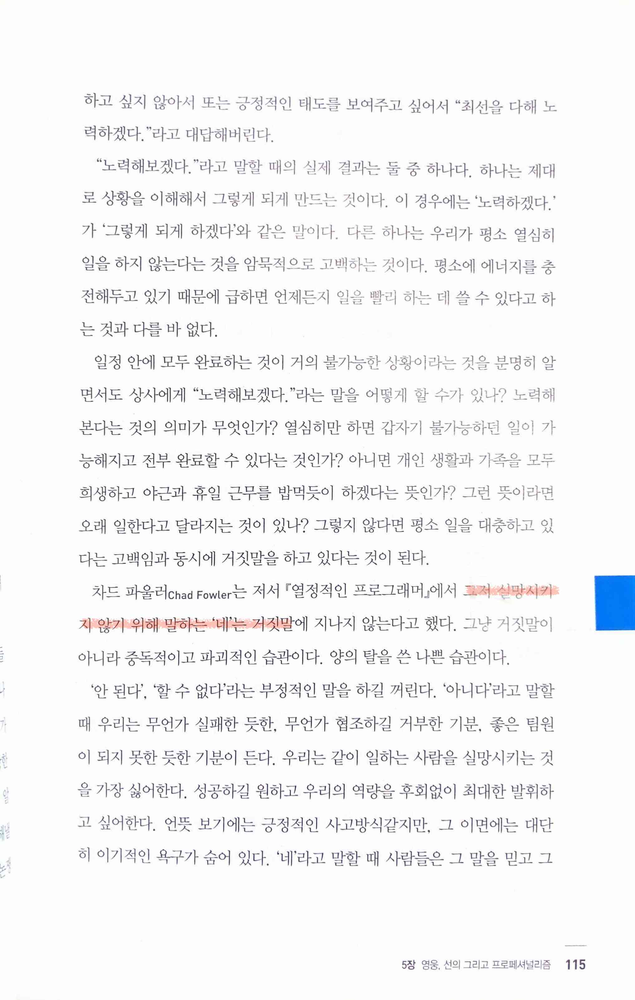

> 차드 파울러 Chad Fowler, '열정적인 프로그래머', 그저 실망시키지 않기 위해 말하는 '네'는 거짓말

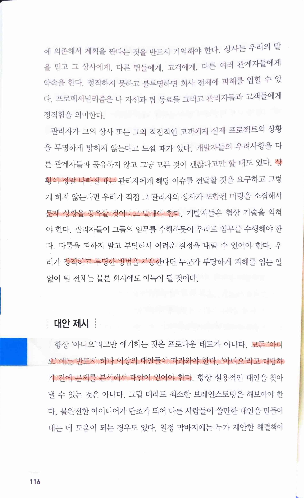

> 상황이 정말 나빠질 때는... 문제 상황을 공유할 것이라고 말해야 한다... 정직하고 투명한 방법을 사용
>
> 모든 ‘아니오'에는 반드시 하나 이상의 대안들이 따라와야 한다. '아니오'라고 대답하기 전에 문제를 분석해서 대안이 있어야 한다.

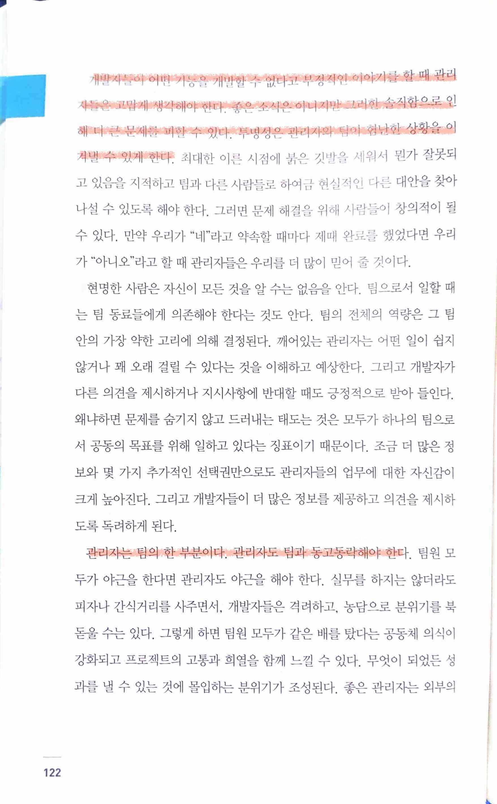

> 개발자들이 어떤 기능을 개발할 수 없다고 부정적인 이야기를 할 때 관리자들은 고맙게 생각해야 한다. 좋은 소식은 아니지만 그러한 솔직함으로 인해 더 큰 문제를 피할 수 있다. 투명성은 관리자와 팀이 험난한 상황을 이겨낼 수 있게 한다.
>
> 관리자는 팀의 한 부분이다. 관리자도 팀과 동고동락해야 한다.

## CHAPTER 6 동작하는 소프트웨어
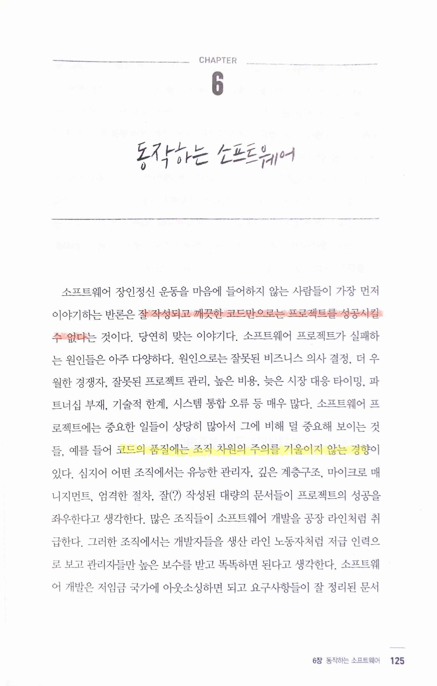

> 잘 작성되고 깨끗한 코드만으로는 프로젝트를 성공시킬 수 없다
>
> 코드의 품질에는 조직 차원의 주의를 기울이지 않는 경향

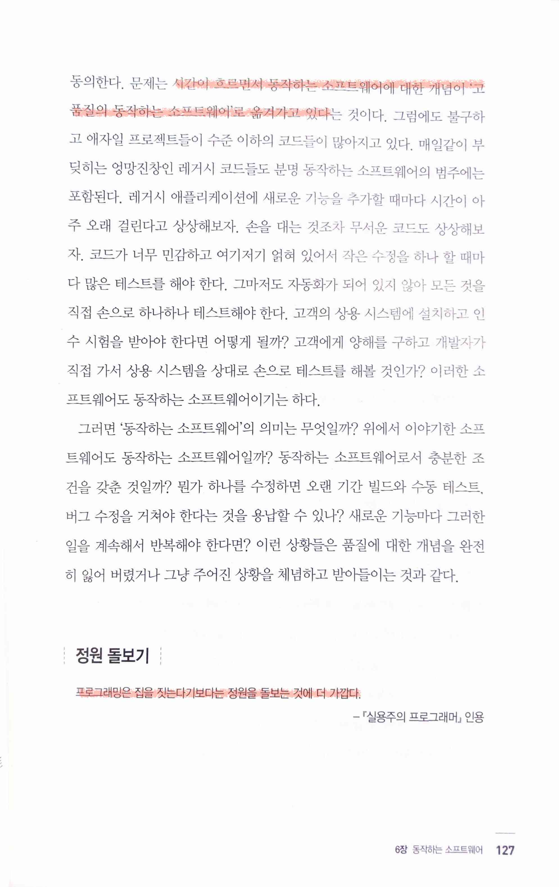

> 시간이 흐르면서 동작하는 소프트웨어에 대한 개념이 '고품질의 동작하는 소프트웨어'로 옮겨가고 있다
>
> 프로그래밍은 집을 짓는다기보다는 정원을 돌보는 것에 더 가깝다. - 실용주의 프로그래머 인용

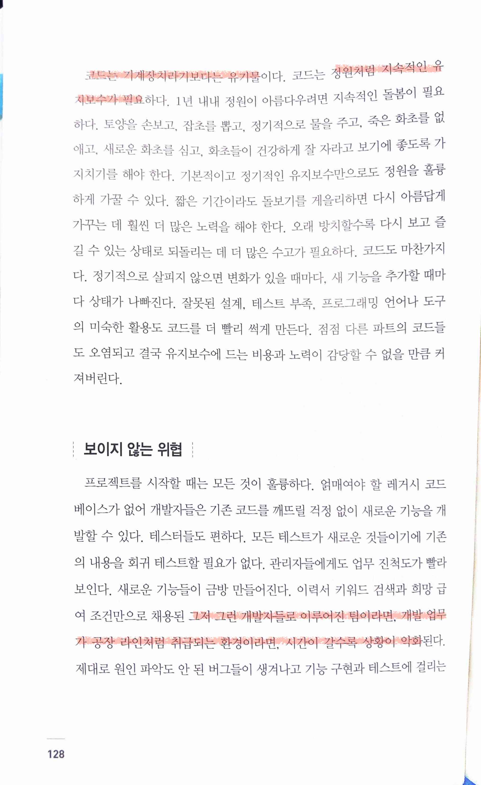

> 코드는 기계장치라기보다는 유기물... 정원처럼 지속적인 유지보수가 필요
>
> 그저 그런 개발자들로 이루어진 팀이라면, 개발 업무가 공장 라인처럼 취급되는 환경이라면, 시간이 갈수록 상황이 악화

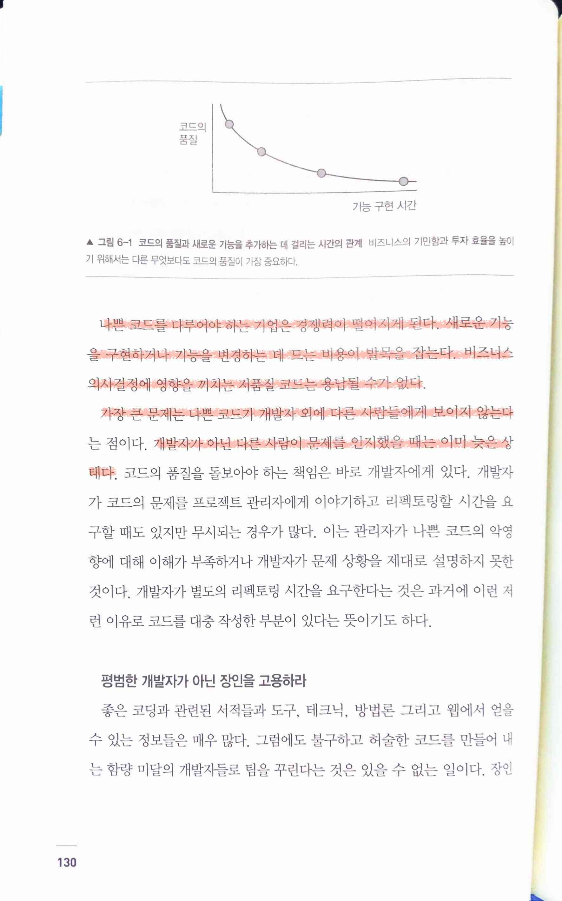

> 나쁜 코드를 다루어야 하는 기업은 경쟁력이 떨어지게 된다. 새로운 기능을 구현하거나 기능을 변경하는 데 드는 비용이 발목을 잡는다. 비즈니스의사결정에 영향을 끼치는 저품질 코드는 용납될 수가 없다.
>
> 가장 큰 문제는 나쁜 코드가 개발자 외에 다른 사람들에게 보이지 않는다는 점이다. 개발자가 아닌 다른 사람이 문제를 인지했을 때는 이미 늦은 상태다.

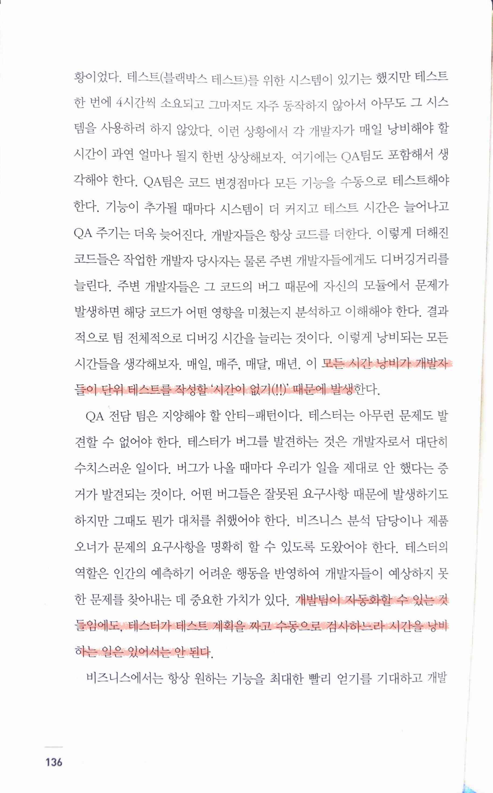

> 모든 시간 낭비가 개발자들이 단위 테스트를 작성할 '시간이 없기(!!)' 때문에 발생한다.
>
> 개발팀이 자동화할 수 있는 것들임에도, 테스터가 테스트 계획을 짜고 수동으로 검사하느라 시간을 낭비하는 일은 있어서는 안 된다.

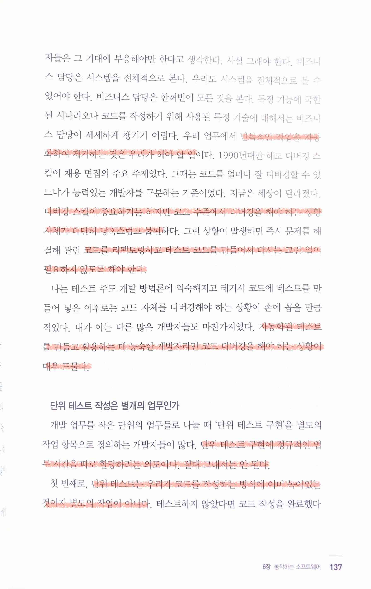

> 반복적인 작업을 자동화하여 제거하는 것은 우리가 해야 할 일... 디버깅 스킬이 중요하기는 하지만 코드 수준에서 디버깅을 해야 하는 상황 자체가 대단히 당혹스럽고 불편... 코드를 리펙토링하고 테스트 코드를 만들어서 다시는 그런 일이 필요하지 않도록 해야 한다.
>
> 자동화된 테스트를 만들고 활용하는 데 능숙한 개발자라면 코드 디버깅을 해야 하는 상황이 매우 드물다.
>
> 단위 테스트 구현에 정규적인 업무 시간을 따로 할당하려는 의도이다. 절대 그래서는 안 된다.
>
> 단위 테스트는 우리가 코드를 작성하는 방식에 이미 녹아있는 것이지 작업이 아니다.

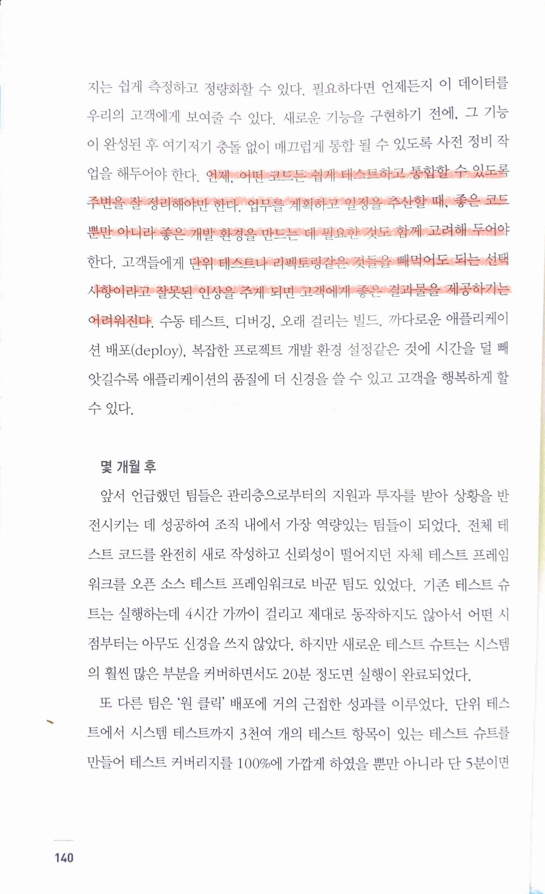

> 언제, 어떤 코드든 쉽게 테스트하고 통합할 수 있도록 주변을 잘 정리해야만 한다. 업무를 계획하고 일정을 추산할 때, 좋은 코드뿐만 아니라 좋은 개발 환경을 만드는 데 필요한 것도 함께 고려해 두어야... 단위 테스트나 리펙토링같은 것들을 빼먹어도 되는 선택사항이라고 잘못된 인상을 주게 되면 고객에게 좋은 결과물을 제공하기는 어려워진다.

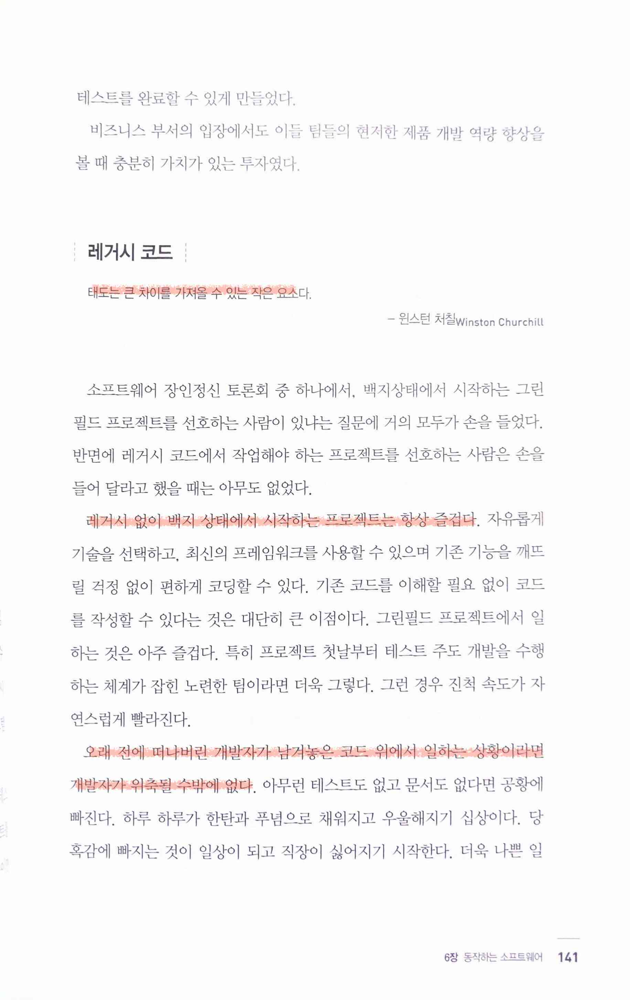

> 태도는 큰 차이를 가져올 수 있는 작은 요소다. - 윈스턴 처칠 Winston Churchill
>
> 레거시 없이 백지 상태에서 시작하는 프로젝트는 항상 즐겁다.
>
> 오래 전에 떠나버린 개발자가 남겨놓은 코드 위에서 일하는 상황이라면 개발자가 위축될 수밖에 없다.

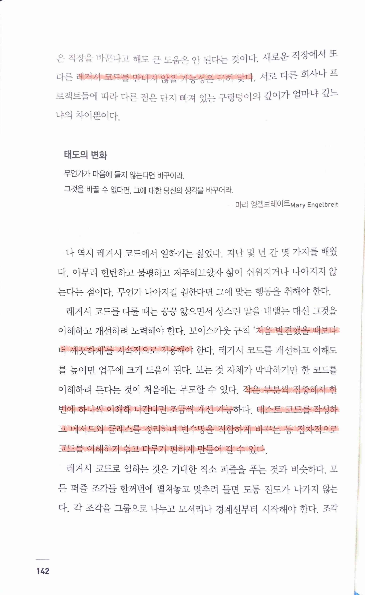

> 레거시 코드를 만나지 않을 가능성은 극히 낮다.
>
> 보이스카웃 규칙 '처음 발견했을 때보다 더 깨끗하게'를 지속적으로 적용해야... 작은 부분씩 집중해서 한번에 하나씩 이해해 나간다면 조금씩 개선 가능하다. 테스트 코드를 작성하고 메서드와 클래스를 정리하며 변수명을 적합하게 바꾸는 등 점차적으로 코드를 이해하기 쉽고 다루기 편하게 만들어 갈 수 있다.

## CHAPTER 7 기술적 실행 관례
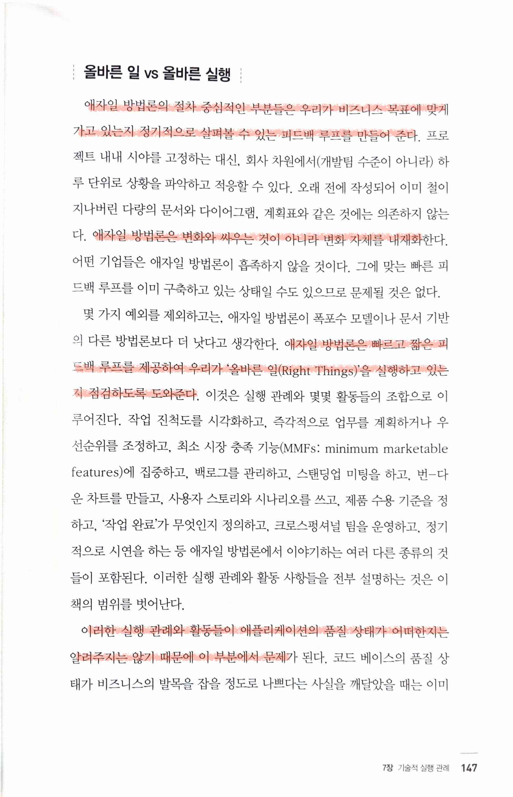

> 애자일 방법론의 절차 중심적인 부분들은 우리가 비즈니스 목표에 맞게 가고 있는지 정기적으로 살펴볼 수 있는 피드백 루프를 만들어 준다... 애자일 방법론은 변화와 싸우는 것이 아니라 변화 자체를 내재화
>
> 애자일 방법론은 빠르고 짧은 피드백 루프를 제공하여 우리가 '올바른 일(Right Things)'을 실행하고 있는지 점검하도록 도와준다.
>
> 이러한 실행 관례와 활동들이 애플리케이션의 품질 상태가 어떠한지는 알려주지는 않기 때문에 이 부분에서 문제

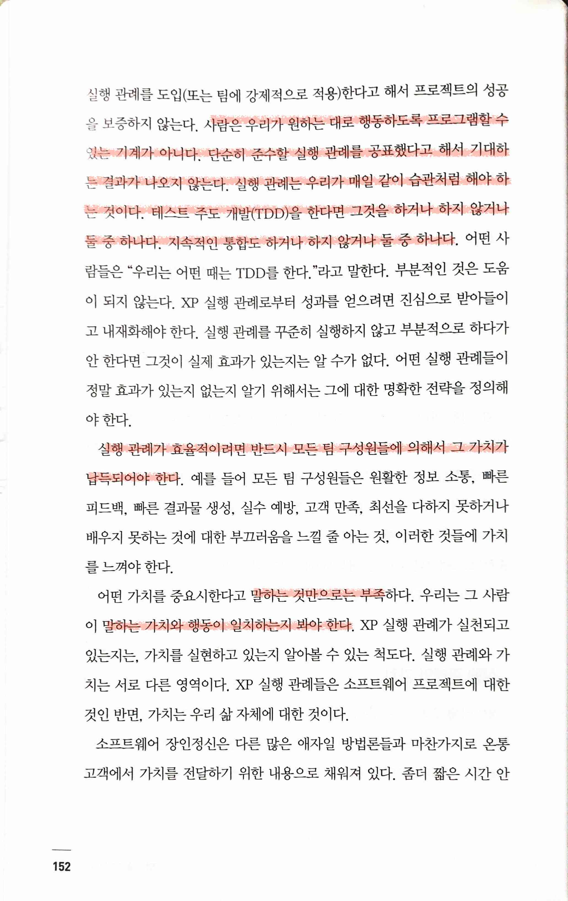

> 사람은 우리가 원하는 대로 행동하도록 프로그램할 수 있는 기계가 아니다. 단순히 준수할 실행 관례를 공표했다고 해서 기대하는 결과가 나오지 않는다. 실행 관례는 우리가 매일 같이 습관처럼 해야 하는 것이다. 테스트 주도 개발(TDD)을 한다면 그것을 하거나 하지 않거나 둘 중 하나다. 지속적인 통합도 하거나 하지 않거나 둘 중 하나다.
>
> 실행 관례가 효율적이려면 반드시 모든 팀 구성원들에 의해서 그 가치가 납득되어야 한다.
>
> 말하는 것만으로는 부족... 말하는 가치와 행동이 일치하는지 봐야 한다.

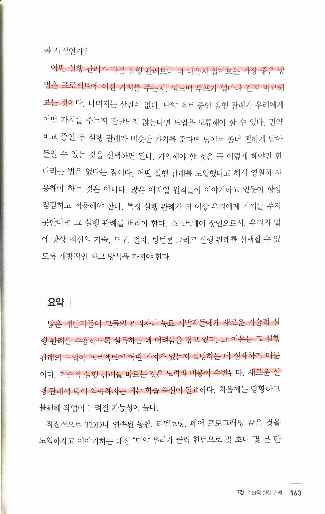

> 어떤 실행 관례가 다른 실행 관례보다 더 나은지 알아보는 가장 좋은 방법은 프로젝트에 어떤 가치를 주는지, 피드백 루프가 얼마나 긴지 비교해보는 것
>
> 많은 개발자들이 그들의 관리자나 동료 개발자들에게 새로운 기술적 실행 관례를 수용하도록 설득하는 데 어려움을 겪고 있다. 그 이유는 그 실행 관례의 도입이 프로젝트에 어떤 가치가 있는지 설명하는 데 실패하기 때문. 기술적 실행 관례를 따르는 것은 노력과 비용이 수반. 새로운 실행 관례에 팀이 익숙해지는 데는 학습 곡선이 필요

## CHAPTER 8 길고 긴 여정

> 요기 베라 Yogi Berra '어디로 가고 있는지 모르고 있다면, 결국 가고 싶지 않은 곳으로 간다.'
* [Quote by Yogi Berra: “If you don't know where you are going, you'll e...”](https://www.goodreads.com/quotes/23616-if-you-don-t-know-where-you-are-going-you-ll-end)

> 다니엘 핑크 Daniel Pink, 동기부여에 대한 놀라운 진실 Drive: The Surprising Truth about What Motivates, 돈은 충족되어야 할 기본 조건이고, 지식 노동자를 움직이는 것은 자율성, 통달, 목적의식 이렇게 세 가지라고 이야기
* [Drive | Daniel H. Pink](https://www.danpink.com/books/drive/)

# Part 2 완전한 전환

## CHAPTER 9 인재 채용
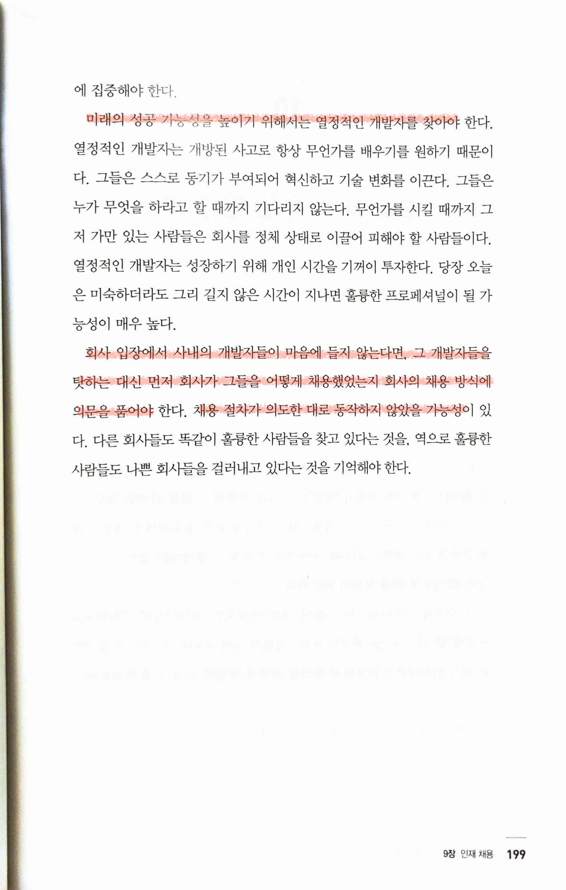

> 미래의 성공 가능성을 높이기 위해서는 열정적인 개발자를 찾아야
>
> 회사 입장에서 사내의 개발자들이 마음에 들지 않는다면, 그 개발자들을 탓하는 대신 먼저 회사가 그들을 어떻게 채용했었는지 회사의 채용 방식에 의문을 품어야. 채용 절차가 의도한 대로 동작하지 않았을 가능성

## CHAPTER 10 소프트웨어 장인 면접하기
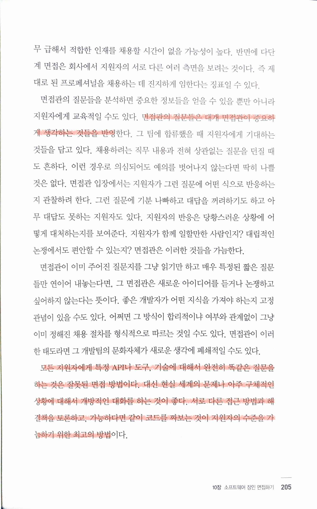

> 면접관의 질문들은 대개 면접관이 중요하게 생각하는 것들을 반영
>
> 모든 지원자에게 특정 API나 도구, 기술에 대해서 완전히 똑같은 질문을 하는 것은 잘못된 면접 방법이다. 대신 현실 세계의 문제나 아주 구체적인 상황에 대해서 개방적인 대화를 하는 것이 좋다. 서로 다른 접근 방법과 해결책을 토론하고, 가능하다면 같이 코드를 짜보는 것이 지원자의 수준을 가늠하기 위한 최고의 방법

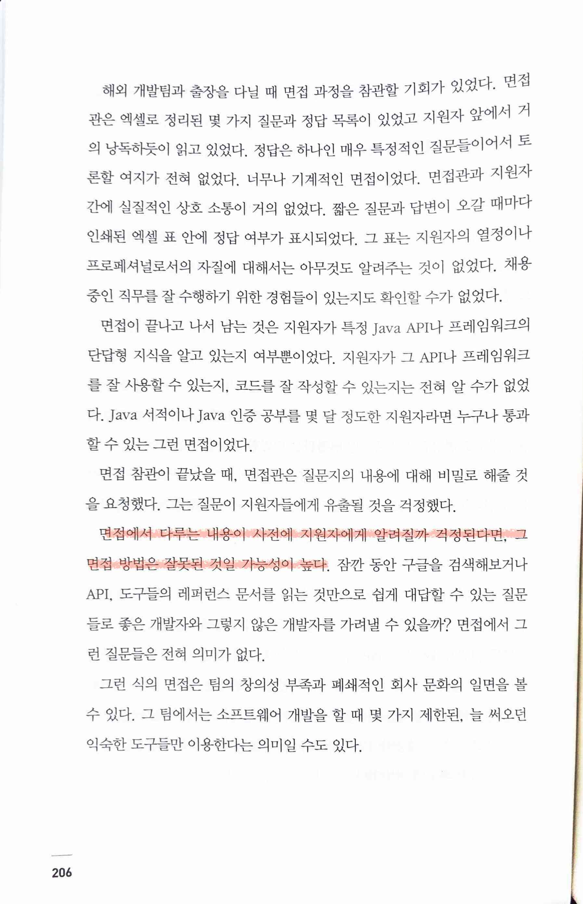

> 면접에서 다루는 내용이 사전에 지원자에게 알려질까 걱정된다면, 그 면접 방법은 잘못된 것일 가능성이 높다.

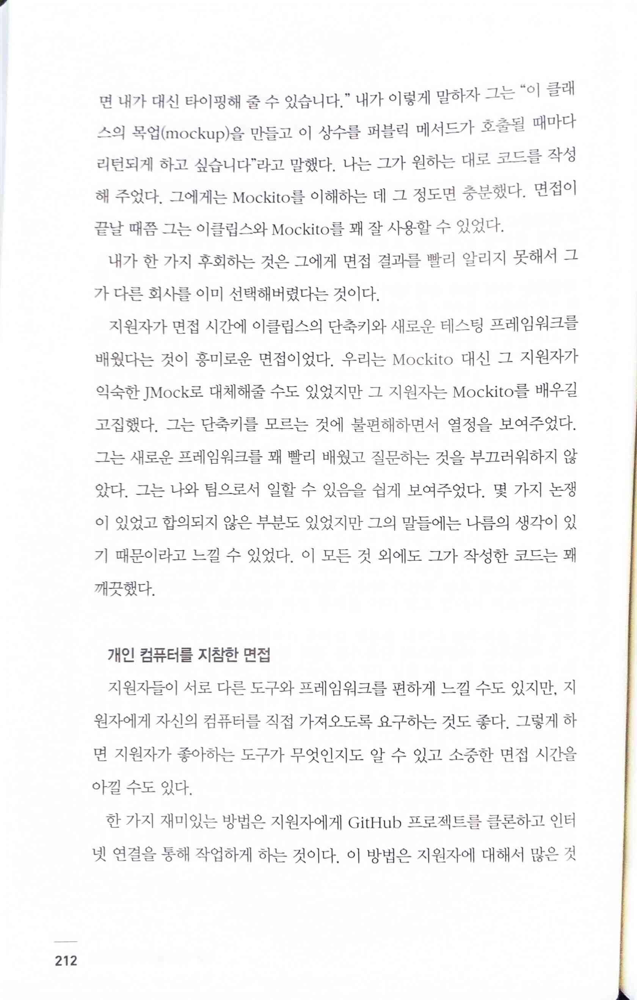

## CHAPTER 11 잘못된 면접 방식
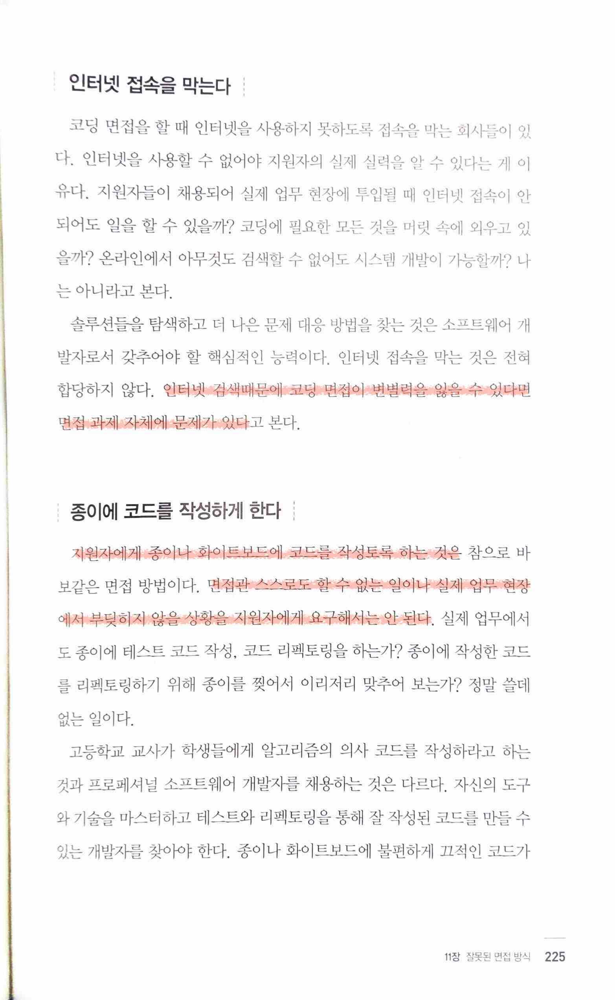

> 인터넷 검색때문에 코딩 면접이 변별력을 잃을 수 있다면 면접 과제 자체에 문제
>
> 지원자에게 종이나 화이트보드에 코드를 작성토록 하는 것... 면접관 스스로도 할 수 없는 일이나 실제 업무 현장에서 부딪히지 않을 상황을 지원자에게 요구해서는 안 된다.

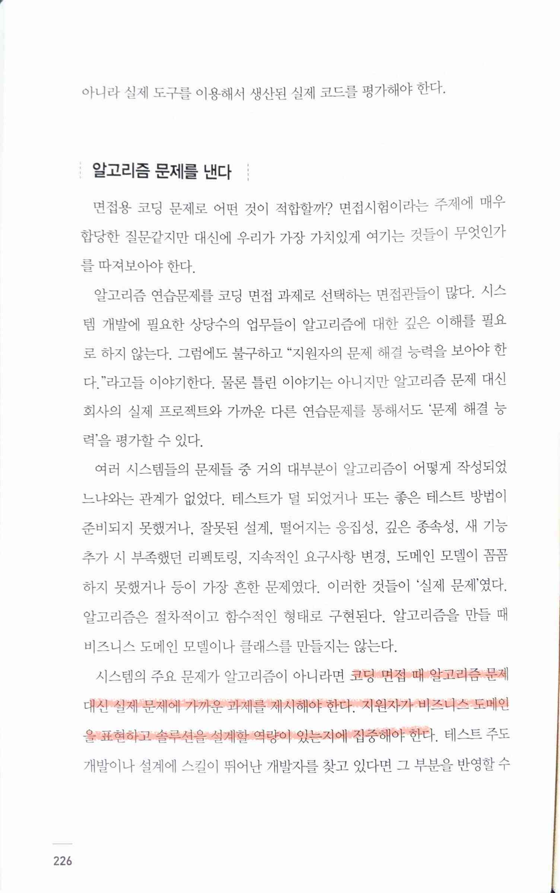

> 시스템의 주요 문제가 알고리즘이 아니라면 코딩 면접 때 알고리즘 문제 대신 실제 문제에 가까운 과제를 제시해야 한다. 지원자가 비즈니스 도메인을 표현하고 솔루션을 설계할 역량이 있는지에 집중해야 한다.

## CHAPTER 12 낮은 사기의 대가
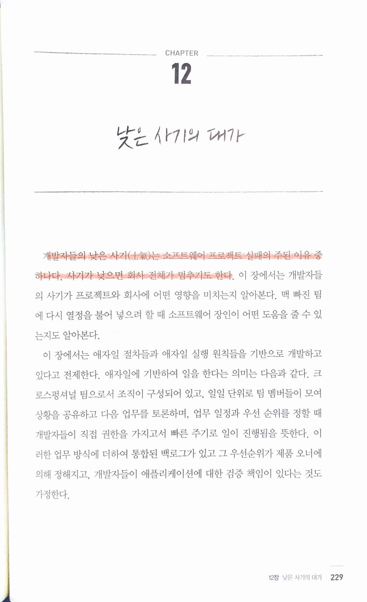

> 개발자들의 낮은 사기(士氣)는 소프트웨어 프로젝트 실패의 주된 이유 중 하나다. 사기가 낮으면 회사 전체가 멈추기도 한다.

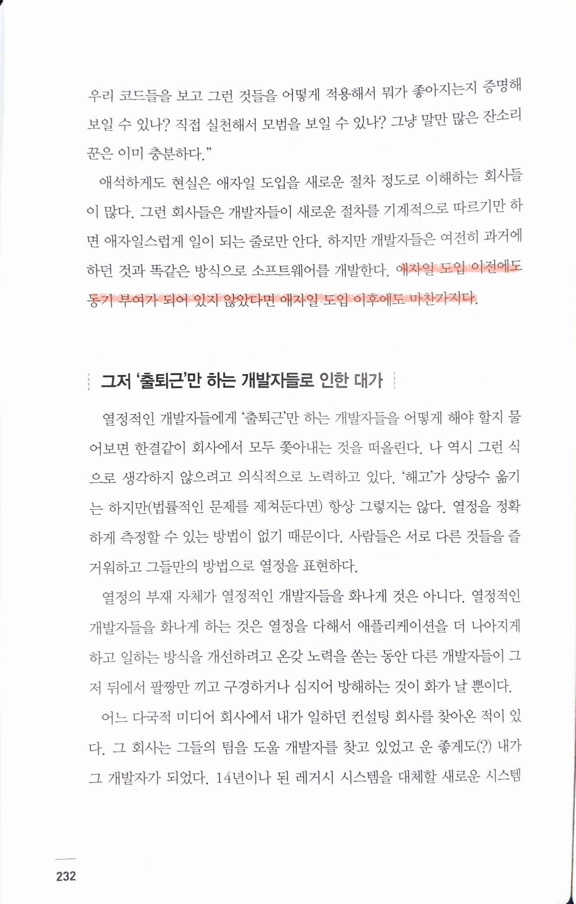

> 애자일 도입 이전에도 동기 부여가 되어 있지 않았다면 애자일 도입 이후에도 마찬가지다.

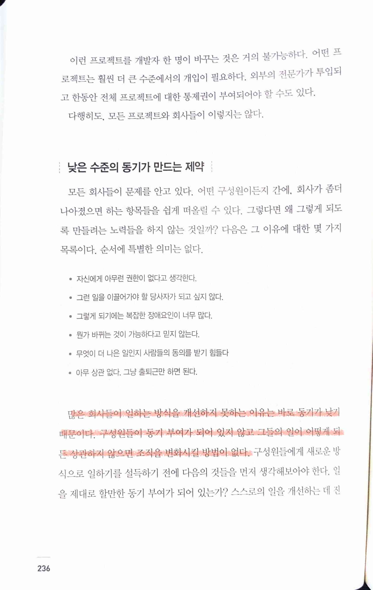

> 많은 회사들이 일하는 방식을 개선하지 못하는 이유는 바로 동기가 낮기 때문이다. 구성원들이 동기 부여가 되어 있지 않고 그들의 일이 어떻게 되든 상관하지 않으면 조직을 변화시킬 방법이 없다.

## CHAPTER 13 배움의 문화
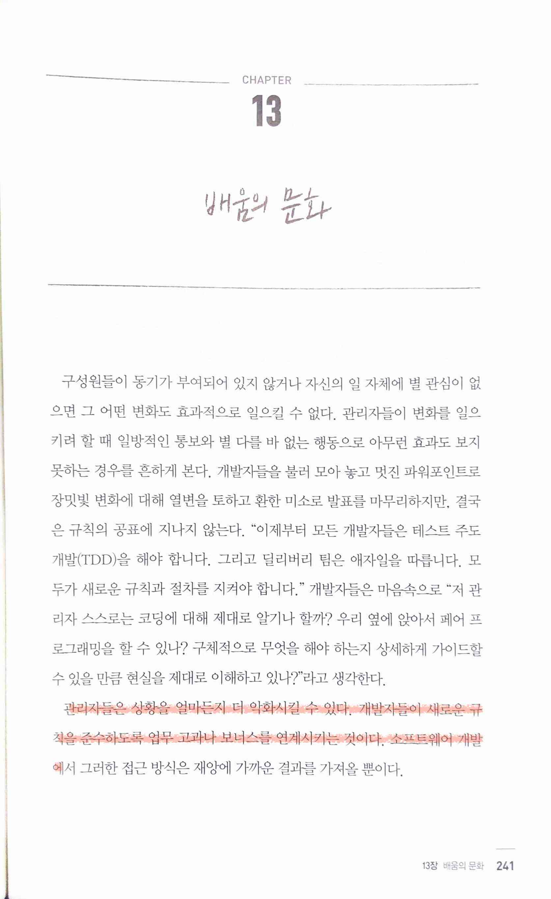

> 관리자들은 상황을 얼마든지 더 악화시킬 수 있다. 개발자들이 새로운 규칙을 준수하도록 업무 고과나 보너스를 연계시키는 것이다. 소프트웨어 개발에서 그러한 접근 재앙에 가까운 결과를 가져올 뿐

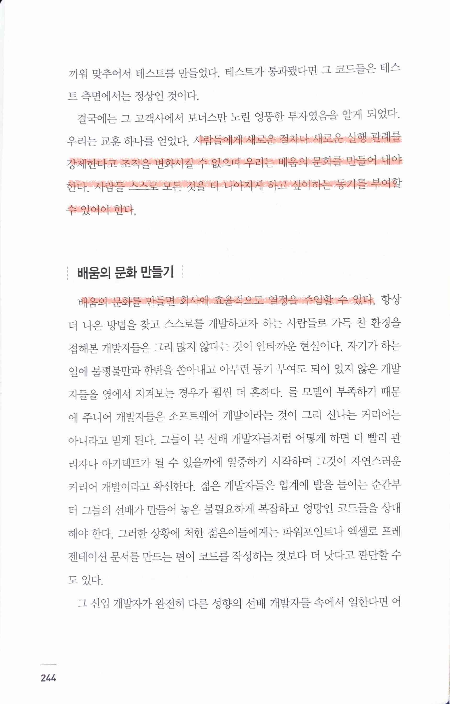

> 사람들에게 새로운 절차나 새로운 실행 관례를 강제한다고 조직을 변화시킬 수 없으며 우리는 배움의 문화를 만들어 내야한다. 사람들 스스로 모든 것을 더 나아지게 하고 싶어하는 동기를 부여할 수 있어야 한다.
>
> 배움의 문화를 만들면 회사에 효율적으로 열정을 주입할 수 있다.

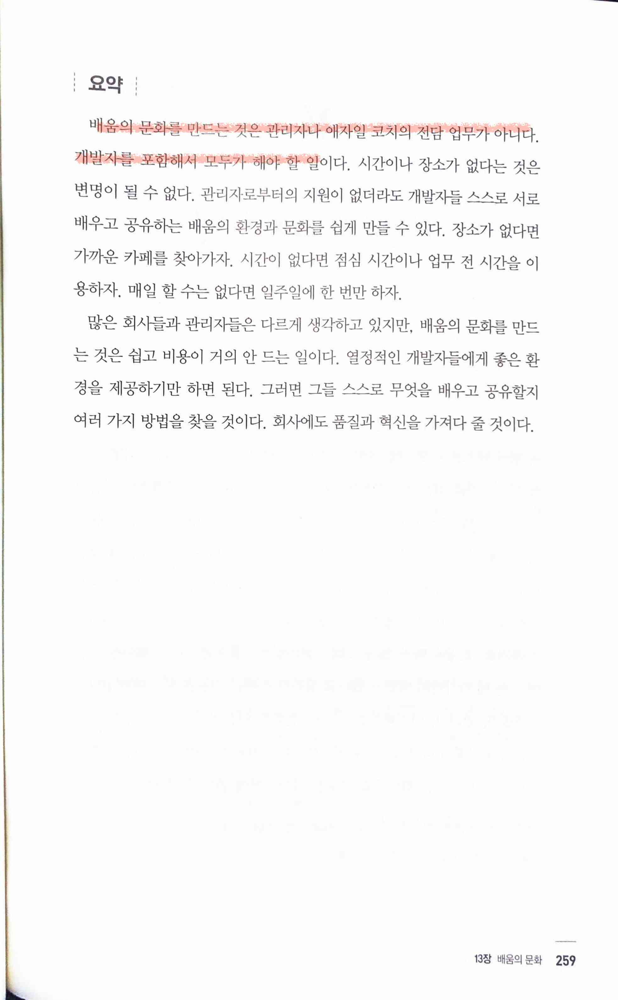

> 배움의 문화를 만드는 것은 관리자나 애자일 코치의 전담 업무가 아니다. 개발자를 포함해서 모두가 해야 할 일

## CHAPTER 14 기술적 변화의 실행
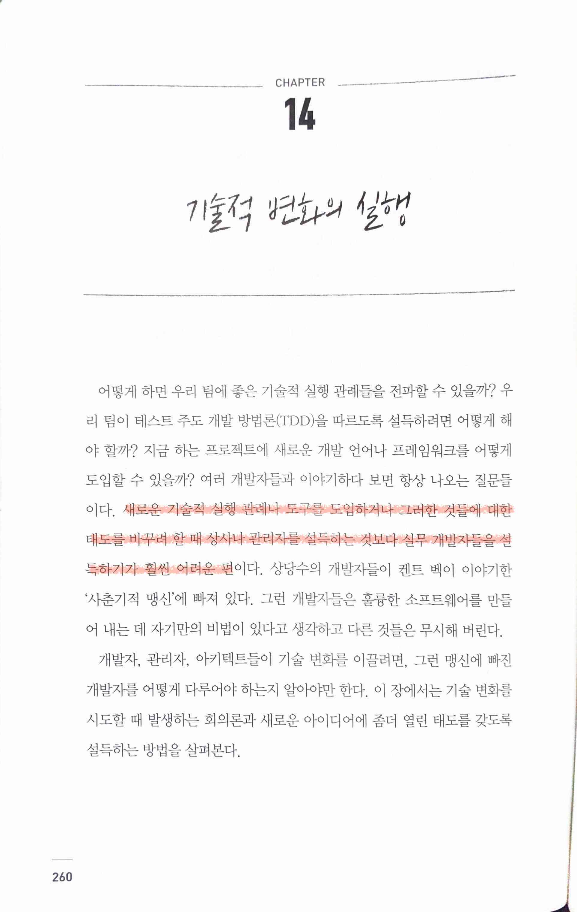

> 새로운 기술적 실행 관례나 도구를 도입하거나 그러한 것들에 대한 태도를 바꾸려 할 때 상사나 관리자를 설득하는 것보다 실무 개발자들을 설득하기가 훨씬 어려운 편

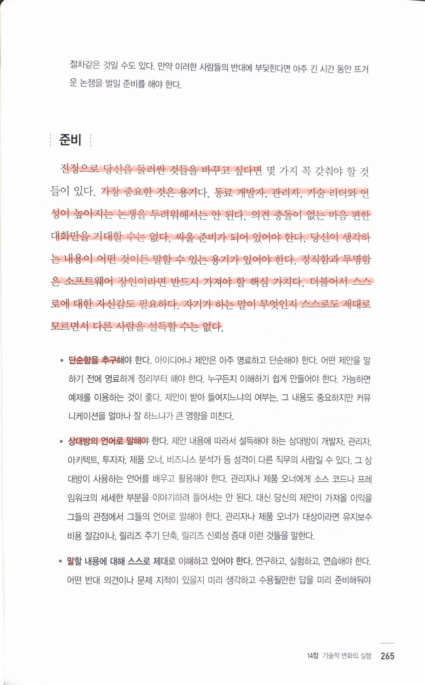

> 진정으로 당신을 둘러싼 것들을 바꾸고 싶다면... 가장 중요한 것은 용기. 동료 개발자, 관리자, 기술 리더와 언성이 높아지는 논쟁을 두려워해서는 안 된다. 의견 충돌이 없는 마음 편한대화만을 기대할 수는 없다. 싸울 준비가 되어 있어야 한다. 당신이 생각하는 내용이 어떤 것이든 말할 수 있는 용기가 있어야 한다. 정직함과 투명함은 소프트웨어 장인이라면 반드시 가져야 할 핵심 가치다. 더불어서 스스로에 대한 자신감도 필요하다. 자기가 하는 말이 무엇인지 스스로도 제대로 모르면서 다른 사람을 설득할 수는 없다.
>
> • 단순함을 추구
>
> • 상대방의 언어로 말해야
>
> • 말할 내용에 대해 스스로 제대로 이해

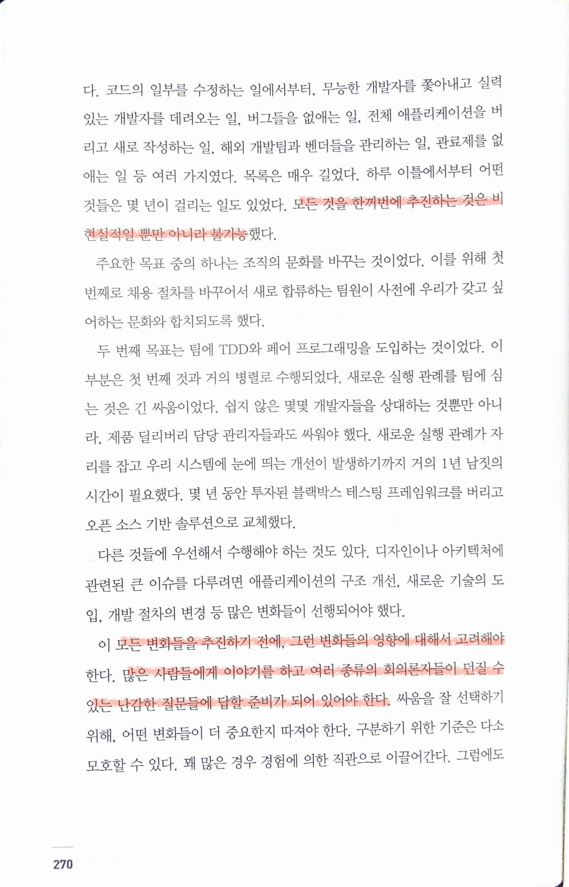

> 모든 것을 한꺼번에 추진하는 것은 비현실적일 뿐만 아니라 불가능
>
> 모든 변화들을 추진하기 전에, 그런 변화들의 영향에 대해서 고려해야. 많은 사람들에게 이야기를 하고 여러 종류의 회의론자들이 던질 수 있는 난감한 질문들에 답할 준비가 되어 있어야

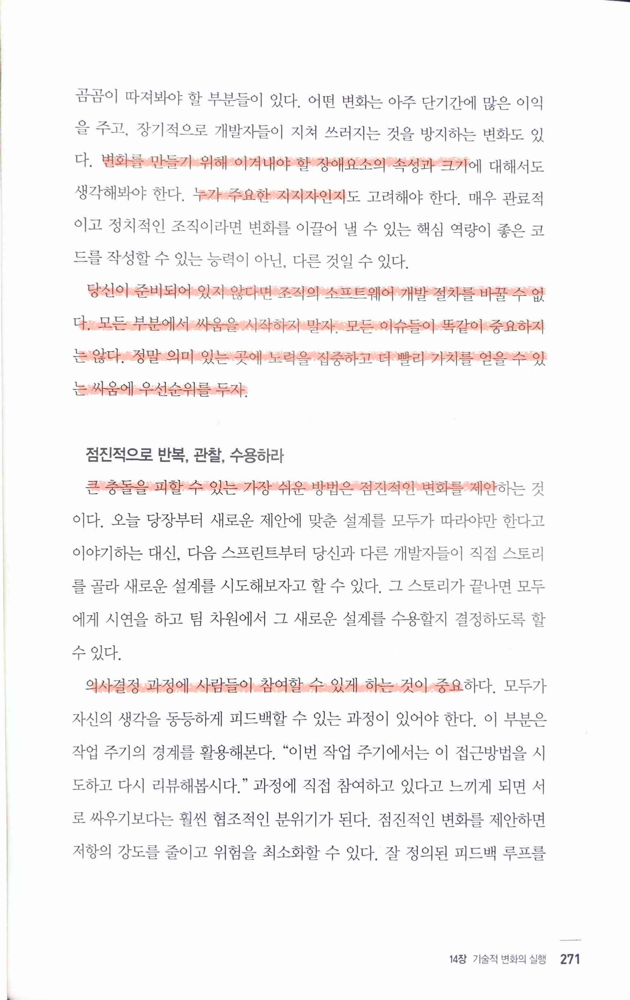

> 변화를 만들기 위해 이겨내야 할 장애요소의 속성과 크기. 누가 주요한 지지자인지
>
> 당신이 준비되어 있지 않다면 조직의 소프트웨어 개발 절차를 바꿀 수 없다. 모든 부분에서 싸움을 시작하지 말자. 모든 이슈들이 똑같이 중요하지는 않다. 정말 의미 있는 곳에 노력을 집중하고 더 빨리 가치를 얻을 수 있는 싸움에 우선순위를 두자.
>
> 큰 충돌을 피할 수 있는 가장 쉬운 방법은 점진적인 변화를 제안
>
> 의사결정 과정에 사람들이 참여할 수 있게 하는 것이 중요

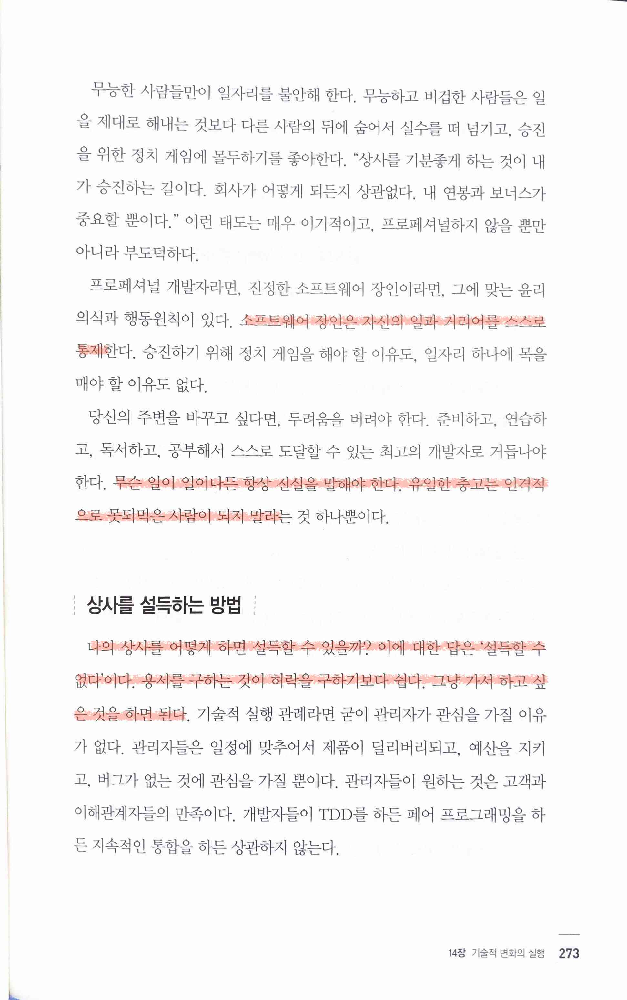

> 소프트웨어 장인은 자신의 일과 커리어를 스스로 통제
>
> 무슨 일이 일어나든 항상 진실을 말해야 한다. 유일한 충고는 인격적으로 못되먹은 사람이 되지 말라는 것 하나뿐
>
> 나의 상사를 어떻게 하면 설득할 수 있을까? 이에 대한 답은 '설득할 수 없다'이다. 용서를 구하는 것이 허락을 구하기보다 쉽다. 그냥 가서 하고 싶은 것을 하면 된다.

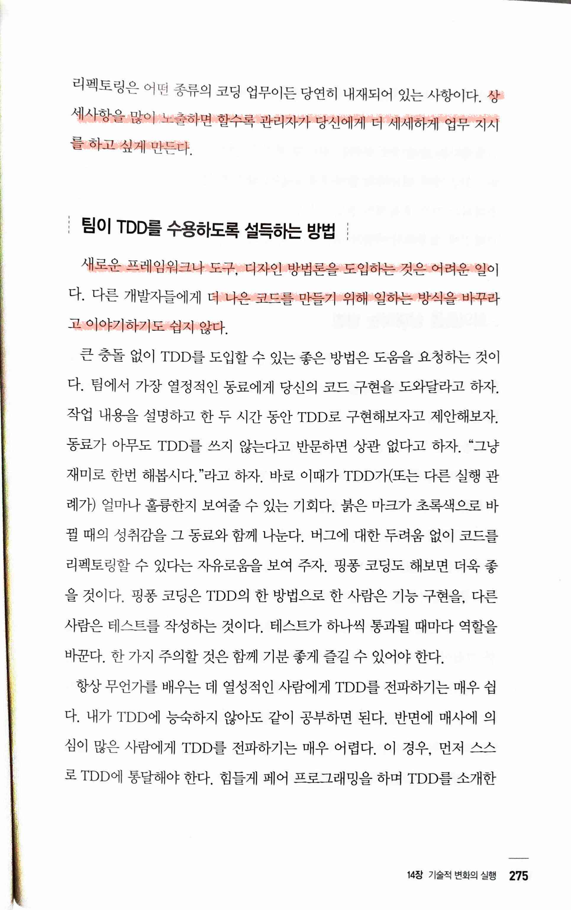

> 상세사항을 많이 노출하면 할수록 관리자가 당신에게 더 세세하게 업무 지시를 하고 싶게 만든다.
>
> 새로운 프레임워크나 도구, 디자인 방법론을 도입하는 것은 어려운 일... 더 나은 코드를 만들기 위해 일하는 방식을 바꾸라고 이야기하기도 쉽지 않다.

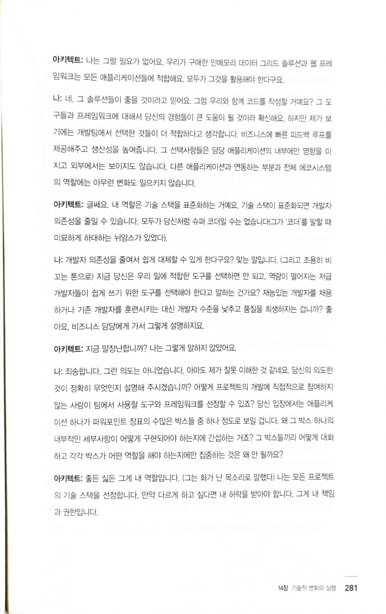

## CHAPTER 15 실용주의 장인정신
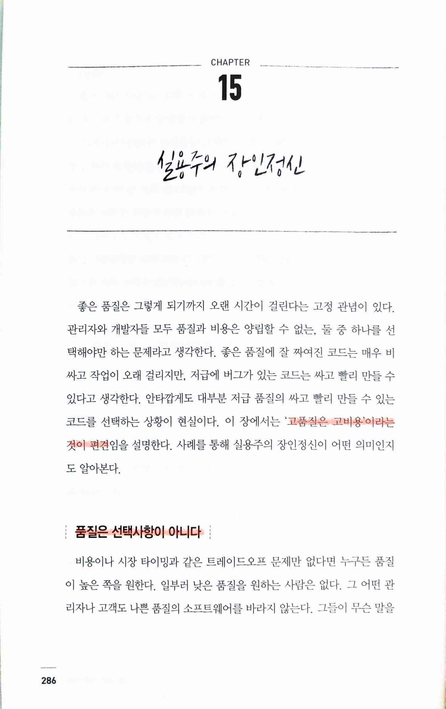

> '고품질은 고비용'이라는 것이 편견
>
> 품질은 선택사항이 아니다

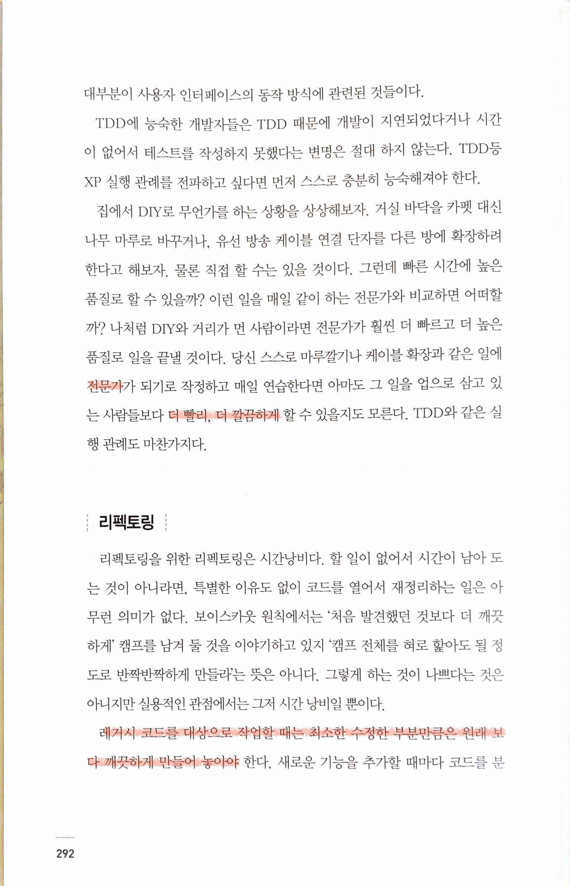

> 전문가. 더 빨리, 더 깔끔하게
>
> 레거시 코드를 대상으로 작업할 때는 최소한 수정한 부분만큼은 원래 보다 깨끗하게 만들어 놓아야

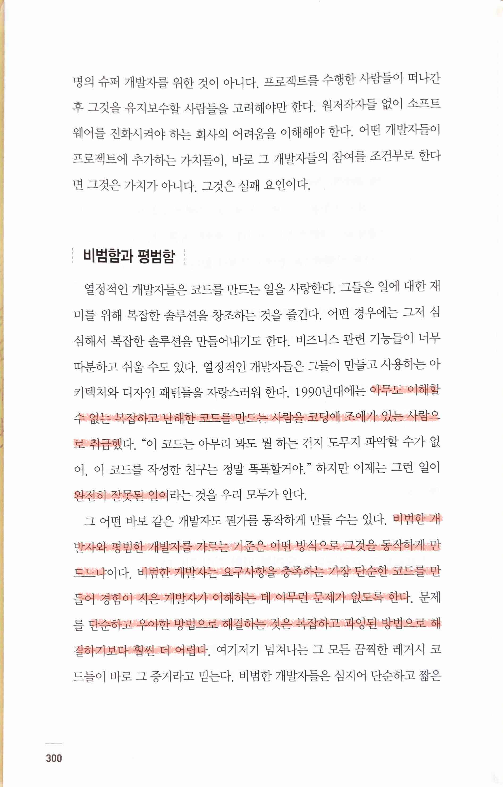

> 1990년대에는 아무도 이해할 수 없는 복잡하고 난해한 코드를 만드는 사람을 코딩에 조예가 있는 사람으로 취급... 이제는 그런 일이 완전히 잘못된 일
>
> 비범한 개발자와 평범한 개발자를 가르는 기준은 어떤 방식으로 그것을 동작하게 만드느냐. 비범한 개발자는 요구사항을 충족하는 가장 단순한 코드를 만들어 경험이 적은 개발자가 이해하는 데 아무런 문제가 없도록 한다. 문제를 단순하고 우아한 방법으로 해결하는 것은 복잡하고 과잉된 방법으로 해결하기보다 훨씬 더 어렵다.

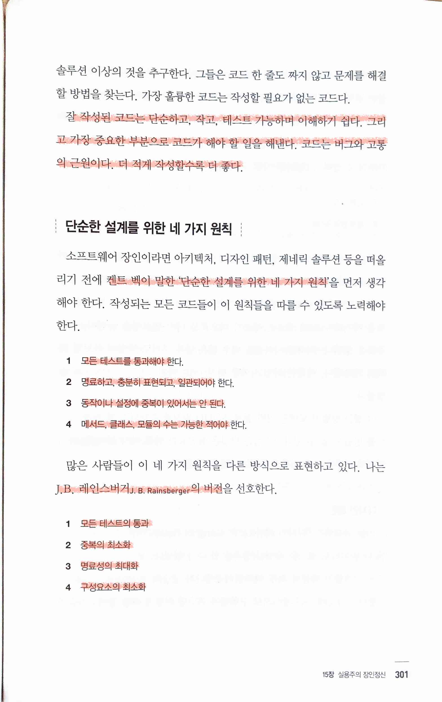

> 잘 작성된 코드는 단순하고, 작고, 테스트 가능하며 이해하기 쉽다. 그리고 가장 중요한 부분으로 코드가 해야 할 일을 해낸다. 코드는 버그와 고통의 근원이다. 더 적게 작성할수록 더 좋다.
>
> 켄트 벡이 말한 '단순한 설계를 위한 네 가지 원칙'
>
> 1 모든 테스트를 통과해야 한다.
>
> 2 명료하고, 충분히 표현되고, 일관되어야 한다.
>
> 3 동작이나 설정에 중복이 있어서는 안 된다.
>
> 4 메서드, 클래스 모듈의 수는 가능한 적어야 한다.
* [Clean Code — 4 Rules of Simple Design | by Anneke Dwi | The Startup | Medium](https://medium.com/swlh/clean-code-4-rules-of-simple-design-f86b066ee43d)
> J.B. 레인스버거 J. B. Rainsberger의 버전
>
> 1 모든 테스트의 통과
>
> 2 중복의 최소화
>
> 3 명료성의 최대화
>
> 4 구성요소의 최소화
* [The Four Elements of Simple Design](https://blog.jbrains.ca/permalink/the-four-elements-of-simple-design)

## CHAPTER 16 소프트웨어 장인으로서의 커리어