# 개발자를 위한 커리어 관리 핸드북

Tags: programmer
Date: May 9, 2024 → May 24, 2024
Score: ★★★☆☆

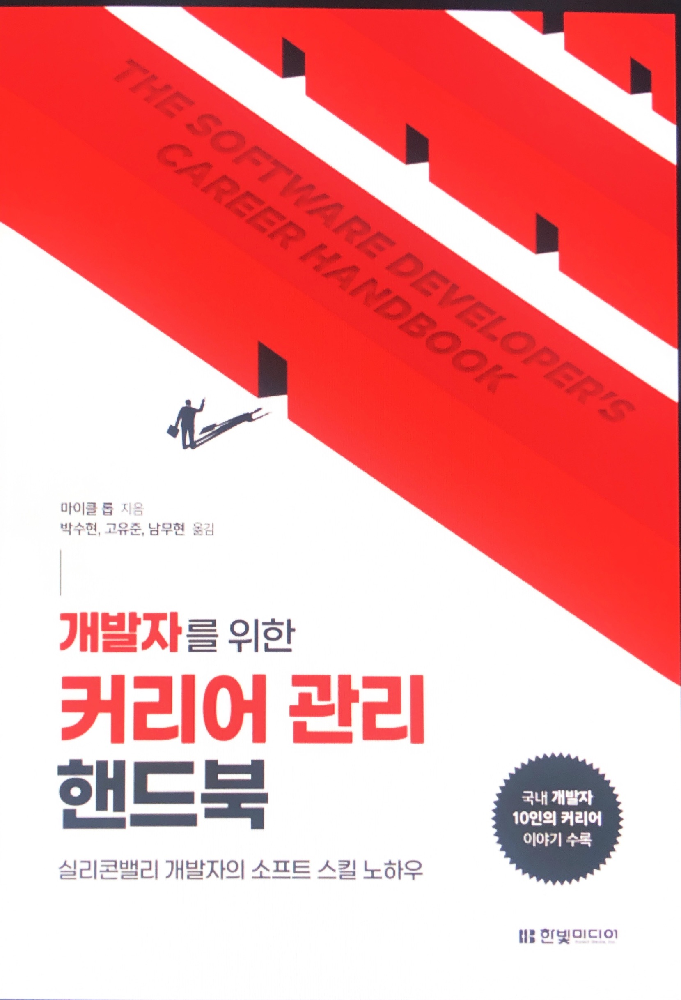

- ★★★☆☆ May 9, 2024 → May 24, 2024 [개발자를 위한 커리어 관리 핸드북](https://www.hanbit.co.kr/store/books/look.php?p_code=B5947588088)
    - [The Software Developer's Career Handbook Book](https://www.oreilly.com/library/view/the-software-developers/9781098116668/)

최근엔 개발자의 커리어가 크게 indivisual contributor와 manager 두 가지로 나뉜다는 게 꽤 익숙하다. 그래서 그중 한 가지에 좀 더 집중하거나, 둘 중 어느 방향이건 커리어 전반적으로 경력을 쌓을수록 필요한 기술로 흔히 soft skill이라 부르는 분야에 대한 책을 꽤 흔하게 볼 수 있다.

이 책은 소프트 스킬과 함께 관리자로 가는 길에 대한 책이다. 유사한 주제의 다른 책들과 비교해 보면 (비록 미국식이라 때로는 받아들여지지 않긴 하지만) 전반적으로 유머를 통해 가볍지 않은 주제를 가볍게, 마음 편하게 읽을 수 있게 배려한 점이 좋다. 유쾌하게 읽을 수 있다고 해도 선뜻 쉽게 읽기 어려울 수도 있다. 저자가 작성한 본문만 46장까지 600 페이지가 넘고, 국내 개발자 10인의 커리어 이야기까지 합치면 전체는 700 페이지가 넘는 분량이다. 하지만 챕터 하나의 분량은 많지 않아서 하나씩 시간 날 때마다 나눠 읽으면 어느 사이 진도가 나갈 수 있는 좋은 책이다.

읽으면서 따로 기록하고 다시 읽기 위해 남겨둔 부분들이다. 조직, 문화, 관리자, 리더십, 신뢰, … 모두 중요하고 하나하나 파고들기 위해서는 어렵고 쉽지 않은 주제들이다. specialist일수록 좋은 평가를 받는 개발자로 지낼 때와는 다르게 관리자는 확실히 generalist여야 한다는 생각이 든다. 개발자는 하나를 꽤 잘하면 못 하는 영역이 있어도, 잘하는 영역의 쓸모가 확실하기 때문에 큰 문제가 생기지 않는다. 매니저는 하나라도 평균 이하로 가게 되면 시간이 흐르면 구성원이건, 문화건, 기술적인 결함이건 어떤 식으로든 담당하는 조직에 문제가 발생한다. 문제의 조짐이 보이거나, 처음 맞이하는 상황이 혼란스러울 때 (매니저의 길을 걸을/걷는 사람들에게) 이 책이 도움이 될 수 있다.

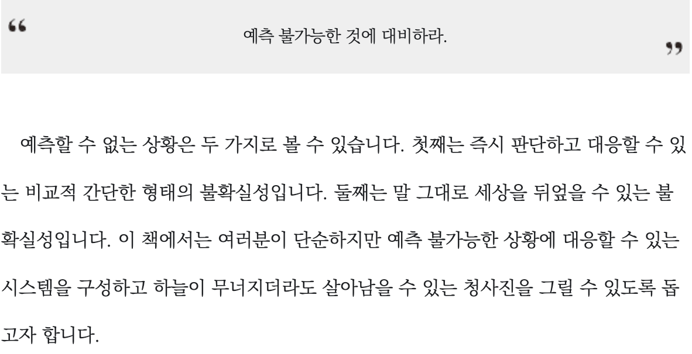

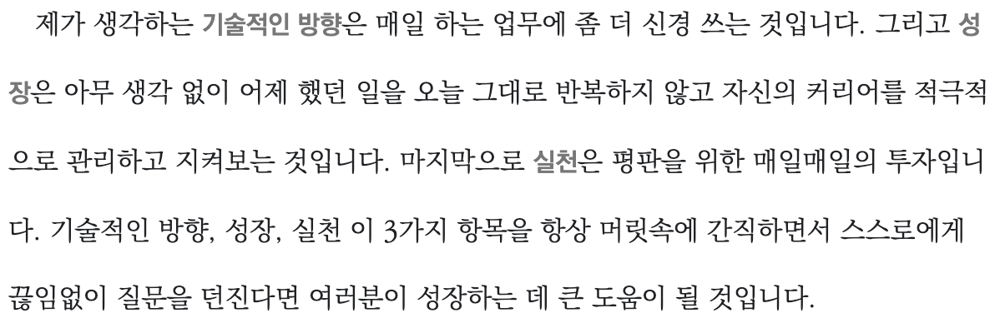

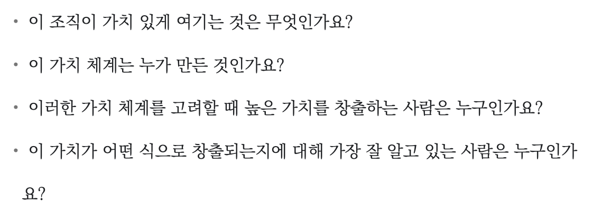

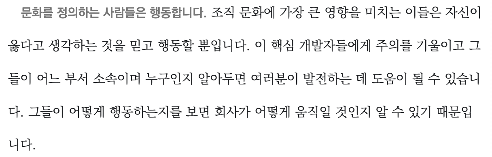

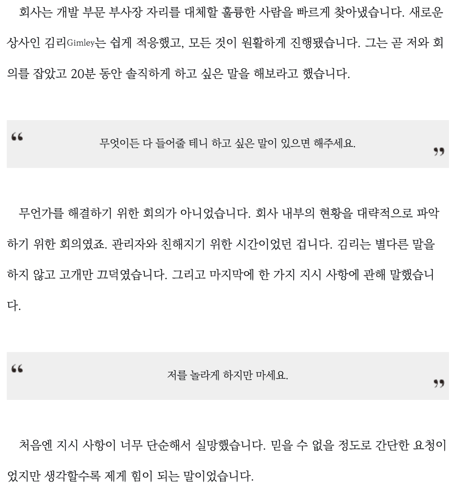

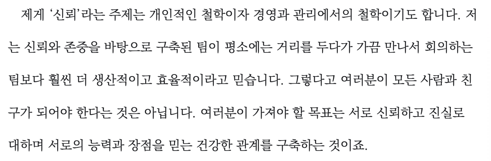

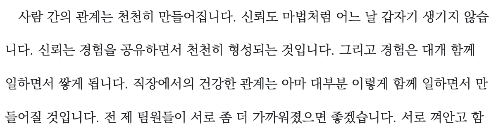

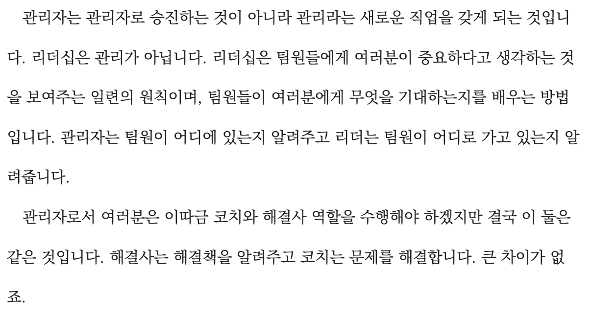

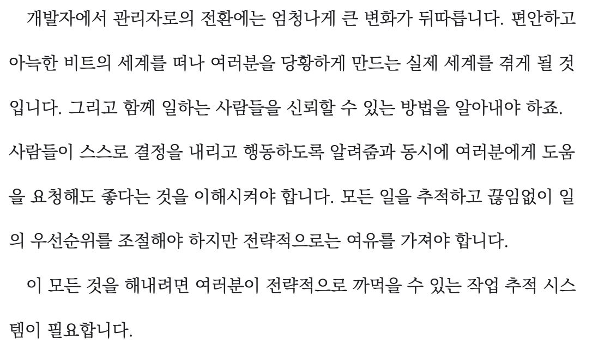

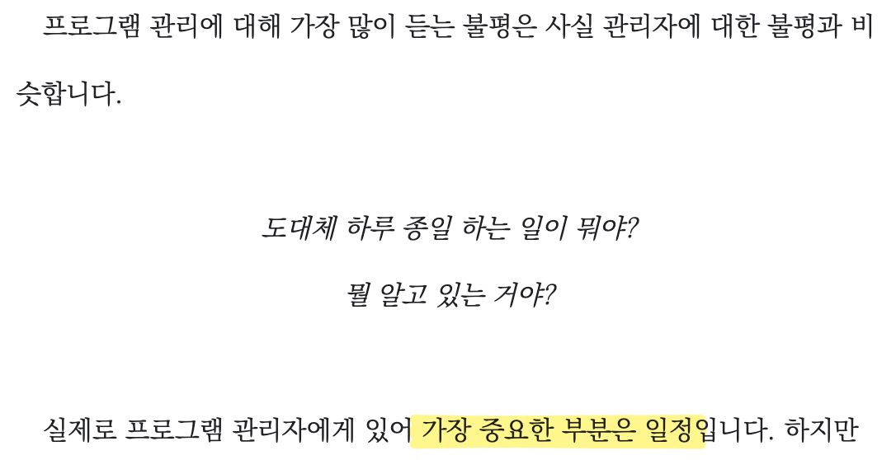

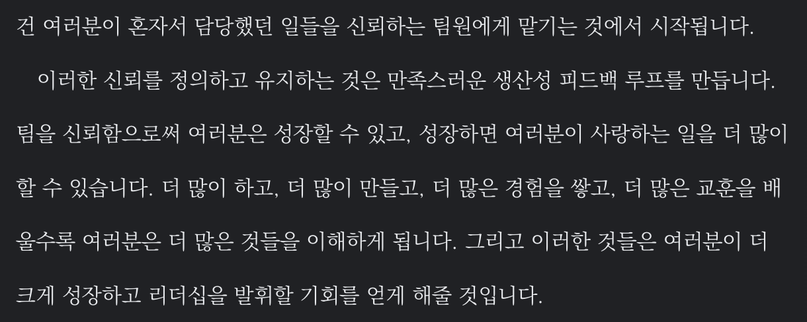
