생각에 관한 생각 프로젝트
=========================
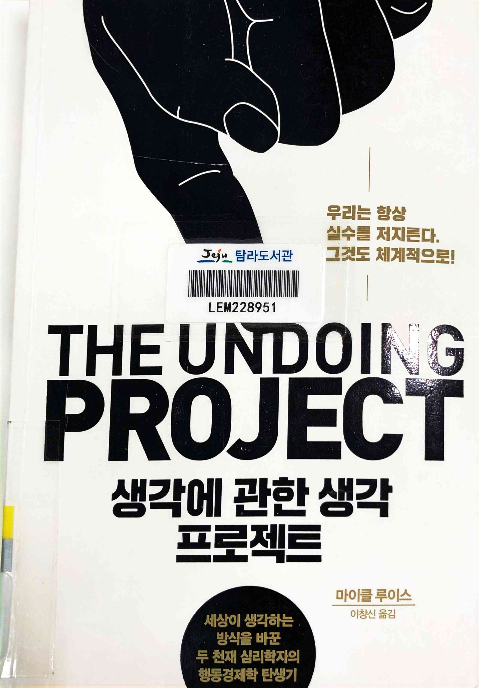

# 1 유방남
* 휴스턴 로케츠에서 Marc Gasol의 신체적인 특징으로 붙인 좋지 않은 별명. 전형적인 농구 선수의 신체가 아니긴 하지만, 이런 저급한 별명을 붙였을 줄은 몰랐다. 이것도 양키 감성으로 이해해야 하나?

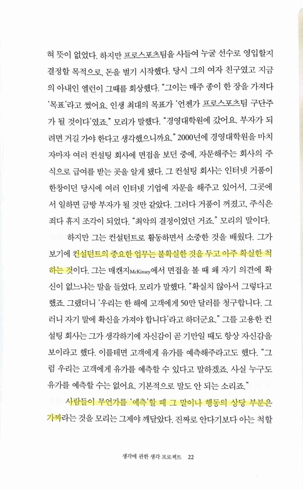

> 컨설턴트의 중요한 업무는 불확실한 것을 두고 아주 확실한 척하는 것
>
> 사람들이 무언가를 '예측'할 때 그 말이나 행동의 상당 부분은 가짜

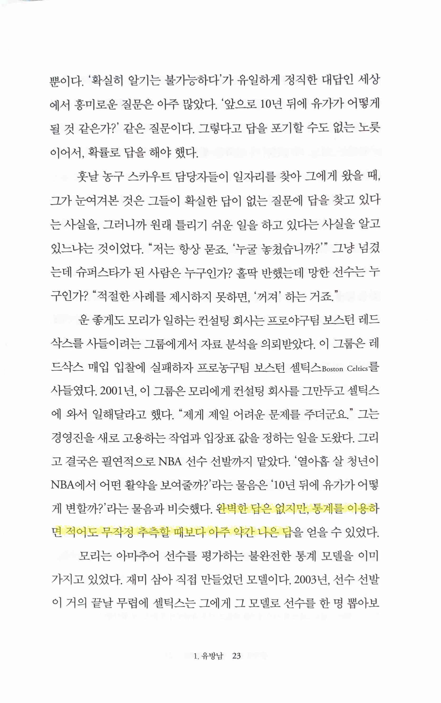

> 완벽한 답은 없지만, 통계를 이용하면 적어도 무작정 추측할 때보다 아주 약간 나은 답

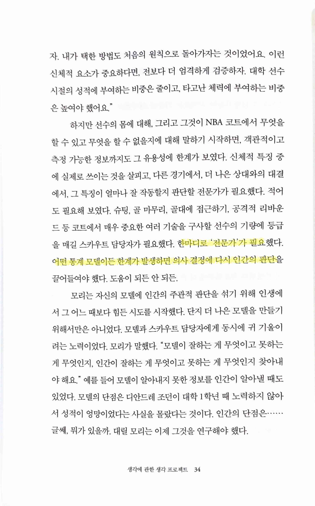

> 한마디로 '전문가'가 필요했다. 어떤 통계 모델이든 한계가 발생하면 의사 결정에 다시 인간의 판단을 끌어들여야 했다. 도움이 되든 안 되든.

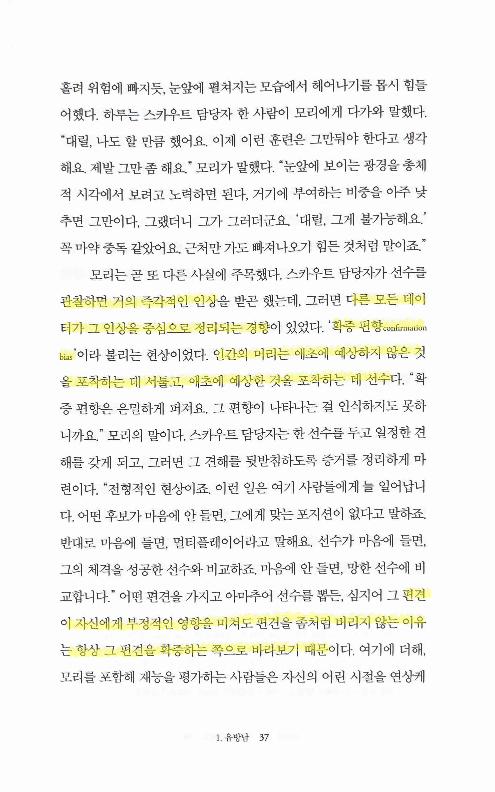

> 관찰하면 거의 즉각적인 인상을 받곤 했는데, 그러면 다른 모든 데이터가 그 인상을 중심으로 정리되는 경향이 있었다. `'확증 편향 confirmation bias'`이라 불리는 현상이었다. 인간의 머리는 애초에 예상하지 않은 것을 포착하는 데 서툴고, 애초에 예상한 것을 포착하는 데 선수다.
>
> 편견이 자신에게 부정적인 영향을 미쳐도 편견을 좀처럼 버리지 않는 이유는 항상 그 편견을 확증하는 쪽으로 바라보기 때문

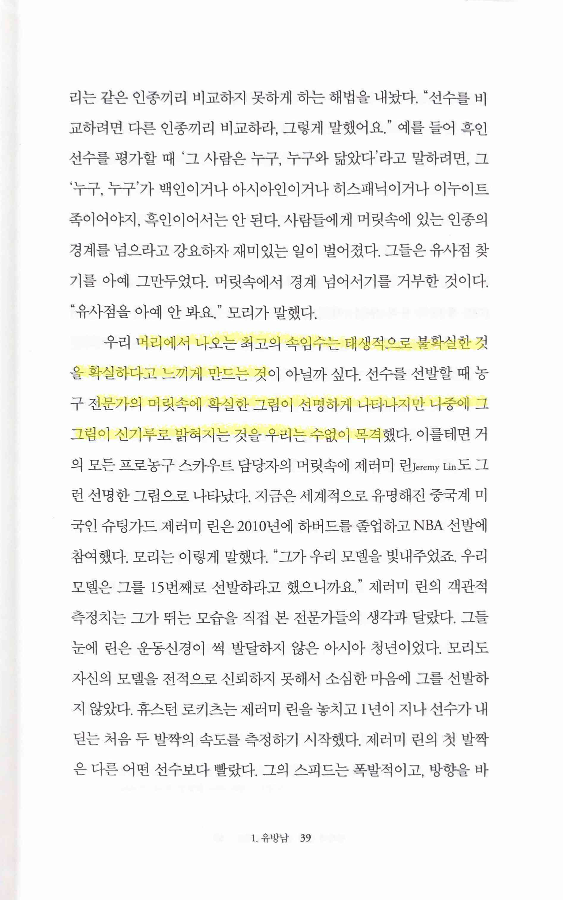

> 우리 머리에서 나오는 최고의 속임수는 태생적으로 불확실한 것을 확실하다고 느끼게 만드는 것... 전문가의 머릿속에 확실한 그림이 선명하게 나타나지만 나중에 그 그림이 신기루로 밝혀지는 것을 우리는 수없이 목격

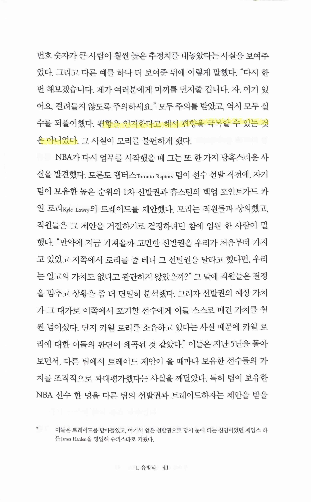

> 편향을 인지한다고 해서 편향을 극복할 수 있는 것은 아니었다.

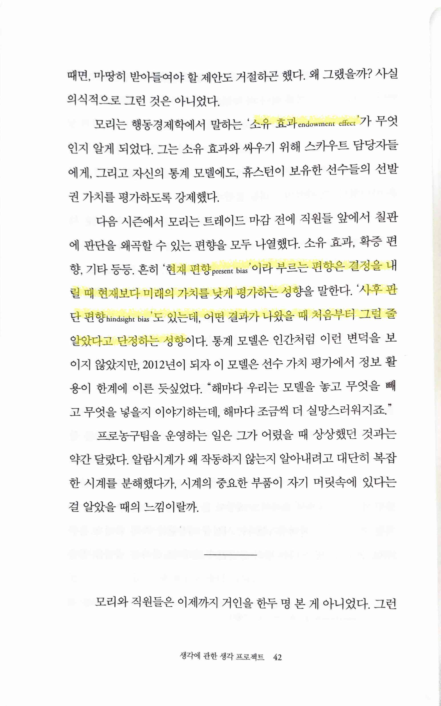

> `'소유 효과 endowment effect'`
>
> `'현재 편향 present bias'` 결정을 내릴 때 현재보다 미래의 가치를 낮게 평가하는 성향
>
> `'사후 판단 편향 hindsight bias'` 어떤 결과가 나왔을 때 처음부터 그럴 줄 알았다고 단정하는 성향

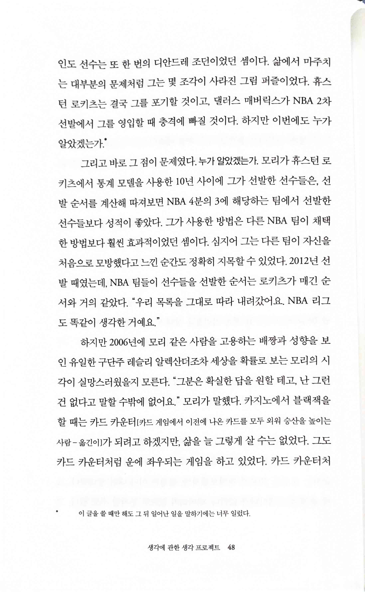

* 대릴 모리가 생각보다 훨씬 이전부터 능력을 보여주고 있었다는 점이 놀라웠다. 새로운 방식을 탐구하는 사람도 많지만, 이런 성향의 사람을 고용하는 경영진이 많다는 게 사실 더 놀랍다.

# 2 아웃사이더
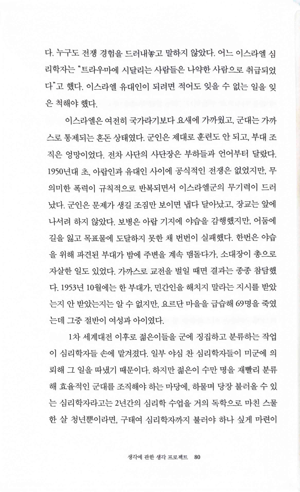

* 이스라엘의 상황에 대해 약간이나마 알 수 있던 힘들었던 시절의 이야기. 편견을 약간이나마 걷어낼 수 있었다.

> `뮐러리어 착시`
>
> 이처럼 단순한 경우에도 감각이 현실을 압도한다면, 복잡한 경우는 오죽하겠는가?

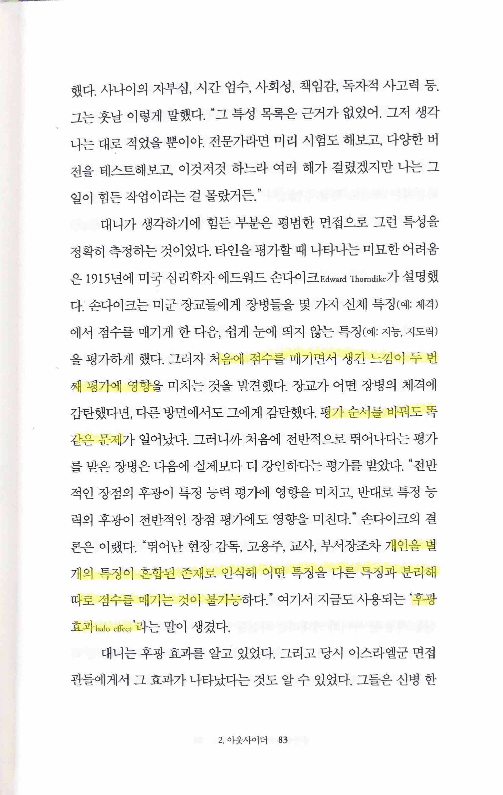

> 처음에 점수를 매기면서 생긴 느낌이 두 번째 평가에 영향. 평가 순서를 바꿔도 똑같은 문제... 개인을 별개의 특징이 혼합된 존재로 인식해 어떤 특징을 다른 특징과 분리해 따로 점수를 매기는 것이 불가능 `'후광 효과 halo effect'`

# 3 내부자
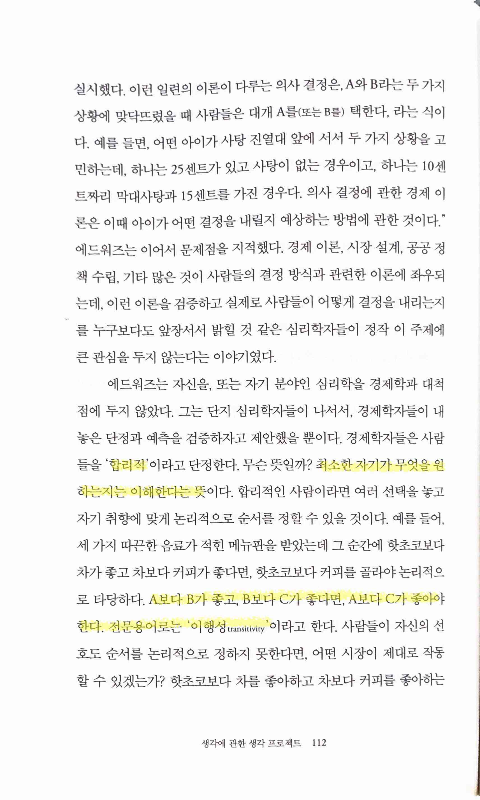

> '합리적'? 최소한 자기가 무엇을 원하는지는 이해한다는 뜻
>
> A보다 B가 좋고, B보다 C가 좋다면, A보다 C가 좋아야 한다. 전문용어로는 `'이행성 transitivity'`

# 4 실수
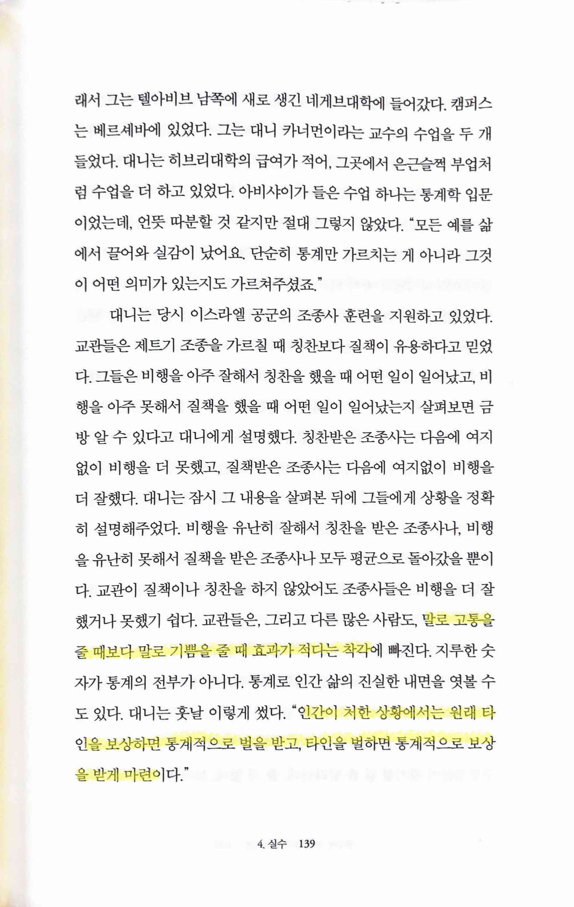

> 말로 고통을 줄 때보다 말로 기쁨을 줄 때 효과가 적다는 착각... "인간이 처한 상황에서는 원래 타인을 보상하면 통계적으로 벌을 받고, 타인을 벌하면 통계적으로 보상을 받게 마련이다."

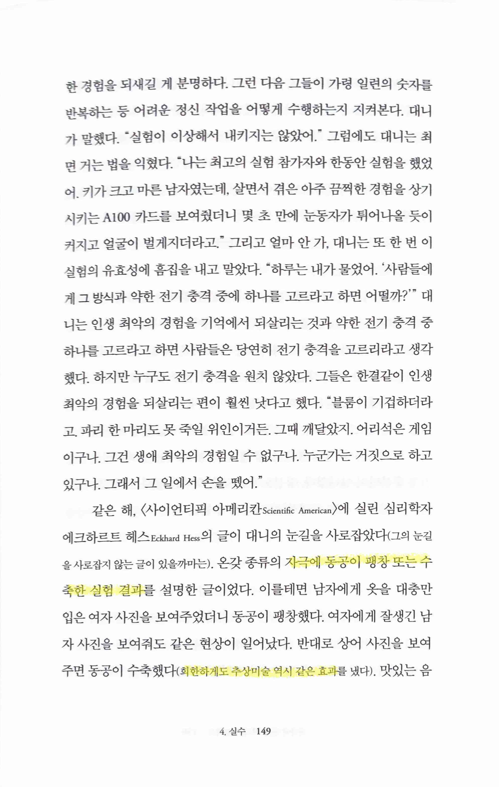

> 온갖 종류의 자극에 동공이 팽창 또는 수축한 실험 결과
* 추상미술에 동공이 수축하는 건 거의 대다수의 사람들에겐 당연하고 자연스럽지 않을까?

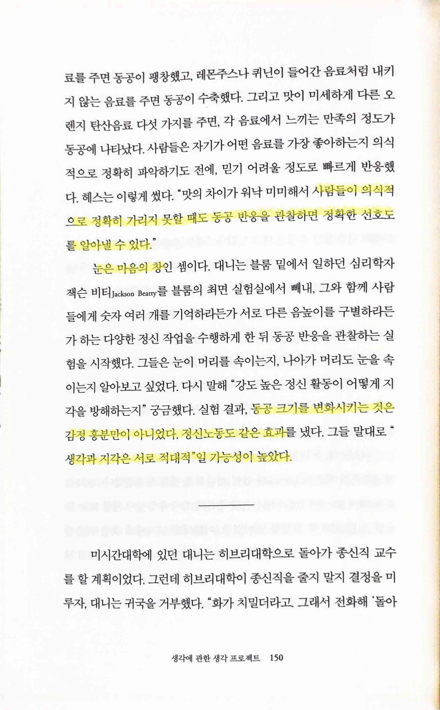

> 사람들이 의식적으로 정확히 가리지 못할 때도 동공 반응을 관찰하면 정확한 선호도를 알아낼 수 있다.
>
> 눈은 마음의 창인 셈
>
> 동공 크기를 변화시키는 것은 감정 흥분만이 아니었다. 정신노동도 같은 효과... “생각과 지각은 서로 적대적" 일 가능성이 높았다.

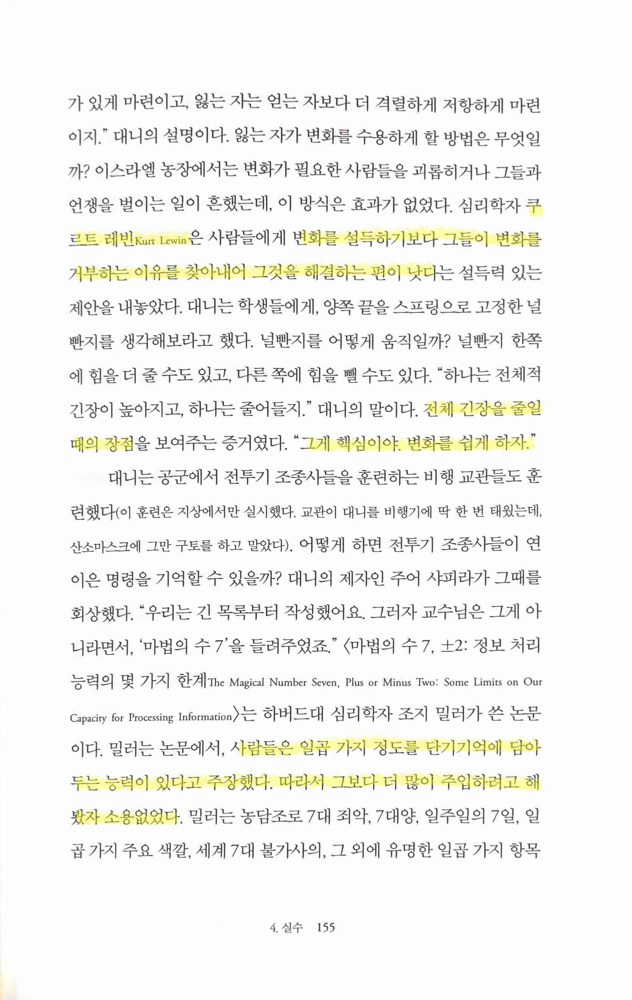

> 심리학자 쿠르트 레빈 Kurt Lewin 변화를 설득하기보다 그들이 변화를 거부하는 이유를 찾아내어 그것을 해결하는 편이 낫다... 전체 긴장을 줄일 때의 장점... "그게 핵심이야. 변화를 쉽게 하자."
>
> 하버드대 심리학자 조지 밀러. 사람들은 일곱 가지 정도를 단기기억에 담아두는 능력이 있다고 주장했다. 따라서 그보다 더 많이 주입하려고 해봤자 소용없었다.
* [The Magical Number Seven, Plus or Minus Two - Wikipedia](https://en.wikipedia.org/wiki/The_Magical_Number_Seven,_Plus_or_Minus_Two)

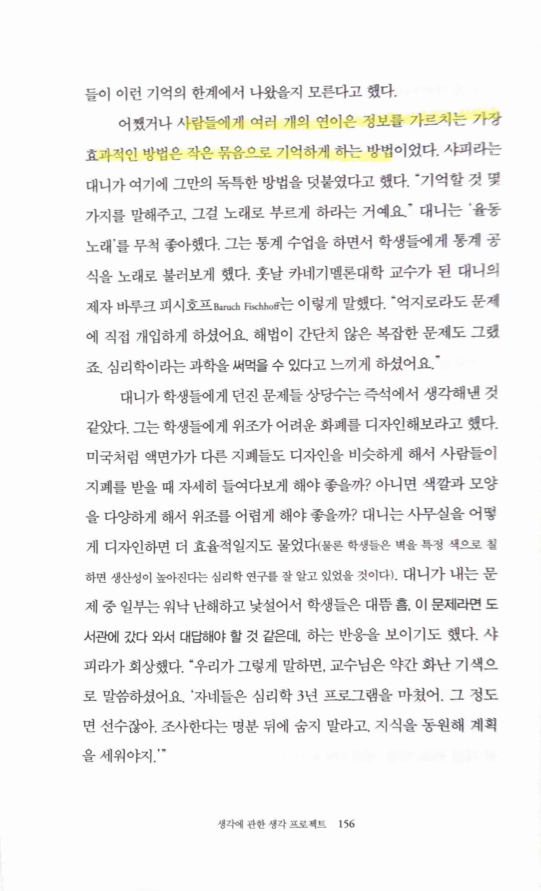

> 사람들에게 여러 개의 연이은 정보를 가르치는 가장 효과적인 방법은 작은 묶음으로 기억하게 하는 방법

# 5 충돌
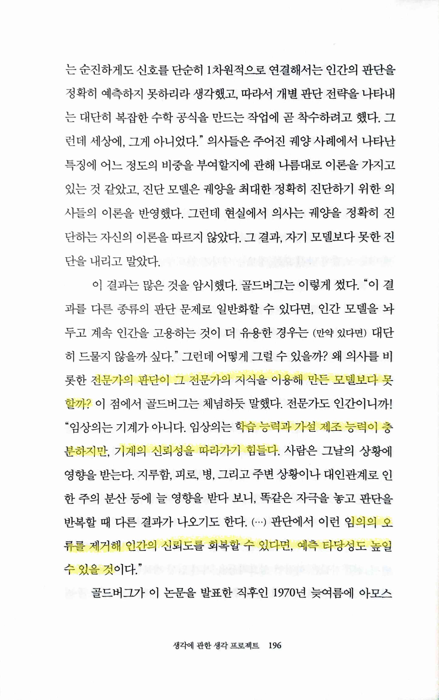

> 왜 전문가의 판단이 그 전문가의 지식을 이용해 만든 모델보다 못할까? 학습 능력과 가설 제조 능력이 충분하지만, 기계의 신뢰성을 따라가기 힘들다... 판단에서 이런 임의의 오류를 제거해 인간의 신뢰도를 회복할 수 있다면, 예측 타당성도 높일수 있을 것

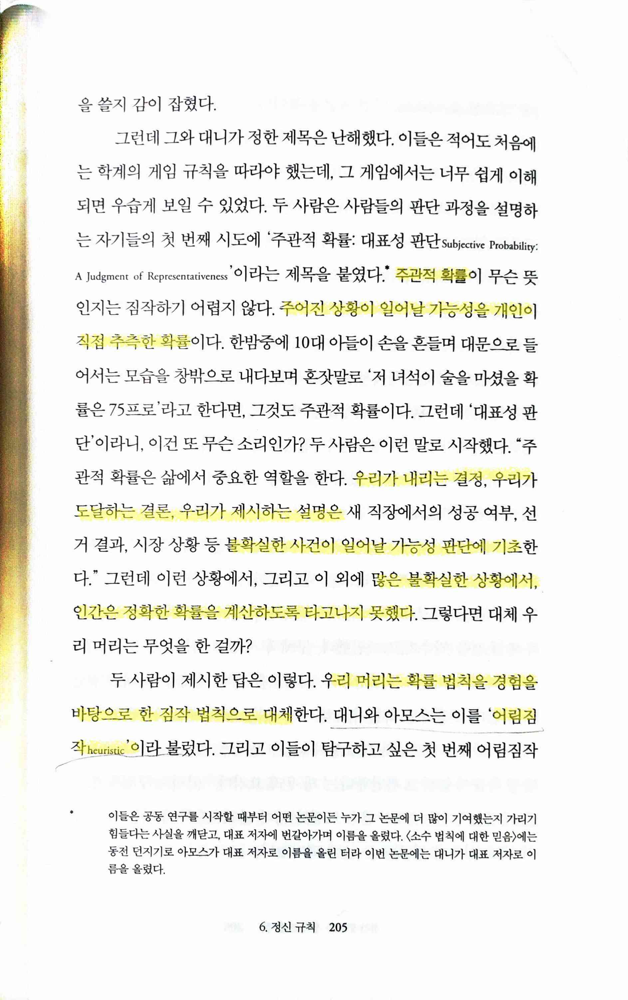

> 주관적 확률. 주어진 상황이 일어날 가능성을 개인이 직접 추측한 확률... 우리가 내리는 결정, 우리가 도달하는 결론, 우리가 제시하는 설명은... 불확실한 사건이 일어날 가능성 판단에 기초... 많은 불확실한 상황에서,인간은 정확한 확률을 계산하도록 타고나지 못했다.
>
> 우리 머리는 확률 법칙을 경험을 바탕으로 한 짐작 법칙으로 대체 `'어림짐작 heuristic'`

> `'대표성 representativeness'` 사람들은 판단을 할 때, 판단 대상을 머릿속에 있는 어떤 모델과 비교한다
>
> 구체적 사례가 머릿속에 있는 대표적 이미지나 느낌과 유사할수록, 사람들은 해당 사례가 그 대표 집단에 속한다고 생각할 확률이 높다.

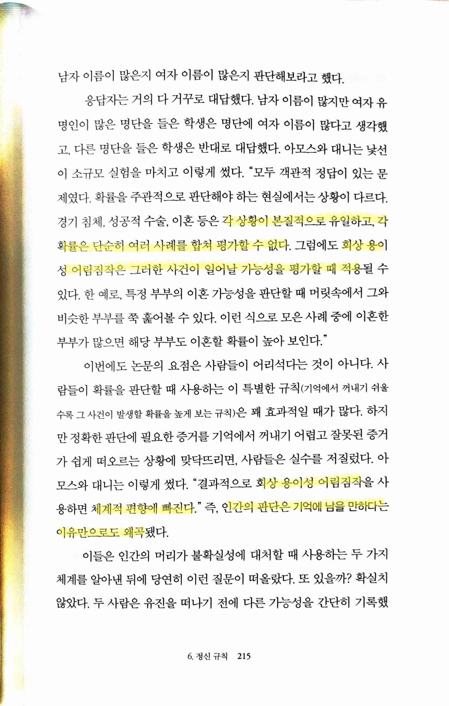

> 각 상황이 본질적으로 유일하고, 각 확률은 단순히 여러 사례를 합쳐 평가할 수 없다. 그럼에도 회상 용이성 어림짐작은 그러한 사건이 일어날 가능성을 평가할 때 적용
>
> "결과적으로 회상 용이성 어림짐작을 사용하면 체계적 편향에 빠진다." 즉, 인간의 판단은 기억에 남을 만하다는 이유만으로도 왜곡

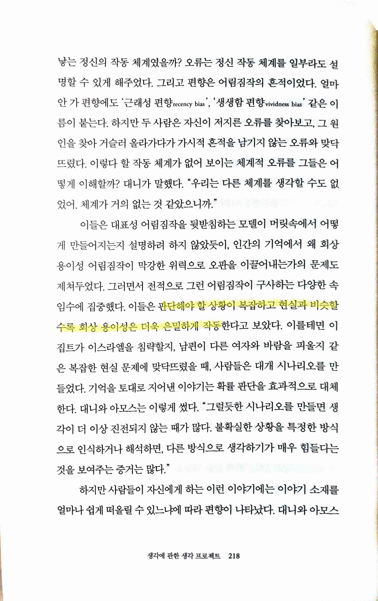

> 판단해야 할 상황이 복잡하고 현실과 비슷할수록 회상 용이성은 더욱 은밀하게 작동

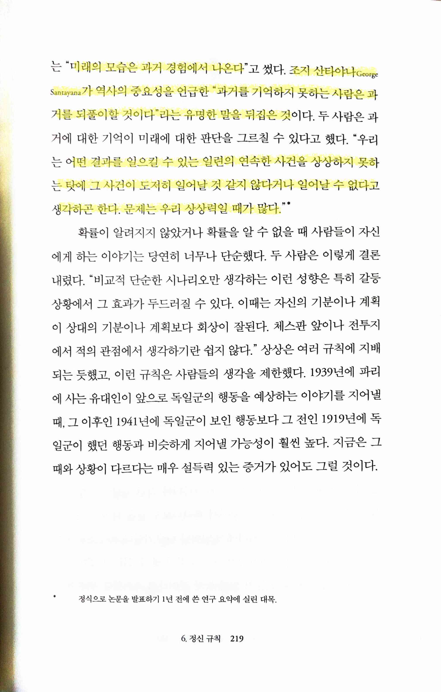

> "미래의 모습은 과거 경험에서 나온다". 조지 산타야나 George Santayana가 역사의 중요성을 언급한 "과거를 기억하지 못하는 사람은 과거를 되풀이할 것이다"라는 유명한 말을 뒤집은 것이다. 과거에 대한 기억이 미래에 대한 판단을 그르칠 수 있다고 했다. "우리는 어떤 결과를 일으킬 수 있는 일련의 연속한 사건을 상상하지 못하는 탓에 그 사건이 도저히 일어날 것 같지 않다거나 일어날 수 없다고생각하곤 한다. 문제는 우리 상상력일 때가 많다."

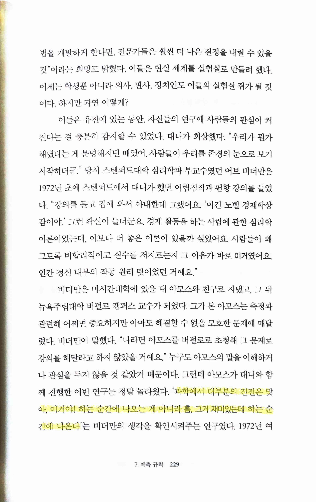

> '과학에서 대부분의 진전은 맞아 이거야! 하는 순간에 나오는 게 아니라 흠, 그거 재미있는데 하는 순간에 나온다'

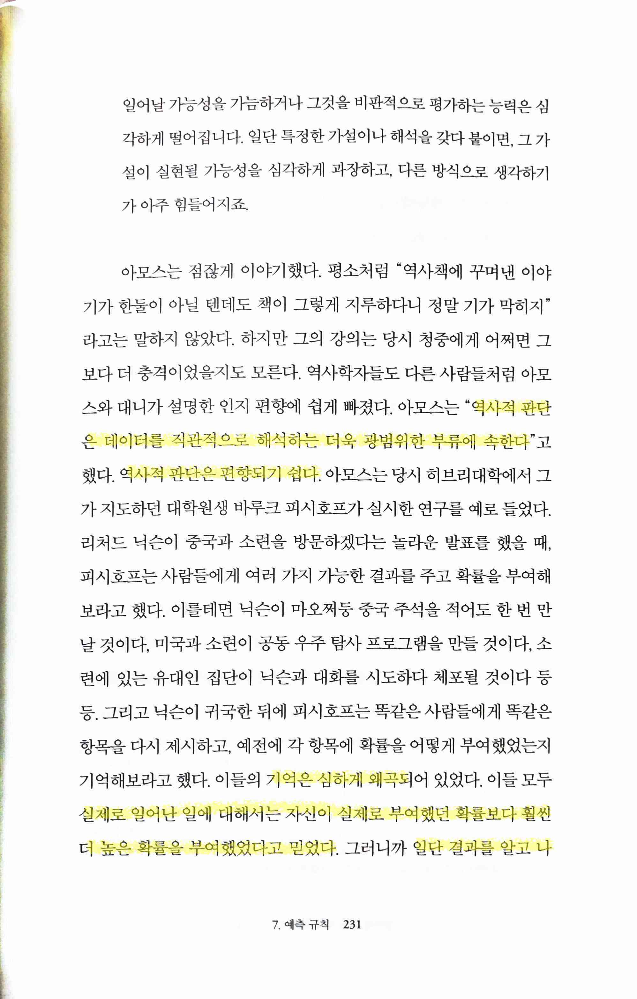 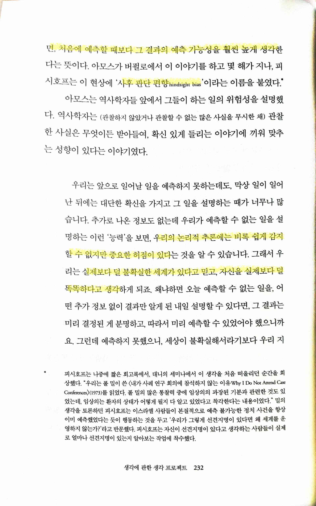

> "역사적 판단은 데이터를 직관적으로 해석하는 더욱 광범위한 부류에 속한다". 역사적 판단은 편향되기 쉽다... 기억은 심하게 왜곡... 실제로 일어난 일에 대해서는 자신이 실제로 부여했던 확률보다 훨씬 더 높은 확률을 부여했었다고 믿었다. 일단 결과를 알고 나면, 처음에 예측할 때보다 그 결과의 예측 가능성을 훨씬 높게 생각한다는 뜻. `'사후 판단 편향 hindsight bias'`
>
> 우리의 논리적 추론에는 비록 쉽게 감지할 수 없지만 중요한 허점이 있다... 실제보다 덜 불확실한 세계가 있다고 믿고, 자신을 실제보다 덜 똑똑하다고 생각

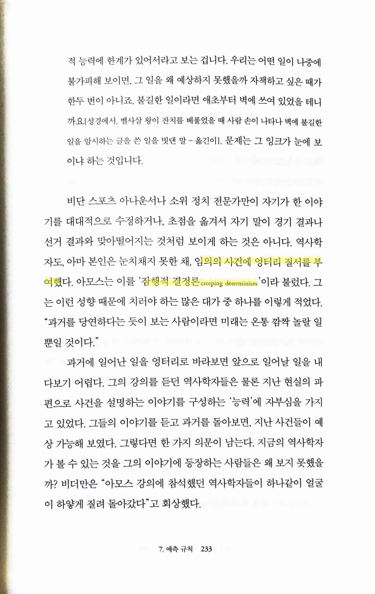

> 임의의 사건에 엉터리 질서 부여 `'잠행적 결정론 creeping determinism'`

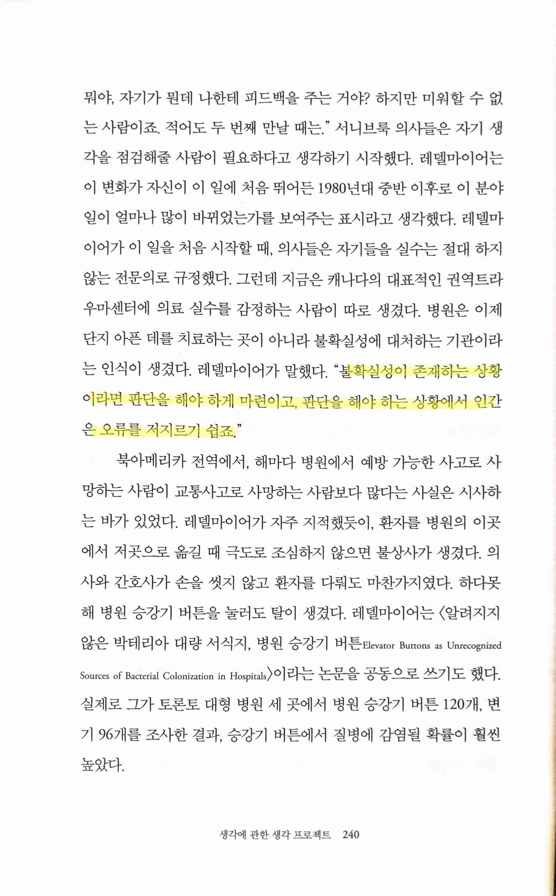

> "불확실성이 존재하는 상황이라면 판단을 해야 하게 마련이고, 판단을 해야 하는 상황에서 인간은 오류를 저지르기 쉽죠.”

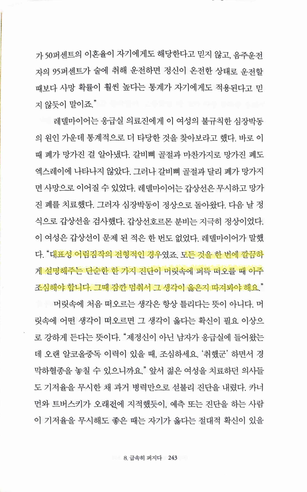

> "대표성 어림짐작의 전형적인 경우였죠. 모든 것을 한 번에 깔끔하게 설명해주는 단순한 한 가지 진단이 머릿속에 퍼뜩 떠오를 때 아주 조심해야 합니다. 그때 잠깐 멈춰서 그 생각이 옳은지 따져봐야 해요."

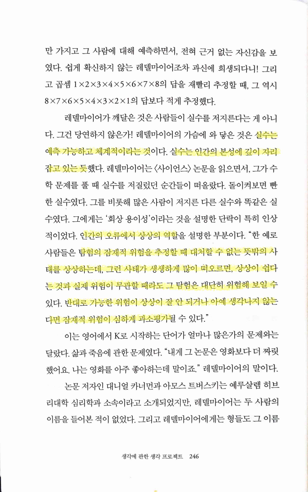

> 실수는 예측 가능하고 체계적. 실수는 인간의 본성에 깊이 자리잡고 있는 듯했다...인간의 오류에서 상상의 역할. "한 예로 사람들은 탐험의 잠재적 위험을 추정할 때 대처할 수 없는 뜻밖의 사태를 상상하는데, 그런 사태가 생생하게 많이 떠오르면, 상상이 쉽다는 것과 실제 위험이 무관할 때라도 그 탐험은 대단히 위험해 보일 수 있다. 반대로 가능한 위험이 상상이 잘 안 되거나 아예 생각나지 않는다면 잠재적 위험이 심하게 과소평가될 수 있다."

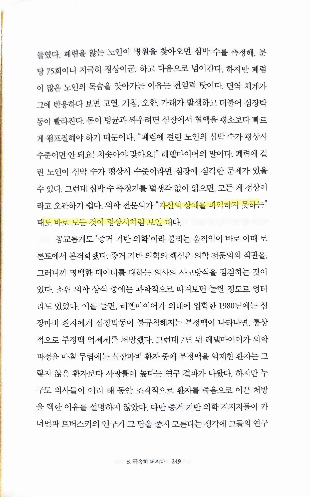

> "자신의 상태를 파악하지 못하는" 때도 바로 모든 것이 평상시처럼 보일 때

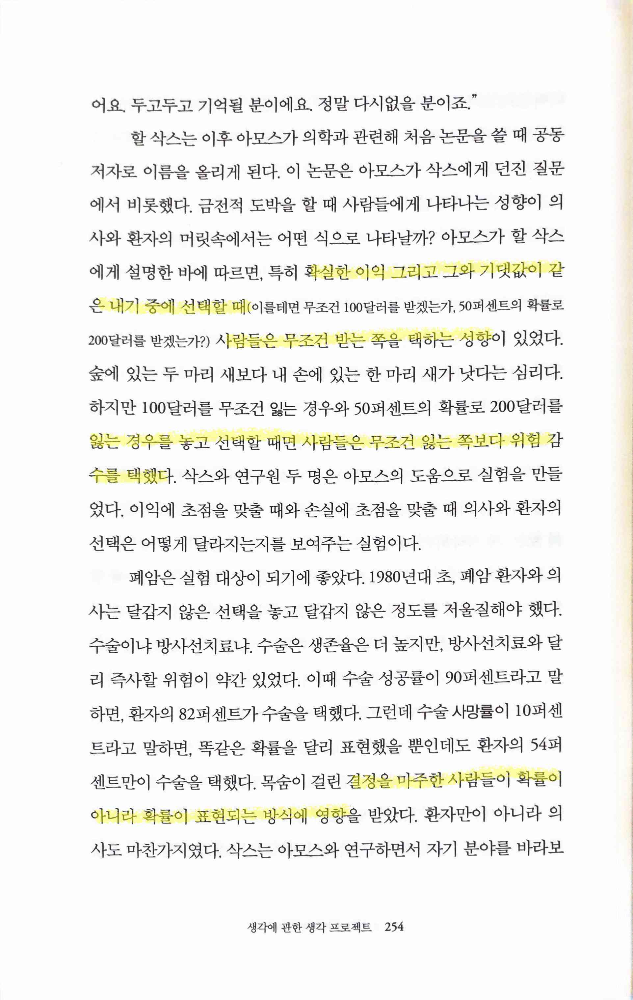

> 확실한 이익 그리고 그와 기댓값이 같은 내기 중에 선택할 때 사람들은 무조건 받는 쪽을 택하는 성향... 잃는 경우를 놓고 선택할 때면 사람들은 무조건 잃는 쪽보다 위험 감수
>
> 결정을 마주한 사람들이 확률이 아니라 확률이 표현되는 방식에 영향

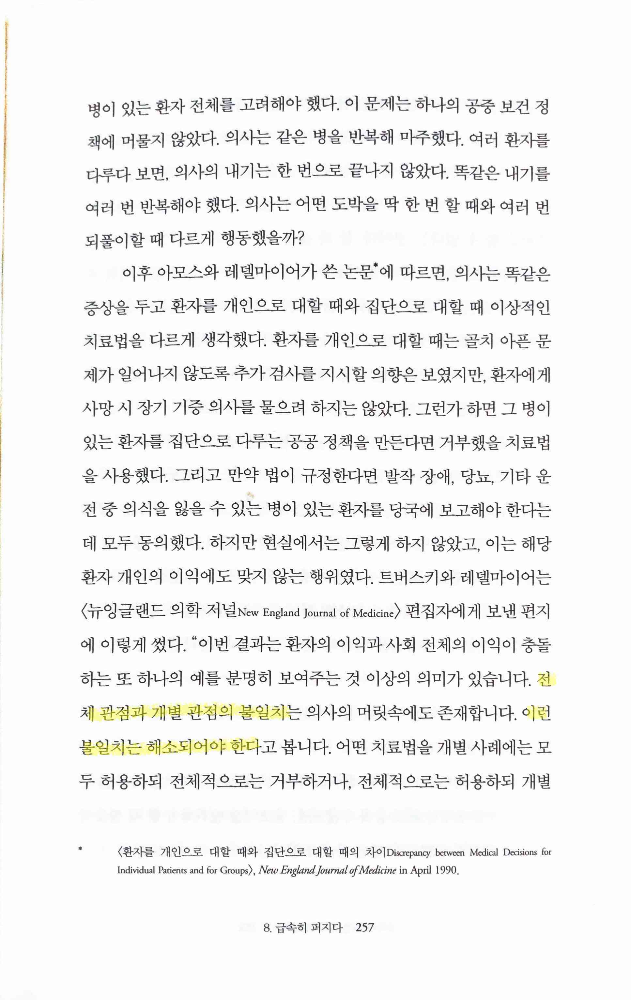

> 전체 관점과 개별 관점의 불일치. 이런 불일치는 해소되어야 한다

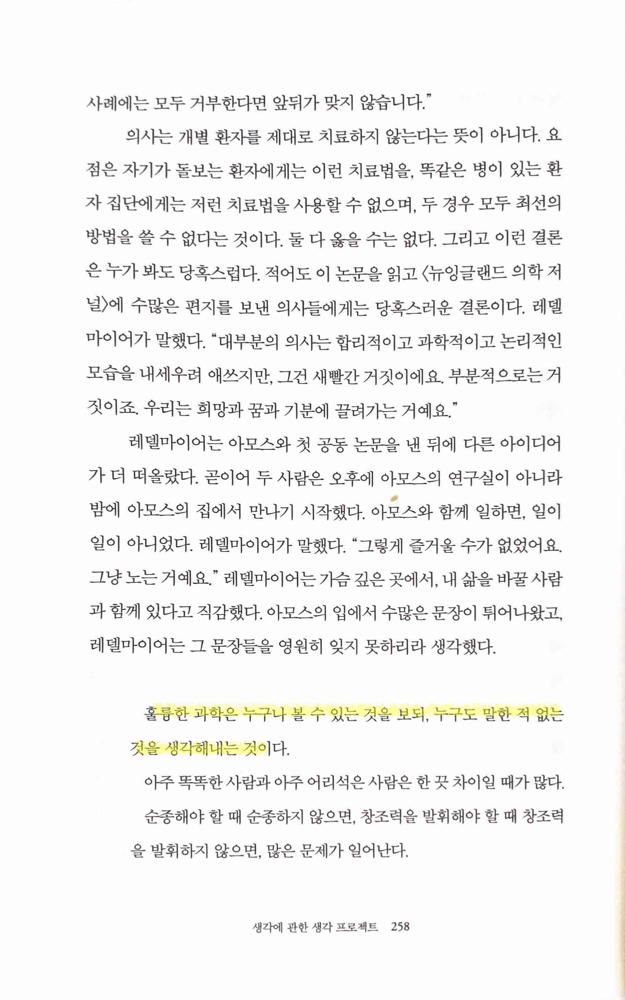

> 훌륭한 과학은 누구나 볼 수 있는 것을 보되, 누구도 말한 적 없는 것을 생각해내는 것

 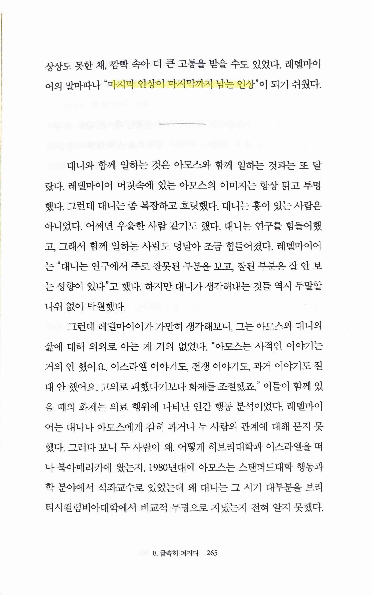

> 고통을 기억하는 것과 고통을 경험하는 것은 달랐다. 사람들은 고통이 최고조일 때를 기억했고, 고통이 끝나는 순간의 기분을 기억했다. 하지만 고통의 길이는 기억하지 못했다... 실험이 끝나는 순간의 고통이 적으면 고통의 총 길이가 길어도 개의치 않는다. `'정점과 종점 원칙 peak-end rule'`
>
> 마지막 인상이 마지막까지 남는 인상

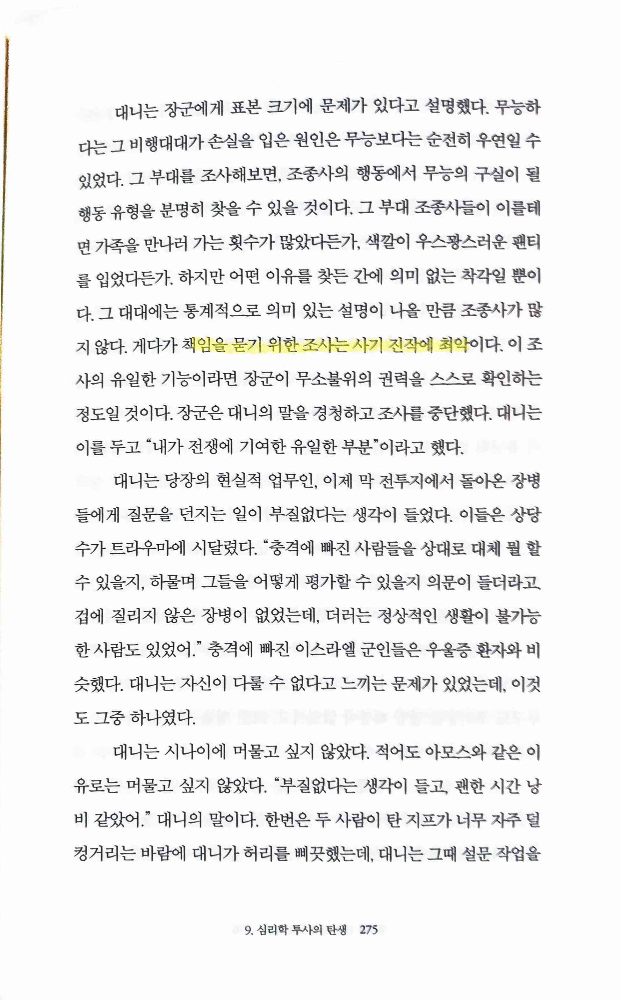

> 책임을 묻기 위한 조사는 사기 진작에 최악
* 그래서 STAR 기법 같은 게 필요

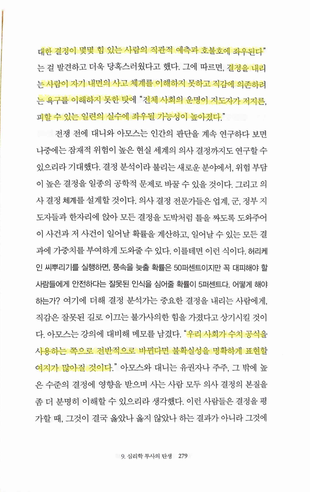

> 오늘날에도 수천 년 전과 마찬가지로 중대한 결정이 몇몇 힘 있는 사람의 직관적 예측과 호불호에 좌우된다"... 결정을 내리는 사람이 자기 내면의 사고 체계를 이해하지 못하고 직감에 의존하려는 욕구를 이해하지 못한 탓에 “전체 사회의 운명이 지도자가 저지른 피할 수 있는 일련의 실수에 좌우될 가능성이 높아졌다."
>
> “우리 사회가 수치 공식을 사용하는 쪽으로 전반적으로 바뀐다면 불확실성을 명확하게 표현할 여지가 많아질 것이다."

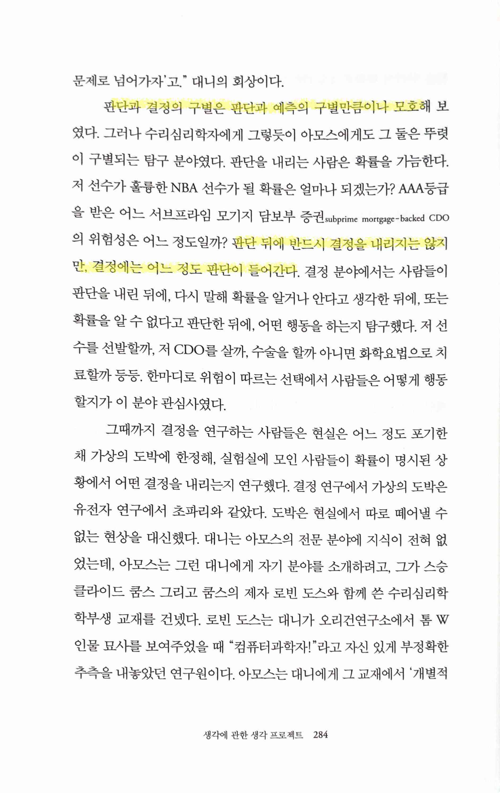

> 판단과 결정의 구별은 판단과 예측의 구별만큼이나 모호. 판단 뒤에 반드시 결정을 내리지는 않지만, 결정에는 어느 정도 판단이 들어간다.

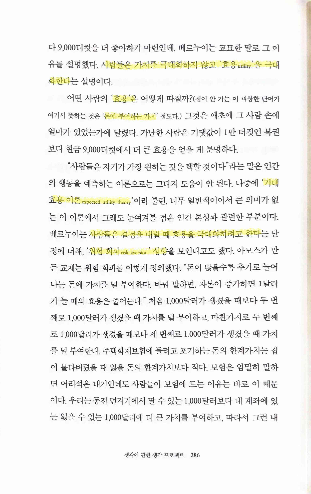

> 사람들은 가치를 극대화하지 않고 '효용 utility'을 극대화한다
>
> '효용' '돈에 부여하는 가치' 정도
>
> `'기대 효용 이론 expected utility theory'` 사람들은 결정을 내릴 때 효용을 극대화하려고 한다 '위험 회피 risk aversion'

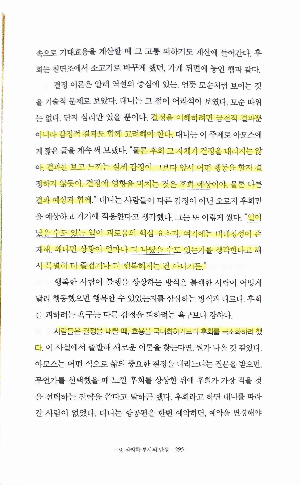

> 결정을 이해하려면 금전적 결과뿐 아니라 감정적 결과도 함께 고려해야 한다... “물론 후회 그 자체가 결정을 내리지는 않아. 결과를 보고 느끼는 실제 감정이 그보다 앞서 어떤 행동을 할지 결정하지 않듯이. 결정에 영향을 미치는 것은 후회 예상이야. 물론 다른 결과 예상과 함께."... "일어났을 수도 있는 일이 괴로움의 핵심 요소지. 여기에는 비대칭성이 존재해. 왜냐면 상황이 얼마나 더 나빴을 수도 있는가를 생각한다고 해서 특별히 더 즐겁거나 더 행복해지는 건 아니거든."
>
> 사람들은 결정을 내릴 때, 효용을 극대화하기보다 후회를 극소화하려 했다.

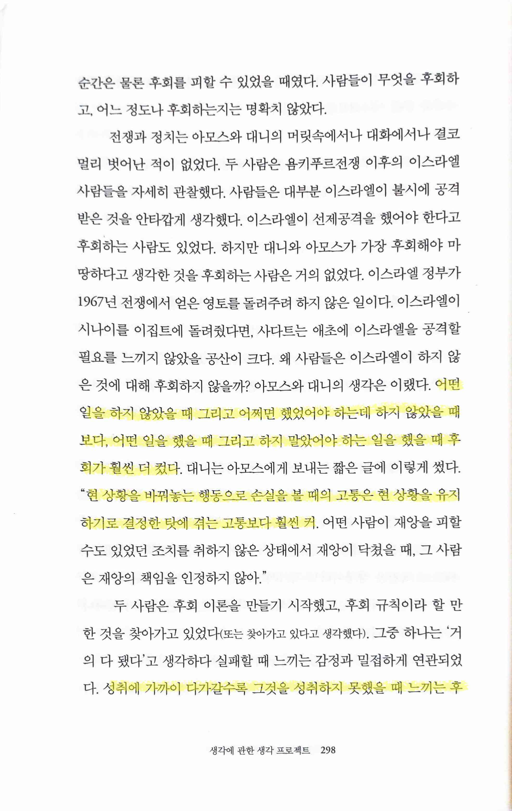 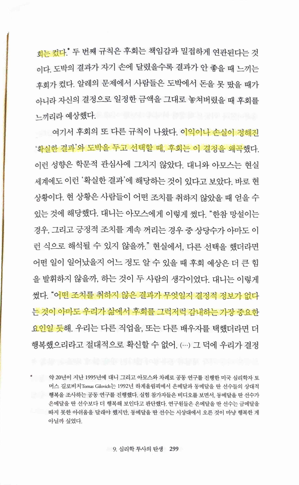

> 어떤 일을 하지 않았을 때 그리고 어쩌면 했었어야 하는데 하지 않았을 때보다, 어떤 일을 했을 때 그리고 하지 말았어야 하는 일을 했을 때 후회가 훨씬 더 컸다... “현 상황을 바꿔놓는 행동으로 손실을 볼 때의 고통은 현 상황을 유지하기로 결정한 탓에 겪는 고통보다 훨씬 커.
>
> 성취에 가까이 다가갈수록 그것을 성취하지 못했을 때 느끼는 후회는 컸다.
>
> 이익이나 손실이 정해진 '확실한 결과'와 도박을 두고 선택할 때, 후회는 이 결정을 왜곡... "어떤 조치를 취하지 않은 결과가 무엇일지 결정적 정보가 없다는 것이 아마도 우리가 삶에서 후회를 그럭저럭 감내하는 가장 중요한 요인일 듯해.

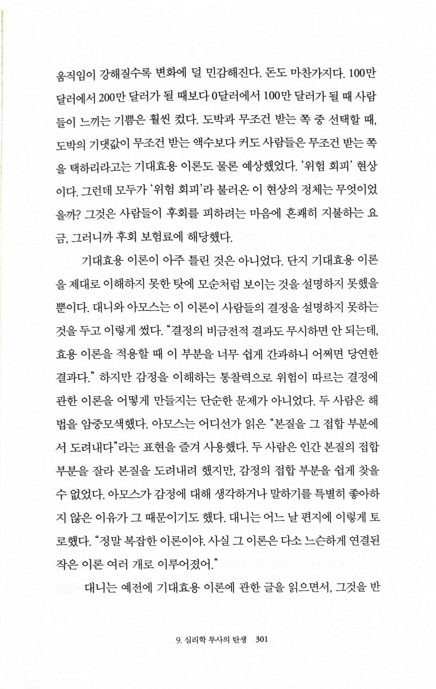 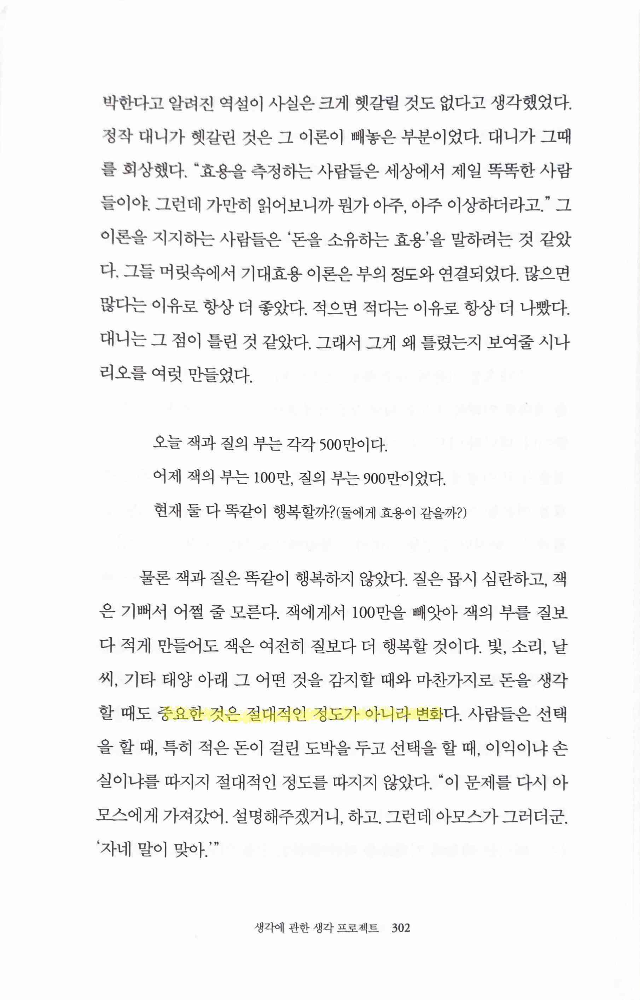

> 중요한 것은 절대적인 정도가 아니라 변화

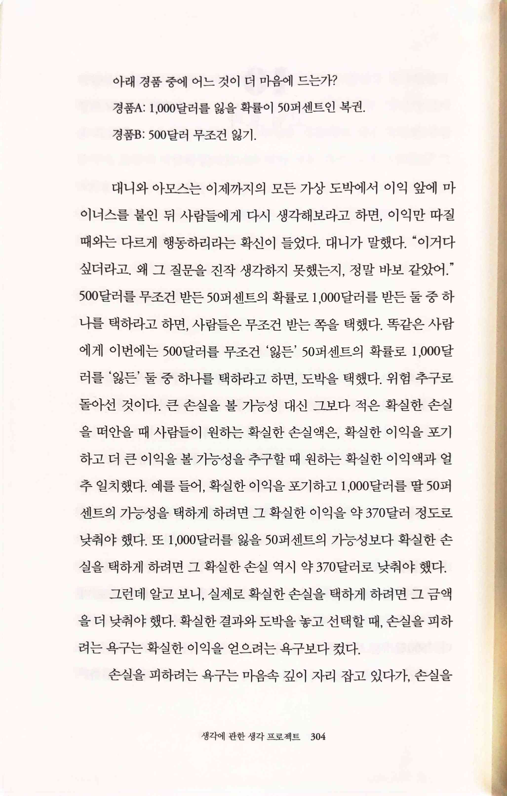

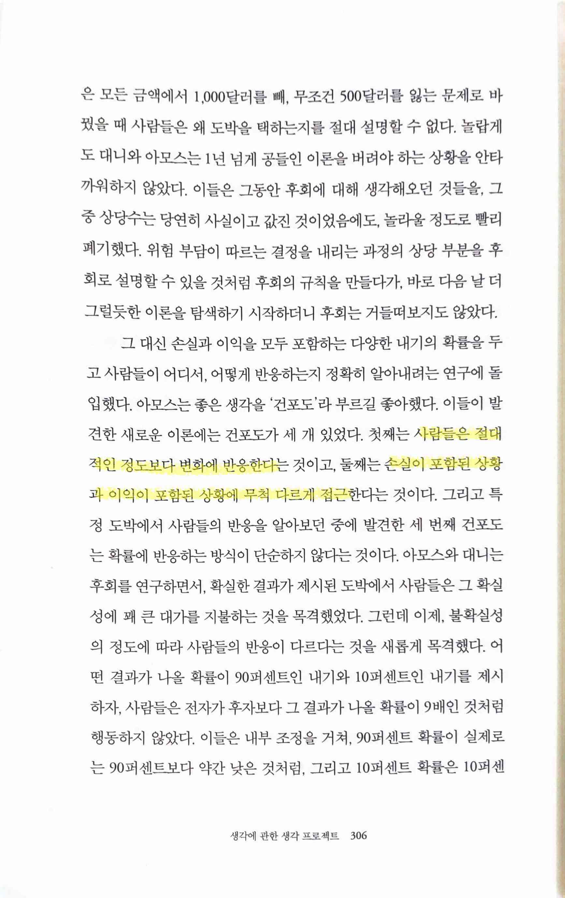

> 사람들은 절대적인 정도보다 변화에 반응... 손실이 포함된 상황과 이익이 포함된 상황에 무척 다르게 접근... 확률에 반응하는 방식이 단순하지 않다

> '위험 회피'를 보여주는 결과였다. 도박과 확실한 결과를 놓고 선택하는 사람은 도박의 기댓값보다 적은 액수라도 무조건 받기를 택한다. 효용이론에도 어긋나지 않는다.

> 잠재적 이익과 잠재적 손실에 맞닥뜨렸을 때 사람들의 기분이 사뭇 다르다는 점에 주목. 손실은 어떤 사람이 자신의 '준거점'보다 나쁜 상황에 처했을 때. 준거점은 출발점. 현재 내 상태. 현재 내 상태보다 더 나빠지면 손실

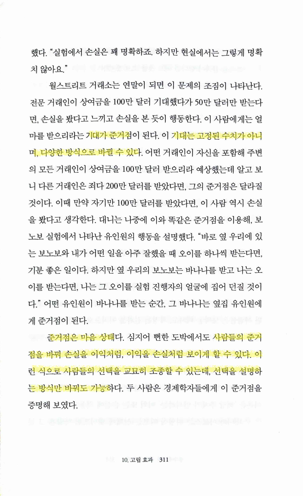

> 기대가 준거점. 기대는 고정된 수치가 아니며, 다양한 방식으로 바뀔 수 있다.
>
> 준거점은 마음 상태. 사람들의 준거점을 바꿔 손실을 이익처럼, 이익을 손실처럼 보이게 할 수 있다. 이런 식으로 사람들의 선택을 교묘히 조종할 수 있는데, 선택을 설명하는 방식만 바꿔도 가능

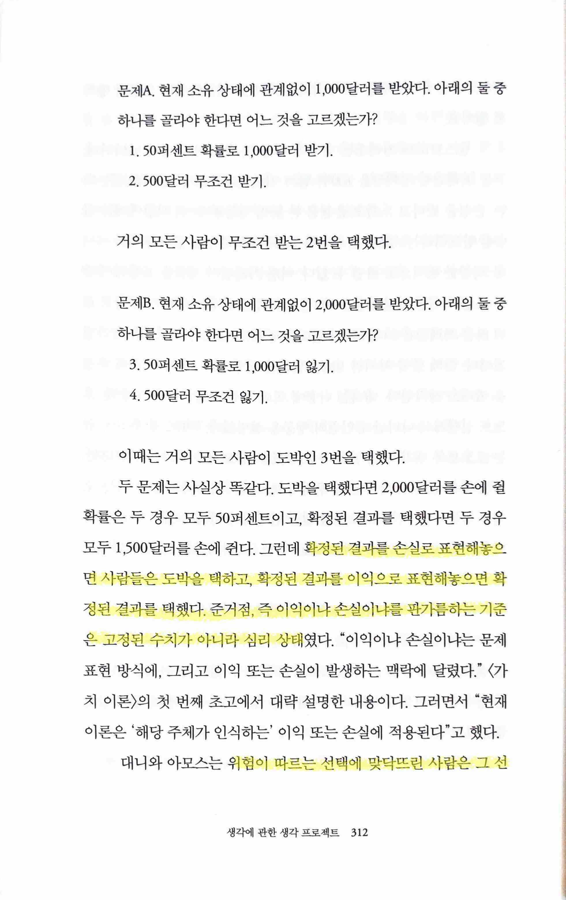 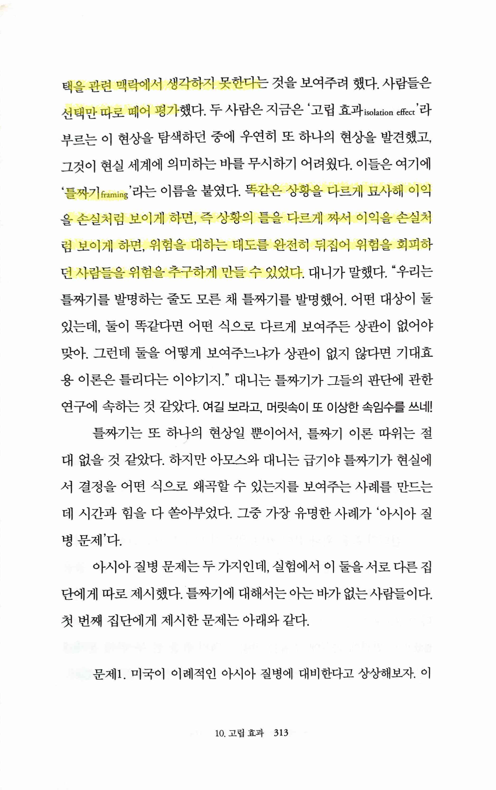 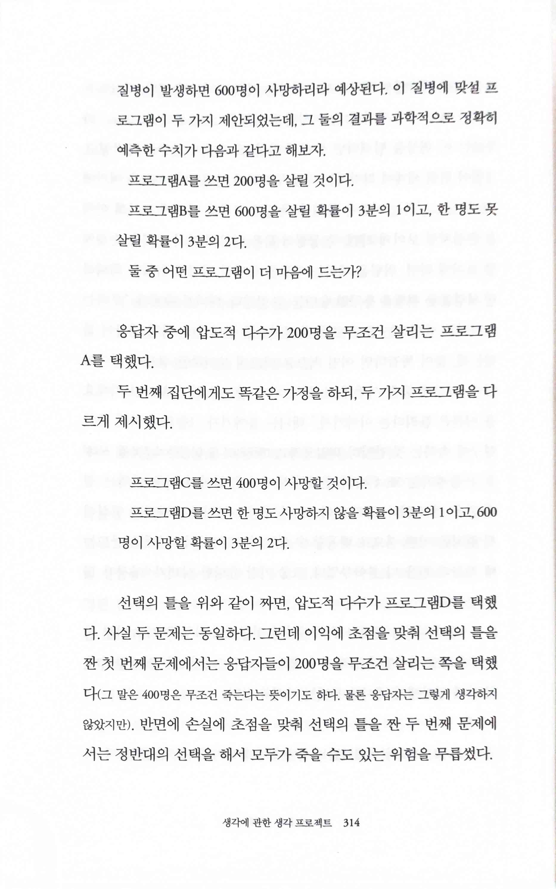 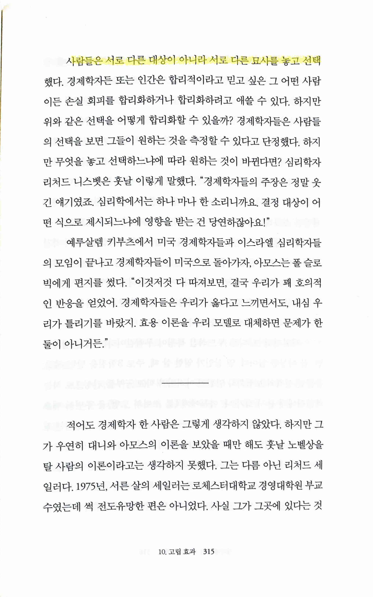

> 확정된 결과를 손실로 표현해놓으면 사람들은 도박을 택하고, 확정된 결과를 이익으로 표현해놓으면 확정된 결과를 택했다. 준거점, 즉 이익이나 손실이냐를 판가름하는 기준은 고정된 수치가 아니라 심리 상태
>
> 위험이 따르는 선택에 맞닥뜨린 사람은 그 선택을 관련 맥락에서 생각하지 못한다... 선택만 따로 떼어 평가... `'틀짜기 framing'` 똑같은 상황을 다르게 묘사해 이익을 손실처럼 보이게 하면, 즉 상황의 틀을 다르게 짜서 이익을 손실처럼 보이게 하면, 위험을 대하는 태도를 완전히 뒤집어 위험을 회피하던 사람들을 위험을 추구하게 만들 수 있었다.
>
> 사람들은 서로 다른 대상이 아니라 서로 다른 묘사를 놓고 선택

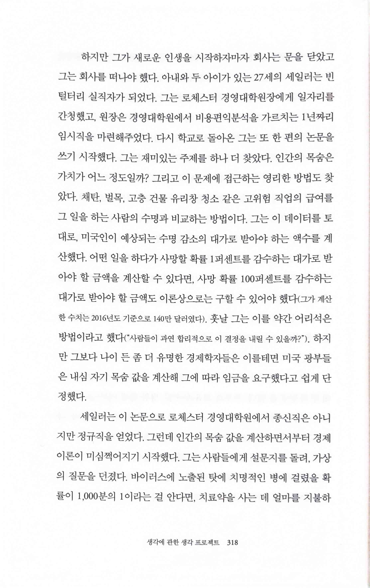 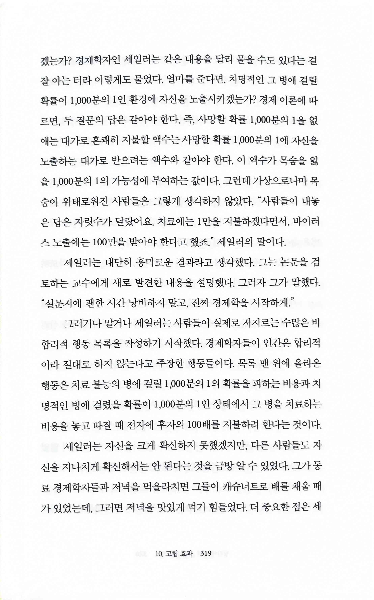 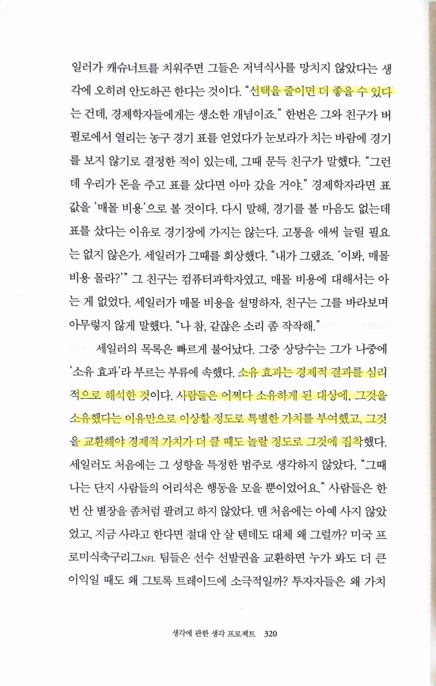

> 선택을 줄이면 더 좋을 수 있다
>
> 소유 효과는 경제적 결과를 심리적으로 해석한 것이다. 사람들은 어쩌다 소유하게 된 대상에, 그것을 소유했다는 이유만으로 이상할 정도로 특별한 가치를 부여했고, 그것을 교환해야 경제적 가치가 더 클 때도 놀랄 정도로 그것에 집착

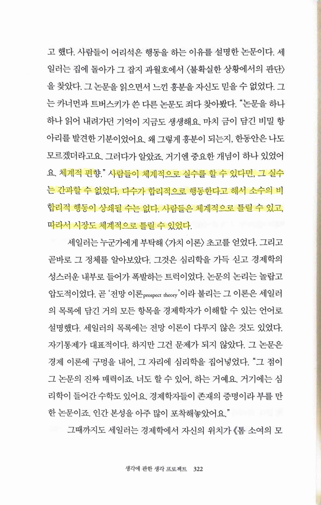

> 체계적 편향. 사람들이 체계적으로 실수를 할 수 있다면, 그 실수는 간과할 수 없었다. 다수가 합리적으로 행동한다고 해서 소수의 비합리적 행동이 상쇄될 수는 없다. 사람들은 체계적으로 틀릴 수 있고, 따라서 시장도 체계적으로 틀릴 수 있었다.

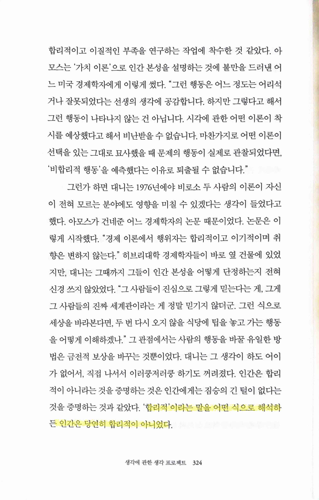

> '합리적'이라는 말을 어떤 식으로 해석하든 인간은 당연히 합리적이 아니었다.

# 11 되돌리기 규칙

> 성숙한 사람이라면 상황에 맞는 고통이나 기쁨을 느끼되 실현되지 않은 가능성에 지나치게 지배되지 않아야 한다.
>
> '시뮬레이션 어림짐작 simulation heuristic'. 사람들의 마음을 어지럽히는 실현되지 않은 가능성의 위력과 관련한 어림짐작

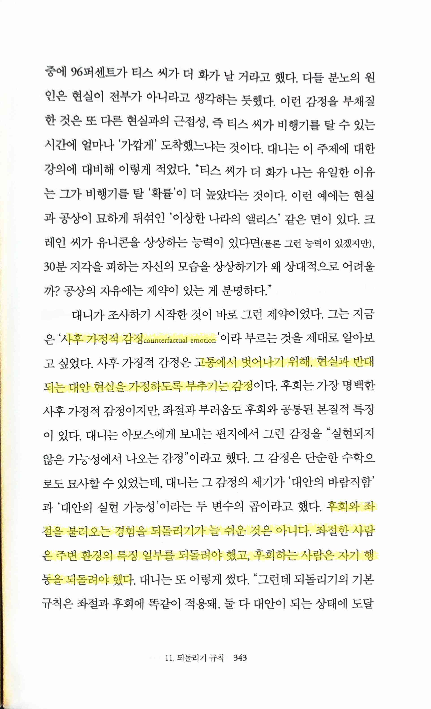

> '사후 가정적 감정 counterfactual emotion' 고통에서 벗어나기 위해, 현실과 반대되는 대안 현실을 가정하도록 부추기는 감정... 후회와 좌절을 불러오는 경험을 되돌리기가 늘 쉬운 것은 아니다. 좌절한 사람은 주변 환경의 특징 일부를 되돌려야 했고, 후회하는 사람은 자기 행동을 되돌려야 했다.

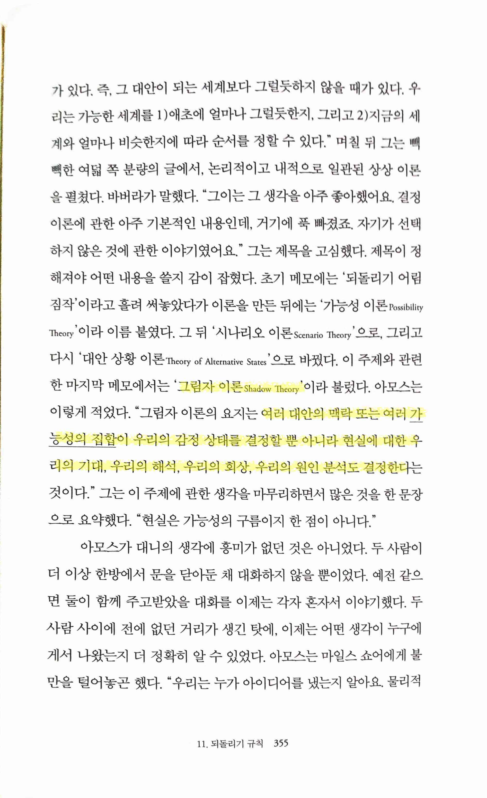

> `'그림자 이론 Shadow Theory'` 여러 대안의 맥락 또는 여러 가능성의 집합이 우리의 감정 상태를 결정할 뿐 아니라 현실에 대한 우리의 기대, 우리의 해석, 우리의 회상, 우리의 원인 분석도 결정한다

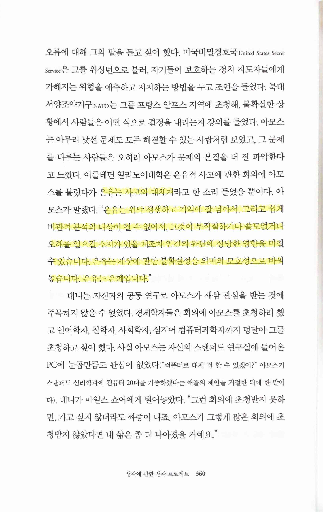

> 은유는 사고의 대체재... 은유는 워낙 생생하고 기억에 잘 남아서, 그리고 쉽게 비판적 분석의 대상이 될 수 없어서, 그것이 부적절하거나 쓸모없거나 오해를 일으킬 소지가 있을 때조차 인간의 판단에 상당한 영향을 미칠 수 있습니다. 은유는 세상에 관한 불확실성을 의미의 모호성으로 바꿔놓습니다. 은유는 은폐입니다.

> 사람들이 확률을 판단할 때 사용하는 짐작법칙이 오판을 불러왔다.
>
> 어떤 논리가 이야기로 구성되면, 사람들은 그 논리를 잘 알아보지 못한다... 생각을 고정하고, 그 이야기는 해당 상황의 논리를 덮어버린다.

> 인간 정신은 완벽하게 만들어진 도구라기보다 대응 기제. “뇌는 대충 말하면 확실성을 최대한 제공하도록 만들어진 것 같습니다. 그러니까 주어진 상황에서 모든 불확실성을 표현하기보다 주어진 해석에 가장 잘 어울리는 경우를 찾도록 만들어진 게 아닌가 싶어요."... 거의 모든 작업을 할 수 있지만 어느 것에도 딱 들어맞지는 않아서, 완벽하게 '진화'했다고 보기 힘들다.

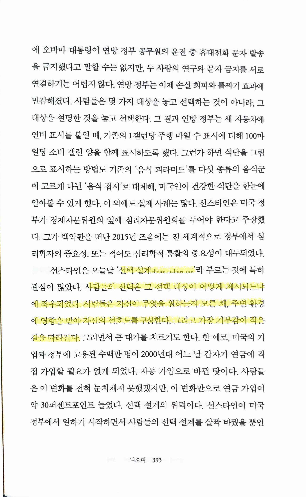

> `'선택 설계 choice architecture'` 사람들의 선택은 그 선택 대상이 어떻게 제시되느냐에 좌우되었다. 사람들은 자신이 무엇을 원하는지 모른 채, 주변 환경에 영향을 받아 자신의 선호도를 구성한다. 그리고 가장 거부감이 적은 길을 따라간다.