think like amazon 아마존처럼 생각하라
=====================================

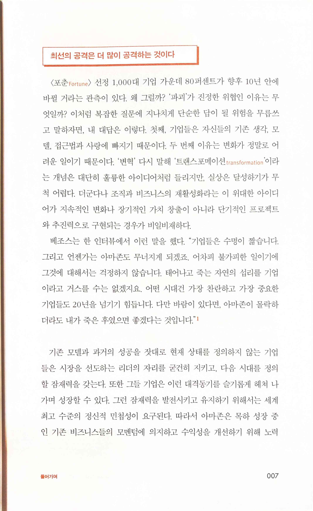

> '파괴'가 진정한 위협인 이유는 무엇일까? ... 변화가 정말로 어려운 일이기 때문이다. '변혁' 다시 말해 '트랜스포메이션 transformation'이라는 개념은 대단히 훌륭한 아이디어처럼 들리지만, 실상은 달성하기가 무척 어렵다.

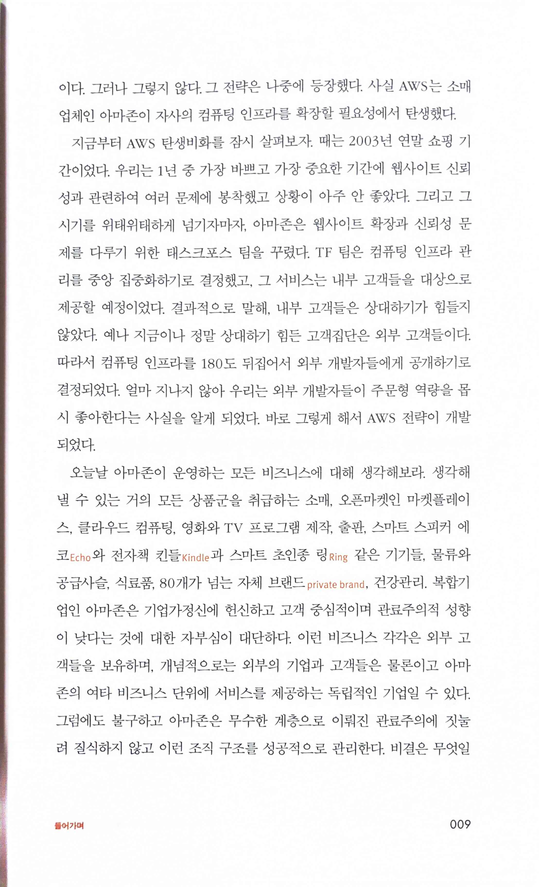

> 아마존은 무수한 계층으로 이뤄진 관료주의에 짓눌려 질식하지 않고 이런 조직 구조를 성공적으로 관리한다.

# Part 1 아마존의 '문화'에서 배우다

## 1 당신의 시계를 다시 맞춰라
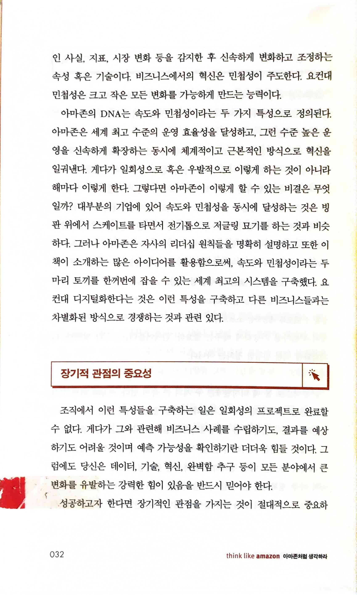

> 조직에서 이런 특성들을 구축하는 일은 일회성의 프로젝트로 완료할 수 없다. 게다가 그와 관련해 비즈니스 사례를 수립하기도, 결과를 예상하기도 어려울 것이며 예측 가능성을 확인하기란 더더욱 힘들 것이다. 그럼에도 당신은 데이터, 기술, 혁신, 완벽함 추구 등이 모든 분야에서 큰변화를 유발하는 강력한 힘이 있음을 반드시 믿어야 한다.
>
> 성공하고자 한다면 `장기적인 관점`을 가지는 것이 절대적으로 중요

## 2 용병에 의존할 것인가, 사명을 따르도록 할 것인가
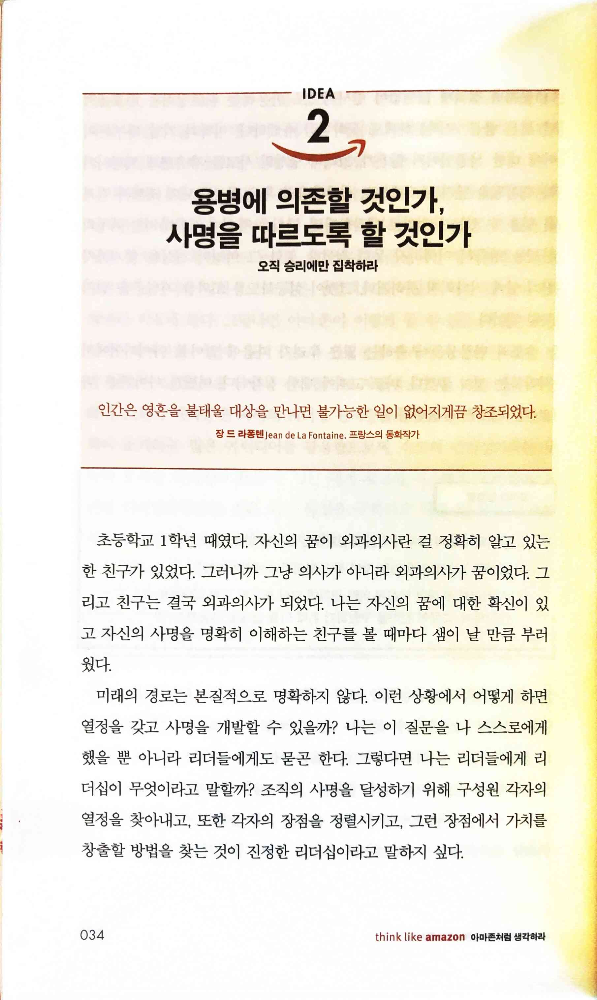

> 미래의 경로는 본질적으로 명확하지 않다. 이런 상황에서 어떻게 하면 열정을 갖고 사명을 개발할 수 있을까? 나는 이 질문을 나 스스로에게 했을 뿐 아니라 리더들에게도 묻곤 한다. 그렇다면 나는 리더들에게 리더십이 무엇이라고 말할까? 조직의 사명을 달성하기 위해 구성원 각자의 열정을 찾아내고, 또한 각자의 장점을 정렬시키고, 그런 장점에서 가치를 창출할 방법을 찾는 것이 `진정한 리더십`이라고 말하지 싶다.

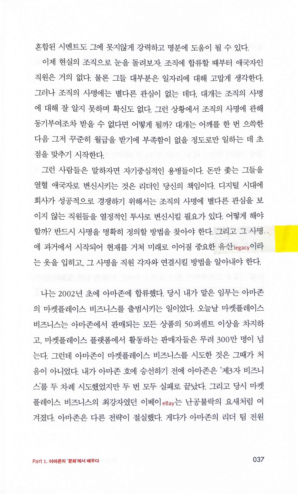

> 그런 사람들은 말하자면 자기중심적인 용병들이다. 돈만 좇는 그들을 열혈 애국자로 변신시키는 것은 리더인 당신의 책임이다. 디지털 시대에 회사가 성공적으로 경쟁하기 위해서는 조직의 사명에 별다른 관심을 보이지 않는 직원들을 열정적인 투사로 변신시킬 필요가 있다. 어떻게 해야할까? 반드시 사명을 명확히 정의할 방법을 찾아야 한다. 그리고 그 사명에 과거에서 시작되어 현재를 거쳐 미래로 이어질 중요한 유산 legacy이라는 옷을 입히고, 그 `사명`을 직원 각자와 연결시킬 방법을 알아내야 한다.

## 3 첫날로 돌아가기 위해 전진하라

## 4 집착, 아마존 차별화의 결정적 요소

## 5 단순히 좋은 관계를 위해 어울리지 마라
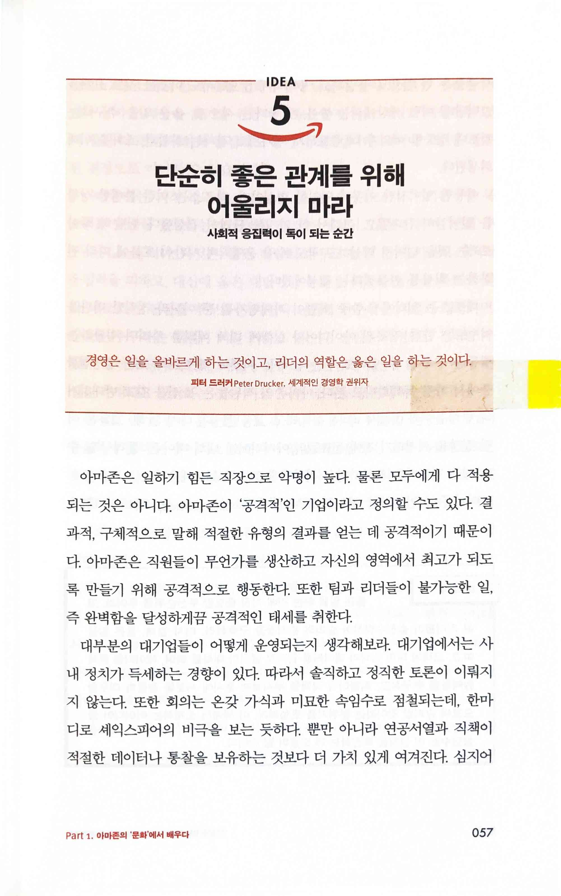

> 경영은 일을 올바르게 하는 것이고, 리더의 역할은 옳은 일을 하는 것이다. `피터 드러커 Peter Drucker`. 세계적인 경영학 권위자
* [How to Apply Peter Drucker's Management Theory - business.com](https://www.business.com/articles/management-theory-of-peter-drucker/)

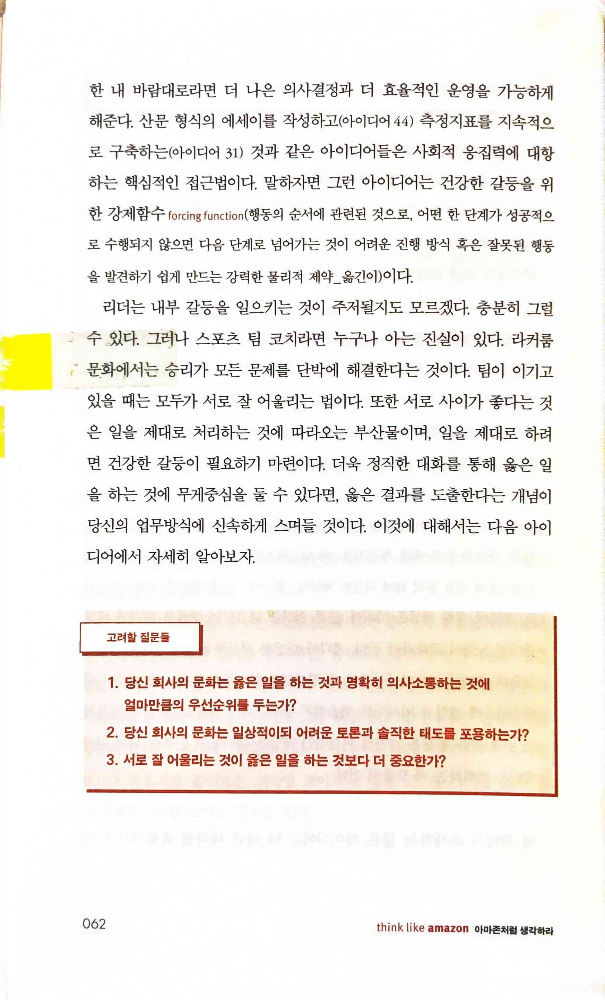

> `강제함수 forcing function`(행동의 순서에 관련된 것으로, 어떤 한 단계가 성공적으로 수행되지 않으면 다음 단계로 넘어가는 것이 어려운 진행 방식 혹은 잘못된 행동을 발견하기 쉽게 만드는 강력한 물리적 제약_옮긴이)
>
> 리더는 내부 갈등을 일으키는 것이 주저될지도 모르겠다. 충분히 그럴 수 있다. 그러나 스포츠 팀 코치라면 누구나 아는 진실이 있다. 라커룸 문화에서는 승리가 모든 문제를 단박에 해결한다는 것이다. 팀이 이기고 있을 때는 모두가 서로 잘 어울리는 법이다. 또한 서로 사이가 좋다는 것은 일을 제대로 처리하는 것에 따라오는 부산물이며, 일을 제대로 하려면 건강한 갈등이 필요하기 마련이다. 더욱 정직한 대화를 통해 옳은 일을 하는 것에 무게중심을 둘 수 있다면, 옳은 결과를 도출한다는 개념이 당신의 업무방식에 신속하게 스며들 것이다.

## 6 구체적인 성과로 말하라
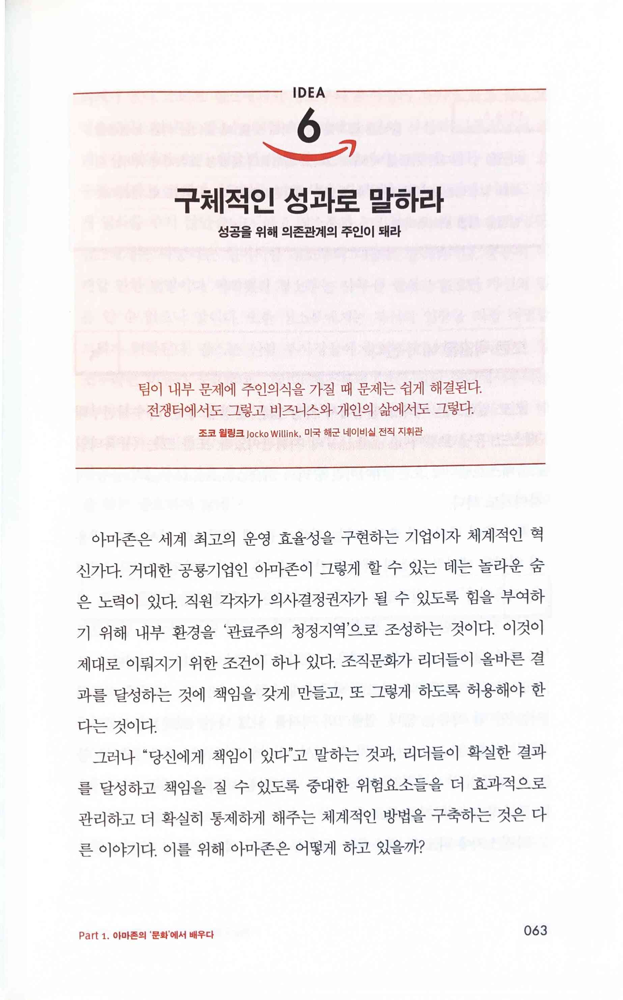

> 팀이 내부 문제에 주인의식을 가질 때 문제는 쉽게 해결된다. 전쟁터에서도 그렇고 비즈니스와 개인의 삶에서도 그렇다. 조코 윌링크 Jocko Willink. 미국 해군 네이비실 전직 지휘관
>
> 조직문화가 리더들이 올바른 결과를 달성하는 것에 책임을 갖게 만들고, 또 그렇게 하도록 허용해야 한다는 것이다.

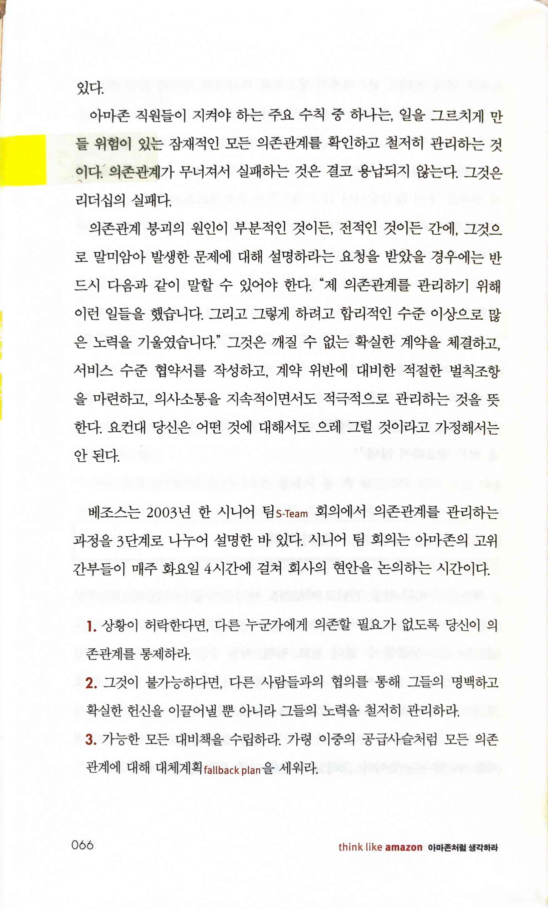

> 아마존 직원들이 지켜야 하는 주요 수칙 중 하나는 일을 그르치게 만들 위험이 있는 잠재적인 모든 의존관계를 확인하고 철저히 관리하는 것이다. `의존관계`가 무너져서 실패하는 것은 결코 용납되지 않는다. 그것은 리더십의 실패다.

## 7 모두가 윈-윈하는 주인의식

## 8 절대 컨트리클럽이 되지 마라

> 역설적인 것은 끊임없이 변화하는 세상에서 안전한 길을 택하는 것이 당신이 할 수 있는 가장 위험한 일 중 하나라는 점이다. `리드 호프먼 Reid Hoffman`, 링크드인 LinkedIn 창업자

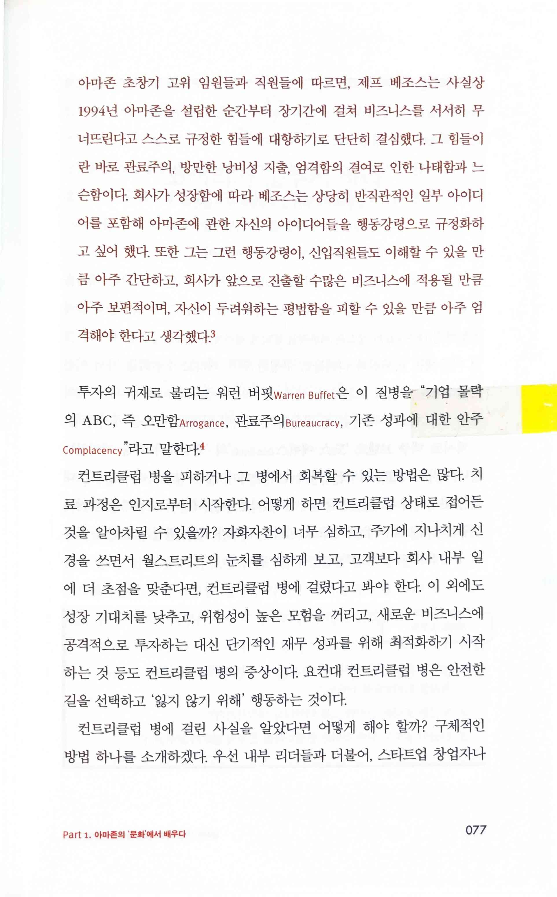

> 투자의 귀재로 불리는 `워런 버핏 Warren Buffet`은 이 질병을 "기업 몰락의 ABC, 즉 오만함 Arrogance, 관료주의 Bureaucracy, 기존 성과에 대한 안주 Complacency"라고 말한다.

## 9 코끼리가 춤추게 하라
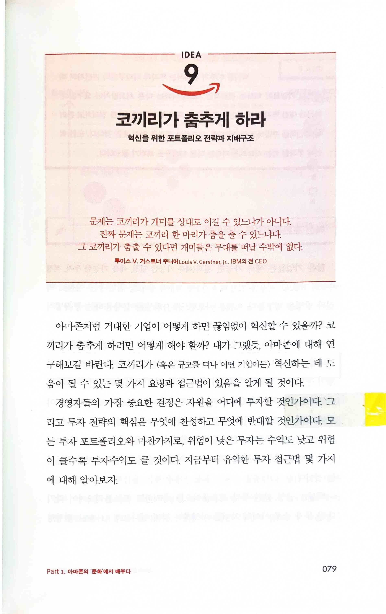

> 경영자들의 가장 중요한 결정은 자원을 어디에 투자할 것인가이다. 그리고 투자 전략의 핵심은 무엇에 찬성하고 무엇에 반대할 것인가이다.

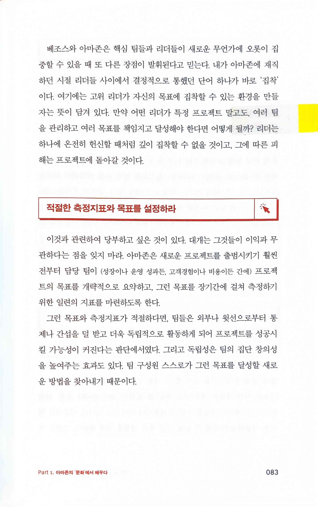

> 만약 어떤 리더가 특정 프로젝트 말고도, 여러 팀을 관리하고 여러 목표를 책임지고 달성해야 한다면 어떻게 될까? 리더는 하나에 온전히 헌신할 때처럼 깊이 집착할 수 없을 것이고, 그에 따른 피해는 프로젝트에 돌아갈 것이다.

## 10 당신은 최고제품책임자이다

> 제품을 만드는 일은 대규모 팀에 관리를 맡기는 것과 관련이 없다. 오히려 적절한 사람들로 구성된 소규모 팀에 그 일을 맡기는 것이 관건이다. 프레드 윌슨 Fred Wilson, 벤처투자회사 유니언 스퀘어 벤처스 Union Square Ventures의 공동 창업자

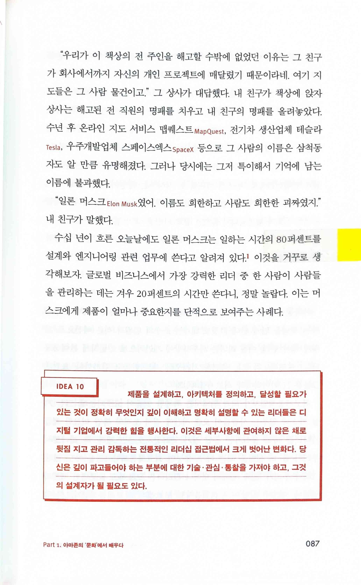

> 수십 년이 흐른 오늘날에도 `일론 머스크 Elon Musk`는 일하는 시간의 80퍼센트를 설계와 엔지니어링 관련 업무에 쓴다고 알려져 있다! 이것을 거꾸로 생각해보자. 글로벌 비즈니스에서 가장 강력한 리더 중 한 사람이 사람들을 관리하는 데는 겨우 20퍼센트의 시간만 쓴다니 정말 놀랍다. 이는 머스크에게 제품이 얼마나 중요한지를 단적으로 보여주는 사례다.

## 11 기꺼이 오해받을 각오가 되어 있는가
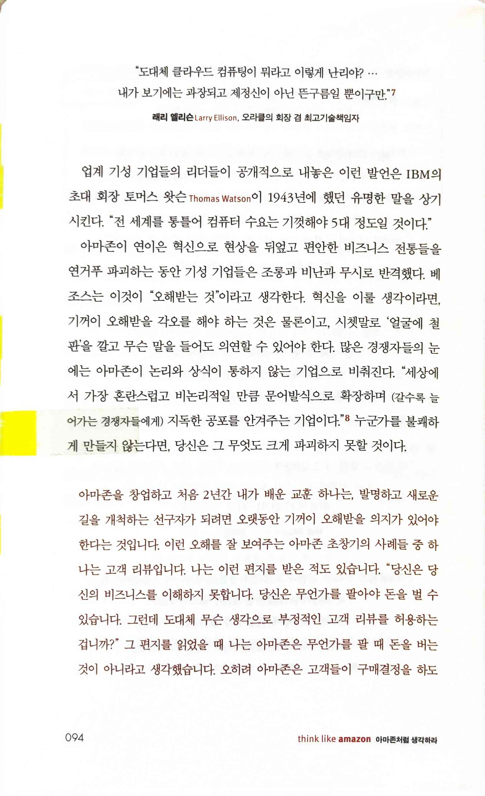

> 많은 경쟁자들의 눈에는 아마존이 논리와 상식이 통하지 않는 기업으로 비춰진다. "세상에서 가장 혼란스럽고 비논리적일 만큼 문어발식으로 확장하며 갈수록 늘어가는 경쟁자들에게 지독한 공포를 안겨주는 기업이다." 누군가를 불쾌하게 만들지 않는다면, 당신은 그 무엇도 크게 파괴하지 못할 것이다.

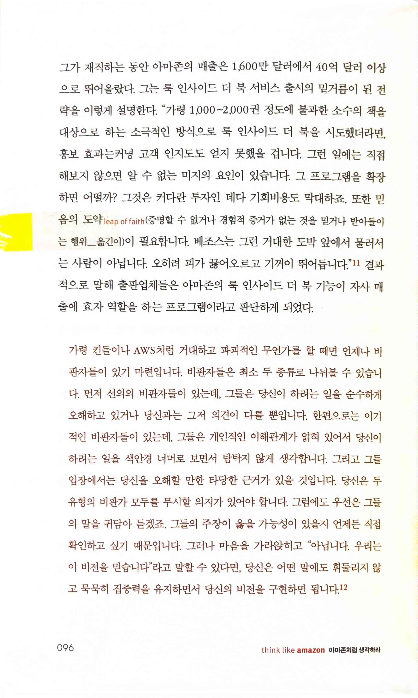

> `믿음의 도약 leap of faith`(증명할 수 없거나 경험적 증거가 없는 것을 믿거나 받아들이는 행위_옮긴이)

## 12 '예스'에 도달하라
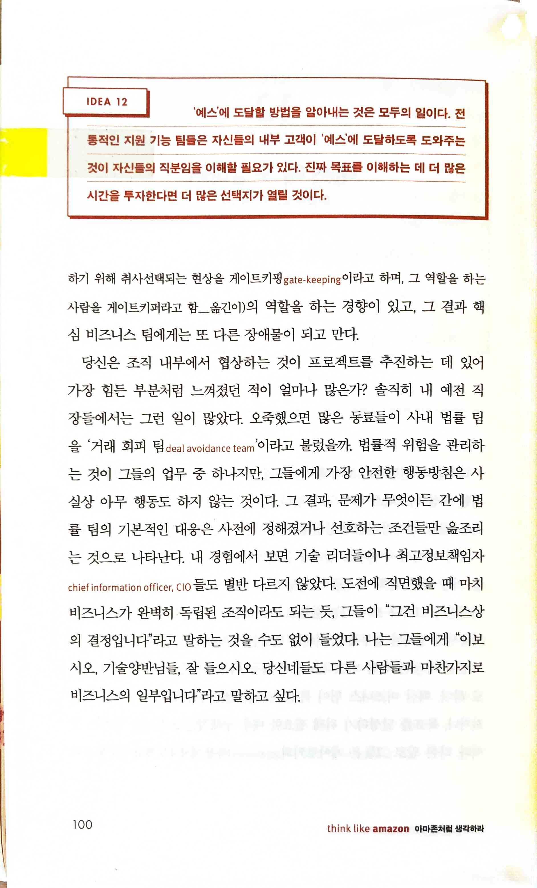

> '예스'에 도달할 방법을 알아내는 것은 모두의 일이다. 전통적인 지원 기능 팀들은 자신들의 내부 고객이 '예스'에 도달하도록 도와주는 것이 자신들의 직분임을 이해할 필요가 있다. 진짜 목표를 이해하는 데 더 많은 시간을 투자한다면 더 많은 선택지가 열릴 것이다.

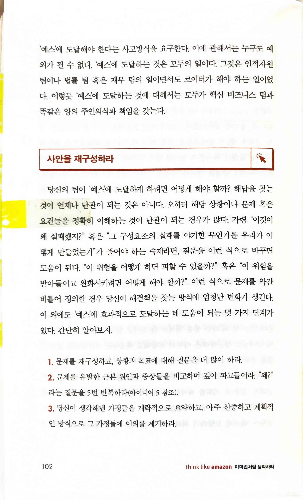

> 당신의 팀이 '예스'에 도달하게 하려면 어떻게 해야 할까? 해답을 찾는 것이 언제나 난관이 되는 것은 아니다. 오히려 해당 상황이나 문제 혹은 요건들을 정확히 이해하는 것이 난관이 되는 경우가 많다.

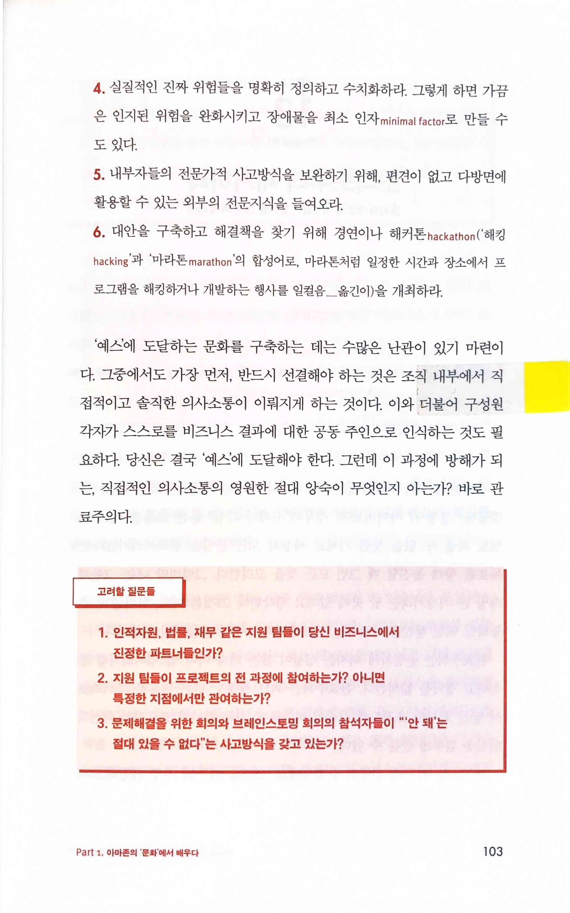

> '예스'에 도달하는 문화를 구축하는 데는 수많은 난관이 있기 마련이다. 그중에서도 가장 먼저, 반드시 선결해야 하는 것은 조직 내부에서 직접적이고 솔직한 의사소통이 이뤄지게 하는 것이다. 이와 더불어 구성원 각자가 스스로를 비즈니스 결과에 대한 공동 주인으로 인식하는 것도 필요하다. 당신은 결국 '예스'에 도달해야 한다. 그런데 이 과정에 방해가 되는, 직접적인 의사소통의 영원한 절대 앙숙이 무엇인지 아는가? 바로 관료주의다.

## 13 조직도부터 제거하라
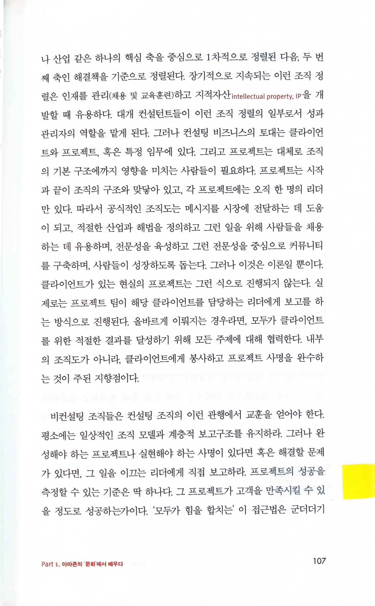

> 프로젝트의 성공을 측정할 수 있는 기준은 딱 하나다. 그 프로젝트가 고객을 만족시킬 수 있을 정도로 성공하는가이다.

## 14 혁신 게임
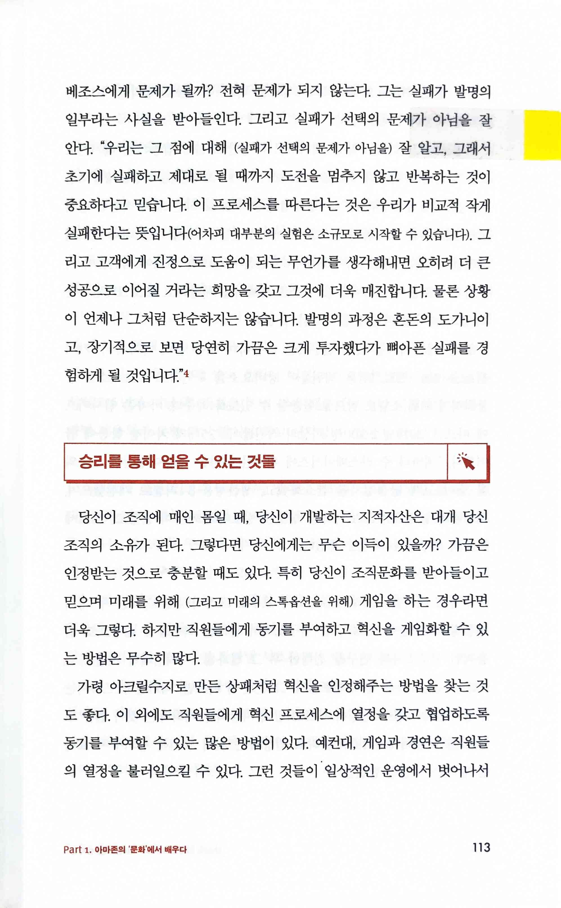

> `실패`가 발명의 일부라는 사실을 받아들인다. 그리고 실패가 선택의 문제가 아님을 잘 안다.

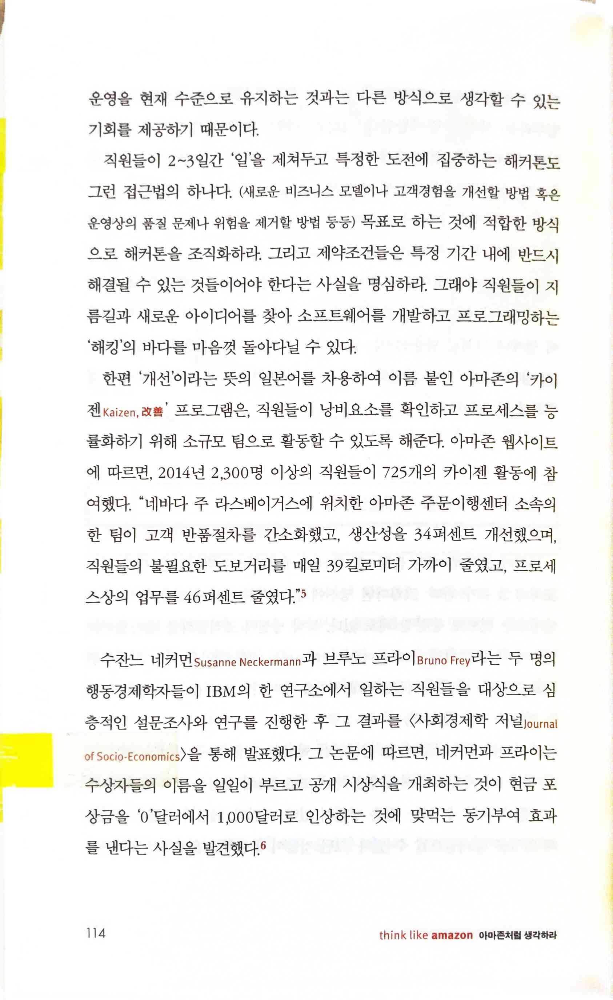

> 수잔느 네커먼 Susanne Neckermann과 브루노 프라이 Bruno Frey 라는 두 명의 행동경제학자들이 IBM의 한 연구소에서 일하는 직원들을 대상으로 심층적인 설문조사와 연구를 진행한 후 그 결과를 <사회경제학 저널 Journal of Socio-Economics>을 통해 발표했다. 그 논문에 따르면, 네커먼과 프라이는 수상자들의 이름을 일일이 부르고 공개 시상식을 개최하는 것이 현금 포상금을 '0'달러에서 1,000달러로 인상하는 것에 맞먹는 동기부여 효과를 낸다는 사실을 발견했다.

## 15 문짝 책상이 말해주는 것
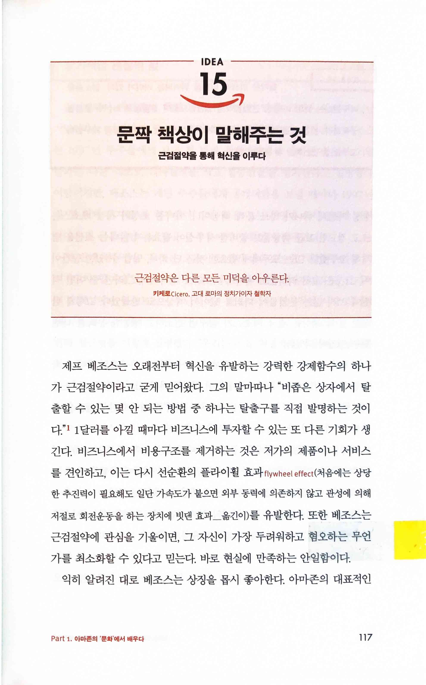

> 베조스는 근검절약에 관심을 기울이면, 그 자신이 가장 두려워하고 혐오하는 무언가를 최소화할 수 있다고 믿는다. 바로 현실에 만족하는 안일함이다.

> “사람들은 내게 5년 후, 혹은 10년 후 무엇이 변할 것인지 묻지만 무엇이 변하지 않을지는 묻지 않는다. 세상이 어떻게 변하더라도 고객이 원하는 가치를 제공한다면 고객은 절대 외면하지 않는다." - 제프 베조스

# Part 2 아마존의 '전략'에서 배우다

## 16 미션 임파서블의 세상 속으로
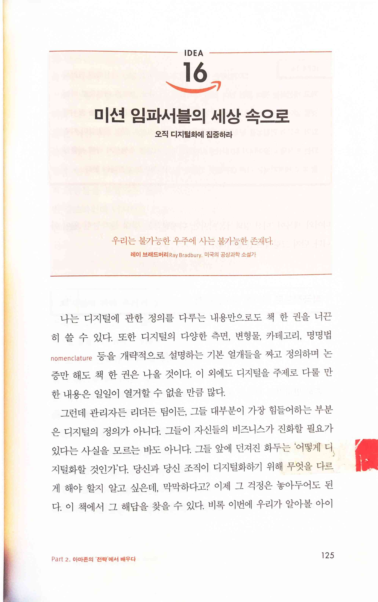

> 그들 앞에 던져진 화두는 '어떻게 디지털화할 것인가'다.

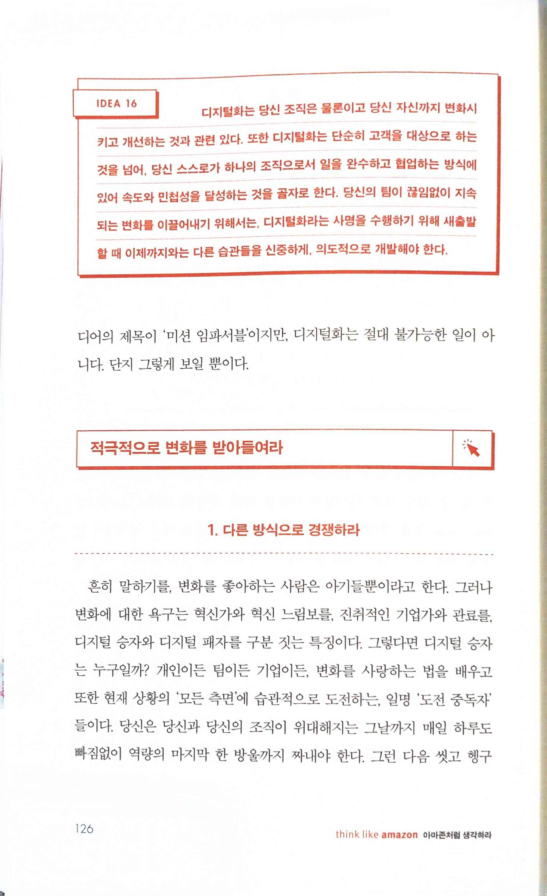 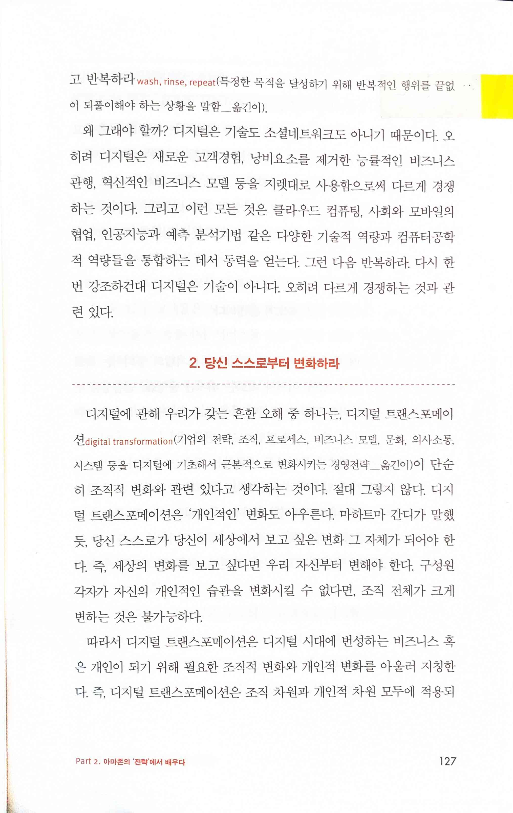 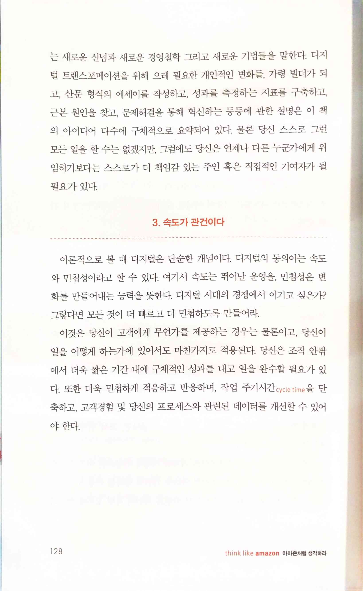

> 적극적으로 변화를 받아들여라
>
> 1. 다른 방식으로 경쟁하라
>
> 당신은 당신과 당신의 조직이 위대해지는 그날까지 매일 하루도 빠짐없이 역량의 마지막 한 방울까지 짜내야 한다. 그런 다음 씻고 헹구고 반복하라 wash, rinse, repeat(특정한 목적을 달성하기 위해 반복적인 행위를 끝없이 되풀이해야 하는 상황을 말함_옮긴이).
>
> 다시 한번 강조하건대 디지털은 기술이 아니다. 오히려 다르게 경쟁하는 것과 관련 있다.
>
> 2. 당신 스스로부터 변화하라
>
> 디지털에 관해 우리가 갖는 흔한 오해 중 하나는, 디지털 트랜스포메이션 digital transformation(기업의 전략, 조직, 프로세스, 비즈니스 모델, 문화, 의사소통, 시스템 등을 디지털에 기초해서 근본적으로 변화시키는 경영전략_옮긴이)이 단순히 조직적 변화와 관련 있다고 생각하는 것이다. 절대 그렇지 않다. 디지털 트랜스포메이션은 '개인적인' 변화도 아우른다. 마하트마 간디가 말했듯, 당신 스스로가 당신이 세상에서 보고 싶은 변화 그 자체가 되어야 한다. 즉, 세상의 변화를 보고 싶다면 우리 자신부터 변해야 한다. 구성원 각자가 자신의 개인적인 습관을 변화시킬 수 없다면, 조직 전체가 크게 변하는 것은 불가능하다.
>
> 3. 속도가 관건이다
>
> 이론적으로 볼 때 디지털은 단순한 개념이다. 디지털의 동의어는 속도와 민첩성이라고 할 수 있다. 여기서 속도는 뛰어난 운영을, 민첩성은 변화를 만들어내는 능력을 뜻한다. 디지털 시대의 경쟁에서 이기고 싶은가? 그렇다면 모든 것이 더 빠르고 더 민첩하도록 만들어라.
>
> 이것은 당신이 고객에게 무언가를 제공하는 경우는 물론이고, 당신이 일을 어떻게 하는가에 있어서도 마찬가지로 적용된다. 당신은 조직 안팎에서 더욱 짧은 기간 내에 구체적인 성과를 내고 일을 완수할 필요가 있다. 또한 더욱 민첩하게 적응하고 반응하며, 작업 주기시간 cycle time을 단축하고, 고객경험 및 당신의 프로세스와 관련된 데이터를 개선할 수 있어야 한다.

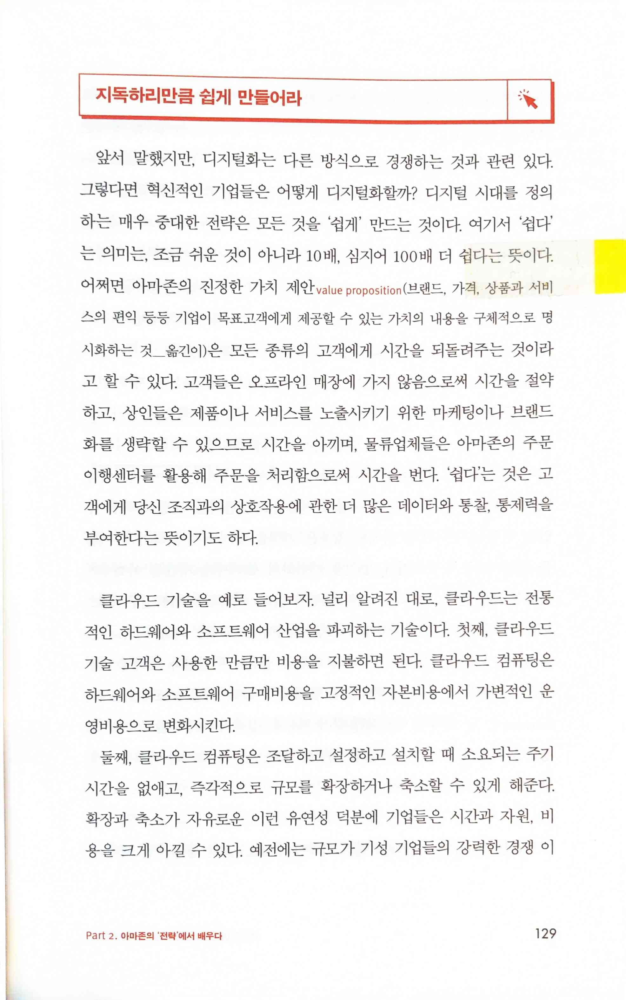

> 지독하리만큼 쉽게 만들어라
>
> 여기서 '쉽다'는 의미는, 조금 쉬운 것이 아니라 10배, 심지어 100배 더 쉽다는 뜻이다.

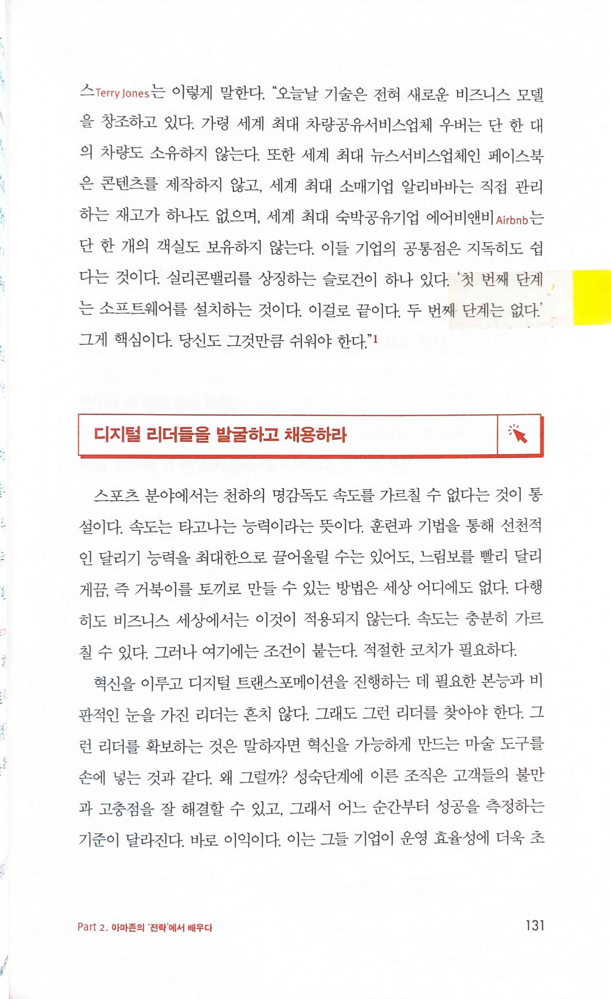

> 실리콘밸리를 상징하는 슬로건이 하나 있다. '첫 번째 단계는 소프트웨어를 설치하는 것이다. 이걸로 끝이다. 두 번째 단계는 없다'그게 핵심이다. 당신도 그것만큼 쉬워야 한다.
>
> 스포츠 분야에서는 천하의 명감독도 속도를 가르칠 수 없다는 것이 통설이다. 속도는 타고나는 능력이라는 뜻이다. 훈련과 기법을 통해 선천적인 달리기 능력을 최대한으로 끌어올릴 수는 있어도, 느림보를 빨리 달리게끔, 즉 거북이를 토끼로 만들 수 있는 방법은 세상 어디에도 없다. 다행히도 비즈니스 세상에서는 이것이 적용되지 않는다. 속도는 충분히 가르칠 수 있다. 그러나 여기에는 조건이 붙는다. 적절한 코치가 필요하다.

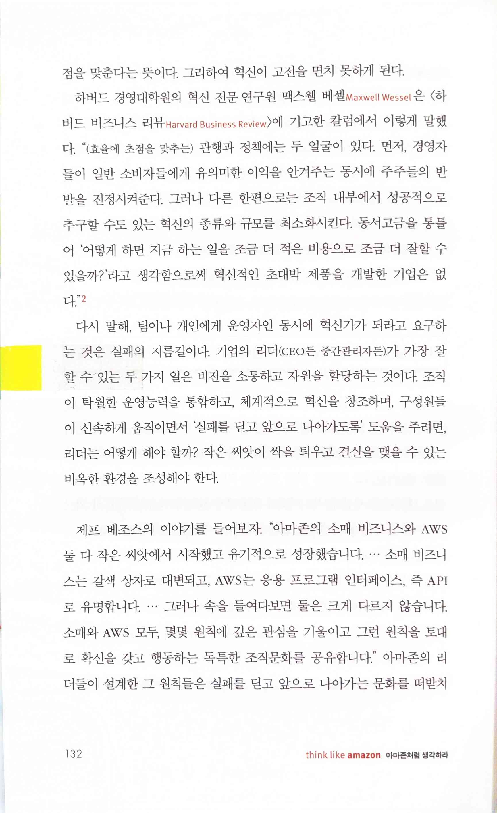

> 다시 말해, 팀이나 개인에게 운영자인 동시에 혁신가가 되라고 요구하는 것은 실패의 지름길이다. 기업의 리더(CEO는 중간관리자)가 가장 잘할 수 있는 두 가지 일은 비전을 소통하고 자원을 할당하는 것이다. 조직이 탁월한 운영능력을 통합하고, 체계적으로 혁신을 창조하며, 구성원들이 신속하게 움직이면서 '실패를 딛고 앞으로 나아가도록 도움을 주려면, 리더는 어떻게 해야 할까? 작은 씨앗이 싹을 틔우고 결실을 맺을 수 있는 비옥한 환경을 조성해야 한다.

## 17 실험하고, 실패하고, 반복하라
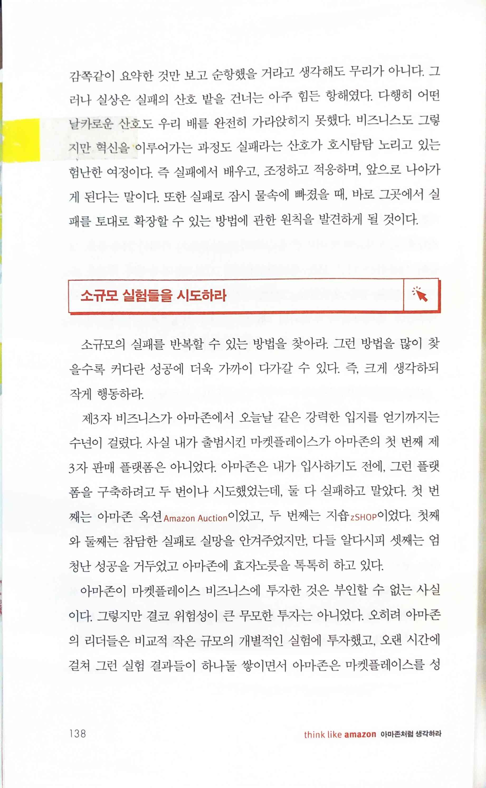

> 비즈니스도 그렇지만 혁신을 이루어가는 과정도 실패라는 산호가 호시탐탐 노리고 있는 험난한 여정이다. 즉 실패에서 배우고, 조정하고 적응하며, 앞으로 나아가게 된다는 말이다. 또한 실패로 잠시 물속에 빠졌을 때, 바로 그곳에서 실패를 토대로 확장할 수 있는 방법에 관한 원칙을 발견하게 될 것이다.

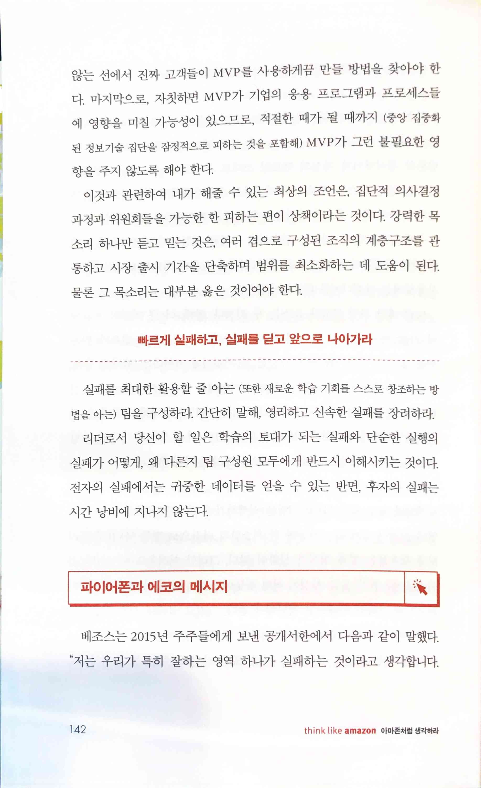

> 빠르게 실패하고, 실패를 딛고 앞으로 나아가라

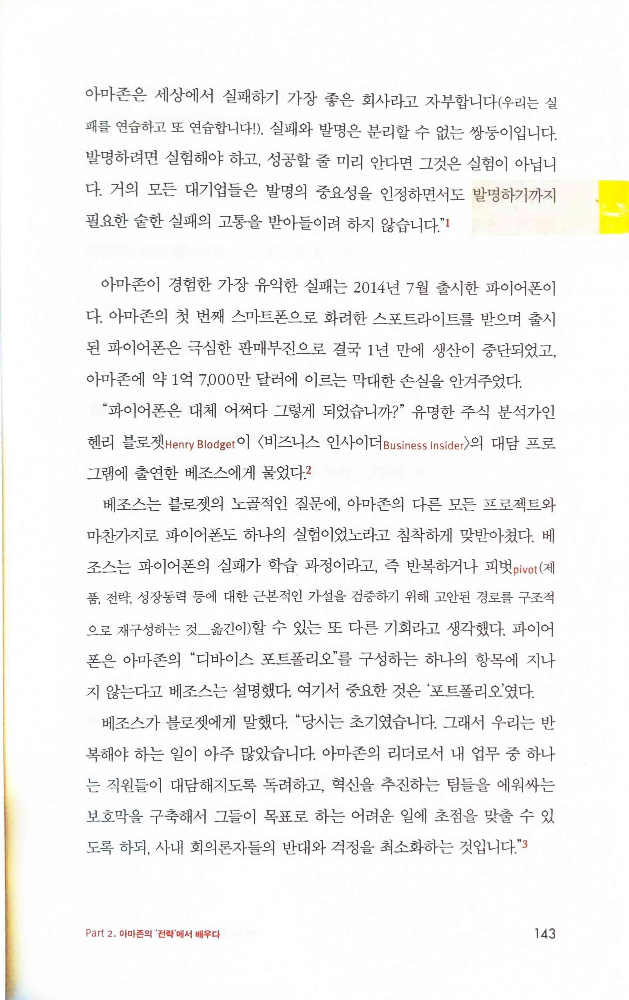

> 베조스는 2015년 주주들에게 보낸 공개서한에서 다음과 같이 말했다. “저는 우리가 특히 잘하는 영역 하나가 실패하는 것이라고 생각합니다. 아마존은 세상에서 실패하기 가장 좋은 회사라고 자부합니다(우리는 실패를 연습하고 또 연습합니다!). 실패와 발명은 분리할 수 없는 쌍둥이입니다. 발명하려면 실험해야 하고, 성공할 줄 미리 안다면 그것은 실험이 아닙니다. 거의 모든 대기업들은 발명의 중요성을 인정하면서도 발명하기까지 필요한 숱한 실패의 고통을 받아들이려 하지 않습니다."

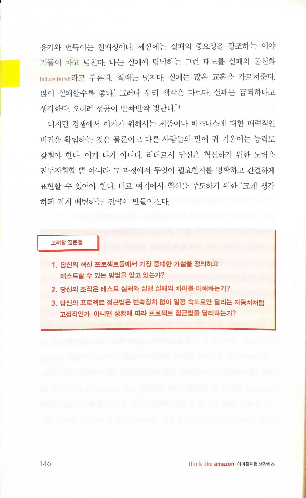

> 세상에는 실패의 중요성을 강조하는 이야기들이 차고 넘친다. 나는 실패에 탐닉하는 그런 태도를 실패의 물신화 failure fetish라고 부른다. '실패는 멋지다. 실패는 많은 교훈을 가르쳐준다. 많이 실패할수록 좋다. 그러나 우리 생각은 다르다. 실패는 끔찍하다고 생각한다. 오히려 성공이 반짝반짝 빛난다."
>
> 디지털 경쟁에서 이기기 위해서는 제품이나 비즈니스에 대한 매력적인 비전을 확립하는 것은 물론이고 다른 사람들의 말에 귀 기울이는 능력도 갖춰야 한다. 이게 다가 아니다. 리더로서 당신은 혁신하기 위한 노력을 진두지휘할 뿐 아니라 그 과정에서 무엇이 필요한지를 명확하고 간결하게 표현할 수 있어야 한다. 바로 여기에서 혁신을 주도하기 위한 '크게 생각하되 작게 베팅하는' 전략이 만들어진다.

## 18 당신의 비즈니스는 플랫폼 모델이 적합할까?

## 19 그렇습니다, 당신의 회사는 기술 기업입니다

> 혼돈과 복잡성을 통제하는 유일한 방법은 그 통제력의 일부를 포기하는 것이다. 기얀 나그림 Gyan Nagpal. 인재 전문 전략가

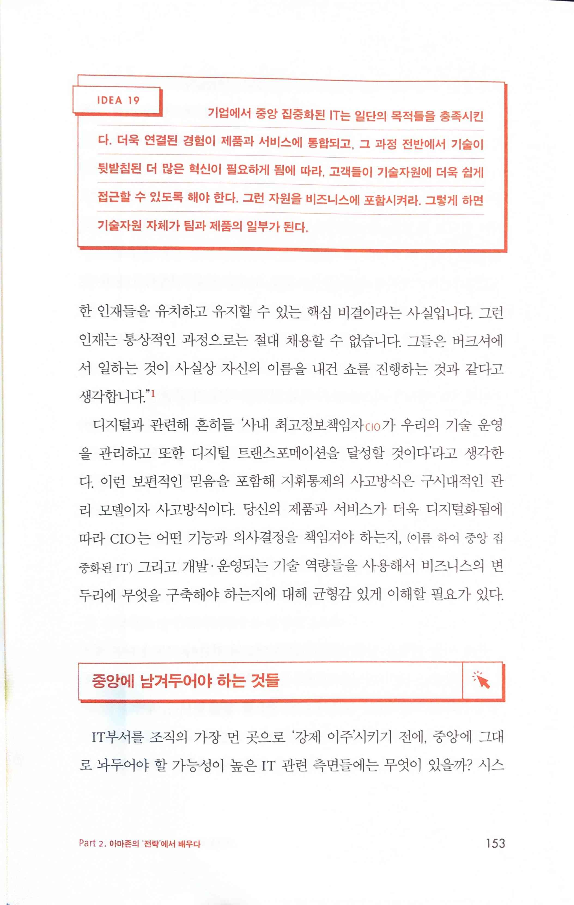 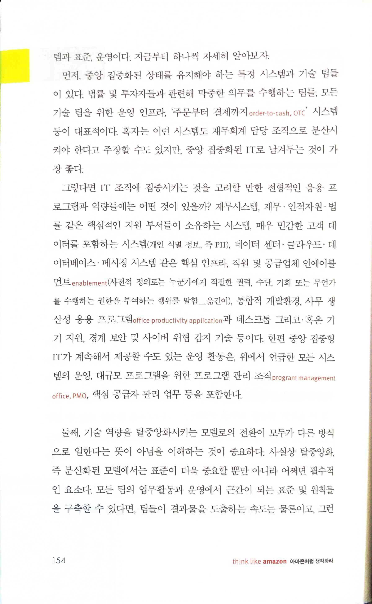 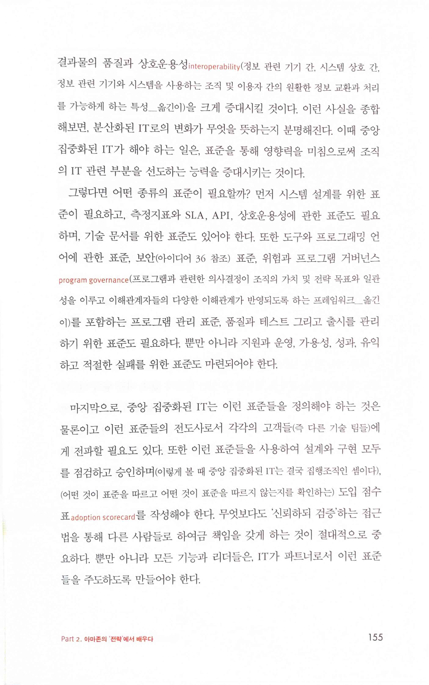

> IT부서를 조직의 가장 먼 곳으로 '강제 이주시키기 전에, 중앙에 그대로 놔두어야 할 가능성이 높은 IT 관련 측면들에는 무엇이 있을까? 시스템과 표준, 운영이다.

## 20 다 함께 나눠먹는 피자
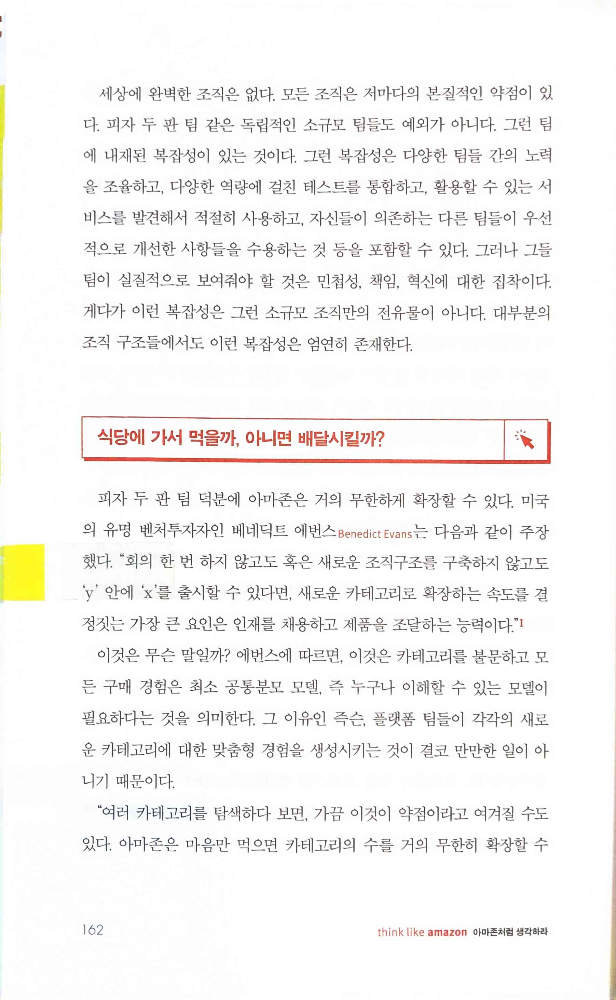

> 미국의 유명 벤처투자자인 베네딕트 에번스 Benedict Evans는 다음과 같이 주장했다. “회의 한 번 하지 않고도 혹은 새로운 조직구조를 구축하지 않고도 'y' 안에 'x'를 출시할 수 있다면, 새로운 카테고리로 확장하는 속도를 결정짓는 가장 큰 요인은 인재를 채용하고 제품을 조달하는 능력이다."
>
> 이것은 무슨 말일까? 에번스에 따르면, 이것은 카테고리를 불문하고 모든 구매 경험은 최소 공통분모 모델, 즉 누구나 이해할 수 있는 모델이 필요하다는 것을 의미한다.

## 21 '절대'라는 말을 절대 하지 마라

> 사실이 바뀌면 내 마음을 바꾸겠다. 존 메이너드 케인스 John Maynard Keynes. 영국의 경제학자

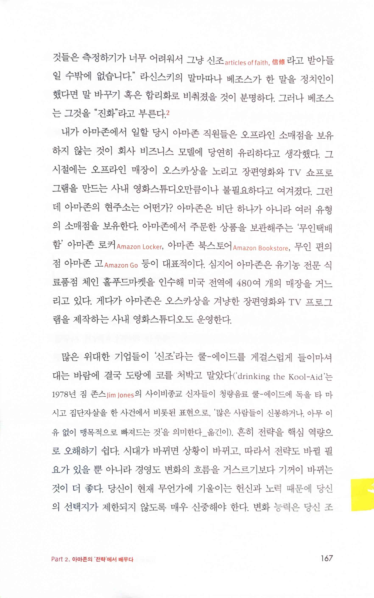

> 흔히 전략을 핵심 역량으로 오해하기 쉽다. 시대가 바뀌면 상황이 바뀌고, 따라서 전략도 바뀔 필요가 있을 뿐 아니라 경영도 변화의 흐름을 거스르기보다 기꺼이 바뀌는것이 더 좋다. 당신이 현재 무언가에 기울이는 헌신과 노력 때문에 당신의 선택지가 제한되지 않도록 매우 신중해야 한다. 변화 능력은 당신 조직이 생존하느냐 멸종하느냐를 가르는 분수령이 될 수도 있기 때문이다.

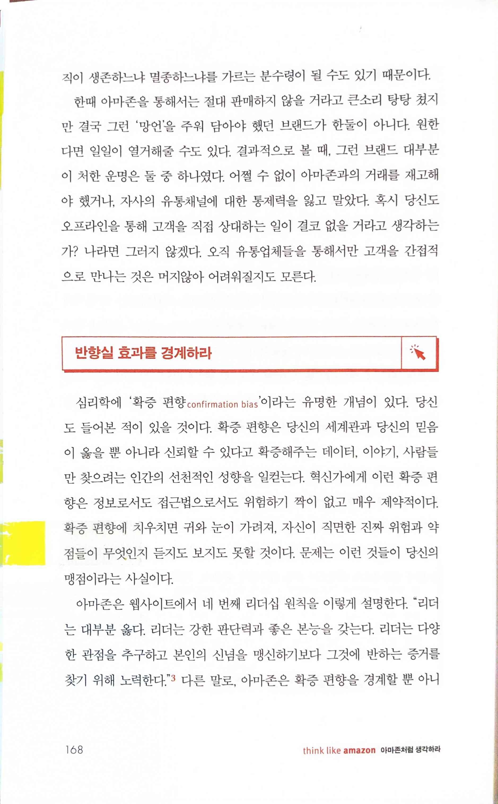

> 확증 편향 confirmation bias에 치우치면 귀와 눈이 가려져, 자신이 직면한 진짜 위험과 약점들이 무엇인지 듣지도 보지도 못할 것이다. 문제는 이런 것들이 당신의 맹점이라는 사실이다.

## 22 릴렌트리스닷컴

> 아마존에서는 모든 것에 대해 (모든 프로세스, 모든 고객 경험, 모든 기능) 개선을 위한 계획과 로드맵이 마련되어 있다... 반면에 전형적인 기업들은 간헐적인 조직개편을 제외하면, 딱히 문제가 생기지 않는 한, 모든 프로세스는 해가 바뀌어도 거의 달라지는 것이 없다.

## 23 자동화의 사각지대에서는 사람들의 손을 빌려라

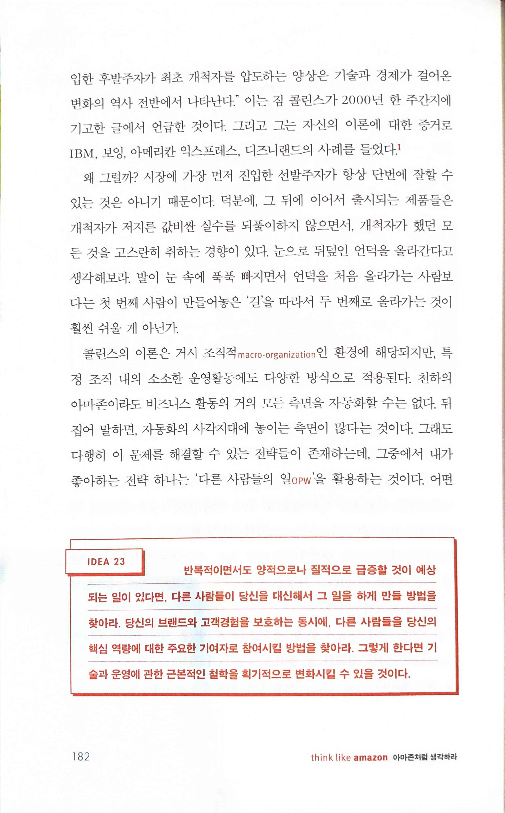

> 세계적인 경영 사상가 중 한 명으로 《좋은 기업을 넘어 위대한 기업으로 Good to Great》를 집필한 짐 콜린스 Jim Collins가 지적했듯, 최고가 선도자를 꺾는 법이다 best beats first. "시장에 두 번째(혹은 세 번째나 네 번째)로 진입한 후발주자가 최초 개척자를 압도하는 양상은 기술과 경제가 걸어온 변화의 역사 전반에서 나타난다."

## 24 강제함수의 마법
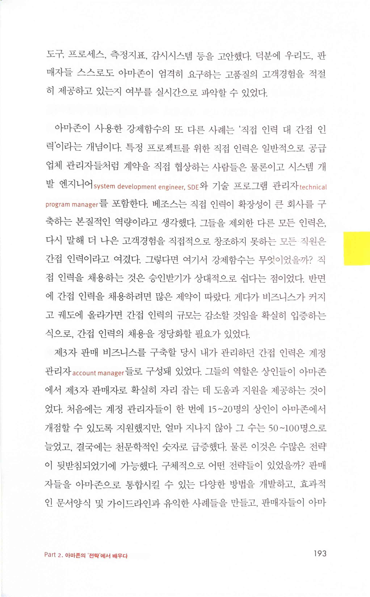

> 베조스는 직접 인력이 확장성이 큰 회사를 구축하는 본질적인 역량이라고 생각했다. 그들을 제외한 다른 모든 인력은 다시 말해 더 나은 고객경험을 직접적으로 창조하지 못하는 모든 직원은 간접 인력이라고 여겼다.

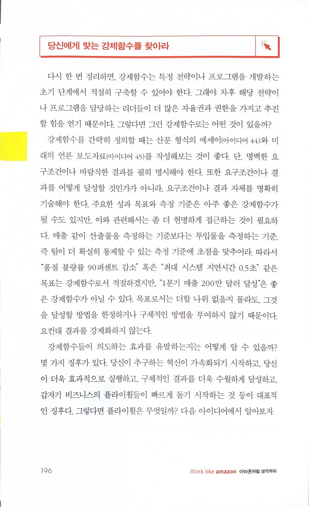

> 강제함수를 간략히 정의할 때는 산문 형식의 에세이(아이디어 44) 와 미래의 언론 보도자료(아이디어 45)를 작성해보는 것이 좋다. 단, 명백한 요구조건이나 바람직한 결과를 필히 명시해야 한다. 또한 요구조건이나 결과를 어떻게 달성할 것인가가 아니라, 요구조건이나 결과 자체를 명확히 기술해야 한다. 주요한 성과 목표와 측정 기준은 아주 좋은 강제함수가 될 수도 있지만, 이와 관련해서는 좀 더 현명하게 접근하는 것이 필요하다. 매출 같이 산출물을 측정하는 기준보다는 투입물을 측정하는 기준, 즉 팀이 더 확실히 통제할 수 있는 측정 기준에 초점을 맞추어라.

## 25 당신만의 플라이휠은 무엇인가?
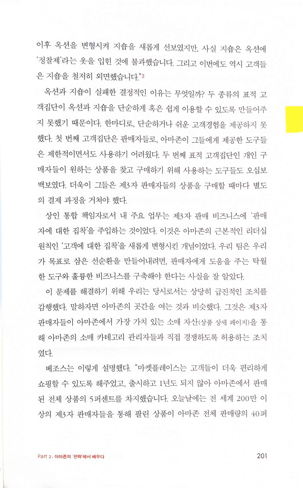

> 옥션과 지숍이 실패한 결정적인 이유는 무엇일까? 두 종류의 표적 고객집단이 옥션과 지숍을 단순하게 혹은 쉽게 이용할 수 있도록 만들어주지 못했기 때문이다. 한마디로, 단순하거나 쉬운 고객경험을 제공하지 못했다.

## 26 이것이 왜 이리 어렵지?
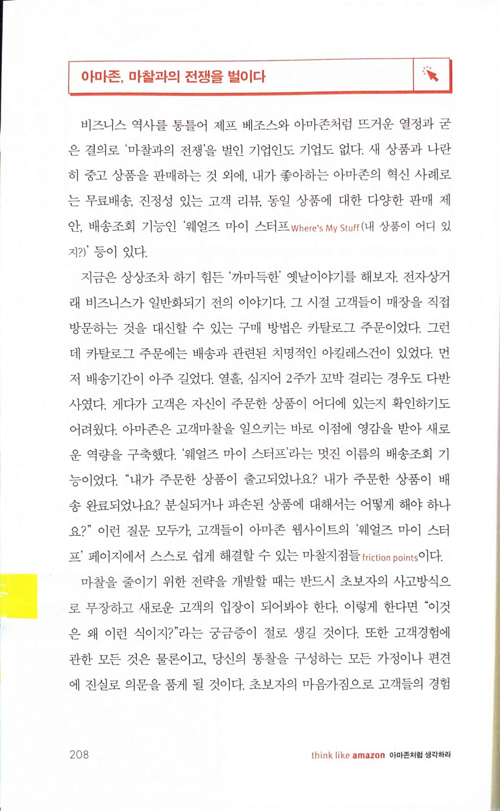

> 마찰을 줄이기 위한 전략을 개발할 때는 반드시 초보자의 사고방식으로 무장하고 새로운 고객의 입장이 되어봐야 한다. 이렇게 한다면 "이것은 왜 이런 식이지?"라는 궁금증이 절로 생길 것이다. 또한 고객경험에 관한 모든 것은 물론이고, 당신의 통찰을 구성하는 모든 가정이나 편견에 진실로 의문을 품게 될 것이다.

> '소매 제일주의 retail-first' 조직들은 '기술 제일주의 technology first' 기업을 상대로 이길 수 없다. 대부분의 기업들은 자신들의 비즈니스를 진실로 파괴할 능력이 없고, 행여 그럴 능력이 있더라도 그 파괴 과정 전반을 관리할 능력이나 의지가 부족하다. 게다가 그들 기업은 이런 대담한 비전을 실현시킬 수 있는 공급사슬이나 자동화 관련 전문지식이 없다.

## 27 고객을 슈퍼맨으로 만들어라

> 다른 사람들을 아는 사람은 지혜롭다. 자신을 아는 사람은 깨친 사람이다.(知人者智 自知者明, 지인자지 자지자명) `노자 老子`

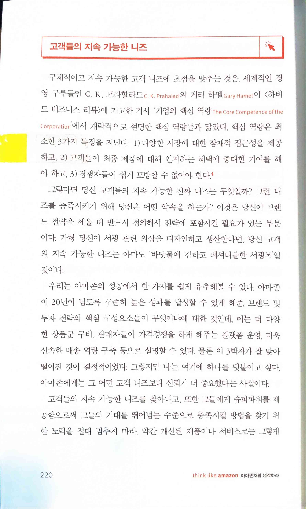

> 구체적이고 지속 가능한 고객 니즈에 초점을 맞추는 것은 세계적인 경영 구루들인 C. K. 프라할라드 C. K. Prahalad 와 게리 하멜 Gary Hamel 이 <하버드 비즈니스 리뷰>에 기고한 기사 '기업의 핵심 역량 The Core Competence of the Corporation'에서 개략적으로 설명한 핵심 역량들과 닮았다. 핵심 역량은 최소한 3가지 특징을 지닌다. 1) 다양한 시장에 대한 잠재적 접근성을 제공하고, 2) 고객들이 최종 제품에 대해 인지하는 혜택에 중대한 기여를 해야 하고, 3) 경쟁자들이 쉽게 모방할 수 없어야 한다
* [The Core Competence of the Corporation](https://hbr.org/1990/05/the-core-competence-of-the-corporation)

## 28 다른 생각이 다른 결과를 만든다
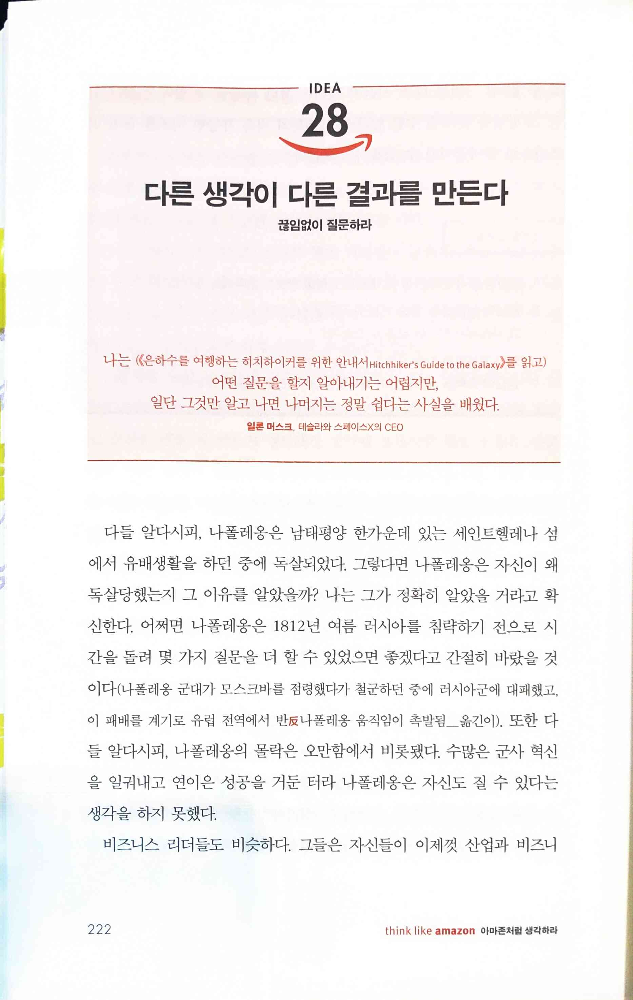

> 나폴레옹의 몰락은 오만함에서 비롯됐다. 수많은 군사 혁신을 일궈내고 연이은 성공을 거둔 터라 나폴레옹은 자신도 질 수 있다는 생각을 하지 못했다.

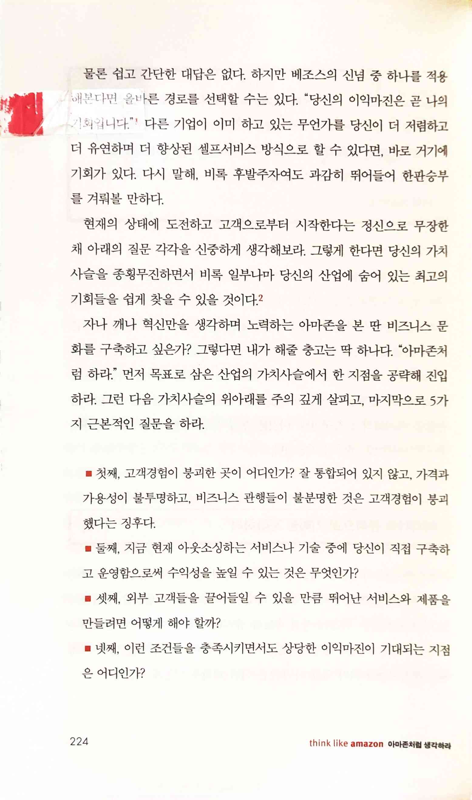

> 물론 쉽고 간단한 대답은 없다. 하지만 베조스의 신념 중 하나를 적용해본다면 올바른 경로를 선택할 수는 있다. "당신의 이익마진은 곧 나의 기회입니다." 다른 기업이 이미 하고 있는 무언가를 당신이 더 저렴하고 더 유연하며 더 향상된 셀프서비스 방식으로 할 수 있다면, 바로 거기에 기회가 있다. 다시 말해, 비록 후발주자여도 과감히 뛰어들어 한판승부를 겨뤄볼 만하다.

## 29 출시를 통한 학습 전략
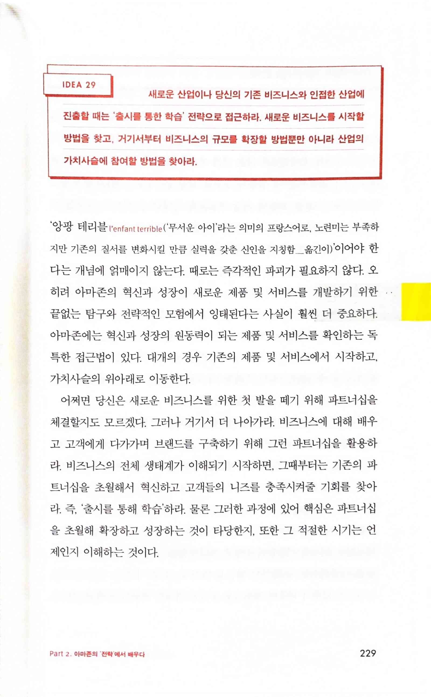

> '앙팡 테리블 enfant terrible' ("무서운 아이'라는 의미의 프랑스어로 노련미는 부족하지만 기존의 질서를 변화시킬 만큼 실력을 갖춘 신인을 지칭함_옮긴이)'이어야 한다는 개념에 얽매이지 않는다. 때로는 즉각적인 파괴가 필요하지 않다. 오히려 아마존의 혁신과 성장이 새로운 제품 및 서비스를 개발하기 위한 끝없는 탐구와 전략적인 모험에서 잉태된다는 사실이 훨씬 더 중요하다.

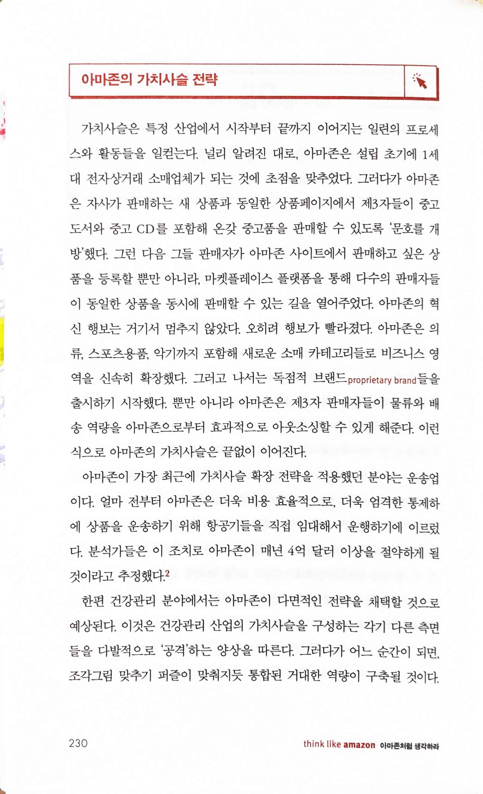 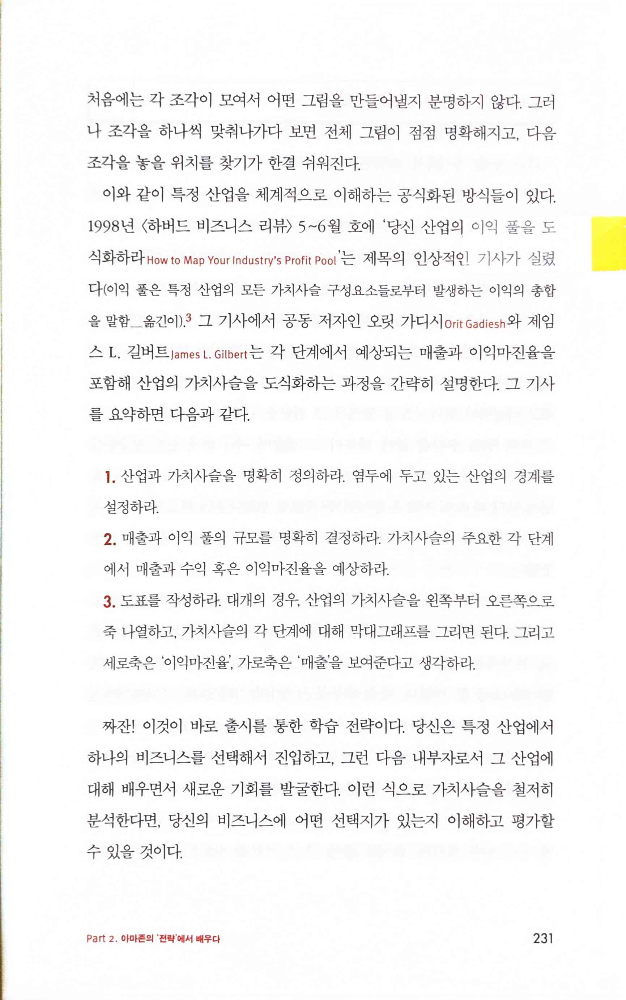

> 이와 같이 특정 산업을 체계적으로 이해하는 공식화된 방식들이 있다. 1998년 <하버드 비즈니스 리뷰> 5~6월 호에 '당신 산업의 이익 풀을 도식화하라 How to Map Your Industry's Profit Pool'는 제목의 인상적인 기사가 실렸다(이익 풀은 특정 산업의 모든 가치사슬 구성요소들로부터 발생하는 이익의 총합을 말함_옮긴이). 그 기사에서 공동 저자인 오릿 가디시 Orit Gadiesh와 제임스 L. 길버트 James L. Gilbert는 각 단계에서 예상되는 매출과 이익마진율을 포함해 산업의 가치사슬을 도식화하는 과정을 간략히 설명한다.
* [How to Map Your Industry’s Profit Pool](https://hbr.org/1998/05/how-to-map-your-industrys-profit-pool)

## 30 운영체제를 포기하지 마라
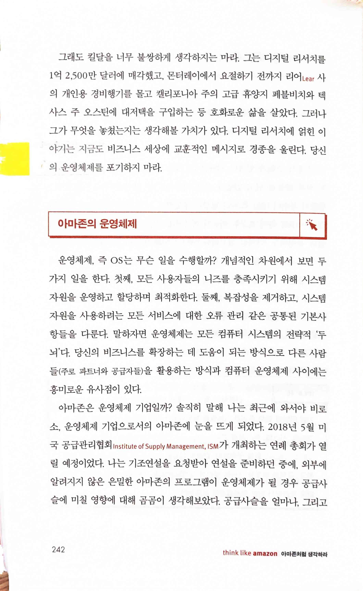

> 당신의 운영체제를 포기하지 마라.

# Part3 아마존의 '비즈니스'와 'IT'에서 배우다

## 31 거짓말, 새빨간 거짓말 그리고 측정지표
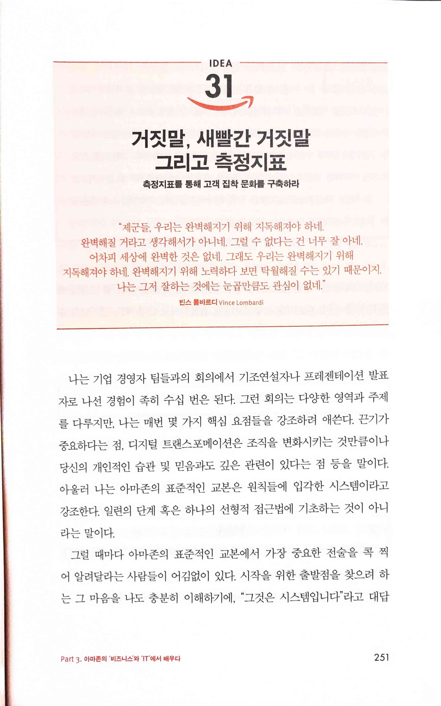

> 매번 몇 가지 핵심 요점들을 강조하려 애쓴다. 끈기가 중요하다는 점, 디지털 트랜스포메이션은 조직을 변화시키는 것만큼이나 당신의 개인적인 습관 및 믿음과도 깊은 관련이 있다는 점 등을 말이다. 아울러 나는 아마존의 표준적인 교본은 원칙들에 입각한 시스템이라고 강조한다. 일련의 단계 혹은 하나의 선형적 접근법에 기초하는 것이 아니라는 말이다.

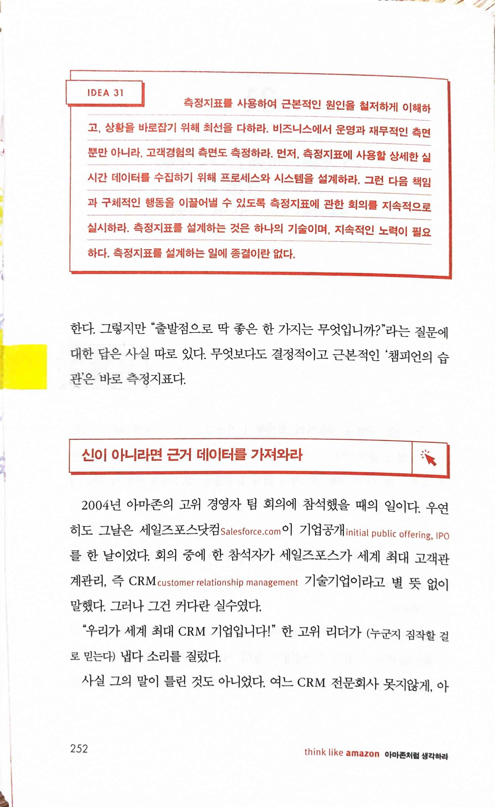

> "출발점으로 딱 좋은 한 가지는 무엇입니까?"라는 질문에 대한 답은 사실 따로 있다. 무엇보다도 결정적이고 근본적인 '챔피언의 습관'은 바로 `측정지표`다.

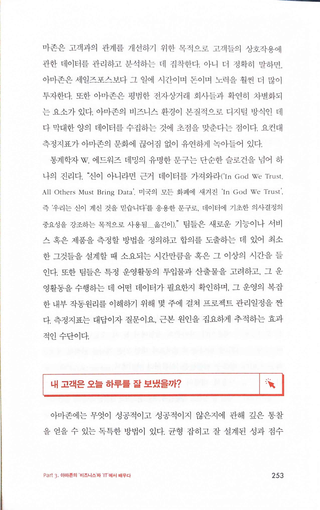

> 팀들은 새로운 기능이나 서비스 혹은 제품을 측정할 방법을 정의하고 합의를 도출하는 데 있어 최소한 그것들을 설계할 때 소요되는 시간만큼 혹은 그 이상의 시간을 들인다. 또한 팀들은 특정 운영활동의 투입물과 산출물을 고려하고, 그 운영활동을 수행하는 데 어떤 데이터가 필요한지 확인하며, 그 운영의 복잡한 내부 작동원리를 이해하기 위해 몇 주에 걸쳐 프로젝트 관리일정을 짠다. 측정지표는 대답이자 질문이요. 근본 원인을 집요하게 추적하는 효과적인 수단이다.

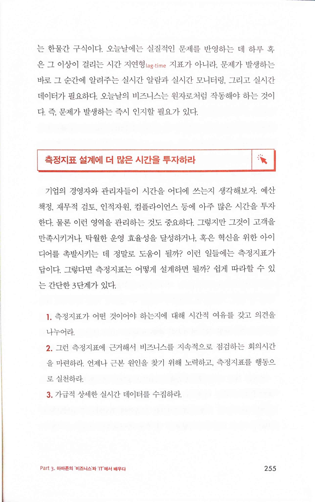

> 측정지표 설계
>
> 1. 측정지표가 어떤 것이어야 하는지에 대해 시간적 여유를 갖고 의견을 나누어라
>
> 2. 그런 측정지표에 근거해서 비즈니스를 지속적으로 점검하는 회의시간을 마련하라. 언제나 근본 원인을 찾기 위해 노력하고, 측정지표를 행동으로 실천하라.
>
> 3. 가급적 상세한 실시간 데이터를 수집하라.

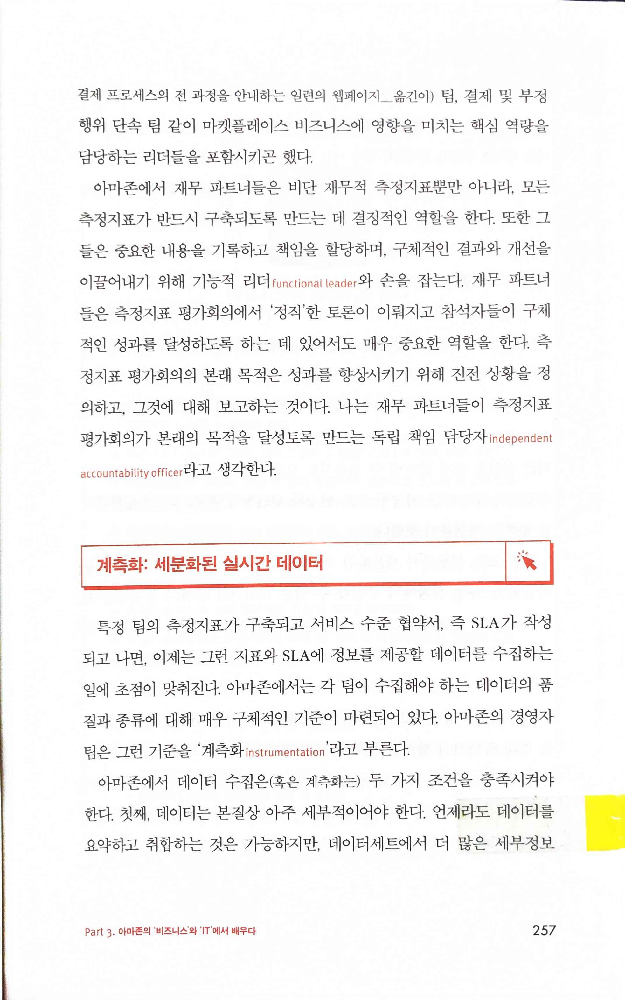 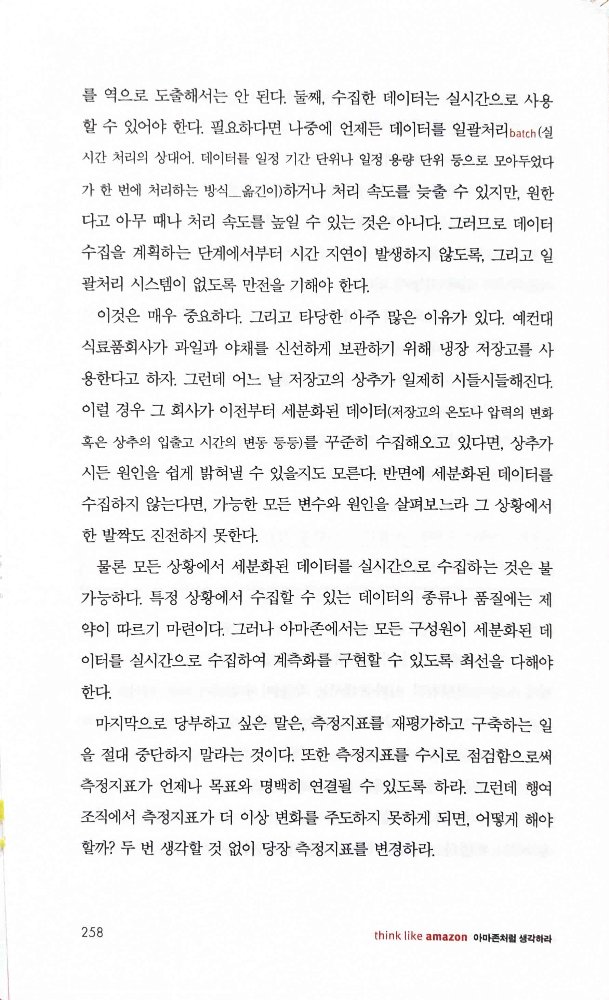

> 아마존에서 데이터 수집은(혹은 계측화는) 두 가지 조건을 충족시켜야 한다. 첫째, 데이터는 본질상 아주 세부적이어야 한다. 언제라도 데이터를 요약하고 취합하는 것은 가능하지만, 데이터세트에서 더 많은 세부정보를 역으로 도출해서는 안 된다. 둘째, 수집한 데이터는 실시간으로 사용할 수 있어야 한다. 필요하다면 나중에 언제든 데이터를 일괄처리 batch (실시간 처리의 상대어, 데이터를 일정 기간 단위나 일정 용량 단위 등으로 모아두었다가 한 번에 처리하는 방식옮긴이)하거나 처리 속도를 늦출 수 있지만, 원한다고 아무 때나 처리 속도를 높일 수 있는 것은 아니다. 그러므로 데이터수집을 계획하는 단계에서부터 시간 지연이 발생하지 않도록, 그리고 일괄처리 시스템이 없도록 만전을 기해야 한다.
>
> 마지막으로 당부하고 싶은 말은, 측정지표를 재평가하고 구축하는 일을 절대 중단하지 말라는 것이다. 또한 측정지표를 수시로 점검함으로써 측정지표가 언제나 목표와 명백히 연결될 수 있도록 하라. 그런데 행여 조직에서 측정지표가 더 이상 변화를 주도하지 못하게 되면, 어떻게 해야할까? 두 번 생각할 것 없이 당장 측정지표를 변경하라.

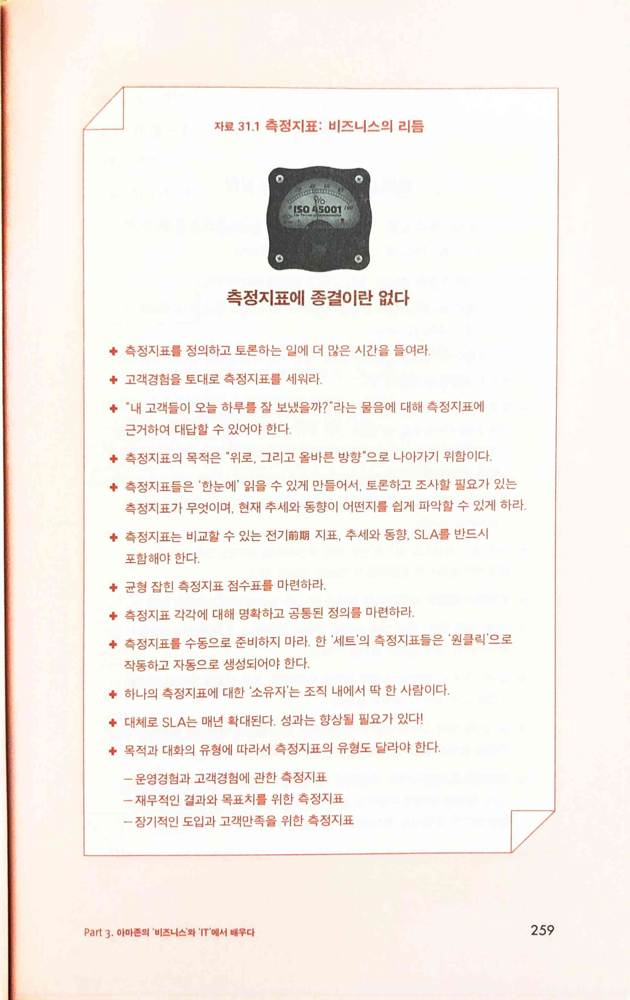

> 자료 31.1 측정지표: 비즈니스의 리듬

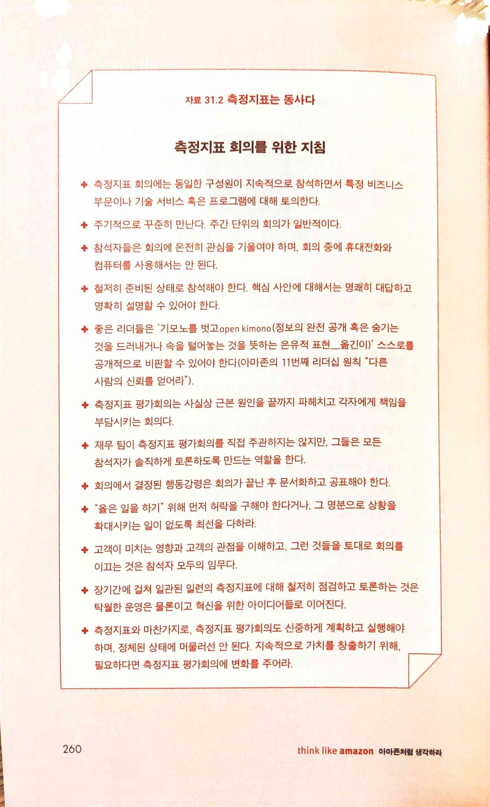

> 자료 31.2 측정지표는 동사다

## 32 프로세스 대 관료주의
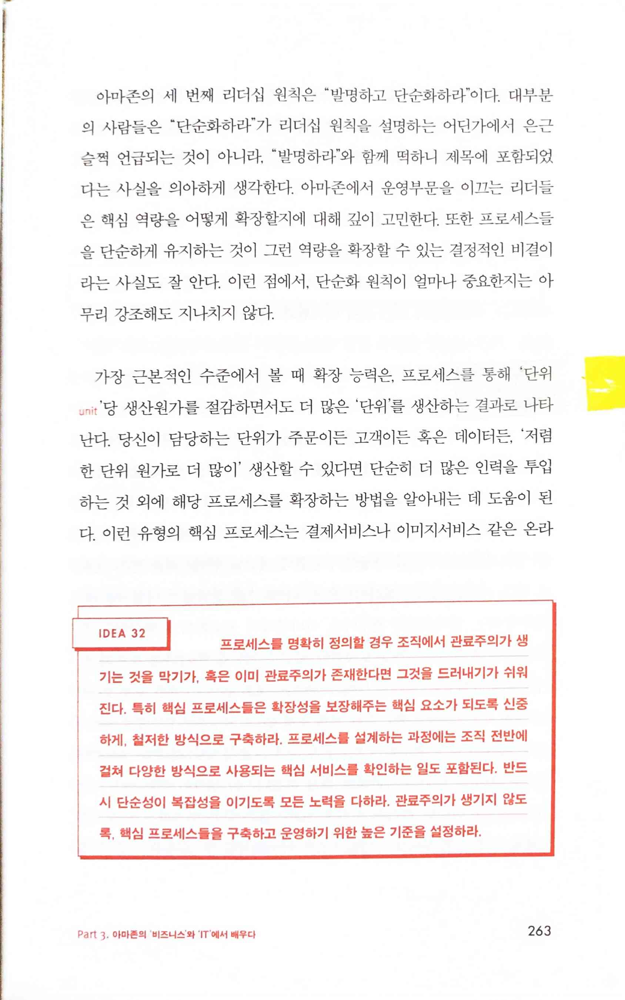

> 가장 근본적인 수준에서 볼 때 확장 능력은 프로세스를 통해 '단위 unit '당 생산원가를 절감하면서도 더 많은 '단위'를 생산하는 결과로 나타난다. 당신이 담당하는 단위가 주문이든 고객이든 혹은 데이터든, '저렴한 단위 원가로 더 많이' 생산할 수 있다면 단순히 더 많은 인력을 투입하는 것 외에 해당 프로세스를 확장하는 방법을 알아내는 데 도움이 된다.

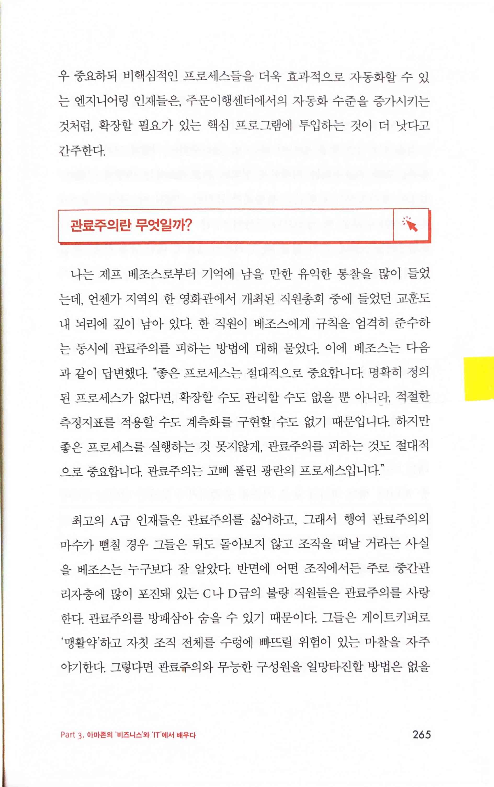

> 한 직원이 베조스에게 규칙을 엄격히 준수하는 동시에 관료주의를 피하는 방법에 대해 물었다. 이에 베조스는 다음과 같이 답변했다. "좋은 프로세스는 절대적으로 중요합니다. 명확히 정의된 프로세스가 없다면, 확장할 수도 관리할 수도 없을 뿐 아니라 적절한 측정지표를 적용할 수도 계측화를 구현할 수도 없기 때문입니다. 하지만 좋은 프로세스를 실행하는 것 못지않게, 관료주의를 피하는 것도 절대적으로 중요합니다. 관료주의는 고삐 풀린 광란의 프로세스입니다."

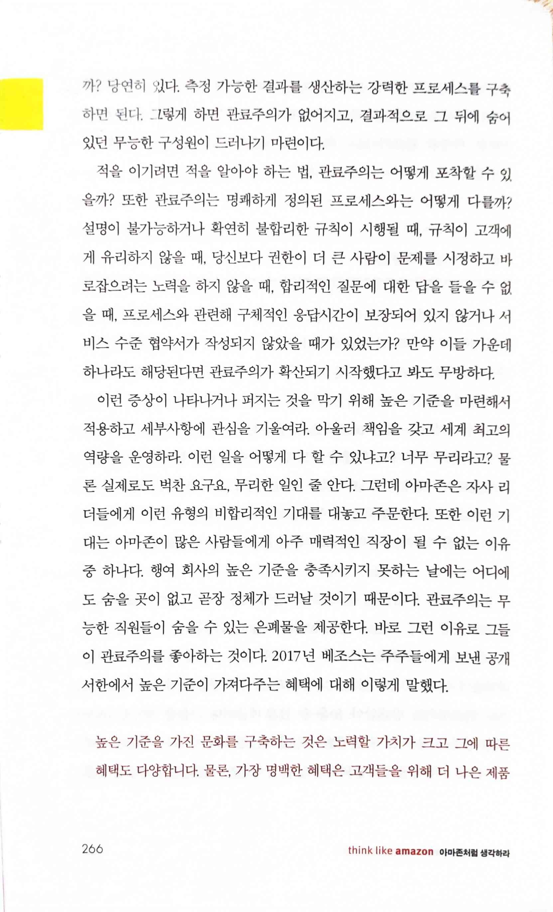

> 그렇다면 관료주의와 무능한 구성원을 일망타진할 방법은 없을까? 당연히 있다. 측정 가능한 결과를 생산하는 강력한 프로세스를 구축하면 된다. 그렇게 하면 관료주의가 없어지고, 결과적으로 그 뒤에 숨어있던 무능한 구성원이 드러나기 마련이다.

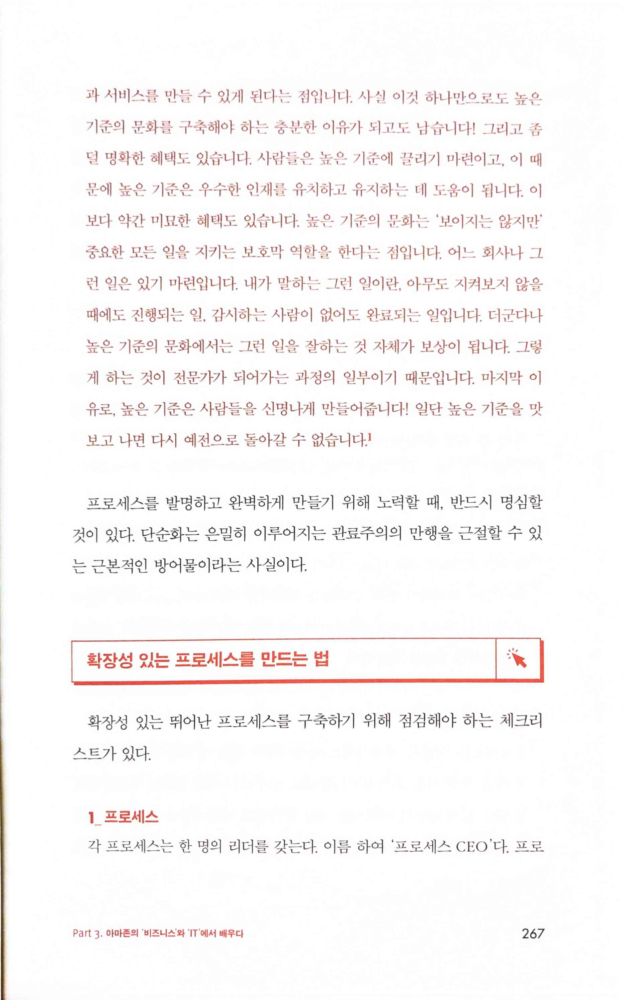

> 프로세스를 발명하고 완벽하게 만들기 위해 노력할 때, 반드시 명심할 것이 있다. 단순화는 은밀히 이루어지는 관료주의의 만행을 근절할 수 있는 근본적인 방어물이라는 사실이다.

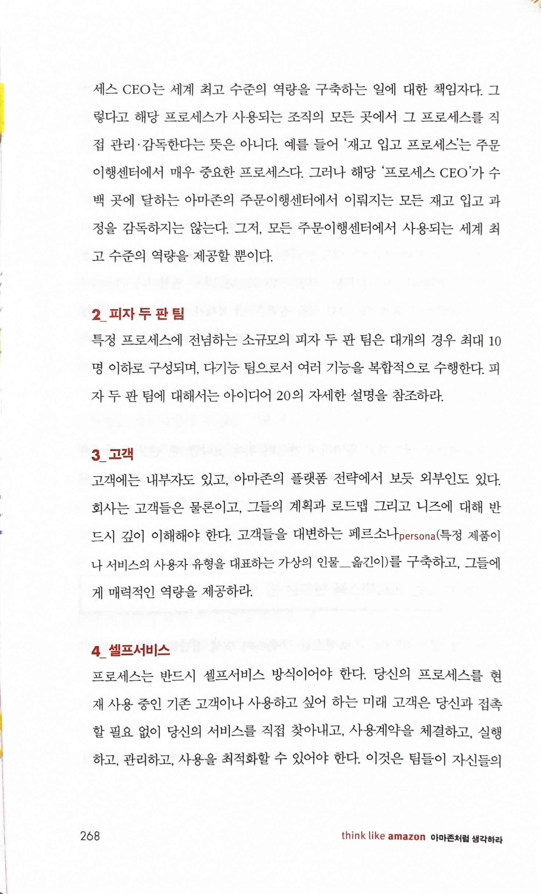 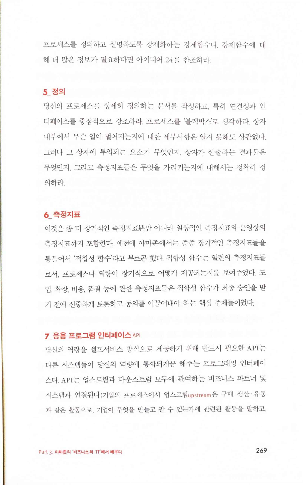 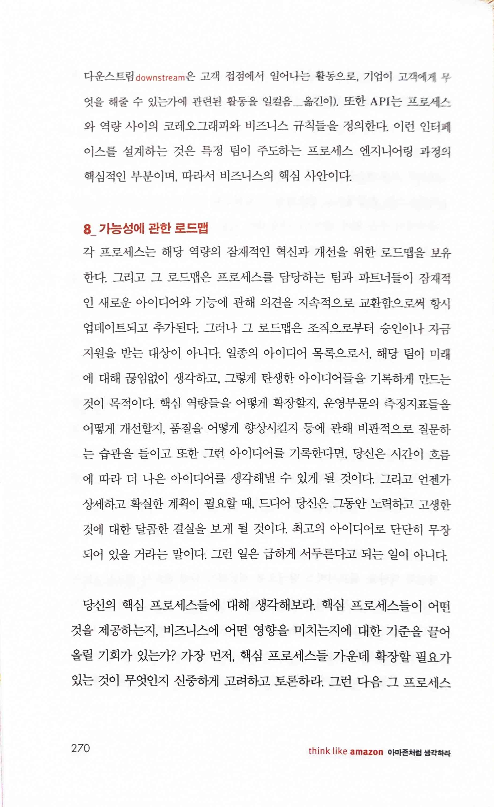

> 확장성 있는 프로세스를 만드는 법
>
> 1 프로세스
>
> 2 피자 두 판팀
>
> 3 고객
>
> 4 셀프서비스
>
> 5 정의
>
> 6 측정지표
>
> 7 응용 프로그램 인터페이스 API
>
> 8 가능성에 관한 로드맵

## 33 수학적으로 설계하라
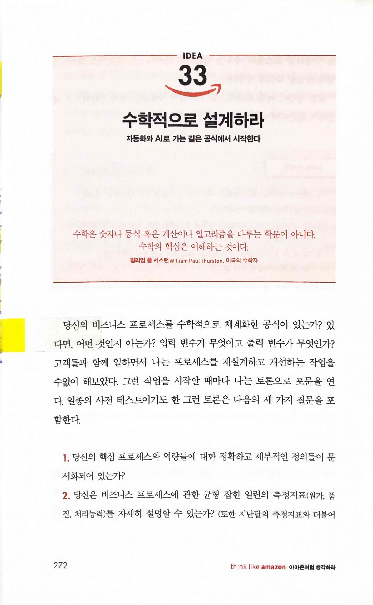

> 당신의 비즈니스 프로세스를 수학적으로 체계화한 공식이 있는가? 있다면, 어떤 것인지 아는가? 입력 변수가 무엇이고 출력 변수가 무엇인가? 

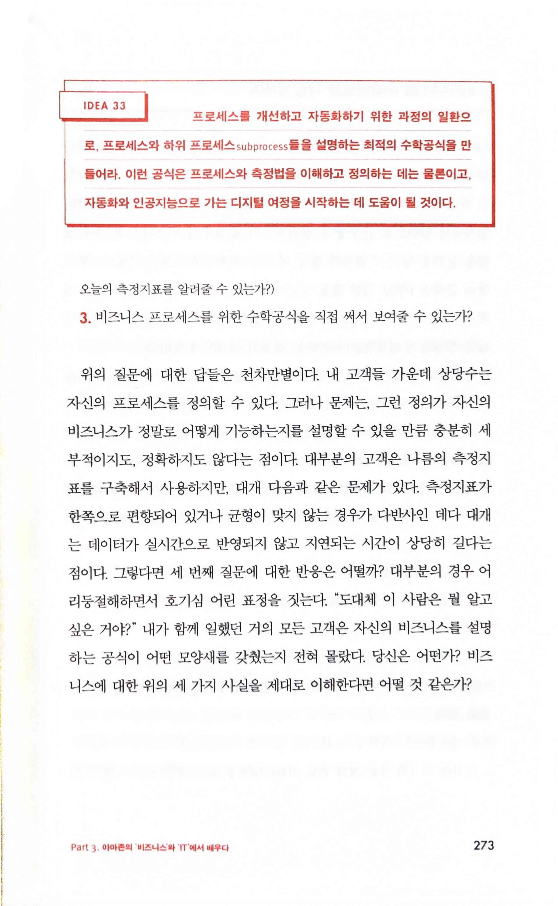

> 내 고객들 가운데 상당수는 자신의 프로세스를 정의할 수 있다. 그러나 문제는 그런 정의가 자신의 비즈니스가 정말로 어떻게 기능하는지를 설명할 수 있을 만큼 충분히 세부적이지도 정확하지도 않다는 점이다.

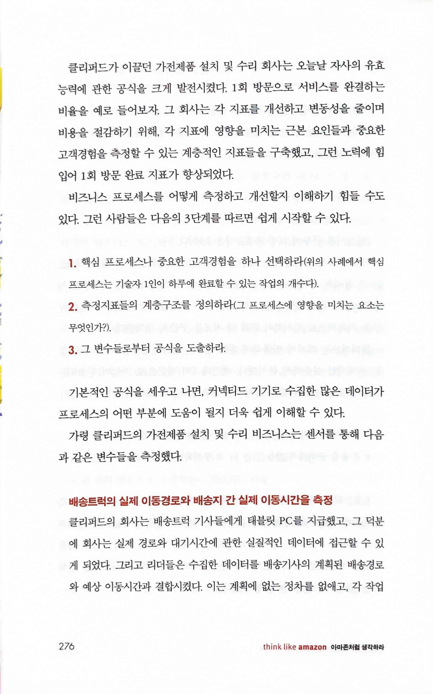  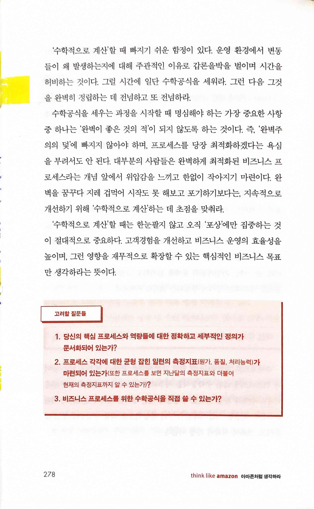

> 핵심 주제와 프로세스에 대한 공식을 세워라
>
> 수학적으로 계산할 때 빠지기 쉬운 함정이 있다. 운영 환경에서 변동들이 왜 발생하는지에 대해 주관적인 이유로 갑론을박을 벌이며 시간을 허비하는 것이다. 그럴 시간에 일단 수학공식을 세워라. 그런 다음 그것을 완벽히 정립하는 데 전념하고 또 전념하라.
>
> '완벽주의의 덫'에 빠지지 않아야 하며, 프로세스를 당장 최적화하겠다는 욕심을 부려서도 안 된다. 대부분의 사람들은 완벽하게 최적화된 비즈니스 프로세스라는 개념 앞에서 위압감을 느끼고 한없이 작아지기 마련이다. 완벽을 꿈꾸다 지레 겁먹어 시작도 못 해보고 포기하기보다는, 지속적으로 개선하기 위해 '수학적으로 계산'하는 데 초점을 맞춰라.

> 34 고객경험이 관건이다
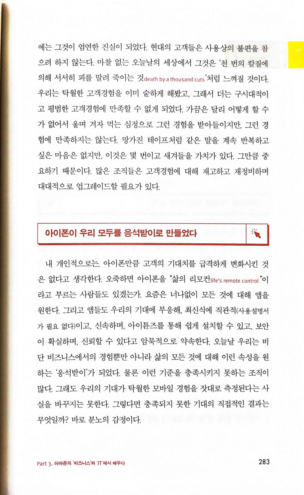

> 현대의 고객들은 사용상의 불편을 참으려 하지 않는다. 마찰 없는 오늘날의 세상에서 그것은 '천 번의 칼질에 의해 서서히 피를 말려 죽이는 것death by a thousand cuts '처럼 느껴질 것이다. 우리는 탁월한 고객경험을 이미 숱하게 해봤고, 그래서 더는 구시대적이고 평범한 고객경험에 만족할 수 없게 되었다. 가끔은 달리 어떻게 할 수가 없어서 울며 겨자 먹는 심정으로 그런 경험을 받아들이지만, 그런 경험에 만족하지는 않는다. 망가진 테이프처럼 같은 말을 계속 반복하고 싶은 마음은 없지만, 이것은 몇 번이고 새겨들을 가치가 있다. 그만큼 중요하기 때문이다. 많은 조직들은 `고객경험`에 대해 재고하고 재정비하며 대대적으로 업그레이드할 필요가 있다.

## 35 당신의 저스트 워크 아웃 기술은 무엇인가?
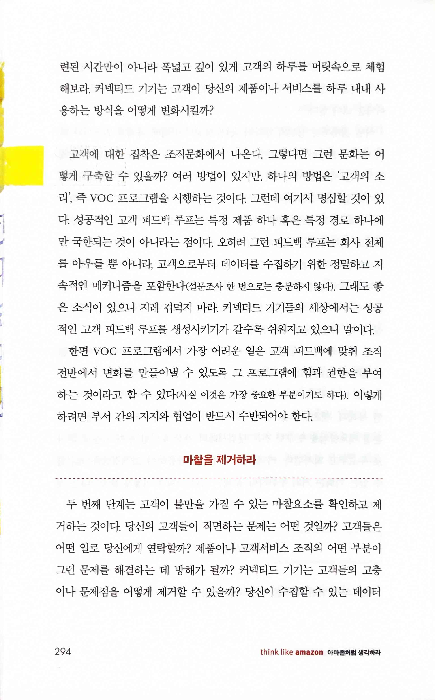

> 고객에 대한 집착은 조직문화에서 나온다.
>
> VOC 프로그램에서 가장 어려운 일은 고객 피드백에 맞춰 조직전반에서 변화를 만들어낼 수 있도록 그 프로그램에 힘과 권한을 부여하는 것이라고 할 수 있다(사실 이것은 가장 중요한 부분이기도 하다). 이렇게하려면 부서 간의 지지와 협업이 반드시 수반되어야 한다.

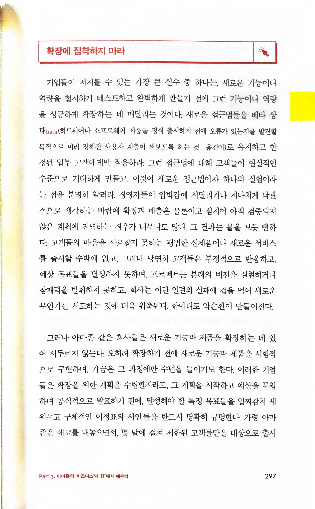

> 기업들이 저지를 수 있는 가장 큰 실수 중 하나는, 새로운 기능이나 역량을 철저하게 테스트하고 완벽하게 만들기 전에 그런 기능이나 역량을 성급하게 확장하는 데 매달리는 것이다.

## 36 모든 정보보안은 뚫릴 수밖에 없다
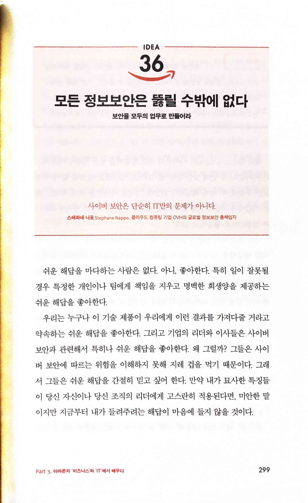

> 보안은 하나의 역할이 아니다. 보안은 위험을 제거하는것도 아니다. 오히려 보안은 요구사항, 인적자원, 프로세스, 모든 팀에 반드시 적용되어야 하는 위험수용 risk acceptance 등을 통합적으로 개발하는 것이다

## 37 OP1 고통스러운 계획수립 과정
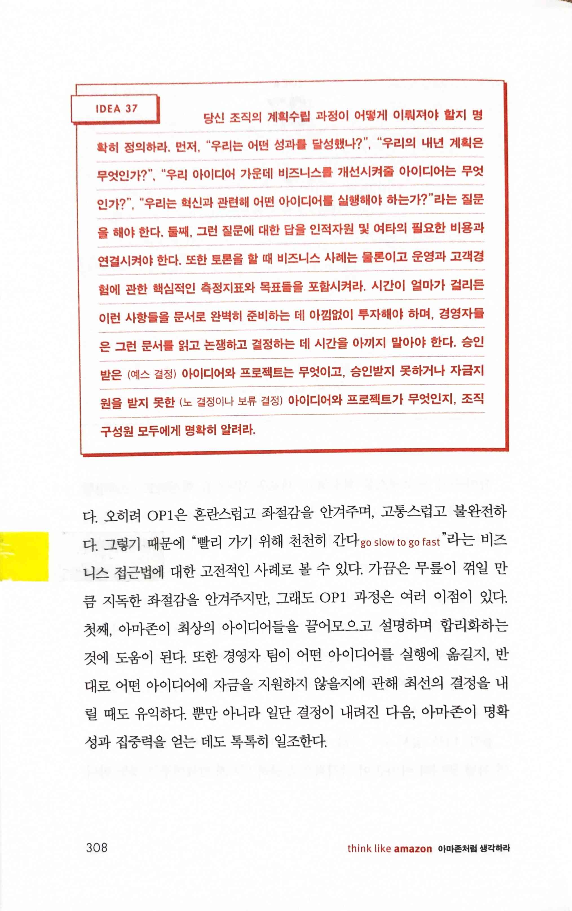

> OP1은 혼란스럽고 좌절감을 안겨주며, 고통스럽고 불완전하다. 그렇기 때문에 "빨리 가기 위해 천천히 간다 go slow to go fast"라는 비즈니스 접근법에 대한 고전적인 사례로 볼 수 있다.

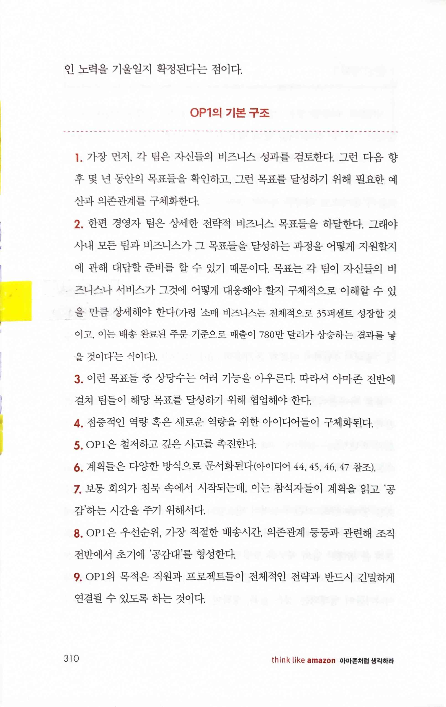

> 목표는 각 팀이 자신들의 비즈니스나 서비스가 그것에 어떻게 대응해야 할지 구체적으로 이해할 수 있을 만큼 상세해야 한다

## 38 전략적인 인력 계획 수립
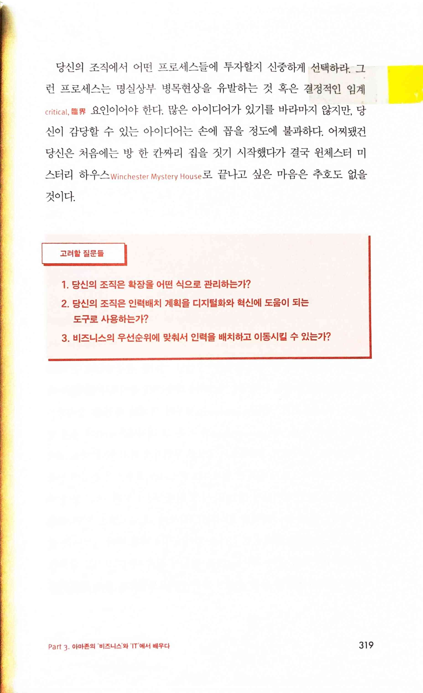

> 당신의 조직에서 어떤 프로세스들에 투자할지 신중하게 선택하라. 그런 프로세스는 명실상부 병목현상을 유발하는 것 혹은 결정적인 임계 critical 요인이어야 한다. 많은 아이디어가 있기를 바라마지 않지만, 당신이 감당할 수 있는 아이디어는 손에 꼽을 정도에 불과하다.

## 39 아키텍처는 비즈니스 전략이다
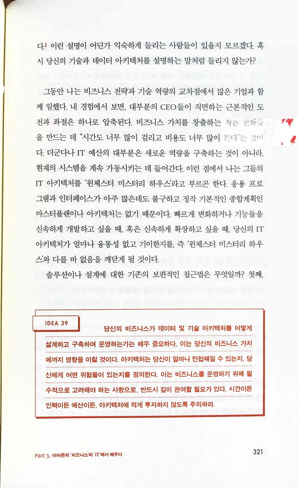

> 대부분의 CEO들이 직면하는 근본적인 도전과 좌절은 하나로 압축된다. 비즈니스 가치를 창출하는 작은 변화들을 만드는 데 "시간도 너무 많이 걸리고 비용도 너무 많이 든다"는 것이다.

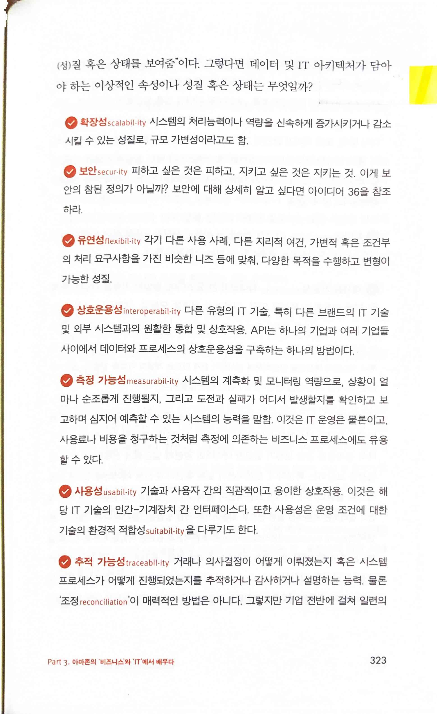 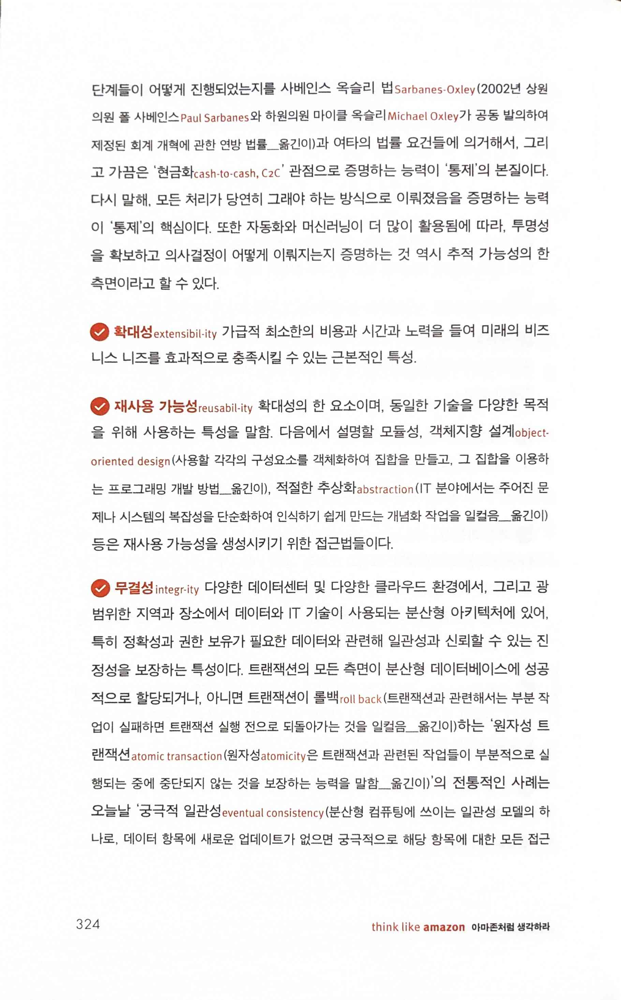 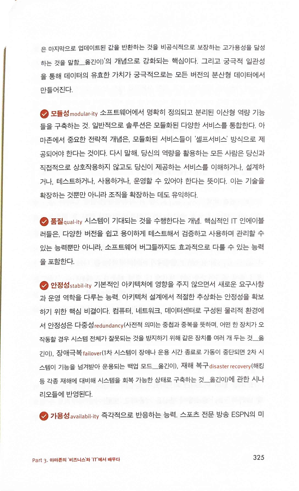

> 데이터 및 IT 아키텍처가 담아야 하는 이상적인 속성이나 성질 혹은 상태는 무엇일까?
>
> ● 확장성 scalabil-ity
>
> ● 보안 secur-ity
>
> ● 유연성 flexibil-ity
>
> ● 상호운용성 interoperabil-ity
>
> ● 측정 가능성 measurabil-ity
>
> ● 사용성 usabil-ity
>
> ● 추적 가능성 traceabil-ity
>
> ● 확대성 extensibil-ity
>
> ● 재사용 가능성reusabil-ity
>
> ● 무결성 integr-ity
>
> ● 모듈성 modular-ity
>
> ● 품질 qual-ity
>
> ● 안정성 stabil-ity
>
> ● 가용성 availabil-ity

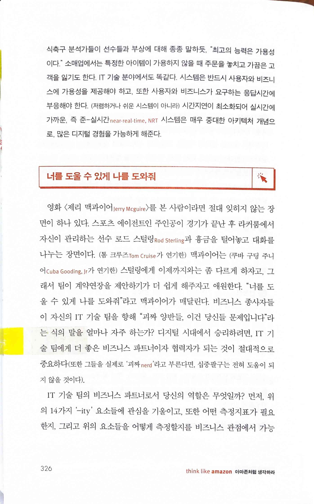

> 디지털 시대에서 승리하려면, IT 기술 팀에게 더 좋은 비즈니스 파트너이자 협력자가 되는 것이 절대적으로 중요하다

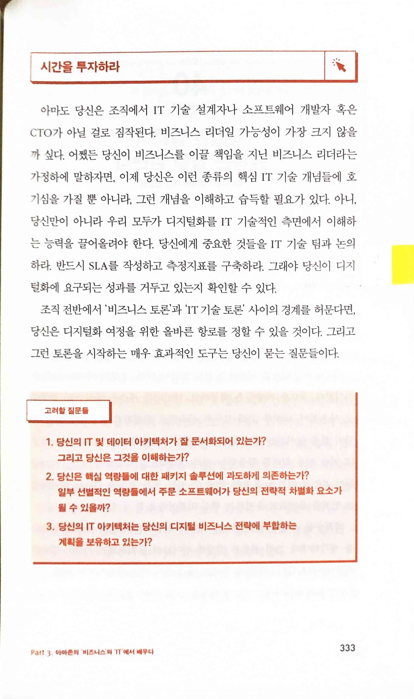

> 우리 모두가 디지털화를 IT 기술적인 측면에서 이해하는 능력을 끌어올려야 한다. 당신에게 중요한 것들을 IT 기술 팀과 논의하라. 반드시 SLA를 작성하고 측정지표를 구축하라. 그래야 당신이 디지털화에 요구되는 성과를 거두고 있는지 확인할 수 있다.

## 40 적절한 질문이 원하는 답을 얻는다
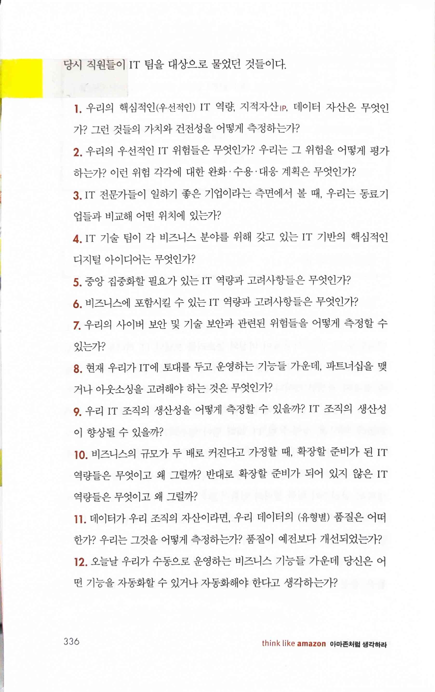 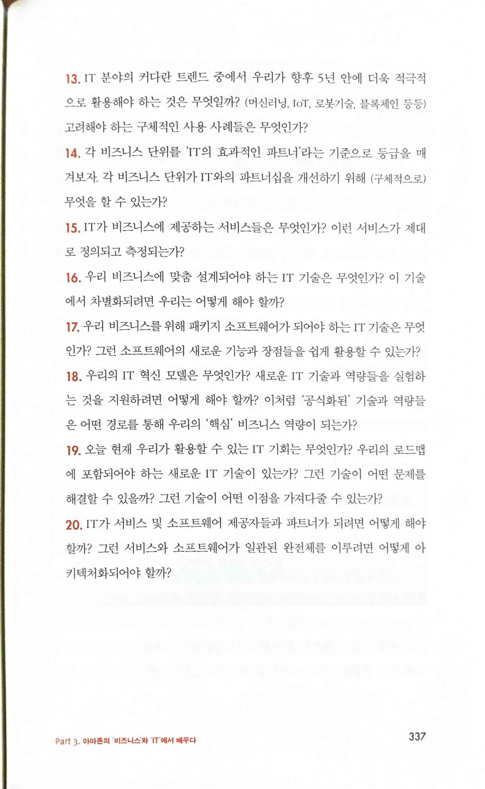

## 41 인공적인 인공지능의 종말
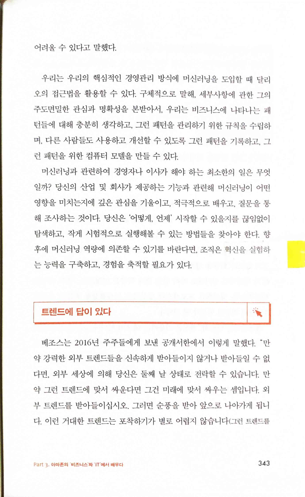

> 향후에 머신러닝 역량에 의존할 수 있기를 바란다면, 조직은 혁신을 실험하는 능력을 구축하고, 경험을 축적할 필요가 있다.

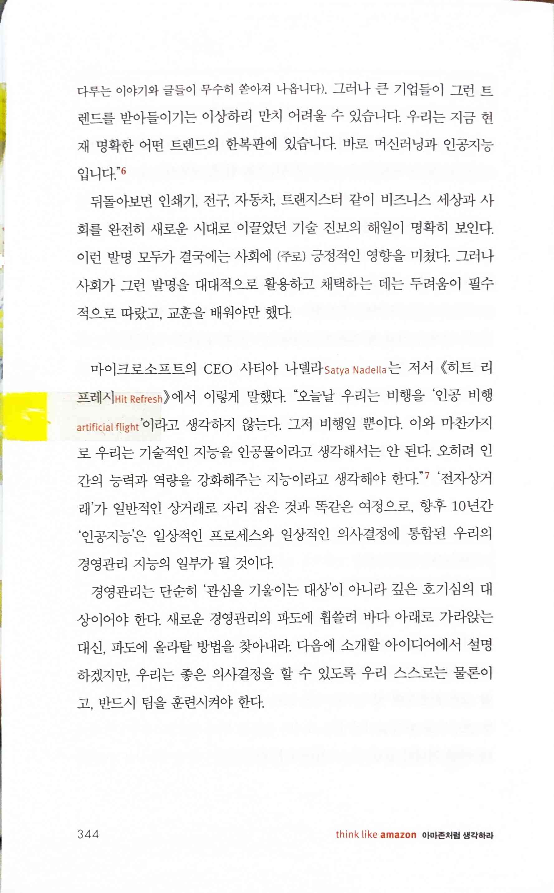

> 마이크로소프트의 CEO 사티아 나델라 Satya Nadella 는 저서 <히트 리프레시 Hit Refresh>에서 이렇게 말했다. “오늘날 우리는 비행을 '인공 비행 artificial flight'이라고 생각하지 않는다. 그저 비행일 뿐이다. 이와 마찬가지로 우리는 기술적인 지능을 인공물이라고 생각해서는 안 된다. 오히려 인간의 능력과 역량을 강화해주는 지능이라고 생각해야 한다."

# Part4 아마존의 '접근법'과 '실행'에서 배우다

## 42 한 방향 문이냐 양방향 문이냐, 그것이 문제다

> 성공한 기업에는 예전에 용감한 결정을 했던 누군가가 꼭 있다. 피터드러커

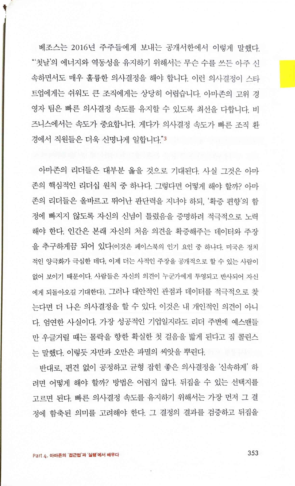

> 베조스는 2016년 주주들에게 보내는 공개서한에서 이렇게 말했다. "첫날의 에너지와 역동성을 유지하기 위해서는 무슨 수를 쓰든 아주 신속하면서도 매우 훌륭한 의사결정을 해야 합니다. 이런 의사결정이 스타트업에게는 쉬워도 큰 조직에게는 상당히 어렵습니다. 아마존의 고위 경영자 팀은 빠른 의사결정 속도를 유지할 수 있도록 최선을 다합니다. 비즈니스에서는 속도가 중요합니다. 게다가 의사결정 속도가 빠른 조직 환경에서 직원들은 더욱 신명나게 일합니다."

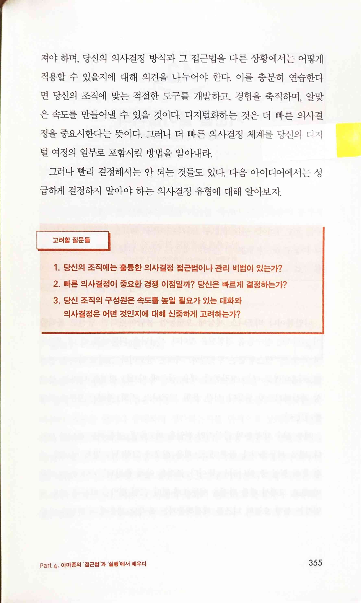

> 디지털화하는 것은 더 빠른 의사결정을 중요시한다는 뜻이다. 그러니 더 빠른 의사결정 체계를 당신의 디지털 여정의 일부로 포함시킬 방법을 알아내라.

## 43 기준을 끌어올려라
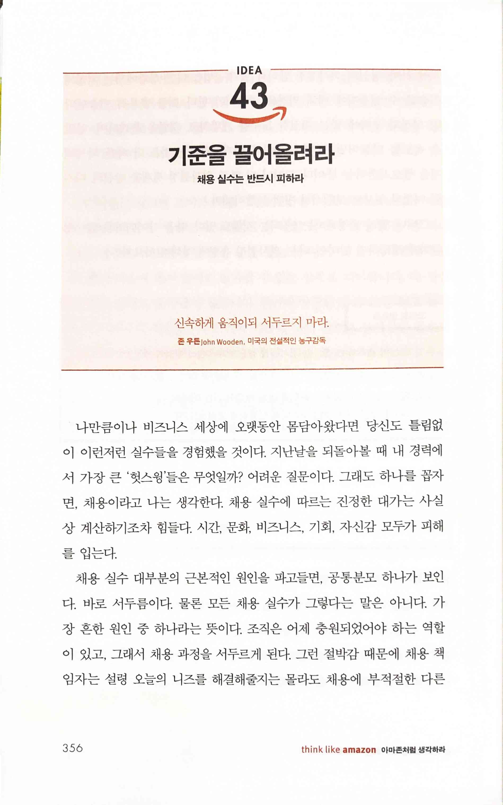

> 채용 실수에 따르는 진정한 대가는 사실상 계산하기조차 힘들다. 시간, 문화, 비즈니스, 기회, 자신감 모두가 피해를 입는다.

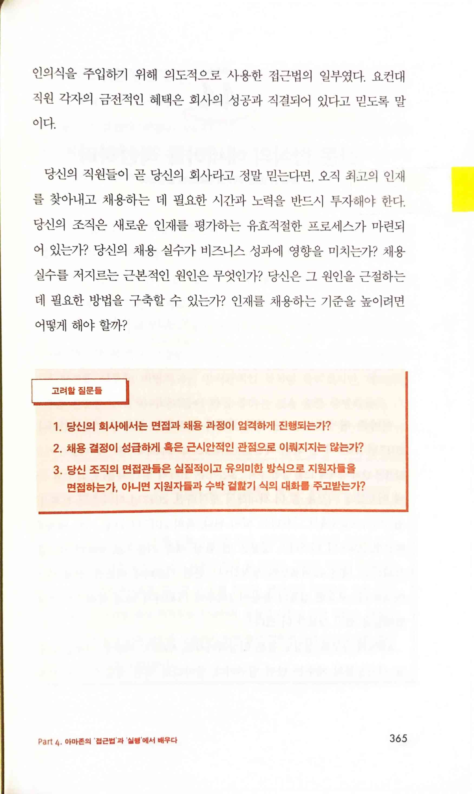

> 당신의 직원들이 곧 당신의 회사라고 정말 믿는다면, 오직 최고의 인재를 찾아내고 채용하는 데 필요한 시간과 노력을 반드시 투자해야 한다.

## 44 산문 형식의 에세이를 작성하라
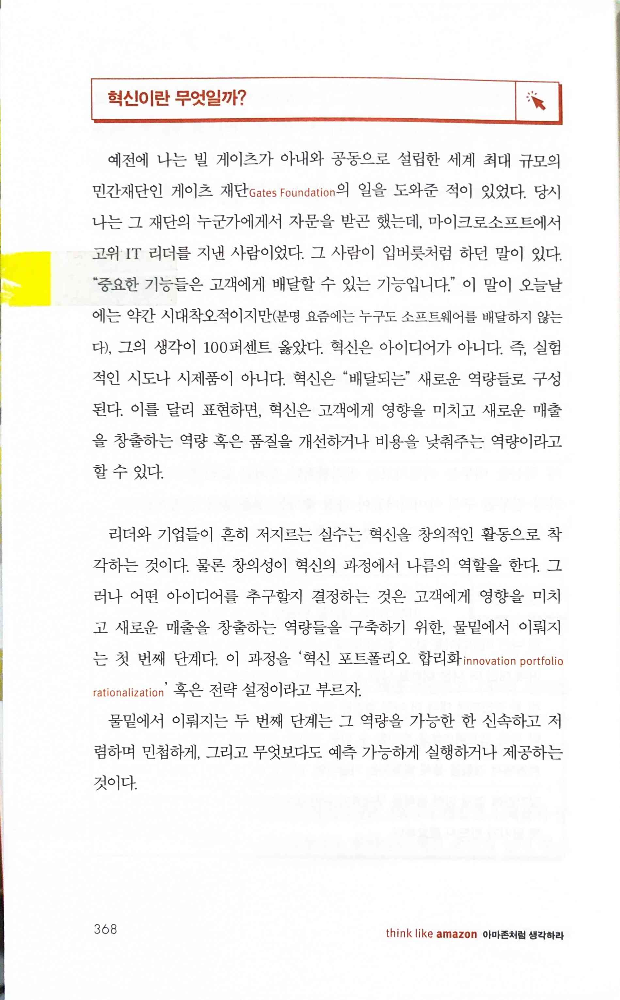

> "중요한 기능들은 고객에게 배달할 수 있는 기능입니다." 이 말이 오늘날에는 약간 시대착오적이지만(분명 요즘에는 누구도 소프트웨어를 배달하지 않는다), 그의 생각이 100퍼센트 옳았다. 혁신은 아이디어가 아니다. 즉, 실험적인 시도나 시제품이 아니다. 혁신은 "배달되는" 새로운 역량들로 구성된다. 이를 달리 표현하면, 혁신은 고객에게 영향을 미치고 새로운 매출을 창출하는 역량 혹은 품질을 개선하거나 비용을 낮춰주는 역량이라고 할 수 있다.

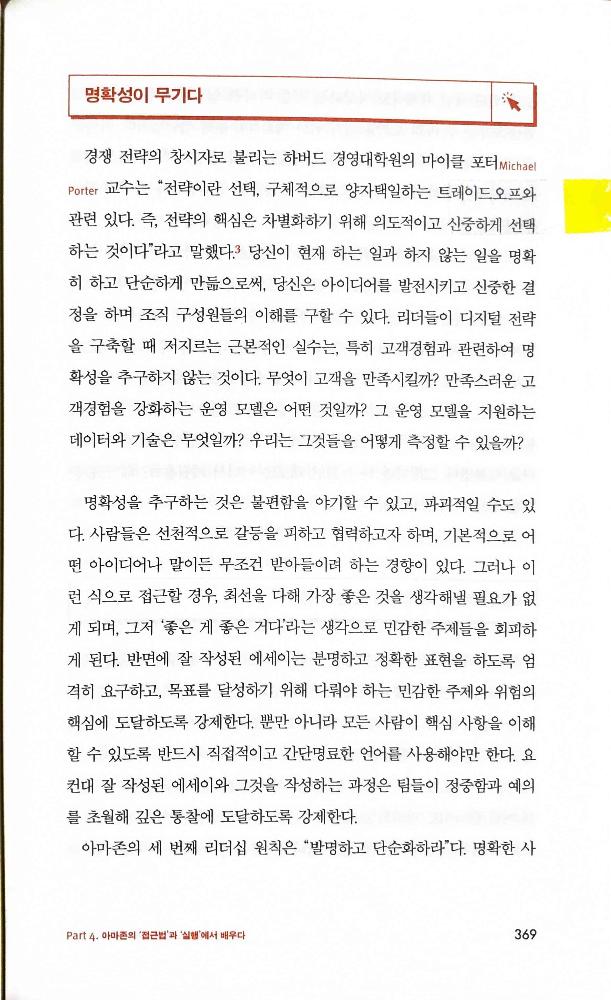

> 경쟁 전략의 창시자로 불리는 하버드 경영대학원의 `마이클 포터 Michael Porter` 교수는 “전략이란 선택, 구체적으로 양자택일하는 트레이드오프와 관련 있다. 즉, 전략의 핵심은 차별화하기 위해 의도적이고 신중하게 선택하는 것이다"라고 말했다. 당신이 현재 하는 일과 하지 않는 일을 명확히 하고 단순하게 만듦으로써, 당신은 아이디어를 발전시키고 신중한 결정을 하며 조직 구성원들의 이해를 구할 수 있다. 리더들이 디지털 전략을 구축할 때 저지르는 근본적인 실수는 특히 고객경험과 관련하여 명확성을 추구하지 않는 것이다. 무엇이 고객을 만족시킬까? 만족스러운 고객경험을 강화하는 운영 모델은 어떤 것일까? 그 운영 모델을 지원하는 데이터와 기술은 무엇일까? 우리는 그것들을 어떻게 측정할 수 있을까?

## 45 미래의 언론 보도자료
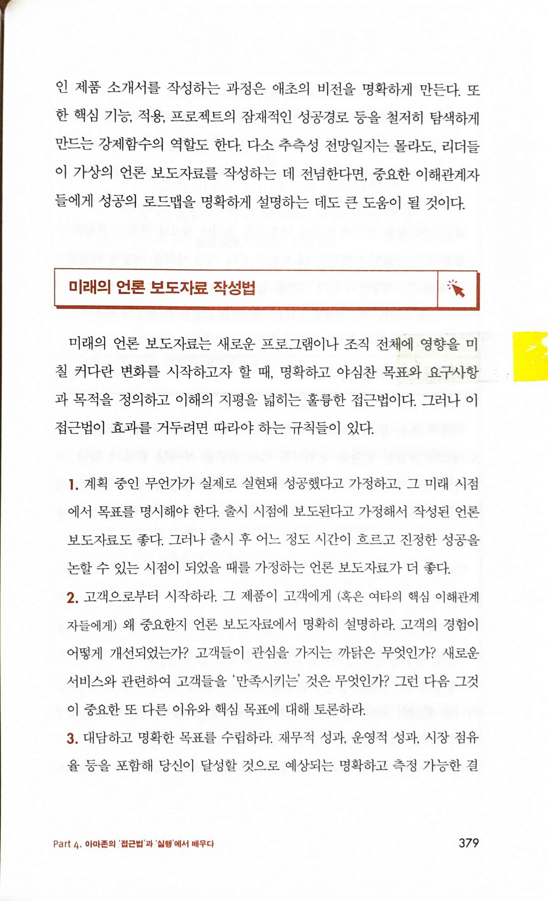 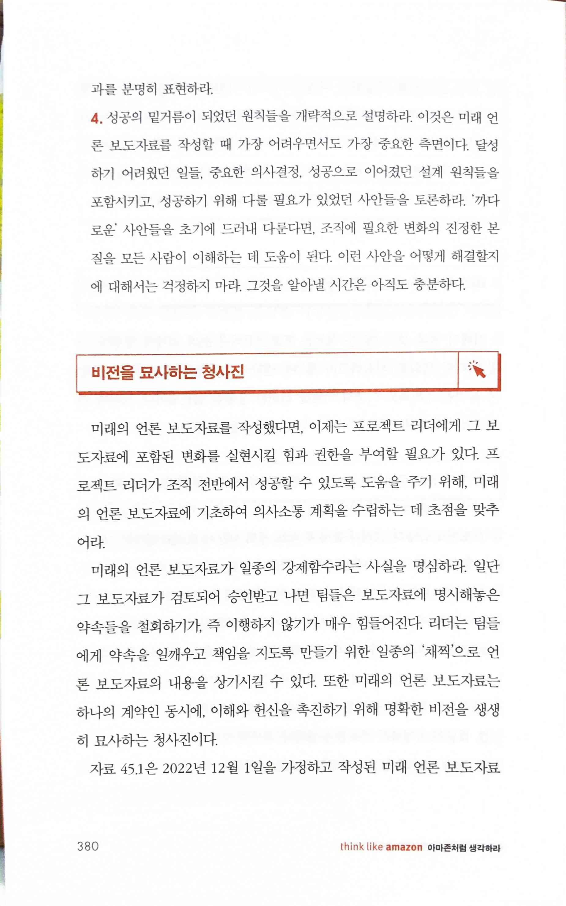

> 미래의 언론 보도자료는 새로운 프로그램이나 조직 전체에 영향을 미칠 커다란 변화를 시작하고자 할 때, 명확하고 야심찬 목표와 요구사항과 목적을 정의하고 이해의 지평을 넓히는 훌륭한 접근법이다. 그러나 이 접근법이 효과를 거두려면 따라야 하는 규칙들이 있다.
>
> 미래의 언론 보도자료가 일종의 강제함수라는 사실을 명심하라.

## 46 FAQ

> 대답이 아닌 질문으로 사람을 판단하라. 볼테르 Voltaire, 프랑스의 계몽주의 작가이자 철학자

## 47 사용설명서를 작성하라
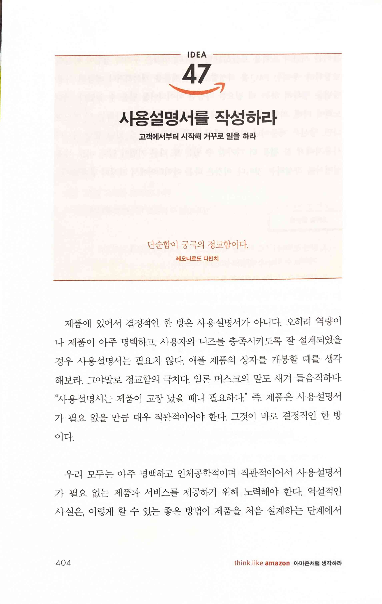

> 단순함이 궁극의 정교함이다. 레오나르도 다빈치
>
> 제품에 있어서 결정적인 한 방은 사용설명서가 아니다. 오히려 역량이나 제품이 아주 명백하고, 사용자의 니즈를 충족시키도록 잘 설계되었을경우 사용설명서는 필요치 않다. 애플 제품의 상자를 개봉할 때를 생각해보라. 그야말로 정교함의 극치다. 일론 머스크의 말도 새겨 들음직하다. "사용설명서는 제품이 고장 났을 때나 필요하다." 즉, 제품은 사용설명서가 필요 없을 만큼 매우 직관적이어야 한다. 그것이 바로 결정적인 한 방이다.

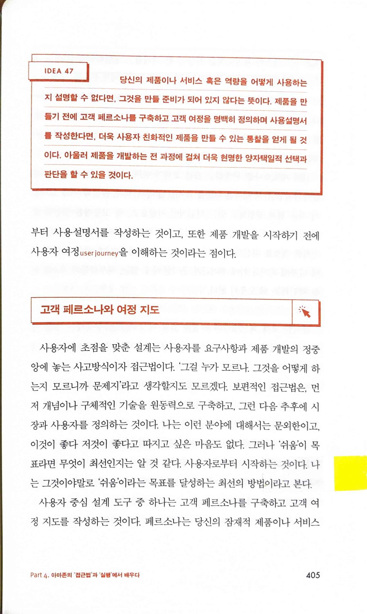

> 쉬움이 목표라면 무엇이 최선인지는 알 것 같다. 사용자로부터 시작하는 것이다. 나는 그것이야말로 '쉬움'이라는 목표를 달성하는 최선의 방법이라고 본다.

> 캘리포니아대학교 로스앤젤레스 캠퍼스 UCLA의 전설적인 농구팀 감독이었던 존 우든의 말을 새겨들어라. "누군가의 인성을 시험하는 진정한 테스트는 아무도 보는 사람이 없을 때 그가 어떻게 행동하는가."

## 48 당신이 먹는 것이 곧 당신 자신이다

## 49 바보들을 위한 금융

## 50 디지털 여정에 마지막 방점을 찍으며
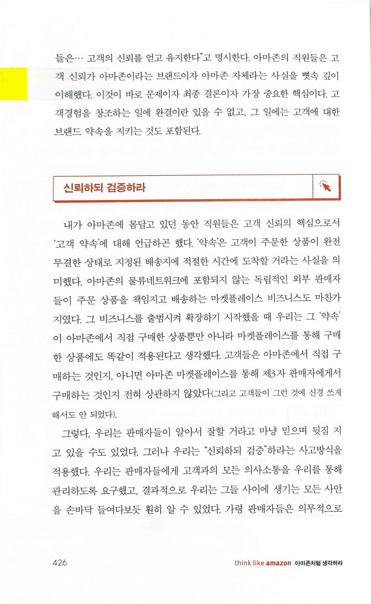

> 아마존의 직원들은 고객 신뢰가 아마존이라는 브랜드이자 아마존 자체라는 사실을 뼛속 깊이 이해했다. 이것이 바로 문제이자 최종 결론이자 가장 중요한 핵심이다. 고객경험을 창조하는 일에 완결이란 있을 수 없고, 그 일에는 고객에 대한 브랜드 약속을 지키는 것도 포함된다.

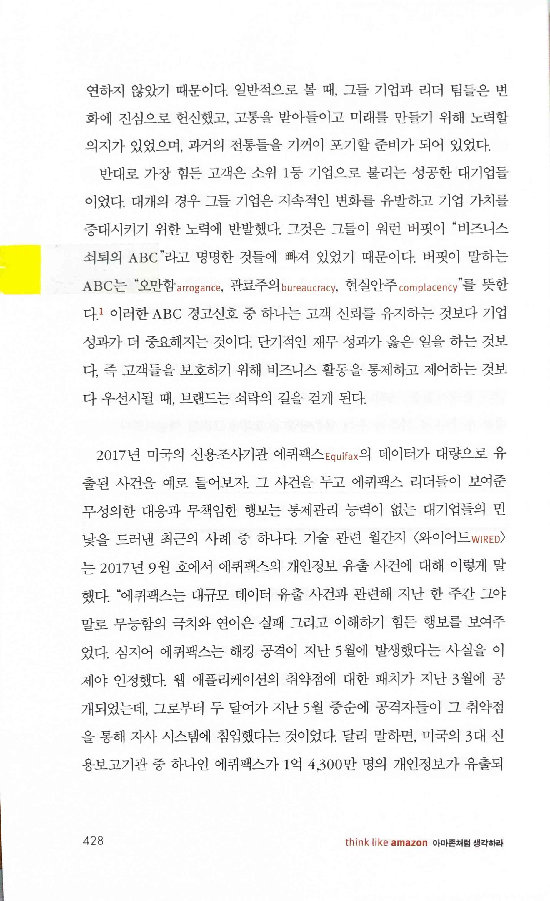

> 워런 버핏 "비즈니스 쇠퇴의 ABC 오만함 arrogance, 관료주의 bureaucracy, 현실안주 complacency"
>
> 이러한 ABC 경고신호 중 하나는 고객 신뢰를 유지하는 것보다 기업성과가 더 중요해지는 것이다. 단기적인 재무 성과가 옳은 일을 하는 것보다, 즉 고객들을 보호하기 위해 비즈니스 활동을 통제하고 제어하는 것보다 우선시될 때, 브랜드는 쇠락의 길을 걷게 된다.

## 50 1/2 원칙은 결코 포스터가 아니다

> 새로운 습관을 형성하는 것은 당연히 어렵다. 그러나 그것만 어려운 것은 아니다. 오래된 습관을 버리는 것도 어렵다.
>
> 이 책에서 소개하는 아마존의 아이디어 중 상당수는 `개인적인 헌신`을 요구한다. 당신은 최고제품책임자가 되어야 하고, 적절한 측정지표들을 구축하는 데 시간을 들일 필요가 있으며, 산문 형식의 에세이를 작성하고 다듬는 데에도 시간과 노력을 투자해야 한다. 당신은 이런 일들에 헌신할 것인가? 이런 식의 변화를 촉진하는 가장 좋은 촉매제는 당신과 당신의 직속 리더 팀을 아우르는 집단의 습관에 초점을 맞추는 것이다. 최소한 1년은 그런 습관에 헌신하라. 그리고 어떤 변화가 생기고 무엇이 당신에게 효과적인지 직접 확인해보라.
